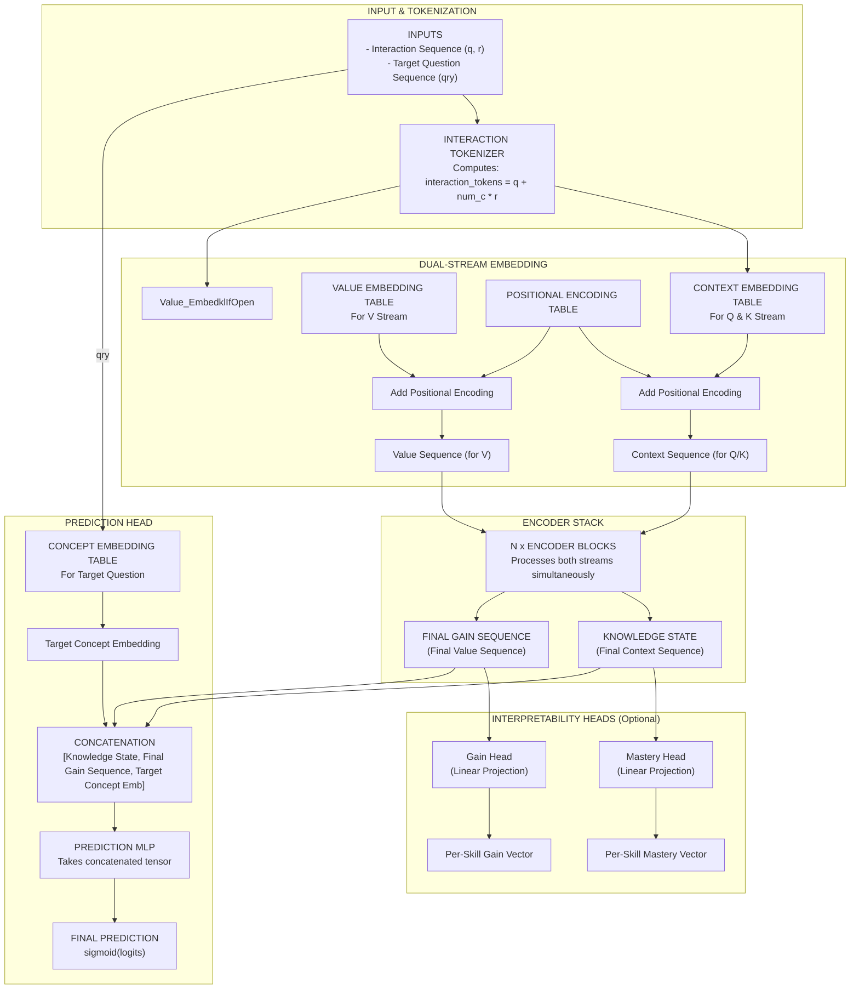

# GainAKT2 Model Architecture

This document provides a detailed explanation of the GainAKT2 model architecture, as implemented in `pykt/models/gainakt2.py`.

## 1. Overview

GainAKT2 is a Transformer-based model for Knowledge Tracing (KT). Its key innovation is a **two-stream architecture** that separates the processing of context information from value (or "gain") information within the self-attention mechanism.

-   **Context Stream**: Represents the sequence of historical student-item interactions. This stream is used to generate the **Query (Q)** and **Key (K)** vectors in the attention mechanism. It answers the question: "Given the current context, which past interactions are most relevant?"
-   **Value Stream**: Represents the learning gain associated with each interaction. This stream is used to generate the **Value (V)** vector. It answers the question: "What knowledge was gained from those past interactions?"

By decoupling these streams, the model aims to more effectively attribute learning gains and track the evolution of a student's knowledge state.

## 2. Model Components and Data Flow

The model consists of three main stages: Embedding, Encoding, and Prediction.

### 2.1. Inputs and Outputs

#### Inputs:

-   `q` (torch.Tensor): A tensor of question/concept IDs for each interaction in the sequence.
    -   **Shape**: `[batch_size, seq_len]`
-   `r` (torch.Tensor): A tensor of student responses (0 for incorrect, 1 for correct) corresponding to the `q` tensor.
    -   **Shape**: `[batch_size, seq_len]`
-   `qry` (torch.Tensor, optional): A tensor of target question IDs for which to make predictions. If not provided, `q` is used as the target.
    -   **Shape**: `[batch_size, seq_len]`

#### Outputs:

-   `predictions` (torch.Tensor): The model's predicted probability that the student will answer each question in the target sequence correctly.
    -   **Shape**: `[batch_size, seq_len]`

### 2.2. Embedding Stage

1.  **Interaction Tokens**: The input `q` and `r` tensors are combined into a single `interaction_tokens` tensor. This is a common technique to create a unique identifier for each interaction (e.g., question 5 answered correctly is different from question 5 answered incorrectly).
    -   **Shape**: `[batch_size, seq_len]`

2.  **Dual-Stream Embeddings**: The `interaction_tokens` are fed into two separate embedding layers:
    -   `context_embedding`: Generates the initial `context_sequence`.
    -   `value_embedding`: Generates the initial `value_sequence`.
    -   **Shape (both)**: `[batch_size, seq_len, d_model]`

3.  **Positional Embedding**: A standard positional encoding is added to both the `context_sequence` and `value_sequence` to provide the model with information about the order of interactions.

### 2.3. Encoder Stage

The core of the model is a stack of `N` identical `EncoderBlock` layers. Each block processes both the context and value sequences.

#### EncoderBlock

An `EncoderBlock` contains two sub-layers: a `MultiHeadAttention` mechanism and a position-wise Feed-Forward Network (FFN).

1.  **Two-Stream Multi-Head Attention**:
    -   Receives the `context_sequence` and `value_sequence` from the previous layer.
    -   **Query (Q)** and **Key (K)** vectors are derived from the `context_sequence`.
    -   **Value (V)** vectors are derived from the `value_sequence`.
    -   The attention output is computed using scaled dot-product attention: `Attention(Q, K, V) = softmax(Q * K^T / sqrt(d_k)) * V`.
    -   The output of this sub-layer has a shape of `[batch_size, seq_len, d_model]`.

2.  **Residual Connections & Updates**:
    -   The attention output is used to update **both** streams via residual connections and layer normalization.
    -   The updated `context_sequence` is then passed through the FFN.
    -   A second residual connection is applied after the FFN to produce the final `context_sequence` for the block.
    -   The block outputs the updated `context_sequence` and `value_sequence`.

### 2.4. Prediction Stage

1.  **Target Concept Embedding**: The target question IDs (`qry` or `q`) are passed through a `concept_embedding` layer to get a representation of the specific concepts being tested.
    -   **Shape**: `[batch_size, seq_len, d_model]`

2.  **Concatenation**: The final `context_sequence` and `value_sequence` from the encoder stack are concatenated with the `target_concept_embedding` along the last dimension.
    -   **Shape**: `[batch_size, seq_len, d_model * 3]`

3.  **Prediction Head**: The concatenated tensor is fed into a simple Multi-Layer Perceptron (MLP), which reduces the dimensionality down to a single logit for each position in the sequence.

4.  **Final Prediction**: A sigmoid activation function is applied to the logits to produce the final correctness probabilities, which range from 0 to 1.

