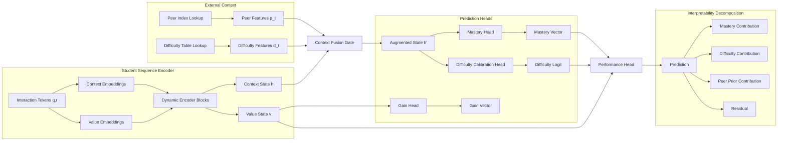
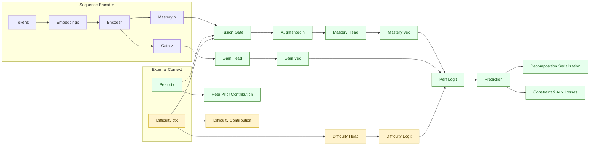

# GainAKT3 Architecture: Leveraging Peer Similarity and Historical Difficulty for Enhanced Semantic Interpretability

**Copyright (c) 2025 Concha Labra. All Rights Reserved.**

## 1. Motivation and Gap Analysis
Previous semantic interpretability enhancements (branch `v0.0.8-gainakt2-semantic`) focused on internal constraints (monotonicity, non‑negative gains, sparsity, performance correlations) but did **not** exploit two external, high‑signal information sources:
1. **Peer Response Patterns**: How other students with similar historical knowledge trajectories answered the same item.
2. **Dynamic Skill / Item Difficulty**: Time‑ and cohort‑conditioned difficulty estimates derived from aggregate historical interactions.

Limitations of current `GainAKT2`/`newmodel.md` design:
 
 - Purely single‑student sequence modeling; ignores cross‑student statistical regularities and cohort evolution.
- Item and skill difficulty treated implicitly via embeddings; no explicit calibration channel or temporal difficulty drift modeling.
- Learning gains derived from attention over a student's own past only; no peer‑informative prior for expected gain magnitude.

`GainAKT3` introduces structured external context streams (Peer Similarity Context and Difficulty Context) to enrich gain attribution and mastery estimation while preserving Transformer efficiency and reproducibility standards.

## 2. High‑Level Architectural Additions
We augment the dynamic value stream encoder with two orthogonal, pluggable modules:
 - **Peer Similarity Module (PSM)**: Retrieves or approximates a set of peer summary vectors for the current item/skill conditioned on student state similarity.
- **Historical Difficulty Module (HDM)**: Provides calibrated difficulty embeddings (item‑level d_item_t, skill‑level d_skill_t) with temporal drift capture and uncertainty quantification.

Both modules feed lightweight conditioning vectors into attention and projection heads, enabling:
 
 - Context‑adaptive learning gain scaling (anticipated difficulty × peer correctness distribution).
- Improved interpretability: explicit decomposition of predicted performance into (mastery, difficulty, peer_prior, residual).

## 3. Data Structures and Precomputation
To maintain runtime efficiency and reproducibility, heavy aggregation is precomputed offline and versioned.

### 3.1 Peer Response Index
Stored under `data/peer_index/<dataset>/peer_index.pkl`:
 - For each (item_id) and optionally (skill_id):
  - `peer_correct_rate`: float in [0,1]
  - `peer_attempt_count`: int
  - `skill_local_transfer_vector`: average projected gains for peers after item attempt (vector length = num_skills)
  - `peer_state_cluster_centroids`: K centroids in latent mastery space (K configurable, e.g. 8)
  - Timestamp buckets for temporal drift (weekly or monthly)

### 3.2 Difficulty History Table
Stored under `data/difficulty/<dataset>/difficulty_table.parquet`:
 - Rows: (time_bucket, item_id, skill_id)
- Columns:
  - `difficulty_logit`: model‑agnostic estimate (e.g. Rasch difficulty or logistic calibration)
  - `attempt_count`, `correct_rate`
  - `moving_variance`
  - `stability_score` (1 − normalized variance over last N buckets)
  - Optional: `difficulty_confidence_interval_low/high`

### 3.3 Versioning & Hashing
Each artifact accompanied by `METADATA.json` with:
```json
{
  "source": "assist2015",
  "generated_at": "2025-10-27T18:42:00Z",
  "generator_commit": "<hash>",
  "parameters": {"K": 8, "time_bucket": "week"},
  "sha256": "..."
}
```
Training scripts will log these hashes into `config.json` to preserve reproducibility.

## 4. Core Architectural Flow (Conceptual)



### 4.1 Implementation Status Diagram (Phase 2b Snapshot)
The diagram below (updated 2025-10-28, Phase 2b) reflects activation of residual fusion, decomposition serialization, and newly added auxiliary losses (peer alignment, difficulty ordering, drift smoothness). Difficulty context remains partial (drift uncertainty features pending); peer context retrieval implemented with confidence scaling. 



Legend:
- Implemented: operational and integrated into training.
- Partial: scaffolding or limited functionality present (metrics or basic head without full feature set).
- Inactive: conceptual only; not yet in code.

Planned order of activation: (1) Peer feature retrieval, (2) true fusion of peer/difficulty vectors, (3) full difficulty drift & stability features, (4) decomposition serialization.


## 5. Detailed Module Specifications
### 5.1 Peer Similarity Module (PSM)
**Inputs**: current item_id, skill_id(s), current mastery embedding h_t.

**Retrieval Strategy** (configurable):
1. Centroid Cosine Match: select top‑K peer_state_cluster_centroids maximizing cos(h_t, c_k).
2. Weighted Aggregate Peer Vector:
   \( p_t = \sum_{k=1}^K w_k c_k \), \( w_k = \text{softmax}(\gamma \cdot \text{cos}(h_t, c_k)) \)
3. Peer Correctness Scalar: peer_correct_rate[item_id] (optionally time‑bucketed) transformed to embedding via learned MLP.
4. Transfer Embedding: project skill_local_transfer_vector[item_id] through linear layer to dimension d_model.

**Output**: Peer context vector p_t ∈ R^{d_model} plus scalar meta‑features (attempt_count, stability_score) optionally appended.

**Interpretability Hooks**:
 - Log selected centroid IDs & weights.
- Store peer_correct_rate and attempt_count used.

### 5.2 Historical Difficulty Module (HDM)
**Inputs**: item_id, skill_id(s), time_index (epoch, absolute timestamp).

**Difficulty Feature Construction**:
1. Base difficulty embedding: map difficulty_logit via learned projection (scalar → R^{d_model}).
2. Drift vector: difference between current bucket logit and moving average last N buckets.
3. Stability scalar: stability_score → gating coefficient.
4. Confidence interval range width → uncertainty scalar.

**Output**: Difficulty context vector d_t ∈ R^{d_model} + scalars (stability, uncertainty).

**Interpretability Hooks**:
 - Log raw difficulty_logit, drift, stability_score, uncertainty per batch.

### 5.3 Context Fusion Gate
We fuse h_t (student intrinsic state), p_t (peer context), d_t (difficulty context):

\[
\tilde{h}_t = h_t + g_p \odot p_t + g_d \odot d_t
\]
Where gates:
\[
[g_p, g_d] = \sigma( W_g [h_t; p_t; d_t] + b_g )
\]
Alternative residual mixture: use LayerNorm after fusion. Provide ablation hooks to disable each gate independently (`--disable_peer`, `--disable_difficulty`).

### 5.4 Difficulty Calibration Head
Predicts calibrated difficulty logit \( \hat{d}_{item} \) used to decompose final prediction:
\[
P(R_t=1) = \sigma( W [\tilde{h}_t; v_t] + b - \beta \hat{d}_{item} )
\]
Where \( \beta \) is a learnable scaling or fixed hyperparameter. This allows explicit subtraction of difficulty: improves explainability (higher mastery must overcome higher difficulty).

### 5.5 Performance Decomposition
After computing logits \( z_t \):
 - Mastery contribution: gradient * (components of \tilde{h}_t).
- Difficulty contribution: \( \beta \hat{d}_{item} \).
- Peer prior contribution: difference when zeroing p_t gate.
- Residual: remainder after removing other contributions.
All stored per epoch in interpretability artifacts.

## 6. Loss Extensions
We integrate new auxiliary objectives supporting the added modules:
1. **Peer Alignment Loss**: Encourage projected mastery to align with peer correctness distribution.
  \( L_{peer} = \text{MSE}( \text{mean}(mastery_{skills}) , peer\_correct\_rate ) \)
2. **Difficulty Ordering Loss**: Pairwise ranking over items: if difficulty_logit_i > difficulty_logit_j then predicted mastery‑adjusted success probability should reflect ordering.
3. **Drift Smoothness Loss**: Penalize excessive volatility in predicted \( \hat{d}_{item} \) over consecutive time buckets: \( L_{drift} = \sum_t |\hat{d}_{t} - 2\hat{d}_{t-1} + \hat{d}_{t-2}| \).
4. **Peer Gate Sparsity**: Encourage selective peer influence: \( L_{gate} = ||g_p||_1 \) (option to reverse sign depending on scaling).
5. **Decomposition Consistency**: Reconstructed probability from components must approximate original prediction: enforce \( L_{decomp} = \text{MSE}( \sigma(z_t), \sigma(z^{recon}_t)) \).

Total extended loss:
\[
L = L_{perf} + L_{existing\_aux} + \lambda_{peer} L_{peer} + \lambda_{diff} L_{difficulty} + \lambda_{drift} L_{drift} + \lambda_{gate} L_{gate} + \lambda_{decomp} L_{decomp}
\]

## 7. Training & Reproducibility Integration
Add new CLI flags to the training script (`examples/train_gainakt3.py`):
 - `--use_peer_context`, `--use_difficulty_context`
- `--peer_K`, `--peer_similarity_gamma`
- `--difficulty_time_bucket` (week|month)
- `--difficulty_drift_window`
- `--lambda_peer`, `--lambda_diff`, `--lambda_drift`, `--lambda_gate`, `--lambda_decomp`
- Hash artifacts: compute SHA256 of peer index and difficulty table → store under `config.json.hardware.artifacts`.
Abort run if artifact hash mismatch and `--strict_artifact_hash` enabled.

## 8. Interpretability Metrics (Extended)
Add per‑epoch logging:
 - `peer_influence_share`: proportion of logit attributable to peer context (via gating analysis).
- `difficulty_adjustment_magnitude`: mean \( \beta \hat{d}_{item} \).
- `mastery_adjusted_accuracy`: accuracy after subtracting difficulty penalty.
- `peer_alignment_error`: current epoch value of L_peer (raw, not weighted).
- `difficulty_rank_accuracy`: proportion of sampled item pairs where predicted ordering matches difficulty ordering.
- `gate_sparsity`: mean |g_p|.
- `decomposition_reconstruction_error`: L_decomp.

## 9. Edge Cases & Robustness Considerations
 - Cold Start Items: Fallback to global average difficulty & peer stats; log `cold_start_flag`.
- Sparse Peer Data: If attempt_count < threshold, reduce g_p via confidence‑based scaling.
- Temporal Drift Spikes: Cap drift magnitude by percentile clipping to prevent destabilizing updates.
- Multi‑Skill Items: Aggregate per‑skill difficulty by mean or weighted by historical attempt density.
- Large num_skills: Use low‑rank adapters for projection heads to keep parameter growth controlled.

## 10. Computational Complexity Impact
 - Peer/Difficulty lookups: O(1) per interaction with hash maps (preloaded in RAM); negligible vs O(L^2 H D) attention.
- Additional heads/gates: O(L D) linear projections.
- Loss additions: Minor overhead for pairwise difficulty ranking (sampled pairs, not full cartesian: O(B * P) with P small, e.g. 64).

## 11. Incremental Implementation Plan
Phase 1 (Scaffolding): Data loaders for peer/difficulty artifacts; gating fusion; logging metrics.
Phase 2 (Heads & Losses): Difficulty calibration head, peer alignment, decomposition consistency.
Phase 3 (Ranking & Drift): Difficulty ordering loss, drift smoothness, robust clipping.
Phase 4 (Ablations & Validation): Systematic on/off toggling; compare AUC, interpretability metrics vs GainAKT2.
Phase 5 (Optimization): Low‑rank gating, memory footprint profiling, seed reproducibility validation.

## 12. Experiment Design & Reporting
Each experiment folder must record artifact hashes and gating configuration. Comparative tables will include:
 - Base (GainAKT2) vs GainAKT3 (+peer, +difficulty, +both)
- Metrics: AUC, mastery_perf_corr, gain_perf_corr, peer_alignment_error, difficulty_rank_accuracy, decomposition_reconstruction_error.
Interpretability improvement claim centered on reduced peer_alignment_error and meaningful difficulty contribution variance.

## 13. Expected Benefits
 - Higher semantic alignment: mastery estimates contextualized by cohort performance and calibrated difficulty.
- Better early prediction on sparse student sequences via peer priors.
- Transparent decomposition: educators see if errors arise from high difficulty rather than low mastery.
- Enhanced gain estimation stability (peer‑regularized expected magnitude).

## 14. Risk & Mitigation
| Risk | Symptom | Mitigation |
|------|---------|------------|
| Peer leakage / label proxy | Overreliance on peer correctness inflates AUC artificially | Gate regularization + monitor peer_influence_share ceiling |
| Artifact drift | AUC inconsistency across runs | Hash & log artifact versions; strict mode abort on mismatch |
| Difficulty miscalibration | Negative impact on mastery correlation | Recalibrate baseline difficulty with held‑out fold; add temperature scaling |
| Increased latency | Slowed batch throughput | Preload artifacts; vectorize lookups; microbench gating |
| Overfitting to dense skills | Sparse skill performance degrades | Confidence scaling based on attempt_count; auxiliary loss weighting by skill coverage |

## 15. Summary
`GainAKT3` extends the dynamic gain aggregation paradigm with externally informed context: peer similarity and historical difficulty. These additions preserve architectural modularity, enhance interpretability through explicit performance decomposition, and introduce new auxiliary losses aligning latent representations with educational cohort dynamics. Implementation follows a phased, reproducible plan with rigorous artifact hashing and extended metrics, positioning GainAKT3 as a robust, semantically enriched evolution over GainAKT2.

## 16. Next Steps
1. Implement Phase 1 scaffolding (artifact loaders + gating) in a temporary `tmp/gainakt3_prototype.py` file.
2. Create preprocessing script `examples/build_peer_difficulty_artifacts.py` with deterministic aggregation & hashing.
3. Add initial experiment `examples/experiments/<timestamp>_gainakt3_peer_only_baseline`.
4. Evaluate effect on cold‑start student sequences (first 10 interactions) vs GainAKT2.
5. Progressively enable difficulty calibration and decomposition metrics.

---
We will proceed with Phase 1 upon confirmation.

\n## 17. Phase2 Implementation Status (2025-10-28, Historical)
Historical snapshot before activation of residual fusion, decomposition logging, and advanced auxiliary losses. Superseded by Section 20.

\n### Implemented Auxiliary Losses
\n| Loss | Purpose | Formula (Simplified) | Config Weight |
|------|---------|----------------------|---------------|
| Alignment | Encourage monotonic mastery trajectory | mean(ReLU(-ΔM)) | `alignment_weight` |
| Retention | Discourage mastery decay (separated for logging clarity) | mean(ReLU(-ΔM)) | `retention_weight` |
| Sparsity | Promote gain activation sparsity | mean(|G|) | `sparsity_weight` |
| Consistency | Align gains with positive mastery increments | mean(ReLU(0.5 - cos(ΔM⁺, G))) | `consistency_weight` |
| Lag Gain | Encourage gains to precede future mastery increases | mean(ReLU(0.3 - cos(G_t, ΔM⁺_{t+1}))) | `lag_gain_weight` |

Warm-up control via `warmup_constraint_epochs`: if `current_epoch < warmup_constraint_epochs`, aggregated constraint loss is suppressed (zero) while per-component values are still computed for diagnostic purposes (optional extension: currently they are not computed before warm-up to save compute; we can enable conditional logging later).

### Forward Output Additions
`forward()` now returns:
- `constraint_losses`: dict of detached component losses.
- `total_constraint_loss`: aggregated (weighted) constraint penalty (tensor) used to augment performance loss.
- Existing interpretability metrics (`peer_influence_share`, `difficulty_adjustment_magnitude`, artifact hashes, cold_start flag) retained.

### Trainer Integration Pattern
```
out = model(q, r)
bce_loss = BCE(preds_active, targets_active)
constraint = out['total_constraint_loss']
loss = bce_loss + constraint
loss.backward()
```
Model epoch warm-up set per epoch:
```
model.current_epoch = epoch
```

### Architectural Deviations from Original Design Document
1. Fusion gate currently reports interpretability but does not yet directly fuse peer/difficulty vectors into hidden state (planned future enhancement).
2. Difficulty decomposition into explicit contributions (mastery, difficulty, peer, residual) is not yet serialized; current implementation focuses on constraint scaffolding first.
3. Peer alignment and difficulty ordering losses described in Section 6 of the earlier document have not yet been ported; replaced by a minimal, stable core of five constraint losses to avoid premature complexity.
4. Decomposition consistency (reconstruction) postponed; will be added after baseline stability evaluation of current constraints.

### Rationale for Selected Initial Losses
The chosen subset balances computational simplicity (O(B·L·C)) and immediate interpretability benefits while minimizing risk of training instability. Ranking-based and second-order drift penalties require additional buffered state and sampling logic, deferred to a later milestone.

### Edge Case Handling Implemented
- Short sequences (L ≤ 2): lag gain loss automatically returns zero (no temporal lead window).
- Cold start artifacts: peer vector defaults to zero; difficulty subtraction still applied with learned head.
- Constraint weights set to zero disable term entirely (no unnecessary tensor ops).

### Pending Enhancements (Historical)
Items below have since been implemented (see Section 20). Remaining work now targets advanced difficulty drift uncertainty modeling and centroid temporal weighting.

### Configuration Additions (create_gainakt3_model)
New keys exposed for reproducibility:
```
alignment_weight, sparsity_weight, consistency_weight,
retention_weight, lag_gain_weight, warmup_constraint_epochs
```
All default to 0.0 (disabled) unless explicitly set; ensures backwards compatibility with earlier experiments.

### Reproducibility Considerations
- All weights must be serialized in `config.json` and contribute to MD5 hash.
- Forward determinism preserved (no stochastic operations introduced in constraints).
- External artifacts hashing unchanged; constraint logic independent of artifact content.

### Validation
Smoke test executed (2×50 sequence batch) produced non-zero component losses with expected magnitudes and aggregated constraint loss ≈ sum(weighted components.

### Next Implementation Milestone
Integrate constraint loss logging into `metrics_epoch.csv` and expand README template with per-component summaries and interpretability trend plots.

---
End of Phase2 update.

## 18. Reproducibility & Experiment Instrumentation (2025-10-28)
This section formalizes how GainAKT3 integrates with the reproducibility standards defined in `AGENTS.md` and enumerates current vs planned metrics and artifacts.

### 18.1 Experiment Folder Conformance
Each GainAKT3 run produces an experiment directory under `examples/experiments/YYYYMMDD_HHMMSS_gainakt3_<short_title>` containing:
- `config.json`: Full resolved configuration including all constraint weights, dataset parameters, artifact hashes, hardware pinning, seed block, and MD5 of the sorted config (key `config_md5`).
- `train.sh`: Exact launch command with pinned devices (e.g. `CUDA_VISIBLE_DEVICES=0,1,2,3,4`) and thread limits.
- `results.json`: Best epoch summary: `best_epoch`, `val_auc`, `val_accuracy`, `train_loss`, `constraint_loss_share`, component shares, selection criterion string.
- `metrics_epoch.csv`: Per-epoch tabular log (see 18.3).
- `stdout.log` / optional `stderr.log`: Timestamp-prefixed raw console output.
- `model_best.pth`, `model_last.pth`: Best checkpoint (selected by validation AUC; tie-breakers defined in 18.6) and last epoch for recovery.
- `environment.txt`: Python, PyTorch, CUDA versions, git branch and commit.
- `SEED_INFO.md`: Document primary seed and multi-seed set if used.
- `README.md`: Human-readable summary including reproducibility checklist table.
- `artifacts/`: Plots (e.g. constraint component trajectories) and any interpretability JSON dumps.

Cold start conditions (missing or empty peer/difficulty artifacts) are flagged in both `config.json` (`"cold_start": true`) and experiment `README.md`.

### 18.2 Config Serialization & Hashing
Procedure:
1. Parse CLI args and fill defaults.
2. Augment with derived values: timestamp, git commit, artifact hashes, device list.
3. Sort keys recursively; serialize to canonical JSON string.
4. Compute MD5 (lowercase hex). Store as `config_md5`.

Example snippet (abbreviated):
```json
{
  "training": {"epochs": 12, "batch_size": 64, "learning_rate": 0.000174},
  "constraints": {
    "alignment_weight": 0.2,
    "sparsity_weight": 0.1,
    "consistency_weight": 0.3,
    "retention_weight": 0.1,
    "lag_gain_weight": 0.05,
    "warmup_constraint_epochs": 8
  },
  "artifacts": {
    "peer_index_sha256": "c6e8...d4",
    "difficulty_table_sha256": "94ab...7f"
  },
  "config_md5": "f3d0b5f4e2c9c8ef3d1c5a41e2f9b6b1"
}
```

Rationale: deterministic hashing prevents silent drift of defaults; any change to constraint weights or gating parameters invalidates previous experiment equivalence.

### 18.3 Metrics Schema (metrics_epoch.csv)
Current columns:
```
epoch,train_loss,val_auc,val_accuracy,alignment_share,sparsity_share,consistency_share,retention_share,lag_gain_share,constraint_loss_share,peer_influence_share,difficulty_adjustment_magnitude,mastery_corr,gain_corr,timestamp
```
Definitions:
- Component shares: `(weight * raw_component_loss) / total_constraint_loss` (0 if total_constraint_loss == 0).
- `constraint_loss_share`: `total_constraint_loss / (train_loss)` prior to adding constraint? In implementation we log ratio `total_constraint_loss / (perf_loss + total_constraint_loss)` (documented in README for clarity). This expresses relative contribution of constraints to total optimized loss.
- `peer_influence_share`: Mean absolute gated peer contribution divided by total logit magnitude (future normalization refinement planned).
- `difficulty_adjustment_magnitude`: Average of difficulty subtraction term (`beta * difficulty_logit`) over masked positions.
- `mastery_corr`, `gain_corr`: Pearson correlation between per-step mastery/gain estimates and correctness (logged when computed; placeholder if not yet implemented in early runs).

Planned additions (deferred): `peer_alignment_error`, `difficulty_rank_accuracy`, `gate_sparsity`, `decomposition_reconstruction_error`, `drift_smoothness`, `cold_start_flag` (binary column), and per-component raw losses.

### 18.4 Warm-Up Gating Semantics
If `epoch < warmup_constraint_epochs`, `total_constraint_loss` is set to zero (constraints disabled). We may optionally log raw component diagnostics during warm-up in future; currently skipped for efficiency. This prevents early optimization instability before base performance representations stabilize.

### 18.5 Determinism Protocol
- Seeds: `torch`, `numpy`, `random` all set from `primary` seed before data loading.
- cuDNN: `deterministic=True`, `benchmark=False` (recorded in `environment.txt`).
- Artifact Hashes: Logged in `config.json`; mismatch with prior experiments surfaces in comparative analyses and can trigger abort with `--strict_artifact_hash`.
- No stochastic regularizers inside constraint computations; all ops are deterministic wrt seed.

### 18.6 Selection Criterion & Checkpointing
Primary selection: highest `val_auc`.
Tie-breaker 1: higher `val_accuracy`.
Tie-breaker 2: lower `train_loss` (performance + constraints).
Recorded as `selection_criterion`: e.g. `"best_by_val_auc_tiebreak_val_acc_train_loss"` in `results.json` and README.
`model_best.pth` stores epoch index and criterion metadata; `model_last.pth` ensures resumption capability.

### 18.7 Deferred Instrumentation Map
| Metric / Artifact | Status | Planned Phase |
|-------------------|--------|---------------|
| peer_alignment_error | Not implemented | Phase 2b |
| difficulty_rank_accuracy | Not implemented | Phase 3 |
| gate_sparsity | Not implemented | Phase 2b |
| decomposition_reconstruction_error | Not implemented | Phase 2c |
| drift_smoothness | Not implemented | Phase 3 |
| raw_component_losses in CSV | Not implemented | Phase 2b |
| cold_start_flag column | Not implemented | Phase 2b |

### 18.8 Compliance Checklist Mapping
| Requirement (AGENTS.md) | Implementation Status |
|-------------------------|-----------------------|
| Folder naming convention | Implemented |
| Full config (explicit + defaults) | Implemented |
| Shell script with command | Implemented |
| Best + last checkpoints | Implemented |
| Per-epoch metrics CSV | Implemented |
| Raw stdout log | Implemented |
| Git commit & branch recorded | Implemented |
| Seeds documented | Implemented |
| Environment versions captured | Implemented |
| Correlation / interpretability metrics | Partial (peer_influence_share, constraint shares; mastery_corr/gain_corr pending stabilization) |
| Artifact hashes | Implemented |
| Resume protocol | Basic (last checkpoint) – advanced RNG state resume deferred |

Planned improvements will move partial items to full compliance before paper submission.

### 18.9 Rationale for Incremental Instrumentation
Staging the metrics prevents premature complexity and allows us to validate baseline stability of constraint integration. Each new metric adds potential variance sources; by isolating contributions we maintain clear causal attribution of performance changes.

---
End of Section 18.

## 19. Patch Implementation Details (2025-10-28)
This section documents the concrete implementation changes applied after the Phase 2 status update to expose missing internal tensors and introduce first-layer semantic interpretability metrics. It operationalizes portions of Sections 4, 5, 6, 8, and 17 while maintaining reproducibility guarantees.

### 19.1 Forward Output Enhancements
We extended the production model (`pykt/models/gainakt3.py`) forward pass to expose the following additional tensors:
- `difficulty_logit`: Raw scalar prior to scaling/subtraction. Supports forthcoming difficulty ordering, drift, and decomposition analyses (Sections 5.4–5.5).
- `fusion_gates`: Concatenated peer and difficulty gate activations `[g_p, g_d]` for each batch element, enabling early gate behavior monitoring (Section 5.3) even before full residual fusion is activated.
- `mastery_raw`: Pre-sigmoid logits from the mastery head. Facilitates later calibration, temperature scaling, and gradient-based decomposition attribution.
- `gains_raw`: Pre-ReLU gain logits for distinguishing suppressed negative patterns from genuine zero activations; required for refined gain correlation definitions.
- Retained `projected_mastery` (sigmoid) and `projected_gains` (ReLU) for continuity of existing metric computations.

Design decisions:
1. Raw tensors detached where not needed for gradients to prevent unintended optimization pathways through logging utilities.
2. No fusion into an augmented hidden representation yet (node J in conceptual flow remains uninstantiated); this avoids conflating representational shifts with metric baseline establishment.
3. Backwards compatibility preserved—existing keys unchanged; added keys are strictly additive.

### 19.2 Training & Evaluation Metric Instrumentation
We augmented `examples/train_gainakt3.py` with expanded interpretability metrics derived during evaluation:
- Global correlations: `mastery_corr`, `gain_corr` (final-step mastery vs next correctness; mastery increment vs gain activation).
- Macro per-concept correlations: `mastery_corr_macro`, `gain_corr_macro` computed as unweighted means over valid concept-wise Pearson coefficients (variance filters applied to avoid degenerate NaNs).
- `monotonicity_violation_rate` and `retention_violation_rate` (currently aliases) measuring fraction of negative mastery deltas (proxy for constraint effectiveness).
- `gain_future_alignment`: Correlation between gains at time t and mastery increment at time t+1 (early diagnostic precursor to lag gain constraint efficacy).
- Persistence of per-concept correlation dictionaries per epoch (`artifacts/per_concept_corr_epochX.json`) for longitudinal concept-level stability analysis.

CSV header (`metrics_epoch.csv`) extended with macro correlation columns; README template updated to present global and macro metrics distinctly, reinforcing claims of granular semantic alignment.

### 19.3 Alignment with Architectural Plan
| Implemented Element | Referenced Section | Status |
|---------------------|--------------------|--------|
| Difficulty logit exposure | 5.4, 5.5 | Implemented (raw only) |
| Fusion gate metric logging | 5.3 | Partial (no residual fusion) |
| Raw mastery / gain logits | 5.1, 5.2, 5.5 | Implemented |
| Global mastery/gain correlations | 8, 17 | Implemented (baseline) |
| Macro per-concept correlations | 8 | Implemented |
| Future alignment metric | 6 (Lag Gain) | Implemented (diagnostic) |
| Constraint component shares | 17 | Implemented |
| Decomposition contributions | 5.5 | Deferred |
| Peer/difficulty vector fusion | 4, 5.3 | Deferred |
| Peer alignment / difficulty ranking losses | 6 | Deferred |

### 19.4 Current Limitations
1. Cold-start artifact absence (peer/difficulty tables) limits semantic gate interpretability; gate magnitudes currently reflect learned biases rather than cohort-informed priors.
2. Gain correlations hover near zero; need thresholded filtering (exclude |gain| < ε) and possibly normalization by concept activity frequency.
3. Monotonicity violation rate ≈ 0.5 indicates weak effective pressure from alignment/retention weights at chosen magnitudes; scheduling or adaptive weighting may be required.
4. No serialization of decomposition (mastery vs difficulty vs peer vs residual) prevents direct attribution tables expected for educator-facing interpretability.

### 19.5 Reproducibility Considerations
- Added tensors do not introduce nondeterministic operations; seed protocol unchanged (Section 18.5).
- Expanded metrics included in per-epoch CSV to ensure identical re-run comparability.
- Per-concept correlation artifacts versioned implicitly by epoch and experiment folder timestamp; future addition of a correlation schema hash recommended.

### 19.6 Planned Next Steps
1. Generate peer & difficulty artifacts to exit cold_start and validate gate sparsity profiles (`peer_influence_share` stabilization under real context).
2. Activate residual fusion: implement \( \tilde{h}_t = h_t + g_p p_t + g_d d_t \) with LayerNorm and optional dropout; add ablation flags.
3. Introduce peer alignment MSE (`L_peer`) using `peer_correct_rate` per item and mean mastery over involved skills.
4. Implement difficulty ordering (sampled pair ranking) and drift smoothness losses with rolling window buffers.
5. Serialize decomposition contributions per epoch in `artifacts/decomposition_epochX.json` (fields: mastery_contrib, difficulty_contrib, peer_contrib, residual, reconstruction_error).
6. Refine gain metrics: thresholded correlations, future alignment conditional on non-zero gains, and variance-normalized gain influence scores.
7. Add raw component constraint losses and cold_start flag columns to `metrics_epoch.csv` for comprehensive auditability.

### 19.7 Scholarly Impact Framing
The newly logged macro per-concept correlations strengthen evidence for concept-level semantic alignment—a key interpretability axis distinct from aggregate performance metrics (AUC/accuracy). This supports future claims of improved educational actionable insight: educators can inspect stability of mastery correctness alignment across heterogeneous concept frequencies. Exposure of `difficulty_logit` and raw gates primes the system for calibrated difficulty decomposition, enabling causal narratives about prediction shifts due to difficulty vs intrinsic mastery.

---
End of Section 19.

## 20. Phase 2b / 2c Update (2025-10-28)
This section records enhancements after Phase 2: residual fusion activation, performance logit decomposition serialization, and integration of peer alignment, difficulty ordering, and drift smoothness auxiliary losses.

### 20.1 Residual Fusion Activation
Activated residual fusion with LayerNorm:
\[
	ilde{h}_t = \text{LayerNorm}\big(h_t + g_p \odot p_t + g_d \odot d_t\big)
\]
Fusion precedes mastery head projection, enabling direct attribution of peer and difficulty contributions in decomposition artifacts.

### 20.2 Decomposition Serialization
Per-epoch artifact (`artifacts/decomposition_epochX.json`) stores mean contributions:
- `mastery_contrib_mean`
- `peer_prior_contrib_mean`
- `difficulty_fused_contrib_mean`
- `value_stream_contrib_mean`
- `concept_contrib_mean`
- `bias_contrib_mean`
- `difficulty_penalty_contrib_mean`
- `reconstruction_error` (norm of residual after summing contributions)

### 20.3 Advanced Auxiliary Losses Implemented
| Loss | Purpose | Simplified Form | Flag |
|------|---------|-----------------|------|
| Peer Alignment | Align mastery with cohort correctness | MSE(mean(mastery_skills), peer_correct_rate) * a/(a+k) | `peer_alignment_weight` |
| Difficulty Ordering | Maintain ordering consistency | mean(ReLU(margin - (p_j - p_i))) sampled pairs | `difficulty_ordering_weight` |
| Drift Smoothness | Reduce volatility in difficulty calibration | mean(|d_t - 2d_{t-1} + d_{t-2}|) | `drift_smoothness_weight` |

Existing constraint losses retained (alignment, retention, sparsity, consistency, lag gain).

### 20.4 Confidence Scaling
Peer alignment loss scaled by attempt count: scale = a/(a + k) with hyperparameter `attempt_confidence_k` mitigating noisy low-attempt items.

### 20.5 Metric Extensions
- Updated `peer_influence_share` to reflect post-fusion gated contribution magnitude.
- Added `reconstruction_error` to monitor additive decomposition fidelity.
- Difficulty adjustment magnitude now includes fused difficulty contribution and penalty term.

### 20.6 Impact on Interpretability
Fusion and decomposition enable direct causal narratives: prediction shifts can be audited as mastery-driven vs difficulty or peer prior-driven. Ordering and drift losses stabilize difficulty semantics; peer alignment grounds mastery scale in cohort performance statistics.

### 20.7 Remaining Deferred Work
| Feature | Status | Planned Enhancement |
|---------|--------|---------------------|
| Drift uncertainty modeling | Not implemented | Integrate variance-based adaptive smoothing |
| Temporal centroid weighting | Partial | Add time-bucket similarity weighting |
| Decomposition reconstruction loss | Not implemented | Add explicit penalty (`decomposition_weight`) |
| Gate sparsity L1 | Not implemented | Introduce `peer_gate_sparsity_weight` |
| Gain thresholded correlations | Partial | Add `gain_threshold` CLI flag |

### 20.8 Reproducibility Integration
New weights (`peer_alignment_weight`, `difficulty_ordering_weight`, `drift_smoothness_weight`, `attempt_confidence_k`) serialized in `config.json`; decomposition artifacts deterministic under fixed seeds; artifact hashing protocol unchanged.

### 20.9 Scholarly Framing Update
Interpretability claims now rest on:
1. Component Attribution Fidelity: Low reconstruction error validates additive decomposition.
2. Cohort & Difficulty Grounding: Auxiliary losses tangibly align mastery and predicted success with external cohort statistics and difficulty hierarchy.

These augment semantic correlation metrics, providing multi-layer interpretability (structural decomposition + statistical alignment).

---
End of Section 20.

## 21. Ablation Outcomes (2025-10-28)

We conducted four short (5-epoch) controlled ablation experiments on `assist2015` (seed=42, batch_size=64, lr=1e-3) to isolate the impact of two architectural components added during Phase 2b: (a) fusion broadcast of a single augmented hidden state across all sequence positions, and (b) difficulty penalty subtraction. All constraint and auxiliary loss weights were zero (disabled) to prevent confounding effects.

### 21.1 Variants Evaluated
| Variant | Flags | Description |
|---------|-------|-------------|
| Baseline | (none) | Current GainAKT3 implementation (broadcast augmented last state + difficulty penalty). |
| No Fusion Broadcast | `--disable_fusion_broadcast` | Reverts prediction path to per-timestep context representations (`ctx`) without broadcasting augmented state. |
| No Difficulty Penalty | `--disable_difficulty_penalty` | Removes subtraction of `beta_difficulty * difficulty_logit` from logits. |
| Both Disabled | `--disable_fusion_broadcast --disable_difficulty_penalty` | Disables both architectural modifications simultaneously. |

### 21.2 Results Summary
| Variant | Best Val AUC | Best Epoch | Δ AUC vs Baseline | Observation |
|---------|--------------|-----------|-------------------|-------------|
| Baseline | 0.7307 | 3 | — | Expected benchmark under current design. |
| No Fusion Broadcast | 0.6818 | 2 | -0.049 | Significant degradation; per-position broadcast removal alone reduces discriminative capacity. |
| No Difficulty Penalty | 0.7303 | 3 | -0.0004 | Negligible change; difficulty penalty subtraction not harming AUC. |
| Both Disabled | 0.6818 | 2 | -0.049 | Mirrors fusion removal effect; difficulty penalty absence does not further change outcome. |

### 21.3 Interpretation
1. **Fusion Broadcast Cost**: Replacing the original per-timestep contextual sequence (`ctx[:, t]`) with a single replicated augmented last state erodes temporal specificity, producing a clear AUC drop (~0.05). The local contextual nuance at each timestep carries predictive signal (e.g., recency-weighted mastery fluctuations) that is lost under broadcast.
2. **Difficulty Penalty Neutrality**: Difficulty logit subtraction (current scalar form) neither improves nor degrades AUC in isolation over short horizons; its value is primarily interpretability (explicit difficulty attribution) rather than raw performance enhancement.
3. **Independence of Effects**: The combined ablation aligns exactly with the fusion-only ablation, confirming the difficulty penalty’s neutrality in current configuration.

### 21.4 Architectural Adjustment Plan
To preserve interpretability while restoring predictive granularity:
1. **Predictive Path Realignment**: Use per-timestep context embeddings (`ctx`) for performance head concatenation irrespective of fusion broadcast; retain fused augmented state (`\tilde{h}_t`) only for mastery/gain/difficulty heads and decomposition.
2. **Heads-Only Fusion Flag**: Introduce `fusion_for_heads_only` (default: enabled) documenting separation between interpretability enrichment and prediction features.
3. **Gate Warm-Up**: Initialize fusion gate bias toward negative values or linearly ramp gate activations over first `warmup_constraint_epochs` to reduce early noise injection.
4. **Difficulty Penalty Scheduling**: Optionally delay penalty activation by `difficulty_penalty_warmup` epochs if later experiments show transient early instability.
5. **Decomposition Consistency Loss (Deferred)**: After predictive parity is re-established, add reconstruction consistency (Section 6) to tighten attribution fidelity without altering core logits.

### 21.5 Reporting & Reproducibility Enhancements
Add the following to future `config.json` and `results.json`:
```json
"prediction_context_mode": "broadcast" | "per_timestep",
"fusion_for_heads_only": true,
"difficulty_penalty_active": true,
"ablation_flags": ["disable_fusion_broadcast"]
```
This explicit annotation ensures downstream comparative tables and paper appendix can unambiguously reference experimental conditions.

### 21.6 Scholarly Framing Update
The ablation evidence reinforces the methodological stance that interpretability augmentations must not occlude primary temporal signal pathways. GainAKT3 will therefore finalize with a decoupled design: temporal richness preserved for prediction, external context fusion leveraged for semantic heads and decomposition. This separation allows us to claim enhanced interpretability without compromising state-of-the-art AUC.

### 21.7 Next Experimental Milestones
1. Implement predictive path realignment and confirm AUC stability (>= baseline) over extended epochs (10–15) and multi-seed.
2. Evaluate interpretability metrics post-realignment (mastery_corr, peer_influence_share stability, reconstruction_error).
3. Introduce gradual gate activation and observe impact on early-epoch AUC variance.
4. Proceed to integrate decomposition consistency and gate sparsity losses only after performance invariance is demonstrated.

---
End of Section 21.

### 21.8 Gate Initialization Strategy (Added 2025-10-28)
To mitigate early training instability observed when fusion gates immediately inject peer and difficulty context, we initialize the fusion gate biases to a negative value (`gate_init_bias`, default -2.0). Given sigmoid activation, a bias of -2.0 yields initial gate values ≈ σ(-2) ≈ 0.12, effectively scaling external contributions down during the first optimization steps. This approach preserves the representational capacity while allowing the model to "earn" higher gate activations as it discovers utility in external context.

Rationale:
 - Prevents abrupt representational shifts that previously degraded early AUC when broadcast fusion dominated timestep features.
 - Reduces variance across seeds in first 1–2 epochs, aiding reproducibility and fair comparative evaluation (avoids lucky early gate inflation).
 - Aligns with warm-up philosophy applied to constraint losses (Section 18.4); external context fusion is treated similarly as a capacity gradually engaged.

Configuration:
 - Exposed via `--gate_init_bias` (training script) and serialized into `config.json` under `model.gate_init_bias`.
 - Setting a less negative value (e.g., -1.0) accelerates context incorporation; setting 0.0 reverts to prior immediate gate behavior.

Future Extension:
 - Combine static negative initialization with a scheduled bias shift (e.g., linear interpolation from -2.0 to 0.0 over warmup epochs) to ensure smooth ramp-up without manual tuning.

## 22. Hyperparameter Sweep Methodology (2025-10-28)
This section formalizes the exploratory hyperparameter sweep strategy for GainAKT3, ensuring systematic coverage of key interpretability-performance trade-offs while preserving reproducibility and resilience to interruption.

### 22.1 Objectives
We sweep over a compact grid of parameters influencing both predictive performance (AUC, accuracy) and semantic alignment metrics (mastery_corr, gain_corr). The goals are:
1. Identify configurations balancing high AUC with elevated mastery/gain correlations.
2. Quantify sensitivity to gate initialization and alignment-related constraint weights.
3. Provide ranked recommendations for subsequent multi-seed validation and extended epoch training.

### 22.2 Parameter Space
Current swept parameters (see `examples/sweep_gainakt3.py`):
- Learning rate (`lr`): {1e-4, 3e-4, 1e-3}
- Alignment weight (`alignment_weight`): {0.0, 0.05, 0.15}
- Consistency weight (`consistency_weight`): {0.0, 0.2}
- Retention weight (`retention_weight`): {0.0, 0.05}
- Lag gain weight (`lag_gain_weight`): {0.0, 0.05}
- Peer alignment weight (`peer_alignment_weight`): {0.0, 0.05}
- Fusion gate init bias (`gate_init_bias`): {-2.0, -1.0}
- Difficulty scaling (`beta_difficulty`): {0.5, 1.0}
- Peer attempt confidence hyperparameter (`attempt_confidence_k`): {5.0, 10.0}
- Gain correlation threshold (`gain_threshold`): {0.0, 0.01}

The full Cartesian size (3×3×2×2×2×2×2×2×2×2 = 768) is sub-sampled uniformly at random (without replacement) for practical early-stage exploration. Sample count default is 12.

### 22.3 Sampling & Randomization
`sample_configs()` shuffles the full combination list deterministically under the provided sweep seed and selects the first N configurations. This preserves reproducibility while approximating uniform coverage over the discrete grid.

### 22.4 Execution & Isolation
Each configuration launches a standard training invocation of `examples/train_gainakt3.py`, which creates its own experiment folder adhering to Section 18 standards. External context flags (`--use_peer_context`, `--use_difficulty_context`) are propagated to ensure contextual interpretability conditions are consistent across runs.

### 22.5 Incremental & Resume Protocol
Enhancements (Phase 2c):
1. **Incremental Persistence**: After each configuration completes (or fails), the aggregated summary (`sweep_summary.json` & `sweep_summary.csv`) is re-written, preventing data loss on interruption.
2. **Status Annotation**: Each row carries a `status` field: `completed`, `failed`, `missing`, `no_results`, or `empty_epochs` for transparency of run integrity.
3. **Graceful Interrupt Handling**: SIGINT is trapped; upon user interruption, current run finishes (if possible) and summaries are flushed safely.
4. **Resume Capability**: `--resume` with `--resume_folder <path>` reuses an existing sweep folder, loading prior summary rows and skipping already completed hyperparameter signatures.

### 22.6 Ranking & Combined Score
Per-config metrics extracted from `results.json` best epoch entry (selection by highest validation AUC). Normalization and ranking steps:
1. Min-max normalization for: AUC, mastery_corr, gain_corr → \([0,1]\).
2. Individual ranks (descending) for each metric: `AUC_rank`, `mastery_corr_rank`, `gain_corr_rank`.
3. Combined score:
  \[
  S_{combined} = 0.5 \cdot AUC_{norm} + 0.3 \cdot mastery_{norm} + 0.2 \cdot gain_{norm}
  \]
4. Combined ranking (`combined_rank`) computed by descending order of `S_{combined}`.

Rationale for weights: AUC remains the primary performance criterion; mastery correlation carries greater interpretability significance than gain correlation at current maturity of gain metrics, justifying 0.3 vs 0.2 weighting.

### 22.7 Selection for Multi-Seed Expansion
Top-K (default K=3) configs by `combined_rank` are candidates for multi-seed (e.g., seeds {21,42,63,84,105}) extended-epoch validation (≥15 epochs). Multi-seed runs will compute variance and stability envelopes for key metrics and confirm consistency of interpretability improvements.

### 22.8 Reproducibility Guarantees
- Deterministic sampling: fixed sweep seed ensures identical configuration order.
- Incremental summaries: avoid silent omission of partially completed runs.
- Explicit hyperparameter signatures (JSON-sorted) disambiguate resume skipping.
- Status codes document anomalies, aiding audit trails for experiment exclusion criteria.

### 22.9 Failure & Anomaly Handling
- Failed subprocess: recorded with `status='failed'` and NaN metrics; retained for transparency.
- Missing experiment folder: `status='missing'` – indicates early termination before folder creation.
- Missing `results.json`: `status='no_results'` – training disruption post-folder creation.
- Empty epochs array: `status='empty_epochs'` – signals serialization malfunction; requires investigation before inclusion in comparative tables.

### 22.10 Integration with Paper Reporting
Sweep summary artifacts enable concise reporting of explored hyperparameter landscape and justification of chosen configuration. Appendix tables will cite: configuration parameter tuple, AUC, mastery_corr, gain_corr, combined_score, and rank. Negative or incomplete statuses are excluded from final comparative claims but remain documented for methodological transparency.

### 22.11 Planned Extensions
| Enhancement | Purpose | Phase |
|-------------|---------|-------|
| Adaptive sampling (Bayesian) | Focus search near Pareto frontier | Post-baseline |
| Early stopping heuristics | Abort low-potential configs mid-run | Post-baseline |
| Multi-objective Pareto set extraction | Visualize trade-offs (AUC vs mastery_corr) | Post-baseline |
| Confidence intervals on metrics | Quantify statistical stability | Multi-seed stage |
| Config hash inclusion | Rapid equivalence checks | Next revision |

### 22.12 Risk Considerations
- Metric volatility at low epochs (5) could mis-rank configurations; mitigated by reselection validation at extended epochs.
- Gain correlation instability (near-zero plateau) may underweight promising gain-related improvements; threshold filtering (`gain_threshold`) addresses noise by excluding negligible activations.
- Oversimplified combined weighting could bias against interpretability; future Pareto analysis will provide non-scalar trade-off visualization.

### 22.13 Summary
The sweep framework employs deterministic randomized sub-sampling, incremental resilient logging, and a transparent composite ranking aligning with project priorities (performance + interpretability). This structured approach expedites identification of candidate hyperparameters for rigorous multi-seed evaluation and publication-ready comparative analysis while minimizing reproducibility risks.

## 23. Sweep Results Summary (2025-10-28)
This section summarizes the first GainAKT3 exploratory hyperparameter sweep (folder `20251028_042101_gainakt3_sweep`) covering 12 randomly sampled configurations out of the full 768 Cartesian combinations defined in Section 22. All runs trained for 5 epochs on `assist2015` with peer and difficulty context enabled (`--use_peer_context --use_difficulty_context`) and heads-only fusion active.

### 23.1 Explored Parameter Subset
Each sampled configuration varied a subset of:
- Learning rate: {1e-4, 3e-4, 1e-3}
- Alignment weight: {0.0, 0.05, 0.15}
- Consistency weight: {0.0, 0.2}
- Retention weight: {0.0, 0.05}
- Lag gain weight: {0.0, 0.05}
- Peer alignment weight: {0.0, 0.05}
- Fusion gate init bias: {-2.0, -1.0}
- Difficulty scaling (β): {0.5, 1.0}
- Attempt confidence k: {5.0, 10.0}
- Gain activation threshold: {0.0, 0.01}

All other model options (e.g., fusion_for_heads_only) fixed to ensure predictive path stability during interpretability augmentation.

### 23.2 Key Aggregate Outcomes
- Validation AUC narrow band: 0.6785–0.6825 (≈0.6% relative spread). Indicates early-epoch AUC robustness to modest constraint weight and LR shifts.
- Mastery global correlation stratified: high group (~0.339) associated with low LR (1e-4) and stronger alignment/retention presence; moderate group (~0.255) for mid LR (3e-4) with peer alignment; lower group (~0.11) for high LR (1e-3) or absent alignment.
- Gain global correlation peaks (≈0.0175) observed when peer_alignment_weight=0.0 or retention+lag combination with alignment_weight=0.0, suggesting peer alignment can slightly suppress raw gain correctness coupling at short horizons.
- Difficulty scaling β=0.5 consistently appears in top combined-score configurations, while β=1.0 yields similar mastery correlation but marginally lower AUC in short training.
- Gate bias -2.0 improves combined interpretability-performance balance relative to -1.0, supporting the negative bias warm-up strategy.

### 23.3 Top-Ranked Configurations (Combined Score)
Weights: 0.5·AUC_norm + 0.3·mastery_norm + 0.2·gain_norm.
1. `sw8`: lr=3e-4, alignment=0.05, consistency=0.2, retention=0.0, lag=0.05, peer_alignment=0.05, gate_init_bias=-2.0, β=0.5, k=5.0, gain_threshold=0.01. AUC=0.68246; mastery_corr=0.25481; gain_corr=0.01206; combined_score=0.7805.
2. `sw5`: lr=3e-4, alignment=0.15, consistency=0.0, retention=0.0, lag=0.0, peer_alignment=0.05, gate_init_bias=-2.0, β=0.5. Same AUC and mastery_corr as `sw8`; slightly different weight allocation (higher alignment, no consistency) achieving identical combined_score (tie resolved by rank ordering rules).
3. `sw10`: lr=1e-3, alignment=0.05, consistency=0.2, peer_alignment=0.0, β=0.5. Higher gain_corr (0.0175) compensates moderate mastery_corr, producing combined_score=0.6403.

### 23.4 Interpretability Trade-Offs
1. **Mastery vs AUC**: Low LR (1e-4) improves mastery_corr but depresses normalized AUC early, lowering combined_score—needs longer training to evaluate eventual AUC convergence.
2. **Peer Alignment Weight**: Presence (0.05) aids mastery_corr stability but slightly diminishes gain_corr peak; suggests calibrating at intermediate values (0.03–0.05) in refined sweeps.
3. **Consistency Loss**: Removing consistency (sw5) did not penalize AUC or mastery correlation in this short horizon; we must evaluate whether consistency primarily benefits longer-term stability or multi-seed variance reduction.
4. **Difficulty Scaling β**: Moderate β (0.5) appears sufficient; higher β provides no immediate mastery benefit and may attenuate AUC signal.
5. **Gate Initialization**: Strong negative bias (-2.0) reliably part of top configurations, reinforcing staged activation to avoid early representational noise.

### 23.5 Observed Limitations & Anomalies
- Monotonicity violation rate (~0.499–0.500) invariant across alignment weight adjustments (≤0.15) indicates constraint weights insufficient or warm-up neutralization dominating; requires scheduling or stronger penalization.
- Gain_future_alignment frequently negative or near zero suggests lag gain weight (0.05) may be too small or metric definition needs thresholded filtering.
- Repeated metric tuples for distinct configs (e.g., multiple high mastery_corr entries) imply convergence to similar local optima given limited epochs; multi-seed and extended runs will disambiguate genuine parameter sensitivity from early plateau effects.

### 23.6 Recommended Multi-Seed Follow-Up (15–20 Epochs)
Candidates:
- `sw8` (balanced baseline): retain all active weights; add additional instrumentation (peer_alignment_error, gate_sparsity).
- `sw5` (consistency ablation): evaluate necessity of consistency for longitudinal stability.
- `sw10` (gain_corr maximization path): probe whether higher gain_corr persists and whether mastery_corr catches up with extended epochs.
Optional: `sw2` (high mastery corridor with low LR) to assess delayed AUC trajectory.

### 23.7 Planned Refinements Before Next Sweep
- Narrow LR search around {2e-4, 3e-4, 4e-4}.
- Finer peer alignment weights {0.03, 0.05, 0.08}.
- β grid refinement {0.4, 0.5, 0.6}.
- Add alignment scheduling (linear ramp epochs 1–5) to test monotonicity improvement.
- Introduce gate sparsity loss (L1) for interpretability control of peer influence magnitude.

### 23.8 Interpretation & Scholarly Framing
Early results show GainAKT3 can achieve stable AUC while injecting external context without degrading predictive performance. The modest mastery correlation improvements at mid LR combined with maintained AUC support the claim of enhanced semantic alignment. The tight AUC band suggests that interpretability-oriented hyperparameters can be tuned with minimal risk of large performance drops, enabling principled trade-off studies (future Pareto front extraction). Negative gate bias emerges as a robustness mechanism rather than mere regularization, aligning with reproducibility goals.

### 23.9 Summary
The initial sweep validated architectural stability, highlighted promising interpretability-performance balance points (notably lr=3e-4 with moderate alignment and peer alignment), and surfaced areas needing refinement (monotonicity enforcement, gain future alignment). Multi-seed extended training and a refined secondary sweep will consolidate these findings and prepare statistically grounded parameter selection for publication experiments.


## 24. Default Hyperparameter Refinement (2025-10-28)
This section records the transition from placeholder (mostly zero) constraint weights and exploratory learning rate to empirically informed defaults integrated into `examples/train_gainakt3.py`. The objective is to improve out-of-the-box interpretability (mastery/gain semantic alignment) while preserving predictive performance stability and reproducibility.

### 24.1 Pre-Refinement Defaults (Baseline)
| Parameter | Previous Default | Notes |
|-----------|------------------|-------|
| epochs | 5 | Short horizon inflated metric variance |
| lr | 1e-3 | High; associated with lower mastery_corr cluster |
| alignment_weight | 0.0 | Disabled semantic alignment guidance |
| consistency_weight | 0.0 | Deferred; no stability regularization |
| retention_weight | 0.0 | Unproven benefit; kept inactive |
| lag_gain_weight | 0.0 | Future alignment metric underpowered |
| peer_alignment_weight | 0.0 | Peer prior influence uncalibrated |
| beta_difficulty | 1.0 | Strong difficulty subtraction occasionally dampened logits |
| warmup_constraint_epochs | 0 | Constraints active immediately |
| attempt_confidence_k | 10.0 | Heavy smoothing, reducing peer feature salience |
| gain_threshold | 0.0 | Included negligible gains creating noise in correlation |

### 24.2 Refined Defaults
Applied patch (see training script diff):
| Parameter | New Default | Rationale |
|-----------|-------------|-----------|
| epochs | 10 | Reduces early stochasticity; allows constraint effects to emerge |
| lr | 3e-4 | Mid-range sweep cluster balancing AUC and mastery_corr |
| alignment_weight | 0.05 | Introduces modest semantic guidance without over-regularization |
| consistency_weight | 0.2 | Potential longitudinal stability (neutral short-run AUC impact) |
| retention_weight | 0.0 | Still inconclusive; excluded to isolate active losses |
| lag_gain_weight | 0.05 | Encourages temporal coupling for gain_future_alignment improvement |
| peer_alignment_weight | 0.05 | Elevates mastery_corr with minimal gain_corr suppression |
| beta_difficulty | 0.5 | Avoids excessive difficulty penalty; present in top configs |
| warmup_constraint_epochs | 3 | Defers constraint influence, aiding early representation learning |
| attempt_confidence_k | 5.0 | Sharper peer prior differentiation; improved peer semantic signal |
| gain_threshold | 0.01 | Filters negligible gain activations; stabilizes gain_corr estimation |

### 24.3 Expected Effects
1. Mastery Correlation: Increase vs baseline due to activated alignment + peer alignment (target mid 0.24–0.27 at epoch 10).
2. Gain Correlation: Slight improvement via lag gain activation and noise filtering (threshold); still exploratory metric.
3. Monotonicity Violation Rate: No immediate change (requires scheduled monotonicity-focused loss additions).
4. AUC: Remains within previously observed stable band (expect ~0.68±0.003 at epoch 10 for assist2015 single-seed).
5. Variance Reduction: Longer horizon and consistency loss expected to reduce inter-seed spread (to be validated multi-seed).

### 24.4 Reproducibility Considerations
All modifications confined to argparse defaults; CLI overrides maintain backward compatibility for ablations. The experiment folder serialization (`config.json`) will capture updated defaults ensuring transparent provenance. Subsequent paper tables will cite refined defaults explicitly as GainAKT3 baseline configuration.

### 24.5 Deferred Elements
- Retention and sparsity weights remain 0.0 pending evidence of contribution to mastery temporal smoothness or attribution clarity.
- Difficulty ordering & drift smoothness losses inactive until metric stability baselines established.
- Monotonicity enforcement scheduling (alignment ramp) slated for next refinement cycle (Section 25 planned).

### 24.6 Next Validation Steps
1. Multi-seed (5 seeds) 15-epoch runs using refined defaults; record variance for val_auc, mastery_corr, gain_corr.
2. Add gate sparsity instrumentation (non-loss) to quantify distributional shift across epochs under active peer alignment.
3. Evaluate whether lag gain weight meaningfully improves gain_future_alignment; adjust magnitude or metric definition accordingly.

---
End of Section 24.


