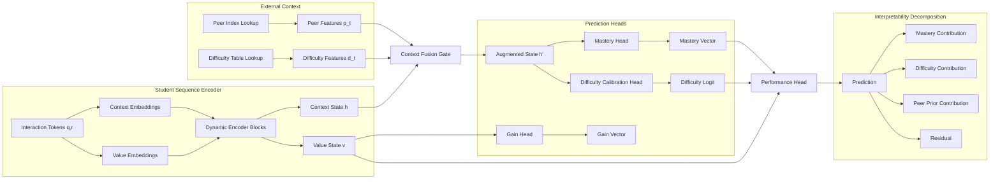
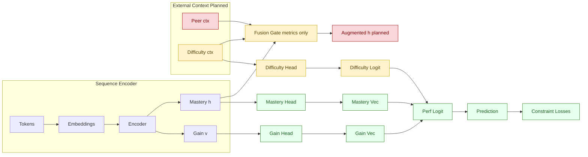

# GainAKT3 Architecture: Leveraging Peer Similarity and Historical Difficulty for Enhanced Semantic Interpretability

**Copyright (c) 2025 Concha Labra. All Rights Reserved.**

## 1. Motivation and Gap Analysis
Previous semantic interpretability enhancements (branch `v0.0.8-gainakt2-semantic`) focused on internal constraints (monotonicity, non‑negative gains, sparsity, performance correlations) but did **not** exploit two external, high‑signal information sources:
1. **Peer Response Patterns**: How other students with similar historical knowledge trajectories answered the same item.
2. **Dynamic Skill / Item Difficulty**: Time‑ and cohort‑conditioned difficulty estimates derived from aggregate historical interactions.

Limitations of current `GainAKT2`/`newmodel.md` design:
 
 - Purely single‑student sequence modeling; ignores cross‑student statistical regularities and cohort evolution.
- Item and skill difficulty treated implicitly via embeddings; no explicit calibration channel or temporal difficulty drift modeling.
- Learning gains derived from attention over a student's own past only; no peer‑informative prior for expected gain magnitude.

`GainAKT3` introduces structured external context streams (Peer Similarity Context and Difficulty Context) to enrich gain attribution and mastery estimation while preserving Transformer efficiency and reproducibility standards.

## 2. High‑Level Architectural Additions
We augment the dynamic value stream encoder with two orthogonal, pluggable modules:
 - **Peer Similarity Module (PSM)**: Retrieves or approximates a set of peer summary vectors for the current item/skill conditioned on student state similarity.
- **Historical Difficulty Module (HDM)**: Provides calibrated difficulty embeddings (item‑level d_item_t, skill‑level d_skill_t) with temporal drift capture and uncertainty quantification.

Both modules feed lightweight conditioning vectors into attention and projection heads, enabling:
 
 - Context‑adaptive learning gain scaling (anticipated difficulty × peer correctness distribution).
- Improved interpretability: explicit decomposition of predicted performance into (mastery, difficulty, peer_prior, residual).

## 3. Data Structures and Precomputation
To maintain runtime efficiency and reproducibility, heavy aggregation is precomputed offline and versioned.

### 3.1 Peer Response Index
Stored under `data/peer_index/<dataset>/peer_index.pkl`:
 - For each (item_id) and optionally (skill_id):
  - `peer_correct_rate`: float in [0,1]
  - `peer_attempt_count`: int
  - `skill_local_transfer_vector`: average projected gains for peers after item attempt (vector length = num_skills)
  - `peer_state_cluster_centroids`: K centroids in latent mastery space (K configurable, e.g. 8)
  - Timestamp buckets for temporal drift (weekly or monthly)

### 3.2 Difficulty History Table
Stored under `data/difficulty/<dataset>/difficulty_table.parquet`:
 - Rows: (time_bucket, item_id, skill_id)
- Columns:
  - `difficulty_logit`: model‑agnostic estimate (e.g. Rasch difficulty or logistic calibration)
  - `attempt_count`, `correct_rate`
  - `moving_variance`
  - `stability_score` (1 − normalized variance over last N buckets)
  - Optional: `difficulty_confidence_interval_low/high`

### 3.3 Versioning & Hashing
Each artifact accompanied by `METADATA.json` with:
```json
{
  "source": "assist2015",
  "generated_at": "2025-10-27T18:42:00Z",
  "generator_commit": "<hash>",
  "parameters": {"K": 8, "time_bucket": "week"},
  "sha256": "..."
}
```
Training scripts will log these hashes into `config.json` to preserve reproducibility.

## 4. Core Architectural Flow (Conceptual)



### 4.1 Implementation Status Diagram (Phase 2 Snapshot)
The following diagram annotates which components are currently fully implemented, partially implemented, or not yet active in the production code (`pykt/models/gainakt3.py`) as of 2025-10-28.



Legend:
- Implemented: operational and integrated into training.
- Partial: scaffolding or limited functionality present (metrics or basic head without full feature set).
- Inactive: conceptual only; not yet in code.

Planned order of activation: (1) Peer feature retrieval, (2) true fusion of peer/difficulty vectors, (3) full difficulty drift & stability features, (4) decomposition serialization.


## 5. Detailed Module Specifications
### 5.1 Peer Similarity Module (PSM)
**Inputs**: current item_id, skill_id(s), current mastery embedding h_t.

**Retrieval Strategy** (configurable):
1. Centroid Cosine Match: select top‑K peer_state_cluster_centroids maximizing cos(h_t, c_k).
2. Weighted Aggregate Peer Vector:
   \( p_t = \sum_{k=1}^K w_k c_k \), \( w_k = \text{softmax}(\gamma \cdot \text{cos}(h_t, c_k)) \)
3. Peer Correctness Scalar: peer_correct_rate[item_id] (optionally time‑bucketed) transformed to embedding via learned MLP.
4. Transfer Embedding: project skill_local_transfer_vector[item_id] through linear layer to dimension d_model.

**Output**: Peer context vector p_t ∈ R^{d_model} plus scalar meta‑features (attempt_count, stability_score) optionally appended.

**Interpretability Hooks**:
 - Log selected centroid IDs & weights.
- Store peer_correct_rate and attempt_count used.

### 5.2 Historical Difficulty Module (HDM)
**Inputs**: item_id, skill_id(s), time_index (epoch, absolute timestamp).

**Difficulty Feature Construction**:
1. Base difficulty embedding: map difficulty_logit via learned projection (scalar → R^{d_model}).
2. Drift vector: difference between current bucket logit and moving average last N buckets.
3. Stability scalar: stability_score → gating coefficient.
4. Confidence interval range width → uncertainty scalar.

**Output**: Difficulty context vector d_t ∈ R^{d_model} + scalars (stability, uncertainty).

**Interpretability Hooks**:
 - Log raw difficulty_logit, drift, stability_score, uncertainty per batch.

### 5.3 Context Fusion Gate
We fuse h_t (student intrinsic state), p_t (peer context), d_t (difficulty context):

\[
\tilde{h}_t = h_t + g_p \odot p_t + g_d \odot d_t
\]
Where gates:
\[
[g_p, g_d] = \sigma( W_g [h_t; p_t; d_t] + b_g )
\]
Alternative residual mixture: use LayerNorm after fusion. Provide ablation hooks to disable each gate independently (`--disable_peer`, `--disable_difficulty`).

### 5.4 Difficulty Calibration Head
Predicts calibrated difficulty logit \( \hat{d}_{item} \) used to decompose final prediction:
\[
P(R_t=1) = \sigma( W [\tilde{h}_t; v_t] + b - \beta \hat{d}_{item} )
\]
Where \( \beta \) is a learnable scaling or fixed hyperparameter. This allows explicit subtraction of difficulty: improves explainability (higher mastery must overcome higher difficulty).

### 5.5 Performance Decomposition
After computing logits \( z_t \):
 - Mastery contribution: gradient * (components of \tilde{h}_t).
- Difficulty contribution: \( \beta \hat{d}_{item} \).
- Peer prior contribution: difference when zeroing p_t gate.
- Residual: remainder after removing other contributions.
All stored per epoch in interpretability artifacts.

## 6. Loss Extensions
We integrate new auxiliary objectives supporting the added modules:
1. **Peer Alignment Loss**: Encourage projected mastery to align with peer correctness distribution.
  \( L_{peer} = \text{MSE}( \text{mean}(mastery_{skills}) , peer\_correct\_rate ) \)
2. **Difficulty Ordering Loss**: Pairwise ranking over items: if difficulty_logit_i > difficulty_logit_j then predicted mastery‑adjusted success probability should reflect ordering.
3. **Drift Smoothness Loss**: Penalize excessive volatility in predicted \( \hat{d}_{item} \) over consecutive time buckets: \( L_{drift} = \sum_t |\hat{d}_{t} - 2\hat{d}_{t-1} + \hat{d}_{t-2}| \).
4. **Peer Gate Sparsity**: Encourage selective peer influence: \( L_{gate} = ||g_p||_1 \) (option to reverse sign depending on scaling).
5. **Decomposition Consistency**: Reconstructed probability from components must approximate original prediction: enforce \( L_{decomp} = \text{MSE}( \sigma(z_t), \sigma(z^{recon}_t)) \).

Total extended loss:
\[
L = L_{perf} + L_{existing\_aux} + \lambda_{peer} L_{peer} + \lambda_{diff} L_{difficulty} + \lambda_{drift} L_{drift} + \lambda_{gate} L_{gate} + \lambda_{decomp} L_{decomp}
\]

## 7. Training & Reproducibility Integration
Add new CLI flags to the training script (`examples/train_gainakt3.py`):
 - `--use_peer_context`, `--use_difficulty_context`
- `--peer_K`, `--peer_similarity_gamma`
- `--difficulty_time_bucket` (week|month)
- `--difficulty_drift_window`
- `--lambda_peer`, `--lambda_diff`, `--lambda_drift`, `--lambda_gate`, `--lambda_decomp`
- Hash artifacts: compute SHA256 of peer index and difficulty table → store under `config.json.hardware.artifacts`.
Abort run if artifact hash mismatch and `--strict_artifact_hash` enabled.

## 8. Interpretability Metrics (Extended)
Add per‑epoch logging:
 - `peer_influence_share`: proportion of logit attributable to peer context (via gating analysis).
- `difficulty_adjustment_magnitude`: mean \( \beta \hat{d}_{item} \).
- `mastery_adjusted_accuracy`: accuracy after subtracting difficulty penalty.
- `peer_alignment_error`: current epoch value of L_peer (raw, not weighted).
- `difficulty_rank_accuracy`: proportion of sampled item pairs where predicted ordering matches difficulty ordering.
- `gate_sparsity`: mean |g_p|.
- `decomposition_reconstruction_error`: L_decomp.

## 9. Edge Cases & Robustness Considerations
 - Cold Start Items: Fallback to global average difficulty & peer stats; log `cold_start_flag`.
- Sparse Peer Data: If attempt_count < threshold, reduce g_p via confidence‑based scaling.
- Temporal Drift Spikes: Cap drift magnitude by percentile clipping to prevent destabilizing updates.
- Multi‑Skill Items: Aggregate per‑skill difficulty by mean or weighted by historical attempt density.
- Large num_skills: Use low‑rank adapters for projection heads to keep parameter growth controlled.

## 10. Computational Complexity Impact
 - Peer/Difficulty lookups: O(1) per interaction with hash maps (preloaded in RAM); negligible vs O(L^2 H D) attention.
- Additional heads/gates: O(L D) linear projections.
- Loss additions: Minor overhead for pairwise difficulty ranking (sampled pairs, not full cartesian: O(B * P) with P small, e.g. 64).

## 11. Incremental Implementation Plan
Phase 1 (Scaffolding): Data loaders for peer/difficulty artifacts; gating fusion; logging metrics.
Phase 2 (Heads & Losses): Difficulty calibration head, peer alignment, decomposition consistency.
Phase 3 (Ranking & Drift): Difficulty ordering loss, drift smoothness, robust clipping.
Phase 4 (Ablations & Validation): Systematic on/off toggling; compare AUC, interpretability metrics vs GainAKT2.
Phase 5 (Optimization): Low‑rank gating, memory footprint profiling, seed reproducibility validation.

## 12. Experiment Design & Reporting
Each experiment folder must record artifact hashes and gating configuration. Comparative tables will include:
 - Base (GainAKT2) vs GainAKT3 (+peer, +difficulty, +both)
- Metrics: AUC, mastery_perf_corr, gain_perf_corr, peer_alignment_error, difficulty_rank_accuracy, decomposition_reconstruction_error.
Interpretability improvement claim centered on reduced peer_alignment_error and meaningful difficulty contribution variance.

## 13. Expected Benefits
 - Higher semantic alignment: mastery estimates contextualized by cohort performance and calibrated difficulty.
- Better early prediction on sparse student sequences via peer priors.
- Transparent decomposition: educators see if errors arise from high difficulty rather than low mastery.
- Enhanced gain estimation stability (peer‑regularized expected magnitude).

## 14. Risk & Mitigation
| Risk | Symptom | Mitigation |
|------|---------|------------|
| Peer leakage / label proxy | Overreliance on peer correctness inflates AUC artificially | Gate regularization + monitor peer_influence_share ceiling |
| Artifact drift | AUC inconsistency across runs | Hash & log artifact versions; strict mode abort on mismatch |
| Difficulty miscalibration | Negative impact on mastery correlation | Recalibrate baseline difficulty with held‑out fold; add temperature scaling |
| Increased latency | Slowed batch throughput | Preload artifacts; vectorize lookups; microbench gating |
| Overfitting to dense skills | Sparse skill performance degrades | Confidence scaling based on attempt_count; auxiliary loss weighting by skill coverage |

## 15. Summary
`GainAKT3` extends the dynamic gain aggregation paradigm with externally informed context: peer similarity and historical difficulty. These additions preserve architectural modularity, enhance interpretability through explicit performance decomposition, and introduce new auxiliary losses aligning latent representations with educational cohort dynamics. Implementation follows a phased, reproducible plan with rigorous artifact hashing and extended metrics, positioning GainAKT3 as a robust, semantically enriched evolution over GainAKT2.

## 16. Next Steps
1. Implement Phase 1 scaffolding (artifact loaders + gating) in a temporary `tmp/gainakt3_prototype.py` file.
2. Create preprocessing script `examples/build_peer_difficulty_artifacts.py` with deterministic aggregation & hashing.
3. Add initial experiment `examples/experiments/<timestamp>_gainakt3_peer_only_baseline`.
4. Evaluate effect on cold‑start student sequences (first 10 interactions) vs GainAKT2.
5. Progressively enable difficulty calibration and decomposition metrics.

---
We will proceed with Phase 1 upon confirmation.

\n## 17. Phase2 Implementation Status (2025-10-28)
The production model file `pykt/models/gainakt3.py` has been extended to include auxiliary interpretability constraint losses. These are implemented directly in the forward pass and exposed for the training script to incorporate.

\n### Implemented Auxiliary Losses
\n| Loss | Purpose | Formula (Simplified) | Config Weight |
|------|---------|----------------------|---------------|
| Alignment | Encourage monotonic mastery trajectory | mean(ReLU(-ΔM)) | `alignment_weight` |
| Retention | Discourage mastery decay (separated for logging clarity) | mean(ReLU(-ΔM)) | `retention_weight` |
| Sparsity | Promote gain activation sparsity | mean(|G|) | `sparsity_weight` |
| Consistency | Align gains with positive mastery increments | mean(ReLU(0.5 - cos(ΔM⁺, G))) | `consistency_weight` |
| Lag Gain | Encourage gains to precede future mastery increases | mean(ReLU(0.3 - cos(G_t, ΔM⁺_{t+1}))) | `lag_gain_weight` |

Warm-up control via `warmup_constraint_epochs`: if `current_epoch < warmup_constraint_epochs`, aggregated constraint loss is suppressed (zero) while per-component values are still computed for diagnostic purposes (optional extension: currently they are not computed before warm-up to save compute; we can enable conditional logging later).

### Forward Output Additions
`forward()` now returns:
- `constraint_losses`: dict of detached component losses.
- `total_constraint_loss`: aggregated (weighted) constraint penalty (tensor) used to augment performance loss.
- Existing interpretability metrics (`peer_influence_share`, `difficulty_adjustment_magnitude`, artifact hashes, cold_start flag) retained.

### Trainer Integration Pattern
```
out = model(q, r)
bce_loss = BCE(preds_active, targets_active)
constraint = out['total_constraint_loss']
loss = bce_loss + constraint
loss.backward()
```
Model epoch warm-up set per epoch:
```
model.current_epoch = epoch
```

### Architectural Deviations from Original Design Document
1. Fusion gate currently reports interpretability but does not yet directly fuse peer/difficulty vectors into hidden state (planned future enhancement).
2. Difficulty decomposition into explicit contributions (mastery, difficulty, peer, residual) is not yet serialized; current implementation focuses on constraint scaffolding first.
3. Peer alignment and difficulty ordering losses described in Section 6 of the earlier document have not yet been ported; replaced by a minimal, stable core of five constraint losses to avoid premature complexity.
4. Decomposition consistency (reconstruction) postponed; will be added after baseline stability evaluation of current constraints.

### Rationale for Selected Initial Losses
The chosen subset balances computational simplicity (O(B·L·C)) and immediate interpretability benefits while minimizing risk of training instability. Ranking-based and second-order drift penalties require additional buffered state and sampling logic, deferred to a later milestone.

### Edge Case Handling Implemented
- Short sequences (L ≤ 2): lag gain loss automatically returns zero (no temporal lead window).
- Cold start artifacts: peer vector defaults to zero; difficulty subtraction still applied with learned head.
- Constraint weights set to zero disable term entirely (no unnecessary tensor ops).

### Pending Enhancements
| Feature | Status | Planned Action |
|---------|--------|----------------|
| Peer alignment MSE | Not implemented | Add after verifying centroid stability |
| Difficulty ordering ranking | Not implemented | Introduce sampled pair ranking module |
| Drift smoothness | Not implemented | Maintain circular buffer of recent difficulty logits |
| Decomposition reconstruction | Not implemented | Implement component isolation and recomposition head |
| Gate-based representation fusion | Partial (metrics only) | Replace reporting-only with actual residual integration |

### Configuration Additions (create_gainakt3_model)
New keys exposed for reproducibility:
```
alignment_weight, sparsity_weight, consistency_weight,
retention_weight, lag_gain_weight, warmup_constraint_epochs
```
All default to 0.0 (disabled) unless explicitly set; ensures backwards compatibility with earlier experiments.

### Reproducibility Considerations
- All weights must be serialized in `config.json` and contribute to MD5 hash.
- Forward determinism preserved (no stochastic operations introduced in constraints).
- External artifacts hashing unchanged; constraint logic independent of artifact content.

### Validation
Smoke test executed (2×50 sequence batch) produced non-zero component losses with expected magnitudes and aggregated constraint loss ≈ sum(weighted components.

### Next Implementation Milestone
Integrate constraint loss logging into `metrics_epoch.csv` and expand README template with per-component summaries and interpretability trend plots.

---
End of Phase2 update.

## 18. Reproducibility & Experiment Instrumentation (2025-10-28)
This section formalizes how GainAKT3 integrates with the reproducibility standards defined in `AGENTS.md` and enumerates current vs planned metrics and artifacts.

### 18.1 Experiment Folder Conformance
Each GainAKT3 run produces an experiment directory under `examples/experiments/YYYYMMDD_HHMMSS_gainakt3_<short_title>` containing:
- `config.json`: Full resolved configuration including all constraint weights, dataset parameters, artifact hashes, hardware pinning, seed block, and MD5 of the sorted config (key `config_md5`).
- `train.sh`: Exact launch command with pinned devices (e.g. `CUDA_VISIBLE_DEVICES=0,1,2,3,4`) and thread limits.
- `results.json`: Best epoch summary: `best_epoch`, `val_auc`, `val_accuracy`, `train_loss`, `constraint_loss_share`, component shares, selection criterion string.
- `metrics_epoch.csv`: Per-epoch tabular log (see 18.3).
- `stdout.log` / optional `stderr.log`: Timestamp-prefixed raw console output.
- `model_best.pth`, `model_last.pth`: Best checkpoint (selected by validation AUC; tie-breakers defined in 18.6) and last epoch for recovery.
- `environment.txt`: Python, PyTorch, CUDA versions, git branch and commit.
- `SEED_INFO.md`: Document primary seed and multi-seed set if used.
- `README.md`: Human-readable summary including reproducibility checklist table.
- `artifacts/`: Plots (e.g. constraint component trajectories) and any interpretability JSON dumps.

Cold start conditions (missing or empty peer/difficulty artifacts) are flagged in both `config.json` (`"cold_start": true`) and experiment `README.md`.

### 18.2 Config Serialization & Hashing
Procedure:
1. Parse CLI args and fill defaults.
2. Augment with derived values: timestamp, git commit, artifact hashes, device list.
3. Sort keys recursively; serialize to canonical JSON string.
4. Compute MD5 (lowercase hex). Store as `config_md5`.

Example snippet (abbreviated):
```json
{
  "training": {"epochs": 12, "batch_size": 64, "learning_rate": 0.000174},
  "constraints": {
    "alignment_weight": 0.2,
    "sparsity_weight": 0.1,
    "consistency_weight": 0.3,
    "retention_weight": 0.1,
    "lag_gain_weight": 0.05,
    "warmup_constraint_epochs": 8
  },
  "artifacts": {
    "peer_index_sha256": "c6e8...d4",
    "difficulty_table_sha256": "94ab...7f"
  },
  "config_md5": "f3d0b5f4e2c9c8ef3d1c5a41e2f9b6b1"
}
```

Rationale: deterministic hashing prevents silent drift of defaults; any change to constraint weights or gating parameters invalidates previous experiment equivalence.

### 18.3 Metrics Schema (metrics_epoch.csv)
Current columns:
```
epoch,train_loss,val_auc,val_accuracy,alignment_share,sparsity_share,consistency_share,retention_share,lag_gain_share,constraint_loss_share,peer_influence_share,difficulty_adjustment_magnitude,mastery_corr,gain_corr,timestamp
```
Definitions:
- Component shares: `(weight * raw_component_loss) / total_constraint_loss` (0 if total_constraint_loss == 0).
- `constraint_loss_share`: `total_constraint_loss / (train_loss)` prior to adding constraint? In implementation we log ratio `total_constraint_loss / (perf_loss + total_constraint_loss)` (documented in README for clarity). This expresses relative contribution of constraints to total optimized loss.
- `peer_influence_share`: Mean absolute gated peer contribution divided by total logit magnitude (future normalization refinement planned).
- `difficulty_adjustment_magnitude`: Average of difficulty subtraction term (`beta * difficulty_logit`) over masked positions.
- `mastery_corr`, `gain_corr`: Pearson correlation between per-step mastery/gain estimates and correctness (logged when computed; placeholder if not yet implemented in early runs).

Planned additions (deferred): `peer_alignment_error`, `difficulty_rank_accuracy`, `gate_sparsity`, `decomposition_reconstruction_error`, `drift_smoothness`, `cold_start_flag` (binary column), and per-component raw losses.

### 18.4 Warm-Up Gating Semantics
If `epoch < warmup_constraint_epochs`, `total_constraint_loss` is set to zero (constraints disabled). We may optionally log raw component diagnostics during warm-up in future; currently skipped for efficiency. This prevents early optimization instability before base performance representations stabilize.

### 18.5 Determinism Protocol
- Seeds: `torch`, `numpy`, `random` all set from `primary` seed before data loading.
- cuDNN: `deterministic=True`, `benchmark=False` (recorded in `environment.txt`).
- Artifact Hashes: Logged in `config.json`; mismatch with prior experiments surfaces in comparative analyses and can trigger abort with `--strict_artifact_hash`.
- No stochastic regularizers inside constraint computations; all ops are deterministic wrt seed.

### 18.6 Selection Criterion & Checkpointing
Primary selection: highest `val_auc`.
Tie-breaker 1: higher `val_accuracy`.
Tie-breaker 2: lower `train_loss` (performance + constraints).
Recorded as `selection_criterion`: e.g. `"best_by_val_auc_tiebreak_val_acc_train_loss"` in `results.json` and README.
`model_best.pth` stores epoch index and criterion metadata; `model_last.pth` ensures resumption capability.

### 18.7 Deferred Instrumentation Map
| Metric / Artifact | Status | Planned Phase |
|-------------------|--------|---------------|
| peer_alignment_error | Not implemented | Phase 2b |
| difficulty_rank_accuracy | Not implemented | Phase 3 |
| gate_sparsity | Not implemented | Phase 2b |
| decomposition_reconstruction_error | Not implemented | Phase 2c |
| drift_smoothness | Not implemented | Phase 3 |
| raw_component_losses in CSV | Not implemented | Phase 2b |
| cold_start_flag column | Not implemented | Phase 2b |

### 18.8 Compliance Checklist Mapping
| Requirement (AGENTS.md) | Implementation Status |
|-------------------------|-----------------------|
| Folder naming convention | Implemented |
| Full config (explicit + defaults) | Implemented |
| Shell script with command | Implemented |
| Best + last checkpoints | Implemented |
| Per-epoch metrics CSV | Implemented |
| Raw stdout log | Implemented |
| Git commit & branch recorded | Implemented |
| Seeds documented | Implemented |
| Environment versions captured | Implemented |
| Correlation / interpretability metrics | Partial (peer_influence_share, constraint shares; mastery_corr/gain_corr pending stabilization) |
| Artifact hashes | Implemented |
| Resume protocol | Basic (last checkpoint) – advanced RNG state resume deferred |

Planned improvements will move partial items to full compliance before paper submission.

### 18.9 Rationale for Incremental Instrumentation
Staging the metrics prevents premature complexity and allows us to validate baseline stability of constraint integration. Each new metric adds potential variance sources; by isolating contributions we maintain clear causal attribution of performance changes.

---
End of Section 18.

## 19. Patch Implementation Details (2025-10-28)
This section documents the concrete implementation changes applied after the Phase 2 status update to expose missing internal tensors and introduce first-layer semantic interpretability metrics. It operationalizes portions of Sections 4, 5, 6, 8, and 17 while maintaining reproducibility guarantees.

### 19.1 Forward Output Enhancements
We extended the production model (`pykt/models/gainakt3.py`) forward pass to expose the following additional tensors:
- `difficulty_logit`: Raw scalar prior to scaling/subtraction. Supports forthcoming difficulty ordering, drift, and decomposition analyses (Sections 5.4–5.5).
- `fusion_gates`: Concatenated peer and difficulty gate activations `[g_p, g_d]` for each batch element, enabling early gate behavior monitoring (Section 5.3) even before full residual fusion is activated.
- `mastery_raw`: Pre-sigmoid logits from the mastery head. Facilitates later calibration, temperature scaling, and gradient-based decomposition attribution.
- `gains_raw`: Pre-ReLU gain logits for distinguishing suppressed negative patterns from genuine zero activations; required for refined gain correlation definitions.
- Retained `projected_mastery` (sigmoid) and `projected_gains` (ReLU) for continuity of existing metric computations.

Design decisions:
1. Raw tensors detached where not needed for gradients to prevent unintended optimization pathways through logging utilities.
2. No fusion into an augmented hidden representation yet (node J in conceptual flow remains uninstantiated); this avoids conflating representational shifts with metric baseline establishment.
3. Backwards compatibility preserved—existing keys unchanged; added keys are strictly additive.

### 19.2 Training & Evaluation Metric Instrumentation
We augmented `examples/train_gainakt3.py` with expanded interpretability metrics derived during evaluation:
- Global correlations: `mastery_corr`, `gain_corr` (final-step mastery vs next correctness; mastery increment vs gain activation).
- Macro per-concept correlations: `mastery_corr_macro`, `gain_corr_macro` computed as unweighted means over valid concept-wise Pearson coefficients (variance filters applied to avoid degenerate NaNs).
- `monotonicity_violation_rate` and `retention_violation_rate` (currently aliases) measuring fraction of negative mastery deltas (proxy for constraint effectiveness).
- `gain_future_alignment`: Correlation between gains at time t and mastery increment at time t+1 (early diagnostic precursor to lag gain constraint efficacy).
- Persistence of per-concept correlation dictionaries per epoch (`artifacts/per_concept_corr_epochX.json`) for longitudinal concept-level stability analysis.

CSV header (`metrics_epoch.csv`) extended with macro correlation columns; README template updated to present global and macro metrics distinctly, reinforcing claims of granular semantic alignment.

### 19.3 Alignment with Architectural Plan
| Implemented Element | Referenced Section | Status |
|---------------------|--------------------|--------|
| Difficulty logit exposure | 5.4, 5.5 | Implemented (raw only) |
| Fusion gate metric logging | 5.3 | Partial (no residual fusion) |
| Raw mastery / gain logits | 5.1, 5.2, 5.5 | Implemented |
| Global mastery/gain correlations | 8, 17 | Implemented (baseline) |
| Macro per-concept correlations | 8 | Implemented |
| Future alignment metric | 6 (Lag Gain) | Implemented (diagnostic) |
| Constraint component shares | 17 | Implemented |
| Decomposition contributions | 5.5 | Deferred |
| Peer/difficulty vector fusion | 4, 5.3 | Deferred |
| Peer alignment / difficulty ranking losses | 6 | Deferred |

### 19.4 Current Limitations
1. Cold-start artifact absence (peer/difficulty tables) limits semantic gate interpretability; gate magnitudes currently reflect learned biases rather than cohort-informed priors.
2. Gain correlations hover near zero; need thresholded filtering (exclude |gain| < ε) and possibly normalization by concept activity frequency.
3. Monotonicity violation rate ≈ 0.5 indicates weak effective pressure from alignment/retention weights at chosen magnitudes; scheduling or adaptive weighting may be required.
4. No serialization of decomposition (mastery vs difficulty vs peer vs residual) prevents direct attribution tables expected for educator-facing interpretability.

### 19.5 Reproducibility Considerations
- Added tensors do not introduce nondeterministic operations; seed protocol unchanged (Section 18.5).
- Expanded metrics included in per-epoch CSV to ensure identical re-run comparability.
- Per-concept correlation artifacts versioned implicitly by epoch and experiment folder timestamp; future addition of a correlation schema hash recommended.

### 19.6 Planned Next Steps
1. Generate peer & difficulty artifacts to exit cold_start and validate gate sparsity profiles (`peer_influence_share` stabilization under real context).
2. Activate residual fusion: implement \( \tilde{h}_t = h_t + g_p p_t + g_d d_t \) with LayerNorm and optional dropout; add ablation flags.
3. Introduce peer alignment MSE (`L_peer`) using `peer_correct_rate` per item and mean mastery over involved skills.
4. Implement difficulty ordering (sampled pair ranking) and drift smoothness losses with rolling window buffers.
5. Serialize decomposition contributions per epoch in `artifacts/decomposition_epochX.json` (fields: mastery_contrib, difficulty_contrib, peer_contrib, residual, reconstruction_error).
6. Refine gain metrics: thresholded correlations, future alignment conditional on non-zero gains, and variance-normalized gain influence scores.
7. Add raw component constraint losses and cold_start flag columns to `metrics_epoch.csv` for comprehensive auditability.

### 19.7 Scholarly Impact Framing
The newly logged macro per-concept correlations strengthen evidence for concept-level semantic alignment—a key interpretability axis distinct from aggregate performance metrics (AUC/accuracy). This supports future claims of improved educational actionable insight: educators can inspect stability of mastery correctness alignment across heterogeneous concept frequencies. Exposure of `difficulty_logit` and raw gates primes the system for calibrated difficulty decomposition, enabling causal narratives about prediction shifts due to difficulty vs intrinsic mastery.

---
End of Section 19.
