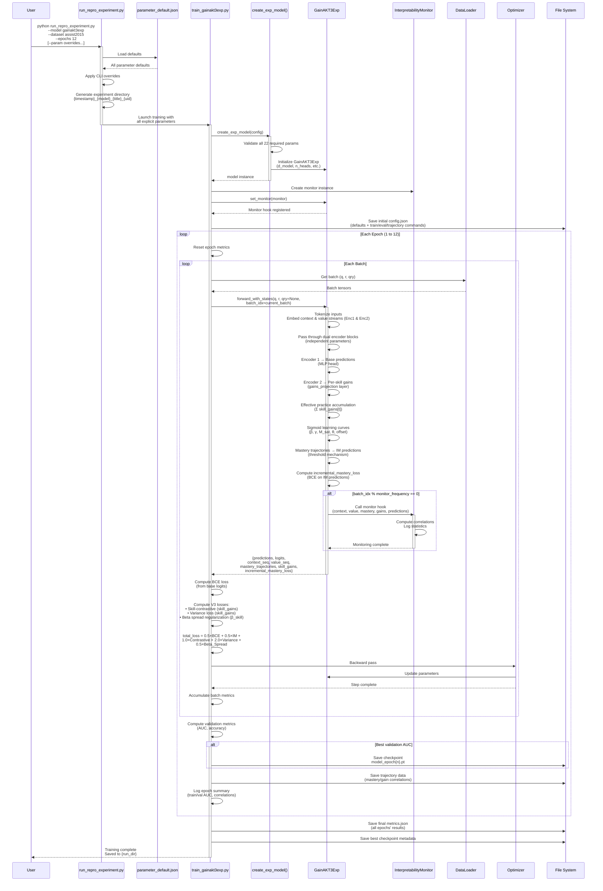
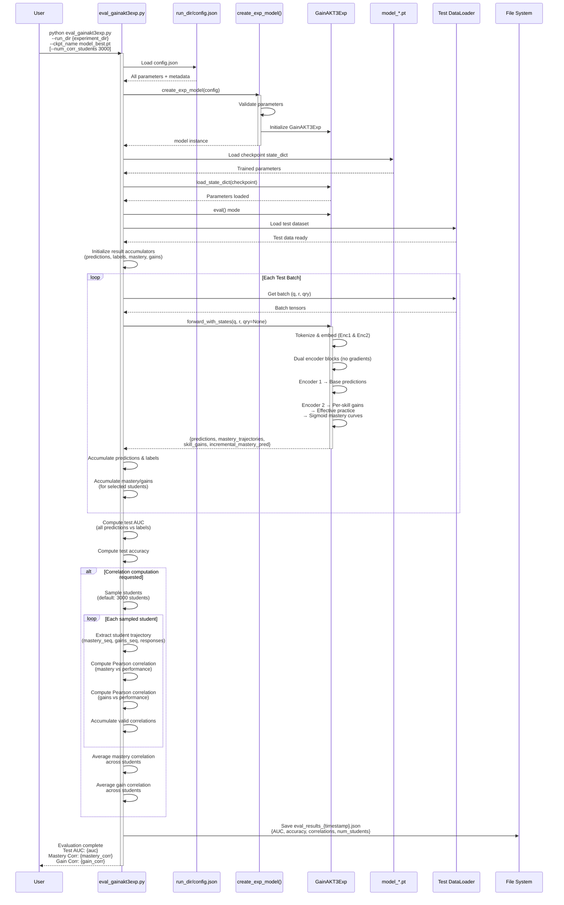
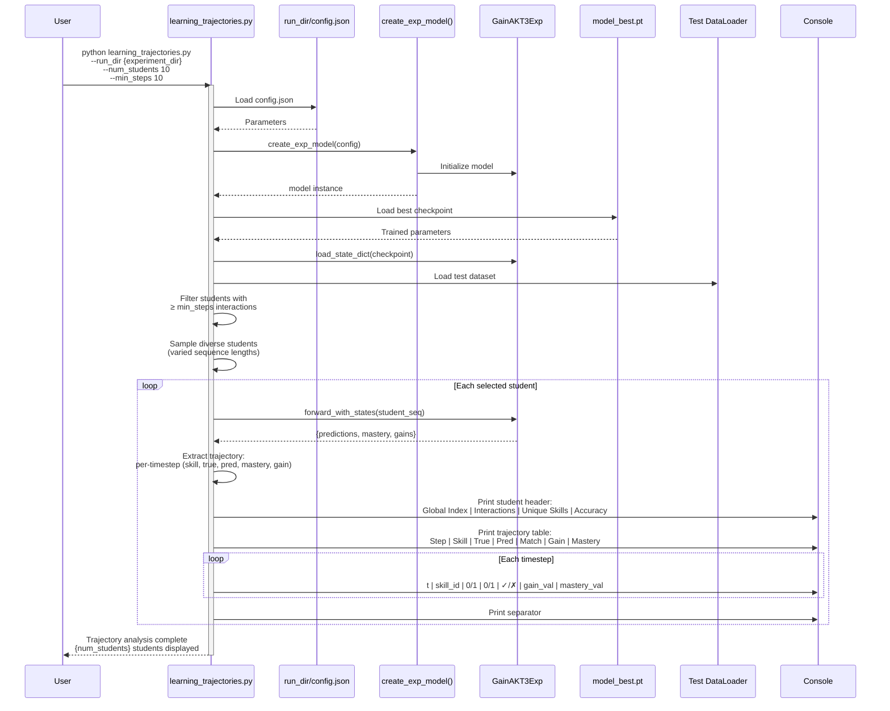

# GainAKT3Exp Architecture

**Document Version**: Updated 2025-11-18 (Post-Indentation Bug Fix + V3 Phase 1)  
**Model Version**: GainAKT3Exp - Dual-encoder transformer with Sigmoid Learning Curves & Per-Skill Gains  
**Status**: Active implementation with V3 explicit differentiation strategy (Phase 1 complete)  
**Critical Fix**: Indentation bug fixed (311 lines orphaned) - mastery head now functional ✅

## Architecture Diagram

```mermaid
graph TD
    subgraph "Input Layer (Shared)"
        direction LR
        Input_q[["Input Questions (q)<br/>Shape: [B, L]"]]
        Input_r[["Input Responses (r)<br/>Shape: [B, L]"]]
        Ground_Truth[["Ground Truth Responses"]]
    end

    %% ========== ENCODER 1: PERFORMANCE PATH ========== %%
    subgraph "Encoder 1: Performance Path (Prediction-Optimized)"
        direction TB
        
        subgraph "Tokenization & Embedding 1"
            Tokens1[["Interaction Tokens 1<br/>(q + num_c * r)"]]
            Context_Emb1["Context Embedding Table 1"]
            Value_Emb1["Value Embedding Table 1"]
            Skill_Emb1["Skill Embedding Table 1"]
            
            Context_Seq1[["Context Sequence 1<br/>[B, L, D]"]]
            Value_Seq1[["Value Sequence 1<br/>[B, L, D]"]]
            Pos_Emb1["Positional Embeddings 1"]
            
            Context_Seq_Pos1[["Context + Pos 1<br/>[B, L, D]"]]
            Value_Seq_Pos1[["Value + Pos 1<br/>[B, L, D]"]]
        end
        
        subgraph "Dual-Stream Encoder Stack 1 (N blocks)"
            Encoder1_In_Ctx[["Input Context 1"]]
            Encoder1_In_Val[["Input Value 1"]]
            
            Encoder1_Block["Encoder Block 1<br/>Q/K from Context 1<br/>V from Value 1<br/>Dual Add&Norm + FFN"]
            
            Encoder1_Out_Ctx[["Output Context 1 (h₁)<br/>[B, L, D]"]]
            Encoder1_Out_Val[["Output Value 1 (v₁)<br/>[B, L, D]"]]
        end
        
        subgraph "Prediction Head"
            Pred_Input_h1[["Knowledge State (h₁)"]]
            Pred_Input_v1[["Value State (v₁)"]]
            Pred_Input_s1[["Target Skill (s₁)"]]
            
            Concat1["Concatenate<br/>[h₁, v₁, s₁]"]
            MLP1["MLP Head 1"]
            Sigmoid1["Sigmoid 1"]
            
            Base_Predictions[["Base Predictions<br/>[B, L]<br/>✅ Performance Output"]]
        end
    end

    %% ========== ENCODER 2: INTERPRETABILITY PATH ========== %%
    subgraph "Encoder 2: Interpretability Path (Mastery-Optimized)"
        direction TB
        
        subgraph "Tokenization & Embedding 2"
            Tokens2[["Interaction Tokens 2<br/>(q + num_c * r)"]]
            Context_Emb2["Context Embedding Table 2<br/>(Independent)"]
            Value_Emb2["Value Embedding Table 2<br/>(Independent)"]
            
            Context_Seq2[["Context Sequence 2<br/>[B, L, D]"]]
            Value_Seq2[["Value Sequence 2<br/>[B, L, D]"]]
            Pos_Emb2["Positional Embeddings 2"]
            
            Context_Seq_Pos2[["Context + Pos 2<br/>[B, L, D]"]]
            Value_Seq_Pos2[["Value + Pos 2<br/>[B, L, D]"]]
        end
        
        subgraph "Dual-Stream Encoder Stack 2 (N blocks)"
            Encoder2_In_Ctx[["Input Context 2"]]
            Encoder2_In_Val[["Input Value 2"]]
            
            Encoder2_Block["Encoder Block 2<br/>Q/K from Context 2<br/>V from Value 2<br/>Dual Add&Norm + FFN<br/>(Independent Parameters)"]
            
            Encoder2_Out_Ctx[["Output Context 2 (h₂)<br/>[B, L, D]"]]
            Encoder2_Out_Val[["Output Value 2 (v₂)<br/>[B, L, D]"]]
        end
        
        subgraph "Per-Skill Gains Projection"
            Gains_Projection["Gains Projection Layer<br/>Linear(D → num_c)"]
            Skill_Gains[["Per-Skill Gains<br/>sigmoid(projection)<br/>[B, L, num_c]"]]
        end
        
        subgraph "Differentiable Effective Practice"
            Effective_Practice[["Effective Practice<br/>Σ skill_gains[t]<br/>[B, L, num_c]<br/>✅ Quality-weighted accumulation"]]
        end
        
        subgraph "Sigmoid Learning Curves (V1+ Architecture)"
            Learnable_Params["Learnable Parameters:<br/>β_skill[num_c] (skill difficulty)<br/>γ_student[num_students] (learning velocity)<br/>M_sat[num_c] (saturation level)<br/>θ_global (mastery threshold)<br/>offset (inflection point)"]
            
            Sigmoid_Curve["Sigmoid Learning Curve<br/>mastery = M_sat × sigmoid(<br/>  β_skill × γ_student × effective_practice - offset<br/>)"]
            
            Mastery_Trajectories[["Mastery Trajectories<br/>[B, L, num_c]<br/>✅ Sigmoid curves per skill<br/>✅ Interpretability Output"]]
        end
        
        subgraph "Threshold Mechanism"
            Global_Threshold[["Global Threshold<br/>θ_global (trainable)<br/>temperature (config)"]]
            Threshold_Compute["sigmoid((mastery - θ_global) / temperature)"]
            
            IM_Predictions[["Incremental Mastery Predictions<br/>[B, L]<br/>✅ Interpretability Predictions"]]
        end
    end

    %% ========== LOSS COMPUTATION ========== %%
    subgraph "Loss Framework (V3 Phase 1 - Explicit Differentiation)"
        direction LR
        
        BCE_Loss["BCE Loss<br/>(Performance)<br/>weight = 0.5"]
        IM_Loss["Incremental Mastery Loss<br/>(Interpretability)<br/>weight = 0.5"]
        Skill_Contrastive["Skill-Contrastive Loss<br/>(V3: Force differentiation)<br/>weight = 1.0"]
        Variance_Loss["Variance Loss<br/>(V3: Anti-uniformity)<br/>weight = 2.0"]
        Beta_Spread_Reg["Beta Spread Regularization<br/>(V3: Prevent collapse)<br/>weight = 0.5"]
        
        Total_Loss["Total Loss<br/>0.5×BCE + 0.5×IM +<br/>1.0×Contrastive + 2.0×Variance +<br/>0.5×Beta_Spread"]
    end

    %% ========== CONNECTIONS ========== %%
    
    %% Input to both encoders (same input, different processing)
    Input_q --> Tokens1
    Input_r --> Tokens1
    Input_q --> Tokens2
    Input_r --> Tokens2
    
    %% Encoder 1 Flow (Performance Path)
    Tokens1 --> Context_Emb1 --> Context_Seq1
    Tokens1 --> Value_Emb1 --> Value_Seq1
    Input_q --> Skill_Emb1
    
    Context_Seq1 --> Context_Seq_Pos1
    Value_Seq1 --> Value_Seq_Pos1
    Pos_Emb1 --> Context_Seq_Pos1
    Pos_Emb1 --> Value_Seq_Pos1
    
    Context_Seq_Pos1 --> Encoder1_In_Ctx --> Encoder1_Block
    Value_Seq_Pos1 --> Encoder1_In_Val --> Encoder1_Block
    
    Encoder1_Block --> Encoder1_Out_Ctx --> Pred_Input_h1
    Encoder1_Block --> Encoder1_Out_Val --> Pred_Input_v1
    Skill_Emb1 --> Pred_Input_s1
    
    Pred_Input_h1 --> Concat1
    Pred_Input_v1 --> Concat1
    Pred_Input_s1 --> Concat1
    Concat1 --> MLP1 --> Sigmoid1 --> Base_Predictions
    
    %% Encoder 2 Flow (Interpretability Path)
    Tokens2 --> Context_Emb2 --> Context_Seq2
    Tokens2 --> Value_Emb2 --> Value_Seq2
    
    Context_Seq2 --> Context_Seq_Pos2
    Value_Seq2 --> Value_Seq_Pos2
    Pos_Emb2 --> Context_Seq_Pos2
    Pos_Emb2 --> Value_Seq_Pos2
    
    Context_Seq_Pos2 --> Encoder2_In_Ctx --> Encoder2_Block
    Value_Seq_Pos2 --> Encoder2_In_Val --> Encoder2_Block
    
    Encoder2_Block --> Encoder2_Out_Val --> Gains_Projection
    Gains_Projection --> Skill_Gains
    Skill_Gains --> Effective_Practice
    
    Effective_Practice --> Sigmoid_Curve
    Learnable_Params --> Sigmoid_Curve
    Sigmoid_Curve --> Mastery_Trajectories
    
    Mastery_Trajectories --> Threshold_Compute
    Global_Threshold --> Threshold_Compute
    Threshold_Compute --> IM_Predictions
    
    %% Loss Connections
    Base_Predictions --> BCE_Loss
    Ground_Truth --> BCE_Loss
    
    IM_Predictions --> IM_Loss
    Ground_Truth --> IM_Loss
    
    Skill_Gains --> Skill_Contrastive
    Skill_Gains --> Variance_Loss
    Learnable_Params --> Beta_Spread_Reg
    
    BCE_Loss --> Total_Loss
    IM_Loss --> Total_Loss
    Skill_Contrastive --> Total_Loss
    Variance_Loss --> Total_Loss
    Beta_Spread_Reg --> Total_Loss

    %% Styling
    classDef encoder1_style fill:#e3f2fd,stroke:#1976d2,stroke-width:3px
    classDef encoder2_style fill:#fff3e0,stroke:#f57c00,stroke-width:3px
    classDef loss_style fill:#c8e6c9,stroke:#2e7d32,stroke-width:3px
    classDef v3_loss_style fill:#fff9c4,stroke:#f57f17,stroke-width:3px
    classDef input_style fill:#ffffff,stroke:#333333,stroke-width:2px
    classDef output_style fill:#e8f5e9,stroke:#43a047,stroke-width:3px
    classDef mastery_style fill:#fce4ec,stroke:#c2185b,stroke-width:2px
    classDef sigmoid_style fill:#e1bee7,stroke:#7b1fa2,stroke-width:3px
    
    class Tokens1,Context_Emb1,Value_Emb1,Skill_Emb1,Context_Seq1,Value_Seq1,Encoder1_Block,Encoder1_Out_Ctx,Encoder1_Out_Val,Concat1,MLP1,Sigmoid1 encoder1_style
    class Tokens2,Context_Emb2,Value_Emb2,Context_Seq2,Value_Seq2,Encoder2_Block,Encoder2_Out_Val,Gains_Projection encoder2_style
    class Skill_Gains,Effective_Practice,Sigmoid_Curve,Mastery_Trajectories,Learnable_Params sigmoid_style
    class Threshold_Compute,Global_Threshold mastery_style
    class BCE_Loss,IM_Loss,Total_Loss loss_style
    class Skill_Contrastive,Variance_Loss,Beta_Spread_Reg v3_loss_style
    class Input_q,Input_r,Ground_Truth input_style
    class Base_Predictions,IM_Predictions output_style

    %% Link Styling - SIMPLIFIED: Most styling removed due to commented-out connections
    %% NOTE: After commenting out constraint and semantic losses, link indices changed.
    %% Keeping only essential link styles for active connections to avoid rendering errors.
    
    %% COMMENTED OUT: Original link styling referenced indices that no longer exist
    %% after simplification. To restore styling, recalculate indices if losses are reactivated.
    %%
    %% %% Pred_Hub outputs (black) - ALL 5 connections from Pred_Hub styled blue
    %% %% Pred_Hub -->|"BCE"| BCE_Loss (line 224)
    %% %% Pred_Hub -->|"Mastery-Perf"| Mastery_Perf_Loss (line 238)
    %% %% Pred_Hub -->|"Gain-Perf"| Gain_Perf_Loss (line 239)
    %% %% Pred_Hub -->|"Alignment"| Alignment_Loss (line 242)
    %% %% Pred_Hub -->|"to Monitor"| Monitor_Hub (line 262)
    %% linkStyle 60 stroke:#888888,stroke-width:3px
    %% linkStyle 71 stroke:#888888,stroke-width:3px
    %% linkStyle 72 stroke:#888888,stroke-width:3px
    %% linkStyle 74 stroke:#888888,stroke-width:3px
    %% linkStyle 87 stroke:#888888,stroke-width:3px
    %% 
    %% %% Mastery_Hub outputs (red) - ALL 6 connections from Mastery_Hub styled red
    %% %% Mastery_Hub -->|"Global Align"| Global_Alignment (line 195)
    %% %% Mastery_Hub -->|"Monotonicity"| Monotonicity_Loss (line 227)
    %% %% Mastery_Hub -->|"Mastery-Perf"| Mastery_Perf_Loss (line 228)
    %% %% Mastery_Hub -->|"Consistency"| Consistency_Loss (line 229)
    %% %% Mastery_Hub -->|"Retention"| Retention_Loss (line 230)
    %% %% Mastery_Hub -->|"to Monitor"| Monitor_Hub (line 260)
    %% linkStyle 57 stroke:#00ff00,stroke-width:3px
    %% linkStyle 62 stroke:#00ff00,stroke-width:3px
    %% linkStyle 63 stroke:#00ff00,stroke-width:3px
    %% linkStyle 64 stroke:#00ff00,stroke-width:3px
    %% linkStyle 65 stroke:#00ff00,stroke-width:3px
    %% linkStyle 85 stroke:#00ff00,stroke-width:3px
    %% 
    %% %% Gain_Hub outputs (green) - ALL 6 connections from Gain_Hub styled green
    %% %% Gain_Hub -->|"Gain-Perf"| Gain_Perf_Loss (line 232)
    %% %% Gain_Hub -->|"Sparsity"| Sparsity_Loss (line 233)
    %% %% Gain_Hub -->|"Consistency"| Consistency_Loss (line 234)
    %% %% Gain_Hub -->|"NonNeg"| NonNeg_Loss (line 235)
    %% %% Gain_Hub -->|"Lag"| Lag_Gain_Loss (line 236)
    %% %% Gain_Hub -->|"to Monitor"| Monitor_Hub (line 261)
    %% linkStyle 66 stroke:#008800,stroke-width:3px
    %% linkStyle 67 stroke:#008800,stroke-width:3px
    %% linkStyle 68 stroke:#008800,stroke-width:3px
    %% linkStyle 69 stroke:#008800,stroke-width:3px
    %% linkStyle 70 stroke:#008800,stroke-width:3px
    %% linkStyle 86 stroke:#008800,stroke-width:3px
    %% 
    %% %% Encoder_Output_Ctx outputs (purple) - ALL 3 connections from Encoder_Output_Ctx styled purple
    %% %% Encoder_Output_Ctx --> Pred_Input_h (line 135)
    %% %% Encoder_Output_Ctx --> Proj_Mastery (line 157)
    %% %% Encoder_Output_Ctx --> Encoder_Hub (line 186)
    %% linkStyle 38 stroke:#800080,stroke-width:3px
    %% linkStyle 42 stroke:#800080,stroke-width:3px
    %% linkStyle 54 stroke:#800080,stroke-width:3px
    %% 
    %% %% Encoder_Output_Val outputs (pink) - ALL 3 connections from Encoder_Output_Val styled pink
    %% %% Encoder_Output_Val --> Pred_Input_v (line 136)
    %% %% Encoder_Output_Val --> Proj_Gain (line 158)
    %% %% Encoder_Output_Val --> Encoder_Hub (line 187)
    %% linkStyle 39 stroke:#ff69b4,stroke-width:3px
    %% linkStyle 43 stroke:#ff69b4,stroke-width:3px
    %% linkStyle 55 stroke:#ff69b4,stroke-width:3px
    %% 
    %% %% Encoder_Hub outputs (orange) - 1 connection from Encoder_Hub styled orange
    %% %% Encoder_Hub -->|"Alignment"| Alignment_Loss (line 241)
    %% linkStyle 73 stroke:#ffa500,stroke-width:3px
    %% 
    %% %% Monitor_Hub output (purple)
    %% linkStyle 86 stroke:#008800,stroke-width:3px
```

### Key Architectural Changes (2025-11-18)

**V1 Architecture (Per-Skill Gains Fix)**:
- ❌ **Removed**: Scalar gain quality (single value per interaction)
- ✅ **Added**: Per-skill gains projection layer `Linear(D → num_c)` 
- ✅ **Added**: Sigmoid activation on projected gains → `skill_gains[B, L, num_c]`
- **Impact**: Encoder 2 can now learn skill-specific learning rates

**V1+ Architecture (Sigmoid Learning Curves)**:
- ❌ **Removed**: Linear mastery accumulation `mastery_t = mastery_{t-1} + α·gain_t`
- ✅ **Added**: Differentiable effective practice accumulation `Σ skill_gains[t]`
- ✅ **Added**: 5 learnable sigmoid parameters (β_skill, γ_student, M_sat, θ_global, offset)
- ✅ **Added**: Sigmoid learning curves `mastery = M_sat × sigmoid(β × γ × practice - offset)`
- **Impact**: Automatic learning phases (warm-up → growth → saturation), educationally realistic dynamics

**V3 Phase 1 (Explicit Differentiation - 2025-11-18)**:
- ✅ **Added**: Skill-contrastive loss (weight=1.0) - forces cross-skill variance
- ✅ **Added**: Beta spread initialization N(2.0, 0.5) - prevents uniform starting point
- ✅ **Added**: Beta spread regularization (weight=0.5) - prevents parameter collapse
- ✅ **Added**: Variance loss amplification (0.1 → 2.0) - 20x stronger anti-uniformity signal
- **Impact**: Explicit mechanisms to prevent uniform gains problem

**Critical Bug Fix (2025-11-18)**:
- 🐛 **Bug**: Line 458 had commented `elif` with 311-line orphaned body (lines 459-769 at 12-space indent)
- 🔧 **Fix**: Un-indented 311 lines, removed orphaned else block (lines 770-777)
- ✅ **Result**: Mastery head now functional (IM loss: 0.0 → 0.608, Enc2 AUC: 0.50 → 0.589)

---

## Training Sequence Diagram

## Evaluation Sequence

## Learning Trajectory Analysis Sequence

## Internal Model Flow

```mermaid
sequenceDiagram
    participant Input as Input Tensors<br/>(q, r, qry)
    participant Tokenize as Tokenization
    participant CtxEmb1 as Context Embedding 1
    participant ValEmb1 as Value Embedding 1
    participant CtxEmb2 as Context Embedding 2
    participant ValEmb2 as Value Embedding 2
    participant PosEmb as Positional Embedding
    participant Encoder1 as Encoder Blocks 1<br/>(N layers)
    participant Encoder2 as Encoder Blocks 2<br/>(N layers)
    participant CtxStream as Context Streams<br/>[B, L, D]
    participant ValStream as Value Streams<br/>[B, L, D]
    participant SkillEmb as Skill Embedding
    participant PredHead as Prediction Head<br/>(MLP - Encoder 1)
    participant GainsProj as Gains Projection<br/>Linear(D, num_c)<br/>(Encoder 2)
    participant SigmoidCurves as Sigmoid Learning<br/>Curves
    participant Losses as Loss Computation
    participant Monitor as Monitor Hook
    participant Output as Output Dict
    
    Input->>Tokenize: q, r (questions, responses)
    Tokenize->>Tokenize: interaction_tokens = q + num_c * r
    
    Note over CtxEmb1,ValEmb2: Dual-Encoder Architecture: 4 Independent Embedding Tables
    
    par Encoder 1 Path (Performance)
        Tokenize->>CtxEmb1: interaction_tokens
        Tokenize->>ValEmb1: interaction_tokens
        CtxEmb1->>CtxStream: context_seq_1 [B, L, D]
        ValEmb1->>ValStream: value_seq_1 [B, L, D]
        
        PosEmb->>CtxStream: Add positional encodings (Enc1)
        PosEmb->>ValStream: Add positional encodings (Enc1)
        
        loop Each Encoder Block 1
            CtxStream->>Encoder1: context_seq_1, value_seq_1
            Note over Encoder1: Q, K = Linear(context)<br/>V = Linear(value)<br/>Dual-stream attention
            Encoder1->>CtxStream: Updated context_seq_1
            Encoder1->>ValStream: Updated value_seq_1
        end
    and Encoder 2 Path (Interpretability)
        Tokenize->>CtxEmb2: interaction_tokens
        Tokenize->>ValEmb2: interaction_tokens
        CtxEmb2->>CtxStream: context_seq_2 [B, L, D]
        ValEmb2->>ValStream: value_seq_2 [B, L, D]
        
        PosEmb->>CtxStream: Add positional encodings (Enc2)
        PosEmb->>ValStream: Add positional encodings (Enc2)
        
        loop Each Encoder Block 2
            CtxStream->>Encoder2: context_seq_2, value_seq_2
            Note over Encoder2: Q, K = Linear(context)<br/>V = Linear(value)<br/>Dual-stream attention<br/>(Independent parameters)
            Encoder2->>CtxStream: Updated context_seq_2
            Encoder2->>ValStream: Updated value_seq_2
        end
    end
    
    rect rgb(200, 230, 255)
        Note over CtxStream: Context Output (h)<br/>Encoder_Output_Ctx [B, L, D]<br/>FLOWS TO 3 DESTINATIONS ↓
    end
    
    rect rgb(255, 220, 230)
        Note over ValStream: Value Output (v)<br/>Encoder_Output_Val [B, L, D]<br/>FLOWS TO 3 DESTINATIONS ↓
    end
    
    par Context Stream (h) flows to 2 destinations
        Note over CtxStream,PredHead: FLOW 1: Context → Prediction Head (Encoder 1)
        CtxStream->>PredHead: context_seq_1 (h₁) [B, L, D]
    and
        Note over CtxStream,Monitor: FLOW 2: Context → Monitor/Output
        CtxStream->>Output: context_seq_1, context_seq_2<br/>(for monitoring)
    end
    
    par Value Stream (v) flows to 3 destinations
        Note over ValStream,PredHead: FLOW 1: Value → Prediction Head (Encoder 1)
        ValStream->>PredHead: value_seq_1 (v₁) [B, L, D]
    and
        Note over ValStream,GainsProj: FLOW 2: Value → Per-Skill Gains Projection (Encoder 2)<br/>(V1+ Innovation: Per-skill learning rates)
        ValStream->>GainsProj: value_seq_2 (v₂) [B, L, D]<br/>→ gains_projection layer<br/>→ skill_gains [B, L, num_c]
    and
        Note over ValStream,Monitor: FLOW 3: Value → Monitor/Output
        ValStream->>Output: value_seq_1, value_seq_2<br/>(for monitoring)
    end
    
    Note over PredHead: Concatenate [h, v, s]
    Input->>SkillEmb: qry (target skills)
    SkillEmb->>PredHead: target_skill_emb [B, L, D]
    PredHead->>PredHead: concat = [context, value, skill]<br/>[B, L, 3*D]
    PredHead->>PredHead: logits = MLP(concat)<br/>[B, L]
    PredHead->>PredHead: predictions = sigmoid(logits)
    PredHead->>Output: predictions [B, L]
    PredHead->>Output: logits [B, L]
    
    rect rgb(180, 230, 255)
        Note over GainsProj,SigmoidCurves: Sigmoid Learning Curves (V1+ Architecture)<br/>Encoder 2 Path: value_seq_2 → Per-skill gains → Effective practice → Sigmoid mastery<br/>1. skill_gains = sigmoid(gains_projection(v₂)) [B, L, num_c]<br/>2. effective_practice = Σ skill_gains[t] [B, L, num_c]<br/>3. mastery = M_sat × sigmoid(β×γ×practice - offset)
    end
    
    Input->>GainsProj: questions (q) [B, L]<br/>(to identify relevant skill)
    
    ValStream->>GainsProj: value_seq_2 [B, L, D]
    GainsProj->>GainsProj: Project Encoder 2 values<br/>to per-skill gains<br/>skill_gains = sigmoid(Linear(v₂, num_c))
    GainsProj->>Output: skill_gains [B, L, num_c]
    
    GainsProj->>SigmoidCurves: skill_gains [B, L, num_c]
    
    loop Each timestep t (1 to L)
        SigmoidCurves->>SigmoidCurves: effective_practice[:, t, :] = <br/>effective_practice[:, t-1, :] + skill_gains[:, t, :]
    end
    
    SigmoidCurves->>SigmoidCurves: Apply sigmoid learning curves:<br/>mastery = M_sat[s] × sigmoid(<br/>  β_skill[s] × γ_student[i] × effective_practice - offset<br/>)<br/>(5 learnable parameters)
    
    SigmoidCurves->>SigmoidCurves: Threshold mechanism:<br/>IM_pred = sigmoid((mastery - θ_global) / temp)
    
    SigmoidCurves->>Output: mastery_trajectories [B, L, num_c]<br/>(sigmoid curves per skill)
    SigmoidCurves->>Output: incremental_mastery_pred [B, L]<br/>(threshold-based predictions)
    
    Note over Losses: Loss Computation Sources
    
    rect rgb(255, 240, 200)
        Note over Losses: LOSS INPUTS:<br/>1. predictions (from Pred Head)<br/>2. projected_mastery (from Recursion)<br/>3. projected_gains (from Recursion)<br/>4. responses (ground truth)<br/>5. questions (for skill masks)
    end
    
    Output->>Losses: predictions [B, L] (Encoder 1)
    Output->>Losses: mastery_trajectories [B, L, num_c]
    Output->>Losses: skill_gains [B, L, num_c]
    Output->>Losses: incremental_mastery_pred [B, L] (Encoder 2)
    Input->>Losses: responses (r) [B, L]
    Input->>Losses: questions (q) [B, L]
    
    Note over Losses: V3 Phase 1 Loss Computation
    
    par Active Losses (V3 Architecture)
        Note over Losses: ✅ INCREMENTAL MASTERY LOSS (computed in model)
        Losses->>Losses: IM_loss = BCE(incremental_mastery_pred, responses)<br/>weight = 0.5
    and
        Note over Losses: ✅ SKILL-CONTRASTIVE LOSS (V3)
        Losses->>Losses: gain_variance = skill_gains.var(dim=2)<br/>contrastive_loss = -gain_variance.mean()<br/>weight = 1.0
    and
        Note over Losses: ✅ VARIANCE LOSS (V3 - Amplified 20x)
        Losses->>Losses: gain_std = skill_gains.std()<br/>variance_loss = -gain_std<br/>weight = 2.0
    and
        Note over Losses: ✅ BETA SPREAD REGULARIZATION (V3)
        Losses->>Losses: beta_std = β_skill.std()<br/>spread_loss = max(0, 0.3 - beta_std)²<br/>weight = 0.5
    end
    
    Note over Losses: ❌ ALL CONSTRAINT LOSSES COMMENTED OUT (weights=0.0)<br/>Non-negative, Monotonicity, Mastery-Perf,<br/>Gain-Perf, Sparsity, Consistency
    
    Losses->>Output: incremental_mastery_loss (scalar)<br/>(returned from model)
    
    alt Monitoring enabled AND batch_idx % monitor_frequency == 0
        Output->>Monitor: Pass all states:<br/>context_seq, value_seq,<br/>mastery, gains, predictions,<br/>questions, responses
        Monitor->>Monitor: Compute correlations<br/>Log statistics
        Monitor-->>Output: Monitoring complete
    end
    
    Output->>Output: Assemble final dict:<br/>{predictions, logits,<br/>context_seq_1, value_seq_1,<br/>context_seq_2, value_seq_2,<br/>mastery_trajectories, skill_gains,<br/>incremental_mastery_predictions,<br/>incremental_mastery_loss}<br/><br/>Note: interpretability_loss removed (was always 0.0)
```

