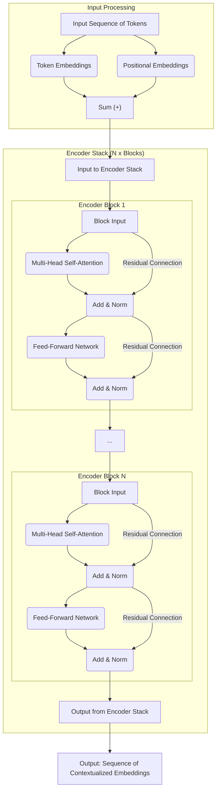
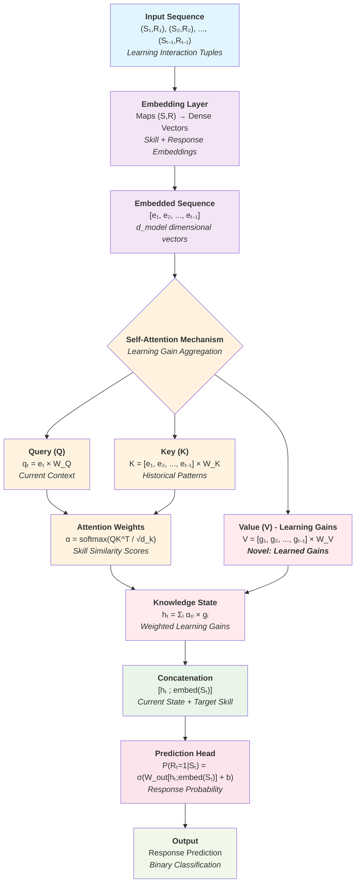

# New Model Architecture Approach

## Introduction

Knowledge Tracing (KT) is the process of modeling and predicting a learner’s evolving knowledge state over time as they interact with educational content. The goal is to estimate what a student knows at any given moment and forecast their future performance on related tasks. This is typically done by analyzing sequences of responses to questions or activities and updating the learner’s knowledge profile dynamically

- Input: Historical interaction data (e.g., correct/incorrect answers, timestamps, question difficulty).
- Output: Probability that the learner will answer the next question correctly.
- Purpose: Enables adaptive learning systems to personalize instruction, recommend content, and provide timely feedback.

Key Types of Models

- Bayesian Knowledge Tracing (BKT): Early probabilistic approach using Hidden Markov Models.
- Deep Knowledge Tracing (DKT): Uses Dep Learning models to capture complex learning patterns.
- Attention-based KT: Uses Transformer models based on attention mechanisms. 

We are looking to contribute a new Transformer attention-based model with good balance between performance (competive in terms of AUC with state of the art attention-based models) and interpretability for Knowledge Tracing. 

The original Transformer architecture was designed for seq2seq tasks like machine translation, where both the input and output are sequences of the same type of tokens (e.g., words). In contrast, Knowledge Tracing (KT) tasks involve input sequences composed of interaction data, including concept/skills IDs, responses, and sometimes additional information such as problem/question IDs or timestamps. The output, is typically a prediction about the student's next response. 

The main approaches followed to adapt attention for KT are: 

- **Embedding Heterogeneous Inputs**: The first step is to embed all the different types of input into a common vector space. This is why we see models using separate embeddings for questions, skills, responses, time, etc. These embeddings are then often combined (e.g., by summation or concatenation) to create a single representation for each interaction in the sequence.

- **Defining Query, Key, and Value**: This is the most critical part of the adaptation and where the models differ the most.

    - The Query is almost always related to the current context for which a prediction is needed. In KT, this is typically the current question or exercise the student is about to attempt.
    - The Key is used to determine the relevance of past interactions to the current one. It is often the embedding of the past questions or exercises.
    - The Value represents the information that should be aggregated from the past interactions. This is often the embedding of the past interaction itself (e.g., the combination of the question and the student's response), as this represents the "knowledge" gained from that interaction.

- **Adapting the Output**: Instead of generating a sequence of tokens, the output of the attention mechanism in KT is typically a prediction about the correctnes of the response to the question or exercise the student is about to attempt. In some models the output is a single vector that summarizes the student's knowledge state in relation to the current query. This vector is then fed into a final prediction layer (e.g., a sigmoid function) to predict the probability of a correct response.

In essence, the adaptation from seq2seq to KT involves reframing the problem **from "translating a sequence" to "querying a history"**. The **attention mechanism becomes a tool for dynamically querying the student's interaction history to find the most relevant information for predicting the performance on a new task**.

In our paper, we proposes a novel approach to provide interpretability through the lens of causal explanations. The main contribution will be a model that learns the *learning gains* obtained by the student in each interaction in a context-dependent way. The model is able to output not only good predictions but also the progression of the knowledge state of the student from the learning gains. 

The abstract of the paper is as follows: 
> Modeling the dynamic evolution of student knowledge states is essential for advancing personalized education. This paper introduces a novel Transformer-based model that leverages attention mechanisms to learn context-aware learning gains, i.e. how each specific interaction contributes to the evolution of the student knowledge state. This allows not only to predict the correctness of responses but also to track the evolution of skills mastery. Our evaluation across multiple educational datasets demonstrates that the proposed model achieves competitive predictive performance compared to state-of-the-art Deep Knowledge Tracing models. Moreover, it offers significantly improved interpretability by explicitly modeling the evolution of knowledge states and the underlying causal mechanisms based on learning gains. The approach enhances the explainability of predictions, making the model more transparent and actionable for educators and learners. This research contributes to the development of intelligent tutoring systems by enabling accurate and interpretable predictive modeling. It lays the groundwork for open learning models, where students can visualize their learning progress. Additionally, it provides a robust framework for personalized learning design and targeted educational interventions, empowering teachers to monitor student progress, deliver precise feedback, and design courses tailored to individual learning needs.

## Some Terms and Concepts

- **item**: A problem in the dataset
- **learning path**: Student's sequence of interactions with problems 
- **relevant knowledge components**: Knowledge Components (KC) related with a given item or problem according to the q-matrix
- **relevant skills**: Skills that problems are designed to develop/assess. The relevant KC indicate the skills that the student will develop by working with the problem. 
- **interaction**: A student's attempt at solving a problem
- **mastery**: Probability that a student has mastered a knowledge component
- **Q-matrix**: Binary matrix linking problems and knowledge components (KCs)
- **G-matrix**: Matrix with the same shape than the Q-matrix. Each value is a real number between 0 and 1 that indicates to what extent the interaction of the student with a problem will develop the relevant knowledge compponents.
- **learning gain**: Value of a cell in the G-matrix, indicating the expected increase in mastery for a knowledge component after an interaction with the corresponding problem. The value of a skill is the sum of the learning gains after all interactions with the problems related to that skill.
- **gain signature**: A vector of learning gains for all knowledge components
- **gain token**: A token representing the gain signature, used as input to the Transformer
- **(S, R) tuple**: Represents a interaction of the student with a item, given by the skill (S) and the correctnes of the response (R). In datasets where a problem is related to various skills, the tuple should be (P, R) where P is the problem id. 
- A complete description of concepts in assistment datasets can be found in the `assist09.md` file.


## The Typical Encoder Architecture

The typical architecture of a standard, generic, encoder-only Transformer is illustrated in the diagram below. 




## From a As-Is to a To-Be architecture design 

We start with a As-Is initial architecture and evolve it progresively towards a To-Be architecture.  


## The Gains Approach

The new model is an encoder-only with self-attention on interaction (S, R) tuples to learn tuple learning gains. 

The fundamental innovation of this approach lies in the reformulation of the attention mechanism to directly compute and aggregate learning gains. It is described in sections below. 


## Architectural Design Requirements

### Core Innovation

The fundamental innovation of this approach lies in the reformulation of the attention mechanism to directly compute and aggregate learning gains. Instead of treating attention weights as abstract importance scores, this architecture learns to:

1. **Identify relevant interaction tuples**: Through Q·K^T matching, the model learns to identify (S, R) tuples that involve similar knowledge components
2. **Quantify learning gains**: Values in the attention mechanism represent the learning gains induced by specific interactions
3. **Aggregate knowledge states**: Knowledge states are computed as weighted linear combinations of learning gains

### Token Representation

```text
Tokens = (S, R) tuples
Where:
- S: Skill/Concept/Knowledge Component identifier
- R: Response (0 for incorrect, 1 for correct)
```

Each token represents a discrete learning interaction, encapsulating both the skill being practiced and the outcome of that practice.

### Architecture Components

#### 1. Embedding Layer

- **Input**: (S, R) tuples from learning trajectories
- **Output**: Dense embeddings that capture both skill semantics and response patterns
- **Function**: Maps discrete (S, R) pairs to continuous vector space

#### 2. Self-Attention Mechanism 
The core architectural innovation is the redefinition of the attention mechanism components:

```text
Query (Q): Learned representation of current interaction context
Key (K): Learned representation of historical interaction patterns  
Value (V): Values
```

### Learning Mechanism

#### 1. Objective Function

The model learns through backpropagation on prediction loss, which drives the attention mechanism to:

- Assign high attention weights to interactions with similar knowledge components
- Learn appropriate learning gain values that contribute to accurate predictions
- Develop representations that capture skill relationships and learning dynamics

#### 2. Attention Mechanism

- Q·K^T computation learns to identify interactions involving the same or related knowledge components
- Attention weights learn to combine values to optimize the loss function


### Prediction Layer

The final response prediction is computed as:

```text
P(R_t = 1 | S_t, h_t) = sigma(W_out [h_t; embed(S_t)] + b_out)
```

Where:

- `sigma`: Sigmoid activation
- `W_out`: Output projection weights
- `embed(S_t)`: Embedding of current skill
- `h_t`: Aggregated knowledge state


## To-Be Architectural Diagram Requirements

The workflow reflecting the proposed approach is as follows: 




## Baseline models
```
PYKT Benchmark Results Summary (Question-Level AUC):
- AKT: 0.7853 (AS2009), 0.8306 (AL2005), 0.8208 (BD2006), 0.8033 (NIPS34) - **Best overall**
- SAKT: 0.7246 (AS2009), 0.7880 (AL2005), 0.7740 (BD2006), 0.7517 (NIPS34)
- SAINT: 0.6958 (AS2009), 0.7775 (AL2005), 0.7781 (BD2006), 0.7873 (NIPS34)

Other benchmarks: 
- simpleKT 0.7744 (AS2009) 0.7248 (AS2015) - Reported as strong baseline with minimal complexity
```

## Comparison


| Model | Dataset | Test AUC | Test ACC | Valid AUC | Valid ACC | Best Epoch | Notes |
|-------|---------|----------|----------|-----------|-----------|------------|--------|
| **GainSAKT** | ASSIST2015 | -1 | -1 | 0.6868 | 0.7475 | 18 | Early implementation |
| **GainAKT2** | ASSIST2015 | -1 | -1 | 0.7184 | 0.7507 | 3 | Default parameters (quick) |
| **GainAKT2** | ASSIST2015 | -1 | -1 | **0.7224** | **0.7531** | 3 | Tuned parameters (slow) |

| Model | AS2009 | AS2015 | AL2005 | BD2006 | NIPS34 | Notes |
|-------|--------|--------|--------|--------|--------|--------|
| **AKT** | 0.7853 | **0.7281** |*0.8306 | 0.8208 | 0.8033 | Best overall |
| **SAKT** | 0.7246 | **0.7114** | 0.7880 | 0.7740 | 0.7517 | Strong attention baseline |
| **SAINT** | 0.6958 | **0.7020** | 0.7775 | 0.7781 | 0.7873 | Encoder-decoder |
| **simpleKT** | 0.7744 | **0.7248** | - | - | - | Simple but effective |

1. **GainAKT2 shows improvement over GainSAKT**: 
   - GainAKT2 achieved 0.7184 valid AUC vs GainSAKT's 0.6868
   - This represents a ~4.6% improvement in validation AUC

2. **Performance vs Baselines**:
   - GainAKT2 (0.7184) is competitive with simpleKT on AS2015 (0.7248)
   - Still below top performers like AKT, but approaching strong baselines
   - Shows promise for the learning gains approach

3. **Training Efficiency**:
   - GainAKT2 converged quickly (best epoch 3 vs 18 for GainSAKT)
   - Suggests better optimization dynamics with the revised architecture

4. **Parameter Sensitivity**:
   - Default parameters performed better than the tuned configuration
   - Indicates the model may prefer simpler configurations initially

The results show that the learning gains approach is viable and improving, with GainAKT2 demonstrating competitive performance against established baselines while maintaining the interpretability advantages of explicit learning gain modeling.

## Architecture Design Decission

We have explored in detail two possible directions: 
- Start Fresh: define architecture requirements and implement them using a standard transformer architecture that complies with To-Be requirements. 
- Use a baseline model as starting point and evolve it to implement the requirements of our novel proposal. 

Finally, we decided to go with the fresh start direction since a first implementaion based on this obtained promising results. We think that none of the baseline available models in pykt framework is simple enough as to support a quick and suitable adaptation. 

## Architecture Design

We have explored the options described in gainakt_architecture_options.md. Finally we decided to choose the one described in the "Option 4" section. The gainakt2.py model is based in this option. Curently it obtains best AUC than the gainakt.py model that is based in other options. 


### Dynamic Value Stream

This version of the architecture implements the To-Be requirements with a encoder-only attention-based architecture. It modifies the traditional structure of the encoder block, creating a dynamic value stream, where the value representations are updated at each layer. The nodes highlighted in green represent the changes from the original encoder-only Transformer architecture.

```mermaid
graph TD
    subgraph "Input Layer"
        direction LR
        Input_q["Input Questions (q)<br/>Shape: [B, L]"]
        Input_r["Input Responses (r)<br/>Shape: [B, L]"]
    end

    subgraph "Tokenization & Embedding"
        direction TB
        
        Tokens["Interaction Tokens<br/>(q + num_c * r)<br/>Shape: [B, L]"]
        
        Context_Emb["Context Embedding Table"]
        Value_Emb["Value Embedding Table"]
        Skill_Emb["Skill Embedding Table"]

        Tokens --> Context_Emb
        Tokens --> Value_Emb
        Input_q --> Skill_Emb

        Context_Seq["Context Sequence<br/>Shape: [B, L, D]"]
        Value_Seq["Value Sequence<br/>Shape: [B, L, D]"]
        Pos_Emb["Positional Embeddings<br/>Shape: [B, L, D]"]
        
        Context_Emb --> Context_Seq
        Value_Emb --> Value_Seq

        Context_Seq_Pos["Context + Positional<br/>Shape: [B, L, D]"]
        Value_Seq_Pos["Value + Positional<br/>Shape: [B, L, D]"]
        
        Context_Seq --"Add"--> Context_Seq_Pos
        Pos_Emb --"Add"--> Context_Seq_Pos
        Value_Seq --"Add"--> Value_Seq_Pos
        Pos_Emb --"Add"--> Value_Seq_Pos
    end

    Input_q --> Tokens
    Input_r --> Tokens

    subgraph "Dynamic Encoder Block"
        direction TB
        
        Encoder_Input_Context["Input: Context Sequence<br/>[B, L, D]"]
        Encoder_Input_Value["Input: Value Sequence<br/>[B, L, D]"]

        subgraph "Attention Mechanism"
            direction TB
            
            Attn_Input_Context["Input: Context<br/>[B, L, D]"]
            Attn_Input_Value["Input: Value<br/>[B, L, D]"]

            Proj_Q["Q = Linear(Context)<br/>[B, H, L, Dk]"]
            Proj_K["K = Linear(Context)<br/>[B, H, L, Dk]"]
            Proj_V["V = Linear(Value)<br/>[B, H, L, Dk]"]
            
            Attn_Input_Context --> Proj_Q
            Attn_Input_Context --> Proj_K
            Attn_Input_Value --> Proj_V

            Scores["Scores = (Q @ K.T) / sqrt(Dk)<br/>[B, H, L, L]"]
            Proj_Q --> Scores
            Proj_K --> Scores
            
            Weights["Weights = softmax(Scores)<br/>[B, H, L, L]"]
            Scores --> Weights

            Attn_Output_Heads["Attn Output (Heads)<br/>[B, H, L, Dk]"]
            Weights --> Attn_Output_Heads
            Proj_V --> Attn_Output_Heads

            Attn_Output["Reshaped Attn Output<br/>[B, L, D]"]
            Attn_Output_Heads --> Attn_Output
        end

        Encoder_Input_Context --> Attn_Input_Context
        Encoder_Input_Value --> Attn_Input_Value

        AddNorm_Ctx["Add & Norm (Context)"]
        Attn_Output --> AddNorm_Ctx
        Encoder_Input_Context --"Residual"--> AddNorm_Ctx

        AddNorm_Val["Add & Norm (Value)<br/>"]
        Attn_Output --> AddNorm_Val
        Encoder_Input_Value --"Residual"--> AddNorm_Val

        FFN["Feed-Forward Network"]
        AddNorm_Ctx --> FFN
        
        AddNorm2["Add & Norm"]
        FFN --> AddNorm2
        AddNorm_Ctx --"Residual"--> AddNorm2
        
        Encoder_Output_Ctx["Output: Context (h)<br/>[B, L, D]"]
        AddNorm2 --> Encoder_Output_Ctx

        Encoder_Output_Val["Output: Value (v)<br/>[B, L, D]<br/>"]
        AddNorm_Val --> Encoder_Output_Val
    end

    Context_Seq_Pos --> Encoder_Input_Context
    Value_Seq_Pos --> Encoder_Input_Value

    subgraph "Prediction Head"
        direction TB
        
        Pred_Input_h["Input: Knowledge State (h)<br/>[B, L, D]"]
        Pred_Input_v["Input: Value State (v)<br/>[B, L, D]<br/>"]
        Pred_Input_s["Input: Target Skill (s)<br/>[B, L, D]"]

        Concat["Concatenate<br/>[h, v, s]<br/>[B, L, 3*D]<br/>"]
        MLP["MLP Head"]
        Sigmoid["Sigmoid"]
        
        Pred_Input_h --> Concat
        Pred_Input_v --> Concat
        Pred_Input_s --> Concat
        Concat --> MLP
        MLP --> Sigmoid
    end
    
    Encoder_Output_Ctx --> Pred_Input_h
    Encoder_Output_Val --> Pred_Input_v
    Skill_Emb --"Lookup"--> Pred_Input_s

    subgraph "Final Output"
        direction LR
        Predictions["Predictions<br/>[B, L]"]
    end

    Sigmoid --> Predictions

    classDef input fill:#e1f5fe,stroke:#01579b
    classDef embedding fill:#f3e5f5,stroke:#4a148c
    classDef attention fill:#fff3e0,stroke:#e65100
    classDef knowledge fill:#e8f5e8,stroke:#2e7d32
    classDef prediction fill:#fce4ec,stroke:#ad1457
    classDef output fill:#f1f8e9,stroke:#558b2f
    classDef changed fill:#c8e6c9,stroke:#2e7d32

    class Input_q,Input_r,Tokens input
    class Context_Emb,Value_Emb,Skill_Emb,Pos_Emb,Context_Seq,Value_Seq,Context_Seq_Pos,Value_Seq_Pos embedding
    class Attn_Input_Context,Attn_Input_Value,Proj_Q,Proj_K,Proj_V,Scores,Weights,Attn_Output_Heads,Attn_Output,AddNorm_Ctx,FFN,AddNorm2,Encoder_Input_Context,Encoder_Input_Value,Encoder_Output_Ctx,Encoder_Output_Val attention
    class Pred_Input_h,Pred_Input_v knowledge
    class Pred_Input_s,Concat,MLP,Sigmoid prediction
    class Predictions output
    class AddNorm_Val,Encoder_Output_Val,Pred_Input_v,Concat changed
```



### Why feeding the updated "Value" stream into the prediction head is a good idea

1. It Creates a Richer, More Complete Picture of the Student

    By using both the final context state and the final value state, we provide the prediction head with a more complete picture of the student's situation:

    - Context State (h): Represents the student's accumulated knowledge at a certain point in time. It answers the question: "What does the student know?"
    - Value State (v): Represents the dynamics or trajectory of the student's learning. It captures the learning gains from recent interactions and answers the question: "How is the student's knowledge changing?"
    Two students might have the same overall knowledge level (same context state), but one might be on an upward trajectory of learning (high value state), while the other is struggling and making mistakes (low or negative value state). The dynamic value stream allows the model to distinguish between these two scenarios, leading to more nuanced and accurate predictions.

2. It Models Learning as a Dynamic, Context-Aware Process

    Learning isn't static. The understanding gained from an early interaction can be refined or changed by later experiences. The dynamic value stream architecture models this reality:

    - Static Gains vs. Dynamic Gains: In a simpler model, the learning gain from an interaction is a fixed value. In this dynamic architecture, the "value" (gain) from an interaction is updated at each layer of the encoder.
    - Contextual Refinement: This means the model can adjust the perceived learning gain of a past interaction based on what the student does next. For example, if a student answers a question correctly but then fails on several related questions, the model can dynamically reduce the "value" or "gain" it attributed to that first correct answer.

3. It Enhances Interpretability

    A key goal of the project is to build an interpretable model. The dynamic value stream is a significant step in that direction:

    - Explicit Representation of Gains: The model learns an explicit representation of learning gains in the value stream. **We can inspect the value_seq vectors to see how the model quantifies the learning from each interaction**.
    - Traceable Knowledge Evolution: **We can trace how the model's assessment of a student's knowledge and learning gains evolves as they move through the encoder stack**. This provides a powerful tool for understanding the model's reasoning.

    In summary, the dynamic value stream architecture is a good idea because it moves beyond a static view of knowledge and embraces a more realistic, dynamic model of learning. It provides the prediction head with richer information, allows for more context-aware modeling of learning gains, and enhances the overall interpretability of the model, which are all central goals of the project. 


