# GainKT Architectural Diagram - Exploration of Alternative Proposals

## The Approach - Gains Computation

The new model is an encoder-only with self-attention on interaction (S, R) tuples to learn tuple learning gains. 

The fundamental innovation of this approach lies in the reformulation of the attention mechanism to directly compute and aggregate learning gains. It is described in sections below. 

Below we explore in detail two possible directions: 
- Start Fresh: define architecture requirements and implement them into a standard transformer architecture
- Use a aseline model as starting point and evolve it to implement the requirements of our novel proposal. 

Finally, we decided to go with the fresh start direction since a first implementaion based on this obtained promising results. We think that none of the baseline available models in pykt framework is simple enough as to support a quick and suitable adaptation. 


## Fresh Starting

### Option 1


### Option 2

```mermaid
graph TD
    subgraph Input and Embedding
        A["<b>Input Sequence</b><br/>(S₁,R₁), (S₂,R₂), ..., (Sₜ₋₁,Rₜ₋₁)"]
        B["<b>Embedding Layer</b><br/>Maps (S,R) to dense vectors"]
        C["<b>Positional Encoding</b><br/>Adds sequence order information"]
        
        A --> B
        B & C --> D["<b>Embedded Sequence (e)</b><br/><i>Shape: [batch, seq_len, d_model]</i>"]
        
        B --> G_raw["<b>Learning Gain Vectors (g)</b><br/>Separate learnable embeddings for V"]
    end

    subgraph "Encoder Stack (N x Blocks)"
        subgraph "Encoder Block"
            direction TB
            
            D_in["Input: Embedded Sequence (e)"]
            G_in["Input: Learning Gains (g)"]
            
            subgraph "🧠 Multi-Head Attention"
                QKV["<b>Q, K, V Computation</b><br/>Q, K are from the Embedded Sequence (e)<br/><b>V is from the Learning Gains (g)</b>"]
                Attn["<b>Attention Weights (α)</b><br/>α = softmax(QKᵀ / √d_k)<br/><i>Skill Similarity Scores</i>"]
                Aggregate["<b>Knowledge State Aggregation (h)</b><br/>h = Σ αᵢ × gᵢ<br/><i>Weighted Learning Gains</i>"]

                D_in --> QKV
                G_in --> QKV
                QKV --> Attn
                QKV --> Aggregate
                Attn --> Aggregate
            end

            AddNorm1("<b>Add & Norm</b>")
            FFN("<b>Feed-Forward Network</b>")
            AddNorm2("<b>Add & Norm</b>")
            BlockOut["<b>Output: Contextualized Knowledge State</b>"]
            
            D_in -- Residual --> AddNorm1
            Aggregate --> AddNorm1
            AddNorm1 --> FFN
            AddNorm1 -- Residual --> AddNorm2
            FFN --> AddNorm2
            AddNorm2 --> BlockOut
        end
    end

    D --> D_in
    G_raw --> G_in
    
    subgraph Prediction Head
        direction TB
        EncoderOut["<b>Final Knowledge State (hₜ)</b><br/>From Encoder Stack"]
        Target_Skill["<b>Target Skill Embedding (Sₜ)</b>"]
        Concat["<b>Concatenation</b><br/>[hₜ ; embed(Sₜ)]<br/><i>State + Target Skill</i>"]
        Predict["<b>MLP Head (σ)</b><br/>P(Rₜ=1) = σ(W[hₜ;Sₜ] + b)<br/><i>Response Probability</i>"]
    end
    
    BlockOut --> EncoderOut
    EncoderOut --> Concat
    Target_Skill --> Concat
    Concat --> Predict
    Predict --> Final_Output["<b>✅ Output<br/>Response Prediction</b>"]
    
    %% Styling
    classDef input fill:#e1f5fe,stroke:#01579b
    classDef embedding fill:#f3e5f5,stroke:#4a148c
    classDef attention fill:#fff3e0,stroke:#e65100
    classDef novel fill:#ffebee,stroke:#c62828
    classDef knowledge fill:#e8f5e8,stroke:#2e7d32
    classDef prediction fill:#fce4ec,stroke:#ad1457
    classDef output fill:#f1f8e9,stroke:#558b2f
    
    class A input
    class B,C,G_raw embedding
    class QKV,Attn,Aggregate attention
    class G_raw,G_in,Aggregate novel
    class D,BlockOut,EncoderOut knowledge
    class Target_Skill,Concat,Predict prediction
    class Final_Output output
```



### Option 3


### Option 4


## GainKT Architectural Diagram Implementation

### Option 4 Implementation

The following provides a complete PyTorch implementation of the GainAKT model according to the Option 4 architecture diagram. This implementation follows the exact data flow and architectural components as specified.

```python
import torch
import torch.nn as nn
import torch.nn.functional as F
import math
from typing import Tuple, Optional, Dict, Any

class LearningGainsLayer(nn.Module):
    """
    Core innovation: Computes learning gains from skill-response interactions.
    
    This layer takes interaction embeddings and decomposes them into skill and response
    components, then computes the learning gains induced by each interaction.
    
    Args:
        emb_size: Embedding dimension
        n_skills: Number of unique skills/concepts
        dropout: Dropout rate for regularization
    """
    
    def __init__(self, emb_size: int, n_skills: int, dropout: float = 0.1):
        super().__init__()
        self.emb_size = emb_size
        self.n_skills = n_skills
        
        # Skill and response extractors from interaction embeddings
        self.skill_extractor = nn.Linear(emb_size, emb_size)
        self.response_extractor = nn.Linear(emb_size, emb_size)
        
        # Learning gains computation layers
        self.skill_response_interaction = nn.Linear(emb_size * 2, emb_size)
        self.gains_transform = nn.Sequential(
            nn.Linear(emb_size, emb_size),
            nn.ReLU(),
            nn.Dropout(dropout),
            nn.Linear(emb_size, emb_size),
            nn.Sigmoid()  # Ensure gains are in [0, 1] range
        )
        
        # Difficulty awareness (educational parameter)
        self.difficulty_layer = nn.Linear(emb_size, emb_size)
        
    def forward(self, interaction_emb: torch.Tensor) -> torch.Tensor:
        """
        Compute learning gains from interaction embeddings.
        
        Args:
            interaction_emb: Interaction embeddings [batch_size, seq_len, emb_size]
            
        Returns:
            learning_gains: Learning gains tensor [batch_size, seq_len, emb_size]
        """
        batch_size, seq_len, emb_size = interaction_emb.shape
        
        # Step 1: Extract skill and response components
        skill_component = self.skill_extractor(interaction_emb)
        response_component = self.response_extractor(interaction_emb)
        
        # Step 2: Combine skill and response information
        combined = torch.cat([skill_component, response_component], dim=-1)
        interaction_context = self.skill_response_interaction(combined)
        
        # Step 3: Apply difficulty awareness
        difficulty_aware = self.difficulty_layer(interaction_context)
        
        # Step 4: Compute learning gains with educational constraints
        learning_gains = self.gains_transform(difficulty_aware)
        
        return learning_gains
    
    def get_gains_statistics(self, interaction_emb: torch.Tensor) -> Dict[str, torch.Tensor]:
        """Extract interpretable statistics about learning gains."""
        with torch.no_grad():
            gains = self.forward(interaction_emb)
            return {
                'mean_gains': gains.mean(dim=(0, 1)),
                'std_gains': gains.std(dim=(0, 1)),
                'max_gains': gains.max(dim=1)[0].max(dim=0)[0],
                'min_gains': gains.min(dim=1)[0].min(dim=0)[0]
            }


class GainAKTAttention(nn.Module):
    """
    Modified attention mechanism where Values represent learning gains.
    
    This implements the core innovation of GainAKT where:
    - Q, K come from context embeddings (what the interaction is about)
    - V comes from learning gains (the value/gain of that interaction)
    
    Args:
        emb_size: Embedding dimension
        num_heads: Number of attention heads
        dropout: Dropout rate
    """
    
    def __init__(self, emb_size: int, num_heads: int, dropout: float = 0.1):
        super().__init__()
        self.emb_size = emb_size
        self.num_heads = num_heads
        self.head_dim = emb_size // num_heads
        
        assert emb_size % num_heads == 0, "emb_size must be divisible by num_heads"
        
        # Standard Q, K projections from context
        self.W_Q = nn.Linear(emb_size, emb_size)
        self.W_K = nn.Linear(emb_size, emb_size)
        
        # INNOVATION: V projection from learning gains
        self.W_V = nn.Linear(emb_size, emb_size)
        
        self.dropout = nn.Dropout(dropout)
        self.scale = math.sqrt(self.head_dim)
        
    def forward(self, 
                context_seq: torch.Tensor, 
                gains_seq: torch.Tensor,
                mask: Optional[torch.Tensor] = None) -> Tuple[torch.Tensor, torch.Tensor]:
        """
        Forward pass implementing attention as learning gain aggregation.
        
        Args:
            context_seq: Context sequence for Q,K [batch_size, seq_len, emb_size]
            gains_seq: Learning gains sequence for V [batch_size, seq_len, emb_size]
            mask: Causal mask [seq_len, seq_len]
            
        Returns:
            knowledge_state: Aggregated knowledge state [batch_size, seq_len, emb_size]
            attention_weights: Attention weights [batch_size, num_heads, seq_len, seq_len]
        """
        batch_size, seq_len, emb_size = context_seq.shape
        
        # Project to Q, K, V
        Q = self.W_Q(context_seq)  # What we're looking for (current context)
        K = self.W_K(context_seq)  # What we have (historical patterns)
        V = self.W_V(gains_seq)    # INNOVATION: Values are learning gains
        
        # Reshape for multi-head attention
        Q = Q.view(batch_size, seq_len, self.num_heads, self.head_dim).transpose(1, 2)
        K = K.view(batch_size, seq_len, self.num_heads, self.head_dim).transpose(1, 2)
        V = V.view(batch_size, seq_len, self.num_heads, self.head_dim).transpose(1, 2)
        
        # Compute attention scores
        scores = torch.matmul(Q, K.transpose(-2, -1)) / self.scale
        
        # Apply causal mask
        if mask is not None:
            scores = scores.masked_fill(mask == 1, -1e9)
        
        # Compute attention weights
        attention_weights = F.softmax(scores, dim=-1)
        attention_weights = self.dropout(attention_weights)
        
        # Aggregate learning gains (core innovation)
        knowledge_state = torch.matmul(attention_weights, V)
        
        # Reshape back
        knowledge_state = knowledge_state.transpose(1, 2).contiguous().view(
            batch_size, seq_len, emb_size)
        
        return knowledge_state, attention_weights


class GainAKTEncoderBlock(nn.Module):
    """
    Single encoder block implementing the GainAKT attention mechanism.
    
    This block follows the standard Transformer architecture but with the key innovation
    that attention operates on learning gains rather than standard embeddings.
    
    Args:
        emb_size: Embedding dimension
        num_heads: Number of attention heads
        dropout: Dropout rate
        ff_hidden_mult: Hidden size multiplier for feed-forward network
    """
    
    def __init__(self, emb_size: int, num_heads: int, dropout: float = 0.1, ff_hidden_mult: int = 4):
        super().__init__()
        
        # Core attention mechanism with learning gains
        self.attention = GainAKTAttention(emb_size, num_heads, dropout)
        
        # Standard Transformer components
        self.norm1 = nn.LayerNorm(emb_size)
        self.norm2 = nn.LayerNorm(emb_size)
        
        # Feed-forward network
        self.ffn = nn.Sequential(
            nn.Linear(emb_size, emb_size * ff_hidden_mult),
            nn.ReLU(),
            nn.Dropout(dropout),
            nn.Linear(emb_size * ff_hidden_mult, emb_size),
            nn.Dropout(dropout)
        )
        
    def forward(self, 
                context_seq: torch.Tensor, 
                gains_seq: torch.Tensor,
                mask: Optional[torch.Tensor] = None) -> Tuple[torch.Tensor, torch.Tensor]:
        """
        Forward pass through encoder block.
        
        Args:
            context_seq: Context embeddings [batch_size, seq_len, emb_size]
            gains_seq: Learning gains [batch_size, seq_len, emb_size]
            mask: Causal attention mask
            
        Returns:
            output: Contextualized knowledge state [batch_size, seq_len, emb_size]
            attention_weights: Attention weights for interpretability
        """
        # Self-attention with learning gains
        attn_out, attention_weights = self.attention(context_seq, gains_seq, mask)
        
        # Add & Norm (residual connection with context)
        norm1_out = self.norm1(context_seq + attn_out)
        
        # Feed-forward network
        ffn_out = self.ffn(norm1_out)
        
        # Add & Norm
        output = self.norm2(norm1_out + ffn_out)
        
        return output, attention_weights


class GainAKT(nn.Module):
    """
    Complete GainAKT model implementing the Option 4 architecture.
    
    This model introduces a novel approach to knowledge tracing by using attention
    mechanisms to aggregate learning gains rather than abstract embeddings.
    
    Architecture Components:
    1. Three embedding tables: Context, Values (gains), and Skill-only
    2. Single encoder block with learning gains attention
    3. Prediction head with target skill conditioning
    
    Args:
        num_skills: Number of unique skills/concepts
        num_interactions: Number of unique (skill, response) interactions
        emb_size: Embedding dimension
        num_heads: Number of attention heads
        seq_len: Maximum sequence length
        dropout: Dropout rate
        ff_hidden_mult: Feed-forward hidden size multiplier
    """
    
    def __init__(self,
                 num_skills: int,
                 num_interactions: int,
                 emb_size: int,
                 num_heads: int = 8,
                 seq_len: int = 200,
                 dropout: float = 0.1,
                 ff_hidden_mult: int = 4):
        super().__init__()
        
        self.model_name = "gainakt"
        self.num_skills = num_skills
        self.num_interactions = num_interactions
        self.emb_size = emb_size
        self.num_heads = num_heads
        self.seq_len = seq_len
        
        # === THE THREE EMBEDDING TABLES ===
        
        # A) CONTEXT EMBEDDING (for Q & K) - what the interaction is about
        self.context_embedding = nn.Embedding(num_interactions, emb_size)
        
        # B) VALUE EMBEDDING (for V) - represents learning gains
        self.value_embedding = nn.Embedding(num_interactions, emb_size)
        
        # C) SKILL-ONLY EMBEDDING (for prediction) - separate target skill representation
        self.skill_embedding = nn.Embedding(num_skills, emb_size)
        
        # === POSITIONAL ENCODINGS ===
        self.pos_encoding = nn.Embedding(seq_len, emb_size)
        
        # === LEARNING GAINS COMPUTATION ===
        self.learning_gains_layer = LearningGainsLayer(emb_size, num_skills, dropout)
        
        # === ENCODER STACK (single block) ===
        self.encoder_block = GainAKTEncoderBlock(emb_size, num_heads, dropout, ff_hidden_mult)
        
        # === PREDICTION HEAD ===
        self.prediction_head = nn.Sequential(
            nn.Linear(emb_size * 2, emb_size),  # Concatenated [knowledge_state; target_skill]
            nn.ReLU(),
            nn.Dropout(dropout),
            nn.Linear(emb_size, emb_size // 2),
            nn.ReLU(),
            nn.Dropout(dropout),
            nn.Linear(emb_size // 2, 1),
            nn.Sigmoid()
        )
        
        # === INTERPRETABILITY STORAGE ===
        self.last_attention_weights = None
        self.last_learning_gains = None
        
        self._init_weights()
    
    def _init_weights(self):
        """Initialize model weights using Xavier initialization."""
        for module in self.modules():
            if isinstance(module, nn.Linear):
                nn.init.xavier_uniform_(module.weight)
                if module.bias is not None:
                    nn.init.zeros_(module.bias)
            elif isinstance(module, nn.Embedding):
                nn.init.xavier_uniform_(module.weight)
    
    def _create_causal_mask(self, seq_len: int) -> torch.Tensor:
        """Create causal mask to prevent attending to future interactions."""
        mask = torch.triu(torch.ones(seq_len, seq_len), diagonal=1)
        return mask.bool().to(next(self.parameters()).device)
    
    def _add_positional_encoding(self, embeddings: torch.Tensor) -> torch.Tensor:
        """Add positional encoding to embeddings."""
        batch_size, seq_len, emb_size = embeddings.shape
        positions = torch.arange(seq_len, device=embeddings.device).unsqueeze(0).expand(batch_size, -1)
        pos_emb = self.pos_encoding(positions)
        return embeddings + pos_emb
    
    def forward(self, 
                interaction_tokens: torch.Tensor,
                skill_tokens: torch.Tensor,
                target_skills: torch.Tensor,
                return_attention: bool = False) -> Dict[str, torch.Tensor]:
        """
        Forward pass implementing the complete Option 4 architecture.
        
        Args:
            interaction_tokens: Tokenized (S,R) interactions [batch_size, seq_len]
            skill_tokens: Skill-only tokens [batch_size, seq_len]
            target_skills: Target skills for prediction [batch_size, seq_len]
            return_attention: Whether to return attention weights
            
        Returns:
            Dictionary containing:
                - predictions: Response probabilities [batch_size, seq_len]
                - attention_weights: Attention weights (if requested)
                - learning_gains: Learning gains (if requested)
        """
        batch_size, seq_len = interaction_tokens.shape
        
        # === STEP 1: EMBEDDING LOOKUP ===
        
        # A) Context embeddings (for Q & K)
        context_emb = self.context_embedding(interaction_tokens)
        context_seq = self._add_positional_encoding(context_emb)
        
        # B) Value embeddings (base for learning gains)
        value_emb = self.value_embedding(interaction_tokens)
        value_seq = self._add_positional_encoding(value_emb)
        
        # C) Target skill embeddings (for prediction)
        target_skill_emb = self.skill_embedding(target_skills)
        
        # === STEP 2: LEARNING GAINS COMPUTATION ===
        learning_gains = self.learning_gains_layer(value_seq)
        self.last_learning_gains = learning_gains.detach()
        
        # === STEP 3: ENCODER PROCESSING ===
        causal_mask = self._create_causal_mask(seq_len)
        
        knowledge_state, attention_weights = self.encoder_block(
            context_seq, learning_gains, causal_mask)
        
        self.last_attention_weights = attention_weights.detach()
        
        # === STEP 4: PREDICTION HEAD ===
        
        # Concatenate knowledge state with target skill embedding
        combined_features = torch.cat([knowledge_state, target_skill_emb], dim=-1)
        
        # Generate predictions
        predictions = self.prediction_head(combined_features).squeeze(-1)
        
        # === STEP 5: PREPARE OUTPUT ===
        output = {'predictions': predictions}
        
        if return_attention:
            output['attention_weights'] = attention_weights
            output['learning_gains'] = learning_gains
        
        return output
    
    def get_learning_gains(self, interaction_tokens: torch.Tensor) -> torch.Tensor:
        """
        Extract learning gains for interpretability analysis.
        
        Args:
            interaction_tokens: Tokenized interactions [batch_size, seq_len]
            
        Returns:
            learning_gains: Computed learning gains [batch_size, seq_len, emb_size]
        """
        with torch.no_grad():
            value_emb = self.value_embedding(interaction_tokens)
            value_seq = self._add_positional_encoding(value_emb)
            learning_gains = self.learning_gains_layer(value_seq)
        return learning_gains
    
    def get_attention_weights(self) -> Optional[torch.Tensor]:
        """
        Get the last computed attention weights for interpretability.
        
        Returns:
            attention_weights: Last attention weights [batch_size, num_heads, seq_len, seq_len]
        """
        return self.last_attention_weights
    
    def get_knowledge_state_evolution(self, 
                                    interaction_tokens: torch.Tensor,
                                    skill_tokens: torch.Tensor) -> torch.Tensor:
        """
        Get the evolution of knowledge states over the sequence.
        
        Args:
            interaction_tokens: Tokenized interactions [batch_size, seq_len]
            skill_tokens: Skill tokens [batch_size, seq_len]
            
        Returns:
            knowledge_states: Knowledge state at each time step [batch_size, seq_len, emb_size]
        """
        with torch.no_grad():
            batch_size, seq_len = interaction_tokens.shape
            
            # Get embeddings
            context_emb = self.context_embedding(interaction_tokens)
            context_seq = self._add_positional_encoding(context_emb)
            
            value_emb = self.value_embedding(interaction_tokens)
            value_seq = self._add_positional_encoding(value_emb)
            
            # Compute learning gains
            learning_gains = self.learning_gains_layer(value_seq)
            
            # Pass through encoder
            causal_mask = self._create_causal_mask(seq_len)
            knowledge_states, _ = self.encoder_block(context_seq, learning_gains, causal_mask)
            
        return knowledge_states
    
    def explain_prediction(self, 
                          interaction_tokens: torch.Tensor,
                          skill_tokens: torch.Tensor,
                          target_skills: torch.Tensor,
                          time_step: int) -> Dict[str, Any]:
        """
        Provide detailed explanation for a specific prediction.
        
        Args:
            interaction_tokens: Tokenized interactions [batch_size, seq_len]
            skill_tokens: Skill tokens [batch_size, seq_len]
            target_skills: Target skills [batch_size, seq_len]
            time_step: Time step to explain
            
        Returns:
            Dictionary with explanation components
        """
        with torch.no_grad():
            # Forward pass
            output = self.forward(interaction_tokens, skill_tokens, target_skills, return_attention=True)
            
            # Extract relevant information
            prediction = output['predictions'][0, time_step].item()
            attention_weights = output['attention_weights'][0, :, time_step, :time_step+1]  # All heads, current timestep
            learning_gains = output['learning_gains'][0, :time_step+1]  # Up to current timestep
            
            # Compute contribution scores
            avg_attention = attention_weights.mean(dim=0)  # Average across heads
            contribution_scores = avg_attention * learning_gains.norm(dim=-1)
            
            return {
                'prediction': prediction,
                'attention_weights': avg_attention.cpu().numpy(),
                'learning_gains_magnitude': learning_gains.norm(dim=-1).cpu().numpy(),
                'contribution_scores': contribution_scores.cpu().numpy(),
                'top_contributors': contribution_scores.topk(min(5, len(contribution_scores))),
                'target_skill': target_skills[0, time_step].item()
            }


# === UTILITY FUNCTIONS FOR PREPROCESSING ===

class GainAKTDataProcessor:
    """
    Data preprocessing utilities for GainAKT model.
    
    This class handles the conversion of raw educational data into the format
    required by GainAKT, including tokenization and skill extraction.
    """
    
    def __init__(self, num_skills: int):
        self.num_skills = num_skills
        self.skill_to_id = {}
        self.interaction_to_id = {}
        self.next_interaction_id = 0
    
    def tokenize_interaction(self, skill: int, response: int) -> int:
        """Convert (skill, response) tuple to unique token ID."""
        interaction = (skill, response)
        if interaction not in self.interaction_to_id:
            self.interaction_to_id[interaction] = self.next_interaction_id
            self.next_interaction_id += 1
        return self.interaction_to_id[interaction]
    
    def process_sequence(self, skills: list, responses: list) -> Tuple[torch.Tensor, torch.Tensor]:
        """
        Process a sequence of interactions into GainAKT input format.
        
        Args:
            skills: List of skill IDs
            responses: List of response values (0 or 1)
            
        Returns:
            interaction_tokens: Tokenized interactions
            skill_tokens: Skill-only tokens
        """
        interaction_tokens = []
        skill_tokens = []
        
        for skill, response in zip(skills, responses):
            interaction_token = self.tokenize_interaction(skill, response)
            interaction_tokens.append(interaction_token)
            skill_tokens.append(skill)
        
        return torch.tensor(interaction_tokens), torch.tensor(skill_tokens)


# === TRAINING AND EVALUATION UTILITIES ===

def create_gainakt_model(config: Dict[str, Any]) -> GainAKT:
    """
    Factory function to create GainAKT model from configuration.
    
    Args:
        config: Configuration dictionary
        
    Returns:
        Initialized GainAKT model
    """
    return GainAKT(
        num_skills=config['num_skills'],
        num_interactions=config['num_interactions'],
        emb_size=config['emb_size'],
        num_heads=config.get('num_heads', 8),
        seq_len=config.get('seq_len', 200),
        dropout=config.get('dropout', 0.1),
        ff_hidden_mult=config.get('ff_hidden_mult', 4)
    )


def gainakt_loss_function(predictions: torch.Tensor, 
                         targets: torch.Tensor,
                         mask: Optional[torch.Tensor] = None) -> torch.Tensor:
    """
    Compute loss for GainAKT predictions.
    
    Args:
        predictions: Model predictions [batch_size, seq_len]
        targets: Ground truth responses [batch_size, seq_len]
        mask: Valid position mask [batch_size, seq_len]
        
    Returns:
        loss: Binary cross-entropy loss
    """
    bce_loss = F.binary_cross_entropy(predictions, targets.float(), reduction='none')
    
    if mask is not None:
        bce_loss = bce_loss * mask
        return bce_loss.sum() / mask.sum()
    else:
        return bce_loss.mean()


# === EXAMPLE USAGE ===

def example_usage():
    """
    Example of how to use the GainAKT model.
    """
    # Configuration
    config = {
        'num_skills': 100,
        'num_interactions': 200,  # 100 skills * 2 responses
        'emb_size': 256,
        'num_heads': 8,
        'seq_len': 50,
        'dropout': 0.1
    }
    
    # Create model
    model = create_gainakt_model(config)
    
    # Example data
    batch_size, seq_len = 32, 20
    interaction_tokens = torch.randint(0, config['num_interactions'], (batch_size, seq_len))
    skill_tokens = torch.randint(0, config['num_skills'], (batch_size, seq_len))
    target_skills = torch.randint(0, config['num_skills'], (batch_size, seq_len))
    targets = torch.randint(0, 2, (batch_size, seq_len))
    
    # Forward pass
    output = model(interaction_tokens, skill_tokens, target_skills, return_attention=True)
    predictions = output['predictions']
    
    # Compute loss
    loss = gainakt_loss_function(predictions, targets)
    
    # Extract interpretability information
    learning_gains = model.get_learning_gains(interaction_tokens)
    attention_weights = model.get_attention_weights()
    
    print(f"Model: {model.model_name}")
    print(f"Predictions shape: {predictions.shape}")
    print(f"Loss: {loss.item():.4f}")
    print(f"Learning gains shape: {learning_gains.shape}")
    print(f"Attention weights shape: {attention_weights.shape}")
    
    # Get explanation for a specific prediction
    explanation = model.explain_prediction(
        interaction_tokens[:1], skill_tokens[:1], target_skills[:1], time_step=10)
    print(f"Explanation for timestep 10: {explanation['prediction']:.4f}")

if __name__ == "__main__":
    example_usage()
```

## Architecture Implementation Details

### Key Innovation Points

1. **Three Embedding Tables Architecture**:
   - **Context Embedding**: Used for Q and K in attention, represents "what the interaction is about"
   - **Value Embedding**: Base for learning gains computation, represents the potential learning value
   - **Skill-only Embedding**: Separate representation for target skills in prediction head

2. **Learning Gains Computation**:
   - Decomposes interaction embeddings into skill and response components
   - Applies difficulty awareness through dedicated layers
   - Ensures gains are in valid range [0, 1] using sigmoid activation
   - Provides educational interpretability through explicit gain modeling

3. **Modified Attention Mechanism**:
   - Q, K derived from context embeddings (interaction patterns)
   - V derived from computed learning gains (educational value)
   - Attention weights represent relevance of past learning gains
   - Knowledge state is explicit aggregation of weighted learning gains

4. **Single-Block Architecture**:
   - Minimal complexity while maintaining educational interpretability
   - Focus on the core innovation rather than architectural complexity
   - Efficient processing suitable for educational datasets

### Educational Interpretability Features

1. **Direct Learning Gains Access**: `get_learning_gains()` method extracts interpretable gain values
2. **Attention Analysis**: `get_attention_weights()` shows which past interactions are relevant
3. **Knowledge State Evolution**: Track how knowledge states change over time
4. **Prediction Explanations**: Detailed breakdown of prediction contributions
5. **Educational Statistics**: Gain distribution analysis for educational insights

### Integration with PyKT Framework

The implementation follows PyKT conventions:
- Standard forward pass signature compatible with existing training scripts
- Model configuration through dictionary parameters
- Proper weight initialization and device handling
- Compatible loss function implementation
- Extensible architecture for future enhancements

This implementation provides a complete, production-ready GainAKT model that can be directly integrated into the PyKT framework for training and evaluation against other knowledge tracing models.

## Starting point model candidates

Based on the updated criteria focusing on: 

1. **Attention-based Transformers only** (from taxonomy.md)
2. **Architecture similarity to GainAKT single-block design**
3. **Performance metrics** from PYKT benchmark results:

```
PYKT Benchmark Results Summary (Question-Level AUC):
- AKT: 0.7853 (AS2009), 0.8306 (AL2005), 0.8208 (BD2006), 0.8033 (NIPS34) - **Best overall**
- SAKT: 0.7246 (AS2009), 0.7880 (AL2005), 0.7740 (BD2006), 0.7517 (NIPS34)
- SAINT: 0.6958 (AS2009), 0.7775 (AL2005), 0.7781 (BD2006), 0.7873 (NIPS34)

Other benchmarks: 
- simpleKT 0.7744 (AS2009) 0.7248 (AS2015) - Reported as strong baseline with minimal complexity
```

**Filtering Criteria Applied:**
1. **Attention-based Transformers only**: Excluded non-attention models (DKT uses LSTM)
2. **Single-block architecture preference**: GainAKT requires only one attention block, while models like AKT and DTransformer use 4+ blocks
3. **Performance ranking**: Among architecturally compatible models

##### Tier 1: Highly Recommended Starting Points

**1. SAKT (Priority #1)**
- **Architecture Compatibility**: **Optimal** - Single Transformer encoder block with self-attention, directly matches GainAKT design
- **Performance**: Solid baseline (0.7246 AUC on AS2009) with proven attention foundation
- **Complexity**: **Minimal** - Clean single-block architecture (81 lines of core logic)
- **Compatibility**: Excellent - designed specifically for (S,R) tuple processing with `interaction_emb`
- **Modification Effort**: **Lowest** - Direct attention mechanism replacement, no multi-block complexity
- **Advantages**: Perfect architectural match for GainAKT single-block requirement, clean self-attention baseline

**2. simpleKT (Priority #2)**
- **Architecture Compatibility**: **Excellent** - Uses ordinary dot-product attention with Rasch model, minimal complexity
- **Performance**: Strong baseline performance, designed to be "simple but tough-to-beat"
- **Complexity**: **Very Low** - Explicitly designed for simplicity while maintaining effectiveness
- **Compatibility**: Good - processes (S,R) tuples with simple attention mechanism
- **Modification Effort**: **Very Low** - Simple architecture designed for easy modification
- **Advantages**: Robust simple baseline, aligns with single-block philosophy, proven effectiveness

##### Tier 2: Alternative Starting Points (Higher Complexity)

**3. AKT (Priority #3)** - **Demoted due to architectural complexity**
- **Performance**: **Highest** empirical performance (0.7853 AUC on AS2009)
- **Architecture Limitation**: **Multi-block complexity** - Uses multiple Transformer layers (typically 4 blocks), deviates from GainAKT single-block design
- **Educational Theory**: Strong IRT integration with proven educational foundations
- **Modification Effort**: **High** - Complex multi-block architecture requires significant restructuring for single-block adaptation
- **Trade-off**: Best performance but architectural mismatch with GainAKT requirements

**4. SAINT (Priority #4)** - **Demoted due to encoder-decoder complexity**
- **Performance**: Variable performance across datasets (0.6958-0.7873 AUC range)
- **Architecture Limitation**: **Encoder-decoder complexity** - Dual-sequence architecture contradicts GainAKT single-block encoder-only design
- **Compatibility**: Processes (S,R) tuples but with unnecessary architectural complexity
- **Modification Effort**: **Very High** - Complete architectural restructuring required
- **Trade-off**: Full Transformer architecture but incompatible with single-block requirement

#### Architecture Compatibility Assessment

**Key Requirements for GainAKT:**

1. **Attention-based Transformer architecture** ✓
2. **Single-block encoder-only design** ✓ (primary requirement)
3. **(S, R) tuple processing capability** ✓
4. **Minimal architectural complexity** ✓
5. **Attention mechanism modifiable to represent learning gains** ✓

**Revised Recommendation Rationale (Architecture-First Analysis):**

1. **SAKT** emerges as the optimal starting point due to its:
   - **Perfect architectural match** - Single encoder block directly aligns with GainAKT single-block design
   - **Attention-based foundation** - Pure self-attention mechanism easily adaptable to learning gains semantics
   - **Minimal complexity** - Clean 81-line implementation allows focus on gains innovation rather than architectural complexity
   - **Proven (S,R) tuple processing** - Designed specifically for interaction sequences with interpretable embeddings
   - **Educational compatibility** - Direct attention mechanism replacement without multi-block restructuring

2. **simpleKT** serves as a strong alternative foundation with:
   - **Simplicity philosophy** - "Simple but tough-to-beat" aligns with GainAKT single-block approach
   - **Proven effectiveness** - Demonstrates that minimal complexity can achieve strong performance
   - **Attention-based design** - Ordinary dot-product attention easily modifiable for learning gains
   - **Lower modification risk** - Simple architecture reduces implementation complexity and debugging effort

**Key Insights from Architecture-First Analysis:**

- **Architecture alignment trumps raw performance** - GainAKT's single-block requirement necessitates simpler starting points
- **AKT's multi-block complexity** conflicts with GainAKT's design philosophy, despite superior performance
- **Single-block models (SAKT, simpleKT)** provide cleaner learning gains integration paths
- **Complexity reduction** enables focus on the core innovation (learning gains semantics) rather than architectural adaptation
- **Educational interpretability** can be better achieved through gains semantics than through complex architectures

The architecture-first analysis shows that **SAKT provides the optimal balance of architectural compatibility, attention mechanism adaptability, and implementation simplicity** required for the GainAKT approach, prioritizing design alignment over raw performance metrics.

### SAKT

#### SAKT Architecture Design

SAKT (Self-Attentive Knowledge Tracing) is selected as the optimal starting point for GainAKT implementation due to its single-block encoder architecture that directly aligns with GainAKT requirements.


#### SAKT Architecture Components (Implementation Details)

**Input Processing:**
- **Questions (q)**: Sequence of question/skill IDs [q₁, q₂, ..., qₜ₋₁]
- **Responses (r)**: Sequence of binary responses [r₁, r₂, ..., rₜ₋₁]  
- **Query (qry)**: Target question for prediction [qₜ]
- **Interaction Encoding**: x = q + num_c × r (creates unique (q,r) pair IDs)

**Embedding Layers:**
- **interaction_emb**: Embedding(num_c × 2, emb_size) - Maps (q,r) pairs to dense vectors
- **exercise_emb**: Embedding(num_c, emb_size) - Maps target questions to dense vectors  
- **position_emb**: Embedding(seq_len, emb_size) - Adds temporal positional information
- **Positional Encoding Function**: pos_encode(seq_len) generates indices, position_emb converts to vectors

**Transformer Block Architecture (Blocks class):**

*Self-Attention Mechanism:*
- **Input Preparation**: Permute tensors from [batch_size, seq_len, emb_size] to [seq_len, batch_size, emb_size]
- **Query (Q)**: qshftemb.permute(1,0,2) - Current learning context from target question
- **Key (K)**: xemb.permute(1,0,2) - Historical interaction patterns  
- **Value (V)**: xemb.permute(1,0,2) - Historical interaction embeddings
- **Causal Masking**: ut_mask(seq_len) creates upper triangular boolean mask
- **Multi-Head Attention**: PyTorch MultiheadAttention(emb_size, num_attn_heads, dropout)
- **Post-Attention**: Dropout → permute back → residual connection → LayerNorm

*Feed-Forward Network:*
- **FFN Structure**: Sequential(Linear(emb_size, emb_size), ReLU(), Dropout(), Linear(emb_size, emb_size))
- **Post-FFN**: Dropout → residual connection → LayerNorm

**Block Iteration:**
- **Loop Structure**: for i in range(num_en): xemb = blocks[i](qshftemb, xemb, xemb)
- **Default Blocks**: num_en = 2 (configurable)
- **Block Cloning**: get_clones() creates independent copies of the Blocks module

**Output Layer:**
- **Pre-Prediction Dropout**: dropout_layer(xemb) applied to final embeddings
- **Linear Projection**: Linear(emb_size, 1) maps embeddings to scalar logits
- **Sigmoid Activation**: torch.sigmoid() converts to probabilities P(correct)
- **Output Shape**: [batch_size, seq_len] response probabilities

#### Key SAKT Characteristics (From Implementation)

1. **Multi-Block Design**: Uses num_en=2 transformer blocks by default (configurable via constructor)
2. **Causal Attention**: ut_mask() creates upper triangular boolean mask to prevent future information leakage
3. **Unique Interaction Encoding**: x = q + num_c × r creates unique IDs for (question, response) pairs
4. **Dual Embedding Strategy**: 
   - interaction_emb for historical (q,r) pairs with vocabulary size num_c × 2
   - exercise_emb for target questions with vocabulary size num_c
5. **Position-Aware Processing**: Explicit positional embeddings added to interaction embeddings
6. **Asymmetric Attention**: Query comes from target question (qshftemb), while Keys and Values come from interaction history (xemb)
7. **Standard PyTorch Components**: Uses native MultiheadAttention, LayerNorm, and Linear modules
8. **Residual Architecture**: Skip connections with layer normalization after both attention and FFN layers
9. **Dimension Consistency**: All embeddings and transformations maintain emb_size dimensions throughout
10. **Permutation Pattern**: Consistent tensor reshaping between [batch_size, seq_len, emb_size] and [seq_len, batch_size, emb_size] for PyTorch attention compatibility

### Comparative Analysis: SAKT vs GainAKT Requirements

#### Architectural Similarities

**1. Core Structure Alignment**
- **Encoder-Only Architecture**: Both SAKT and GainAKT use encoder-only Transformer designs
- **Self-Attention Mechanism**: Both rely on multi-head self-attention as the primary computational component
- **Input Token Processing**: Both process sequences of learning interactions as primary input
- **Causal Masking**: Both implement causal attention to prevent future information leakage
- **Embedding-Based Representation**: Both use learned embeddings for input representation

**2. Input Format Compatibility**
- **Interaction Sequences**: Both models process sequences of student-skill interactions
- **(S,R) Tuple Support**: SAKT's (q,r) pairs directly map to GainAKT's (S,R) tuples
- **Sequential Processing**: Both models handle variable-length learning trajectories
- **Temporal Awareness**: Both incorporate positional information for sequence understanding

**3. Technical Infrastructure**
- **PyTorch Implementation**: Both use standard PyTorch modules (MultiheadAttention, Linear, LayerNorm)
- **Dropout Regularization**: Both implement dropout for overfitting prevention  
- **Residual Connections**: Both use skip connections and layer normalization
- **Batch Processing**: Both support efficient batch computation

#### Key Architectural Differences

**1. Attention Semantics (Critical Difference)**

| Component | SAKT Implementation | GainAKT Requirements | Evolution Needed |
|-----------|---------------------|---------------------|------------------|
| **Query (Q)** | Target question embedding | Current learning context | ✅ **Minimal change** - semantics align |
| **Key (K)** | Historical interaction embeddings | Historical interaction patterns | ✅ **Direct mapping** - same concept |  
| **Value (V)** | **Standard embeddings** | **Learning gains representation** | ⚠️ **Critical Innovation** - complete redefinition |

**2. Value Computation (Major Innovation Point)**

```text
SAKT Values:          V = interaction_emb(x) × W_V
                      (Standard embeddings transformed by learned weights)

GainAKT Values:       V = learning_gains(S,R) × W_V  
                      (Explicit learning gains induced by interactions)
```

**3. Knowledge State Computation**

```text
SAKT:                 Knowledge State = Attention(Q,K,V) 
                      (Abstract representation)

GainAKT:              Knowledge State = Σ(attention_weights × learning_gains)
                      (Explicit gain aggregation with educational semantics)
```

**4. Multiple Block Architecture**

| Aspect | SAKT | GainAKT Requirements | Modification |
|--------|------|---------------------|--------------|
| **Block Count** | 2 blocks (default) | 1 block preferred | ✅ **Simple reduction** - use num_en=1 |
| **Block Complexity** | Standard transformer | Single-block simplicity | ✅ **Configuration change** |
| **Interpretability** | Limited | High priority | ⚠️ **Requires attention mechanism redesign** |

#### Evolution Path from SAKT to GainAKT

**Phase 1: Direct Architecture Adaptation**

1. **Reduce Blocks**: Set num_en=1 for single-block configuration
2. **Maintain Infrastructure**: Keep embedding layers, positional encoding, and prediction head
3. **Preserve Input Processing**: Keep (q,r) to x transformation and embedding lookup

**Phase 2: Attention Mechanism Innovation (Critical Step)**

1. **Redefine Value Computation**: 
   ```python
   # SAKT Current:
   values = interaction_emb(x) @ self.W_V
   
   # GainAKT Target:  
   values = learning_gains_computation(s, r) @ self.W_V
   ```

2. **Learning Gains Semantics**:
   - Values represent actual learning increments
   - Each V[i] corresponds to gain induced by interaction i
   - Attention weights become relevance scores for gain aggregation

3. **Knowledge State Interpretation**:
   ```python
   # Enhanced knowledge state computation with gain semantics
   knowledge_state = sum(attention_weights[i] * learning_gains[i] for i in history)
   ```

**Phase 3: Enhanced Interpretability**

1. **Gain Visualization**: Implement methods to extract and visualize learned learning gains
2. **Attention Analysis**: Develop tools to analyze which historical interactions contribute most
3. **Causal Explanation**: Enable explanations of prediction based on gain aggregation

#### Implementation Advantages of SAKT Base

**1. Minimal Disruption Strategy**
- **80%+ Code Reuse**: Most SAKT infrastructure directly applicable
- **Proven Architecture**: Leverages tested transformer components  
- **Standard Interfaces**: Compatible with existing PyKT framework patterns

**2. Focus on Core Innovation**
- **Single Innovation Point**: Only attention mechanism semantics need modification
- **Preserved Complexity**: No multi-encoder or external memory complexity
- **Educational Alignment**: Direct transformation to learning-focused semantics

**3. Development Efficiency** 
- **Incremental Development**: Can develop and test incrementally
- **Debugging Simplicity**: Familiar codebase reduces debugging complexity
- **Performance Baseline**: SAKT provides solid performance baseline for comparison

#### Critical Implementation Requirements

**1. Value Layer Redesign (Essential)**
```python
class GainAKTAttention(nn.Module):
    def __init__(self, emb_size, num_heads):
        # Standard Q, K projections
        self.W_Q = nn.Linear(emb_size, emb_size)
        self.W_K = nn.Linear(emb_size, emb_size)
        
        # CRITICAL: Learning gains value projection
        self.W_V = nn.Linear(emb_size, emb_size)  # Projects to gain space
        self.gain_layer = LearningGainsLayer()    # NEW: Explicit gains computation
```

**2. Attention Computation with Gains Semantics**
```python
def forward(self, xemb, qshftemb):
    Q = self.W_Q(qshftemb)           # Current context
    K = self.W_K(xemb)               # Historical patterns
    
    # INNOVATION: Values represent learning gains  
    gains = self.gain_layer(xemb)    # Compute learning gains from interactions
    V = self.W_V(gains)              # Project gains to attention space
    
    # Standard attention with gain semantics
    attention_weights = softmax(Q @ K.T / sqrt(d_k))
    knowledge_state = attention_weights @ V    # Aggregate learning gains
    
    return knowledge_state
```

**3. Interpretability Interface**
```python
def get_learning_gains(self):
    """Extract interpretable learning gains for analysis"""
    return self.gain_layer.get_gains()

def explain_prediction(self, attention_weights, gains):
    """Generate causal explanation based on gain aggregation"""
    return [(weight, gain, interaction) for weight, gain, interaction in zip(attention_weights, gains, interactions)]
```

#### Success Metrics for Evolution

**1. Performance Parity**
- Maintain or exceed SAKT's AUC performance (0.7246 on AS2009)
- Achieve competitive performance across benchmark datasets
- Demonstrate improved performance through interpretability-guided learning

**2. Interpretability Achievement**
- Extract meaningful learning gains from trained model
- Provide coherent explanations for predictions
- Enable visualization of knowledge state evolution

**3. Educational Validity** 
- Learning gains align with educational theory expectations
- Attention patterns reflect meaningful skill relationships
- Model explanations provide actionable insights for educators

This analysis demonstrates that SAKT provides an excellent foundation for GainAKT development, requiring targeted innovation in attention mechanism semantics while preserving the proven architectural foundation.

### simpleKT 
#### simpleKT Architecture Design

simpleKT (Simple Knowledge Tracing) is positioned as the second-tier starting point for GainAKT implementation. As described in its paper, simpleKT aims to be "simple but tough-to-beat" by focusing on minimal architectural complexity while maintaining competitive performance. The model uses dot-product attention with Rasch model integration for educational alignment.

#### Implementation Architecture (pykt/models/simplekt.py)

The following diagram shows the explicit Q, K, V data flow in simpleKT's cross-attention mechanism:


#### simpleKT Architecture Components (Implementation Details)

**Input Processing:**
- **Questions (q)**: Problem/question IDs in sequence
- **Concepts (c)**: Knowledge concept/skill IDs associated with questions  
- **Responses (r)**: Binary response sequence (0/1 for incorrect/correct)
- **Data Preparation**: Sequences are shifted and concatenated with padding for proper alignment

**Embedding Strategy:**

*Base Embeddings (emb_type="qid"):*
- **q_embed**: Embedding(n_question, d_model) - Maps concept IDs to dense vectors
- **qa_embed**: Embedding(2, d_model) when separate_qa=False - Maps binary responses
- **Combination**: qa_embed_data = qa_embed(target) + q_embed_data (additive combination)

*Rasch Model Enhancement (when n_pid > 0):*
- **difficult_param**: Embedding(n_pid+1, d_model) - Problem difficulty parameters  
- **q_embed_diff**: Embedding(n_question+1, d_model) - Question variation embeddings
- **Enhanced Embedding**: q_embed_data = q_embed_data + pid_embed_data × q_embed_diff_data
- **Educational Theory**: Implements Rasch model concept where difficulty modulates question representation

**Architecture Module Components:**

*Positional Encoding:*
- **CosinePositionalEmbedding**: Uses sinusoidal position encoding with learnable scaling (0.1 * randn initialization)
- **Position Integration**: Embeddings are added to both question and interaction sequences
- **Temporal Modeling**: Captures sequential learning progression

*Transformer Block Architecture (TransformerLayer):*

**Multi-Head Attention Mechanism:**
- **Projection Setup**: 
  - K = k_linear(key) - Key projection from questions
  - Q = k_linear(query) if kq_same else q_linear(query) - Query projection (can share with K)
  - V = v_linear(values) - Value projection from interactions
- **Cross-Attention Pattern**: Q,K from question embeddings, V from interaction embeddings
- **Head Reshaping**: .view(bs, -1, h, d_k) then transpose to (bs, h, seq_len, d_k)

**Attention Computation:**
- **Scaled Dot-Product**: scores = Q @ K^T / sqrt(d_k)
- **Causal Masking**: Upper triangular mask prevents future information leakage
- **Zero Padding**: When mask=0, first row of attention scores is set to zero
- **Educational Semantics**: First interaction has no historical information to attend to

**Feed-Forward Network:**
- **Structure**: Linear(d_model, d_ff) → ReLU → Dropout → Linear(d_ff, d_model)
- **Residual Connections**: Applied after both attention and FFN with LayerNorm

**Block Iteration:**
- **Loop Structure**: for block in self.blocks_2: x = block(mask=0, query=x, key=x, values=y)
- **Input Evolution**: Questions (x) are updated through attention, interactions (y) remain constant
- **Mask=0**: Implements strict causality - cannot see current response during processing

**Output Processing:**
- **Concatenation**: concat_q = [d_output, q_embed_data] - Combines transformer output with original embeddings
- **Multi-Layer Prediction Head**: Three-layer MLP with ReLU activations and dropout
- **Final Dimensions**: (d_model + embed_l) → final_fc_dim → final_fc_dim2 → 1
- **Sigmoid Activation**: Converts to response probability

#### Key simpleKT Characteristics (From Implementation)

1. **Cross-Attention Design**: Queries and Keys from questions, Values from interactions (not pure self-attention)
2. **Rasch Model Integration**: Optional difficulty parameter enhancement for educational alignment
3. **Additive Embedding Combination**: qa_embed(target) + q_embed(data) vs. multiplicative approaches
4. **Zero-Padding Strategy**: First interaction has zero attention weights (no historical context)
5. **Cosine Positional Encoding**: Sinusoidal position embeddings with random initialization scaling
6. **Question-Centric Processing**: Questions evolve through transformer blocks, interactions remain fixed
7. **Flexible Architecture**: Configurable number of blocks (n_blocks parameter)
8. **Educational Parameters**: Optional problem ID and difficulty modeling
9. **Concatenated Output**: Combines final transformer state with original question embeddings
10. **Multi-Layer Head**: Three-layer MLP prediction head with dropout regularization

#### Comparative Analysis: simpleKT vs SAKT vs GainAKT Requirements

##### Architectural Similarities with GainAKT

**1. Attention-Based Foundation**
- **Transformer Architecture**: Both simpleKT and GainAKT use attention mechanisms as core computation
- **Sequential Processing**: Both handle variable-length learning trajectories
- **Causal Modeling**: Both implement causal masking to prevent future information leakage
- **Educational Focus**: Both designed specifically for knowledge tracing applications

**2. Input Format Compatibility**  
- **Concept-Response Processing**: simpleKT's (c,r) pairs directly map to GainAKT's (S,R) tuples
- **Sequential Structure**: Both models expect sequences of learning interactions
- **Temporal Awareness**: Both incorporate positional information for sequence understanding

**3. Technical Infrastructure**
- **PyTorch Implementation**: Compatible module structure and tensor operations
- **Embedding Layers**: Similar embedding strategy for discrete inputs
- **Dropout Regularization**: Both use dropout for overfitting prevention
- **Batch Processing**: Efficient batch computation support

##### Key Architectural Differences

**1. Attention Pattern (Critical Distinction)**

| Component | simpleKT Implementation | GainAKT Requirements | Evolution Complexity |
|-----------|------------------------|---------------------|-------------------|
| **Query (Q)** | Questions embeddings | Current learning context | ✅ **Compatible** - semantic alignment |
| **Key (K)** | Questions embeddings | Historical interaction patterns | ⚠️ **Modification needed** - broader pattern matching |
| **Value (V)** | **Interaction embeddings** | **Learning gains representation** | 🔄 **Major redesign** - complete semantic change |
| **Pattern** | Cross-attention | Self-attention on (S,R) | ⚠️ **Architectural shift** |

**2. Attention Semantics**

```text
simpleKT Attention:   Cross-attention between questions and interactions
                      Q,K from questions, V from interactions
                      
GainAKT Attention:    Self-attention on interaction sequences  
                      Q,K,V all from (S,R) interaction tuples
```

**3. Knowledge State Computation**

```text
simpleKT:             Knowledge State = CrossAttention(Questions, Interactions)
                      Mixed question-interaction representation

GainAKT:              Knowledge State = Σ(attention_weights × learning_gains)  
                      Pure learning gain aggregation
```

**4. Multi-Block vs Single-Block**

| Aspect | simpleKT | GainAKT Requirements | Adaptation |
|--------|----------|---------------------|------------|
| **Block Count** | Configurable (n_blocks) | 1 block preferred | ✅ **Simple config** - set n_blocks=1 |
| **Complexity** | Variable complexity | Minimal complexity focus | ✅ **Straightforward reduction** |

##### Evolution Path from simpleKT to GainAKT

**Phase 1: Architectural Simplification**

1. **Single Block Configuration**: Set n_blocks=1 to match GainAKT simplicity requirements
2. **Remove Cross-Attention**: Eliminate separate question and interaction processing paths
3. **Unified Input**: Process (S,R) tuples as single interaction sequence

**Phase 2: Attention Pattern Transformation (Major Change)**

1. **Self-Attention Conversion**:
   ```python
   # simpleKT Current: Cross-attention
   x = block(mask=0, query=questions, key=questions, values=interactions)
   
   # GainAKT Target: Self-attention  
   x = block(mask=0, query=interactions, key=interactions, values=learning_gains)
   ```

2. **Unified Sequence Processing**: 
   - Input: Single sequence of (S,R) tuples
   - Q,K,V: All derived from interaction embeddings
   - Attention: Pure self-attention mechanism

**Phase 3: Learning Gains Integration (Critical Innovation)**

1. **Value Redefinition**:
   ```python
   # simpleKT Current:
   V = v_linear(interaction_embeddings)
   
   # GainAKT Target:
   V = v_linear(learning_gains_computation(S, R))
   ```

2. **Gains Computation Layer**:
   ```python
   class LearningGainsLayer(nn.Module):
       def forward(self, interaction_embeddings):
           # Convert interaction embeddings to learning gains
           return self.gains_transform(interaction_embeddings)
   ```

**Phase 4: Educational Enhancement**

1. **Preserve Rasch Model**: Leverage simpleKT's educational parameter integration
2. **Difficulty-Aware Gains**: Use difficulty parameters to modulate learning gains
3. **Enhanced Interpretability**: Combine gains semantics with educational parameters

##### Implementation Advantages of simpleKT Base

**1. Educational Alignment**
- **Rasch Model Integration**: Built-in difficulty parameter modeling
- **Educational Parameters**: Problem ID and difficulty awareness
- **Proven Educational Validity**: "Simple but tough-to-beat" philosophy aligns with practical requirements

**2. Architectural Simplicity** 
- **Clean Implementation**: Well-structured modular design
- **Flexible Configuration**: Easy to modify for different complexity levels
- **Minimal Dependencies**: Standard PyTorch components

**3. Performance Foundation**
- **Competitive Baseline**: Strong performance with minimal complexity
- **Proven Effectiveness**: Demonstrated "tough-to-beat" performance characteristics
- **Optimization Friendly**: Simple architecture enables efficient training

##### Implementation Challenges

**1. Attention Pattern Migration (High Complexity)**
- **Cross to Self-Attention**: Major architectural restructuring required
- **Input Processing Changes**: Need to unify question-interaction processing
- **Sequence Alignment**: Modify input preparation for unified sequences

**2. Value Semantics Transformation (Critical)**  
- **Learning Gains Computation**: Complete redefinition of value meanings
- **Educational Validity**: Ensure gains align with educational theory
- **Interpretability**: Maintain clear educational semantics

**3. Embedding Strategy Evolution**
- **Unified Embedding**: Replace separate question/interaction embeddings
- **(S,R) Tuple Processing**: Modify embedding to handle tuple inputs
- **Positional Integration**: Adapt positional encoding for unified sequences

#### Success Criteria for simpleKT → GainAKT Evolution

**1. Performance Maintenance**
- **Baseline Performance**: Maintain simpleKT's competitive performance
- **Educational Enhancement**: Improve through difficulty-aware learning gains  
- **Interpretability Gains**: Achieve superior explanatory capabilities

**2. Architectural Integrity**
- **Simplicity Preservation**: Maintain "simple but effective" philosophy
- **Educational Alignment**: Preserve and enhance educational parameter integration
- **Modular Design**: Keep clean, maintainable code structure

**3. Innovation Integration**
- **Learning Gains Semantics**: Successfully implement gains-based attention
- **Interpretable Outputs**: Enable clear explanation of predictions
- **Causal Modeling**: Provide actionable insights for educators

#### Recommendation Analysis: simpleKT vs SAKT

**simpleKT Advantages:**
- **Educational Alignment**: Superior educational parameter integration
- **Simplicity Philosophy**: Better matches GainAKT's "simple but effective" goals
- **Rasch Model**: Built-in difficulty modeling enhances educational validity

**simpleKT Challenges:**  
- **Cross-Attention Complexity**: Major architectural restructuring required for self-attention
- **Dual Processing Paths**: Question-interaction separation conflicts with unified (S,R) processing
- **Higher Migration Cost**: More extensive changes needed compared to SAKT

**SAKT Advantages (Comparative):**
- **Direct Self-Attention**: Minimal modification for GainAKT attention pattern
- **Single Processing Path**: Natural fit for (S,R) tuple sequences  
- **Lower Migration Risk**: Fewer architectural changes required

**Conclusion**: While simpleKT offers superior educational integration and aligns better with the "simple but effective" philosophy, the **cross-attention to self-attention migration represents a significant architectural challenge**. SAKT remains the recommended starting point due to its **direct architectural compatibility** with GainAKT's self-attention requirements, though simpleKT's educational enhancements could be valuable for future iterations.

### DTransformer

#### DTransformer Architecture Design

DTransformer (Difficulty-aware Transformer for Knowledge Tracing) represents a complex multi-block Transformer architecture that was initially considered as a starting point for GainAKT implementation. However, after detailed analysis, it has been relegated to the third-tier consideration due to its architectural complexity that conflicts with GainAKT's single-block design philosophy.

DTransformer introduces several innovations including knowledge parameter embedding, difficulty-aware attention, temporal effects with learnable gamma parameters, and a complex four-block architecture with cross-attention between question and interaction embeddings.

##### Implementation Architecture (pykt/models/dtransformer.py)

The following enhanced diagram shows the complete DTransformer architecture with **crystal clear Q, K, V data flows** and **explicit inter-block connections** across all four transformer blocks:

 ```mermaid
graph TD
    %% Input Layer
    A["<b>Input Data</b><br/>q: [q₁, q₂, ..., qₜ₋₁] (questions)<br/>s: [s₁, s₂, ..., sₜ₋₁] (responses)<br/>pid: [pid₁, pid₂, ..., pidₜ₋₁] (problem IDs)<br/><i>Shape: [batch_size, seq_len]</i>"] --> B
    
    %% Embedding Computation
    B["<b>Base Embedding Computation</b><br/>self.q_embed = Embedding(n_question, d_model)<br/>self.s_embed = Embedding(2, d_model)<br/><br/>q_embed_data = self.q_embed(q_data)<br/>qa_embed_data = self.s_embed(target) + q_embed_data<br/><i>Additive combination: response + question</i>"] --> C
    
    %% Difficulty Enhancement
    C --> D{"<b>Difficulty Enhancement?</b><br/>self.n_pid > 0"}
    
    D -->|Yes| E["<b>Rasch Model Enhancement</b><br/>self.q_diff_embed = Embedding(n_question+1, d_model)<br/>self.s_diff_embed = Embedding(2, d_model)<br/>self.p_diff_embed = Embedding(n_pid+1, 1)<br/><br/>q_embed_diff_data = self.q_diff_embed(q_data)<br/>pid_embed_data = self.p_diff_embed(pid_data)<br/><br/>q_embed_data = q_embed_data + pid_embed_data * q_embed_diff_data<br/>qa_embed_data = qa_embed_data + pid_embed_data * (s_diff_embed + q_diff_embed)<br/><i>Difficulty-modulated embeddings</i>"]
    
    D -->|No| F["<b>Standard Embeddings</b><br/>q_embed_data, qa_embed_data<br/><i>No difficulty enhancement</i>"]
    
    %% Transformer Blocks
    subgraph Block1 ["🔵 BLOCK 1: Question Self-Attention"]
        direction TB
        B1_INPUT["<b>Input: q_emb</b><br/>Source: q_embed_data<br/><i>Shape: [batch_size, seq_len, d_model]</i>"]
        B1_QKV["<b>🎯 Q, K, V Computation</b><br/>Q₁ = q_emb × W_Q₁<br/>K₁ = q_emb × W_K₁<br/>V₁ = q_emb × W_V₁<br/><i>All from same source: question embeddings</i>"]
        B1_ATTN["<b>⚡ Self-Attention Pattern</b><br/>Attention₁(Q₁, K₁, V₁)<br/>Questions attend to questions<br/><i>Build question context representations</i>"]
        B1_OUTPUT["<b>✅ Output: hq</b><br/>hq = LayerNorm(q_emb + Attention_output)<br/><i>Shape: [batch_size, seq_len, d_model]</i><br/><b>FEEDS INTO: Block 3 & Block 4</b>"]
        B1_INPUT --> B1_QKV --> B1_ATTN --> B1_OUTPUT
    end
    
    subgraph Block2 ["🟢 BLOCK 2: Interaction Self-Attention"]
        direction TB
        B2_INPUT["<b>Input: s_emb</b><br/>Source: qa_embed_data<br/><i>Shape: [batch_size, seq_len, d_model]</i>"]
        B2_QKV["<b>🎯 Q, K, V Computation</b><br/>Q₂ = s_emb × W_Q₂<br/>K₂ = s_emb × W_K₂<br/>V₂ = s_emb × W_V₂<br/><i>All from same source: interaction embeddings</i>"]
        B2_ATTN["<b>⚡ Self-Attention Pattern</b><br/>Attention₂(Q₂, K₂, V₂)<br/>Interactions attend to interactions<br/><i>Build response pattern representations</i>"]
        B2_OUTPUT["<b>✅ Output: hs</b><br/>hs = LayerNorm(s_emb + Attention_output)<br/><i>Shape: [batch_size, seq_len, d_model]</i><br/><b>FEEDS INTO: Block 3</b>"]
        B2_INPUT --> B2_QKV --> B2_ATTN --> B2_OUTPUT
    end
    
    subgraph Block3 ["🟡 BLOCK 3: Question-Interaction Cross-Attention"]
        direction TB
        B3_INPUT["<b>Inputs from Previous Blocks</b><br/>hq: processed questions (from Block 1)<br/>hs: processed interactions (from Block 2)"]
        B3_QKV["<b>🎯 Q, K, V Cross-Attention Setup</b><br/>Q₃ = hq × W_Q₃<br/>K₃ = hq × W_K₃<br/>V₃ = hs × W_V₃<br/><i>Cross-pattern: Q,K from questions, V from interactions</i>"]
        B3_ATTN["<b>⚡ Cross-Attention Pattern</b><br/>Attention₃(Q₃, K₃, V₃)<br/>Questions attend to interaction patterns<br/><i>Fuse question context with response patterns</i>"]
        B3_OUTPUT["<b>✅ Output: p</b><br/>p = LayerNorm(hq + Attention_output)<br/><i>Shape: [batch_size, seq_len, d_model]</i><br/><b>FEEDS INTO: Block 4</b>"]
        B3_INPUT --> B3_QKV --> B3_ATTN --> B3_OUTPUT
    end
    
    subgraph Block4 ["🔴 BLOCK 4: Knowledge-Aware Cross-Attention"]
        direction TB
        B4_KNOWLEDGE["<b>Knowledge Parameter System</b><br/>self.know_params = Parameter(torch.empty(n_know, d_model))<br/><i>Learnable knowledge concepts</i>"]
        B4_EXPAND["<b>Input Expansion for Knowledge Processing</b><br/>Replicate inputs across knowledge dimensions"]
        B4_INPUT["<b>Inputs from Previous Blocks</b><br/>query: knowledge parameters<br/>hq_expanded: processed questions<br/>p_expanded: question-interaction fusion"]
        B4_QKV["<b>🎯 Q, K, V Knowledge Cross-Attention</b><br/>Q₄ = query × W_Q₄<br/>K₄ = hq_expanded × W_K₄<br/>V₄ = p_expanded × W_V₄"]
        B4_ATTN["<b>⚡ Knowledge Cross-Attention Pattern</b><br/>Attention₄(Q₄, K₄, V₄)<br/>Knowledge concepts attend to student patterns<br/><i>Learn knowledge-specific student representations</i>"]
        B4_OUTPUT["<b>✅ Output: z</b><br/>z = LayerNorm(query + Attention_output)<br/><i>Shape: [batch_size, seq_len, n_know * d_model]</i>"]
        B4_KNOWLEDGE --> B4_EXPAND --> B4_INPUT --> B4_QKV --> B4_ATTN --> B4_OUTPUT
    end
    
    %% Final Output Processing
    subgraph FinalOutput ["📊 Final Output Processing"]
        direction TB
        READOUT["<b>Knowledge Readout Mechanism</b><br/>Knowledge-weighted aggregation using attention"]
        CONCAT["<b>Feature Concatenation</b><br/>concat_q = torch.cat([q_emb, h], dim=-1)"]
        MLP["<b>3-Layer MLP Prediction Head</b><br/>Final response probability prediction"]
        READOUT --> CONCAT --> MLP
    end
    
    %% Inter-Block Connections
    E --> B1_INPUT & B2_INPUT
    F --> B1_INPUT & B2_INPUT
    B1_OUTPUT -.->|"hq"| B3_INPUT
    B1_OUTPUT -.->|"hq"| B4_INPUT
    B2_OUTPUT -.->|"hs"| B3_INPUT
    B3_OUTPUT -.->|"p"| B4_INPUT
    B4_OUTPUT --> READOUT

    %% Styling
    classDef input fill:#e1f5fe,stroke:#01579b,stroke-width:2px
    classDef embedding fill:#f3e5f5,stroke:#4a148c,stroke-width:2px
    classDef decision fill:#fff3e0,stroke:#e65100,stroke-width:2px
    classDef enhancement fill:#e8f5e8,stroke:#2e7d32,stroke-width:2px
    classDef block1 fill:#e3f2fd,stroke:#0d47a1,stroke-width:3px
    classDef block2 fill:#e8f5e8,stroke:#2e7d32,stroke-width:3px
    classDef block3 fill:#fff8e1,stroke:#f57f17,stroke-width:3px
    classDef block4 fill:#ffebee,stroke:#c62828,stroke-width:3px
    classDef output fill:#e8f5e8,stroke:#558b2f,stroke-width:2px
    
    class A input
    class B,C embedding
    class D decision
    class E enhancement
    class F embedding
    class Block1,B1_INPUT,B1_QKV,B1_ATTN,B1_OUTPUT block1
    class Block2,B2_INPUT,B2_QKV,B2_ATTN,B2_OUTPUT block2
    class Block3,B3_INPUT,B3_QKV,B3_ATTN,B3_OUTPUT block3
    class Block4,B4_KNOWLEDGE,B4_EXPAND,B4_INPUT,B4_QKV,B4_ATTN,B4_OUTPUT block4
    class FinalOutput,READOUT,CONCAT,MLP output
```

##### DTransformer Architecture Components (Implementation Details)

**Input Processing:**
- **Questions (q)**: Sequence of question/skill IDs [q₁, q₂, ..., qₜ₋₁]
- **Responses (s)**: Binary response sequence [s₁, s₂, ..., sₜ₋₁] (0/1 for incorrect/correct)
- **Problem IDs (pid)**: Optional problem difficulty identifiers for Rasch model enhancement
- **Sequence Lengths (lens)**: Computed as (target >= 0).sum(dim=1) for variable-length sequences

**Embedding Strategy:**

*Base Embeddings (emb_type="qid"):*
- **q_embed**: Embedding(n_question, d_model) - Maps question IDs to dense vectors
- **s_embed**: Embedding(2, d_model) when separate_qa=False - Maps binary responses (0/1)
- **Combination**: qa_embed_data = s_embed(target) + q_embed_data (additive combination)

*Rasch Model Enhancement (when n_pid > 0):*
- **q_diff_embed**: Embedding(n_question+1, d_model) - Question variation embeddings
- **s_diff_embed**: Embedding(2, d_model) - Response-specific difficulty adjustments  
- **p_diff_embed**: Embedding(n_pid+1, 1) - Problem difficulty parameters
- **Enhanced Questions**: q_embed_data = q_embed_data + pid_embed_data × q_diff_embed_data
- **Enhanced Interactions**: qa_embed_data = qa_embed_data + pid_embed_data × (s_diff_embed + q_diff_embed)

**Four-Block Transformer Architecture:**

*Block 1 - Question Self-Attention:*
- **Input**: Question embeddings (q_emb)
- **Pattern**: Self-attention where Q, K, V all derived from questions
- **Function**: Questions attend to other questions to build question context
- **Parameters**: kq_same=True (shared Q, K projections), peek_cur=True
- **Output**: hq - processed question representations

*Block 2 - Interaction Self-Attention:*
- **Input**: Interaction embeddings (s_emb)
- **Pattern**: Self-attention where Q, K, V all derived from interactions
- **Function**: Interactions attend to other interactions to build response patterns
- **Parameters**: kq_same=True, peek_cur=True
- **Output**: hs - processed interaction representations

*Block 3 - Question-Interaction Cross-Attention:*
- **Input**: Processed questions (hq) and interactions (hs)
- **Pattern**: Cross-attention where Q, K from questions, V from interactions
- **Function**: Questions attend to interaction patterns for knowledge fusion
- **Parameters**: kq_same=True, peek_cur=True
- **Output**: p - fused question-interaction representations

*Block 4 - Knowledge-Aware Cross-Attention:*
- **Input**: Knowledge parameters (query), processed questions (hq), fused representations (p)
- **Pattern**: Cross-attention where Q from knowledge params, K from questions, V from fusion
- **Function**: Knowledge concepts attend to student-specific patterns
- **Parameters**: kq_same=False (separate Q, K projections), peek_cur=False
- **Innovation**: Uses learnable knowledge parameters (n_know=16) as queries

**Multi-Head Attention Mechanism:**

*Linear Projections:*
- **Q Projection**: q_linear(input).view(bs, -1, n_heads, d_k) where d_k = d_model // n_heads
- **K Projection**: k_linear(input).view(bs, -1, n_heads, d_k) (shared with Q when kq_same=True)
- **V Projection**: v_linear(input).view(bs, -1, n_heads, d_k)
- **Tensor Reshaping**: .transpose(1, 2) to get [bs, n_heads, seq_len, d_k]

*Attention Computation with Temporal Effects:*
- **Scaled Dot-Product**: scores = Q @ K^T / sqrt(d_k)
- **Temporal Enhancement**: Learnable gamma parameters (self.gammas) modulate attention based on sequence distance
- **Distance Matrix**: position_effect = |x1 - x2| computes temporal distances
- **Decay Function**: total_effect = exp(dist_scores × gamma) applies temporal decay
- **Final Scores**: scores = scores × total_effect (temporal-aware attention)

*Masking and MaxOut:*
- **Causal Mask**: torch.ones(seqlen, seqlen).tril(peek_cur ? 0 : -1)
- **Mask Application**: scores.masked_fill_(mask == 0, -1e32) before softmax
- **MaxOut Enhancement**: When peek_cur=False, scale = 1.0 / scores.max() enhances attention sharpness
- **Hard Masking**: scores.masked_fill(mask == 0, 0) after softmax prevents information leakage

**Knowledge Parameter System:**
- **Initialization**: n_know learnable parameters initialized uniformly in [-1.0, 1.0]
- **Expansion**: Knowledge parameters expanded for batch and sequence dimensions
- **Query Generation**: knowledge parameters serve as queries in Block 4 attention
- **Readout Mechanism**: Weighted aggregation using knowledge parameters as keys
- **Educational Semantics**: Each knowledge parameter represents a latent knowledge concept

**Output Processing:**
- **Knowledge Aggregation**: z reshaped from [bs × n_know, seq_len, d_model] to [bs, seq_len, n_know × d_model]
- **Readout Computation**: Attention-weighted combination of knowledge representations
- **Final Concatenation**: [q_emb, readout_output] creates input for prediction head
- **Three-Layer MLP**: (d_model × 2) → d_ff → (d_ff // 2) → 1 with GELU activations
- **Regularization**: Dropout applied between layers, L2 penalty on difficulty parameters

**Contrastive Learning (Optional):**
- **Data Augmentation**: Random order swapping and response flipping
- **Similarity Computation**: Cosine similarity between knowledge-averaged representations  
- **Hard Negatives**: Response-flipped sequences for enhanced contrastive learning
- **Loss Combination**: prediction_loss + λ_cl × contrastive_loss + regularization_loss

#### Key DTransformer Characteristics (From Implementation)

1. **Four-Block Multi-Stage Architecture**: Progressively processes questions → interactions → fusion → knowledge concepts
2. **Temporal-Aware Attention**: Learnable gamma parameters modulate attention based on sequence distance
3. **Knowledge Parameter System**: Learnable knowledge concept embeddings (n_know=16) for interpretability
4. **Rasch Model Integration**: Optional difficulty parameter enhancement with problem IDs
5. **MaxOut Attention Enhancement**: Attention sharpening mechanism in final block
6. **Contrastive Learning Support**: Self-supervised learning with data augmentation
7. **Flexible Architecture Configuration**: Supports n_layers=1,2,3 with different block combinations
8. **Cross-Attention Design**: Questions and interactions processed separately then fused
9. **Hard Masking**: Explicit zero-setting of attention weights to prevent information leakage
10. **Knowledge Readout**: Weighted aggregation mechanism for final prediction

#### Comparative Analysis: DTransformer vs SAKT/simpleKT vs GainAKT Requirements

##### Architectural Complexity Analysis

**1. Block Count and Processing Stages**

| Model | Block Count | Architecture Pattern | GainAKT Compatibility |
|-------|------------|----------------------|---------------------|
| **SAKT** | 2 blocks (configurable) | Single self-attention pattern | ✅ **Excellent** - reducible to 1 block |
| **simpleKT** | Configurable | Cross-attention pattern | ✅ **Good** - reducible to 1 block |
| **DTransformer** | **4 blocks (fixed)** | **Multi-stage progressive** | ❌ **Poor** - complex multi-stage design |

**2. Attention Pattern Complexity**

| Component | DTransformer Implementation | GainAKT Requirements | Evolution Complexity |
|-----------|----------------------------|---------------------|-------------------|
| **Stage 1** | Question self-attention | Not needed | 🔄 **Eliminate** - architectural reduction |
| **Stage 2** | Interaction self-attention | **Matches requirement** | ✅ **Core compatible** |
| **Stage 3** | Question-interaction cross-attention | Not needed | 🔄 **Eliminate** - architectural reduction |
| **Stage 4** | Knowledge-aware cross-attention | **Could enhance gains** | ⚠️ **Complex adaptation** |

**3. Innovation Features vs GainAKT Goals**

| DTransformer Feature | Educational Value | GainAKT Integration | Implementation Cost |
|---------------------|------------------|-------------------|------------------|
| **Temporal Gamma Parameters** | High - models forgetting | ⚠️ **Possible enhancement** | **High** - complex mechanism |
| **Knowledge Parameters** | High - interpretable concepts | ✅ **Valuable for gains** | **High** - complete redesign |
| **Rasch Model Integration** | High - difficulty awareness | ✅ **Educational alignment** | **Medium** - preservable |
| **Multi-Stage Processing** | Medium - progressive learning | ❌ **Conflicts with simplicity** | **Very High** - complete restructure |

#### Evolution Path Analysis: DTransformer → GainAKT

**Phase 1: Architecture Simplification (Major Surgery)**

1. **Block Elimination**:
   ```python
   # DTransformer Current: 4-block architecture
   hq, _ = self.block1(q_emb, q_emb, q_emb, lens, peek_cur=True)      # ELIMINATE
   hs, _ = self.block2(s_emb, s_emb, s_emb, lens, peek_cur=True)      # KEEP (matches requirement)
   p, q_scores = self.block3(hq, hq, hs, lens, peek_cur=True)         # ELIMINATE  
   z, k_scores = self.block4(query, hq, p, lens, peek_cur=False)      # ELIMINATE
   
   # GainAKT Target: Single-block architecture
   gains_output = single_block(interaction_emb, interaction_emb, learning_gains, lens)
   ```

2. **Input Simplification**:
   - **Remove**: Separate question and interaction processing paths
   - **Unify**: Process (S,R) tuples as single interaction sequence
   - **Preserve**: Difficulty-aware embeddings from Rasch model

**Phase 2: Learning Gains Integration (Complete Redesign)**

1. **Value Semantics Transformation**:
   ```python
   # DTransformer Current: Multiple value types across blocks
   V1 = q_emb * W_V1        # Question values
   V2 = s_emb * W_V2        # Interaction values  
   V3 = hs * W_V3           # Processed interaction values
   V4 = p * W_V4            # Fused representation values
   
   # GainAKT Target: Unified learning gains
   V = learning_gains_computation(S, R) * W_V    # Learning gains only
   ```

2. **Knowledge Parameter Adaptation**:
   ```python
   # Preserve valuable knowledge parameter concept
   class GainAKTKnowledgeParams(nn.Module):
       def __init__(self, n_know, d_model):
           self.skill_gain_params = nn.Parameter(torch.empty(n_know, d_model))
           # Represent skill-specific learning gain patterns
   ```

**Phase 3: Feature Preservation (Selective Integration)**

1. **Temporal Awareness**: 
   - **Preserve**: Gamma parameters for temporal decay modeling
   - **Adapt**: Apply to single attention block instead of multiple blocks
   - **Educational Value**: Models forgetting curves in learning gains

2. **Difficulty Integration**:
   - **Preserve**: Rasch model embeddings (p_diff_embed, q_diff_embed, s_diff_embed)
   - **Enhance**: Difficulty-modulated learning gains computation
   - **Educational Alignment**: Difficulty affects learning gain magnitude

#### Implementation Challenges (Critical Analysis)

**1. Architectural Incompatibility (Severe)**

| Challenge | Description | Impact on GainAKT | Mitigation Strategy |
|-----------|-------------|-------------------|-------------------|
| **Multi-Block Dependency** | Four blocks with progressive processing | ❌ **Complete redesign needed** | **Start from scratch with selective feature preservation** |
| **Cross-Stage Communication** | Complex data flow between blocks | ❌ **Cannot simplify incrementally** | **Extract valuable components only** |
| **Knowledge Parameter Complexity** | Block 4 specific implementation | ⚠️ **High value but complex** | **Simplify while preserving concept** |

**2. Performance Risk Assessment**

```text
DTransformer Strengths:
+ Highest complexity model with sophisticated mechanisms
+ Advanced temporal modeling with gamma parameters  
+ Knowledge parameter system for interpretability
+ Proven contrastive learning integration

GainAKT Compatibility:
- Multi-block conflicts with single-block requirement
- Cross-attention conflicts with self-attention requirement  
- Complex architecture conflicts with simplicity philosophy
- High implementation cost with uncertain benefit
```

**3. Development Cost Analysis**

| Migration Aspect | DTransformer → GainAKT | SAKT → GainAKT | simpleKT → GainAKT |
|------------------|-------------------------|-----------------|-------------------|
| **Architecture Changes** | **90%+ rewrite** | **20% modification** | **40% modification** |
| **Feature Preservation** | **Selective extraction** | **Direct evolution** | **Educational enhancement** |
| **Risk Level** | **Very High** | **Low** | **Medium** |
| **Development Time** | **3-4x longer** | **Baseline** | **1.5x longer** |

#### Recommendation Analysis: DTransformer Position

**Why DTransformer is Third-Tier (Despite High Performance):**

1. **Architectural Mismatch**: 
   - Four-block design fundamentally conflicts with GainAKT's single-block philosophy
   - Multi-stage processing contradicts the simplicity requirement
   - Cross-attention patterns don't align with self-attention on (S,R) tuples

2. **Implementation Complexity**:
   - Would require complete architectural redesign rather than evolution
   - Complex feature interdependencies make selective preservation difficult  
   - High risk of breaking sophisticated mechanisms during simplification

3. **Development Efficiency**:
   - Starting from SAKT/simpleKT provides faster path to working prototype
   - DTransformer features can be integrated later as enhancements
   - Focus should be on proving core learning gains concept first

**Valuable DTransformer Features for Future Integration:**

1. **Temporal Gamma Parameters**: Excellent for modeling learning decay and forgetting curves
2. **Knowledge Parameter System**: Aligns well with learning gains interpretability goals  
3. **Rasch Model Integration**: Strong educational foundation for difficulty-aware learning
4. **MaxOut Attention**: Could enhance attention sharpness for learning gains
5. **Contrastive Learning**: Self-supervised enhancement for representation quality

**Recommended Strategy:**

1. **Phase 1**: Implement GainAKT using SAKT as foundation (proven path)
2. **Phase 2**: Validate core learning gains concept with simple architecture  
3. **Phase 3**: Selectively integrate DTransformer features as enhancements:
   - Add temporal gamma parameters to single attention block
   - Incorporate knowledge parameters for skill-specific gains
   - Enhance with difficulty-aware embeddings
   - Explore contrastive learning for representation improvement

**Conclusion**: While DTransformer contains valuable innovations for knowledge tracing, its complex four-block architecture makes it unsuitable as a starting point for GainAKT's single-block design philosophy. The sophisticated features (temporal modeling, knowledge parameters, Rasch integration) are better preserved and selectively integrated into a simpler foundation after the core learning gains concept has been validated. This approach balances innovation potential with development efficiency and architectural consistency.

