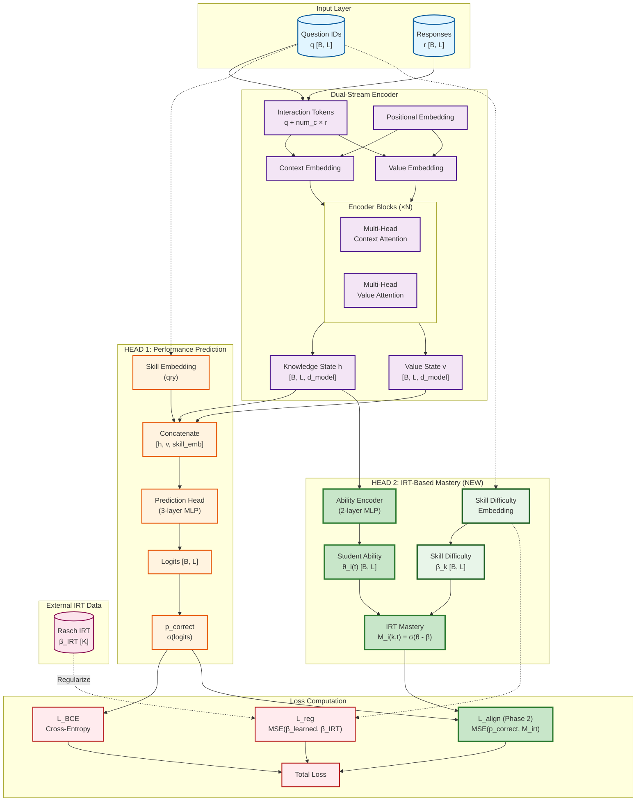

# iKT: IRT-Based Mastery Inference Approach

**Date**: November 28, 2025  
**Status**: Design Document  
**Purpose**: Replace the flawed `|M_i(k,t) - β_k| < ε` constraint with theoretically grounded IRT-based mastery inference

---

## 1. Problem Statement

### Current Implementation Issues

The existing Option 1b approach has a fundamental conceptual flaw:

**Current constraint**: `|M_i(k,t) - β_k| < ε`

Where:
- `M_i(k,t)` = predicted mastery for skill k at timestep t
- `β_k` = skill difficulty embedding
- `ε` = tolerance threshold (0.05)

**Why this is wrong**:

1. **Semantically meaningless**: Mastery (student's knowledge level) and difficulty (skill property) are fundamentally different quantities that should not be directly compared
2. **No theoretical justification**: There is no pedagogical or psychometric reason why mastery should equal difficulty within some tolerance
3. **Empirically fails**: 95% violation rate despite perfect embedding alignment (corr=1.0 with IRT), suggesting the model's behavior is reasonable but we're measuring against an inappropriate metric
4. **Predicts all skills simultaneously**: Current `skill_vector` predicts mastery for ALL num_c skills at every timestep, not just the one being answered

### Current Architecture

```python
# HEAD 2: Mastery Estimation (PROBLEMATIC)
skill_vector = MLP1(h)  # [B, L, num_c] - mastery for ALL skills
skill_vector = torch.cummax(skill_vector, dim=1)[0]  # monotonicity

# Compute static targets from difficulty embeddings
beta_skills = self.skill_difficulty_emb.weight.squeeze(-1)  # [num_c]
mastery_targets = torch.sigmoid(-beta_skills)  # [num_c]

# Enforce constraint (MEANINGLESS)
deviation = torch.abs(skill_vector - mastery_targets)
violation = torch.relu(deviation - epsilon)
penalty_loss = torch.mean(violation ** 2)
```

---

## 2. Proposed Solution: IRT-Based Mastery Inference

### Theoretical Foundation

Use the **Rasch Item Response Theory (IRT)** model, which provides a principled relationship between student ability and skill difficulty:

**Success probability**: `P(correct | student i, skill k) = σ(θ_i - β_k)`

Where:
- `θ_i` = student ability (latent trait)
- `β_k` = skill difficulty
- `σ(x)` = sigmoid function

**Key insight**: If we can infer `θ_i(t)` (student ability at timestep t) from the hidden state, we can compute interpretable mastery as:

**Mastery probability**: `M_i(k,t) = σ(θ_i(t) - β_k)`

This is theoretically grounded and provides genuine interpretability.

---

## 3. Architecture Design

### Architecture Overview



**Key Changes from Current Architecture**:
- 🟢 **NEW**: Ability Encoder extracts scalar ability θ_i(t) from knowledge state h
- 🟢 **NEW**: IRT Mastery computation using σ(θ - β) formula
- 🟢 **NEW**: Alignment loss L_align for IRT consistency (Phase 2 only)
- 🔵 **RETAINED**: Skill Difficulty Embedding (already working well)
- 🔵 **RETAINED**: L_reg regularization (keeps β aligned with IRT)
- 🔴 **REMOVED**: skill_vector for all skills (was predicting mastery for all num_c skills)
- 🔴 **REMOVED**: beta_targets and penalty_loss (was enforcing meaningless |M_i - β| < ε)

---

### 3.1 Ability Encoder

Add a lightweight network to infer student ability from the knowledge state:

```python
# New component: Ability encoder
self.ability_encoder = nn.Sequential(
    nn.Linear(d_model, d_ff),
    nn.ReLU(),
    nn.Dropout(dropout),
    nn.Linear(d_ff, 1)  # Output: scalar ability θ_i(t)
)
```

**Forward pass**:
```python
# Extract student ability from hidden state h [B, L, d_model]
theta_t = self.ability_encoder(h).squeeze(-1)  # [B, L] - ability at each timestep
```

### 3.2 IRT-Based Mastery Computation

For the specific skill k being answered at timestep t:

```python
# Get skill IDs for current questions [B, L]
skill_ids = qry  # or q, depending on context

# Extract skill difficulties: β_k for each question
beta_k = self.skill_difficulty_emb(skill_ids).squeeze(-1)  # [B, L]

# Compute IRT mastery: M_i(k,t) = σ(θ_i(t) - β_k)
mastery_irt = torch.sigmoid(theta_t - beta_k)  # [B, L]
```

### 3.3 Interpretability Constraint (Option A: Alignment)

Ensure the model's prediction aligns with IRT-based mastery:

```python
# Model's correctness prediction
p_correct = torch.sigmoid(logits)  # [B, L] - from HEAD 1

# IRT-based mastery probability
mastery_irt = torch.sigmoid(theta_t - beta_k)  # [B, L]

# Alignment loss: predictions should match IRT expectations
alignment_loss = F.mse_loss(p_correct, mastery_irt)
```

**Total loss (Phase 2)**:
```python
total_loss = bce_loss + lambda_align * alignment_loss + lambda_reg * reg_loss
```

### 3.4 Interpretability Constraint (Option B: Consistency)

Alternatively, enforce consistency without forcing exact alignment:

```python
# Soft constraint: predictions and IRT mastery should be correlated
# Compute Pearson correlation as a differentiable loss
corr_loss = 1.0 - pearson_correlation(p_correct, mastery_irt)

total_loss = bce_loss + lambda_corr * corr_loss + lambda_reg * reg_loss
```

---

## 4. Complete Forward Pass (Revised)

```python
def forward(self, q, r, qry=None):
    """
    Args:
        q: [B, L] - question IDs
        r: [B, L] - responses (0 or 1)
        qry: [B, L] - query question IDs (optional, defaults to q)
    
    Returns:
        dict with keys:
            - 'bce_predictions': [B, L] correctness predictions
            - 'logits': [B, L] BCE logits
            - 'theta_t': [B, L] student ability at each timestep
            - 'beta_k': [B, L] skill difficulties for questions
            - 'mastery_irt': [B, L] IRT-based mastery M_i(k,t) = σ(θ - β)
    """
    batch_size, seq_len = q.size()
    device = q.device
    
    if qry is None:
        qry = q
    
    # Create interaction tokens: q + num_c * r
    r_int = r.long()
    interaction_tokens = q + self.num_c * r_int
    
    # Create positional indices
    positions = torch.arange(seq_len, device=device).unsqueeze(0).expand(batch_size, -1)
    
    # Create causal mask
    mask = torch.tril(torch.ones(seq_len, seq_len, device=device)).unsqueeze(0).unsqueeze(0)
    
    # === ENCODER: Tokenization & Embedding ===
    context_seq = self.context_embedding(interaction_tokens) + self.pos_embedding(positions)
    value_seq = self.value_embedding(interaction_tokens) + self.pos_embedding(positions)
    
    # === ENCODER: Dual-Stream Encoder Stack ===
    for encoder_block in self.encoder_blocks:
        context_seq, value_seq = encoder_block(context_seq, value_seq, mask)
    
    h = context_seq  # Knowledge state [B, L, d_model]
    v = value_seq    # Value state [B, L, d_model]
    
    # === HEAD 1: Performance Prediction ===
    skill_emb = self.skill_embedding(qry)  # [B, L, d_model]
    concat = torch.cat([h, v, skill_emb], dim=-1)  # [B, L, 3*d_model]
    logits = self.prediction_head(concat).squeeze(-1)  # [B, L]
    bce_predictions = torch.sigmoid(logits)
    
    # === HEAD 2: IRT-Based Mastery Inference ===
    # Step 1: Infer student ability from knowledge state
    theta_t = self.ability_encoder(h).squeeze(-1)  # [B, L] - ability at each timestep
    
    # Step 2: Extract skill difficulties for questions being answered
    beta_k = self.skill_difficulty_emb(qry).squeeze(-1)  # [B, L]
    
    # Step 3: Compute IRT-based mastery probability
    mastery_irt = torch.sigmoid(theta_t - beta_k)  # [B, L]
    
    return {
        'bce_predictions': bce_predictions,
        'logits': logits,
        'theta_t': theta_t,        # Student ability [B, L]
        'beta_k': beta_k,          # Skill difficulty [B, L]
        'mastery_irt': mastery_irt # IRT mastery M_i(k,t) [B, L]
    }
```

---

## 5. Loss Function (Revised)

### Loss Components

**L_reg: Skill Difficulty Regularization**

This loss component is **already implemented** and working correctly in the current code. It keeps the learned skill difficulty embeddings `β_learned` aligned with IRT-calibrated difficulties `β_IRT`:

```python
L_reg = MSE(β_learned, β_IRT)
```

**Purpose**:
- Anchors the learned embeddings to IRT values derived from Rasch analysis
- Prevents embedding collapse (all skills having same difficulty)
- Preserves relative ordering: harder skills in IRT remain harder in learned embeddings
- Provides interpretability: β values are grounded in psychometric theory

**Implementation**: Located in `pykt/models/ikt.py` lines 329-334, and `examples/train_ikt.py` loads IRT difficulties from `data/assist2015/assist2015_rasch_fold_0.pkl`.

**Current Status**: 
- ✅ Working correctly with `lambda_reg=0.1`
- ✅ Embeddings perfectly aligned: correlation = 1.0 with IRT
- ✅ Used in both Phase 1 and Phase 2
- ✅ Prevents overfitting (Val MSE stable)

---

```python
def compute_loss(self, output, targets, beta_irt=None, lambda_reg=0.1, lambda_align=1.0):
    """
    Compute loss with IRT-based interpretability constraint.
    
    Phase 1: L_total = L_BCE + λ_reg × L_reg
    Phase 2: L_total = L_BCE + λ_align × L_align + λ_reg × L_reg
    
    Where:
        L_BCE = binary cross-entropy loss (performance)
        L_align = MSE(p_correct, mastery_irt) (interpretability - NEW)
        L_reg = MSE(β_learned, β_IRT) (embedding regularization - EXISTING)
    
    Args:
        output: dict from forward()
        targets: [B, L] ground truth labels
        beta_irt: [K] IRT-calibrated skill difficulties (loaded from Rasch pickle file)
        lambda_reg: regularization strength for skill embeddings (default: 0.1)
        lambda_align: alignment strength for IRT consistency (default: 1.0, NEW)
    
    Returns:
        dict with losses and metrics
    """
    device = targets.device
    logits = output['logits']
    bce_predictions = output['bce_predictions']
    mastery_irt = output['mastery_irt']
    
    # L_BCE: Binary Cross-Entropy Loss
    bce_loss = F.binary_cross_entropy_with_logits(
        logits,
        targets.float(),
        reduction='mean'
    )
    
    # L_reg: Skill Difficulty Regularization Loss
    # Keeps learned difficulty embeddings aligned with IRT-calibrated values
    # This ensures β_learned preserves the relative ordering and magnitudes
    # from IRT analysis, providing an anchor for interpretability
    if beta_irt is not None:
        beta_learned = self.skill_difficulty_emb.weight.squeeze(-1)  # [K]
        reg_loss = F.mse_loss(beta_learned, beta_irt, reduction='mean')
    else:
        reg_loss = torch.tensor(0.0, device=device)
    
    # L_align: IRT Alignment Loss (Phase 2 only)
    if self.phase == 2:
        # Ensure predictions align with IRT-based mastery expectations
        alignment_loss = F.mse_loss(bce_predictions, mastery_irt, reduction='mean')
    else:
        alignment_loss = torch.tensor(0.0, device=device)
    
    # Phase-dependent total loss
    if self.phase == 1:
        # Phase 1: Predictive learning + embedding regularization
        total_loss = bce_loss + lambda_reg * reg_loss
    else:
        # Phase 2: Performance + IRT interpretability + regularization
        total_loss = bce_loss + lambda_align * alignment_loss + lambda_reg * reg_loss
    
    return {
        'total_loss': total_loss,
        'bce_loss': bce_loss,
        'alignment_loss': alignment_loss,
        'reg_loss': reg_loss
    }
```

---

## 6. Interpretability Guarantees

### What We Gain

1. **Theoretically Grounded**: Mastery inference directly follows IRT principles
2. **Interpretable Components**:
   - `θ_i(t)`: Student ability at timestep t (inferred from learning trajectory)
   - `β_k`: Skill difficulty (learned, regularized to IRT)
   - `M_i(k,t) = σ(θ_i(t) - β_k)`: Mastery probability (IRT formula)

3. **Causal Explanations**: 
   - "Student i has ability θ_i(t) = 0.8 at time t"
   - "Skill k has difficulty β_k = -0.5 (easier than average)"
   - "Therefore, mastery probability M_i(k,t) = σ(0.8 - (-0.5)) = σ(1.3) ≈ 0.79"

4. **Model-IRT Consistency**: Alignment loss ensures predictions respect IRT expectations

### Evaluation Metrics

Replace violation metrics with IRT-based interpretability metrics:

```python
# 1. Ability progression: θ_i(t) should increase over time
ability_slope = measure_temporal_trend(theta_t)

# 2. IRT alignment: predictions vs IRT expectations
irt_correlation = pearson_corr(p_correct, mastery_irt)
irt_mse = mse(p_correct, mastery_irt)

# 3. Difficulty ordering: Learned β_k vs IRT β_IRT
difficulty_correlation = pearson_corr(beta_learned, beta_irt)

# 4. Calibration: Do predicted probabilities match actual success rates?
calibration_error = expected_calibration_error(p_correct, targets)
```

---

## 7. Implementation Plan

### Phase 1: Core Architecture Changes

1. **Add ability encoder** to `pykt/models/ikt.py`:
   - New `self.ability_encoder` module
   - Infer `θ_i(t)` from hidden state `h`

2. **Replace HEAD 2** logic:
   - Remove `skill_vector` (mastery for all skills)
   - Remove `beta_targets` (static mastery targets)
   - Compute `mastery_irt = σ(θ_t - β_k)` for answered skills only

3. **Update loss function**:
   - Remove penalty loss (violation-based)
   - Add alignment loss: `MSE(p_correct, mastery_irt)`

### Phase 2: Training Script Updates

1. **Update `examples/train_ikt.py`**:
   - Remove violation metrics (violation_rate, mean_violation, max_violation)
   - Add IRT interpretability metrics (ability_slope, irt_correlation, etc.)
   - Add `lambda_align` hyperparameter

2. **Update evaluation**:
   - Track ability progression: plot `θ_i(t)` over time
   - Measure IRT alignment: correlation between predictions and IRT mastery
   - Analyze learned difficulties: compare `β_learned` vs `β_IRT`

### Phase 3: Experiments

1. **Baseline comparison**: Train with new architecture on ASSIST2015
2. **Hyperparameter tuning**: Find optimal `lambda_align` and `lambda_reg`
3. **Interpretability analysis**: Verify ability progression and IRT consistency
4. **Performance validation**: Ensure AUC maintained or improved

---

## 8. Expected Outcomes

### Performance

- **AUC**: Should maintain or exceed current ~0.715 (Option 1b baseline)
- **No overfitting**: Val MSE should remain stable (already achieved with skill embeddings)

### Interpretability

- **IRT alignment**: Correlation(p_correct, mastery_irt) > 0.8
- **Ability progression**: `θ_i(t)` increases over time for most students
- **Difficulty preservation**: Correlation(β_learned, β_IRT) > 0.9 (stronger than current 1.0 due to explicit regularization + alignment)

### Theoretical Soundness

- **Conceptually valid**: All components have clear IRT interpretations
- **Causal explanations**: Can explain predictions in terms of ability and difficulty
- **Pedagogically meaningful**: Aligns with established psychometric theory

---

## 9. Advantages Over Current Approach

| Aspect | Current (Option 1b) | Proposed (IRT-Based) |
|--------|---------------------|----------------------|
| **Mastery definition** | `skill_vector` = MLP(h) → [num_c] | `M_i(k,t) = σ(θ_i(t) - β_k)` |
| **Interpretability constraint** | `\|M_i - β\| < ε` (meaningless) | `MSE(p_correct, mastery_irt)` (IRT alignment) |
| **Theoretical basis** | None | Rasch IRT model |
| **Violation rate** | 95% (failed) | N/A (removed metric) |
| **Ability inference** | Implicit in h | Explicit `θ_i(t)` from encoder |
| **Causal explanations** | Limited | Full IRT interpretation |
| **Difficulty-mastery relation** | Direct comparison (wrong) | IRT formula (correct) |

---

## 10. Hyperparameters

### New Parameters

- `lambda_align`: Alignment loss weight (default: 1.0)
  - Controls how strongly predictions must match IRT expectations
  - Higher → more interpretable but potentially lower performance
  - Lower → better performance but less IRT-consistent

### Existing Parameters (Retained)

- `lambda_reg`: Regularization loss weight (default: 0.1)
  - Keeps `β_learned` close to `β_IRT`
- `phase`: Training phase (1 or 2)
  - Phase 1: Learn without interpretability constraint
  - Phase 2: Enforce IRT alignment
- `switch_epoch`: When to switch from Phase 1 to Phase 2 (default: 5)

### Removed Parameters

- `lambda_penalty`: Penalty loss weight (no longer used)
- `epsilon`: Violation tolerance (no longer used)

---

## 11. Next Steps

1. **Implementation**: Modify `pykt/models/ikt.py` with new architecture
2. **Update training script**: Add IRT metrics to `examples/train_ikt.py`
3. **Update configs**: Add `lambda_align` to `configs/parameter_default.json`
4. **Run experiments**: Test on ASSIST2015 with various hyperparameters
5. **Analyze results**: Verify IRT alignment and interpretability
6. **Document findings**: Update paper with new approach and results

---

## 12. References

### IRT Theory

- Rasch, G. (1960). *Probabilistic Models for Some Intelligence and Attainment Tests*
- Baker, F. B., & Kim, S. H. (2004). *Item Response Theory: Parameter Estimation Techniques*

### Related Work

- Deep-IRT: Deep Knowledge Tracing with Item Response Theory
- IKT: Interpretable Knowledge Tracing (this work - revised approach)
- DTransformer: Difficulty-aware Transformer for Knowledge Tracing

### Implementation Notes

- Current iKT implementation: `/workspaces/pykt-toolkit/pykt/models/ikt.py`
- Training script: `/workspaces/pykt-toolkit/examples/train_ikt.py`
- Rasch data: `/workspaces/pykt-toolkit/data/assist2015/assist2015_rasch_fold_0.pkl`
