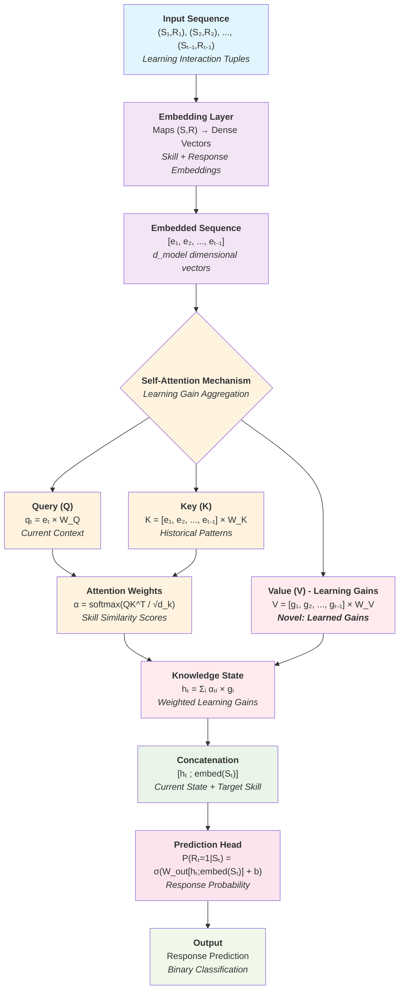
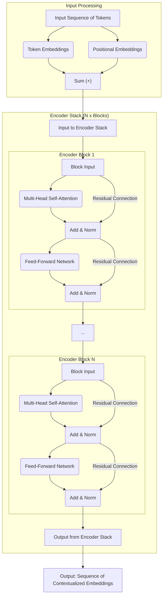
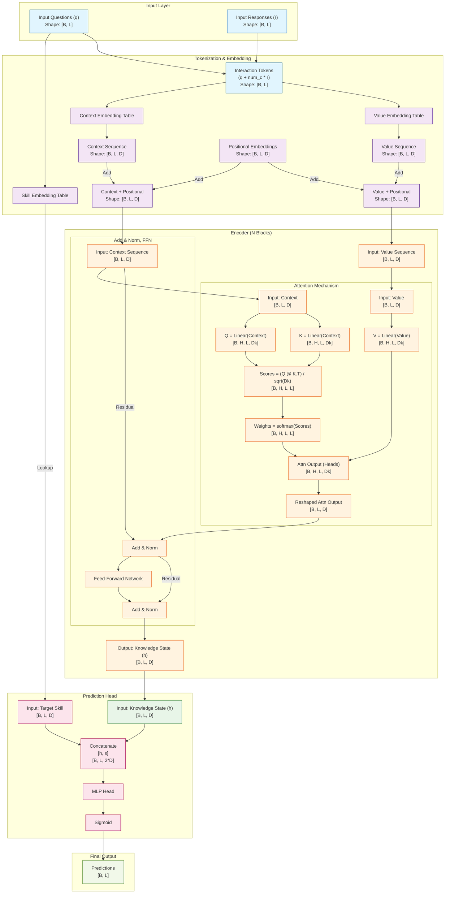
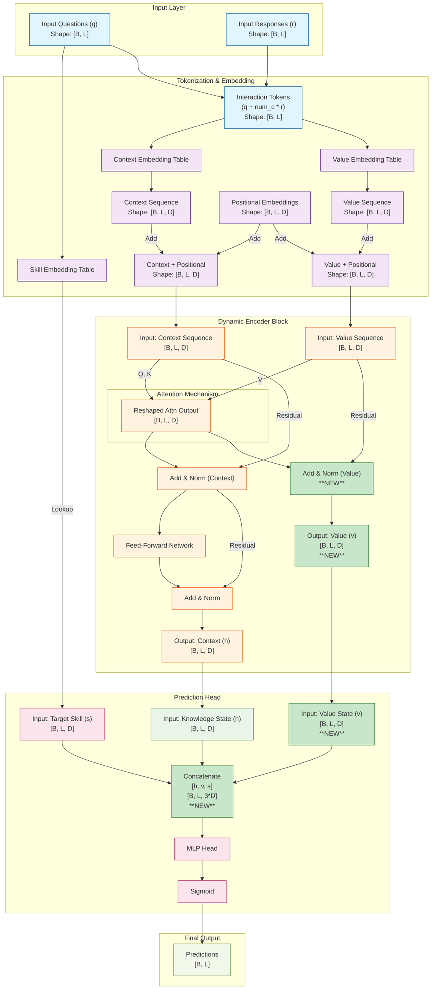
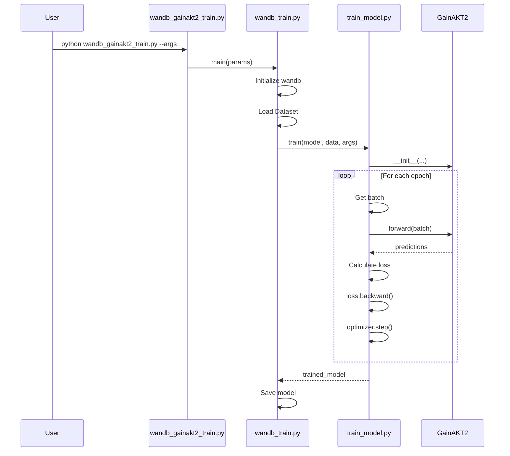

# New Model Architecture

## Introduction

We are looking to contribute a new Transformer attention-based model with good balance between performance (competive in terms of AUC with state of the art attention-based models) and interpretability. 

We approach interpretability through the lens of causal explanations. The main contribution will be a model that learns the *learning gains* obtained by the student in each interaction in a context-dependent way. The model is able to output not only good predictions but also the progression of the knowledge state of the student along the learning path. 

The abstract of the paper is as follows: 

    Modeling the dynamic evolution of student knowledge states is essential for advancing personalized education. This paper introduces a novel Transformer-based model that leverages attention mechanisms to learn context-aware learning gains, i.e. how each specific interaction contributes to the evolution of the student knowledge state. This allows not only to predict the correctness of responses but also to track the evolution of skills mastery.

    Our evaluation across multiple educational datasets demonstrates that the proposed model achieves competitive predictive performance compared to state-of-the-art Deep Knowledge Tracing models. More importantly, it offers significantly improved interpretability by explicitly modeling the evolution of knowledge states and the underlying causal mechanisms based on learning gains. This advancement enhances the explainability of predictions, making the model more transparent and actionable for educators and learners.

    This research contributes to the development of intelligent tutoring systems by enabling accurate and interpretable predictive modeling. It lays the groundwork for open learning models, where students can visualize their learning progress. Additionally, it provides a robust framework for personalized learning design and targeted educational interventions, empowering teachers to monitor student progress, deliver precise feedback, and design courses tailored to individual learning needs.

## From a As-Is to a To-Be architecture design 

We start with a As-Is initial architecture and evolve it progresively towards a To-Be architecture.  


## The Gains Approach

The new model is an encoder-only with self-attention on interaction (S, R) tuples to learn tuple learning gains. 

The fundamental innovation of this approach lies in the reformulation of the attention mechanism to directly compute and aggregate learning gains. It is described in sections below. 


## Architectural Design Requirements

### Core Innovation

The fundamental innovation of this approach lies in the reformulation of the attention mechanism to directly compute and aggregate learning gains. Instead of treating attention weights as abstract importance scores, this architecture learns to:

1. **Identify relevant interaction tuples**: Through Q·K^T matching, the model learns to identify (S, R) tuples that involve similar knowledge components
2. **Quantify learning gains**: Values in the attention mechanism represent the learning gains induced by specific interactions
3. **Aggregate knowledge states**: Knowledge states are computed as weighted linear combinations of learning gains

### Token Representation

```text
Tokens = (S, R) tuples
Where:
- S: Skill/Concept/Knowledge Component identifier
- R: Response (0 for incorrect, 1 for correct)
```

Each token represents a discrete learning interaction, encapsulating both the skill being practiced and the outcome of that practice.

### Architecture Components

#### 1. Embedding Layer

- **Input**: (S, R) tuples from learning trajectories
- **Output**: Dense embeddings that capture both skill semantics and response patterns
- **Function**: Maps discrete (S, R) pairs to continuous vector space

#### 2. Self-Attention Mechanism with Learning Gains

The core architectural innovation is the redefinition of the attention mechanism components:

```text
Query (Q): Learned representation of current interaction context
Key (K): Learned representation of historical interaction patterns  
Value (V): Learning gains induced by (S, R) interactions
```

The attention computation follows:

```text
Attention(Q, K, V) = softmax(QK^T/sqrt(d_k))V
```

However, the semantic meaning is fundamentally different:

- **QK^T matching**: Learns to identify relevant historical interactions based on skill similarity
- **Attention weights**: Represent the relevance of past learning gains to current knowledge state
- **Weighted sum**: Aggregates relevant learning gains to compute current knowledge state

#### 3. Knowledge State Computation

Knowledge states at each time step are calculated as:

```text
Knowledge_State_t = sum(attention_weights_i * learning_gains_i)
```

This formulation provides direct interpretability: each component of the knowledge state can be traced back to specific learning gains from relevant interactions.

### Learning Mechanism

#### 1. Objective Function

The model learns through backpropagation on prediction loss, which drives the attention mechanism to:

- Assign high attention weights to interactions with similar knowledge components
- Learn appropriate learning gain values that contribute to accurate predictions
- Develop representations that capture skill relationships and learning dynamics

#### 2. Training Dynamics

During training, the model automatically learns to:

- **Match similar skills**: Q·K^T computation learns to identify interactions involving the same or related knowledge components
- **Quantify learning impact**: Values learn to represent the actual learning gains from specific interactions
- **Aggregate effectively**: Attention weights learn to combine learning gains optimally for prediction

#### 3. Emergent Similarity

Unlike hand-crafted similarity metrics, the model develops an emergent understanding of skill similarity through the optimization process. When interactions with similar knowledge components consistently lead to similar learning outcomes, the model learns to give them high attention scores.

## Mathematical Formulation

### Attention Mechanism as Learning Gain Aggregation

Given a sequence of interactions up to time step t, the knowledge state is computed as:

```text
h_t = sum_{i=1}^{t-1} alpha_{t,i} * g_i
```

Where:

- `h_t`: Knowledge state at time t
- `alpha_{t,i}`: Attention weight between current context t and past interaction i
- `g_i`: Learning gain induced by interaction i (stored as value in attention)

The attention weights are computed as:

```text
alpha_{t,i} = softmax(q_t^T k_i / sqrt(d_k))
```

Where:

- `q_t`: Query vector representing current learning context
- `k_i`: Key vector representing past interaction pattern
- `d_k`: Scaling dimension

### Learning Gain Representation

Each learning gain `g_i` is represented as a dense vector that captures:

- **Skill-specific gains**: Components corresponding to different knowledge components
- **Response-dependent effects**: How correct/incorrect responses affect learning
- **Transfer effects**: How learning in one skill affects related skills

### Prediction Layer

The final response prediction is computed as:

```text
P(R_t = 1 | S_t, h_t) = sigma(W_out [h_t; embed(S_t)] + b_out)
```

Where:

- `sigma`: Sigmoid activation
- `W_out`: Output projection weights
- `embed(S_t)`: Embedding of current skill
- `h_t`: Aggregated knowledge state


## Advantages Over Alternative Approaches

### 1. Interpretability

- **Direct Learning Gain Computation**: Values directly represent learning gains, enabling clear interpretation
- **Traceable Knowledge States**: Each knowledge state component can be attributed to specific interactions
- **Causal Explanations**: The model provides clear explanations for why certain interactions influence predictions

### 2. Simplicity

- **Single Architecture**: No need for separate encoders or complex memory systems
- **End-to-end Learning**: All components learned jointly through standard backpropagation
- **Fewer Hyperparameters**: Simpler architecture reduces hyperparameter tuning complexity

### 3. Educational Alignment

- **Learning Gain Semantics**: Directly models educational concepts familiar to practitioners
- **Skill-based Organization**: Natural alignment with Q-matrix and G-matrix educational frameworks
- **Progressive Learning**: Models cumulative learning through gain aggregation

### 4. Computational Efficiency

- **Standard Transformer**: Leverages well-optimized transformer implementations
- **No External Memory**: No need for student encoding banks or similarity computations
- **Scalable**: Standard attention complexity O(n^2) with established optimization techniques

## Key Innovation

The fundamental innovation in this approach lies in the **semantic redefinition of attention mechanism components** to directly model educational learning processes:

### Semantic Component Redefinition

- **Traditional Attention**: Abstract importance weighting between sequence elements
- **SimAKT Innovation**: Direct computation and aggregation of concrete learning gains from educational interactions

### Novel Value Semantics

- **Query (Q)**: Represents current learning context and knowledge state requirements
- **Key (K)**: Represents historical interaction patterns and skill-based similarities  
- **Value (V)**: **Explicitly models learning gains** induced by specific (S,R) interactions

### Emergent Skill Similarity Learning

- No hand-crafted similarity metrics required
- Model learns to identify related skills through Q·K^T matching during training
- Attention weights naturally emerge to represent educational relevance between interactions

### Interpretability Benefits

This architectural design provides interpretability for knowledge tracing models through multiple complementary mechanisms:

#### Direct Learning Gain Interpretation

- **Traceable Knowledge States**: Each component of the knowledge state vector can be directly attributed to specific learning gains from identifiable interactions
- **Educational Semantics**: Values in the attention mechanism have clear educational meaning (actual learning increments)
- **Quantifiable Impact**: The contribution of each past interaction to current predictions is explicitly computed and interpretable

#### Causal Explanation Capabilities

- **Interaction-Level Causality**: Model can explain which specific past interactions (S,R pairs) most influenced a prediction
- **Skill Transfer Visualization**: Attention weights reveal how learning in one skill affects performance in related skills
- **Learning Trajectory Analysis**: Complete learning progression can be reconstructed through the sequence of aggregated gains

#### Educational Alignment

- **Q-matrix Compatibility**: Natural integration with established knowledge component frameworks
- **G-matrix Learning**: Learned gains approximate and extend traditional G-matrix concepts with data-driven insights
- **Practitioner-Friendly**: Outputs align with familiar educational concepts (skills, mastery, learning gains)

## Theoretical Foundation

### Learning Gain Theory

This approach is grounded in educational psychology's learning gain theory, which posits that:

- Learning occurs through discrete interactions with problems/skills
- Each interaction produces a measurable learning gain
- Knowledge states evolve through accumulation of learning gains
- Similar skills produce transferable learning gains

### Attention as Learning Gain Aggregation

The reformulation of attention as learning gain aggregation provides:

- **Theoretical Justification**: Aligns with established educational theory
- **Interpretable Weights**: Attention scores represent educational relevance
- **Causal Modeling**: Direct modeling of learning cause-and-effect relationships

### Connection to Q-matrix and G-matrix

This approach naturally aligns with established educational frameworks:

- **Q-matrix Integration**: The skill identifiers S directly correspond to Q-matrix knowledge components
- **G-matrix Learning**: The learned values (learning gains) approximate the G-matrix entries, but are learned from data rather than pre-specified
- **Dynamic G-matrix**: Unlike static G-matrices, learned gains can capture individual differences and contextual effects

## Expected Contributions

### 1. Methodological Contributions

- Novel attention mechanism semantics for knowledge tracing
- Direct modeling of learning gains in neural architectures
- Unified framework for prediction and interpretation

### 2. Educational Contributions

- Interpretable knowledge state evolution modeling
- Causal explanations for learning predictions
- Alignment with established educational theory

### 3. Technical Contributions

- Efficient implementation of learning gain aggregation
- Scalable architecture for large educational datasets
- Framework for educational AI interpretability

## Comparison with Previous Approaches

### Versus Encoder-only with Inter-student Head

- **Simplicity**: No need for external student encoding or memory banks
- **End-to-end Learning**: All similarity learning happens through backpropagation
- **Interpretability**: Direct learning gain interpretation vs. abstract similarity scores

### Versus Decoder-only Trajectory Matching

- **Complexity**: Simpler architecture with clearer educational semantics
- **Alignment**: Better aligned with initial paper proposal focusing on learning gains
- **Implementation**: More straightforward implementation path

This encoder-only approach with learning gains represents a promising direction for SimAKT that balances predictive performance with interpretability requirements, providing a solid foundation for both research contributions and practical educational applications.

## To-Be Architectural Diagram Requirements




## Typical Encoder

The typical architecture of a standard, generic, encoder-only Transformer is illustrated in the diagram below. 




## Baseline models
```
PYKT Benchmark Results Summary (Question-Level AUC):
- AKT: 0.7853 (AS2009), 0.8306 (AL2005), 0.8208 (BD2006), 0.8033 (NIPS34) - **Best overall**
- SAKT: 0.7246 (AS2009), 0.7880 (AL2005), 0.7740 (BD2006), 0.7517 (NIPS34)
- SAINT: 0.6958 (AS2009), 0.7775 (AL2005), 0.7781 (BD2006), 0.7873 (NIPS34)

Other benchmarks: 
- simpleKT 0.7744 (AS2009) 0.7248 (AS2015) - Reported as strong baseline with minimal complexity
```

## Comparison


| Model | Dataset | Test AUC | Test ACC | Valid AUC | Valid ACC | Best Epoch | Notes |
|-------|---------|----------|----------|-----------|-----------|------------|--------|
| **GainSAKT** | ASSIST2015 | -1 | -1 | 0.6868 | 0.7475 | 18 | Early implementation |
| **GainAKT2** | ASSIST2015 | -1 | -1 | 0.7184 | 0.7507 | 3 | Default parameters (quick) |
| **GainAKT2** | ASSIST2015 | -1 | -1 | **0.7224** | **0.7531** | 3 | Tuned parameters (slow) |

| Model | AS2009 | AS2015 | AL2005 | BD2006 | NIPS34 | Notes |
|-------|--------|--------|--------|--------|--------|--------|
| **AKT** | 0.7853 | **0.7281** |*0.8306 | 0.8208 | 0.8033 | Best overall |
| **SAKT** | 0.7246 | **0.7114** | 0.7880 | 0.7740 | 0.7517 | Strong attention baseline |
| **SAINT** | 0.6958 | **0.7020** | 0.7775 | 0.7781 | 0.7873 | Encoder-decoder |
| **simpleKT** | 0.7744 | **0.7248** | - | - | - | Simple but effective |

1. **GainAKT2 shows improvement over GainSAKT**: 
   - GainAKT2 achieved 0.7184 valid AUC vs GainSAKT's 0.6868
   - This represents a ~4.6% improvement in validation AUC

2. **Performance vs Baselines**:
   - GainAKT2 (0.7184) is competitive with simpleKT on AS2015 (0.7248)
   - Still below top performers like AKT, but approaching strong baselines
   - Shows promise for the learning gains approach

3. **Training Efficiency**:
   - GainAKT2 converged quickly (best epoch 3 vs 18 for GainSAKT)
   - Suggests better optimization dynamics with the revised architecture

4. **Parameter Sensitivity**:
   - Default parameters performed better than the tuned configuration
   - Indicates the model may prefer simpler configurations initially

The results show that the learning gains approach is viable and improving, with GainAKT2 demonstrating competitive performance against established baselines while maintaining the interpretability advantages of explicit learning gain modeling.

## Architecture Design Decission

We have explored in detail two possible directions: 
- Start Fresh: define architecture requirements and implement them using a standard transformer architecture that complies with To-Be requirements. 
- Use a baseline model as starting point and evolve it to implement the requirements of our novel proposal. 

Finally, we decided to go with the fresh start direction since a first implementaion based on this obtained promising results. We think that none of the baseline available models in pykt framework is simple enough as to support a quick and suitable adaptation. 

### Architecture Design

We have explored the options described in gainakt_phase1_alternatives_gainscomputation.md. Finally we decided to choose the one described in the "Option 4" section. The gainakt2.py model is based in this option. Curently it obtains best AUC than the gainakt.py model that is based in other options. 



#### Dynamic Value Stream Architecture

This version of the architecture modifies the encoder block to create a dynamic value stream, where the value representations are updated at each layer. The nodes highlighted in green represent the changes from the original architecture.



### Workflow

This diagram illustrates the end-to-end training workflow initiated by the `python examples/wandb_gainakt2_train.py` command.

