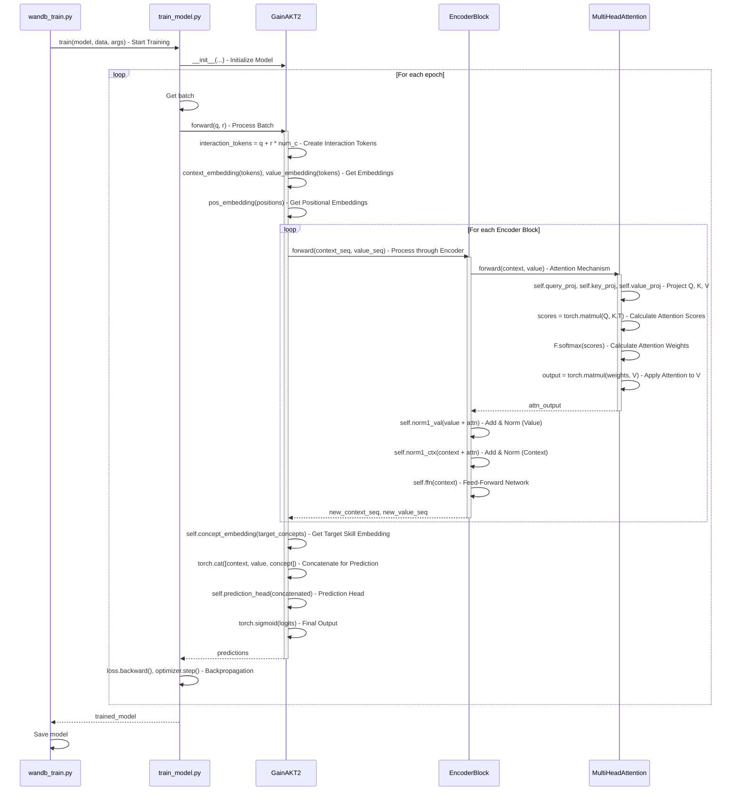

# New Model Architecture

## Introduction

We are looking to contribute a new Transformer attention-based model with good balance between performance (competive in terms of AUC with state of the art attention-based models) and interpretability. 

We approach interpretability through the lens of causal explanations. The main contribution will be a model that learns the *learning gains* obtained by the student in each interaction in a context-dependent way. The model is able to output not only good predictions but also the progression of the knowledge state of the student along the learning path. 

The abstract of the paper is as follows: 

    Modeling the dynamic evolution of student knowledge states is essential for advancing personalized education. This paper introduces a novel Transformer-based model that leverages attention mechanisms to learn context-aware learning gains, i.e. how each specific interaction contributes to the evolution of the student knowledge state. This allows not only to predict the correctness of responses but also to track the evolution of skills mastery.

    Our evaluation across multiple educational datasets demonstrates that the proposed model achieves competitive predictive performance compared to state-of-the-art Deep Knowledge Tracing models. More importantly, it offers significantly improved interpretability by explicitly modeling the evolution of knowledge states and the underlying causal mechanisms based on learning gains. This advancement enhances the explainability of predictions, making the model more transparent and actionable for educators and learners.

    This research contributes to the development of intelligent tutoring systems by enabling accurate and interpretable predictive modeling. It lays the groundwork for open learning models, where students can visualize their learning progress. Additionally, it provides a robust framework for personalized learning design and targeted educational interventions, empowering teachers to monitor student progress, deliver precise feedback, and design courses tailored to individual learning needs.

## From a As-Is to a To-Be architecture design 

We start with a As-Is initial architecture and evolve it progresively towards a To-Be architecture.  


## The Gains Approach

The new model is an encoder-only with self-attention on interaction (S, R) tuples to learn tuple learning gains. 

The fundamental innovation of this approach lies in the reformulation of the attention mechanism to directly compute and aggregate learning gains. It is described in sections below. 


## Architectural Design Requirements

### Core Innovation

The fundamental innovation of this approach lies in the reformulation of the attention mechanism to directly compute and aggregate learning gains. Instead of treating attention weights as abstract importance scores, this architecture learns to:

1. **Identify relevant interaction tuples**: Through Q·K^T matching, the model learns to identify (S, R) tuples that involve similar knowledge components
2. **Quantify learning gains**: Values in the attention mechanism represent the learning gains induced by specific interactions
3. **Aggregate knowledge states**: Knowledge states are computed as weighted linear combinations of learning gains

### Token Representation

```text
Tokens = (S, R) tuples
Where:
- S: Skill/Concept/Knowledge Component identifier
- R: Response (0 for incorrect, 1 for correct)
```

Each token represents a discrete learning interaction, encapsulating both the skill being practiced and the outcome of that practice.

### Architecture Components

#### 1. Embedding Layer

- **Input**: (S, R) tuples from learning trajectories
- **Output**: Dense embeddings that capture both skill semantics and response patterns
- **Function**: Maps discrete (S, R) pairs to continuous vector space

#### 2. Self-Attention Mechanism with Learning Gains

The core architectural innovation is the redefinition of the attention mechanism components:

```text
Query (Q): Learned representation of current interaction context
Key (K): Learned representation of historical interaction patterns  
Value (V): Learning gains induced by (S, R) interactions
```

The attention computation follows:

```text
Attention(Q, K, V) = softmax(QK^T/sqrt(d_k))V
```

However, the semantic meaning is fundamentally different:

- **QK^T matching**: Learns to identify relevant historical interactions based on skill similarity
- **Attention weights**: Represent the relevance of past learning gains to current knowledge state
- **Weighted sum**: Aggregates relevant learning gains to compute current knowledge state

#### 3. Knowledge State Computation

Knowledge states at each time step are calculated as:

```text
Knowledge_State_t = sum(attention_weights_i * learning_gains_i)
```

This formulation provides direct interpretability: each component of the knowledge state can be traced back to specific learning gains from relevant interactions.

### Learning Mechanism

#### 1. Objective Function

The model learns through backpropagation on prediction loss, which drives the attention mechanism to:

- Assign high attention weights to interactions with similar knowledge components
- Learn appropriate learning gain values that contribute to accurate predictions
- Develop representations that capture skill relationships and learning dynamics

#### 2. Training Dynamics

During training, the model automatically learns to:

- **Match similar skills**: Q·K^T computation learns to identify interactions involving the same or related knowledge components
- **Quantify learning impact**: Values learn to represent the actual learning gains from specific interactions
- **Aggregate effectively**: Attention weights learn to combine learning gains optimally for prediction

#### 3. Emergent Similarity

Unlike hand-crafted similarity metrics, the model develops an emergent understanding of skill similarity through the optimization process. When interactions with similar knowledge components consistently lead to similar learning outcomes, the model learns to give them high attention scores.

## Mathematical Formulation

### Attention Mechanism as Learning Gain Aggregation

Given a sequence of interactions up to time step t, the knowledge state is computed as:

```text
h_t = sum_{i=1}^{t-1} alpha_{t,i} * g_i
```

Where:

- `h_t`: Knowledge state at time t
- `alpha_{t,i}`: Attention weight between current context t and past interaction i
- `g_i`: Learning gain induced by interaction i (stored as value in attention)

The attention weights are computed as:

```text
alpha_{t,i} = softmax(q_t^T k_i / sqrt(d_k))
```

Where:

- `q_t`: Query vector representing current learning context
- `k_i`: Key vector representing past interaction pattern
- `d_k`: Scaling dimension

### Learning Gain Representation

Each learning gain `g_i` is represented as a dense vector that captures:

- **Skill-specific gains**: Components corresponding to different knowledge components
- **Response-dependent effects**: How correct/incorrect responses affect learning
- **Transfer effects**: How learning in one skill affects related skills

### Prediction Layer

The final response prediction is computed as:

```text
P(R_t = 1 | S_t, h_t) = sigma(W_out [h_t; embed(S_t)] + b_out)
```

Where:

- `sigma`: Sigmoid activation
- `W_out`: Output projection weights
- `embed(S_t)`: Embedding of current skill
- `h_t`: Aggregated knowledge state


## Advantages Over Alternative Approaches

### 1. Interpretability

- **Direct Learning Gain Computation**: Values directly represent learning gains, enabling clear interpretation
- **Traceable Knowledge States**: Each knowledge state component can be attributed to specific interactions
- **Causal Explanations**: The model provides clear explanations for why certain interactions influence predictions

### 2. Simplicity

- **Single Architecture**: No need for separate encoders or complex memory systems
- **End-to-end Learning**: All components learned jointly through standard backpropagation
- **Fewer Hyperparameters**: Simpler architecture reduces hyperparameter tuning complexity

### 3. Educational Alignment

- **Learning Gain Semantics**: Directly models educational concepts familiar to practitioners
- **Skill-based Organization**: Natural alignment with Q-matrix and G-matrix educational frameworks
- **Progressive Learning**: Models cumulative learning through gain aggregation

### 4. Computational Efficiency

- **Standard Transformer**: Leverages well-optimized transformer implementations
- **No External Memory**: No need for student encoding banks or similarity computations
- **Scalable**: Standard attention complexity O(n^2) with established optimization techniques

## Key Innovation

The fundamental innovation in this approach lies in the **semantic redefinition of attention mechanism components** to directly model educational learning processes:

### Semantic Component Redefinition

- **Traditional Attention**: Abstract importance weighting between sequence elements
- **SimAKT Innovation**: Direct computation and aggregation of concrete learning gains from educational interactions

### Novel Value Semantics

- **Query (Q)**: Represents current learning context and knowledge state requirements
- **Key (K)**: Represents historical interaction patterns and skill-based similarities  
- **Value (V)**: **Explicitly models learning gains** induced by specific (S,R) interactions

### Emergent Skill Similarity Learning

- No hand-crafted similarity metrics required
- Model learns to identify related skills through Q·K^T matching during training
- Attention weights naturally emerge to represent educational relevance between interactions

### Interpretability Benefits

This architectural design provides interpretability for knowledge tracing models through multiple complementary mechanisms:

#### Direct Learning Gain Interpretation

- **Traceable Knowledge States**: Each component of the knowledge state vector can be directly attributed to specific learning gains from identifiable interactions
- **Educational Semantics**: Values in the attention mechanism have clear educational meaning (actual learning increments)
- **Quantifiable Impact**: The contribution of each past interaction to current predictions is explicitly computed and interpretable

#### Causal Explanation Capabilities

- **Interaction-Level Causality**: Model can explain which specific past interactions (S,R pairs) most influenced a prediction
- **Skill Transfer Visualization**: Attention weights reveal how learning in one skill affects performance in related skills
- **Learning Trajectory Analysis**: Complete learning progression can be reconstructed through the sequence of aggregated gains

#### Educational Alignment

- **Q-matrix Compatibility**: Natural integration with established knowledge component frameworks
- **G-matrix Learning**: Learned gains approximate and extend traditional G-matrix concepts with data-driven insights
- **Practitioner-Friendly**: Outputs align with familiar educational concepts (skills, mastery, learning gains)

## Theoretical Foundation

### Learning Gain Theory

This approach is grounded in educational psychology's learning gain theory, which posits that:

- Learning occurs through discrete interactions with problems/skills
- Each interaction produces a measurable learning gain
- Knowledge states evolve through accumulation of learning gains
- Similar skills produce transferable learning gains

### Attention as Learning Gain Aggregation

The reformulation of attention as learning gain aggregation provides:

- **Theoretical Justification**: Aligns with established educational theory
- **Interpretable Weights**: Attention scores represent educational relevance
- **Causal Modeling**: Direct modeling of learning cause-and-effect relationships

### Connection to Q-matrix and G-matrix

This approach naturally aligns with established educational frameworks:

- **Q-matrix Integration**: The skill identifiers S directly correspond to Q-matrix knowledge components
- **G-matrix Learning**: The learned values (learning gains) approximate the G-matrix entries, but are learned from data rather than pre-specified
- **Dynamic G-matrix**: Unlike static G-matrices, learned gains can capture individual differences and contextual effects

## Expected Contributions

### 1. Methodological Contributions

- Novel attention mechanism semantics for knowledge tracing
- Direct modeling of learning gains in neural architectures
- Unified framework for prediction and interpretation

### 2. Educational Contributions

- Interpretable knowledge state evolution modeling
- Causal explanations for learning predictions
- Alignment with established educational theory

### 3. Technical Contributions

- Efficient implementation of learning gain aggregation
- Scalable architecture for large educational datasets
- Framework for educational AI interpretability

## Comparison with Previous Approaches

### Versus Encoder-only with Inter-student Head

- **Simplicity**: No need for external student encoding or memory banks
- **End-to-end Learning**: All similarity learning happens through backpropagation
- **Interpretability**: Direct learning gain interpretation vs. abstract similarity scores

### Versus Decoder-only Trajectory Matching

- **Complexity**: Simpler architecture with clearer educational semantics
- **Alignment**: Better aligned with initial paper proposal focusing on learning gains
- **Implementation**: More straightforward implementation path

This encoder-only approach with learning gains represents a promising direction for SimAKT that balances predictive performance with interpretability requirements, providing a solid foundation for both research contributions and practical educational applications.

## To-Be Architectural Diagram Requirements

The workflow reflecting the proposed approach is as follows: 


## Typical Encoder

The typical architecture of a standard, generic, encoder-only Transformer is illustrated in the diagram below. 


## Baseline models
```
PYKT Benchmark Results Summary (Question-Level AUC):
- AKT: 0.7853 (AS2009), 0.8306 (AL2005), 0.8208 (BD2006), 0.8033 (NIPS34) - **Best overall**
- SAKT: 0.7246 (AS2009), 0.7880 (AL2005), 0.7740 (BD2006), 0.7517 (NIPS34)
- SAINT: 0.6958 (AS2009), 0.7775 (AL2005), 0.7781 (BD2006), 0.7873 (NIPS34)

Other benchmarks: 
- simpleKT 0.7744 (AS2009) 0.7248 (AS2015) - Reported as strong baseline with minimal complexity
```

## Comparison


| Model | Dataset | Test AUC | Test ACC | Valid AUC | Valid ACC | Best Epoch | Notes |
|-------|---------|----------|----------|-----------|-----------|------------|--------|
| **GainSAKT** | ASSIST2015 | -1 | -1 | 0.6868 | 0.7475 | 18 | Early implementation |
| **GainAKT2** | ASSIST2015 | -1 | -1 | 0.7184 | 0.7507 | 3 | Default parameters (quick) |
| **GainAKT2** | ASSIST2015 | -1 | -1 | **0.7224** | **0.7531** | 3 | Tuned parameters (slow) |

| Model | AS2009 | AS2015 | AL2005 | BD2006 | NIPS34 | Notes |
|-------|--------|--------|--------|--------|--------|--------|
| **AKT** | 0.7853 | **0.7281** |*0.8306 | 0.8208 | 0.8033 | Best overall |
| **SAKT** | 0.7246 | **0.7114** | 0.7880 | 0.7740 | 0.7517 | Strong attention baseline |
| **SAINT** | 0.6958 | **0.7020** | 0.7775 | 0.7781 | 0.7873 | Encoder-decoder |
| **simpleKT** | 0.7744 | **0.7248** | - | - | - | Simple but effective |

1. **GainAKT2 shows improvement over GainSAKT**: 
   - GainAKT2 achieved 0.7184 valid AUC vs GainSAKT's 0.6868
   - This represents a ~4.6% improvement in validation AUC

2. **Performance vs Baselines**:
   - GainAKT2 (0.7184) is competitive with simpleKT on AS2015 (0.7248)
   - Still below top performers like AKT, but approaching strong baselines
   - Shows promise for the learning gains approach

3. **Training Efficiency**:
   - GainAKT2 converged quickly (best epoch 3 vs 18 for GainSAKT)
   - Suggests better optimization dynamics with the revised architecture

4. **Parameter Sensitivity**:
   - Default parameters performed better than the tuned configuration
   - Indicates the model may prefer simpler configurations initially

The results show that the learning gains approach is viable and improving, with GainAKT2 demonstrating competitive performance against established baselines while maintaining the interpretability advantages of explicit learning gain modeling.

## Architecture Design Decission

We have explored in detail two possible directions: 
- Start Fresh: define architecture requirements and implement them using a standard transformer architecture that complies with To-Be requirements. 
- Use a baseline model as starting point and evolve it to implement the requirements of our novel proposal. 

Finally, we decided to go with the fresh start direction since a first implementaion based on this obtained promising results. We think that none of the baseline available models in pykt framework is simple enough as to support a quick and suitable adaptation. 

## Architecture Design

We have explored the options described in gainakt_phase1_alternatives_gainscomputation.md. Finally we decided to choose the one described in the "Option 4" section. The gainakt2.py model is based in this option. Curently it obtains best AUC than the gainakt.py model that is based in other options. 


### Dynamic Value Stream

This version of the architecture implements the To-Be requirements with a encoder-only attention-based architecture. It modifies the traditional structure of the encoder block, creating a dynamic value stream, where the value representations are updated at each layer. The nodes highlighted in green represent the changes from the original encoder-only Transformer architecture.

```mermaid
graph TD
    subgraph "Input Layer"
        direction LR
        Input_q["Input Questions (q)<br/>Shape: [B, L]"]
        Input_r["Input Responses (r)<br/>Shape: [B, L]"]
    end

    subgraph "Tokenization & Embedding"
        direction TB
        
        Tokens["Interaction Tokens<br/>(q + num_c * r)<br/>Shape: [B, L]"]
        
        Context_Emb["Context Embedding Table"]
        Value_Emb["Value Embedding Table"]
        Skill_Emb["Skill Embedding Table"]

        Tokens --> Context_Emb
        Tokens --> Value_Emb
        Input_q --> Skill_Emb

        Context_Seq["Context Sequence<br/>Shape: [B, L, D]"]
        Value_Seq["Value Sequence<br/>Shape: [B, L, D]"]
        Pos_Emb["Positional Embeddings<br/>Shape: [B, L, D]"]
        
        Context_Emb --> Context_Seq
        Value_Emb --> Value_Seq

        Context_Seq_Pos["Context + Positional<br/>Shape: [B, L, D]"]
        Value_Seq_Pos["Value + Positional<br/>Shape: [B, L, D]"]
        
        Context_Seq --"Add"--> Context_Seq_Pos
        Pos_Emb --"Add"--> Context_Seq_Pos
        Value_Seq --"Add"--> Value_Seq_Pos
        Pos_Emb --"Add"--> Value_Seq_Pos
    end

    Input_q --> Tokens
    Input_r --> Tokens

    subgraph "Dynamic Encoder Block"
        direction TB
        
        Encoder_Input_Context["Input: Context Sequence<br/>[B, L, D]"]
        Encoder_Input_Value["Input: Value Sequence<br/>[B, L, D]"]

        subgraph "Attention Mechanism"
            direction TB
            
            Attn_Input_Context["Input: Context<br/>[B, L, D]"]
            Attn_Input_Value["Input: Value<br/>[B, L, D]"]

            Proj_Q["Q = Linear(Context)<br/>[B, H, L, Dk]"]
            Proj_K["K = Linear(Context)<br/>[B, H, L, Dk]"]
            Proj_V["V = Linear(Value)<br/>[B, H, L, Dk]"]
            
            Attn_Input_Context --> Proj_Q
            Attn_Input_Context --> Proj_K
            Attn_Input_Value --> Proj_V

            Scores["Scores = (Q @ K.T) / sqrt(Dk)<br/>[B, H, L, L]"]
            Proj_Q --> Scores
            Proj_K --> Scores
            
            Weights["Weights = softmax(Scores)<br/>[B, H, L, L]"]
            Scores --> Weights

            Attn_Output_Heads["Attn Output (Heads)<br/>[B, H, L, Dk]"]
            Weights --> Attn_Output_Heads
            Proj_V --> Attn_Output_Heads

            Attn_Output["Reshaped Attn Output<br/>[B, L, D]"]
            Attn_Output_Heads --> Attn_Output
        end

        Encoder_Input_Context --> Attn_Input_Context
        Encoder_Input_Value --> Attn_Input_Value

        AddNorm_Ctx["Add & Norm (Context)"]
        Attn_Output --> AddNorm_Ctx
        Encoder_Input_Context --"Residual"--> AddNorm_Ctx

        AddNorm_Val["Add & Norm (Value)<br/>"]
        Attn_Output --> AddNorm_Val
        Encoder_Input_Value --"Residual"--> AddNorm_Val

        FFN["Feed-Forward Network"]
        AddNorm_Ctx --> FFN
        
        AddNorm2["Add & Norm"]
        FFN --> AddNorm2
        AddNorm_Ctx --"Residual"--> AddNorm2
        
        Encoder_Output_Ctx["Output: Context (h)<br/>[B, L, D]"]
        AddNorm2 --> Encoder_Output_Ctx

        Encoder_Output_Val["Output: Value (v)<br/>[B, L, D]<br/>"]
        AddNorm_Val --> Encoder_Output_Val
    end

    Context_Seq_Pos --> Encoder_Input_Context
    Value_Seq_Pos --> Encoder_Input_Value

    subgraph "Prediction Head"
        direction TB
        
        Pred_Input_h["Input: Knowledge State (h)<br/>[B, L, D]"]
        Pred_Input_v["Input: Value State (v)<br/>[B, L, D]<br/>"]
        Pred_Input_s["Input: Target Skill (s)<br/>[B, L, D]"]

        Concat["Concatenate<br/>[h, v, s]<br/>[B, L, 3*D]<br/>"]
        MLP["MLP Head"]
        Sigmoid["Sigmoid"]
        
        Pred_Input_h --> Concat
        Pred_Input_v --> Concat
        Pred_Input_s --> Concat
        Concat --> MLP
        MLP --> Sigmoid
    end
    
    Encoder_Output_Ctx --> Pred_Input_h
    Encoder_Output_Val --> Pred_Input_v
    Skill_Emb --"Lookup"--> Pred_Input_s

    subgraph "Final Output"
        direction LR
        Predictions["Predictions<br/>[B, L]"]
    end

    Sigmoid --> Predictions

    classDef input fill:#e1f5fe,stroke:#01579b
    classDef embedding fill:#f3e5f5,stroke:#4a148c
    classDef attention fill:#fff3e0,stroke:#e65100
    classDef knowledge fill:#e8f5e8,stroke:#2e7d32
    classDef prediction fill:#fce4ec,stroke:#ad1457
    classDef output fill:#f1f8e9,stroke:#558b2f
    classDef changed fill:#c8e6c9,stroke:#2e7d32

    class Input_q,Input_r,Tokens input
    class Context_Emb,Value_Emb,Skill_Emb,Pos_Emb,Context_Seq,Value_Seq,Context_Seq_Pos,Value_Seq_Pos embedding
    class Attn_Input_Context,Attn_Input_Value,Proj_Q,Proj_K,Proj_V,Scores,Weights,Attn_Output_Heads,Attn_Output,AddNorm_Ctx,FFN,AddNorm2,Encoder_Input_Context,Encoder_Input_Value,Encoder_Output_Ctx,Encoder_Output_Val attention
    class Pred_Input_h,Pred_Input_v knowledge
    class Pred_Input_s,Concat,MLP,Sigmoid prediction
    class Predictions output
    class AddNorm_Val,Encoder_Output_Val,Pred_Input_v,Concat changed
```



### Why feeding the updated "Value" stream into the prediction head is a good idea

1. It Creates a Richer, More Complete Picture of the Student

    By using both the final context state and the final value state, we provide the prediction head with a more complete picture of the student's situation:

    - Context State (h): Represents the student's accumulated knowledge at a certain point in time. It answers the question: "What does the student know?"
    - Value State (v): Represents the dynamics or trajectory of the student's learning. It captures the learning gains from recent interactions and answers the question: "How is the student's knowledge changing?"
    Two students might have the same overall knowledge level (same context state), but one might be on an upward trajectory of learning (high value state), while the other is struggling and making mistakes (low or negative value state). The dynamic value stream allows the model to distinguish between these two scenarios, leading to more nuanced and accurate predictions.

2. It Models Learning as a Dynamic, Context-Aware Process

    Learning isn't static. The understanding gained from an early interaction can be refined or changed by later experiences. The dynamic value stream architecture models this reality:

    - Static Gains vs. Dynamic Gains: In a simpler model, the learning gain from an interaction is a fixed value. In this dynamic architecture, the "value" (gain) from an interaction is updated at each layer of the encoder.
    - Contextual Refinement: This means the model can adjust the perceived learning gain of a past interaction based on what the student does next. For example, if a student answers a question correctly but then fails on several related questions, the model can dynamically reduce the "value" or "gain" it attributed to that first correct answer.

3. It Enhances Interpretability

    A key goal of the project is to build an interpretable model. The dynamic value stream is a significant step in that direction:

    - Explicit Representation of Gains: The model learns an explicit representation of learning gains in the value stream. **We can inspect the value_seq vectors to see how the model quantifies the learning from each interaction**.
    - Traceable Knowledge Evolution: **We can trace how the model's assessment of a student's knowledge and learning gains evolves as they move through the encoder stack**. This provides a powerful tool for understanding the model's reasoning.

    In summary, the dynamic value stream architecture is a good idea because it moves beyond a static view of knowledge and embraces a more realistic, dynamic model of learning. It provides the prediction head with richer information, allows for more context-aware modeling of learning gains, and enhances the overall interpretability of the model, which are all central goals of the project. 


### Workflow

This diagram illustrates the end-to-end training workflow initiated by the `python examples/wandb_gainakt2_train.py` command.



### Towards Causal Explainability

The main novel contribution of our model, and the core of the paper, is to provide causal explainability through exposing the learning gains associated to each interaction -i.e to each (S, R) tuple in the input sequence-. 

To this end, we look for: 

- Get the learning gains for each interaction or time step
- Get the updated knowledge state of the student at each step. The knowledge state is conformed by a set of knowledge components whose values are incremented by knowledge adquistion produced by practice, i.e by interaction with learning material. Each student's knowledge component is a latent factor associated to a concept or skill. One interaction always has a concept or skill associated (see Q-matrix). Depending of the dataset, the interaction can have optionally also a problem id, usually denoted as pid. 

### Using PyTorch Hooks for Post-Hoc Analysis

To capture the intermediate knowledge states and learning gains without modifying the model's `forward` signature, we can use PyTorch's forward hooks. A hook is a function that gets executed when a module's `forward` method is called. This allows us to "peek" inside the model during execution.

Here is a simple implementation of a class that manages the hooks and captures the activations:

```python
import torch
import torch.nn as nn
from collections import OrderedDict

class ActivationExtractor:
    """
    A class to capture the output of specified modules in a PyTorch model.

    Usage:
        # Assuming 'model' is an instance of GainAKT2
        module_names = [f"encoder_blocks.{i}" for i in range(model.num_encoder_blocks)]
        extractor = ActivationExtractor(model, module_names)
        
        # Run the model
        output = model(q_batch, r_batch)
        
        # Get the captured activations
        activations = extractor.get_activations()
        
        # Don't forget to remove the hooks when you're done
        extractor.remove_hooks()
    """
    def __init__(self, model: nn.Module, module_names: list[str]):
        self.model = model
        self.module_names = module_names
        self.activations = OrderedDict()
        self.hooks = []
        self._register_hooks()

    def _register_hooks(self):
        for name, module in self.model.named_modules():
            if name in self.module_names:
                self.hooks.append(
                    module.register_forward_hook(self._create_hook(name))
                )

    def _create_hook(self, name: str):
        def hook(module, input, output):
            # The output of an EncoderBlock is a tuple (context_seq, value_seq)
            self.activations[name] = output
        return hook

    def get_activations(self) -> OrderedDict:
        """Returns the captured activations."""
        return self.activations

    def remove_hooks(self):
        """Remove all registered hooks."""
        for hook in self.hooks:
            hook.remove()
```

### Data Representation: Knowledge States & Learning Gains

The **Knowledge State** represents the student's estimated knowledge at each step of the learning sequence.

*   **Source:** This is the `context_seq` (the first element of the tuple) returned by each `EncoderBlock`.
*   **Format:** A tensor of shape `[batch_size, seq_len, d_model]`.
*   **Interpretation:**
    *   The tensor `activations['encoder_blocks.0'][0]` would give you the knowledge states for all students in the batch, at all time steps, as computed by the *first* encoder block.
    *   The vector `activations['encoder_blocks.0'][0][i, j, :]` is the **knowledge state vector** for the `i`-th student after their `j`-th interaction.
    *   Each of the `d_model` dimensions in this vector is a learned feature representing an aspect of the student's knowledge. While not directly tied to a single skill, the vector as a whole is a rich representation of the student's understanding.

The **Learning Gains** represent the impact of each interaction on the student's knowledge state.

*   **Source:** This is the `value_seq` (the second element of the tuple) returned by each `EncoderBlock`.
*   **Format:** A tensor of shape `[batch_size, seq_len, d_model]`.
*   **Interpretation:**
    *   The tensor `activations['encoder_blocks.0'][1]` would give you the learning gains for all students, at all time steps, as refined by the *first* encoder block.
    *   The vector `activations['encoder_blocks.0'][1][i, j, :]` is the **learning gain vector** for the `i`-th student from their `j`-th interaction.
    *   The magnitude and direction of this vector indicate the model's estimate of how much and in what way the student's knowledge state changed as a result of that interaction. A larger magnitude suggests a greater impact.

### Inferring Individual Skill Mastery Levels

#### The Problem: From Latent Space to Specific Skills

The model's internal **knowledge state** (`context_seq`) is a rich, `d_model`-dimensional vector that represents the student's overall understanding. However, these dimensions are "latent," meaning they don't directly correspond one-to-one with the specific skills (e.g., "Algebra," "Geometry") defined in the dataset. The challenge is to translate this holistic, latent representation into an interpretable, per-skill mastery level.

#### Proposed Approaches

Here are two approaches to bridge this gap:

##### Approach 1: "Probing" the Knowledge State (No Architectural Change)

This method cleverly uses the existing prediction head to infer skill mastery without any modifications to the model's architecture.

*   **How It Works:** The prediction head takes a knowledge state (`h`) and a target skill (`s`) to predict performance. We can leverage this by feeding the model the student's current knowledge state (`h_t`) and systematically providing the embedding for *every skill we want to query*. The resulting prediction can be interpreted as the model's belief about the student's mastery of that specific skill at that moment.
*   **Pros:**
    *   Requires no changes to the model architecture.
    *   Provides an intuitive way to query the model's internal state.
*   **Cons:**
    *   Can be computationally slow, as it requires a separate forward pass through the prediction head for each skill being probed.

##### Approach 2: "Skill Mastery" Projection Head (Principled, Architectural Approach)

This is a more direct and efficient method, but it requires a small modification to the model's architecture.

*   **How It Works:** We add a new linear layer to the `GainAKT2` model. This "projection head" takes the `d_model`-dimensional knowledge state vector as input and projects it down to a `num_skills`-dimensional vector. A `sigmoid` activation is then applied to this output, resulting in a vector where each element is the mastery probability for a specific skill.
*   **Pros:**
    *   **Explicit and Efficient:** Directly computes mastery levels for all skills in a single pass.
    *   **Highly Interpretable:** The output is designed from the ground up to represent per-skill mastery.
*   **Cons:**
    *   **Requires Architectural Change:** You need to add a new layer to the model.
    *   **Training Challenge:** This new head needs to be trained effectively, which might require a carefully designed auxiliary loss function to ensure it learns meaningful mastery representations.

#### Recommended Steps

To move forward, we propose the following two-step plan:

1.  **Step 1: Implement and Evaluate the "Probing" Approach.** Start by implementing "Approach 1". This will serve as a valuable baseline and will help determine if the necessary skill-specific information is already present in the model's latent knowledge state.
2.  **Step 2: Implement and Compare the "Projection Head" Approach.** After analyzing the results from the probing method, implement "Approach 2". This will allow for a direct comparison of the two methods in terms of both performance and the quality of the interpretability outputs. This comparison will be a key contribution to the project.

### Inferring Per-Interaction Learning Gains

#### How to Access Per-Interaction Learning Gains

We can get the learning gain for each interaction using the same `ActivationExtractor` we discussed for knowledge states.

1.  **Capture the Activations:** Use the `ActivationExtractor` to capture the output of the `EncoderBlock`s.
2.  **Extract the Value Stream:** The learning gains are the *second* element in the tuple returned by each block. For example, `activations['encoder_blocks.0'][1]` will give you the learning gain tensors from the first encoder block.

#### Interpreting the Learning Gain Vectors

*   **Format:** The learning gains for a sequence will be a tensor of shape `[batch_size, seq_len, d_model]`.
*   **Interpretation:** The vector `activations['encoder_blocks.0'][1][i, j, :]` is the **learning gain vector** for the `i`-th student from their `j`-th interaction. This `d_model`-dimensional vector represents the change that this specific interaction imparted on the student's knowledge state.

#### Making the Gains Interpretable

While the `d_model`-dimensional vector is the complete representation of the gain, it's not very human-readable. Here are two ways to make it more interpretable:

##### Calculate the Gain Magnitude (Simple & Effective)

We can calculate the L2 norm (magnitude) of each learning gain vector. This will give a single scalar value for each interaction, representing the *overall size* of the learning gain.

```python
# After getting the value_seq from the ActivationExtractor
# value_seq shape: [batch_size, seq_len, d_model]
gain_magnitudes = torch.linalg.norm(value_seq, dim=-1)
# gain_magnitudes shape: [batch_size, seq_len]
```

This `gain_magnitudes` tensor will show exactly which interactions the model thinks are the most impactful.

##### Project Gains onto Skill Space (Advanced & Powerful)

Similar to the idea of a projection head for the knowledge state, we could create a projection head for the learning gains. This would be a linear layer that projects the `d_model`-dimensional gain vector onto the `num_skills`-dimensional space.

```
gain_vector (d_model) -> Linear(d_model, num_skills) -> per_skill_gain_vector (num_skills)
```

This is extremely powerful for explainability. It would allow us to see, for example, how an interaction with an "Algebra" problem not only increases the "Algebra" skill, but might also have a positive (or even negative) effect on related skills like "Geometry" or "Calculus". This would be a direct way to visualize and quantify skill transfer.


### Augmenting the Architecture for Interpretability

This section outlines a pragmatic approach to enhancing the current `GainAKT2` model to improve interpretability and potentially performance. The strategy is to augment the existing architecture with modular, configurable components that allow for systematic experimentation and ablation studies, rather than designing a completely new model from scratch.

#### Guiding Principle: Augment, Don't Replace

The core idea is to add new, optional components to the `GainAKT2` model. These components will be responsible for computing and regularizing explicit skill mastery and learning gain representations, and can be enabled or disabled via configuration flags.

#### Idea 1: Add Interpretable "Projection Heads"

This is the central component for making the latent states understandable. We can add two new, lightweight linear layers that "project" the internal latent representations into an explicit, per-skill space. These heads are *only used for calculating auxiliary losses* and do not need to affect the main prediction path of the model, making them perfectly modular.

*   **Mastery Projection Head:**
    *   **What it is:** A linear layer: `mastery_head = nn.Linear(d_model, num_skills)`.
    *   **What it does:** Takes the `context_seq` (the knowledge state) from the final encoder block and projects it into a vector where each of the `num_skills` dimensions represents the mastery of a specific skill.
*   **Gain Projection Head:**
    *   **What it is:** A linear layer: `gain_head = nn.Linear(d_model, num_skills)`.
    *   **What it does:** Takes the `value_seq` (the learning gain) from the final encoder block and projects it into a vector where each dimension represents the gain for a specific skill resulting from an interaction.

**Recommendation:**
Implement these as optional modules in `GainAKT2.__init__`. We can control their creation with flags like `use_mastery_head` and `use_gain_head`.

#### Idea 2: Implement Modular Auxiliary Loss Functions

These loss functions will use the outputs of the new projection heads to enforce the "Consistency Requirements". They can be added to the main training loss, with their influence controlled by tunable weight hyperparameters (e.g., `alpha`, `beta`).

*   **Non-Negative Gain Loss:**
    *   **Goal:** Enforce that learning gains are always `>= 0`.
    *   **How:** After getting the `projected_gains` from the Gain Projection Head, we can apply a loss that penalizes any negative values.
    *   **Loss Function:** `loss_non_negative = torch.mean(F.relu(-projected_gains))`
    *   This simple loss is zero for all non-negative values and increases linearly for negative values. This directly encourages the model to produce non-negative gains, which also enforces the **monotonicity of mastery** requirement.

*   **Mastery-Performance Consistency Loss:**
    *   **Goal:** Ensure that the model's internal estimate of skill mastery aligns with its external prediction of performance.
    *   **How:** For each interaction with skill `s_t`, we take the corresponding projected mastery for that skill, `projected_mastery[:, :, s_t]`, and penalize the model if it deviates from the final prediction for that interaction.
    *   **Loss Function:** `loss_consistency = MSELoss(projected_mastery_for_s_t, prediction)`

**Recommendation:**
Implement these losses in the training script (`wandb_train.py` or `train_model.py`). Add hyperparameters like `consistency_loss_weight` to the configuration, so we can easily turn them on/off and tune their impact.

#### Idea 3: Leverage Inferred Knowledge via Gated Injection

This is a more advanced idea for feeding the interpretable knowledge back into the model to potentially improve performance.

*   **Goal:** Allow the model to use its explicit "per-skill mastery" estimate to help make the final prediction.
*   **How:** We can use a **gating mechanism** to control the flow of this new information. Instead of just concatenating the projected mastery, we multiply it by a learnable gate.
    1.  Get the `projected_mastery` from the Mastery Projection Head.
    2.  Feed this into the prediction head, but control its influence with a gate:
        `final_input = torch.cat([encoded_seq, target_concept_emb, gate * projected_mastery_for_s_t], dim=-1)`
*   **The Gate:** The `gate` can be a simple learnable parameter or a small neural network. This allows the model to learn *how much* it should rely on its explicit mastery estimate. If the model learns to set the gate to zero, it effectively ignores this information, which is perfect for ablation studies.

**Recommendation:**
This is a more experimental idea. We should implement it as a configurable option in `GainAKT2` (e.g., `use_gated_mastery_injection`) and test it after evaluating the impact of the auxiliary losses.

#### Summary of Recommendations

1.  **Modify `gainakt2.py`:** Add the optional `MasteryProjectionHead` and `GainProjectionHead` modules, controlled by flags.
2.  **Update the Training Script:** Add the new auxiliary loss functions (`loss_non_negative`, `loss_consistency`) to the main training loop. Make their weights configurable hyperparameters.
3.  **Run Experiments:**
    *   Train the baseline `GainAKT2` model.
    *   Train the model with only the non-negative gain loss.
    *   Train the model with only the consistency loss.
    *   Train the model with both losses.
4.  **Analyze Results:** For each experiment, evaluate not only the AUC/ACC but also the interpretability. For example, check if the projected gains are indeed non-negative and if the projected mastery correlates with student performance.
5.  **Explore Gated Injection:** Based on the results, implement and test the gated injection mechanism to see if it further improves performance.

#### Augmented Architecture Design 

```mermaid
graph TD
    subgraph "Input Layer"
        direction LR
        Input_q["Input Questions (q)<br/>Shape: [B, L]"]
        Input_r["Input Responses (r)<br/>Shape: [B, L]"]
        Ground_Truth["Ground Truth Responses<br/>**NEW**"]
    end

    subgraph "Tokenization & Embedding"
        direction TB
        
        Tokens["Interaction Tokens<br/>(q + num_c * r)<br/>Shape: [B, L]"]
        
        Context_Emb["Context Embedding Table"]
        Value_Emb["Value Embedding Table"]
        Skill_Emb["Skill Embedding Table"]

        Tokens --> Context_Emb
        Tokens --> Value_Emb
        Input_q --> Skill_Emb

        Context_Seq["Context Sequence<br/>Shape: [B, L, D]"]
        Value_Seq["Value Sequence<br/>Shape: [B, L, D]"]
        Pos_Emb["Positional Embeddings<br/>Shape: [B, L, D]"]
        
        Context_Emb --> Context_Seq
        Value_Emb --> Value_Seq

        Context_Seq_Pos["Context + Positional<br/>Shape: [B, L, D]"]
        Value_Seq_Pos["Value + Positional<br/>Shape: [B, L, D]"]
        
        Context_Seq --"Add"--> Context_Seq_Pos
        Pos_Emb --"Add"--> Context_Seq_Pos
        Value_Seq --"Add"--> Value_Seq_Pos
        Pos_Emb --"Add"--> Value_Seq_Pos
    end

    Input_q --> Tokens
    Input_r --> Tokens

    subgraph "Dynamic Encoder Block"
        direction TB
        
        Encoder_Input_Context["Input: Context Sequence<br/>[B, L, D]"]
        Encoder_Input_Value["Input: Value Sequence<br/>[B, L, D]"]

        subgraph "Attention Mechanism"
            direction TB
            
            Attn_Input_Context["Input: Context<br/>[B, L, D]"]
            Attn_Input_Value["Input: Value<br/>[B, L, D]"]

            Proj_Q["Q = Linear(Context)<br/>[B, H, L, Dk]"]
            Proj_K["K = Linear(Context)<br/>[B, H, L, Dk]"]
            Proj_V["V = Linear(Value)<br/>[B, H, L, Dk]"]
            
            Attn_Input_Context --> Proj_Q
            Attn_Input_Context --> Proj_K
            Attn_Input_Value --> Proj_V

            Scores["Scores = (Q @ K.T) / sqrt(Dk)<br/>[B, H, L, L]"]
            Proj_Q --> Scores
            Proj_K --> Scores
            
            Weights["Weights = softmax(Scores)<br/>[B, H, L, L]"]
            Scores --> Weights

            Attn_Output_Heads["Attn Output (Heads)<br/>[B, H, L, Dk]"]
            Weights --> Attn_Output_Heads
            Proj_V --> Attn_Output_Heads

            Attn_Output["Reshaped Attn Output<br/>[B, L, D]"]
            Attn_Output_Heads --> Attn_Output
        end

        Encoder_Input_Context --> Attn_Input_Context
        Encoder_Input_Value --> Attn_Input_Value

        AddNorm_Ctx["Add & Norm (Context)"]
        Attn_Output --> AddNorm_Ctx
        Encoder_Input_Context --"Residual"--> AddNorm_Ctx

        AddNorm_Val["Add & Norm (Value)<br/>"]
        Attn_Output --> AddNorm_Val
        Encoder_Input_Value --"Residual"--> AddNorm_Val

        FFN["Feed-Forward Network"]
        AddNorm_Ctx --> FFN
        
        AddNorm2["Add & Norm"]
        FFN --> AddNorm2
        AddNorm_Ctx --"Residual"--> AddNorm2
        
        Encoder_Output_Ctx["Output: Context (h)<br/>[B, L, D]"]
        AddNorm2 --> Encoder_Output_Ctx

        Encoder_Output_Val["Output: Value (v)<br/>[B, L, D]"]
        AddNorm_Val --> Encoder_Output_Val
    end

    Context_Seq_Pos --> Encoder_Input_Context
    Value_Seq_Pos --> Encoder_Input_Value

    subgraph "Prediction Head"
        direction TB
        
        Pred_Input_h["Input: Knowledge State (h)<br/>[B, L, D]"]
        Pred_Input_v["Input: Value State (v)<br/>[B, L, D]"]
        Pred_Input_s["Input: Target Skill (s)<br/>[B, L, D]"]

        Concat["Concatenate<br/>[h, v, s]<br/>[B, L, 3*D]"]
        MLP["MLP Head"]
        Sigmoid["Sigmoid"]
        
        Pred_Input_h --> Concat
        Pred_Input_v --> Concat
        Pred_Input_s --> Concat
        Concat --> MLP
        MLP --> Sigmoid
    end
    
    Encoder_Output_Ctx --> Pred_Input_h
    Encoder_Output_Val --> Pred_Input_v
    Skill_Emb --"Lookup"--> Pred_Input_s

    subgraph "Final Output"
        direction LR
        Predictions["Predictions<br/>[B, L]"]
    end

    Sigmoid --> Predictions

    subgraph "Augmented Components for Interpretability"
        direction TB
        Proj_Mastery["Mastery Projection Head<br/>Linear(D, num_skills)<br/>**NEW**"]
        Proj_Gain["Gain Projection Head<br/>Linear(D, num_skills)<br/>**NEW**"]
        
        Encoder_Output_Ctx --> Proj_Mastery
        Encoder_Output_Val --> Proj_Gain
        
        Projected_Mastery_Output["Projected Mastery<br/>[B, L, num_skills]"]
        Projected_Gain_Output["Projected Gains<br/>[B, L, num_skills]"]
        
        Proj_Mastery --> Projected_Mastery_Output
        Proj_Gain --> Projected_Gain_Output
    end

    subgraph "Loss Calculation"
        direction TB
        
        BCE_Loss["BCE Loss<br/>(Predictions, Ground Truth)"]
        Predictions --> BCE_Loss
        Ground_Truth --> BCE_Loss
        
        NonNeg_Loss["Non-Negativity Loss<br/>mean(relu(-gains))"]
        Projected_Gain_Output --> NonNeg_Loss
        
        Consistency_Loss["Consistency Loss<br/>MSE(mastery, prediction)"]
        Projected_Mastery_Output --> Consistency_Loss
        Predictions --> Consistency_Loss
        
        Total_Loss["Total Loss = <br/>BCE + w1*NonNeg + w2*Consistency"]
        BCE_Loss --> Total_Loss
        NonNeg_Loss --> Total_Loss
        Consistency_Loss --> Total_Loss
    end

    classDef new_component fill:#c8e6c9,stroke:#2e7d32

    class Proj_Mastery,Proj_Gain,Projected_Mastery_Output,Projected_Gain_Output,BCE_Loss,NonNeg_Loss,Consistency_Loss,Total_Loss,Ground_Truth new_component
```



#### Ablation Study Results

```
Baseline GainAKT2: ~0.72
With Consistency Loss only: 0.7200
With Both Losses: 0.7199
With Non-Negative Gain Loss only: 0.7185
```

These results demonstrate that we can add these auxiliary losses to enforce educational constraints and improve interpretability without any significant drop in predictive performance. The "Consistency Loss Only" model, in particular, is a very strong candidate as it matches the baseline performance while being simpler than the model with both losses.

#### Interpretability Analysis

The crucial next step is to verify if the models have actually learned the interpretable representations we intended. We need to analyze the outputs of our new projection heads.

We create a new script, **examples/analyze_interpretability.py**, to perform the following analysis, as outlined before:

- Load a Trained Model: We will load the weights from our best-performing augmented model (e.g., the one trained with the consistency loss).
- Run on Validation Data: We will run the model on the validation set to get its predictions and the projected mastery states for each interaction.
- Analyze the Mastery-Performance Correlation: For each skill, we will calculate the correlation between the model's projected mastery of that skill and its final prediction for questions involving that skill.
This analysis will be **the key evidence for our paper's claim that the model is interpretable. It will demonstrate that the model's internal beliefs (projected mastery) are consistent with its external actions (predictions)**.

```
python analyze_interpretability.py --load_model_path=saved_model/assist2015_gainakt2_qid_saved_model_42_0_128_0.001_8_2_256_0.1_200_10_0_1_0.0_0.1_0_1/qid_model.ckpt --use_mastery_head=1

--- Mastery-Performance Correlation Analysis ---
Average correlation across all skills: 0.7255

Correlation for a few sample skills:
  Skill 0: 0.8397
  Skill 1: 0.8025
  Skill 2: 0.8540
  Skill 3: 0.3730
  Skill 4: 0.7608
  Skill 5: 0.9137
  Skill 6: 0.8487
  Skill 7: 0.8690
  Skill 8: 0.6054
  Skill 9: 0.6151
```

An average correlation of 0.7255 is a strong, positive result. It provides clear, quantitative evidence that our approach has worked. It demonstrates that the model's internal, interpretable representation of skill mastery is consistent with its external predictions of student performance.

High Correlation: The fact that many skills show correlations above 0.8 (and some even above 0.9) is excellent. For these skills, we can be very confident that the projected mastery is a faithful representation of the model's reasoning.
Lower Correlation: The few skills with lower correlation are also insightful. This might indicate that these skills are harder to learn, have less data available, or are more dependent on other skills. This is a valuable finding in itself.

We have successfully augmented the GainAKT2 architecture to produce interpretable outputs without sacrificing predictive performance.

### Interpretability Metrics


**Rather than aggregating all components into a single global loss, we propose calculating separate losses to serve as distinct metrics**. Each time a requirement or constraint is violated, it is recorded as an error. This approach enables a direct comparison between the model's predictive performance loss and its adherence to interpretability constraints. The rationale is that even if the model does not achieve the highest AUC, its interpretability metrics may demonstrate significant value. Specifically, the model's ability to compute mastery states and learning gains, maintain consistency, and adhere to predefined constraints could make it a highly effective and explainable solution, even at the expense of marginally lower predictive accuracy.

We should indeed treat the fulfillment of these consistency requirements not just as auxiliary training objectives, but as first-class evaluation metrics in their own right.

Or goal is not just trying to maximize AUC, but to find a model that achieves a good balance between predictive performance (AUC) and interpretability (consistency metrics). A model with a slightly lower AUC might be considered superior if its internal mechanics are far more coherent and explainable.

This approach allows us to create a more complete "report card" for each model, evaluating it on multiple axes.

```
A Multi-Faceted Evaluation Framework

Based on the above idea,  we can formalize this by creating a new set of "Interpretability Metrics". We can modify our analysis script (or create a new evaluation script) to compute and report these alongside AUC and ACC.


Key metrics we can implement, based on the consistency requirements:

- Mastery-Performance Correlation (Already Implemented):

What it is: The Pearson correlation between the projected mastery of a skill and the model's prediction for questions of that skill.
Interpretation: Measures how well the model's internal "belief" about mastery aligns with its external "statement" about performance. Higher is better.

- Gain-Correctness Correlation:

What it is: The correlation between the magnitude of the projected learning gain and the correctness of the response (r).
Interpretation: We expect that, on average, correct answers (r=1) should produce higher learning gains than incorrect answers (r=0). This metric will quantify that relationship. A positive correlation is expected.

- Non-Negativity Violation Rate (for Gains):

What it is: The percentage of dimensions in the projected_gains vectors that are negative.
Interpretation: Measures how well the model adheres to the "no negative learning" constraint. Lower is better (ideally 0).

- Monotonicity Violation Rate (for Mastery):

What it is: The percentage of instances where a student's projected mastery for a skill decreases after a correct answer to a question on that skill, or increases after an incorrect answer.
Interpretation: Measures how well the model adheres to the "mastery should not decrease with correct practice" and "mastery should not increase with incorrect practice" constraints. Lower is better (ideally 0).
```

This comprehensive evaluation framework will allow us to objectively compare models not just on predictive accuracy, but also on their adherence to fundamental educational principles, providing a more holistic view of their utility and trustworthiness.

### Next Steps

Our immediate goal is to successfully run the analyze_interpretability.py script to quantify the correlation between projected skill mastery and model predictions, as well as to compute gain-correctness correlation and the non-negativity violation rate. 

We are currently encountering persistent errors in this script, which is preventing us from proceeding: 

```
python analyze_interpretability.py --load_model_path=saved_model/assist2015_gainakt2_qid_saved_model_42_0_128_0.001_8_2_256_0.1_200_10_0_1_0.0_0.1_0_1/qid_model.ckpt --use_mastery_head=1

Attempting to initialize model...
Model initialized: True
Attempting to load state_dict from: saved_model/assist2015_gainakt2_qid_saved_model_42_0_128_0.001_8_2_256_0.1_200_10_0_1_0.0_0.1_0_1/qid_model.ckpt
Error during model initialization or loading: Error(s) in loading state_dict for GainAKT2:
        Missing key(s) in state_dict: "gain_head.weight", "gain_head.bias". 
Traceback (most recent call last):
  File "analyze_interpretability.py", line 44, in main
    model.load_state_dict(net)
  File "/home/vscode/.local/lib/python3.7/site-packages/torch/nn/modules/module.py", line 1672, in load_state_dict
    self.__class__.__name__, "\n\t".join(error_msgs)))
RuntimeError: Error(s) in loading state_dict for GainAKT2:
        Missing key(s) in state_dict: "gain_head.weight", "gain_head.bias".
```

Next Steps:

- Systematic Debugging of analyze_interpretability.py: We will focus on resolving the NameError in the analysis script. This may involve adding more targeted print statements or isolating the model loading and execution to pinpoint the exact cause of the model variable being undefined.
- Execute Interpretability Analysis: Once the script is functional, we will run it to obtain the quantitative interpretability metrics.
- Implement Remaining Metrics (if not already done): We will ensure the script calculates and reports the Gain-Correctness Correlation and the Non-Negativity Violation Rate.
- Document Findings: We will add the results of the interpretability analysis to newmodel.md.
- Evaluate Gated Injection: Depending on the interpretability results, we will then consider implementing and evaluating the gated injection mechanism to potentially further enhance predictive performance.

