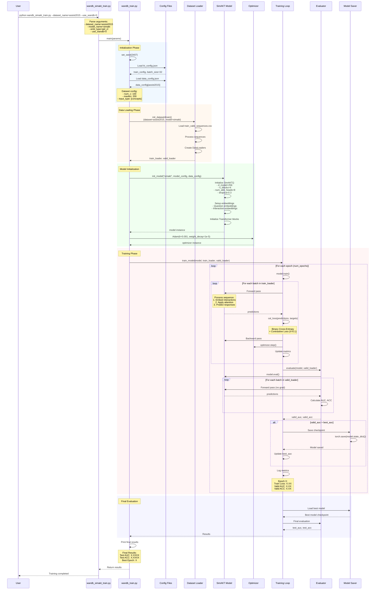
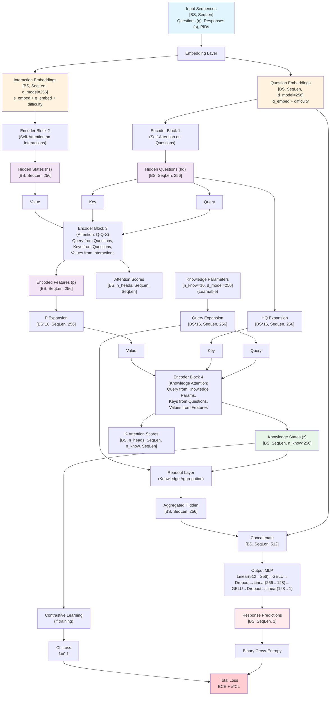
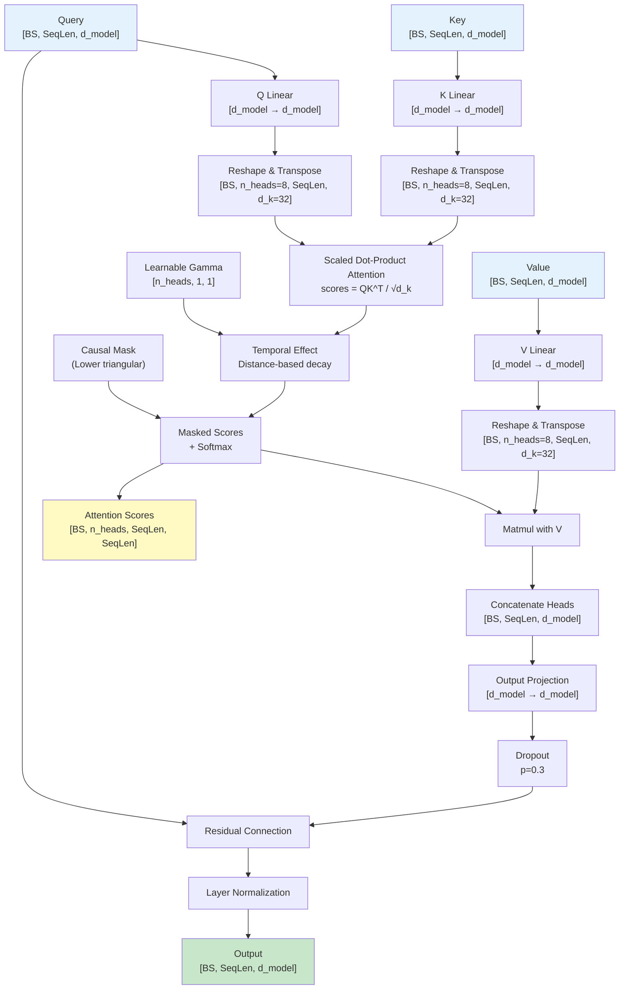
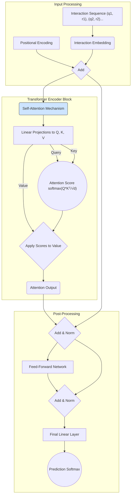
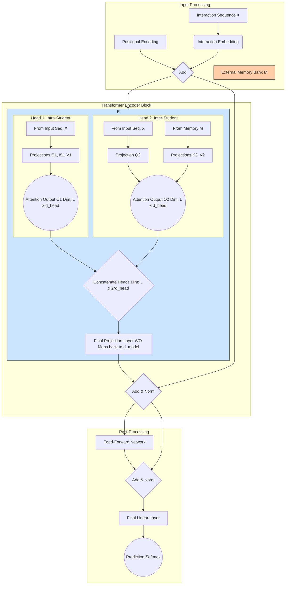
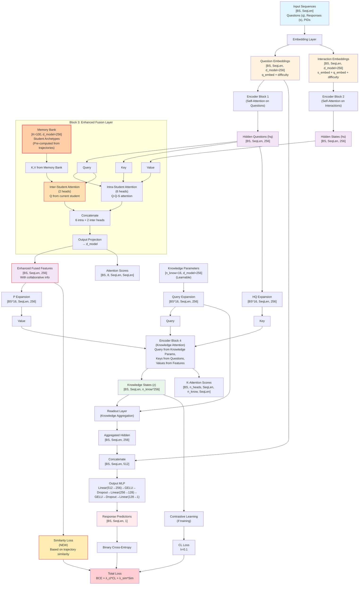
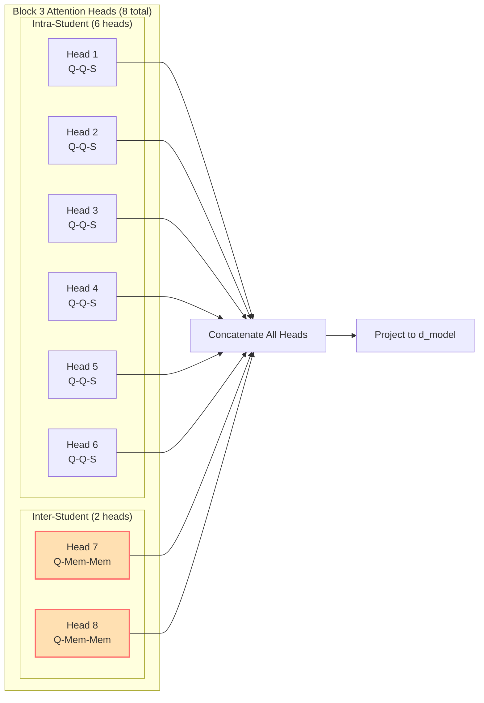

# SimAKT Architecture

Guidelines for the design and implementation of a new SimAKT (Similarity-based Attention for Knowledge Tracing) model. 

Approach: we start with a As-Is initial architecture for the SimAKT model and evolve it progresively towards a To-Be architecture.  

## Requirements for the To-Be Architecture Design 

1. Goal

To augment a standard encoder-only Transformer architecture for Knowledge Tracing. The objective is to incorporate information from similar students to enhance prediction accuracy for a target student. This looks as a promising direction, moving beyond purely intra-student sequential modeling to leverage collaborative patterns.

2. Augmented architecture

We look for a non-invasive approach that takes one model and augment it to improve performance disrupting existing arquitecture as less as possible.


## Similarity-Based Attention 

The original Transformer was designed for seq2seq tasks like machine translation, where both the input and output are sequences of the same type of tokens (e.g., words). In contrast, Knowledge Tracing (KT) tasks involve input sequences composed of interaction data, including concept IDs, responses, and sometimes additional information such as problem/question IDs or timestamps. The output, is typically a prediction about the student's next response. 

The 'taxonomy.md' file provides a overview of the main models and challengues of the Transformer approach applied to the field of Konwledge Tracing and specifically, of the models implemented in this project. 


### From Intra-Student to Inter-Student Modeling: A Paradigm Shift 
 
The central thesis of the approach is the shift from a purely individualized approach to collaborative filetring that leverages inter-users information. By identifying and leveraging the learning behaviors of "students who have similar question-answering experiences," 
a model can inform predictions for a given student. This paradigm shift allows the model to draw on a richer, more extensive 
set of data from similar peers, providing a powerful supplement to a student's own historical sequence. 
 

### Defining "Collaborative Information" in Knowledge Tracing 
 
Within the context of knowledge tracing, "collaborative information" refers to the insights and 
signals derived from the learning behaviors of a group of learners, particularly those identified 
as similar to a target student. This goes beyond the traditional intra-student focus by 
explicitly modeling the relationships and collective patterns that exist across a student 
population. This approach is motivated by the observation that learners sharing similar 
cognitive states often display comparable problem-solving performances. 


### The Mechanisms of Similarity-Based Attention 
 
Traditional Transformer-based models like SAINT employ a self-attention mechanism that 
computes attention weights based on the relationships between tokens within a single 
sequence, such as a student's past interactions with exercises. For collaborative knowledge 
tracing, this mechanism must be redefined to calculate attention based on the similarity 
between different students or between a student and a pre-defined learning pattern. 
The core of this "similarity-based attention" involves a creative adaptation of the standard 
attention architecture. In a cross-attention setup, a "query" vector representing the current 
student's learning state can be used to query a set of "key" vectors derived from the 
representations of similar peers or collaborative patterns. The resulting attention score 
becomes a measure of semantic or behavioral similarity, which allows the model to assign 
higher weights to the most relevant peer interactions or patterns. The model's hidden 
representation for the current time step is then a weighted sum of the "value" vectors from 
these similar peers. This process allows the model to selectively and dynamically leverage the 
most pertinent collaborative information, thereby enhancing its ability to make accurate 
predictions, particularly when the intra-student data is sparse. The choice of what 
constitutes "similarity" —be it a simple metric on question-answering history or a complex, 
learned embedding— is a crucial design decision that fundamentally determines the model's 
capability and its computational complexity. 

In our case we will use an approach based in similarity of learning trajectories.  

Learning trajectories can be represented as: 

  - Sequence of Interactions 
  
  (St, Rt), where S: Skill, R: Correct or Wrong response (1 or 0)

  - Skill Mastery Evolution

  S1[0.2→0.6→0.8], S2[0.1→0.3→0.7], S3[0.0→0.5]

- Sequence of Skill Learning Curves

The learning curve can be modeled through a sigmoid calculated from a (S, N, M) tuple that represent a point in the learning trajectory. 

    Each learning tuple (S, N, M) will contain information about: 
    - question or skill (S)
    - number of attempts (N): number of interactions of the student with the question or skill
    - mastery (M: level of mastery skill acquired after the number of attemps

We have M as the y and N as the x coordinate in the sigmoid curve characteristic of each S skill. After N attempts the student learns (achieves skill mastery level) or fails. 

**SimAKT, unlike other models, uses this format.**. As we characterize students by their sequences of learning curves, two similar trajectories in SimAKT mean that the students have been exposed to similar concepts (i.e. questions to train similar skills) with similar performance (i.e. they got simialr mastery levels after similar number of attempts).  

The sequence of student interactions is preprocessed to have the sequence of tuples where each tuple can be consideerd a point in a trajectory.

 
### Current Similarity-based Models  
 
Some models exemplify the shift towards collaborative and similarity-based attention 
mechanisms. They each address the problem from a distinct architectural perspective, 
highlighting a growing consensus that collaborative information is a vital component for 
robust knowledge tracing. 

- CokT: uses similarity calculated using IDF (Inverse Document Frequency) and BM (Best Match). The architecture uses RNN + Attention instead of a Transformer archuitecture. The cokt-ktsimilarity.pdf paper describes the approach in detail. 
- FINER: uses similarity calculated using extracted so-called Follow-up Performance Trends (FPTs) and historical data to improve the predictions of a model based on Long Short Term Memory (LSTM) networks + Attention. The paper finer-ktsimilarity.pdf describes the approach in detail. 


## Integration with pyKT Framework

The SimAKT  model implementation follows the guidelines defined in contribute.pdf to add a new model to the pyKT framework. This model introduces a novel Transformer-based architecture that uses attention mechanisms based on trajectory similarity. 

### Compatibility

Full integration with existing pyKT infrastructure
- Standard data loaders and preprocessing
- Evaluation metrics (AUC, accuracy, precision, recall)
- Cross-validation and model comparison tools
- WandB experiment tracking


### Key Components

1. **Argument Parsing** (wandb_simakt_train.py)
    - Parses command-line arguments
    - Sets default values for SimAKT-specific parameters
    - Passes parameters to main training function

2. **Configuration Loading**
    - **kt_config.json**: Training hyperparameters (batch_size=32 for SimAKT)
    - **data_config.json**: Dataset specifications (assist2015: 100 concepts, maxlen=200)

3. **Data Loading** (init_dataset4train)
    - Loads preprocessed sequences from CSV files
    - Creates PyTorch DataLoaders
    - Handles train/valid/test splits based on fold

4. **Model Initialization** (init_model)
    - Creates SimAKT model instance with specified architecture
    - Initializes embeddings for questions and interactions
    - Sets up Transformer blocks with similarity-based attention

5. **Training Loop** (train_model)
    - Iterates through epochs
    - For each batch:
      - Forward pass through model
      - Calculate loss (BCE + Contrastive Loss)
      - Backward pass and optimization
      - Track training metrics
    - Validates after each epoch
    - Saves best model based on validation AUC
    - `compute_loss()` method for PyKT compatibility
    - Loss function 
    - Proper sequence mask handling
    - Compatible with existing training loops

6. **Evaluation** (evaluate)
    - Runs model in eval mode
    - Computes AUC and accuracy on validation/test sets
    - No gradient computation during evaluation

7. **Model Saving**
    - Saves model checkpoint when validation improves
    - Stores configuration alongside model
    - Enables model restoration for inference

### Data Flow

1. **Input**: Student interaction sequences (questions, responses)
2. **Embedding**: Convert discrete tokens to continuous representations
3. **Attention Processing**: Apply similarity-based attention mechanisms
4. **Prediction**: Output probability of correct response
5. **Loss Calculation**: Compare predictions with ground truth
6. **Optimization**: Update model parameters via backpropagation

### Key Parameters

- **Dataset**: assist2015 (100 concepts, educational dataset)
- **Model Architecture**: 
  - d_model=256 (embedding dimension)
  - n_blocks=4 (Transformer layers)
  - num_attn_heads=8 (attention heads)
  - dropout=0.3
- **Training**:
  - batch_size=32
  - learning_rate=0.001
  - optimizer=Adam with weight_decay=1e-5
- **Loss Function**: Binary Cross-Entropy + Contrastive Loss (λ=0.1)


## Baseline Models

We will take as baselines for metrics comparison these attention-based models (all of them implemented in pykt/models folder): 

- SAKT: one of the first attention-based models that remains competitive and serves as a baseline for subsequent attention-based models
- AKT: consistently outperforms other models in many evaluation with different datasets and scenarios 
- DKVMN: a competitive variant that is relevant for our approach because is based on the use of memory
- SAINT: usually don't outperform AKT but it's interesting due to its encoder-decoder architecture. A variant, SAINT+, is reported to show top performance with the EdNet dataset
- DTransformer (2023): tne most recent of the chosen models, outperforms the rest of models (including AKT) in most evaluations with different datasets and scenarios 

Other models show promising performance and could outperform AKT, including SAINT+ (2021), DIMKT (2023), stableKT (2024), and extraKT (2024). However, these models have been excluded because they lack evaluation on datasets that would enable meaningful comparison with the selected baseline models.

The KDD Cup 2010 datasets became a kind of standard for benchmarking new Knowledge Tracing models. While the original competition used RMSE, much of the subsequent academic literature, particularly in deep learning, has evaluated performance using Area Under the Curve (AUC) and Accuracy (ACC).

Unlike the feature-engineering and logistic regression-based models that were common in 2010, recent challenges have been dominated by deep learning, specifically Transformer and attention-based models (AKT, SAINT, etc.).

Below are indicative performance metrics for some well-known Knowledge Tracing models on a version of the 'Bridge to Algebra 2008-2009' dataset, often referred to as 'kddcup' in research papers.

```
Model	AUC	ACC
DKT (Deep Knowledge Tracing)	~0.83-0.85	~0.76-0.78
DKVMN (Dynamic Key-Value Memory Networks)	~0.84-0.86	~0.77-0.79
AKT (Attentive Knowledge Tracing)	~0.86-0.88	~0.78-0.80
SAINT+ (Separated Self-Attentive Neural KT)	~0.87-0.89	~0.79-0.81
```

State-of-the-Art AUC: 

- AUC: According to recent, large-scale challenges (AAAI 2023 Global Knowledge Tracing Challenge, The NeurIPS 2020 Education Challenge, Kaggle, 2020-2021), the state-of-the-art **AUC for knowledge tracing on complex datasets typically falls in the 0.81 to 0.87 range**. The specific value depends heavily on the dataset's characteristics and cleanliness.
- Transformer Dominance: In all cases, the core of the winning solutions was a Transformer-based architecture, confirming that **models like AKT and [SAINT+](https://arxiv.org/pdf/2010.12042) are the foundational building blocks for top performance**.
- Ensembling and Feature Engineering are Crucial: Achieving the highest scores requires more than just a single, well-designed model. The winning solutions consistently use ensembles of multiple models and incorporate carefully engineered features related to timing, past performance, and question characteristics to gain a competitive edge.

## As-Is Implementation

The As-Is architecture of the SimAKT model is based on DTransformer due to its superior performance among the baseline models (taking AKT also into account since DTransformer builds upon several ideas originally proposed in AKT).

**AKT:**
- Uses two encoders: the Question Encoder (which considers only the questions) and the Knowledge Encoder (which considers both the questions and the responses), along with a Knowledge Retriever that determines the knowledge state based on both encoders.
- Employs the traditional attention mechanism with modifications aimed at: 1) monotonic attention in the Knowledge Retriever, 2) reducing the relevance of exercises completed a long time ago, and 3) reducing the relevance of exercises involving different concepts.
- Each encoder and the Knowledge Retriever has a key, query, and value embedding layer that maps the input into output queries, keys, and values of dimensions \(D_q = D_k\), \(D_k\), and \(D_v\), respectively.
- Uses question embeddings to map both queries and keys (while SAKT, for example, uses question embeddings for queries and response embeddings to map keys and values).

**DTransformer:**
- Uses an approach based on "Temporal and Cumulative Attention (TCA)" that considers the cumulative effort in the learning process when implementing the attention mechanism. This allows it to infer the student's knowledge state at each moment and predict responses accordingly. Additionally, DTransformer uses Contrastive Learning in the loss function to enforce the monotonicity of knowledge. In contrast, the AKT model infers the knowledge state based on responses, which can lead to unstable and non-monotonic knowledge states.
- Uses knowledge as a query (in addition to questions as queries) in the attention mechanism, enabling it to extract the knowledge state.

**Similarities:**
- Both DTransformer and AKT use a Rasch Model that accounts for the difficulty of exercises. This explains why a skill might be considered mastered at a given time, yet later, an exercise targeting the same skill could be answered incorrectly if its difficulty is high.
- DTransformer leverages the modified attention mechanism from AKT.

### Training

```
python wandb_dtransformer_train.py --dataset_name=assist2015 --use_wandb=0

  dtransformer weight_decay = 1e-5
  2025-09-03 10:16:08 - main - said: train model
  ts.shape: (102749,), ps.shape: (102749,)
  Epoch: 1, validauc: 0.7122, validacc: 0.7501, best epoch: 1, best auc: 0.7122, train loss: 0.5438427040418677, emb_type: qid_cl, model: dtransformer, save_dir: saved_model/assist2015_dtransformer_qid_cl_saved_model_3407_0_0.3_256_256_8_4_0.001_16_0.1_1_True_False_0_1
              testauc: -1, testacc: -1, window_testauc: -1, window_testacc: -1
  ts.shape: (102749,), ps.shape: (102749,)
  Epoch: 2, validauc: 0.7147, validacc: 0.752, best epoch: 2, best auc: 0.7147, train loss: 0.5287243626882813, emb_type: qid_cl, model: dtransformer, save_dir: saved_model/assist2015_dtransformer_qid_cl_saved_model_3407_0_0.3_256_256_8_4_0.001_16_0.1_1_True_False_0_1
              testauc: -1, testacc: -1, window_testauc: -1, window_testacc: -1


python wandb_simakt_train.py --dataset_name=assist2015 --use_wandb=0

            simakt weight_decay = 1e-5
2025-09-03 15:45:01 - main - said: train model
ts.shape: (102749,), ps.shape: (102749,)
Epoch: 1, validauc: 0.7122, validacc: 0.7501, best epoch: 1, best auc: 0.7122, train loss: 0.5438427040418677, emb_type: qid_cl, model: simakt, save_dir: saved_model/assist2015_simakt_qid_cl_saved_model_3407_0_0.3_256_256_8_4_0.001_16_0.1_1_True_False_0_1
            testauc: -1, testacc: -1, window_testauc: -1, window_testacc: -1
ts.shape: (102749,), ps.shape: (102749,)
Epoch: 2, validauc: 0.7147, validacc: 0.752, best epoch: 2, best auc: 0.7147, train loss: 0.5287243626882813, emb_type: qid_cl, model: simakt, save_dir: saved_model/assist2015_simakt_qid_cl_saved_model_3407_0_0.3_256_256_8_4_0.001_16_0.1_1_True_False_0_1
            testauc: -1, testacc: -1, window_testauc: -1, window_testacc: -1
```


### Training Workflow

```bash
Command to launch the training process: 
python wandb_simakt_train.py --dataset_name=assist2015 --use_wandb=0
```

Below there is an End-to-End Sequence Diagram showing the training process. 




The following sequence diagram deep dive in all the steps that happen during SimAK **model.train()**:

```mermaid
sequenceDiagram
    participant Trainer as Training Loop
    participant DataLoader
    participant Model as SimAKT Model
    participant Forward as Forward Pass
    participant CL as Contrastive Learning
    participant Loss as Loss Calculation
    participant Backward as Backpropagation
    participant Optimizer

    Note over Trainer: Start Training Epoch
    Trainer->>Model: model.train()
    
    loop For each batch
        Trainer->>DataLoader: Get batch data
        DataLoader-->>Trainer: dcur = {qseqs, cseqs, rseqs, masks, ...}
        
        Note over Trainer: Prepare data<br/>[BS, SeqLen]
        Trainer->>Trainer: Extract sequences:<br/>q, c, r (questions, concepts, responses)<br/>qshft, cshft, rshft (shifted)
        Trainer->>Trainer: Concatenate:<br/>cq = cat([q[0:1], qshft])<br/>cc = cat([c[0:1], cshft])<br/>cr = cat([r[0:1], rshft])
        
        rect rgb(240, 248, 255)
            Note over Model: Forward Pass with CL
            Trainer->>Model: model.get_cl_loss(cc, cr, cq)
            
            Model->>Model: Move to device (GPU)
            Model->>Model: Check sequence lengths<br/>lens = (s >= 0).sum(dim=1)
            
            alt minlen < MIN_SEQ_LEN (5)
                Model->>Forward: Skip CL, use get_loss()
                Forward->>Forward: Regular forward pass
                Forward-->>Model: predictions, reg_loss
            else minlen >= MIN_SEQ_LEN
                Note over Model: Data Augmentation
                
                Model->>Model: Clone inputs:<br/>q_ = q.clone()<br/>s_ = s.clone()<br/>pid_ = pid.clone()
                
                rect rgb(255, 248, 240)
                    Note over Model: Order Manipulation
                    loop For each batch b
                        Model->>Model: Sample indices:<br/>idx = random.sample(range(lens[b]-1),<br/>max(1, int(lens[b]*dropout)))
                        loop For each index i in idx
                            Model->>Model: Swap adjacent items:<br/>q_[b,i] ↔ q_[b,i+1]<br/>s_[b,i] ↔ s_[b,i+1]<br/>pid_[b,i] ↔ pid_[b,i+1]
                        end
                    end
                end
                
                rect rgb(248, 255, 240)
                    Note over Model: Response Flipping (Hard Negatives)
                    alt hard_neg == True
                        Model->>Model: s_flip = s.clone()
                    else hard_neg == False
                        Model->>Model: s_flip = s_.clone()
                    end
                    
                    loop For each batch b
                        Model->>Model: Sample indices:<br/>idx = random.sample(range(lens[b]),<br/>max(1, int(lens[b]*dropout)))
                        loop For each index i in idx
                            Model->>Model: Flip response:<br/>s_flip[b,i] = 1 - s_flip[b,i]
                        end
                    end
                end
                
                rect rgb(245, 245, 255)
                    Note over Forward: Three Forward Passes
                    
                    Model->>Forward: predict(q, s, pid) - Original
                    Forward->>Forward: embedding(q, s, pid)
                    Note over Forward: q_emb = q_embed + pid_embed * q_diff<br/>s_emb = s_embed + q_embed + pid_embed * s_diff
                    Forward->>Forward: Pass through 4 Transformer blocks
                    Forward->>Forward: readout() + output layer
                    Forward-->>Model: logits, concat_q, z_1, q_emb, reg_loss
                    
                    Model->>Forward: predict(q_, s_, pid_) - Augmented
                    Forward->>Forward: Same process with augmented data
                    Forward-->>Model: _, _, z_2, ...
                    
                    alt hard_neg == True
                        Model->>Forward: predict(q, s_flip, pid) - Hard Negative
                        Forward->>Forward: Same process with flipped responses
                        Forward-->>Model: _, _, z_3, ...
                    end
                end
                
                rect rgb(255, 245, 245)
                    Note over CL: Contrastive Loss Calculation
                    
                    Model->>CL: sim(z_1[:,:minlen,:], z_2[:,:minlen,:])
                    CL->>CL: Project if proj layer exists
                    CL->>CL: Cosine similarity:<br/>F.cosine_similarity(z1.mean(-2), z2.mean(-2)) / 0.05
                    CL-->>Model: input tensor
                    
                    alt hard_neg == True
                        Model->>CL: sim(z_1[:,:minlen,:], z_3[:,:minlen,:])
                        CL-->>Model: hard_neg tensor
                        Model->>Model: Concatenate: input = cat([input, hard_neg])
                    end
                    
                    Model->>Model: Create target:<br/>target = arange(bs).expand(-1, minlen)
                    Model->>CL: F.cross_entropy(input, target)
                    CL-->>Model: cl_loss
                end
                
                rect rgb(255, 235, 235)
                    Note over Loss: Prediction Loss (Window)
                    
                    loop For i in range(1, window)
                        Model->>Model: label = s[:, i:]<br/>query = q_emb[:, i:]
                        Model->>Model: h = readout(z_1[:,:query.size(1),:], query)
                        Model->>Model: y = out(cat([query, h])).squeeze(-1)
                        Model->>Loss: F.binary_cross_entropy_with_logits(<br/>y[label>=0], label[label>=0])
                        Loss-->>Model: pred_loss += loss
                    end
                end
                
                Model->>Model: Apply sigmoid: preds = sigmoid(logits)
                Model-->>Trainer: preds, total_loss = cl_loss * λ + reg_loss
            end
        end
        
        rect rgb(255, 240, 240)
            Note over Trainer: Loss & Backpropagation
            
            Trainer->>Loss: cal_loss(model, ys=[preds[:,1:]], r, rshft, sm, preloss=[total_loss])
            Loss->>Loss: y = masked_select(ys[0], sm)<br/>t = masked_select(rshft, sm)
            Loss->>Loss: loss = BCE(y, t) + preloss[0]
            Loss-->>Trainer: final_loss
            
            Trainer->>Optimizer: optimizer.zero_grad()
            Trainer->>Backward: final_loss.backward()
            Backward->>Backward: Compute gradients for all parameters
            Trainer->>Optimizer: optimizer.step()
            Optimizer->>Model: Update model parameters
        end
        
        Trainer->>Trainer: Update metrics (loss, accuracy)
    end
    
    Note over Trainer: End of Epoch
```



### Key Training Process Details

1. **Data Preparation**:
   - Sequences are shifted to create teacher forcing inputs
   - Concatenation creates proper input sequences with initial tokens

2. **Contrastive Learning Pipeline**:
   - **Data Augmentation**: Random order swapping of adjacent elements
   - **Hard Negatives**: Optional response flipping for stronger contrastive signals
   - **Multiple Forward Passes**: Original, augmented, and optionally hard negative
   - **Similarity Computation**: Cosine similarity between knowledge states

3. **Loss Components**:
   - **Prediction Loss**: Binary cross-entropy for response prediction
   - **Contrastive Loss**: Cross-entropy on similarity scores (λ=0.1)
   - **Regularization Loss**: L2 penalty on problem difficulty embeddings (1e-3)

4. **Optimization**:
   - Adam optimizer with weight decay (1e-5)
   - Gradient computation through backpropagation
   - Parameter updates based on computed gradients


## As-Is Architecture Design

**Important Note**: Both DTransformer and SimAKT are **encoder-only** architectures, not encoder-decoder. All transformer blocks shown are encoder blocks that process information in parallel streams. There is no cross-attention between separate encoder and decoder stacks as in traditional seq2seq models.

### Transformer Block Components (Encoder-Only Architecture)

The SimAKT model uses a stack of encoder layers processing parallel information streams:



### Encoder Layer Internal Structure



### Key Architectural Features

1. **Four-Layer Encoder Stack** (All Encoder Blocks):
   - Block 1: Self-attention on question embeddings (Q-Q-Q)
   - Block 2: Self-attention on interaction embeddings (S-S-S)
   - Block 3: Mixed attention (Query and Key from Questions, Value from Interactions)
   - Block 4: Knowledge-aware attention (Query from learnable params, K-V from encoded features)

2. **Knowledge Encoding**:
   - 16 learnable knowledge parameters (n_know=16)
   - Knowledge states expanded and attended to separately
   - Readout mechanism for knowledge aggregation

3. **Temporal Attention Mechanism**:
   - Distance-based decay using learnable gamma parameters
   - Cumulative attention scoring for temporal modeling
   - Causal masking to prevent information leakage

4. **Embedding Components**:
   - Question embeddings with difficulty integration
   - Interaction embeddings combining response and question information
   - Optional problem ID embeddings for difficulty modeling

5. **Output Processing**:
   - Multi-layer perceptron with GELU activations
   - Progressive dimension reduction: 512 → 256 → 128 → 1
   - Dropout regularization at each layer

6. **Training Enhancements**:
   - Contrastive learning with λ=0.1
   - Data augmentation through sequence manipulation
   - Optional hard negative sampling


## To-Be Architecture Design

### Approach 1: Inter-Student Attention Head

This approach directly modifies the core self-attention mechanism to allow the model to explicitly query information from other students. It is architecturally elegant (in terms of the non invasive criteria) and leverages the inherent flexibility of the Multi-Head Attention (MHA) mechanism.

**Conceptual Framework:**

Standard self-attention in models like SAKT or SAINT calculates attention scores *within* a single student's interaction sequence. We propose to dedicate one or more attention heads to look *outside* this sequence and attend to a repository of relevant student information.

**Architectural Implementation:**

1.  **Memory Bank Construction:** First, we must create an external memory bank, $M \in \mathbb{R}^{k \times d}$, which stores representations of $k$ "archetypal" student states or trajectories. This memory can be constructed by:
    * Clustering the hidden states of all students from the training data (e.g., using K-Means) and using the cluster centroids as memory slots.
    * Maintaining a dynamic memory of recent or representative student states.

2.  **Modified Multi-Head Attention:** Let the input to an attention block be the sequence of embeddings $X \in \mathbb{R}^{L \times d}$. In a standard $H$-head MHA, each head computes:
    $$\text{Head}_i = \text{Attention}(XW_i^Q, XW_i^K, XW_i^V)$$
    Where $W_i^Q, $W_i^K, $W_i^V are the projection matrices for the $i$-th head.

    We can modify this by designating, for instance, the final head ($H$) as the "inter-student" head. For heads $i = 1, ..., H-1$, the computation remains standard (intra-student). For head $H$, the Key ($K$) and Value ($V$) are derived not from the input sequence $X$, but from the external memory bank $M$:

    $$\text{Head}_H = \text{Attention}(XW_H^Q, MW_H^K, MW_H^V)$$

    The formula for scaled dot-product attention for this head becomes:

    $$\text{Attention}(Q, K_M, V_M) = \text{softmax}\left(\frac{QK_M^T}{\sqrt{d_k}}\right)V_M$$

    Where \( Q = XW_H^Q \), \( K_M = MW_H^K \), and \( V_M = MW_H^V \).

3.  **Concatenation:** The output of this inter-student head is concatenated with the outputs of the standard intra-student heads, and then passed through the final linear layer, just as in the original MHA block:
    $$\text{MHA}(X) = \text{Concat}(\text{Head}_1, ..., \text{Head}_{H-1}, \text{Head}_H)W^O$$

This modification allows the model, at each time step, to query the memory of archetypal student states and incorporate a summary of relevant historical patterns from the broader student population into its representation of the current student.

### Single-Head Encoder-Only Transformer - Architecture Diagram: 

The diagram below illustrates a simplified, typical encoder-only architecture with one attention head. T




### Two-Head (Intra- and Inter-Student) Transformer

The modified diagram below shows the one head architecture after the introduction of a second inter-student head. The key change is within the "Attention Mechanism" block, which now takes two sources of information: the student's sequence and the external memory.



### Concatenation of two attention heads 

Note that concatenating the two attention heads means taking their individual output vectors and joining them together side-by-side to create a single, wider vector. 

This new vector could contains the insights from both the intra-student and inter-student perspectives simultaneously. 

An Analogy: Two Specialists 
Imagine two specialists evaluating a student.

- Specialist 1 (Intra-Student Head): Reviews the student's personal academic file, looking only at their past performance and learning trajectory. They write a report summarizing this internal view.

- Specialist 2 (Inter-Student Head): Compares the student's record to a large database of similar student cases (the "external memory"). They write a second report summarizing how this student fits into broader patterns.

Concatenation is the act of stapling these two reports together. Before a final decision is made, you now have a single dossier that includes both the personal history and the comparative analysis, providing a much richer context.


### Tensor Dimensions and Final Projection

Let's examine the dimensions of the tensors involved in the multi-head attention mechanism. The output of a single attention head is a vector for each interaction in the sequence.

#### Individual Head Outputs
Assume the model's dimension ($d_{\text{model}}$) is 128, and there are two attention heads. Each head's output dimension ($d_{\text{head}}$) would typically be:

$$d_{\text{head}} = \frac{d_{\text{model}}}{2} = 64$$

For a sequence of $L$ interactions:
- The **Intra-Student Head** produces a tensor: $O_1 \in \mathbb{R}^{L \times 64}$
- The **Inter-Student Head** produces another tensor: $O_2 \in \mathbb{R}^{L \times 64}$

#### Concatenation
The concatenation operation joins these two tensors along their last dimension (the feature dimension):

$$O_{\text{concat}} = \text{Concat}(O_1, O_2)$$

The resulting concatenated tensor has a shape of $\mathbb{R}^{L \times 128}$ (since $64 + 64 = 128$). This tensor now holds the information from both heads for each of the $L$ interactions.

#### Purpose of the Final Projection
The concatenated vector is an intermediate step. The final step inside the Multi-Head Attention block is to pass this combined vector through a linear projection layer (denoted as $W^O$). This layer has two main purposes:

1. **Mix Information:** It learns the optimal way to combine the insights from the two heads. For example, it might prioritize the inter-student view for certain interactions and the intra-student history for others.
2. **Restore Dimension:** It projects the concatenated vector back to the model's original dimension ($d_{\text{model}}$). This ensures that the output of the attention block matches its input shape, enabling the residual connection in the "Add & Norm" step.

The concatenated tensor ($O_{\text{concat}} \in \mathbb{R}^{L \times 128}$) is multiplied by the projection matrix $W^O$ ($\in \mathbb{R}^{128 \times 128}$) to produce the final output $Z$ ($\in \mathbb{R}^{L \times 128}$), which is then passed to the rest of the Transformer encoder.

### Next Steps

## Implementation Roadmap for Inter-Student Attention

### Phase 1: Data Preparation for Learning Trajectories (Week 1)

#### 1.1 Trajectory Representation
- **Implement trajectory preprocessing**:
  ```python
  # Convert interaction sequences to (S, N, M) tuples
  # S: skill/question ID
  # N: number of attempts
  # M: mastery level after N attempts
  ```
- **Create trajectory dataset**:
  - Load `/data/trajectories.csv` if exists
  - Otherwise, generate from existing interaction data
  - Format: `student_id, skill_id, attempt_count, mastery_level`

#### 1.2 Similarity Computation
- **Define similarity metrics**:
  - Cosine similarity on learning curves
  - DTW (Dynamic Time Warping) for trajectory alignment
  - Wasserstein distance for distribution comparison
- **Build similarity index**:
  - Pre-compute pairwise similarities during training
  - Create efficient lookup structure for inference

### Phase 2: Memory Bank Construction (Week 1-2)

#### 2.1 Student Archetype Extraction
```python
class MemoryBankBuilder:
    def __init__(self, n_clusters=100, d_model=256):
        self.n_clusters = n_clusters
        self.d_model = d_model
    
    def build_from_trajectories(self, all_student_trajectories):
        # 1. Encode trajectories using existing encoder blocks
        # 2. Cluster using K-means or spectral clustering
        # 3. Extract cluster centroids as memory slots
        return memory_bank  # Shape: [n_clusters, d_model]
```

#### 2.2 Dynamic Memory Updates
- **Online learning capability**:
  - Update memory with new student patterns
  - Exponential moving average for stability
  - Periodic re-clustering for adaptation

### Phase 3: Architecture Modification (Week 2-3)

#### 3.1 Modify Existing Blocks
```python
class SimAKTWithInterStudent(nn.Module):
    def __init__(self, ...existing_params..., use_inter_student=True):
        super().__init__()
        # Keep all existing blocks
        self.block1 = DTransformerLayer(...)  # Questions
        self.block2 = DTransformerLayer(...)  # Interactions
        self.block3 = DTransformerLayer(...)  # Fusion
        
        # Add inter-student attention to Block 3
        if use_inter_student:
            self.block3 = DTransformerLayerWithMemory(
                d_model, n_heads, dropout,
                memory_size=n_clusters,
                inter_student_heads=2  # Dedicate 2 of 8 heads
            )
        
        self.block4 = DTransformerLayer(...)  # Knowledge
```

#### 3.2 Implement DTransformerLayerWithMemory
```python
class DTransformerLayerWithMemory(nn.Module):
    def __init__(self, d_model, n_heads, dropout, memory_size, inter_student_heads):
        super().__init__()
        self.intra_heads = n_heads - inter_student_heads
        self.inter_heads = inter_student_heads
        
        # Separate attention mechanisms
        self.intra_attention = MultiHeadAttention(
            d_model, self.intra_heads, kq_same=True
        )
        self.inter_attention = MultiHeadAttention(
            d_model, self.inter_heads, kq_same=False
        )
        
        # Memory bank (learnable or fixed)
        self.memory_bank = nn.Parameter(
            torch.randn(memory_size, d_model)
        )
        
        # Output projection
        self.out_proj = nn.Linear(d_model, d_model)
```

### Phase 4: Training Strategy (Week 3-4)

#### 4.1 Two-Stage Training
1. **Stage 1: Pre-train memory bank**
   - Train on full dataset to learn student archetypes
   - Freeze memory bank after convergence
   
2. **Stage 2: Fine-tune with inter-student attention**
   - Unfreeze selected parameters
   - Joint optimization of intra and inter attention

#### 4.2 Loss Function Modifications
```python
def compute_loss_with_similarity(predictions, targets, similarity_matrix):
    # Standard BCE loss
    pred_loss = F.binary_cross_entropy(predictions, targets)
    
    # Similarity-based regularization
    # Encourage similar students to have similar predictions
    sim_loss = similarity_regularization(predictions, similarity_matrix)
    
    # Contrastive loss (existing)
    cl_loss = contrastive_loss(...)
    
    return pred_loss + λ_sim * sim_loss + λ_cl * cl_loss
```

### Phase 5: Evaluation and Ablation (Week 4)

#### 5.1 Ablation Studies
- **Compare architectures**:
  1. Baseline: Current SimAKT (As-Is)
  2. +Memory: Add memory bank without inter-student attention
  3. +InterAttn: Add inter-student attention heads
  4. Full: Complete To-Be architecture

#### 5.2 Metrics to Track
- **Performance metrics**:
  - AUC, ACC (standard)
  - Cold-start performance (new students)
  - Few-shot learning capability
  
- **Interpretability metrics**:
  - Attention weight visualization
  - Memory slot activation patterns
  - Trajectory clustering quality

### Phase 6: Optimization and Deployment (Week 5)

#### 6.1 Computational Optimization
- **Memory efficiency**:
  - Sparse attention for large memory banks
  - Approximate nearest neighbor search
  - Batch-wise memory updates

#### 6.2 Integration Checklist
- [ ] Backward compatibility with existing pyKT interface
- [ ] Configuration file updates (`configs/kt_config.json`)
- [ ] Training script modifications (`examples/wandb_simakt_train.py`)
- [ ] Documentation updates (`docs/`, `assistant/simakt.md`)
- [ ] Unit tests for new components

### Implementation Priority

1. **Critical Path** (Must Have):
   - Learning trajectory preprocessing
   - Memory bank construction
   - Modified Block 3 with inter-student attention

2. **Enhancement** (Should Have):
   - Dynamic memory updates
   - Multi-stage training
   - Similarity-based loss

3. **Optimization** (Nice to Have):
   - Sparse attention mechanisms
   - Approximate similarity computation
   - Real-time memory adaptation

### Risk Mitigation

| Risk | Mitigation Strategy |
|------|-------------------|
| Memory bank overfitting | Use dropout, regularization, cross-validation |
| Computational overhead | Implement sparse attention, caching |
| Cold-start problem | Fallback to intra-student only for new users |
| Trajectory sparsity | Use trajectory augmentation, smoothing |

### Success Criteria

- **Quantitative**: 
  - Improve AUC by ≥2% over baseline DTransformer
  - Maintain inference time within 1.5x of baseline
  
- **Qualitative**:
  - Demonstrate improved cold-start performance
  - Show interpretable attention patterns to similar students
  - Validate trajectory similarity captures learning patterns

### Next Immediate Actions

1. **Week 1**: 
   - [ ] Implement trajectory preprocessing pipeline
   - [ ] Create memory bank builder class
   - [ ] Validate similarity metrics on sample data

2. **Week 2**:
   - [ ] Modify DTransformerLayer for memory attention
   - [ ] Integrate memory bank into training loop
   - [ ] Run initial experiments on assist2015 dataset

3. **Week 3**:
   - [ ] Implement full training pipeline
   - [ ] Conduct ablation studies
   - [ ] Optimize performance bottlenecks

This roadmap provides a systematic approach to evolving the As-Is architecture into the To-Be architecture with inter-student attention capabilities while maintaining the non-invasive design principle.

## To-Be Architecture: SimAKT with Inter-Student Attention

### Enhanced Transformer Block Components with Inter-Student Attention

The following diagram shows the modified SimAKT architecture incorporating inter-student attention through a memory bank of student archetypes:



### Key Architectural Changes from As-Is to To-Be

#### 1. **Memory Bank Addition** (NEW)
- **Size**: [K=100, d_model=256] where K is the number of student archetypes
- **Content**: Pre-computed cluster centroids from student learning trajectories
- **Update**: Can be static (pre-computed) or dynamic (updated during training)

#### 2. **Modified Block 3: Dual Attention Mechanism**
The fusion layer now implements a hybrid attention strategy:

```
Original (8 heads, all intra-student):
- All 8 heads: Attention(Q=hq, K=hq, V=hs)

Modified (6 intra + 2 inter):
- 6 heads: Intra-student attention(Q=hq, K=hq, V=hs)
- 2 heads: Inter-student attention(Q=hq, K=memory, V=memory)
```

#### 3. **Enhanced Information Flow**
- **Intra-Student Path**: Personal learning history → 75% of attention capacity
- **Inter-Student Path**: Similar student patterns → 25% of attention capacity
- **Fusion**: Concatenation + learned projection combines both perspectives

#### 4. **Additional Loss Component**
- **Similarity Regularization**: Encourages consistent predictions for similar trajectories
- **Formula**: `Total Loss = BCE + λ_cl * CL_loss + λ_sim * Similarity_loss`

### Attention Head Distribution Detail



### Advantages of the To-Be Architecture

1. **Collaborative Learning**: Leverages patterns from similar students
2. **Cold-Start Mitigation**: Better predictions for new students using archetypes
3. **Interpretability**: Can visualize which student patterns influence predictions
4. **Backward Compatible**: Unchanged blocks maintain existing functionality
5. **Flexible**: Can adjust ratio of intra/inter heads based on performance

### Implementation Notes

- **Memory Bank Size**: K=100 is configurable, trade-off between diversity and efficiency
- **Head Allocation**: 6:2 ratio is empirical, can be tuned (5:3, 7:1, etc.)
- **Training**: Can use two-stage (pre-train memory, then full model) or end-to-end
- **Inference**: Memory bank can be frozen for efficiency or updated for adaptation

