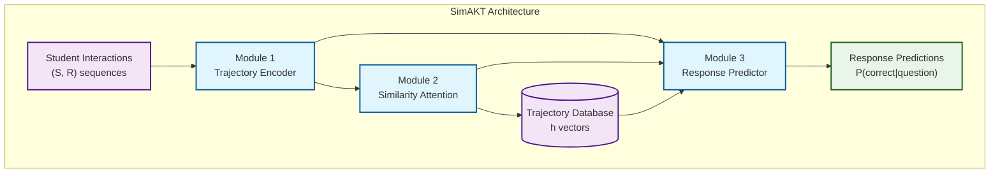
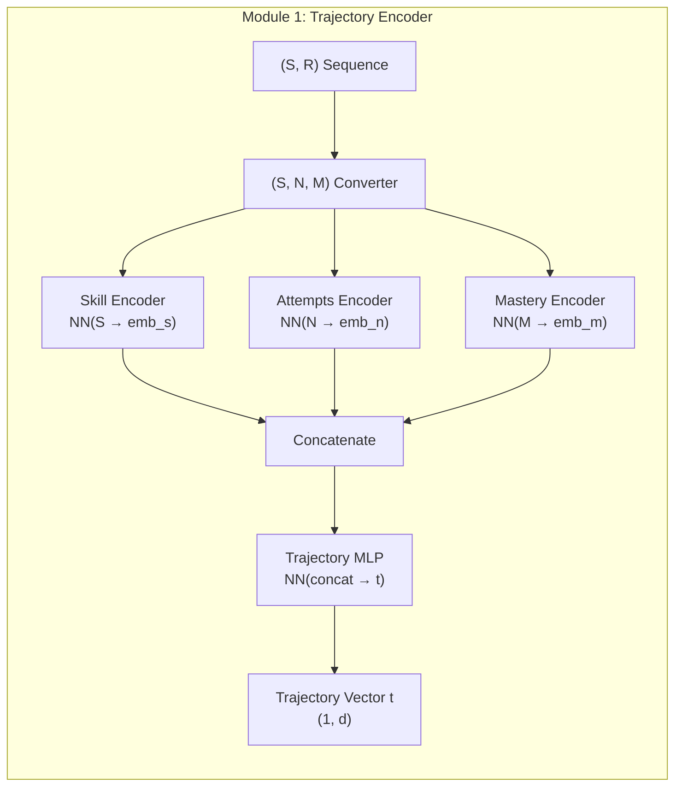
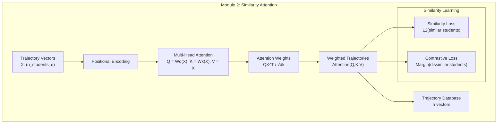
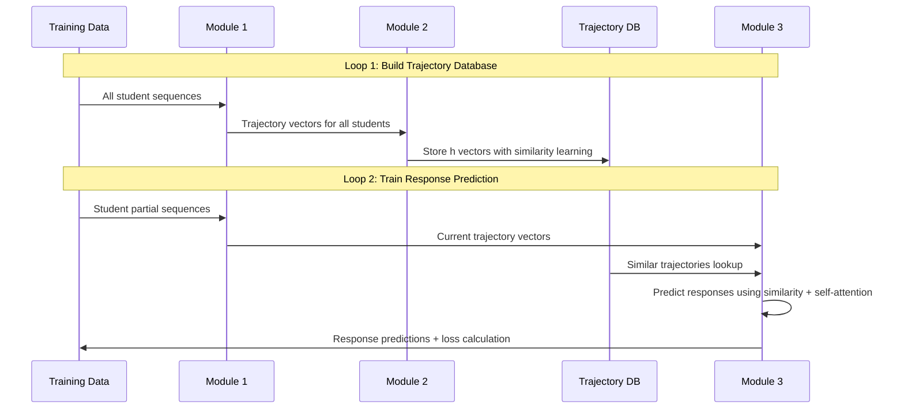
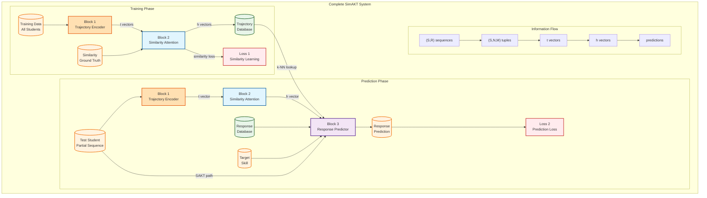

# SimAKT Architecture

Guidelines for the design and implementation of a new SimAKT (Similarity-based Attention for Knowledge Tracing) model. 

## Introduction

The original Transformer was designed for seq2seq tasks like machine translation, where both the input and output are sequences of the same type of tokens (e.g., words). In contrast, Knowledge Tracing (KT) tasks involve input sequences composed of interaction data, including concept IDs, responses, and sometimes additional information such as problem/question IDs or timestamps. The output, is typically a prediction about the student's next response. 

The 'taxonomy.md' file provides a overview of the main models and challengues of the Transformer approach applied to the field of Konwledge Tracing and specifically, of the models implemented in this project. 


### From Intra-Student to Inter-Student Modeling: A Paradigm Shift 
 
A significant challenge in personalized learning systems is data sparsity. For new students or 
those with limited interaction history, the "intra-student information" is sparse and insufficient 
to train a reliable model. This issue mirrors a classic problem in recommender systems, 
where a cold-start user with no history is difficult to make recommendations for. The solution, 
in both domains, involves a shift from a purely individualized approach to one that leverages 
"inter-student information"—the collective intelligence of a peer group.

The central thesis of the paper is that a next major conceptual leap in knowledge tracing might be 
the integration of collaborative information. By identifying and leveraging the learning 
behaviors of "students who have similar question-answering experiences," a model can inform 
predictions for a given student, even when their own history is limited.

This paradigm shift addresses the fundamental limitation of data sparsity by allowing the model to draw on a 
richer, more extensive set of data from similar peers, providing a powerful supplement to a 
student's own historical sequence. 
 

### Defining "Collaborative Information" in Knowledge Tracing 
 
Within the context of knowledge tracing, "collaborative information" refers to the insights and 
signals derived from the learning behaviors of a group of learners, particularly those identified 
as similar to a target student. This goes beyond the traditional intra-student focus by 
explicitly modeling the relationships and collective patterns that exist across a student 
population. This approach is motivated by the observation that learners sharing similar 
cognitive states often display comparable problem-solving performances. 

Collaborative signals can manifest in several forms, each with its own architectural 
implications. The most direct form involves retrieving the full question-answering sequences 
of peers who have a history of similar interactions. A more abstract approach leverages 
pre-calculated or learned patterns, such as "Follow-up Performance Trends" (FPTs), that 
represent common learning trajectories derived from the entire student corpus. These 
trends, while not tied to a specific individual, still represent an aggregate form of collaborative 
information. The efficacy of a collaborative model is therefore fundamentally dependent on 
the definition of what constitutes "similarity" and how these external signals are integrated. 


### The Mechanisms of Similarity-Based Attention 
 
Traditional Transformer-based models like SAINT employ a self-attention mechanism that 
computes attention weights based on the relationships between tokens within a single 
sequence, such as a student's past interactions with exercises. For collaborative knowledge 
tracing, this mechanism must be redefined to calculate attention based on the similarity 
between different students or between a student and a pre-defined learning pattern. 
The core of this "similarity-based attention" involves a creative adaptation of the standard 
attention architecture. In a cross-attention setup, a "query" vector representing the current 
student's learning state can be used to query a set of "key" vectors derived from the 
representations of similar peers or collaborative patterns. The resulting attention score 
becomes a measure of semantic or behavioral similarity, which allows the model to assign 
higher weights to the most relevant peer interactions or patterns. The model's hidden 
representation for the current time step is then a weighted sum of the "value" vectors from 
these similar peers. This process allows the model to selectively and dynamically leverage the 
most pertinent collaborative information, thereby enhancing its ability to make accurate 
predictions, particularly when the intra-student data is sparse. The choice of what 
constitutes "similarity"—be it a simple metric on question-answering history or a complex, 
learned embedding—is a crucial design decision that fundamentally determines the model's 
capability and its computational complexity. 

In our case we will use an approach based in similarity of learning paths. The sequence of student interactions is preprocessed to have a sequence of tuples where each tuple can be consideerd a point in a trajectory. Then we will applied existent techniques to encode trajectories as h vectors. Two similar trajectories will have similar h vectors. 

    Each tuple (S, N, M) will contain information about: 
    - question or skill (S)
    - number of attempts (N): number of interactions of the student with the question or skill
    - mastery (M): level of mastery skill acquired after the number of attemps

Each tuple defines the learning curve for this skill. We use a sigmoid curve to model a monotonic learning curve that follows a pattern cahractrized by slow start, rapid improvement phase and a plateau effect once the skill has been mastered. 

 
### Current Similarity-based Models  
 
Some models exemplify the shift towards collaborative and similarity-based attention 
mechanisms. They each address the problem from a distinct architectural perspective, 
highlighting a growing consensus that collaborative information is a vital component for 
robust knowledge tracing. See section "3. In-Depth Examination of Relevant Models" of similarity-transformers.pdf" for a description of CoKT, FINER and Coral. 

## Definition of Learning Trajectory Similarity for SimAKT

Learning trajectories can be represented as: 

  - Sequence of Interactions 
  
  (St, Rt), where S: Skill, R: Correct or Wrong response (1 or 0)

  - Skill Mastery Evolution

  S1[0.2→0.6→0.8], S2[0.1→0.3→0.7], S3[0.0→0.5]

- Sequence of Skill Learning Curves

The learning curve can be modeled through a sigmoid calculated from a (S, N, M) tuple that represent a point in the learning trajectory. 

    Each learning tuple (S, N, M) will contain information about: 
    - question or skill (S)
    - number of attempts (N): number of interactions of the student with the question or skill
    - mastery (M: level of mastery skill acquired after the number of attemps

We have M as the y and N as the x coordinate in the sigmoid curve characteristic of each S skill. After N attempts the student learns (achieves skill mastery level) or fails. 

**SimAKT, unlike other models, uses this format.**

As we characterize students by their sequences of learning curves, two similar trajectories in SimAKT mean that the students have been exposed to similar concepts (i.e. questions to train similar skills) with similar performance (i.e. they got simialr mastery levels after similar number of attempts).  


## SimAKT Implementation Requirements


The SimAKT  model implementation follows the guidelines defined in contribute.pdf to add a new model to the pyKT framework. This model introduces a novel Transformer-based architecture that uses attention mechanisms based on trajectory similarity. 

### Integration with pyKT Framework

**Compatibility**: Full integration with existing pyKT infrastructure
- Standard data loaders and preprocessing
- Evaluation metrics (AUC, accuracy, precision, recall)
- Cross-validation and model comparison tools
- WandB experiment tracking

**Configuration**: Supports all standard pyKT parameters plus SimAKT-specific options:
- `mastery_threshold`: Threshold for response correctness prediction


### Key Components

**Core SimAKT Model** (`pykt/models/simakt.py`)

**Model Initialization** (`pykt/models/init_model.py`):
- SimAKT registered in model factory (line 145)
- Compatible with standard pyKT configuration parameters
- Integrated with existing data loading and preprocessing

**Training Integration**:
- `compute_loss()` method for PyKT compatibility
- Loss function 
- Proper sequence mask handling
- Compatible with existing training loops

**Training Script** (`examples/wandb_simakt_train.py`):
- Command-line interface following pyKT patterns
- SimAKT-specific hyperparameters (similarity_cache_size, mastery_threshold, curve_dim)
- WandB integration support
- Standard training parameters (num_epochs, batch_size, learning_rate)

**Configuration Setup**:
- Model parameters defined in `configs/kt_config.json` 
- Standard pyKT configuration pattern followed
- SimAKT hyperparameters properly configured


## Architecture Design Requirements

We have 3 connected modules: 

1) Module 1

- Transform each student's sequence of (S, N, M) tuples in a t vector of size (1, d). 

This module can use a neural network to do the encoding and output t vectors 

2) Module 2

Attention to encode student trajectories:  

- Build a matrix X of size (n, d) where n is the number of students and d is the size of a t vector
- Add (or concat) Positional Encodings to X and use the sum (or concat) as input to the Attention Module
- The Attention Module has Wq, Wk tensors that project the input on Q, K matrices of shape (n, dq) and (n, dk)
- Use QK^T to get the attention weights that determine what are the most relevant students for the given student
- Get the id of the most similar student and get the corresponding (S, N, M) tuple. That tuple is the prediction
- Compare the predicted (S, N, M) tuple with the known tuple to calculate the loss 
- For predictions: calculate the t vector of a sequence (given by Module 2)

The idea here is that attention outputs a projected h vector encoding the trajectory in a suitable way to find similar students (the initial t vector has been projected in a new space conformed for having similar students very close). 

Once each student trajectory has been encoded in this way, we save the h vectors in a database and use them as retrieval indexes. 

3) Module 3

Then, to predict the R for the current S in a sequence of interactions: 

- Get the past (S, R) interactions of the student
- Get the t vector for this partial trajectory
- Input the t vector into the attention mechanism of Module 2 to get the h vector of this partial trajectory 
- Get the student with the most similar trajectory from the databse described in Module 2
- From that student, get the R for the given S

This module has a structure similar to the SAKT model that implements standard self-attention for KT sequences: 

```
 Shifted Sequences (SAKT-style)

  # Input sequence includes query question
  input_seq = [(q₁,r₁), (q₂,r₂), (q₃,r₃), (q₄,r₀)]
                                             ↑
                                      r₀ = dummy/mask token

  # Predict r₄ at position 4
  hidden = encoder(input_seq)
  prediction = predict(hidden[3])  # Predicts r₄
  ```

We ave two loops: 
1) Loop 1

Get all the students and, for each one, calculate the t vector using Module 1

Build the matrix X to be used in Module 2, it has shape (n, d) where n is the number of students and d is the size of a t vector

2) Loop 2

Use each element in the X matrix calculated in the Loop 1 to train the Module 2 model.

3) Loop 3

Process the sequence of interactions (S, R) with Module 3 to get R predictions and calculate loss based in correctenes of responses

## Architecture Design

### Overview

SimAKT uses a collaborative filtering approach with trajectory similarity. The architecture consists of three interconnected modules that process student learning trajectories to predict responses based on similar students' behaviors.



### Module 1: Trajectory Encoder

**Purpose**: Transform student interaction sequences into trajectory vectors

**Input**: Sequence of (S, R) interactions for each student
**Output**: Trajectory vector t of size (1, d) per student



**Pseudocode**:
```python
class TrajectoryEncoder(nn.Module):
    def __init__(self, num_skills, emb_dim, trajectory_dim):
        self.skill_encoder = nn.Sequential(
            nn.Embedding(num_skills, emb_dim//3),
            nn.ReLU(),
            nn.Linear(emb_dim//3, emb_dim//3)
        )
        self.attempts_encoder = nn.Sequential(
            nn.Linear(1, emb_dim//3),
            nn.ReLU(),
            nn.Linear(emb_dim//3, emb_dim//3)
        )
        self.mastery_encoder = nn.Sequential(
            nn.Linear(1, emb_dim//3),
            nn.ReLU(),
            nn.Linear(emb_dim//3, emb_dim//3)
        )
        self.trajectory_mlp = nn.Sequential(
            nn.Linear(emb_dim, trajectory_dim),
            nn.ReLU(),
            nn.Dropout(0.1),
            nn.Linear(trajectory_dim, trajectory_dim)
        )
    
    def forward(self, student_sequences):
        # Convert (S, R) to (S, N, M) tuples
        snm_tuples = self.convert_to_snm(student_sequences)
        
        # Encode each component
        s_emb = self.skill_encoder(snm_tuples[:, :, 0])  # Skills
        n_emb = self.attempts_encoder(snm_tuples[:, :, 1:2])  # Attempts
        m_emb = self.mastery_encoder(snm_tuples[:, :, 2:3])  # Mastery
        
        # Combine and project to trajectory space
        combined = torch.cat([s_emb, n_emb, m_emb], dim=-1)
        trajectory_vector = self.trajectory_mlp(combined.mean(dim=1))  # Pool over sequence
        
        return trajectory_vector  # Shape: (batch_size, trajectory_dim)
```

### Module 2: Similarity Attention

**Purpose**: Learn student similarity patterns and create trajectory database

**Input**: Trajectory vectors t from all students

**Output**: Attention-refined vectors h for trajectory database



**Pseudocode**:
```python
class SimilarityAttention(nn.Module):
    def __init__(self, trajectory_dim, num_heads=8, dropout=0.1):
        self.trajectory_dim = trajectory_dim
        self.num_heads = num_heads
        self.head_dim = trajectory_dim // num_heads
        
        self.pos_encoding = nn.Parameter(torch.randn(1000, trajectory_dim))  # Max students
        self.attention = nn.MultiheadAttention(trajectory_dim, num_heads, dropout=dropout)
        self.similarity_loss = nn.MSELoss()
        self.contrastive_margin = 1.0
        
    def forward(self, trajectory_matrix, student_similarities=None):
        # trajectory_matrix: (n_students, trajectory_dim)
        n_students = trajectory_matrix.shape[0]
        
        # Add positional encoding
        pos_enc = self.pos_encoding[:n_students]
        x = trajectory_matrix + pos_enc
        
        # Multi-head attention (self-attention over students)
        x = x.unsqueeze(1)  # (n_students, 1, trajectory_dim)
        h_vectors, attention_weights = self.attention(x, x, x)
        h_vectors = h_vectors.squeeze(1)  # (n_students, trajectory_dim)
        
        # Calculate similarity loss if ground truth similarities provided
        loss = None
        if student_similarities is not None:
            # Compute pairwise distances in h space
            h_distances = torch.cdist(h_vectors, h_vectors, p=2)
            
            # Similarity loss: similar students should be close
            similar_mask = student_similarities > 0.8
            similarity_loss = self.similarity_loss(
                h_distances[similar_mask], 
                torch.zeros_like(h_distances[similar_mask])
            )
            
            # Contrastive loss: dissimilar students should be far apart
            dissimilar_mask = student_similarities < 0.2
            contrastive_loss = torch.clamp(
                self.contrastive_margin - h_distances[dissimilar_mask], 
                min=0
            ).mean()
            
            loss = similarity_loss + 0.5 * contrastive_loss
        
        return h_vectors, attention_weights, loss
```

### Module 3: Response Predictor

**Purpose**: Predict student responses using similarity-based retrieval

**Input**: Current student's partial trajectory, trajectory database

**Output**: Response prediction P(correct|question)

```mermaid
graph TB
    subgraph "Module 3: Response Predictor"
        A["Current Student<br/>(S, R) partial sequence"] --> B["Module 1<br/>Encode to t vector"]
        B --> C["Module 2<br/>Project to h vector"
        C --> D["Similarity Search<br/>Find k-nearest neighbors"]
        E[("Trajectory Database<br/>h vectors")] --> D
        D --> F["Retrieve Similar<br/>Students' Responses"]
        F --> G["Weighted Aggregation<br/>Based on similarity"]
        G --> H["Response Prediction<br/>P(correct|skill)"]
        
        subgraph "SAKT-style Prediction"
            I["Self-Attention<br/>over (S,R) sequence"]
            J["Query Embedding<br/>for target skill"]
            K["Prediction Head<br/>MLP + Sigmoid"]
        end
        
        A --> I
        I --> J
        J --> K
        G --> K
        K --> H
    end
```

**Pseudocode**:
```python
class ResponsePredictor(nn.Module):
    def __init__(self, trajectory_encoder, similarity_attention, num_skills, 
                 emb_dim, num_heads=8, k_neighbors=5):
        self.trajectory_encoder = trajectory_encoder
        self.similarity_attention = similarity_attention
        self.k_neighbors = k_neighbors
        
        # SAKT-style components
        self.interaction_emb = nn.Embedding(num_skills * 2, emb_dim)
        self.self_attention = nn.MultiheadAttention(emb_dim, num_heads)
        self.query_emb = nn.Embedding(num_skills, emb_dim)
        
        # Prediction head combining similarity and self-attention
        self.prediction_head = nn.Sequential(
            nn.Linear(emb_dim * 2, emb_dim),  # similarity + self-attention
            nn.ReLU(),
            nn.Dropout(0.1),
            nn.Linear(emb_dim, 1),
            nn.Sigmoid()
        )
        
    def forward(self, current_sequence, target_skill, trajectory_db, student_responses_db):
        batch_size, seq_len = current_sequence.shape[:2]
        
        # 1. Encode current trajectory
        current_t = self.trajectory_encoder(current_sequence)
        current_h, _, _ = self.similarity_attention(current_t.unsqueeze(0))
        current_h = current_h.squeeze(0)
        
        # 2. Find k-nearest neighbors in trajectory database
        similarities = torch.cosine_similarity(
            current_h.unsqueeze(0), trajectory_db, dim=1
        )
        top_k_indices = torch.topk(similarities, self.k_neighbors, dim=0).indices
        
        # 3. Retrieve and aggregate similar students' responses
        similar_responses = student_responses_db[top_k_indices]  # (k, num_skills)
        similarity_weights = torch.softmax(similarities[top_k_indices], dim=0)
        
        # Weighted aggregation for target skill
        target_predictions = similar_responses[:, target_skill]  # (k,)
        similarity_prediction = (similarity_weights * target_predictions).sum()
        
        # 4. SAKT-style self-attention prediction
        # Create interaction embeddings
        interactions = current_sequence[:, :, 0] + num_skills * current_sequence[:, :, 1]
        interaction_embs = self.interaction_emb(interactions)  # (batch, seq_len, emb_dim)
        
        # Self-attention over sequence
        seq_repr, _ = self.self_attention(
            interaction_embs.transpose(0, 1),
            interaction_embs.transpose(0, 1), 
            interaction_embs.transpose(0, 1)
        )
        seq_repr = seq_repr.transpose(0, 1)[:, -1, :]  # Last position
        
        # Query embedding for target skill
        query_emb = self.query_emb(target_skill)
        
        # 5. Combine similarity and self-attention predictions
        combined_input = torch.cat([
            similarity_prediction.unsqueeze(0).repeat(batch_size, 1),
            seq_repr
        ], dim=1)
        
        prediction = self.prediction_head(combined_input)
        
        return prediction
```

### Training Process



**Training Loops**:

```python
# Loop 1: Build trajectory database
for epoch in range(pretrain_epochs):
    for batch_students in all_students:
        # Encode all student trajectories
        trajectory_vectors = module1(batch_students)
        
        # Learn similarity patterns
        h_vectors, attention_weights, similarity_loss = module2(
            trajectory_vectors, ground_truth_similarities
        )
        
        # Update trajectory database
        trajectory_db.update(h_vectors)
        
        # Backpropagate similarity loss
        similarity_loss.backward()
        optimizer_module2.step()

# Loop 2: Train response prediction
for epoch in range(main_epochs):
    for batch_sequences in training_data:
        # Predict responses using similarity + self-attention
        predictions = module3(
            batch_sequences, target_skills, trajectory_db, responses_db
        )
        
        # Calculate prediction loss
        prediction_loss = binary_crossentropy(predictions, true_responses)
        
        # Backpropagate through all modules
        prediction_loss.backward()
        optimizer_all.step()
```

### Global Architecture: Complete System Integration

This diagram shows how all three modules work together in the complete SimAKT system:



### Key Connections Between Blocks

**Block 1 → Block 2:**
- **Data Flow**: Trajectory vectors (t) of dimension d
- **Purpose**: Transform raw sequences into comparable trajectory representations
- **Training**: All student trajectories processed in batches
- **Inference**: Single student trajectory processed on-demand

**Block 2 → Database:**
- **Data Flow**: Attention-refined vectors (h) stored persistently
- **Purpose**: Create searchable index of student learning patterns
- **Training**: Database built during pretraining phase
- **Inference**: Database queried for similar students

**Block 2 → Block 3:**
- **Data Flow**: Current student's h vector for similarity search
- **Purpose**: Find most relevant historical trajectories
- **Training**: Gradients flow back through attention mechanism
- **Inference**: Real-time similarity computation

**Database → Block 3:**
- **Data Flow**: k-nearest neighbor trajectories and responses
- **Purpose**: Retrieve similar students' performance data
- **Training**: Static lookup during training
- **Inference**: Dynamic retrieval based on similarity

**Block 3 Output:**
- **Data Flow**: Binary response predictions
- **Purpose**: Final prediction combining similarity and self-attention
- **Training**: Loss computed against ground truth
- **Inference**: Probability of correct response

### Implementation Notes

1. **Two-Stage Training**:
   - Stage 1: Train Blocks 1 & 2 with similarity loss to build trajectory database
   - Stage 2: Train all blocks end-to-end with prediction loss

2. **Gradient Flow**:
   - During Stage 1: Gradients flow through Block 2 → Block 1
   - During Stage 2: Gradients flow through Block 3 → Block 2 → Block 1

3. **Database Management**:
   - Built incrementally during Stage 1 training
   - Can be updated with new students without full retraining
   - Supports efficient k-NN search using vector similarity

4. **Hybrid Prediction**:
   - Similarity path: Block 1 → Block 2 → Database → Block 3
   - Self-attention path: Direct input → Block 3 (SAKT-style)
   - Final prediction combines both paths for robustness