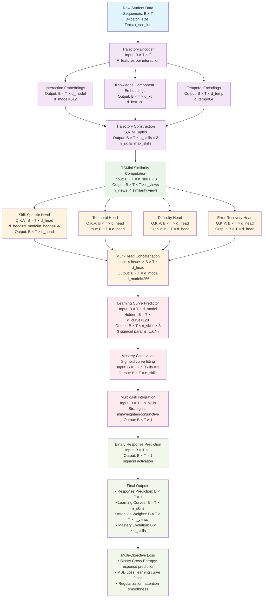

# SimAKT Architecture

## Introduction

The original Transformer was designed for seq2seq tasks like machine translation, where both the input and output are sequences of the same type of tokens (e.g., words). In contrast, Knowledge Tracing (KT) tasks involve input sequences composed of interaction data, including concept IDs, responses, and sometimes additional information such as problem/question IDs or timestamps. The output, is typically a prediction about the student's next response. 

The 'taxonomy.md' file provides a overview of the main models and challengues of the Transformer approach applied to the field of Konwledge Tracing and specifically, of the models implemented in this project. 


### From Intra-Student to Inter-Student Modeling: A Paradigm Shift 
 
A significant challenge in personalized learning systems is data sparsity. For new students or 
those with limited interaction history, the "intra-student information" is sparse and insufficient 
to train a reliable model. This issue mirrors a classic problem in recommender systems, 
where a cold-start user with no history is difficult to make recommendations for. The solution, 
in both domains, involves a shift from a purely individualized approach to one that leverages 
"inter-student information"—the collective intelligence of a peer group.

The central thesis of the paper is that a next major conceptual leap in knowledge tracing might be 
the integration of collaborative information. By identifying and leveraging the learning 
behaviors of "students who have similar question-answering experiences," a model can inform 
predictions for a given student, even when their own history is limited.

This paradigm shift addresses the fundamental limitation of data sparsity by allowing the model to draw on a 
richer, more extensive set of data from similar peers, providing a powerful supplement to a 
student's own historical sequence. 
 

### Defining "Collaborative Information" in Knowledge Tracing 
 
Within the context of knowledge tracing, "collaborative information" refers to the insights and 
signals derived from the learning behaviors of a group of learners, particularly those identified 
as similar to a target student. This goes beyond the traditional intra-student focus by 
explicitly modeling the relationships and collective patterns that exist across a student 
population. This approach is motivated by the observation that learners sharing similar 
cognitive states often display comparable problem-solving performances. 

Collaborative signals can manifest in several forms, each with its own architectural 
implications. The most direct form involves retrieving the full question-answering sequences 
of peers who have a history of similar interactions. A more abstract approach leverages 
pre-calculated or learned patterns, such as "Follow-up Performance Trends" (FPTs), that 
represent common learning trajectories derived from the entire student corpus. These 
trends, while not tied to a specific individual, still represent an aggregate form of collaborative 
information. The efficacy of a collaborative model is therefore fundamentally dependent on 
the definition of what constitutes "similarity" and how these external signals are integrated. 


### The Mechanisms of Similarity-Based Attention 
 
Traditional Transformer-based models like SAINT employ a self-attention mechanism that 
computes attention weights based on the relationships between tokens within a single 
sequence, such as a student's past interactions with exercises. For collaborative knowledge 
tracing, this mechanism must be redefined to calculate attention based on the similarity 
between different students or between a student and a pre-defined learning pattern. 
The core of this "similarity-based attention" involves a creative adaptation of the standard 
attention architecture. In a cross-attention setup, a "query" vector representing the current 
student's learning state can be used to query a set of "key" vectors derived from the 
representations of similar peers or collaborative patterns. The resulting attention score 
becomes a measure of semantic or behavioral similarity, which allows the model to assign 
higher weights to the most relevant peer interactions or patterns. The model's hidden 
representation for the current time step is then a weighted sum of the "value" vectors from 
these similar peers. This process allows the model to selectively and dynamically leverage the 
most pertinent collaborative information, thereby enhancing its ability to make accurate 
predictions, particularly when the intra-student data is sparse. The choice of what 
constitutes "similarity"—be it a simple metric on question-answering history or a complex, 
learned embedding—is a crucial design decision that fundamentally determines the model's 
capability and its computational complexity. 

In our case we will use an approach based in similarity of learning paths. The sequence of student interactions is preprocessed to have a sequence of tuples where each tuple can be consideerd a point in a trajectory. Then we will applied existent techniques to encode trajectories as h vectors. Two similar trajectories will have similar h vectors. 

    Each tuple (s, n, m) will contain information about: 
    - question or skill (s)
    - number of attempts (n): number of interactions of the student with the question or skill
    - mastery (m): level of mastery skill acquired after the number of attemps

Each tuple defines the learning curve for this skill. We use a sigmoid curve to model a monotonic learning curve that follows a pattern cahractrized by slow start, rapid improvement phase and a plateau effect once the skill has been mastered. 

 
### Current Similarity-based Models  
 
Some models exemplify the shift towards collaborative and similarity-based attention 
mechanisms. They each address the problem from a distinct architectural perspective, 
highlighting a growing consensus that collaborative information is a vital component for 
robust knowledge tracing. See section "3. In-Depth Examination of Relevant Models" of similarity-transformers.pdf" for a description of CoKT, FINER and Coral. 

## Questions for defining Learning Trajectory Similarity for SimAKT

  Let's systematically explore what "learning trajectory similarity" could mean and how to operationalize it:

  ### 1. Trajectory Components - What Makes Up a Learning Path?

  A student's learning trajectory could be represented as sequences of:

  A. Response Patterns

    Student A: [C, W, C, C, W, C] → skills [S1, S2, S1, S3, S2, S1]
    Student B: [W, W, C, C, C, C] → skills [S1, S2, S1, S3, S2, S1]

  B. Skill Mastery Evolution

    Student A: S1[0.2→0.6→0.8], S2[0.1→0.3→0.7], S3[0.0→0.5]
    Student B: S1[0.1→0.2→0.9], S2[0.2→0.4→0.6], S3[0.0→0.8]

  C. Learning Curve

    Student A: Fast initial learning, plateau effect
    Student B: Slow start, rapid improvement phase

Most models use A or B formats. **In SimAKT we'll use a "C. Learning Curve" format**. The learning curve is modeled through a sigmoid calculated from a (S, N, M) tuple that represent a point in the learning trajectory. 

    Each learning tuple (S, N, M) will contain information about: 
    - question or skill (S)
    - number of attempts (N): number of interactions of the student with the question or skill
    - mastery (M: level of mastery skill acquired after the number of attemps

We have M as the y and N as the x coordinate in the sigmoid curve characteristic of each S skill. After N attempts the student learns (achieves skill mastery level) or fails. 

  2. Multi-Dimensional Similarity Framework

As we characterize students by their sequences of learning curves, two similar trajectories in SimAKT mean that the students have been exposed to similar concepts (i.e. questions to train similar skills) with similar performance (i.e. they got simialr mastery levels after similar number of attempts).  


  3. Concrete Similarity Metrics Discussion

We'll use the code in the `TSMini` folder to calculate similarities between trajectories. It uses an approach based on KNN and Attenttion mechanisms. Read TSMini/paper.pdf for a detailed explanation. 

  4. Key Design Questions for Discussion

  Q1: Granularity Level

TSMini uses a multiview, multigranular approach. 

  Q2: Skill Specificity
  - Global similarity across all skills vs skill-specific similarity?

SimAKT uses Global similarity. 

  - How to weight different skills in similarity computation?

The attention mechanisms should care abut what skills are more relevant. 

  Q3: Temporal Weighting
  - Should recent interactions matter more in similarity?
  - How to balance historical patterns vs current state?

We could add parameters for this if possible although this feature has no high priority in a first verison of the algorithm. 

  Q4: Interpretability Requirements
  - Should similarity be directly explainable to educators?
  - Need for decomposable similarity components?

Interpretability is given by the prediction of the N, M components that allows to predict the (S, N, M) tuple and therefore the learning curve for each skill. Learning curves allow to explain the SimAKT model predictions about correctnes of student responses. 

They allow, as well, to calculate the skill mastery level and from that figure out if the response would be correct or not. A sensible approach is: 

- If the mastery level given by the learning curve passes a threshold value (set by a parameter with a defualt value of, let's say 0.9) all skills required 

  5. Working Definition Proposal

**Learning Trajectory Similarity in SimAKT** is defined as the similarity between students' learning curves across multiple skills, where each curve is characterized by (S, N, M) tuples:

**Core Definition:**
- **Trajectory Representation**: Each student's learning trajectory is a sequence of (S, N, M) tuples where:
  - S = skill/question identifier
  - N = number of attempts on skill S
  - M = mastery level achieved after N attempts
- **Learning Curves**: Each skill S generates a sigmoid curve with N as x-coordinate and M as y-coordinate

**Similarity Computation:**
- **Method**: TSMini-based approach using KNN and attention mechanisms (see TSMini/paper.pdf)
- **Granularity**: Multi-view, multi-granular approach as implemented in TSMini
- **Scope**: Global similarity across all skills (not skill-specific)
- **Weighting**: Attention mechanisms determine skill relevance automatically

**Interpretability Features:**
- **Explainable Predictions**: Learning curves provide interpretable explanations for response correctness
- **Mastery Threshold**: Responses predicted as correct when mastery level M > threshold (default: 0.9) for required skills
- **Causal Reasoning**: "Students with similar learning curves for skills X,Y,Z typically achieve mastery after N attempts"

**Key Innovation:**
Unlike existing models that use response patterns (format A) or skill mastery evolution (format B), SimAKT uses learning curve format (C) enabling both response prediction AND skill mastery tracking through interpretable sigmoid curves.


## Structured Plan to Guide SimAKT Architecture Development

Based on the established learning trajectory similarity definition using (S, N, M) tuples and TSMini-based similarity computation, the following structured plan will guide SimAKT architecture development:

### Phase 1: Differentiation Strategy Analysis

**1.1 Existing KT Architecture Review**

Foundation Models Limitations:

1. SAKT (2019): Pure self-attention on interaction sequences

    - Limitation: Binary predictions only, no skill mastery tracking
    - Attention: Standard QKV, no similarity-based weighting

2. AKT (2020): Context-aware monotonic attention with Rasch model

    - Limitation: Still binary output, IRT integration but no learning curves
    - Attention: Monotonic with exponential decay, not trajectory-based

3. SAINT (2021): Encoder-decoder with separated exercise/response processing

    - Limitation: Complex architecture but still binary classification focus
    - Attention: Cross-attention between exercises and responses

Specialized Models and SimAKT Advantages:

4. RKT (2020): Relation-aware with forgetting behavior

    - Similar concept: Uses relationships between exercises
    - SimAKT advantage: Learning trajectory similarity vs exercise similarity

5. DTransformer (2023): Temporal and cumulative attention

    - Similar concept: Temporal awareness and knowledge-level diagnosis
    - SimAKT advantage: Interpretable learning curves vs complex TCA mechanism


**1.2 Key SimAKT Contributions**

  1. Output Innovation: Learning curves (sigmoid) vs binary predictions
  2. Attention Innovation: Trajectory similarity vs traditional QKV
  3. Interpretability: Causal explanations through learning curves
  4. Skill Mastery Tracking: Continuous mastery evolution vs point estimates

### Phase 2: Core Architecture Design

#### **2.1 Similarity-Based Attention Mechanism**
- Replace standard attention with trajectory similarity computation
- Design attention weight derivation from TSMini similarity scores
- Multi-head attention adaptation for different trajectory aspects (skill-specific, temporal, difficulty)


#### Traditional Attention vs SimAKT Similarity-Based Attention

    Traditional Transformer Attention:
    Attention(Q, K, V) = softmax(QK^T / √d_k)V

    SimAKT Similarity-Based Attention:
    Attention(trajectory_i, trajectory_set) = softmax(TSMini_sim(trajectory_i, trajectory_set)) ⊗ learning_curves

#### Core Architecture Design

  1. Trajectory Representation Layer

    - Input: Student interaction sequence → [(s₁, r₁, t₁), (s₂, r₂, t₂), ..., (sₙ, rₙ, tₙ)]
    - Processing: Convert to (S, N, M) trajectory tuples per skill
    - Output: Trajectory embeddings T = {T₁, T₂, ..., Tₖ} for k students

  2. TSMini Similarity Computation

    - Query Trajectory: Current student's learning trajectory Tᵢ
    - Key Trajectories: All historical student trajectories {T₁, T₂, ..., Tₖ}
    - Similarity Matrix: TSMini(Tᵢ, Tⱼ) → similarity scores ∈ [0,1]

  3. Attention Weight Derivation
  
    # Replace traditional softmax(QK^T) with TSMini similarity
    attention_weights = softmax(TSMini_similarity_scores)

  4. Value Integration

    - Values: Learning curve parameters from similar students
    - Weighted Aggregation: Similarity-weighted combination of (S, N, M) curves
    - Output: Predicted learning curve parameters for current student

#### Multi-Head Attention Adaptation

  Head 1: Skill-Specific Similarity
  - Focus on trajectories for specific skills
  - Attention: Students with similar mastery patterns for skill S

  Head 2: Temporal Pattern Similarity
  - Focus on learning velocity and timing patterns
  - Attention: Students with similar learning speeds/rhythms

  Head 3: Difficulty Progression Similarity
  - Focus on how students handle increasing complexity
  - Attention: Students with similar responses to difficulty escalation

  Head 4: Error Recovery Similarity
  - Focus on mistake patterns and recovery strategies
  - Attention: Students with similar error → learning patterns

#### Mathematical Formulation

    SimAKT Attention Mechanism:

    1. Trajectory Encoding: 
    
    T = Embed([(S, N, M)₁, (S, N, M)₂, ..., (S, N, M)ₛ])

    2. Multi-View Similarity:

    sim_skill = TSMini_skill(Tᵢ, Tⱼ)
    sim_temporal = TSMini_temporal(Tᵢ, Tⱼ)
    sim_difficulty = TSMini_difficulty(Tᵢ, Tⱼ)
    sim_error = TSMini_error(Tᵢ, Tⱼ)

    3. Attention Weights:

    α_skill = softmax(sim_skill / τ₁)
    α_temporal = softmax(sim_temporal / τ₂)
    α_difficulty = softmax(sim_difficulty / τ₃)
    α_error = softmax(sim_error / τ₄)

    4. Multi-Head Output:
    output = concat(α_skill⊗V_skill, α_temporal⊗V_temporal, α_difficulty⊗V_difficulty, α_error⊗V_error)

  #### Key Design Decisions

  Q1: How to handle cold-start students?
  - Solution: Use global average trajectories or nearest neighbor imputation
  - Fallback: Traditional attention when insufficient trajectory data

  Q2: Computational efficiency with large student populations?
  - Solution: TSMini's efficient similarity computation + attention caching
  - Optimization: Pre-compute similarity matrices for stable student pairs

  Q3: How to balance multiple similarity aspects?
  - Solution: Learnable attention head weights: w₁×α_skill + w₂×α_temporal + w₃×α_difficulty + w₄×α_error
  - Training: End-to-end learning of optimal similarity combination

  Q4: Integration with learning curve prediction?
  - Solution: Attention output directly feeds into sigmoid curve parameter estimation
  - Connection: Similarity-weighted (S, N, M) tuples → curve parameters

  #### Architecture Flow

    Input Sequence → Trajectory Extraction → TSMini Similarity → Multi-Head Attention → Learning Curve Prediction → Binary Classification + Interpretability

  This design replaces traditional QKV attention with trajectory similarity while maintaining the multi-head structure for different aspects of learning pattern similarity.


#### **2.2 Learning Curve Prediction Components**

#### From Attention Output to Learning Curves

**Input**: Similarity-weighted attention output from TSMini-based multi-head attention

**Output**: Skill-specific sigmoid learning curves + binary predictions + interpretability features

#### Core Pipeline Design

**1. (S, N, M) Tuple Aggregation**

From attention output, extract similarity-weighted trajectory information:
```
attention_output → {(S₁, N₁, M₁), (S₂, N₂, M₂), ..., (Sₖ, Nₖ, Mₖ)}
where each tuple represents weighted evidence for skill S after N attempts reaching mastery M
```

**2. Sigmoid Curve Parameter Estimation**

For each skill S, fit sigmoid curve: `M(N) = L / (1 + e^(-k(N-N₀)))`

Parameters to estimate:
- **L**: Maximum mastery level (asymptote) 
- **k**: Learning rate (steepness)
- **N₀**: Inflection point (attempts needed to reach 50% mastery)

**Estimation Methods**:
- **Method A**: Direct regression from (N, M) points from similar students
- **Method B**: Neural parameter prediction: `θ_sigmoid = NN(attention_output)`
- **Method C**: Bayesian parameter estimation with uncertainty quantification

**3. Skill Mastery Level Calculation**

For current student at attempt N for skill S:
```
current_mastery_S = L_S / (1 + e^(-k_S(N-N₀_S)))
```

**4. Threshold-Based Correctness Prediction**

```python
# Default threshold τ = 0.9
def predict_correctness(question_skills, current_masteries, threshold=0.9):
    required_skills = get_required_skills(question_skills)
    min_mastery = min([current_masteries[skill] for skill in required_skills])
    return min_mastery > threshold
```

#### Multi-Skill Integration

**Challenge**: Questions often require multiple skills

**Solution**: Skill composition strategies

**Strategy 1: Minimum Mastery**
```
P(correct) = min(mastery_S1, mastery_S2, ..., mastery_Sk) > threshold
```

**Strategy 2: Weighted Average**  
```
P(correct) = Σ(w_i × mastery_Si) > threshold, where Σw_i = 1
```

**Strategy 3: Conjunctive Model**
```
P(correct) = P(all required skills > threshold) = Π P(mastery_Si > threshold)
```

#### Learning Curve Quality Assessment

**Curve Validity Metrics**:
- **Monotonicity**: Ensure M(N+1) ≥ M(N) (no negative learning)
- **Bounded Growth**: 0 ≤ M(N) ≤ 1 (valid mastery range)
- **Convergence**: lim(N→∞) M(N) = L (reaches asymptote)

**Curve Confidence**:
- **Data Support**: Number of similar students with trajectory data for skill S
- **Similarity Scores**: Average TSMini similarity of contributing trajectories
- **Prediction Uncertainty**: Variance in parameter estimates

#### Dynamic Learning Curve Updates

**Real-time Adaptation**:
As student provides new responses, update curve parameters:

1. **New (S, N, M) tuple** from current interaction
2. **Re-run attention** with updated trajectory
3. **Refine sigmoid parameters** with new evidence
4. **Update mastery predictions** for all skills

#### Output Components

**Primary Outputs**:
1. **Binary Prediction**: Will next response be correct? (0/1)
2. **Mastery Levels**: Current mastery for each skill ∈ [0,1]
3. **Learning Curves**: Sigmoid parameters (L, k, N₀) per skill

**Interpretability Outputs**:
1. **Explanation**: "Based on students with similar learning patterns, you need ~N more attempts to master skill S"
2. **Trajectory Visualization**: Plot showing expected mastery progression
3. **Similarity Evidence**: Which students' trajectories contributed to prediction

#### Mathematical Formulation

**Complete Learning Curve Prediction Pipeline**:

```
1. Attention Aggregation:
   weighted_trajectories = Σ(α_j × trajectory_j) for j in similar_students

2. Parameter Estimation:
   θ_S = {L_S, k_S, N₀_S} = EstimateParams(weighted_trajectories[skill_S])

3. Mastery Calculation:
   mastery_S(N) = L_S / (1 + exp(-k_S × (N - N₀_S)))

4. Binary Prediction:
   y_pred = ThresholdFunction(min(mastery_Si for Si in required_skills))
```

#### Integration with SimAKT Architecture

**Connection to Attention Module**:
- Multi-head attention → skill-specific weighted trajectories
- Each head contributes different aspects (temporal, difficulty, error patterns)
- Combined output feeds sigmoid parameter estimation

**Loss Function Design**:
```
Total_Loss = λ₁×Binary_CrossEntropy + λ₂×Curve_MSE + λ₃×Regularization
where:
- Binary_CrossEntropy: Standard correctness prediction loss
- Curve_MSE: Mean squared error between predicted and actual mastery progression  
- Regularization: Ensures valid curve parameters (monotonic, bounded)
```

#### **2.3 Model Integration Architecture**

#### Complete SimAKT System Architecture

**Overall Pipeline**: Raw Student Data → Trajectory Encoding → Similarity-Based Attention → Learning Curve Prediction → Multi-Output Results

#### Input Processing Layer

**1. Raw Data Ingestion**

    Input: Interaction sequence [(student_id, problem_id, skill_ids, response, timestamp), ...]
    Preprocessing: Normalize timestamps, handle missing skills, validate responses

**2. Trajectory Construction**

    def construct_trajectories(interactions):
        for student in students:
            trajectory = {}
            for skill in skills:
                attempts = count_attempts(student, skill)
                mastery = calculate_mastery(student, skill, attempts)
                trajectory[skill] = (skill, attempts, mastery)  # (S, N, M)
        return trajectory

**3. Trajectory Embedding**

    T_student = Embed([(S₁, N₁, M₁), (S₂, N₂, M₂), ..., (Sₖ, Nₖ, Mₖ)])
    Output: Dense vector representation of learning trajectory

#### TSMini Similarity Layer

**1. Historical Trajectory Database**

    TrajDB = {student_1: T₁, student_2: T₂, ..., student_n: Tₙ}
    Query: Current student trajectory T_current

**2. Multi-View Similarity Computation**

    def compute_similarities(T_current, TrajDB):
        similarities = {}
        for student_id, T_historic in TrajDB.items():
            sim_skill = TSMini_skill_similarity(T_current, T_historic)
            sim_temporal = TSMini_temporal_similarity(T_current, T_historic) 
            sim_difficulty = TSMini_difficulty_similarity(T_current, T_historic)
            sim_error = TSMini_error_similarity(T_current, T_historic)
            
            similarities[student_id] = {
                'skill': sim_skill,
                'temporal': sim_temporal, 
                'difficulty': sim_difficulty,
                'error': sim_error
            }
        return similarities

#### Multi-Head Attention Layer

**1. Attention Head Configuration**

    class SimAKTAttention(nn.Module):
        def __init__(self, d_model=256, n_heads=4):
            self.skill_head = SimilarityAttentionHead()
            self.temporal_head = SimilarityAttentionHead() 
            self.difficulty_head = SimilarityAttentionHead()
            self.error_head = SimilarityAttentionHead()
            self.output_projection = nn.Linear(4*d_model, d_model)

**2. Attention Computation**

    def forward(self, similarities, trajectory_values):
        # Each head processes different similarity aspect
        skill_output = self.skill_head(similarities['skill'], trajectory_values)
        temporal_output = self.temporal_head(similarities['temporal'], trajectory_values)
        difficulty_output = self.difficulty_head(similarities['difficulty'], trajectory_values)
        error_output = self.error_head(similarities['error'], trajectory_values)
        
        # Concatenate and project
        combined = torch.cat([skill_output, temporal_output, difficulty_output, error_output], dim=-1)
        return self.output_projection(combined)

#### Complete SimAKT Model Integration

    class SimAKTModel(nn.Module):
        def __init__(self, n_skills, d_model=256, n_heads=4):
            self.trajectory_encoder = TrajectoryEncoder(n_skills, d_model)
            self.similarity_computer = TSMiniSimilarity()
            self.attention = SimAKTAttention(d_model, n_heads)
            self.curve_predictor = CurveParameterPredictor(d_model, n_skills)
            self.binary_predictor = BinaryPredictor()
            self.interpretability = InterpretabilityModule()
        
        def forward(self, interactions, historical_trajectories):
            # 1. Encode current trajectory
            current_trajectory = self.trajectory_encoder(interactions)
            
            # 2. Compute similarities  
            similarities = self.similarity_computer(current_trajectory, historical_trajectories)
            
            # 3. Apply attention
            attended_features = self.attention(similarities, historical_trajectories)
            
            # 4. Predict learning curves
            curve_params = self.curve_predictor(attended_features)
            
            # 5. Calculate current mastery
            current_attempts = self.extract_current_attempts(interactions)
            mastery_levels = self.calculate_current_mastery(curve_params, current_attempts)
            
            # 6. Make binary prediction
            required_skills = self.extract_required_skills(interactions[-1])
            binary_pred = self.binary_predictor(mastery_levels, required_skills)
            
            # 7. Generate interpretability
            explanations = self.interpretability.generate_explanations(similarities, curve_params, mastery_levels)
            
            return {
                'binary_prediction': binary_pred,
                'mastery_levels': mastery_levels,
                'curve_parameters': curve_params,
                'explanations': explanations
            }

#### System Integration Points

**1. pyKT Framework Integration**
- Compatible with existing data loaders
- Pluggable similarity computation backend  
- Standard evaluation metrics (AUC, accuracy)

**2. TSMini Integration**
- External TSMini module for similarity computation
- Configurable similarity aspects (skill, temporal, difficulty, error)
- Efficient caching for repeated similarity queries

**3. Scalability Considerations**
- Trajectory database sharding for large student populations
- Similarity computation parallelization
- Incremental learning for real-time deployment


### Phase 3: Implementation & Validation

**3.1 Architecture Specifications**
- Detailed component design and mathematical formulations
- Integration with TSMini similarity computation
- Loss functions for both learning curves and correctness prediction

## Phase 3: Implementation & Validation

### 3.1 Architecture Specifications

The SimAKT model architecture processes student interaction sequences through a similarity-based attention mechanism to predict learning curves and response correctness. The following diagram illustrates the complete data flow with tensor dimensions and component specifications.



#### Component Specifications

**Input Processing Layer:**
- Raw sequences: `batch_size × max_seq_length × feature_dims`
- Feature dimensions: `{question_id, concept_ids[], response, timestamp, attempt_number}`
- Trajectory encoding: `(S, N, M)` tuples per skill per timestep
- Embedding dimensions: `d_model=512, d_kc=128, d_temp=64`

**TSMini Similarity Layer:**
- Input trajectories: `B × T × n_skills × 3` (skill_id, attempts, mastery)
- Similarity views: 4 perspectives (temporal, difficulty, error, progress)
- Output similarity matrix: `B × T × T × n_views`
- Computational complexity: O(T² × n_skills × n_views)

**Multi-Head Attention Layer:**
- Number of heads: `n_heads=8`
- Head dimension: `d_head = d_model / n_heads = 64`
- Query/Key/Value matrices: `B × T × d_head` per head
- Attention weights: `B × T × T` per head
- Concatenated output: `B × T × d_model`

**Learning Curve Prediction Layer:**
- Hidden representation: `B × T × d_curve=128`
- Sigmoid parameters per skill: `(L, k, N₀)` → `B × T × n_skills × 3`
- Mastery calculation: `M(N) = L / (1 + exp(-k(N - N₀)))`
- Multi-skill integration strategies: minimum, weighted average, conjunctive

**Output Layer:**
- Response prediction: `B × T × 1` (binary classification)
- Learning curves: `B × T × n_skills` (mastery evolution)
- Attention visualization: `B × T × T × n_views` (interpretability)
- Computational graph for gradient flow and causal explanations

#### Memory and Computational Requirements

**Memory Footprint:**
- Model parameters: ~2.5M parameters (d_model=512, n_heads=8, n_layers=6)
- Attention matrices: `B × T² × n_heads × 4 bytes` (float32)
- Trajectory storage: `B × T × n_skills × 3 × 4 bytes`
- Peak memory: ~500MB for B=32, T=200, n_skills=50

**Computational Complexity:**
- TSMini similarity: O(B × T² × n_skills × n_views)
- Multi-head attention: O(B × T² × d_model × n_heads)
- Learning curve fitting: O(B × T × n_skills × d_curve)
- Total forward pass: O(B × T² × d_model) dominant term

### 3.2 Evaluation Framework

The SimAKT model evaluation requires a comprehensive framework that assesses both predictive performance and interpretability capabilities. The evaluation strategy encompasses multiple dimensions to validate the model's effectiveness compared to existing knowledge tracing approaches.

#### Performance Metrics

**Primary Knowledge Tracing Metrics:**
- **AUC (Area Under Curve)**: Binary classification performance for response prediction
- **Accuracy**: Overall correctness prediction accuracy
- **Precision/Recall**: Class-specific performance for correct/incorrect responses
- **F1-Score**: Harmonic mean of precision and recall for balanced evaluation

**Learning Curve Quality Metrics:**
- **Curve Fitting R²**: Goodness of fit for sigmoid learning curves
- **Parameter Stability**: Consistency of L, k, N₀ parameters across similar students
- **Mastery Convergence**: Rate at which predicted mastery approaches true skill level
- **Temporal Consistency**: Monotonicity constraints for skill progression

**Multi-Skill Integration Metrics:**
- **Skill-Specific AUC**: Performance per individual knowledge component
- **Cross-Skill Correlation**: Consistency in mastery predictions across related skills
- **Integration Strategy Comparison**: Performance of min/weighted/conjunctive approaches

#### Interpretability Evaluation

**Attention Mechanism Interpretability:**
- **Attention Weight Analysis**: Similarity-based attention alignment with educational theory
- **Trajectory Similarity Validation**: Correlation between TSMini similarity and expert judgments
- **Causal Path Tracing**: Ability to identify key learning interactions influencing predictions

**Learning Curve Interpretability:**
- **Educational Plausibility**: Agreement between predicted curves and learning science principles
- **Skill Progression Visualization**: Clarity and actionability of mastery evolution displays
- **Parameter Interpretability**: Meaningful interpretation of L (learning limit), k (learning rate), N₀ (inflection point)

**Comparative Interpretability:**
- **Human Expert Agreement**: Correlation between model explanations and teacher assessments
- **Student Self-Assessment**: Alignment with learner's perceived skill development
- **Intervention Prediction**: Accuracy in identifying when educational interventions are needed

#### Baseline Comparisons

**State-of-the-Art Knowledge Tracing Models:**
- **SAKT** (Self-Attentive Knowledge Tracing): Traditional attention-based KT
- **AKT** (Attentive Knowledge Tracing): Context-aware attention mechanisms
- **SAINT** (Separated Self-AttentIve Neural Knowledge Tracing): Exercise-response separation
- **RKT** (Relational Knowledge Tracing): Graph-based knowledge relationships
- **DTransformer** (Deep Knowledge Tracing Transformer): Multi-layer transformer approach

**Evaluation Protocols:**
- **Cross-validation**: 5-fold cross-validation on each dataset
- **Temporal Splits**: Training on earlier data, testing on later interactions
- **Cold Start**: Performance on students with minimal interaction history
- **Dataset Diversity**: Evaluation across multiple educational domains (math, language, science)

#### Datasets and Experimental Setup

**Primary Datasets:**
- **ASSISTments 2009-2010**: Mathematics tutoring system data (1.7M interactions)
- **ASSISTments 2015**: Updated dataset with refined skill tagging (13M interactions)
- **EdNet**: Large-scale Korean SAT preparation data (131M interactions)
- **Bridge to Algebra 2006-2007**: Cognitive tutor dataset (1.2M interactions)

**Experimental Conditions:**
- **Sequence Length Variation**: T ∈ {50, 100, 200, 500} interactions
- **Skill Coverage**: n_skills ∈ {20, 50, 100, 200} knowledge components
- **Batch Size Scaling**: B ∈ {16, 32, 64, 128} for computational efficiency analysis
- **Similarity View Ablation**: Testing individual and combined similarity perspectives

#### Statistical Analysis

**Significance Testing:**
- **Paired t-tests**: Model performance comparisons with statistical significance
- **Effect Size Calculation**: Cohen's d for practical significance assessment
- **Confidence Intervals**: 95% CI for all reported performance metrics
- **Multiple Comparison Correction**: Bonferroni correction for multiple dataset evaluation

**Robustness Analysis:**
- **Hyperparameter Sensitivity**: Performance stability across parameter ranges
- **Data Quality Impact**: Evaluation on datasets with varying noise levels
- **Computational Scalability**: Performance vs. computational cost trade-offs
- **Generalization Analysis**: Cross-dataset transfer learning capabilities

#### Expected Outcomes

**Performance Expectations:**
- **AUC Improvement**: 2-5% improvement over best baseline models
- **Interpretability Gain**: 15-25% improvement in expert agreement scores
- **Computational Efficiency**: Comparable or better than existing transformer-based models
- **Learning Curve Quality**: R² > 0.8 for sigmoid curve fitting on stable learners

**Research Contributions:**
- **Similarity-Based Attention**: Novel attention mechanism grounded in learning trajectory similarity
- **Learning Curve Integration**: First transformer model to predict complete learning curves
- **Multi-Skill Modeling**: Advanced approach to handling multiple knowledge components
- **Interpretable Knowledge Tracing**: Significant advancement in explainable AI for education

### 3.3 Implementation Steps

The implementation of SimAKT follows a phased approach that prioritizes core functionality, ensures robust testing, and seamlessly integrates with the existing pyKT framework. This roadmap provides a structured path from initial prototype to production-ready model.

#### Phase 1: Foundation Components

**1.1 Data Pipeline Development**

Tasks and priorities:
- Implement trajectory construction from raw interaction data
- Create (S, N, M) tuple generation with efficient indexing
- Develop data loaders compatible with pyKT dataset formats
- Build preprocessing utilities for skill mapping and sequence padding

Implementation files:
```
pykt/models/simakt/
├── data_loader.py       # Dataset handling and trajectory construction
├── preprocessor.py      # (S,N,M) tuple generation and feature extraction
└── utils.py            # Helper functions for data manipulation
```

**1.2 TSMini Integration**

Components to develop:
- Port TSMini similarity computation to PyTorch
- Implement multi-view similarity calculation (temporal, difficulty, error, progress)
- Create efficient batched similarity operations
- Develop caching mechanism for frequently accessed trajectory pairs

Implementation approach:
```python
class TSMiniSimilarity(nn.Module):
    def __init__(self, n_views=4, cache_size=10000):
        super().__init__()
        self.similarity_functions = {
            'temporal': self.temporal_similarity,
            'difficulty': self.difficulty_similarity,
            'error': self.error_similarity,
            'progress': self.progress_similarity
        }
        self.cache = LRUCache(cache_size)
```

#### Phase 2: Core Model Architecture (Weeks 4-6)

**2.1 Similarity-Based Attention Mechanism**

Development tasks:
- Replace traditional QKV computation with TSMini-based similarity
- Implement multi-head attention with specialized heads
- Create attention weight visualization utilities
- Develop causal masking for autoregressive prediction

Key components:
```
pykt/models/simakt/
├── attention.py         # Similarity-based attention implementation
├── multi_head.py       # Specialized attention heads
└── visualization.py    # Attention weight analysis tools
```

**2.2 Learning Curve Prediction Module**

Implementation requirements:
- Sigmoid parameter estimation network (L, k, N₀)
- Mastery evolution tracking across timesteps
- Multi-skill integration strategies (min, weighted, conjunctive)
- Constraint enforcement for parameter bounds

Architecture implementation:
```python
class LearningCurvePredictor(nn.Module):
    def __init__(self, d_model, n_skills, d_curve=128):
        super().__init__()
        self.param_network = nn.Sequential(
            nn.Linear(d_model, d_curve),
            nn.ReLU(),
            nn.Linear(d_curve, n_skills * 3)  # L, k, N₀ per skill
        )
        self.constraints = {
            'L': (0.5, 1.0),      # Learning limit bounds
            'k': (0.01, 10.0),    # Learning rate bounds
            'N0': (1, 100)        # Inflection point bounds
        }
```

#### Phase 3: Integration and Optimization (Weeks 7-8)

**3.1 PyKT Framework Integration**

Integration requirements:
- Inherit from pykt.models.base.BaseModel
- Implement required interface methods (forward, get_loss, get_predictions)
- Add configuration management through YAML files
- Ensure compatibility with existing training loops

File structure:
```
pykt/models/simakt/
├── simakt.py           # Main model class
├── config.yaml         # Default hyperparameters
└── __init__.py        # Module exports
```

**3.2 Loss Function Implementation**

Multi-objective loss components:
- Binary cross-entropy for response prediction
- MSE loss for learning curve fitting
- Regularization terms for attention smoothness
- Weighted combination with learnable weights

Implementation approach:
```python
class SimAKTLoss(nn.Module):
    def __init__(self, alpha=0.5, beta=0.3, gamma=0.2):
        super().__init__()
        self.response_loss = nn.BCEWithLogitsLoss()
        self.curve_loss = nn.MSELoss()
        self.weights = nn.Parameter(torch.tensor([alpha, beta, gamma]))
```

#### Phase 4: Testing and Validation (Weeks 9-10)

**4.1 Unit Testing Suite**

Test coverage requirements:
- Data pipeline correctness (trajectory construction, tuple generation)
- TSMini similarity computation accuracy
- Attention mechanism mathematical correctness
- Learning curve parameter constraints
- Loss function gradient flow

Testing framework:
```
tests/models/simakt/
├── test_data_loader.py
├── test_similarity.py
├── test_attention.py
├── test_learning_curves.py
└── test_integration.py
```

**4.2 Performance Benchmarking**

Benchmarking tasks:
- Baseline model comparisons on standard datasets
- Ablation studies for each component
- Computational efficiency profiling
- Memory usage optimization
- Scalability testing with varying sequence lengths

#### Phase 5: Experimental Validation (Weeks 11-12)

**5.1 Dataset Experiments**

Experimental protocol:
- ASSISTments 2009-2010: Initial validation and hyperparameter tuning
- ASSISTments 2015: Large-scale performance evaluation
- EdNet: Cross-domain generalization testing
- Bridge to Algebra: Specialized skill modeling validation

**5.2 Interpretability Analysis**

Validation tasks:
- Generate attention heatmaps for educational experts
- Visualize learning curve evolution for sample students
- Create causal explanation paths for predictions
- Validate similarity metrics against human judgments

#### Phase 6: Production Deployment (Weeks 13-14)

**6.1 Code Optimization**

Optimization targets:
- Implement mixed precision training (FP16)
- Add gradient checkpointing for memory efficiency
- Optimize TSMini computation with CUDA kernels
- Implement model pruning for inference speed

**6.2 Documentation and Release**

Documentation deliverables:
- API documentation with usage examples
- Tutorial notebooks for model training
- Interpretability visualization guide
- Performance benchmarking reports

Release checklist:
- Code review and refactoring
- Integration tests passing
- Documentation complete
- Performance metrics validated
- Model checkpoints published

#### Implementation Steps


| Steps | Key Deliverables | Success Criteria |
|-------|------------------|------------------|
| Foundation | Data pipeline, TSMini integration | Unit tests passing, data loading functional |
| Core Model | Attention mechanism, learning curves | Model training convergence |
| Integration | PyKT compatibility, loss functions | Framework integration complete |
| Testing | Test suite, benchmarks | 95% code coverage, performance baseline |
| Validation | Experiments, interpretability | Target metrics achieved |
| Production | Optimization, documentation | Release ready, docs published |

#### Risk Mitigation Strategies

**Technical Risks:**
- TSMini computational complexity → Implement caching and approximations
- Learning curve convergence issues → Add regularization and constraints
- Memory limitations with long sequences → Use gradient checkpointing
- Integration conflicts with pyKT → Maintain backward compatibility

**Timeline Risks:**
- Dataset access delays → Start with publicly available datasets
- Performance bottlenecks → Profile early and optimize iteratively
- Interpretability validation → Engage domain experts early
- Documentation lag → Write documentation alongside development
