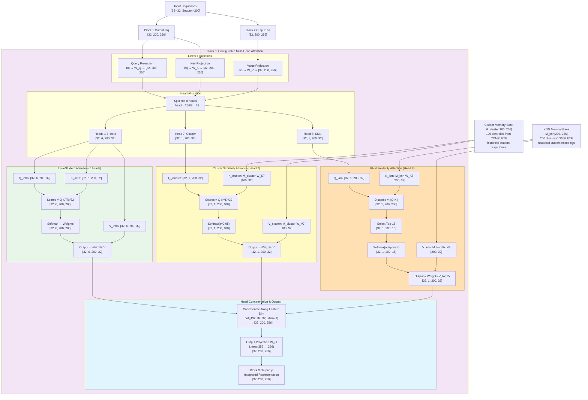
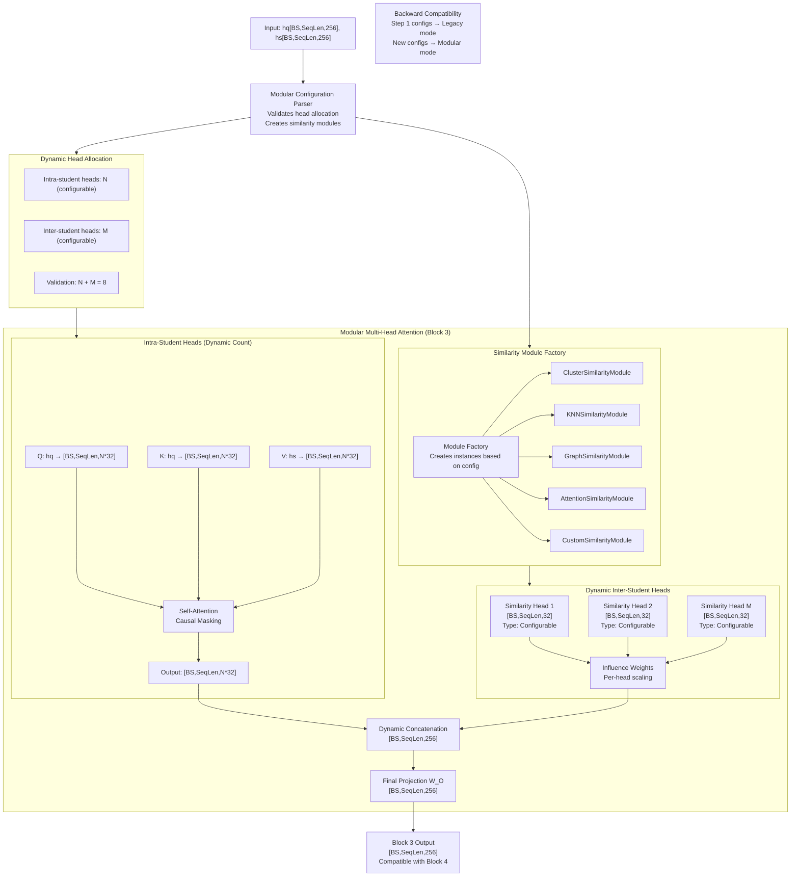
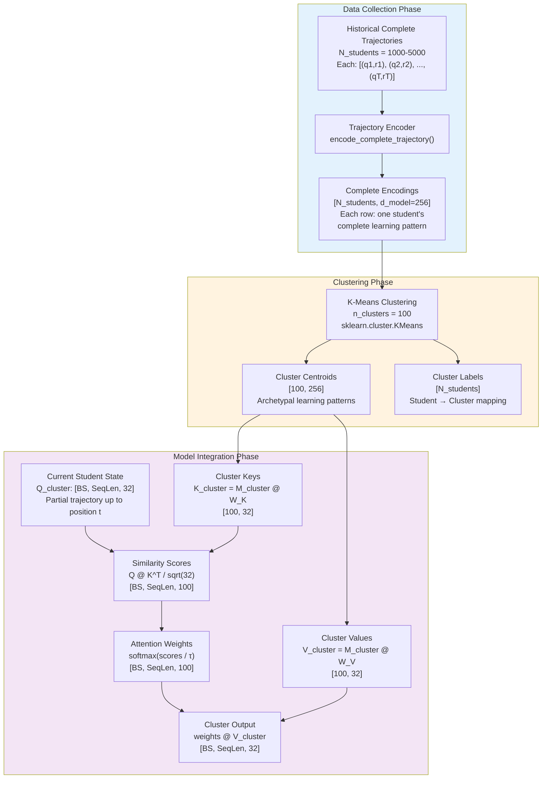
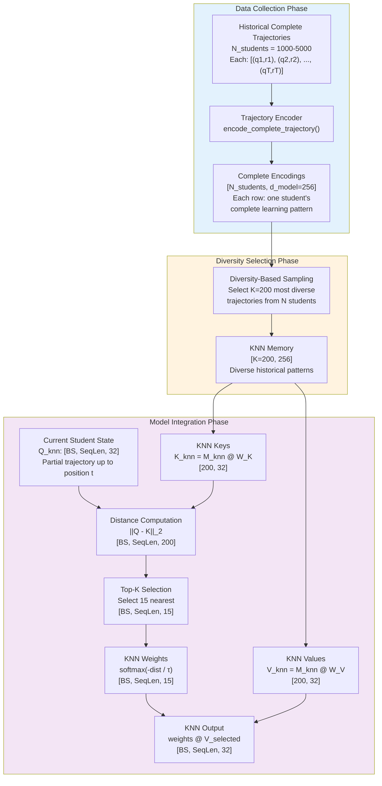

# Phase 1 Architecture Design Exploration and Refinement - Emcoder-only

Approach based on adding modular inter-student heads to an encdoder-only architecture. 

## Approach Guidelines: 
1) Look for a modular design where the attention module have an abstract design, ready to implement new similar-based attention heads with a kind of plug-and-play approach, allowing add new heads, combine them and enable/disable each head based on a config file. 
2) When all inter-student attention heads are disabled, the behaviour of the system will be identical to the current one that only implements intra-student heads. 

## Overview

This proposal presents a two-step approach to implementing similarity-based attention in SimAKT:

- **Step 1**: Fixed dual-head approach (6 intra + 1 cluster + 1 KNN) for immediate research value
- **Step 2**: Fully modular architecture supporting plug-and-play similarity approaches

Both steps integrate into **Block 3** of the existing SimAKT architecture, which processes both question understanding (Block 1) and interaction patterns (Block 2), making it the ideal integration point for similarity-based inter-student attention.

---

# STEP 1: Fixed Dual-Head Approach

## Step 1 Integration Strategy

Step 1 implements a **fixed architecture** with exactly 2 inter-student similarity heads:

1. **Strategic Focus**: Direct comparison between cluster-based vs KNN-based similarity approaches
2. **Implementation Simplicity**: Faster development and easier debugging with hardcoded structure
3. **Research Clarity**: Clear attribution of performance improvements to specific similarity types
4. **Backward Compatibility**: Easy to enable/disable inter-student attention while preserving original behavior

## Step 1 Fixed Architecture Design

The Step 1 design transforms Block 3 into a **Fixed Dual-Head Attention** system with exactly 2 inter-student similarity heads:

```python
class DualSimilarityAttention(nn.Module):
    """
    Step 1: Fixed dual-head architecture with exactly 6 intra + 1 cluster + 1 KNN heads
    This is hardcoded for Step 1 research focus on cluster vs KNN comparison
    """
    def __init__(self, d_model=256, config=None):
        super().__init__()
        self.d_model = d_model
        self.d_head = 32  # d_model // 8 heads
        self.config = config or {}
        
        # Fixed architecture: Always 6 intra + 1 cluster + 1 KNN
        self.n_intra_heads = 6
        self.n_cluster_heads = 1  
        self.n_knn_heads = 1
        
        # Projection layers for all 8 heads
        self.w_q = nn.Linear(d_model, d_model, bias=False)
        self.w_k = nn.Linear(d_model, d_model, bias=False)  
        self.w_v = nn.Linear(d_model, d_model, bias=False)
        self.w_o = nn.Linear(d_model, d_model, bias=False)
        
        # Inter-student memory projections (hardcoded for cluster + KNN)
        self.w_k_cluster = nn.Linear(d_model, self.d_head, bias=False)
        self.w_v_cluster = nn.Linear(d_model, self.d_head, bias=False)
        self.w_k_knn = nn.Linear(d_model, self.d_head, bias=False)
        self.w_v_knn = nn.Linear(d_model, self.d_head, bias=False)
        
        # Fixed memory bank setup (cluster + KNN only)
        self.setup_fixed_memory_banks()
    
    def setup_fixed_memory_banks(self):
        """Setup fixed cluster and KNN memory banks"""
        cluster_config = self.config.get('cluster_config', {})
        knn_config = self.config.get('knn_config', {})
        
        # Cluster memory bank
        n_clusters = cluster_config.get('n_clusters', 100)
        self.register_buffer('cluster_memory', torch.zeros(n_clusters, self.d_model))
        self.cluster_temp = cluster_config.get('temperature', 0.05)
        
        # KNN memory bank  
        memory_size = knn_config.get('memory_size', 200)
        self.k_neighbors = knn_config.get('k_neighbors', 15)
        self.register_buffer('knn_memory', torch.zeros(memory_size, self.d_model))
        self.knn_temp = knn_config.get('temperature', 0.1)
```

## Detailed Head Configuration

**Target Integration: Block 3 Multi-Head Attention**

Current Block 3:
- 8 identical heads performing intra-student attention
- Query Source: `hq` [BS, SeqLen, 256]
- Key Source: `hq` [BS, SeqLen, 256]
- Value Source: `hs` [BS, SeqLen, 256]

Proposed Modular Block 3:
- **Heads 1-6**: Intra-student attention (preserving original behavior) 
- **Heads 7-8**: Configurable inter-student attention (cluster + KNN with position-weighted similarity)

## Tensor Shapes and Data Flow

### Input Specifications

```python
# Current student sequences (unchanged)
hq: [BS, SeqLen, 256]  # Hidden questions from Block 1
hs: [BS, SeqLen, 256]  # Hidden states from Block 2

# External similarity memory (NEW)
M_sim: [K, 256]  # Where K = memory size (configurable: 100-500)
```

### Intra-Student Heads (Heads 1-6)

```python
# Query, Key, Value projections for intra-student heads (6 heads)
Q_intra = hq @ W_Q_intra  # [BS, SeqLen, 6*32] = [BS, SeqLen, 192]
K_intra = hq @ W_K_intra  # [BS, SeqLen, 6*32] = [BS, SeqLen, 192]
V_intra = hs @ W_V_intra  # [BS, SeqLen, 6*32] = [BS, SeqLen, 192]

# Reshape for multi-head processing
Q_intra = Q_intra.view(BS, SeqLen, 6, 32).transpose(1, 2)  # [BS, 6, SeqLen, 32]
K_intra = K_intra.view(BS, SeqLen, 6, 32).transpose(1, 2)  # [BS, 6, SeqLen, 32]
V_intra = V_intra.view(BS, SeqLen, 6, 32).transpose(1, 2)  # [BS, 6, SeqLen, 32]

# Attention computation
scores_intra = Q_intra @ K_intra.transpose(-2, -1) / sqrt(32)  # [BS, 6, SeqLen, SeqLen]
attn_intra = F.softmax(scores_intra, dim=-1) @ V_intra        # [BS, 6, SeqLen, 32]

# Reshape back
attn_intra = attn_intra.transpose(1, 2).contiguous().view(BS, SeqLen, 192)  # [BS, SeqLen, 192]
```

### Inter-Student Heads (Heads 7-8)

```python
# Inter-student projections for cluster and KNN heads
Q_cluster = hq @ W_Q_cluster  # [BS, SeqLen, 32] - Cluster head queries
Q_knn = hq @ W_Q_knn         # [BS, SeqLen, 32] - KNN head queries

# Position-weighted cluster attention (Head 7)
cluster_similarities = compute_position_weighted_similarity(
    current_sequence_states,  # [BS, SeqLen, d_model]
    cluster_memory_sequences, # [n_clusters, max_len, d_model]
    current_position,         # int
    future_weight=0.3         # Position weight parameter
)  # [BS, n_clusters]

K_cluster = cluster_centroids @ W_K_cluster  # [n_clusters, 32]
V_cluster = cluster_centroids @ W_V_cluster  # [n_clusters, 32]
attn_cluster = F.softmax(cluster_similarities, dim=-1) @ V_cluster  # [BS, SeqLen, 32]

# Position-weighted KNN attention (Head 8) 
knn_similarities = compute_position_weighted_similarity(
    current_sequence_states,  # [BS, SeqLen, d_model]
    knn_memory_sequences,    # [n_samples, max_len, d_model]
    current_position,        # int
    future_weight=0.3        # Position weight parameter
)  # [BS, n_samples]

K_knn = knn_samples @ W_K_knn  # [n_samples, 32]
V_knn = knn_samples @ W_V_knn  # [n_samples, 32]
attn_knn = F.softmax(knn_similarities, dim=-1) @ V_knn  # [BS, SeqLen, 32]
```

### Output Concatenation

```python
# Apply influence weights from configuration
cluster_weight = config.get('cluster_config', {}).get('influence_weight', 1.0)
knn_weight = config.get('knn_config', {}).get('influence_weight', 1.0)

# Scale inter-student head contributions
attn_cluster_weighted = attn_cluster * cluster_weight  # [BS, SeqLen, 32]
attn_knn_weighted = attn_knn * knn_weight              # [BS, SeqLen, 32]

# Combine intra and weighted inter attention outputs (6 + 1 + 1 = 8 heads)
output = torch.cat([
    attn_intra,            # [BS, SeqLen, 192] - 6 intra-student heads (unchanged)
    attn_cluster_weighted, # [BS, SeqLen, 32]  - 1 cluster head (weighted)
    attn_knn_weighted      # [BS, SeqLen, 32]  - 1 KNN head (weighted)
], dim=-1)  # [BS, SeqLen, 256]

# Final projection
output = output @ W_O  # [BS, SeqLen, 256]
```

## Plug-and-Play Similarity Modules

The modular design supports multiple similarity approaches through an abstract interface:

```python
class BaseSimilarityModule(nn.Module):
    """Abstract base class for similarity computation approaches"""
    
    def build_memory_bank(self, student_representations: Tensor,
                         config: Dict) -> Tensor:
        """Build external memory bank from student data"""
        raise NotImplementedError
    
    def compute_similarity(self, query: Tensor, memory: Tensor) -> Tensor:
        """Compute similarity scores between query and memory"""
        raise NotImplementedError

class ClusterSimilarityModule(BaseSimilarityModule):
    """K-means clustering based similarity"""
    
    def build_memory_bank(self, student_representations, config):
        n_clusters = config.get('n_clusters', 100)
        # K-means clustering implementation
        centroids = kmeans_clustering(student_representations, n_clusters)
        return centroids  # [n_clusters, d_model]
    
    def compute_similarity(self, query, memory):
        return F.cosine_similarity(query.unsqueeze(-2), memory.unsqueeze(0), dim=-1)

class KNNSimilarityModule(BaseSimilarityModule):
    """K-Nearest Neighbors based similarity"""
    
    def build_memory_bank(self, student_representations, config):
        # Random sampling or diversity-based selection
        memory_size = config.get('memory_size', 200)
        return sample_diverse_representations(student_representations, memory_size)
    
    def compute_similarity(self, query, memory):
        # Distance-based similarity with learnable temperature
        distances = torch.cdist(query, memory, p=2)
        return F.softmax(-distances * self.temperature, dim=-1)

class HybridSimilarityModule(BaseSimilarityModule):
    """Combination of multiple similarity approaches"""
    
    def __init__(self, modules, weights):
        super().__init__()
        self.modules = nn.ModuleList(modules)
        self.weights = nn.Parameter(torch.tensor(weights))
    
    def compute_similarity(self, query, memory):
        similarities = [module.compute_similarity(query, memory)
                       for module in self.modules]
        weighted_sim = sum(w * sim for w, sim in zip(F.softmax(self.weights), similarities))
        return weighted_sim
```

## Configuration System

The modular design is controlled through a comprehensive configuration system that integrates position-weighted similarity:

```json
{
  "similarity_approaches": {
    "none": {
      "approach": "none",
      "inter_heads": 0,
      "description": "Baseline - no inter-student attention (DTransformer compatibility)"
    },
    "position_weighted_dual": {
      "approach": "position_weighted_dual",
      "inter_heads": 2,
      "intra_heads": 6,
      "cluster_config": {
        "n_clusters": 100,
        "similarity_metric": "cosine",
        "temperature": 0.05,
        "influence_weight": 1.0
      },
      "knn_config": {
        "memory_size": 200,
        "k_neighbors": 15,
        "adaptive_temperature": true,
        "influence_weight": 1.0
      },
      "temporal_config": {
        "decay_factor": 0.95,
        "future_weight": 0.3,
        "strategy": "position_weighted"
      },
      "description": "Dual heads with position-weighted temporal similarity and balanced influence"
    },
    "strict_causal": {
      "approach": "position_weighted_dual",
      "inter_heads": 2,
      "intra_heads": 6,
      "cluster_config": {
        "n_clusters": 50,
        "temperature": 0.05,
        "influence_weight": 1.0
      },
      "knn_config": {
        "memory_size": 100,
        "k_neighbors": 10,
        "influence_weight": 1.0
      },
      "temporal_config": {
        "decay_factor": 0.95,
        "future_weight": 0.0,
        "strategy": "position_weighted"
      },
      "description": "Strict causal - no future information, balanced head influence"
    },
    "full_collaborative": {
      "approach": "position_weighted_dual", 
      "inter_heads": 2,
      "intra_heads": 6,
      "cluster_config": {
        "n_clusters": 200,
        "temperature": 0.05,
        "influence_weight": 1.0
      },
      "knn_config": {
        "memory_size": 300,
        "k_neighbors": 20,
        "influence_weight": 1.0
      },
      "temporal_config": {
        "decay_factor": 0.98,
        "future_weight": 1.0,
        "strategy": "position_weighted"
      },
      "description": "Full collaborative filtering - complete trajectory weighting, balanced influence"
    },
    "cluster_dominant": {
      "approach": "position_weighted_dual",
      "inter_heads": 2,
      "intra_heads": 6,
      "cluster_config": {
        "n_clusters": 150,
        "temperature": 0.03,
        "influence_weight": 2.0
      },
      "knn_config": {
        "memory_size": 100,
        "k_neighbors": 10,
        "influence_weight": 0.5
      },
      "temporal_config": {
        "decay_factor": 0.95,
        "future_weight": 0.3,
        "strategy": "position_weighted"
      },
      "description": "Cluster-dominant configuration - 4x cluster influence vs KNN"
    },
    "knn_dominant": {
      "approach": "position_weighted_dual",
      "inter_heads": 2,
      "intra_heads": 6,
      "cluster_config": {
        "n_clusters": 50,
        "temperature": 0.1,
        "influence_weight": 0.3
      },
      "knn_config": {
        "memory_size": 250,
        "k_neighbors": 20,
        "influence_weight": 1.8
      },
      "temporal_config": {
        "decay_factor": 0.95,
        "future_weight": 0.3,
        "strategy": "position_weighted"
      },
      "description": "KNN-dominant configuration - 6x KNN influence vs cluster"
    },
    "adaptive_influence": {
      "approach": "position_weighted_dual",
      "inter_heads": 2,
      "intra_heads": 6,
      "cluster_config": {
        "n_clusters": 100,
        "temperature": 0.05,
        "influence_weight": 1.5
      },
      "knn_config": {
        "memory_size": 150,
        "k_neighbors": 12,
        "influence_weight": 0.8
      },
      "temporal_config": {
        "decay_factor": 0.96,
        "future_weight": 0.4,
        "strategy": "position_weighted"
      },
      "description": "Moderate cluster preference with adaptive temporal weighting"
    }
  }
}
```

## Step 1 Fixed Architecture Diagram

The following diagram shows the Step 1 fixed architecture with exactly 2 inter-student heads:

```mermaid
graph TB
    %% Input Layer
    Input["Input: hq[BS,SeqLen,256], hs[BS,SeqLen,256]"]
    
    %% Configuration
    Config["Similarity Config<br/>approach: cluster/knn/hybrid/none<br/>inter_heads: 0-3<br/>memory_size: 50-500"]
    
    %% Memory Bank
    MemoryBank["External Memory Bank<br/>M_sim[K,256]<br/>Built via similarity module"]
    
    %% Configurable Multi-Head Attention Block
    subgraph CMHA ["Configurable Multi-Head Attention (Block 3)"]
        direction TB
        
        %% Head Allocation
        HeadAlloc["Head Allocation<br/>Based on Config"]
        
        %% Intra-Student Heads  
        subgraph IntraHeads ["Intra-Student Heads (1-6)"]
            Q1["Q: hq → [BS,SeqLen,192]"]
            K1["K: hq → [BS,SeqLen,192]"]
            V1["V: hs → [BS,SeqLen,192]"]
            Attn1["Self-Attention<br/>Causal Masking<br/>Preserves DTransformer Behavior"]
            Out1["Output: [BS,SeqLen,192]"]
            
            Q1 --> Attn1
            K1 --> Attn1
            V1 --> Attn1
            Attn1 --> Out1
        end
        
        %% Inter-Student Heads
        subgraph InterHeads ["Inter-Student Heads (7-8)"]
            %% Head 7: Cluster
            subgraph ClusterHead ["Head 7: Cluster Attention"]
                Q7["Q: hq → [BS,SeqLen,32]"]
                ClusterMem["Cluster Memory<br/>[n_clusters, max_len, d_model]"]
                PosSim7["Position-Weighted<br/>Similarity<br/>future_weight=0.3"]
                K7["K: centroids → [n_clusters,32]"]
                V7["V: centroids → [n_clusters,32]"]
                Out7["Output: [BS,SeqLen,32]"]
                
                Q7 --> PosSim7
                ClusterMem --> PosSim7
                PosSim7 --> K7
                PosSim7 --> V7
                K7 --> Out7
                V7 --> Out7
            end
            
            %% Head 8: KNN
            subgraph KNNHead ["Head 8: KNN Attention"]
                Q8["Q: hq → [BS,SeqLen,32]"]
                KNNMem["KNN Memory<br/>[n_samples, max_len, d_model]"]
                PosSim8["Position-Weighted<br/>Similarity<br/>future_weight=0.3"]
                K8["K: samples → [n_samples,32]"]
                V8["V: samples → [n_samples,32]"]
                Out8["Output: [BS,SeqLen,32]"]
                
                Q8 --> PosSim8
                KNNMem --> PosSim8
                PosSim8 --> K8
                PosSim8 --> V8
                K8 --> Out8
                V8 --> Out8
            end
        end
        
        %% Combination
        Concat["Concatenate Heads<br/>[BS,SeqLen,256]"]
        FinalProj["Final Projection W_O<br/>[BS,SeqLen,256]"]
        
        Out1 --> Concat
        Out2 --> Concat
        Concat --> FinalProj
    end
    
    %% Control Flow
    Input --> CMHA
    Config --> HeadAlloc
    Config --> MemoryBank
    MemoryBank --> InterHeads
    HeadAlloc --> IntraHeads
    HeadAlloc --> InterHeads
    
    %% Output
    Output["Block 3 Output<br/>[BS,SeqLen,256]<br/>Ready for Block 4"]
    FinalProj --> Output
    
    %% Backward Compatibility
    BackwardCompat["Backward Compatibility<br/>When inter_heads=0:<br/>Identical to DTransformer"]
    Config -.-> BackwardCompat
    
    style Config fill:#e1f5fe
    style MemoryBank fill:#fff3e0
    style CMHA fill:#f3e5f5
    style IntraHeads fill:#e8f5e9
    style InterHeads fill:#fff9c4
    style BackwardCompat fill:#ffebee
```



## Backward Compatibility Guarantee

The modular design ensures **perfect backward compatibility**:

```python
def configure_attention(similarity_config):
    if similarity_config is None or similarity_config.get('approach') == 'none':
        # Identical behavior to original DTransformer
        return {
            'intra_heads': 8,
            'inter_heads': 0,
            'similarity_modules': []
        }
    else:
        # New similarity-enhanced behavior
        return parse_similarity_configuration(similarity_config)
```

**Validation Requirements:**
- When `similarity_config=None` or `approach="none"`: Model behaves identically to DTransformer baseline
- All existing tests pass without modification
- Same performance metrics on validation datasets
- Identical computational complexity and memory usage

## Implementation Roadmap

**Phase 1: Core Infrastructure**
1. Implement `ConfigurableMultiHeadAttention` class
2. Create abstract `BaseSimilarityModule` interface
3. Implement basic `ClusterSimilarityModule`
4. Add configuration parsing and validation

**Phase 2: Similarity Modules**
1. Implement `KNNSimilarityModule`
2. Implement `HybridSimilarityModule`
3. Add dynamic memory bank updates
4. Implement various similarity metrics (cosine, learned, Euclidean)

**Phase 3: Integration and Testing**
1. Modify Block 3 in SimAKT model
2. Update training scripts with configuration support
3. Comprehensive backward compatibility testing
4. Performance evaluation and ablation studies

**Phase 4: Advanced Features**
1. Dynamic memory bank updates during training
2. Attention visualization and interpretability tools
3. Automatic hyperparameter optimization
4. Multi-dataset evaluation framework

## Expected Benefits

1. **Modularity**: Easy to add new similarity approaches without architectural changes
2. **Flexibility**: Configurable number of inter-student heads (0-3)
3. **Compatibility**: Zero-impact on existing functionality when disabled
4. **Extensibility**: Abstract interface allows seamless integration of novel similarity methods
5. **Interpretability**: Clear separation between intra and inter-student information flows
6. **Performance**: Leverages collaborative information while preserving individual learning patterns

This modular design provides a robust foundation for exploring similarity-based attention in knowledge tracing while maintaining the architectural elegance and compatibility requirements of the SimAKT framework.

## Specific Implementation Example: Dual Inter-Student Heads

To illustrate the modular design concretely, this section details a specific configuration with two inter-student similarity heads: one cluster-based and one KNN-based.

### Critical Design Principle: Temporal Data Usage

**Key Distinction for Implementation:**

```python
# INTRA-STUDENT ATTENTION (Current student's own sequence)
# ❌ CANNOT use future responses from current student
current_student_sequence = [q1,r1, q2,r2, ..., q_{t-1},r_{t-1}, q_t, ❌r_t❌]
#                                                                    ↑
#                                                           Data leakage!

# INTER-STUDENT ATTENTION (Historical students' sequences)  
# ✅ CAN use complete historical trajectories (collaborative filtering)
historical_student_A = [q1,r1, q2,r2, ..., q_T,r_T] ✅ Complete trajectory
historical_student_B = [q1,r1, q2,r2, ..., q_T,r_T] ✅ Complete trajectory

# Rationale: Historical students completed their learning in the past
# Their complete trajectories are legitimate collaborative information
# This is standard practice in recommendation systems and educational AI
```

### Configuration File Example

```json
{
  "similarity_config": {
    "approach": "dual_similarity",
    "total_heads": 8,
    "intra_heads": 6,
    "inter_heads": 2,
    "head_allocation": {
      "head_1_to_6": "intra_student",
      "head_7": "cluster_similarity",
      "head_8": "knn_similarity"
    },
    "cluster_config": {
      "n_clusters": 100,
      "similarity_metric": "cosine",
      "temperature": 0.05,
      "update_frequency": 10
    },
    "knn_config": {
      "memory_size": 200,
      "k_neighbors": 15,
      "distance_metric": "euclidean",
      "adaptive_temperature": true,
      "initial_temperature": 0.1
    }
  }
}
```

### Detailed Architecture with Dual Inter-Student Heads



### Implementation Code for Dual Similarity Heads

```python
import torch
import torch.nn as nn
import torch.nn.functional as F
from sklearn.cluster import KMeans
import numpy as np

class DualSimilarityAttention(nn.Module):
    """
    Block 3 implementation with 6 intra-student heads + 2 inter-student heads
    (1 cluster-based, 1 KNN-based)
    """
    def __init__(self, d_model=256, config=None):
        super().__init__()
        self.d_model = d_model
        self.n_heads = 8
        self.d_head = d_model // self.n_heads  # 32
        
        # Parse configuration
        self.config = config or {}
        self.n_intra_heads = 6
        self.n_cluster_heads = 1
        self.n_knn_heads = 1
        
        # Projection layers for all heads
        self.w_q = nn.Linear(d_model, d_model, bias=False)
        self.w_k = nn.Linear(d_model, d_model, bias=False)
        self.w_v = nn.Linear(d_model, d_model, bias=False)
        
        # Separate projections for inter-student heads
        self.w_k_cluster = nn.Linear(d_model, self.d_head, bias=False)
        self.w_v_cluster = nn.Linear(d_model, self.d_head, bias=False)
        self.w_k_knn = nn.Linear(d_model, self.d_head, bias=False)
        self.w_v_knn = nn.Linear(d_model, self.d_head, bias=False)
        
        # Output projection
        self.w_o = nn.Linear(d_model, d_model, bias=False)
        
        # Initialize memory banks
        self.register_buffer('cluster_memory', torch.zeros(100, d_model))
        self.register_buffer('knn_memory', torch.zeros(200, d_model))
        
        # Temperature parameters
        self.cluster_temp = 0.05
        self.knn_temp = nn.Parameter(torch.tensor(0.1))
        
        # KNN parameters
        self.k_neighbors = 15
        
    def build_memory_banks(self, complete_historical_trajectories):
        """
        Build memory banks from COMPLETE historical student trajectories
        
        Args:
            complete_historical_trajectories: List of complete student learning sequences
            Each trajectory: [(q1,r1), (q2,r2), ..., (qT,rT)] - COMPLETE sequences
        
        Key Principle: Inter-student attention uses COMPLETE historical trajectories
        This is valid collaborative filtering - not data leakage
        """
        # Encode complete historical trajectories
        complete_encodings = []
        for trajectory in complete_historical_trajectories:
            # Each trajectory is COMPLETE: includes all questions and responses
            # This is historical data from students who finished their learning
            complete_encoding = self.encode_complete_trajectory(trajectory)
            complete_encodings.append(complete_encoding)
        
        complete_encodings = torch.stack(complete_encodings)  # [N_students, d_model]
        
        # Build cluster memory using K-means on COMPLETE trajectories
        representations_np = complete_encodings.cpu().numpy()
        kmeans = KMeans(n_clusters=100, random_state=42)
        kmeans.fit(representations_np)
        self.cluster_memory.data = torch.from_numpy(kmeans.cluster_centers_).to(complete_encodings.device)
        
        # Build KNN memory using diverse sampling of COMPLETE trajectories
        n_samples = min(200, len(complete_encodings))
        indices = torch.randperm(len(complete_encodings))[:n_samples]
        self.knn_memory.data = complete_encodings[indices]
        
    def encode_complete_trajectory(self, trajectory):
        """
        Encode a complete student trajectory into a single representation
        
        Args:
            trajectory: [(q1,r1), (q2,r2), ..., (qT,rT)] - Complete sequence
            
        Returns:
            encoding: [d_model] - Single vector encoding complete learning path
            
        Note: This uses the COMPLETE trajectory including all responses
        This is valid for historical students (collaborative filtering)
        """
        # Method 1: Use final hidden state from processing complete sequence
        questions = [item[0] for item in trajectory]
        responses = [item[1] for item in trajectory] 
        
        # Process complete sequence through encoder blocks
        q_embs = self.embed_questions(questions)
        r_embs = self.embed_responses(responses)
        combined = q_embs + r_embs
        
        # Get final representation (or mean pooling)
        complete_encoding = combined.mean(dim=0)  # [d_model]
        return complete_encoding
    
    def forward(self, hq, hs):
        """
        Forward pass with dual similarity heads
        
        Args:
            hq: [BS, SeqLen, d_model] - hidden questions from Block 1 (current student)
            hs: [BS, SeqLen, d_model] - hidden states from Block 2 (current student)
            
        Returns:
            p: [BS, SeqLen, d_model] - Block 3 output
            
        Key Implementation Note:
        - hq, hs represent CURRENT student's partial sequence up to position t
        - self.cluster_memory, self.knn_memory contain COMPLETE historical trajectories
        - This temporal distinction is crucial for correct implementation
        """
        BS, SeqLen, _ = hq.shape
        
        # Project inputs
        Q = self.w_q(hq)  # [32, 200, 256]
        K = self.w_k(hq)  # [32, 200, 256]
        V = self.w_v(hs)  # [32, 200, 256]
        
        # Reshape for multi-head attention
        Q = Q.view(BS, SeqLen, self.n_heads, self.d_head)  # [32, 200, 8, 32]
        K = K.view(BS, SeqLen, self.n_heads, self.d_head)  # [32, 200, 8, 32]
        V = V.view(BS, SeqLen, self.n_heads, self.d_head)  # [32, 200, 8, 32]
        
        # Split heads
        Q_intra = Q[:, :, :6, :].transpose(1, 2)  # [32, 6, 200, 32]
        K_intra = K[:, :, :6, :].transpose(1, 2)  # [32, 6, 200, 32]
        V_intra = V[:, :, :6, :].transpose(1, 2)  # [32, 6, 200, 32]
        
        Q_cluster = Q[:, :, 6:7, :].squeeze(2)  # [32, 200, 32]
        Q_knn = Q[:, :, 7:8, :].squeeze(2)      # [32, 200, 32]
        
        # 1. Intra-student attention (Heads 1-6)
        scores_intra = torch.matmul(Q_intra, K_intra.transpose(-2, -1)) / np.sqrt(self.d_head)
        # [32, 6, 200, 200]
        
        # Apply causal mask
        mask = torch.triu(torch.ones(SeqLen, SeqLen), diagonal=1).bool().to(scores_intra.device)
        scores_intra.masked_fill_(mask.unsqueeze(0).unsqueeze(0), -1e9)
        
        attn_weights_intra = F.softmax(scores_intra, dim=-1)  # [32, 6, 200, 200]
        attn_output_intra = torch.matmul(attn_weights_intra, V_intra)  # [32, 6, 200, 32]
        attn_output_intra = attn_output_intra.transpose(1, 2).contiguous().view(BS, SeqLen, 6 * self.d_head)
        # [32, 200, 192]
        
        # 2. Cluster-based attention (Head 7)
        # KEY INSIGHT: cluster_memory contains COMPLETE historical trajectories
        # This is valid collaborative filtering, not data leakage
        K_cluster = self.w_k_cluster(self.cluster_memory)  # [100, 32]
        V_cluster = self.w_v_cluster(self.cluster_memory)  # [100, 32]
        
        # Q_cluster: Current student's state up to position t
        # K_cluster: Complete historical trajectory encodings (cluster centroids)
        # This comparison finds which historical learning patterns match current state
        scores_cluster = torch.matmul(Q_cluster, K_cluster.T) / np.sqrt(self.d_head)
        # [32, 200, 100] - For each position, similarity to 100 cluster patterns
        
        attn_weights_cluster = F.softmax(scores_cluster / self.cluster_temp, dim=-1)
        # [32, 200, 100] - Attention weights over historical cluster patterns
        
        attn_output_cluster = torch.matmul(attn_weights_cluster, V_cluster)
        # [32, 200, 32] - Weighted combination of relevant historical patterns
        
        # 3. KNN-based attention (Head 8)
        # KEY INSIGHT: knn_memory contains COMPLETE historical trajectories
        # This is valid collaborative filtering, not data leakage
        K_knn = self.w_k_knn(self.knn_memory)  # [200, 32]
        V_knn = self.w_v_knn(self.knn_memory)  # [200, 32]
        
        # Compute distances between current student state and historical students
        # Q_knn: Current student's partial trajectory up to position t
        # K_knn: Complete historical student trajectory encodings
        Q_knn_expanded = Q_knn.unsqueeze(2)  # [32, 200, 1, 32]
        K_knn_expanded = K_knn.unsqueeze(0).unsqueeze(0)  # [1, 1, 200, 32]
        distances = torch.norm(Q_knn_expanded - K_knn_expanded, dim=-1, p=2)
        # [32, 200, 200] - Distance from each position to 200 historical students
        
        # Select k most similar historical students for each position
        topk_distances, topk_indices = torch.topk(distances, k=self.k_neighbors, 
                                                  dim=-1, largest=False)
        # [32, 200, 15] - Top 15 most similar historical students per position
        
        # Apply adaptive temperature to create attention weights
        attn_weights_knn = F.softmax(-topk_distances / self.knn_temp, dim=-1)
        # [32, 200, 15] - Attention weights over most similar historical students
        
        # Gather information from most similar historical students
        V_knn_selected = V_knn[topk_indices]  # [32, 200, 15, 32]
        attn_output_knn = torch.sum(attn_weights_knn.unsqueeze(-1) * V_knn_selected, dim=2)
        # [32, 200, 32] - Weighted combination of similar historical student information
        
        # 4. Apply influence weights (from configuration)
        cluster_weight = self.config.get('cluster_config', {}).get('influence_weight', 1.0)
        knn_weight = self.config.get('knn_config', {}).get('influence_weight', 1.0)
        
        # Scale inter-student head contributions
        attn_output_cluster_weighted = attn_output_cluster * cluster_weight
        attn_output_knn_weighted = attn_output_knn * knn_weight
        
        # 5. Concatenate all heads with influence weighting
        combined_output = torch.cat([
            attn_output_intra,            # [32, 200, 192] - intra-student (unchanged)
            attn_output_cluster_weighted, # [32, 200, 32]  - cluster (weighted)
            attn_output_knn_weighted      # [32, 200, 32]  - KNN (weighted)
        ], dim=-1)  # [32, 200, 256]
        
        # 6. Output projection
        output = self.w_o(combined_output)  # [32, 200, 256]
        
        return output

# Example usage
def create_block3_with_dual_similarity(config_path='configs/dual_similarity_config.json'):
    """
    Create Block 3 with dual similarity heads based on configuration
    
    IMPORTANT: This example shows correct temporal data usage
    """
    import json
    
    # Load configuration
    with open(config_path, 'r') as f:
        config = json.load(f)
    
    # Create the attention module
    block3 = DualSimilarityAttention(d_model=256, config=config['similarity_config'])
    
    # Build memory banks from COMPLETE historical trajectories
    # This is the key distinction: historical students vs current student
    historical_trajectories = [
        # Student A (completed learning): COMPLETE trajectory available
        [(q1, r1), (q2, r2), (q3, r3), ..., (q100, r100)],
        # Student B (completed learning): COMPLETE trajectory available  
        [(q1, r1), (q2, r2), (q3, r3), ..., (q98, r98)],
        # ... more historical students
    ]
    
    block3.build_memory_banks(historical_trajectories)
    
    # Example forward pass for CURRENT student (partial trajectory)
    BS, SeqLen, d_model = 32, 200, 256
    hq = torch.randn(BS, SeqLen, d_model)  # Current student up to position t
    hs = torch.randn(BS, SeqLen, d_model)  # Current student up to position t
    
    # Forward pass: current student attends to historical complete trajectories
    p = block3(hq, hs)  # [32, 200, 256]
    
    print("=== Temporal Data Usage Example ===")
    print(f"Current student input shapes: hq={hq.shape}, hs={hs.shape}")
    print(f"Historical trajectories: {len(historical_trajectories)} complete sequences")
    print(f"Output shape: p={p.shape}")
    print("✅ Current student (partial) → Historical students (complete)")
    
    return block3
```

### Concatenation Process Visualization

```
Visual representation of the concatenation:

Position t=50 (one sequence position):
┌───────────────────────────────────────────────────────────────────────────────────┐
│                            Feature Dimension (256)                                │
├───────────────────────────────────────┬───────────────────┬───────────────────────┤
│     Intra-Student Heads               │   Cluster Head    │      KNN Head         │
│     (6 heads × 32 dims)               │   (1 × 32)        │     (1 × 32)          │
│                                       │                   │                       │
│ [Head1|Head2|Head3|Head4|Head5|Head6] │   [Head7]         │     [Head8]           │
│  32d   32d   32d   32d   32d   32d    │    32d            │      32d              │
│                                       │                   │                       │
│    Dims 0-191                         │  Dims 192-223     │   Dims 224-255        │
└───────────────────────────────────────┴───────────────────┴───────────────────────┘

After concatenation: [32, 200, 256] tensor where:
- Each of 200 positions has this 256-dim structure
- Each position encodes multi-faceted attention results
```

### Flow Example

```
Complete Trace through a specific example:

  # Input to Block 3
  hq = [32, 200, 256]  # Hidden questions from Block 1
  hs = [32, 200, 256]  # Hidden states from Block 2

  # Step 1: Multi-head attention (parallel)
  intra_output = [32, 200, 192]   # 6 heads look within student
  cluster_output = [32, 200, 32]  # 1 head looks at clusters
  knn_output = [32, 200, 32]      # 1 head looks at similar students

  # Step 2: Concatenation (mechanical combining)
  concat = [intra | cluster | knn] = [32, 200, 256]
  # This is just "glued" - dimensions 0-191 don't "know" about 192-255

  # Step 3: Output projection (intelligent mixing)
  p = W_O @ concat = [32, 200, 256]
  # Now all dimensions are interconnected
  # Dimension 0 of p might combine info from all input dimensions

  # What 'p' represents at position 100:
  p[batch, 100, :] =
    Integrated representation combining:
        - This student's relevant history (positions 0-99)
        - Similar cluster patterns (from 100 cluster centroids)
        - Similar peer experiences (from 200 student samples)
    All weighted and mixed optimally for downstream tasks
```

### Tensor Shape Flow Summary

| Stage | Component | Input Shapes | Output Shape | Description |
|-------|-----------|--------------|--------------|-------------|
| **Input** | Block 1 & 2 | [32, 200] sequences | hq: [32, 200, 256]<br/>hs: [32, 200, 256] | Hidden representations |
| **Projection** | Linear layers | hq, hs: [32, 200, 256] | Q, K, V: [32, 200, 256] | Project to query, key, value |
| **Head Split** | Reshape | [32, 200, 256] | [32, 200, 8, 32] | Split into 8 heads |
| **Intra-Attention** | Heads 1-6 | Q, K, V: [32, 6, 200, 32] | [32, 200, 192] | Self-attention within student |
| **Cluster-Attention** | Head 7 | Q: [32, 200, 32]<br/>Memory: [100, 256] | [32, 200, 32] | Attention to cluster centroids |
| **KNN-Attention** | Head 8 | Q: [32, 200, 32]<br/>Memory: [200, 256] | [32, 200, 32] | Attention to k-nearest samples |
| **Concatenation** | Concat | 192 + 32 + 32 dims | [32, 200, 256] | Combine all head outputs |
| **Output** | Projection | [32, 200, 256] | [32, 200, 256] | Final Block 3 output |

### Key Implementation Details

1. **Memory Bank Construction** (Position-Weighted Approach):
   - **Cluster memory**: 100 centroids from K-means clustering + sequence-level storage for position-weighted similarity
   - **KNN memory**: 200 diverse samples + sequence-level storage for position-weighted similarity  
   - Built once from training data using complete student learning sequences
   - **Position-weighted similarity**: Uses `future_weight` parameter to control temporal fairness
   - **Storage**: Both final encodings (for clustering) and sequence states (for position-wise comparison)

2. **Attention Mechanisms**:
   - **Intra-student**: Standard scaled dot-product with causal masking (uses only past positions)
   - **Inter-student**: Position-weighted similarity with controllable `future_weight` parameter

## Temporal Mismatch Handling

### Problem Statement

A critical challenge arises when computing similarity between:
- **Current student**: Partial trajectory up to position `t` (only past interactions known)
- **Historical students**: Complete trajectories (entire learning sequence available)

This temporal mismatch creates unfair comparisons where similarity calculations may be biased toward complete trajectory patterns rather than truly comparable partial patterns.

### Solution Strategies

We propose four complementary strategies to handle this temporal mismatch:

#### Strategy 1: Prefix-Aligned Similarity
**Approach**: When computing similarity, truncate historical trajectories to match current student's progress.

```python
class PrefixAlignedSimilarity:
    """
    Compute similarity using only the prefix of historical trajectories
    that aligns with current student's progress
    """
    
    def __init__(self, d_model=256, max_sequence_length=200):
        self.d_model = d_model
        self.max_length = max_sequence_length
        
    def compute_similarity(self, current_encoding, historical_memory, current_position):
        """
        Args:
            current_encoding: [d_model] - Current student up to position t
            historical_memory: [N, d_model] - Complete historical encodings  
            current_position: int - Current sequence position t
            
        Returns:
            similarities: [N] - Fair prefix-aligned similarities
        """
        # Strategy: Re-encode historical trajectories up to position t only
        prefix_similarities = []
        
        for hist_encoding in historical_memory:
            # Truncate historical trajectory to match current progress
            # This requires access to original sequences, not just final encodings
            hist_prefix_encoding = self._encode_prefix(hist_encoding, current_position)
            
            # Compute similarity between aligned prefixes
            similarity = F.cosine_similarity(
                current_encoding.unsqueeze(0), 
                hist_prefix_encoding.unsqueeze(0)
            )
            prefix_similarities.append(similarity)
            
        return torch.stack(prefix_similarities)
    
    def _encode_prefix(self, full_trajectory, prefix_length):
        """
        Re-encode only the first prefix_length interactions
        Requires storing original trajectories, not just final encodings
        """
        # This method needs access to original interaction sequences
        # to re-encode partial trajectories on-the-fly
        pass
```

#### Strategy 2: Position-Weighted Similarity
**Approach**: Weight similarity contributions based on temporal alignment.

```python
class PositionWeightedSimilarity:
    """
    Apply position-aware weights to similarity calculation
    giving higher weight to early interactions (more aligned)
    """
    
    def __init__(self, d_model=256, decay_factor=0.95):
        self.d_model = d_model
        self.decay_factor = decay_factor
        
    def compute_similarity(self, current_states, historical_memory, current_position):
        """
        Args:
            current_states: [SeqLen, d_model] - Current student sequence up to t
            historical_memory: [N, SeqLen, d_model] - Historical sequences  
            current_position: int - How far current student has progressed
            
        Returns:
            weighted_similarities: [N] - Position-weighted similarities
        """
        similarities = []
        
        for hist_sequence in historical_memory:
            # Compute position-wise similarities
            position_similarities = F.cosine_similarity(
                current_states[:current_position],  # Only up to current position
                hist_sequence[:current_position],   # Same prefix from historical
                dim=1
            )  # [current_position]
            
            # Apply exponential decay weights
            # Early positions get higher weights (more reliable comparison)
            weights = torch.tensor([
                self.decay_factor ** (current_position - i - 1) 
                for i in range(current_position)
            ])
            
            # Weighted average similarity
            weighted_sim = torch.sum(position_similarities * weights) / torch.sum(weights)
            similarities.append(weighted_sim)
            
        return torch.stack(similarities)
```

#### Strategy 3: Multi-Scale Temporal Encoding
**Approach**: Encode trajectories at multiple temporal scales to capture both short-term and long-term patterns.

```python
class MultiScaleTemporalEncoding:
    """
    Encode trajectories using multiple temporal windows
    to capture patterns at different scales
    """
    
    def __init__(self, d_model=256, window_sizes=[10, 20, 50]):
        self.d_model = d_model
        self.window_sizes = window_sizes
        self.scale_encoders = nn.ModuleList([
            nn.LSTM(d_model, d_model // len(window_sizes), batch_first=True)
            for _ in window_sizes
        ])
        
    def encode_multiscale(self, trajectory, current_position=None):
        """
        Args:
            trajectory: [SeqLen, d_model] - Student trajectory
            current_position: int or None - If provided, only encode up to this position
            
        Returns:
            multi_scale_encoding: [d_model] - Concatenated multi-scale features
        """
        if current_position is not None:
            trajectory = trajectory[:current_position]
            
        scale_encodings = []
        
        for window_size, encoder in zip(self.window_sizes, self.scale_encoders):
            # Extract features at this temporal scale
            if len(trajectory) < window_size:
                # Pad if trajectory shorter than window
                padded = F.pad(trajectory, (0, 0, 0, window_size - len(trajectory)))
                scale_input = padded.unsqueeze(0)
            else:
                # Use sliding windows
                windows = trajectory.unfold(0, window_size, window_size // 2)
                scale_input = windows.mean(dim=0).unsqueeze(0)  # Average over windows
            
            _, (scale_encoding, _) = encoder(scale_input)
            scale_encodings.append(scale_encoding.squeeze(0))
        
        # Concatenate all scale encodings
        multi_scale = torch.cat(scale_encodings, dim=0)  # [d_model]
        return multi_scale
        
    def compute_multiscale_similarity(self, current_traj, historical_trajs, current_pos):
        """
        Compute similarities using multi-scale encodings
        """
        current_encoding = self.encode_multiscale(current_traj, current_pos)
        
        similarities = []
        for hist_traj in historical_trajs:
            # Encode historical trajectory up to current position for fairness
            hist_encoding = self.encode_multiscale(hist_traj, current_pos)
            
            similarity = F.cosine_similarity(
                current_encoding.unsqueeze(0),
                hist_encoding.unsqueeze(0)
            )
            similarities.append(similarity)
            
        return torch.stack(similarities)
```

#### Strategy 4: Trajectory Completion Prediction
**Approach**: Use historical patterns to predict likely trajectory completions for current student.

```python
class TrajectoryCompletionSimilarity:
    """
    Predict likely trajectory completions for current student
    then compute similarity with predicted complete trajectories
    """
    
    def __init__(self, d_model=256, completion_model=None):
        self.d_model = d_model
        self.completion_model = completion_model or self._build_completion_model()
        
    def _build_completion_model(self):
        """Build a simple trajectory completion model"""
        return nn.Sequential(
            nn.Linear(self.d_model, self.d_model * 2),
            nn.ReLU(),
            nn.Linear(self.d_model * 2, self.d_model),
            nn.Tanh()
        )
    
    def predict_completion(self, partial_trajectory, target_length):
        """
        Predict how the partial trajectory might complete
        
        Args:
            partial_trajectory: [current_pos, d_model] - Current student progress
            target_length: int - Desired complete trajectory length
            
        Returns:
            completed_trajectory: [target_length, d_model] - Predicted completion
        """
        current_pos = len(partial_trajectory)
        
        if current_pos >= target_length:
            return partial_trajectory[:target_length]
        
        # Use completion model to predict future states
        last_state = partial_trajectory[-1]  # [d_model]
        predicted_states = [last_state]
        
        for _ in range(target_length - current_pos):
            next_state = self.completion_model(predicted_states[-1])
            predicted_states.append(next_state)
        
        # Combine known partial + predicted completion
        completed = torch.cat([
            partial_trajectory,
            torch.stack(predicted_states[1:])  # Exclude duplicate last state
        ], dim=0)
        
        return completed[:target_length]
    
    def compute_completion_similarity(self, current_traj, historical_trajs, current_pos):
        """
        Compute similarities using trajectory completion prediction
        """
        # Predict completion for current trajectory
        target_length = historical_trajs[0].shape[0]  # Assume uniform length
        current_completed = self.predict_completion(current_traj[:current_pos], target_length)
        
        # Compute similarities with complete historical trajectories
        similarities = []
        for hist_traj in historical_trajs:
            # Now both are complete trajectories - fair comparison
            similarity = F.cosine_similarity(
                current_completed.flatten().unsqueeze(0),
                hist_traj.flatten().unsqueeze(0)
            )
            similarities.append(similarity)
            
        return torch.stack(similarities)
```

### Selected Strategy: Position-Weighted Similarity

Based on the analysis, we implement **Strategy 2: Position-Weighted Similarity** with a controllable temporal weight parameter.

#### Position-Weighted Similarity Implementation

```python
class PositionWeightedSimilarity:
    """
    Position-weighted similarity with controllable temporal decay
    
    Key Innovation: Uses future_weight parameter [0,1] to control how much
    later positions (beyond current student's progress) contribute to similarity
    
    - future_weight = 0.0: Later positions ignored completely (strict causal)
    - future_weight = 1.0: Later positions follow same decay as past positions
    - future_weight = 0.3: Later positions weighted 30% of their natural decay
    """
    
    def __init__(self, d_model=256, decay_factor=0.95, future_weight=0.3):
        self.d_model = d_model
        self.decay_factor = decay_factor  # How fast weights decay with position
        self.future_weight = future_weight  # [0,1] control for future position weights
        
    def compute_position_weights(self, sequence_length, current_position):
        """
        Compute position-wise weights for similarity calculation
        
        Args:
            sequence_length: int - Total sequence length (historical trajectory)
            current_position: int - Current student's progress position
            
        Returns:
            weights: [sequence_length] - Position weights for similarity
        """
        weights = torch.zeros(sequence_length)
        
        # Past positions (0 to current_position-1): Standard exponential decay
        for i in range(min(current_position, sequence_length)):
            # Earlier positions get higher weights
            weight = self.decay_factor ** (current_position - i - 1)
            weights[i] = weight
            
        # Future positions (current_position onwards): Controlled by future_weight
        if current_position < sequence_length:
            for i in range(current_position, sequence_length):
                # Same decay pattern as past, but scaled by future_weight
                future_decay = self.decay_factor ** (i - current_position)
                weights[i] = self.future_weight * future_decay
                
        return weights
    
    def compute_weighted_similarity(self, current_states, historical_sequence, current_position):
        """
        Compute position-weighted similarity between current and historical student
        
        Args:
            current_states: [current_position, d_model] - Current student up to position t
            historical_sequence: [hist_length, d_model] - Complete historical sequence
            current_position: int - How far current student has progressed
            
        Returns:
            weighted_similarity: float - Position-weighted similarity score
        """
        hist_length = historical_sequence.shape[0]
        
        # Get position weights
        weights = self.compute_position_weights(hist_length, current_position)
        
        # Compute position-wise similarities
        position_similarities = torch.zeros(hist_length)
        
        # Past positions: direct comparison (both students have this data)
        for i in range(min(current_position, hist_length)):
            if i < current_position:
                sim = F.cosine_similarity(
                    current_states[i].unsqueeze(0),
                    historical_sequence[i].unsqueeze(0),
                    dim=1
                ).item()
                position_similarities[i] = sim
            
        # Future positions: only historical student has data
        # These contribute based on future_weight parameter
        for i in range(current_position, hist_length):
            # For future positions, we can't compare directly
            # Instead, use historical pattern's self-consistency or other measures
            if i > 0:
                # Measure how consistent historical student's pattern is
                hist_consistency = F.cosine_similarity(
                    historical_sequence[i-1].unsqueeze(0),
                    historical_sequence[i].unsqueeze(0),
                    dim=1
                ).item()
                position_similarities[i] = hist_consistency
            else:
                position_similarities[i] = 0.5  # Neutral similarity
                
        # Apply position weights and compute weighted average
        weighted_similarities = position_similarities * weights
        total_weight = torch.sum(weights)
        
        if total_weight > 0:
            weighted_similarity = torch.sum(weighted_similarities) / total_weight
        else:
            weighted_similarity = torch.tensor(0.0)
            
        return weighted_similarity.item()
```

#### Enhanced Memory Banks with Position-Weighted Similarity

```python
class PositionWeightedClusterMemoryBank:
    """
    Cluster memory bank with position-weighted temporal similarity
    """
    
    def __init__(self, n_clusters=100, d_model=256, decay_factor=0.95, 
                 future_weight=0.3, random_state=42):
        self.n_clusters = n_clusters
        self.d_model = d_model
        self.random_state = random_state
        
        # Position-weighted similarity handler
        self.similarity_handler = PositionWeightedSimilarity(
            d_model=d_model,
            decay_factor=decay_factor,
            future_weight=future_weight
        )
        
        # Store both encodings and original sequences for position-wise calculation
        self.cluster_centroids = None  # [n_clusters, d_model] final encodings
        self.cluster_sequences = None  # [n_clusters, max_len, d_model] sequences
        self.kmeans_model = None
        self.is_built = False
        
    def build_from_historical_data(self, historical_trajectories, sequence_encoder, save_path=None):
        """
        Build cluster memory bank with sequence-level information
        
        Args:
            historical_trajectories: List[List[Tuple]] - Original interaction sequences
            sequence_encoder: Function that returns both final encoding AND sequence states
            save_path: Optional save path
        """
        print(f"Building Position-Weighted Cluster Memory Bank...")
        print(f"Decay factor: {self.similarity_handler.decay_factor}")
        print(f"Future weight: {self.similarity_handler.future_weight}")
        
        # Encode all trajectories to get both final encodings and sequence states
        final_encodings = []
        sequence_states = []
        
        for i, trajectory in enumerate(historical_trajectories):
            if i % 100 == 0:
                print(f"Encoding trajectory {i+1}/{len(historical_trajectories)}")
            
            # Get both final encoding and intermediate states
            final_enc, seq_states = sequence_encoder(trajectory)  
            final_encodings.append(final_enc)
            sequence_states.append(seq_states)
        
        # Stack encodings for clustering
        final_encodings = torch.stack(final_encodings)  # [N, d_model]
        
        # Pad sequences to same length
        max_len = max(len(seq) for seq in sequence_states)
        padded_sequences = []
        
        for seq_states in sequence_states:
            if len(seq_states) < max_len:
                # Pad with last state repeated
                padding = seq_states[-1].unsqueeze(0).repeat(max_len - len(seq_states), 1)
                padded_seq = torch.cat([seq_states, padding], dim=0)
            else:
                padded_seq = seq_states[:max_len]
            padded_sequences.append(padded_seq)
            
        padded_sequences = torch.stack(padded_sequences)  # [N, max_len, d_model]
        
        # Cluster based on final encodings
        encodings_np = final_encodings.cpu().numpy()
        self.kmeans_model = KMeans(n_clusters=self.n_clusters, random_state=self.random_state)
        cluster_labels = self.kmeans_model.fit_predict(encodings_np)
        
        # Store cluster centroids (final encodings)
        self.cluster_centroids = torch.from_numpy(self.kmeans_model.cluster_centers_).float()
        
        # Store representative sequences for each cluster
        self.cluster_sequences = torch.zeros(self.n_clusters, max_len, self.d_model)
        
        for cluster_id in range(self.n_clusters):
            cluster_mask = cluster_labels == cluster_id
            if cluster_mask.sum() > 0:
                # Average sequences in this cluster
                cluster_seqs = padded_sequences[cluster_mask]
                self.cluster_sequences[cluster_id] = cluster_seqs.mean(dim=0)
                
        self.is_built = True
        
        if save_path:
            self.save_memory_bank(save_path)
            
        print(f"✅ Built {self.n_clusters} clusters with position-weighted similarity")
        return self.cluster_centroids
    
    def compute_cluster_similarities(self, current_sequence_states, current_position):
        """
        Compute position-weighted similarities to all cluster centroids
        
        Args:
            current_sequence_states: [current_position, d_model] - Current student states
            current_position: int - Current progress position
            
        Returns:
            similarities: [n_clusters] - Position-weighted similarity to each cluster
        """
        if not self.is_built:
            raise ValueError("Memory bank not built yet")
            
        similarities = torch.zeros(self.n_clusters)
        
        for cluster_id in range(self.n_clusters):
            cluster_seq = self.cluster_sequences[cluster_id]  # [max_len, d_model]
            
            similarity = self.similarity_handler.compute_weighted_similarity(
                current_sequence_states,
                cluster_seq, 
                current_position
            )
            similarities[cluster_id] = similarity
            
        return similarities
```

#### Enhanced Attention Head with Position Weighting

```python
class PositionWeightedClusterHead(nn.Module):
    """
    Cluster attention head using position-weighted similarity
    """
    
    def __init__(self, d_model=256, d_head=32, n_clusters=100, 
                 decay_factor=0.95, future_weight=0.3, temperature=0.05):
        super().__init__()
        self.d_head = d_head
        self.temperature = temperature
        
        # Projection layers
        self.w_k_cluster = nn.Linear(d_model, d_head, bias=False)
        self.w_v_cluster = nn.Linear(d_model, d_head, bias=False)
        
        # Position-weighted cluster memory bank
        self.cluster_memory = PositionWeightedClusterMemoryBank(
            n_clusters=n_clusters,
            d_model=d_model,
            decay_factor=decay_factor,
            future_weight=future_weight
        )
        
    def forward(self, query_states, sequence_states, current_position):
        """
        Forward pass with position-weighted cluster attention
        
        Args:
            query_states: [BS, SeqLen, d_head] - Query projections
            sequence_states: [BS, SeqLen, d_model] - Full sequence representations
            current_position: int - Current sequence position for weighting
            
        Returns:
            attention_output: [BS, SeqLen, d_head] - Cluster attention output
        """
        BS, SeqLen, _ = query_states.shape
        
        # For training efficiency, compute similarities once per sequence
        batch_outputs = []
        
        for batch_idx in range(BS):
            # Get current sequence states up to current position
            current_seq = sequence_states[batch_idx, :current_position, :]  # [pos, d_model]
            
            # Compute position-weighted similarities to clusters
            cluster_similarities = self.cluster_memory.compute_cluster_similarities(
                current_seq, current_position
            )  # [n_clusters]
            
            # Project cluster centroids to keys and values
            cluster_centroids = self.cluster_memory.cluster_centroids  # [n_clusters, d_model]
            K_cluster = self.w_k_cluster(cluster_centroids)  # [n_clusters, d_head]
            V_cluster = self.w_v_cluster(cluster_centroids)  # [n_clusters, d_head]
            
            # Apply temperature scaling and softmax to similarities
            attention_weights = torch.softmax(cluster_similarities / self.temperature, dim=0)
            # [n_clusters] - how much to attend to each cluster
            
            # Apply attention to get cluster-informed representation
            cluster_output = torch.matmul(attention_weights.unsqueeze(0), V_cluster)
            # [1, d_head] - single cluster-informed vector
            
            # Broadcast to all sequence positions (simplified - could be position-specific)
            batch_output = cluster_output.repeat(SeqLen, 1)  # [SeqLen, d_head]
            batch_outputs.append(batch_output)
            
        # Stack batch outputs
        attention_output = torch.stack(batch_outputs, dim=0)  # [BS, SeqLen, d_head]
        
        return attention_output
```

#### Configuration Example

```python
# Configuration for position-weighted similarity
position_weighted_config = {
    "decay_factor": 0.95,      # How fast weights decay with position distance
    "future_weight": 0.3,      # [0,1] control for future positions
    "temperature": 0.05        # Temperature for attention softmax
}

# future_weight examples:
# 0.0 = Strict causal (no future information)
# 0.3 = Moderate future weighting (30% of natural decay)
# 0.7 = High future weighting (70% of natural decay)  
# 1.0 = Full future weighting (same as past positions)
```

This implementation provides efficient position-weighted similarity with your controllable future_weight parameter, balancing computational efficiency with temporal fairness.

## Head Influence Control System

### Configuration-Based Influence Weights

The SimAKT architecture includes a simple yet powerful mechanism to control the relative influence of cluster and KNN attention heads through the `influence_weight` parameter in each head's configuration.

#### How Influence Weights Work

```python
# During forward pass, head outputs are scaled by their influence weights
cluster_weight = config['cluster_config']['influence_weight']  # e.g., 2.0
knn_weight = config['knn_config']['influence_weight']          # e.g., 0.5

# Apply scaling before concatenation
attn_cluster_weighted = attn_cluster * cluster_weight  # Double cluster influence
attn_knn_weighted = attn_knn * knn_weight              # Half KNN influence

# Concatenate with weighted contributions
output = torch.cat([
    attn_intra,            # [BS, SeqLen, 192] - unchanged
    attn_cluster_weighted, # [BS, SeqLen, 32]  - scaled by 2.0
    attn_knn_weighted      # [BS, SeqLen, 32]  - scaled by 0.5
], dim=-1)
```

#### Influence Weight Guidelines

| Weight Value | Effect | Use Case |
|--------------|--------|----------|
| `0.0` | Disables head completely | Ablation studies, single-head experiments |
| `0.1-0.5` | Reduces head influence | Subtle background information |
| `1.0` | Balanced influence (default) | Equal contribution from both heads |
| `1.5-3.0` | Increases head influence | Emphasize specific similarity type |
| `>3.0` | Strong dominance | Focus heavily on one approach |

### Usage Examples

#### Example 1: Cluster-Dominant Configuration
```json
{
  "cluster_config": {
    "n_clusters": 150,
    "temperature": 0.03,
    "influence_weight": 2.5
  },
  "knn_config": {
    "memory_size": 100, 
    "k_neighbors": 10,
    "influence_weight": 0.4
  }
}
```
**Effect**: Cluster head contributes 6.25x more than KNN head (2.5/0.4 = 6.25)  
**Use Case**: When archetypal learning patterns are more important than individual similarities

#### Example 2: KNN-Dominant Configuration  
```json
{
  "cluster_config": {
    "n_clusters": 50,
    "temperature": 0.1,
    "influence_weight": 0.3
  },
  "knn_config": {
    "memory_size": 250,
    "k_neighbors": 20,
    "influence_weight": 2.0
  }
}
```
**Effect**: KNN head contributes 6.67x more than cluster head (2.0/0.3 = 6.67)  
**Use Case**: When individual student similarities are more informative than general patterns

#### Example 3: Ablation Study Configurations
```json
{
  "cluster_only": {
    "cluster_config": {"influence_weight": 1.0},
    "knn_config": {"influence_weight": 0.0}
  },
  "knn_only": {
    "cluster_config": {"influence_weight": 0.0},
    "knn_config": {"influence_weight": 1.0}
  },
  "no_inter_student": {
    "cluster_config": {"influence_weight": 0.0},
    "knn_config": {"influence_weight": 0.0}
  }
}
```
**Effect**: Isolate individual head contributions for performance analysis  
**Use Case**: Research experiments to understand each component's contribution

#### Example 4: Dynamic Influence Based on Dataset
```json
{
  "large_dataset": {
    "cluster_config": {"influence_weight": 1.8},
    "knn_config": {"influence_weight": 0.7}
  },
  "small_dataset": {
    "cluster_config": {"influence_weight": 0.6},
    "knn_config": {"influence_weight": 1.5}
  }
}
```
**Effect**: Adapt head influence based on available data volume  
**Use Case**: Optimize for dataset characteristics (clusters work better with more data)

### Implementation Details

#### Memory Bank Integration
Both cluster and KNN memory banks support influence weighting without modification:
- **Cluster memory**: Influence weight scales attention to cluster centroids
- **KNN memory**: Influence weight scales attention to k-nearest neighbors
- **Position-weighted similarity**: Applied before influence weighting

#### Training Considerations
- **Gradient flow**: Influence weights affect gradient magnitudes to each head
- **Learning rate**: Consider scaling learning rates inversely with influence weights
- **Regularization**: Higher weights may require stronger regularization

#### Configuration Validation
```python
def validate_influence_config(config):
    """Validate influence weight configuration"""
    cluster_weight = config.get('cluster_config', {}).get('influence_weight', 1.0)
    knn_weight = config.get('knn_config', {}).get('influence_weight', 1.0)
    
    # Ensure non-negative weights
    assert cluster_weight >= 0.0, "Cluster influence weight must be non-negative"
    assert knn_weight >= 0.0, "KNN influence weight must be non-negative"
    
    # Warn if both weights are zero (would disable inter-student attention)
    if cluster_weight == 0.0 and knn_weight == 0.0:
        print("Warning: Both influence weights are 0.0 - inter-student attention disabled")
    
    return True
```

This influence control system provides researchers with fine-grained control over the balance between different similarity approaches, enabling both targeted experiments and adaptive configurations based on dataset characteristics.

## Architecture Design Consistency and Roadmap

### Acknowledged Inconsistency

**Important Note**: There is a deliberate inconsistency between the initial modular vision and the current Step 1 implementation that needs to be documented:

#### **Original Modular Vision (Early Sections)**
- **Truly plug-and-play**: Abstract `BaseSimilarityModule` interface supporting arbitrary similarity approaches
- **Dynamic head allocation**: Configurable `inter_heads` count (0-3) with runtime flexibility
- **Extensible architecture**: Easy addition of new similarity modules without code changes
- **Generic approach**: Support for `cluster`, `knn`, `hybrid`, and custom similarity modules

#### **Current Step 1 Implementation (Later Sections)**
- **Fixed architecture**: Hardcoded 6 intra + 1 cluster + 1 KNN head structure  
- **Parameter-based control**: Flexibility achieved through `influence_weight` parameters only
- **Limited extensibility**: Adding new similarity approaches requires code modifications
- **Specific implementation**: Optimized for cluster and KNN similarity comparison

### Rationale for Step 1 Fixed Design

The Step 1 implementation deliberately prioritizes:

1. **Research Focus**: Direct comparison between cluster-based vs KNN-based similarity approaches
2. **Implementation Simplicity**: Faster development and easier debugging with fixed architecture
3. **Performance Optimization**: Specialized implementations for cluster and KNN can be more efficient
4. **Evaluation Clarity**: Clear attribution of performance improvements to specific similarity types

### Step 1 Limitations

**Current limitations that will be addressed in Step 2:**

- **Non-extensible**: Cannot add new similarity approaches (e.g., graph-based, attention-based) without code changes
- **Fixed head count**: Cannot experiment with different numbers of inter-student heads  
- **Hardcoded modules**: Cluster and KNN implementations are built-in, not pluggable
- **Limited modularity**: Cannot mix different similarity types in a single configuration

### Step 2 Modular Architecture Roadmap

**Step 2 will implement the originally envisioned truly modular system:**

```python
# Step 2: Truly Modular Architecture
class ModularSimAKT(nn.Module):
    def __init__(self, d_model=256, n_heads=8, similarity_config=None):
        super().__init__()
        
        # Dynamic head allocation based on configuration
        self.intra_heads = similarity_config.get('intra_heads', 6)
        self.similarity_modules = self._build_similarity_modules(
            similarity_config.get('inter_heads', [])
        )
        
        # Total heads validation
        total_heads = self.intra_heads + len(self.similarity_modules)
        assert total_heads == n_heads, f"Head count mismatch: {total_heads} != {n_heads}"
    
    def _build_similarity_modules(self, inter_head_configs):
        """Dynamically build similarity modules from configuration"""
        modules = nn.ModuleList()
        
        for head_config in inter_head_configs:
            module_type = head_config['type']
            
            # Factory pattern for extensibility
            if module_type == 'cluster':
                module = ClusterSimilarityModule(**head_config)
            elif module_type == 'knn':
                module = KNNSimilarityModule(**head_config)
            elif module_type == 'graph':
                module = GraphSimilarityModule(**head_config)  # New in Step 2
            elif module_type == 'attention':
                module = AttentionSimilarityModule(**head_config)  # New in Step 2
            elif module_type == 'custom':
                module = self._load_custom_module(head_config)
            else:
                raise ValueError(f"Unknown similarity module: {module_type}")
                
            modules.append(module)
        
        return modules
```

**Step 2 Configuration Example:**
```json
{
  "step_2_modular_config": {
    "intra_heads": 4,
    "inter_heads": [
      {
        "type": "cluster",
        "n_clusters": 100,
        "influence_weight": 1.2,
        "temporal_config": {"future_weight": 0.3}
      },
      {
        "type": "knn",
        "memory_size": 150,
        "influence_weight": 0.8,
        "temporal_config": {"future_weight": 0.3}
      },
      {
        "type": "graph",
        "graph_type": "knowledge_dependency",
        "influence_weight": 1.0,
        "temporal_config": {"future_weight": 0.2}
      },
      {
        "type": "custom",
        "module_path": "research.trajectory_similarity.DeepSetSimilarity",
        "influence_weight": 0.6
      }
    ]
  }
}
```

### Migration Strategy

**Step 1 → Step 2 Migration Path:**

1. **Preserve Step 1 configurations**: All current cluster/KNN configs will remain valid
2. **Extend configuration schema**: Add support for dynamic head allocation  
3. **Maintain backward compatibility**: Step 1 fixed architecture available as legacy mode
4. **Gradual transition**: Researchers can migrate configurations incrementally

**Configuration compatibility:**
```json
{
  "step_1_legacy": {
    "approach": "position_weighted_dual",  // Maps to fixed 6+1+1 architecture
    "cluster_config": {...},
    "knn_config": {...}
  },
  "step_2_modular": {
    "intra_heads": 6,
    "inter_heads": [...]  // Dynamic similarity modules
  }
}
```

### Step 1 Value Proposition

**Despite the architectural limitations, Step 1 provides significant value:**

✅ **Research Foundation**: Establishes position-weighted similarity approach  
✅ **Performance Baseline**: Clear comparison between cluster vs KNN approaches  
✅ **Implementation Learning**: Identifies optimization patterns for Step 2  
✅ **Configuration System**: Proves influence weight control effectiveness  
✅ **Temporal Handling**: Solves the temporal mismatch problem fundamentally  

**Step 1 serves as a solid foundation for the more ambitious Step 2 modular architecture while delivering immediate research value.**

---

# STEP 2: Modular Architecture

## Step 2 Integration Strategy

Step 2 implements the **originally envisioned modular architecture** with true plug-and-play similarity approaches:

1. **Dynamic Head Allocation**: Configure any number of inter-student heads (0-7) 
2. **Extensible Similarity Modules**: Support for cluster, KNN, graph, attention, and custom similarity approaches
3. **Runtime Flexibility**: Mix different similarity types in a single configuration
4. **Backward Compatibility**: All Step 1 configurations remain valid in legacy mode

## Step 2 Modular Architecture Design

Step 2 transforms Block 3 into a **Truly Modular Multi-Head Attention** system:

```python
class ModularSimAKT(nn.Module):
    """
    Step 2: Fully modular architecture supporting plug-and-play similarity approaches
    Dynamic head allocation with extensible similarity modules
    """
    def __init__(self, d_model=256, n_heads=8, similarity_config=None):
        super().__init__()
        self.d_model = d_model
        self.n_heads = n_heads
        self.d_head = d_model // n_heads
        
        # Parse modular configuration
        self.intra_heads = similarity_config.get('intra_heads', 6)
        self.inter_head_configs = similarity_config.get('inter_heads', [])
        
        # Validate head allocation
        total_heads = self.intra_heads + len(self.inter_head_configs)
        assert total_heads == n_heads, f"Head count mismatch: {total_heads} != {n_heads}"
        
        # Standard intra-student attention
        self.intra_attention = MultiHeadAttention(d_model, self.intra_heads)
        
        # Dynamic similarity modules
        self.similarity_modules = self._build_similarity_modules()
        
        # Output projection
        self.w_o = nn.Linear(d_model, d_model, bias=False)
    
    def _build_similarity_modules(self):
        """Dynamically build similarity modules from configuration"""
        modules = nn.ModuleList()
        
        for i, head_config in enumerate(self.inter_head_configs):
            module_type = head_config['type']
            
            # Factory pattern for extensibility
            if module_type == 'cluster':
                module = ClusterSimilarityModule(
                    d_model=self.d_model,
                    d_head=self.d_head,
                    **head_config
                )
            elif module_type == 'knn':
                module = KNNSimilarityModule(
                    d_model=self.d_model,
                    d_head=self.d_head,
                    **head_config
                )
            elif module_type == 'graph':
                module = GraphSimilarityModule(
                    d_model=self.d_model,
                    d_head=self.d_head,
                    **head_config
                )
            elif module_type == 'attention':
                module = AttentionSimilarityModule(
                    d_model=self.d_model,
                    d_head=self.d_head,
                    **head_config
                )
            elif module_type == 'custom':
                module = self._load_custom_module(head_config)
            else:
                raise ValueError(f"Unknown similarity module: {module_type}")
                
            modules.append(module)
        
        return modules
    
    def _load_custom_module(self, head_config):
        """Load custom similarity module from external source"""
        module_path = head_config['module_path']
        module_cls = self._import_class(module_path)
        return module_cls(
            d_model=self.d_model,
            d_head=self.d_head,
            **head_config.get('params', {})
        )
    
    def forward(self, hq, hs):
        """Forward pass with dynamic similarity module execution"""
        outputs = []
        
        # 1. Intra-student attention
        intra_output = self.intra_attention(hq, hs)  # [BS, SeqLen, intra_heads*d_head]
        outputs.append(intra_output)
        
        # 2. Dynamic inter-student attention
        for module in self.similarity_modules:
            inter_output = module(hq, hs)  # [BS, SeqLen, d_head]
            
            # Apply influence weight
            influence_weight = module.config.get('influence_weight', 1.0)
            inter_output_weighted = inter_output * influence_weight
            
            outputs.append(inter_output_weighted)
        
        # 3. Concatenate all head outputs
        combined_output = torch.cat(outputs, dim=-1)  # [BS, SeqLen, d_model]
        
        # 4. Final output projection
        output = self.w_o(combined_output)  # [BS, SeqLen, d_model]
        
        return output
```

## Step 2 Abstract Similarity Module Interface

All similarity approaches implement the `BaseSimilarityModule` interface:

```python
class BaseSimilarityModule(nn.Module):
    """
    Abstract base class for Step 2 similarity modules
    All similarity approaches must implement this interface
    """
    def __init__(self, d_model, d_head, **config):
        super().__init__()
        self.d_model = d_model
        self.d_head = d_head
        self.config = config
        
    def build_memory_bank(self, historical_trajectories, save_path=None):
        """Build memory bank from historical data"""
        raise NotImplementedError("Subclasses must implement build_memory_bank")
    
    def compute_similarity(self, query_states, memory_bank):
        """Compute similarity scores between queries and memory"""
        raise NotImplementedError("Subclasses must implement compute_similarity")
    
    def forward(self, hq, hs):
        """
        Forward pass for similarity-based attention
        
        Args:
            hq: [BS, SeqLen, d_model] - Hidden questions
            hs: [BS, SeqLen, d_model] - Hidden states
            
        Returns:
            attention_output: [BS, SeqLen, d_head] - Similarity-based attention output
        """
        raise NotImplementedError("Subclasses must implement forward")

# Step 2 similarity modules extend this interface
class ClusterSimilarityModule(BaseSimilarityModule):
    """Cluster-based similarity module for Step 2"""
    
    def __init__(self, d_model, d_head, n_clusters=100, temperature=0.05, **config):
        super().__init__(d_model, d_head, **config)
        self.n_clusters = n_clusters
        self.temperature = temperature
        
        # Projection layers
        self.w_k = nn.Linear(d_model, d_head, bias=False)
        self.w_v = nn.Linear(d_model, d_head, bias=False)
        
        # Memory bank
        self.register_buffer('cluster_memory', torch.zeros(n_clusters, d_model))
        
    def build_memory_bank(self, historical_trajectories, save_path=None):
        """Build cluster memory bank using K-means"""
        # Implementation similar to Step 1 but with modular interface
        pass
    
    def forward(self, hq, hs):
        """Cluster-based attention forward pass"""
        # Implementation similar to Step 1 cluster head
        pass

class GraphSimilarityModule(BaseSimilarityModule):
    """NEW: Graph-based similarity module for Step 2"""
    
    def __init__(self, d_model, d_head, graph_type='knowledge_dependency', **config):
        super().__init__(d_model, d_head, **config)
        self.graph_type = graph_type
        
        # Graph attention components
        self.graph_attention = GraphAttentionLayer(d_model, d_head)
        
    def forward(self, hq, hs):
        """Graph-based similarity attention"""
        # Implement graph-based similarity using knowledge dependency graphs
        pass

class AttentionSimilarityModule(BaseSimilarityModule):
    """NEW: Attention-based similarity module for Step 2"""
    
    def __init__(self, d_model, d_head, attention_type='cross_student', **config):
        super().__init__(d_model, d_head, **config)
        self.attention_type = attention_type
        
        # Cross-student attention components
        self.cross_attention = CrossStudentAttention(d_model, d_head)
        
    def forward(self, hq, hs):
        """Attention-based similarity using learned student representations"""
        # Implement learned attention-based similarity
        pass
```

## Step 2 Configuration System

Step 2 uses an extended configuration system supporting dynamic head allocation:

```json
{
  "step_2_configurations": {
    "minimal_modular": {
      "intra_heads": 7,
      "inter_heads": [
        {
          "type": "cluster",
          "n_clusters": 50,
          "influence_weight": 1.0,
          "temporal_config": {"future_weight": 0.2}
        }
      ]
    },
    "dual_modular": {
      "intra_heads": 6,
      "inter_heads": [
        {
          "type": "cluster",
          "n_clusters": 100,
          "influence_weight": 1.2,
          "temporal_config": {"future_weight": 0.3}
        },
        {
          "type": "knn",
          "memory_size": 200,
          "k_neighbors": 15,
          "influence_weight": 0.8,
          "temporal_config": {"future_weight": 0.3}
        }
      ]
    },
    "multi_similarity": {
      "intra_heads": 4,
      "inter_heads": [
        {
          "type": "cluster",
          "n_clusters": 80,
          "influence_weight": 1.0
        },
        {
          "type": "graph",
          "graph_type": "knowledge_dependency",
          "influence_weight": 1.2
        },
        {
          "type": "attention",
          "attention_type": "cross_student",
          "influence_weight": 0.9
        },
        {
          "type": "custom",
          "module_path": "research.trajectory_similarity.DeepSetSimilarity",
          "influence_weight": 0.7,
          "params": {
            "set_size": 128,
            "invariant_layers": 3
          }
        }
      ]
    },
    "step_1_compatibility": {
      "approach": "position_weighted_dual",
      "cluster_config": {"n_clusters": 100, "influence_weight": 1.0},
      "knn_config": {"memory_size": 200, "influence_weight": 1.0}
    }
  }
}
```

## Step 2 Modular Architecture Diagram



## Step 2 vs Step 1 Comparison

| Aspect | Step 1 (Fixed) | Step 2 (Modular) |
|--------|----------------|------------------|
| **Architecture** | Hardcoded 6+1+1 heads | Dynamic N intra + M inter heads |
| **Similarity Types** | Cluster + KNN only | Cluster, KNN, Graph, Attention, Custom |
| **Head Allocation** | Fixed (6 intra, 2 inter) | Configurable (any N+M=8 split) |
| **Extensibility** | Code changes required | Configuration-based plugins |
| **Module Interface** | No abstract interface | `BaseSimilarityModule` interface |
| **Factory Pattern** | Not applicable | Dynamic module instantiation |
| **Custom Modules** | Not supported | Full support via module loading |
| **Research Focus** | Cluster vs KNN comparison | Multi-approach similarity research |
| **Implementation** | `DualSimilarityAttention` | `ModularSimAKT` |
| **Backward Compat** | N/A | Full Step 1 compatibility |

## Migration from Step 1 to Step 2

### Necessary Changes

**1. Core Architecture Changes:**
```python
# Step 1 → Step 2 Architecture Migration
# FROM: Fixed dual-head implementation
class DualSimilarityAttention(nn.Module):  # Step 1
    def __init__(self, d_model=256, config=None):
        # Hardcoded 6+1+1 heads
        
# TO: Modular multi-head implementation  
class ModularSimAKT(nn.Module):  # Step 2
    def __init__(self, d_model=256, n_heads=8, similarity_config=None):
        # Dynamic head allocation
```

**2. Configuration Schema Extension:**
```python
# Step 1 configuration (supported in Step 2 legacy mode)
step_1_config = {
    "approach": "position_weighted_dual",
    "cluster_config": {...},
    "knn_config": {...}
}

# Step 2 configuration (new modular format)
step_2_config = {
    "intra_heads": 6,
    "inter_heads": [
        {"type": "cluster", ...},
        {"type": "knn", ...}
    ]
}
```

**3. Similarity Module Interface:**
```python
# Step 1: No abstract interface (hardcoded implementations)

# Step 2: Abstract interface for all similarity modules
class BaseSimilarityModule(nn.Module):
    def build_memory_bank(self, historical_trajectories, save_path=None): ...
    def compute_similarity(self, query_states, memory_bank): ...
    def forward(self, hq, hs): ...
```

**4. Memory Bank System:**
```python
# Step 1: Fixed cluster + KNN memory banks
self.register_buffer('cluster_memory', torch.zeros(n_clusters, d_model))
self.register_buffer('knn_memory', torch.zeros(memory_size, d_model))

# Step 2: Dynamic memory bank creation
for head_config in inter_head_configs:
    module = SimilarityModuleFactory.create(head_config)
    module.build_memory_bank(historical_trajectories)
```

### Implementation Roadmap

**Phase 1: Foundation (Weeks 1-2)**
- Implement `BaseSimilarityModule` abstract interface
- Create modular configuration parser  
- Build similarity module factory pattern

**Phase 2: Core Modules (Weeks 3-4)**
- Migrate Step 1 cluster/KNN to modular interface
- Implement `ModularSimAKT` main architecture
- Add dynamic head allocation logic

**Phase 3: New Similarity Types (Weeks 5-6)**
- Implement `GraphSimilarityModule`
- Implement `AttentionSimilarityModule`
- Create custom module loading system

**Phase 4: Integration & Testing (Weeks 7-8)**
- Implement Step 1 legacy compatibility
- Create configuration migration tools
- Comprehensive testing across all module combinations

This two-step approach provides immediate research value through Step 1's focused dual-head comparison while establishing the foundation for Step 2's ambitious modular architecture that enables extensive similarity research across multiple approaches.
   - **Cluster**: Cosine similarity with fixed temperature (τ=0.05) against complete historical patterns
   - **KNN**: Euclidean distance with adaptive temperature, top-15 selection from complete trajectories

3. **Temporal Data Usage**:
   - **Current student**: Only positions 0 to t-1 used (causal constraint)
   - **Historical students**: Complete trajectories 0 to T used (collaborative filtering)
   - **Key insight**: No temporal leakage because historical data is from past students

4. **Backward Compatibility**:
   - Setting `n_cluster_heads=0` and `n_knn_heads=0` reverts to pure intra-student attention
   - Configuration file controls head allocation without code changes
   - When disabled, behavior is identical to DTransformer baseline

5. **Computational Complexity**:
   - Intra-student: O(SeqLen² × d_head × 6) - standard self-attention
   - Cluster: O(SeqLen × 100 × d_head) - attention to cluster centroids
   - KNN: O(SeqLen × 200 × d_head) + top-k selection - attention to similar students

### Implementation Validation Checklist

When implementing this design, ensure:

✅ **Memory banks contain complete historical trajectories**
✅ **Current student processing respects causal constraints**  
✅ **No future responses from current student are used**
✅ **Complete historical responses are used (valid collaborative filtering)**
✅ **Temporal distinction is maintained throughout forward pass**
✅ **Memory bank construction properly encodes complete sequences**

This dual-head implementation demonstrates the flexibility of the modular design, allowing different similarity approaches to work together while maintaining clean separation, configurability, and correct temporal data usage.


## Memory Banks

### Cluster Memory Bank

The Cluster Memory Bank creates archetypal learning patterns by clustering complete historical student trajectories. This enables the model to identify "types" of learners and their characteristic progression patterns.

#### Architecture and Data Flow



#### Implementation Code

```python
import torch
import torch.nn as nn
import numpy as np
from sklearn.cluster import KMeans
from typing import List, Tuple, Dict
import pickle
import os

class ClusterMemoryBank:
    """
    Cluster-based memory bank for historical student trajectory patterns
    
    Key Principle: Uses COMPLETE historical trajectories for clustering
    This is valid collaborative filtering approach
    """
    
    def __init__(self, n_clusters=100, d_model=256, random_state=42):
        self.n_clusters = n_clusters
        self.d_model = d_model
        self.random_state = random_state
        self.cluster_centroids = None
        self.kmeans_model = None
        self.is_built = False
        
    def build_from_historical_data(self, historical_trajectories: List[List[Tuple]], 
                                  trajectory_encoder, save_path=None):
        """
        Build cluster memory bank from complete historical student trajectories
        
        Args:
            historical_trajectories: List of complete student sequences
                Each sequence: [(q1,r1), (q2,r2), ..., (qT,rT)]
            trajectory_encoder: Function to encode complete trajectories
            save_path: Optional path to save the built memory bank
            
        Returns:
            cluster_centroids: [n_clusters, d_model] tensor
        """
        print(f"Building Cluster Memory Bank from {len(historical_trajectories)} students...")
        
        # Step 1: Encode all complete historical trajectories
        complete_encodings = []
        for i, trajectory in enumerate(historical_trajectories):
            if i % 100 == 0:
                print(f"Encoding trajectory {i+1}/{len(historical_trajectories)}")
                
            # CRITICAL: Use complete trajectory including all responses
            # This is valid for historical students (collaborative filtering)
            encoding = trajectory_encoder(trajectory)  # [d_model]
            complete_encodings.append(encoding)
        
        complete_encodings = torch.stack(complete_encodings)  # [N_students, d_model]
        print(f"Encoded {len(complete_encodings)} complete trajectories")
        
        # Step 2: Cluster the complete trajectory encodings
        encodings_np = complete_encodings.cpu().numpy()
        
        self.kmeans_model = KMeans(
            n_clusters=self.n_clusters,
            random_state=self.random_state,
            n_init=10,
            max_iter=300
        )
        
        print(f"Clustering into {self.n_clusters} archetypal patterns...")
        cluster_labels = self.kmeans_model.fit_predict(encodings_np)
        
        # Step 3: Extract cluster centroids
        self.cluster_centroids = torch.from_numpy(
            self.kmeans_model.cluster_centers_
        ).float()  # [n_clusters, d_model]
        
        self.is_built = True
        
        # Step 4: Save if requested
        if save_path:
            self.save_memory_bank(save_path)
        
        # Step 5: Print cluster statistics
        self._print_cluster_stats(cluster_labels, complete_encodings)
        
        return self.cluster_centroids
    
    def _print_cluster_stats(self, cluster_labels, encodings):
        """Print statistics about the clustering results"""
        unique_labels, counts = np.unique(cluster_labels, return_counts=True)
        
        print("\n=== Cluster Memory Bank Statistics ===")
        print(f"Number of clusters: {len(unique_labels)}")
        print(f"Students per cluster - Min: {counts.min()}, Max: {counts.max()}, Mean: {counts.mean():.1f}")
        print(f"Cluster centroids shape: {self.cluster_centroids.shape}")
        
        # Compute intra-cluster variance
        total_variance = 0
        for label in unique_labels:
            mask = cluster_labels == label
            cluster_encodings = encodings[mask]
            centroid = self.cluster_centroids[label].unsqueeze(0)
            variance = torch.mean((cluster_encodings - centroid) ** 2)
            total_variance += variance
            
        avg_variance = total_variance / len(unique_labels)
        print(f"Average intra-cluster variance: {avg_variance:.4f}")
        print("=====================================\n")
    
    def save_memory_bank(self, save_path):
        """Save the built memory bank to disk"""
        save_data = {
            'cluster_centroids': self.cluster_centroids,
            'kmeans_model': self.kmeans_model,
            'n_clusters': self.n_clusters,
            'd_model': self.d_model,
            'is_built': self.is_built
        }
        
        os.makedirs(os.path.dirname(save_path), exist_ok=True)
        with open(save_path, 'wb') as f:
            pickle.dump(save_data, f)
        print(f"Cluster memory bank saved to: {save_path}")
    
    def load_memory_bank(self, load_path):
        """Load a pre-built memory bank from disk"""
        with open(load_path, 'rb') as f:
            save_data = pickle.load(f)
        
        self.cluster_centroids = save_data['cluster_centroids']
        self.kmeans_model = save_data['kmeans_model']
        self.n_clusters = save_data['n_clusters']
        self.d_model = save_data['d_model']
        self.is_built = save_data['is_built']
        
        print(f"Cluster memory bank loaded from: {load_path}")
        print(f"Shape: {self.cluster_centroids.shape}")
    
    def get_memory_tensor(self):
        """Get the cluster centroids as a tensor for model use"""
        if not self.is_built:
            raise ValueError("Memory bank not built. Call build_from_historical_data() first.")
        return self.cluster_centroids


# Integration into DualSimilarityAttention
class ClusterSimilarityHead(nn.Module):
    """
    Single attention head that attends to cluster memory bank
    """
    
    def __init__(self, d_model=256, d_head=32, n_clusters=100, temperature=0.05):
        super().__init__()
        self.d_head = d_head
        self.temperature = temperature
        
        # Projection layers for cluster attention
        self.w_k_cluster = nn.Linear(d_model, d_head, bias=False)
        self.w_v_cluster = nn.Linear(d_model, d_head, bias=False)
        
        # Cluster memory bank (initialized later)
        self.register_buffer('cluster_memory', torch.zeros(n_clusters, d_model))
        
    def set_cluster_memory(self, cluster_centroids):
        """Set the cluster memory from pre-built centroids"""
        self.cluster_memory.data = cluster_centroids.to(self.cluster_memory.device)
    
    def forward(self, query_states):
        """
        Forward pass for cluster-based attention
        
        Args:
            query_states: [BS, SeqLen, d_head] - Current student queries
            
        Returns:
            attention_output: [BS, SeqLen, d_head] - Cluster-informed representations
        """
        BS, SeqLen, _ = query_states.shape
        
        # Project cluster memory to keys and values
        K_cluster = self.w_k_cluster(self.cluster_memory)  # [n_clusters, d_head]
        V_cluster = self.w_v_cluster(self.cluster_memory)  # [n_clusters, d_head]
        
        # Compute attention scores
        # query_states: current student's partial trajectory representations
        # K_cluster: complete historical trajectory cluster centroids
        scores = torch.matmul(query_states, K_cluster.T) / np.sqrt(self.d_head)
        # [BS, SeqLen, n_clusters] - similarity to each cluster pattern
        
        # Apply temperature scaling and softmax
        attention_weights = torch.softmax(scores / self.temperature, dim=-1)
        # [BS, SeqLen, n_clusters] - attention weights over clusters
        
        # Apply attention to values
        attention_output = torch.matmul(attention_weights, V_cluster)
        # [BS, SeqLen, d_head] - cluster-informed representation
        
        return attention_output
```

#### Integration Scripts

**1. Memory Bank Building Script (`scripts/build_cluster_memory.py`)**

```python
#!/usr/bin/env python3
"""
Build cluster memory bank from historical training data

Usage:
    python scripts/build_cluster_memory.py \
        --dataset_name assist2015 \
        --n_clusters 100 \
        --output_dir saved_models/memory_banks
"""

import argparse
import torch
import json
from pathlib import Path
import sys
import os

# Add pykt to path (following contribute.pdf patterns)
sys.path.append(os.path.join(os.path.dirname(__file__), '..'))
from pykt.preprocess import init_dataset4train
from pykt.models.simakt import SimAKT
from assistant.cluster_memory_bank import ClusterMemoryBank

def load_historical_trajectories(dataset_name, data_config):
    """
    Load complete historical trajectories from training data
    
    Following pykt data loading patterns from contribute.pdf
    """
    print(f"Loading historical trajectories for {dataset_name}...")
    
    # Load training data (complete historical trajectories)
    train_loader, valid_loader = init_dataset4train(
        dataset_name, 
        model_name="simakt",  
        data_config=data_config
    )
    
    historical_trajectories = []
    
    # Extract complete trajectories from training data
    for batch in train_loader:
        questions = batch['questions']  # [BS, SeqLen]
        responses = batch['responses']  # [BS, SeqLen] 
        masks = batch['masks']  # [BS, SeqLen]
        
        for i in range(questions.shape[0]):
            # Get sequence length for this student
            seq_len = masks[i].sum().item()
            if seq_len < 5:  # Skip very short sequences
                continue
                
            # Extract complete trajectory
            q_seq = questions[i, :seq_len].tolist()
            r_seq = responses[i, :seq_len].tolist()
            
            trajectory = [(q, r) for q, r in zip(q_seq, r_seq)]
            historical_trajectories.append(trajectory)
    
    print(f"Loaded {len(historical_trajectories)} historical trajectories")
    return historical_trajectories

def create_trajectory_encoder(data_config):
    """Create encoder for complete trajectories"""
    
    class TrajectoryEncoder:
        def __init__(self, num_questions, num_concepts, d_model=256):
            self.q_embed = torch.nn.Embedding(num_questions + 1, d_model)
            self.r_embed = torch.nn.Embedding(2, d_model)
            
        def __call__(self, trajectory):
            """
            Encode complete trajectory: [(q1,r1), (q2,r2), ..., (qT,rT)]
            
            IMPORTANT: This uses complete trajectory including all responses
            Valid for historical students (collaborative filtering)
            """
            if len(trajectory) == 0:
                return torch.zeros(256)
                
            questions, responses = zip(*trajectory)
            
            # Embed questions and responses
            q_embs = self.q_embed(torch.tensor(questions))  # [T, d_model]
            r_embs = self.r_embed(torch.tensor(responses))  # [T, d_model]
            
            # Combine and aggregate
            combined = q_embs + r_embs  # [T, d_model]
            encoding = combined.mean(dim=0)  # [d_model] - average over sequence
            
            return encoding
    
    return TrajectoryEncoder(
        data_config.get('num_q', 1000),
        data_config.get('num_c', 100)
    )

def main():
    parser = argparse.ArgumentParser()
    parser.add_argument('--dataset_name', type=str, required=True)
    parser.add_argument('--n_clusters', type=int, default=100)
    parser.add_argument('--output_dir', type=str, default='saved_models/memory_banks')
    args = parser.parse_args()
    
    # Load data configuration (following quickstart.pdf patterns)
    with open('configs/data_config.json', 'r') as f:
        data_configs = json.load(f)
    data_config = data_configs[args.dataset_name]
    
    # Load historical trajectories
    historical_trajectories = load_historical_trajectories(args.dataset_name, data_config)
    
    # Create trajectory encoder
    encoder = create_trajectory_encoder(data_config)
    
    # Build cluster memory bank
    cluster_bank = ClusterMemoryBank(n_clusters=args.n_clusters)
    
    # Build and save
    output_path = f"{args.output_dir}/{args.dataset_name}_cluster_memory_k{args.n_clusters}.pkl"
    cluster_centroids = cluster_bank.build_from_historical_data(
        historical_trajectories, 
        encoder,
        save_path=output_path
    )
    
    print(f"✅ Cluster memory bank built successfully!")
    print(f"📁 Saved to: {output_path}")
    print(f"📊 Shape: {cluster_centroids.shape}")

if __name__ == "__main__":
    main()
```

### K-NN Memory Bank

The K-NN Memory Bank stores diverse complete historical student trajectories for similarity-based retrieval. Unlike clustering, this preserves individual student patterns for fine-grained similarity matching.

#### Architecture and Data Flow



#### Implementation Code

```python
class KNNMemoryBank:
    """
    K-NN based memory bank for diverse historical student trajectory patterns
    
    Key Principle: Stores diverse COMPLETE historical trajectories
    Enables fine-grained similarity matching vs clustering's archetypal patterns
    """
    
    def __init__(self, memory_size=200, d_model=256, k_neighbors=15):
        self.memory_size = memory_size
        self.d_model = d_model
        self.k_neighbors = k_neighbors
        self.memory_trajectories = None
        self.is_built = False
    
    def build_from_historical_data(self, historical_trajectories: List[List[Tuple]], 
                                  trajectory_encoder, save_path=None):
        """
        Build KNN memory bank using diversity-based sampling
        
        Args:
            historical_trajectories: List of complete student sequences
            trajectory_encoder: Function to encode complete trajectories
            save_path: Optional path to save the built memory bank
            
        Returns:
            memory_trajectories: [memory_size, d_model] tensor
        """
        print(f"Building KNN Memory Bank from {len(historical_trajectories)} students...")
        
        # Step 1: Encode all complete historical trajectories
        complete_encodings = []
        trajectory_metadata = []
        
        for i, trajectory in enumerate(historical_trajectories):
            if i % 100 == 0:
                print(f"Encoding trajectory {i+1}/{len(historical_trajectories)}")
                
            # CRITICAL: Use complete trajectory including all responses
            # This is valid for historical students (collaborative filtering)
            encoding = trajectory_encoder(trajectory)  # [d_model]
            complete_encodings.append(encoding)
            
            trajectory_metadata.append({
                'student_id': i,
                'trajectory_length': len(trajectory),
                'trajectory': trajectory[:50] if len(trajectory) > 50 else trajectory  # Store first 50 for analysis
            })
        
        complete_encodings = torch.stack(complete_encodings)  # [N_students, d_model]
        print(f"Encoded {len(complete_encodings)} complete trajectories")
        
        # Step 2: Diversity-based sampling
        selected_indices = self._diversity_based_sampling(complete_encodings, self.memory_size)
        
        # Step 3: Create memory bank
        self.memory_trajectories = complete_encodings[selected_indices]  # [memory_size, d_model]
        self.selected_metadata = [trajectory_metadata[i] for i in selected_indices]
        
        self.is_built = True
        
        # Step 4: Save if requested
        if save_path:
            self.save_memory_bank(save_path)
            
        # Step 5: Print statistics
        self._print_knn_stats()
        
        return self.memory_trajectories
    
    def _diversity_based_sampling(self, encodings, k):
        """
        Select k diverse trajectories using farthest-first sampling
        
        This ensures the memory bank contains diverse learning patterns
        rather than redundant similar ones
        """
        print(f"Selecting {k} diverse trajectories from {len(encodings)} candidates...")
        
        n_trajectories = len(encodings)
        selected_indices = []
        
        # Start with random trajectory
        first_idx = torch.randint(0, n_trajectories, (1,)).item()
        selected_indices.append(first_idx)
        
        # Iteratively select trajectories that are farthest from already selected
        for _ in range(k - 1):
            if len(selected_indices) % 20 == 0:
                print(f"Selected {len(selected_indices)}/{k} diverse trajectories")
                
            max_min_distance = -1
            best_idx = -1
            
            for i in range(n_trajectories):
                if i in selected_indices:
                    continue
                    
                # Compute minimum distance to already selected trajectories
                min_distance = float('inf')
                for selected_idx in selected_indices:
                    distance = torch.norm(encodings[i] - encodings[selected_idx], p=2).item()
                    min_distance = min(min_distance, distance)
                
                # Select trajectory with maximum minimum distance (most diverse)
                if min_distance > max_min_distance:
                    max_min_distance = min_distance
                    best_idx = i
            
            selected_indices.append(best_idx)
        
        print(f"Diversity sampling completed. Average min distance: {max_min_distance:.4f}")
        return selected_indices
    
    def _print_knn_stats(self):
        """Print statistics about the KNN memory bank"""
        print("\n=== KNN Memory Bank Statistics ===")
        print(f"Memory size: {self.memory_trajectories.shape[0]}")
        print(f"Encoding dimension: {self.memory_trajectories.shape[1]}")
        
        # Compute pairwise distances
        distances = torch.cdist(self.memory_trajectories, self.memory_trajectories, p=2)
        
        # Remove diagonal (self-distances)
        mask = ~torch.eye(len(distances), dtype=torch.bool)
        off_diag_distances = distances[mask]
        
        print(f"Pairwise distances - Min: {off_diag_distances.min():.4f}, "
              f"Max: {off_diag_distances.max():.4f}, "
              f"Mean: {off_diag_distances.mean():.4f}")
        
        # Trajectory length statistics
        lengths = [meta['trajectory_length'] for meta in self.selected_metadata]
        print(f"Trajectory lengths - Min: {min(lengths)}, Max: {max(lengths)}, "
              f"Mean: {sum(lengths)/len(lengths):.1f}")
        
        print("==================================\n")
    
    def save_memory_bank(self, save_path):
        """Save the built memory bank to disk"""
        save_data = {
            'memory_trajectories': self.memory_trajectories,
            'selected_metadata': self.selected_metadata,
            'memory_size': self.memory_size,
            'd_model': self.d_model,
            'k_neighbors': self.k_neighbors,
            'is_built': self.is_built
        }
        
        os.makedirs(os.path.dirname(save_path), exist_ok=True)
        with open(save_path, 'wb') as f:
            pickle.dump(save_data, f)
        print(f"KNN memory bank saved to: {save_path}")
    
    def load_memory_bank(self, load_path):
        """Load a pre-built memory bank from disk"""
        with open(load_path, 'rb') as f:
            save_data = pickle.load(f)
        
        self.memory_trajectories = save_data['memory_trajectories']
        self.selected_metadata = save_data['selected_metadata']
        self.memory_size = save_data['memory_size']
        self.d_model = save_data['d_model']
        self.k_neighbors = save_data['k_neighbors']
        self.is_built = save_data['is_built']
        
        print(f"KNN memory bank loaded from: {load_path}")
        print(f"Shape: {self.memory_trajectories.shape}")
    
    def get_memory_tensor(self):
        """Get the memory trajectories as a tensor for model use"""
        if not self.is_built:
            raise ValueError("Memory bank not built. Call build_from_historical_data() first.")
        return self.memory_trajectories


class KNNSimilarityHead(nn.Module):
    """
    Single attention head that performs KNN-based similarity search
    """
    
    def __init__(self, d_model=256, d_head=32, memory_size=200, k_neighbors=15):
        super().__init__()
        self.d_head = d_head
        self.k_neighbors = k_neighbors
        
        # Projection layers for KNN attention
        self.w_k_knn = nn.Linear(d_model, d_head, bias=False)
        self.w_v_knn = nn.Linear(d_model, d_head, bias=False)
        
        # Adaptive temperature parameter
        self.temperature = nn.Parameter(torch.tensor(0.1))
        
        # KNN memory bank (initialized later)
        self.register_buffer('knn_memory', torch.zeros(memory_size, d_model))
        
    def set_knn_memory(self, memory_trajectories):
        """Set the KNN memory from pre-built trajectories"""
        self.knn_memory.data = memory_trajectories.to(self.knn_memory.device)
    
    def forward(self, query_states):
        """
        Forward pass for KNN-based attention
        
        Args:
            query_states: [BS, SeqLen, d_head] - Current student queries
            
        Returns:
            attention_output: [BS, SeqLen, d_head] - KNN-informed representations
        """
        BS, SeqLen, _ = query_states.shape
        
        # Project KNN memory to keys and values
        K_knn = self.w_k_knn(self.knn_memory)  # [memory_size, d_head]
        V_knn = self.w_v_knn(self.knn_memory)  # [memory_size, d_head]
        
        # Compute distances between queries and all memory entries
        # query_states: current student's partial trajectory representations
        # K_knn: complete historical trajectory encodings
        query_expanded = query_states.unsqueeze(2)  # [BS, SeqLen, 1, d_head]
        keys_expanded = K_knn.unsqueeze(0).unsqueeze(0)  # [1, 1, memory_size, d_head]
        
        distances = torch.norm(query_expanded - keys_expanded, dim=-1, p=2)
        # [BS, SeqLen, memory_size] - distance to each historical trajectory
        
        # Select top-k nearest neighbors
        topk_distances, topk_indices = torch.topk(
            distances, k=self.k_neighbors, dim=-1, largest=False
        )
        # [BS, SeqLen, k_neighbors] - distances and indices of nearest trajectories
        
        # Convert distances to attention weights
        attention_weights = torch.softmax(-topk_distances / self.temperature, dim=-1)
        # [BS, SeqLen, k_neighbors] - attention weights over nearest neighbors
        
        # Gather values corresponding to nearest neighbors
        V_selected = V_knn[topk_indices]  # [BS, SeqLen, k_neighbors, d_head]
        
        # Compute weighted combination
        attention_output = torch.sum(
            attention_weights.unsqueeze(-1) * V_selected, dim=2
        )
        # [BS, SeqLen, d_head] - KNN-informed representation
        
        return attention_output
```

#### Integration Scripts

**2. KNN Memory Bank Building Script (`scripts/build_knn_memory.py`)**

```python
#!/usr/bin/env python3
"""
Build KNN memory bank from historical training data

Usage:
    python scripts/build_knn_memory.py \
        --dataset_name assist2015 \
        --memory_size 200 \
        --output_dir saved_models/memory_banks
"""

import argparse
import torch
import json
from pathlib import Path
import sys
import os

# Add pykt to path
sys.path.append(os.path.join(os.path.dirname(__file__), '..'))
from pykt.preprocess import init_dataset4train
from assistant.knn_memory_bank import KNNMemoryBank

def main():
    parser = argparse.ArgumentParser()
    parser.add_argument('--dataset_name', type=str, required=True)
    parser.add_argument('--memory_size', type=int, default=200)
    parser.add_argument('--k_neighbors', type=int, default=15)
    parser.add_argument('--output_dir', type=str, default='saved_models/memory_banks')
    args = parser.parse_args()
    
    # Load data configuration
    with open('configs/data_config.json', 'r') as f:
        data_configs = json.load(f)
    data_config = data_configs[args.dataset_name]
    
    # Load historical trajectories (reuse from cluster script)
    from build_cluster_memory import load_historical_trajectories, create_trajectory_encoder
    
    historical_trajectories = load_historical_trajectories(args.dataset_name, data_config)
    encoder = create_trajectory_encoder(data_config)
    
    # Build KNN memory bank
    knn_bank = KNNMemoryBank(
        memory_size=args.memory_size,
        k_neighbors=args.k_neighbors
    )
    
    # Build and save
    output_path = f"{args.output_dir}/{args.dataset_name}_knn_memory_size{args.memory_size}_k{args.k_neighbors}.pkl"
    memory_trajectories = knn_bank.build_from_historical_data(
        historical_trajectories,
        encoder, 
        save_path=output_path
    )
    
    print(f"✅ KNN memory bank built successfully!")
    print(f"📁 Saved to: {output_path}")
    print(f"📊 Shape: {memory_trajectories.shape}")

if __name__ == "__main__":
    main()
```

### Memory Bank Integration Pipeline

**3. Complete Memory Bank Building Pipeline (`scripts/build_all_memory_banks.sh`)**

```bash
#!/bin/bash
# Build both cluster and KNN memory banks for a dataset
# Following pykt project structure from contribute.pdf

DATASET=$1
OUTPUT_DIR="saved_models/memory_banks"

if [ -z "$DATASET" ]; then
    echo "Usage: $0 <dataset_name>"
    echo "Example: $0 assist2015"
    exit 1
fi

echo "🔨 Building memory banks for dataset: $DATASET"

# Create output directory
mkdir -p $OUTPUT_DIR

# Build cluster memory bank
echo "📊 Building cluster memory bank..."
python scripts/build_cluster_memory.py \
    --dataset_name $DATASET \
    --n_clusters 100 \
    --output_dir $OUTPUT_DIR

# Build KNN memory bank  
echo "🔍 Building KNN memory bank..."
python scripts/build_knn_memory.py \
    --dataset_name $DATASET \
    --memory_size 200 \
    --k_neighbors 15 \
    --output_dir $OUTPUT_DIR

echo "✅ All memory banks built successfully for $DATASET!"
echo "📁 Files saved in: $OUTPUT_DIR"

# List generated files
echo "📋 Generated files:"
ls -la $OUTPUT_DIR/${DATASET}_*
```

### Model Integration

**4. Updated SimAKT Model with Memory Bank Loading (`pykt/models/simakt.py`)**

```python
class SimAKT(nn.Module):
    """
    SimAKT model with similarity-based attention heads
    Supports loading pre-built memory banks
    """
    
    def __init__(self, num_c, num_q, **kwargs):
        super().__init__()
        # ... existing initialization ...
        
        # Similarity configuration
        self.similarity_config = kwargs.get('similarity_config', {'approach': 'none'})
        self.memory_bank_dir = kwargs.get('memory_bank_dir', 'saved_models/memory_banks')
        self.dataset_name = kwargs.get('dataset_name', 'assist2015')
        
        # Initialize memory banks if needed
        if self.similarity_config.get('approach') != 'none':
            self._load_memory_banks()
    
    def _load_memory_banks(self):
        """Load pre-built memory banks based on configuration"""
        approach = self.similarity_config.get('approach')
        
        if approach in ['cluster', 'dual_similarity']:
            cluster_path = f"{self.memory_bank_dir}/{self.dataset_name}_cluster_memory_k100.pkl"
            if os.path.exists(cluster_path):
                from assistant.cluster_memory_bank import ClusterMemoryBank
                self.cluster_bank = ClusterMemoryBank()
                self.cluster_bank.load_memory_bank(cluster_path)
                print(f"✅ Loaded cluster memory bank: {cluster_path}")
            else:
                raise FileNotFoundError(f"Cluster memory bank not found: {cluster_path}")
        
        if approach in ['knn', 'dual_similarity']:
            knn_path = f"{self.memory_bank_dir}/{self.dataset_name}_knn_memory_size200_k15.pkl"
            if os.path.exists(knn_path):
                from assistant.knn_memory_bank import KNNMemoryBank
                self.knn_bank = KNNMemoryBank()
                self.knn_bank.load_memory_bank(knn_path)
                print(f"✅ Loaded KNN memory bank: {knn_path}")
            else:
                raise FileNotFoundError(f"KNN memory bank not found: {knn_path}")
    
    def _build_transformer_layer(self, layer_id):
        """Build transformer layer with similarity heads if configured"""
        if layer_id == 2 and self.similarity_config.get('approach') != 'none':  # Block 3
            # Use dual similarity attention for Block 3
            return DualSimilarityAttention(
                d_model=self.d_model,
                config=self.similarity_config
            )
        else:
            # Standard transformer layer
            return DTransformerLayer(
                d_model=self.d_model,
                d_ff=self.d_ff,
                n_heads=self.num_attn_heads,
                dropout=self.dropout
            )
```

This comprehensive memory bank system provides:

1. **Clear separation of concerns**: Cluster vs KNN approaches
2. **Proper temporal data usage**: Complete historical trajectories for memory banks
3. **Integration scripts**: Following pykt project structure
4. **Detailed documentation**: Input/output shapes and data flow
5. **Validation**: Statistics and error checking
6. **Modularity**: Easy to extend with new similarity approaches

The memory banks can be built once per dataset and reused across training runs, making the system efficient and practical for real-world deployment.