# Taxonomy of Attention-Based Knowledge Tracing Models

## From Seq2Seq to Knowledge Tracing
The original Transformer was designed for seq2seq tasks like machine translation, where both the input and output are sequences of the same type of tokens (e.g., words). In contrast, Knowledge Tracing (KT) tasks involve input sequences composed of interaction data, including concept IDs, responses, and sometimes additional information such as problem/question IDs or timestamps. The output, is typically a prediction about the student's next response. 

The main approaches followed to adapt attention for KT are: 

- **Embedding Heterogeneous Inputs**: The first step is to embed all the different types of input into a common vector space. This is why we see models using separate embeddings for questions, skills, responses, time, etc. These embeddings are then often combined (e.g., by summation or concatenation) to create a single representation for each interaction in the sequence.

- **Defining Query, Key, and Value**: This is the most critical part of the adaptation and where the models differ the most.

    - The Query is almost always related to the current context for which a prediction is needed. In KT, this is typically the current question or exercise the student is about to attempt.
    - The Key is used to determine the relevance of past interactions to the current one. It is often the embedding of the past questions or exercises.
    - The Value represents the information that should be aggregated from the past interactions. This is often the embedding of the past interaction itself (e.g., the combination of the question and the student's response), as this represents the "knowledge" gained from that interaction.

- **Adapting the Output**: Instead of generating a sequence of tokens, the output of the attention mechanism in KT is typically a prediction about the correctnes of the response to the question or exercise the student is about to attempt. In some models the output is a single vector that summarizes the student's knowledge state in relation to the current query. This vector is then fed into a final prediction layer (e.g., a sigmoid function) to predict the probability of a correct response.

In essence, the adaptation from seq2seq to KT involves reframing the problem **from "translating a sequence" to "querying a history"**. The **attention mechanism becomes a tool for dynamically querying the student's interaction history to find the most relevant information for predicting the performance on a new task**.

Below we analyze how attention mechanisms, originally designed for homogeneous seq2seq tasks (tokens → tokens), are **adapted for the heterogeneous, multi-modal nature of Knowledge Tracing where inputs include diverse entity types (problems, concepts, responses, temporal information, etc.) and outputs range from binary predictions to continuous knowledge states**.

## Seq2Seq to KT Transformation Strategies

### Input Sequence Heterogeneity Handling

#### **Strategy 1: Concatenation of Embeddings**

Sequences of different types are fed into different embedding processes and then concatenated. 
```python
# Pseudo-code for multi-modal embedding
problem_emb = embedding_problem(problem_id)
response_emb = embedding_response(response)  
skill_emb = embedding_skill(skill_id)
time_emb = positional_encoding(timestamp)

interaction = concat([problem_emb, response_emb, skill_emb, time_emb])
# Used by: SAKT, RKT, SAINT
```

#### **Strategy 2: Cross-attention with Separation of Encoder Channels**

In cross-attention one sequence attends to a different sequence, computing attention weights between queries from one sequence and keys/values from another one. The computation follows the standard attention formula:
  
    Attention(Q, K, V) = softmax(QK^T / √d_k)V

  Where Q comes from one sequence and K,V from another, unlike self-attention where all three come from the same sequence.

Apart from using different encoder channels, cross-attention typically appears in encoder-decoder architectures where:
  - Queries (Q) come from the decoder
  - Keys (K) and Values (V) come from the encoder output

  This allows the decoder to focus on relevant parts of the input sequence when generating each output token, enabling the model to learn alignments between source and target sequences.

```python
# Separate processing paths
exercise_sequence = encoder_exercise([problem₁, problem₂, ...])
response_sequence = encoder_response([response₁, response₂, ...])

# Cross-attention between encoder modalities
attention_output = cross_attention(exercise_sequence, response_sequence)
# Used by: SAINT, DTransformer
```

#### **Strategy 3: Memory-Augmented Attention**

In this case, Keys and Values are obtained form external memory. 
```python
# External memory for knowledge concepts
memory_keys = [KC₁, KC₂, ..., KCₖ]  # Static knowledge concepts
memory_values = [mastery₁, mastery₂, ..., masteryₖ]  # Dynamic mastery states

attention_weights = softmax(query @ memory_keys.T)
retrieved_knowledge = attention_weights @ memory_values
# Used by: DKVMN, SKVMN
```

### Output Heterogeneity Handling

#### **Binary Prediction Tasks**
```python
# Standard approach: attention → classification head
attention_output = self_attention(interaction_sequence)
prediction = sigmoid(linear_layer(attention_output[-1]))
# Used by: Most KT models for next response prediction
```

#### **Knowledge State Estimation**
```python
# Continuous knowledge states per skill
attention_per_skill = multi_head_attention(interactions, skill_mask)
knowledge_states = tanh(skill_specific_layers(attention_per_skill))
# Used by: AKT, DTransformer, Deep-IRT
```

#### **Multi-Task Outputs**
```python
# Multiple prediction heads from shared attention
shared_attention = transformer_layers(interactions)
response_pred = classifier_head(shared_attention)
knowledge_state = regression_head(shared_attention)
difficulty_est = irt_head(shared_attention)
# Used by: Deep-IRT, AKT with multiple objectives
```

### Timeline of Innovations

#### **Version 1: Hierarchical Flow (Current)**

```mermaid
graph TB
    subgraph "Evolution of Attention in Knowledge Tracing"
        A["🔸 2019: SAKT<br/>Direct Transfer"]
        B["🔸 2020: AKT<br/>IRT Integration"] 
        C["🔸 2021: SAINT<br/>Encoder-Decoder"]
        D["🔸 2022-2023<br/>Specialized Mechanisms"]
        E["🔸 2024-2025<br/>Theory-Driven Attention"]
    end
    
    A --> B --> C --> D --> E
    
    subgraph "2019-2021: Foundation Models"
        A1["SAKT: Standard self-attention<br/>for KT sequences"]
        B1["AKT: Rasch model + monotonic<br/>attention with decay"]
        C1["SAINT: Cross-modal attention<br/>exercises ↔ responses"]
        C2["IEKT: Individual cognition attention"]
        C3["LPKT: Process-consistent attention"]
        C4["HawkesKT: Temporal cross-effects"]
    end
    
    A --> A1
    B --> B1  
    C --> C1
    C --> C2
    C --> C3
    C --> C4
    
    classDef foundation fill:#e1f5fe,stroke:#01579b,stroke-width:2px
    classDef specialized fill:#f3e5f5,stroke:#4a148c,stroke-width:2px
    classDef theoretical fill:#e8f5e8,stroke:#1b5e20,stroke-width:2px
    classDef category fill:#fff3e0,stroke:#e65100,stroke-width:2px
    classDef model fill:#fafafa,stroke:#424242,stroke-width:1px
    
    class A,B,C foundation;
    class D specialized;
    class E theoretical;
    class A1,B1,C1 model
```

```mermaid
graph TB
    subgraph "2022-2023: Specialized Mechanisms - Engineering Solutions"
        D1["🎯 Problem-Focused"]
        D2["⚡ Efficiency-Focused"] 
        D3["🔍 Interpretability-Focused"]
        D4["🔧 Enhancement-Focused"]
        
        D1 --> D1a["DIMKT: Difficulty-aware attention"]
        D2 --> D2b["sparseKT: K-sparse selection"]
        D2 --> D2c["simpleKT: Simplified baseline"]
        D3 --> D3a["QIKT: Question-centric interpretable"]
        D4 --> D4a["AT-DKT: Auxiliary tasks"]
        D4 --> D4b["FoLiBiKT: Forgetting bias"]
        D4 --> D4c["DTransformer: TCA mechanism"]
    end
    
    classDef category fill:#fff3e0,stroke:#e65100,stroke-width:2px
    classDef model fill:#fafafa,stroke:#424242,stroke-width:1px
    
    class D1,D2,D3,D4 category
    class D1a,D2b,D2c,D3a,D4a,D4b,D4c model
```

```mermaid
graph TB
    subgraph "2024-2025: Theory-Driven Attention - Theoretical Paradigms"
        E1["🧠 Cognitive Science"]
        E2["📐 Mathematical Theory"]
        E3["🌐 Geometric/Graph"]
        E4["⚖️ Causal/Bias"]
        E5["📏 Scalability"]
        
        E1 --> E1a["LSKT: Cognitive load theory"]
        E1 --> E1b["FlucKT: Cognitive fluctuations"] 
        
        E2 --> E2a["UKT: Wasserstein uncertainty"]
        E2 --> E2b["KVFKT: Forgetting curves"]
        E2 --> E2c["lefoKT: Relative forgetting"]
        
        E3 --> E3a["DisenKT: Hyperbolic space"]
        E3 --> E3b["HCGKT: Graph filtering"]
        
        E4 --> E4a["DisKT: Causal contradiction"]
        
        E5 --> E5a["extraKT: Length extrapolation"]
        E5 --> E5b["csKT: Cold-start problems"]
    end
    
    classDef category fill:#fff3e0,stroke:#e65100,stroke-width:2px
    classDef model fill:#fafafa,stroke:#424242,stroke-width:1px
    
    class E1,E2,E3,E4,E5 category
    class E1a,E1b,E2a,E2b,E2c,E3a,E3b,E4a,E5a,E5b model
```







#### **Version 2: Horizontal Timeline**


#### **Version 3: Layered Horizontal Flow**


#### **Version 4: Categorized Grid Layout**


#### **Version 5: Circular/Radial Layout**


#### **Version 6: Simplified Two-Level Hierarchy**


## Information Sources in Attention-Based KT

### Primary Information Sources

A way to classify Transformer-based models in Knowledge Tracing is according to the kind of information sources they exploit. Below we have a table showing models classified according to this criteria. 

| **Category** | **Models** | **Information Leveraged** | **Attention Target** |
|-------------------|------------|---------------------------|---------------------|
| **Problem-Centric** | DKVMN, SAKT, QIKT, simpleKT, sparseKT | Question/Item embeddings, difficulty, content features, question-centric cognitive representations | Q: current problem, K: past problems |
| **Skill/KC-Centric** | AKT, Deep-IRT, HCGKT | Knowledge components, concept mastery, prerequisite relations | Q: current KC, K: KC interactions |
| **Student-Centric** | ATKT, IEKT, LPKT, LSKT, csKT | Individual abilities, learning patterns, cognitive load, cold-start scenarios, individual cognition | Q: student state, K: personalized history |
| **Interaction-Centric** | RKT, SAINT, AT-DKT, FlucKT | Problem-response pairs, sequential dependencies, cognitive fluctuations, multi-task interactions | Q: current interaction, K: past interactions |
| **Temporal-Centric** | DTransformer, HawkesKT, stableKT, lefoKT, KVFKT | Time intervals, forgetting curves, learning trajectories, relative forgetting, temporal cross-effects | Q: current time, K: temporal contexts |
| **Uncertainty-Centric** | UKT, DisKT | Probability distributions, causal bias, contradictory responses | Q: uncertainty state, K: probabilistic history |
| **Geometric-Centric** | DisenKT, extraKT | Hyperbolic embeddings, hierarchical structures, sequence length | Q: geometric position, K: spatial relationships |

### Multi-Modal Information Integration

| **Model** | **Entity Types** | **Integration Strategy** | **Attention Scope** |
|-----------|------------------|--------------------------|---------------------|
| **SKVMN** | Problems + Responses + Memory | Sequential memory updates with attention | Cross-modal K-V attention |
| **AKT** | Questions + Responses + Skills + Time | Rasch model embeddings with exponential decay | Multi-head cross-entity attention |
| **SAINT** | Exercises + Responses (separated) | Encoder-decoder with exercise/response embedding | Bi-directional cross-modal attention |
| **sparseKT** | Interactions + Relevance scores | K-sparse selection with soft/top-K thresholding | Selective sparse attention |
| **DTransformer** | Problems + Skills + Knowledge states | Temporal and cumulative attention with contrastive learning | Multi-level attention hierarchy |
| **UKT** | Interactions + Uncertainty distributions | Wasserstein distance-based probability modeling | Probabilistic attention over distributions |
| **DisenKT** | Concepts + Hierarchical structures | Hyperbolic embeddings with graph transformers | Hyperbolic space attention |
| **HCGKT** | Skills + Concepts + Domains | Multi-level graph filtering with contrastive learning | Hierarchical graph attention |
| **LSKT** | Interactions + Cognitive patterns | Multi-scale convolutions with cognitive load modeling | Scale-aware temporal attention |
| **csKT** | Short sequences + Kernel mappings | Cone attention with kernel bias for cold-start | Adaptive cone-shaped attention |
| **IEKT** | Interactions + Individual cognition | Individual differences in learning patterns | Personalized attention weights |
| **LPKT** | Interactions + Learning processes | Process consistency constraints | Process-aware attention |
| **HawkesKT** | Problems + KCs + Temporal effects | Hawkes process for cross-KC effects | Time-decaying cross-attention |
| **QIKT** | Questions + Cognitive representations | Question-sensitive cognitive insights | Question-centric attention |
| **AT-DKT** | Problems + Responses + Task tags | Multi-task learning framework | Shared multi-task attention |
| **FlucKT** | Trends + Fluctuations | Decomposition-based separation of signals | Dual-component attention |
| **lefoKT** | Interactions + Forgetting patterns | Relative forgetting decoupled from relevance | Differential forgetting attention |

---

## Attention Architecture Adaptations for Knowledge Tracing

### From Seq2Seq to Multi-Modal KT

#### **Traditional NLP Attention (Seq2Seq)**
```
Input:  [token₁, token₂, ..., tokenₙ] → Attention → [token₁', token₂', ..., tokenₘ']
Q, K, V: All from same embedding space (e.g., word embeddings)
```

#### **Knowledge Tracing Attention (Multi-Modal)**
```
Input:  [(problem₁, response₁, skill₁, time₁), ..., (problemₙ, responseₙ, skillₙ, timeₙ)]
        ↓ Separate Embeddings ↓
        [interaction_emb₁, ..., interaction_embₙ] → Attention → [knowledge_state, prediction]
```

### Attention Mechanism Classifications

#### **A. Query-Key-Value Mappings**

| **Attention Type** | **Query (Q)** | **Key (K)** | **Value (V)** | **Models** |
|-------------------|---------------|-------------|---------------|------------|
| **Self-Attention** | Current interaction | Past interactions | Past interactions | SAKT, RKT, SAINT, simpleKT |
| **Cross-Attention** | Current problem | Past problems | Past responses | DKVMN, AKT |
| **Memory Attention** | Current state | Memory keys (KCs) | Memory values (mastery) | DKVMN, SKVMN |
| **Temporal Attention** | Current time | Time contexts | Weighted interactions | DTransformer, stableKT, lefoKT |
| **Sparse Attention** | Current interaction | Selected relevant interactions | Top-k interactions | sparseKT, FoLiBiKT |
| **Uncertainty Attention** | Current uncertainty | Probabilistic states | Distribution parameters | UKT |
| **Contradiction Attention** | Current response | Contradictory patterns | Filtered interactions | DisKT |
| **Hyperbolic Attention** | Current concept | Hierarchical embeddings | Geometric relationships | DisenKT |
| **Graph Attention** | Current node | Connected nodes | Node features | HCGKT |
| **Cone Attention** | Current state | Kernel-mapped history | Cone-weighted values | csKT |
| **Fluctuation Attention** | Current trend | Decomposed signals | Separated components | FlucKT |
| **Forgetting Attention** | Current knowledge | Decay patterns | Time-weighted memories | KVFKT |

#### **B. Attention Head Configurations**

| **Model** | **Heads** | **Architecture** | **Specialization** |
|-----------|-----------|------------------|-------------------|
| **SAKT** | 8 | Multi-head self-attention | Exercise-specific attention |
| **AKT** | 8 | Context-aware monotonic | Question encoder, knowledge retriever |
| **SAINT** | 8 | Encoder-decoder | Exercise attention + response attention |
| **RKT** | 4-8 | Relation-aware | Exercise relations + forgetting patterns |
| **ATKT** | 4-8 | LSTM with attention | Adversarial training patterns |
| **IEKT** | 4-8 | Individual cognition | Personalized learning patterns |
| **LPKT** | 4-8 | Process-consistent | Learning process constraints |
| **HawkesKT** | 4-8 | Temporal cross-effects | Cross-KC temporal propagation |
| **DTransformer** | 6-12 | Temporal-cumulative | Question-level + knowledge-level |
| **QIKT** | 4-8 | Question-centric | Cognitive representation modules |
| **AT-DKT** | 4-8 | Multi-task attention | Auxiliary task heads |

#### **C. Attention Mechanisms by Learning Theory Integration**

| **Learning Theory** | **Models** | **Attention Adaptation** | **Mechanism** |
|-------------------|-----------|--------------------------|---------------|
| **Item Response Theory** | AKT, Deep-IRT | Rasch model regularization | Difficulty-ability attention weighting |
| **Cognitive Load Theory** | LSKT | Multi-scale convolutions | Working memory vs. long-term memory attention |
| **Forgetting Curves** | RKT, FoLiBiKT, KVFKT | Exponential decay | Time-weighted attention with forgetting bias |
| **Causal Learning** | DisKT | Contradiction attention | Causal effect disentanglement |
| **Memory Networks** | DKVMN, SKVMN | Key-value attention | Explicit knowledge concept storage |

---


## Specialized Attention Mechanisms for KT

### Temporal Attention Variants

| **Mechanism** | **Purpose** | **Implementation** | **Models** |
|---------------|-------------|-------------------|------------|
| **Exponential Decay** | Model forgetting | $w_{ij} = \text{attention}(q_i, k_j) \cdot e^{-\lambda(t_i - t_j)}$ | AKT, RKT |
| **Monotonic Attention** | Prevent future leakage | Causal mask + temporal ordering constraints | AKT, stableKT |
| **Relative Position** | Time-aware attention | $\text{attention}(q, k) + b_{\text{rel}}(t_q - t_k)$ | DTransformer, lefoKT |

### Knowledge-Aware Attention

| **Mechanism** | **Purpose** | **Implementation** | **Models** |
|---------------|-------------|-------------------|------------|
| **Prerequisite Attention** | Model KC dependencies | Graph-based attention with KC prerequisite graph | HCGKT |
| **Difficulty-Aware** | Adapt to problem difficulty | IRT-based attention weighting | AKT, Deep-IRT |
| **Contradiction Attention** | Handle inconsistent responses | Selective softmax with contradiction detection | DisKT |

### Student-Adaptive Attention

| **Mechanism** | **Purpose** | **Implementation** | **Models** |
|---------------|-------------|-------------------|------------|
| **Personalized Attention** | Student-specific patterns | Student embedding modulates attention weights | LSKT, ATKT |
| **Cognitive Load Attention** | Working memory modeling | Multi-scale attention with memory constraints | LSKT |
| **Uncertainty Attention** | Handle prediction uncertainty | Wasserstein distance-based attention | UKT |

---

## Evolution from Traditional Attention to KT-Specific Innovations

Aattention mechanisms have evolved from simple token-to-token mappings to sophisticated multi-modal, temporally-aware, and pedagogically-informed architectures that capture the complexity of human learning processes.

We can classify the Attention-based models used in Knowledeg Tracing in three  main categories: 
- **Foundation (2017-2021)**: Direct adaptations of attention mechanisms to KT with basic architectural innovations
    - Focus on basic attention adaptations (self, cross, memory)
    - Standard binary prediction outputs
    - Simple embedding combinations (concatenation, addition)
    - Q/K/V typically use similar entity types
- **Specialized (2022-2023)**: Engineering-focused solutions addressing specific KT challenges (efficiency, robustness, interpretability)  
    - Address specific practical challenges (sparsity, forgetting, difficulty)
    - Enhanced but still primarily binary predictions
    - Introduce specialized combination techniques (sparse selection, bias terms)
    - Q/K/V incorporate task-specific modifications
- **Theory-Driven (2024-2025)**: Models fundamentally designed around learning theories, cognitive science, or mathematical principles
    - Fundamental rethinking based on learning/cognitive theories
    - Complex, multi-faceted outputs (distributions, states, decompositions)
    - Sophisticated combination methods (geometric, probabilistic, causal)
    - Q/K/V designed around theoretical principles rather than just attention mechanics


### Foundation Models (2017-2021)

This section provides a detailed breakdown of the foundation models that established the core paradigms for attention-based knowledge tracing. These models (2017-2021) represent direct adaptations of attention mechanisms to KT with basic architectural innovations, forming the groundwork for later specialized and theory-driven approaches.

### DKVMN (Dynamic Key-Value Memory Networks)

*   **Bias (Information Source):**
    *   **Skills/Knowledge Components:** The model explicitly uses the concept of knowledge components (KCs) or skills. The "key" memory is static and stores the embeddings of these KCs.
    *   **Student Information:** The "value" memory is dynamic and represents the student's mastery level for each KC, updated after each interaction.
*   **Attention Mechanism:**
    *   **Relation to Bias:** The attention mechanism is used to read from the value memory. The model computes attention weights over the KCs (keys) based on the current exercise to determine which mastery levels (values) are relevant.
    *   **Transformers and Heads:** It does not use a standard Transformer architecture. It uses a simpler attention mechanism, typically with a single attention head.
    *   **K/Q/V Mapping:**
        *   **Query (Q):** The embedding of the current exercise.
        *   **Key (K):** The static embeddings of the knowledge components in the key memory.
        *   **Value (V):** The dynamic mastery levels of the knowledge components in the value memory.
*   **KT Modeling with Attention:**
    *   DKVMN adapts attention by using it as a **lookup mechanism** into a memory of knowledge states. Instead of translating a sequence, it uses attention to "read" the student's mastery of the concepts relevant to the current problem. The output is a prediction of the student's performance on that problem.


### SAKT (Self-Attentive Knowledge Tracing)

*   **Bias (Information Source):**
    *   **Problems/Exercises:** The model directly uses the sequence of exercises the student has attempted.
    *   **Student Information:** The model uses the student's past interactions (exercise-response pairs).
*   **Attention Mechanism:**
    *   **Relation to Bias:** SAKT is one of the first models to directly apply the Transformer's self-attention mechanism to KT. It attends to past interactions to find the most relevant ones for predicting future performance.
    *   **Transformers and Heads:** It uses a single Transformer block with multi-head attention.
    *   **K/Q/V Mapping:**
        *   **Query (Q):** The embedding of the current exercise.
        *   **Key (K):** The embeddings of the past exercises.
        *   **Value (V):** The embeddings of the past interactions (exercise-response pairs).
*   **KT Modeling with Attention:**
    *   SAKT treats the sequence of student interactions as a sequence of tokens. It adapts the self-attention mechanism to weigh the importance of past interactions. The output of the attention layer is then used to predict the correctness of the next response. This is a more direct application of the Transformer architecture to KT than DKVMN.


### AKT (Attentive Knowledge Tracing)

*   **Bias (Information Source):**
    *   **Problems/Exercises & Skills/KCs:** It uses both question embeddings and concept embeddings.
    *   **Student Information:** It uses the student's past responses.
    *   **Learning/Pedagogical Theories:** It incorporates the Rasch model (an IRT model) for question embeddings and an exponential decay function to model forgetting.
*   **Attention Mechanism:**
    *   **Relation to Bias:** AKT uses a "context-aware" and "monotonic" attention mechanism. The attention weights are influenced by the similarity between questions, the time elapsed between interactions (forgetting), and the student's past performance.
    *   **Transformers and Heads:** It uses a multi-head attention mechanism (typically 8 heads).
    *   **K/Q/V Mapping:**
        *   **Query (Q):** The embedding of the current question.
        *   **Key (K):** The embeddings of the past questions.
        *   **Value (V):** The embeddings of the past question-response pairs.
*   **KT Modeling with Attention:**
    *   AKT extends the self-attention mechanism by incorporating psychometric and cognitive models. The attention mechanism is not just based on content similarity but also on temporal dynamics and item difficulty. This allows for a more nuanced and interpretable model of student learning.

### Deep-IRT (Deep-learning based Item Response Theory)

*   **Bias (Information Source):**
    *   **Skills/Knowledge Components:** Similar to DKVMN, it uses KCs as the basis for its memory component.
    *   **Student Information:** It models student ability as a latent variable.
    *   **Learning/Pedagogical Theories:** It is explicitly based on Item Response Theory (IRT), a prominent psychometric model. It aims to make deep learning models for KT more interpretable by incorporating IRT principles.
*   **Attention Mechanism:**
    *   **Relation to Bias:** It uses the attention mechanism from DKVMN to estimate the IRT parameters (student ability and item difficulty) for each interaction.
    *   **Transformers and Heads:** It does not use a standard Transformer architecture. It uses the attention mechanism as a component within its deep learning model.
    *   **K/Q/V Mapping:**
        *   **Query (Q):** The embedding of the current exercise.
        *   **Key (K):** The static embeddings of the knowledge components.
        *   **Value (V):** The dynamic mastery levels of the knowledge components.
*   **KT Modeling with Attention:**
    *   Deep-IRT uses the attention mechanism to bridge the gap between deep learning and traditional psychometric models. The attention mechanism is used to dynamically estimate the student's ability and the item's difficulty for each interaction, which are then used to predict the student's response based on the IRT framework.

### SKVMN (Sequential Key-Value Memory Networks)

*   **Bias (Information Source):**
    *   **Skills/Knowledge Components:** It uses KCs as the basis for its memory component, similar to DKVMN.
    *   **Student Information:** It models the sequential nature of student interactions.
*   **Attention Mechanism:**
    *   **Relation to Bias:** SKVMN enhances the DKVMN model by incorporating an LSTM layer within the memory network. This allows the attention mechanism to consider the sequential dependencies between interactions when reading from and writing to the memory.
    *   **Transformers and Heads:** It does not use a standard Transformer architecture. It combines an LSTM with an attention mechanism.
    *   **K/Q/V Mapping:**
        *   **Query (Q):** The embedding of the current exercise.
        *   **Key (K):** The static embeddings of the knowledge components.
        *   **Value (V):** The dynamic mastery levels of the knowledge components, which are updated sequentially using an LSTM.
*   **KT Modeling with Attention:**
    *   SKVMN addresses a limitation of DKVMN, which treats interactions as an unordered set. By introducing an LSTM into the memory update process, SKVMN's attention mechanism can capture the temporal dynamics of learning and forgetting, making the model more sensitive to the order of interactions.

### RKT (Relation-Aware Self-Attention for Knowledge Tracing)

*   **Bias (Information Source):**
    *   **Problems/Exercises:** It uses the textual content of exercises to model their relationships.
    *   **Student Information:** It models student forgetting behavior.
    *   **Relations between entities:** It explicitly models the relationships between exercises.
*   **Attention Mechanism:**
    *   **Relation to Bias:** RKT extends the self-attention mechanism by incorporating "relation coefficients" that capture the relationship between exercises and the student's forgetting behavior. These coefficients are then used to modify the attention weights.
    *   **Transformers and Heads:** It uses a self-attention mechanism with multi-head attention.
    *   **K/Q/V Mapping:**
        *   **Query (Q), Key (K), Value (V):** These are derived from the interaction embeddings (exercise + response), similar to SAKT. The key innovation is the addition of the relation coefficients to the attention weights.
*   **KT Modeling with Attention:**
    *   RKT makes the self-attention mechanism "relation-aware". Instead of just relying on the content of the interactions, it explicitly models the relationships between them. This allows the model to make more informed predictions by considering how different exercises relate to each other and how the student's knowledge is likely to decay over time.

### SAINT (Separated Self-Attentive Neural Knowledge Tracing)

*   **Bias (Information Source):**
    *   **Problems/Exercises & Responses:** SAINT treats exercises and responses as separate input streams, processing them independently before combining.
    *   **Student Information:** Uses the complete sequence of student interactions with separated processing.
*   **Attention Mechanism:**
    *   **Relation to Bias:** SAINT applies the full Transformer architecture (encoder-decoder) to KT, with exercises processed by the encoder and responses by the decoder. This separation allows for more sophisticated attention patterns between different types of information.
    *   **Transformers and Heads:** Uses the complete Transformer architecture with multi-head self-attention in both encoder and decoder layers.
    *   **K/Q/V Mapping:**
        *   **Query (Q):** Exercise embeddings from the encoder.
        *   **Key (K):** Exercise embeddings from the encoder.
        *   **Value (V):** Response embeddings from the decoder, conditioned on exercise representations.
*   **KT Modeling with Attention:**
    *   SAINT represents the most direct application of the full Transformer architecture to KT. By separating exercises and responses into different processing streams, it allows the model to learn distinct representations for questions and student responses, then use cross-attention to model their interactions.

### ATKT (Adversarial Training for Knowledge Tracing)

*   **Bias (Information Source):**
    *   **Problems/Exercises & Responses:** Uses standard interaction sequences with adversarial noise injection.
    *   **Student Information:** Models sequential dependencies through LSTM combined with attention mechanisms.
    *   **Regularization:** Incorporates adversarial perturbations to improve model robustness.
*   **Attention Mechanism:**
    *   **Relation to Bias:** ATKT combines LSTM sequential modeling with attention mechanisms, then applies adversarial training to the entire pipeline. The attention helps focus on relevant past interactions while adversarial noise improves generalization.
    *   **Transformers and Heads:** Uses attention-based LSTM rather than pure Transformer architecture, with multi-head attention mechanisms.
    *   **K/Q/V Mapping:**
        *   **Query (Q):** Current interaction embedding (with potential adversarial noise).
        *   **Key (K):** Past interaction embeddings processed through LSTM (with noise).
        *   **Value (V):** LSTM-processed past interactions (with adversarial perturbations).
*   **KT Modeling with Attention:**
    *   ATKT demonstrates how attention mechanisms can be enhanced through adversarial training. The model uses attention to identify relevant historical interactions while adversarial perturbations during training help prevent overfitting to specific patterns, leading to more robust knowledge tracing.

### Foundation Models: Key Characteristics

The foundation models (2017-2021) established several key paradigms:

1. **Memory-based Attention (DKVMN, Deep-IRT, SKVMN):** Use attention as a lookup mechanism into knowledge component memories
2. **Self-Attention Sequences (SAKT, RKT):** Apply Transformer-style self-attention directly to interaction sequences  
3. **Psychometric Integration (AKT, Deep-IRT):** Incorporate traditional educational measurement theories with attention
4. **Architecture Exploration (SAINT, ATKT):** Experiment with different ways to apply Transformer components to KT
5. **Temporal Modeling (SKVMN, RKT, AKT):** Begin incorporating time and forgetting into attention mechanisms

These models collectively established attention as a core mechanism for KT and laid the groundwork for the specialized and theory-driven innovations that followed.

### Specialized Mechanisms (2022-2023)

The 2022-2023 period focused on developing specialized attention mechanisms tailored for specific KT challenges: efficiency, interpretability, robustness, and pedagogical constraints.

#### **A. Problem-Aware Attention Specialization**

**DIMKT (2022)** - Difficulty-Aware Attention
- **Innovation**: Explicitly incorporates question difficulty into attention computation
- **Specialization**: Adaptive Sequential Neural Network that matches student knowledge with question difficulty
- **Mechanism**: Attention weights modulated by difficulty-knowledge gap measures
- **Impact**: First model to systematically address the difficulty effect in attention-based KT

**simpleKT (2023)** - Simplified Robust Attention
- **Innovation**: Ordinary dot-product attention with Rasch model variations
- **Specialization**: Question-specific variations modeled through simple yet effective attention
- **Mechanism**: Combines simplicity of dot-product with Rasch model embeddings
- **Impact**: Proves that sophisticated attention isn't always necessary; establishes strong baseline

#### **B. Attention Selection and Sparsity**

**sparseKT (2023)** - K-Sparse Attention Selection
- **Innovation**: k-selection module to pick only relevant interactions
- **Specialization**: Two variants - soft-thresholding and top-K sparse attention
- **Mechanism**: Attention sparsification to avoid irrelevant historical interactions
- **Impact**: Addresses attention dilution problem; improves robustness and generalization

#### **C. Interpretability-Focused Attention**

**QIKT (2023)** - Question-Centric Interpretable Attention
- **Innovation**: Question-sensitive cognitive representations for interpretability
- **Specialization**: Knowledge Acquisition (KA) and Knowledge State (KS) modules with separate attention
- **Mechanism**: Question-centric attention that provides interpretable cognitive insights
- **Impact**: Bridges the gap between performance and interpretability in attention-based KT

#### **D. Multi-Task and Auxiliary Attention**

**AT-DKT (2023)** - Auxiliary Task Attention
- **Innovation**: Multi-task learning with auxiliary attention objectives
- **Specialization**: Question tagging prediction and individualized prior knowledge tasks
- **Mechanism**: Shared attention representations across multiple related tasks
- **Impact**: Shows how attention can benefit from auxiliary learning objectives

#### **E. Forgetting-Aware Attention Enhancement**

**FoLiBiKT (2023)** - Forgetting-Aware Linear Bias
- **Innovation**: Linear bias terms added to AKT for explicit forgetting modeling
- **Specialization**: Forgetting-aware enhancement to existing attention mechanisms
- **Mechanism**: Simple linear bias terms that capture temporal forgetting patterns
- **Impact**: Demonstrates how simple additions can significantly improve attention-based models

#### **F. Advanced Temporal Attention**

**DTransformer (2023)** - Temporal and Cumulative Attention (TCA)
- **Innovation**: Combines question-level mastery with knowledge-level diagnosis
- **Specialization**: Temporal and Cumulative Attention mechanism with contrastive learning
- **Mechanism**: Multi-head attention with temporal awareness and knowledge state diagnosis
- **Impact**: Achieves stability through contrastive learning; addresses knowledge tracing vs. pattern recognition

#### **Key Characteristics of 2022-2023 Specializations**

1. **Problem-Specific Solutions**: Each model targets a specific limitation of earlier attention mechanisms
2. **Efficiency Focus**: Models like simpleKT show that simpler attention can be more effective
3. **Robustness Emphasis**: sparseKT and others address overfitting and generalization issues
4. **Interpretability Drive**: QIKT and others prioritize explainable attention mechanisms
5. **Modular Enhancements**: FoLiBiKT shows how existing attention can be enhanced with specialized components

#### **Technical Advances in 2022-2023**

- **Attention Sparsification**: Mathematical frameworks for selecting relevant attention weights
- **Difficulty Integration**: Systematic approaches to incorporate item difficulty in attention
- **Multi-Task Attention**: Frameworks for sharing attention across related educational tasks
- **Temporal Bias Modeling**: Linear and non-linear approaches to capture forgetting in attention
- **Contrastive Attention**: Using contrastive learning to stabilize attention-based knowledge tracing

### Theory-Driven Attention Innovations (2024-2025)

The 2024-2025 period represents a paradigm shift where attention mechanisms are no longer just adapted from NLP but are fundamentally redesigned based on learning theories, cognitive science, and educational principles.

#### **Key Theoretical Advances (2024-2025)**

1. **From Statistical to Causal**: DisKT introduces causal reasoning into attention design
2. **From Deterministic to Probabilistic**: UKT represents first fully probabilistic attention KT model
3. **From Euclidean to Hyperbolic**: DisenKT/HCGKT leverage non-Euclidean geometries
4. **From Domain-Agnostic to Cognitive**: LSKT/FlucKT explicitly incorporate cognitive science principles
5. **From Fixed to Adaptive**: csKT/extraKT create attention mechanisms that adapt to data characteristics

#### Key Adaptations Summary

1. **Multi-Modal Embedding**: Unlike homogeneous tokens, KT requires embedding different entity types (problems, responses, skills) into compatible spaces.

2. **Temporal Awareness**: KT attention must model time-dependent learning and forgetting, unlike static seq2seq tasks.

3. **Educational Constraints**: Attention must respect pedagogical principles (no future leakage, prerequisite ordering, cognitive load limits).

4. **Sparse Relevance**: Not all past interactions are equally relevant; KT attention often implements sparsity mechanisms.

5. **Multi-Scale Temporal Modeling**: Learning happens at different time scales (immediate, short-term, long-term), requiring multi-scale attention.

#### **A. Causal and Bias-Aware Attention**

**DisKT (2025)** - Contradiction Attention
- **Innovation**: Selective softmax that shields contradictory psychology (guessing/mistaking)
- **Theory**: Causal inference theory applied to educational bias
- **Mechanism**: Separates familiar vs unfamiliar abilities, uses causal effects to eliminate confounder impacts
- **Breakthrough**: First KT model to explicitly handle cognitive bias through attention design

#### **B. Uncertainty and Probabilistic Attention**

**UKT (2025)** - Wasserstein Attention
- **Innovation**: Knowledge states as probability distributions rather than point estimates
- **Theory**: Uncertainty quantification with optimal transport theory
- **Mechanism**: Negative Wasserstein distance for learning transition modeling
- **Breakthrough**: Captures epistemic uncertainty in knowledge tracing through attention weights

#### **C. Geometric and Hierarchical Attention**

**DisenKT (2024)** - Hyperbolic Attention
- **Innovation**: Attention computations in hyperbolic space for hierarchical knowledge
- **Theory**: Hyperbolic geometry for tree-like knowledge structures
- **Mechanism**: Hypergraph transformers with knowledge state disentanglement
- **Breakthrough**: Reduces distortion in hierarchical concept relationships

**HCGKT (2025)** - Hierarchical Graph Filtering Attention
- **Innovation**: Multi-level feature learning with graph-based attention
- **Theory**: Graph neural networks + contrastive learning theory
- **Mechanism**: Hierarchical attention across concept, skill, and domain levels
- **Breakthrough**: Captures complex educational data relationships at multiple scales

#### **D. Cognitive Science-Driven Attention**

**LSKT (2024)** - Multi-scale Cognitive Attention
- **Innovation**: Cognitive load theory integration with attention mechanisms
- **Theory**: Working memory limitations + long-term memory formation
- **Mechanism**: Different convolution kernels for multi-scale patterns, k-means clustering for attention
- **Breakthrough**: First attention model explicitly based on cognitive load constraints

**FlucKT (2025)** - Cognitive Fluctuation Attention
- **Innovation**: Decomposition-based attention for short-term cognitive fluctuations
- **Theory**: Cognitive fluctuation theory in learning psychology
- **Mechanism**: Causal convolution with kernelized bias attention penalty
- **Breakthrough**: Models both stable learning trends and temporary cognitive variations

#### **E. Temporal and Forgetting-Aware Attention**

**lefoKT (2025)** - Relative Forgetting Attention
- **Innovation**: Decouples forgetting patterns from problem relevance
- **Theory**: Differential forgetting rates across knowledge types
- **Mechanism**: Combines self-attention, relation-aware, monotonic, and relative forgetting components
- **Breakthrough**: Sophisticated forgetting modeling that adapts to individual patterns

**KVFKT (2024)** - Forgetting Curve Integration
- **Innovation**: Direct integration of Ebbinghaus forgetting curve with attention
- **Theory**: Classical forgetting curve theory + modern attention mechanisms
- **Mechanism**: Exponential forgetting curves modulate attention weights over time
- **Breakthrough**: Mathematically principled forgetting in attention computations

#### **F. Scalability and Adaptation Attention**

**extraKT (2024)** - Length Extrapolation Attention
- **Innovation**: Efficient position embedding for long sequence extrapolation
- **Theory**: Position encoding theory adapted for educational sequences
- **Mechanism**: Question and response encoders with length-adaptive position embeddings
- **Breakthrough**: Enables attention models to handle arbitrarily long learning sequences

**csKT (2025)** - Cold-Start Attention
- **Innovation**: Kernel bias and cone attention for new students/short sequences
- **Theory**: Cold-start problem theory from recommender systems
- **Mechanism**: Hyperbolic mapping with specialized attention for limited data scenarios
- **Breakthrough**: Effective attention-based KT for students with minimal interaction history


## 6. Models Taxonomy Table

The following table characterizes each attention-based knowledge tracing model according to the taxonomy criteria, ordered by category and chronologically within each category.

| **Model** | **Year** | **Category** | **Reference** | **Abstract Summary** | **Core Mechanism** | **Key Improvement/Focus** | **Input Bias** | **Query (Q)** | **Keys (K)** | **Values (V)** | **Final Prediction** | **In pyKT** |
|-----------|----------|--------------|-------------|------------------|-------------------|--------------------------|------------------------|----------------|--------------|----------------|---------------------|-----------|
| **DKVMN** | 2017 | Foundation | Zhang, J., Shi, X., King, I., & Yeung, D. Y. (2017). Dynamic key-value memory networks for knowledge tracing. | Augments neural networks with an external memory structure using key-value pairs, where keys represent knowledge concepts and values track mastery levels dynamically. | Key-Value Memory Networks | Explicitly models concept mastery with static key & dynamic value memory | **Entities:** Problems, Responses, KCs; **Relations:** KC-Problem mapping; **Memory:** Static keys, dynamic values; **Monotonic:** Implicit mastery updates | Current problem embedding | Static KC embeddings | Dynamic mastery states | Binary response probability | ✅ |
| **SAKT** | 2019 | Foundation | Pandey, S., & Karypis, G. (2019). A self-attentive model for knowledge tracing. | Applies self-attention mechanisms from transformers to knowledge tracing, effectively identifying relevant past interactions for current performance prediction. | Self-Attention | Handles sparse data, identifies relevant KCs | **Entities:** Problems, Responses; **Relations:** Interaction sequences; **Self-attention:** All-to-all interaction dependencies; **Sparse handling:** Relevance weighting | Current interaction embedding | Past interaction embeddings | Past interaction embeddings | Binary response probability | ✅ |
| **Deep-IRT** | 2019 | Foundation | Yeung, C. K. (2019). Deep-IRT: Make deep learning based knowledge tracing explainable using item response theory. | Combines deep learning (DKVMN) with Item Response Theory to create interpretable models that estimate both student ability and item difficulty parameters. | DKVMN with IRT | Explainability, item difficulty & student ability | **Entities:** Problems, Responses, KCs, Student abilities; **Relations:** KC-Problem, Student-Ability; **IRT:** Item difficulty, student ability parameters; **Interpretability:** Rasch model integration | Current problem embedding | Static KC embeddings | Dynamic ability/difficulty estimates | IRT-based probability | ✅ |
| **SKVMN** | 2019 | Foundation | Abdelrahman, G., & Wang, Q. (2019). Knowledge tracing with sequential key-value memory networks. | Extends DKVMN with sequential dependencies in memory updates, unifying recurrent modeling capacity with memory network capabilities. | Sequential Key-Value Memory Networks | Captures long-term dependencies | **Entities:** Problems, Responses, KCs; **Relations:** Sequential dependencies; **Memory:** LSTM-based sequential updates; **Temporal:** Order-sensitive memory evolution | Current interaction embedding | Sequential KC embeddings | Sequential mastery updates | Binary response probability | ✅ |
| **RKT** | 2020 | Foundation | Pandey, S., & Srivastava, J. (2020). RKT: Relation-aware self-attention for knowledge tracing. | Incorporates contextual information about exercise relations and forgetting behavior through relation-aware self-attention with exponential decay. | Relation-Aware Self-Attention | Models exercise relation and forget behavior | **Entities:** Problems, Responses; **Relations:** Exercise-Exercise semantic relations; **Forgetting:** Exponential decay modeling; **Temporal:** Time-aware attention weighting | Current interaction embedding | Relation-weighted past interactions | Exponentially decayed interactions | Binary response probability | ✅ |
| **AKT** | 2020 | Foundation | Ghosh, A., Heffernan, N., & Lan, A. S. (2020). Context-aware attentive knowledge tracing. | Enhances interpretability using Rasch model-based embeddings with context-aware monotonic attention incorporating exponential decay. | Context-Aware Attentive | Interpretability via Rasch model | **Entities:** Problems, Responses, Skills; **Relations:** Rasch model parameters; **Monotonic:** Explicit monotonic attention; **Forgetting:** Exponential decay; **Context:** Skill-aware embeddings | Current question embedding | Past question embeddings | Past question-response pairs | Binary response probability | ✅ |
| **SAINT** | 2021 | Foundation | Choi, Y., Lee, Y., Cho, J., et al. (2021). Towards an appropriate query, key, and value computation for knowledge tracing. | Applies separated self-attention networks with encoder for exercises and decoder for responses, leveraging full transformer architecture. | Transformer (Encoder-Decoder) | Deep self-attentive layers | **Entities:** Exercises, Responses (separated streams); **Relations:** Encoder-decoder dependencies; **Architecture:** Multi-head self-attention; **Separation:** Exercise-response decoupling | Exercise embeddings | Exercise embeddings | Response embeddings | Binary response probability | ✅ |
| **ATKT** | 2021 | Foundation | Guo, X., Huang, Z., Gao, J., et al. (2021). Enhancing knowledge tracing via adversarial training. | Applies adversarial perturbations to student interaction sequences with attention-based LSTM to improve generalization. | Adversarial Training with LSTM | Reduces overfitting | **Entities:** Problems, Responses; **Relations:** Sequential LSTM dependencies; **Adversarial:** Noise perturbations; **Regularization:** Overfitting prevention; **Attention:** LSTM-integrated attention | Current interaction + noise | Past interactions + noise | Past interactions + noise | Binary response probability | ✅ |
| **IEKT** | 2021 | Foundation | Long, T., Liu, Y., Shen, J., et al. (2021). Tracing knowledge state with individual cognition and acquisition estimation. | Models individual cognition differences and knowledge acquisition processes through attention mechanisms for personalized knowledge tracing. | Individual Cognition Attention | Individual cognition modeling | **Entities:** Problems, Responses, Individual patterns; **Relations:** Personalized learning paths; **Cognition:** Individual differences; **Acquisition:** Knowledge gain estimation; **Attention:** Personalized attention weights | Current individual state | Personalized interaction history | Individual-weighted interactions | Binary response + cognition state | ✅ |
| **LPKT** | 2021 | Foundation | Shen, J., et al. (2021). Learning process-consistent knowledge tracing. | Ensures learning consistency through process-aware attention mechanisms that model the learning process explicitly. | Process-Consistent Attention | Learning process consistency | **Entities:** Problems, Responses, Learning processes; **Relations:** Process dependencies; **Consistency:** Learning path constraints; **Process:** Explicit process modeling; **Attention:** Process-aware weighting | Current learning stage | Process-ordered interactions | Process-consistent values | Binary response probability | ✅ |
| **HawkesKT** | 2021 | Foundation | Wang, C., et al. (2021). Temporal cross-effects in knowledge tracing. | Models temporal cross-effects between different knowledge components using Hawkes processes with attention mechanisms. | Hawkes Process Attention | Temporal cross-effects | **Entities:** Problems, Responses, KCs; **Relations:** Cross-KC temporal effects; **Hawkes:** Point process modeling; **Temporal:** Cross-effect propagation; **Attention:** Time-decaying cross-attention | Current KC state | Cross-KC temporal patterns | Hawkes-weighted interactions | Binary response probability | ✅ |
| **DIMKT** | 2022 | Specialized | Shen, S., Huang, Z., Liu, Q., et al. (2022). Assessing student's dynamic knowledge state by exploring the question difficulty effect. | Explicitly incorporates difficulty levels into question representations to model the relationship between knowledge state and difficulty. | Difficulty Matching | Question difficulty effect | **Entities:** Problems, Responses; **Relations:** Difficulty-knowledge state mapping; **Difficulty:** Explicit difficulty modeling; **Matching:** Difficulty-ability alignment; **Dynamic:** State-difficulty interaction | Difficulty-modulated problem | Past problems with difficulty | Difficulty-adjusted responses | Binary response probability | ✅ |
| **simpleKT** | 2023 | Specialized | Liu, Z., Liu, Q., Chen, J., et al. (2023). simpleKT: A simple but tough-to-beat baseline for knowledge tracing. | Provides a strong yet simple baseline using Rasch model for question variations with ordinary dot-product attention. | Rasch model & Dot-product Attention | Simple, robust baseline | **Entities:** Problems, Responses; **Relations:** Rasch model parameters; **Variations:** Question parameter variations; **Simplicity:** Dot-product attention; **Baseline:** Minimal architectural complexity | Current interaction | Past interactions | Past interactions | Binary response probability | ✅ |
| **sparseKT** | 2023 | Specialized | Huang, S., Liu, Z., Lu, X., et al. (2023). Towards robust knowledge tracing models via k-sparse attention. | Incorporates k-selection module with soft-thresholding or top-K sparse attention to avoid irrelevant interactions. | k-selection module | Robustness via k-sparse attention | **Entities:** Problems, Responses; **Relations:** Relevance scoring; **Sparsity:** k-selection mechanism; **Robustness:** Irrelevant interaction filtering; **Selection:** Top-K sparse attention | Current interaction | Top-K relevant interactions | Selected relevant interactions | Binary response probability | ✅ |
| **DTransformer** | 2023 | Specialized | Yin, Y., Yang, L., Liu, Z., & Chen, E. (2023). Tracing knowledge instead of patterns: Stable knowledge tracing with diagnostic transformer. | Integrates question-level mastery with knowledge-level diagnosis using TCA and contrastive learning for stability. | Temporal & Cumulative Attention | Knowledge-level diagnosis | **Entities:** Problems, Skills, Knowledge states; **Relations:** Question-skill mappings; **Temporal:** TCA mechanism; **Cumulative:** Knowledge accumulation; **Diagnosis:** Multi-level analysis; **Stability:** Contrastive learning | Current question-skill | Temporal contexts | Cumulative knowledge states | Binary response + knowledge states | ✅ |
| **QIKT** | 2023 | Specialized | Chen, Y., et al. (2023). Improving interpretability of deep sequential knowledge tracing models with question-centric cognitive representations. | Provides interpretable predictions through question-sensitive cognitive representations with separate attention for knowledge acquisition and state. | Question-Centric Attention | Interpretability via cognitive representations | **Entities:** Problems, Responses, Cognitive states; **Relations:** Question-cognition mapping; **Interpretability:** Cognitive insights; **Separation:** KA/KS modules; **Attention:** Question-centric weighting | Current question representation | Question-sensitive past interactions | Cognitive representation values | Binary response + cognitive insights | ✅ |
| **AT-DKT** | 2023 | Specialized | Liu, Y., et al. (2023). Enhancing deep knowledge tracing with auxiliary tasks. | Enhances DKT through multi-task learning with attention mechanisms for question tagging prediction and individualized prior knowledge. | Multi-Task Attention | Auxiliary task enhancement | **Entities:** Problems, Responses, Tags; **Relations:** Multi-task dependencies; **Auxiliary:** Question tagging; **Prior:** Individualized knowledge; **Attention:** Shared multi-task representations | Current task context | Multi-task interaction history | Task-specific weighted values | Binary response + auxiliary predictions | ✅ |
| **FoLiBiKT** | 2023 | Specialized | Im, Y., Cho, M., Kim, T., et al. (2023). Forgetting-aware linear bias for attentive knowledge tracing. | Enhances AKT with forgetting-aware linear bias term to explicitly model learners' forgetting behavior. | AKT with Linear Bias | Forgetting-aware attention | **Entities:** Problems, Responses; **Relations:** AKT baseline; **Forgetting:** Linear bias modeling; **Temporal:** Forgetting pattern recognition; **Bias:** Explicit forgetting terms; **Attention:** Forgetting-aware weighting | Current interaction | Forgetting-biased past interactions | Forgetting-adjusted interactions | Binary response probability | ✅ |
| **stableKT** | 2024 | Theory-Driven | Li, X., Bai, Y., Guo, T., et al. (2024). Enhancing length generalization for attention based knowledge tracing models with linear biases. | Maintains stable performance on long sequences through hyperbolic attention and hierarchical relationship modeling. | Hyperbolic & Length Generalization | Length generalization | **Entities:** Problems, Responses; **Relations:** Hierarchical knowledge structures; **Geometry:** Hyperbolic attention space; **Bias:** Linear bias for length generalization; **Hierarchy:** Multi-level relationships; **Stability:** Long sequence handling | Current interaction | Hierarchically-related interactions | Hierarchically-weighted interactions | Binary response probability | ✅ |
| **LSKT** | 2024 | Theory-Driven | Zhang, L., et al. (2024). Learning states enhanced knowledge tracing: Simulating the diversity in real-world learning process. | Incorporates cognitive load theory with segment-based temporal attention, using different convolution kernel sizes to extract multi-scale learning patterns. | Multi-scale Convolutional Attention | Learning state enhanced KT with cognitive load theory | **Entities:** Problems, Responses; **Relations:** Cognitive load theory; **Multi-scale:** Convolutional kernels; **Cognitive:** Load-based patterns; **Temporal:** Segment-based attention; **Diversity:** Real-world learning simulation | Current cognitive pattern | Multi-scale temporal patterns | Cognitive load-adjusted patterns | Binary response + cognitive states | ❌ |
| **DisenKT** | 2024 | Theory-Driven | IEEE Xplore (2024). Hyperbolic hypergraph transformer with knowledge state disentanglement for knowledge tracing. | Leverages hyperbolic space to model hierarchical knowledge structures with less distortion, using hypergraph transformers to capture complex multi-way relationships. | Hyperbolic Hypergraph Transformers | Reduces representation distortion, disentangles knowledge | **Entities:** Concepts, Knowledge states; **Relations:** Hypergraph multi-way relationships; **Geometry:** Hyperbolic space modeling; **Hierarchy:** Tree-like knowledge structures; **Disentanglement:** Separable knowledge aspects; **Distortion:** Reduced representation loss | Current concept position | Hierarchical concept embeddings | Geometric relationships | Binary response + disentangled states | ❌ |
| **KVFKT** | 2024 | Theory-Driven | Guan, Q., Duan, X., Bian, K., et al. (2025). KVFKT: A New Horizon in Knowledge Tracing with Attention-Based Embedding and Forgetting Curve Integration. | Integrates attention mechanisms with forgetting curve theory to explicitly model both learning acquisition and knowledge decay processes over time. | Attention with Forgetting Curve | Models learning and forgetting processes | **Entities:** Problems, Responses; **Relations:** Temporal dependencies; **Forgetting:** Exponential decay curves; **Learning:** Acquisition modeling; **Memory:** Curve-weighted attention; **Time:** Explicit temporal modeling | Current knowledge state | Temporal decay patterns | Forgetting curve-weighted memories | Binary response probability | ❌ |
| **extraKT** | 2024 | Theory-Driven | Li, X., Bai, Y., Guo, T., et al. (2024). Extending context window of attention based knowledge tracing models via length extrapolation. | Addresses the limitation of fixed context windows in attention-based KT models by introducing efficient position embedding methods. | Length Extrapolation | Extends context window via efficient position embedding | **Entities:** Problems, Responses; **Relations:** Sequential contexts; **Position:** Efficient embedding methods; **Length:** Extrapolation beyond training window; **Context:** Extended sequence modeling; **Limitation:** Fixed window addressing | Current interaction | Extended sequence contexts | Position-adapted interactions | Binary response probability | ❌ |
| **UKT** | 2025 | Theory-Driven | Cheng, W., et al. (2025). Uncertainty-aware knowledge tracing. | Represents student knowledge as probability distributions rather than point estimates, using Wasserstein attention to track learning transitions. | Wasserstein Attention | Uncertainty-aware knowledge tracing with probability distributions | **Entities:** Interactions, Knowledge states; **Relations:** Probabilistic transitions; **Uncertainty:** Distribution-based modeling; **Wasserstein:** Optimal transport attention; **Distributions:** Probability representations; **Learning:** Transition tracking | Current uncertainty state | Probabilistic state history | Distribution parameters | Probabilistic response distribution | ❌ |
| **DisKT** | 2025 | Theory-Driven | Zhou, Y., Lv, Z., Zhang, S., & Chen, J. (2025). Disentangled knowledge tracing for alleviating cognitive bias. | Addresses cognitive bias from unbalanced question distributions by separately modeling familiar/unfamiliar abilities. | Contradiction Attention | Alleviates cognitive bias through causal modeling | **Entities:** Problems, Responses; **Relations:** Familiar/unfamiliar patterns; **Bias:** Cognitive bias modeling; **Causal:** Causality-based attention; **Contradiction:** Selective softmax filtering; **Disentanglement:** Separate ability modeling | Current response context | Familiar/unfamiliar patterns | Contradiction-filtered interactions | Binary response (bias-corrected) | ❌ |
| **FlucKT** | 2025 | Theory-Driven | Hou, M., Zhang, C., Li, Y., & Feng, G. (2025). Cognitive fluctuations enhanced attention network for knowledge tracing. | Models both long-term trends and short-term fluctuations through decomposition-based attention with causal convolution. | Decomposition-based Attention | Cognitive fluctuations | **Entities:** Interactions, Cognitive states; **Relations:** Temporal sequences; **Decomposition:** Trend-fluctuation separation; **Cognition:** Fluctuation modeling; **Causal:** Convolution-based attention; **Temporal:** Long/short-term patterns | Current trend component | Decomposed signal patterns | Separated trend/fluctuation components | Binary response + trend analysis | ✅ |
| **lefoKT** | 2025 | Theory-Driven | Bai, Y., Guo, T., Li, X., & Zhang, W. (2025). Rethinking and improving student learning and forgetting processes for attention based knowledge tracing models. | Decouples forgetting patterns from problem relevance using relative forgetting attention mechanism. | Relative Forgetting Attention | Decouples forgetting patterns | **Entities:** Problems, Responses; **Relations:** Learning-forgetting processes; **Forgetting:** Decoupled patterns; **Relevance:** Independent relevance modeling; **Relative:** Attention decoupling mechanism; **Learning:** Process improvement | Current interaction | Decoupled forgetting patterns | Relevance-independent forgetting | Binary response probability | ✅ |
| **csKT** | 2025 | Theory-Driven | Bai, Y., Li, X., Guo, T., & Wang, F. (2025). csKT: Addressing cold-start problem in knowledge tracing via kernel bias and cone attention. | Addresses cold-start issues with kernel bias and cone attention mechanisms for short sequence handling. | Kernel Bias & Cone Attention | Cold-start problem | **Entities:** Problems, Responses; **Relations:** Short sequences; **Cold-start:** Limited data handling; **Kernel:** Bias mapping mechanism; **Cone:** Geometric attention space; **Sequences:** Short sequence optimization | Current state | Kernel-mapped history | Cone-weighted values | Binary response probability | ✅ |
| **HCGKT** | 2025 | Theory-Driven | Huang, Z., & Liu, Z. (2025). HCGKT: Hierarchical contrastive graph knowledge tracing with multi-level feature learning. | Integrates hierarchical graph filtering attention with contrastive learning and graph convolutions to model complex educational data relationships. | Hierarchical Graph Filtering | Multi-level feature learning with contrastive learning | **Entities:** Skills, Concepts, Domains; **Relations:** Graph connections; **Hierarchy:** Multi-level structure; **Contrastive:** Contrastive learning; **Graph:** GCN integration; **Filtering:** Attention-based filtering | Current node | Connected graph nodes | Multi-level node features | Binary response + hierarchical features | ❌ |


## 8. Graph Neural Networks in Attention-based Knowledge Tracing Models

While GNNs are powerful for modeling relational data, only 2 out of 24 attention-based KT models explicitly integrate graph neural networks:

  ### 8.1. Models

  #### HCGKT (2025) - Hierarchical Contrastive Graph Knowledge Tracing

  - Graph Integration: Full GCN integration with hierarchical graph filtering attention
  - Multi-level Structure: Models Skills → Concepts → Domains as hierarchical graph
  - Attention Mechanism: Graph-based attention over connected nodes at multiple levels
  - Innovation: Combines graph convolutions with contrastive learning
  - Input Bias: Skills, Concepts, Domains with explicit graph connections
  - K/Q/V Mapping:
    - Query: Current node representation
    - Keys: Connected graph nodes
    - Values: Multi-level node features from GCN layers

  #### DisenKT (2024) - Hyperbolic Hypergraph Transformers

  - Graph Type: Hypergraph transformers (multi-way relationships)
  - Geometric Approach: Operates in hyperbolic space to reduce distortion
  - Attention Integration: Attention computations in hyperbolic geometry
  - Innovation: Handles complex multi-way concept relationships
  - Graph Purpose: Models hierarchical knowledge structures as tree-like graphs

  ### 8.2 Why Limited GNN Integration?

  Historical Context:
  - GKT (2019) was a pure GNN model without attention mechanisms
  - Attention-based models developed separately from graph-based approaches
  - Recent convergence: Only in 2024-2025 do we see models combining both paradigms

  Technical Challenges:
  1. Complexity: Combining attention mechanisms with graph convolutions increases model complexity
  2. Data Requirements: Need explicit graph structures (KC relationships, prerequisites)
  3. Scalability: Graph operations can be computationally expensive at scale
  4. Interpretability: Harder to interpret combined graph + attention mechanisms

  Missed Opportunities:
  Most attention-based models could benefit from graph structures:
  - Knowledge Component Graphs: Prerequisites, hierarchies, difficulty relationships
  - **Student Similarity Graphs**: Peer learning patterns
  - Problem Relationship Graphs: **Similar problems, shared concepts**
  - Temporal Graphs: Learning path dependencies

  Future Potential:
  The taxonomy suggests **graph-augmented attention is a promising direction**:
  - Hierarchical Attention: Multi-level graphs (interaction → session → student)
  - Dynamic Graphs: Evolving knowledge relationships
  - Meta-Learning: Graph attention that adapts to new domains quickly

  Summary: **Graph neural networks remain underutilized in attention-based KT**, with only recent theory-driven models (HCGKT, DisenKT) exploring this integration. **This represents a significant opportunity for future research combining
  the relational modeling power of GNNs with the sequential modeling capabilities of attention mechanisms**.


## 9. Future KT Model Design

### 9.1 Promising Directions

1. **Hierarchical Attention**: Multi-level attention (interaction → session → student) for better scalability
2. **Graph-Augmented Attention**: Integrating knowledge graphs with attention mechanisms
3. **Causal Attention**: More sophisticated causal modeling for unbiased predictions
4. **Meta-Learning Attention**: Attention mechanisms that adapt to new domains/students quickly

### 9.2 Open Challenges

1. **Scalability**: How to maintain attention efficiency with long learning sequences
2. **Interpretability**: Making attention weights educationally meaningful
3. **Cross-Domain Transfer**: Attention mechanisms that generalize across subjects
4. **Real-Time Adaptation**: Dynamic attention that updates as students learn
