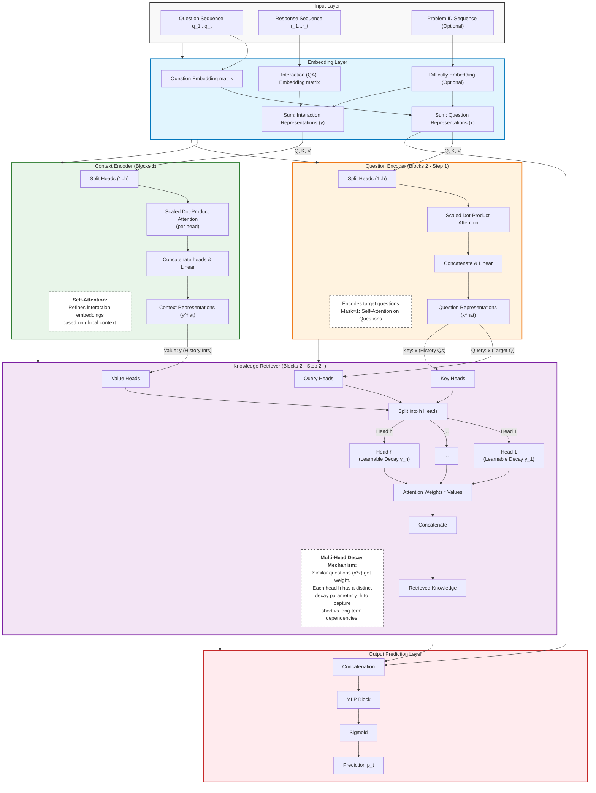

# Knowledge Tracing Transformers - State of the Art

## AKT: Context-Aware Attentive Knowledge Tracing

**Paper**: Ghosh et al., "Context-Aware Attentive Knowledge Tracing", KDD 2020  
**PDF**: `papers-pykt/2020 Ghosh - AKT - Context-Aware Attentive Knowledge Tracing.pdf`

### Core Problem

Knowledge Tracing (KT) predicts future student performance from past responses. Existing methods excel at either prediction accuracy (deep learning) or interpretability (BKT, IRT), but not both—limiting their use for personalized learning.

### Key Innovations

**1. Context-Aware Representations**

- Two self-attentive encoders transform raw embeddings into learner-specific representations
- Question encoder: contextualizes questions based on practice history
- Knowledge encoder: contextualizes knowledge acquisition from responses
- Rationale: same question/response has different meaning for different learners

**2. Monotonic Attention Mechanism**

- Novel exponential decay attention: $\alpha_{t,\tau} \propto \exp(-\theta \cdot d(t,\tau)) \cdot \text{similarity}(q_t, k_\tau)$
- Context-aware distance measure: adjusts time distance by concept similarity
- Multi-head attention captures dependencies at multiple time scales
- Rationale: memories decay; distant/unrelated experiences are less relevant

**3. Rasch Model-Based Embeddings**

- Question embedding: $x_t = c_{c_t} + \mu_{q_t} \cdot d_{c_t}$
- Concept embedding $c_{c_t}$ + difficulty parameter $\mu_{q_t}$ + variation vector $d_{c_t}$
- Captures individual question differences within concepts without overparameterization
- Total parameters: $(C+2)D + Q$ instead of $QD$ (where $C \ll Q$)

### Architecture

- Input: sequence of (question, concept, response) tuples
- Flow: Raw embeddings → Encoders → Knowledge Retriever (attention) → Response Predictor
- Training: Binary cross-entropy loss, end-to-end

### Results (AUC on benchmark datasets)

| Dataset         | AKT    | Best Baseline  | Improvement |
| --------------- | ------ | -------------- | ----------- |
| ASSISTments2009 | 0.8346 | 0.8093 (DKVMN) | +2.5%       |
| ASSISTments2015 | 0.7828 | 0.7313 (DKT+)  | +7.0%       |
| ASSISTments2017 | 0.7702 | 0.7263 (DKT)   | +6.0%       |
| Statics2011     | 0.8346 | 0.8301 (DKT+)  | +0.5%       |

### Interpretability Demonstrations

**Attention Patterns**: Automatically learns to focus on same-concept questions regardless of recency (matches hand-crafted features in traditional models)

**Difficulty Parameters**: Learned $\mu_q$ values correlate with empirical difficulty and human intuition

**Question Embeddings**: t-SNE visualization shows questions form curves ordered by difficulty

### Practical Applications

- Automated feedback linking current to past responses
- Question difficulty estimation for adaptive selection
- Personalized practice recommendations
- No need for excessive manual feature engineering

### Ablation Studies Confirm

- Context-aware > raw embeddings
- Monotonic attention > positional encoding (+1-6% AUC)
- Rasch embeddings boost all KT methods (DKT: +0.09, SAKT: +2.65 on ASSIST2017)

### Key Takeaways

The paper successfully bridges the prediction-interpretability gap in knowledge tracing by coupling attention mechanisms with psychometric principles. AKT demonstrates that attention-based models can achieve both state-of-the-art prediction performance and excellent interpretability when informed by cognitive science and psychometric theory.
