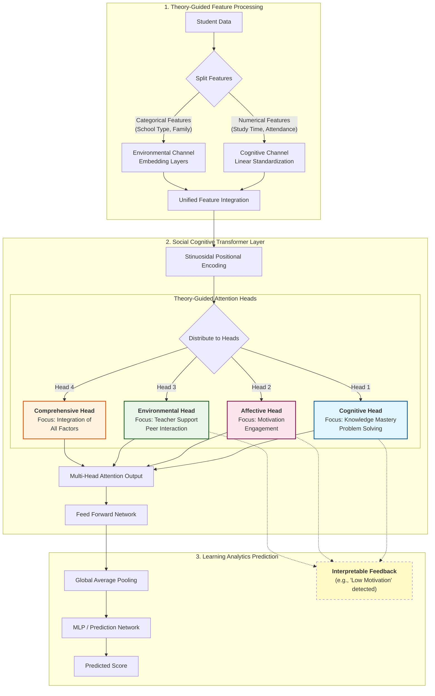

```mermaid
graph TD
    subgraph "1. Theory-Guided Feature Processing"
    Input[Student Data] --> Split{Split Features}

    Split -- "Numerical Features<br/>(Study Time, Attendance)" --> NumProcess[Cognitive Channel<br/>Linear Standardization]
    Split -- "Categorical Features<br/>(School Type, Family)" --> CatProcess[Environmental Channel<br/>Embedding Layers]

    NumProcess --> Concat1[Unified Feature Integration]
    CatProcess --> Concat1
    end

    Concat1 --> PosEnc[Stinuosidal Positional Encoding]

    subgraph "2. Social Cognitive Transformer Layer"
    PosEnc --> MHA_Split{Distribute to Heads}

    subgraph "Theory-Guided Attention Heads"
    MHA_Split -- "Head 1" --> CogHead["<b>Cognitive Head</b><br/>Focus: Knowledge Mastery<br/>Problem Solving"]

    MHA_Split -- "Head 2" --> AffHead["<b>Affective Head</b><br/>Focus: Motivation<br/>Engagement"]

    MHA_Split -- "Head 3" --> EnvHead["<b>Environmental Head</b><br/>Focus: Teacher Support<br/>Peer Interaction"]

    MHA_Split -- "Head 4" --> CompHead["<b>Comprehensive Head</b><br/>Focus: Integration of<br/>All Factors"]
    end

    CogHead --> AttentionOut[Multi-Head Attention Output]
    AffHead --> AttentionOut
    EnvHead --> AttentionOut
    CompHead --> AttentionOut

    AttentionOut --> FFN[Feed Forward Network]
    end

    subgraph "3. Learning Analytics Prediction"
    FFN --> GAP[Global Average Pooling]
    GAP --> MLP[MLP / Prediction Network]
    MLP --> Output[Predicted Score]

    %% Implicit link for interpretability
    CogHead -.-> Interpretability["<b>Interpretable Feedback</b><br/>(e.g., 'Low Motivation' detected)"]
    AffHead -.-> Interpretability
    EnvHead -.-> Interpretability
    end

    style CogHead fill:#e1f5fe,stroke:#01579b,stroke-width:2px
    style AffHead fill:#fce4ec,stroke:#880e4f,stroke-width:2px
    style EnvHead fill:#e8f5e9,stroke:#1b5e20,stroke-width:2px
    style CompHead fill:#fff3e0,stroke:#e65100,stroke-width:2px
    style Interpretability stroke-dasharray: 5 5,fill:#fff9c4
```
