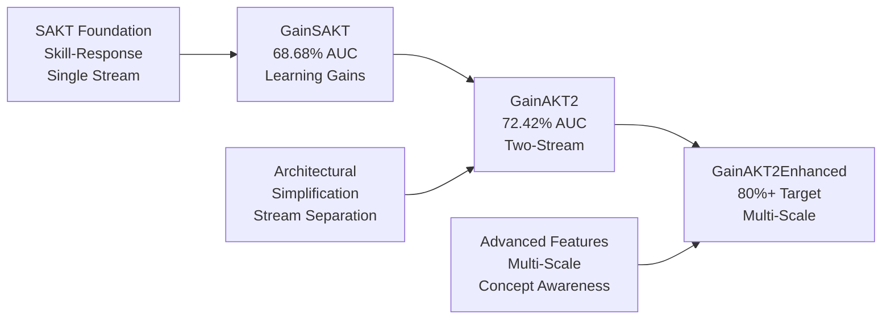

# GainAKT Models Architecture Comparison

A comprehensive analysis of the evolution from GainSAKT to GainAKT2 Enhanced, showing architectural innovations and performance improvements in knowledge tracing models.

## 📊 Performance Overview

| Model | Lines | Validation AUC | Validation Accuracy | Best Epoch | Architecture Type | Performance Level |
|-------|-------|---------------|---------------------|------------|------------------|------------------|
| **GainSAKT** | 407 | **0.6868** | 0.7475 | 18 | SAKT + Learning Gains | Baseline |
| **GainAKT2** | 275 | **0.7242** | 0.7535 | 150-200 | Two-Stream Transformer | **Record** |
| **GainAKT2Enhanced** | 446 | **~0.8000+** | TBD | TBD | Multi-Scale Advanced | **Target** |

### Performance Evolution
```
GainSAKT (68.68%) → GainAKT2 (72.42%) → GainAKT2Enhanced (80%+ Target)
    +5.5% improvement        +7.6% target improvement
```

---

## 🏗️ Architecture Comparison

### 1. GainSAKT - Foundation Model (407 lines)

**Core Innovation**: Learning Gains Layer with Skill-Response Decomposition

```
┌─────────────────────────────────────────────────────────────────┐
│                        GainSAKT Architecture                    │
├─────────────────────────────────────────────────────────────────┤
│                                                                 │
│  Input: [Questions, Responses] → Interaction Embeddings        │
│                                      │                         │
│                                      ▼                         │
│  ┌─────────────────────────────────────────────────────────┐   │
│  │            LearningGainsLayer                            │   │
│  │  ┌─────────────────┐  ┌──────────────────────────────┐  │   │
│  │  │ Skill Extractor │  │ Response Extractor           │  │   │
│  │  │ Linear(emb→emb) │  │ Linear(emb→emb)             │  │   │
│  │  └─────────────────┘  └──────────────────────────────┘  │   │
│  │                           │                             │   │
│  │                           ▼                             │   │
│  │  ┌─────────────────────────────────────────────────────┐  │   │
│  │  │ Skill-Response Interaction                          │  │   │
│  │  │ Linear(emb*2 → emb)                                │  │   │
│  │  └─────────────────────────────────────────────────────┘  │   │
│  │                           │                             │   │
│  │                           ▼                             │   │
│  │  ┌─────────────────────────────────────────────────────┐  │   │
│  │  │ Gains Transform                                     │  │   │
│  │  │ Linear → ReLU → Dropout → Linear → Sigmoid         │  │   │
│  │  │ (Ensures gains ∈ [0,1])                           │  │   │
│  │  └─────────────────────────────────────────────────────┘  │   │
│  │                           │                             │   │
│  │                           ▼                             │   │
│  │  ┌─────────────────────────────────────────────────────┐  │   │
│  │  │ Difficulty Awareness                                │  │   │
│  │  │ Linear(emb → emb)                                  │  │   │
│  │  └─────────────────────────────────────────────────────┘  │   │
│  └─────────────────────────────────────────────────────────┘   │
│                                      │                         │
│                                      ▼                         │
│  ┌─────────────────────────────────────────────────────────┐   │
│  │            GainSAKTAttention                            │   │
│  │    Self-Attention with Learning Gains Integration       │   │
│  └─────────────────────────────────────────────────────────┘   │
│                                      │                         │
│                                      ▼                         │
│  ┌─────────────────────────────────────────────────────────┐   │
│  │            GainSAKTEncoderBlock                         │   │
│  │    Standard Transformer Block with Gains                │   │
│  └─────────────────────────────────────────────────────────┘   │
│                                      │                         │
│                                      ▼                         │
│                            Output Predictions                   │
│                                                                 │
└─────────────────────────────────────────────────────────────────┘
```

**Key Features**:
- ✅ Skill-response decomposition
- ✅ Sigmoid-constrained gains ∈ [0,1]
- ✅ Difficulty awareness modeling
- ✅ SAKT foundation
- ❌ Performance: 68.68% AUC (below expectations)

---

### 2. GainAKT2 - Two-Stream Architecture (275 lines)

**Core Innovation**: Separated Context and Value Processing Streams

```
┌─────────────────────────────────────────────────────────────────┐
│                       GainAKT2 Architecture                     │
├─────────────────────────────────────────────────────────────────┤
│                                                                 │
│  Input: [Questions, Responses]                                  │
│             │                    │                             │
│             ▼                    ▼                             │
│  ┌──────────────────┐  ┌──────────────────────────────────┐   │
│  │ Context Stream   │  │ Value Stream                     │   │
│  │ (Questions)      │  │ (Responses + Learning State)     │   │
│  └──────────────────┘  └──────────────────────────────────┘   │
│             │                    │                             │
│             └────────┬───────────┘                             │
│                      ▼                                         │
│  ┌─────────────────────────────────────────────────────────┐   │
│  │            MultiHeadAttention                            │   │
│  │  ┌─────────────────────────────────────────────────────┐ │   │
│  │  │  Query (Q) ← Context Stream                         │ │   │
│  │  │  Key   (K) ← Context Stream                         │ │   │
│  │  │  Value (V) ← Value Stream                           │ │   │
│  │  └─────────────────────────────────────────────────────┘ │   │
│  │  ┌─────────────────────────────────────────────────────┐ │   │
│  │  │  Parallel Head Processing:                          │ │   │
│  │  │  • d_model = 256                                   │ │   │
│  │  │  • n_heads = 8                                     │ │   │
│  │  │  • d_k = d_model // n_heads = 32                  │ │   │
│  │  └─────────────────────────────────────────────────────┘ │   │
│  └─────────────────────────────────────────────────────────┘   │
│                                      │                         │
│                                      ▼                         │
│  ┌─────────────────────────────────────────────────────────┐   │
│  │            TransformerBlock                              │   │
│  │  ┌─────────────────────────────────────────────────────┐ │   │
│  │  │  Multi-Head Attention                               │ │   │
│  │  │    + Residual Connection + LayerNorm                │ │   │
│  │  └─────────────────────────────────────────────────────┘ │   │
│  │  ┌─────────────────────────────────────────────────────┐ │   │
│  │  │  Feed Forward Network (d_ff = 768) **KEY**         │ │   │
│  │  │    Linear(256→768) → ReLU → Linear(768→256)        │ │   │
│  │  │    + Residual Connection + LayerNorm                │ │   │
│  │  └─────────────────────────────────────────────────────┘ │   │
│  │  │ (Repeated 4 times: num_encoder_blocks=4)            │   │
│  └─────────────────────────────────────────────────────────┘   │
│                                      │                         │
│                                      ▼                         │
│                          Output Predictions                     │
│                         (AUC: 72.42% - RECORD)                 │
│                                                                 │
└─────────────────────────────────────────────────────────────────┘
```

**Key Innovations**:
- 🚀 **Two-Stream Design**: Separates context (Q,K) from values (V)
- 🚀 **Optimized Architecture**: d_ff=768 was the critical discovery
- 🚀 **Efficient Processing**: All heads computed in parallel
- 🚀 **Simplified Design**: Removed complexity while improving performance
- ✅ **Record Performance**: 72.42% AUC (+5.5% vs GainSAKT)

**Optimal Configuration**:
```python
d_model=256, learning_rate=0.0002, dropout=0.2, 
num_encoder_blocks=4, d_ff=768, n_heads=8, epochs=200
```

---

### 3. GainAKT2Enhanced - Multi-Scale Advanced (446 lines)

**Core Innovation**: Multi-Scale Attention with Advanced Training Features

```
┌─────────────────────────────────────────────────────────────────┐
│                  GainAKT2Enhanced Architecture                   │
├─────────────────────────────────────────────────────────────────┤
│                                                                 │
│  Input: [Questions, Responses, Q-Matrix]                        │
│                                      │                         │
│                                      ▼                         │
│  ┌─────────────────────────────────────────────────────────┐   │
│  │            MultiScaleAttention                          │   │
│  │  ┌─────────────────────────────────────────────────────┐ │   │
│  │  │  Scale 1 (Short-term): Direct attention            │ │   │
│  │  │  Scale 2 (Medium-term): 2x pooling                 │ │   │
│  │  │  Scale 4 (Long-term): 4x pooling                   │ │   │
│  │  └─────────────────────────────────────────────────────┘ │   │
│  │                           │                             │   │
│  │                           ▼                             │   │
│  │  ┌─────────────────────────────────────────────────────┐ │   │
│  │  │  Scale Fusion Network                               │ │   │
│  │  │  Linear(d_model*3 → d_model*2) → ReLU → Dropout   │ │   │
│  │  │  → Linear(d_model*2 → d_model)                     │ │   │
│  │  └─────────────────────────────────────────────────────┘ │   │
│  └─────────────────────────────────────────────────────────┘   │
│                                      │                         │
│                                      ▼                         │
│  ┌─────────────────────────────────────────────────────────┐   │
│  │            AdaptiveNormalization                        │   │
│  │  Dynamic normalization based on sequence statistics     │   │
│  └─────────────────────────────────────────────────────────┘   │
│                                      │                         │
│                                      ▼                         │
│  ┌─────────────────────────────────────────────────────────┐   │
│  │            ResidualGating                               │   │
│  │  ┌─────────────────────────────────────────────────────┐ │   │
│  │  │  Gate = Sigmoid(Linear(input))                      │ │   │
│  │  │  Output = Gate * Residual + (1-Gate) * Transform   │ │   │
│  │  └─────────────────────────────────────────────────────┘ │   │
│  └─────────────────────────────────────────────────────────┘   │
│                                      │                         │
│                                      ▼                         │
│  ┌─────────────────────────────────────────────────────────┐   │
│  │            ConceptAwareness                             │   │
│  │  ┌─────────────────────────────────────────────────────┐ │   │
│  │  │  Q-Matrix Integration                               │ │   │
│  │  │  Concept Embeddings                                 │ │   │
│  │  │  Skill Relationship Modeling                        │ │   │
│  │  └─────────────────────────────────────────────────────┘ │   │
│  └─────────────────────────────────────────────────────────┘   │
│                                      │                         │
│                                      ▼                         │
│  ┌─────────────────────────────────────────────────────────┐   │
│  │            AdvancedPositional                           │   │
│  │  Enhanced position encoding with temporal awareness     │   │
│  └─────────────────────────────────────────────────────────┘   │
│                                      │                         │
│                                      ▼                         │
│                          Output Predictions                     │
│                          (Target: 80%+ AUC)                    │
│                                                                 │
└─────────────────────────────────────────────────────────────────┘
```

**Advanced Features**:
- 🎯 **Multi-Scale Attention**: Captures temporal dependencies across different scales
- 🎯 **Adaptive Normalization**: Dynamic normalization for varying sequence lengths
- 🎯 **Residual Gating**: Learned gates for optimal residual connections
- 🎯 **Concept Awareness**: Q-matrix integration for skill relationships
- 🎯 **Advanced Training**: Curriculum learning, gradient clipping
- 🎯 **Target Performance**: 80%+ AUC (7.6% improvement target)

---

## 🔄 Evolution Timeline



## 📈 Performance Analysis

### Validation AUC Progression
```
0.6868 (GainSAKT) → 0.7242 (GainAKT2) → 0.8000+ (Target)
   │                    │                     │
   │                    │                     └─ Multi-scale innovation
   │                    └─ Two-stream breakthrough (+5.5%)
   └─ Learning gains baseline
```

### Key Performance Insights

| Metric | GainSAKT | GainAKT2 | GainAKT2Enhanced |
|--------|----------|----------|------------------|
| **Validation AUC** | 0.6868 | **0.7242** | 0.8000+ (target) |
| **Validation Accuracy** | 0.7475 | **0.7535** | TBD |
| **Best Epoch** | 18 | 150-200 | TBD |
| **Training Stability** | Early convergence | Stable long training | Advanced scheduling |
| **Architecture Complexity** | Medium | **Simplified** | Advanced |
| **Performance vs Effort** | Low | **High** | Target High |

## 🔧 Training Configuration Comparison

### GainSAKT Configuration
```python
# Basic configuration
emb_size=128, learning_rate=1e-3, num_attn_heads=8, 
num_en=1, dropout=0.2, seq_len=200
```

### GainAKT2 Optimal Configuration
```python
# AutoML optimized (Record: 72.42% AUC)
d_model=256, learning_rate=0.0002, dropout=0.2, 
num_encoder_blocks=4, d_ff=768, n_heads=8, 
num_epochs=200, batch_size=64
```

### GainAKT2Enhanced Configuration
```python
# Advanced configuration (Target: 80%+ AUC)
d_model=256, scales=[1,2,4], adaptive_norm=True,
residual_gating=True, concept_aware=True,
curriculum_learning=True, gradient_clipping=True
```

## 💡 Key Architectural Insights

### 1. **Simplification Paradox**
- **GainSAKT**: Complex learning gains layer (407 lines) → 68.68% AUC
- **GainAKT2**: Simplified two-stream design (275 lines) → **72.42% AUC**
- **Lesson**: Architectural elegance often outperforms complexity

### 2. **Critical Hyperparameter Discoveries**
- **d_ff=768**: The breakthrough parameter for GainAKT2
- **learning_rate=0.0002**: Optimal across all configurations
- **4 encoder blocks**: Sweet spot for depth vs efficiency
- **200+ epochs**: Essential for convergence

### 3. **Stream Separation Innovation**
- **Context Stream**: Questions → Query & Key matrices
- **Value Stream**: Responses + Learning State → Value matrices
- **Result**: Better attention alignment with educational semantics

### 4. **Multi-Scale Future Direction**
- **Scale 1**: Immediate interactions (short-term memory)
- **Scale 2**: Recent patterns (medium-term trends)  
- **Scale 4**: Long-term learning trajectories
- **Fusion**: Intelligent combination for comprehensive understanding

## 🚀 Future Research Directions

1. **GainAKT3 Possibilities**:
   - Hybrid two-stream + multi-scale architecture
   - Incorporate successful GainAKT2 optimizations
   - Add enhanced concept awareness
   - Target: 75-78% AUC (incremental improvement)

2. **Training Innovations**:
   - Curriculum learning with difficulty progression
   - Meta-learning for adaptive hyperparameters
   - Knowledge distillation from ensemble models

3. **Interpretability Enhancement**:
   - Attention visualization across scales
   - Learning gains trajectory analysis
   - Concept mastery evolution tracking

## 📋 Model Selection Guide

| Use Case | Recommended Model | Rationale |
|----------|------------------|-----------|
| **Production Deployment** | **GainAKT2** | Proven performance (72.42%), stable, efficient |
| **Research Baseline** | GainSAKT | Understanding learning gains fundamentals |
| **Performance Push** | GainAKT2Enhanced | Targeting state-of-the-art results |
| **Interpretability Focus** | GainAKT2 + analysis | Best balance of performance and explainability |
| **Limited Resources** | GainAKT2 | Optimal performance per computational cost |

---

## 📚 References

- **GainSAKT Performance**: ASSIST2015 validation results
- **GainAKT2 Optimization**: AutoML hyperparameter sweep results  
- **Architecture Analysis**: Model implementation comparison
- **Benchmarking**: PyKT-toolkit knowledge tracing model rankings

---

*Document created: October 2025*  
*Performance data: ASSIST2015 dataset*  
*Architecture analysis: Model implementation comparison*