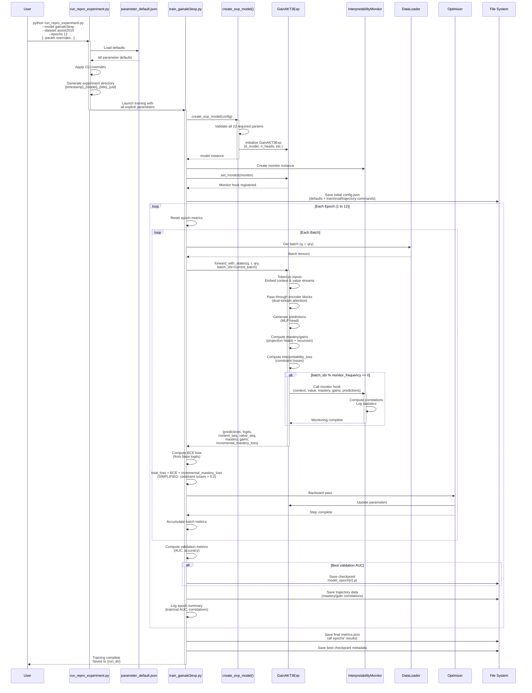
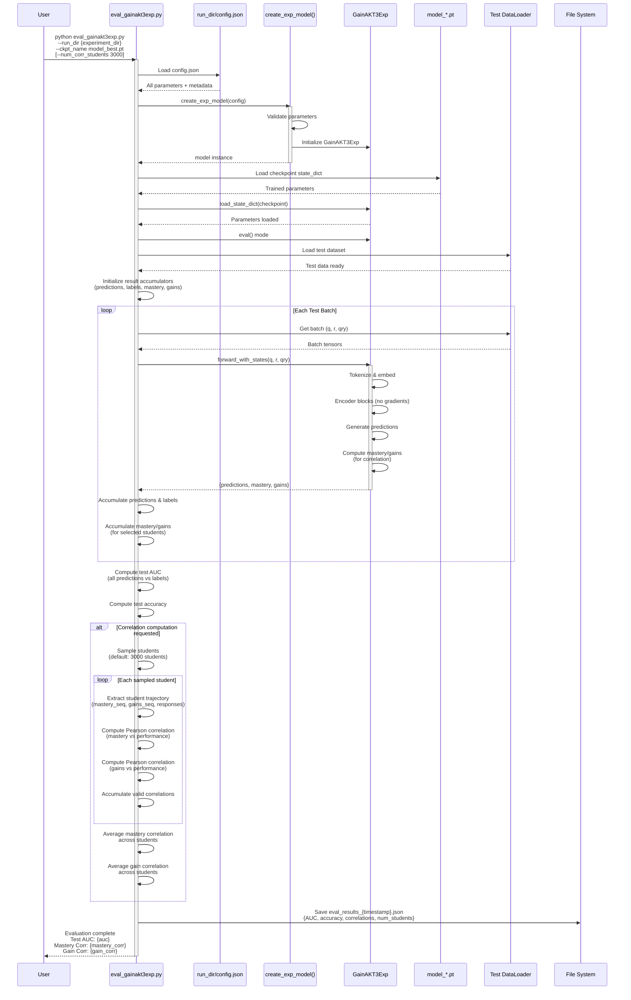
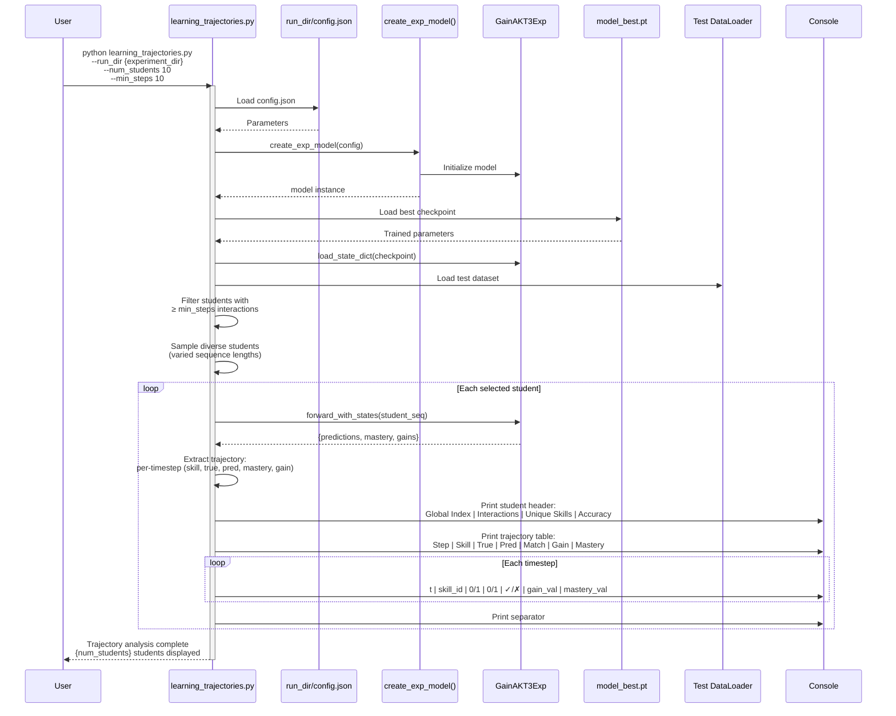

# GainAKT3Exp Architecture

**Document Version**: Updated 2025-11-17 (Critical Bug Fix - encoder2_pred skill indexing)  
**Model Version**: GainAKT3Exp - Dual-encoder transformer with Sigmoid Learning Curve Mastery  
**Status**: Active implementation with full training/evaluation pipeline

## Architecture Diagram

```mermaid
graph TD
    subgraph "Input Layer (Shared)"
        direction LR
        Input_q[["Input Questions (q)<br/>Shape: [B, L]"]]
        Input_r[["Input Responses (r)<br/>Shape: [B, L]"]]
        Ground_Truth[["Ground Truth Responses"]]
    end

    %% ========== ENCODER 1: PERFORMANCE PATH ========== %%
    subgraph "Encoder 1: Performance Path (Prediction-Optimized)"
        direction TB
        
        subgraph "Tokenization & Embedding 1"
            Tokens1[["Interaction Tokens 1<br/>(q + num_c * r)"]]
            Context_Emb1["Context Embedding Table 1"]
            Value_Emb1["Value Embedding Table 1"]
            Skill_Emb1["Skill Embedding Table 1"]
            
            Context_Seq1[["Context Sequence 1<br/>[B, L, D]"]]
            Value_Seq1[["Value Sequence 1<br/>[B, L, D]"]]
            Pos_Emb1["Positional Embeddings 1"]
            
            Context_Seq_Pos1[["Context + Pos 1<br/>[B, L, D]"]]
            Value_Seq_Pos1[["Value + Pos 1<br/>[B, L, D]"]]
        end
        
        subgraph "Dual-Stream Encoder Stack 1 (N blocks)"
            Encoder1_In_Ctx[["Input Context 1"]]
            Encoder1_In_Val[["Input Value 1"]]
            
            Encoder1_Block["Encoder Block 1<br/>Q/K from Context 1<br/>V from Value 1<br/>Dual Add&Norm + FFN"]
            
            Encoder1_Out_Ctx[["Output Context 1 (h₁)<br/>[B, L, D]"]]
            Encoder1_Out_Val[["Output Value 1 (v₁)<br/>[B, L, D]"]]
        end
        
        subgraph "Prediction Head"
            Pred_Input_h1[["Knowledge State (h₁)"]]
            Pred_Input_v1[["Value State (v₁)"]]
            Pred_Input_s1[["Target Skill (s₁)"]]
            
            Concat1["Concatenate<br/>[h₁, v₁, s₁]"]
            MLP1["MLP Head 1"]
            Sigmoid1["Sigmoid 1"]
            
            Base_Predictions[["Base Predictions<br/>[B, L]<br/>✅ Performance Output"]]
        end
    end

    %% ========== ENCODER 2: INTERPRETABILITY PATH ========== %%
    subgraph "Encoder 2: Interpretability Path (Mastery-Optimized)"
        direction TB
        
        subgraph "Tokenization & Embedding 2"
            Tokens2[["Interaction Tokens 2<br/>(q + num_c * r)"]]
            Context_Emb2["Context Embedding Table 2<br/>(Independent)"]
            Value_Emb2["Value Embedding Table 2<br/>(Independent)"]
            
            Context_Seq2[["Context Sequence 2<br/>[B, L, D]"]]
            Value_Seq2[["Value Sequence 2<br/>[B, L, D]"]]
            Pos_Emb2["Positional Embeddings 2"]
            
            Context_Seq_Pos2[["Context + Pos 2<br/>[B, L, D]"]]
            Value_Seq_Pos2[["Value + Pos 2<br/>[B, L, D]"]]
        end
        
        subgraph "Dual-Stream Encoder Stack 2 (N blocks)"
            Encoder2_In_Ctx[["Input Context 2"]]
            Encoder2_In_Val[["Input Value 2"]]
            
            Encoder2_Block["Encoder Block 2<br/>Q/K from Context 2<br/>V from Value 2<br/>Dual Add&Norm + FFN<br/>(Independent Parameters)"]
            
            Encoder2_Out_Ctx[["Output Context 2 (h₂)<br/>[B, L, D]"]]
            Encoder2_Out_Val[["Output Value 2 (v₂)<br/>[B, L, D]"]]
        end
        
        subgraph "Recursive Mastery Accumulation"
            Learning_Gains[["Learning Gains<br/>ReLU(v₂)"]]
            Projected_Gains[["Projected Gains<br/>[B, L, num_c]"]]
            
            Gain_Input[["Gain Input<br/>gain_t"]]
            Mastery_Prev[["Mastery_{t-1}"]]
            
            Scale_Op["× α (α=0.1)"]
            Sum_Op["mastery_t = mastery_{t-1} + α·gain_t"]
            Clamp_Op["Clamp[0,1]"]
            
            Mastery_Current[["Mastery_t"]]
            Projected_Mastery[["Incremental Mastery Levels<br/>[B, L, num_c]<br/>✅ Interpretability Output"]]
            
            Mastery_Current -.->|"temporal<br/>persistence"| Mastery_Prev
        end
        
        subgraph "Threshold Mechanism"
            Learnable_Threshold[["Learnable Threshold<br/>per skill [num_c]<br/>(trainable)"]]
            Threshold_Compute["sigmoid((mastery - threshold) / temp)"]
            
            IM_Predictions[["Incremental Mastery Predictions<br/>[B, L]<br/>✅ Interpretability Predictions"]]
        end
    end

    %% ========== LOSS COMPUTATION ========== %%
    subgraph "Loss Framework (Dual-Encoder Architecture)"
        direction LR
        
        BCE_Loss["BCE Loss<br/>(Performance)<br/>weight = λ₁"]
        IM_Loss["Incremental Mastery Loss<br/>(Interpretability)<br/>weight = λ₂"]
        
        Total_Loss["Total Loss<br/>λ₁ × BCE + λ₂ × IM<br/>(Weighted Combination)"]
    end

    %% ========== CONNECTIONS ========== %%
    
    %% Input to both encoders (same input, different processing)
    Input_q --> Tokens1
    Input_r --> Tokens1
    Input_q --> Tokens2
    Input_r --> Tokens2
    
    %% Encoder 1 Flow (Performance Path)
    Tokens1 --> Context_Emb1 --> Context_Seq1
    Tokens1 --> Value_Emb1 --> Value_Seq1
    Input_q --> Skill_Emb1
    
    Context_Seq1 --> Context_Seq_Pos1
    Value_Seq1 --> Value_Seq_Pos1
    Pos_Emb1 --> Context_Seq_Pos1
    Pos_Emb1 --> Value_Seq_Pos1
    
    Context_Seq_Pos1 --> Encoder1_In_Ctx --> Encoder1_Block
    Value_Seq_Pos1 --> Encoder1_In_Val --> Encoder1_Block
    
    Encoder1_Block --> Encoder1_Out_Ctx --> Pred_Input_h1
    Encoder1_Block --> Encoder1_Out_Val --> Pred_Input_v1
    Skill_Emb1 --> Pred_Input_s1
    
    Pred_Input_h1 --> Concat1
    Pred_Input_v1 --> Concat1
    Pred_Input_s1 --> Concat1
    Concat1 --> MLP1 --> Sigmoid1 --> Base_Predictions
    
    %% Encoder 2 Flow (Interpretability Path)
    Tokens2 --> Context_Emb2 --> Context_Seq2
    Tokens2 --> Value_Emb2 --> Value_Seq2
    
    Context_Seq2 --> Context_Seq_Pos2
    Value_Seq2 --> Value_Seq_Pos2
    Pos_Emb2 --> Context_Seq_Pos2
    Pos_Emb2 --> Value_Seq_Pos2
    
    Context_Seq_Pos2 --> Encoder2_In_Ctx --> Encoder2_Block
    Value_Seq_Pos2 --> Encoder2_In_Val --> Encoder2_Block
    
    Encoder2_Block --> Encoder2_Out_Val --> Learning_Gains
    Learning_Gains --> Projected_Gains --> Gain_Input
    
    Gain_Input --> Scale_Op --> Sum_Op
    Mastery_Prev --> Sum_Op --> Clamp_Op --> Mastery_Current
    Mastery_Current --> Projected_Mastery
    
    Projected_Mastery --> Threshold_Compute
    Learnable_Threshold --> Threshold_Compute
    Threshold_Compute --> IM_Predictions
    
    %% Loss Connections
    Base_Predictions --> BCE_Loss
    Ground_Truth --> BCE_Loss
    
    IM_Predictions --> IM_Loss
    Ground_Truth --> IM_Loss
    
    BCE_Loss --> Total_Loss
    IM_Loss --> Total_Loss

    %% Styling
    classDef encoder1_style fill:#e3f2fd,stroke:#1976d2,stroke-width:3px
    classDef encoder2_style fill:#fff3e0,stroke:#f57c00,stroke-width:3px
    classDef loss_style fill:#c8e6c9,stroke:#2e7d32,stroke-width:3px
    classDef input_style fill:#ffffff,stroke:#333333,stroke-width:2px
    classDef output_style fill:#e8f5e9,stroke:#43a047,stroke-width:3px
    classDef mastery_style fill:#fce4ec,stroke:#c2185b,stroke-width:2px
    
    class Tokens1,Context_Emb1,Value_Emb1,Skill_Emb1,Context_Seq1,Value_Seq1,Encoder1_Block,Encoder1_Out_Ctx,Encoder1_Out_Val,Concat1,MLP1,Sigmoid1 encoder1_style
    class Tokens2,Context_Emb2,Value_Emb2,Context_Seq2,Value_Seq2,Encoder2_Block,Encoder2_Out_Val,Learning_Gains encoder2_style
    class Scale_Op,Sum_Op,Clamp_Op,Mastery_Current,Projected_Mastery,Threshold_Compute mastery_style
    class BCE_Loss,IM_Loss,Total_Loss loss_style
    class Input_q,Input_r,Ground_Truth input_style
    class Base_Predictions,IM_Predictions,Projected_Mastery output_style
    class Input_q,Input_r,Tokens,Context_Seq,Value_Seq,Pos_Emb,Context_Seq_Pos,Value_Seq_Pos io_data
    class Encoder_Input_Context,Encoder_Input_Value,Attn_Input_Context,Attn_Input_Value io_data
    class Weights,Attn_Output_Heads,Attn_Output,Encoder_Output_Ctx,Encoder_Output_Val io_data
    class Pred_Input_h,Pred_Input_v,Pred_Input_s,Predictions io_data
    class Projected_Mastery_Output,Projected_Gain_Output io_data

    %% Link Styling - SIMPLIFIED: Most styling removed due to commented-out connections
    %% NOTE: After commenting out constraint and semantic losses, link indices changed.
    %% Keeping only essential link styles for active connections to avoid rendering errors.
    
    %% COMMENTED OUT: Original link styling referenced indices that no longer exist
    %% after simplification. To restore styling, recalculate indices if losses are reactivated.
    %%
    %% %% Pred_Hub outputs (black) - ALL 5 connections from Pred_Hub styled blue
    %% %% Pred_Hub -->|"BCE"| BCE_Loss (line 224)
    %% %% Pred_Hub -->|"Mastery-Perf"| Mastery_Perf_Loss (line 238)
    %% %% Pred_Hub -->|"Gain-Perf"| Gain_Perf_Loss (line 239)
    %% %% Pred_Hub -->|"Alignment"| Alignment_Loss (line 242)
    %% %% Pred_Hub -->|"to Monitor"| Monitor_Hub (line 262)
    %% linkStyle 60 stroke:#888888,stroke-width:3px
    %% linkStyle 71 stroke:#888888,stroke-width:3px
    %% linkStyle 72 stroke:#888888,stroke-width:3px
    %% linkStyle 74 stroke:#888888,stroke-width:3px
    %% linkStyle 87 stroke:#888888,stroke-width:3px
    %% 
    %% %% Mastery_Hub outputs (red) - ALL 6 connections from Mastery_Hub styled red
    %% %% Mastery_Hub -->|"Global Align"| Global_Alignment (line 195)
    %% %% Mastery_Hub -->|"Monotonicity"| Monotonicity_Loss (line 227)
    %% %% Mastery_Hub -->|"Mastery-Perf"| Mastery_Perf_Loss (line 228)
    %% %% Mastery_Hub -->|"Consistency"| Consistency_Loss (line 229)
    %% %% Mastery_Hub -->|"Retention"| Retention_Loss (line 230)
    %% %% Mastery_Hub -->|"to Monitor"| Monitor_Hub (line 260)
    %% linkStyle 57 stroke:#00ff00,stroke-width:3px
    %% linkStyle 62 stroke:#00ff00,stroke-width:3px
    %% linkStyle 63 stroke:#00ff00,stroke-width:3px
    %% linkStyle 64 stroke:#00ff00,stroke-width:3px
    %% linkStyle 65 stroke:#00ff00,stroke-width:3px
    %% linkStyle 85 stroke:#00ff00,stroke-width:3px
    %% 
    %% %% Gain_Hub outputs (green) - ALL 6 connections from Gain_Hub styled green
    %% %% Gain_Hub -->|"Gain-Perf"| Gain_Perf_Loss (line 232)
    %% %% Gain_Hub -->|"Sparsity"| Sparsity_Loss (line 233)
    %% %% Gain_Hub -->|"Consistency"| Consistency_Loss (line 234)
    %% %% Gain_Hub -->|"NonNeg"| NonNeg_Loss (line 235)
    %% %% Gain_Hub -->|"Lag"| Lag_Gain_Loss (line 236)
    %% %% Gain_Hub -->|"to Monitor"| Monitor_Hub (line 261)
    %% linkStyle 66 stroke:#008800,stroke-width:3px
    %% linkStyle 67 stroke:#008800,stroke-width:3px
    %% linkStyle 68 stroke:#008800,stroke-width:3px
    %% linkStyle 69 stroke:#008800,stroke-width:3px
    %% linkStyle 70 stroke:#008800,stroke-width:3px
    %% linkStyle 86 stroke:#008800,stroke-width:3px
    %% 
    %% %% Encoder_Output_Ctx outputs (purple) - ALL 3 connections from Encoder_Output_Ctx styled purple
    %% %% Encoder_Output_Ctx --> Pred_Input_h (line 135)
    %% %% Encoder_Output_Ctx --> Proj_Mastery (line 157)
    %% %% Encoder_Output_Ctx --> Encoder_Hub (line 186)
    %% linkStyle 38 stroke:#800080,stroke-width:3px
    %% linkStyle 42 stroke:#800080,stroke-width:3px
    %% linkStyle 54 stroke:#800080,stroke-width:3px
    %% 
    %% %% Encoder_Output_Val outputs (pink) - ALL 3 connections from Encoder_Output_Val styled pink
    %% %% Encoder_Output_Val --> Pred_Input_v (line 136)
    %% %% Encoder_Output_Val --> Proj_Gain (line 158)
    %% %% Encoder_Output_Val --> Encoder_Hub (line 187)
    %% linkStyle 39 stroke:#ff69b4,stroke-width:3px
    %% linkStyle 43 stroke:#ff69b4,stroke-width:3px
    %% linkStyle 55 stroke:#ff69b4,stroke-width:3px
    %% 
    %% %% Encoder_Hub outputs (orange) - 1 connection from Encoder_Hub styled orange
    %% %% Encoder_Hub -->|"Alignment"| Alignment_Loss (line 241)
    %% linkStyle 73 stroke:#ffa500,stroke-width:3px
    %% 
    %% %% Monitor_Hub output (purple)
    %% linkStyle 81 stroke:#800080,stroke-width:3px
```

---

## Training Sequence Diagram

## Evaluation Sequence

## Learning Trajectory Analysis Sequence

## Internal Model Flow

```mermaid
sequenceDiagram
    participant Input as Input Tensors<br/>(q, r, qry)
    participant Tokenize as Tokenization
    participant CtxEmb as Context Embedding
    participant ValEmb as Value Embedding
    participant PosEmb as Positional Embedding
    participant Encoder as Encoder Blocks<br/>(N layers)
    participant CtxStream as Context Stream (h)<br/>[B, L, D]
    participant ValStream as Value Stream (v)<br/>[B, L, D]
    participant SkillEmb as Skill Embedding
    participant PredHead as Prediction Head<br/>(MLP)
    participant MasteryHead as Mastery Head<br/>Linear(D, num_c)
    participant GainHead as Gain Head<br/>Linear(D, num_c)
    participant Recursion as Recursive<br/>Accumulation
    participant Losses as Loss Computation
    participant Monitor as Monitor Hook
    participant Output as Output Dict
    
    Input->>Tokenize: q, r (questions, responses)
    Tokenize->>Tokenize: interaction_tokens = q + num_c * r
    
    Note over CtxEmb,ValEmb: Dual Embedding Tables
    Tokenize->>CtxEmb: interaction_tokens
    Tokenize->>ValEmb: interaction_tokens
    CtxEmb->>CtxStream: context_seq [B, L, D]
    ValEmb->>ValStream: value_seq [B, L, D]
    
    PosEmb->>CtxStream: Add positional encodings
    PosEmb->>ValStream: Add positional encodings
    
    Note over CtxStream,ValStream: Pass through N encoder blocks<br/>with dual-stream attention
    
    loop Each Encoder Block
        CtxStream->>Encoder: context_seq
        ValStream->>Encoder: value_seq
        
        Note over Encoder: Q, K = Linear(context_seq)<br/>V = Linear(value_seq)<br/>Attention = softmax(QK^T/√d)V
        
        Encoder->>Encoder: attn_output = Attention(Q, K, V)
        Encoder->>Encoder: context_seq = LayerNorm(context + attn + FFN(attn))
        Encoder->>Encoder: value_seq = LayerNorm(value + attn)
        
        Encoder->>CtxStream: Updated context_seq
        Encoder->>ValStream: Updated value_seq
    end
    
    rect rgb(200, 230, 255)
        Note over CtxStream: Context Output (h)<br/>Encoder_Output_Ctx [B, L, D]<br/>FLOWS TO 3 DESTINATIONS ↓
    end
    
    rect rgb(255, 220, 230)
        Note over ValStream: Value Output (v)<br/>Encoder_Output_Val [B, L, D]<br/>FLOWS TO 3 DESTINATIONS ↓
    end
    
    par Context Stream (h) flows to 3 destinations
        Note over CtxStream,PredHead: FLOW 1: Context → Prediction Head
        CtxStream->>PredHead: context_seq (h) [B, L, D]
    and
        Note over CtxStream,MasteryHead: FLOW 2: Context → Mastery Projection
        CtxStream->>MasteryHead: context_seq (h) [B, L, D]
    and
        Note over CtxStream,Monitor: FLOW 3: Context → Monitor/Output
        CtxStream->>Output: context_seq (for monitoring)
    end
    
    par Value Stream (v) flows to 3 destinations
        Note over ValStream,PredHead: FLOW 1: Value → Prediction Head
        ValStream->>PredHead: value_seq (v) [B, L, D]
    and
        Note over ValStream,Recursion: FLOW 2: Value → Recursive Mastery Accumulation<br/>(GainAKT3Exp Innovation: Values ARE learning gains)
        ValStream->>Recursion: value_seq = learning gains<br/>[B, L, D]<br/>(each interaction's contribution)
    and
        Note over ValStream,Monitor: FLOW 3: Value → Monitor/Output
        ValStream->>Output: value_seq (for monitoring)
    end
    
    Note over PredHead: Concatenate [h, v, s]
    Input->>SkillEmb: qry (target skills)
    SkillEmb->>PredHead: target_skill_emb [B, L, D]
    PredHead->>PredHead: concat = [context, value, skill]<br/>[B, L, 3*D]
    PredHead->>PredHead: logits = MLP(concat)<br/>[B, L]
    PredHead->>PredHead: predictions = sigmoid(logits)
    PredHead->>Output: predictions [B, L]
    PredHead->>Output: logits [B, L]
    
    Note over MasteryHead,Recursion: Mastery Projection Path
    MasteryHead->>MasteryHead: mastery_raw = Linear(context)<br/>[B, L, num_c]
    Note over MasteryHead: (Initial estimate - refined by recursion)
    
    rect rgb(180, 230, 255)
        Note over Recursion: Recursive Mastery Accumulation<br/>Values (learning gains) increment skill mastery<br/>For each interaction's skill:<br/>mastery[skill, t] = mastery[skill, t-1] + α × ReLU(value[t])
    end
    
    Input->>Recursion: questions (q) [B, L]<br/>(to identify relevant skill)
    
    loop Each timestep t (1 to L)
        Recursion->>Recursion: skill = question[t]
        Recursion->>Recursion: gain = ReLU(value[t]) × α (α=0.1)
        Recursion->>Recursion: mastery[skill, t] = mastery[skill, t-1] + gain
        Recursion->>Recursion: mastery[skill, t] = clamp(mastery[skill, t], 0, 1)
    end
    
    Recursion->>Output: projected_mastery [B, L, num_c]<br/>(accumulated across timesteps)
    Recursion->>Output: learning_gains [B, L, D]<br/>(directly from Values)
    
    Note over Losses: Loss Computation Sources
    
    rect rgb(255, 240, 200)
        Note over Losses: LOSS INPUTS:<br/>1. predictions (from Pred Head)<br/>2. projected_mastery (from Recursion)<br/>3. projected_gains (from Recursion)<br/>4. responses (ground truth)<br/>5. questions (for skill masks)
    end
    
    Output->>Losses: predictions [B, L]
    Output->>Losses: projected_mastery [B, L, num_c]
    Output->>Losses: projected_gains [B, L, num_c]
    Input->>Losses: responses (r) [B, L]
    Input->>Losses: questions (q) [B, L]
    
    Losses->>Losses: Compute skill masks<br/>(Q-matrix structure)
    
    par Constraint Losses (6 losses computed in parallel)
        Note over Losses: ❌ ALL CONSTRAINT LOSSES COMMENTED OUT (weights=0.0)
        Losses->>Losses: L1: Non-Negative Gains (INACTIVE)<br/>clamp(-gains, min=0).mean()
    and
        Losses->>Losses: L2: Monotonicity (INACTIVE)<br/>clamp(mastery[t] - mastery[t+1], min=0).mean()
    and
        Losses->>Losses: L3: Mastery-Performance (INACTIVE)<br/>low_mastery_correct + high_mastery_incorrect
    and
        Losses->>Losses: L4: Gain-Performance (INACTIVE)<br/>clamp(incorrect_gains - correct_gains + 0.1, min=0)
    and
        Losses->>Losses: L5: Sparsity (INACTIVE)<br/>abs(non_relevant_gains).mean()
    and
        Losses->>Losses: L6: Consistency (INACTIVE)<br/>abs(mastery_delta - scaled_gains).mean()
    end
    
    Losses->>Losses: Total interpretability_loss = 0.0<br/>(all weights w1-w6 = 0.0 in simplified architecture)
    Losses->>Output: interpretability_loss = 0.0 (scalar)
    
    alt Monitoring enabled AND batch_idx % monitor_frequency == 0
        Output->>Monitor: Pass all states:<br/>context_seq, value_seq,<br/>mastery, gains, predictions,<br/>questions, responses
        Monitor->>Monitor: Compute correlations<br/>Log statistics
        Monitor-->>Output: Monitoring complete
    end
    
    Output->>Output: Assemble final dict:<br/>{predictions, logits,<br/>context_seq, value_seq,<br/>projected_mastery, incremental_mastery_predictions,<br/>interpretability_loss (=0.0),<br/>incremental_mastery_loss}
```

