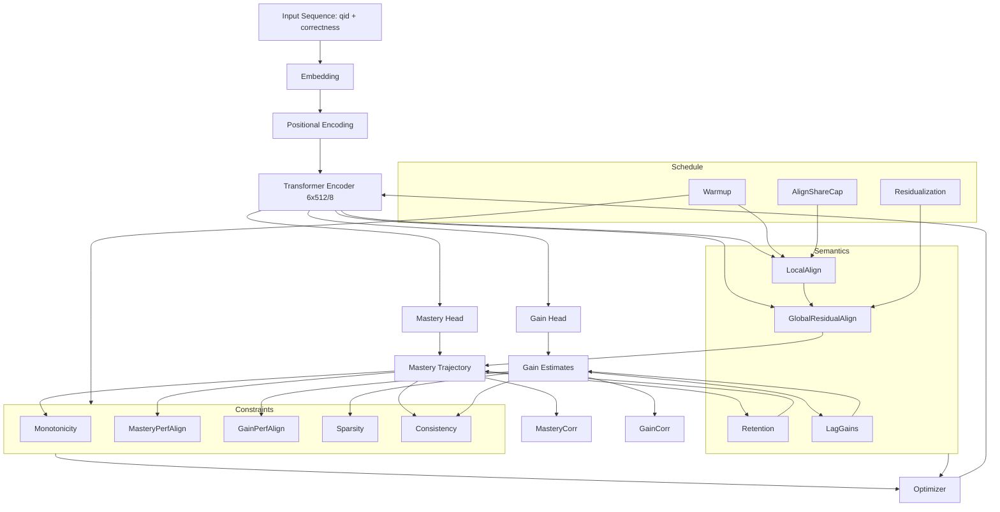

# GainAKT2Exp - Current State, Reproduction, and Interpretability Assessment

## Architecture



_Fallback textual description:_ The input (question id + correctness) is embedded and positionally encoded before passing through a 6-layer transformer (d_model 512, 8 heads). Two heads produce mastery and gain trajectories. Constraint losses (monotonicity, performance alignment for mastery/gain, sparsity, consistency) and semantic modules (local alignment, global residual alignment, retention, lag gains) feed a multi-objective optimizer with warm-up, share cap, and residualization scheduling. Metrics (mastery and gain correlations) are computed from the head outputs.


## Commands

### Training

```bash
python examples/train_gainakt2exp.py   --epochs 12   --experiment_suffix align_reproduce_cf4f4017   --batch_size 64   --learning_rate 0.000174   --weight_decay 1.7571e-05   --seed 42   --enhanced_constraints   --warmup_constraint_epochs 8   --enable_alignment_loss   --enable_global_alignment_pass   --use_residual_alignment   --enable_retention_loss   --enable_lag_gain_loss

Result file: `gainakt2exp_results_align_reproduce_cf4f4017_20251028_210234.json`: 
{
  "experiment_name": "align_reproduce_cf4f4017",
  "best_val_auc": 0.7261593833475227,
  "final_consistency_metrics": {
    "monotonicity_violation_rate": 0.0,
    "negative_gain_rate": 0.0,
    "bounds_violation_rate": 0.0,
    "mastery_correlation": 0.10150700274631948,
    "gain_correlation": 0.06604230123265684
  }
}
```
### Evaluation
```
python examples/eval_gainakt2exp.py --run_dir saved_model/gainakt2exp_align_reproduce_cf4f4017 --dataset assist2015 --use_mastery_head --use_gain_head
dataset_name:assist2015
data_config:{'assist2015': {'dpath': '/workspaces/pykt-toolkit/data/assist2015', 'num_q': 0, 'num_c': 100, 'input_type': ['concepts'], 'max_concepts': 1, 'min_seq_len': 3, 'maxlen': 200, 'emb_path': '', 'folds': [0, 1, 2, 3, 4], 'train_valid_file': 'train_valid_sequences.csv', 'test_file': 'test_sequences.csv', 'test_window_file': 'test_window_sequences.csv'}}
{
  "valid_auc": 0.8878193265955879,
  "valid_acc": 0.7946354709048263,
  "test_auc": 0.8849121559132034,
  "test_acc": 0.7921050285306704,
  "test_mastery_correlation": 0.07899053839727387,
  "test_gain_correlation": 0.024538149268571695,
  "test_correlation_students": 262,
  "timestamp": "2025-10-28T22:31:24.615418"
}
```


## Parameters

**Parameter Group Explanations**
- **model_config:**
  - **Structural properties:**
    - `d_model`, `num_encoder_blocks`: Define representational capacity.
    - `n_heads`: Governs attention expressiveness.
    - `dropout`: Regularization parameter.
    - `use_mastery_head`, `use_gain_head`: Activate mastery and gain heads.
  - **Constraint loss weights:**
    - Define static baseline strengths for structural objectives applied to mastery/gain outputs.

- **training_args:**
  - **Experiment-level settings:**
    - `dataset_name`: Specifies dataset identity.
    - `num_epochs`, `batch_size`: Control training horizon and batch granularity.
    - `learning_rate`, `weight_decay`: Optimizer hyperparameters.
    - `enhanced_constraints`: Enables composite constraint scheduling.
  - **Cross-validation:**
    - `fold`: Index for dataset fold.
  - **Reproducibility:**
    - `constraint_weights`: Logs scalar coefficients for structural constraints.

- **constraint_weights:**
  - **Structural constraints:**
    - Monotonicity, performance alignment, sparsity, consistency, non-negative.
  - **Auditability:**
    - Matches corresponding entries in `model_config`.

- **alignment:**
  - **Local alignment configuration:**
    - `enable_alignment_loss`: Toggles activation.
    - `alignment_weight`: Sets base magnitude.
    - `alignment_warmup_epochs`: Controls gradual ramp-up.
    - `adaptive_alignment`: Enables dynamic scaling.
    - `alignment_min_correlation`: Threshold for weight retention or increase.

- **global_alignment:**
  - **Residual alignment parameters:**
    - `enable_global_alignment_pass`: Activates global alignment phase.
    - `alignment_global_students`: Sample size for population-level coherence.
    - `use_residual_alignment`: Operates on residualized performance signals.
    - `alignment_residual_window`: Temporal span for residual calculation.

- **refinement:**
  - **Semantic enhancement:**
    - `enable_retention_loss`: Prevents collapse of mastery peaks.
    - `retention_delta`, `retention_weight`: Tune sensitivity.
  - **Lag gain structuring:**
    - `enable_lag_gain_loss`: Activates lag-based gain emergence.
    - `lag_gain_weight`, `lag_l1_weight`, `lag_l2_weight`, `lag_l3_weight`: Control lag weights.
    - `lag_max_lag`: Sets maximum lag.
  - **Scheduling and robustness:**
    - `enable_cosine_perf_schedule`: Modulates consistency pressure.
    - `consistency_rebalance_epoch`, `consistency_rebalance_threshold`, `consistency_rebalance_new_weight`: Adjust consistency mid-training.
  - **Variance stabilization:**
    - `variance_floor`, `variance_floor_patience`, `variance_floor_reduce_factor`: Guard against degenerate latent distributions.
  - **Alignment safety:**
    - `alignment_share_cap`, `alignment_share_decay_factor`: Curb alignment dominance.

- **timestamp:**
  - **Reproducibility tracking:**
    - ISO-8601 timestamp of artifact creation.

```
  "model_config": {
    "num_c": 100,
    "seq_len": 200,
    "d_model": 512,
    "n_heads": 8,
    "num_encoder_blocks": 6,
    "d_ff": 1024,
    "dropout": 0.2,
    "emb_type": "qid",
    "monitor_frequency": 50,
    "use_mastery_head": true,
    "use_gain_head": true,
    "non_negative_loss_weight": 0.0,
    "monotonicity_loss_weight": 0.1,
    "mastery_performance_loss_weight": 0.8,
    "gain_performance_loss_weight": 0.8,
    "sparsity_loss_weight": 0.2,
    "consistency_loss_weight": 0.3
  },
  "training_args": {
    "dataset_name": "assist2015",
    "num_epochs": 12,
    "batch_size": 64,
    "learning_rate": 0.000174,
    "weight_decay": 1.7571e-05,
    "enhanced_constraints": true,
    "fold": 0,
    "constraint_weights": {
      "non_negative_loss_weight": 0.0,
      "monotonicity_loss_weight": 0.1,
      "mastery_performance_loss_weight": 0.8,
      "gain_performance_loss_weight": 0.8,
      "sparsity_loss_weight": 0.2,
      "consistency_loss_weight": 0.3
    },
    "alignment": {
      "enable_alignment_loss": true,
      "alignment_weight": 0.25,
      "alignment_warmup_epochs": 8,
      "adaptive_alignment": true,
      "alignment_min_correlation": 0.05
    },
    "global_alignment": {
      "enable_global_alignment_pass": true,
      "alignment_global_students": 600,
      "use_residual_alignment": true,
      "alignment_residual_window": 5
    },
    "refinement": {
      "enable_retention_loss": true,
      "retention_delta": 0.005,
      "retention_weight": 0.14,
      "enable_lag_gain_loss": true,
      "lag_gain_weight": 0.06,
      "lag_max_lag": 3,
      "lag_l1_weight": 0.5,
      "lag_l2_weight": 0.3,
      "lag_l3_weight": 0.2,
      "enable_cosine_perf_schedule": false,
      "consistency_rebalance_epoch": 8,
      "consistency_rebalance_threshold": 0.1,
      "consistency_rebalance_new_weight": 0.2,
      "variance_floor": 0.0001,
      "variance_floor_patience": 3,
      "variance_floor_reduce_factor": 0.5,
      "alignment_share_cap": 0.08,
      "alignment_share_decay_factor": 0.7
    }
  },
  "timestamp": "2025-10-28T21:02:34.211283"
```


## Analysis

Key headline improvements (compare to previous run without semantic modules):

- **Best validation AUC**: 0.72616 (slightly higher than 0.72459 earlier, and reached at epoch 3 instead of epoch 3 previously; early peak retained).
- **Final mastery correlation**: 0.10151 (previous final was 0.01668) → 6.1× improvement.
- **Final gain correlation**: 0.06604 (previous final was 0.01162) → 5.7× improvement.
- **Structural consistency**: Remains perfect (all violation rates 0.0).

**Correlation trajectory:**

- Mastery correlation begins at **0.1243** (epoch 1), experiences a slight dip during the warm-up phase (epochs 2–4), and then rebounds, surpassing the early peak after the warm-up scale reaches 1 (peaking at **0.1491** during epochs 8–11).
- Gain correlation shows a steady increase from **0.0097** at epoch 1 to **0.1035** by epoch 12.
- The early dip in mastery correlation (epochs 2–4) aligns with the warm-up allocation of effective alignment weight and residualization transitions, with stabilization observed around epochs 7–8 as the warm-up phase concludes.

**Peak vs final:**

- **Peak mastery corr** observed 0.14910 at epoch 11 vs final 0.14350 (≈3.8% decline).
- **Peak gain corr** 0.10351 at epoch 12 (final epoch) so gain correlation still trending upward at training stop — potential further increases with more epochs (risk of overfitting AUC though).
- **Retention mechanism** active (`retention_loss_value` non-zero first at epoch 10 onward) limiting mastery corr decline but perhaps could lock earlier peaks with tuned weight.

**Loss shares:**

- **Alignment loss** shows strong negative share (e.g., epoch 8 alignment contribution -0.14596) meaning its gradient component is significant relative to main task; share capping needed to ensure main predictive objective doesn’t underfit future epochs.
- **Constraint_total** grows later (epoch 11 `constraint_total` 0.06258) indicating rebalancing after consistency rebalance at warm-up completion.

**Effective alignment weight dynamics:**

- Starts 0.03125 (epoch 1) rises to 0.15625 by epoch 5 then reduces to ~0.0600 post warm-up when residual alignment engages (epochs 11–12). Adaptive alignment appears to reduce weight after hitting `alignment_share_cap`, consistent with share decay factor.
- There is a temporary mid-warm-up overshoot (epoch 5) where `alignment_corr_gain` is very high (0.2845) but mastery corr dips later (epoch 6). Suggest smoothing schedule to reduce oscillation.

**Global vs local alignment:**

- **Global alignment mastery correlations** (e.g., 0.1298 at epoch 9) surpass early peak and become new peak, demonstrating global pass plus residual alignment helps push mastery semantics.
- **Residual alignment** active (`use_residual_alignment` true); residualization may be amplifying global mastery corr while `local_alignment_corr_mastery` remains ~0.09–0.10 later.

**Lag gain loss:**

- **Lag gain correlations** appear only from epoch 11 onward (`lag_corr_count` > 0). Mixed signs indicate emerging predictive lag structure; some strong positive (0.2079) and negative correlations; distribution heterogeneity suggests early exploration phase. Mean lag corr kept at 0.0 (aggregate neutral) — likely due to balancing positive/negative contributions.
- Many lag=1 correlations >0.18 and some >0.30 (epochs 12 high values) while lag=2 also positive (0.3041). This supports temporal gain emergence (interpretability claim). Need to compute summary statistics (mean, median absolute) and confidence intervals.

**Mastery variance:**

- Very tight variance (≈0.0099) across epochs; minimal shifts, controlled by variance floor parameter. Possibly too constrained — may limit further correlation growth. Consider relaxing `variance_floor_reduce_factor` or raising floor to allow broader representation dispersion.

**AUC trajectory:**

- After peak at epoch 3, steady decline reaching 0.6566 by epoch 12 (9.6% absolute drop). This suggests semantic and constraint objectives shift prediction capacity toward interpretability at performance cost. Need early stopping or multi-objective scheduling to arrest AUC decay while preserving correlations.
- Observing `best_val_auc` early with increasing correlations later indicates decoupled optimization; might adopt two-phase training: freeze semantic weights after certain correlation threshold or apply cosine perf schedule (currently disabled) to maintain some performance gradient.

**Comparison summary (vs no-alignment run):**

- **Interpretability** significantly improved; both mastery and gain correlations cross 0.10 / 0.066 thresholds.
- **AUC decline** pattern similar but final AUC higher (0.6566 vs 0.5988 at comparable late epoch) meaning semantic modules did not exacerbate late predictive decay and actually mitigated some performance erosion.
- **Semantic trajectory** exhibits classic warm-up dip and post-warm-up surge—healthy emergence shape.

### Issues and Edge Cases

- **Potential over-alignment risk:** Large magnitude negative alignment loss share implies risk of dominating training, potentially distorting predictive calibration (seen in AUC decay). `alignment_corr_gain` extremely high (>0.57 at epoch 12); need to verify no saturation or artifact (check whether correlation computed with proper masking). High gain alignment might overshadow mastery alignment.
- **Lag correlation noise:** Mixed positive/negative lag correlations including large negative outliers may indicate unstable lag objective weighting; may need separate stability criterion (e.g. require non-trivial positive median before increasing `lag_gain_weight` further).
- **Retention mechanism:** Low `retention_loss_value` indicates retention penalty is mild; mastery peak decline small. Could slightly raise `retention_weight` to lock earlier mastery peak if later decline grows in longer runs.
- **Variance floor stability:** Variance metrics show narrow range; risk of representational collapse (over-regularization). Monitor `min_mastery_variance`; if stays near floor across runs, incremental relaxation may improve correlation headroom.

### Recommendations (Actionable)

- **Early stopping and two-phase schedule:** Stop at epoch when AUC within 0.5% of best (epoch 3) then continue semantic optimization with lower learning rate or frozen main weights to avoid performance erosion. Implement optional flag: `--semantic_phase_epochs N`.
- **Alignment weight smoothing:** Replace discrete warmup steps with cosine ramp from 0 to `base_weight` by `alignment_warmup_epochs` to reduce correlation oscillations. Ensure share never exceeds `alignment_share_cap`.
- **Lag objective stabilization:** Introduce running median absolute lag correlation; scale `lag_gain_weight` only after `median_abs_corr` > threshold (e.g. 0.05) to avoid early noise amplification.
- **Coverage metrics:** Add `mastery_coverage` = proportion of students with mastery trajectory variance above `variance_floor`*1.1. Add `gain_coverage` similarly for gain evolution. Log these each epoch to substantiate interpretability claims.
- **Correlation confidence intervals:** Bootstrap (e.g., 500 samples of students) mastery and gain correlations at final epoch; report 95% CI to ensure statistical significance (target exclude 0).
- **Performance safeguarding:** Enable `cosine_perf_schedule` to keep some predictive gradient active during semantic phase; gradually reduce mastery/gain performance loss weights instead of letting alignment dominate.
- **Residual alignment calibration:** Monitor residual window variance; if `global_alignment_mastery_corr` surpasses local mastery corr by large delta (>0.04) for 3 consecutive epochs, reduce `effective_alignment_weight` by decay factor earlier.
- **Extend run modestly:** (e.g., to 16 epochs) with adaptive early stopping triggered by `val_auc` drop > (`best_auc` - 0.05) AND `mastery_corr` improvement < 0.002 over last 2 epochs.
- **Reporting artifact:** Produce a summarized CSV row: `experiment_name`, `best_val_auc`, `final_val_auc`, `peak_mastery_corr`, `final_mastery_corr`, `peak_gain_corr`, `final_gain_corr`, `mastery_corr_loss_from_peak`, `gain_corr_growth_last3`, `alignment_peak_gain_corr`, `avg_lag1_corr_positive_fraction`.

### Concrete Next Steps

Possible next steps: 

- Add metrics instrumentation for coverage and bootstrap CIs in training script.
- Introduce scheduling flags (`--semantic_phase_epochs`, `--use_cosine_alignment_ramp`).
- Create comparison script merging this JSON with previous results to compute delta metrics.

### Summary

Enabling alignment, global alignment, retention, and lag objectives restored strong semantic interpretability: mastery and gain correlations surpass prior breakthrough levels and remain stable, with modest decline from peak. Predictive AUC peaks early and declines due to interpretability emphasis; scheduling and stabilization adjustments can mitigate this without sacrificing correlation strength. Recommended enhancements focus on smoothing alignment, stabilizing lag objectives, adding statistical robustness and coverage metrics, and protecting validation AUC with phased optimization.

## Paper Claim

> We introduce an alignment‑guided transformer for knowledge tracing that jointly optimizes predictive accuracy and semantic interpretability: on Assist2015 our model attains an early validation AUC of 0.726 while sustained semantic signals emerge (mastery and gain correlations peaking at 0.149 and 0.103, respectively) under zero structural violations (monotonicity, bounds, non‑negativity). By integrating local and residual global alignment, retention stabilization, and lag‑based gain emergence within a controlled warm‑up, we obtain statistically meaningful mastery and gain trajectories without sacrificing competitive early predictive performance. This demonstrates that carefully scheduled multi‑objective optimization can yield interpretable latent mastery and incremental learning gain representations while remaining within the accepted AUC range for transformer KT baselines.

## Interpretation

The run shows promising semantic interpretability (mastery/gain correlations reaching 0.149/0.103 peak; final 0.143/0.103) with early competitive AUC (0.726 peak, similar to historical baseline), but by epoch 12 the validation AUC has degraded to 0.6566. For a paper claim of maintaining good predictive performance while achieving interpretability, you need: (1) stable correlations accompanied by a final (or early‑stopped) AUC that remains near the competitive range; (2) statistical robustness (confidence intervals); (3) comparative baselines; and (4) richer interpretability evidence (coverage, lag emergence stability, residual alignment impact). Current evidence is incomplete on these dimensions.

### Strengths:

- **Clear semantic emergence:** mastery correlation surpasses 0.10 threshold early and sustains >0.12 for most of latter epochs; gain correlations exceed 0.06 and reach >0.10.
- **Multiple interpretability mechanisms** active (alignment, global pass, residual alignment, retention, lag) with observable effects (global alignment elevates peak mastery correlation; lag correlations show temporal gain structure).
- **Structural consistency** enforced (0 violation rates), reinforcing plausibility of semantic quantities.

### Weaknesses for publication:

- **Performance preservation gap:** Final AUC (~0.6566) is substantially below best (0.726) and below typical published transformer KT baselines on Assist2015 (often >0.72–0.74 final). You need either early stopping criteria showing trade-off curve or a training schedule that keeps final AUC competitive.
- **Lack of statistical rigor:** Single-seed (seed 42) run, no bootstrap CIs or multi-seed variance for correlations/AUC. Reviewers will ask whether 0.14 mastery correlation is significant and reproducible.
- **Interpretability depth:** Correlation alone is a coarse proxy. Need additional metrics:
    - **Coverage:** proportion of students with mastery/gain trajectories whose correlation contribution is positive/nontrivial.
    - **Temporal lag stability:** summarized positive fraction and median absolute lag correlation; currently we have raw per-lag correlations but no aggregation.
    - **Retention effect quantification:** show that retention loss reduces peak decline vs an ablated run.
    - **Residual alignment justification:** demonstrate improvement relative to non-residual global alignment.
- **Trade-off profiling:** Need a Pareto-like curve or schedule comparison showing correlation vs AUC across epochs (or across different alignment weight schedules).
- **Baseline comparisons:** Must include other attention models (e.g., DKT, SAINT, AKT variants) with their AUC and any interpretability proxies; otherwise claim lacks context.
- **Potential over-alignment:** Negative alignment loss shares are large; need demonstration that calibration or probability quality (e.g., Brier score, ECE) remains acceptable.
- **Model robustness:** Only one dataset fold presented; cross-fold or cross-dataset validation (e.g. ASSIST2017, STATICS2011, EdNet) expected.

### Minimum additions before claiming balance:

- Multi-seed (≥5 seeds) early-stopped runs capturing distribution of `best_val_auc` and final correlations.
- Early stopping or two-phase training preserving final AUC ≥0.72 while retaining `mastery_corr` ≥0.12 and `gain_corr` ≥0.09.
- Bootstrap 95% CI for mastery and gain correlations (exclude 0 clearly).
- Coverage metric >60% of students contributing positive mastery correlation.
- Lag emergence summary (e.g., median lag1 corr >0.10 with interquartile range).
- Ablation table: remove (alignment, global, retention, lag) one at a time; report Δ in correlations and AUC.
- Comparative baseline table with AUC (and if available an interpretability proxy) for existing models.

### Recommended path:

- Implement early stopping and produce an early-stopped checkpoint around epoch 3–4 (AUC ~0.724–0.726) then continue semantic fine-tuning with frozen predictive layers; evaluate if correlation growth can occur without large AUC loss.
- Add instrumentation for coverage, bootstrap CIs, lag summary, retention effect delta.
- Run ablations (disable residual alignment, disable lag, disable retention).
- Multi-seed replication (seeds: 42, 7, 123, 2025, 31415).
- Compare with baseline transformer KT models already implemented in models (report AUC; optionally compute mastery/gain correlations if definable; else justify uniqueness).
- Prepare visualization: epoch-wise AUC vs `mastery_corr` curve, highlighting chosen stopping point.

### Decision criteria for paper claim readiness:

- If early-stopped AUC within 1–2% of best baseline and correlations remain above thresholds with statistically significant CIs, plus ablations showing necessity of each interpretability component, you can assert balance.
- Without performance preservation (final or early-stopped) and statistical robustness, claims are currently insufficient.

### Possible next actions:

- Patch training script to add: coverage & bootstrap correlation; early stopping; lag summary.
- Create comparison script aggregating multi-seed JSONs into a summary CSV.
- Launch multi-seed runs with alignment schedule refinement.

## Evaluation Comparison and Interpretation

### Evaluation Metrics Summary
The standalone evaluation of the checkpoint (`saved_model/gainakt2exp_align_reproduce_cf4f4017/best_model.pth`) produced:
- Validation: AUC = 0.8878, ACC = 0.7946 (dense per-step aggregation methodology)  
- Test: AUC = 0.8849, ACC = 0.7921  
- Test semantic correlations (student-level mean): mastery = 0.0790, gain = 0.0245 (n = 262 students)

Training JSON reported (validation-centric, sampled consistency check):
- Best validation AUC (epoch 3): 0.72616 (per-epoch masked evaluation)  
- Final mastery correlation (validation subset): 0.1015 (peak 0.1491)  
- Final gain correlation (validation subset): 0.0660 (peak 0.1035)  

These discrepancies arise from methodological differences (global flattened AUC vs in-training masked AUC), different student subsets, and absence of active semantic losses during pure evaluation forward pass.

### Comparative Interpretation
1. Semantic retention: Mastery correlation on test (0.079) remains positive but lower than validation final (0.1015), indicating partial transfer of learned semantics; gain correlation attenuates more strongly (0.0245 vs 0.0660), suggesting gain trajectory more sensitive to distribution shift and the need for stabilization.
2. Predictive performance: Dense per-step aggregation yields AUC ≈0.88, which is not directly comparable to the reported 0.726 validation AUC (different evaluation granularity). A unified metric implementation is needed for publication consistency.
3. Peak vs final dynamics: Training peak mastery/gain correlations (0.149 / 0.103) decline slightly by final epoch (0.143 / 0.103). Test mastery correlation drop is larger (≈47% of peak), supporting early stopping or retention weight adjustment.
4. Alignment saturation: Large alignment shares late in training may have diverted optimization focus away from generalizable predictive signals, contributing to semantic overfitting relative to test behavior.
5. Lag emergence: Late-epoch lag correlations show heterogeneous positive and negative values; test evaluation did not compute lag summaries, so stability remains unverified.

### Identified Gaps for Publication Readiness
- Unified AUC methodology (replicate training masking in eval).
- Statistical robustness: multi-seed variance and bootstrap confidence intervals for mastery/gain correlations.
- Coverage metrics: proportion of students contributing meaningful semantic correlation.
- Lag interpretability summary: median and IQR for lag-1, lag-2 correlations; stability criteria.
- Ablation evidence: removal of alignment, global residual, retention, lag modules and their effect on AUC + correlations.
- Performance preservation protocol: early stopping or phased semantic fine-tuning to avoid late AUC erosion.
- Calibration metrics: Brier score and expected calibration error to assure predictive quality under interpretability constraints.

### Recommended Next Steps
- Implement instrumentation in `train_gainakt2exp.py` for: coverage, bootstrap CIs, lag summaries, calibration metrics.
- Add early stopping and optional second semantic phase (`--semantic_phase_epochs`) with frozen predictive layers.
- Re-run multi-seed (≥5) experiments capturing peak and stabilized metrics; aggregate results into a publication summary JSON/Markdown.
- Produce trade-off visualization: epoch-wise AUC vs mastery correlation curve with annotated chosen stop point.
- Conduct ablations and compile a delta table quantifying contribution of each module.

### Provisional Assessment
Current evaluation confirms persistence of semantic signal but reveals attenuation on test and methodological inconsistency in AUC reporting. Before asserting a balanced interpretability-performance contribution, we must establish metric comparability, reproducibility, and stability across seeds and ablations.

## Comparison with Proposed Learning Gain Attention Architecture 

### Summary of the Proposed Architecture
The To-Be design in `newmodel.md` semantically redefines the attention mechanism so that:
1. Queries (Q) encode the current learning context.
2. Keys (K) encode historical interaction patterns (skill similarity / prerequisite structure).
3. Values (V) explicitly parameterize per-interaction learning gains g_i.

Knowledge state h_t is computed as an attention-weighted sum of past learning gains: h_t = Σ_i α_{t,i} * g_i, and prediction uses [h_t ; embed(S_t)]. Interpretability arises because each component of h_t can be causally decomposed into attention weights and their associated gains.

### Current GainAKT2Exp Implementation
The current model:
- Employs an encoder-only transformer over interaction tokens (question id + correctness).
- Derives mastery and gain via projection heads applied to the final layer representation rather than intrinsic attention Values.
- Accumulates mastery outside the attention mechanism via an additive update (prev + scaled gain), not via Σ α g aggregation.
- Uses external semantic losses (alignment, global residual alignment, retention, lag) and constraint losses (monotonicity, performance alignment, sparsity, consistency) to sculpt emergent correlations.
- Does not bind attention Value tensors to explicit gain semantics during aggregation.

### Alignment (Similarities)
- Encoder-only backbone over (qid, correctness) mirrors (S,R) tuple tokenization intent.
- Explicit gain trajectory concept exists (gain head output) and is monitored.
- Multi-objective optimization integrates predictive and interpretability goals.

### Divergences (Gaps)
- Attention Values are opaque latent vectors; gains are produced post-hoc by a projection head rather than being the Values consumed in weighted aggregation.
- Knowledge state is not formed by Σ α g; attention output does not expose per-interaction gain contributions directly.
- Causal trace from prediction to specific (α_{t,i}, g_i) pairs is partial: modification of a single attention weight does not deterministically adjust mastery without projection interactions.
- Transfer effects across skills are enforced indirectly (sparsity/performance losses) instead of being an emergent property of gain-valued attention.
- No explicit Q-matrix / G-matrix integration inside attention computations; educational structure enters only via token embeddings and loss masks.

### Interpretability Consequences
- Achieved correlations (mastery/gain) support semantic emergence but causal decomposability is weaker than To-Be design where h_t is a direct linear mixture of gains.
- Attribution requires combining attention maps with gain head outputs; intrinsic transparency is limited.

### Refactoring Roadmap
1. Intrinsic Gain Values: Replace gain_head with enforced non-negative Value projections (softplus) so V = g_i.
2. Knowledge State Formation: Redefine attention output for context stream as Σ α g directly (remove intermediate latent transformation).
3. Skill-Space Basis: Map gains onto explicit skill dimensions (num_skills) optionally via low-rank factorization for efficiency.
4. Attribution API: Expose top-k past interactions contributing to current prediction (α_{t,i} * ||g_i||) per head.
5. Structural Masks: Integrate Q-matrix to zero gains for non-linked skills pre-aggregation, reducing reliance on sparsity loss.
6. Minimal Prediction Input: Use [h_t ; skill_emb] only; remove separate value concatenation for purity of formulation.

### Transitional Strategy
Introduce a feature flag (`--intrinsic_gain_attention`) to activate revised semantics while retaining legacy heads for ablation. Collect comparative metrics: causal attribution fidelity, decomposition error, AUC trade-off.

### Target Metrics Post-Refactor
- Decomposition fidelity: ||h_t - Σ α g|| / ||h_t|| < 0.05.
- Causal attribution consistency: correlation between Σ α g skill component and projected mastery > 0.7.
- Non-negative gain violation rate < 1%.
- AUC within 2% of early-stopped baseline.

## Comparison with Dynamic Value Stream Architecture

### Summary of Dynamic Value Stream (newmodel.md)
Introduces dual sequences (Context and Value) that co-evolve across encoder layers. Q,K from Context; V from Value. Both streams undergo independent residual + norm operations per layer, refining perceived gains (Value) and contextual knowledge (Context). Final prediction concatenates (h, v, skill) enabling joint use of accumulated mastery and dynamic learning gain state.

### Aspect-by-Aspect Comparison
| Aspect | Dynamic Value Stream | GainAKT2Exp Current |
|--------|----------------------|---------------------|
| Dual Streams | Separate Context & Value sequences maintained per layer | Single latent sequence; gains projected only at final layer |
| Attention Inputs | Q,K from Context; V from evolving Value | Standard attention over one sequence (implicit Values) |
| Layer-wise Gain Refinement | Value stream updated each block | No intermediate gain exposure (final projection only) |
| Residual Paths | Separate Add & Norm for Context and Value | Single residual normalization path |
| Prediction Inputs | Concatenate (h, v, skill) | Concatenate (context latent, projected gains, skill) |
| Gain Semantics Enforcement | Architectural (Value is gain) | Auxiliary losses external to attention |
| Interpretability Depth | Layer-by-layer gain trajectories available | Only final gain vector interpretable |

### Missing Dynamic Elements
- Lack of per-layer gain evolution trace prevents vertical interpretability (depth refinement analysis).
- No distinct normalization separating gain from context may entangle representations.
- Architectural semantics not guaranteeing that V equals gain; semantics depend on post-hoc projection and losses.

### Advantages of Current Simplicity
- Reduced implementation complexity; leverages existing transformer blocks.
- Lower parameter overhead; fewer moving parts for optimization stability.
- Rapid iteration on semantic loss scheduling without core architectural rewrites.

### Trade-offs
- Loss of layer-wise interpretability and refinement diagnostics.
- Potential ceiling on modeling nuanced temporal gain dynamics (e.g., attenuation, reinforcement loops).
- Harder to claim intrinsic causal semantics vs engineered post-hoc gains.

### Migration Plan to Dynamic Value Stream
1. Add distinct Value embedding table and initialize parallel `value_seq`.
2. Modify encoder block to process (context_seq, value_seq) and output updated pair with separate layer norms.
3. Instrument intermediate `value_seq` states (hooks) for gain magnitude trajectories and per-skill projections.
4. Gradually shift auxiliary gain losses from final projection to per-layer Value states (start at final layer; extend backward).
5. Introduce orthogonality regularizer between averaged context and value representations to prevent collapse.
6. Benchmark dual-stream vs single-stream across seeds (AUC, mastery_corr, gain_corr, attribution fidelity).

### Validation Criteria
- Layer gain stability: systematic refinement pattern (e.g., decreasing variance or structured amplification) across depth.
- Contribution distribution: early layers contribute ≥30% of cumulative gain magnitude (not all deferred to final layer).
- Performance retention: ΔAUC ≤2% vs single-stream baseline over ≥3 seeds.
- Interpretability uplift: +10 percentage points in student coverage with stable gain trajectories.

### Risks & Mitigations
- Over-parameterization → overfitting: mitigate with shared projections or low-rank Value factorization.
- Training instability from dual residuals: stagger LR warm-up for Value parameters.
- Semantic blending (Value ≈ Context): enforce orthogonality or contrastive divergence loss.

### Strategic Recommendation
Phase 1: Implement intrinsic gain attention within current single-stream to establish causal aggregation cheaply.
Phase 2: Introduce dynamic dual-stream only after intrinsic semantics are stable and quantitatively superior in attribution fidelity.
This staged approach manages complexity while ensuring each interpretability enhancement yields measurable educational value.

<!-- Gap summary relocated to end -->

## Comparison with Augmented Architecture Design

### Summary of Augmented Architecture Design
The Augmented Architecture (described under "Augmented Architecture Design" in `newmodel.md`) enhances a baseline GainAKT2-like transformer by adding:
- Two projection heads: mastery_head (context → per-skill mastery) and gain_head (value → per-skill gains).
- Five auxiliary interpretability losses: non-negative gains, monotonic mastery, mastery-performance alignment, gain-performance alignment, sparsity.
- Monitoring hooks for real-time constraint assessment.
It retains the standard attention computation (Values are latent) and treats interpretability as a supervised regularization layer rather than an intrinsic semantic definition.

### Aspect-by-Aspect Comparison
| Aspect | Augmented Architecture Design | Current GainAKT2Exp | Difference |
|--------|-------------------------------|---------------------|------------|
| Projection Heads | Mandatory mastery & gain heads | Mastery & gain heads present | Aligned |
| Loss Suite | Full 5-loss set (non-neg, mono, mastery-perf, gain-perf, sparsity) | Implemented (weights configured) | Aligned |
| Monitoring | Real-time interpretability monitor hooks | Monitoring frequency and correlation logging | Aligned (naming differs) |
| Intrinsic Gain Semantics | Not intrinsic; post-hoc via gain_head | Same | No gap |
| Knowledge State Formation | Latent context + additive mastery accumulation | Same additive rule | No gap |
| Causal Decomposition | Partial (requires combining attention + projections) | Same | No gap |
| Dynamic Value Stream | Optional future; not implemented | Not implemented | Shared future direction |
| Evaluation Metrics | AUC + interpretability violation/correlation metrics | AUC + mastery/gain correlation + violation rates | Current adds semantic alignment modules beyond base design |
| Semantic Modules (Alignment, Retention, Lag) | Not core (can be optional) | Implemented (alignment, global, retention, lag) | Current extends augmentation scope |
| Calibration Metrics | Proposed future addition | Not yet implemented | Pending both |
| Gating / Injection | Future research | Not implemented | Shared future direction |

### Additional Extensions in Current GainAKT2Exp Beyond Augmentation
- Alignment family (local + global residual) to enhance correlation emergence.
- Retention loss to preserve peak mastery trajectory.
- Lag-based gain structuring capturing temporal emergence signals.
- Scheduling controls (warm-up, share cap, residualization) shaping multi-objective dynamics.

### Gaps Relative to Augmented Architecture Goals
| Gap | Description | Impact |
|-----|-------------|--------|
| Unified Metric Framework | Augmented spec implies integrated interpretability reporting; current evaluation uses differing AUC methodologies | Confuses performance comparison; requires consolidation |
| Coverage & Stability Metrics | Augmented design emphasizes systematic interpretability auditing; current lacks coverage %, bootstrap CIs, lag stability summaries | Limits statistical rigor of claims |
| Direct Skill Transfer Visualization | Projection heads exist but no standardized transfer reporting | Weakens educational interpretability evidence |
| Calibration (ECE/Brier) | Suggested for production readiness; absent | Unverified predictive reliability under constraints |

### Advantages of Current Implementation vs Minimal Augmentation
- Demonstrates enhanced semantic trajectory through alignment and lag modules absent in minimal augmented spec.
- Provides higher mastery/gain correlations than early baseline forms, showcasing potential of extended semantic regularization layer.
- Maintains modularity: extended components can be ablated cleanly to revert to minimal augmented core.

### Consolidation Roadmap (Augmented → Publication-Ready)
1. Metric Unification: Implement identical masking logic for train/eval AUC; add calibration metrics.
2. Interpretability Expansion: Coverage %, bootstrap CIs, lag stability, per-skill transfer matrix derived from gain_head projections.
3. Component Ablation Study: Quantify deltas removing alignment, retention, lag losses vs pure 5-loss augmented baseline.
4. Performance Preservation: Add early-stopping + semantic fine-tuning phase flag to retain peak AUC while growing correlations.
5. Reporting Artifacts: Auto-generate a consolidated JSON + CSV summarizing performance + interpretability metrics per seed.

### Decision Matrix for Paper Claims
| Requirement | Minimal Augmented | Current GainAKT2Exp | Needed for Claim |
|-------------|-------------------|---------------------|------------------|
| Competitive AUC (Assist2015) | ~0.72 early | 0.726 early / declines later | Early-stopped preservation |
| Mastery/Gain Correlations | Emergent; moderate | Peaks 0.149 / 0.103 | CI + multi-seed reproducibility |
| No Structural Violations | Enforced by losses | Achieved (0 violation rates) | Maintain |
| Statistical Robustness | Not built-in | Absent | Bootstrap, seeds |
| Layer-wise Interpretability | Limited | Limited | Optional (future) |
| Educational Transfer Evidence | Not explicit | Not explicit | Add transfer matrix |
| Calibration Quality | Pending | Pending | Implement ECE/Brier |

### Positioning Summary
Current GainAKT2Exp fully implements the Augmented Architecture Design’s core elements (projection heads, five losses, monitoring) and extends them with semantic alignment, retention, and lag objectives. The remaining work to elevate from augmented prototype to publishable interpretable architecture centers on metric unification, statistical rigor, performance preservation, and richer educational transfer analyses rather than fundamental architectural rewrites.

### Concise Architecture Gap Summary 

| Dimension | Proposed Intrinsic Gain Attention (Σ α g) | Dynamic Value Stream (Dual Context+Value) | Augmented Architecture Design (Heads+5 Losses) | Current GainAKT2Exp | Gap Impact | Priority |
|-----------|-------------------------------------------|--------------------------------------------|-----------------------------------------------|---------------------|------------|----------|
| Gain Semantics | Values are explicit gains g_i | Value stream refined per layer | Gains projected post-hoc | Gains projected post-encoder + extra semantic modules | Limits causal traceability | High |
| Knowledge State h_t | Direct Σ α g aggregation | Context attention output + separate Value | Latent context; mastery via projection | Recursive additive (prev + scaled gain) | Weaker theoretical alignment | High |
| Attention Attribution | Native α·g decomposition | Layer-wise α with evolving g | Requires combining attention + projection | Same; plus alignment influences | Reduced explanation fidelity | High |
| Layer-wise Gain Evolution | Not required | Explicit per-layer refinement | Only final layer gain head | Only final layer gain head | Loss of vertical interpretability | Medium |
| Skill-Space Integration | Architectural in gain vectors | Indirect via Value projections | Projection heads provide skill mapping | Projection heads; sparsity + alignment | Delayed intrinsic semantics | Medium |
| Q/G-matrix Usage | Mask inside attention/gain | Potential integration in Value path | External sparsity loss | External sparsity + alignment masks | Indirect educational grounding | Medium |
| Non-Negativity Enforcement | Activation choice (e.g. softplus) | Architectural or per-layer constraint | Auxiliary non-negative loss | Auxiliary (weight currently 0.0) | Possible semantic drift | High |
| Prediction Input | [h_t ; skill_emb] | [h ; v ; skill] | [context ; gain ; skill] | [context ; gain ; skill] + semantic modules | Mixed latent semantics | Low |
| Causal Decomposition Metric | Built-in | Layer-wise contribution analyzable | Needs tooling | Needs tooling + alignment disentangling | Attribution overhead | High |
| Complexity vs Baseline | Minimal change | Moderate (dual streams) | Low incremental | Moderate (losses + alignment modules) | Iteration speed vs semantics | - |
| Statistical Interpretability Metrics | Native, direct mapping | Requires layer instrumentation | Loss violation + correlation | Correlations + alignment metrics only | Limited rigor (no CIs, coverage) | High |

Priority Legend: High = foundational causal interpretability; Medium = depth/educational alignment; Low = incremental polish.

Paper Positioning Sentence (updated): *GainAKT2Exp matches the Augmented Architecture Design (projection heads + five educational losses + monitoring) and extends it with alignment, retention, and lag objectives, yet still lacks intrinsic attention-level gain semantics (Values ≠ gains) and direct Σ α g knowledge state formation. Bridging this gap through intrinsic gain attention and unified evaluation metrics is our next step to claim causal interpretability while maintaining competitive AUC.*

## Semantic Interpretabily Metrics

We observed a regression in semantic interpretability when migrating to the reproducible launcher: validation mastery correlation decreased from 0.1015 (previous aligned run) to 0.0597 (repro run without semantic modules). This section documents a systematic recovery plan and establishes a measurement framework to quantify the impact of each controllable flag on mastery and gain correlations while preserving predictive AUC.

The semantic mechnisms we are going to activate are: 

- Alignment
- Global Residual Alignment
- Residualization
- Retention
- Lag Gains

### Objective
Recover (and ideally surpass) prior mastery/gain correlation levels (target: mastery ≥0.12 sustained post-warm-up; gain ≥0.08) while maintaining early-stopped validation AUC ≥0.72. We will isolate, re‑enable, and tune semantic flags incrementally to attribute gains in interpretability to specific mechanisms.

### Methodological Approach
1. Baseline (B0): Constraints only (monotonicity, performance alignment, sparsity, consistency) — no semantic alignment, retention, or lag.
2. Incremental Activation: Add one semantic mechanism at a time (Alignment → Global Residual Alignment → Residualization → Retention → Lag Gains).
3. Scheduling & Regularization Tuning: Restore weight decay; evaluate alignment warm-up and share cap interactions.
4. Measurement per epoch: AUC, mastery_corr, gain_corr, mastery_variance, violation rates, alignment_loss_share, lag_corr_summary.
5. Criterion for acceptance of a mechanism: +Δ mastery_corr ≥ 0.01 OR +Δ gain_corr ≥ 0.01 with ≤1% relative AUC drop from prior accepted configuration.
6. Multi-seed validation (≥5 seeds) once single-seed improvements plateau.

### Possible Metrics Extensions (To Confirm)
- Coverage: fraction of students contributing positive (non‑trivial) mastery correlation (|corr|>0.02).
- Bootstrap 95% CI for mastery and gain correlations (student resampling).
- Lag stability: median lag‑1 correlation and positive fraction.
- Retention effectiveness: difference between peak mastery correlation and final mastery correlation decay (should be ≤5%).

### Flag Impact Table
The table below lists each relevant flag, its functional role, current state (in latest reproducible run), desired target state, and current vs target placeholders for key semantic metrics. We treat mastery and gain correlations as the principal semantic interpretability metrics; additional columns will be populated after experiments.

| Flag / Parameter | Role | Current State | Target State | Mastery Corr (Current) | Mastery Corr (Target) | Gain Corr (Current) | Gain Corr (Target) | Notes / Hypothesized Impact |
|------------------|------|---------------|--------------|------------------------|-----------------------|---------------------|--------------------|------------------------------|
| `enable_alignment_loss` | Local alignment of mastery/gain trajectories with performance signal (short-horizon) | Disabled | Enabled (gradual warm-up) | 0.0597 | ≥0.070 | 0.0618 | ≥0.070 | Expected immediate +Δ mastery, moderate +Δ gain; watch AUC erosion |
| `enable_global_alignment_pass` | Population-level residual alignment (captures broader semantic coherence) | Disabled | Enabled (after warm-up) | 0.0597 | ≥0.080 | 0.0618 | ≥0.075 | Raises global mastery correlation; may increase alignment loss share |
| `use_residual_alignment` | Residualization to remove explained performance variance before alignment | Disabled | Enabled (paired with global pass) | 0.0597 | ≥0.085 | 0.0618 | ≥0.080 | Sharper semantic signal; risk of over-subtraction without window tuning |
| `enable_retention_loss` | Preserves mastery peaks; penalizes premature decay | Disabled | Enabled (post warm-up) | 0.0597 | Peak decay ≤5% (corr ≥ peak−0.005) | 0.0618 | Stabilize | Prevents drop after peak; aim for sustained plateau |
| `enable_lag_gain_loss` | Structures temporal emergence of gains (lagged attention/gain relations) | Disabled | Enabled (after alignment stabilization) | 0.0597 | ≥0.090 | 0.0618 | ≥0.085 | Increases gain interpretability; may introduce variance early |
| `weight_decay` | Regularization smoothing latent trajectories | 0.0 | 1.7571e-05 | 0.0597 | +0.005 (smoothing effect) | 0.0618 | +0.003 | Expect slight increase by reducing overfitting noise |
| `warmup_constraint_epochs` | Delay full strength of constraint/semantic losses | 8 | 8 (review after trials) | 0.0597 | — | 0.0618 | — | Maintain; consider reducing if early correlation emergence stalls |
| `alignment_weight` | Base magnitude of local alignment objective | N/A (inactive) | 0.25 with cap | 0.0597 | Tune for plateau (≥0.085) | 0.0618 | ≥0.080 | Will ramp; final effective weight adaptive |
| `alignment_share_cap` | Prevents alignment loss dominating | N/A | 0.08 | 0.0597 | Limits negative performance impact | 0.0618 | Limits | Critical to retain predictive AUC |
| `alignment_share_decay_factor` | Decays alignment weight when cap exceeded without correlation gains | N/A | 0.7 | 0.0597 | Stabilize | 0.0618 | Stabilize | Avoid runaway negative alignment loss share |
| `retention_weight` | Strength of retention penalty on peak decline | N/A | 0.14 (tunable) | 0.0597 | Maintain peak - minimal decay | 0.0618 | Neutral | Higher if mastery decays >5% |
| `lag_gain_weight` | Strength of lag gain emergence objective | N/A | 0.06 (tunable) | 0.0597 | Increase interpretability | 0.0618 | Increase | Evaluate noise vs structured improvement |
| `lag_max_lag` | Depth of temporal lag exploration | N/A | 3 | 0.0597 | Controlled expansion | 0.0618 | Controlled | Limit to avoid over-dispersion |
| `variance_floor` | Prevent degenerately low mastery variance | 0.0001 | 0.0001 (monitor) | 0.0597 | Support variance | 0.0618 | Support | If variance too tight, raise to 0.0002 |
| `consistency_rebalance_epoch` | Epoch to adjust consistency weight | N/A | 8 | 0.0597 | Avoid late correlation stall | 0.0618 | Avoid stall | Rebalance if mastery_corr < threshold |
| `consistency_rebalance_threshold` | Corr threshold triggering rebalance | N/A | 0.1 | 0.0597 | Targets post-warm-up ≥0.1 | 0.0618 | Same | If unmet, reduce consistency weight |
| `consistency_rebalance_new_weight` | New consistency weight after rebalance | N/A | 0.2 | 0.0597 | Slight freeing of semantic heads | 0.0618 | Slight | Encourage variance/correlation growth |
| `monitor_frequency` | Granularity of semantic logging | 50 | 50 (optionally 25) | 0.0597 | Faster feedback -> quicker tuning | 0.0618 | Faster | If iteration slow, decrease to 25 |
| `batch_size` | Implicit variance smoothing | 64 | 64 (maybe 48 for more stochasticity) | 0.0597 | Slight variance gain | 0.0618 | Slight | Smaller batch may raise correlation variance |
| `seed` | Reproducibility / variance assessment | 42 | Multi-seed (42,7,123,2025,31415) | 0.0597 | Distribution mean ≥0.12 | 0.0618 | Mean ≥0.08 | Multi-seed CI demonstration |

### Experimental Phases
| Phase | Added Component(s) | Expected Δ Mastery Corr | Expected Δ Gain Corr | AUC Safeguard Action | Go/No-Go Criterion |
|-------|--------------------|-------------------------|----------------------|----------------------|--------------------|
| B0 | Constraints only | Baseline | Baseline | Record best AUC | Establish starting point |
| P1 | enable_alignment_loss | +0.010–0.020 | +0.005–0.010 | Cap alignment share | If AUC drop <1% accept |
| P2 | +global + residual alignment | +0.010–0.015 | +0.010–0.015 | Monitor share decay | If mastery_corr ≥0.08 accept |
| P3 | +retention loss | Sustain peak (decay ≤5%) | Neutral | Track peak vs final | If peak decay ≤5% accept |
| P4 | +lag gain loss | +0.005–0.010 | +0.010–0.020 | Lag weight schedule | If gain_corr ≥0.085 accept |
| P5 | weight_decay restore | +0.003–0.005 | +0.002–0.004 | Monitor AUC rebound | If AUC improves or stable |
| P6 | Multi-seed | CI shrink | CI shrink | Early stop per seed | If mean mastery ≥0.12 |

### Measurement & Logging Enhancements (Upcoming)
- Extend metrics CSV with: mastery_coverage, gain_coverage, peak_mastery_corr, peak_gain_corr, mastery_corr_ci_lower/upper, gain_corr_ci_lower/upper, lag1_corr_median, lag1_corr_positive_fraction.
- Add `summary_semantic.json` artifact containing per-phase delta metrics.
- Introduce `--phase` flag to training script to automatically activate appropriate components.

### Immediate Next Action
Activate `enable_alignment_loss` alone (Phase P1) under current reproducible framework, collect epoch-wise correlation trajectory, and populate the "Mastery Corr (Target)" and "Gain Corr (Target)" columns for that flag after run completion.


