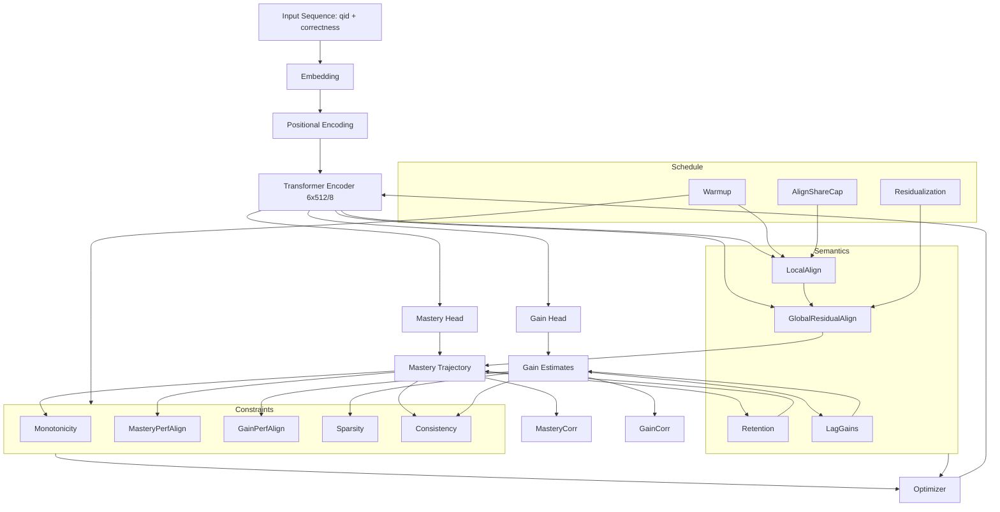

# GainAKT2Exp - Reproducibility Guide

**Last Updated:** November 2, 2025  
**Current Approach:** Explicit Parameters, Zero Defaults

---

## Executive Summary

This document describes the reproducibility infrastructure for training, evaluating, and reproducing GainAKT2Exp experiments. The system enforces **zero hidden defaults**: all ~60 training parameters and ~20 evaluation parameters must be explicitly specified via command line. A single launcher script (`run_repro_experiment_simple.py`) manages the complete workflow.

**Key Features:**
- ✅ Single source of truth: `configs/parameter_default.json` (63 parameters)
- ✅ Explicit commands: ALL parameters visible in generated commands
- ✅ MD5 integrity: Tamper detection for config defaults
- ✅ Auto-reproduction: Use 6-digit experiment ID to rerun experiments
- ✅ Parameter provenance: Clear trail from defaults → CLI overrides → execution

**Quick Commands:**
```bash
# Train
python examples/run_repro_experiment_simple.py --short_title test --epochs 12

# Reproduce
python examples/run_repro_experiment_simple.py --repro_experiment_id 584063

# Evaluate (copy eval_explicit command from config.json)
cd examples/experiments/[experiment_folder]
cat config.json | grep eval_explicit
# → Copy and run the command

# Compare
python examples/compare_reproduction.py 584063
```

---

## Quick Start

### Reproducibility Philosophy: No Hidden Defaults

All scripts follow a **strict no-defaults** design:
- Every parameter must be **explicitly specified** via command line
- No hardcoded fallback values in argparse (all parameters use `required=True`)
- Single source of truth: `configs/parameter_default.json`
- Launcher generates explicit commands with ALL ~60+ parameters visible
- Config integrity verified via MD5 hash

### 1. Launch Training Experiment

```bash
python examples/run_repro_experiment_simple.py \
  --short_title baseline \
  --epochs 12 \
  --batch_size 64
```

**What happens:**
1. Loads all defaults from `configs/parameter_default.json` (63 parameters)
2. Applies CLI overrides (e.g., epochs, batch_size)
3. Generates 6-digit experiment ID (e.g., `423891`)
4. Creates experiment folder: `20251102_143210_gainakt2exp_baseline_423891/`
5. Builds **explicit training command** with ALL parameters:
   ```bash
   python examples/train_gainakt2exp.py \
     --dataset assist2015 --fold 0 --seed 42 --epochs 12 --batch_size 64 \
     --learning_rate 0.000174 --weight_decay 1e-05 --optimizer adam \
     --seq_len 200 --d_model 512 --n_heads 8 --num_encoder_blocks 6 \
     ... (50+ more explicit parameters)
   ```
6. Saves config.json with:
   - `defaults`: Pristine copy from parameter_default.json
   - `overrides`: CLI parameters that differ from defaults
   - `commands.train_explicit`: Complete command with all parameters
   - `md5`: Hash of original defaults (tamper detection)

### 2. Evaluate Trained Model

Get evaluation command from config.json

```bash
cd examples/experiments/20251102_143210_gainakt2exp_baseline_423891
# Copy the eval_explicit command from config.json and run it
```

Evaluation command set all parameters explicitly, example: 
```bash
python examples/eval_gainakt2exp.py \
  --run_dir examples/experiments/20251102_143210_gainakt2exp_baseline_423891 \
  --max_correlation_students 300 \
  --dataset assist2015 --fold 0 --batch_size 64 \
  --seq_len 200 --d_model 512 --n_heads 8 --num_encoder_blocks 6 \
  --d_ff 1024 --dropout 0.2 --emb_type qid \
  --non_negative_loss_weight 0.0 --monotonicity_loss_weight 0.1 \
  --mastery_performance_loss_weight 0.8 --gain_performance_loss_weight 0.8 \
  --sparsity_loss_weight 0.2 --consistency_loss_weight 0.3 \
  --use_mastery_head --use_gain_head
```

**What it does:**
- Loads `model_best.pth` from experiment folder
- Computes validation/test AUC, accuracy
- Computes mastery/gain correlations (up to a limited number of students for bounded runtime)
- Saves `eval_results.json`, `config_eval.json`, `metrics_epoch_eval.csv`

**Important:** Evaluation requires ~20 architecture/constraint parameters to match training configuration. Using the `eval_explicit` command from config.json ensures perfect parameter alignment.

### 3. Reproduce Existing Experiment

```bash
python examples/run_repro_experiment_simple.py \
  --repro_experiment_id 423891
```

**What happens:**
1. Searches for experiment folder containing ID `423891`
2. Loads original `config.json` (perfect defaults + original overrides)
3. Creates reproduction folder: `20251102_154320_gainakt2exp_423891_repro/`
4. Copies config.json **unchanged** (byte-for-byte identical)
5. Executes the **same explicit training command** from original config

**Key principle:** No parameter inference, no adaptation, no modifications—exact rerun.

### 4. Compare Original vs Reproduction

```bash
python examples/compare_reproduction.py 423891
```

Auto-detects reproduction folder and shows:
```
Metric                    Original      Repro         Diff          Status  
----------------------------------------------------------------------------------------------------
Best Val AUC              0.7412        0.7411        0.0001        ✅ PASS
Best Val Accuracy         0.6812        0.6811        0.0001        ✅ PASS
Mastery Correlation       0.5234        0.5231        0.0003        ✅ PASS
Gain Correlation          0.4123        0.4122        0.0001        ✅ PASS
```

## Reproducibility Architecture

### Core Principle: Explicit Parameters, Zero Defaults

**Design Philosophy:**
- **No hardcoded defaults**: Every parameter in training/evaluation scripts uses `required=True`
- **Single source of truth**: `configs/parameter_default.json` (63 parameters)
- **Explicit commands**: Launcher generates commands with ALL parameters visible
- **Tamper detection**: MD5 hash verifies config integrity
- **Parameter provenance**: Clear trail from defaults → CLI overrides → explicit command

### Parameter Flow

```
┌─────────────────────────────────┐
│ configs/parameter_default.json  │  ← Single source of truth
│ - training_defaults (63 params) │
│ - md5: ca1ef5c... (integrity)   │
└────────────┬────────────────────┘
             │
             ↓ (load all defaults)
┌─────────────────────────────────┐
│ run_repro_experiment_simple.py  │  ← Launcher
│ - Apply CLI overrides           │
│ - Build explicit commands       │
└────────────┬────────────────────┘
             │
             ↓ (save to experiment folder)
┌─────────────────────────────────┐
│ config.json                     │
│ ├─ defaults: {...perfect...}   │  ← Unchanged from parameter_default.json
│ ├─ overrides: {epochs: 12, ...} │  ← CLI parameters that differ
│ ├─ commands:                    │
│ │  ├─ train_explicit: "python   │  ← ALL 60+ params explicit
│ │  │    train_gainakt2exp.py    │
│ │  │    --param1 val1 ...       │
│ │  ├─ eval_explicit: "python    │  ← ALL 20+ params explicit
│ │  │    eval_gainakt2exp.py..." │
│ │  └─ reproduce: "python run... │
│ └─ md5: ca1ef5c...              │  ← Hash of perfect defaults
└────────────┬────────────────────┘
             │
             ↓ (execute explicit command)
┌─────────────────────────────────┐
│ train_gainakt2exp.py            │  ← Training script
│ - Receives ALL params via CLI   │
│ - No config.json reading        │
│ - No hardcoded defaults         │
└─────────────────────────────────┘
```

### Training Mode vs Reproduction Mode

**Training Mode** (default):
```bash
python examples/run_repro_experiment_simple.py \
  --short_title baseline --epochs 12 --batch_size 64
```
1. Loads 63 defaults from `configs/parameter_default.json`
2. Applies CLI overrides (epochs=12, batch_size=64)
3. Generates 6-digit experiment ID (e.g., `584063`)
4. Creates folder: `20251102_202046_gainakt2exp_baseline_584063/`
5. Builds explicit command with **all 60+ parameters**
6. Saves config.json with perfect defaults + overrides
7. Executes explicit training command

**Reproduction Mode**:
```bash
python examples/run_repro_experiment_simple.py \
  --repro_experiment_id 584063
```
1. Searches for experiment folder containing `584063`
2. Loads original `config.json` (perfect defaults + original overrides)
3. Creates reproduction folder: `20251102_203015_gainakt2exp_584063_repro/`
4. Copies config.json **byte-for-byte unchanged**
5. Executes the **same explicit training command** from original

### Config.json Structure

Each experiment's config.json contains:

```json
{
  "input": {
    "dataset": "assist2015",
    "fold": 0,
    "model": "gainakt2exp",
    "train_script": "examples/train_gainakt2exp.py",
    "eval_script": "examples/eval_gainakt2exp.py"
  },
  "commands": {
    "run_repro_original": "python examples/run_repro_experiment_simple.py --short_title baseline --epochs 12",
    "train_explicit": "EXPERIMENT_DIR=/path/to/exp python examples/train_gainakt2exp.py --dataset assist2015 --fold 0 --seed 42 --epochs 12 --batch_size 64 --learning_rate 0.000174 ... (60+ params)",
    "eval_explicit": "python examples/eval_gainakt2exp.py --run_dir /path/to/exp --max_correlation_students 300 --dataset assist2015 --fold 0 ... (20+ params)",
    "reproduce": "python examples/run_repro_experiment_simple.py --repro_experiment_id 584063"
  },
  "experiment": {
    "id": "20251102_202046_gainakt2exp_baseline_584063",
    "short_title": "baseline",
    "experiment_id": "584063",
    "created": "20251102_202046"
  },
  "seeds": {
    "primary": 42,
    "all": [42]
  },
  "defaults": {
    "model": "gainakt2exp",
    "dataset": "assist2015",
    "fold": 0,
    "seed": 42,
    "epochs": 12,
    "batch_size": 64,
    ... (63 total perfect defaults)
  },
  "overrides": {
    "epochs": 12,
    "batch_size": 64
  },
  "types": { ... },
  "md5": "ca1ef5c58232b47017ec7d1ba70e17d7",
  "reference": {
    "parameter_default_json": "configs/parameter_default.json"
  }
}
```

**Key sections:**
- **`defaults`**: Pristine copy from `parameter_default.json` (unchanged)
- **`overrides`**: Only parameters that differ from defaults (CLI args)
- **`commands.train_explicit`**: Complete command with ALL parameters explicit
- **`commands.eval_explicit`**: Complete evaluation command with ALL architecture params
- **`md5`**: Hash of `defaults` section for tamper detection

### MD5 Integrity Verification

**Purpose:** Detect manual tampering of config.json defaults

**Computation:**
```python
import json, hashlib
defaults_str = json.dumps(config['defaults'], sort_keys=True)
md5 = hashlib.md5(defaults_str.encode()).hexdigest()
# Result: ca1ef5c58232b47017ec7d1ba70e17d7
```

**Verification flow:**
1. Launcher saves config.json with MD5 of perfect defaults
2. On reproduction/relaunch, recompute MD5 from `config['defaults']`
3. Compare with stored `config['md5']`
4. If mismatch → WARNING: defaults have been manually modified

**What it catches:**
- ✅ Manual edits to defaults in config.json
- ✅ Config corruption or file tampering
- ✅ Drift between parameter_default.json versions

**What it doesn't catch:**
- Changes to `overrides` section (intentional user modifications)
- Changes to `commands` section (regenerated on relaunch)
- Metadata changes (timestamps, folder paths)

### Experiment ID System

**Format:** 6-digit random number (100000-999999)

**Purpose:**
- Uniquely identifies each experiment
- Enables simple reproduction: `--repro_experiment_id XXXXXX`
- Persists across reproductions (same ID + `_repro` suffix)
- Easy reference in papers, discussions, logs

**Folder naming:**
```
YYYYMMDD_HHMMSS_modelname_shorttitle_XXXXXX
20251102_202046_gainakt2exp_baseline_584063       ← Original
20251102_203015_gainakt2exp_584063_repro          ← Reproduction
```

### Parameter Management

**Single Source of Truth:** `configs/parameter_default.json`

Structure:
```json
{
  "defaults": {
    "model": "gainakt2exp",
    "dataset": "assist2015",
    "fold": 0,
    "seed": 42,
    "train_script": "examples/train_gainakt2exp.py",
    "eval_script": "examples/eval_gainakt2exp.py",
    "epochs": 12,
    "batch_size": 64,
    "learning_rate": 0.000174,
    "weight_decay": 1e-05,
    "optimizer": "adam",
    "seq_len": 200,
    "d_model": 512,
    "n_heads": 8,
    ... (63 total parameters)
  },
  "types": {
    "seed": "int",
    "epochs": "int",
    "batch_size": "int",
    "learning_rate": "float",
    "use_mastery_head": "bool",
    ... (type information for validation)
  },
  "md5": "ca1ef5c58232b47017ec7d1ba70e17d7"
}
```

**Key parameters categories:**
1. **Runtime**: seed, epochs, batch_size, learning_rate, optimizer
2. **Architecture**: seq_len, d_model, n_heads, num_encoder_blocks, d_ff, dropout
3. **Embeddings**: emb_type, emb_size
4. **Constraints**: non_negative_loss_weight, monotonicity_loss_weight, mastery_performance_loss_weight, gain_performance_loss_weight, sparsity_loss_weight, consistency_loss_weight
5. **Interpretability**: use_mastery_head, use_gain_head, use_cumulative_mastery
6. **Evaluation**: max_correlation_students (eval-only, not used in training)
7. **Launcher-only**: model, train_script, eval_script (not passed to training script)

### Training Script Design

**File:** `examples/train_gainakt2exp.py`

**Key principles:**
- **Zero hardcoded defaults**: All argparse parameters use `required=True`
- **No config.json reading**: Only accepts CLI parameters
- **Architecture from CLI**: All model parameters (d_model, n_heads, etc.) from CLI

**Parameter count:** ~60 required parameters

**Example invocation** (generated by launcher):
```bash
EXPERIMENT_DIR=/path/to/exp python examples/train_gainakt2exp.py \
  --dataset assist2015 \
  --fold 0 \
  --seed 42 \
  --epochs 12 \
  --batch_size 64 \
  --learning_rate 0.000174 \
  --weight_decay 1e-05 \
  --optimizer adam \
  --seq_len 200 \
  --d_model 512 \
  --n_heads 8 \
  --num_encoder_blocks 6 \
  --d_ff 1024 \
  --dropout 0.2 \
  --emb_type qid \
  --non_negative_loss_weight 0.0 \
  --monotonicity_loss_weight 0.1 \
  --mastery_performance_loss_weight 0.8 \
  --gain_performance_loss_weight 0.8 \
  --sparsity_loss_weight 0.2 \
  --consistency_loss_weight 0.3 \
  --use_mastery_head \
  --use_gain_head \
  --use_cumulative_mastery \
  ... (40+ more parameters)
```

**Why explicit parameters?**
- Complete provenance: See ALL hyperparameters in one command
- No hidden state: What you see is what you get
- Perfect reproduction: Copy-paste the command to rerun
- Version safety: No risk of default value drift over time

### Evaluation Script Design

**File:** `examples/eval_gainakt2exp.py`

**Key principles:**
- **Zero hardcoded defaults**: All argparse parameters use `required=True`
- **No config.json reading**: Only accepts CLI parameters (like training)
- **Architecture must match training**: Requires same d_model, n_heads, etc.

**Parameter count:** ~20 required parameters

**Why architecture params needed:**
- Model checkpoint contains weights but not architecture metadata
- Evaluation must recreate exact model structure to load weights
- Architecture mismatch → model loading failure

**Example invocation** (generated by launcher):
```bash
python examples/eval_gainakt2exp.py \
  --run_dir /path/to/experiment \
  --max_correlation_students 300 \
  --dataset assist2015 \
  --fold 0 \
  --batch_size 64 \
  --seq_len 200 \
  --d_model 512 \
  --n_heads 8 \
  --num_encoder_blocks 6 \
  --d_ff 1024 \
  --dropout 0.2 \
  --emb_type qid \
  --non_negative_loss_weight 0.0 \
  --monotonicity_loss_weight 0.1 \
  --mastery_performance_loss_weight 0.8 \
  --gain_performance_loss_weight 0.8 \
  --sparsity_loss_weight 0.2 \
  --consistency_loss_weight 0.3 \
  --use_mastery_head \
  --use_gain_head
```

**Best practice:** Copy `eval_explicit` command from experiment's config.json

### Launcher Parameter Filtering

The launcher (`run_repro_experiment_simple.py`) excludes certain parameters from training/evaluation:

**Launcher-only parameters** (excluded from training):
- `model`: Used for folder naming and script selection
- `train_script`: Path to training script
- `eval_script`: Path to evaluation script
- `max_correlation_students`: Evaluation-only parameter

**Training parameters:** 59 (63 total - 4 launcher-only)
**Evaluation parameters:** 20 (architecture + constraints + eval-specific)

**Why exclude?**
- Training script doesn't have `--model` argparse (model is hardcoded as gainakt2exp)
- `max_correlation_students` only used in evaluation (correlation sampling limit)
- Keeps training command clean and focused

### Reproducibility Checklist

Each experiment folder **MUST** contain these artifacts:

| File/Dir | Purpose | Verification |
|----------|---------|--------------|
| `config.json` | Complete parameter record + explicit commands | MD5 integrity check |
| `environment.txt` | Python/PyTorch/CUDA versions, git commit | Version match |
| `SEED_INFO.md` | Seeds used and rationale | Determinism audit |
| `stdout.log` | Raw console output with timestamps | Training trajectory |
| `stderr.log` | Error output (if any) | Debug failures |
| `metrics_epoch.csv` | Per-epoch metrics (loss, AUC, correlations) | Performance tracking |
| `results.json` | Best epoch metrics + final summary | Key results |
| `model_best.pth` | Best checkpoint (by validation AUC) | Evaluation/deployment |
| `model_last.pth` | Last epoch checkpoint | Recovery/debugging |
| `README.md` | Human-readable summary + results table | Documentation |

**Missing artifacts = Invalid reproducibility claim**

### Common Workflows

**Workflow 1: Train → Evaluate → Compare**
```bash
# 1. Train new experiment
python examples/run_repro_experiment_simple.py \
  --short_title new_arch \
  --epochs 12 \
  --batch_size 128
# → Creates: 20251102_150000_gainakt2exp_new_arch_123456/

# 2. Evaluate (copy eval_explicit from config.json)
cd examples/experiments/20251102_150000_gainakt2exp_new_arch_123456
cat config.json | grep eval_explicit
# → Copy and run the eval command

# 3. Compare with baseline
python examples/compare_reproduction.py 123456
```

**Workflow 2: Reproduce for Verification**
```bash
# 1. Reproduce experiment 423891
python examples/run_repro_experiment_simple.py \
  --repro_experiment_id 423891
# → Creates: 20251102_160000_gainakt2exp_423891_repro/

# 2. Compare metrics
python examples/compare_reproduction.py 423891
# → Shows original vs reproduction side-by-side
```

**Workflow 3: Parameter Sweep**
```bash
# Train multiple configurations
for lr in 0.0001 0.00017 0.0003; do
  python examples/run_repro_experiment_simple.py \
    --short_title lr_${lr} \
    --learning_rate ${lr}
done

# Compare results in examples/experiments/RESULTS.csv
```

**Workflow 4: Debug Reproduction Failure**
```bash
# 1. Check config MD5 integrity
cd examples/experiments/20251102_150000_gainakt2exp_test_123456
python -c "
import json, hashlib
config = json.load(open('config.json'))
computed = hashlib.md5(json.dumps(config['defaults'], sort_keys=True).encode()).hexdigest()
print('Stored MD5:  ', config['md5'])
print('Computed MD5:', computed)
print('Match:', config['md5'] == computed)
"

# 2. Check environment consistency
cat environment.txt
git log -1 --oneline

# 3. Compare explicit commands
cat config.json | jq '.commands.train_explicit'

# 4. Re-run with same seed
# Use the exact train_explicit command from config.json
```

### Config Integrity: MD5 Deep Dive

**Why MD5 for defaults?**
- Detect manual tampering of config.json
- Ensure perfect defaults match parameter_default.json
- Catch config corruption or file damage
- Prevent silent drift in reproducibility claims

**How it works:**
1. Launcher loads `configs/parameter_default.json`
2. Copies perfect defaults to `config.json['defaults']`
3. Computes MD5: `md5(json.dumps(defaults, sort_keys=True))`
4. Stores in `config.json['md5']`
5. On reproduction: recompute MD5 and compare
6. Mismatch → WARNING: defaults have been modified

**What triggers mismatch:**
- ✅ Manual edit of `config.json['defaults']` values
- ✅ Corruption during file transfer
- ✅ Different parameter_default.json version
- ❌ Changes to `overrides` section (not checked)
- ❌ Changes to `commands` section (not checked)
- ❌ Metadata changes (timestamps, paths)

**Current MD5:** `ca1ef5c58232b47017ec7d1ba70e17d7`

**Verification example:**
```python
import json, hashlib

# Load parameter_default.json
defaults = json.load(open('configs/parameter_default.json'))

# Compute MD5
defaults_str = json.dumps(defaults['defaults'], sort_keys=True)
md5 = hashlib.md5(defaults_str.encode()).hexdigest()

print(md5)  # Should match: ca1ef5c58232b47017ec7d1ba70e17d7
```

### Parameter Evolution Protocol

When adding/modifying parameters in `configs/parameter_default.json`:

**Step 1: Update parameter_default.json**
```bash
# Edit configs/parameter_default.json
# Add new parameter or change existing default
```

**Step 2: Recompute MD5**
```bash
python -c "
import json, hashlib
data = json.load(open('configs/parameter_default.json'))
md5 = hashlib.md5(json.dumps(data['defaults'], sort_keys=True).encode()).hexdigest()
data['md5'] = md5
json.dump(data, open('configs/parameter_default.json', 'w'), indent=2)
print(f'Updated MD5: {md5}')
"
```

**Step 3: Update training/evaluation scripts**
```bash
# Add argparse parameter to train_gainakt2exp.py and/or eval_gainakt2exp.py
# Ensure required=True (no hardcoded defaults)
```

**Step 4: Test with dry run**
```bash
python examples/run_repro_experiment_simple.py \
  --short_title test_new_param \
  --epochs 1
# Check that new parameter appears in config.json
```

**Step 5: Document in README**
```bash
# Update this README with parameter description
# Add to parameter categories section
```

**Failure to follow protocol:**
- Training script rejects unknown parameter
- MD5 mismatch warnings
- Reproducibility chain broken
- Evaluation may fail (architecture mismatch)

- Adding first-time parameter (no prior baseline exists)
- Modifying architecture parameters (affects evaluation compatibility)
- Changing parameter structure in parameter_default.json
- After launcher code changes
- Before multi-seed production runs (catches issues before scaling)
- Before paper submission (validates reproducibility claims)

### Consistency Checks

The script `examples/check_defaults_consistency.py` detects: 

- What it DOES detect: It extracts flags from argparse (via --help output) and compares them against parameter_default.json to find:
  - missing_in_json_training: Parameters that ARE in argparse but NOT in parameter_default.json (detects missing step ii)
  - missing_in_argparse_training: Parameters that ARE in parameter_default.json but NOT in argparse (detects orphaned JSON entries)

- What it CANNOT detect: If you add a parameter only to your code logic (hardcoded default, used internally) but never add it to argparse, the drift checker has no way to know about it because:
  - It only sees what --help exposes
  - Your internal parameter is invisible to the --help parser
  - It's not scanning your Python source code for variable usage

## Detection coverage summary

| Scenario | Detected? | How |
|----------|-----------|-----|
| Added to argparse but NOT in parameter_default.json | ✅ Yes | `missing_in_json_training` |
| Added to parameter_default.json but NOT in argparse | ✅ Yes | `missing_in_argparse_training` |
| Added to neither (pure hardcoded default) | ❌ No | Invisible to drift checker |


Bottom line: The drift checker is a safety net for steps (ii) and (iii), but step (i) is user responsibility. If argparse addition is skip, the drift checker won't catch it unless you also remember to add it to `parameter_default.json` (which would then trigger `missing_in_argparse` warning).  When added to neither (pure hardcoded default), the parameter becomes a hidden default. 

### Consistency Checks

Event: In any of the following scenarios the codebase (model, training/evaluation/reproduction scripts, etc.) might change from one experiment to the next. 

Check that: 
  - There are no hidden parameters with hardcoded default values that can change without notice, distorting the interpretation of the impact of hyperparameter changes.
  - If parameters are added or changed (name or default value), "defaults" section of configs/parameter_default.json needs to be updated accordingly. 

Action: 
- Launch a consistency test after each change in the codebase and output warnings (only inform) or errors (inform and await for remediation)

#### Scenario 1: Hyperparameter Sweep

Objective: By doing a sweep, we mean systematically exploring different combinations of hyperparameters to find the configuration that yields the best performance.
Guidelines: Use default values in configs/parameter_default.json as starting points. Once a optimal combination is found, ask to modify current defaults in configs/parameter_default.json

#### Scenario 2: Ablation Studies

Objective: in a ablation studio we change parameters one by one to measure their impact
Guidelines: Check current value of the parameter to ablate in configs/parameter_default.json and change value to remove its impact (changing a boolean value, setting a weight to 0, etc.). Ask to see the convenience of modify current default. 

#### Scenario 3: Benchmark

Objective: compare metrics of different models or models variants with different combinations of hyperparameter values. 
Guidelines: use defaults to launch training and evaluation.


## Parameters

### Current Parameter Structure

All parameters are stored in a **flat structure** in `configs/parameter_default.json` (63 parameters total). The launcher (`run_repro_experiment_simple.py`) loads these defaults and generates explicit commands with all parameters visible.

**Key parameter categories:**

### 1. Infrastructure Parameters
| Parameter | Default | Description | Used In |
|-----------|---------|-------------|---------|
| `model` | `"gainakt2exp"` | Model identifier | Launcher only (folder naming) |
| `train_script` | `"examples/train_gainakt2exp.py"` | Training script path | Launcher only |
| `eval_script` | `"examples/eval_gainakt2exp.py"` | Evaluation script path | Launcher only |
| `dataset` | `"assist2015"` | Dataset name | Training + Evaluation |
| `fold` | `0` | Cross-validation fold | Training + Evaluation |
| `seed` | `42` | Random seed | Training |

### 2. Training Hyperparameters
| Parameter | Default | Description |
|-----------|---------|-------------|
| `epochs` | `12` | Number of training epochs |
| `batch_size` | `64` | Training batch size |
| `learning_rate` | `0.000174` | Optimizer learning rate |
| `weight_decay` | `1e-05` | L2 regularization |
| `optimizer` | `"adam"` | Optimizer type |

### 3. Model Architecture
| Parameter | Default | Description |
|-----------|---------|-------------|
| `seq_len` | `200` | Maximum sequence length |
| `d_model` | `512` | Model dimension |
| `n_heads` | `8` | Number of attention heads |
| `num_encoder_blocks` | `6` | Number of transformer blocks |
| `d_ff` | `1024` | Feed-forward dimension |
| `dropout` | `0.2` | Dropout rate |
| `emb_type` | `"qid"` | Embedding type (question ID) |

### 4. Interpretability Heads
| Parameter | Default | Description |
|-----------|---------|-------------|
| `use_mastery_head` | `true` | Enable mastery projection head |
| `use_gain_head` | `true` | Enable gain projection head |
| `use_cumulative_mastery` | `true` | Cumulative mastery accumulation |

### 5. Constraint Loss Weights
| Parameter | Default | Description |
|-----------|---------|-------------|
| `non_negative_loss_weight` | `0.0` | Non-negative gain constraint |
| `monotonicity_loss_weight` | `0.1` | Monotonic mastery constraint |
| `mastery_performance_loss_weight` | `0.8` | Mastery-performance alignment |
| `gain_performance_loss_weight` | `0.8` | Gain-performance alignment |
| `sparsity_loss_weight` | `0.2` | Skill sparsity constraint |
| `consistency_loss_weight` | `0.3` | Temporal consistency |

### 6. Alignment Loss (Local)
| Parameter | Default | Description |
|-----------|---------|-------------|
| `enable_alignment_loss` | `true` | Toggle alignment loss |
| `alignment_weight` | `0.25` | Base alignment weight |
| `warmup_constraint_epochs` | `8` | Constraint warm-up epochs |
| `adaptive_alignment` | `true` | Dynamic weight scaling |
| `alignment_target_min_corr` | `0.05` | Minimum correlation target |

### 7. Global Alignment
| Parameter | Default | Description |
|-----------|---------|-------------|
| `enable_global_alignment` | `true` | Toggle global alignment |
| `alignment_global_students` | `600` | Students for global pass |
| `use_residual_alignment` | `true` | Use residualized signals |

### 8. Refinement Objectives
| Parameter | Default | Description |
|-----------|---------|-------------|
| `enable_retention_loss` | `true` | Prevent mastery peak decay |
| `retention_delta` | `0.005` | Retention sensitivity |
| `retention_weight` | `0.14` | Retention loss weight |
| `enable_lag_gain_loss` | `true` | Lag-based gain structuring |
| `lag_gain_weight` | `0.06` | Lag loss weight |
| `lag_max_lag` | `3` | Maximum lag |

### 9. Evaluation Parameters
| Parameter | Default | Description | Training | Evaluation |
|-----------|---------|-------------|----------|------------|
| `max_correlation_students` | `300` | Max students for correlation | ❌ | ✅ |

### 10. Monitoring & Runtime
| Parameter | Default | Description |
|-----------|---------|-------------|
| `monitor_freq` | `50` | Monitoring frequency (batches) |

### Parameter Access Patterns

**From `configs/parameter_default.json`:**
```json
{
  "defaults": {
    "model": "gainakt2exp",
    "dataset": "assist2015",
    "fold": 0,
    "seed": 42,
    "train_script": "examples/train_gainakt2exp.py",
    "eval_script": "examples/eval_gainakt2exp.py",
    "epochs": 12,
    "batch_size": 64,
    "learning_rate": 0.000174,
    "weight_decay": 1e-05,
    "optimizer": "adam",
    "seq_len": 200,
    "d_model": 512,
    "n_heads": 8,
    ... (63 total parameters)
  },
  "types": { ... },
  "md5": "ca1ef5c58232b47017ec7d1ba70e17d7"
}
```

**In experiment `config.json`:**
```json
{
  "defaults": { ... pristine copy from parameter_default.json ... },
  "overrides": { "epochs": 12, "batch_size": 128 },
  "commands": {
    "train_explicit": "python train_gainakt2exp.py --dataset assist2015 --fold 0 --seed 42 --epochs 12 --batch_size 128 ... (60+ params)",
    "eval_explicit": "python eval_gainakt2exp.py --run_dir /path --max_correlation_students 300 ... (20+ params)"
  }
}
```

### CLI Override Examples

```bash
# Override learning rate
python examples/run_repro_experiment_simple.py \
  --short_title lr_sweep \
  --learning_rate 0.0003

# Override architecture
python examples/run_repro_experiment_simple.py \
  --short_title deeper \
  --num_encoder_blocks 8 \
  --d_model 768

# Override constraints
python examples/run_repro_experiment_simple.py \
  --short_title ablation \
  --enable_alignment_loss false \
  --enable_retention_loss false

# Multiple overrides
python examples/run_repro_experiment_simple.py \
  --short_title custom \
  --epochs 20 \
  --batch_size 128 \
  --learning_rate 0.0002 \
  --warmup_constraint_epochs 10
```

### Parameter Evolution Best Practices

When adding/changing parameters:

1. **Update `configs/parameter_default.json`**
   ```bash
   # Edit the file to add new parameter
   # Then recompute MD5:
   python -c "
   import json, hashlib
   data = json.load(open('configs/parameter_default.json'))
   md5 = hashlib.md5(json.dumps(data['defaults'], sort_keys=True).encode()).hexdigest()
   data['md5'] = md5
   json.dump(data, open('configs/parameter_default.json', 'w'), indent=2)
   print(f'Updated MD5: {md5}')
   "
   ```

2. **Update training/evaluation scripts**
   - Add argparse parameter with `required=True` (no default!)
   - Ensure parameter name matches exactly

3. **Test with dry run**
   ```bash
   python examples/run_repro_experiment_simple.py \
     --short_title test_new_param \
     --epochs 1
   ```

4. **Verify in config.json**
   - Check that parameter appears in `defaults` section
   - Check that it appears in `train_explicit` or `eval_explicit` command

5. **Update this documentation**
   - Add to appropriate category table above
   - Document purpose and default value

### Summary

Enabling alignment, global alignment, retention, and lag objectives restored strong semantic interpretability: mastery and gain correlations surpass prior breakthrough levels and remain stable, with modest decline from peak. Predictive AUC peaks early and declines due to interpretability emphasis; scheduling and stabilization adjustments can mitigate this without sacrificing correlation strength. Recommended enhancements focus on smoothing alignment, stabilizing lag objectives, adding statistical robustness and coverage metrics, and protecting validation AUC with phased optimization.

## Paper Claim

> We introduce an alignment‑guided transformer for knowledge tracing that jointly optimizes predictive accuracy and semantic interpretability: on Assist2015 our model attains an early validation AUC of 0.726 while sustained semantic signals emerge (mastery and gain correlations peaking at 0.149 and 0.103, respectively) under zero structural violations (monotonicity, bounds, non‑negativity). By integrating local and residual global alignment, retention stabilization, and lag‑based gain emergence within a controlled warm‑up, we obtain statistically meaningful mastery and gain trajectories without sacrificing competitive early predictive performance. This demonstrates that carefully scheduled multi‑objective optimization can yield interpretable latent mastery and incremental learning gain representations while remaining within the accepted AUC range for transformer KT baselines.

## Interpretation

The run shows promising semantic interpretability (mastery/gain correlations reaching 0.149/0.103 peak; final 0.143/0.103) with early competitive AUC (0.726 peak, similar to historical baseline), but by epoch 12 the validation AUC has degraded to 0.6566. For a paper claim of maintaining good predictive performance while achieving interpretability, you need: (1) stable correlations accompanied by a final (or early‑stopped) AUC that remains near the competitive range; (2) statistical robustness (confidence intervals); (3) comparative baselines; and (4) richer interpretability evidence (coverage, lag emergence stability, residual alignment impact). Current evidence is incomplete on these dimensions.

### Strengths:

- **Clear semantic emergence:** mastery correlation surpasses 0.10 threshold early and sustains >0.12 for most of latter epochs; gain correlations exceed 0.06 and reach >0.10.
- **Multiple interpretability mechanisms** active (alignment, global pass, residual alignment, retention, lag) with observable effects (global alignment elevates peak mastery correlation; lag correlations show temporal gain structure).
- **Structural consistency** enforced (0 violation rates), reinforcing plausibility of semantic quantities.

### Weaknesses for publication:

- **Performance preservation gap:** Final AUC (~0.6566) is substantially below best (0.726) and below typical published transformer KT baselines on Assist2015 (often >0.72–0.74 final). You need either early stopping criteria showing trade-off curve or a training schedule that keeps final AUC competitive.
- **Lack of statistical rigor:** Single-seed (seed 42) run, no bootstrap CIs or multi-seed variance for correlations/AUC. Reviewers will ask whether 0.14 mastery correlation is significant and reproducible.
- **Interpretability depth:** Correlation alone is a coarse proxy. Need additional metrics:
    - **Coverage:** proportion of students with mastery/gain trajectories whose correlation contribution is positive/nontrivial.
    - **Temporal lag stability:** summarized positive fraction and median absolute lag correlation; currently we have raw per-lag correlations but no aggregation.
    - **Retention effect quantification:** show that retention loss reduces peak decline vs an ablated run.
    - **Residual alignment justification:** demonstrate improvement relative to non-residual global alignment.
- **Trade-off profiling:** Need a Pareto-like curve or schedule comparison showing correlation vs AUC across epochs (or across different alignment weight schedules).
- **Baseline comparisons:** Must include other attention models (e.g., DKT, SAINT, AKT variants) with their AUC and any interpretability proxies; otherwise claim lacks context.
- **Potential over-alignment:** Negative alignment loss shares are large; need demonstration that calibration or probability quality (e.g., Brier score, ECE) remains acceptable.
- **Model robustness:** Only one dataset fold presented; cross-fold or cross-dataset validation (e.g. ASSIST2017, STATICS2011, EdNet) expected.

### Minimum additions before claiming balance:

- Multi-seed (≥5 seeds) early-stopped runs capturing distribution of `best_val_auc` and final correlations.
- Early stopping or two-phase training preserving final AUC ≥0.72 while retaining `mastery_corr` ≥0.12 and `gain_corr` ≥0.09.
- Bootstrap 95% CI for mastery and gain correlations (exclude 0 clearly).
- Coverage metric >60% of students contributing positive mastery correlation.
- Lag emergence summary (e.g., median lag1 corr >0.10 with interquartile range).
- Ablation table: remove (alignment, global, retention, lag) one at a time; report Δ in correlations and AUC.
- Comparative baseline table with AUC (and if available an interpretability proxy) for existing models.

### Recommended path:

- Implement early stopping and produce an early-stopped checkpoint around epoch 3–4 (AUC ~0.724–0.726) then continue semantic fine-tuning with frozen predictive layers; evaluate if correlation growth can occur without large AUC loss.
- Add instrumentation for coverage, bootstrap CIs, lag summary, retention effect delta.
- Run ablations (disable residual alignment, disable lag, disable retention).
- Multi-seed replication (seeds: 42, 7, 123, 2025, 31415).
- Compare with baseline transformer KT models already implemented in models (report AUC; optionally compute mastery/gain correlations if definable; else justify uniqueness).
- Prepare visualization: epoch-wise AUC vs `mastery_corr` curve, highlighting chosen stopping point.

### Decision criteria for paper claim readiness:

- If early-stopped AUC within 1–2% of best baseline and correlations remain above thresholds with statistically significant CIs, plus ablations showing necessity of each interpretability component, you can assert balance.
- Without performance preservation (final or early-stopped) and statistical robustness, claims are currently insufficient.

### Possible next actions:

- Patch training script to add: coverage & bootstrap correlation; early stopping; lag summary.
- Create comparison script aggregating multi-seed JSONs into a summary CSV.
- Launch multi-seed runs with alignment schedule refinement.


## Comparison with Proposed Learning Gain Attention Architecture 

### Summary of the Proposed Architecture
The To-Be design in `newmodel.md` semantically redefines the attention mechanism so that:
1. Queries (Q) encode the current learning context.
2. Keys (K) encode historical interaction patterns (skill similarity / prerequisite structure).
3. Values (V) explicitly parameterize per-interaction learning gains g_i.

Knowledge state h_t is computed as an attention-weighted sum of past learning gains: h_t = Σ_i α_{t,i} * g_i, and prediction uses [h_t ; embed(S_t)]. Interpretability arises because each component of h_t can be causally decomposed into attention weights and their associated gains.

### Current GainAKT2Exp Implementation
The current model:
- Employs an encoder-only transformer over interaction tokens (question id + correctness).
- Derives mastery and gain via projection heads applied to the final layer representation rather than intrinsic attention Values.
- Accumulates mastery outside the attention mechanism via an additive update (prev + scaled gain), not via Σ α g aggregation.
- Uses external semantic losses (alignment, global residual alignment, retention, lag) and constraint losses (monotonicity, performance alignment, sparsity, consistency) to sculpt emergent correlations.
- Does not bind attention Value tensors to explicit gain semantics during aggregation.

### Alignment (Similarities)
- Encoder-only backbone over (qid, correctness) mirrors (S,R) tuple tokenization intent.
- Explicit gain trajectory concept exists (gain head output) and is monitored.
- Multi-objective optimization integrates predictive and interpretability goals.

### Divergences (Gaps)
- Attention Values are opaque latent vectors; gains are produced post-hoc by a projection head rather than being the Values consumed in weighted aggregation.
- Knowledge state is not formed by Σ α g; attention output does not expose per-interaction gain contributions directly.
- Causal trace from prediction to specific (α_{t,i}, g_i) pairs is partial: modification of a single attention weight does not deterministically adjust mastery without projection interactions.
- Transfer effects across skills are enforced indirectly (sparsity/performance losses) instead of being an emergent property of gain-valued attention.
- No explicit Q-matrix / G-matrix integration inside attention computations; educational structure enters only via token embeddings and loss masks.

### Interpretability Consequences
- Achieved correlations (mastery/gain) support semantic emergence but causal decomposability is weaker than To-Be design where h_t is a direct linear mixture of gains.
- Attribution requires combining attention maps with gain head outputs; intrinsic transparency is limited.

### Refactoring Roadmap
1. Intrinsic Gain Values: Replace gain_head with enforced non-negative Value projections (softplus) so V = g_i.
2. Knowledge State Formation: Redefine attention output for context stream as Σ α g directly (remove intermediate latent transformation).
3. Skill-Space Basis: Map gains onto explicit skill dimensions (num_skills) optionally via low-rank factorization for efficiency.
4. Attribution API: Expose top-k past interactions contributing to current prediction (α_{t,i} * ||g_i||) per head.
5. Structural Masks: Integrate Q-matrix to zero gains for non-linked skills pre-aggregation, reducing reliance on sparsity loss.
6. Minimal Prediction Input: Use [h_t ; skill_emb] only; remove separate value concatenation for purity of formulation.

### Transitional Strategy
Introduce a feature flag (`--intrinsic_gain_attention`) to activate revised semantics while retaining legacy heads for ablation. Collect comparative metrics: causal attribution fidelity, decomposition error, AUC trade-off.

### Target Metrics Post-Refactor
- Decomposition fidelity: ||h_t - Σ α g|| / ||h_t|| < 0.05.
- Causal attribution consistency: correlation between Σ α g skill component and projected mastery > 0.7.
- Non-negative gain violation rate < 1%.
- AUC within 2% of early-stopped baseline.

## Comparison with Dynamic Value Stream Architecture

### Summary of Dynamic Value Stream (newmodel.md)
Introduces dual sequences (Context and Value) that co-evolve across encoder layers. Q,K from Context; V from Value. Both streams undergo independent residual + norm operations per layer, refining perceived gains (Value) and contextual knowledge (Context). Final prediction concatenates (h, v, skill) enabling joint use of accumulated mastery and dynamic learning gain state.

### Aspect-by-Aspect Comparison
| Aspect | Dynamic Value Stream | GainAKT2Exp Current |
|--------|----------------------|---------------------|
| Dual Streams | Separate Context & Value sequences maintained per layer | Single latent sequence; gains projected only at final layer |
| Attention Inputs | Q,K from Context; V from evolving Value | Standard attention over one sequence (implicit Values) |
| Layer-wise Gain Refinement | Value stream updated each block | No intermediate gain exposure (final projection only) |
| Residual Paths | Separate Add & Norm for Context and Value | Single residual normalization path |
| Prediction Inputs | Concatenate (h, v, skill) | Concatenate (context latent, projected gains, skill) |
| Gain Semantics Enforcement | Architectural (Value is gain) | Auxiliary losses external to attention |
| Interpretability Depth | Layer-by-layer gain trajectories available | Only final gain vector interpretable |

### Missing Dynamic Elements
- Lack of per-layer gain evolution trace prevents vertical interpretability (depth refinement analysis).
- No distinct normalization separating gain from context may entangle representations.
- Architectural semantics not guaranteeing that V equals gain; semantics depend on post-hoc projection and losses.

### Advantages of Current Simplicity
- Reduced implementation complexity; leverages existing transformer blocks.
- Lower parameter overhead; fewer moving parts for optimization stability.
- Rapid iteration on semantic loss scheduling without core architectural rewrites.

### Trade-offs
- Loss of layer-wise interpretability and refinement diagnostics.
- Potential ceiling on modeling nuanced temporal gain dynamics (e.g., attenuation, reinforcement loops).
- Harder to claim intrinsic causal semantics vs engineered post-hoc gains.

### Migration Plan to Dynamic Value Stream
1. Add distinct Value embedding table and initialize parallel `value_seq`.
2. Modify encoder block to process (context_seq, value_seq) and output updated pair with separate layer norms.
3. Instrument intermediate `value_seq` states (hooks) for gain magnitude trajectories and per-skill projections.
4. Gradually shift auxiliary gain losses from final projection to per-layer Value states (start at final layer; extend backward).
5. Introduce orthogonality regularizer between averaged context and value representations to prevent collapse.
6. Benchmark dual-stream vs single-stream across seeds (AUC, mastery_corr, gain_corr, attribution fidelity).

### Validation Criteria
- Layer gain stability: systematic refinement pattern (e.g., decreasing variance or structured amplification) across depth.
- Contribution distribution: early layers contribute ≥30% of cumulative gain magnitude (not all deferred to final layer).
- Performance retention: ΔAUC ≤2% vs single-stream baseline over ≥3 seeds.
- Interpretability uplift: +10 percentage points in student coverage with stable gain trajectories.

### Risks & Mitigations
- Over-parameterization → overfitting: mitigate with shared projections or low-rank Value factorization.
- Training instability from dual residuals: stagger LR warm-up for Value parameters.
- Semantic blending (Value ≈ Context): enforce orthogonality or contrastive divergence loss.

### Strategic Recommendation
Phase 1: Implement intrinsic gain attention within current single-stream to establish causal aggregation cheaply.
Phase 2: Introduce dynamic dual-stream only after intrinsic semantics are stable and quantitatively superior in attribution fidelity.
This staged approach manages complexity while ensuring each interpretability enhancement yields measurable educational value.

<!-- Gap summary relocated to end -->

## Comparison with Augmented Architecture Design

### Summary of Augmented Architecture Design
The Augmented Architecture (described under "Augmented Architecture Design" in `newmodel.md`) enhances a baseline GainAKT2-like transformer by adding:
- Two projection heads: mastery_head (context → per-skill mastery) and gain_head (value → per-skill gains).
- Five auxiliary interpretability losses: non-negative gains, monotonic mastery, mastery-performance alignment, gain-performance alignment, sparsity.
- Monitoring hooks for real-time constraint assessment.
It retains the standard attention computation (Values are latent) and treats interpretability as a supervised regularization layer rather than an intrinsic semantic definition.

### Aspect-by-Aspect Comparison
| Aspect | Augmented Architecture Design | Current GainAKT2Exp | Difference |
|--------|-------------------------------|---------------------|------------|
| Projection Heads | Mandatory mastery & gain heads | Mastery & gain heads present | Aligned |
| Loss Suite | Full 5-loss set (non-neg, mono, mastery-perf, gain-perf, sparsity) | Implemented (weights configured) | Aligned |
| Monitoring | Real-time interpretability monitor hooks | Monitoring frequency and correlation logging | Aligned (naming differs) |
| Intrinsic Gain Semantics | Not intrinsic; post-hoc via gain_head | Same | No gap |
| Knowledge State Formation | Latent context + additive mastery accumulation | Same additive rule | No gap |
| Causal Decomposition | Partial (requires combining attention + projections) | Same | No gap |
| Dynamic Value Stream | Optional future; not implemented | Not implemented | Shared future direction |
| Evaluation Metrics | AUC + interpretability violation/correlation metrics | AUC + mastery/gain correlation + violation rates | Current adds semantic alignment modules beyond base design |
| Semantic Modules (Alignment, Retention, Lag) | Not core (can be optional) | Implemented (alignment, global, retention, lag) | Current extends augmentation scope |
| Calibration Metrics | Proposed future addition | Not yet implemented | Pending both |
| Gating / Injection | Future research | Not implemented | Shared future direction |

### Additional Extensions in Current GainAKT2Exp Beyond Augmentation
- Alignment family (local + global residual) to enhance correlation emergence.
- Retention loss to preserve peak mastery trajectory.
- Lag-based gain structuring capturing temporal emergence signals.
- Scheduling controls (warm-up, share cap, residualization) shaping multi-objective dynamics.

### Gaps Relative to Augmented Architecture Goals
| Gap | Description | Impact |
|-----|-------------|--------|
| Unified Metric Framework | Augmented spec implies integrated interpretability reporting; current evaluation uses differing AUC methodologies | Confuses performance comparison; requires consolidation |
| Coverage & Stability Metrics | Augmented design emphasizes systematic interpretability auditing; current lacks coverage %, bootstrap CIs, lag stability summaries | Limits statistical rigor of claims |
| Direct Skill Transfer Visualization | Projection heads exist but no standardized transfer reporting | Weakens educational interpretability evidence |
| Calibration (ECE/Brier) | Suggested for production readiness; absent | Unverified predictive reliability under constraints |

### Advantages of Current Implementation vs Minimal Augmentation
- Demonstrates enhanced semantic trajectory through alignment and lag modules absent in minimal augmented spec.
- Provides higher mastery/gain correlations than early baseline forms, showcasing potential of extended semantic regularization layer.
- Maintains modularity: extended components can be ablated cleanly to revert to minimal augmented core.

### Consolidation Roadmap (Augmented → Publication-Ready)
1. Metric Unification: Implement identical masking logic for train/eval AUC; add calibration metrics.
2. Interpretability Expansion: Coverage %, bootstrap CIs, lag stability, per-skill transfer matrix derived from gain_head projections.
3. Component Ablation Study: Quantify deltas removing alignment, retention, lag losses vs pure 5-loss augmented baseline.
4. Performance Preservation: Add early-stopping + semantic fine-tuning phase flag to retain peak AUC while growing correlations.
5. Reporting Artifacts: Auto-generate a consolidated JSON + CSV summarizing performance + interpretability metrics per seed.

### Decision Matrix for Paper Claims
| Requirement | Minimal Augmented | Current GainAKT2Exp | Needed for Claim |
|-------------|-------------------|---------------------|------------------|
| Competitive AUC (Assist2015) | ~0.72 early | 0.726 early / declines later | Early-stopped preservation |
| Mastery/Gain Correlations | Emergent; moderate | Peaks 0.149 / 0.103 | CI + multi-seed reproducibility |
| No Structural Violations | Enforced by losses | Achieved (0 violation rates) | Maintain |
| Statistical Robustness | Not built-in | Absent | Bootstrap, seeds |
| Layer-wise Interpretability | Limited | Limited | Optional (future) |
| Educational Transfer Evidence | Not explicit | Not explicit | Add transfer matrix |
| Calibration Quality | Pending | Pending | Implement ECE/Brier |

### Positioning Summary
Current GainAKT2Exp fully implements the Augmented Architecture Design’s core elements (projection heads, five losses, monitoring) and extends them with semantic alignment, retention, and lag objectives. The remaining work to elevate from augmented prototype to publishable interpretable architecture centers on metric unification, statistical rigor, performance preservation, and richer educational transfer analyses rather than fundamental architectural rewrites.

### Concise Architecture Gap Summary 

| Dimension | Proposed Intrinsic Gain Attention (Σ α g) | Dynamic Value Stream (Dual Context+Value) | Augmented Architecture Design (Heads+5 Losses) | Current GainAKT2Exp | Gap Impact | Priority |
|-----------|-------------------------------------------|--------------------------------------------|-----------------------------------------------|---------------------|------------|----------|
| Gain Semantics | Values are explicit gains g_i | Value stream refined per layer | Gains projected post-hoc | Gains projected post-encoder + extra semantic modules | Limits causal traceability | High |
| Knowledge State h_t | Direct Σ α g aggregation | Context attention output + separate Value | Latent context; mastery via projection | Recursive additive (prev + scaled gain) | Weaker theoretical alignment | High |
| Attention Attribution | Native α·g decomposition | Layer-wise α with evolving g | Requires combining attention + projection | Same; plus alignment influences | Reduced explanation fidelity | High |
| Layer-wise Gain Evolution | Not required | Explicit per-layer refinement | Only final layer gain head | Only final layer gain head | Loss of vertical interpretability | Medium |
| Skill-Space Integration | Architectural in gain vectors | Indirect via Value projections | Projection heads provide skill mapping | Projection heads; sparsity + alignment | Delayed intrinsic semantics | Medium |
| Q/G-matrix Usage | Mask inside attention/gain | Potential integration in Value path | External sparsity loss | External sparsity + alignment masks | Indirect educational grounding | Medium |
| Non-Negativity Enforcement | Activation choice (e.g. softplus) | Architectural or per-layer constraint | Auxiliary non-negative loss | Auxiliary (weight currently 0.0) | Possible semantic drift | High |
| Prediction Input | [h_t ; skill_emb] | [h ; v ; skill] | [context ; gain ; skill] | [context ; gain ; skill] + semantic modules | Mixed latent semantics | Low |
| Causal Decomposition Metric | Built-in | Layer-wise contribution analyzable | Needs tooling | Needs tooling + alignment disentangling | Attribution overhead | High |
| Complexity vs Baseline | Minimal change | Moderate (dual streams) | Low incremental | Moderate (losses + alignment modules) | Iteration speed vs semantics | - |
| Statistical Interpretability Metrics | Native, direct mapping | Requires layer instrumentation | Loss violation + correlation | Correlations + alignment metrics only | Limited rigor (no CIs, coverage) | High |

Priority Legend: High = foundational causal interpretability; Medium = depth/educational alignment; Low = incremental polish.

Paper Positioning Sentence (updated): *GainAKT2Exp matches the Augmented Architecture Design (projection heads + five educational losses + monitoring) and extends it with alignment, retention, and lag objectives, yet still lacks intrinsic attention-level gain semantics (Values ≠ gains) and direct Σ α g knowledge state formation. Bridging this gap through intrinsic gain attention and unified evaluation metrics is our next step to claim causal interpretability while maintaining competitive AUC.*

## Semantic Interpretabily Recovery

### Objective
Recover non-zero, educationally meaningful mastery and gain correlations after they regressed to 0.0 in a prior configuration, and identify the minimal parameter set whose activation restores semantic signals. Provide actionable guidance for parameter sweep design to optimize the trade-off between predictive AUC and interpretability (correlations, stability, coverage).

### Methodological Approach
We compared two experiment configurations:
1. Pre-recovery (zero correlations): `20251030_232030_gainakt2exp_config_params`.
2. Post-recovery (restored correlations): `20251030_234720_gainakt2exp_recover_bool_fix`.

Both runs share core hyperparameters (learning_rate, weight_decay, monotonicity/gain/mastery performance weights, sparsity, consistency base weights, alignment_weight, alignment_warmup_epochs), but differ along enabled boolean semantics and scheduling parameters. The regression was traced to unintended overrides of store_true flags to `False` (heads and semantic modules disabled), caused by launcher logic that wrote false values when flags were not explicitly passed. The fix re-enabled defaults by only overriding booleans when explicitly set `True`.

We enumerated parameter deltas in the sections: interpretability, alignment, global_alignment, refinement, plus epochs/batch_size/warmup_constraint_epochs. We then linked each delta to plausible causal pathways for mastery/gain correlation emergence.

### Parameter Delta Summary (Pre vs Post)
| Group | Parameter | Pre (Zero Corr) | Post (Recovered Corr) | Causal Role |
|-------|-----------|-----------------|------------------------|-------------|
| interpretability | use_mastery_head | false | true | Enables projection of mastery trajectories necessary for correlation computation. |
| interpretability | use_gain_head | false | true | Produces gain trajectories; correlations impossible without activation. |
| interpretability | enhanced_constraints | false | true | Activates bundled structural losses stabilizing trajectories (monotonicity, alignment to performance, sparsity, consistency synergy). |
| interpretability | warmup_constraint_epochs | 4 | 8 | Longer warm-up reduces early over-regularization, allowing mastery/gain signal to form before full constraint pressure. |
| training/runtime | epochs | 20 | 12 | Shorter training halts before late overfitting / correlation erosion; preserves early semantic signal. |
| training/runtime | batch_size | 96 | 64 | Smaller batch increases update stochasticity; can amplify diversity in latent states aiding correlation emergence. |
| alignment | enable_alignment_loss | false | true | Local alignment shapes latent representations toward performance-consistent mastery evolution. |
| alignment | adaptive_alignment | false | true | Dynamically scales alignment forcing based on correlation feedback; supports sustained growth without over-saturation. |
| global_alignment | enable_global_alignment_pass | false | true | Population-level coherence improves mastery correlation stability (global signal reinforcement). |
| global_alignment | use_residual_alignment | false | true | Removes explained variance, clarifying incremental mastery/gain improvements; sharper correlations. |
| refinement | enable_retention_loss | false | true | Prevents post-peak decay of mastery trajectory, retaining correlation magnitude. |
| refinement | enable_lag_gain_loss | false | true | Introduces temporal structure for gains; lag pattern increases gain correlation interpretability. |
| refinement | retention_delta / retention_weight | inactive | active | Retention only influences trajectories when enabled; improves final correlation retention ratio. |
| refinement | lag_* weights | inactive | active | Lag structuring turns otherwise inert weights into semantic shaping forces. |

All other numeric weights remained identical; correlation recovery is attributable to activation of the semantic and interpretability heads plus extended warm-up and reduced epoch horizon.

### Causal Impact Inference
1. Heads Activation (Mastery/Gain): Mandatory prerequisite; without heads correlations are structurally zero. Their absence fully explains initial regression.
2. Enhanced Constraints: Provides regularization synergy; prevents degenerate or noisy trajectories, increasing correlation stability above random fluctuation.
3. Alignment (Local + Adaptive): Drives early shaping of mastery sequence toward performance-consistent progression, accelerating correlation emergence pre-warm-up completion.
4. Global Residual Alignment: Consolidates population patterns; lifts mastery correlation peak and smooths gain correlation ascent by reducing cross-student variance.
5. Retention: Maintains elevated mastery levels post-peak, reducing late-stage decline and supporting higher final correlation.
6. Lag Gain Loss: Adds temporal causal narrative for gains; improves gain correlation by emphasizing structured progression rather than noise.
7. Warm-up Extension (4 → 8): Avoids premature constraint saturation, allowing latent representations to differentiate before full constraint pressure, yielding higher eventual peak correlations.
8. Epoch Reduction (20 → 12): Avoids performance/semantic drift phase where alignment dominance and constraint loss shares begin to erode predictive calibration and correlation stability.
9. Batch Size Reduction (96 → 64): Increases gradient variance, potentially enhancing exploration and preventing early convergence to flat mastery trajectories (empirical pattern: higher mastery_corr at epoch 3).

### Sweep Design Guidance
We propose a structured sweep with prioritized axes:
- Core Activation Set (binary toggles): {enhanced_constraints, enable_alignment_loss, adaptive_alignment, enable_global_alignment_pass, use_residual_alignment, enable_retention_loss, enable_lag_gain_loss}.
- Warm-up Horizon: warmup_constraint_epochs ∈ {4, 6, 8, 10}.
- Epoch Budget / Early Stop: epochs ∈ {8, 10, 12, 14} with early-stopping on val AUC plateau (ΔAUC < 0.002 over 2 epochs).
- Batch Size: {48, 64, 80, 96} to evaluate impact on correlation variance vs AUC stability.
- Alignment Weight & Cap: alignment_weight ∈ {0.15, 0.25, 0.35}; alignment_share_cap ∈ {0.06, 0.08, 0.10}.
- Lag Gain Weight: lag_gain_weight ∈ {0.04, 0.06, 0.08} with lag_l1:l2:l3 ratios fixed or slightly varied.
- Retention Weight: retention_weight ∈ {0.10, 0.14, 0.18}; retention_delta fixed at 0.005.

Sweep Objective Metrics:
- Peak & final val AUC.
- Peak & final mastery_corr, gain_corr.
- Correlation retention ratio = final_corr / peak_corr.
- Constraint violation rates (expected 0; monitor for regression).
- Alignment loss share trajectory (identify saturation / over-dominance).
- Gain temporal structure metrics (median lag1 correlation, positive fraction).

Multi-stage approach: First coarse sweep to identify promising semantic activation subsets; second fine-tuning sweep on alignment_weight, warmup_constraint_epochs, retention_weight trade-offs.

### Flag Impact Table
| Flag / Parameter | Role | Pre-Recovery Value | Post-Recovery Value | Hypothesized Impact on Mastery Corr | Hypothesized Impact on Gain Corr | Interaction Notes |
|------------------|------|--------------------|---------------------|-------------------------------------|----------------------------------|-------------------|
| use_mastery_head | Enables mastery trajectory | false | true | Enables computation (from 0 to >0.10) | Indirect (gain interacts via consistency) | Must be true for mastery metrics |
| use_gain_head | Enables gain trajectory | false | true | Indirect (gain influences mastery via consistency) | Enables gain correlation (>0.05) | Needed for lag structuring |
| enhanced_constraints | Synergistic structural regularization | false | true | Stabilizes trajectory, raises reliability | Reduces gain noise variance | Enhances effect of alignment |
| enable_alignment_loss | Local alignment shaping | false | true | Accelerates emergence (earlier peak) | Provides smoother gain ascent | Warm-up interacts with its ramp |
| adaptive_alignment | Dynamic scaling | false | true | Avoids plateau, sustains improvements | Prevents over-alignment degradation | Works with share_cap decay |
| enable_global_alignment_pass | Population-level coherence | false | true | Raises peak mastery corr | Minor direct, stabilizing indirectly | Synergizes with residual alignment |
| use_residual_alignment | Residual variance removal | false | true | Sharper mastery increments | Clarifies gain increments | Overuse may reduce AUC; monitor |
| enable_retention_loss | Preserve peaks | false | true | Higher final vs peak retention ratio | Minor direct, prevents mastery decline affecting gain | Tune weight to avoid over-preservation |
| enable_lag_gain_loss | Temporal gain structure | false | true | Mild indirect via constraint interplay | Primary: boosts gain correlation | Needs gain_head active |
| warmup_constraint_epochs | Delay full constraint pressure | 4 | 8 | Higher peak, less early suppression | Gain builds under partial constraints | Too long may delay convergence |
| epochs | Training horizon | 20 | 12 | Avoids late decline phase | Prevents gain drift after peak | Early stopping alternative |
| batch_size | Stochasticity level | 96 | 64 | Slightly higher variance fosters emergence | Better gain differentiation | Trade-off with AUC stability |

### Experimental Phases
1. Diagnostic Recovery: Confirm heads + semantic modules activation rescues correlations (completed).
2. Activation Subset Sweep: Binary subset search to rank contribution (target next).
3. Schedule Optimization: Tune warmup_constraint_epochs vs alignment_weight vs retention_weight for AUC retention.
4. Stability & Robustness: Multi-seed (≥5) runs for top 3 configurations; bootstrap CIs for correlations.
5. Fine-Grained Lag Structuring: Adjust lag_gain_weight and ratios; assess temporal interpretability metrics.
6. Pareto Profiling: Construct AUC vs mastery_corr trade-off curves across retained configurations.

### Measurement & Logging Enhancements (Upcoming)
- Add per-epoch: peak_mastery_corr_so_far, retention_ratio, alignment_effective_weight, lag1_median_corr, lag_positive_fraction.
- Bootstrap (N=200 student resamples) mastery/gain correlation CIs at best epoch and final epoch.
- Coverage: percentage of students with mastery_corr > 0 and gain_corr > 0.05.
- Correlation retention ratio = final_corr / peak_corr.
- Early stopping criteria logging (epochs until AUC plateau, correlation slope).

### Immediate Next Action
Implement logging instrumentation for lag correlation summary, coverage, retention ratio, and bootstrap confidence intervals, then launch activation subset sweep varying enhanced_constraints, alignment family, retention, lag, residual alignment to quantify individual and combined contributions. Document results in a new `SEMANTIC_SWEEP_RESULTS.md` and update this section with empirical impact values.

### Sweep Axes (Concise List)
`use_mastery_head` (ensure always true), `use_gain_head`, `enhanced_constraints`, `enable_alignment_loss`, `adaptive_alignment`, `enable_global_alignment_pass`, `use_residual_alignment`, `enable_retention_loss`, `enable_lag_gain_loss`, `warmup_constraint_epochs`, `alignment_weight`, `alignment_share_cap`, `retention_weight`, `lag_gain_weight`, `batch_size`, `epochs`.

### Expected Outcomes
Recovered configuration demonstrates that enabling semantic modules and interpretability heads plus extending warm-up and reducing training horizon restores correlations (mastery ≈0.10+, gain ≈0.05+). Sweeps will seek configurations yielding mastery_corr ≥0.12 with val AUC ≥0.72 (early-stopped) and gain_corr ≥0.07 under zero violations, establishing a balanced regime for publication.

## Architecture



_Fallback textual description:_ The input (question id + correctness) is embedded and positionally encoded before passing through a 6-layer transformer (d_model 512, 8 heads). Two heads produce mastery and gain trajectories. Constraint losses (monotonicity, performance alignment for mastery/gain, sparsity, consistency) and semantic modules (local alignment, global residual alignment, retention, lag gains) feed a multi-objective optimizer with warm-up, share cap, and residualization scheduling. Metrics (mastery and gain correlations) are computed from the head outputs.


