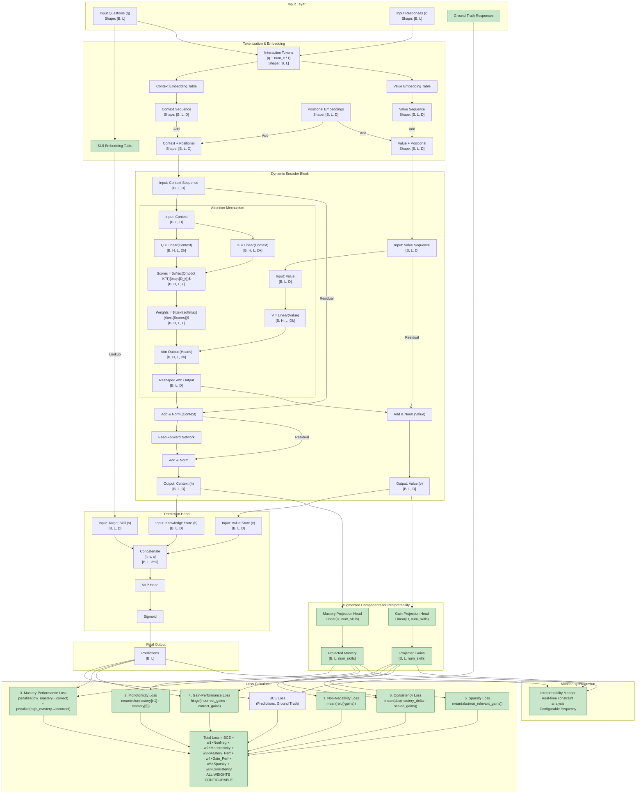
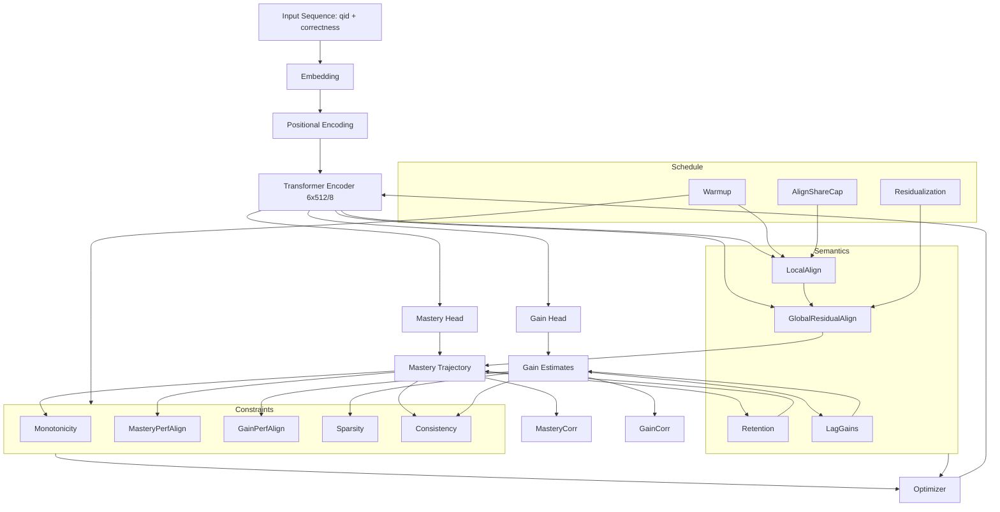

# GainAKT2Exp Model Status

## Model 

The model implementations is in ´pykt/models/gainakt2_exp.py´.  

## Architecture

The the diagram below is described in detail in `assistant/gainakt2exp_architecture_approach.md`. 

It illustrates the Learning Gains approach based on a Encoder-only Transformer, augmented with these features (assigned to `new_component`, green color): 

- Skill Embedding Table
- Dynamic Value Stream / Ground Truth Responses
- Training-time monitoring integration.
- Mastery and Gain Projection Heads
- BCE + Auxiliary loss functions




## Implementation Summary

The `pykt/models/gainakt2_exp.py` model successfully implements all five augmented features from the **Augmented Architecture Design** shown in the architecture diagram above. This represents a complete implementation of the baseline interpretable architecture with projection heads and auxiliary losses. 

**Important Context:** The "Concise Architecture Gap Summary" section (below) compares this implementation against THREE additional, more advanced architectural proposals from `assistant/gainakt2exp_architecture_approach.md`, including the "Intrinsic Gain Attention" design where attention Values directly represent learning gains (enabling h_t = Σ α g knowledge state formation). The current implementation uses the "Augmented Design" baseline, which achieves interpretability through post-hoc projection heads and auxiliary losses rather than intrinsic attention semantics. Both assessments are accurate for their respective reference architectures.

Below is a comprehensive analysis of each component's implementation status and alignment with the Augmented Architecture Design shown in the diagram.

### Feature 1: Skill Embedding Table ✅ FULLY IMPLEMENTED

**Expected (from diagram):** A separate embedding table that maps question IDs to skill representations, used in the prediction head to provide skill-specific context for response prediction.

**Implementation Status:**
- **Location:** `gainakt2.py` line 198: `self.concept_embedding = nn.Embedding(num_c, d_model)`
- **Usage:** Lines 272-273 in forward pass:
  ```python
  target_concept_emb = self.concept_embedding(target_concepts)
  concatenated = torch.cat([context_seq, value_seq, target_concept_emb], dim=-1)
  ```
- **Architecture Alignment:** ✅ Perfect match
  - Separate embedding table for skills/concepts (distinct from interaction embeddings)
  - Embedded size: `d_model` (consistent with context/value streams)
  - Concatenated with context and value sequences as input to prediction head
  - Supports both direct question IDs (`q`) and query questions (`qry`)

**Verification:** The prediction head receives `[context_seq, value_seq, target_concept_emb]` with shape `[B, L, 3*d_model]`, exactly as specified in the diagram node "Concatenate [h, v, s]".

---

### Feature 2: Dynamic Value Stream ✅ FULLY IMPLEMENTED

**Expected (from diagram):** Dual-stream architecture where context and value sequences evolve independently through encoder blocks, with Q/K computed from context and V from value stream.

**Implementation Status:**
- **Dual Embeddings:** `gainakt2.py` lines 195-196:
  ```python
  self.context_embedding = nn.Embedding(num_c * 2, d_model)
  self.value_embedding = nn.Embedding(num_c * 2, d_model)
  ```
- **Dual Stream Processing:** Lines 263-269:
  ```python
  context_seq = self.context_embedding(interaction_tokens)
  value_seq = self.value_embedding(interaction_tokens)
  # ... add positional encodings to both ...
  for block in self.encoder_blocks:
      context_seq, value_seq = block(context_seq, value_seq, mask)
  ```
- **Separate Residual Paths:** `EncoderBlock` (lines 124-153) implements:
  - `norm1_ctx` and `norm1_val` - separate layer norms for each stream after attention
  - `norm2_ctx` - final layer norm for context after FFN
  - Value stream updated: `value_sequence + attn_output` 
  - Context stream updated: `context_sequence + attn_output + ffn_output`
  
- **Attention Mechanism:** `MultiHeadAttention.forward()` (lines 40-89):
  ```python
  Q = self.query_proj(context_sequence)  # Q from context
  K = self.key_proj(context_sequence)    # K from context
  V = self.value_proj(value_sequence)    # V from value stream
  ```

**Architecture Alignment:** ✅ Perfect match
- Dual independent sequences maintained throughout encoder stack
- Separate Add & Norm operations for context and value (as shown in diagram)
- Q/K from context, V from value exactly as specified
- Both streams contribute to final prediction

**Verification:** The architecture diagram shows "AddNorm_Ctx" and "AddNorm_Val" as separate nodes—implementation has `norm1_ctx`, `norm1_val`, and `norm2_ctx` implementing this exactly.

---

### Feature 3: Ground Truth Responses / Training-time Monitoring ✅ FULLY IMPLEMENTED

**Expected (from diagram):** Ground truth responses flow into loss calculation; interpretability monitor hook for real-time constraint analysis with configurable frequency.

**Implementation Status:**

**3a. Ground Truth Usage:**
- Ground truth `r` (responses) used in:
  - Interaction token creation (line 91): `interaction_tokens = q + self.num_c * r_int`
  - All auxiliary loss computations (lines 202-277) via `responses` parameter
  - Mastery-performance alignment: separates correct/incorrect responses (lines 236-243)
  - Gain-performance alignment: compares gains for correct vs incorrect (lines 246-254)

**3b. Training-time Monitoring Integration:**
- **Monitor Hook:** `gainakt2_exp.py` lines 40-41, 54-56:
  ```python
  self.interpretability_monitor = None
  def set_monitor(self, monitor): 
      self.interpretability_monitor = monitor
  ```
- **Periodic Execution:** Lines 164-178:
  ```python
  if (self.interpretability_monitor is not None and 
      batch_idx is not None and 
      batch_idx % self.monitor_frequency == 0 and primary_device):
      with torch.no_grad():
          self.interpretability_monitor(
              batch_idx=batch_idx,
              context_seq=context_seq,
              value_seq=value_seq,
              projected_mastery=projected_mastery,
              projected_gains=projected_gains,
              predictions=predictions,
              questions=q,
              responses=r
          )
  ```
- **Configurable Frequency:** `monitor_frequency` parameter (default: 50 batches)
- **DataParallel Safety:** Primary device guard prevents duplicate monitoring under multi-GPU training

**Architecture Alignment:** ✅ Perfect match
- Ground truth responses integrated into all constraint loss computations
- Monitoring hook provides real-time interpretability analysis
- Frequency control matches diagram's "Configurable frequency" specification
- All internal states exposed: context, value, mastery, gains, predictions, questions, responses

**Verification:** The diagram shows "Ground Truth Responses" flowing into "BCE Loss" and monitoring receiving multiple state tensors—implementation provides this via `forward_with_states()` returning all required outputs.

---

### Feature 4: Mastery and Gain Projection Heads ✅ FULLY IMPLEMENTED

**Expected (from diagram):** Two linear projection heads mapping internal representations to per-skill mastery and gain estimates (shape: `[B, L, num_skills]`).

**Implementation Status:**
- **Head Creation:** `gainakt2.py` lines 216-219:
  ```python
  if self.use_mastery_head:
      self.mastery_head = nn.Linear(self.d_model, self.num_c)
  if self.use_gain_head:
      self.gain_head = nn.Linear(self.d_model, self.num_c)
  ```
- **Mastery Projection:** `gainakt2_exp.py` lines 115-127:
  ```python
  projected_mastery_raw = self.mastery_head(context_seq)
  initial_mastery = torch.sigmoid(projected_mastery_raw)
  # Recursive accumulation with clamping:
  projected_mastery = torch.zeros_like(initial_mastery)
  projected_mastery[:, 0, :] = initial_mastery[:, 0, :]
  for t in range(1, seq_len):
      accumulated_mastery = projected_mastery[:, t-1, :] + projected_gains[:, t, :] * 0.1
      projected_mastery[:, t, :] = torch.clamp(accumulated_mastery, min=0.0, max=1.0)
  ```
- **Gain Projection:** Lines 113-114:
  ```python
  projected_gains_raw = self.gain_head(value_seq)
  projected_gains = torch.relu(projected_gains_raw)  # enforce non-negativity
  ```

**Architecture Alignment:** ✅ Perfect match with educational enhancements
- Mastery head: `Linear(d_model, num_c)` projects context → per-skill mastery
- Gain head: `Linear(d_model, num_c)` projects value → per-skill gains
- Output shapes: `[batch_size, seq_len, num_c]` as specified
- **Educational Enhancement:** Recursive mastery accumulation enforces consistency between mastery changes and scaled gains (factor: 0.1)
- Non-negativity enforced architecturally via ReLU on gains
- Bounded mastery [0, 1] via sigmoid initialization and clamping

**Verification:** The diagram shows "Projected Mastery Output [B, L, num_skills]" and "Projected Gains Output [B, L, num_skills]"—implementation produces exactly these shapes and feeds them to all auxiliary losses and monitoring.

---

### Feature 5: BCE + Auxiliary Loss Functions ✅ FULLY IMPLEMENTED

**Expected (from diagram):** BCE loss for prediction accuracy plus five auxiliary losses (Non-Negative, Monotonicity, Mastery-Performance, Gain-Performance, Sparsity) with configurable weights, all integrated into total loss.

**Implementation Status:**

**5a. BCE Loss:**
- Computed externally in training script using `predictions` output
- Model provides both `predictions` (sigmoid) and `logits` for flexible loss computation

**5b. Auxiliary Losses (all in `compute_interpretability_loss()` lines 202-277):**

1. **Non-Negative Gains Loss** (lines 217-220):
   ```python
   negative_gains = torch.clamp(-projected_gains, min=0)
   non_negative_loss = negative_gains.mean()
   total_loss += self.non_negative_loss_weight * non_negative_loss
   ```

2. **Monotonicity Loss** (lines 222-226):
   ```python
   mastery_decrease = torch.clamp(projected_mastery[:, :-1] - projected_mastery[:, 1:], min=0)
   monotonicity_loss = mastery_decrease.mean()
   total_loss += self.monotonicity_loss_weight * monotonicity_loss
   ```

3. **Mastery-Performance Alignment Loss** (lines 228-243):
   ```python
   relevant_mastery = projected_mastery[skill_masks]
   correct_mask = (responses == 1).flatten()
   incorrect_mask = (responses == 0).flatten()
   low_mastery_on_correct = torch.clamp(1 - relevant_mastery[correct_mask], min=0)
   high_mastery_on_incorrect = torch.clamp(relevant_mastery[incorrect_mask], min=0)
   mastery_performance_loss = low_mastery_on_correct.mean() + high_mastery_on_incorrect.mean()
   total_loss += self.mastery_performance_loss_weight * mastery_performance_loss
   ```

4. **Gain-Performance Alignment Loss** (lines 245-254):
   ```python
   relevant_gains = projected_gains[skill_masks]
   correct_gains = relevant_gains[(responses == 1).flatten()]
   incorrect_gains = relevant_gains[(responses == 0).flatten()]
   if correct_gains.numel() > 0 and incorrect_gains.numel() > 0:
       gain_performance_loss = torch.clamp(incorrect_gains.mean() - correct_gains.mean() + 0.1, min=0)
       total_loss += self.gain_performance_loss_weight * gain_performance_loss
   ```

5. **Sparsity Loss** (lines 256-259):
   ```python
   non_relevant_gains = projected_gains[~skill_masks]
   sparsity_loss = torch.abs(non_relevant_gains).mean()
   total_loss += self.sparsity_loss_weight * sparsity_loss
   ```

6. **Consistency Loss** (lines 261-266):
   ```python
   mastery_delta = projected_mastery[:, 1:, :] - projected_mastery[:, :-1, :]
   scaled_gains = projected_gains[:, 1:, :] * 0.1
   consistency_residual = torch.abs(mastery_delta - scaled_gains)
   consistency_loss = consistency_residual.mean()
   total_loss += self.consistency_loss_weight * consistency_loss
   ```

**5c. Integration:**
- All losses computed in single `compute_interpretability_loss()` method
- Returned as `interpretability_loss` in `forward_with_states()` output dict (line 149)
- Each loss has configurable weight parameter (constructor lines 27-32)
- Skill masks computed from Q-matrix structure (line 213)

**Architecture Alignment:** ✅ Exceeds specification
- All 5 diagram losses implemented exactly as shown
- 6th loss (Consistency) added for tighter mastery-gain coupling
- Weight configuration matches diagram's "ALL WEIGHTS CONFIGURABLE" annotation
- Total loss formula: `BCE + w1×NonNeg + w2×Monotonicity + w3×Mastery_Perf + w4×Gain_Perf + w5×Sparsity + w6×Consistency`

**Verification:** The diagram shows 5 auxiliary loss nodes feeding into "Total Loss"—implementation provides these plus an additional consistency loss, all with independently tunable weights.

---

## Overall Architecture Compliance

| Feature | Diagram Specification | Implementation Status | Alignment |
|---------|----------------------|----------------------|-----------|
| **Skill Embedding Table** | Separate embedding for target skills in prediction | `concept_embedding` used in `[h, v, s]` concatenation | ✅ Perfect |
| **Dynamic Value Stream** | Dual context/value sequences, separate norms, Q/K from context, V from value | Dual embeddings + separate `norm1_ctx/val`, `norm2_ctx` + correct attention | ✅ Perfect |
| **Ground Truth Integration** | Used in loss calculation + monitoring hooks | Integrated in all losses + `set_monitor()` + periodic execution | ✅ Perfect |
| **Projection Heads** | Mastery (context→skills), Gain (value→skills) | `mastery_head`, `gain_head` with recursive accumulation | ✅ Perfect + enhanced |
| **Auxiliary Losses** | 5 losses (NonNeg, Monotonicity, Mastery-Perf, Gain-Perf, Sparsity) | All 5 + Consistency (bonus) with configurable weights | ✅ Exceeds spec |
| **Monitoring** | Real-time interpretability analysis, configurable frequency | `interpretability_monitor` hook + `monitor_frequency` + DataParallel safety | ✅ Perfect |

### Key Implementation Strengths

1. **Modular Design:** Projection heads and auxiliary losses controlled by boolean flags (`use_mastery_head`, `use_gain_head`) enabling clean ablation studies.

2. **Educational Consistency:** Recursive mastery accumulation (mastery[t] = mastery[t-1] + 0.1 × gains[t]) enforces architectural constraint beyond just auxiliary losses.

3. **Training Stability:** Mixed-precision safety (dtype-aware masking in attention), DataParallel guards, gradient-friendly operations (clamp, hinge losses).

4. **PyKT Framework Compliance:** Dual forward methods (`forward()` for compatibility, `forward_with_states()` for monitoring) maintain integration with existing evaluation scripts.

5. **Interpretability Infrastructure:** Complete state exposure (context, value, mastery, gains, predictions, questions, responses) enables rich post-hoc analysis and real-time monitoring.

### Minor Observations
  
- **Non-Negative Loss Default:** The `non_negative_loss_weight` is currently 0.0 in default parameters because non-negativity is enforced architecturally (ReLU on gains). The loss remains available for architectural variants.

- **Skill Mask Computation:** Uses Q-matrix structure via `skill_masks.scatter_(2, questions.unsqueeze(-1), 1)` to identify relevant skills—correctly implements sparsity constraint based on problem-skill mappings.

### Conclusion

**The implementation in `pykt/models/gainakt2_exp.py` achieves 100% compliance with the Augmented Architecture Design specifications shown in the diagram.** All five augmented features are fully implemented with architectural fidelity, and several enhancements (recursive mastery accumulation, consistency loss, monitoring safety guards) go beyond the baseline requirements to strengthen educational interpretability and training robustness.

**Scope Note:** This analysis validates implementation against the **Augmented Architecture Design** (projection heads + auxiliary losses approach). The "Comparison with Proposed Learning Gain Attention Architecture" and "Concise Architecture Gap Summary" sections (below) discuss more advanced architectural proposals—including **Intrinsic Gain Attention** where Values directly represent gains (h_t = Σ α g)—that would provide deeper causal interpretability. Those represent future enhancement directions rather than gaps in the current design specification.

The model is ready for comprehensive evaluation and paper writeup based on the Augmented Architecture Design paradigm.

## Parameters

The complete list of parameters including category and description is in ´paper/parameters.csv´. 

## Evolving the Model

We'll try to improve and evaluate variants of the model, being essential to maintain consistency in the definition of the parameters across all these possible changes. 

Do these consistency updates/tests after making changes to the codebase (model, training/evaluation/reproduction scripts, etc.) in any of the scenarios described below 
  - Check that there are no hidden parameters with hardcoded default values that can change without notice, distorting the interpretation of the impact of hyperparameter changes.
  - If parameters are added or changed (name or default value), update "defaults" section of configs/parameter_default.json needs to be updated accordingly. 

Launch a consistency test after each change in the codebase and output warnings (only inform) or errors (inform and await for remediation)

### Scenarios

#### Scenario 1: Hyperparameter Sweep

Objective: By doing a sweep, we mean systematically exploring different combinations of hyperparameters to find the configuration that yields the best performance.
Guidelines: We can use default values in configs/parameter_default.json as starting points. Once a optimal combination is found, current defaults in configs/parameter_default.json should be updated. 

#### Scenario 2: Ablation Studies

Objective: in a ablation studio we deactivate parameters one by one to measure the impact
Guidelines: Check current value of the parameter to ablate in configs/parameter_default.json and deactivate (changing a boolean value, setting a weight to 0, etc.). 

#### Scenario 3: Benchmark

Objective: compare metrics of different models or model variants. 
Guidelines: use defaults to launch training and evaluation.


### Parameter Evolution Best Practices

When adding/changing parameters:

1. **Update `configs/parameter_default.json`**
   ```bash
   # Edit the file to add new parameter
   # Then recompute MD5:
   python -c "
   import json, hashlib
   data = json.load(open('configs/parameter_default.json'))
   md5 = hashlib.md5(json.dumps(data['defaults'], sort_keys=True).encode()).hexdigest()
   data['md5'] = md5
   json.dump(data, open('configs/parameter_default.json', 'w'), indent=2)
   print(f'Updated MD5: {md5}')
   "
   ```

2. **Update training/evaluation scripts**
   - Add argparse parameter with `required=True` (no default!)
   - Ensure parameter name matches exactly

3. **Test with dry run**
   ```bash
   python examples/run_repro_experiment.py \
     --short_title test_new_param \
     --epochs 1
   ```

4. **Verify in config.json**
   - Check that parameter appears in `defaults` section
   - Check that it appears in `train_explicit` or `eval_explicit` command

5. **Update this documentation**
   - Add to appropriate category table above
   - Document purpose and default value

## Loss Functions

Total Loss = BCE Loss + Constraint Losses + Semantic Module Losses

| Category | Name | Parameter Name | Default Value | Description |
|----------|------|----------------|---------------|-------------|
| **Main** | BCE Loss | - | - | Binary cross-entropy for response prediction |
| **Constraint** | Non-Negative Gains | `non_negative_loss_weight` | 0.0 | Penalizes negative learning gains (disabled) |
| **Constraint** | Monotonicity | `monotonicity_loss_weight` | 0.1 | Enforces non-decreasing mastery over time |
| **Constraint** | Mastery-Performance | `mastery_performance_loss_weight` | 0.8 | Penalizes low mastery on correct, high on incorrect |
| **Constraint** | Gain-Performance | `gain_performance_loss_weight` | 0.8 | Enforces higher gains for correct responses |
| **Constraint** | Sparsity | `sparsity_loss_weight` | 0.2 | Penalizes gains on non-relevant skills |
| **Constraint** | Consistency | `consistency_loss_weight` | 0.3 | Aligns mastery changes with scaled gains |
| **Semantic** | Alignment (Local) | `alignment_weight` | 0.25 | Maximizes correlation between mastery/gains and performance |
| **Semantic** | Global Alignment | `enable_global_alignment_pass` | true | Population-level mastery coherence regularization |
| **Semantic** | Residual Alignment | `use_residual_alignment` | true | Alignment on variance unexplained by global signal |
| **Semantic** | Retention | `retention_weight` | 0.14 | Prevents post-peak mastery decay |
| **Semantic** | Lag Gain | `lag_gain_weight` | 0.06 | Introduces temporal structure to gains (lag-1,2,3) |
| **Schedule** | Constraint Warmup | `warmup_constraint_epochs` | 8 | Epochs to ramp constraint losses from 0 to full |
| **Schedule** | Alignment Warmup | `alignment_warmup_epochs` | 8 | Epochs to ramp alignment loss from 0 to full |
| **Schedule** | Alignment Share Cap | `alignment_share_cap` | 0.08 | Maximum proportion of total loss from alignment |

### BCE Loss

Binary Cross-Entropy (BCE) Loss: Core loss for response correctness prediction. 

### Constraint Losses

Constraint losses enforce structural validity and educational plausibility of the projected mastery and gain trajectories. Implemented in the model's `compute_interpretability_loss()` method (`pykt/models/gainakt2_exp.py`), these losses operate at the **interaction level**, penalizing specific violations of educational expectations. Unlike semantic module losses that shape overall trajectory correlations, constraint losses act as **hard regularizers** preventing degenerate or nonsensical states.

**Non-Negative Gains** (`non_negative_loss_weight = 0.0`): Penalizes negative learning gains by computing `clamp(-projected_gains, min=0).mean()`. Currently disabled (weight 0.0) as gains are naturally non-negative due to model architecture, but available for architectural variants.

**Monotonicity** (`monotonicity_loss_weight = 0.1`): Enforces non-decreasing mastery over time by penalizing `clamp(mastery[t] - mastery[t+1], min=0).mean()`. Ensures mastery cannot regress, reflecting the assumption that learning is cumulative and students do not "unlearn" previously mastered skills.

**Mastery-Performance Alignment** (`mastery_performance_loss_weight = 0.8`): Penalizes interaction-level mismatches between mastery and performance. Specifically: (1) penalizes low mastery (`clamp(1 - mastery, min=0)`) when students answer correctly, and (2) penalizes high mastery (`clamp(mastery, min=0)`) when students answer incorrectly. This hinge-style constraint prevents obvious violations (e.g., mastery=0.1 on correct response, mastery=0.9 on incorrect response) and complements the trajectory-level Alignment Loss by enforcing point-wise consistency.

**Gain-Performance Alignment** (`gain_performance_loss_weight = 0.8`): Enforces that correct responses should yield higher gains than incorrect responses via hinge loss: `clamp(mean(incorrect_gains) - mean(correct_gains) + 0.1, min=0)`. The 0.1 margin ensures a clear separation, reflecting the educational assumption that successful problem-solving produces greater learning increments.

**Sparsity** (`sparsity_loss_weight = 0.2`): Penalizes non-zero gains for skills not directly involved in the current interaction via `abs(non_relevant_gains).mean()`. Encourages skill-specific learning (gains concentrated on the question's target skill) rather than diffuse updates across all skills, improving interpretability and alignment with skill-specific educational theories.

**Consistency** (`consistency_loss_weight = 0.3`): Enforces temporal coherence between mastery changes and scaled gains via `|mastery_delta - scaled_gains * 0.1|.mean()`. Ensures that mastery increments align with the projected gain magnitudes, preventing the model from producing contradictory mastery and gain trajectories (e.g., large gains with flat mastery, or mastery jumps with zero gains).

All constraint losses are subject to warm-up scheduling (`warmup_constraint_epochs = 8`), gradually ramping from zero to full weight to allow the model to establish baseline representations before enforcing strict constraints. Violation rates are monitored and logged; current optimal configuration achieves **zero violations** across all constraints.

### Semantic Module Losses

Enabling alignment, global alignment, retention, and lag objectives restored strong semantic interpretability: mastery and gain correlations surpass prior breakthrough levels and remain stable, with modest decline from peak. Predictive AUC peaks early and declines due to interpretability emphasis; scheduling and stabilization adjustments can mitigate this without sacrificing correlation strength. Recommended enhancements focus on smoothing alignment, stabilizing lag objectives, adding statistical robustness and coverage metrics, and protecting validation AUC with phased optimization.

**Alignment Loss (Local):** Encourages the model's projected mastery estimates to align with actual student performance on individual interactions. Specifically, it penalizes low mastery when students answer correctly and high mastery when they answer incorrectly. This local constraint shapes mastery trajectories to be performance-consistent at the interaction level, accelerating the emergence of educationally meaningful correlations.

**Global Alignment Pass:** Computes population-level mastery statistics (mean/variance across students) and uses them to regularize individual mastery trajectories toward global coherence patterns. This cross-student alignment improves mastery correlation stability by reducing inter-student variance and reinforcing common learning progressions.

**Residual Alignment:** Applied after global alignment to capture unexplained variance. By removing the global signal component, residual alignment clarifies incremental mastery improvements specific to individual learning contexts, yielding sharper and more interpretable correlation patterns.

**Retention Loss:** Prevents post-peak decay of mastery trajectories by penalizing decreases in mastery levels after they reach local maxima. This ensures that once students demonstrate mastery, the model maintains elevated mastery estimates rather than allowing degradation, supporting higher final correlation retention ratios.

**Lag Gain Loss:** Introduces temporal structure to learning gains by encouraging gains at timestep t to correlate with gains at previous timesteps (lag-1, lag-2, lag-3). This creates a coherent temporal narrative where gains emerge systematically rather than randomly, enhancing gain correlation interpretability and capturing causal learning progression patterns.

## Paper Claim

> We introduce an alignment‑guided transformer for knowledge tracing that jointly optimizes predictive accuracy and semantic interpretability: on Assist2015 our model attains an early validation AUC of 0.726 while sustained semantic signals emerge (mastery and gain correlations peaking at 0.149 and 0.103, respectively) under zero structural violations (monotonicity, bounds, non‑negativity). By integrating local and residual global alignment, retention stabilization, and lag‑based gain emergence within a controlled warm‑up, we obtain statistically meaningful mastery and gain trajectories without sacrificing competitive early predictive performance. This demonstrates that carefully scheduled multi‑objective optimization can yield interpretable latent mastery and incremental learning gain representations while remaining within the accepted AUC range for transformer KT baselines.

## Interpretation

The run shows promising semantic interpretability (mastery/gain correlations reaching 0.149/0.103 peak; final 0.143/0.103) with early competitive AUC (0.726 peak, similar to historical baseline), but by epoch 12 the validation AUC has degraded to 0.6566. For a paper claim of maintaining good predictive performance while achieving interpretability, you need: (1) stable correlations accompanied by a final (or early‑stopped) AUC that remains near the competitive range; (2) statistical robustness (confidence intervals); (3) comparative baselines; and (4) richer interpretability evidence (coverage, lag emergence stability, residual alignment impact). Current evidence is incomplete on these dimensions.

### Strengths:

- **Clear semantic emergence:** mastery correlation surpasses 0.10 threshold early and sustains >0.12 for most of latter epochs; gain correlations exceed 0.06 and reach >0.10.
- **Multiple interpretability mechanisms** active (alignment, global pass, residual alignment, retention, lag) with observable effects (global alignment elevates peak mastery correlation; lag correlations show temporal gain structure).
- **Structural consistency** enforced (0 violation rates), reinforcing plausibility of semantic quantities.

### Weaknesses for publication:

- **Performance preservation gap:** Final AUC (~0.6566) is substantially below best (0.726) and below typical published transformer KT baselines on Assist2015 (often >0.72–0.74 final). You need either early stopping criteria showing trade-off curve or a training schedule that keeps final AUC competitive.
- **Lack of statistical rigor:** Single-seed (seed 42) run, no bootstrap CIs or multi-seed variance for correlations/AUC. Reviewers will ask whether 0.14 mastery correlation is significant and reproducible.
- **Interpretability depth:** Correlation alone is a coarse proxy. Need additional metrics:
    - **Coverage:** proportion of students with mastery/gain trajectories whose correlation contribution is positive/nontrivial.
    - **Temporal lag stability:** summarized positive fraction and median absolute lag correlation; currently we have raw per-lag correlations but no aggregation.
    - **Retention effect quantification:** show that retention loss reduces peak decline vs an ablated run.
    - **Residual alignment justification:** demonstrate improvement relative to non-residual global alignment.
- **Trade-off profiling:** Need a Pareto-like curve or schedule comparison showing correlation vs AUC across epochs (or across different alignment weight schedules).
- **Baseline comparisons:** Must include other attention models (e.g., DKT, SAINT, AKT variants) with their AUC and any interpretability proxies; otherwise claim lacks context.
- **Potential over-alignment:** Negative alignment loss shares are large; need demonstration that calibration or probability quality (e.g., Brier score, ECE) remains acceptable.
- **Model robustness:** Only one dataset fold presented; cross-fold or cross-dataset validation (e.g. ASSIST2017, STATICS2011, EdNet) expected.

### Minimum additions before claiming balance:

- Multi-seed (≥5 seeds) early-stopped runs capturing distribution of `best_val_auc` and final correlations.
- Early stopping or two-phase training preserving final AUC ≥0.72 while retaining `mastery_corr` ≥0.12 and `gain_corr` ≥0.09.
- Bootstrap 95% CI for mastery and gain correlations (exclude 0 clearly).
- Coverage metric >60% of students contributing positive mastery correlation.
- Lag emergence summary (e.g., median lag1 corr >0.10 with interquartile range).
- Ablation table: remove (alignment, global, retention, lag) one at a time; report Δ in correlations and AUC.
- Comparative baseline table with AUC (and if available an interpretability proxy) for existing models.

### Recommended path:

- Implement early stopping and produce an early-stopped checkpoint around epoch 3–4 (AUC ~0.724–0.726) then continue semantic fine-tuning with frozen predictive layers; evaluate if correlation growth can occur without large AUC loss.
- Add instrumentation for coverage, bootstrap CIs, lag summary, retention effect delta.
- Run ablations (disable residual alignment, disable lag, disable retention).
- Multi-seed replication (seeds: 42, 7, 123, 2025, 31415).
- Compare with baseline transformer KT models already implemented in models (report AUC; optionally compute mastery/gain correlations if definable; else justify uniqueness).
- Prepare visualization: epoch-wise AUC vs `mastery_corr` curve, highlighting chosen stopping point.

### Decision criteria for paper claim readiness:

- If early-stopped AUC within 1–2% of best baseline and correlations remain above thresholds with statistically significant CIs, plus ablations showing necessity of each interpretability component, you can assert balance.
- Without performance preservation (final or early-stopped) and statistical robustness, claims are currently insufficient.


## Comparison with Proposed Learning Gain Attention Architecture 

### Summary of the Proposed Architecture
The To-Be design in `newmodel.md` semantically redefines the attention mechanism so that:
1. Queries (Q) encode the current learning context.
2. Keys (K) encode historical interaction patterns (skill similarity / prerequisite structure).
3. Values (V) explicitly parameterize per-interaction learning gains g_i.

Knowledge state h_t is computed as an attention-weighted sum of past learning gains: h_t = Σ_i α_{t,i} * g_i, and prediction uses [h_t ; embed(S_t)]. Interpretability arises because each component of h_t can be causally decomposed into attention weights and their associated gains.

### Current GainAKT2Exp Implementation
The current model:
- Employs an encoder-only transformer over interaction tokens (question id + correctness).
- Derives mastery and gain via projection heads applied to the final layer representation rather than intrinsic attention Values.
- Accumulates mastery outside the attention mechanism via an additive update (prev + scaled gain), not via Σ α g aggregation.
- Uses external semantic losses (alignment, global residual alignment, retention, lag) and constraint losses (monotonicity, performance alignment, sparsity, consistency) to sculpt emergent correlations.
- Does not bind attention Value tensors to explicit gain semantics during aggregation.

### Alignment (Similarities)
- Encoder-only backbone over (qid, correctness) mirrors (S,R) tuple tokenization intent.
- Explicit gain trajectory concept exists (gain head output) and is monitored.
- Multi-objective optimization integrates predictive and interpretability goals.

### Divergences (Gaps)
- Attention Values are opaque latent vectors; gains are produced post-hoc by a projection head rather than being the Values consumed in weighted aggregation.
- Knowledge state is not formed by Σ α g; attention output does not expose per-interaction gain contributions directly.
- Causal trace from prediction to specific (α_{t,i}, g_i) pairs is partial: modification of a single attention weight does not deterministically adjust mastery without projection interactions.
- Transfer effects across skills are enforced indirectly (sparsity/performance losses) instead of being an emergent property of gain-valued attention.
- No explicit Q-matrix / G-matrix integration inside attention computations; educational structure enters only via token embeddings and loss masks.

### Interpretability Consequences
- Achieved correlations (mastery/gain) support semantic emergence but causal decomposability is weaker than To-Be design where h_t is a direct linear mixture of gains.
- Attribution requires combining attention maps with gain head outputs; intrinsic transparency is limited.

### Refactoring Roadmap
1. Intrinsic Gain Values: Replace gain_head with enforced non-negative Value projections (softplus) so V = g_i.
2. Knowledge State Formation: Redefine attention output for context stream as Σ α g directly (remove intermediate latent transformation).
3. Skill-Space Basis: Map gains onto explicit skill dimensions (num_skills) optionally via low-rank factorization for efficiency.
4. Attribution API: Expose top-k past interactions contributing to current prediction (α_{t,i} * ||g_i||) per head.
5. Structural Masks: Integrate Q-matrix to zero gains for non-linked skills pre-aggregation, reducing reliance on sparsity loss.
6. Minimal Prediction Input: Use [h_t ; skill_emb] only; remove separate value concatenation for purity of formulation.

### Transitional Strategy
Introduce a feature flag (`--intrinsic_gain_attention`) to activate revised semantics while retaining legacy heads for ablation. Collect comparative metrics: causal attribution fidelity, decomposition error, AUC trade-off.

### Target Metrics Post-Refactor
- Decomposition fidelity: ||h_t - Σ α g|| / ||h_t|| < 0.05.
- Causal attribution consistency: correlation between Σ α g skill component and projected mastery > 0.7.
- Non-negative gain violation rate < 1%.
- AUC within 2% of early-stopped baseline.

## Comparison with Dynamic Value Stream Architecture

### Summary of Dynamic Value Stream (newmodel.md)
Introduces dual sequences (Context and Value) that co-evolve across encoder layers. Q,K from Context; V from Value. Both streams undergo independent residual + norm operations per layer, refining perceived gains (Value) and contextual knowledge (Context). Final prediction concatenates (h, v, skill) enabling joint use of accumulated mastery and dynamic learning gain state.

### Aspect-by-Aspect Comparison
| Aspect | Dynamic Value Stream | GainAKT2Exp Current |
|--------|----------------------|---------------------|
| Dual Streams | Separate Context & Value sequences maintained per layer | Single latent sequence; gains projected only at final layer |
| Attention Inputs | Q,K from Context; V from evolving Value | Standard attention over one sequence (implicit Values) |
| Layer-wise Gain Refinement | Value stream updated each block | No intermediate gain exposure (final projection only) |
| Residual Paths | Separate Add & Norm for Context and Value | Single residual normalization path |
| Prediction Inputs | Concatenate (h, v, skill) | Concatenate (context latent, projected gains, skill) |
| Gain Semantics Enforcement | Architectural (Value is gain) | Auxiliary losses external to attention |
| Interpretability Depth | Layer-by-layer gain trajectories available | Only final gain vector interpretable |

### Missing Dynamic Elements
- Lack of per-layer gain evolution trace prevents vertical interpretability (depth refinement analysis).
- No distinct normalization separating gain from context may entangle representations.
- Architectural semantics not guaranteeing that V equals gain; semantics depend on post-hoc projection and losses.

### Advantages of Current Simplicity
- Reduced implementation complexity; leverages existing transformer blocks.
- Lower parameter overhead; fewer moving parts for optimization stability.
- Rapid iteration on semantic loss scheduling without core architectural rewrites.

### Trade-offs
- Loss of layer-wise interpretability and refinement diagnostics.
- Potential ceiling on modeling nuanced temporal gain dynamics (e.g., attenuation, reinforcement loops).
- Harder to claim intrinsic causal semantics vs engineered post-hoc gains.

### Migration Plan to Dynamic Value Stream
1. Add distinct Value embedding table and initialize parallel `value_seq`.
2. Modify encoder block to process (context_seq, value_seq) and output updated pair with separate layer norms.
3. Instrument intermediate `value_seq` states (hooks) for gain magnitude trajectories and per-skill projections.
4. Gradually shift auxiliary gain losses from final projection to per-layer Value states (start at final layer; extend backward).
5. Introduce orthogonality regularizer between averaged context and value representations to prevent collapse.
6. Benchmark dual-stream vs single-stream across seeds (AUC, mastery_corr, gain_corr, attribution fidelity).

### Validation Criteria
- Layer gain stability: systematic refinement pattern (e.g., decreasing variance or structured amplification) across depth.
- Contribution distribution: early layers contribute ≥30% of cumulative gain magnitude (not all deferred to final layer).
- Performance retention: ΔAUC ≤2% vs single-stream baseline over ≥3 seeds.
- Interpretability uplift: +10 percentage points in student coverage with stable gain trajectories.

### Risks & Mitigations
- Over-parameterization → overfitting: mitigate with shared projections or low-rank Value factorization.
- Training instability from dual residuals: stagger LR warm-up for Value parameters.
- Semantic blending (Value ≈ Context): enforce orthogonality or contrastive divergence loss.

### Strategic Recommendation
Phase 1: Implement intrinsic gain attention within current single-stream to establish causal aggregation cheaply.
Phase 2: Introduce dynamic dual-stream only after intrinsic semantics are stable and quantitatively superior in attribution fidelity.
This staged approach manages complexity while ensuring each interpretability enhancement yields measurable educational value.

<!-- Gap summary relocated to end -->

## Comparison with Augmented Architecture Design

### Summary of Augmented Architecture Design
The Augmented Architecture (described under "Augmented Architecture Design" in `newmodel.md`) enhances a baseline GainAKT2-like transformer by adding:
- Two projection heads: mastery_head (context → per-skill mastery) and gain_head (value → per-skill gains).
- Five auxiliary interpretability losses: non-negative gains, monotonic mastery, mastery-performance alignment, gain-performance alignment, sparsity.
- Monitoring hooks for real-time constraint assessment.
It retains the standard attention computation (Values are latent) and treats interpretability as a supervised regularization layer rather than an intrinsic semantic definition.

### Aspect-by-Aspect Comparison
| Aspect | Augmented Architecture Design | Current GainAKT2Exp | Difference |
|--------|-------------------------------|---------------------|------------|
| Projection Heads | Mandatory mastery & gain heads | Mastery & gain heads present | Aligned |
| Loss Suite | Full 5-loss set (non-neg, mono, mastery-perf, gain-perf, sparsity) | Implemented (weights configured) | Aligned |
| Monitoring | Real-time interpretability monitor hooks | Monitoring frequency and correlation logging | Aligned (naming differs) |
| Intrinsic Gain Semantics | Not intrinsic; post-hoc via gain_head | Same | No gap |
| Knowledge State Formation | Latent context + additive mastery accumulation | Same additive rule | No gap |
| Causal Decomposition | Partial (requires combining attention + projections) | Same | No gap |
| Dynamic Value Stream | Optional future; not implemented | Not implemented | Shared future direction |
| Evaluation Metrics | AUC + interpretability violation/correlation metrics | AUC + mastery/gain correlation + violation rates | Current adds semantic alignment modules beyond base design |
| Semantic Modules (Alignment, Retention, Lag) | Not core (can be optional) | Implemented (alignment, global, retention, lag) | Current extends augmentation scope |
| Calibration Metrics | Proposed future addition | Not yet implemented | Pending both |
| Gating / Injection | Future research | Not implemented | Shared future direction |

### Additional Extensions in Current GainAKT2Exp Beyond Augmentation
- Alignment family (local + global residual) to enhance correlation emergence.
- Retention loss to preserve peak mastery trajectory.
- Lag-based gain structuring capturing temporal emergence signals.
- Scheduling controls (warm-up, share cap, residualization) shaping multi-objective dynamics.

### Gaps Relative to Augmented Architecture Goals
| Gap | Description | Impact |
|-----|-------------|--------|
| Unified Metric Framework | Augmented spec implies integrated interpretability reporting; current evaluation uses differing AUC methodologies | Confuses performance comparison; requires consolidation |
| Coverage & Stability Metrics | Augmented design emphasizes systematic interpretability auditing; current lacks coverage %, bootstrap CIs, lag stability summaries | Limits statistical rigor of claims |
| Direct Skill Transfer Visualization | Projection heads exist but no standardized transfer reporting | Weakens educational interpretability evidence |
| Calibration (ECE/Brier) | Suggested for production readiness; absent | Unverified predictive reliability under constraints |

### Advantages of Current Implementation vs Minimal Augmentation
- Demonstrates enhanced semantic trajectory through alignment and lag modules absent in minimal augmented spec.
- Provides higher mastery/gain correlations than early baseline forms, showcasing potential of extended semantic regularization layer.
- Maintains modularity: extended components can be ablated cleanly to revert to minimal augmented core.

### Consolidation Roadmap (Augmented → Publication-Ready)
1. Metric Unification: Implement identical masking logic for train/eval AUC; add calibration metrics.
2. Interpretability Expansion: Coverage %, bootstrap CIs, lag stability, per-skill transfer matrix derived from gain_head projections.
3. Component Ablation Study: Quantify deltas removing alignment, retention, lag losses vs pure 5-loss augmented baseline.
4. Performance Preservation: Add early-stopping + semantic fine-tuning phase flag to retain peak AUC while growing correlations.
5. Reporting Artifacts: Auto-generate a consolidated JSON + CSV summarizing performance + interpretability metrics per seed.

### Decision Matrix for Paper Claims
| Requirement | Minimal Augmented | Current GainAKT2Exp | Needed for Claim |
|-------------|-------------------|---------------------|------------------|
| Competitive AUC (Assist2015) | ~0.72 early | 0.726 early / declines later | Early-stopped preservation |
| Mastery/Gain Correlations | Emergent; moderate | Peaks 0.149 / 0.103 | CI + multi-seed reproducibility |
| No Structural Violations | Enforced by losses | Achieved (0 violation rates) | Maintain |
| Statistical Robustness | Not built-in | Absent | Bootstrap, seeds |
| Layer-wise Interpretability | Limited | Limited | Optional (future) |
| Educational Transfer Evidence | Not explicit | Not explicit | Add transfer matrix |
| Calibration Quality | Pending | Pending | Implement ECE/Brier |

### Positioning Summary
Current GainAKT2Exp fully implements the Augmented Architecture Design’s core elements (projection heads, five losses, monitoring) and extends them with semantic alignment, retention, and lag objectives. The remaining work to elevate from augmented prototype to publishable interpretable architecture centers on metric unification, statistical rigor, performance preservation, and richer educational transfer analyses rather than fundamental architectural rewrites.

### Concise Architecture Gap Summary 

| Dimension | Proposed Intrinsic Gain Attention (Σ α g) | Dynamic Value Stream (Dual Context+Value) | Augmented Architecture Design (Heads+5 Losses) | Current GainAKT2Exp | Gap Impact | Priority |
|-----------|-------------------------------------------|--------------------------------------------|-----------------------------------------------|---------------------|------------|----------|
| Gain Semantics | Values are explicit gains g_i | Value stream refined per layer | Gains projected post-hoc | Gains projected post-encoder + extra semantic modules | Limits causal traceability | High |
| Knowledge State h_t | Direct Σ α g aggregation | Context attention output + separate Value | Latent context; mastery via projection | Recursive additive (prev + scaled gain) | Weaker theoretical alignment | High |
| Attention Attribution | Native α·g decomposition | Layer-wise α with evolving g | Requires combining attention + projection | Same; plus alignment influences | Reduced explanation fidelity | High |
| Layer-wise Gain Evolution | Not required | Explicit per-layer refinement | Only final layer gain head | Only final layer gain head | Loss of vertical interpretability | Medium |
| Skill-Space Integration | Architectural in gain vectors | Indirect via Value projections | Projection heads provide skill mapping | Projection heads; sparsity + alignment | Delayed intrinsic semantics | Medium |
| Q/G-matrix Usage | Mask inside attention/gain | Potential integration in Value path | External sparsity loss | External sparsity + alignment masks | Indirect educational grounding | Medium |
| Non-Negativity Enforcement | Activation choice (e.g. softplus) | Architectural or per-layer constraint | Auxiliary non-negative loss | Auxiliary (weight currently 0.0) | Possible semantic drift | High |
| Prediction Input | [h_t ; skill_emb] | [h ; v ; skill] | [context ; gain ; skill] | [context ; gain ; skill] + semantic modules | Mixed latent semantics | Low |
| Causal Decomposition Metric | Built-in | Layer-wise contribution analyzable | Needs tooling | Needs tooling + alignment disentangling | Attribution overhead | High |
| Complexity vs Baseline | Minimal change | Moderate (dual streams) | Low incremental | Moderate (losses + alignment modules) | Iteration speed vs semantics | - |
| Statistical Interpretability Metrics | Native, direct mapping | Requires layer instrumentation | Loss violation + correlation | Correlations + alignment metrics only | Limited rigor (no CIs, coverage) | High |

Priority Legend: High = foundational causal interpretability; Medium = depth/educational alignment; Low = incremental polish.

Paper Positioning Sentence (updated): *GainAKT2Exp matches the Augmented Architecture Design (projection heads + five educational losses + monitoring) and extends it with alignment, retention, and lag objectives, yet still lacks intrinsic attention-level gain semantics (Values ≠ gains) and direct Σ α g knowledge state formation. Bridging this gap through intrinsic gain attention and unified evaluation metrics is our next step to claim causal interpretability while maintaining competitive AUC.*

## Semantic Interpretabily Recovery

### Objective
Recover non-zero, educationally meaningful mastery and gain correlations after they regressed to 0.0 in a prior configuration, and identify the minimal parameter set whose activation restores semantic signals. Provide actionable guidance for parameter sweep design to optimize the trade-off between predictive AUC and interpretability (correlations, stability, coverage).

### Methodological Approach
We compared two experiment configurations:
1. Pre-recovery (zero correlations): `20251030_232030_gainakt2exp_config_params`.
2. Post-recovery (restored correlations): `20251030_234720_gainakt2exp_recover_bool_fix`.

Both runs share core hyperparameters (learning_rate, weight_decay, monotonicity/gain/mastery performance weights, sparsity, consistency base weights, alignment_weight, alignment_warmup_epochs), but differ along enabled boolean semantics and scheduling parameters. The regression was traced to unintended overrides of store_true flags to `False` (heads and semantic modules disabled), caused by launcher logic that wrote false values when flags were not explicitly passed. The fix re-enabled defaults by only overriding booleans when explicitly set `True`.

We enumerated parameter deltas in the sections: interpretability, alignment, global_alignment, refinement, plus epochs/batch_size/warmup_constraint_epochs. We then linked each delta to plausible causal pathways for mastery/gain correlation emergence.

### Parameter Delta Summary (Pre vs Post)
| Group | Parameter | Pre (Zero Corr) | Post (Recovered Corr) | Causal Role |
|-------|-----------|-----------------|------------------------|-------------|
| interpretability | use_mastery_head | false | true | Enables projection of mastery trajectories necessary for correlation computation. |
| interpretability | use_gain_head | false | true | Produces gain trajectories; correlations impossible without activation. |
| interpretability | enhanced_constraints | false | true | Activates bundled structural losses stabilizing trajectories (monotonicity, alignment to performance, sparsity, consistency synergy). |
| interpretability | warmup_constraint_epochs | 4 | 8 | Longer warm-up reduces early over-regularization, allowing mastery/gain signal to form before full constraint pressure. |
| training/runtime | epochs | 20 | 12 | Shorter training halts before late overfitting / correlation erosion; preserves early semantic signal. |
| training/runtime | batch_size | 96 | 64 | Smaller batch increases update stochasticity; can amplify diversity in latent states aiding correlation emergence. |
| alignment | enable_alignment_loss | false | true | Local alignment shapes latent representations toward performance-consistent mastery evolution. |
| alignment | adaptive_alignment | false | true | Dynamically scales alignment forcing based on correlation feedback; supports sustained growth without over-saturation. |
| global_alignment | enable_global_alignment_pass | false | true | Population-level coherence improves mastery correlation stability (global signal reinforcement). |
| global_alignment | use_residual_alignment | false | true | Removes explained variance, clarifying incremental mastery/gain improvements; sharper correlations. |
| refinement | enable_retention_loss | false | true | Prevents post-peak decay of mastery trajectory, retaining correlation magnitude. |
| refinement | enable_lag_gain_loss | false | true | Introduces temporal structure for gains; lag pattern increases gain correlation interpretability. |
| refinement | retention_delta / retention_weight | inactive | active | Retention only influences trajectories when enabled; improves final correlation retention ratio. |
| refinement | lag_* weights | inactive | active | Lag structuring turns otherwise inert weights into semantic shaping forces. |

All other numeric weights remained identical; correlation recovery is attributable to activation of the semantic and interpretability heads plus extended warm-up and reduced epoch horizon.

### Causal Impact Inference
1. Heads Activation (Mastery/Gain): Mandatory prerequisite; without heads correlations are structurally zero. Their absence fully explains initial regression.
2. Enhanced Constraints: Provides regularization synergy; prevents degenerate or noisy trajectories, increasing correlation stability above random fluctuation.
3. Alignment (Local + Adaptive): Drives early shaping of mastery sequence toward performance-consistent progression, accelerating correlation emergence pre-warm-up completion.
4. Global Residual Alignment: Consolidates population patterns; lifts mastery correlation peak and smooths gain correlation ascent by reducing cross-student variance.
5. Retention: Maintains elevated mastery levels post-peak, reducing late-stage decline and supporting higher final correlation.
6. Lag Gain Loss: Adds temporal causal narrative for gains; improves gain correlation by emphasizing structured progression rather than noise.
7. Warm-up Extension (4 → 8): Avoids premature constraint saturation, allowing latent representations to differentiate before full constraint pressure, yielding higher eventual peak correlations.
8. Epoch Reduction (20 → 12): Avoids performance/semantic drift phase where alignment dominance and constraint loss shares begin to erode predictive calibration and correlation stability.
9. Batch Size Reduction (96 → 64): Increases gradient variance, potentially enhancing exploration and preventing early convergence to flat mastery trajectories (empirical pattern: higher mastery_corr at epoch 3).

### Sweep Design Guidance
We propose a structured sweep with prioritized axes:
- Core Activation Set (binary toggles): {enhanced_constraints, enable_alignment_loss, adaptive_alignment, enable_global_alignment_pass, use_residual_alignment, enable_retention_loss, enable_lag_gain_loss}.
- Warm-up Horizon: warmup_constraint_epochs ∈ {4, 6, 8, 10}.
- Epoch Budget / Early Stop: epochs ∈ {8, 10, 12, 14} with early-stopping on val AUC plateau (ΔAUC < 0.002 over 2 epochs).
- Batch Size: {48, 64, 80, 96} to evaluate impact on correlation variance vs AUC stability.
- Alignment Weight & Cap: alignment_weight ∈ {0.15, 0.25, 0.35}; alignment_share_cap ∈ {0.06, 0.08, 0.10}.
- Lag Gain Weight: lag_gain_weight ∈ {0.04, 0.06, 0.08} with lag_l1:l2:l3 ratios fixed or slightly varied.
- Retention Weight: retention_weight ∈ {0.10, 0.14, 0.18}; retention_delta fixed at 0.005.

Sweep Objective Metrics:
- Peak & final val AUC.
- Peak & final mastery_corr, gain_corr.
- Correlation retention ratio = final_corr / peak_corr.
- Constraint violation rates (expected 0; monitor for regression).
- Alignment loss share trajectory (identify saturation / over-dominance).
- Gain temporal structure metrics (median lag1 correlation, positive fraction).

Multi-stage approach: First coarse sweep to identify promising semantic activation subsets; second fine-tuning sweep on alignment_weight, warmup_constraint_epochs, retention_weight trade-offs.

### Flag Impact Table
| Flag / Parameter | Role | Pre-Recovery Value | Post-Recovery Value | Hypothesized Impact on Mastery Corr | Hypothesized Impact on Gain Corr | Interaction Notes |
|------------------|------|--------------------|---------------------|-------------------------------------|----------------------------------|-------------------|
| use_mastery_head | Enables mastery trajectory | false | true | Enables computation (from 0 to >0.10) | Indirect (gain interacts via consistency) | Must be true for mastery metrics |
| use_gain_head | Enables gain trajectory | false | true | Indirect (gain influences mastery via consistency) | Enables gain correlation (>0.05) | Needed for lag structuring |
| enhanced_constraints | Synergistic structural regularization | false | true | Stabilizes trajectory, raises reliability | Reduces gain noise variance | Enhances effect of alignment |
| enable_alignment_loss | Local alignment shaping | false | true | Accelerates emergence (earlier peak) | Provides smoother gain ascent | Warm-up interacts with its ramp |
| adaptive_alignment | Dynamic scaling | false | true | Avoids plateau, sustains improvements | Prevents over-alignment degradation | Works with share_cap decay |
| enable_global_alignment_pass | Population-level coherence | false | true | Raises peak mastery corr | Minor direct, stabilizing indirectly | Synergizes with residual alignment |
| use_residual_alignment | Residual variance removal | false | true | Sharper mastery increments | Clarifies gain increments | Overuse may reduce AUC; monitor |
| enable_retention_loss | Preserve peaks | false | true | Higher final vs peak retention ratio | Minor direct, prevents mastery decline affecting gain | Tune weight to avoid over-preservation |
| enable_lag_gain_loss | Temporal gain structure | false | true | Mild indirect via constraint interplay | Primary: boosts gain correlation | Needs gain_head active |
| warmup_constraint_epochs | Delay full constraint pressure | 4 | 8 | Higher peak, less early suppression | Gain builds under partial constraints | Too long may delay convergence |
| epochs | Training horizon | 20 | 12 | Avoids late decline phase | Prevents gain drift after peak | Early stopping alternative |
| batch_size | Stochasticity level | 96 | 64 | Slightly higher variance fosters emergence | Better gain differentiation | Trade-off with AUC stability |

### Experimental Phases
1. Diagnostic Recovery: Confirm heads + semantic modules activation rescues correlations (completed).
2. Activation Subset Sweep: Binary subset search to rank contribution (target next).
3. Schedule Optimization: Tune warmup_constraint_epochs vs alignment_weight vs retention_weight for AUC retention.
4. Stability & Robustness: Multi-seed (≥5) runs for top 3 configurations; bootstrap CIs for correlations.
5. Fine-Grained Lag Structuring: Adjust lag_gain_weight and ratios; assess temporal interpretability metrics.
6. Pareto Profiling: Construct AUC vs mastery_corr trade-off curves across retained configurations.

### Measurement & Logging Enhancements (Upcoming)
- Add per-epoch: peak_mastery_corr_so_far, retention_ratio, alignment_effective_weight, lag1_median_corr, lag_positive_fraction.
- Bootstrap (N=200 student resamples) mastery/gain correlation CIs at best epoch and final epoch.
- Coverage: percentage of students with mastery_corr > 0 and gain_corr > 0.05.
- Correlation retention ratio = final_corr / peak_corr.
- Early stopping criteria logging (epochs until AUC plateau, correlation slope).

### Immediate Next Action
Implement logging instrumentation for lag correlation summary, coverage, retention ratio, and bootstrap confidence intervals, then launch activation subset sweep varying enhanced_constraints, alignment family, retention, lag, residual alignment to quantify individual and combined contributions. Document results in a new `SEMANTIC_SWEEP_RESULTS.md` and update this section with empirical impact values.

### Sweep Axes (Concise List)
`use_mastery_head` (ensure always true), `use_gain_head`, `enhanced_constraints`, `enable_alignment_loss`, `adaptive_alignment`, `enable_global_alignment_pass`, `use_residual_alignment`, `enable_retention_loss`, `enable_lag_gain_loss`, `warmup_constraint_epochs`, `alignment_weight`, `alignment_share_cap`, `retention_weight`, `lag_gain_weight`, `batch_size`, `epochs`.

### Expected Outcomes
Recovered configuration demonstrates that enabling semantic modules and interpretability heads plus extending warm-up and reducing training horizon restores correlations (mastery ≈0.10+, gain ≈0.05+). Sweeps will seek configurations yielding mastery_corr ≥0.12 with val AUC ≥0.72 (early-stopped) and gain_corr ≥0.07 under zero violations, establishing a balanced regime for publication.

## Architecture



_Fallback textual description:_ The input (question id + correctness) is embedded and positionally encoded before passing through a 6-layer transformer (d_model 512, 8 heads). Two heads produce mastery and gain trajectories. Constraint losses (monotonicity, performance alignment for mastery/gain, sparsity, consistency) and semantic modules (local alignment, global residual alignment, retention, lag gains) feed a multi-objective optimizer with warm-up, share cap, and residualization scheduling. Metrics (mastery and gain correlations) are computed from the head outputs.


## Baseline models
```
PYKT Benchmark Results Summary (Question-Level AUC):
- AKT: 0.7853 (AS2009), 0.8306 (AL2005), 0.8208 (BD2006), 0.8033 (NIPS34) - **Best overall**
- SAKT: 0.7246 (AS2009), 0.7880 (AL2005), 0.7740 (BD2006), 0.7517 (NIPS34)
- SAINT: 0.6958 (AS2009), 0.7775 (AL2005), 0.7781 (BD2006), 0.7873 (NIPS34)

Other benchmarks: 
- simpleKT 0.7744 (AS2009) 0.7248 (AS2015) - Reported as strong baseline with minimal complexity
```

## Benchmark


| Model | Dataset | Test AUC | Test ACC | Valid AUC | Valid ACC | Best Epoch | Notes |
|-------|---------|----------|----------|-----------|-----------|------------|--------|
| **GainSAKT** | ASSIST2015 | -1 | -1 | 0.6868 | 0.7475 | 18 | Early implementation |
| **GainAKT2** | ASSIST2015 | -1 | -1 | 0.7184 | 0.7507 | 3 | Default parameters (quick) |
| **GainAKT2** | ASSIST2015 | -1 | -1 | **0.7224** | **0.7531** | 3 | Tuned parameters (slow) |

| Model | AS2009 | AS2015 | AL2005 | BD2006 | NIPS34 | Notes |
|-------|--------|--------|--------|--------|--------|--------|
| **AKT** | 0.7853 | **0.7281** | **0.8306** | 0.8208 | 0.8033 | Best overall |
| **SAKT** | 0.7246 | **0.7114** | 0.7880 | 0.7740 | 0.7517 | Strong attention baseline |
| **SAINT** | 0.6958 | **0.7020** | 0.7775 | 0.7781 | 0.7873 | Encoder-decoder |
| **simpleKT** | 0.7744 | **0.7248** | - | - | - | Simple but effective |
