# GainAKT3Exp Model Status

**Document Version**: Updated 2025-01-15  
**Model Version**: GainAKT3Exp with monitoring and interpretability features  
**Status**: Active implementation with full training/evaluation pipeline

---

## Model Overview

**Implementation Files**:
- **Model**: `pykt/models/gainakt3_exp.py` (477 lines) - extends `GainAKT3` base class
- **Training**: `examples/train_gainakt3exp.py` (1893 lines) - zero defaults, explicit parameters
- **Evaluation**: `examples/eval_gainakt3exp.py` (308 lines) - test metrics + correlations
- **Trajectories**: `examples/learning_trajectories.py` (365 lines) - individual student analysis
- **Launcher**: `examples/run_repro_experiment.py` - loads defaults, manages experiments
- **Factory**: `create_exp_model(config)` (line 435 in `gainakt3_exp.py`) - requires 22 explicit parameters

### What is GainAKT3Exp?

GainAKT3Exp extends the GainAKT3 base model (`pykt/models/gainakt3.py`) with training-time interpretability monitoring and enhanced gain semantics:

**Core Innovation**: Treats encoder **Values directly as learning gains** (after ReLU non-negativity), which are then projected to per-skill gains via `gain_head`. This semantic interpretation of attention Values enables:
- Direct extraction of learning increments per timestep
- Recursive mastery accumulation: `mastery_t = mastery_{t-1} + 0.1 × gain_t`
- Interpretable trajectory analysis showing how students learn over time

**Architecture**: Encoder-only Transformer with dual-stream processing:
- **Context Stream**: Query/Key computation for attention, projected to mastery estimates
- **Value Stream**: Treated as learning gains, projected to per-skill gains
- **Prediction Head**: Concatenates context, value, and skill embeddings for response prediction

**Monitoring Enhancements**:
- `forward_with_states()` method returns internal representations (context, value, mastery, gains)
- Configurable monitoring hooks for real-time interpretability analysis during training
- Periodic state capture (every N batches) with multi-GPU safety guards
- Auxiliary loss computation for interpretability constraints (monotonicity, sparsity, alignment, etc.)

**Reproducibility**: All experiments follow "zero defaults" pattern—every parameter must be explicit via CLI or config file, ensuring complete reproducibility from saved `config.json` files.  

## Architecture

The architecture follows a modular design where features such as projection heads or losses can be controlled via parameters in config/parameteres_default.json

The diagram below illustrates the architecture based on an Encoder-only Transformer, augmented with these features:

**Visual Legend:**
- **Double-border boxes** (`[[...]]`): **Input/Output data** (tensors, embeddings, intermediate representations) - white background with dark borders
- **Single-border boxes** (`[...]`): **Processing operations** (embeddings tables, transformations, neural network layers)
- **Green components**: Core augmented architecture (Skill Embedding, Dynamic Value Stream, Auxiliary Losses, Monitoring)
- **Blue components**: Recursive Mastery Accumulation (deterministic temporal constraint: mastery_{t+1} = mastery_t + α·ReLU(gain_t))
- **Orange components**: Semantic modules (Alignment, Global Alignment, Retention, Lag Gains) that enable interpretability recovery
- **Red components**: DEACTIVATED features - **Gain Projection Head** (Values used directly as gains), Intrinsic gain attention mode (intrinsic_gain_attention=false), Mastery-Performance loss (mastery_performance_loss_weight=0.0), Gain-Performance loss (gain_performance_loss_weight=0.0). The Gain Projection Head is architecturally bypassed - encoder Values flow directly to the Recursive Mastery Accumulation as learning gains, enabling the attention mechanism to learn gain representations directly.
- **Yellow diamonds (OR gates)**: Mutually exclusive paths - Standard Mode (via projection heads) OR Intrinsic Mode (via attention weights), never both simultaneously
- **Circles (Hubs)**: Convergence/distribution points where multiple data flows aggregate and route to multiple outputs

```mermaid
graph TD
    subgraph "Input Layer"
        direction LR
        Input_q[["Input Questions (q)<br/>Shape: [B, L]"]]
        Input_r[["Input Responses (r)<br/>Shape: [B, L]"]]
        Ground_Truth[["Ground Truth Responses"]]
    end

    subgraph "Tokenization & Embedding"
        direction TB

        
        Tokens[["Interaction Tokens<br/>(q + num_c * r)<br/>Shape: [B, L]"]]
        
        Context_Emb["Context Embedding Table"]
        Value_Emb["Value Embedding Table"]
        Skill_Emb["Skill Embedding Table"]

        Tokens --> Context_Emb
        Tokens --> Value_Emb
        Input_q --> Skill_Emb

        Context_Seq[["Context Sequence<br/>Shape: [B, L, D]"]]
        Value_Seq[["Value Sequence<br/>Shape: [B, L, D]"]]
        Pos_Emb[["Positional Embeddings<br/>Shape: [B, L, D]"]]
        
        Context_Emb --> Context_Seq
        Value_Emb --> Value_Seq

        Context_Seq_Pos[["Context + Positional<br/>Shape: [B, L, D]"]]
        Value_Seq_Pos[["Value + Positional<br/>Shape: [B, L, D]"]]
        
        Context_Seq --"Add"--> Context_Seq_Pos
        Pos_Emb --"Add"--> Context_Seq_Pos
        Value_Seq --"Add"--> Value_Seq_Pos
        Pos_Emb --"Add"--> Value_Seq_Pos
    end

    Input_q --> Tokens
    Input_r --> Tokens

    subgraph "Dynamic Encoder Block"
        direction TB
        
        Encoder_Input_Context[["Input: Context Sequence<br/>[B, L, D]"]]
        Encoder_Input_Value[["Input: Value Sequence<br/>[B, L, D]"]]

        subgraph "Attention Mechanism"
            direction TB
            
            Attn_Input_Context[["Input: Context<br/>[B, L, D]"]]
            Attn_Input_Value[["Input: Value<br/>[B, L, D]"]]

            Proj_Q["Q = Linear(Context)<br/>[B, H, L, Dk]"]
            Proj_K["K = Linear(Context)<br/>[B, H, L, Dk]"]
            Proj_V["V = Linear(Value)<br/>[B, H, L, Dk]"]
            
            Attn_Input_Context --> Proj_Q
            Attn_Input_Context --> Proj_K
            Attn_Input_Value --> Proj_V

            Scores["Scores = $\\frac{Q \\cdot K^T}{\\sqrt{D_k}}$<br/>[B, H, L, L]"]
            Proj_Q --> Scores
            Proj_K --> Scores
            
            Weights[["Weights = softmax(Scores)<br/>[B, H, L, L]"]]
            Scores --> Weights

            Attn_Output_Heads[["Attn Output (Heads)<br/>[B, H, L, Dk]"]]
            Weights --> Attn_Output_Heads
            Proj_V --> Attn_Output_Heads

            Attn_Output[["Reshaped Attn Output<br/>[B, L, D]"]]
            Attn_Output_Heads --> Attn_Output
        end

        Encoder_Input_Context --> Attn_Input_Context
        Encoder_Input_Value --> Attn_Input_Value

        AddNorm_Ctx["Add & Norm (Context)"]
        Attn_Output --> AddNorm_Ctx
        Encoder_Input_Context --"Residual"--> AddNorm_Ctx

        AddNorm_Val["Add & Norm (Value)<br/>"]
        Attn_Output --> AddNorm_Val
        Encoder_Input_Value --"Residual"--> AddNorm_Val

        FFN["Feed-Forward Network"]
        AddNorm_Ctx --> FFN
        
        AddNorm2["Add & Norm"]
        FFN --> AddNorm2
        AddNorm_Ctx --"Residual"--> AddNorm2
        
        Encoder_Output_Ctx[["Output: Context (h)<br/>[B, L, D]"]]
        AddNorm2 --> Encoder_Output_Ctx

        Encoder_Output_Val[["Output: Value (v)<br/>[B, L, D]"]]
        AddNorm_Val --> Encoder_Output_Val
    end

    Context_Seq_Pos --> Encoder_Input_Context
    Value_Seq_Pos --> Encoder_Input_Value

    subgraph "Prediction Head"
        direction TB
        
        Pred_Input_h[["Input: Knowledge State (h)<br/>[B, L, D]"]]
        Pred_Input_v[["Input: Value State (v)<br/>[B, L, D]"]]
        Pred_Input_s[["Input: Target Skill (s)<br/>[B, L, D]"]]

        Concat["Concatenate<br/>[h, v, s]<br/>[B, L, 3*D]"]
        MLP["MLP Head"]
        Sigmoid["Sigmoid"]
        
        Pred_Input_h --> Concat
        Pred_Input_v --> Concat
        Pred_Input_s --> Concat
        Concat --> MLP
        MLP --> Sigmoid
    end
    
    Encoder_Output_Ctx --> Pred_Input_h
    Encoder_Output_Val --> Pred_Input_v
    Skill_Emb --"Lookup"--> Pred_Input_s

    subgraph "Final Output"
        direction LR
        Predictions[["Predictions<br/>[B, L]"]]
    end

    Sigmoid --> Predictions

    %% Projection Heads (Baseline Mode)
    Proj_Mastery["Mastery Projection Head<br/>Linear(D, num_skills)<br/>(Baseline Mode)"]
    Proj_Gain["Gain Projection Head<br/>Linear(D, num_skills)<br/>(DEACTIVATED - Values used directly)"]
    
    %% Intrinsic Mode Components (Red - DEACTIVATED)
    Attention_Derived_Gains["Attention-Derived Gains<br/>Cumulative mastery from<br/>attention weights<br/>(DEACTIVATED: intrinsic_gain_attention=false)"]
    
    %% OR Gates showing mutually exclusive paths
    Mastery_OR{"OR<br/>Mastery<br/>Source"}
    Gain_OR{"OR<br/>Gain<br/>Source"}
    
    %% Baseline Mode Paths
    Encoder_Output_Ctx -->|"Standard Mode"| Proj_Mastery
    Encoder_Output_Val -->|"BYPASSED - Direct to Gains"| Proj_Gain
    Proj_Mastery --> Mastery_OR
    Proj_Gain -.->|"DEACTIVATED"| Gain_OR
    
    %% GainAKT3Exp Direct Path: Values → Gains (KEY INNOVATION)
    Encoder_Output_Val -->|"Direct Gains (GainAKT3Exp)"| Gain_OR
    
    %% Intrinsic Mode Paths
    Weights -->|"Intrinsic Mode"| Attention_Derived_Gains
    Attention_Derived_Gains -->|"bypasses heads"| Mastery_OR
    Attention_Derived_Gains -->|"bypasses heads"| Gain_OR
    
    %% Output after OR gates (mutually exclusive sources converge)
    Projected_Mastery_Output[["Projected Mastery<br/>[B, L, num_skills]"]]
    Projected_Gain_Output[["Encoder Values (Direct Gains)<br/>[B, L, D]<br/>(GainAKT3Exp: bypass projection)"]]
    
    Mastery_OR --> Projected_Mastery_Output
    Gain_OR --> Projected_Gain_Output

    %% Recursive Mastery Accumulation (Key Architectural Constraint)
    subgraph "Recursive Mastery Accumulation"
        direction TB
        
        Gain_Input[["Gains at t<br/>gain_t[c]<br/>[B, num_c]"]]
        Mastery_Prev[["Previous Mastery<br/>mastery_{t-1}[c]<br/>[B, num_c]"]]
        
        ReLU_Op["ReLU<br/>(non-negativity)"]
        Scale_Op["× α<br/>(α=0.1)"]
        Sum_Op["+ (accumulation)<br/>mastery_t = mastery_{t-1} + α·ReLU(gain_t)"]
        Clamp_Op["Clamp[0,1]<br/>(bounded mastery)"]
        
        Mastery_Current[["Current Mastery<br/>mastery_t[c]<br/>[B, num_c]"]]
        
        Gain_Input --> ReLU_Op
        ReLU_Op --> Scale_Op
        Scale_Op --> Sum_Op
        Mastery_Prev --> Sum_Op
        Sum_Op --> Clamp_Op
        Clamp_Op --> Mastery_Current
        
        %% Temporal feedback loop
        Mastery_Current -.->|"becomes mastery_{t-1}<br/>for next timestep"| Mastery_Prev
    end
    
    %% Connect to recursive accumulation
    Projected_Gain_Output -->|"gain_t"| Gain_Input
    Mastery_Current -->|"accumulated<br/>mastery"| Projected_Mastery_Output

    %% Circle Connectors (Aggregation/Distribution Hubs)
    Mastery_Hub(("Mastery<br/>Hub"))
    Gain_Hub(("Gain<br/>Hub"))
    Encoder_Hub(("Encoder<br/>Hub"))
    Pred_Hub(("Predictions<br/>Hub"))
    
    Projected_Mastery_Output --> Mastery_Hub
    Projected_Gain_Output --> Gain_Hub
    Encoder_Output_Ctx --> Encoder_Hub
    Encoder_Output_Val --> Encoder_Hub
    Predictions --> Pred_Hub

    %% Semantic Feedback Loop (orange)
    Global_Alignment["Global Alignment Pass<br/>population coherence"]
    Residual_Alignment["Residual Alignment<br/>variance capture"]
    
    Mastery_Hub -->|"Global Align"| Global_Alignment
    Global_Alignment --> Residual_Alignment
    Residual_Alignment -.feedback.-> Projected_Mastery_Output

    %% Loss Framework
    subgraph "Loss Framework"
        direction LR
        
        subgraph "Primary Loss"
            BCE_Loss["BCE Loss"]
        end
        
        subgraph "Constraint Losses (Green)"
            direction TB
            Monotonicity_Loss["Monotonicity"]
            Mastery_Perf_Loss["Mastery-Perf<br/>(DEACTIVATED: weight=0.0)"]
            Gain_Perf_Loss["Gain-Perf<br/>(DEACTIVATED: weight=0.0)"]
            Sparsity_Loss["Sparsity"]
            Consistency_Loss["Consistency"]
            NonNeg_Loss["Non-Negativity"]
        end
        
        subgraph "Semantic Losses (Orange)"
            direction TB
            Alignment_Loss["Local Alignment"]
            Retention_Loss["Retention"]
            Lag_Gain_Loss["Lag Gain"]
        end
        
        Total_Loss["Total Loss<br/>BCE + Constraints + Semantics<br/>Warmup & Share Cap Scheduling"]
    end

    %% Connections via Diamond Hubs
    Pred_Hub -->|"BCE"| BCE_Loss
    Ground_Truth --> BCE_Loss

    Mastery_Hub -->|"Monotonicity"| Monotonicity_Loss
    Mastery_Hub -->|"Mastery-Perf"| Mastery_Perf_Loss
    Mastery_Hub -->|"Consistency"| Consistency_Loss
    Mastery_Hub -->|"Retention"| Retention_Loss
    
    Gain_Hub -->|"Gain-Perf"| Gain_Perf_Loss
    Gain_Hub -->|"Sparsity"| Sparsity_Loss
    Gain_Hub -->|"Consistency"| Consistency_Loss
    Gain_Hub -->|"NonNeg"| NonNeg_Loss
    Gain_Hub -->|"Lag"| Lag_Gain_Loss
    
    Pred_Hub -->|"Mastery-Perf"| Mastery_Perf_Loss
    Pred_Hub -->|"Gain-Perf"| Gain_Perf_Loss
    
    Encoder_Hub -->|"Alignment"| Alignment_Loss
    Pred_Hub -->|"Alignment"| Alignment_Loss

    %% All losses to Total
    BCE_Loss --> Total_Loss
    Monotonicity_Loss --> Total_Loss
    Mastery_Perf_Loss --> Total_Loss
    Gain_Perf_Loss --> Total_Loss
    Sparsity_Loss --> Total_Loss
    Consistency_Loss --> Total_Loss
    NonNeg_Loss --> Total_Loss
    Alignment_Loss --> Total_Loss
    Retention_Loss --> Total_Loss
    Lag_Gain_Loss --> Total_Loss

    %% Monitoring
    Monitor_Hub(("Monitor<br/>Inputs"))
    Monitor_Hook["Interpretability Monitor<br/>Real-time Analysis"]
    
    Mastery_Hub -->|"to Monitor"| Monitor_Hub
    Gain_Hub -->|"to Monitor"| Monitor_Hub
    Pred_Hub -->|"to Monitor"| Monitor_Hub
    Monitor_Hub -->|"Monitor Output"| Monitor_Hook

    %% Styling
    classDef new_component fill:#c8e6c9,stroke:#2e7d32,stroke-width:2px
    classDef semantic_component fill:#ffe0b2,stroke:#e65100,stroke-width:2px
    classDef intrinsic_component fill:#ffcdd2,stroke:#c62828,stroke-width:3px,stroke-dasharray:5 5,font-style:italic
    classDef or_gate fill:#fff59d,stroke:#f57f17,stroke-width:3px
    classDef accumulation_component fill:#b3e5fc,stroke:#0277bd,stroke-width:3px
    classDef io_data fill:#ffffff,stroke:#333333,stroke-width:3px
    
    %% Individual hub colors with distinct visual styles
    classDef mastery_hub fill:#e8f5e8,stroke:#00ff00,stroke-width:4px
    classDef gain_hub fill:#e8f5e8,stroke:#008800,stroke-width:4px
    classDef encoder_hub fill:#fff3e0,stroke:#ffa500,stroke-width:4px
    classDef pred_hub fill:#e3f2fd,stroke:#888888,stroke-width:4px
    classDef monitor_hub fill:#f3e5f5,stroke:#800080,stroke-width:4px

    class Proj_Mastery,Ground_Truth,Skill_Emb,BCE_Loss,Monotonicity_Loss,Sparsity_Loss,Consistency_Loss,NonNeg_Loss,Total_Loss,Monitor_Hook new_component
    class Proj_Gain,Attention_Derived_Gains,Mastery_Perf_Loss,Gain_Perf_Loss intrinsic_component
    class Gain_Input,Mastery_Prev,Mastery_Current accumulation_component
    class Alignment_Loss,Global_Alignment,Residual_Alignment,Retention_Loss,Lag_Gain_Loss semantic_component
    class Mastery_OR,Gain_OR or_gate
    
    class Mastery_Hub mastery_hub
    class Gain_Hub gain_hub
    class Encoder_Hub encoder_hub
    class Pred_Hub pred_hub
    class Monitor_Hub monitor_hub
    
    %% Input/Output data boxes with darker borders
    class Input_q,Input_r,Tokens,Context_Seq,Value_Seq,Pos_Emb,Context_Seq_Pos,Value_Seq_Pos io_data
    class Encoder_Input_Context,Encoder_Input_Value,Attn_Input_Context,Attn_Input_Value io_data
    class Weights,Attn_Output_Heads,Attn_Output,Encoder_Output_Ctx,Encoder_Output_Val io_data
    class Pred_Input_h,Pred_Input_v,Pred_Input_s,Predictions io_data
    class Projected_Mastery_Output,Projected_Gain_Output io_data

    %% Link Styling - Match output lines to hub colors
    %% NOTE: Mermaid does not support class-based link styling; manual indexing required
    
    %% Pred_Hub outputs (black) - ALL 5 connections from Pred_Hub styled blue
    %% Pred_Hub -->|"BCE"| BCE_Loss (line 224)
    %% Pred_Hub -->|"Mastery-Perf"| Mastery_Perf_Loss (line 238)
    %% Pred_Hub -->|"Gain-Perf"| Gain_Perf_Loss (line 239)
    %% Pred_Hub -->|"Alignment"| Alignment_Loss (line 242)
    %% Pred_Hub -->|"to Monitor"| Monitor_Hub (line 262)
    linkStyle 60 stroke:#888888,stroke-width:3px
    linkStyle 71 stroke:#888888,stroke-width:3px
    linkStyle 72 stroke:#888888,stroke-width:3px
    linkStyle 74 stroke:#888888,stroke-width:3px
    linkStyle 87 stroke:#888888,stroke-width:3px
    
    %% Mastery_Hub outputs (red) - ALL 6 connections from Mastery_Hub styled red
    %% Mastery_Hub -->|"Global Align"| Global_Alignment (line 195)
    %% Mastery_Hub -->|"Monotonicity"| Monotonicity_Loss (line 227)
    %% Mastery_Hub -->|"Mastery-Perf"| Mastery_Perf_Loss (line 228)
    %% Mastery_Hub -->|"Consistency"| Consistency_Loss (line 229)
    %% Mastery_Hub -->|"Retention"| Retention_Loss (line 230)
    %% Mastery_Hub -->|"to Monitor"| Monitor_Hub (line 260)
    linkStyle 57 stroke:#00ff00,stroke-width:3px
    linkStyle 62 stroke:#00ff00,stroke-width:3px
    linkStyle 63 stroke:#00ff00,stroke-width:3px
    linkStyle 64 stroke:#00ff00,stroke-width:3px
    linkStyle 65 stroke:#00ff00,stroke-width:3px
    linkStyle 85 stroke:#00ff00,stroke-width:3px
    
    %% Gain_Hub outputs (green) - ALL 6 connections from Gain_Hub styled green
    %% Gain_Hub -->|"Gain-Perf"| Gain_Perf_Loss (line 232)
    %% Gain_Hub -->|"Sparsity"| Sparsity_Loss (line 233)
    %% Gain_Hub -->|"Consistency"| Consistency_Loss (line 234)
    %% Gain_Hub -->|"NonNeg"| NonNeg_Loss (line 235)
    %% Gain_Hub -->|"Lag"| Lag_Gain_Loss (line 236)
    %% Gain_Hub -->|"to Monitor"| Monitor_Hub (line 261)
    linkStyle 66 stroke:#008800,stroke-width:3px
    linkStyle 67 stroke:#008800,stroke-width:3px
    linkStyle 68 stroke:#008800,stroke-width:3px
    linkStyle 69 stroke:#008800,stroke-width:3px
    linkStyle 70 stroke:#008800,stroke-width:3px
    linkStyle 86 stroke:#008800,stroke-width:3px
    
    %% Encoder_Output_Ctx outputs (purple) - ALL 3 connections from Encoder_Output_Ctx styled purple
    %% Encoder_Output_Ctx --> Pred_Input_h (line 135)
    %% Encoder_Output_Ctx --> Proj_Mastery (line 157)
    %% Encoder_Output_Ctx --> Encoder_Hub (line 186)
    linkStyle 38 stroke:#800080,stroke-width:3px
    linkStyle 42 stroke:#800080,stroke-width:3px
    linkStyle 54 stroke:#800080,stroke-width:3px
    
    %% Encoder_Output_Val outputs (pink) - ALL 3 connections from Encoder_Output_Val styled pink
    %% Encoder_Output_Val --> Pred_Input_v (line 136)
    %% Encoder_Output_Val --> Proj_Gain (line 158)
    %% Encoder_Output_Val --> Encoder_Hub (line 187)
    linkStyle 39 stroke:#ff69b4,stroke-width:3px
    linkStyle 43 stroke:#ff69b4,stroke-width:3px
    linkStyle 55 stroke:#ff69b4,stroke-width:3px
    
    %% Encoder_Hub outputs (orange) - 1 connection from Encoder_Hub styled orange
    %% Encoder_Hub -->|"Alignment"| Alignment_Loss (line 241)
    linkStyle 73 stroke:#ffa500,stroke-width:3px
    
    %% Monitor_Hub output (purple)
    linkStyle 81 stroke:#800080,stroke-width:3px
```




**Tensor Dimensions Legend:**
- **B**: Batch size (number of students in a training/evaluation batch)
- **L**: Sequence length (maximum number of interactions per student)
- **D**: Model dimension (hidden size of transformer layers, e.g., 256)
- **num_c**: Number of concepts/skills in the dataset (e.g., 100 for ASSIST2015)
- **num_q**: Number of questions in the dataset (varies by dataset)
- **H**: Number of attention heads in multi-head attention


## Implementation Summary

The GainAKT3Exp model (`pykt/models/gainakt3_exp.py`) is an enhanced version of the GainAKT3 base model that adds training-time interpretability monitoring and auxiliary loss computation. The implementation follows PyKT framework standards:

**Training Pipeline** (`examples/train_gainakt3exp.py`):
- Zero hardcoded defaults—all 60+ parameters must be explicit
- Launched via `run_repro_experiment.py` which loads defaults from `configs/parameter_default.json`
- Saves complete experiment artifacts: checkpoints, config, trajectories, metrics
- Supports semantic trajectory tracking (mastery/gain correlations per epoch)

**Evaluation Pipeline** (`examples/eval_gainakt3exp.py`):
- Loads trained model and computes test metrics (AUC, accuracy)
- Computes mastery/gain correlations (configurable student sample size)
- Saves evaluation results with timestamp

**Learning Trajectory Analysis** (`examples/learning_trajectories.py`):
- Standalone script to extract and display individual student learning trajectories
- Shows timestep-by-timestep: skills practiced, gains, mastery, predictions vs truth
- Compact tabular format with student summary statistics
- Command automatically added to `config.json` for easy access

**Model Creation**: Models are instantiated via `create_exp_model(config)` which requires all parameters in the config dict (no defaults), ensuring reproducibility.

### Training and Evaluation Workflow

Following PyKT framework standards (see `assistant/quickstart.pdf` and `assistant/contribute.pdf`):

**1. Launch Training:**
```bash
python examples/run_repro_experiment.py \
  --model gainakt3exp \
  --dataset assist2015 \
  --short_title baseline_test \
  --epochs 12 \
  [--param_override value ...]
```

This launcher:
- Loads defaults from `configs/parameter_default.json`
- Applies CLI overrides for specified parameters
- Creates timestamped experiment directory: `saved_model/{timestamp}_{model}_{title}_{uid}/`
- Saves complete config (including trajectory command) to `{run_dir}/config.json`
- Saves checkpoints, metrics, and trajectory data

**2. Evaluate Model:**
```bash
python examples/eval_gainakt3exp.py \
  --run_dir saved_model/{experiment_dir} \
  --ckpt_name {checkpoint}.pt
```

Outputs test AUC, accuracy, and mastery/gain correlations.

**3. Analyze Learning Trajectories:**
```bash
python examples/learning_trajectories.py \
  --run_dir saved_model/{experiment_dir} \
  --num_students 10 \
  --min_steps 10
```

Displays individual student learning progressions with mastery/gain states and prediction accuracy.

**Note:** The trajectory command is automatically included in `config.json` during training, enabling easy post-hoc analysis without manual parameter reconstruction.

### Reproducibility System

Following the "zero defaults" pattern documented in `examples/reproducibility.md`:

**Experiment Structure**: Each training run creates a timestamped directory:
```
saved_model/{timestamp}_{model}_{title}_{uid}/
  ├── config.json           # Complete parameter set + trajectory command
  ├── model_*.pt            # Checkpoints
  ├── metrics.json          # Training metrics (AUC, accuracy, correlations)
  ├── trajectory_*.json     # Semantic trajectory data (optional)
  └── eval_results_*.json   # Evaluation results
```

**Config File Contents**:
- `defaults`: All parameter default values (from `parameter_default.json`)
- `train_explicit`: Full training command with all parameters
- `eval_explicit`: Full evaluation command with all parameters  
- `trajectory_command`: Trajectory analysis command (10 students, min 10 steps)
- `metadata`: Timestamp, git hash, hostname, GPU info

**Reproducibility Guarantees**:
1. No hardcoded defaults in model or training code
2. All parameters explicitly passed via CLI
3. Complete config saved with every experiment
4. Commands reconstructable from config alone
5. Git hash and environment info captured

See `examples/reproducibility.md` for complete parameter evolution protocol.

Below is a comprehensive analysis of each architectural component's implementation status.

### Feature 1: Skill Embedding Table 

**Expected (from diagram):** A separate embedding table that maps question IDs to skill representations, used in the prediction head to provide skill-specific context for response prediction.

**Implementation Status:**
- **Location:** `gainakt3.py` line 198: `self.concept_embedding = nn.Embedding(num_c, d_model)`
- **Usage:** Lines 272-273 in forward pass:
  ```python
  target_concept_emb = self.concept_embedding(target_concepts)
  concatenated = torch.cat([context_seq, value_seq, target_concept_emb], dim=-1)
  ```
- **Architecture Alignment:** 
  - Separate embedding table for skills/concepts (distinct from interaction embeddings)
  - Embedded size: `d_model` (consistent with context/value streams)
  - Concatenated with context and value sequences as input to prediction head
  - Supports both direct question IDs (`q`) and query questions (`qry`)

**Verification:** The prediction head receives `[context_seq, value_seq, target_concept_emb]` with shape `[B, L, 3*d_model]`, exactly as specified in the diagram node "Concatenate [h, v, s]".

---

### Feature 2: Dynamic Value Stream 

**Expected (from diagram):** Dual-stream architecture where context and value sequences evolve independently through encoder blocks, with Q/K computed from context and V from value stream.

**Implementation Status:**
- **Dual Embeddings:** `gainakt3.py` lines 195-196:
  ```python
  self.context_embedding = nn.Embedding(num_c * 2, d_model)
  self.value_embedding = nn.Embedding(num_c * 2, d_model)
  ```
- **Dual Stream Processing:** Lines 263-269:
  ```python
  context_seq = self.context_embedding(interaction_tokens)
  value_seq = self.value_embedding(interaction_tokens)
  # ... add positional encodings to both ...
  for block in self.encoder_blocks:
      context_seq, value_seq = block(context_seq, value_seq, mask)
  ```
- **Separate Residual Paths:** `EncoderBlock` (lines 124-153) implements:
  - `norm1_ctx` and `norm1_val` - separate layer norms for each stream after attention
  - `norm2_ctx` - final layer norm for context after FFN
  - Value stream updated: `value_sequence + attn_output` 
  - Context stream updated: `context_sequence + attn_output + ffn_output`
  
- **Attention Mechanism:** `MultiHeadAttention.forward()` (lines 40-89):
  ```python
  Q = self.query_proj(context_sequence)  # Q from context
  K = self.key_proj(context_sequence)    # K from context
  V = self.value_proj(value_sequence)    # V from value stream
  ```

**Architecture Alignment:** 
- Dual independent sequences maintained throughout encoder stack
- Separate Add & Norm operations for context and value (as shown in diagram)
- Q/K from context, V from value exactly as specified
- Both streams contribute to final prediction

**Verification:** The architecture diagram shows "AddNorm_Ctx" and "AddNorm_Val" as separate nodes—implementation has `norm1_ctx`, `norm1_val`, and `norm2_ctx` implementing this exactly.

---

### Feature 3: Ground Truth Responses / Training-time Monitoring 

**Expected (from diagram):** Ground truth responses flow into loss calculation; interpretability monitor hook for real-time constraint analysis with configurable frequency.

**Implementation Status:**

**3a. Ground Truth Usage:**
- Ground truth `r` (responses) used in:
  - Interaction token creation (line 91): `interaction_tokens = q + self.num_c * r_int`
  - All auxiliary loss computations (lines 202-277) via `responses` parameter
  - Mastery-performance alignment: separates correct/incorrect responses (lines 236-243)
  - Gain-performance alignment: compares gains for correct vs incorrect (lines 246-254)

**3b. Training-time Monitoring Integration:**
- **Monitor Hook:** `gainakt3_exp.py` lines 40-41, 54-56:
  ```python
  self.interpretability_monitor = None
  def set_monitor(self, monitor): 
      self.interpretability_monitor = monitor
  ```
- **Periodic Execution:** Lines 164-178:
  ```python
  if (self.interpretability_monitor is not None and 
      batch_idx is not None and 
      batch_idx % self.monitor_frequency == 0 and primary_device):
      with torch.no_grad():
          self.interpretability_monitor(
              batch_idx=batch_idx,
              context_seq=context_seq,
              value_seq=value_seq,
              projected_mastery=projected_mastery,
              projected_gains=projected_gains,
              predictions=predictions,
              questions=q,
              responses=r
          )
  ```
- **Configurable Frequency:** `monitor_frequency` parameter (default: 50 batches)
- **DataParallel Safety:** Primary device guard prevents duplicate monitoring under multi-GPU training

**Architecture Alignment:** 
- Ground truth responses integrated into all constraint loss computations
- Monitoring hook provides real-time interpretability analysis
- Frequency control matches diagram's "Configurable frequency" specification
- All internal states exposed: context, value, mastery, gains, predictions, questions, responses

**Verification:** The diagram shows "Ground Truth Responses" flowing into "BCE Loss" and monitoring receiving multiple state tensors—implementation provides this via `forward_with_states()` returning all required outputs.


### Feature 4: Mastery and Gain Projection Heads 

**Expected (from diagram):** Two linear projection heads mapping internal representations to per-skill mastery and gain estimates (shape: `[B, L, num_skills]`).

**Implementation Status:**

**4a. Head Creation** (`gainakt3.py` lines 216-219):
```python
if self.use_mastery_head:
    self.mastery_head = nn.Linear(self.d_model, self.num_c)
if self.use_gain_head:
    self.gain_head = nn.Linear(self.d_model, self.num_c)
```

**4b. GainAKT3Exp Gain Processing** (`gainakt3_exp.py` lines 189-205):
```python
# GainAKT3Exp mode: Values directly as gains foundation
gains_d = torch.relu(value_seq)  # ReLU ensures positive gains [B, L, D]

# Project D-dimensional gains to per-skill gains [B, L, num_c]
if hasattr(self, 'gain_head') and self.gain_head is not None:
    projected_gains_raw = torch.relu(self.gain_head(gains_d))  # [B, L, num_c]
else:
    # Fallback: aggregate D-dimensional gains across dimensions
    aggregated_gains = gains_d.mean(dim=-1, keepdim=True)  # [B, L, 1]
    projected_gains_raw = aggregated_gains.expand(-1, -1, self.num_c)

# Normalize gains to [0, 1] range using sigmoid
projected_gains = torch.sigmoid(projected_gains_raw)  # [B, L, num_c] in [0, 1]
```

**Key Innovation**: GainAKT3Exp treats **encoder Values directly as learning gains** (after ReLU for non-negativity). The gain_head then projects these D-dimensional gains to per-skill gains. This differs from GainAKT2Exp where Values are not explicitly treated as gains.

**4c. Recursive Mastery Accumulation** (`gainakt3_exp.py` lines 208-217):
```python
# Initialize per-skill mastery at 0.0
projected_mastery = torch.zeros(batch_size, seq_len, self.num_c, device=q.device)
projected_mastery[:, 0, :] = torch.clamp(projected_gains[:, 0, :] * 0.1, min=0.0, max=1.0)

# Recursively accumulate mastery from gains
for t in range(1, seq_len):
    accumulated_mastery = projected_mastery[:, t-1, :] + projected_gains[:, t, :] * 0.1
    projected_mastery[:, t, :] = torch.clamp(accumulated_mastery, min=0.0, max=1.0)
```

**Architecture Alignment:**
- **Mastery Head**: `Linear(d_model, num_c)` - Projects context → per-skill mastery estimates
- **Gain Head**: `Linear(d_model, num_c)` - Projects D-dimensional gains → per-skill gains
- **GainAKT3Exp Innovation**: Values (`value_seq`) treated as **foundational gain representation** before projection
- **Output Shapes**: Both mastery and gains produce `[B, L, num_c]` tensors for per-skill interpretability
- **Educational Semantics**: 
  - Gains represent learning increments per timestep
  - Mastery accumulates gains with scaling factor α=0.1
  - Clamping ensures mastery ∈ [0, 1], gains ∈ [0, 1] (via sigmoid)
  - Recursive constraint enforces: `mastery_t = mastery_{t-1} + 0.1 × gain_t`

**Verification:** The implementation provides both projection heads, with GainAKT3Exp's distinctive feature being the treatment of Values as the direct source of learning gains (with ReLU non-negativity), which are then projected to per-skill granularity via gain_head.


### Feature 5: BCE + Auxiliary Loss Functions 

**Expected (from diagram):** BCE loss for prediction accuracy plus five auxiliary losses (Non-Negative, Monotonicity, Mastery-Performance, Gain-Performance, Sparsity) with configurable weights, all integrated into total loss.

**Implementation Status:**

**5a. BCE Loss:**
- Computed externally in training script using `predictions` output
- Model provides both `predictions` (sigmoid) and `logits` for flexible loss computation

**5b. Auxiliary Losses (all in `compute_interpretability_loss()` lines 202-277):**

1. **Non-Negative Gains Loss** (lines 217-220):
   ```python
   negative_gains = torch.clamp(-projected_gains, min=0)
   non_negative_loss = negative_gains.mean()
   total_loss += self.non_negative_loss_weight * non_negative_loss
   ```

2. **Monotonicity Loss** (lines 222-226):
   ```python
   mastery_decrease = torch.clamp(projected_mastery[:, :-1] - projected_mastery[:, 1:], min=0)
   monotonicity_loss = mastery_decrease.mean()
   total_loss += self.monotonicity_loss_weight * monotonicity_loss
   ```

3. **Mastery-Performance Alignment Loss** (lines 228-243):
   ```python
   relevant_mastery = projected_mastery[skill_masks]
   correct_mask = (responses == 1).flatten()
   incorrect_mask = (responses == 0).flatten()
   low_mastery_on_correct = torch.clamp(1 - relevant_mastery[correct_mask], min=0)
   high_mastery_on_incorrect = torch.clamp(relevant_mastery[incorrect_mask], min=0)
   mastery_performance_loss = low_mastery_on_correct.mean() + high_mastery_on_incorrect.mean()
   total_loss += self.mastery_performance_loss_weight * mastery_performance_loss
   ```

4. **Gain-Performance Alignment Loss** (lines 245-254):
   ```python
   relevant_gains = projected_gains[skill_masks]
   correct_gains = relevant_gains[(responses == 1).flatten()]
   incorrect_gains = relevant_gains[(responses == 0).flatten()]
   if correct_gains.numel() > 0 and incorrect_gains.numel() > 0:
       gain_performance_loss = torch.clamp(incorrect_gains.mean() - correct_gains.mean() + 0.1, min=0)
       total_loss += self.gain_performance_loss_weight * gain_performance_loss
   ```

5. **Sparsity Loss** (lines 256-259):
   ```python
   non_relevant_gains = projected_gains[~skill_masks]
   sparsity_loss = torch.abs(non_relevant_gains).mean()
   total_loss += self.sparsity_loss_weight * sparsity_loss
   ```


6. **Consistency Loss** (lines 261-266):
   ```python
   mastery_delta = projected_mastery[:, 1:, :] - projected_mastery[:, :-1, :]
   scaled_gains = projected_gains[:, 1:, :] * 0.1
   consistency_residual = torch.abs(mastery_delta - scaled_gains)
   consistency_loss = consistency_residual.mean()
   total_loss += self.consistency_loss_weight * consistency_loss
   ```

**5c. Integration:**
- All losses computed in single `compute_interpretability_loss()` method
- Returned as `interpretability_loss` in `forward_with_states()` output dict (line 149)
- Each loss has configurable weight parameter (constructor lines 27-32)
- Skill masks computed from Q-matrix structure (line 213)

**Architecture Alignment:** 
- All 5 diagram losses implemented exactly as shown
- 6th loss (Consistency) added for tighter mastery-gain coupling
- All weights configurable
- Total loss formula: `BCE + w1×NonNeg + w2×Monotonicity + w3×Mastery_Perf + w4×Gain_Perf + w5×Sparsity + w6×Consistency`

**Verification:** The diagram shows 5 auxiliary loss nodes feeding into "Total Loss"—implementation provides these plus an additional consistency loss, all with independently tunable weights.


### Feature 6: Monitoring

**Expected (from diagram):** Real-time interpretability analysis during training via a monitoring hook that periodically captures internal model states (context, value, mastery, gains, predictions) for analysis, with configurable frequency to balance overhead and insight granularity.

**Implementation Status:**

**6a. Monitor Hook Infrastructure:**
- **Location:** `gainakt3_exp.py` lines 40-41, 54-56
- **Hook Registration:**
  ```python
  self.interpretability_monitor = None
  
  def set_monitor(self, monitor): 
      """Set the interpretability monitor hook."""
      self.interpretability_monitor = monitor
  ```
- **Usage Pattern:** Training scripts instantiate a monitor object and inject it via `model.set_monitor(monitor_instance)`, enabling modular monitoring strategies without model code changes.

**6b. Periodic State Capture:**
- **Location:** `gainakt3_exp.py` lines 164-178 (within `forward_with_states()`)
- **Execution Logic:**
  ```python
  if (self.interpretability_monitor is not None and 
      batch_idx is not None and 
      batch_idx % self.monitor_frequency == 0 and primary_device):
      with torch.no_grad():
          self.interpretability_monitor(
              batch_idx=batch_idx,
              context_seq=context_seq,
              value_seq=value_seq,
              projected_mastery=projected_mastery,
              projected_gains=projected_gains,
              predictions=predictions,
              questions=q,
              responses=r
          )
  ```
- **State Exposure:** Captures all interpretability-critical tensors at training time
- **No-Gradient Context:** Monitoring wrapped in `torch.no_grad()` to prevent gradient computation overhead

**6c. Configurable Frequency:**
- **Parameter:** `monitor_frequency` (default: 50 batches)
- **Location:** Constructor parameter (`gainakt3_exp.py` line 35)
- **Purpose:** Controls monitoring granularity—higher values reduce overhead but provide coarser temporal resolution
- **CLI Integration:** `--monitor_freq` parameter in training scripts

**6d. Multi-GPU Safety:**
- **Primary Device Guard:** `primary_device = (not hasattr(self, 'device_ids') or q.device == torch.device(f'cuda:{self.device_ids[0]}'))`
- **Rationale:** Under `DataParallel`, multiple model replicas process different batches; guard ensures monitoring executes only once per global batch (on primary GPU)
- **Location:** `gainakt3_exp.py` lines 160-163

**6e. State Dictionary Returned:**
- **Location:** `forward_with_states()` return statement (line 182-189)
- **Contents:**
  ```python
  return {
      'predictions': predictions,
      'logits': logits,
      'context_seq': context_seq,
      'value_seq': value_seq,
      'projected_mastery': projected_mastery,
      'projected_gains': projected_gains,
      'interpretability_loss': interpretability_loss
  }
  ```
- **Purpose:** Enables both real-time monitoring (via hook) and post-hoc analysis (via returned states)

**Architecture Alignment:** 
- Complete monitoring infrastructure matching diagram's "Monitor Hub" and "Interpretability Monitor" nodes
- Configurable frequency control as specified in diagram annotation
- All internal states exposed for comprehensive interpretability analysis
- Multi-GPU safe implementation for production training environments
- Zero-gradient overhead via `torch.no_grad()` wrapper

**Verification:** The architecture diagram shows "Monitor Hub" receiving inputs from Mastery Hub, Gain Hub, and Predictions Hub, then routing to "Interpretability Monitor"—implementation provides exactly this via the `forward_with_states()` method capturing all relevant tensors and passing them to the registered monitor hook.

---

### Feature 7: Intrinsic Gain Attention Mode ❌ DEACTIVATED

**Objective:** Provide an alternative architectural mode that achieves parameter efficiency by deriving gains directly from attention mechanisms, eliminating the need for post-hoc projection heads. This explores the trade-off between model compactness and interpretability while maintaining competitive predictive performance.

**Expected (from architectural exploration):** A feature flag (`--intrinsic_gain_attention`) that conditionally disables projection heads and computes mastery/gains from cumulative attention weights, reducing parameter count while preserving the ability to track learning trajectories.

**Current Status:**: Given the results detailed before we will **deactivate the Intrinsic Gain Attention Mode by default**. So, we set "intrinsic_gain_attention": false in configs/parameter_default.json

**Implementation Status:**

**7a. Architectural Constraint Enforcement:**
- **Location:** `gainakt3_exp.py` lines 58-74
- **Mechanism:** 
  ```python
  if self.intrinsic_gain_attention:
      # Override projection head flags - intrinsic mode incompatible with heads
      self.use_mastery_head = False
      self.use_gain_head = False
      
      if use_mastery_head or use_gain_head:
          print("WARNING: Intrinsic gain attention mode enabled. "
                "Projection heads (use_mastery_head, use_gain_head) will be disabled.")
  ```
- **Rationale:** Prevents conflicting architectural configurations where both projection-based and attention-derived gains would coexist, ensuring clean experimental comparison.

**7b. Attention-Derived Gain Computation:**
- **Location:** `gainakt3_exp.py` lines 102-111
- **Implementation:**
  ```python
  if self.intrinsic_gain_attention and not (self.use_mastery_head or self.use_gain_head):
      # Derive gains from attention patterns
      # Extract attention weights from last encoder layer
      last_block = self.encoder_blocks[-1]
      attn_module = last_block.attn
      
      # Aggregate attention weights across heads as proxy for learning gains
      # Shape: [batch_size, seq_len, seq_len] -> [batch_size, seq_len, num_c]
      attention_gains = self._compute_attention_derived_gains(
          attn_module.attention_weights, questions, batch_size, seq_len
      )
  ```
- **Gain Extraction:** Uses attention weights from final encoder layer as indicators of "information flow" between timesteps, treating high attention as proxy for learning influence.

**7c. Cumulative Mastery from Attention:**
- **Location:** `gainakt3_exp.py` lines 113-133
- **Recursive Accumulation:**
  ```python
  # Initialize mastery from attention-derived gains
  projected_gains = attention_gains  # [batch_size, seq_len, num_c]
  
  # Compute cumulative mastery via recursive addition
  projected_mastery = torch.zeros_like(projected_gains)
  projected_mastery[:, 0, :] = torch.sigmoid(projected_gains[:, 0, :])
  
  for t in range(1, seq_len):
      # Accumulate previous mastery + scaled current gains
      accumulated = projected_mastery[:, t-1, :] + projected_gains[:, t, :] * 0.1
      projected_mastery[:, t, :] = torch.clamp(accumulated, min=0.0, max=1.0)
  ```
- **Educational Semantics:** Treats attention weights as learning increments, cumulative mastery as integrated knowledge over time.

**7d. Parameter Reduction:**
- **Baseline Mode:** 14,658,761 params
- **Intrinsic Mode:** 12,738,265 params
- **Reduction: 1,920,496 params (13.1%)**
  
  *Note: Reduction comes from disabled projection heads (mastery_head + gain_head) plus associated architectural optimizations.*

**7e. CLI Integration:**
- **Location:** `examples/run_repro_experiment.py` line 89
- **Usage:** `python examples/run_repro_experiment.py --intrinsic_gain_attention --epochs 12`
- **Default:** `False` (baseline mode with projection heads)
- **Parameter File:** Added to `configs/parameter_default.json` as `"intrinsic_gain_attention": false`

**Architecture Alignment:** Complete implementation with validated trade-offs

**Verification:** The updated architecture diagram (red components) shows intrinsic mode as conditional bypass of projection heads, with attention-derived gains feeding directly to mastery/gain outputs.


### Feature 8: Recursive Mastery Accumulation

Values are considere4d as Direct Gains
```
Encoder Values (v) → Direct Gains → Recursive Mastery
               └──────────────────→ Gain Hub (for losses)
```

The **blue subgraph** in the diagram above illustrates a critical architectural constraint that enforces interpretability-by-design. Unlike black-box models where knowledge states are opaque, our architecture implements a **deterministic recursive accumulation** mechanism:

$$\text{mastery}_{t+1}^{(c)} = \text{mastery}_t^{(c)} + \alpha \cdot \text{ReLU}(\text{gain}_t^{(c)})$$

This is implemented in the model's forward pass (`gainakt3_exp.py` lines 145, 162):

```python
accumulated_mastery = projected_mastery[:, t-1, :] + projected_gains[:, t, :] * 0.1
projected_mastery[:, t, :] = torch.clamp(accumulated_mastery, min=0.0, max=1.0)
```

---


## Overall Architecture Compliance

| **Feature**                | **Diagram Specification**                                      | **Implementation Details**                                                                 | **Status**          |
|----------------------------|---------------------------------------------------------------|-------------------------------------------------------------------------------------------|---------------------|
| **Skill Embedding Table**  | Separate embedding for target skills in prediction            | `concept_embedding` used in `[h, v, s]` concatenation                                     | ✅ Activated         |
| **Dynamic Value Stream**   | Dual context/value sequences, separate norms, Q/K from context, V from value | Dual embeddings + separate `norm1_ctx/val`, `norm2_ctx` + correct attention               | ✅ Activated         |
| **Ground Truth Integration** | Used in loss calculation + monitoring hooks                  | Integrated in all losses + `set_monitor()` + periodic execution                           | ✅ Activated         |
| **Projection Heads**       | Mastery (context→skills), Gain (value→skills)                 | `mastery_head`, `gain_head` with recursive accumulation                                   | ✅ Activated + enhanced |
| **Auxiliary Losses**       | 5 losses (NonNeg, Monotonicity, Mastery-Perf, Gain-Perf, Sparsity) | All 5 + Consistency (bonus) with configurable weights                                     | ✅ Activated         |
| **Monitoring**             | Real-time interpretability analysis, configurable frequency   | `interpretability_monitor` hook + `monitor_frequency` + DataParallel safety              | ✅ Activated         |
| **Intrinsic Gain Attention** | Alternative parameter-efficient mode                        | `--intrinsic_gain_attention` flag, architectural constraint enforcement, attention-derived gains | ❌ Deactivated       |
| **Recursive Mastery Accumulation** | Deterministic temporal constraint: mastery_{t+1} = mastery_t + α·ReLU(gain_t) | Recursive loop with scaling (α=0.1) and clamping [0,1], enforces consistency between mastery and gains | ✅ Activated         |


## Parameters

The complete list of parameters including category and description is in `paper/parameters.csv`.

### Model Instantiation

Models are created via `create_exp_model(config)` (`gainakt3_exp.py` line 435), which requires all parameters explicitly in the config dictionary:

**Required Parameters** (22 total):
- **Architecture**: `num_c`, `seq_len`, `d_model`, `n_heads`, `num_encoder_blocks`, `d_ff`, `dropout`, `emb_type`
- **Interpretability Features**: `use_mastery_head`, `use_gain_head`, `intrinsic_gain_attention`, `use_skill_difficulty`, `use_student_speed`
- **Training Context**: `num_students` (for student_speed embedding when enabled)
- **Loss Weights** (6): `non_negative_loss_weight`, `monotonicity_loss_weight`, `mastery_performance_loss_weight`, `gain_performance_loss_weight`, `sparsity_loss_weight`, `consistency_loss_weight`
- **Monitoring**: `monitor_frequency` (batches between monitoring calls)

**Zero Defaults Policy**: The factory function raises errors if required parameters are missing, ensuring no hidden defaults. All defaults are defined in `configs/parameter_default.json`, which is loaded by `run_repro_experiment.py` and can be overridden via CLI. 

## Evolving the Model

We follow a rigorous parameter evolution protocol to maintain reproducibility across model variants and hyperparameter sweeps. See `examples/reproducibility.md` for complete details.

### Parameter Evolution Protocol

All parameter defaults live in `configs/parameter_default.json`. When adding or modifying parameters:

1. **Update `parameter_default.json`** with new parameter and default value
2. **Update `examples/run_repro_experiment.py`** to add CLI argument for new parameter
3. **Update `paper/parameters.csv`** with parameter documentation (category, description, default value)
4. **Verify no hardcoded defaults** exist in model/training code that could diverge from `parameter_default.json`

### Consistency Verification

After any codebase modification (model, training/evaluation scripts, etc.):
- Check that no hidden parameters with hardcoded defaults exist
- Verify all model parameters are passed explicitly via `create_exp_model(config)`
- Ensure training scripts require all parameters via CLI (no fallback defaults)
- Confirm `parameter_default.json` matches actual code behavior

### Hyperparameter Optimization

**Objective**: Systematically explore parameter combinations to find optimal configuration.

**Process**:
1. Use defaults from `configs/parameter_default.json` as starting point
2. Run experiments with parameter variations via CLI overrides
3. Document results in experiment-specific config files (auto-generated in run directories)
4. When optimal configuration is found, update `configs/parameter_default.json` with new defaults
5. Document change in `paper/parameters.csv` with rationale and date 

#### Scenario 2: Ablation Studies

Objective: in a ablation studio we deactivate parameters one by one to measure the impact
Guidelines: Check current value of the parameter to ablate in configs/parameter_default.json and deactivate (changing a boolean value, setting a weight to 0, etc.). 

#### Scenario 3: Benchmark

Objective: compare metrics of different models or model variants. 
Guidelines: use defaults to launch training and evaluation.


### Parameter Evolution Best Practices

When adding/changing parameters:

1. **Update `configs/parameter_default.json`**
   ```bash
   # Edit the file to add new parameter
   # Then recompute MD5:
   python -c "
   import json, hashlib
   data = json.load(open('configs/parameter_default.json'))
   md5 = hashlib.md5(json.dumps(data['defaults'], sort_keys=True).encode()).hexdigest()
   data['md5'] = md5
   json.dump(data, open('configs/parameter_default.json', 'w'), indent=2)
   print(f'Updated MD5: {md5}')
   "
   ```

2. **Update training/evaluation scripts**
   - Add argparse parameter with `required=True` (no default!)
   - Ensure parameter name matches exactly

3. **Test with dry run**
   ```bash
   python examples/run_repro_experiment.py \
     --short_title test_new_param \
     --epochs 1
   ```

4. **Verify in config.json**
   - Check that parameter appears in `defaults` section
   - Check that it appears in `train_explicit` or `eval_explicit` command

5. **Update this documentation**
   - Add to appropriate category table above
   - Document purpose and default value

## Trajectories


## Loss Functions

Total Loss = BCE Loss + Constraint Losses + Semantic Module Losses

### Loss Parameters

| Category | Name | Parameter Name | Default Value | Description |
|----------|------|----------------|---------------|-------------|
| **Main** | BCE Loss | - | - | Binary cross-entropy for response prediction |
| **Constraint** | Non-Negative Gains | `non_negative_loss_weight` | 0.0 | Penalizes negative learning gains (disabled) |
| **Constraint** | Monotonicity | `monotonicity_loss_weight` | 0.1 | Enforces non-decreasing mastery over time |
| **Constraint** | Mastery-Performance | `mastery_performance_loss_weight` | 0.8 | Penalizes low mastery on correct, high on incorrect |
| **Constraint** | Gain-Performance | `gain_performance_loss_weight` | 0.8 | Enforces higher gains for correct responses |
| **Constraint** | Sparsity | `sparsity_loss_weight` | 0.2 | Penalizes gains on non-relevant skills |
| **Constraint** | Consistency | `consistency_loss_weight` | 0.3 | Aligns mastery changes with scaled gains |
| **Semantic** | Alignment (Local) | `alignment_weight` | 0.25 | Maximizes correlation between mastery/gains and performance |
| **Semantic** | Global Alignment | `enable_global_alignment_pass` | true | Population-level mastery coherence regularization |
| **Semantic** | Residual Alignment | `use_residual_alignment` | true | Alignment on variance unexplained by global signal |
| **Semantic** | Retention | `retention_weight` | 0.14 | Prevents post-peak mastery decay |
| **Semantic** | Lag Gain | `lag_gain_weight` | 0.06 | Introduces temporal structure to gains (lag-1,2,3) |
| **Schedule** | Constraint Warmup | `warmup_constraint_epochs` | 8 | Epochs to ramp constraint losses from 0 to full |
| **Schedule** | Alignment Warmup | `alignment_warmup_epochs` | 8 | Epochs to ramp alignment loss from 0 to full |
| **Schedule** | Alignment Share Cap | `alignment_share_cap` | 0.08 | Maximum proportion of total loss from alignment |

### BCE Loss

Binary Cross-Entropy (BCE) Loss: Core loss for response correctness prediction. 

### Constraint Losses

Constraint losses enforce structural validity and educational plausibility of the projected mastery and gain trajectories. Implemented in the model's `compute_interpretability_loss()` method (`pykt/models/gainakt3_exp.py`), these losses operate at the **interaction level**, penalizing specific violations of educational expectations. Unlike semantic module losses that shape overall trajectory correlations, constraint losses act as **hard regularizers** preventing degenerate or nonsensical states.

**Semantic Constraints**
1. **Non-negative gains**: Learning gains are always positive (>=0)
2. **Monotonic mastery**: Mastery can only increase or stay constant over time. Mastery level is in [0,1] range (probabilistic interpretation)
3. **Consistency**: Mastery increments are consistent with learning gains
4. **Sparsity**: Practice with an item/question produces mastery increments only in the relevant skills (those skills related to the item according to the Q-Matrix)


**Non-Negative Gains** (`non_negative_loss_weight = 0.0`): Penalizes negative learning gains by computing `clamp(-projected_gains, min=0).mean()`. Currently disabled (weight 0.0) as gains are naturally non-negative due to model architecture, but available for architectural variants.

**Monotonicity** (`monotonicity_loss_weight = 0.1`): Enforces non-decreasing mastery over time by penalizing `clamp(mastery[t] - mastery[t+1], min=0).mean()`. Ensures mastery cannot regress, reflecting the assumption that learning is cumulative and students do not "unlearn" previously mastered skills.

**Mastery-Performance Alignment** (`mastery_performance_loss_weight = 0.8`): Penalizes interaction-level mismatches between mastery and performance. Specifically: (1) penalizes low mastery (`clamp(1 - mastery, min=0)`) when students answer correctly, and (2) penalizes high mastery (`clamp(mastery, min=0)`) when students answer incorrectly. This hinge-style constraint prevents obvious violations (e.g., mastery=0.1 on correct response, mastery=0.9 on incorrect response) and complements the trajectory-level Alignment Loss by enforcing point-wise consistency.

**Gain-Performance Alignment** (`gain_performance_loss_weight = 0.8`): Enforces that correct responses should yield higher gains than incorrect responses via hinge loss: `clamp(mean(incorrect_gains) - mean(correct_gains) + 0.1, min=0)`. The 0.1 margin ensures a clear separation, reflecting the educational assumption that successful problem-solving produces greater learning increments.

**Sparsity** (`sparsity_loss_weight = 0.2`): Penalizes non-zero gains for skills not directly involved in the current interaction via `abs(non_relevant_gains).mean()`. Encourages skill-specific learning (gains concentrated on the question's target skill) rather than diffuse updates across all skills, improving interpretability and alignment with skill-specific educational theories. **Skill Mask Computation:** Uses Q-matrix structure via `skill_masks.scatter_(2, questions.unsqueeze(-1), 1)` to identify relevant skills—correctly implements sparsity constraint based on problem-skill mappings.

**Consistency** (`consistency_loss_weight = 0.3`): Enforces temporal coherence between mastery changes and scaled gains via `|mastery_delta - scaled_gains * 0.1|.mean()`. Ensures that mastery increments align with the projected gain magnitudes, preventing the model from producing contradictory mastery and gain trajectories (e.g., large gains with flat mastery, or mastery jumps with zero gains).

All constraint losses are subject to warm-up scheduling (`warmup_constraint_epochs = 8`), gradually ramping from zero to full weight to allow the model to establish baseline representations before enforcing strict constraints. Violation rates are monitored and logged; current optimal configuration achieves **zero violations** across all constraints.

### Semantic Module Losses

Enabling alignment, global alignment, retention, and lag objectives restored strong semantic interpretability: mastery and gain correlations surpass prior breakthrough levels and remain stable, with modest decline from peak. Predictive AUC peaks early and declines due to interpretability emphasis; scheduling and stabilization adjustments can mitigate this without sacrificing correlation strength. Recommended enhancements focus on smoothing alignment, stabilizing lag objectives, adding statistical robustness and coverage metrics, and protecting validation AUC with phased optimization.

**Alignment Loss (Local)** (`alignment_weight = 0.25`): Encourages the model's projected mastery estimates to align with actual student performance on individual interactions. Specifically, it penalizes low mastery when students answer correctly and high mastery when they answer incorrectly. This local constraint shapes mastery trajectories to be performance-consistent at the interaction level, accelerating the emergence of educationally meaningful correlations.

**Global Alignment Pass** (`enable_global_alignment_pass = true`): Computes population-level mastery statistics (mean/variance across students) and uses them to regularize individual mastery trajectories toward global coherence patterns. This cross-student alignment improves mastery correlation stability by reducing inter-student variance and reinforcing common learning progressions.

**Residual Alignment** (`use_residual_alignment = true`): Applied after global alignment to capture unexplained variance. By removing the global signal component, residual alignment clarifies incremental mastery improvements specific to individual learning contexts, yielding sharper and more interpretable correlation patterns.

**Retention Loss** (`retention_weight = 0.14`): Prevents post-peak decay of mastery trajectories by penalizing decreases in mastery levels after they reach local maxima. This ensures that once students demonstrate mastery, the model maintains elevated mastery estimates rather than allowing degradation, supporting higher final correlation retention ratios.

**Lag Gain Loss** (`lag_gain_weight = 0.06`): Introduces temporal structure to learning gains by encouraging gains at timestep t to correlate with gains at previous timesteps (lag-1, lag-2, lag-3). This creates a coherent temporal narrative where gains emerge systematically rather than randomly, enhancing gain correlation interpretability and capturing causal learning progression patterns.

#### Alignment Schedule Parameters

The semantic module losses, particularly alignment loss, use scheduling mechanisms to balance interpretability emergence with predictive performance:

**Warm-up Scheduling** (`alignment_warmup_epochs = 8`): Alignment loss is gradually ramped from zero to full weight over the first 8 epochs, allowing the model to establish baseline representations before enforcing strict alignment constraints. This prevents early optimization conflicts where the model hasn't yet learned discriminative features, which could cause training instability or degrade predictive performance.

**Share Cap** (`alignment_share_cap = 0.08`): Limits the maximum proportion of total loss contributed by alignment to 8%. This prevents alignment from dominating the optimization objective, which could sacrifice predictive accuracy (BCE loss) for interpretability. The cap acts as a soft constraint ensuring that performance remains competitive while still benefiting from alignment-driven trajectory shaping.

**Rationale:** Early experiments showed that uncapped alignment loss could improve mastery correlation by 15-20% but degrade AUC by 2-3%. The combination of warm-up + share cap enables a balanced regime where interpretability improves (mastery correlation: 0.095±0.018) while maintaining competitive AUC (0.720±0.001). The 8-epoch warm-up aligns with constraint warm-up (`warmup_constraint_epochs = 8`), creating a coordinated two-phase training strategy: (1) Phase 1 (epochs 1-8): representation learning with gradual constraint introduction, (2) Phase 2 (epochs 9-12): full multi-objective optimization with alignment capped at 8% of total loss.

**Implementation Note:** The share cap is dynamically computed per batch as `min(alignment_loss * alignment_weight, total_loss * alignment_share_cap)`, ensuring the constraint applies regardless of batch-level loss magnitude fluctuations. This provides stable training dynamics across different dataset characteristics and batch compositions.


## Semantic Interpretabily Recovery

### Objective
Recover non-zero, educationally meaningful mastery and gain correlations after they regressed to 0.0 in a prior configuration, and identify the minimal parameter set whose activation restores semantic signals. Provide actionable guidance for parameter sweep design to optimize the trade-off between predictive AUC and interpretability (correlations, stability, coverage).

### Recovery Summary

Mastery and gain correlations regressed to zero when projection heads (`use_mastery_head`, `use_gain_head`) and semantic modules (alignment, global alignment, retention, lag) were inadvertently disabled by launcher logic overriding boolean flags to `false`. Recovery was achieved by re-enabling these modules plus extending constraint warm-up (4→8 epochs), reducing training horizon (20→12 epochs), and decreasing batch size (96→64). 

**Key Recovery Mechanisms:**
1. **Heads Activation:** Mandatory for producing mastery/gain trajectories (correlation computation impossible without)
2. **Alignment Family:** Local + adaptive + global residual alignment accelerates correlation emergence and stabilizes trajectories via performance-consistency shaping and population-level coherence
3. **Retention + Lag:** Prevents post-peak mastery decay and introduces temporal gain structure, improving final correlation retention and interpretability
4. **Scheduling:** Extended warm-up (8 epochs) allows latent representations to differentiate before full constraint pressure; shorter training (12 epochs) avoids late-stage correlation erosion

**Outcome:** Mastery correlation peaked at 0.149 (final: 0.124), gain correlation at 0.103 (final: 0.093), with zero constraint violations and early validation AUC of 0.726.

**Next Steps:** Multi-seed validation, early stopping to preserve AUC, ablation studies quantifying individual component contributions, and expansion to cross-dataset evaluation.

### Expected Outcomes
Recovered configuration demonstrates that enabling semantic modules and interpretability heads plus extending warm-up and reducing training horizon restores correlations (mastery ≈0.10+, gain ≈0.05+). Sweeps will seek configurations yielding mastery_corr ≥0.12 with val AUC ≥0.72 (early-stopped) and gain_corr ≥0.07 under zero violations, establishing a balanced regime for publication.


## Benchmark

### Baseline models
```
PYKT Benchmark Results Summary (Question-Level AUC):
- AKT: 0.7853 (AS2009), 0.8306 (AL2005), 0.8208 (BD2006), 0.8033 (NIPS34) - **Best overall**
- SAKT: 0.7246 (AS2009), 0.7880 (AL2005), 0.7740 (BD2006), 0.7517 (NIPS34)
- SAINT: 0.6958 (AS2009), 0.7775 (AL2005), 0.7781 (BD2006), 0.7873 (NIPS34)

Other benchmarks: 
- simpleKT 0.7744 (AS2009) 0.7248 (AS2015) - Reported as strong baseline with minimal complexity
```

### GinAKT Results Comparison

#### GainAKT2Exp Results
| Split      | AUC       | Accuracy  | Mastery Correlation | Gain Correlation | Correlation Students | Timestamp                  |
|------------|-----------|-----------|---------------------|------------------|----------------------|---------------------------|
| Training   | 0.7549    | 0.7631    | 0.1222              | 0.0544           | 3334                 | 2025-11-12T11:45:29.442074 |
| Validation | 0.7243    | 0.7538    | N/A                 | N/A              | N/A                  | 2025-11-12T11:45:29.442074 |
| Test       | 0.7188    | 0.7485    | 0.1165              | 0.0344           | 3177                 | 2025-11-12T11:45:29.442074 |

#### GainAKT3Exp Results
| Split      | AUC       | Accuracy  | Mastery Correlation | Gain Correlation | Correlation Students | Timestamp                  |
|------------|-----------|-----------|---------------------|------------------|----------------------|---------------------------|
| Training   | 0.7242    | 0.7510    | 0.0260              | 0.0257           | 3334                 | 2025-11-14T18:20:58.091915 |
| Validation | 0.7139    | 0.7512    | N/A                 | N/A              | N/A                  | 2025-11-14T18:20:58.091915 |
| Test       | 0.7095    | 0.7452    | 0.0221              | 0.0216           | 3177                 | 2025-11-14T18:20:58.091915 |
