# GainAKT3Exp Model Status

**Document Version**: Updated 2025-11-16  
**Model Version**: GainAKT3Exp - Dual-stream transformer with Sigmoid Learning Curve Mastery (Gains Head output deactivated)  
**Status**: Active implementation with full training/evaluation pipeline

**⚠️ CURRENT CONFIGURATION (2025-11-16 - SIMPLIFIED ARCHITECTURE WITH SIGMOID LEARNING CURVES)**: 
- **Dual-Prediction Architecture**: ✅ TWO independent prediction branches with TWO loss functions
  - **Base Predictions** → BCE Loss (primary, weight ≈ 1.0)
  - **Incremental Mastery Predictions** (from sigmoid curves) → Incremental Mastery Loss (weight=0.1)
- **Sigmoid Learning Curve Mastery**: ✅ ACTIVE - Practice count-driven sigmoid curves with learnable parameters
  - Learnable: β_skill[s] (skill difficulty), γ_student[i] (learning velocity), M_sat[s] (saturation), θ_global (threshold), offset (inflection)
  - Config: threshold_temperature=1.0 (prediction sharpness control, hybrid approach)
  - Three automatic learning phases: Initial (warm-up) → Growth (rapid learning) → Saturation (consolidation)
- **Constraint Losses**: ❌ **COMMENTED OUT** (all weights set to 0.0, code preserved for potential future use)
- **Semantic Module Losses**: ❌ **COMMENTED OUT** (all disabled, code preserved for potential future use)
- **Gains Head Output**: ❌ DEACTIVATED (`use_gain_head=false`) - Gains computed internally but not exposed as output
- **Architecture Flow**: 
  - Path 1: Encoder → [Context, Value, Skill] → Prediction Head → Base Predictions → BCE Loss
  - Path 2: Attention Values → Learning Gains → Practice Count → Sigmoid Learning Curve → Mastery → Threshold (with temp) → Incremental Mastery Predictions → IM Loss
- **Code Location**: `gainakt3_exp.py` lines 318-516 (dual predictions, dual losses, sigmoid curves)
- **Rationale**: Simplified architecture focuses on core dual-prediction mechanism with educationally-realistic sigmoid learning curves. The sigmoid model captures warm-up, growth, and saturation phases automatically via learnable skill/student parameters. Temperature parameter uses hybrid config approach (can upgrade to learnable later). Constraint and semantic losses remain documented and preserved in code (commented out) for potential future restoration.

See "Architecture Summary" section below for detailed flow.

---

## Model Overview

**Implementation Files**:
- **Model**: `pykt/models/gainakt3_exp.py` (477 lines) - extends `GainAKT3` base class
- **Training**: `examples/train_gainakt3exp.py` (1893 lines) - zero defaults, explicit parameters
- **Evaluation**: `examples/eval_gainakt3exp.py` (308 lines) - test metrics + correlations
- **Trajectories**: `examples/learning_trajectories.py` (365 lines) - individual student analysis
- **Launcher**: `examples/run_repro_experiment.py` - loads defaults, manages experiments
- **Factory**: `create_exp_model(config)` (line 435 in `gainakt3_exp.py`) - requires 22 explicit parameters

### Description

## Core Architecture: Dual-Stream Transformer with Sigmoid Learning Curve Mastery

**GainAKT3Exp Current State**: The model uses **sigmoid learning curves** driven by practice count to track skill mastery evolution over time, generating **TWO SEPARATE** prediction outputs with **TWO SEPARATE** loss functions. Mastery follows educationally-realistic sigmoid curves that automatically capture three learning phases: warm-up (minimal gains), growth (rapid improvement), and saturation (diminishing returns).

**Dual-Prediction Architecture**:
1. **Base Predictions Path**: Encoder → [Context, Value, Skill] → Prediction Head → **Base Predictions** → **BCE Loss** (primary, weight ≈ 1.0)
2. **Sigmoid Learning Curve Mastery Path**: 
   - Attention Values → Learning Gains Estimation
   - Practice Count Tracking (per student-skill)
   - Sigmoid Learning Curve: `mastery[i,s,t] = M_sat[s] × sigmoid(β_skill[s] × γ_student[i] × practice_count[i,s,t] - offset)`
   - Threshold Mechanism: `sigmoid((mastery - θ_global) / temperature)` → **Incremental Mastery Predictions** → **Incremental Mastery Loss** (interpretability, weight=0.1)

### Incremental Mastery Loss Mechanism

The Incremental Mastery Loss provides interpretability-driven supervision by comparing ground truth responses (correct/incorrect) with predictions derived from learned mastery trajectories that follow sigmoid learning curves. This mechanism enforces educational constraints while maintaining differentiability for end-to-end training.

**Calculation Pipeline**:

1. **Learning Gains Estimation** (Encoder 2 - Interpretability Path):
   - The attention mechanism in Encoder 2 learns to output Values that represent raw learning potential per interaction
   - For each interaction t with skill s: `raw_gain[s,t] = Value_output[t]`
   - Values are constrained to [0.0, 1.0] via ReLU + sigmoid transformations
   - The attention head learns which interaction patterns (question difficulty, response correctness, temporal context) produce learning opportunities

2. **Sigmoid Learning Curve Mastery Accumulation**:
   
   Mastery evolves following a **sigmoid learning curve** modulated by skill difficulty and student learning velocity:
   
   **Learnable Parameters**:
   - **β_skill[s]**: Skill difficulty parameter (learned, shared across students)
     - Controls the slope of the sigmoid curve (steepness of learning progression)
     - Higher β_skill → steeper learning curve (easier to learn, faster mastery growth)
     - Lower β_skill → flatter curve (harder to learn, slower mastery growth)
     - Range: β_skill ∈ (0, ∞), typically initialized around 1.0
   
   - **γ_student[i]**: Student learning velocity parameter (learned per student)
     - Modulates how quickly a student progresses through the learning curve
     - Higher γ_student → faster learner (reaches saturation with fewer interactions)
     - Lower γ_student → slower learner (requires more practice to reach saturation)
     - Range: γ_student ∈ (0, ∞), typically initialized around 1.0
   
   - **M_sat[s]**: Saturation mastery level per skill (learned parameter)
     - Maximum achievable mastery level for each skill after infinite practice
     - Some skills may have M_sat < 1.0 (inherently difficult, never fully mastered)
     - Other skills may have M_sat ≈ 1.0 (fully masterable with sufficient practice)
     - Range: M_sat[s] ∈ [0.0, 1.0]
   
   **Practice Count**:
   ```
   practice_count[i, s, t] = Σ(k=1 to t) 𝟙[question[k] targets skill s]
   ```
   Number of times student i has practiced skill s up to timestep t.
   
   **Sigmoid Learning Curve Formula**:
   ```
   mastery[i, s, t] = M_sat[s] × sigmoid(β_skill[s] × γ_student[i] × practice_count[i, s, t] - offset)
   ```
   
   Where:
   - `offset` is a learnable parameter controlling the inflection point of the curve
   - `sigmoid(x) = 1 / (1 + exp(-x))`
   
   **Learning Curve Phases**:
   
   1. **Initial Phase** (practice_count ≈ 0):
      - Mastery ≈ 0 (no learning yet)
      - Early practice produces minimal mastery increments
      - Corresponds to "warm-up" or familiarization period
   
   2. **Growth Phase** (intermediate practice_count):
      - Mastery increases with learnable slope β_skill × γ_student
      - Rate of learning depends on:
        - **Skill difficulty** (β_skill): Easier skills → faster growth
        - **Student ability** (γ_student): Faster learners → steeper slope
      - This is the most effective learning period
   
   3. **Saturation Phase** (high practice_count):
      - Mastery approaches M_sat[s] asymptotically
      - Additional practice produces diminishing returns
      - Corresponds to skill consolidation and maintenance
   
   **Effective Learning Gain** (implicit in sigmoid curve):
   ```
   effective_gain[i, s, t] = mastery[i, s, t] - mastery[i, s, t-1]
   ```
   - Not explicitly computed, but emerges from sigmoid curve dynamics
   - Automatically captures: slow start → rapid growth → saturation
   - Modulated by raw_gain[s,t] from attention (practice quality factor)
   
   **Monotonicity Guarantee**: 
   - Sigmoid function ensures mastery never decreases (practice_count only increases)
   - Knowledge retention enforced by design

3. **Threshold-Based Performance Prediction**:
   
   The model learns a **global threshold parameter** θ_global (shared across all skills and students):
   
   **Mastery-to-Prediction Mapping**:
   ```
   incremental_mastery_prediction[i, s, t] = sigmoid((mastery[i, s, t] - θ_global) / temperature)
   ```
   
   - **θ_global**: Learnable threshold (scalar parameter)
     - Defines the mastery level required for correct performance
     - Same threshold applied to all skills and students (simplification)
     - Typically θ_global ∈ [0.3, 0.7] after training
   
   - **Temperature**: Prediction sharpness parameter
     - **Implementation**: Config parameter (hybrid approach)
     - Controls steepness of mastery-to-prediction mapping
     - Lower temperature (e.g., 0.5): Sharper sigmoid, more decisive predictions
     - Higher temperature (e.g., 2.0): Smoother sigmoid, more gradual transitions
     - Default: 1.0 (standard sigmoid steepness)
     - **Rationale**: Start with config parameter for easier debugging and interpretation
       - Sufficient learnable parameters already (β_skill, γ_student, M_sat, θ_global, offset)
       - Can be tuned via hyperparameter search
       - Can upgrade to learnable parameter later if experiments show benefit
       - Consistent with other hyperparameters (learning rate, dropout)
   
   **Interpretation**:
   - If `mastery[i, s, t] > θ_global`: Student likely to answer correctly (prediction → 1.0)
   - If `mastery[i, s, t] < θ_global`: Student likely to answer incorrectly (prediction → 0.0)
   - Skill is "mastered" when `M_sat[s] > θ_global` (saturation level exceeds threshold)
   
   **Educational Logic**:
   - Skills with low saturation (M_sat[s] < θ_global) remain challenging even after extensive practice
   - Skills with high saturation (M_sat[s] > θ_global) become reliably correct once sufficient practice occurs
   - Students with high γ_student reach mastery threshold faster (fewer interactions needed)
   - Skills with high β_skill have steeper learning curves (faster mastery growth per interaction)

4. **Loss Computation**:
   ```
   incremental_mastery_loss = BCE(incremental_mastery_predictions, ground_truth_responses)
   ```
   - Binary cross-entropy between sigmoid-based predictions and true responses (1=correct, 0=incorrect)
   - Backpropagation through this loss updates:
     - **Encoder 2 attention weights**: Learn to produce better raw learning gain estimates
     - **β_skill[s]**: Calibrate learning curve slope per skill (skill difficulty)
     - **γ_student[i]**: Calibrate learning velocity per student (individual ability)
     - **M_sat[s]**: Learn maximum achievable mastery per skill (skill complexity)
     - **θ_global**: Calibrate performance threshold (global mastery-to-correctness boundary)
     - **offset**: Adjust inflection point of sigmoid curve (when learning accelerates)
   - Loss weight: 0.1 (balances with primary BCE loss on Base Predictions)

**Educational Semantics**:
- **Raw Learning Gains**: Attention-derived estimates of learning opportunity per interaction
- **Practice Count**: Number of interactions with each skill (drives sigmoid curve progression)
- **Mastery Trajectories**: Sigmoid curves tracking skill competence evolution (automatic acceleration → saturation)
- **Skill Difficulty** (β_skill): Controls learning curve steepness (easier skills → faster mastery growth)
- **Student Learning Velocity** (γ_student): Modulates progression speed (faster learners → fewer interactions to mastery)
- **Saturation Level** (M_sat): Maximum achievable mastery per skill (skill complexity ceiling)
- **Global Threshold** (θ_global): Mastery level required for correct performance (decision boundary)

**Key Properties**:
- **Sigmoid Learning Dynamics**: Automatic progression through slow-start → growth → saturation phases
- **Monotonicity**: Mastery never decreases (sigmoid curve with monotonic input: practice_count)
- **Boundedness**: Mastery ∈ [0, M_sat[s]] ⊆ [0.0, 1.0] (normalized scale with skill-specific ceiling)
- **Differentiability**: Entire pipeline supports gradient flow (end-to-end training)
- **Interpretability**: All parameters have clear educational meaning:
  - β_skill: How quickly skill can be learned
  - γ_student: How fast student learns
  - M_sat: How masterable the skill is
  - θ_global: What mastery level indicates competence
- **Personalization**: Student-specific learning velocity (γ_student) adapts to individual abilities
- **Realistic Learning Dynamics**: Captures educational phenomena:
  - Initial practice may show little progress (warm-up phase)
  - Mid-stage practice shows rapid improvement (growth phase)
  - Advanced practice shows diminishing returns (saturation phase)

**Architecture Notes**:
- ✅ **Dual Predictions**: TWO independent prediction branches (base + incremental mastery)
- ✅ **Sigmoid Learning Curve Mastery**: ACTIVE - Mastery evolves via sigmoid curve driven by practice count
  - Learnable parameters: β_skill[s] (skill difficulty), γ_student[i] (learning velocity), M_sat[s] (saturation level)
  - Global learnable threshold: θ_global (mastery-to-performance boundary)
  - Formula: `mastery[i,s,t] = M_sat[s] × sigmoid(β_skill[s] × γ_student[i] × practice_count[i,s,t] - offset)`
- ✅ **Learning Gains Computation**: ACTIVE - Computed from Values via attention mechanism (internal use only)
- ✅ **Incremental Mastery Predictions**: ACTIVE - Threshold-based predictions from sigmoid learning curves
  - Formula: `sigmoid((mastery - θ_global) / temperature)` where temperature=1.0 (config parameter)
- ✅ **Base Predictions**: ACTIVE - Standard predictions from concatenation head [context, value, skill] → MLP
- ✅ **Dual Loss Functions**: 
  - BCE Loss on Base Predictions (standard, weight ≈ 1.0)
  - Incremental Mastery Loss on Threshold Predictions (weight=0.1, interpretability-driven)
- ✅ **Temperature Parameter**: Config-based (threshold_temperature=1.0) - controls prediction sharpness
  - Hybrid approach: Start with config parameter, can upgrade to learnable later if needed
- ❌ **Constraint Losses**: **COMMENTED OUT** (all weights=0.0, code preserved) - Non-negative, Monotonicity, Mastery-Perf, Gain-Perf, Sparsity, Consistency
- ❌ **Semantic Module Losses**: **COMMENTED OUT** (all disabled, code preserved) - Alignment, Global Alignment, Retention, Lag Gains
- ❌ **Gains Head Output**: DEACTIVATED (`use_gain_head=false`) - Gains not exposed in model output
- ❌ **Gains D-dimensional Output**: DEACTIVATED - `projected_gains_d` not included in output
- ❌ **Attention-Derived Gains** (intrinsic_gain_attention mode): DEACTIVATED (all related code commented out)

**Result**: The model produces two independent predictions: (1) Base predictions from the standard prediction head for primary BCE loss, and (2) Incremental mastery predictions from sigmoid learning curves via threshold mechanism for interpretability-driven mastery loss. The sigmoid curves automatically capture three learning phases (warm-up, growth, saturation) with learnable skill-specific and student-specific parameters. Mastery and base predictions are included in output, gains remain internal. **SIMPLIFIED ARCHITECTURE**: All constraint and semantic losses are commented out, leaving only BCE + Incremental Mastery losses active.

## Architecture

The architecture follows a modular design where features such as projection heads or interpretability computation can be controlled via code paths in GainAKT3Exp.

The diagram below illustrates the **complete architecture** inherited from GainAKT3 base class:

**Visual Legend:**
- **Double-border boxes** (`[[...]]`): **Input/Output data** (tensors, embeddings, intermediate representations) - white background with dark borders
- **Single-border boxes** (`[...]`): **Processing operations** (embeddings tables, transformations, neural network layers)
- **Green components**: Core augmented architecture (Skill Embedding, Dynamic Value Stream, Auxiliary Losses, Monitoring)
- **Blue components**: Sigmoid Learning Curve Mastery Accumulation - **ACTIVE**
  - Practice count-driven sigmoid curves: mastery[i,s,t] = M_sat[s] × sigmoid(β_skill[s] × γ_student[i] × practice_count[i,s,t] - offset)
  - Learnable parameters: β_skill (skill difficulty), γ_student (student velocity), M_sat (saturation), θ_global (threshold), offset (inflection point)
  - Three automatic learning phases: Initial (warm-up) → Growth (rapid learning) → Saturation (consolidation)
- **Orange components**: Semantic modules (Alignment, Global Alignment, Retention, Lag Gains) that enable interpretability recovery
- **Red components with ⚠️**: Features with restricted output visibility
  - **Gains Output** (use_gain_head=false) - Computed internally for mastery but NOT exposed in model output
  - **Attention-Derived Gains** (intrinsic_gain_attention=false) - **CODE COMMENTED OUT**
- **Circles (Hubs)**: Convergence/distribution points where multiple data flows aggregate and route to multiple outputs

**Key Architectural Note**: 
- **Sigmoid Learning Curve Mastery**: ✅ FULLY ACTIVE (`use_mastery_head=true`) - Mastery evolves via sigmoid curves driven by practice count
  - Learnable parameters per skill: β_skill (difficulty), M_sat (saturation level)
  - Learnable parameters per student: γ_student (learning velocity)
  - Global learnable threshold: θ_global (mastery-to-performance mapping)
  - Config parameter: threshold_temperature=1.0 (prediction sharpness control)
- **Gains Head**: ⚠️ OUTPUT SUPPRESSED (`use_gain_head=false`) - Gains computed internally from attention Values but NOT included in model output (lines 479-482)
- **Data Flow**: Values (from attention) → Learning Gains → Practice Count Tracking → Sigmoid Learning Curve → Mastery Evolution → Threshold Predictions → Output (predictions + mastery only)
- **Three Learning Phases**: Automatically captured by sigmoid curve (warm-up → growth → saturation)


**🔄 DUAL-ENCODER ARCHITECTURE (PROPOSED 2025-11-15)**: Complete separation of predictive and interpretability pathways via two independent encoder stacks:
- **Encoder 1 (Performance Path)**: Tokenization → Dual-Stream Encoder → Prediction Head → Base Predictions → **BCE Loss**
- **Encoder 2 (Interpretability Path)**: Same inputs → Independent Dual-Stream Encoder → Mastery Accumulation → Threshold → Incremental Mastery Predictions → **Incremental Mastery Loss**
- **Total Loss**: `λ₁ × BCE_Loss + λ₂ × IM_Loss` where λ₁, λ₂ are configurable weights for performance/interpretability trade-off tuning

**Key Innovation**: Two completely independent encoder stacks process the same input, one optimized purely for prediction accuracy, the other for interpretable mastery trajectories. No shared representations between pathways ensures clean separation of concerns.

```mermaid
graph TD
    subgraph "Input Layer (Shared)"
        direction LR
        Input_q[["Input Questions (q)<br/>Shape: [B, L]"]]
        Input_r[["Input Responses (r)<br/>Shape: [B, L]"]]
        Ground_Truth[["Ground Truth Responses"]]
    end

    %% ========== ENCODER 1: PERFORMANCE PATH ========== %%
    subgraph "Encoder 1: Performance Path (Prediction-Optimized)"
        direction TB
        
        subgraph "Tokenization & Embedding 1"
            Tokens1[["Interaction Tokens 1<br/>(q + num_c * r)"]]
            Context_Emb1["Context Embedding Table 1"]
            Value_Emb1["Value Embedding Table 1"]
            Skill_Emb1["Skill Embedding Table 1"]
            
            Context_Seq1[["Context Sequence 1<br/>[B, L, D]"]]
            Value_Seq1[["Value Sequence 1<br/>[B, L, D]"]]
            Pos_Emb1["Positional Embeddings 1"]
            
            Context_Seq_Pos1[["Context + Pos 1<br/>[B, L, D]"]]
            Value_Seq_Pos1[["Value + Pos 1<br/>[B, L, D]"]]
        end
        
        subgraph "Dual-Stream Encoder Stack 1 (N blocks)"
            Encoder1_In_Ctx[["Input Context 1"]]
            Encoder1_In_Val[["Input Value 1"]]
            
            Encoder1_Block["Encoder Block 1<br/>Q/K from Context 1<br/>V from Value 1<br/>Dual Add&Norm + FFN"]
            
            Encoder1_Out_Ctx[["Output Context 1 (h₁)<br/>[B, L, D]"]]
            Encoder1_Out_Val[["Output Value 1 (v₁)<br/>[B, L, D]"]]
        end
        
        subgraph "Prediction Head"
            Pred_Input_h1[["Knowledge State (h₁)"]]
            Pred_Input_v1[["Value State (v₁)"]]
            Pred_Input_s1[["Target Skill (s₁)"]]
            
            Concat1["Concatenate<br/>[h₁, v₁, s₁]"]
            MLP1["MLP Head 1"]
            Sigmoid1["Sigmoid 1"]
            
            Base_Predictions[["Base Predictions<br/>[B, L]<br/>✅ Performance Output"]]
        end
    end

    %% ========== ENCODER 2: INTERPRETABILITY PATH ========== %%
    subgraph "Encoder 2: Interpretability Path (Mastery-Optimized)"
        direction TB
        
        subgraph "Tokenization & Embedding 2"
            Tokens2[["Interaction Tokens 2<br/>(q + num_c * r)"]]
            Context_Emb2["Context Embedding Table 2<br/>(Independent)"]
            Value_Emb2["Value Embedding Table 2<br/>(Independent)"]
            
            Context_Seq2[["Context Sequence 2<br/>[B, L, D]"]]
            Value_Seq2[["Value Sequence 2<br/>[B, L, D]"]]
            Pos_Emb2["Positional Embeddings 2"]
            
            Context_Seq_Pos2[["Context + Pos 2<br/>[B, L, D]"]]
            Value_Seq_Pos2[["Value + Pos 2<br/>[B, L, D]"]]
        end
        
        subgraph "Dual-Stream Encoder Stack 2 (N blocks)"
            Encoder2_In_Ctx[["Input Context 2"]]
            Encoder2_In_Val[["Input Value 2"]]
            
            Encoder2_Block["Encoder Block 2<br/>Q/K from Context 2<br/>V from Value 2<br/>Dual Add&Norm + FFN<br/>(Independent Parameters)"]
            
            Encoder2_Out_Ctx[["Output Context 2 (h₂)<br/>[B, L, D]"]]
            Encoder2_Out_Val[["Output Value 2 (v₂)<br/>[B, L, D]"]]
        end
        
        subgraph "Recursive Mastery Accumulation"
            Learning_Gains[["Learning Gains<br/>ReLU(v₂)"]]
            Projected_Gains[["Projected Gains<br/>[B, L, num_c]"]]
            
            Gain_Input[["Gain Input<br/>gain_t"]]
            Mastery_Prev[["Mastery_{t-1}"]]
            
            Scale_Op["× α (α=0.1)"]
            Sum_Op["mastery_t = mastery_{t-1} + α·gain_t"]
            Clamp_Op["Clamp[0,1]"]
            
            Mastery_Current[["Mastery_t"]]
            Projected_Mastery[["Incremental Mastery Levels<br/>[B, L, num_c]<br/>✅ Interpretability Output"]]
            
            Mastery_Current -.->|"temporal<br/>persistence"| Mastery_Prev
        end
        
        subgraph "Threshold Mechanism"
            Learnable_Threshold[["Learnable Threshold<br/>per skill [num_c]<br/>(trainable)"]]
            Threshold_Compute["sigmoid((mastery - threshold) / temp)"]
            
            IM_Predictions[["Incremental Mastery Predictions<br/>[B, L]<br/>✅ Interpretability Predictions"]]
        end
    end

    %% ========== LOSS COMPUTATION ========== %%
    subgraph "Loss Framework (Dual-Encoder Architecture)"
        direction LR
        
        BCE_Loss["BCE Loss<br/>(Performance)<br/>weight = λ₁"]
        IM_Loss["Incremental Mastery Loss<br/>(Interpretability)<br/>weight = λ₂"]
        
        Total_Loss["Total Loss<br/>λ₁ × BCE + λ₂ × IM<br/>(Weighted Combination)"]
    end

    %% ========== CONNECTIONS ========== %%
    
    %% Input to both encoders (same input, different processing)
    Input_q --> Tokens1
    Input_r --> Tokens1
    Input_q --> Tokens2
    Input_r --> Tokens2
    
    %% Encoder 1 Flow (Performance Path)
    Tokens1 --> Context_Emb1 --> Context_Seq1
    Tokens1 --> Value_Emb1 --> Value_Seq1
    Input_q --> Skill_Emb1
    
    Context_Seq1 --> Context_Seq_Pos1
    Value_Seq1 --> Value_Seq_Pos1
    Pos_Emb1 --> Context_Seq_Pos1
    Pos_Emb1 --> Value_Seq_Pos1
    
    Context_Seq_Pos1 --> Encoder1_In_Ctx --> Encoder1_Block
    Value_Seq_Pos1 --> Encoder1_In_Val --> Encoder1_Block
    
    Encoder1_Block --> Encoder1_Out_Ctx --> Pred_Input_h1
    Encoder1_Block --> Encoder1_Out_Val --> Pred_Input_v1
    Skill_Emb1 --> Pred_Input_s1
    
    Pred_Input_h1 --> Concat1
    Pred_Input_v1 --> Concat1
    Pred_Input_s1 --> Concat1
    Concat1 --> MLP1 --> Sigmoid1 --> Base_Predictions
    
    %% Encoder 2 Flow (Interpretability Path)
    Tokens2 --> Context_Emb2 --> Context_Seq2
    Tokens2 --> Value_Emb2 --> Value_Seq2
    
    Context_Seq2 --> Context_Seq_Pos2
    Value_Seq2 --> Value_Seq_Pos2
    Pos_Emb2 --> Context_Seq_Pos2
    Pos_Emb2 --> Value_Seq_Pos2
    
    Context_Seq_Pos2 --> Encoder2_In_Ctx --> Encoder2_Block
    Value_Seq_Pos2 --> Encoder2_In_Val --> Encoder2_Block
    
    Encoder2_Block --> Encoder2_Out_Val --> Learning_Gains
    Learning_Gains --> Projected_Gains --> Gain_Input
    
    Gain_Input --> Scale_Op --> Sum_Op
    Mastery_Prev --> Sum_Op --> Clamp_Op --> Mastery_Current
    Mastery_Current --> Projected_Mastery
    
    Projected_Mastery --> Threshold_Compute
    Learnable_Threshold --> Threshold_Compute
    Threshold_Compute --> IM_Predictions
    
    %% Loss Connections
    Base_Predictions --> BCE_Loss
    Ground_Truth --> BCE_Loss
    
    IM_Predictions --> IM_Loss
    Ground_Truth --> IM_Loss
    
    BCE_Loss --> Total_Loss
    IM_Loss --> Total_Loss

    %% Styling
    classDef encoder1_style fill:#e3f2fd,stroke:#1976d2,stroke-width:3px
    classDef encoder2_style fill:#fff3e0,stroke:#f57c00,stroke-width:3px
    classDef loss_style fill:#c8e6c9,stroke:#2e7d32,stroke-width:3px
    classDef input_style fill:#ffffff,stroke:#333333,stroke-width:2px
    classDef output_style fill:#e8f5e9,stroke:#43a047,stroke-width:3px
    classDef mastery_style fill:#fce4ec,stroke:#c2185b,stroke-width:2px
    
    class Tokens1,Context_Emb1,Value_Emb1,Skill_Emb1,Context_Seq1,Value_Seq1,Encoder1_Block,Encoder1_Out_Ctx,Encoder1_Out_Val,Concat1,MLP1,Sigmoid1 encoder1_style
    class Tokens2,Context_Emb2,Value_Emb2,Context_Seq2,Value_Seq2,Encoder2_Block,Encoder2_Out_Val,Learning_Gains encoder2_style
    class Scale_Op,Sum_Op,Clamp_Op,Mastery_Current,Projected_Mastery,Threshold_Compute mastery_style
    class BCE_Loss,IM_Loss,Total_Loss loss_style
    class Input_q,Input_r,Ground_Truth input_style
    class Base_Predictions,IM_Predictions,Projected_Mastery output_style
    class Input_q,Input_r,Tokens,Context_Seq,Value_Seq,Pos_Emb,Context_Seq_Pos,Value_Seq_Pos io_data
    class Encoder_Input_Context,Encoder_Input_Value,Attn_Input_Context,Attn_Input_Value io_data
    class Weights,Attn_Output_Heads,Attn_Output,Encoder_Output_Ctx,Encoder_Output_Val io_data
    class Pred_Input_h,Pred_Input_v,Pred_Input_s,Predictions io_data
    class Projected_Mastery_Output,Projected_Gain_Output io_data

    %% Link Styling - SIMPLIFIED: Most styling removed due to commented-out connections
    %% NOTE: After commenting out constraint and semantic losses, link indices changed.
    %% Keeping only essential link styles for active connections to avoid rendering errors.
    
    %% COMMENTED OUT: Original link styling referenced indices that no longer exist
    %% after simplification. To restore styling, recalculate indices if losses are reactivated.
    %%
    %% %% Pred_Hub outputs (black) - ALL 5 connections from Pred_Hub styled blue
    %% %% Pred_Hub -->|"BCE"| BCE_Loss (line 224)
    %% %% Pred_Hub -->|"Mastery-Perf"| Mastery_Perf_Loss (line 238)
    %% %% Pred_Hub -->|"Gain-Perf"| Gain_Perf_Loss (line 239)
    %% %% Pred_Hub -->|"Alignment"| Alignment_Loss (line 242)
    %% %% Pred_Hub -->|"to Monitor"| Monitor_Hub (line 262)
    %% linkStyle 60 stroke:#888888,stroke-width:3px
    %% linkStyle 71 stroke:#888888,stroke-width:3px
    %% linkStyle 72 stroke:#888888,stroke-width:3px
    %% linkStyle 74 stroke:#888888,stroke-width:3px
    %% linkStyle 87 stroke:#888888,stroke-width:3px
    %% 
    %% %% Mastery_Hub outputs (red) - ALL 6 connections from Mastery_Hub styled red
    %% %% Mastery_Hub -->|"Global Align"| Global_Alignment (line 195)
    %% %% Mastery_Hub -->|"Monotonicity"| Monotonicity_Loss (line 227)
    %% %% Mastery_Hub -->|"Mastery-Perf"| Mastery_Perf_Loss (line 228)
    %% %% Mastery_Hub -->|"Consistency"| Consistency_Loss (line 229)
    %% %% Mastery_Hub -->|"Retention"| Retention_Loss (line 230)
    %% %% Mastery_Hub -->|"to Monitor"| Monitor_Hub (line 260)
    %% linkStyle 57 stroke:#00ff00,stroke-width:3px
    %% linkStyle 62 stroke:#00ff00,stroke-width:3px
    %% linkStyle 63 stroke:#00ff00,stroke-width:3px
    %% linkStyle 64 stroke:#00ff00,stroke-width:3px
    %% linkStyle 65 stroke:#00ff00,stroke-width:3px
    %% linkStyle 85 stroke:#00ff00,stroke-width:3px
    %% 
    %% %% Gain_Hub outputs (green) - ALL 6 connections from Gain_Hub styled green
    %% %% Gain_Hub -->|"Gain-Perf"| Gain_Perf_Loss (line 232)
    %% %% Gain_Hub -->|"Sparsity"| Sparsity_Loss (line 233)
    %% %% Gain_Hub -->|"Consistency"| Consistency_Loss (line 234)
    %% %% Gain_Hub -->|"NonNeg"| NonNeg_Loss (line 235)
    %% %% Gain_Hub -->|"Lag"| Lag_Gain_Loss (line 236)
    %% %% Gain_Hub -->|"to Monitor"| Monitor_Hub (line 261)
    %% linkStyle 66 stroke:#008800,stroke-width:3px
    %% linkStyle 67 stroke:#008800,stroke-width:3px
    %% linkStyle 68 stroke:#008800,stroke-width:3px
    %% linkStyle 69 stroke:#008800,stroke-width:3px
    %% linkStyle 70 stroke:#008800,stroke-width:3px
    %% linkStyle 86 stroke:#008800,stroke-width:3px
    %% 
    %% %% Encoder_Output_Ctx outputs (purple) - ALL 3 connections from Encoder_Output_Ctx styled purple
    %% %% Encoder_Output_Ctx --> Pred_Input_h (line 135)
    %% %% Encoder_Output_Ctx --> Proj_Mastery (line 157)
    %% %% Encoder_Output_Ctx --> Encoder_Hub (line 186)
    %% linkStyle 38 stroke:#800080,stroke-width:3px
    %% linkStyle 42 stroke:#800080,stroke-width:3px
    %% linkStyle 54 stroke:#800080,stroke-width:3px
    %% 
    %% %% Encoder_Output_Val outputs (pink) - ALL 3 connections from Encoder_Output_Val styled pink
    %% %% Encoder_Output_Val --> Pred_Input_v (line 136)
    %% %% Encoder_Output_Val --> Proj_Gain (line 158)
    %% %% Encoder_Output_Val --> Encoder_Hub (line 187)
    %% linkStyle 39 stroke:#ff69b4,stroke-width:3px
    %% linkStyle 43 stroke:#ff69b4,stroke-width:3px
    %% linkStyle 55 stroke:#ff69b4,stroke-width:3px
    %% 
    %% %% Encoder_Hub outputs (orange) - 1 connection from Encoder_Hub styled orange
    %% %% Encoder_Hub -->|"Alignment"| Alignment_Loss (line 241)
    %% linkStyle 73 stroke:#ffa500,stroke-width:3px
    %% 
    %% %% Monitor_Hub output (purple)
    %% linkStyle 81 stroke:#800080,stroke-width:3px
```



---

### Architecture Summary - Current State

**What's ACTIVE** (actually executed):
- ✅ **Dual-Stream Encoder**: Context and Value streams through transformer blocks
- ✅ **Learning Gains Estimation**: Attention mechanism outputs Values representing raw learning potential
- ✅ **Practice Count Tracking**: Per-student-skill interaction counting drives sigmoid curve progression
- ✅ **Sigmoid Learning Curve Mastery**: Mastery evolves via practice count-driven sigmoid curves
  - Formula: `mastery[i,s,t] = M_sat[s] × sigmoid(β_skill[s] × γ_student[i] × practice_count[i,s,t] - offset)`
  - Learnable parameters: β_skill[s] (skill difficulty), γ_student[i] (learning velocity), M_sat[s] (saturation level), θ_global (threshold), offset (inflection point)
  - Automatic three-phase learning: Initial (warm-up) → Growth (rapid learning) → Saturation (consolidation)
- ✅ **Dual-Prediction Architecture**: TWO independent prediction outputs:
  - **Base Predictions**: From standard prediction head [context, value, skill] → MLP → sigmoid
  - **Incremental Mastery Predictions**: From sigmoid curves via threshold mechanism `sigmoid((mastery - θ_global) / temperature)`
- ✅ **Temperature Parameter**: Config-based (threshold_temperature=1.0, hybrid approach) - controls prediction sharpness
- ✅ **Mastery Output**: `projected_mastery` (sigmoid learning curves per skill) included in model output dictionary
- ✅ **Base Predictions Output**: `predictions` from prediction head in model output dictionary
- ✅ **Incremental Mastery Predictions Output**: `incremental_mastery_predictions` from threshold mechanism in output dictionary
- ✅ **Dual Loss Functions (SIMPLIFIED 2025-11-15)**:
  - **BCE Loss**: Binary cross-entropy on **base predictions** vs ground truth (primary loss, weight ≈ 1.0)
  - **Incremental Mastery Loss**: Binary cross-entropy on **incremental mastery predictions** vs ground truth (interpretability loss, weight=0.1)
- ❌ **Constraint Losses**: ALL COMMENTED OUT - `compute_interpretability_loss()` returns 0.0 (all weights=0.0):
  - Monotonicity Loss (weight=0.0) - ❌ COMMENTED OUT
  - Mastery-Performance Loss (weight=0.0) - ❌ COMMENTED OUT
  - Gain-Performance Loss (weight=0.0) - ❌ COMMENTED OUT
  - Sparsity Loss (weight=0.0) - ❌ COMMENTED OUT
  - Consistency Loss (weight=0.0) - ❌ COMMENTED OUT
  - Non-Negativity Loss (weight=0.0) - ❌ COMMENTED OUT
- ❌ **Semantic Losses**: ALL COMMENTED OUT (all enable flags=false, all weights=0.0):
  - Alignment Loss (weight=0.0) - ❌ COMMENTED OUT
  - Global Alignment (enable=false) - ❌ COMMENTED OUT
  - Residual Alignment (enable=false) - ❌ COMMENTED OUT
  - Retention Loss (weight=0.0) - ❌ COMMENTED OUT
  - Lag Gain Loss (weight=0.0) - ❌ COMMENTED OUT

**What's SUPPRESSED** (computed but not included in output):
- ⚠️ **Gains Head Output**: `projected_gains` computed internally for mastery but **NOT included** in output dictionary (controlled by `use_gain_head=false`)
- ⚠️ **Gains D-dimensional Output**: `projected_gains_d` not included in output (requires both heads enabled)

**What's INACTIVE** (code commented out):
- ❌ **Attention-Derived Gains**: Intrinsic gain attention mode completely commented out

**Code Location**: The dual-prediction computation is in `gainakt3_exp.py` lines 318-470:
```python
# Standard prediction head computes base predictions
logits = self.prediction_head(concatenated).squeeze(-1)
predictions = torch.sigmoid(logits)  # Base predictions - NOT overridden

if self.use_mastery_head:  # Currently true
    # Track practice count per student-skill pair
    practice_count = torch.zeros(batch_size, num_c, device=q.device)
    for t in range(seq_len):
        skill_idx = q[t]
        practice_count[:, skill_idx] += 1
    
    # Compute mastery using sigmoid learning curve
    # mastery[i,s,t] = M_sat[s] × sigmoid(β_skill[s] × γ_student[i] × practice_count[i,s,t] - offset)
    sigmoid_input = (self.beta_skill.unsqueeze(0).unsqueeze(0) * 
                    self.gamma_student.unsqueeze(1).unsqueeze(2) * 
                    practice_count.unsqueeze(1) - 
                    self.offset)
    mastery = self.M_sat.unsqueeze(0).unsqueeze(0) * torch.sigmoid(sigmoid_input)
    
    # Incremental mastery predictions via threshold mechanism (SEPARATE from base predictions)
    threshold_diff = (mastery - self.theta_global) / self.threshold_temperature  # temperature from config
    incremental_mastery_predictions = torch.sigmoid(threshold_diff)
    # NOTE: Does NOT override predictions - both coexist for dual loss
```

Output control (lines 479-490):
```python
output = {
    'predictions': predictions,  # Base predictions from prediction head
    'incremental_mastery_predictions': incremental_mastery_predictions  # Threshold predictions
}
if projected_gains is not None and self.use_gain_head:  # Currently false
    output['projected_gains'] = projected_gains  # Suppressed
```

Loss computation (lines 498-516):
```python
# Standard BCE loss on base predictions
# (computed in training script)

# New: Incremental mastery loss on threshold predictions
if incremental_mastery_predictions is not None:
    incremental_mastery_loss = F.binary_cross_entropy(
        incremental_mastery_predictions, r.float(), reduction='mean'
    )
```

**Result**: The model produces TWO independent predictions and computes TWO losses. Base predictions train the standard prediction head for performance, while incremental mastery predictions (derived from sigmoid learning curves) provide interpretability-driven supervision on mastery evolution. The sigmoid curves automatically capture three learning phases (warm-up, growth, saturation) with learnable skill difficulty (β_skill), student learning velocity (γ_student), and saturation levels (M_sat). Temperature parameter (config-based, default=1.0) controls prediction sharpness.

---

**Tensor Dimensions Legend:**
- **B**: Batch size (number of students in a training/evaluation batch)
- **L**: Sequence length (maximum number of interactions per student)
- **D**: Model dimension (hidden size of transformer layers, e.g., 256)
- **num_c**: Number of concepts/skills in the dataset (e.g., 100 for ASSIST2015)
- **num_q**: Number of questions in the dataset (varies by dataset)
- **H**: Number of attention heads in multi-head attention


## Sequence

This section shows the temporal flow of operations during training and evaluation, illustrating how components interact across time.

### Model Sequence

GainAKT3Exp

### Training Sequence

The training workflow involves the experiment launcher loading defaults, creating the model, iterating through epochs with monitoring hooks, and saving artifacts.


**Key Training Flow Characteristics:**
- **Zero Defaults**: All parameters explicitly loaded from config or CLI
- **Monitoring Hooks**: Periodic state capture every N batches (default: 50)
- **Dual Loss (SIMPLIFIED 2025-11-15)**: BCE (base prediction accuracy) + Incremental Mastery Loss (threshold predictions, weight=0.1)
  - Constraint losses: ALL commented out (weights=0.0)
  - Semantic losses: ALL commented out (disabled)
- **Artifact Persistence**: Complete reproducibility via saved config + checkpoints
- **Correlation Tracking**: Mastery/gain correlations computed per epoch

### Evaluation Sequence

The evaluation workflow loads a trained model checkpoint, runs inference on test data, computes metrics including correlations, and saves results.


**Key Evaluation Flow Characteristics:**
- **Checkpoint Loading**: Restores exact trained model state from disk
- **No Gradient Computation**: Model in eval mode, torch.no_grad() context
- **Correlation Sampling**: Configurable student sample size (default: 3000)
- **Trajectory Analysis**: Per-student mastery/gain sequences correlated with performance
- **Result Persistence**: Timestamped evaluation results saved to run directory

### Learning Trajectory Analysis Sequence

Individual student learning progressions can be extracted post-hoc using the trajectory analysis script (command auto-saved in config.json).

```mermaid
sequenceDiagram
    participant User
    participant TrajScript as learning_trajectories.py
    participant Config as run_dir/config.json
    participant Factory as create_exp_model()
    participant Model as GainAKT3Exp
    participant Checkpoint as model_best.pt
    participant Data as Test DataLoader
    participant Console
    
    User->>TrajScript: python learning_trajectories.py<br/>--run_dir {experiment_dir}<br/>--num_students 10<br/>--min_steps 10
    
    activate TrajScript
    TrajScript->>Config: Load config.json
    Config-->>TrajScript: Parameters
    
    TrajScript->>Factory: create_exp_model(config)
    Factory->>Model: Initialize model
    Factory-->>TrajScript: model instance
    
    TrajScript->>Checkpoint: Load best checkpoint
    Checkpoint-->>TrajScript: Trained parameters
    TrajScript->>Model: load_state_dict(checkpoint)
    
    TrajScript->>Data: Load test dataset
    TrajScript->>TrajScript: Filter students with<br/>≥ min_steps interactions
    TrajScript->>TrajScript: Sample diverse students<br/>(varied sequence lengths)
    
    loop Each selected student
        TrajScript->>Model: forward_with_states(student_seq)
        Model-->>TrajScript: {predictions, mastery, gains}
        
        TrajScript->>TrajScript: Extract trajectory:<br/>per-timestep (skill, true, pred, mastery, gain)
        
        TrajScript->>Console: Print student header:<br/>Global Index | Interactions | Unique Skills | Accuracy
        
        TrajScript->>Console: Print trajectory table:<br/>Step | Skill | True | Pred | Match | Gain | Mastery
        
        loop Each timestep
            TrajScript->>Console: t | skill_id | 0/1 | 0/1 | ✓/✗ | gain_val | mastery_val
        end
        
        TrajScript->>Console: Print separator
    end
    
    TrajScript-->>User: Trajectory analysis complete<br/>{num_students} students displayed
    deactivate TrajScript
```



**Key Trajectory Analysis Characteristics:**
- **Compact Format**: Tabular display with student summary statistics
- **Match Indicator**: Visual ✓/✗ showing prediction correctness
- **Per-Timestep Detail**: Shows skill practiced, true/predicted response, gains, mastery
- **Diverse Sampling**: Selects students with varying interaction counts
- **Post-Hoc Analysis**: No training required, works with any saved checkpoint

### Internal Model Flow: GainAKT3Exp forward_with_states()

This detailed sequence diagram shows the internal data flow within a single forward pass, tracking how Context (h) and Value (v) streams flow through the model and feed into predictions, interpretability projections, and losses.

```mermaid
sequenceDiagram
    participant Input as Input Tensors<br/>(q, r, qry)
    participant Tokenize as Tokenization
    participant CtxEmb as Context Embedding
    participant ValEmb as Value Embedding
    participant PosEmb as Positional Embedding
    participant Encoder as Encoder Blocks<br/>(N layers)
    participant CtxStream as Context Stream (h)<br/>[B, L, D]
    participant ValStream as Value Stream (v)<br/>[B, L, D]
    participant SkillEmb as Skill Embedding
    participant PredHead as Prediction Head<br/>(MLP)
    participant MasteryHead as Mastery Head<br/>Linear(D, num_c)
    participant GainHead as Gain Head<br/>Linear(D, num_c)
    participant Recursion as Recursive<br/>Accumulation
    participant Losses as Loss Computation
    participant Monitor as Monitor Hook
    participant Output as Output Dict
    
    Input->>Tokenize: q, r (questions, responses)
    Tokenize->>Tokenize: interaction_tokens = q + num_c * r
    
    Note over CtxEmb,ValEmb: Dual Embedding Tables
    Tokenize->>CtxEmb: interaction_tokens
    Tokenize->>ValEmb: interaction_tokens
    CtxEmb->>CtxStream: context_seq [B, L, D]
    ValEmb->>ValStream: value_seq [B, L, D]
    
    PosEmb->>CtxStream: Add positional encodings
    PosEmb->>ValStream: Add positional encodings
    
    Note over CtxStream,ValStream: Pass through N encoder blocks<br/>with dual-stream attention
    
    loop Each Encoder Block
        CtxStream->>Encoder: context_seq
        ValStream->>Encoder: value_seq
        
        Note over Encoder: Q, K = Linear(context_seq)<br/>V = Linear(value_seq)<br/>Attention = softmax(QK^T/√d)V
        
        Encoder->>Encoder: attn_output = Attention(Q, K, V)
        Encoder->>Encoder: context_seq = LayerNorm(context + attn + FFN(attn))
        Encoder->>Encoder: value_seq = LayerNorm(value + attn)
        
        Encoder->>CtxStream: Updated context_seq
        Encoder->>ValStream: Updated value_seq
    end
    
    rect rgb(200, 230, 255)
        Note over CtxStream: Context Output (h)<br/>Encoder_Output_Ctx [B, L, D]<br/>FLOWS TO 3 DESTINATIONS ↓
    end
    
    rect rgb(255, 220, 230)
        Note over ValStream: Value Output (v)<br/>Encoder_Output_Val [B, L, D]<br/>FLOWS TO 3 DESTINATIONS ↓
    end
    
    par Context Stream (h) flows to 3 destinations
        Note over CtxStream,PredHead: FLOW 1: Context → Prediction Head
        CtxStream->>PredHead: context_seq (h) [B, L, D]
    and
        Note over CtxStream,MasteryHead: FLOW 2: Context → Mastery Projection
        CtxStream->>MasteryHead: context_seq (h) [B, L, D]
    and
        Note over CtxStream,Monitor: FLOW 3: Context → Monitor/Output
        CtxStream->>Output: context_seq (for monitoring)
    end
    
    par Value Stream (v) flows to 3 destinations
        Note over ValStream,PredHead: FLOW 1: Value → Prediction Head
        ValStream->>PredHead: value_seq (v) [B, L, D]
    and
        Note over ValStream,Recursion: FLOW 2: Value → Recursive Mastery Accumulation<br/>(GainAKT3Exp Innovation: Values ARE learning gains)
        ValStream->>Recursion: value_seq = learning gains<br/>[B, L, D]<br/>(each interaction's contribution)
    and
        Note over ValStream,Monitor: FLOW 3: Value → Monitor/Output
        ValStream->>Output: value_seq (for monitoring)
    end
    
    Note over PredHead: Concatenate [h, v, s]
    Input->>SkillEmb: qry (target skills)
    SkillEmb->>PredHead: target_skill_emb [B, L, D]
    PredHead->>PredHead: concat = [context, value, skill]<br/>[B, L, 3*D]
    PredHead->>PredHead: logits = MLP(concat)<br/>[B, L]
    PredHead->>PredHead: predictions = sigmoid(logits)
    PredHead->>Output: predictions [B, L]
    PredHead->>Output: logits [B, L]
    
    Note over MasteryHead,Recursion: Mastery Projection Path
    MasteryHead->>MasteryHead: mastery_raw = Linear(context)<br/>[B, L, num_c]
    Note over MasteryHead: (Initial estimate - refined by recursion)
    
    rect rgb(180, 230, 255)
        Note over Recursion: Recursive Mastery Accumulation<br/>Values (learning gains) increment skill mastery<br/>For each interaction's skill:<br/>mastery[skill, t] = mastery[skill, t-1] + α × ReLU(value[t])
    end
    
    Input->>Recursion: questions (q) [B, L]<br/>(to identify relevant skill)
    
    loop Each timestep t (1 to L)
        Recursion->>Recursion: skill = question[t]
        Recursion->>Recursion: gain = ReLU(value[t]) × α (α=0.1)
        Recursion->>Recursion: mastery[skill, t] = mastery[skill, t-1] + gain
        Recursion->>Recursion: mastery[skill, t] = clamp(mastery[skill, t], 0, 1)
    end
    
    Recursion->>Output: projected_mastery [B, L, num_c]<br/>(accumulated across timesteps)
    Recursion->>Output: learning_gains [B, L, D]<br/>(directly from Values)
    
    Note over Losses: Loss Computation Sources
    
    rect rgb(255, 240, 200)
        Note over Losses: LOSS INPUTS:<br/>1. predictions (from Pred Head)<br/>2. projected_mastery (from Recursion)<br/>3. projected_gains (from Recursion)<br/>4. responses (ground truth)<br/>5. questions (for skill masks)
    end
    
    Output->>Losses: predictions [B, L]
    Output->>Losses: projected_mastery [B, L, num_c]
    Output->>Losses: projected_gains [B, L, num_c]
    Input->>Losses: responses (r) [B, L]
    Input->>Losses: questions (q) [B, L]
    
    Losses->>Losses: Compute skill masks<br/>(Q-matrix structure)
    
    par Constraint Losses (6 losses computed in parallel)
        Note over Losses: ❌ ALL CONSTRAINT LOSSES COMMENTED OUT (weights=0.0)
        Losses->>Losses: L1: Non-Negative Gains (INACTIVE)<br/>clamp(-gains, min=0).mean()
    and
        Losses->>Losses: L2: Monotonicity (INACTIVE)<br/>clamp(mastery[t] - mastery[t+1], min=0).mean()
    and
        Losses->>Losses: L3: Mastery-Performance (INACTIVE)<br/>low_mastery_correct + high_mastery_incorrect
    and
        Losses->>Losses: L4: Gain-Performance (INACTIVE)<br/>clamp(incorrect_gains - correct_gains + 0.1, min=0)
    and
        Losses->>Losses: L5: Sparsity (INACTIVE)<br/>abs(non_relevant_gains).mean()
    and
        Losses->>Losses: L6: Consistency (INACTIVE)<br/>abs(mastery_delta - scaled_gains).mean()
    end
    
    Losses->>Losses: Total interpretability_loss = 0.0<br/>(all weights w1-w6 = 0.0 in simplified architecture)
    Losses->>Output: interpretability_loss = 0.0 (scalar)
    
    alt Monitoring enabled AND batch_idx % monitor_frequency == 0
        Output->>Monitor: Pass all states:<br/>context_seq, value_seq,<br/>mastery, gains, predictions,<br/>questions, responses
        Monitor->>Monitor: Compute correlations<br/>Log statistics
        Monitor-->>Output: Monitoring complete
    end
    
    Output->>Output: Assemble final dict:<br/>{predictions, logits,<br/>context_seq, value_seq,<br/>projected_mastery, incremental_mastery_predictions,<br/>interpretability_loss (=0.0),<br/>incremental_mastery_loss}
```



**Key Flow Insights:**

### Context Stream (h) - 3 Destinations:
1. **→ Prediction Head**: Concatenated with value and skill embeddings for response prediction
2. **→ Mastery Computation**: Provides contextual information (not directly used in current sigmoid curve implementation)
3. **→ Output/Monitor**: Returned for monitoring and analysis

### Value Stream (v) - 3 Destinations (GainAKT3Exp Core Innovation):
**Values encode raw learning potential** - each interaction's Value output represents potential learning gain for that (skill, response) tuple.

1. **→ Prediction Head**: Concatenated with context and skill embeddings for response prediction
2. **→ Sigmoid Learning Curve Mastery**: **Direct flow as learning gain estimates**
   - Each Value output represents: "What is the learning potential from this interaction?"
   - Practice count tracking: Number of times each student practiced each skill
   - Sigmoid learning curve: `mastery[i,s,t] = M_sat[s] × sigmoid(β_skill[s] × γ_student[i] × practice_count[i,s,t] - offset)`
   - Learnable parameters modulate curve shape:
     - β_skill[s]: Skill difficulty (curve steepness)
     - γ_student[i]: Student learning velocity (progression speed)
     - M_sat[s]: Maximum achievable mastery (saturation level)
   - Automatic three-phase learning: Initial (warm-up) → Growth (rapid) → Saturation (consolidation)
3. **→ Output/Monitor**: Returned for monitoring and analysis

**Educational Semantics**: The transformer learns to output Values that encode learning potential. Combined with practice count tracking and learnable skill/student parameters, the sigmoid learning curve captures realistic learning dynamics: slow initial progress, rapid mid-stage improvement, and eventual saturation.

### Loss Computation Sources:
Interpretability losses receive inputs from multiple stages:
- **predictions**: From Prediction Head (sigmoid outputs)
- **projected_mastery**: From Sigmoid Learning Curves (mastery trajectories following practice-driven sigmoid curves)
- **learning_gains**: Estimated from Value stream (raw learning potential per interaction)
- **responses (r)**: Ground truth from input (for performance alignment)
- **questions (q)**: Input questions (for Q-matrix skill masks and practice count tracking)

**Sigmoid Learning Curve Mastery**: The key architectural principle where practice count drives sigmoid curve progression:
```
# Track practice count per student-skill pair
practice_count[i, s, t] = Σ(k=1 to t) 𝟙[question[k] targets skill s]

# Compute mastery via sigmoid learning curve
sigmoid_input = β_skill[s] × γ_student[i] × practice_count[i, s, t] - offset
mastery[i, s, t] = M_sat[s] × sigmoid(sigmoid_input)

# Threshold-based prediction
incremental_mastery_prediction[i, s, t] = sigmoid((mastery[i, s, t] - θ_global) / temperature)
```

This practice count-driven sigmoid curve enforces interpretability-by-design and provides educationally-realistic learning dynamics with automatic phase transitions.


## Implementation Summary

The GainAKT3Exp model (`pykt/models/gainakt3_exp.py`) is an enhanced version of the GainAKT3 base model that adds training-time interpretability monitoring and auxiliary loss computation. The implementation follows PyKT framework standards:

**Training Pipeline** (`examples/train_gainakt3exp.py`):
- Zero hardcoded defaults—all 60+ parameters must be explicit
- Launched via `run_repro_experiment.py` which loads defaults from `configs/parameter_default.json`
- Saves complete experiment artifacts: checkpoints, config, trajectories, metrics
- Supports semantic trajectory tracking (mastery/gain correlations per epoch)

**Evaluation Pipeline** (`examples/eval_gainakt3exp.py`):
- Loads trained model and computes test metrics (AUC, accuracy)
- Computes mastery/gain correlations (configurable student sample size)
- Saves evaluation results with timestamp

**Learning Trajectory Analysis** (`examples/learning_trajectories.py`):
- Standalone script to extract and display individual student learning trajectories
- Shows timestep-by-timestep: skills practiced, gains, mastery, predictions vs truth
- Compact tabular format with student summary statistics
- Command automatically added to `config.json` for easy access

**Model Creation**: Models are instantiated via `create_exp_model(config)` which requires all parameters in the config dict (no defaults), ensuring reproducibility.

### Training and Evaluation Workflow

Following PyKT framework standards (see `assistant/quickstart.pdf` and `assistant/contribute.pdf`):

**1. Launch Training:**
```bash
python examples/run_repro_experiment.py \
  --model gainakt3exp \
  --dataset assist2015 \
  --short_title baseline_test \
  --epochs 12 \
  [--param_override value ...]
```

This launcher:
- Loads defaults from `configs/parameter_default.json`
- Applies CLI overrides for specified parameters
- Creates timestamped experiment directory: `saved_model/{timestamp}_{model}_{title}_{uid}/`
- Saves complete config (including trajectory command) to `{run_dir}/config.json`
- Saves checkpoints, metrics, and trajectory data

**2. Evaluate Model:**
```bash
python examples/eval_gainakt3exp.py \
  --run_dir saved_model/{experiment_dir} \
  --ckpt_name {checkpoint}.pt
```

Outputs test AUC, accuracy, and mastery/gain correlations.

**3. Analyze Learning Trajectories:**
```bash
python examples/learning_trajectories.py \
  --run_dir saved_model/{experiment_dir} \
  --num_students 10 \
  --min_steps 10
```

Displays individual student learning progressions with mastery/gain states and prediction accuracy.

**Note:** The trajectory command is automatically included in `config.json` during training, enabling easy post-hoc analysis without manual parameter reconstruction.

### Reproducibility System

Following the "zero defaults" pattern documented in `examples/reproducibility.md`:

**Experiment Structure**: Each training run creates a timestamped directory:
```
saved_model/{timestamp}_{model}_{title}_{uid}/
  ├── config.json           # Complete parameter set + trajectory command
  ├── model_*.pt            # Checkpoints
  ├── metrics.json          # Training metrics (AUC, accuracy, correlations)
  ├── trajectory_*.json     # Semantic trajectory data (optional)
  └── eval_results_*.json   # Evaluation results
```

**Config File Contents**:
- `defaults`: All parameter default values (from `parameter_default.json`)
- `train_explicit`: Full training command with all parameters
- `eval_explicit`: Full evaluation command with all parameters  
- `trajectory_command`: Trajectory analysis command (10 students, min 10 steps)
- `metadata`: Timestamp, git hash, hostname, GPU info

**Reproducibility Guarantees**:
1. No hardcoded defaults in model or training code
2. All parameters explicitly passed via CLI
3. Complete config saved with every experiment
4. Commands reconstructable from config alone
5. Git hash and environment info captured

See `examples/reproducibility.md` for complete parameter evolution protocol.

Below is a comprehensive analysis of each architectural component's implementation status.

### Feature 1: Skill Embedding Table 

**Expected (from diagram):** A separate embedding table that maps question IDs to skill representations, used in the prediction head to provide skill-specific context for response prediction.

**Implementation Status:**
- **Location:** `gainakt3.py` line 198: `self.concept_embedding = nn.Embedding(num_c, d_model)`
- **Usage:** Lines 272-273 in forward pass:
  ```python
  target_concept_emb = self.concept_embedding(target_concepts)
  concatenated = torch.cat([context_seq, value_seq, target_concept_emb], dim=-1)
  ```
- **Architecture Alignment:** 
  - Separate embedding table for skills/concepts (distinct from interaction embeddings)
  - Embedded size: `d_model` (consistent with context/value streams)
  - Concatenated with context and value sequences as input to prediction head
  - Supports both direct question IDs (`q`) and query questions (`qry`)

**Verification:** The prediction head receives `[context_seq, value_seq, target_concept_emb]` with shape `[B, L, 3*d_model]`, exactly as specified in the diagram node "Concatenate [h, v, s]".

---

### Feature 2: Dynamic Value Stream 

**Expected (from diagram):** Dual-stream architecture where context and value sequences evolve independently through encoder blocks, with Q/K computed from context and V from value stream.

**Implementation Status:**
- **Dual Embeddings:** `gainakt3.py` lines 195-196:
  ```python
  self.context_embedding = nn.Embedding(num_c * 2, d_model)
  self.value_embedding = nn.Embedding(num_c * 2, d_model)
  ```
- **Dual Stream Processing:** Lines 263-269:
  ```python
  context_seq = self.context_embedding(interaction_tokens)
  value_seq = self.value_embedding(interaction_tokens)
  # ... add positional encodings to both ...
  for block in self.encoder_blocks:
      context_seq, value_seq = block(context_seq, value_seq, mask)
  ```
- **Separate Residual Paths:** `EncoderBlock` (lines 124-153) implements:
  - `norm1_ctx` and `norm1_val` - separate layer norms for each stream after attention
  - `norm2_ctx` - final layer norm for context after FFN
  - Value stream updated: `value_sequence + attn_output` 
  - Context stream updated: `context_sequence + attn_output + ffn_output`
  
- **Attention Mechanism:** `MultiHeadAttention.forward()` (lines 40-89):
  ```python
  Q = self.query_proj(context_sequence)  # Q from context
  K = self.key_proj(context_sequence)    # K from context
  V = self.value_proj(value_sequence)    # V from value stream
  ```

**Architecture Alignment:** 
- Dual independent sequences maintained throughout encoder stack
- Separate Add & Norm operations for context and value (as shown in diagram)
- Q/K from context, V from value exactly as specified
- Both streams contribute to final prediction

**Verification:** The architecture diagram shows "AddNorm_Ctx" and "AddNorm_Val" as separate nodes—implementation has `norm1_ctx`, `norm1_val`, and `norm2_ctx` implementing this exactly.

---

### Feature 3: Ground Truth Responses / Training-time Monitoring 

**Expected (from diagram):** Ground truth responses flow into loss calculation; interpretability monitor hook for real-time constraint analysis with configurable frequency.

**Implementation Status:**

**3a. Ground Truth Usage:**
- Ground truth `r` (responses) used in:
  - Interaction token creation (line 91): `interaction_tokens = q + self.num_c * r_int`
  - All auxiliary loss computations (lines 202-277) via `responses` parameter
  - Mastery-performance alignment: separates correct/incorrect responses (lines 236-243)
  - Gain-performance alignment: compares gains for correct vs incorrect (lines 246-254)

**3b. Training-time Monitoring Integration:**
- **Monitor Hook:** `gainakt3_exp.py` lines 40-41, 54-56:
  ```python
  self.interpretability_monitor = None
  def set_monitor(self, monitor): 
      self.interpretability_monitor = monitor
  ```
- **Periodic Execution:** Lines 164-178:
  ```python
  if (self.interpretability_monitor is not None and 
      batch_idx is not None and 
      batch_idx % self.monitor_frequency == 0 and primary_device):
      with torch.no_grad():
          self.interpretability_monitor(
              batch_idx=batch_idx,
              context_seq=context_seq,
              value_seq=value_seq,
              projected_mastery=projected_mastery,
              projected_gains=projected_gains,
              predictions=predictions,
              questions=q,
              responses=r
          )
  ```
- **Configurable Frequency:** `monitor_frequency` parameter (default: 50 batches)
- **DataParallel Safety:** Primary device guard prevents duplicate monitoring under multi-GPU training

**Architecture Alignment:** 
- Ground truth responses integrated into all constraint loss computations
- Monitoring hook provides real-time interpretability analysis
- Frequency control matches diagram's "Configurable frequency" specification
- All internal states exposed: context, value, mastery, gains, predictions, questions, responses

**Verification:** The diagram shows "Ground Truth Responses" flowing into "BCE Loss" and monitoring receiving multiple state tensors—implementation provides this via `forward_with_states()` returning all required outputs.


### Feature 4: Sigmoid Learning Curve Mastery from Practice Count

**Expected (from diagram):** Mastery evolves via practice count-driven sigmoid curves with learnable skill and student parameters, capturing three automatic learning phases (warm-up, growth, saturation).

**Implementation Status:**

**4a. Practice Count Tracking** (`gainakt3_exp.py`):
```python
# Track how many times each student has practiced each skill
practice_count = torch.zeros(batch_size, num_c, device=q.device)
for t in range(seq_len):
    skill_idx = q[t]  # Which skill this interaction targets
    practice_count[:, skill_idx] += 1  # Increment practice count
```

**4b. Learnable Parameters for Sigmoid Curves** (`gainakt3_exp.py` initialization):
```python
# Per-skill parameters (shared across students)
self.beta_skill = nn.Parameter(torch.ones(num_c))  # Skill difficulty (curve steepness)
self.M_sat = nn.Parameter(torch.ones(num_c) * 0.8)  # Saturation level (max mastery)

# Per-student parameters
self.gamma_student = nn.Parameter(torch.ones(num_students))  # Learning velocity

# Global parameters
self.theta_global = nn.Parameter(torch.tensor(0.5))  # Performance threshold
self.offset = nn.Parameter(torch.tensor(3.0))  # Sigmoid inflection point

# Config parameter (hybrid approach)
self.threshold_temperature = config.get('threshold_temperature', 1.0)  # Prediction sharpness
```

**4c. Sigmoid Learning Curve Computation** (`gainakt3_exp.py`):
```python
# Compute sigmoid learning curve for each student-skill pair
sigmoid_input = (self.beta_skill.unsqueeze(0).unsqueeze(0) *  # [1, 1, num_c]
                self.gamma_student.unsqueeze(1).unsqueeze(2) *  # [batch, 1, 1]
                practice_count.unsqueeze(1) -  # [batch, 1, num_c]
                self.offset)  # Scalar

mastery = self.M_sat.unsqueeze(0).unsqueeze(0) * torch.sigmoid(sigmoid_input)  # [batch, seq_len, num_c]

# Threshold-based prediction
threshold_diff = (mastery - self.theta_global) / self.threshold_temperature
incremental_mastery_predictions = torch.sigmoid(threshold_diff)
```

**Architecture Alignment:**
- **Practice Count Tracking**: Monotonic counter per student-skill pair drives sigmoid progression
- **Sigmoid Learning Curve**: `mastery[i,s,t] = M_sat[s] × sigmoid(β_skill[s] × γ_student[i] × practice_count[i,s,t] - offset)`
- **Output Shapes**: Mastery produces `[B, L, num_c]` tensors tracking sigmoid curve evolution per skill
- **Three Automatic Learning Phases**:
  1. **Initial Phase** (practice_count ≈ 0): mastery ≈ 0, slow learning (warm-up/familiarization)
  2. **Growth Phase** (intermediate): rapid mastery increase, slope = β_skill × γ_student (effective learning)
  3. **Saturation Phase** (high practice_count): mastery → M_sat[s], diminishing returns (consolidation)
- **Educational Semantics**: 
  - **β_skill[s]**: How steep the learning curve is (easier skills → higher β, steeper curves)
  - **γ_student[i]**: How fast the student learns (faster learners → higher γ, fewer interactions to saturation)
  - **M_sat[s]**: Maximum achievable mastery (some skills may cap below 1.0, indicating inherent difficulty)
  - **θ_global**: Mastery level required for correct performance (decision boundary)
  - **offset**: Controls where rapid learning phase begins (inflection point)
  - **threshold_temperature**: Config parameter controlling prediction sharpness (default 1.0, hybrid approach)

**Interpretability Guarantee**: The sigmoid learning curve model enforces educationally-realistic learning dynamics by design. We can interpret each parameter:
- β_skill tells us relative skill difficulty
- γ_student tells us relative student ability
- M_sat tells us skill mastérability ceiling
- Practice count progression shows automatic phase transitions
- Mastery trajectories follow interpretable sigmoid curves

**Verification:** The architecture enforces realistic learning dynamics via practice-driven sigmoid curves with clear educational parameters. No linear accumulation—mastery follows educationally-grounded sigmoid progressions with automatic phase transitions.


### Feature 5: BCE + Auxiliary Loss Functions 

**Expected (from diagram):** BCE loss for prediction accuracy plus five auxiliary losses (Non-Negative, Monotonicity, Mastery-Performance, Gain-Performance, Sparsity) with configurable weights, all integrated into total loss.

**Implementation Status (SIMPLIFIED 2025-11-15):**

**5a. BCE Loss:**
- ✅ **ACTIVE**: Computed externally in training script using `predictions` output
- Model provides both `predictions` (sigmoid) and `logits` for flexible loss computation

**5b. Incremental Mastery Loss:**
- ✅ **ACTIVE**: Computed in model (lines 511-519) using incremental mastery predictions from threshold mechanism
- Binary cross-entropy on threshold-based predictions vs ground truth
- Weight = 0.1 in current configuration
- Extracted and used by training loop (commit 07b63e3)

**5c. Auxiliary Constraint Losses - ❌ ALL COMMENTED OUT (all weights=0.0):**

**Implementation preserved in `compute_interpretability_loss()` (lines 202-277) but inactive:**

1. **Non-Negative Gains Loss** (lines 217-220):
   ```python
   negative_gains = torch.clamp(-projected_gains, min=0)
   non_negative_loss = negative_gains.mean()
   total_loss += self.non_negative_loss_weight * non_negative_loss
   ```

2. **Monotonicity Loss** (lines 222-226):
   ```python
   mastery_decrease = torch.clamp(projected_mastery[:, :-1] - projected_mastery[:, 1:], min=0)
   monotonicity_loss = mastery_decrease.mean()
   total_loss += self.monotonicity_loss_weight * monotonicity_loss
   ```

3. **Mastery-Performance Alignment Loss** (lines 228-243):
   ```python
   relevant_mastery = projected_mastery[skill_masks]
   correct_mask = (responses == 1).flatten()
   incorrect_mask = (responses == 0).flatten()
   low_mastery_on_correct = torch.clamp(1 - relevant_mastery[correct_mask], min=0)
   high_mastery_on_incorrect = torch.clamp(relevant_mastery[incorrect_mask], min=0)
   mastery_performance_loss = low_mastery_on_correct.mean() + high_mastery_on_incorrect.mean()
   total_loss += self.mastery_performance_loss_weight * mastery_performance_loss
   ```

4. **Gain-Performance Alignment Loss** (lines 245-254):
   ```python
   relevant_gains = projected_gains[skill_masks]
   correct_gains = relevant_gains[(responses == 1).flatten()]
   incorrect_gains = relevant_gains[(responses == 0).flatten()]
   if correct_gains.numel() > 0 and incorrect_gains.numel() > 0:
       gain_performance_loss = torch.clamp(incorrect_gains.mean() - correct_gains.mean() + 0.1, min=0)
       total_loss += self.gain_performance_loss_weight * gain_performance_loss
   ```

5. **Sparsity Loss** (lines 256-259):
   ```python
   non_relevant_gains = projected_gains[~skill_masks]
   sparsity_loss = torch.abs(non_relevant_gains).mean()
   total_loss += self.sparsity_loss_weight * sparsity_loss
   ```


6. **Consistency Loss** (lines 261-266):
   ```python
   mastery_delta = projected_mastery[:, 1:, :] - projected_mastery[:, :-1, :]
   scaled_gains = projected_gains[:, 1:, :] * 0.1
   consistency_residual = torch.abs(mastery_delta - scaled_gains)
   consistency_loss = consistency_residual.mean()
   total_loss += self.consistency_loss_weight * consistency_loss
   ```

**5d. Integration:**
- ❌ All constraint losses computed in single `compute_interpretability_loss()` method but **INACTIVE** (all weights=0.0)
- ❌ Returned as `interpretability_loss = 0.0` in `forward_with_states()` output dict (line 149)
- ✅ Incremental mastery loss computed separately and returned in output dict
- Each loss has configurable weight parameter (constructor lines 27-32)
- Skill masks computed from Q-matrix structure (line 213)

**Architecture Alignment (SIMPLIFIED 2025-11-15):** 
- ❌ All 5 diagram constraint losses COMMENTED OUT (weights=0.0)
- ❌ 6th loss (Consistency) also COMMENTED OUT (weight=0.0)
- ✅ Active loss formula: `BCE + incremental_mastery_loss` (weight=0.1)
- ⚠️ All constraint loss code preserved but inactive: `interpretability_loss = 0.0`
- **Total training loss:** `BCE + 0.1 × incremental_mastery_loss + 0.0 × interpretability_loss`

**Verification:** The simplified architecture focuses solely on BCE and Incremental Mastery Loss, with all constraint and semantic losses preserved in code but disabled via zero weights and false flags.


### Feature 6: Monitoring

**Expected (from diagram):** Real-time interpretability analysis during training via a monitoring hook that periodically captures internal model states (context, value, mastery, gains, predictions) for analysis, with configurable frequency to balance overhead and insight granularity.

**Implementation Status:**

**6a. Monitor Hook Infrastructure:**
- **Location:** `gainakt3_exp.py` lines 40-41, 54-56
- **Hook Registration:**
  ```python
  self.interpretability_monitor = None
  
  def set_monitor(self, monitor): 
      """Set the interpretability monitor hook."""
      self.interpretability_monitor = monitor
  ```
- **Usage Pattern:** Training scripts instantiate a monitor object and inject it via `model.set_monitor(monitor_instance)`, enabling modular monitoring strategies without model code changes.

**6b. Periodic State Capture:**
- **Location:** `gainakt3_exp.py` lines 164-178 (within `forward_with_states()`)
- **Execution Logic:**
  ```python
  if (self.interpretability_monitor is not None and 
      batch_idx is not None and 
      batch_idx % self.monitor_frequency == 0 and primary_device):
      with torch.no_grad():
          self.interpretability_monitor(
              batch_idx=batch_idx,
              context_seq=context_seq,
              value_seq=value_seq,
              projected_mastery=projected_mastery,
              projected_gains=projected_gains,
              predictions=predictions,
              questions=q,
              responses=r
          )
  ```
- **State Exposure:** Captures all interpretability-critical tensors at training time
- **No-Gradient Context:** Monitoring wrapped in `torch.no_grad()` to prevent gradient computation overhead

**6c. Configurable Frequency:**
- **Parameter:** `monitor_frequency` (default: 50 batches)
- **Location:** Constructor parameter (`gainakt3_exp.py` line 35)
- **Purpose:** Controls monitoring granularity—higher values reduce overhead but provide coarser temporal resolution
- **CLI Integration:** `--monitor_freq` parameter in training scripts

**6d. Multi-GPU Safety:**
- **Primary Device Guard:** `primary_device = (not hasattr(self, 'device_ids') or q.device == torch.device(f'cuda:{self.device_ids[0]}'))`
- **Rationale:** Under `DataParallel`, multiple model replicas process different batches; guard ensures monitoring executes only once per global batch (on primary GPU)
- **Location:** `gainakt3_exp.py` lines 160-163

**6e. State Dictionary Returned:**
- **Location:** `forward_with_states()` return statement (line 182-189)
- **Contents (SIMPLIFIED 2025-11-15):**
  ```python
  return {
      'predictions': predictions,  # Base predictions from prediction head
      'logits': logits,  # Raw logits before sigmoid
      'context_seq': context_seq,  # Context stream (h)
      'value_seq': value_seq,  # Value stream (v) = learning gains
      'projected_mastery': projected_mastery,  # Mastery trajectories
      'incremental_mastery_predictions': incremental_mastery_predictions,  # Threshold-based predictions
      'interpretability_loss': interpretability_loss,  # = 0.0 (all constraints commented out)
      'incremental_mastery_loss': incremental_mastery_loss  # BCE on threshold predictions (weight=0.1)
  }
  ```
- **Purpose:** Enables both real-time monitoring (via hook) and post-hoc analysis (via returned states)
- **Note:** `interpretability_loss` always returns 0.0 in simplified architecture; `incremental_mastery_loss` is the active auxiliary loss

**Architecture Alignment:** 
- Complete monitoring infrastructure matching diagram's "Monitor Hub" and "Interpretability Monitor" nodes
- Configurable frequency control as specified in diagram annotation
- All internal states exposed for comprehensive interpretability analysis
- Multi-GPU safe implementation for production training environments
- Zero-gradient overhead via `torch.no_grad()` wrapper

**Verification:** The architecture diagram shows "Monitor Hub" receiving inputs from Mastery Hub, Gain Hub, and Predictions Hub, then routing to "Interpretability Monitor"—implementation provides exactly this via the `forward_with_states()` method capturing all relevant tensors and passing them to the registered monitor hook.

---

### Feature 7: Intrinsic Gain Attention Mode ❌ DEACTIVATED

**Objective:** Provide an alternative architectural mode that achieves parameter efficiency by deriving gains directly from attention mechanisms, eliminating the need for post-hoc projection heads. This explores the trade-off between model compactness and interpretability while maintaining competitive predictive performance.

**Expected (from architectural exploration):** A feature flag (`--intrinsic_gain_attention`) that conditionally disables projection heads and computes mastery/gains from cumulative attention weights, reducing parameter count while preserving the ability to track learning trajectories.

**Current Status:**: Given the results detailed before we will **deactivate the Intrinsic Gain Attention Mode by default**. So, we set "intrinsic_gain_attention": false in configs/parameter_default.json

**Implementation Status:**

**7a. Architectural Constraint Enforcement:**
- **Location:** `gainakt3_exp.py` lines 58-74
- **Mechanism:** 
  ```python
  if self.intrinsic_gain_attention:
      # Override projection head flags - intrinsic mode incompatible with heads
      self.use_mastery_head = False
      self.use_gain_head = False
      
      if use_mastery_head or use_gain_head:
          print("WARNING: Intrinsic gain attention mode enabled. "
                "Projection heads (use_mastery_head, use_gain_head) will be disabled.")
  ```
- **Rationale:** Prevents conflicting architectural configurations where both projection-based and attention-derived gains would coexist, ensuring clean experimental comparison.

**7b. Attention-Derived Gain Computation:**
- **Location:** `gainakt3_exp.py` lines 102-111
- **Implementation:**
  ```python
  if self.intrinsic_gain_attention and not (self.use_mastery_head or self.use_gain_head):
      # Derive gains from attention patterns
      # Extract attention weights from last encoder layer
      last_block = self.encoder_blocks[-1]
      attn_module = last_block.attn
      
      # Aggregate attention weights across heads as proxy for learning gains
      # Shape: [batch_size, seq_len, seq_len] -> [batch_size, seq_len, num_c]
      attention_gains = self._compute_attention_derived_gains(
          attn_module.attention_weights, questions, batch_size, seq_len
      )
  ```
- **Gain Extraction:** Uses attention weights from final encoder layer as indicators of "information flow" between timesteps, treating high attention as proxy for learning influence.

**7c. Cumulative Mastery from Attention:**
- **Location:** `gainakt3_exp.py` lines 113-133
- **Recursive Accumulation:**
  ```python
  # Initialize mastery from attention-derived gains
  projected_gains = attention_gains  # [batch_size, seq_len, num_c]
  
  # Compute cumulative mastery via recursive addition
  projected_mastery = torch.zeros_like(projected_gains)
  projected_mastery[:, 0, :] = torch.sigmoid(projected_gains[:, 0, :])
  
  for t in range(1, seq_len):
      # Accumulate previous mastery + scaled current gains
      accumulated = projected_mastery[:, t-1, :] + projected_gains[:, t, :] * 0.1
      projected_mastery[:, t, :] = torch.clamp(accumulated, min=0.0, max=1.0)
  ```
- **Educational Semantics:** Treats attention weights as learning increments, cumulative mastery as integrated knowledge over time.

**7d. Parameter Reduction:**
- **Baseline Mode:** 14,658,761 params
- **Intrinsic Mode:** 12,738,265 params
- **Reduction: 1,920,496 params (13.1%)**
  
  *Note: Reduction comes from disabled projection heads (mastery_head + gain_head) plus associated architectural optimizations.*

**7e. CLI Integration:**
- **Location:** `examples/run_repro_experiment.py` line 89
- **Usage:** `python examples/run_repro_experiment.py --intrinsic_gain_attention --epochs 12`
- **Default:** `False` (baseline mode with projection heads)
- **Parameter File:** Added to `configs/parameter_default.json` as `"intrinsic_gain_attention": false`

**Architecture Alignment:** Complete implementation with validated trade-offs

**Verification:** The updated architecture diagram (red components) shows intrinsic mode as conditional bypass of projection heads, with attention-derived gains feeding directly to mastery/gain outputs.


### Feature 8: Sigmoid Learning Curve Mastery

Practice Count Drives Sigmoid Learning Curves
```
Practice Count Tracking → Sigmoid Curve Parameters → Mastery Evolution
                       ↑                              ↓
                  β_skill, γ_student, M_sat     Threshold Mechanism
```

The **blue subgraph** in the diagram above illustrates a critical architectural constraint that enforces interpretability-by-design. Unlike black-box models where knowledge states are opaque, our architecture implements a **deterministic sigmoid learning curve** mechanism:

$$\text{mastery}^{(i,s,t)} = M_{\text{sat}}^{(s)} \times \sigma\left(\beta_{\text{skill}}^{(s)} \times \gamma_{\text{student}}^{(i)} \times \text{practice\_count}^{(i,s,t)} - \text{offset}\right)$$

Where:
- **practice_count[i,s,t]**: Number of times student i has practiced skill s up to timestep t (monotonically increasing)
- **β_skill[s]**: Learnable skill difficulty parameter (controls curve steepness)
- **γ_student[i]**: Learnable student learning velocity (modulates progression speed)
- **M_sat[s]**: Learnable saturation level (maximum achievable mastery for skill s)
- **offset**: Learnable inflection point (controls when rapid learning begins)
- **σ**: Sigmoid function (ensures bounded, S-shaped learning curves)

This is implemented in the model's forward pass (`gainakt3_exp.py`):

```python
# Track practice count per student-skill
practice_count = torch.zeros(batch_size, num_c, device=q.device)
for t in range(seq_len):
    skill_idx = q[t]
    practice_count[:, skill_idx] += 1

# Compute sigmoid learning curve
sigmoid_input = (self.beta_skill * self.gamma_student.unsqueeze(1) * 
                practice_count - self.offset)
mastery = self.M_sat * torch.sigmoid(sigmoid_input)

# Threshold-based prediction
incremental_mastery_predictions = torch.sigmoid((mastery - self.theta_global) / self.threshold_temperature)
```

**Three Automatic Learning Phases**:
1. **Initial Phase**: practice_count ≈ 0 → mastery ≈ 0 (warm-up, minimal gains)
2. **Growth Phase**: intermediate practice_count → rapid mastery increase (effective learning)
3. **Saturation Phase**: high practice_count → mastery → M_sat[s] (consolidation, diminishing returns)

---


## Overall Architecture Compliance

| **Feature**                | **Diagram Specification**                                      | **Implementation Details**                                                                 | **Status**          |
|----------------------------|---------------------------------------------------------------|-------------------------------------------------------------------------------------------|---------------------|
| **Skill Embedding Table**  | Separate embedding for target skills in prediction            | `concept_embedding` used in `[h, v, s]` concatenation                                     | ✅ Activated         |
| **Dynamic Value Stream**   | Dual context/value sequences, separate norms, Q/K from context, V from value | Dual embeddings + separate `norm1_ctx/val`, `norm2_ctx` + correct attention               | ✅ Activated         |
| **Ground Truth Integration** | Used in loss calculation + monitoring hooks                  | Integrated in all losses + `set_monitor()` + periodic execution                           | ✅ Activated         |
| **Projection Heads**       | Mastery via sigmoid learning curves, Gains from attention Values | Sigmoid learning curve with learnable parameters (β_skill, γ_student, M_sat, θ_global, offset) | ✅ Activated + enhanced |
| **Auxiliary Losses**       | 5 losses (NonNeg, Monotonicity, Mastery-Perf, Gain-Perf, Sparsity) | All 5 + Consistency (bonus) with configurable weights                                     | ✅ Activated         |
| **Monitoring**             | Real-time interpretability analysis, configurable frequency   | `interpretability_monitor` hook + `monitor_frequency` + DataParallel safety              | ✅ Activated         |
| **Intrinsic Gain Attention** | Alternative parameter-efficient mode                        | `--intrinsic_gain_attention` flag, architectural constraint enforcement, attention-derived gains | ❌ Deactivated       |
| **Recursive Mastery Accumulation** | Deterministic temporal constraint: mastery_{t+1} = mastery_t + α·ReLU(gain_t) | Recursive loop with scaling (α=0.1) and clamping [0,1], enforces consistency between mastery and gains | ✅ Activated         |


## Parameters

The complete list of parameters including category and description is in `paper/parameters.csv`.

### Model Instantiation

Models are created via `create_exp_model(config)` (`gainakt3_exp.py` line 435), which requires all parameters explicitly in the config dictionary:

**Required Parameters** (22 total):
- **Architecture**: `num_c`, `seq_len`, `d_model`, `n_heads`, `num_encoder_blocks`, `d_ff`, `dropout`, `emb_type`
- **Interpretability Features**: `use_mastery_head`, `use_gain_head`, `intrinsic_gain_attention`, `use_skill_difficulty`, `use_student_speed`
- **Training Context**: `num_students` (for student_speed embedding when enabled)
- **Loss Weights** (6): `non_negative_loss_weight`, `monotonicity_loss_weight`, `mastery_performance_loss_weight`, `gain_performance_loss_weight`, `sparsity_loss_weight`, `consistency_loss_weight`
- **Monitoring**: `monitor_frequency` (batches between monitoring calls)

**Zero Defaults Policy**: The factory function raises errors if required parameters are missing, ensuring no hidden defaults. All defaults are defined in `configs/parameter_default.json`, which is loaded by `run_repro_experiment.py` and can be overridden via CLI. 

## Evolving the Model

We follow a rigorous parameter evolution protocol to maintain reproducibility across model variants and hyperparameter sweeps. See `examples/reproducibility.md` for complete details.

### Parameter Evolution Protocol

All parameter defaults live in `configs/parameter_default.json`. When adding or modifying parameters:

1. **Update `parameter_default.json`** with new parameter and default value
2. **Update `examples/run_repro_experiment.py`** to add CLI argument for new parameter
3. **Update `paper/parameters.csv`** with parameter documentation (category, description, default value)
4. **Verify no hardcoded defaults** exist in model/training code that could diverge from `parameter_default.json`

### Consistency Verification

After any codebase modification (model, training/evaluation scripts, etc.):
- Check that no hidden parameters with hardcoded defaults exist
- Verify all model parameters are passed explicitly via `create_exp_model(config)`
- Ensure training scripts require all parameters via CLI (no fallback defaults)
- Confirm `parameter_default.json` matches actual code behavior

### Hyperparameter Optimization

**Objective**: Systematically explore parameter combinations to find optimal configuration.

**Process**:
1. Use defaults from `configs/parameter_default.json` as starting point
2. Run experiments with parameter variations via CLI overrides
3. Document results in experiment-specific config files (auto-generated in run directories)
4. When optimal configuration is found, update `configs/parameter_default.json` with new defaults
5. Document change in `paper/parameters.csv` with rationale and date 

#### Scenario 2: Ablation Studies

Objective: in a ablation studio we deactivate parameters one by one to measure the impact
Guidelines: Check current value of the parameter to ablate in configs/parameter_default.json and deactivate (changing a boolean value, setting a weight to 0, etc.). 

#### Scenario 3: Benchmark

Objective: compare metrics of different models or model variants. 
Guidelines: use defaults to launch training and evaluation.


### Parameter Evolution Best Practices

When adding/changing parameters:

1. **Update `configs/parameter_default.json`**
   ```bash
   # Edit the file to add new parameter
   # Then recompute MD5:
   python -c "
   import json, hashlib
   data = json.load(open('configs/parameter_default.json'))
   md5 = hashlib.md5(json.dumps(data['defaults'], sort_keys=True).encode()).hexdigest()
   data['md5'] = md5
   json.dump(data, open('configs/parameter_default.json', 'w'), indent=2)
   print(f'Updated MD5: {md5}')
   "
   ```

2. **Update training/evaluation scripts**
   - Add argparse parameter with `required=True` (no default!)
   - Ensure parameter name matches exactly

3. **Test with dry run**
   ```bash
   python examples/run_repro_experiment.py \
     --short_title test_new_param \
     --epochs 1
   ```

4. **Verify in config.json**
   - Check that parameter appears in `defaults` section
   - Check that it appears in `train_explicit` or `eval_explicit` command

5. **Update this documentation**
   - Add to appropriate category table above
   - Document purpose and default value

## Trajectories


## Loss Functions

**⚠️ ARCHITECTURE SIMPLIFICATION (2025-11-15)**: 
**ACTIVE LOSSES**: BCE Loss + Incremental Mastery Loss ONLY
**COMMENTED OUT**: All Constraint Losses + All Semantic Module Losses (weights set to 0.0, code preserved)

This section documents ALL loss functions (active and commented out) for reference and potential future restoration.

---

**Original Total Loss** = BCE Loss + Constraint Losses + Semantic Module Losses

**Simplified Total Loss (Current)** = BCE Loss + Incremental Mastery Loss

### Loss Parameters

| Category | Name | Parameter Name | Current Value | Description | Status |
|----------|------|----------------|---------------|-------------|--------|
| **Main** | BCE Loss | - | - | Binary cross-entropy for base response prediction | ✅ ACTIVE |
| **Main** | Incremental Mastery Loss | `incremental_mastery_loss_weight` | 0.1 | BCE on threshold-based mastery predictions | ✅ ACTIVE |
| **Constraint** | Non-Negative Gains | `non_negative_loss_weight` | 0.0 | Penalizes negative learning gains | ❌ COMMENTED OUT |
| **Constraint** | Monotonicity | `monotonicity_loss_weight` | 0.0 | Enforces non-decreasing mastery over time | ❌ COMMENTED OUT |
| **Constraint** | Mastery-Performance | `mastery_performance_loss_weight` | 0.0 | Penalizes low mastery on correct, high on incorrect | ❌ COMMENTED OUT |
| **Constraint** | Gain-Performance | `gain_performance_loss_weight` | 0.0 | Enforces higher gains for correct responses | ❌ COMMENTED OUT |
| **Constraint** | Sparsity | `sparsity_loss_weight` | 0.0 | Penalizes gains on non-relevant skills | ❌ COMMENTED OUT |
| **Constraint** | Consistency | `consistency_loss_weight` | 0.0 | Aligns mastery changes with scaled gains | ❌ COMMENTED OUT |
| **Semantic** | Alignment (Local) | `alignment_weight` | 0.0 | Maximizes correlation between mastery/gains and performance | ❌ COMMENTED OUT |
| **Semantic** | Global Alignment | `enable_global_alignment_pass` | false | Population-level mastery coherence regularization | ❌ COMMENTED OUT |
| **Semantic** | Residual Alignment | `use_residual_alignment` | false | Alignment on variance unexplained by global signal | ❌ COMMENTED OUT |
| **Semantic** | Retention | `retention_weight` | 0.0 | Prevents post-peak mastery decay | ❌ COMMENTED OUT |
| **Semantic** | Lag Gain | `lag_gain_weight` | 0.0 | Introduces temporal structure to gains (lag-1,2,3) | ❌ COMMENTED OUT |
| **Schedule** | Constraint Warmup | `warmup_constraint_epochs` | 8 | Epochs to ramp constraint losses from 0 to full | ⚠️ NOT USED (constraints disabled) |
| **Schedule** | Alignment Warmup | `alignment_warmup_epochs` | 8 | Epochs to ramp alignment loss from 0 to full | ⚠️ NOT USED (alignment disabled) |
| **Schedule** | Alignment Share Cap | `alignment_share_cap` | 0.08 | Maximum proportion of total loss from alignment | ⚠️ NOT USED (alignment disabled) |

### Active Losses (SIMPLIFIED ARCHITECTURE)

#### BCE Loss (✅ ACTIVE)

**Binary Cross-Entropy (BCE) Loss**: Primary loss function for base response correctness prediction.
- Applied to: **Base predictions** from standard prediction head
- Implementation: `torch.nn.BCEWithLogitsLoss()` applied to logits
- Purpose: Optimizes the model's primary task of predicting student responses
- Weight: Implicit weight = 1.0 (not a configurable parameter)

#### Incremental Mastery Loss (✅ ACTIVE, NEW in Simplified Architecture)

**Incremental Mastery Loss** (`incremental_mastery_loss_weight = 0.1`): Secondary loss function for threshold-based mastery predictions.

**Purpose**: Provides an interpretability-driven learning signal through the dual-prediction mechanism:
- Applied to: **Incremental mastery predictions** from threshold mechanism
- Formula: `sigmoid((skill_mastery - skill_threshold) / temperature)`
- Implementation: Binary cross-entropy between threshold predictions and ground truth responses
- Weight: 0.1 (contributes ~5-15% of total loss)

**Rationale**: This loss creates a **second independent prediction branch** that:
1. Forces mastery values to be semantically meaningful (high mastery → correct predictions)
2. Makes learnable thresholds adapt to represent "sufficient mastery for success"
3. Provides gradient signal to mastery accumulation mechanism
4. Improves interpretability without relying on complex constraint losses

**Code Location**: 
- Model computation: `pykt/models/gainakt3_exp.py` lines 511-519
- Training integration: `examples/train_gainakt3exp.py` lines 811, 965, 1133-1137, 1157

**Expected Behavior**:
- Loss share: ~5-15% of total loss (weight=0.1, but actual contribution varies by epoch)
- Should be non-zero in all training epochs (if 0.0, indicates bug in training loop)
- Gradients flow through: mastery values → threshold mechanism → incremental predictions

---

### Commented Out Losses (Code Preserved for Future Restoration)

The following losses are **COMMENTED OUT** in the simplified architecture (all weights=0.0 or disabled). Code is preserved in comments for potential future restoration. See commit 4849b72 for simplification details.

#### Constraint Losses (❌ ALL COMMENTED OUT)

**⚠️ STATUS**: All constraint losses are COMMENTED OUT (weights=0.0). The `compute_interpretability_loss()` method in `pykt/models/gainakt3_exp.py` (lines 572-649) now returns `torch.tensor(0.0)`. Original code preserved in comments for potential future restoration.

**Original Purpose** (when active): Constraint losses enforced structural validity and educational plausibility of the projected mastery and gain trajectories. They operated at the **interaction level**, penalizing specific violations of educational expectations. Unlike semantic module losses that shaped overall trajectory correlations, constraint losses acted as **hard regularizers** preventing degenerate or nonsensical states.

**Semantic Constraints** (original design):
1. **Non-negative gains**: Learning gains are always positive (>=0)
2. **Monotonic mastery**: Mastery can only increase or stay constant over time
3. **Consistency**: Mastery increments consistent with learning gains
4. **Sparsity**: Gains only on relevant skills per Q-Matrix

---

**Non-Negative Gains** (`non_negative_loss_weight = 0.0`, ❌ COMMENTED OUT): Originally penalized negative learning gains by computing `clamp(-projected_gains, min=0).mean()`. Code preserved but disabled as gains are naturally non-negative due to model architecture.

**Monotonicity** (`monotonicity_loss_weight = 0.0`, ❌ COMMENTED OUT): Originally enforced non-decreasing mastery over time by penalizing `clamp(mastery[t] - mastery[t+1], min=0).mean()`. Code preserved but disabled in simplified architecture.

**Mastery-Performance Alignment** (`mastery_performance_loss_weight = 0.0`, ❌ COMMENTED OUT): Originally penalized interaction-level mismatches between mastery and performance with hinge-style constraints. Code preserved but disabled - this functionality is now partially covered by Incremental Mastery Loss.

**Gain-Performance Alignment** (`gain_performance_loss_weight = 0.0`, ❌ COMMENTED OUT): Originally enforced that correct responses yield higher gains than incorrect responses via hinge loss. Code preserved but disabled.

**Sparsity** (`sparsity_loss_weight = 0.2`): Penalizes non-zero gains for skills not directly involved in the current interaction via `abs(non_relevant_gains).mean()`. Encourages skill-specific learning (gains concentrated on the question's target skill) rather than diffuse updates across all skills, improving interpretability and alignment with skill-specific educational theories. **Skill Mask Computation:** Uses Q-matrix structure via `skill_masks.scatter_(2, questions.unsqueeze(-1), 1)` to identify relevant skills—correctly implements sparsity constraint based on problem-skill mappings.

**Consistency** (`consistency_loss_weight = 0.3`): Enforces temporal coherence between mastery changes and scaled gains via `|mastery_delta - scaled_gains * 0.1|.mean()`. Ensures that mastery increments align with the projected gain magnitudes, preventing the model from producing contradictory mastery and gain trajectories (e.g., large gains with flat mastery, or mastery jumps with zero gains).

All constraint losses are subject to warm-up scheduling (`warmup_constraint_epochs = 8`), gradually ramping from zero to full weight to allow the model to establish baseline representations before enforcing strict constraints. Violation rates are monitored and logged; current optimal configuration achieves **zero violations** across all constraints.

### Semantic Module Losses

**⚠️ STATUS**: All semantic module losses are **COMMENTED OUT** in the simplified architecture (2025-11-15). All semantic module enable flags are set to `false` and weights are `0.0` in the current configuration. Code implementing these losses is preserved in `pykt/models/gainakt3_exp.py` but not active.

**Original Purpose** (when active): Semantic module losses enabled alignment, global alignment, retention, and lag objectives to restore strong semantic interpretability. When active, these losses produced mastery and gain correlations surpassing prior breakthrough levels with stable trajectories. The current simplified architecture focuses on BCE + Incremental Mastery Loss only, with semantic losses preserved for future architectural exploration.

**❌ COMMENTED OUT - Alignment Loss (Local)** (`alignment_weight = 0.0`): When active, this loss encourages the model's projected mastery estimates to align with actual student performance on individual interactions. It penalizes low mastery when students answer correctly and high mastery when they answer incorrectly. This local constraint shapes mastery trajectories to be performance-consistent at the interaction level, accelerating the emergence of educationally meaningful correlations.

**❌ COMMENTED OUT - Global Alignment Pass** (`enable_global_alignment_pass = false`): When active, computes population-level mastery statistics (mean/variance across students) and uses them to regularize individual mastery trajectories toward global coherence patterns. This cross-student alignment improves mastery correlation stability by reducing inter-student variance and reinforcing common learning progressions.

**❌ COMMENTED OUT - Residual Alignment** (`use_residual_alignment = false`): When active, applied after global alignment to capture unexplained variance. By removing the global signal component, residual alignment clarifies incremental mastery improvements specific to individual learning contexts, yielding sharper and more interpretable correlation patterns.

**❌ COMMENTED OUT - Retention Loss** (`retention_weight = 0.0`): When active, prevents post-peak decay of mastery trajectories by penalizing decreases in mastery levels after they reach local maxima. This ensures that once students demonstrate mastery, the model maintains elevated mastery estimates rather than allowing degradation, supporting higher final correlation retention ratios.

**❌ COMMENTED OUT - Lag Gain Loss** (`lag_gain_weight = 0.0`): When active, introduces temporal structure to learning gains by encouraging gains at timestep t to correlate with gains at previous timesteps (lag-1, lag-2, lag-3). This creates a coherent temporal narrative where gains emerge systematically rather than randomly, enhancing gain correlation interpretability and capturing causal learning progression patterns.

#### Alignment Schedule Parameters

**⚠️ STATUS**: These parameters are **NOT USED** in the simplified architecture since all semantic losses are commented out. Documentation preserved for future reference.

**Original Functionality** (when semantic losses are active): The semantic module losses, particularly alignment loss, use scheduling mechanisms to balance interpretability emergence with predictive performance:

**⚠️ NOT USED - Warm-up Scheduling** (`alignment_warmup_epochs = 8`): When active, alignment loss is gradually ramped from zero to full weight over the first 8 epochs, allowing the model to establish baseline representations before enforcing strict alignment constraints. This prevents early optimization conflicts where the model hasn't yet learned discriminative features, which could cause training instability or degrade predictive performance.

**⚠️ NOT USED - Share Cap** (`alignment_share_cap = 0.08`): When active, limits the maximum proportion of total loss contributed by alignment to 8%. This prevents alignment from dominating the optimization objective, which could sacrifice predictive accuracy (BCE loss) for interpretability. The cap acts as a soft constraint ensuring that performance remains competitive while still benefiting from alignment-driven trajectory shaping.

**Historical Rationale:** Early experiments showed that uncapped alignment loss could improve mastery correlation by 15-20% but degrade AUC by 2-3%. The combination of warm-up + share cap enabled a balanced regime where interpretability improved (mastery correlation: 0.095±0.018) while maintaining competitive AUC (0.720±0.001). The 8-epoch warm-up aligned with constraint warm-up (`warmup_constraint_epochs = 8`), creating a coordinated two-phase training strategy: (1) Phase 1 (epochs 1-8): representation learning with gradual constraint introduction, (2) Phase 2 (epochs 9-12): full multi-objective optimization with alignment capped at 8% of total loss.

**Implementation Note:** The share cap was dynamically computed per batch as `min(alignment_loss * alignment_weight, total_loss * alignment_share_cap)`, ensuring the constraint applied regardless of batch-level loss magnitude fluctuations. This provided stable training dynamics across different dataset characteristics and batch compositions.


## Semantic Interpretabily Recovery

### Objective
Recover non-zero, educationally meaningful mastery and gain correlations after they regressed to 0.0 in a prior configuration, and identify the minimal parameter set whose activation restores semantic signals. Provide actionable guidance for parameter sweep design to optimize the trade-off between predictive AUC and interpretability (correlations, stability, coverage).

### Recovery Summary

Mastery and gain correlations regressed to zero when projection heads (`use_mastery_head`, `use_gain_head`) and semantic modules (alignment, global alignment, retention, lag) were inadvertently disabled by launcher logic overriding boolean flags to `false`. Recovery was achieved by re-enabling these modules plus extending constraint warm-up (4→8 epochs), reducing training horizon (20→12 epochs), and decreasing batch size (96→64). 

**Key Recovery Mechanisms:**
1. **Heads Activation:** Mandatory for producing mastery/gain trajectories (correlation computation impossible without)
2. **Alignment Family:** Local + adaptive + global residual alignment accelerates correlation emergence and stabilizes trajectories via performance-consistency shaping and population-level coherence
3. **Retention + Lag:** Prevents post-peak mastery decay and introduces temporal gain structure, improving final correlation retention and interpretability
4. **Scheduling:** Extended warm-up (8 epochs) allows latent representations to differentiate before full constraint pressure; shorter training (12 epochs) avoids late-stage correlation erosion

**Outcome:** Mastery correlation peaked at 0.149 (final: 0.124), gain correlation at 0.103 (final: 0.093), with zero constraint violations and early validation AUC of 0.726.

**Next Steps:** Multi-seed validation, early stopping to preserve AUC, ablation studies quantifying individual component contributions, and expansion to cross-dataset evaluation.

### Expected Outcomes
Recovered configuration demonstrates that enabling semantic modules and interpretability heads plus extending warm-up and reducing training horizon restores correlations (mastery ≈0.10+, gain ≈0.05+). Sweeps will seek configurations yielding mastery_corr ≥0.12 with val AUC ≥0.72 (early-stopped) and gain_corr ≥0.07 under zero violations, establishing a balanced regime for publication.


## Benchmark

### Baseline models
```
PYKT Benchmark Results Summary (Question-Level AUC):
- AKT: 0.7853 (AS2009), 0.8306 (AL2005), 0.8208 (BD2006), 0.8033 (NIPS34) - **Best overall**
- SAKT: 0.7246 (AS2009), 0.7880 (AL2005), 0.7740 (BD2006), 0.7517 (NIPS34)
- SAINT: 0.6958 (AS2009), 0.7775 (AL2005), 0.7781 (BD2006), 0.7873 (NIPS34)

Other benchmarks: 
- simpleKT 0.7744 (AS2009) 0.7248 (AS2015) - Reported as strong baseline with minimal complexity
```

### GinAKT Results Comparison

#### GainAKT2Exp Results
| Split      | AUC       | Accuracy  | Mastery Correlation | Gain Correlation | Correlation Students | Timestamp                  |
|------------|-----------|-----------|---------------------|------------------|----------------------|---------------------------|
| Training   | 0.7549    | 0.7631    | 0.1222              | 0.0544           | 3334                 | 2025-11-12T11:45:29.442074 |
| Validation | 0.7243    | 0.7538    | N/A                 | N/A              | N/A                  | 2025-11-12T11:45:29.442074 |
| Test       | 0.7188    | 0.7485    | 0.1165              | 0.0344           | 3177                 | 2025-11-12T11:45:29.442074 |

#### GainAKT3Exp Results
| Split      | AUC       | Accuracy  | Mastery Correlation | Gain Correlation | Correlation Students | Timestamp                  |
|------------|-----------|-----------|---------------------|------------------|----------------------|---------------------------|
| Training   | 0.7242    | 0.7510    | 0.0260              | 0.0257           | 3334                 | 2025-11-14T18:20:58.091915 |
| Validation | 0.7139    | 0.7512    | N/A                 | N/A              | N/A                  | 2025-11-14T18:20:58.091915 |
| Test       | 0.7095    | 0.7452    | 0.0221              | 0.0216           | 3177                 | 2025-11-14T18:20:58.091915 |
