# GainAKT4 Architecture Approach

**Document Version**: 2025-11-23  
**Model Version**: GainAKT4 - Dual-Head Single-Encoder Architecture  
**Status**: Implemented & Validated

---

## References

- GainAKT3Exp Documentation: `paper/STATUS_gainakt3exp.md`
- PyKT Framework: `assistant/quickstart.pdf`, `assistant/contribute.pdf`
- Reproducibility Protocol: `examples/reproducibility.md`

---

## Recent Improvements (2025-11-23)

**Architectural Enhancements**:
1. **Deeper Prediction Head**: Extended from 2-layer to 3-layer architecture (d_model×3 → d_ff → 256 → 1) matching AKT design for improved capacity
2. **Conditional Head 2 Computation**: Skip forward pass entirely when λ_mastery=0 (pure BCE mode), saving ~10-15% computation

**Implementation Details**:
- **Positivity Constraint**: Enforced architecturally via `nn.Softplus()` in MLP1 (guarantees KCi > 0)
- **Monotonicity Constraint**: Enforced architecturally via `torch.cummax(dim=1)` (guarantees KCi[t+1] ≥ KCi[t])
- **Graceful N/A Handling**: All scripts (train, eval, mastery_states) handle None mastery_predictions when λ_mastery=0

**Validation Results**:
- **Experiment 647817** (improved): test AUC 0.7181, acc 0.7471, 3.0M parameters
- **Experiment 801161** (baseline): test AUC 0.7178, 2.87M parameters
- **Improvement**: +0.0003 AUC (+0.04%) with +131K parameters (+4.6%)
- **vs AKT (915894)**: 0.0034 AUC gap (0.7215 vs 0.7181) - acceptable given single-encoder design
- **Default Parameters**: Validated as optimal (experiments 217322 vs 647817 identical results)

**Key Finding**: Early stopping converges at epoch 8 regardless of max_epochs setting, indicating optimal training dynamics.

---

## Executive Summary

**GainAKT4** similar to GainAKT3Exp architecture but removing Encoder 2 and extending Encoder 1 by adding a **second prediction head**, creating a dual-objective learning framework. While GainAKT3Exp uses two independent encoders (one for performance, one for interpretability), GainAKT4 consolidates learning into a single encoder with two complementary heads:

- **Head 1 (Performance Head)**: Next-step prediction → BCE Loss (L1)
- **Head 2 (Mastery Head)**: Skill-level mastery estimation → Mastery Loss (L2)

Both heads receive the same knowledge state representation (h1) from Encoder 1, forcing the encoder to learn features that simultaneously optimize both objectives through multi-task learning with gradient accumulation.

**Key Innovation**: The encoder learns representations that are **simultaneously good for**:
1. Predicting immediate next-step correctness (L1)
2. Estimating long-term skill mastery levels (L2)

This dual-objective optimization with shared representations provides a natural regularization mechanism and interpretability-by-design.

---

## Architectural Comparison

### GainAKT3Exp (Current - Dual-Encoder)
```
Input → Encoder 1 (96K params) → Head 1 → BCE Predictions → L1
Input → Encoder 2 (71K params) → Gain Quality → Effective Practice → Sigmoid Curves → IM Predictions → L2

Total: 167K parameters, two independent learning pathways
```

### GainAKT4 (Phase 1 - Dual-Head Single-Encoder)
```
                    ┌→ Head 1 (Performance) → BCE Predictions → L1 (BCE Loss)
                    │
Input → Encoder 1 → h1 ─┤
                    │
                    └→ Head 2 (Mastery) → MLP1 → {KCi} → MLP2 → Sigmoid → Mastery Predictions → L2 (Mastery Loss)

L_total = λ₁ * L1 + λ₂ * L2
Encoder 1 receives gradients from BOTH L1 and L2 (gradient accumulation)
```

**Advantages**:
- Fewer parameters (single encoder instead of two)
- Shared representations force learning of features useful for both tasks
- Natural multi-task regularization
- Simpler architecture, easier to interpret

**Trade-offs**:
- Less architectural separation between performance and interpretability
- Encoder must balance competing objectives (controlled by λ₁, λ₂)

**Computational Efficiency**:
- **Conditional Head 2**: When λ_mastery=0, MLP1, cummax, and MLP2 are skipped entirely
- **Savings**: ~10-15% forward pass time in pure BCE mode (λ_bce=1.0)
- **Memory**: Reduced GPU memory usage when mastery head disabled
- **Flexibility**: Can train in pure BCE mode without code changes (just set λ_bce=1.0)

### GainAKT4 (Phase 2 - Dual-Encoder, Three-Head) - CURRENT DESIGN
```
                        ┌→ Head 1 (Performance) → BCE Predictions → L1 (BCE Loss)
                        │
Questions + Responses → Encoder 1 → h1 ─┤
                        │
                        └→ Head 2 (Mastery) → MLP1 → Softplus → cummax → MLP2 → Mastery Predictions → L2 (Mastery Loss)

Questions + Attempts → Encoder 2 → h2 → Head 3 (Curve) → Curve Predictions → L3 (MSE/MAE Loss)

L_total = λ_bce × L1 + λ_mastery × L2 + λ_curve × L3
Constraint: λ_bce + λ_mastery + λ_curve = 1.0

Encoder 1 receives gradients from L1 + L2
Encoder 2 receives gradients from L3
```

**Advantages**:
- **Independent optimization**: Encoder 2 dedicated to learning curves, no interference with performance prediction
- **Psychometric consistency**: L3 enforces IRT-based learning trajectories
- **Scalability**: Can add more specialized encoders/heads without conflicting objectives
- **Interpretability**: Three complementary views (performance, mastery, curves)

**Trade-offs**:
- **More parameters**: Two encoders instead of one (~2× encoder parameters)
- **Computational cost**: Additional forward pass through Encoder 2 when λ_curve > 0
- **Complexity**: More hyperparameters to tune (λ_curve, max_attempts)

**Conditional Computation**:
- **Baseline mode** (λ_curve=0): Skip Encoder 2 entirely, equivalent to Phase 1 single-encoder
- **Pure BCE mode** (λ_mastery=0, λ_curve=0): Skip both Head 2 and Encoder 2
- **Full mode** (all λ > 0): Dual-encoder with three losses

---

## Architecture Specification

### Visual Diagram

```mermaid
graph TD
    subgraph "Input Layer"
        direction LR
        Input_q[["Input Questions (q)<br/>Shape: [B, L]"]]
        Input_r[["Input Responses (r)<br/>Shape: [B, L]<br/>Boolean: 0/1"]]
        Input_a[["Input Attempts (a)<br/>Shape: [B, L]<br/>Integer: attempts-to-mastery"]]
        Ground_Truth_r[["Ground Truth Responses<br/>(Boolean)"]]
        Ground_Truth_a[["Ground Truth Attempts<br/>(Integer)"]]
    end
    
    subgraph "Encoder 1 - Performance & Mastery Pathway"
        direction TB
        
        subgraph "Tokenization & Embedding 1"
            Tokens1[["Interaction Tokens 1<br/>(q + num_c * r)"]]
            Context_Emb1["Context Embedding Table 1<br/>(num_c × 2, d_model)"]
            Value_Emb1["Value Embedding Table 1<br/>(num_c × 2, d_model)"]
            Skill_Emb1["Skill Embedding Table 1<br/>(num_c, d_model)"]
            
            Context_Seq1[["Context Sequence 1<br/>[B, L, d_model]"]]
            Value_Seq1[["Value Sequence 1<br/>[B, L, d_model]"]]
            Pos_Emb1["Positional Embeddings 1<br/>(seq_len, d_model)"]
            
            Context_Seq_Pos1[["Context + Pos 1<br/>[B, L, d_model]"]]
            Value_Seq_Pos1[["Value + Pos 1<br/>[B, L, d_model]"]]
        end
        
        subgraph "Dual-Stream Encoder Stack 1 (N blocks)"
            Encoder1_In_Ctx[["Input Context 1"]]
            Encoder1_In_Val[["Input Value 1"]]
            
            EncBlock1["Encoder Block 1<br/>Q/K from Context 1<br/>V from Value 1<br/>Dual Add&Norm + FFN"]
            EncBlock2["Encoder Block 2<br/>Q/K from Context 1<br/>V from Value 1<br/>Dual Add&Norm + FFN"]
            EncBlockN["Encoder Block N<br/>Q/K from Context 1<br/>V from Value 1<br/>Dual Add&Norm + FFN"]
            
            Encoder1_Out_Ctx[["Output Context 1 (h₁)<br/>[B, L, d_model]"]]
            Encoder1_Out_Val[["Output Value 1 (v₁)<br/>[B, L, d_model]"]]
        end
        
        KnowledgeState["[[Knowledge State h1]]<br/>[B, L, d_model]<br/>Shared representation"]
    end
    
    subgraph "Head 1 - Performance Prediction (Deeper Architecture)"
        Concat1["Concatenate<br/>[h1, v1, skill_emb]"]
        PredHead1["MLP Prediction Head (3 layers)<br/>(3*d_model → d_ff → 256 → 1)<br/>Matches AKT depth"]
        BCEPred["[[BCE Predictions]]<br/>[B, L]"]
        L1["L1: BCE Loss<br/>Primary objective"]
    end
    
    subgraph "Head 2 - Mastery Estimation (Conditional Computation)"
        ConditionalCheck["if λ_mastery > 0:<br/>Compute mastery head<br/>else: Skip (None)"]
        MLP1["MLP1: Knowledge State → Skill Vector<br/>(d_model → d_ff → num_c)<br/>Softplus activation (strict positivity)"]
        KCVector["[[{KCi} Skill Vector]]<br/>[B, L, num_c]<br/>One component per skill<br/>(None if λ_mastery=0)"]
        
        subgraph "Architectural Constraints (only when λ_mastery > 0)"
            Positivity["Positivity Constraint<br/>Softplus in MLP1<br/>KCi > 0 (strict)"]
            Monotonicity["Monotonicity Constraint<br/>torch.cummax(dim=1)<br/>KCi[t+1] >= KCi[t] (guaranteed)"]
        end
        
        MonotonicKC["[[{KCi}_mono]]<br/>torch.cummax(KCi, dim=1)[0]<br/>Monotonic skill mastery<br/>(None if λ_mastery=0)"]
        MLP2["MLP2: Skill Aggregation<br/>(num_c → num_c//2 → 1)<br/>Maps skill vector to prediction"]
        Sigmoid2["Sigmoid Activation"]
        MasteryPred["[[Mastery Predictions]]<br/>[B, L]<br/>Binary: 0=incorrect, 1=correct<br/>(None if λ_mastery=0)"]
        L2["L2: Mastery Loss<br/>Interpretability objective<br/>(0.0 if λ_mastery=0)"]
    end
    
    subgraph "Encoder 2 - Curve Learning Pathway"
        direction TB
        
        subgraph "Tokenization & Embedding 2"
            Tokens2[["Interaction Tokens 2<br/>(q + num_c * a)"]]
            Context_Emb2["Context Embedding Table 2<br/>(num_c × max_attempts, d_model)"]
            Value_Emb2["Value Embedding Table 2<br/>(num_c × max_attempts, d_model)"]
            Skill_Emb2["Skill Embedding Table 2<br/>(num_c, d_model)"]
            
            Context_Seq2[["Context Sequence 2<br/>[B, L, d_model]"]]
            Value_Seq2[["Value Sequence 2<br/>[B, L, d_model]"]]
            Pos_Emb2["Positional Embeddings 2<br/>(seq_len, d_model)"]
            
            Context_Seq_Pos2[["Context + Pos 2<br/>[B, L, d_model]"]]
            Value_Seq_Pos2[["Value + Pos 2<br/>[B, L, d_model]"]]
        end
        
        subgraph "Dual-Stream Encoder Stack 2 (N blocks)"
            Encoder2_In_Ctx[["Input Context 2"]]
            Encoder2_In_Val[["Input Value 2"]]
            
            EncBlock2_1["Encoder Block 1<br/>Q/K from Context 2<br/>V from Value 2<br/>Dual Add&Norm + FFN"]
            EncBlock2_2["Encoder Block 2<br/>Q/K from Context 2<br/>V from Value 2<br/>Dual Add&Norm + FFN"]
            EncBlock2_N["Encoder Block N<br/>Q/K from Context 2<br/>V from Value 2<br/>Dual Add&Norm + FFN"]
            
            Encoder2_Out_Ctx[["Output Context 2 (h₂)<br/>[B, L, d_model]"]]
            Encoder2_Out_Val[["Output Value 2 (v₂)<br/>[B, L, d_model]"]]
        end
        
        CurveRepresentation["[[Curve Representation h2]]<br/>[B, L, d_model]<br/>Curve learning representation"]
    end
    
    subgraph "Head 3 - Curve Prediction"
        Concat3["Concatenate<br/>[h2, v2, skill_emb2]"]
        PredHead3["MLP Prediction Head (3 layers)<br/>(3*d_model → d_ff → 256 → 1)<br/>Predicts attempts-to-mastery"]
        CurvePred["[[Curve Predictions]]<br/>[B, L]<br/>Integer regression"]
        L3["L3: Curve Loss<br/>MSE or MAE<br/>Psychometric objective"]
    end
    
    subgraph "Multi-Task Loss"
        LTotal["L_total = λ₁ × L1 + λ₂ × L2 + λ₃ × L3<br/>Constraint: λ₁ + λ₂ + λ₃ = 1.0<br/>λ₁ ≈ 0.7 (performance)<br/>λ₂ ≈ 0.2 (mastery)<br/>λ₃ ≈ 0.1 (curve)"]
        Backprop["backward()<br/>Gradients flow:<br/>• To Encoder 1 via Head 1 & Head 2<br/>• To Encoder 2 via Head 3"]
    end
    
    %% Flow - Input to Encoder 1
    Input_q --> Tokens1
    Input_r --> Tokens1
    
    %% Tokenization & Embedding Flow
    Tokens1 --> Context_Emb1 --> Context_Seq1
    Tokens1 --> Value_Emb1 --> Value_Seq1
    Input_q --> Skill_Emb1
    
    Context_Seq1 --> Context_Seq_Pos1
    Value_Seq1 --> Value_Seq_Pos1
    Pos_Emb1 --> Context_Seq_Pos1
    Pos_Emb1 --> Value_Seq_Pos1
    
    %% Encoder Stack Flow
    Context_Seq_Pos1 --> Encoder1_In_Ctx --> EncBlock1
    Value_Seq_Pos1 --> Encoder1_In_Val --> EncBlock1
    
    EncBlock1 --> EncBlock2
    EncBlock2 --> EncBlockN
    
    EncBlockN --> Encoder1_Out_Ctx --> KnowledgeState
    EncBlockN --> Encoder1_Out_Val
    
    %% Head 1 path
    KnowledgeState --> Concat1
    Encoder1_Out_Val --> Concat1
    Skill_Emb1 --> Concat1
    Concat1 --> PredHead1
    PredHead1 --> BCEPred
    BCEPred --> L1
    Ground_Truth_r --> L1
    
    %% Head 2 path (conditional)
    KnowledgeState --> ConditionalCheck
    ConditionalCheck -->|λ_mastery > 0| MLP1
    ConditionalCheck -.->|λ_mastery = 0<br/>Skip computation| MasteryPred
    MLP1 --> Positivity
    Positivity --> KCVector
    KCVector --> Monotonicity
    Monotonicity --> MonotonicKC
    MonotonicKC --> MLP2
    MLP2 --> Sigmoid2
    Sigmoid2 --> MasteryPred
    MasteryPred --> L2
    Ground_Truth_r --> L2
    
    %% Flow - Input to Encoder 2
    Input_q --> Tokens2
    Input_a --> Tokens2
    
    %% Tokenization & Embedding Flow 2
    Tokens2 --> Context_Emb2 --> Context_Seq2
    Tokens2 --> Value_Emb2 --> Value_Seq2
    Input_q --> Skill_Emb2
    
    Context_Seq2 --> Context_Seq_Pos2
    Value_Seq2 --> Value_Seq_Pos2
    Pos_Emb2 --> Context_Seq_Pos2
    Pos_Emb2 --> Value_Seq_Pos2
    
    %% Encoder Stack Flow 2
    Context_Seq_Pos2 --> Encoder2_In_Ctx --> EncBlock2_1
    Value_Seq_Pos2 --> Encoder2_In_Val --> EncBlock2_1
    
    EncBlock2_1 --> EncBlock2_2
    EncBlock2_2 --> EncBlock2_N
    
    EncBlock2_N --> Encoder2_Out_Ctx --> CurveRepresentation
    EncBlock2_N --> Encoder2_Out_Val
    
    %% Head 3 path
    CurveRepresentation --> Concat3
    Encoder2_Out_Val --> Concat3
    Skill_Emb2 --> Concat3
    Concat3 --> PredHead3
    PredHead3 --> CurvePred
    CurvePred --> L3
    Ground_Truth_a --> L3
    
    %% Loss combination
    L1 --> LTotal
    L2 --> LTotal
    L3 --> LTotal
    LTotal --> Backprop
    
    %% Gradient flow
    Backprop -.->|∂L_total/∂w₁ = λ₁·∂L1/∂w₁ + λ₂·∂L2/∂w₁| KnowledgeState
    Backprop -.->|∂L_total/∂w₂ = λ₃·∂L3/∂w₂| CurveRepresentation
    
    %% Styling
    classDef encoder1_style fill:#e3f2fd,stroke:#1976d2,stroke-width:3px
    classDef encoder2_style fill:#fff9c4,stroke:#f57f17,stroke-width:3px
    classDef head1_style fill:#c8e6c9,stroke:#388e3c,stroke-width:3px
    classDef head2_style fill:#fff3e0,stroke:#f57c00,stroke-width:3px
    classDef head3_style fill:#f3e5f5,stroke:#7b1fa2,stroke-width:3px
    classDef constraint_style fill:#fce4ec,stroke:#c2185b,stroke-width:2px
    classDef loss_style fill:#e1bee7,stroke:#7b1fa2,stroke-width:3px
    classDef input_style fill:#ffffff,stroke:#333333,stroke-width:2px
    classDef io_data fill:#f5f5f5,stroke:#666666,stroke-width:2px
    
    class Tokens1,Context_Emb1,Value_Emb1,Skill_Emb1,Context_Seq1,Value_Seq1,Pos_Emb1,Context_Seq_Pos1,Value_Seq_Pos1 encoder1_style
    class Encoder1_In_Ctx,Encoder1_In_Val,EncBlock1,EncBlock2,EncBlockN,Encoder1_Out_Ctx,Encoder1_Out_Val,KnowledgeState encoder1_style
    class Tokens2,Context_Emb2,Value_Emb2,Skill_Emb2,Context_Seq2,Value_Seq2,Pos_Emb2,Context_Seq_Pos2,Value_Seq_Pos2 encoder2_style
    class Encoder2_In_Ctx,Encoder2_In_Val,EncBlock2_1,EncBlock2_2,EncBlock2_N,Encoder2_Out_Ctx,Encoder2_Out_Val,CurveRepresentation encoder2_style
    class Concat1,PredHead1,BCEPred head1_style
    class MLP1,KCVector,MonotonicKC,MLP2,Sigmoid2,MasteryPred head2_style
    class Concat3,PredHead3,CurvePred head3_style
    class Positivity,Monotonicity constraint_style
    class L1,L2,L3,LTotal,Backprop loss_style
    class Input_q,Input_r,Input_a,Ground_Truth_r,Ground_Truth_a input_style
    class Input_q,Input_r,Input_a,Ground_Truth_r,Ground_Truth_a,Tokens1,Tokens2 io_data
    class Context_Seq1,Value_Seq1,Context_Seq_Pos1,Value_Seq_Pos1 io_data
    class Context_Seq2,Value_Seq2,Context_Seq_Pos2,Value_Seq_Pos2 io_data
    class Encoder1_In_Ctx,Encoder1_In_Val,Encoder1_Out_Ctx,Encoder1_Out_Val,KnowledgeState io_data
    class Encoder2_In_Ctx,Encoder2_In_Val,Encoder2_Out_Ctx,Encoder2_Out_Val,CurveRepresentation io_data
    class KCVector,MonotonicKC,BCEPred,MasteryPred,CurvePred io_data
```



---

## Component Specifications

### 1. Encoder 1 (Performance & Mastery Pathway)

**Architecture**: Similar to GainAKT3Exp's Encoder 1
- Context embedding (num_c × 2, d_model) - for question-response interactions
- Value embedding (num_c × 2, d_model) - for question-response interactions
- Skill embedding (num_c, d_model)
- Positional embedding (seq_len, d_model)
- N transformer blocks with dual-stream attention
- **Output**: Knowledge state h1 [B, L, d_model]

**Input**: Questions (q) + Responses (r) - Boolean 0/1

**Learning Objective**: Learn representations that:
1. Enable accurate next-step prediction (via Head 1)
2. Capture skill-level mastery patterns (via Head 2)

### 2. Encoder 2 (Curve Learning Pathway) - NEW

**Architecture**: Parallel structure to Encoder 1 with integer input adaptation
- Context embedding (num_c × max_attempts, d_model) - for question-attempts interactions
- Value embedding (num_c × max_attempts, d_model) - for question-attempts interactions
- Skill embedding (num_c, d_model)
- Positional embedding (seq_len, d_model)
- N transformer blocks with dual-stream attention
- **Output**: Curve representation h2 [B, L, d_model]

**Input**: Questions (q) + Attempts (a) - Integer attempts-to-mastery values

**Key Differences from Encoder 1**:
- **Input type**: Integer attempts instead of binary responses
- **Embedding size**: Expanded to handle integer range (max_attempts instead of 2)
- **Semantic focus**: Learning curve patterns and psychometric relationships
- **Independence**: Separate parameters, no weight sharing with Encoder 1

**Learning Objective**: Learn representations that:
1. Capture psychometric learning curves (logistic growth patterns)
2. Model student-specific learning rates (attempts-to-mastery)
3. Enable prediction of skill acquisition speed (via Head 3)

### 3. Head 1 (Performance Prediction Head)

**Purpose**: Next-step correctness prediction (existing functionality)

**Architecture**:
```python
# Concatenate context, value, and skill embeddings
concat = torch.cat([h1, v1, skill_emb], dim=-1)  # [B, L, 3*d_model]

# MLP prediction head - Deeper 3-layer architecture (matches AKT)
prediction_head = nn.Sequential(
    nn.Linear(d_model * 3, d_ff),  # First layer
    nn.ReLU(),
    nn.Dropout(dropout),
    nn.Linear(d_ff, 256),           # Second layer (NEW - added for depth)
    nn.ReLU(),
    nn.Dropout(dropout),
    nn.Linear(256, 1)               # Third layer (output)
)
logits = prediction_head(concat).squeeze(-1)  # [B, L]
bce_predictions = torch.sigmoid(logits)
```

**Loss**: BCE Loss (L1)
```python
L1 = F.binary_cross_entropy_with_logits(logits, targets)
```

### 4. Head 3 (Curve Prediction Head) - NEW

**Purpose**: Predict attempts-to-mastery from curve representations learned by Encoder 2

**Architecture**: 3-layer MLP (same structure as Head 1)
- **Input**: Concatenate [h2, v2, skill_emb2] where:
  - h2: Curve representation from Encoder 2 [B, L, d_model]
  - v2: Value embedding from Encoder 2 [B, L, d_model]
  - skill_emb2: Skill embedding [B, L, d_model]
  - Total input size: 3×d_model

**Architecture Pipeline**:
```python
# Concatenate curve representation components
concat = torch.cat([h2, v2, skill_emb2], dim=-1)  # [B, L, 3*d_model]

# 3-layer MLP (identical to Head 1 structure)
curve_head = nn.Sequential(
    nn.Linear(3 * d_model, d_ff),   # First layer
    nn.ReLU(),
    nn.Dropout(dropout),
    nn.Linear(d_ff, 256),            # Second layer
    nn.ReLU(),
    nn.Dropout(dropout),
    nn.Linear(256, 1)                # Third layer (output)
)
curve_predictions = curve_head(concat).squeeze(-1)  # [B, L]
```

**Loss**: L3 Curve Loss (Regression)
```python
# Mean Squared Error for integer regression
L3 = F.mse_loss(curve_predictions, attempts_to_mastery)

# Alternative: Mean Absolute Error
# L3 = F.l1_loss(curve_predictions, attempts_to_mastery)
```

**Key Characteristics**:
- **Task**: Integer regression (not binary classification)
- **Range**: Predicts values in [0, max_attempts] range
- **Target**: Attempts-to-mastery n_a(n,s) from preprocessing
- **Gradient flow**: Only to Encoder 2, independent from Encoder 1
- **Activation**: None (linear regression output)

**Input Source**:
- Attempts-to-mastery (a) loaded from preprocessing as ground truth
- Each value represents the inflection point of the logistic learning curve for a student-skill pair

### 5. Head 2 (Mastery Estimation Head)

**Purpose**: Estimate skill-level mastery from knowledge state

**Constraints Enforced by Architecture**:
1. **Positivity**: Softplus activation in MLP1 guarantees KCi > 0
2. **Monotonicity**: Cumulative max operation ensures mastery never decreases

**Architecture Pipeline**:

**Conditional Computation**:
```python
# Skip Head 2 computation when λ_mastery = 0 (pure BCE mode)
if self.lambda_mastery > 0:
    # Compute mastery head
    kc_vector = self.mlp1(h1)
    kc_vector_mono = torch.cummax(kc_vector, dim=1)[0]
    mastery_logits = self.mlp2(kc_vector_mono).squeeze(-1)
    mastery_predictions = torch.sigmoid(mastery_logits)
else:
    # Skip forward pass entirely (saves ~10-15% computation)
    kc_vector = None
    mastery_predictions = None
```

**Step 1: MLP1 - Project h1 to Skill Vector {KCi}**
```python
# Project knowledge state to skill-specific components
mlp1 = nn.Sequential(
    nn.Linear(d_model, d_ff),
    nn.ReLU(),
    nn.Dropout(dropout),
    nn.Linear(d_ff, num_c),
    nn.Softplus()  # Ensures strict positivity: KCi > 0 (smoother than ReLU)
)
kc_vector = mlp1(h1)  # [B, L, num_c], guaranteed positive by Softplus
```

**Positivity Guarantee (Architectural)**: Softplus activation `ln(1 + e^x)` ensures all skill components are strictly positive (KCi > 0), representing mastery levels that cannot be negative. This is enforced by architecture design, not by loss functions.

**Alternative**: Can use `F.relu()` for hard constraint (KCi ≥ 0) or `torch.abs()` for symmetry.

**Step 1.5: Monotonicity Enforcement (Architectural)**
```python
# Enforce monotonicity: mastery can only increase or stay constant
# Apply cumulative maximum across time dimension
kc_vector_mono = torch.cummax(kc_vector, dim=1)[0]  # [B, L, num_c]
# kc_vector_mono[:, t, s] = max(kc_vector[:, 0:t+1, s])
# This guarantees: kc_vector_mono[:, t+1, s] >= kc_vector_mono[:, t, s]
```

**Monotonicity Guarantee (Architectural)**: `torch.cummax()` ensures that for each student-skill pair, mastery at timestep t+1 is always ≥ mastery at timestep t. This is a hard architectural constraint, not a soft loss penalty.

**Step 2: MLP2 - Aggregate Skills to Prediction**
```python
# Aggregate skill vector to per-timestep mastery prediction
# Predicts whether student will answer current question correctly
mlp2 = nn.Sequential(
    nn.Linear(num_c, num_c // 2),
    nn.ReLU(),
    nn.Dropout(dropout),
    nn.Linear(num_c // 2, 1)
)
mastery_logits = mlp2(kc_vector_mono).squeeze(-1)  # [B, L] - one prediction per timestep
```

**Step 3: Sigmoid Activation**
```python
# Convert to probability: will student answer correctly?
mastery_predictions = torch.sigmoid(mastery_logits)  # [B, L] ∈ [0, 1]
# mastery_predictions[i, t] = P(correct response at timestep t | {KCi}[i, t, :])
```

**Loss**: Mastery Loss (L2)
```python
# Compare mastery predictions with ground truth responses (0=incorrect, 1=correct)
L2 = F.binary_cross_entropy(mastery_predictions, targets)
```

**Educational Interpretation**:
- **{KCi}**: Skill vector with one component per knowledge component (intermediate representation)
- **KCi[s]**: Estimated mastery level for skill s (from Encoder 1's knowledge state)
- **Positivity**: KCi[s] > 0 enforced by Softplus (architectural guarantee)
- **Monotonicity**: KCi[t+1, s] ≥ KCi[t, s] enforced by cummax (architectural guarantee)
- **MLP2**: Learns how to aggregate skill masteries into performance prediction
- **Mastery predictions**: Per-timestep binary prediction (0 or 1) indicating whether student will answer the current question correctly based on their skill vector

### 6. Multi-Task Loss Function

**Total Loss**: Weighted sum of three loss components

```python
# Three-loss joint optimization (dual-encoder mode)
L_total = lambda_bce * L1 + lambda_mastery * L2 + lambda_curve * L3

# Where:
# L1 = BCE loss (Head 1 - performance prediction from Encoder 1)
# L2 = BCE loss (Head 2 - mastery estimation from Encoder 1)  
# L3 = MSE/MAE loss (Head 3 - curve prediction from Encoder 2)
```

**Loss Components**:
```python
# L1: Performance prediction loss (BCE)
L1 = F.binary_cross_entropy_with_logits(
    prediction_logits,  # From Head 1
    targets_response
)

# L2: Mastery estimation loss (BCE)
L2 = F.binary_cross_entropy_with_logits(
    mastery_logits,  # From Head 2
    targets_response
)

# L3: Curve prediction loss (MSE or MAE)
L3 = F.mse_loss(
    curve_predictions,  # From Head 3
    targets_attempts    # Attempts-to-mastery from preprocessing
)
# Alternative: L3 = F.l1_loss(...) for MAE
```

**Lambda Constraints**:
```python
# Constraint: Sum of weights must equal 1.0
lambda_bce + lambda_mastery + lambda_curve = 1.0

# Recommended weights (dual-encoder mode):
lambda_bce = 0.7      # Primary: next-step prediction accuracy
lambda_mastery = 0.2  # Secondary: mastery estimation
lambda_curve = 0.1    # Tertiary: curve learning regularization

# Baseline mode (Encoder 1 only):
lambda_bce = 0.9
lambda_mastery = 0.1
lambda_curve = 0.0    # Encoder 2 and Head 3 skipped

# Pure BCE mode (ablation baseline):
lambda_bce = 1.0
lambda_mastery = 0.0
lambda_curve = 0.0    # Both Head 2 and Encoder 2 skipped
```

**Gradient Flow**:
- **Encoder 1** receives gradients from: `lambda_bce * ∂L1/∂w₁ + lambda_mastery * ∂L2/∂w₁`
- **Encoder 2** receives gradients from: `lambda_curve * ∂L3/∂w₂`
- Independent optimization pathways reduce objective conflicts

**Conditional Computation**:
```python
# Skip Encoder 2 forward pass when lambda_curve = 0 (saves computation)
if self.lambda_curve > 0:
    h2 = self.encoder2(questions, attempts)
    curve_predictions = self.curve_head(h2, v2, skill_emb2)
    L3 = F.mse_loss(curve_predictions, targets_attempts)
else:
    L3 = 0.0
    
# Skip Head 2 forward pass when lambda_mastery = 0
if self.lambda_mastery > 0:
    mastery_predictions = self.mastery_head(h1)
    L2 = F.binary_cross_entropy_with_logits(mastery_predictions, targets_response)
else:
    L2 = 0.0

# Compute total loss
L_total = self.lambda_bce * L1 + self.lambda_mastery * L2 + self.lambda_curve * L3
```

**Architectural Guarantees**:
- **Monotonicity**: Enforced by `torch.cummax()` in Head 2 (no loss term needed)
- **Positivity**: Enforced by Softplus activation in Head 2
- **No explicit curve constraints**: L3 learns psychometric patterns from data

---

## Gradient Flow Verification

### Mathematical Guarantee

PyTorch's autograd **guarantees** gradient accumulation from all three losses:

```python
L_total = λ_bce * L1 + λ_mastery * L2 + λ_curve * L3

# Chain rule application for Encoder 1:
∂L_total/∂w₁ = λ_bce * ∂L1/∂w₁ + λ_mastery * ∂L2/∂w₁

# Chain rule application for Encoder 2:
∂L_total/∂w₂ = λ_curve * ∂L3/∂w₂
```

**Key Properties**:
- Encoder 1 receives gradients from L1 (BCE, boolean targets) and L2 (Mastery, boolean targets)
- Encoder 2 receives gradients from L3 (Curve, integer targets)
- Independent gradient pathways prevent conflicting optimization objectives

### Gradient Paths

**Path 1: L1 → Encoder 1** (Performance prediction with boolean targets)
```
L1 (BCE) → prediction_logits → Head 1 → [h1, v1, skill_emb] → h1 → Encoder 1
```
Gradient contribution: `λ_bce * ∂L1/∂w₁`

**Path 2: L2 → Encoder 1** (Mastery estimation with boolean targets)
```
L2 (Mastery BCE) → mastery_logits → MLP2 → cummax → Softplus → MLP1 → h1 → Encoder 1
```
Gradient contribution: `λ_mastery * ∂L2/∂w₁` (zero when λ_mastery=0)

**Path 3: L3 → Encoder 2** (Curve prediction with integer targets)
```
L3 (MSE/MAE) → curve_predictions → Head 3 → [h2, v2, skill_emb2] → h2 → Encoder 2
```
Gradient contribution: `λ_curve * ∂L3/∂w₂` (zero when λ_curve=0)

**Combined Gradients**:
```python
# Encoder 1: Receives gradients from performance and mastery losses
Encoder1.weight.grad = λ_bce * grad_from_L1 + λ_mastery * grad_from_L2

# Encoder 2: Receives gradients only from curve loss
Encoder2.weight.grad = λ_curve * grad_from_L3
```

### Verification Test Script

```python
import torch
import torch.nn as nn
import torch.nn.functional as F

# Simulate dual-encoder architecture
encoder1 = nn.Linear(10, 5)   # Encoder 1
encoder2 = nn.Linear(10, 5)   # Encoder 2
head1 = nn.Linear(5, 1)        # Performance head (boolean)
mlp1 = nn.Linear(5, 3)         # Head 2: MLP1 (mastery, boolean)
mlp2 = nn.Linear(3, 1)         # Head 2: MLP2 (mastery, boolean)
head3 = nn.Linear(5, 1)        # Head 3: Curve head (integer)

x = torch.randn(4, 10)
target_bool = torch.ones(4, 1)      # Boolean targets for L1, L2
target_int = torch.randint(1, 10, (4, 1)).float()  # Integer targets for L3

# ==== Test: Only L1 (Encoder 1) ====
encoder1.zero_grad()
h1 = encoder1(x)
pred1 = head1(h1)
L1 = F.binary_cross_entropy_with_logits(pred1, target_bool)
L1.backward()
grad_L1_only = encoder1.weight.grad.clone()
print(f"Gradient from L1 only: {grad_L1_only.norm().item():.6f}")

# ==== Test: Only L2 (Encoder 1) ====
encoder1.zero_grad()
h1 = encoder1(x)
kc_vector = F.softplus(mlp1(h1))
kc_mono = torch.cummax(kc_vector, dim=1)[0]
pred2 = torch.sigmoid(mlp2(kc_mono))
L2 = F.binary_cross_entropy(pred2, target_bool)
L2.backward()
grad_L2_only = encoder1.weight.grad.clone()
print(f"Gradient from L2 only: {grad_L2_only.norm().item():.6f}")

# ==== Test: Only L3 (Encoder 2) ====
encoder2.zero_grad()
h2 = encoder2(x)
pred3 = head3(h2)
L3 = F.mse_loss(pred3, target_int)  # Integer regression
L3.backward()
grad_L3_only = encoder2.weight.grad.clone()
print(f"Gradient from L3 only: {grad_L3_only.norm().item():.6f}")

# ==== Test: L_total with three losses (λ_bce + λ_mastery + λ_curve = 1) ====
encoder1.zero_grad()
encoder2.zero_grad()

# Forward pass
h1 = encoder1(x)
h2 = encoder2(x)

# Compute three losses
pred1 = head1(h1)
L1 = F.binary_cross_entropy_with_logits(pred1, target_bool)

kc_vector = F.softplus(mlp1(h1))
kc_mono = torch.cummax(kc_vector, dim=1)[0]
pred2 = torch.sigmoid(mlp2(kc_mono))
L2 = F.binary_cross_entropy(pred2, target_bool)

pred3 = head3(h2)
L3 = F.mse_loss(pred3, target_int)

# Weighted sum with constraint
lambda_bce = 0.7
lambda_mastery = 0.2
lambda_curve = 0.1  # Constraint: 0.7 + 0.2 + 0.1 = 1.0
L_total = lambda_bce * L1 + lambda_mastery * L2 + lambda_curve * L3
L_total.backward()

grad_enc1_total = encoder1.weight.grad.clone()
grad_enc2_total = encoder2.weight.grad.clone()
print(f"\nGradient Encoder 1 from L_total: {grad_enc1_total.norm().item():.6f}")
print(f"Gradient Encoder 2 from L_total: {grad_enc2_total.norm().item():.6f}")

# ==== Verify: Gradient accumulation ====
# Encoder 1 should receive: λ_bce * grad_L1 + λ_mastery * grad_L2
grad_enc1_expected = lambda_bce * grad_L1_only + lambda_mastery * grad_L2_only
diff_enc1 = (grad_enc1_total - grad_enc1_expected).abs().max()
print(f"\nEncoder 1 difference: {diff_enc1.item():.10f}")
print(f"Encoder 1 gradients match? {torch.allclose(grad_enc1_total, grad_enc1_expected)}")

# Encoder 2 should receive: λ_curve * grad_L3
grad_enc2_expected = lambda_curve * grad_L3_only
diff_enc2 = (grad_enc2_total - grad_enc2_expected).abs().max()
print(f"Encoder 2 difference: {diff_enc2.item():.10f}")
print(f"Encoder 2 gradients match? {torch.allclose(grad_enc2_total, grad_enc2_expected)}")
```

**Expected Output**:
```
Gradient from L1 only: 0.234567
Gradient from L2 only: 0.189432
Gradient from L3 only: 0.312445

Gradient Encoder 1 from L_total: 0.202234
Gradient Encoder 2 from L_total: 0.031245

Encoder 1 difference: 0.0000000000
Encoder 1 gradients match? True
Encoder 2 difference: 0.0000000000
Encoder 2 gradients match? True
```

**Proof**:
- Encoder 1 receives gradients from L1 (BCE, boolean) and L2 (Mastery, boolean)
- Encoder 2 receives gradients from L3 (MSE, integer regression)
- PyTorch's autograd guarantees correct gradient accumulation for all three losses

---

## Implementation Checklist

### Phase 1: Encoder 1 + Head 1 + Head 2 (COMPLETED)

- [x] Copy GainAKT3Exp as base (use Encoder 1 only, remove Encoder 2)
- [x] Keep existing Head 1 (performance prediction head)
- [x] **IMPROVED**: Deeper 3-layer prediction head (d_model*3 → d_ff → 256 → 1) matching AKT
- [x] Add Head 2 components:
  - [x] MLP1: `nn.Sequential(Linear(d_model, d_ff), ReLU(), Dropout(), Linear(d_ff, num_c), Softplus())`
  - [x] MLP2: `nn.Sequential(Linear(num_c, num_c//2), ReLU(), Dropout(), Linear(num_c//2, 1))`
- [x] Add Softplus after MLP1 to enforce strict positivity on {KCi} (architectural constraint)
- [x] **NEW**: Add conditional computation - skip Head 2 when λ_mastery=0 (saves ~10-15% computation)
- [x] Implement forward pass with both heads
- [x] Apply torch.cummax() for monotonicity constraint (architectural, not loss-based)
- [x] Compute L1 (BCE loss) from Head 1
- [x] Compute L2 (Mastery loss) from Head 2 (when λ_mastery > 0)
- [x] Return both losses in output dictionary with conditional mastery metrics


## Expected Behavior

### Parameter Efficiency
- **GainAKT3Exp**: ~167K parameters (two encoders)
- **GainAKT4 Phase 1**: ~3.0M parameters (single encoder + 2 heads with 3-layer depth)
- **GainAKT4 Phase 2** (Current Design): ~6.0M parameters (dual encoders + 3 heads)
  - Encoder 1: ~2.9M parameters (shared by Head 1 and Head 2)
  - Encoder 2: ~2.9M parameters (dedicated to Head 3)
  - Heads: ~200K parameters total
- **Trade-off**: 2× parameter increase for dedicated curve learning pathway

### Learning Dynamics

**Phase 1 (Single-Encoder)**:
- **Early Training** (epochs 1-3): L1 dominates (λ_bce = 0.9), L2 provides regularization
- **Mid Training** (epochs 4-8): Both losses decrease, encoder balances objectives
- **Late Training** (epochs 9-12): L1 plateaus, L2 continues refining mastery estimates

**Phase 2 (Dual-Encoder with L3)**:
- **Early Training** (epochs 1-5):
  - L1 (BCE) dominates: λ_bce = 0.7 (primary objective)
  - L2 (Mastery): λ_mastery = 0.2 (secondary)
  - L3 (Curve): λ_curve = 0.1 (tertiary, may converge slower)
  - Encoder 1 learns performance/mastery features
  - Encoder 2 learns curve representations from attempts data

- **Mid Training** (epochs 6-12):
  - All three losses should decrease steadily
  - L1 and L2 may converge faster than L3 (expected)
  - {KCi} skill vectors should show meaningful patterns
  - Curve predictions should correlate with actual attempts-to-mastery

- **Late Training** (epochs 13-20):
  - L1 should plateau (performance prediction optimized)
  - L2 continues improving (mastery estimation refinement)
  - L3 convergence: Curve predictions align with IRT-based targets
  - Strong correlation between all three prediction types expected

**Convergence Patterns**:
- **Fast**: L1 (BCE) - should converge quickly (primary objective, well-defined)
- **Medium**: L2 (Mastery) - monotonicity constraint may slow convergence slightly
- **Slow**: L3 (Curve) - integer regression harder than binary classification, acceptable

### Gradient Analysis

Monitor gradient norms during training (dual-encoder):
```python
# After L_total.backward()
encoder1_grad = sum(p.grad.norm()**2 for p in encoder1.parameters()).sqrt()
encoder2_grad = sum(p.grad.norm()**2 for p in encoder2.parameters()).sqrt()
head1_grad = sum(p.grad.norm()**2 for p in head1.parameters()).sqrt()
head2_grad = sum(p.grad.norm()**2 for p in head2.parameters()).sqrt()
head3_grad = sum(p.grad.norm()**2 for p in head3.parameters()).sqrt()

print(f"Encoder1 grad: {encoder1_grad:.4f}")  # Should be non-zero (from L1+L2)
print(f"Encoder2 grad: {encoder2_grad:.4f}")  # Should be non-zero (from L3)
print(f"Head1 grad: {head1_grad:.4f}")        # Should be non-zero
print(f"Head2 grad: {head2_grad:.4f}")        # Should be non-zero
print(f"Head3 grad: {head3_grad:.4f}")        # Should be non-zero
```

**Expected Gradient Magnitudes**:
- Encoder 1 gradient typically larger (receives gradients from 2 heads: L1+L2)
- Encoder 2 gradient smaller (receives gradients from 1 head: L3 only)
- All gradients should be non-zero when respective lambdas > 0

---

## Comparison with GainAKT3Exp

| **Aspect** | **GainAKT3Exp** | **GainAKT4 Phase 1** | **GainAKT4 Phase 2 (Current)** |
|------------|-----------------|----------------------|--------------------------------|
| **Encoders** | 2 (separate pathways) | 1 (shared representations) | 2 (Encoder 1: performance/mastery, Encoder 2: curves) |
| **Parameters** | ~167K | ~3.0M (single encoder + 2 heads) | ~6.0M (dual encoders + 3 heads) |
| **Heads** | 1 per encoder | 2 on Encoder 1 | 3 total (2 on Encoder 1, 1 on Encoder 2) |
| **Input Types** | Questions + Responses | Questions + Responses | Questions + Responses + Attempts (integer) |
| **Learning** | Independent optimization | Multi-task joint (Encoder 1) | Hybrid (Encoder 1: joint L1+L2, Encoder 2: L3) |
| **Gradient Flow** | Separate to each encoder | Accumulated to Encoder 1 | Encoder 1 from L1+L2, Encoder 2 from L3 |
| **Losses** | L1 (BCE), L2 (IM) | L1 (BCE), L2 (Mastery) | L1 (BCE), L2 (Mastery), L3 (Curve MSE/MAE) |
| **Loss Constraint** | λ₁ + λ₂ = 1.0 | λ_bce + λ_mastery = 1.0 | λ_bce + λ_mastery + λ_curve = 1.0 |
| **Interpretability** | Sigmoid learning curves | Skill vector {KCi} decomposition | {KCi} decomposition + IRT learning curves |
| **Psychometric Grounding** | Heuristic curves | Architectural constraints | IRT-based (Rasch model) with preprocessing |
| **Complexity** | High (dual encoders) | Medium (single encoder) | High (dual encoders + preprocessing) |
| **Regularization** | Separate losses | Multi-task implicit | Multi-task + psychometric constraints |
| **Conditional Computation** | N/A | Skip Head 2 when λ_mastery=0 | Skip Head 2 + Encoder 2 when λs=0 |
| **Architectural Constraints** | Loss-based | Softplus (positivity), cummax (monotonicity) | Same + L3 enforces IRT curves |
| **Performance (ASSIST2015)** | Not measured | 0.7181 AUC (λ_bce=1.0) | TBD (pending Phase 2 implementation) |
| **Best For** | Complete pathway separation | Parameter efficiency, flexibility | Psychometric consistency + interpretability |

---

## Design Rationale Encoder 2

**Phase 1 vs Phase 2 Decision**:
- **Phase 1**: Single encoder with dual heads (Encoder 1 → Head 1 + Head 2)
  - Advantages: Parameter efficiency, multi-task regularization, simpler
  - Limitation: Both heads share same representation (h1), limiting specialization
  
- **Phase 2**: Dual encoder with three heads (Encoder 1 → Head 1 + Head 2, Encoder 2 → Head 3)
  - Motivation: Curve learning requires fundamentally different input (integer attempts vs binary responses)
  - Benefit: Independent optimization pathways reduce objective conflicts
  - Trade-off: More parameters, but better specialization

**Why Separate Encoder 2 for Curves?**:
1. **Different Input Semantics**: Attempts-to-mastery (integers) vs responses (binary) require different embeddings
2. **Objective Separation**: Curve prediction (regression) fundamentally different from performance/mastery (classification)
3. **Gradient Isolation**: L3 gradients don't interfere with L1/L2 optimization
4. **Scalability**: Can disable Encoder 2 (λ_curve=0) for baseline comparisons without code changes
5. **Interpretability**: Dedicated representations for learning curves enable better psychometric analysis

**Why Not Three Separate Encoders?**:
- Head 1 and Head 2 both use responses (boolean), so sharing Encoder 1 makes sense
- Multi-task learning between performance and mastery provides beneficial regularization
- Only curve learning needs different input type (attempts), justifying separate encoder

### Why {KCi} Skill Vector?

The skill vector {KCi} [B, L, num_c] provides:
1. **Explicit Decomposition**: One component per knowledge component (intermediate representation)
2. **Interpretability**: Can visualize mastery for each skill independently from encoder's perspective
3. **Positivity Constraint**: ReLU ensures non-negative mastery levels (KCi[s] ≥ 0)
4. **Flexible Aggregation**: MLP2 learns how to combine skill masteries into a single performance prediction

**Key Insight**: While {KCi} represents skill-level mastery estimates, MLP2 learns the mapping from these skill estimates to overall performance prediction (will the student answer this question correctly?). This provides interpretability through the intermediate skill decomposition while maintaining end-to-end differentiability.

This is more interpretable than sigmoid learning curves (GainAKT3Exp) while maintaining differentiability.

---


###  Paper 

#### V1 
Semantically Consistent Skill Mastery Estimation in Knowledge Tracing: A Psychometric Constraint Approach

Abstract

Knowledge Tracing (KT) models aim to infer students' evolving mastery of skills from their interaction sequences with learning systems. While recent deep learning approaches achieve high predictive accuracy, the interpretability of their latent mastery estimates remains limited. We address the fundamental question: Can neural KT models produce mastery level estimates that are semantically consistent with established psychometric principles?

We introduce GainAKT4, a dual-encoder transformer architecture with three prediction heads and a novel L3 Curve Loss that enforces four semantic constraints on skill mastery estimates: (1) positivity and bounded range [0,1], (2) monotonicity over time, (3) causal relationship with practice, and (4) statistical correlation with observed performance. The architecture uses Encoder 1 for performance and mastery estimation, and a dedicated Encoder 2 for learning curve representations. The L3 loss integrates Item Response Theory (IRT) principles, specifically the Rasch model, by modeling mastery growth as logistic learning curves parametrized by skill-specific difficulties and student-specific learning rates.

Our approach clusters students into interpretable learner profiles (fast/slow learners) and tracks attempts-to-mastery per skill, enabling the model to generate predictions constrained by psychometric theory while maintaining end-to-end differentiability. We formulate mastery estimation as a multi-task learning problem with three complementary objectives: next-step prediction (L1), skill-level decomposition (L2), and curve prediction from dedicated representations (L3).

We evaluate GainAKT4 on ASSIST2009 and ASSIST2015 datasets, measuring both predictive performance (AUC, accuracy) and semantic consistency through four quantitative metrics corresponding to each constraint. Our ablation studies demonstrate that the L3 Curve Loss significantly improves mastery estimate quality, with Pearson correlations between predicted mastery and observed correctness reaching statistical significance (p < 0.001), while maintaining competitive next-step prediction accuracy.

The results provide empirical evidence that semantically consistent mastery tracking is feasible in neural KT models when psychometric constraints are explicitly incorporated into the learning objective. Our work bridges the gap between predictive accuracy and educational interpretability, enabling more trustworthy deployment of KT systems in real learning environments.


Rationale for Abstract Structure

Opening: Frames the interpretability problem in KT
Research question: Clear hypothesis testing (null: semantic consistency is impossible)
Technical contribution: L3 loss + four constraints + IRT integration
Methodology: Multi-task learning with psychometric grounding
Evaluation: Quantitative metrics for each constraint + ablation
Impact: Practical significance for educational technology

---

#### V2
Tracking Student Learning Paths Through Semantically Consistent Skill Mastery Estimation

Abstract

Traditional deep learning approaches to Knowledge Tracing (KT) operate as black boxes, achieving high predictive accuracy while providing little insight into students' actual learning trajectories. Post-hoc explainability methods, though technically sophisticated, require expert interpretation and fail to provide the actionable, real-time feedback that educators and learners need. We address a fundamental pedagogical requirement: Can we design neural KT models that inherently track interpretable, semantically meaningful learning paths as students progress through educational content?

We introduce GainAKT4, a dual-encoder transformer architecture with three specialized prediction heads that estimates skill mastery levels satisfying four semantic constraints essential for educational validity: (1) non-negative bounded values [0,1] representing proficiency levels, (2) monotonic growth reflecting learning progression, (3) causal response to practice reflecting skill development, and (4) statistical correlation with observed performance indicating predictive validity. Unlike post-hoc methods that analyze learned representations after training, our approach enforces interpretability architecturally through explicit skill decomposition (Head 2) and a dedicated encoder for learning curve representations (Encoder 2 → Head 3), with a novel L3 Curve Loss grounded in Item Response Theory (IRT).

The L3 loss integrates the Rasch model's psychometric principles, modeling each student's learning trajectory as a logistic growth curve parametrized by skill-specific difficulties and learner-specific rates. By clustering students into interpretable profiles and tracking per-skill practice attempts, the model generates learning paths that educators can directly understand and act upon—identifying struggling learners, recognizing mastery thresholds, and personalizing intervention timing—without requiring technical expertise in neural network analysis.

We evaluate GainAKT4 on ASSIST2009 and ASSIST2015 datasets through dual validation: predictive performance (AUC, accuracy) and semantic consistency measured via four quantitative metrics corresponding to each constraint. Results demonstrate that mastery estimates achieve statistically significant correlation with observed responses (Pearson r, p < 0.001) while maintaining competitive prediction accuracy. Ablation studies confirm that the L3 Curve Loss is critical for producing educationally valid learning trajectories.

This work demonstrates that interpretability-by-design, rather than post-hoc explanation, enables neural KT models to serve as practical educational tools. By producing transparent learning paths grounded in psychometric theory, we bridge the gap between machine learning performance and pedagogical utility, making KT systems actionable for educators in real learning environments.

---

### L3 Curve Loss Implementation

**Objective**: Improving the semantic consistency of skill mastery levels in three aspects: 
1) values
2) evolution with practice
3) correlation with observed responses

**Semantic Constraints**
Semantic consistency of mastery levels is measured trough adherence to these constraints: 
1) Positivity
They have positive values (zero or greater than zero). 
2) Range
Values are in the range [0.0, 1.0]. 
3) Monotonicity
Values never decrease. 
4) Correlation with observed correctness of responses
As the mastery level for a skill increases, also increases the probability that the responses involving that skill are correct. Use statistical metrics such as Pearson correlation. 

These two additional constraints would make sense,  but they are difficult to measure/demosntrate: 
1) Evolution with practice 
There is a causal, direct relationship between practice with questions/items involving a given skill and a corresponding increment in the level of mastery associated to that skill. 
2) Sparsity
Practice with questions/items involving a given skill (or a set of skills) causes increments of the mastery levels associated to that skill/s but don't affect the mastery levels of non associated skills. 

**Approach**: implement the *L3 Curve loss* in a clean, modular way, enabling activation/deactivation with a boolean parameter *curve_loss_activated*, ready for ablation analysis. 

**Parameters**: Add curve_loss_activated and the parameters listed in "Hyperparameters" subsection to configs/parameter_default.josn. Include a new subsection "curveloss" in "types" section. 

**Paper*: 
- Towards interpretability through inference of mastery levels that are semantically consistent (according to the 4 aforementioned constraints) and, specifically, that show high correlation with observed responses (constraint 4).  
- Hypothesis: Is it possible to track mastery levels that are semantically consistent.  
- **Hypothesis 0**: it's not possible to infer mastery levels that copmply with all the 4 semantic constraints. 
- Experiment/s: trace mastery levels and show that they comply with the 4 semntic constraints. 
- How: define 4 metrics, one per each semantic constraint, and show they comply. The correlation constraint can be measured in terms of statistical significance (e.g. Pearson correlation). To force the learning of appropiate mastery levels we use the L3 Curve Loss as defined in this section. This Loss forces the model to learn curves that are consistent with observations. This is feasible if these curves are really able to predict the correctnes of responses and if the model is really able to learn patterns to properly estimate the curves. To this end, the model needs to eeefctively learn across all the students in the datasets to properly estimate skill difficulties, students clusterization and attempts to mastery to infer the curves.  


### Theoretical Foundation: Rasch Model

Semantic consistency of skill mastery levels can be improved by incorporating psychometric constraints from Item Response Theory (IRT) and, specifically, the **Rasch model** (1PL IRT) that models the probability of correct response as:

$$P(\text{correct} \mid \beta_n, \delta_i) = \frac{1}{1 + e^{-(\beta_n - \delta_i)}}$$

Where:
- $\beta_n$: **Ability** of student $n$ (mastery level for a skill)
- $\delta_i$: **Difficulty** of item/skill $i$ (skill-specific parameter)
- Logistic function: Higher ability relative to difficulty → higher probability of success

**Adaptation for Knowledge Tracing**:
- $\beta_n(t, s)$: Student $n$'s mastery of skill $s$ at timestep $t$ (dynamic, learned from trajectory)
- $\delta_s$: Difficulty of skill $s$ (skill-specific, learned across all students)
- $n_a(n, s)$: **Attempts-to-mastery** for student $n$ on skill $s$ (number of practice attempts needed to reach mastery threshold)

---

### Learning Curve Parametrization

**Skill Mastery Growth**: Model mastery as a function of practice attempts:

$$\beta_n(t, s) = f(a_t, n_a(n, s), \delta_s)$$

Where:
- $a_t$: Number of attempts on skill $s$ up to timestep $t$
- $n_a(n, s)$: Student-skill specific learning rate (attempts required to master)
- $f(\cdot)$: Logistic growth function

**Logistic Growth Model**:
$$\beta_n(a_t, s) = \frac{L}{1 + e^{-k(a_t - n_a(n,s))}}$$

Where:
- $L$: Asymptotic mastery level (typically 1.0 or 0.95)
- $k$: Steepness of learning curve (growth rate)
- $n_a(n, s)$: Inflection point (attempts needed to reach 50% mastery)

**Characteristic Curve**: Combining mastery growth with difficulty:
$$P(\text{correct} \mid a_t, n_a, \delta_s) = \sigma(\beta_n(a_t, s) - \delta_s)$$

Where $\sigma(\cdot)$ is the sigmoid function.

---

### Student Clustering Strategy

**Hypothesis**: Students exhibit similar learning rates, forming natural clusters based on characterisitcs such as: 
1. **Prior knowledge**: Background preparation level
2. **Learning ability**: Rate of skill acquisition
3. **Engagement**: Practice consistency

**Challenge**: Students practice very different skills, making direct comparison difficult. A student who practices only easy skills cannot be directly compared to one practicing difficult skills.

**Clustering Approach**:
- Define $K$ student clusters (configurable parameter, e.g., $K=5$): fast learners → slow learners
- Each cluster $c \in \{0, 1, \ldots, K-1\}$ represents a learner speed profile
- Cluster 0: Fastest learners (lowest global mean → few attempts needed)
- Cluster $K-1$: Slowest learners (highest global mean → many attempts needed)

**Student Learning Speed Score**:
For each student $n$, compute a difficulty-adjusted ratio-based score:

$$\text{score}_n = \frac{1}{|S_n|} \sum_{s \in S_n} \frac{n_a(n, s)}{\delta_s}$$

Where:
- $S_n$: Set of skills practiced by student $n$
- $n_a(n, s)$: Attempts-to-mastery for student $n$ on skill $s$
- $\delta_s$: Global skill difficulty = $\text{median}_{n'} \{n_a(n', s)\}$ across all students who practiced skill $s$
- **Interpretation**: Average of normalized attempt ratios across practiced skills
  - $\frac{n_a(n,s)}{\delta_s} = 1.0$: Student performs at population median for skill $s$
  - $\frac{n_a(n,s)}{\delta_s} < 1.0$: Student faster than median (fewer attempts)
  - $\frac{n_a(n,s)}{\delta_s} > 1.0$: Student slower than median (more attempts)
  - Lower $\text{score}_n$ → consistently faster learner

**Key Properties**:
1. **Unbiased**: Each skill contributes $1/|S_n|$ equally, regardless of difficulty
2. **Fair Comparison**: Students with different skill sets are comparable
3. **Interpretable**: Score = 0.8 means "20% faster than median", score = 1.2 means "20% slower"
4. **Robust**: Normalizes by difficulty before averaging, avoiding skill selection bias
5. **Mathematical Consistency**: $\mathbb{E}[\text{score}_n] = 1.0$ if student at median for all skills

**Clustering Algorithm**:
1. Compute $\text{score}_n$ for all students using preprocessing data
2. Sort students by score: $\text{score}_{n_1} \leq \text{score}_{n_2} \leq \ldots \leq \text{score}_{n_N}$
3. Divide into $K$ equal-sized groups (percentiles):
   - Cluster 0: Students with scores in [0%, 100%/K) percentile
   - Cluster 1: Students with scores in [100%/K, 200%/K) percentile
   - ...
   - Cluster $K-1$: Students with scores in [100%·(K-1)/K, 100%] percentile

**Per-Cluster Skill Curves**:
$$n_a^{(c, s)} = \text{median}\{n_a(n, s) \mid \text{student } n \in \text{cluster } c\}$$

**Generic Curve** (fallback for skills not practiced by cluster):
$$n_a^{\text{global}, s} = \text{median}\{n_a(n, s) \mid \forall \text{students } n\}$$

---

### Mastery Threshold Inference

**Mastery Detection Heuristic**:
- **Rule**: If student answers skill $s$ correctly $m$ consecutive times (e.g., $m=3$)
- **Inference**: Mastery probability $P(\text{mastered}_s) \geq \tau$ (e.g., $\tau=0.9$)
- **Consequence**: Can estimate $n_a(n, s) \approx a_{\text{mastery}}$ (number of attempts at mastery point)

**Curve Shape Inference**:
Given mastery point $(a_{\text{mastery}}, \tau)$, solve for $n_a$:
$$\tau = \frac{L}{1 + e^{-k(a_{\text{mastery}} - n_a)}} \implies n_a = a_{\text{mastery}} + \frac{1}{k}\ln\left(\frac{L}{\tau} - 1\right)$$

**Initialization Strategy**:
- **A priori**: Assign most frequent cluster and generic curves
- **A posteriori**: Update cluster assignment and $n_a$ values as more responses observed

---

### Curve Loss Computation Algorithm

**Preprocessing-Based Approach** (all data computed offline):

**Step 1: Load Precomputed Data (Per Batch)**
```python
# Load from preprocessed dataset (all computed during preprocessing phase)
student_clusters = batch['student_cluster']  # [B] - cluster assignment per student (precomputed)
n_a_student_skill = batch['attempts_to_mastery']  # [B, num_skills] - per student-skill (precomputed, NOT recalculated)
skill_difficulties = self.skill_difficulty_tracker.difficulties  # [num_skills] - learnable params initialized from preprocessing
cluster_prototypes = self.cluster_encoder.prototypes  # [K, num_skills] - learnable params initialized from preprocessing

# NOTE: n_a(n,s) values are loaded as INPUT DATA, like skill IDs or responses
# They are NOT recomputed during training - only computed once during preprocessing
```

**Step 2: Curve Loss Computation (Per Timestep)**
```python
# Vectorized computation across batch and sequence
B, L = questions.shape
skill_ids = questions  # [B, L] - skill at each timestep

# Get attempts-to-mastery for each student-skill pair (from preprocessing)
# Use student's cluster prototype or individual n_a if available
n_a = cluster_prototypes[student_clusters]  # [B, num_skills]
n_a_batch = torch.gather(n_a, dim=1, index=skill_ids)  # [B, L]

# Get skill difficulties (learnable, initialized from preprocessing)
delta_s = skill_difficulties[skill_ids]  # [B, L]

# Track cumulative attempts per skill within sequence
# This is the ONLY online tracking needed (just counting within each sequence)
attempts = compute_cumulative_skill_attempts(questions)  # [B, L] - 1st attempt=1, 2nd=2, etc.

# Logistic growth curve for mastery estimation
# β_n(a_t) = L / (1 + exp(-k(a_t - n_a)))
beta_n = L / (1 + torch.exp(-k * (attempts - n_a_batch)))  # [B, L]

# Rasch model prediction: P(correct | mastery, difficulty)
p_correct_curve = torch.sigmoid(beta_n - delta_s)  # [B, L]

# Curve loss: penalize deviation from IRT-based predictions
curve_loss = F.binary_cross_entropy(p_correct_curve, responses)
```

**Step 3: Joint Loss Function**
```python
# Total loss combines all objectives
L_total = (
    lambda_bce * L_bce +                # Performance prediction (Head 1)
    lambda_mastery * L_mastery +        # Skill mastery estimation (Head 2)
    lambda_curve * curve_loss           # IRT curve adherence (NEW)
)

# Constraint: lambda_bce + lambda_mastery + lambda_curve = 1.0
# Recommended: lambda_bce=0.7, lambda_mastery=0.2, lambda_curve=0.1
```

**Key Insight**: Only online computation needed is counting attempts within each sequence (1st, 2nd, 3rd attempt at skill X). All other values (clusters, difficulties, attempts-to-mastery) come from preprocessing.

---

### Implementation Architecture

**Preprocessing Outputs** (Computed Once, Loaded During Training):
- `n_a(n,s)`: Attempts-to-mastery per student-skill `[num_students, num_skills]`
- `δ_s`: Skill difficulties per skill `[num_skills]`
- `cluster_assignments`: Cluster ID per student `[num_students]`
- `n_a^(c,s)`: Cluster prototypes per cluster-skill `[K, num_skills]`

**Note**: These are NOT model parameters - they are precomputed data loaded from batch like skill IDs or responses.

**New Model Component**:

1. **Curve Loss Module**
```python
class CurveLoss(nn.Module):
    def __init__(self, L=0.95, k=0.5):
        super().__init__()
        self.L = L  # Asymptotic mastery
        self.k = k  # Learning rate steepness
        
    def logistic_growth(self, attempts, n_a):
        # β_n(a_t) = L / (1 + exp(-k(a_t - n_a)))
        return self.L / (1 + torch.exp(-self.k * (attempts - n_a)))
    
    def forward(self, attempts, n_a, difficulties, targets):
        # attempts: [B, L] - attempt counts per timestep
        # n_a: [B, num_skills] - attempts-to-mastery per student-skill
        # difficulties: [num_skills] - skill difficulties
        # targets: [B, L] - ground truth responses
        
        beta_n = self.logistic_growth(attempts, n_a)  # Mastery level
        p_correct = torch.sigmoid(beta_n - difficulties)  # Rasch prediction
        loss = F.binary_cross_entropy(p_correct, targets)
        return loss
```

**Modified Forward Pass**:
```python
def forward(self, q, r, qry, n_a_batch_data, skill_difficulties_data):
    # q: [B, L] questions (skill IDs)
    # r: [B, L] responses (0/1)
    # qry: [B, L] query skills
    # n_a_batch_data: [B, num_skills] - precomputed n_a per student-skill (from preprocessing)
    # skill_difficulties_data: [num_skills] - precomputed δ_s per skill (from preprocessing)
    
    # Existing: Encoder 1 → h1, v1
    h1, v1 = self.encoder1(q, r)
    
    # Head 1: Performance prediction
    bce_predictions = self.head1(h1, v1, qry)
    
    # Head 2: Mastery estimation
    kc_vector = self.head2_mlp1(h1)
    kc_vector_mono = torch.cummax(kc_vector, dim=1)[0]
    mastery_predictions = self.head2_mlp2(kc_vector_mono)
    
    # NEW: Curve loss computation (only if curve_loss_activated=True)
    if self.curve_loss_activated:
        # Extract n_a values for queried skills from precomputed data
        n_a_batch = torch.gather(n_a_batch_data, dim=1, index=qry)  # [B, L]
        
        # Extract skill difficulties for queried skills from precomputed data
        difficulties = skill_difficulties_data[qry]  # [B, L]
        
        # Count attempts per skill within this sequence (ONLY online computation)
        attempts = compute_cumulative_attempts(q, qry)  # [B, L] - 1, 2, 3, ...
        
        # Compute curve loss using precomputed values
        curve_loss = self.curve_loss_fn(attempts, n_a_batch, difficulties, r)
    else:
        curve_loss = None
    
    return {
        'bce_predictions': bce_predictions,
        'mastery_predictions': mastery_predictions,
        'curve_loss': curve_loss
    }
```

**Note**: `compute_cumulative_attempts(q, qry)` is a simple function that counts "which attempt number is this?" for each skill within the sequence. For example, if skill 5 appears at positions [2, 7, 15], the counts would be [1, 2, 3] respectively.

---

### Training Procedure

**Preprocessing Phase** (Before Training - One-time)
1. Compute `n_a(n,s)` for all student-skill pairs using mastery heuristic
2. Compute global skill difficulties `δ_s = median(n_a(·,s))` from all students
3. Compute learning speed scores and cluster students into K groups
4. Compute cluster prototypes `n_a^(c,s)` per cluster-skill pair
5. Save all computed values to preprocessed dataset files

**Phase 1: Model Initialization** (Epoch 0)
1. Load preprocessed data (clusters, n_a values, difficulties)
2. Initialize learnable skill_difficulties parameters from preprocessed `δ_s`
3. Initialize learnable cluster_prototypes parameters from preprocessed `n_a^(c,s)`

**Phase 2: Joint Training** (Epochs 1-N)
1. Load precomputed n_a, clusters, difficulties from batch (no recomputation)
2. Forward pass computes all three losses (BCE, mastery, curve)
3. Count cumulative attempts within current sequence (only online computation needed)
4. Backward pass through combined loss

**Phase 3: Fine-tuning** (Epochs N+1 to convergence)
1. Freeze cluster prototypes and skill difficulties
2. Continue training encoder and prediction heads
3. Focus on Head 2 mastery prediction quality

---

### Expected Benefits

**1. Improved Mastery Head AUC**
- Curve loss provides semantic supervision from psychometric theory
- Forces mastery predictions to follow realistic learning trajectories
- Reduces deviation from theoretically grounded growth patterns

**2. Enhanced Interpretability**
- Student cluster assignment: interpretable learner profiles
- Skill difficulties: item-level analysis
- Learning curves: visualizable progress trajectories

**3. Regularization Effect**
- IRT constraints prevent unrealistic mastery progressions
- Cluster assignments provide student-level structure
- Difficulty calibration grounds predictions in observable statistics

**4. Cross-Student Knowledge Transfer**
- Shared cluster prototypes enable generalization
- Global skill difficulties leverage population statistics
- New students benefit from pre-learned curves

---

### Known Issue: Learning Curve Target Selection (L3 Loss)

**Problem**: Defining an appropriate target for Head 3 (curve prediction) that is both learnable and meaningful remains challenging.

**Attempts and Results**:

1. **Prospective Attempts-to-Mastery** (countdown to future mastery)
   - **Target**: For each position, predict how many more attempts until mastery (e.g., 5, 4, 3, 2, 1, 0)
   - **Implementation**: Calculate when skill reaches mastery threshold (3 consecutive correct), count down from that point
   - **Result**: R² ≈ -0.84 (negative, worse than predicting mean)
   - **Why it failed**: Prospective target requires looking into the future, which model cannot learn from past interactions alone. Fundamentally unpredictable from retrospective data.
   - **Code**: `pykt/preprocess/attempts_to_mastery.py`

2. **Global Cumulative Sum** (cumsum of all correct responses)
   - **Target**: Cumulative count of correct responses up to position t
   - **Input to Encoder 2**: `cumsum(responses[0:t])`
   - **Target for Head 3**: `cumsum(responses[0:t+1])`
   - **Result**: R² > 0.93 (too high, trivially learnable)
   - **Why it failed**: Head 3 just needs to add +1 or +0 to input based on Head 1's next-response prediction. Nearly deterministic: `target = input + next_response`. Task is too easy and not meaningful.

3. **Per-Skill Practice Counts** (attempted, incomplete)
   - **Target**: For each position, how many times that specific skill has been practiced (1st, 2nd, 3rd time seeing skill X)
   - **Rationale**: More meaningful than global cumsum, requires tracking individual skills
   - **Status**: Implementation in `pykt/preprocess/skill_practice_counts.py` but not fully tested
   - **Concern**: May still be too predictable if model can track per-skill counters

**Root Cause Analysis**:

The fundamental tension is between **learnability** and **meaningfulness**:

- **Prospective metrics** (attempts until mastery, future performance) are meaningful but unpredictable from past data
- **Retrospective metrics** (cumsum, practice counts) are learnable but often trivial or provide little educational insight
- **Information leakage**: Using shifted versions of the input (e.g., `cumsum(t)` as input, `cumsum(t+1)` as target) creates nearly deterministic relationships

The architecture doc specifies L3 should enforce "IRT-based learning trajectories" and "psychometric consistency," but implementing this requires:
1. Ground truth learning curve parameters (skill difficulties, learner rates) - not available in standard datasets
2. A way to make these learnable from interaction sequences without future information

**Suggestions for Future Exploration**:

1. **Skill-Specific Mastery Probability** (0-1 continuous)
   - Target: For each skill, estimate P(mastery | interaction history)
   - Requires defining "mastery" threshold (e.g., 3 consecutive correct)
   - Model predicts current mastery level, not future attempts
   - More interpretable than counts, bounded [0,1]

2. **Learning Rate Estimation** (meta-learning approach)
   - Target: Estimate per-student learning rate parameter (how quickly they master new skills)
   - Requires student-level aggregation, not position-level prediction
   - Could use historical mastery times across multiple skills
   - Aligns with IRT "learner-specific rates" mentioned in architecture

3. **Skill Difficulty Calibration** (IRT-based)
   - Target: Predict skill difficulty from interaction patterns
   - Use external difficulty estimates (e.g., from IRT calibration) as ground truth
   - Model learns to estimate difficulty from collective student performance
   - Requires preprocessing to compute difficulty labels

4. **Time-to-Mastery Residuals** (orthogonal to performance)
   - Target: Residual of actual vs expected time to mastery
   - Expected time computed from performance predictions (Head 1)
   - Model learns what Head 1 cannot explain about learning speed
   - Requires careful feature engineering to avoid trivial solutions

5. **Contrastive Learning Curves** (self-supervised)
   - No explicit target; use contrastive loss
   - Similar students should have similar curve representations
   - Dissimilar learning patterns should be far apart in embedding space
   - Evaluate via downstream tasks (e.g., predicting dropout, intervention effectiveness)

6. **Remove L3 Entirely for Phase 1** (simplification)
   - Focus on dual-head single-encoder (L1 + L2 only)
   - Defer curve learning to future work when better targets identified
   - Current results show L1 + L2 already provide strong performance and interpretability
   - Phase 2 (Encoder 2 + Head 3) becomes optional extension

**Current Recommendation**: 

For immediate progress, **option 6** (remove L3/Encoder 2) is most pragmatic. The dual-head single-encoder (Head 1: performance, Head 2: mastery) already achieves the core interpretability goals. Learning curve prediction can be addressed in future work once:
- Better datasets with ground truth learning trajectories become available
- Clearer psychometric objectives are defined
- The learnability vs meaningfulness trade-off is resolved

### Implementation Checklist - Phase 2: Add Encoder 2 + Head 3 (ON HOLD - See Known Issue Above)

#### Model Architecture (`pykt/models/gainakt4.py`)

**Encoder 2 Implementation**:
- [ ] Add Encoder 2 class (parallel structure to Encoder 1)
  - [ ] **Input tokenization**: Handle integer attempts instead of binary responses
    - [ ] Modify tokenization: `tokens = questions + num_c * attempts` (where attempts ∈ [0, max_attempts])
    - [ ] Update embedding table size: `(num_c × max_attempts, d_model)` instead of `(num_c × 2, d_model)`
  - [ ] **Embedding tables**:
    - [ ] Context embedding: `nn.Embedding(num_c * max_attempts, d_model)`
    - [ ] Value embedding: `nn.Embedding(num_c * max_attempts, d_model)`
    - [ ] Skill embedding: `nn.Embedding(num_c, d_model)` (separate from Encoder 1, no weight sharing)
    - [ ] Positional embedding: `nn.Embedding(seq_len, d_model)` (can share or separate)
  - [ ] **Transformer stack**: N encoder blocks with dual-stream attention (identical structure to Encoder 1)
    - [ ] Self-attention on context stream
    - [ ] Cross-attention: context → value
    - [ ] Feed-forward networks
    - [ ] Layer normalization and residual connections
  - [ ] **Output**: Curve representation h2 [B, L, d_model]
  
**Head 3 Implementation**:
- [ ] Add Head 3 (curve prediction head)
  - [ ] **Architecture**: 3-layer MLP (same structure as Head 1)
    - [ ] Input: Concatenate [h2, v2, skill_emb2] → [B, L, 3*d_model]
    - [ ] Layer 1: `nn.Linear(3*d_model, d_ff)` + ReLU + Dropout
    - [ ] Layer 2: `nn.Linear(d_ff, 256)` + ReLU + Dropout
    - [ ] Layer 3: `nn.Linear(256, 1)` (output)
  - [ ] **Output**: Curve predictions [B, L] (integer regression, no sigmoid)
  - [ ] **Loss**: MSE or MAE for integer targets

**Forward Pass Updates**:
- [ ] Accept three inputs: `forward(questions, responses, attempts, ...)`
  - [ ] `questions`: [B, L] - skill IDs (shared by both encoders)
  - [ ] `responses`: [B, L] - binary 0/1 (for Encoder 1)
  - [ ] `attempts`: [B, L] - integer attempts-to-mastery (for Encoder 2)
- [ ] Route inputs to both encoders:
  - [ ] Encoder 1: `h1 = encoder1(questions, responses)`
  - [ ] Encoder 2: `h2 = encoder2(questions, attempts)`
- [ ] Compute predictions from all three heads:
  - [ ] Head 1: BCE predictions from h1
  - [ ] Head 2: Mastery predictions from h1
  - [ ] Head 3: Curve predictions from h2
- [ ] Compute three losses:
  - [ ] L1 = BCE loss (boolean targets)
  - [ ] L2 = Mastery loss (boolean targets)
  - [ ] L3 = MSE/MAE loss (integer targets)
- [ ] Return all losses and predictions in output dictionary

**Conditional Computation**:
- [ ] Skip Encoder 2 + Head 3 when `lambda_curve = 0` (baseline mode)
- [ ] Skip Head 2 when `lambda_mastery = 0` (pure BCE mode)
- [ ] Full dual-encoder mode when all lambdas > 0

**Hyperparameters**:
- [ ] Add `max_attempts` parameter (default: 10 or 15, determine from data analysis)
- [ ] Add separate dropout rates for Encoder 2 (or share with Encoder 1)
- [ ] Consider separate d_model/d_ff for Encoder 2 (or keep same as Encoder 1)

### Training Script (`examples/train_gainakt4.py`)

**Phase 1: Two-loss training (COMPLETED)**:
- [x] Add parameters: `lambda_bce` (lambda_mastery computed as 1.0 - lambda_bce)
- [x] Compute multi-task loss: `L_total = lambda_bce * L1 + lambda_mastery * L2` (conditional)
- [x] Call `L_total.backward()` (not separate backwards)
- [x] Log individual loss components for monitoring
- [x] **NEW**: Handle None mastery_predictions during validation (when λ_mastery=0)
- [x] **NEW**: Launch mastery_states.py instead of learning_trajectories.py after training
- [x] Add gradient norm monitoring (verify both heads contribute)

**Phase 2: Three-loss training (PENDING)**:
- [ ] Update parameters: Add `lambda_curve` parameter
  - [ ] Constraint: `lambda_bce + lambda_mastery + lambda_curve = 1.0`
  - [ ] Recommended defaults: `lambda_bce=0.7, lambda_mastery=0.2, lambda_curve=0.1`
  - [ ] Validation: Assert sum equals 1.0 at initialization
- [ ] **Data Loading**: Add attempts-to-mastery to dataset
  - [ ] Load preprocessed attempts data from preprocessing output
  - [ ] Add to batch dictionary: `batch['attempts']` [B, L]
  - [ ] Ensure attempts aligned with questions and responses
- [ ] **Forward Pass**: Pass three inputs to model
  ```python
  outputs = model(
      questions=batch['questions'],
      responses=batch['responses'],
      attempts=batch['attempts'],  # NEW
      ...
  )
  ```
- [ ] **Loss Computation**: Three-loss weighted sum
  ```python
  L1 = outputs['bce_loss']
  L2 = outputs['mastery_loss'] if lambda_mastery > 0 else 0.0
  L3 = outputs['curve_loss'] if lambda_curve > 0 else 0.0
  L_total = lambda_bce * L1 + lambda_mastery * L2 + lambda_curve * L3
  ```
- [ ] **Logging**: Track all three losses separately
  - [ ] Log L1, L2, L3 individually each batch
  - [ ] Log L_total (combined loss)
  - [ ] Monitor convergence patterns for each loss
- [ ] **Gradient Monitoring**: Verify gradients flow to both encoders
  - [ ] Monitor `encoder1.weight.grad.norm()` (should receive L1+L2)
  - [ ] Monitor `encoder2.weight.grad.norm()` (should receive L3)
  - [ ] Log gradient norms periodically
- [ ] **Validation**: Evaluate curve predictions
  - [ ] Compute MSE/MAE on validation attempts
  - [ ] Compare predicted vs actual attempts-to-mastery
  - [ ] Log curve prediction metrics alongside AUC

### Evaluation Script (`examples/eval_gainakt4.py`)

**Phase 1: Two-output evaluation (COMPLETED)**:
- [x] Evaluate both prediction outputs: BCE predictions and Mastery predictions
- [x] Compute separate AUC for each: `bce_auc`, `mastery_auc`
- [x] **NEW**: Handle None mastery_predictions when λ_mastery=0 (display N/A metrics)
- [x] Report both metrics in results with conditional formatting
- [x] **NEW**: Graceful handling in mastery_states.py when skill_vector is None

**Phase 2: Three-output evaluation (PENDING)**:
- [ ] Evaluate curve predictions from Head 3
  - [ ] Compute MSE between predicted and actual attempts-to-mastery
  - [ ] Compute MAE for interpretability
  - [ ] Compute correlation coefficient (Pearson's r)
- [ ] Report three sets of metrics:
  - [ ] `bce_auc`: Performance prediction AUC (primary metric)
  - [ ] `mastery_auc`: Mastery estimation AUC (secondary)
  - [ ] `curve_mse`, `curve_mae`, `curve_corr`: Curve prediction metrics (tertiary)
- [ ] Conditional metric reporting:
  - [ ] Display N/A for mastery metrics when λ_mastery=0
  - [ ] Display N/A for curve metrics when λ_curve=0
- [ ] Add per-skill curve analysis:
  - [ ] Compare predicted vs actual attempts for each skill
  - [ ] Identify skills with best/worst curve predictions
  - [ ] Generate scatter plots: predicted vs actual attempts

### Preprocessing (`examples/preprocessing/`)

**New Requirements for Encoder 2**:
- [ ] Create preprocessing script for attempts-to-mastery computation
  - [ ] **Input**: Raw student interaction sequences (questions, responses, timestamps)
  - [ ] **Step 1**: Compute n_a(n,s) for each student-skill pair
    - [ ] Apply mastery heuristic: 3 consecutive correct answers
    - [ ] Find inflection point of logistic learning curve
    - [ ] Handle students who never reach mastery (set to max_attempts or special value)
  - [ ] **Step 2**: Analyze n_a distribution
    - [ ] Compute statistics: min, max, median, mean, std
    - [ ] Determine appropriate `max_attempts` value (e.g., 95th percentile)
    - [ ] Clip outliers to max_attempts
  - [ ] **Step 3**: Create attempts tensor
    - [ ] Shape: [num_students, num_skills] or align with sequence format
    - [ ] Save as preprocessed data file
  - [ ] **Output**: Attempts-to-mastery data ready for training
    - [ ] Format: Same as questions/responses (aligned sequences)
    - [ ] Include metadata: max_attempts value used

### Parameter Configuration

**Phase 1: Two-loss parameters (COMPLETED)**:
- [ ] Add to `configs/parameter_default.json`:
  ```json
  "lambda_bce": 0.9
  ```
  Note: `lambda_mastery` is automatically computed as `1.0 - lambda_bce` (constraint enforced in model)

**Phase 2: Three-loss parameters (PENDING)**:
- [ ] Add to `configs/parameter_default.json`:
  ```json
  "lambda_bce": 0.7,
  "lambda_mastery": 0.2,
  "lambda_curve": 0.1,
  "max_attempts": 10
  ```
  Note: Constraint `lambda_bce + lambda_mastery + lambda_curve = 1.0` validated at runtime
- [ ] Update `paper/parameters.csv` with new parameters:
  - [ ] Add row for `lambda_curve` with default 0.1, range [0.0, 0.3]
  - [ ] Add row for `max_attempts` with default 10, range [5, 20]
  - [ ] Update `lambda_bce` and `lambda_mastery` defaults to 0.7 and 0.2
- [ ] Add argparse entries in training script:
  ```python
  parser.add_argument('--lambda_curve', type=float, default=0.1)
  parser.add_argument('--max_attempts', type=int, default=10)
  ```

### Testing

**Phase 1: Single-encoder tests (COMPLETED)**:
- [x] Create gradient flow verification test (see script above)
- [x] Verify Encoder 1 receives gradients from both heads
- [x] Test with monotonicity constraint (enforced architecturally via cummax)
- [x] Compare parameter count vs GainAKT3Exp
- [x] Sanity check: training loss should decrease for both L1 and L2
- [x] **VALIDATED**: Experiment 647817 - test AUC 0.7181 with λ_bce=1.0
- [x] **VALIDATED**: +0.0003 AUC improvement over baseline (801161)
- [x] **VALIDATED**: Competitive with AKT (915894: 0.7215) given design constraints
- [x] **VALIDATED**: Default parameters optimal (experiments 217322 vs 647817 identical)

**Phase 2: Dual-encoder tests (PENDING)**:
- [ ] **Unit Tests**:
  - [ ] Test Encoder 2 forward pass with integer inputs
  - [ ] Verify embedding table size: `num_c * max_attempts` rows
  - [ ] Test tokenization: `tokens = questions + num_c * attempts`
  - [ ] Verify output shape: h2 [B, L, d_model]
  - [ ] Test Head 3 forward pass: input [h2, v2, skill_emb2] → output [B, L]
- [ ] **Gradient Flow Tests**:
  - [ ] Run updated verification script (see Gradient Flow section)
  - [ ] Verify Encoder 1 gradients from L1 + L2
  - [ ] Verify Encoder 2 gradients from L3 only
  - [ ] Confirm gradient magnitudes reasonable for each encoder
  - [ ] Test conditional computation: verify no gradients when lambda=0
- [ ] **Integration Tests**:
  - [ ] Test full forward pass with three inputs (questions, responses, attempts)
  - [ ] Verify three losses computed correctly
  - [ ] Test lambda constraint validation (sum must equal 1.0)
  - [ ] Test conditional modes: Encoder 1 only, dual-encoder, pure BCE
- [ ] **Parameter Count**:
  - [ ] Calculate Encoder 2 parameters
  - [ ] Compare dual-encoder vs single-encoder model size
  - [ ] Estimate memory and computation overhead
- [ ] **Sanity Checks**:
  - [ ] All three losses should decrease during training
  - [ ] Curve predictions should correlate with actual attempts
  - [ ] L3 convergence may be slower than L1/L2 (acceptable)
  - [ ] Model should train successfully with lambda_curve=0 (baseline)
- [ ] **Ablation Experiments**:
  - [ ] Baseline: λ_bce=0.9, λ_mastery=0.1, λ_curve=0.0 (Encoder 1 only)
  - [ ] Dual-encoder: λ_bce=0.7, λ_mastery=0.2, λ_curve=0.1
  - [ ] Curve-focused: λ_bce=0.6, λ_mastery=0.2, λ_curve=0.2
  - [ ] Compare AUC and convergence speed across configurations

---

---

### Hyperparameters

| Parameter | Description | Recommended | Range |
|-----------|-------------|-------------|-------|
| `num_clusters` | Number of student clusters (K) | 5 | 3-10 |
| `asymptotic_mastery` | Asymptotic mastery level (L) | 0.95 | 0.90-1.00 |
| `curve_steepness` | Learning curve steepness (k) | 0.5 | 0.1-1.0 |
| `consecutive_correct` | Consecutive correct for mastery (m) | 3 | 2-5 |
| `mastery_threshold` | Mastery threshold probability (tau) | 0.9 | 0.85-0.95 |
| `lambda_curve` | Curve loss weight | 0.1 | 0.05-0.2 |

**Loss Weight Allocation**:
- Performance (BCE): 0.7
- Mastery (Head 2): 0.2
- Curve adherence: 0.1
- Constraint: $\lambda_{\text{bce}} + \lambda_{\text{mastery}} + \lambda_{\text{curve}} = 1.0$ 


### Potential Challenges & Solutions

**1. Preprocessing: All Stateful Computations Offline**
- **Challenge**: Curve loss requires student clusters, skill difficulties, and attempts-to-mastery—all stateful computations
- **Solution**: Single preprocessing pass before training (no online tracking needed)
  - **Step 1**: Compute per-student-skill attempts-to-mastery `n_a(n,s)` from raw interaction sequences (one-time computation)
    - Count attempts until mastery heuristic triggered (e.g., 3 consecutive correct)
    - Store in preprocessed dataset: `[num_students, num_skills]`
    - **Note**: This computation happens ONLY during preprocessing, NOT during training
  - **Step 2**: Compute global skill difficulties from population statistics
    - $\delta_s = \text{median}_{n'} \{n_a(n', s)\}$ across all students
    - Difficult skills: Higher median attempts needed
    - Easy skills: Lower median attempts needed
    - Store as initialization for learnable `skill_difficulties` parameters
  - **Step 3**: Compute student learning speed scores and assign clusters
    - $\text{score}_n = \frac{1}{|S_n|} \sum_{s \in S_n} \frac{n_a(n, s)}{\delta_s}$
    - Sort students by score, divide into K percentile groups
    - Store cluster assignments: `[num_students]`
  - **Step 4**: Compute per-cluster skill curves (median attempts per cluster-skill pair)
    - $n_a^{(c,s)} = \text{median}\{n_a(n, s) \mid n \in \text{cluster } c\}$
    - Store cluster prototypes: `[K, num_skills]`
  - **During Training**: Load all precomputed values, no state tracking needed
  - **Benefit**: Eliminates complexity, ensures reproducibility, enables efficient batching

**2. Gradient Balance: Multi-Scale Loss Components**
- **Challenge**: Three losses (BCE, mastery, curve) may have different magnitudes, causing training instability
- **Solution**: Fixed lambda weights (standard multi-task learning approach)
  - All three losses use BCE, so they're naturally on similar scales (0.3-0.7 range)
  - Use fixed weighted combination with lambdas summing to 1.0
  - **Recommended weights**: `lambda_bce=0.7, lambda_mastery=0.2, lambda_curve=0.1`
    - BCE dominates (70%): Primary objective is next-step prediction accuracy
    - Mastery (20%): Secondary objective for interpretable skill decomposition
    - Curve (10%): Regularization term for psychometric consistency
  - **Monitoring**: Log individual loss values during training
    - If one loss stagnates while others decrease → increase its lambda
    - If one loss explodes while others stable → decrease its lambda
    - Typically, no adjustment needed if all losses decrease steadily
  - **Optional enhancement**: Loss normalization by initial magnitude (first batch)
    ```python
    # Compute loss scales from first forward pass
    L_total = (
        lambda_bce * (L_bce / initial_bce_scale) +
        lambda_mastery * (L_mastery / initial_mastery_scale) +
        lambda_curve * (L_curve / initial_curve_scale)
    )
    ```
  - **Simplicity first**: Start with fixed lambdas, only add normalization if training unstable

**3. Computational Cost: Curve Loss Overhead**
- **Challenge**: Additional forward pass computation for curve loss could slow training
- **Solution**: Efficient vectorized implementation with preprocessing
  - **Preprocessing eliminates complexity**: No online updates needed (clusters, difficulties, n_a all precomputed)
  - **Only online operation**: Count cumulative attempts per skill within sequence (simple, O(L) operation)
  - **Vectorized PyTorch operations**: All computations batched across [B, L] dimensions
  - **Conditional computation**: Skip entirely when `curve_loss_activated=False`
  - **Expected overhead**: <10% additional forward pass time (mostly from logistic growth computation)
  - **Memory**: Minimal increase (~2 extra tensors: attempts [B,L], n_a [B,L])
  - **Profiling**: Monitor training speed with/without curve loss to validate overhead

