## Approach

## Architecture 

### iKT3

### AKT

```mermaid
graph TD
    subgraph "Input Layer"
        Input_q[["Questions q<br/>[B, L]"]]
        Input_r[["Responses r<br/>[B, L]"]]
        Input_pid[["Problem IDs pid<br/>[B, L]"]]
    end
    
    subgraph "Embedding Layer"
        Q_Emb["Question Embedding<br/>q_embed[q]: [B, L, d]"]
        R_Emb["Response Embedding<br/>r_embed[r]: [B, L, d]"]
        QA_Emb["Interaction Embedding<br/>qa = q_embed + r_embed<br/>[B, L, d]"]
        
        Diff_Param["Difficulty Parameter<br/>uq = difficult_param[pid]<br/>[B, L, 1]"]
        Q_Diff_Emb["q_embed_diff[q]<br/>[B, L, d]"]
        QA_Diff_Emb["qa_embed_diff[r]<br/>[B, L, d]"]
        
        Final_Q[["Enhanced Q Embedding<br/>x = q_embed + uq × q_embed_diff<br/>[B, L, d]"]]
        Final_QA[["Enhanced QA Embedding<br/>y = qa_embed + uq × (qa_embed_diff + q_embed_diff)<br/>[B, L, d]"]]
    end
    
    subgraph "Encoder: N Transformer Blocks"
        direction TB
        Enc_Attn["Multi-Head Self-Attention<br/>Q=K=V=Linear(y)<br/>mask=1 (causal)<br/><br/>Monotonic Attention:<br/>scores × exp(γ × distance)"]
        Enc_Norm1["Layer Norm + Residual"]
        Enc_FFN["Feed-Forward Network<br/>Linear → ReLU → Linear"]
        Enc_Norm2["Layer Norm + Residual"]
        Enc_Out[["Encoded Interactions: y^<br/>[B, L, d]"]]
        Enc_Note["Encodes qa<sub>0:t-1</sub><br/>(past interactions)"]
    end
    
    subgraph "Knowledge Retriever: 2N Blocks (Alternating Pattern)"
        direction TB
        
        subgraph "Odd Layers: Self-Attention"
            KR_Attn1["Multi-Head Self-Attention<br/>Q=K=V=x (questions)<br/>mask=1 (see current+past)<br/>NO FFN (apply_pos=False)"]
            KR_Norm1["Layer Norm + Residual"]
        end
        
        subgraph "Even Layers: Cross-Attention"
            KR_Attn2["Multi-Head Cross-Attention<br/>Q=x (questions), K=V=y^ (encoded qa)<br/>mask=0 (only past)<br/>Zero-pad 1st row → q<sub>0</sub> has no history"]
            KR_Norm2a["Layer Norm + Residual"]
            KR_FFN["Feed-Forward Network<br/>(apply_pos=True)"]
            KR_Norm2b["Layer Norm + Residual"]
        end
        
        KR_Loop["Pattern repeats N times:<br/>Self-Attn → Cross-Attn"]
        KR_Out[["Knowledge State: x<br/>[B, L, d]"]]
    end
    
    subgraph "Prediction Head"
        Concat["Concat[x, x_input]<br/>[B, L, 2d]"]
        FC1["Linear(2d, 512)<br/>→ ReLU → Dropout"]
        FC2["Linear(512, 256)<br/>→ ReLU → Dropout"]
        FC3["Linear(256, 1)"]
        Sigmoid["Sigmoid"]
        Pred[["Predictions p<br/>[B, L]"]]
    end
    
    subgraph "Loss"
        L_BCE["L_bce = BCE(p, targets)"]
        L_Reg["L_reg = ||uq||²<br/>(Rasch regularization)"]
        L_Total["L_total = L_bce + λ × L_reg"]
    end
    
    %% Input to Embedding flow
    Input_q --> Q_Emb
    Input_r --> R_Emb
    Q_Emb --> QA_Emb
    R_Emb --> QA_Emb
    
    %% Difficulty enhancement
    Input_pid --> Diff_Param
    Input_q --> Q_Diff_Emb
    Input_r --> QA_Diff_Emb
    
    Q_Emb --> Final_Q
    Diff_Param --> Final_Q
    Q_Diff_Emb --> Final_Q
    
    QA_Emb --> Final_QA
    Diff_Param --> Final_QA
    QA_Diff_Emb --> Final_QA
    Q_Diff_Emb --> Final_QA
    
    %% Encoder flow
    Final_QA --> Enc_Attn
    Enc_Attn --> Enc_Norm1
    Enc_Norm1 --> Enc_FFN
    Enc_FFN --> Enc_Norm2
    Enc_Norm2 --> Enc_Out
    Enc_Out --> Enc_Note
    
    %% Knowledge Retriever flow (alternating)
    Final_Q --> KR_Attn1
    KR_Attn1 --> KR_Norm1
    KR_Norm1 --> KR_Attn2
    
    Enc_Out --> KR_Attn2
    KR_Attn2 --> KR_Norm2a
    KR_Norm2a --> KR_FFN
    KR_FFN --> KR_Norm2b
    KR_Norm2b --> KR_Loop
    KR_Loop --> KR_Out
    
    %% Prediction flow
    KR_Out --> Concat
    Final_Q --> Concat
    Concat --> FC1
    FC1 --> FC2
    FC2 --> FC3
    FC3 --> Sigmoid
    Sigmoid --> Pred
    
    %% Loss computation
    Pred --> L_BCE
    Diff_Param --> L_Reg
    L_BCE --> L_Total
    L_Reg --> L_Total
    
    %% Styling
    classDef input_style fill:#ffffff,stroke:#333333,stroke-width:2px
    classDef emb_style fill:#e1f5fe,stroke:#0277bd,stroke-width:2px
    classDef encoder_style fill:#e3f2fd,stroke:#1976d2,stroke-width:3px
    classDef retriever_style fill:#fff9c4,stroke:#f57f17,stroke-width:3px
    classDef pred_style fill:#c8e6c9,stroke:#388e3c,stroke-width:3px
    classDef loss_style fill:#e1bee7,stroke:#7b1fa2,stroke-width:3px
    classDef note_style fill:#f3e5f5,stroke:#7b1fa2,stroke-width:1px
    
    class Input_q,Input_r,Input_pid input_style
    class Q_Emb,R_Emb,QA_Emb,Diff_Param,Q_Diff_Emb,QA_Diff_Emb,Final_Q,Final_QA emb_style
    class Enc_Attn,Enc_Norm1,Enc_FFN,Enc_Norm2,Enc_Out encoder_style
    class KR_Attn1,KR_Norm1,KR_Attn2,KR_Norm2a,KR_FFN,KR_Norm2b,KR_Loop,KR_Out retriever_style
    class Concat,FC1,FC2,FC3,Sigmoid,Pred pred_style
    class L_BCE,L_Reg,L_Total loss_style
    class Enc_Note note_style
```

**Key Features:****

- **Context-Aware Representations** (Paper §3.1):
  - Question encoder produces contextualized question embeddings: `ˆxt = fenc1(x1,...,xt)`
  - Knowledge encoder produces contextualized interaction embeddings: `ˆyt-1 = fenc2(y1,...,yt-1)`
  - Reflects that learner comprehension and knowledge acquisition depend on personal response history
  - Two learners with different past sequences understand the same question differently

- **Monotonic Attention Mechanism** (Paper §3.2, Eq. 1):
  - Formula: `st,τ = exp(-θ·d(t,τ)) · q⊺tkτ/√Dk` where θ > 0 is learnable decay rate
  - Distance-based weighting: `scores × exp(γ × distance)` where γ is learnable per head
  - Temporal decay: past experiences from too long ago are less relevant
  - Intuition: "past experiences i) on unrelated concepts and ii) that are from too long ago are not likely to be highly relevant"
  - Applied in both Encoder (self-attention) and Knowledge Retriever

- **Context-Aware Distance Measure** (Paper §3.2):
  - Adjusts temporal distance based on concept similarity: `d(t,τ) = |t-τ| · Σ γt,t'`
  - Example: If learner practices Venn Diagram repeatedly then Prime Numbers, distance accounts for concept relevance
  - Previous Prime Numbers practice at t=1 remains relevant despite intermediate Venn Diagram practices
  - Uses softmax function to weight consecutive time indices by concept relatedness

- **Rasch Model-Based Embeddings** (Paper §3.4):
  - Questions: `xt = cct + µqt·dct` where cct is concept embedding, µqt is difficulty scalar
  - Interactions: `yt = e(ct,rt) + µqt·f(ct,rt)` where `e(ct,rt) = cct + grt`
  - Implementation formulas:
    - `x = q_embed + uq × q_embed_diff` 
    - `y = qa_embed + uq × (qa_embed_diff + q_embed_diff)`
  - Balances modeling individual question differences with avoiding overparameterization
  - Total parameters: (C+2)D + Q instead of QD (where C≪Q and D≫1)
  - Regularized via L₂ penalty: `L_reg = ||uq||²`

- **Knowledge Retriever** (Paper §3.1, §3.2):
  - Architecture: 2N blocks (default 8) with alternating pattern
  - **Odd layers**: Self-attention on questions Q=K=V=x (no FFN)
  - **Even layers**: Cross-attention Q=x (questions), K=V=ˆy (encoded interactions) + FFN
  - Uses question embeddings for both queries and keys (more effective than SAKT's approach)
  - Outputs context-aware knowledge state: `ht = fkr(ˆx1,...,ˆxt, ˆy1,...,ˆyt-1)`
  - First question (t=0) receives zero-padded attention → no historical information available

- **Multi-Head Attention** (Paper §3.2):
  - H independent attention heads (default H=8)
  - Each head has its own learnable decay rate θ
  - Enables summarizing past performance at multiple time scales
  - Output: concatenate (Dv·H)×1 vector, pass to next layer

- **Response Prediction Model** (Paper §3.3):
  - Input: Concatenates retrieved knowledge ht and current question embedding xt
  - Architecture: Fully-connected network + sigmoid
  - Implementation: Linear(2d, 512) → ReLU → Linear(512, 256) → ReLU → Linear(256, 1) → Sigmoid
  - Loss: Binary cross-entropy `ℓ = Σi Σt -(rit log ˆrit + (1-rit)log(1-ˆrit))`
  - End-to-end training of all parameters

- **Mask Semantics**:
  - `mask=1`: Causal masking in encoders (can see current + past positions)
  - `mask=0`: Strict past-only in Knowledge Retriever (current position masked) + zero-padding for first row

- **Architecture Size**: N=4 encoder blocks, 2N=8 retriever blocks, d_model=256, H=8 heads (default)
