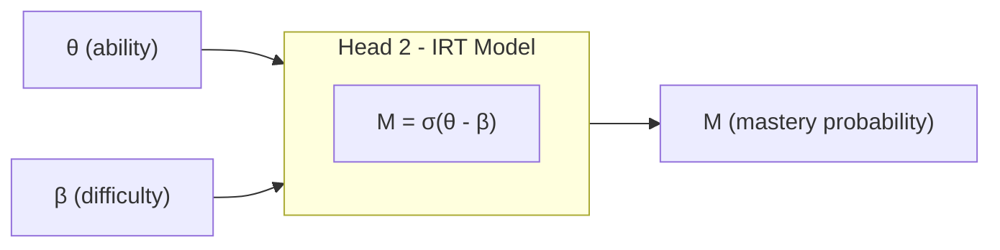

# iKT2 To-Be

In the curent ikt2 model design, described in `ikt2_asis.md`, **interpretability is measured in terms of alignment between Heads**, i.e. the system is guided towards parameter values (such as theta and beta when we set IRT as the reference model), that are aligend with performance predictions instead of be aligned with values precribed by the reference model. 

We want a new model version where the parameters values are guided towards consitency with the reference theoretical model. To this end we will define different loss functions.  


# Approach based on consistency with a reference theoretical model

## Scientific Foundation

The approach is grounded in **construct validity** from psychometric theory: if Head 2's latent factors (θ, β) truly represent student ability and skill difficulty as defined by IRT, they must satisfy the theoretical relationship established by the Rasch model.

**Why this approach is scientifically sound:**

1. **Theoretical Grounding**: Item Response Theory (IRT) has 60+ years of empirical validation in educational measurement. The Rasch model P(correct) = σ(θ - β) is not arbitrary—it has demonstrated robust predictive validity across diverse educational contexts and has well-established psychometric properties.

2. **Construct Validity through Convergence**: By ensuring that Head 2's learned factors (θ_learned, β_learned) align with IRT-calibrated values (θ_IRT, β_IRT), we establish **convergent validity**—the learned representations converge with an independent, theory-based measurement of the same constructs. This provides empirical evidence that the neural network's latent factors are not arbitrary embeddings but meaningful educational constructs.

3. **Falsifiability**: The approach is scientifically testable. If the learned factors fail to align with IRT calibrations (low correlation, high MSE), this would indicate that either:
   - The neural network is learning different constructs (lack of construct validity), or
   - The IRT model is inappropriate for the data (model misspecification)
   
   Either outcome provides actionable scientific insight, making the approach falsifiable in the Popperian sense.

4. **Nomological Network**: IRT factors exist within a **nomological network**—a system of theoretically-specified relationships. Student ability θ should:
   - Increase with practice (learning effect)
   - Correlate with observable performance
   - Predict difficulty-dependent success rates
   
   By grounding Head 2 in IRT, we inherit these theoretical constraints, ensuring that learned factors behave in educationally meaningful ways.

5. **Incremental Validity**: The approach provides **incremental validity** over pure black-box models. While l_bce optimizes predictive accuracy, l_21 and l_23 ensure that predictions arise from interpretable, theory-consistent mechanisms. This allows us to answer not just "what will the student do?" but "why?"—attributing predictions to ability-difficulty relationships.

## Loss Formulation

In Head 2, we measure consistency with the reference theoretical model through three losses:

1) **Performance alignment** (l_21): Head 2 mastery prediction (mastery_irt) <-> IRT precalculated performance probability (BCE)
2) **Difficulty regularization** (l_22): Head 2 beta value <-> IRT precalculated difficulty (MSE)
3) **Ability alignment** (l_23): Head 2 theta value <-> IRT precalculated ability (MSE)

**Combined loss:**
```
L = (1-λ) × l_bce + c × l_22 + λ × (l_21 + l_23)
```

**Key insight:** l_22 is **not** controlled by λ because it serves a different purpose:
- **l_22 (difficulty regularization)**: Always active, prevents drift from pre-calibrated β values (stability constraint)
- **l_21, l_23 (interpretability alignment)**: Controlled by λ, trades off with performance (interpretability objective)

**Why β regularization should be active even when interpretability is not prioritized:**
1. **β is pre-calibrated**: These are stable, dataset-level properties derived from IRT calibration that shouldn't drift during training
2. **Prevents mode collapse**: Without β anchoring, the model might learn degenerate solutions where difficulty embeddings collapse to arbitrary values
3. **Different purpose**: β regularization is about **stability/validity** of the model, not about the interpretability trade-off—it ensures the model remains theoretically grounded regardless of λ

**Parameters:**
- **λ ∈ [0,1]**: Single interpretability trade-off parameter
  - λ = 0: Pure performance optimization (l_bce) + difficulty stability (c×l_22)
  - λ = 1: Full IRT consistency enforcement (all alignment losses active)
  - Can follow warm-up schedule (starting low, gradually increasing)
  
- **c**: Fixed difficulty regularization weight (independent of λ)
  - Suggested value: c = 0.01 (gentle regularization, always active)
  - Rationale: β values are pre-calibrated from IRT and should remain stable throughout training, regardless of interpretability priority
  - Purpose: Prevents mode collapse and maintains consistency with dataset-level difficulty calibration
  
**Design Rationale:**
- **Separation of concerns**: 
  - Difficulty regularization (c×l_22) is about **validity/stability** of pre-calibrated anchors
  - Interpretability alignment (λ×(l_21 + l_23)) is about **learning theory-consistent factors**
- **Single parameter for analysis**: λ controls the performance-interpretability trade-off for Pareto curves
- **Always-on regularization**: Even when λ = 0 (pure performance mode), l_22 keeps β values anchored to IRT calibration

## Rationale

We aim to infer factor values (θ, β) that are consistent with the theoretical model. Beta values (skill difficulties) are pre-calibrated from the dataset and represent stable item properties. Therefore:

- **l_22 acts as an always-on regularization**: Prevents β from drifting away from pre-calibrated values, maintaining theoretical validity
- **l_21 and l_23 are interpretability objectives**: Controlled by λ to balance performance vs theory-consistent factor learning

If we imagine Head 2 as a box trying to replicate the theoretical model, then we need to replicate both the box (the IRT formula) and its inputs (θ, β). However, β is pre-calibrated and should be treated as a stability constraint, while θ and performance predictions are dynamically learned and controlled by the interpretability parameter λ. 



## Hypotheses for Construct Validity (Loss-Based Formulation)

To demonstrate that Head 2's learned factors represent valid IRT constructs, we formulate hypotheses in terms of **actionable alignment losses** that both validate constructs and steer the system toward theory-consistent states.

### Minimal Validation Set (3 Hypotheses)

---

### H1: Factor Alignment (via l_22 and l_23)

**Hypothesis**: Minimizing alignment losses l_22 and l_23 drives learned factors toward IRT-calibrated values, establishing convergent validity.

**Loss Formulation**:
```
l_22 = MSE(β_learned, β_IRT)  # Difficulty alignment
l_23 = MSE(θ_learned, θ_IRT)  # Ability alignment
```

**Validation Criterion**: 
- l_22 < 0.10 (low MSE between learned and IRT difficulties)
- l_23 < 0.15 (low MSE between learned and IRT abilities, slightly higher threshold due to temporal dynamics)

**Interpretation**: 
- Low l_22 → β_learned ≈ β_IRT → model learns correct difficulty ordering
- Low l_23 → θ_learned ≈ θ_IRT → model learns ability values consistent with psychometric calibration

**Actionable**: These losses directly optimize alignment during training. If validation fails (high MSE), increase λ₂ or λ weights in combined loss.

---

### H2: Predictive Consistency (via l_21)

**Hypothesis**: Minimizing l_21 ensures Head 2's IRT-based predictions match reference IRT model, validating that the learned IRT mechanism is functionally equivalent to theory.

**Loss Formulation**:
```
l_21 = BCE(M_IRT, M_ref)

where:
  M_IRT = σ(θ_learned - β_learned)  # Head 2's prediction
  M_ref = σ(θ_IRT - β_IRT)          # Reference IRT prediction
```

**Validation Criterion**: 
- l_21 < 0.15 (low cross-entropy between Head 2 and reference IRT)

**Interpretation**: Low l_21 means that even if individual factors have small errors, their **combination through the IRT formula** produces correct predictions. This validates the entire IRT mechanism, not just individual components.

**Actionable**: Directly optimizable. If l_21 remains high despite low l_22/l_23, this indicates formula misapplication (implementation bug) rather than alignment failure.

---

### H3: Integration Validation (monitoring val_heads_corr)

**Hypothesis**: Head 1 (data-driven) and Head 2 (theory-driven) produce compatible predictions when alignment losses are minimized, confirming successful integration of performance and interpretability.

**Metric** (monitoring, not directly optimized):
```
val_heads_corr = corr(p_correct, M_IRT) > 0.85
```

**Interpretation**: High correlation emerges as a consequence of minimizing L_align = MSE(p_correct, M_IRT) in Phase 2. This validates that:
- Head 1 learns predictive patterns compatible with IRT theory
- Head 2 produces interpretable estimates that preserve predictive power
- The dual-head architecture successfully balances accuracy and interpretability

**Not Directly Actionable**: This is an emergent property, not an optimization target. If correlation is low despite low alignment losses, it indicates architectural issues (e.g., insufficient model capacity).

---

## Training and Validation Protocol

### Training Approach (Single-Phase with Warm-Up)

Train with difficulty regularization always active and interpretability alignment ramping up via λ warm-up:

```
L(epoch) = (1 - λ(epoch)) × l_bce + c × l_22 + λ(epoch) × (l_21 + l_23)

where:
  λ(epoch) = λ_target × min(1, epoch / warmup_epochs)
  
Parameters:
  - λ_target: Target interpretability weight (e.g., 0.5)
  - warmup_epochs: Number of epochs to reach λ_target (e.g., 50)
  - c: Fixed constant = 0.01 (always active)
```

**Rationale for Single-Phase:**
- **l_22 (difficulty regularization)**: Always active from epoch 0 to maintain β stability
- **l_21, l_23 (interpretability alignment)**: Gradually introduced via λ warm-up
- No need for sequential phases since difficulty regularization serves a different purpose (stability vs interpretability)
- Simpler implementation and easier to analyze for Pareto curves

**Warm-Up Benefits:**
- **Early epochs (λ ≈ 0)**: 
  - Model focuses on predictive performance (l_bce)
  - Difficulty values stay anchored to IRT calibration (c×l_22)
- **Middle epochs**: 
  - Gradually introduces ability and performance alignment (l_21, l_23)
- **Late epochs (λ = λ_target)**: 
  - Full balance between performance and interpretability
  - Difficulty regularization continues to prevent drift

### Validation Protocol

**Per-Epoch Validation:**
1. **Compute all metrics** on validation set:
   - l_22, l_23, l_21 (alignment losses)
   - val_heads_corr (Pearson correlation between heads)
   - val_auc, val_acc (performance metrics)

2. **Track convergence**:
   - Monitor l_22, l_23, l_21 trajectories
   - Check if thresholds are approached
   - Observe performance-interpretability trade-off

**Final Validation (After Training):**
1. **Check success criterion**:
   ```
   ✅ Valid IRT Constructs ⟺ (l_22 < 0.10) ∧ (l_23 < 0.15) ∧ (l_21 < 0.15) ∧ (val_heads_corr > 0.85)
   ```

2. **If criterion fails**:
   - Increase λ_target and retrain
   - Check for implementation bugs if l_21 high but l_22/l_23 low
   - Consider architectural modifications if val_heads_corr low despite low alignment losses

### Pareto Analysis (Multiple Runs)

To trace the performance-interpretability trade-off curve:

1. **Run experiments with different λ_target values**:
   - λ_target ∈ {0.0, 0.1, 0.2, 0.3, 0.4, 0.5, 0.6, 0.7, 0.8, 0.9, 1.0}
   - Keep all other hyperparameters fixed (c = 0.01, warmup_epochs = 50)
   - Note: Even at λ_target = 0.0, l_22 remains active for difficulty stability

2. **For each run, record**:
   - Performance: val_auc, val_acc
   - Interpretability: l_22, l_23, l_21, val_heads_corr
   
3. **Plot Pareto curve**:
   - X-axis: Mean alignment loss = (l_22 + l_23 + l_21) / 3
   - Y-axis: val_auc
   - Each point represents one λ_target value

4. **Identify optimal λ_target**:
   - Sweet spot: Highest val_auc while meeting validity thresholds
   - Report as: "Model achieves X% AUC with valid IRT constructs (λ = Y)"

**Scientific Justification**:
- **H1 (l_22, l_23)**: Establishes convergent validity—learned factors align with independent psychometric calibration
- **H2 (l_21)**: Establishes predictive validity—the IRT mechanism is correctly implemented
- **H3 (val_heads_corr)**: Establishes integration—accuracy and interpretability are compatible

**Why This is Sufficient**:
1. **Construct Validity**: H1 proves the factors are psychometrically grounded
2. **Functional Validity**: H2 proves the IRT formula works correctly with learned factors
3. **Architectural Validity**: H3 proves the dual-head design achieves its goals

Additional hypotheses (learning progression, factor independence) are **theoretical expectations** that provide additional confidence but are not strictly necessary for construct validation. The minimal set directly tests whether Head 2 implements valid IRT constructs through actionable, optimizable losses.

 