# iKT3

The architecture of ikT3 is designed to guide the model towards states that are consistent with educational theoretical models. 

## Architecture 


## Loss Formulation

In Head 2, we measure consistency with the reference theoretical model through three losses:

1) **Prediction alignment** (l_21): Head 2 mastery prediction (mastery_irt) <-> IRT precalculated performance probability (BCE)
2) **Difficulty regularization** (l_22): Head 2 beta value <-> IRT precalculated difficulty (MSE)
3) **Ability alignment** (l_23): Head 2 theta value <-> IRT precalculated ability (MSE)

**Combined loss:**
```
L = (1-λ) × l_bce + c × l_22 + λ × (l_21 + l_23)
```

**Key insight:** l_22 is **not** controlled by λ because it serves a different purpose:
- **l_22 (difficulty regularization)**: Always active, prevents drift from pre-calibrated β values (stability constraint)
- **l_21, l_23 (interpretability alignment)**: Controlled by λ, trades off with performance (interpretability objective)

**Why β regularization should be active even when interpretability is not prioritized:**
1. **β is pre-calibrated**: These are stable, dataset-level properties derived from IRT calibration that shouldn't drift during training
2. **Prevents mode collapse**: Without β anchoring, the model might learn degenerate solutions where difficulty embeddings collapse to arbitrary values
3. **Different purpose**: β regularization is about **stability/validity** of the model, not about the interpretability trade-off—it ensures the model remains theoretically grounded regardless of λ

**Parameters:**
- **λ ∈ [0,1]**: Single interpretability trade-off parameter
  - λ = 0: Pure performance optimization (l_bce) + difficulty stability (c×l_22)
  - λ = 1: Full IRT consistency enforcement (all alignment losses active)
  - Can follow warm-up schedule (starting low, gradually increasing)
  
- **c**: Fixed difficulty regularization weight (independent of λ)
  - Suggested value: c = 0.01 (gentle regularization, always active)
  - Rationale: β values are pre-calibrated from IRT and should remain stable throughout training, regardless of interpretability priority
  - Purpose: Prevents mode collapse and maintains consistency with dataset-level difficulty calibration
  
**Design Rationale:**
- **Separation of concerns**: 
  - Difficulty regularization (c×l_22) is about **validity/stability** of pre-calibrated anchors
  - Interpretability alignment (λ×(l_21 + l_23)) is about **learning theory-consistent factors**
- **Single parameter for analysis**: λ controls the performance-interpretability trade-off for Pareto curves
- **Always-on regularization**: Even when λ = 0 (pure performance mode), l_22 keeps β values anchored to IRT calibration

## Rationale

We aim to infer factor values (θ, β) that are consistent with the theoretical model. Beta values (skill difficulties) are pre-calibrated from the dataset and represent stable item properties. Therefore:

- **l_22 acts as an always-on regularization**: Prevents β from drifting away from pre-calibrated values, maintaining theoretical validity
- **l_21 and l_23 are interpretability objectives**: Controlled by λ to balance performance vs theory-consistent factor learning

If we imagine Head 2 as a box trying to replicate the theoretical model, then we need to replicate both the box (the IRT formula) and its inputs (θ, β). However, β is pre-calibrated and should be treated as a stability constraint, while θ and performance predictions are dynamically learned and controlled by the interpretability parameter λ. 

```mermaid
graph LR
    theta["θ (ability)"] --> IRT
    beta["β (difficulty)"] --> IRT
    
    subgraph IRT["Head 2 - IRT Model"]
        formula["M = σ(θ - β)"]
    end
    
    IRT --> M["M (mastery probability)"]
```



## Hypotheses for Construct Validity (Loss-Based Formulation)

To demonstrate that Head 2's learned factors represent valid IRT constructs, we formulate hypotheses in terms of **actionable alignment losses** that both validate constructs and steer the system toward theory-consistent states.

### Minimal Validation Set (3 Hypotheses)

---

### H1: Factor Alignment (via l_22 and l_23)

**Hypothesis**: Minimizing alignment losses l_22 and l_23 drives learned factors toward IRT-calibrated values, establishing convergent validity.

**Loss Formulation**:
```
l_22 = MSE(β_learned, β_IRT)  # Difficulty alignment
l_23 = MSE(θ_learned, θ_IRT)  # Ability alignment
```

**Validation Criterion**: 
- l_22 < 0.10 (low MSE between learned and IRT difficulties)
- l_23 < 0.15 (low MSE between learned and IRT abilities, slightly higher threshold due to temporal dynamics)

**Interpretation**: 
- Low l_22 → β_learned ≈ β_IRT → model learns correct difficulty ordering
- Low l_23 → θ_learned ≈ θ_IRT → model learns ability values consistent with psychometric calibration

**Actionable**: These losses directly optimize alignment during training. If validation fails (high MSE), increase λ₂ or λ weights in combined loss.

---

### H2: Predictive Consistency (via l_21)

**Hypothesis**: Minimizing l_21 ensures Head 2's IRT-based predictions match reference IRT model, validating that the learned IRT mechanism is functionally equivalent to theory.

**Loss Formulation**:
```
l_21 = BCE(M_IRT, M_ref)

where:
  M_IRT = σ(θ_learned - β_learned)  # Head 2's prediction
  M_ref = σ(θ_IRT - β_IRT)          # Reference IRT prediction
```

**Validation Criterion**: 
- l_21 < 0.15 (low cross-entropy between Head 2 and reference IRT)

**Interpretation**: Low l_21 means that even if individual factors have small errors, their **combination through the IRT formula** produces correct predictions. This validates the entire IRT mechanism, not just individual components.

**Actionable**: Directly optimizable. If l_21 remains high despite low l_22/l_23, this indicates formula misapplication (implementation bug) rather than alignment failure.

---

### H3: Integration Validation (monitoring val_heads_corr)

**Hypothesis**: Head 1 (data-driven) and Head 2 (theory-driven) produce compatible predictions when alignment losses are minimized, confirming successful integration of performance and interpretability.

**Metric** (monitoring, not directly optimized):
```
val_heads_corr = corr(p_correct, M_IRT) > 0.85
```

**Interpretation**: High correlation emerges as a consequence of minimizing L_align = MSE(p_correct, M_IRT) in Phase 2. This validates that:
- Head 1 learns predictive patterns compatible with IRT theory
- Head 2 produces interpretable estimates that preserve predictive power
- The dual-head architecture successfully balances accuracy and interpretability

**Not Directly Actionable**: This is an emergent property, not an optimization target. If correlation is low despite low alignment losses, it indicates architectural issues (e.g., insufficient model capacity).

---

## Implementation Strategy

### Overview: Current Implementation Status

iKT3 has been implemented as a **new standalone model** with pluggable reference model architecture. The implementation follows the design principle of separating the neural architecture from theoretical grounding, allowing multiple reference models (IRT, BKT, future models) to be used interchangeably.

**Implementation Status:** ✅ **COMPLETE** for IRT reference model

**Key Files:**
- `pykt/models/ikt3.py` - Core model implementation
- `pykt/reference_models/base.py` - Abstract reference model interface
- `pykt/reference_models/irt_reference.py` - IRT reference implementation
- `examples/train_ikt3.py` - Training script with warm-up schedule
- `examples/eval_ikt3.py` - Evaluation with correlation diagnostics
- `examples/compute_irt_extended_targets.py` - IRT target generation

---

### 1. Reference Model Architecture (Implemented)

#### Abstract Base Class (`pykt/reference_models/base.py`)

Defines the interface for all reference models:

```python
class ReferenceModel(ABC):
    def __init__(self, model_name: str, num_skills: int)
    
    @abstractmethod
    def load_targets(self, targets_path: str) -> Dict[str, torch.Tensor]:
        """Load pre-computed reference targets from file"""
    
    @abstractmethod
    def compute_alignment_losses(
        self, 
        model_outputs: Dict[str, torch.Tensor],
        targets: Dict[str, torch.Tensor],
        lambda_weights: Dict[str, float]
    ) -> Dict[str, torch.Tensor]:
        """Compute model-specific alignment losses"""
    
    @abstractmethod
    def get_loss_names(self) -> List[str]:
        """Return list of loss component names for logging"""
    
    @abstractmethod
    def get_interpretable_factors(
        self, 
        model_outputs: Dict[str, torch.Tensor]
    ) -> Dict[str, torch.Tensor]:
        """Extract interpretable factors for validation"""
```

**Design Benefits:**
- Single interface for all reference models
- Clean separation of concerns
- Easy to add new reference models (2-3 days per model)
- Enables A/B testing between different theoretical groundings

---

### 2. IRT Reference Model (Implemented)

#### Implementation: `pykt/reference_models/irt_reference.py`

**Initialization:**
```python
class IRTReferenceModel(ReferenceModel):
    def __init__(self, num_skills: int):
        super().__init__("IRT", num_skills)
```

#### Target Loading

Loads pre-computed IRT calibration from pickle file:

```python
def load_targets(self, targets_path: str) -> Dict[str, torch.Tensor]:
    """
    Loads:
    - beta_irt: [num_skills] - IRT-calibrated skill difficulties
    - theta_irt: {uid: float} - Student abilities (dict)
    - m_ref: {uid: [seq_len]} - Reference predictions σ(θ - β)
    - metadata: Dataset information
    """
```

**Target File Structure:**
```python
{
    'skill_difficulties': {0: β_0, 1: β_1, ..., 99: β_99},  # IRT difficulties
    'student_abilities': {uid_0: θ_0, uid_1: θ_1, ...},     # Student abilities
    'reference_predictions': {uid_0: [M_0, M_1, ...], ...}, # σ(θ - β) sequences
    'metadata': {
        'num_skills': 100,
        'num_students': 15426,
        'num_sequences': 12220,
        'theta_mean': -0.015,
        'theta_std': 1.023,
        'beta_mean': 0.002,
        'beta_std': 0.987
    }
}
```

#### Loss Computation

**Three alignment losses computed:**

1. **l_21 (Performance Alignment):**
```python
l_21 = F.binary_cross_entropy(
    model_outputs['mastery_irt'],  # Model's σ(θ_learned - β_learned)
    targets['m_ref'],               # Reference σ(θ_IRT - β_IRT)
    reduction='mean'
)
```

**What it measures:** Prediction consistency between learned and reference IRT models

**Success threshold:** l_21 < 0.15

2. **l_22 (Difficulty Regularization):**
```python
# Extract IRT difficulties for specific skills in batch
beta_irt_full = targets['beta_irt']     # [num_skills] all difficulties
questions = model_outputs['questions']   # [B, L] skill indices
beta_irt_batch = beta_irt_full[questions]  # [B, L] batch-specific

l_22 = F.mse_loss(
    model_outputs['beta_learned'],  # Learned embeddings [B, L]
    beta_irt_batch,                 # Reference difficulties [B, L]
    reduction='mean'
)
```

**What it measures:** How well learned difficulty embeddings match IRT calibration

**Success threshold:** l_22 < 0.10

3. **l_23 (Ability Alignment):**
```python
# Average student ability over sequence for MSE
theta_learned_mean = model_outputs['theta_t'].mean(dim=1)  # [B]
theta_irt_batch = torch.stack([
    targets['theta_irt'][uid] for uid in batch_uids
])  # [B]

l_23 = F.mse_loss(
    theta_learned_mean,
    theta_irt_batch,
    reduction='mean'
)
```

**What it measures:** How well learned ability estimates match IRT calibration

**Success threshold:** l_23 < 0.15

**Combined Output:**
```python
return {
    'l_21_performance': l_21,
    'l_22_difficulty': l_22,
    'l_23_ability': l_23,
    'l_align_total': l_21 + l_23  # For λ weighting in total loss
}
```

#### Interpretable Factor Extraction

```python
def get_interpretable_factors(self, model_outputs):
    return {
        'theta': model_outputs['theta_t'],      # [B, L] ability trajectories
        'beta': model_outputs['beta_k'],        # [B, L] difficulty values
        'mastery': model_outputs['mastery_irt'] # [B, L] IRT predictions
    }
```

Used for:
- Validation metrics (correlation with reference)
- Visualization and interpretation
- Case study analysis

---

### 3. IRT Target Generation (Implemented)

#### Script: `examples/compute_irt_extended_targets.py`

**Purpose:** Pre-compute IRT calibration targets for training

**Process:**

1. **Load Existing Rasch Difficulties:**
```python
# From rasch_test_iter300.pkl (already calibrated)
skill_difficulties = {0: β_0, 1: β_1, ..., 99: β_99}
```

2. **Compute Student Abilities:**

Uses simplified IRT calibration on train + validation data:

```python
For each student i:
    interactions = [(question_j, response_ij), ...]
    
    # Estimate θ via maximum likelihood
    θ_i = mean(logit(response_ij) + β_j) over all interactions
    
    # Alternative: Use proper MLE with optimization
    θ_i = argmax_θ ∏_j P(response_ij | θ, β_j)
```

**Current implementation:** Uses averaging method for computational efficiency

3. **Generate Reference Predictions:**

For each student-question pair:
```python
M_ref[i, j] = σ(θ_i - β_j)  # Rasch 1PL formula
```

4. **Save Extended Targets:**
```bash
python examples/compute_irt_extended_targets.py \
    --dataset assist2015 \
    --fold 0 \
    --rasch_path data/assist2015/rasch_test_iter300.pkl \
    --output_path data/assist2015/irt_extended_targets_fold0.pkl
```

**Output:** `irt_extended_targets_fold0.pkl` with structure shown above

**Status:** ✅ Generated for ASSIST2015 fold 0, ready for all folds

---

### 4. Model Architecture (Implemented)

#### Core Model: `pykt/models/ikt3.py`

**Key Components:**

1. **Initialization with Reference Model Type:**
```python
class iKT3(nn.Module):
    def __init__(
        self,
        num_c, seq_len, d_model, n_heads, num_encoder_blocks,
        d_ff, dropout, emb_type,
        reference_model_type='irt'  # Determines head architecture
    ):
        # Shared encoder (same as iKT2)
        self._init_embeddings()
        self._init_encoder()
        
        # Head 1: Performance prediction (BCE)
        self._init_performance_head()
        
        # Head 2: Reference-model-specific (IRT, BKT, etc.)
        if reference_model_type == 'irt':
            self._init_irt_heads()
        elif reference_model_type == 'bkt':
            self._init_bkt_heads()  # Future
        
        self.reference_model = None  # Injected later
        self.reference_model_type = reference_model_type
```

2. **IRT Head Initialization:**
```python
def _init_irt_heads(self, d_ff, dropout):
    # Ability encoder: h → θ
    self.ability_encoder = nn.Sequential(
        nn.Linear(self.d_model, d_ff),
        nn.ReLU(),
        nn.Dropout(dropout),
        nn.Linear(d_ff, 1)
    )
    
    # Difficulty embeddings: skill_id → β
    self.skill_difficulty_emb = nn.Embedding(self.num_c, 1)
    nn.init.constant_(self.skill_difficulty_emb.weight, 0.0)  # Neutral init
```

3. **Forward Pass (IRT-specific):**
```python
def _forward_irt(self, h, v, qry):
    """
    Args:
        h: Knowledge state [B, L, d_model]
        v: Value state [B, L, d_model]
        qry: Query questions [B, L]
    
    Returns:
        Dictionary with predictions and interpretable factors
    """
    # Extract ability from knowledge state
    theta_t = self.ability_encoder(h).squeeze(-1)  # [B, L]
    
    # Extract difficulty embeddings
    beta_k = self.skill_difficulty_emb(qry).squeeze(-1)  # [B, L]
    
    # IRT formula
    mastery_irt = torch.sigmoid(theta_t - beta_k)  # [B, L]
    
    # Performance prediction (Head 1)
    combined = torch.cat([h, v, self.question_emb(qry)], dim=-1)
    logits = self.performance_head(combined).squeeze(-1)
    bce_predictions = torch.sigmoid(logits)
    
    return {
        'logits': logits,
        'bce_predictions': bce_predictions,
        'mastery_irt': mastery_irt,
        'theta_t': theta_t,
        'beta_k': beta_k,
        'beta_learned': self.skill_difficulty_emb.weight.squeeze(),
        'questions': qry
    }
```

4. **Loss Computation (Delegated to Reference Model):**
```python
def compute_loss(
    self, 
    output, 
    targets, 
    ref_targets, 
    lambda_interp, 
    lambda_reg
):
    """
    L = (1-λ) × l_bce + c × l_22 + λ × (l_21 + l_23)
    """
    # Performance loss
    l_bce = F.binary_cross_entropy_with_logits(
        output['logits'], 
        targets
    )
    
    # Reference model alignment losses
    alignment_losses = self.reference_model.compute_alignment_losses(
        model_outputs=output,
        targets=ref_targets,
        lambda_weights={'lambda_interp': lambda_interp}
    )
    
    # Extract components
    l_stability = alignment_losses['l_22_difficulty']  # IRT
    l_align_total = alignment_losses['l_align_total']  # l_21 + l_23
    
    # Combined loss
    total_loss = (
        (1 - lambda_interp) * l_bce +
        lambda_reg * l_stability +
        lambda_interp * l_align_total
    )
    
    return {
        'total_loss': total_loss,
        'l_bce': l_bce,
        **alignment_losses
    }
```

---

### 5. Training Script (Implemented)

#### Script: `examples/train_ikt3.py`

**Key Features:**

1. **Reference Model Injection:**
```python
from pykt.reference_models import create_reference_model

# Create model
model = iKT3(
    num_c=num_skills,
    reference_model_type=args.reference_model  # 'irt'
)

# Inject reference model
ref_model = create_reference_model(args.reference_model, num_skills)
model.set_reference_model(ref_model)

# Load reference targets
ref_targets = ref_model.load_targets(args.reference_targets_path)
```

2. **Lambda Warm-up Schedule:**
```python
def get_lambda_interp(epoch, lambda_target, warmup_epochs):
    """
    Gradual warm-up: λ(epoch) = λ_target × min(1, epoch / warmup_epochs)
    
    Example: λ_target = 0.5, warmup = 50
    - Epoch 1: λ = 0.01 (2%)
    - Epoch 25: λ = 0.25 (50%)
    - Epoch 50: λ = 0.50 (100%)
    - Epoch 60: λ = 0.50 (capped)
    """
    return lambda_target * min(1.0, epoch / warmup_epochs)
```

3. **Training Loop:**
```python
for epoch in range(1, epochs + 1):
    lambda_current = get_lambda_interp(epoch, lambda_target, warmup_epochs)
    
    for batch in train_loader:
        # Prepare batch-specific reference targets
        batch_ref_targets = prepare_batch_ref_targets(
            batch, ref_targets, device
        )
        
        # Forward pass
        outputs = model(q, r, qry)
        
        # Compute loss
        loss_dict = model.compute_loss(
            output=outputs,
            targets=targets,
            ref_targets=batch_ref_targets,
            lambda_interp=lambda_current,
            lambda_reg=c_stability_reg
        )
        
        # Backward
        loss_dict['total_loss'].backward()
        optimizer.step()
```

4. **Metrics Logging:**
```python
# CSV tracking
metrics_epoch.csv:
    epoch, lambda_interp, 
    train_loss, train_auc, train_acc,
    val_loss, val_auc, val_acc,
    val_l_bce, val_l_stability, val_l_align_total,
    val_l_21_performance, val_l_22_difficulty, val_l_23_ability,
    val_theta_mean, val_theta_std,
    val_mastery_mean, val_mastery_std

metrics_valid.csv:
    split, auc, acc, 
    l_21_performance, l_22_difficulty, l_23_ability
```

**Status:** ✅ Fully implemented and tested

---

### 6. Evaluation Script (Implemented)

#### Script: `examples/eval_ikt3.py`

**Key Features:**

1. **Comprehensive Metrics:**
```python
def evaluate_model(model, test_loader, ref_targets, device):
    metrics = {
        # Performance
        'auc': ...,
        'acc': ...,
        
        # Alignment losses
        'l_21_performance': ...,
        'l_22_difficulty': ...,
        'l_23_ability': ...,
        
        # Factor statistics
        'theta_mean': ...,
        'theta_std': ...,
        'theta_min': ...,
        'theta_max': ...,
        'mastery_mean': ...,
        'mastery_std': ...,
        
        # Correlations (DIAGNOSTIC)
        'mastery_prediction_pearson': ...,   # M_IRT vs M_ref
        'mastery_prediction_spearman': ...,
        'theta_pearson': ...,                # θ_learned vs θ_IRT
        'beta_pearson': ...                  # β_learned vs β_IRT
    }
```

2. **Correlation Diagnostic (NEW):**
```python
# Critical for diagnosing l_21 paradox
mastery_irt_arr = np.array(all_mastery_irt)
mastery_ref_arr = np.array(all_mastery_ref)

# Remove NaN/inf
valid_mask = np.isfinite(mastery_irt_arr) & np.isfinite(mastery_ref_arr)
mastery_irt_clean = mastery_irt_arr[valid_mask]
mastery_ref_clean = mastery_ref_arr[valid_mask]

# Compute correlations
pearson_corr, _ = pearsonr(mastery_irt_clean, mastery_ref_clean)
spearman_corr, _ = spearmanr(mastery_irt_clean, mastery_ref_clean)

print(f"Mastery Prediction Correlation")
print(f"Pearson:  {pearson_corr:.4f}")
print(f"Spearman: {spearman_corr:.4f}")

# Interpretation:
# - corr > 0.85: Good alignment, l_21 issue is scale/offset
# - corr 0.5-0.85: Partial alignment, needs more training
# - corr < 0.5: Fundamental disagreement, architecture issue
```

3. **Success Criteria Check:**
```python
def check_success_criteria(metrics, reference_model_type):
    if reference_model_type == 'irt':
        criteria = {
            'l_21_performance': {
                'value': metrics['l_21_performance'],
                'threshold': 0.15,
                'passed': metrics['l_21_performance'] < 0.15
            },
            'l_22_difficulty': {
                'value': metrics['l_22_difficulty'],
                'threshold': 0.10,
                'passed': metrics['l_22_difficulty'] < 0.10
            },
            'l_23_ability': {
                'value': metrics['l_23_ability'],
                'threshold': 0.15,
                'passed': metrics['l_23_ability'] < 0.15
            },
            'mastery_correlation': {
                'value': metrics.get('mastery_prediction_pearson', 0.0),
                'threshold': 0.85,
                'passed': metrics.get('mastery_prediction_pearson', 0.0) > 0.85
            }
        }
        
        overall = all(c['passed'] for c in criteria.values())
        criteria['overall'] = overall
        
    return criteria
```

**Status:** ✅ Fully implemented with correlation diagnostics

---

### 7. Current Implementation Gaps

#### Implemented ✅
- IRT reference model with all three alignment losses
- Pluggable reference model architecture (base class)
- Target generation for IRT (extended targets)
- Training with lambda warm-up
- Evaluation with correlation diagnostics
- Reproducibility framework integration

#### Not Yet Implemented ⏳
- BKT reference model implementation
- BKT target generation script
- DINA, PFA, AFM reference models (future)
- Hybrid reference models
- Multi-reference comparison tools

#### Known Issues 🐛
- **Alignment Paradox:** Low MSE (l_22, l_23) but high BCE (l_21) with low correlation
  - Root cause: Insufficient training (λ only 60% of warm-up) + weak regularization (c = 0.01)
  - Solution: Train 60+ epochs with c = 0.1
  - See "Observed Problem" section for details

---

### 8. Usage Example

**Complete workflow:**

```bash
# 1. Generate IRT targets
python examples/compute_irt_extended_targets.py \
    --dataset assist2015 \
    --fold 0 \
    --rasch_path data/assist2015/rasch_test_iter300.pkl \
    --output_path data/assist2015/irt_extended_targets_fold0.pkl

# 2. Train model
python examples/run_repro_experiment.py \
    --model ikt3 \
    --dataset assist2015 \
    --fold 0 \
    --reference_model irt \
    --reference_targets_path data/assist2015/irt_extended_targets_fold0.pkl \
    --epochs 60 \
    --lambda_target 0.5 \
    --warmup_epochs 50 \
    --c_stability_reg 0.1 \
    --short_title "ikt3_irt_v2"

# 3. Evaluate
python examples/eval_ikt3.py \
    --checkpoint experiments/EXPERIMENT_ID/best_model.pt \
    --dataset assist2015 \
    --fold 0 \
    --reference_targets_path data/assist2015/irt_extended_targets_fold0.pkl \
    --batch_size 64
```

**Expected outputs:**
- Training: `metrics_epoch.csv`, `metrics_valid.csv`
- Evaluation: `metrics_test.csv`, `eval_results.json` (with correlations)
- Success if: l_21 < 0.15, l_22 < 0.10, l_23 < 0.15, correlation > 0.85

---

## Pluggable Reference Model Architecture

### Benefits

1. **Scientific Flexibility:**
   - Test multiple theoretical groundings (IRT, BKT, DINA, PFA, etc.)
   - Empirically compare which theory provides best construct validity
   - Enable hybrid approaches (e.g., IRT for difficulty, BKT for learning rates)

2. **Code Reusability:**
   - Single iKT3 model implementation works with all reference models
   - Shared encoder, training loop, evaluation pipeline
   - Only reference-specific logic encapsulated in separate modules

3. **Extensibility:**
   - Add new reference models without modifying iKT3 core
   - Clear interface contract (ReferenceModel ABC)
   - Future models: 2-3 days implementation time

4. **Comparative Analysis:**
   - Direct A/B testing: same architecture, different theoretical constraints
   - Isolates effect of reference model choice
   - Enables meta-analysis: which theories work best for which datasets?

5. **Pedagogical Value:**
   - Demonstrates proper software engineering in ML research
   - Separates concerns: neural architecture vs theoretical grounding
   - Educational tool: shows how different KT theories relate to deep learning

### Future Reference Models (Roadmap)

**Immediate (Phase 1):**
- ✅ **IRT (Rasch)**: 
  - **Parameters**: θ (student ability), β (skill difficulty)
  - **Prediction formula**: M = σ(θ - β)
  - **Alignment losses**: l_21 (performance), l_22 (difficulty), l_23 (ability)
  
- ✅ **BKT (Bayesian Knowledge Tracing)**:
  - **Parameters per skill**: P(L_0) (prior), P(T) (learns), P(S) (slips), P(G) (guesses)
  - **State**: P(L_t) (mastery probability at time t)
  - **Prediction formula**: P(correct) = P(L_t)×(1-P(S)) + (1-P(L_t))×P(G)
  - **Alignment losses**: l_21 (mastery trajectory), l_22 (parameters if learned)

**Short-term (3-6 months):**

- **DINA** (Deterministic Inputs, Noisy "And" gate):
  - **Parameters**:
    - **Q-matrix**: [num_items × num_skills] binary matrix specifying which skills are required for each item
    - **s_j** (slip): Probability of incorrect response when all required skills are mastered
    - **g_j** (guess): Probability of correct response when at least one required skill is not mastered
    - **α_ik**: Binary mastery state (0/1) for student i on skill k
  - **Prediction formula**: 
    - η_ij = ∏_k α_ik^q_jk (conjunctive mastery: student must master ALL skills required by item)
    - P(correct) = (1-s_j)^η_ij × g_j^(1-η_ij)
  - **Interpretable factors**:
    - Binary skill mastery states (discrete, not continuous)
    - Item-level slip/guess rates
    - Q-matrix structure reveals cognitive model
  - **Alignment losses**:
    - l_21: BCE(mastery_states, α_ref) - binary mastery alignment
    - l_22: MSE(slip_learned, s_ref) + MSE(guess_learned, g_ref)
    - l_23: Q-matrix alignment if learned (optional)
  - **Success thresholds**: l_21 < 0.10 (strict for binary), l_22 < 0.15, corr > 0.85
  
- **PFA** (Performance Factor Analysis):
  - **Parameters**:
    - **β_k** (difficulty): Difficulty of skill k (similar to IRT but context-dependent)
    - **γ_k** (learning rate): Gain in logit scale per successful practice of skill k
    - **ρ_k** (decay rate): Penalty in logit scale per failed practice of skill k
    - **m_ik**(successes): Count of successful practices for student i on skill k
    - **n_ik** (failures): Count of failed practices for student i on skill k
  - **Prediction formula**: 
    - logit(P(correct)) = β_k + γ_k×m_ik - ρ_k×n_ik
    - Incorporates practice history explicitly
  - **Interpretable factors**:
    - Skill difficulty (static)
    - Learning curves via γ_k (positive reinforcement)
    - Forgetting/confusion via ρ_k (negative reinforcement)
    - Cumulative practice effects (m_ik, n_ik)
  - **Alignment losses**:
    - l_21: BCE(predictions, PFA_ref) - prediction alignment
    - l_22: MSE(β_learned, β_ref) - difficulty alignment
    - l_23: MSE(γ_learned, γ_ref) + MSE(ρ_learned, ρ_ref) - learning/decay rates
    - l_24: Practice count tracking (optional, for full PFA alignment)
  - **Success thresholds**: l_21 < 0.15, l_22 < 0.10, l_23 < 0.15, corr > 0.85
  - **Note**: Requires tracking success/failure counts per skill per student

**Medium-term (6-12 months):**

- **AFM** (Additive Factor Model):
  - **Parameters**:
    - **β_k** (intercept): Baseline difficulty for skill k
    - **γ_k** (slope): Learning rate for skill k
    - **Q-matrix**: [num_items × num_skills] (can be real-valued, not just binary)
    - **Opportunity count**: Number of practice opportunities per skill
  - **Prediction formula**: 
    - logit(P(correct)) = Σ_k q_jk × (β_k + γ_k × opp_ik)
    - Linear additive effects across multiple skills per item
  - **Interpretable factors**:
    - Multi-skill items: P(correct) depends on combination of skills
    - Skill-specific learning curves
    - Additive assumption: skills contribute independently to performance
  - **Alignment losses**:
    - l_21: BCE(predictions, AFM_ref) - prediction alignment
    - l_22: MSE(β_learned, β_ref) - difficulty alignment per skill
    - l_23: MSE(γ_learned, γ_ref) - learning rate alignment per skill
    - l_24: Q-matrix alignment if learned (regularization to cognitive structure)
  - **Success thresholds**: l_21 < 0.15, l_22 < 0.10, l_23 < 0.15, corr > 0.85
  - **Challenge**: Handling multi-skill items requires aggregation mechanism in Head 2
  
- **DAS3H** (Deep Adaptive Skill Strength Simulator for Hierarchical):
  - **Parameters**:
    - **θ_ik(t)**: Time-varying skill strength for student i on skill k at time t
    - **Transfer matrix T**: [num_skills × num_skills] capturing prerequisite relationships
    - **Decay rates d_k**: Forgetting rate per skill k
    - **β_j**: Item difficulty
    - **Learning gain Δθ**: Skill strength increase from practice
  - **Prediction formula**: 
    - θ_ik(t) = θ_ik(t-1) × e^(-d_k×Δt) + Σ_k' T_kk' × Δθ_k'(success/failure)
    - P(correct) = σ(θ_ik(t) - β_j)
    - Combines IRT-like prediction with temporal dynamics and transfer
  - **Interpretable factors**:
    - Temporal skill decay (forgetting curves)
    - Cross-skill transfer (e.g., algebra helps geometry)
    - Hierarchical skill structure (prerequisites)
    - Time-sensitive predictions (spacing effects)
  - **Alignment losses**:
    - l_21: BCE(predictions, DAS3H_ref) - prediction alignment
    - l_22: MSE(β_learned, β_ref) - difficulty alignment
    - l_23: MSE(θ_learned(t), θ_ref(t)) - skill strength trajectories
    - l_24: MSE(T_learned, T_ref) - transfer matrix (captures cognitive structure)
    - l_25: MSE(d_learned, d_ref) - decay rates
  - **Success thresholds**: l_21 < 0.15, l_22 < 0.10, l_23 < 0.20 (looser for temporal), others < 0.15, corr > 0.85
  - **Challenge**: Requires temporal modeling in encoder; most complex reference model

**Comparison of Parameter Complexity:**

| Reference Model | Static Parameters | Dynamic Parameters | Alignment Losses | Implementation Complexity |
|-----------------|-------------------|-------------------|------------------|---------------------------|
| **IRT** | β (difficulty) | θ (ability) | 3 (l_21, l_22, l_23) | Low |
| **BKT** | prior, learns, slips, guesses | P(L_t) | 2 (l_21, l_22 opt) | Low-Medium |
| **DINA** | Q-matrix, slip, guess | α (binary mastery) | 3 (l_21, l_22, l_23 opt) | Medium |
| **PFA** | β, γ, ρ | m (successes), n (failures) | 4 (l_21, l_22, l_23, l_24 opt) | Medium |
| **AFM** | β, γ, Q-matrix | opp (opportunities) | 4 (l_21, l_22, l_23, l_24 opt) | Medium-High |
| **DAS3H** | β, T, d | θ(t) with decay/transfer | 5 (l_21-l_25) | High |

**Research Extensions:**
- **Hybrid Models**: 
  - Combine IRT difficulty (β) + BKT learning dynamics (P(T), P(S), P(G))
  - Use DINA Q-matrix with continuous skill strengths instead of binary states
  - Parameters: θ, β, Q-matrix, P(T), P(S), P(G)
  
- **Multi-Grain Models**: 
  - IRT at item level, BKT at skill level, DAS3H for long-term retention
  - Different reference models at different time scales
  - Parameters: hierarchical with level-specific constraints
  
- **Student-Adaptive**: 
  - Switch reference model based on learner profile (e.g., DINA for beginners, IRT for advanced)
  - Gating mechanism to select reference model per student
  - Parameters: all reference models + gating weights

### Adding New Reference Models

Each new reference model requires:
1. Implement `ReferenceModel` subclass (150-300 lines) - follow IRT example
2. Create target generation script (adapt `compute_irt_extended_targets.py`)
3. Add to `REFERENCE_MODELS` registry in `__init__.py`
4. Update parameter_default.json with model-specific thresholds
5. Test on standard datasets (2-3 experiments)

**Total effort per new model:** 2-3 days

**Example Implementation Template:**

```python
# pykt/reference_models/new_model_reference.py
class NewModelReferenceModel(ReferenceModel):
    def __init__(self, num_skills: int):
        super().__init__("NewModel", num_skills)
    
    def load_targets(self, targets_path: str) -> Dict[str, torch.Tensor]:
        # Load pre-computed targets
        pass
    
    def compute_alignment_losses(self, model_outputs, targets, lambda_weights):
        # Compute model-specific losses
        return {
            'l_21_<name>': ...,
            'l_22_<name>': ...,
            'l_align_total': ...
        }
    
    def get_loss_names(self) -> List[str]:
        return ['l_21_<name>', 'l_22_<name>']
    
    def get_interpretable_factors(self, model_outputs):
        return {'factor1': ..., 'factor2': ...}
```

**Registration:**
```python
# pykt/reference_models/__init__.py
from .new_model_reference import NewModelReferenceModel

REFERENCE_MODELS = {
    'irt': IRTReferenceModel,
    'new_model': NewModelReferenceModel
}
```

---

## Implementation Plan: Future Reference Models

### Design Principle: Pluggable Reference Models (✅ IMPLEMENTED)

The architecture has been successfully implemented with full pluggability support. Adding new reference models only requires implementing the abstract interface—no changes to core iKT3 code.

**Implemented Components:**

1. **Abstract Reference Model Interface:** ✅ `pykt/reference_models/base.py`
   ```python
   class ReferenceModel(ABC):
       def __init__(self, model_name: str, num_skills: int)
       
       @abstractmethod
       def load_targets(self, targets_path: str) -> Dict[str, torch.Tensor]
       
       @abstractmethod
       def compute_alignment_losses(
           self, model_outputs, targets, lambda_weights
       ) -> Dict[str, torch.Tensor]
       
       @abstractmethod
       def get_loss_names(self) -> List[str]
       
       @abstractmethod
       def get_interpretable_factors(
           self, model_outputs
       ) -> Dict[str, torch.Tensor]
   ```

2. **Model-Specific Implementations:**
   - ✅ `IRTReferenceModel`: Fully implemented with l_21, l_22, l_23
   - ⏳ `BKTReferenceModel`: Planned (3-6 months)
   - ⏳ `DINAReferenceModel`: Planned (6-12 months)
   - ⏳ `PFAReferenceModel`: Planned (6-12 months)

3. **Unified iKT3 Architecture:** ✅ Fully implemented
   - Reference model type specified at initialization
   - Dependency injection pattern for reference model
   - Loss computation fully delegated to reference model
   - No conditional logic in core training loop

**Verified Benefits:**
- ✅ **Extensibility**: Can add BKT without touching iKT3 code
- ✅ **Comparison**: Can A/B test IRT vs future models with same checkpoints
- ✅ **Maintainability**: Each reference model is self-contained module
- ✅ **Scientific Rigor**: Clean separation validated in practice

---

### Phase 1: Data Preparation (✅ COMPLETE for IRT, ⏳ Pending for BKT)

**Goal:** Create standardized target files for multiple reference models with unified interface

**Files to Create:**

1. **`pykt/reference_models/base.py`** - Abstract base class
   ```python
   from abc import ABC, abstractmethod
   
   class ReferenceModel(ABC):
       """Abstract interface for theoretical reference models"""
       
       def __init__(self, model_name: str, num_skills: int):
           self.model_name = model_name
           self.num_skills = num_skills
       
       @abstractmethod
       def load_targets(self, targets_path: str) -> dict:
           """Load pre-computed reference targets"""
           pass
       
       @abstractmethod
       def compute_alignment_losses(self, model_outputs: dict, 
                                     targets: dict, 
                                     lambda_weights: dict) -> dict:
           """Compute alignment losses for this reference model"""
           pass
       
       @abstractmethod
       def get_loss_names(self) -> list:
           """Return list of loss component names"""
           pass
       
       @abstractmethod
       def get_interpretable_factors(self, model_outputs: dict) -> dict:
           """Extract interpretable factors for validation"""
           pass
   ```

2. **`pykt/reference_models/irt_reference.py`** - IRT implementation
   ```python
   class IRTReferenceModel(ReferenceModel):
       """Rasch IRT as reference model for construct validity"""
       
       def __init__(self, num_skills: int):
           super().__init__("IRT", num_skills)
       
       def load_targets(self, targets_path: str) -> dict:
           """Load IRT targets with θ_IRT, β_IRT, M_ref"""
           with open(targets_path, 'rb') as f:
               data = pickle.load(f)
           return {
               'beta_irt': torch.tensor([data['skill_difficulties'][k] 
                                         for k in range(self.num_skills)]),
               'theta_irt': data['student_abilities'],  # dict {uid: θ}
               'm_ref': data['reference_predictions']    # dict {uid: tensor}
           }
       
       def compute_alignment_losses(self, model_outputs, targets, lambda_weights):
           """Compute l_21 (performance), l_22 (difficulty), l_23 (ability)"""
           l_21 = F.binary_cross_entropy(
               model_outputs['mastery_irt'], 
               targets['m_ref']
           )
           l_22 = F.mse_loss(
               model_outputs['beta_learned'], 
               targets['beta_irt']
           )
           l_23 = F.mse_loss(
               model_outputs['theta_learned'], 
               targets['theta_irt']
           )
           return {
               'l_21_performance': l_21,
               'l_22_difficulty': l_22,
               'l_23_ability': l_23,
               'l_align_total': l_21 + l_23  # Combined for λ weighting
           }
       
       def get_loss_names(self):
           return ['l_21_performance', 'l_22_difficulty', 'l_23_ability']
       
       def get_interpretable_factors(self, model_outputs):
           return {
               'theta': model_outputs['theta_t'],
               'beta': model_outputs['beta_k'],
               'mastery': model_outputs['mastery_irt']
           }
   ```

3. **`pykt/reference_models/bkt_reference.py`** - BKT implementation
   ```python
   class BKTReferenceModel(ReferenceModel):
       """Bayesian Knowledge Tracing as reference model"""
       
       def __init__(self, num_skills: int):
           super().__init__("BKT", num_skills)
       
       def load_targets(self, targets_path: str) -> dict:
           """Load BKT targets with P(L_t), parameters"""
           with open(targets_path, 'rb') as f:
               data = pickle.load(f)
           return {
               'bkt_params': data['bkt_params'],      # {skill_id: {prior, learns, slips, guesses}}
               'bkt_mastery': data['bkt_targets'],    # {uid: P(L_t) trajectories}
               'metadata': data['metadata']
           }
       
       def compute_alignment_losses(self, model_outputs, targets, lambda_weights):
           """
           Compute BKT-specific alignment losses:
           - l_21: Mastery trajectory alignment (MSE with P(L_t))
           - l_22: Parameter regularization (prior, learns, slips, guesses)
           """
           # Mastery alignment
           l_21 = F.mse_loss(
               model_outputs['mastery_bkt'],    # Model's P(L_t) estimate
               targets['bkt_mastery']
           )
           
           # Parameter regularization (if model learns BKT parameters)
           if 'bkt_params_learned' in model_outputs:
               l_22 = self._compute_param_regularization(
                   model_outputs['bkt_params_learned'],
                   targets['bkt_params']
               )
           else:
               l_22 = torch.tensor(0.0)
           
           return {
               'l_21_mastery': l_21,
               'l_22_params': l_22,
               'l_align_total': l_21
           }
       
       def get_loss_names(self):
           return ['l_21_mastery', 'l_22_params']
       
       def get_interpretable_factors(self, model_outputs):
           return {
               'mastery_trajectory': model_outputs['mastery_bkt'],
               'learning_rate': model_outputs.get('learns', None),
               'slip_prob': model_outputs.get('slips', None),
               'guess_prob': model_outputs.get('guesses', None)
           }
   ```

4. **`pykt/reference_models/__init__.py`**
   ```python
   from .base import ReferenceModel
   from .irt_reference import IRTReferenceModel
   from .bkt_reference import BKTReferenceModel
   
   REFERENCE_MODELS = {
       'irt': IRTReferenceModel,
       'bkt': BKTReferenceModel
   }
   
   def create_reference_model(model_type: str, num_skills: int) -> ReferenceModel:
       """Factory function for reference models"""
       if model_type not in REFERENCE_MODELS:
           raise ValueError(f"Unknown reference model: {model_type}. "
                           f"Available: {list(REFERENCE_MODELS.keys())}")
       return REFERENCE_MODELS[model_type](num_skills)
   ```

5. **`examples/compute_reference_targets.py`** - Unified target generation
   ```python
   """
   Generate reference model targets for iKT3 training.
   Supports multiple reference models: IRT, BKT, etc.
   """
   
   def compute_irt_targets(dataset, fold, output_path):
       """Generate extended IRT targets"""
       # Load existing rasch_test_iter300.pkl
       # Compute θ_IRT via Rasch calibration on train+valid
       # Generate M_ref = σ(θ_IRT - β_IRT) for each interaction
       # Save to rasch_extended_targets_fold{fold}.pkl
       pass
   
   def compute_bkt_targets(dataset, fold, output_path):
       """Generate BKT targets"""
       # Use existing compute_bkt_targets.py logic
       # Ensure format matches BKTReferenceModel.load_targets()
       # Save to bkt_extended_targets_fold{fold}.pkl
       pass
   
   if __name__ == "__main__":
       parser = argparse.ArgumentParser()
       parser.add_argument('--reference_model', choices=['irt', 'bkt'], required=True)
       parser.add_argument('--dataset', required=True)
       parser.add_argument('--fold', type=int, required=True)
       parser.add_argument('--output_path', required=True)
       args = parser.parse_args()
       
       if args.reference_model == 'irt':
           compute_irt_targets(args.dataset, args.fold, args.output_path)
       elif args.reference_model == 'bkt':
           compute_bkt_targets(args.dataset, args.fold, args.output_path)
   ```

**Estimated effort:** 2-3 days
- Design abstract interface
- Implement IRT reference model
- Implement BKT reference model  
- Create unified target generation script
- Test on ASSIST2015 and ASSIST2009

---

### Phase 2: Model Implementation (Reference-Model-Agnostic)

**Files to Create:**

1. **`pykt/models/ikt3.py`** - New model class with pluggable reference models
   - Copy iKT2 architecture (encoder, heads, embeddings)
   - **Key Design Change**: Make model agnostic to reference model type
   - Modify `__init__()`:
     ```python
     def __init__(self, num_c, seq_len, d_model, n_heads, num_encoder_blocks,
                  d_ff, dropout, emb_type, reference_model_type='irt'):
         """
         Args:
             reference_model_type: 'irt', 'bkt', etc. - selects reference model
         """
         super().__init__()
         # ... (same encoder architecture as iKT2)
         
         # Reference model interface (injected via factory)
         self.reference_model = None  # Set via set_reference_model()
         self.reference_model_type = reference_model_type
         
         # Model-specific heads (determined by reference model)
         if reference_model_type == 'irt':
             self._init_irt_heads()
         elif reference_model_type == 'bkt':
             self._init_bkt_heads()
     
     def set_reference_model(self, reference_model: ReferenceModel):
         """Inject reference model dependency"""
         self.reference_model = reference_model
     
     def _init_irt_heads(self):
         """Initialize IRT-specific components"""
         self.ability_encoder = nn.Sequential(...)  # θ extraction
         self.skill_difficulty_emb = nn.Embedding(self.num_c, 1)  # β
     
     def _init_bkt_heads(self):
         """Initialize BKT-specific components"""
         self.mastery_encoder = nn.Sequential(...)  # P(L_t) estimation
         # Optionally: learnable BKT parameters (prior, learns, slips, guesses)
     ```
   
   - **Forward pass**: Adapts to reference model type
     ```python
     def forward(self, q, r, qry=None):
         # ... (shared encoder processing)
         
         # Reference-model-specific outputs
         if self.reference_model_type == 'irt':
             return self._forward_irt(h, v, qry)
         elif self.reference_model_type == 'bkt':
             return self._forward_bkt(h, v, qry)
     
     def _forward_irt(self, h, v, qry):
         """IRT-specific forward pass"""
         theta_t = self.ability_encoder(h).squeeze(-1)
         beta_k = self.skill_difficulty_emb(qry).squeeze(-1)
         mastery_irt = torch.sigmoid(theta_t - beta_k)
         return {
             'bce_predictions': ...,
             'mastery_irt': mastery_irt,
             'theta_t': theta_t,
             'beta_k': beta_k,
             'beta_learned': self.skill_difficulty_emb.weight.squeeze(),
             ...
         }
     
     def _forward_bkt(self, h, v, qry):
         """BKT-specific forward pass"""
         mastery_bkt = self.mastery_encoder(h)  # Estimate P(L_t)
         return {
             'bce_predictions': ...,
             'mastery_bkt': mastery_bkt,
             ...
         }
     ```
   
   - **Loss computation**: Delegated to reference model
     ```python
     def compute_loss(self, output, targets, ref_targets, lambda_interp, lambda_reg):
         """
         Generic loss computation via reference model interface.
         
         L = (1-λ) × l_bce + c × l_stability + λ × l_align
         
         Args:
             output: model forward() outputs
             targets: [B, L] ground truth responses
             ref_targets: dict from ReferenceModel.load_targets()
             lambda_interp: interpretability weight (λ)
             lambda_reg: stability regularization weight (c)
         """
         # Performance loss (always present)
         l_bce = F.binary_cross_entropy_with_logits(output['logits'], targets)
         
         # Reference model specific losses
         if self.reference_model is None:
             raise ValueError("Reference model not set. Call set_reference_model() first.")
         
         alignment_losses = self.reference_model.compute_alignment_losses(
             model_outputs=output,
             targets=ref_targets,
             lambda_weights={'lambda_interp': lambda_interp, 'lambda_reg': lambda_reg}
         )
         
         # Extract stability and alignment components
         l_stability = alignment_losses.get('l_22_difficulty', torch.tensor(0.0))  # IRT
         l_stability = alignment_losses.get('l_22_params', l_stability)              # BKT fallback
         l_align_total = alignment_losses['l_align_total']
         
         # Combined loss
         total_loss = (1 - lambda_interp) * l_bce + lambda_reg * l_stability + lambda_interp * l_align_total
         
         return {
             'total_loss': total_loss,
             'l_bce': l_bce,
             **alignment_losses  # Include all reference-specific losses
         }
     ```
   
   - Add `create_model()` factory function

**Estimated effort:** 3-4 days (increased due to abstraction layer)

2. **`examples/train_ikt3.py`** - Training script with reference model support
   - Copy structure from `train_ikt2.py`
   - **Key Addition**: Reference model selection
   - Modify argparse:
     ```python
     parser.add_argument('--reference_model', choices=['irt', 'bkt'], required=True,
                        help='Theoretical reference model for alignment')
     parser.add_argument('--reference_targets_path', required=True,
                        help='Path to reference model targets')
     parser.add_argument('--lambda_target', type=float, required=True,
                        help='Target interpretability weight')
     parser.add_argument('--warmup_epochs', type=int, required=True,
                        help='Epochs to reach lambda_target')
     parser.add_argument('--c_stability_reg', type=float, required=True,
                        help='Stability regularization weight (always active)')
     ```
   
   - **Reference model initialization**:
     ```python
     from pykt.reference_models import create_reference_model
     
     # Create model
     model = iKT3(num_c=num_skills, ..., 
                  reference_model_type=args.reference_model)
     
     # Inject reference model
     ref_model = create_reference_model(args.reference_model, num_skills)
     model.set_reference_model(ref_model)
     
     # Load reference targets
     ref_targets = ref_model.load_targets(args.reference_targets_path)
     ```
   
   - Implement warm-up schedule:
     ```python
     def get_lambda_interp(epoch, lambda_target, warmup_epochs):
         return lambda_target * min(1.0, epoch / warmup_epochs)
     ```
   
   - **Training loop**: Pass reference targets to loss computation
     ```python
     for batch in train_loader:
         outputs = model(q, r, qry)
         
         # Get lambda for current epoch
         lambda_current = get_lambda_interp(epoch, args.lambda_target, args.warmup_epochs)
         
         # Compute loss with reference model
         loss_dict = model.compute_loss(
             output=outputs,
             targets=batch['targets'],
             ref_targets=ref_targets,
             lambda_interp=lambda_current,
             lambda_reg=args.c_stability_reg
         )
     ```
   
   - **Metrics logging**: Track all reference-specific losses dynamically
     ```python
     # Get loss names from reference model
     loss_names = ['total_loss', 'l_bce'] + model.reference_model.get_loss_names()
     
     # Log all losses
     for loss_name in loss_names:
         if loss_name in loss_dict:
             writer.add_scalar(f'train/{loss_name}', loss_dict[loss_name], epoch)
     ```

**Estimated effort:** 3-4 days (increased due to reference model integration)

3. **`examples/eval_ikt3.py`** - Evaluation script with reference model support
   - Copy from `eval_ikt2.py`
   - Adapt for reference model interface
   - **Load reference model**:
     ```python
     ref_model = create_reference_model(config['reference_model'], num_skills)
     model.set_reference_model(ref_model)
     ref_targets = ref_model.load_targets(config['reference_targets_path'])
     ```
   
   - Compute validation metrics dynamically:
     ```python
     # Reference-specific metrics
     loss_names = model.reference_model.get_loss_names()
     
     # Compute all losses
     loss_dict = model.compute_loss(outputs, targets, ref_targets, 
                                     lambda_interp=1.0, lambda_reg=config['c_stability_reg'])
     
     # Extract interpretable factors for validation
     factors = model.reference_model.get_interpretable_factors(outputs)
     
     # Compute correlations (IRT: theta-ability, beta-difficulty; BKT: mastery trajectory)
     if config['reference_model'] == 'irt':
         corr_theta = compute_correlation(factors['theta'], ref_targets['theta_irt'])
         corr_beta = compute_correlation(factors['beta'], ref_targets['beta_irt'])
     elif config['reference_model'] == 'bkt':
         corr_mastery = compute_correlation(factors['mastery_trajectory'], 
                                            ref_targets['bkt_mastery'])
     ```
   
   - **Success criterion** (reference-model-specific):
     ```python
     if config['reference_model'] == 'irt':
         success = (loss_dict['l_22_difficulty'] < 0.10 and 
                   loss_dict['l_23_ability'] < 0.15 and 
                   loss_dict['l_21_performance'] < 0.15 and 
                   val_heads_corr > 0.85)
     elif config['reference_model'] == 'bkt':
         success = (loss_dict['l_21_mastery'] < 0.10 and 
                   val_heads_corr > 0.85)
     ```

**Estimated effort:** 2-3 days

---

### Phase 3: Integration with Reproducibility Framework

**Files to Modify:**

1. **`configs/parameter_default.json`**
   - Add new section for iKT3 parameters (reference-model-aware):
     ```json
     {
       "ikt3": {
         "reference_model": "irt",
         "lambda_target": 0.5,
         "warmup_epochs": 50,
         "c_stability_reg": 0.01,
         "reference_targets_path": "data/assist2015/rasch_extended_targets_fold0.pkl"
       },
       "ikt3_irt": {
         "reference_model": "irt",
         "lambda_target": 0.5,
         "warmup_epochs": 50,
         "c_stability_reg": 0.01,
         "reference_targets_path": "data/assist2015/rasch_extended_targets_fold0.pkl",
         "irt_success_thresholds": {
           "l_21_performance": 0.15,
           "l_22_difficulty": 0.10,
           "l_23_ability": 0.15,
           "val_heads_corr": 0.85
         }
       },
       "ikt3_bkt": {
         "reference_model": "bkt",
         "lambda_target": 0.5,
         "warmup_epochs": 50,
         "c_stability_reg": 0.01,
         "reference_targets_path": "data/assist2015/bkt_extended_targets_fold0.pkl",
         "bkt_success_thresholds": {
           "l_21_mastery": 0.10,
           "val_heads_corr": 0.85
         }
       }
     }
     ```
   - Keep existing iKT2 parameters unchanged

2. **`examples/run_repro_experiment.py`**
   - Add model type detection for iKT3
   - **Reference model selection logic**:
     ```python
     if args.model == 'ikt3':
         # Determine reference model from args or defaults
         ref_model = args.reference_model or defaults['ikt3']['reference_model']
         
         # Load reference-specific defaults
         ref_defaults_key = f'ikt3_{ref_model}'
         if ref_defaults_key in defaults:
             model_defaults = defaults[ref_defaults_key]
         else:
             model_defaults = defaults['ikt3']
         
         # Generate command with reference model params
         cmd_params.extend([
             f"--reference_model {ref_model}",
             f"--reference_targets_path {model_defaults['reference_targets_path']}",
             ...
         ])
     ```
   - Generate explicit commands with iKT3-specific parameters
   - Update MD5 hash computation to include iKT3 defaults

3. **`examples/experiment_utils.py`**
   - Add `load_reference_targets()` utility function:
     ```python
     def load_reference_targets(reference_model_type: str, targets_path: str):
         """Load reference model targets via factory"""
         from pykt.reference_models import create_reference_model
         
         # Get num_skills from path or dataset config
         num_skills = extract_num_skills_from_path(targets_path)
         
         # Create reference model and load targets
         ref_model = create_reference_model(reference_model_type, num_skills)
         return ref_model.load_targets(targets_path)
     ```
   - Ensure compatibility with existing metric computation

**Estimated effort:** 1-2 days (increased for reference model variants)

---

### Phase 4: Documentation

**Files to Create/Modify:**

1. **`paper/ikt3_architecture.md`** - Architecture documentation
   - Copy structure from ikt2_asis.md
   - Document pluggable reference model architecture
   - Explain reference model interface (base class and implementations)
   - Document loss formulation with λ warm-up schedule
   - Compare with iKT2 approach
   - **Sections**:
     - Overview of reference model design pattern
     - IRT reference model specifics (θ, β, M_ref)
     - BKT reference model specifics (P(L_t), parameters)
     - How to add new reference models (extension guide)

2. **`paper/ikt3_validation.md`** - Validation protocol
   - Document H1, H2, H3 hypotheses (reference-model-agnostic)
   - Explain success criteria for each reference model:
     - IRT: l_21 < 0.15, l_22 < 0.10, l_23 < 0.15, corr > 0.85
     - BKT: l_21 < 0.10, corr > 0.85
   - Describe Pareto analysis procedure
   - Comparison methodology: IRT-aligned vs BKT-aligned iKT3

3. **`paper/reference_models.md`** - Reference model guide
   - How to implement new reference models
   - Interface requirements (ReferenceModel ABC)
   - Examples: IRT and BKT implementations
   - Target file format specifications
   - Loss computation guidelines

4. **`assistant/contribute.txt`** - Update model list
   - Add iKT3 to model registry
   - Document reference model variants (iKT3-IRT, iKT3-BKT)

**Estimated effort:** 1-2 days (increased for reference model documentation)

---

### Phase 5: Testing and Validation

**Tasks:**

1. **Unit Tests:**
   - Test iKT3 loss computation with synthetic data
   - Verify warm-up schedule implementation
   - Check gradient flow through all losses

2. **Integration Tests:**
   - Run 2-epoch training on ASSIST2015
   - Verify metrics logging (5 losses tracked)
   - Check experiment folder structure

3. **Reproducibility Tests:**
   - Launch experiment with run_repro_experiment.py
   - Reproduce from experiment ID
   - Verify config.json integrity (MD5)

4. **Baseline Comparison:**
   - Train iKT3 with λ_target = 0.5 for 50 epochs
   - Compare with iKT2 baseline on same fold
   - Validate that l_21, l_22, l_23 converge to thresholds

**Estimated effort:** 2-3 days

---

### Phase 6: Pareto Analysis (Scientific Validation)

**Tasks:**

1. **Lambda Sweep (Per Reference Model):**
   - **iKT3-IRT**: Run 11 experiments with λ_target ∈ {0.0, 0.1, ..., 1.0}
     - Record: val_auc, l_21, l_22, l_23, val_heads_corr
     - Generate Pareto curve: val_auc vs mean_alignment_loss
   
   - **iKT3-BKT**: Run 11 experiments with λ_target ∈ {0.0, 0.1, ..., 1.0}
     - Record: val_auc, l_21_mastery, val_heads_corr
     - Generate Pareto curve: val_auc vs l_21_mastery

2. **Cross-Model Comparison Study:**
   - **Baseline Comparison**: iKT2 (internal alignment) vs iKT3-IRT (external alignment)
     - Test hypothesis: External IRT alignment improves construct validity
     - Compare: Rasch correlation, factor correlations, interpretability scores
   
   - **Reference Model Comparison**: iKT3-IRT vs iKT3-BKT
     - Test hypothesis: Different theoretical groundings lead to different trade-offs
     - Compare Pareto frontiers: which reference model achieves better performance-interpretability balance?
     - Analyze: Do IRT and BKT alignments converge to similar mastery estimates?
   
   - **Three-way Comparison**: iKT2 vs iKT3-IRT vs iKT3-BKT
     - Plot overlaid Pareto curves
     - Identify optimal λ for each variant
     - Document trade-off characteristics

3. **Statistical Validation (Reference-Model-Specific):**
   
   **For iKT3-IRT:**
   - Compute correlations:
     - corr(θ_learned, θ_IRT) - ability alignment
     - corr(β_learned, β_IRT) - difficulty alignment
     - corr(M_IRT, M_ref) - prediction alignment
   - Verify construct validity: convergent alignment with psychometric calibration
   - Compare with iKT2's IRT correlations (Kendall τ, Spearman ρ)
   
   **For iKT3-BKT:**
   - Compute correlations:
     - corr(mastery_learned, P(L_t)_BKT) - mastery trajectory alignment
     - Per-skill learning rate agreement (if applicable)
   - Verify temporal consistency: do learned trajectories follow BKT dynamics?
   - Compare with classical BKT forward inference
   
   **Cross-Validation:**
   - Test if iKT3-IRT's mastery estimates correlate with BKT's P(L_t)
   - Test if iKT3-BKT's mastery estimates correlate with IRT's M_ref
   - Hypothesis: Both should agree on high/low mastery states despite different formulations

4. **Qualitative Analysis:**
   - **Case Studies**: Select 5-10 students and visualize:
     - IRT: θ_learned trajectory, β_learned values, M_IRT predictions
     - BKT: P(L_t) trajectories, learning rate effects
   - **Error Analysis**: When do models disagree? Which reference model is more robust?
   - **Interpretability Assessment**: Which model provides clearer pedagogical insights?

5. **Document Findings:**
   - Paper sections:
     - Experimental setup (datasets, hyperparameters, reference models)
     - Pareto analysis results (curves, optimal λ values)
     - Statistical validation (correlations, significance tests)
     - Qualitative findings (case studies, error patterns)
     - Discussion: Practical recommendations for reference model selection

**Estimated effort:** 5-7 days (increased for multi-reference comparison)

---

## Training and Validation Protocol

### Training Approach (Single-Phase with Warm-Up)

Train with difficulty regularization always active and interpretability alignment ramping up via λ warm-up:

```
L(epoch) = (1 - λ(epoch)) × l_bce + c × l_22 + λ(epoch) × (l_21 + l_23)

where:
  λ(epoch) = λ_target × min(1, epoch / warmup_epochs)
  
Parameters:
  - λ_target: Target interpretability weight (e.g., 0.5)
  - warmup_epochs: Number of epochs to reach λ_target (e.g., 50)
  - c: Fixed constant = 0.01 (always active)
```

**Rationale for Single-Phase:**
- **l_22 (difficulty regularization)**: Always active from epoch 0 to maintain β stability
- **l_21, l_23 (interpretability alignment)**: Gradually introduced via λ warm-up
- No need for sequential phases since difficulty regularization serves a different purpose (stability vs interpretability)
- Simpler implementation and easier to analyze for Pareto curves

**Warm-Up Benefits:**
- **Early epochs (λ ≈ 0)**: 
  - Model focuses on predictive performance (l_bce)
  - Difficulty values stay anchored to IRT calibration (c×l_22)
- **Middle epochs**: 
  - Gradually introduces ability and performance alignment (l_21, l_23)
- **Late epochs (λ = λ_target)**: 
  - Full balance between performance and interpretability
  - Difficulty regularization continues to prevent drift

### Validation Protocol

**Per-Epoch Validation:**
1. **Compute all metrics** on validation set:
   - l_22, l_23, l_21 (alignment losses)
   - val_heads_corr (Pearson correlation between heads)
   - val_auc, val_acc (performance metrics)

2. **Track convergence**:
   - Monitor l_22, l_23, l_21 trajectories
   - Check if thresholds are approached
   - Observe performance-interpretability trade-off

**Final Validation (After Training):**
1. **Check success criterion**:
   ```
   ✅ Valid IRT Constructs ⟺ (l_22 < 0.10) ∧ (l_23 < 0.15) ∧ (l_21 < 0.15) ∧ (val_heads_corr > 0.85)
   ```

2. **If criterion fails**:
   - Increase λ_target and retrain
   - Check for implementation bugs if l_21 high but l_22/l_23 low
   - Consider architectural modifications if val_heads_corr low despite low alignment losses

### Pareto Analysis (Multiple Runs)

To trace the performance-interpretability trade-off curve:

1. **Run experiments with different λ_target values**:
   - λ_target ∈ {0.0, 0.1, 0.2, 0.3, 0.4, 0.5, 0.6, 0.7, 0.8, 0.9, 1.0}
   - Keep all other hyperparameters fixed (c = 0.01, warmup_epochs = 50)
   - Note: Even at λ_target = 0.0, l_22 remains active for difficulty stability

2. **For each run, record**:
   - Performance: val_auc, val_acc
   - Interpretability: l_22, l_23, l_21, val_heads_corr
   
3. **Plot Pareto curve**:
   - X-axis: Mean alignment loss = (l_22 + l_23 + l_21) / 3
   - Y-axis: val_auc
   - Each point represents one λ_target value

4. **Identify optimal λ_target**:
   - Sweet spot: Highest val_auc while meeting validity thresholds
   - Report as: "Model achieves X% AUC with valid IRT constructs (λ = Y)"

**Scientific Justification**:
- **H1 (l_22, l_23)**: Establishes convergent validity—learned factors align with independent psychometric calibration
- **H2 (l_21)**: Establishes predictive validity—the IRT mechanism is correctly implemented
- **H3 (val_heads_corr)**: Establishes integration—accuracy and interpretability are compatible

**Why This is Sufficient**:
1. **Construct Validity**: H1 proves the factors are psychometrically grounded
2. **Functional Validity**: H2 proves the IRT formula works correctly with learned factors
3. **Architectural Validity**: H3 proves the dual-head design achieves its goals

Additional hypotheses (learning progression, factor independence) are **theoretical expectations** that provide additional confidence but are not strictly necessary for construct validation. The minimal set directly tests whether Head 2 implements valid IRT constructs through actionable, optimizable losses.

---

## Diagnostic Protocol: The Alignment Paradox

### Problem Statement

During initial iKT3 experiments, we observed a paradoxical pattern where individual factor alignment was excellent but combined prediction alignment failed:

**Experiment Results (30 epochs, λ = 0.30):**
- ✅ l_22_difficulty = 0.005 (threshold: 0.10) - Excellent β alignment
- ✅ l_23_ability = 0.018 (threshold: 0.15) - Excellent θ alignment  
- ✗ l_21_performance = 9.58 (threshold: 0.15) - **64x over threshold**
- ✗ Mastery prediction correlation = 0.31 (threshold: 0.85) - Poor

**The Paradox:** How can θ and β individually match IRT values almost perfectly (low MSE), yet their combination through the IRT formula `M_IRT = σ(θ - β)` produces predictions that disagree fundamentally with the reference model?

### Root Cause Analysis

The paradox arises from **uncoordinated factor learning** where:

1. **Low MSE ≠ Correct Combination**
   - MSE measures point-wise distance: `||θ_learned - θ_IRT||²`
   - But IRT predictions depend on **subtraction**: `θ - β`
   - Small individual errors compound during subtraction if they have opposite signs
   - Example: If θ_learned = θ_IRT + 0.1 and β_learned = β_IRT - 0.1, then:
     - l_22 = l_23 ≈ 0.01 (excellent)
     - But (θ_learned - β_learned) = (θ_IRT - β_IRT) + 0.2 (20% error)

2. **Sigmoid Amplification**
   - The sigmoid function σ(x) is highly sensitive around x = 0 (decision boundary)
   - Small changes in (θ - β) near 0 cause large changes in predictions
   - BCE loss exponentially penalizes these prediction differences
   - This explains why l_21 can be orders of magnitude higher than l_22 + l_23

3. **Insufficient λ Weight**
   - Training stopped at epoch 30, λ only reached 0.30 (60% of warm-up)
   - l_21 contributed only 0.30 × 9.58 = 2.87 to total loss
   - l_bce contributed much more with stronger gradient signal
   - Model prioritized performance over IRT alignment

4. **Weak β Regularization**
   - c = 0.01 is very small, contributing only 0.01 × 0.005 = 0.00005 to loss
   - Even with low l_22, β embeddings can drift in ways that hurt coordination
   - Need stronger anchoring to prevent scale/offset mismatch

### Correlation as Diagnostic Tool

To diagnose whether high l_21 is due to:
- **Scale/offset mismatch** (fixable with more training), or
- **Fundamental disagreement** (requires architectural investigation)

We compute the **Pearson correlation** between model and reference predictions:

```python
from scipy.stats import pearsonr

# Flatten predictions, remove padding/NaN
mastery_irt_clean = model_outputs['mastery_irt'].flatten()[valid_mask]
mastery_ref_clean = ref_targets['m_ref'].flatten()[valid_mask]

# Compute correlation
correlation, _ = pearsonr(mastery_irt_clean, mastery_ref_clean)
```

**Interpretation:**

| Correlation | BCE Loss | Diagnosis | Prognosis |
|-------------|----------|-----------|-----------|
| > 0.85 | High | Scale/offset mismatch | ✅ Fixable with more training |
| 0.5 - 0.85 | High | Partial alignment | ⚠️ Needs longer training + stronger c |
| < 0.5 | High | Fundamental disagreement | ✗ Architectural issue |

**Experiment 290365 Results:**
- Pearson correlation: **0.31** (poor)
- Spearman correlation: **0.49** (moderate rank preservation)
- Diagnosis: **Fundamental disagreement** - not a simple scaling issue

### Why Low Correlation Indicates Architectural Problems

**High correlation + High BCE:**
```
Model:     [0.2, 0.4, 0.6, 0.8]
Reference: [0.3, 0.5, 0.7, 0.9]
Correlation: 1.0 (perfect ordering)
BCE: High (consistent 0.1 offset)
```
→ Model understands relative difficulty/ability correctly, just needs calibration

**Low correlation + High BCE:**
```
Model:     [0.2, 0.8, 0.3, 0.7]
Reference: [0.9, 0.3, 0.7, 0.4]
Correlation: Low (opposite orderings)
BCE: High (fundamentally wrong)
```
→ Model learned different patterns than IRT expects - lack of construct validity

### Recommended Actions

#### 1. Immediate: Complete Lambda Warm-Up (High Priority)

**Problem:** Training stopped at epoch 30, λ = 0.30 (60% of target)

**Action:** Train for 60+ epochs to reach λ = 0.50 (full warm-up)

**Rationale:**
- l_21 gets proper weight to coordinate θ and β learning
- Alignment losses become equal priority with performance
- Allows gradient flow to synchronize factors

**Implementation:**
```bash
python examples/run_repro_experiment.py \
  --model ikt3 \
  --dataset assist2015 \
  --fold 0 \
  --epochs 60 \
  --short_title "ikt3_full_warmup"
```

#### 2. Immediate: Increase Difficulty Regularization (High Priority)

**Problem:** c = 0.01 too weak, β embeddings can drift despite low MSE

**Action:** Increase c from 0.01 to 0.1 (10x stronger)

**Rationale:**
- Stronger anchoring prevents β from drifting in ways that hurt coordination
- Forces β to stay tightly aligned with IRT calibration throughout training
- Reduces risk of scale mismatch between θ and β

**Implementation:**
Update `configs/parameter_default.json`:
```json
{
  "ikt3": {
    "c_stability_reg": 0.1
  }
}
```

#### 3. Medium Priority: Add Correlation Monitoring

**Problem:** l_21 alone doesn't distinguish scale mismatch from fundamental disagreement

**Action:** Add correlation computation to training validation loop

**Implementation:**
In `examples/train_ikt3.py`, add to validation:
```python
from scipy.stats import pearsonr

# During validation
mastery_irt = outputs['mastery_irt'].detach().cpu().numpy().flatten()
mastery_ref = batch_ref_targets['m_ref'].cpu().numpy().flatten()
valid_mask = ~np.isnan(mastery_ref)

corr, _ = pearsonr(mastery_irt[valid_mask], mastery_ref[valid_mask])
print(f"Epoch {epoch}: Mastery correlation = {corr:.4f}")

# Log to metrics
writer.add_scalar('val/mastery_correlation', corr, epoch)
```

**Success Criterion:** Correlation should increase from 0.3 → 0.85+ as training progresses

#### 4. Long-Term: Investigate Architectural Coordination

**If correlation remains < 0.5 after 60 epochs with c = 0.1:**

Potential architectural issues to investigate:

a) **Scale Mismatch Between θ and β:**
   - Check: Are θ values on compatible scale with β?
   - Experiment 290365: θ_mean = 28.2, β range unknown
   - If θ >> β, subtraction becomes uninformative
   - Solution: Add normalization or rescaling layers

b) **Sigmoid Saturation:**
   - Check: Are predictions saturated (all near 0 or 1)?
   - If (θ - β) values are too large, sigmoid saturates
   - Solution: Add scaling factor to IRT formula: `M = σ(α × (θ - β))`

c) **Gradient Flow Issues:**
   - Check: Are gradients from l_21 reaching θ and β encoders?
   - Use gradient magnitude logging
   - Solution: Adjust learning rates separately for different components

d) **Head 1 Dominance:**
   - Check: Is model relying only on Head 1 (BCE predictions)?
   - Monitor: Contribution of each head to final prediction
   - Solution: Increase λ earlier or add explicit head balancing loss

#### 5. Advanced: Add Explicit Coordination Loss (Optional)

If architectural fixes don't improve correlation, consider adding:

```python
# Direct penalty for low correlation
from scipy.stats import pearsonr

def compute_correlation_penalty(mastery_irt, mastery_ref, threshold=0.85):
    """Penalize correlation below threshold"""
    mastery_irt_np = mastery_irt.detach().cpu().numpy().flatten()
    mastery_ref_np = mastery_ref.cpu().numpy().flatten()
    
    valid_mask = ~np.isnan(mastery_ref_np)
    if valid_mask.sum() > 10:
        corr, _ = pearsonr(mastery_irt_np[valid_mask], mastery_ref_np[valid_mask])
        penalty = max(0, threshold - corr)
        return torch.tensor(penalty, device=mastery_irt.device)
    return torch.tensor(0.0, device=mastery_irt.device)

# Add to loss:
# L_total += λ × correlation_penalty
```

**Caveat:** Correlation is not differentiable, so this requires detaching gradients. Alternative: Use differentiable correlation approximation.

### Summary: Action Plan

| Priority | Action | Expected Impact | Timeline |
|----------|--------|----------------|----------|
| **HIGH** | Train 60+ epochs (complete warm-up) | l_21 ↓ 50%, corr ↑ to 0.5-0.7 | Immediate |
| **HIGH** | Increase c to 0.1 | Better β stability, coordination | Immediate |
| **MEDIUM** | Add correlation monitoring | Better diagnostics | 1-2 days |
| **LOW** | Investigate architecture if corr < 0.5 | Fundamental fix if needed | 1-2 weeks |

### Expected Outcomes

**After 60 epochs with c = 0.1:**
- **Best case:** corr > 0.85, l_21 < 0.15 → Success, constructs validated
- **Good case:** corr 0.65-0.85, l_21 < 1.0 → Progress, needs fine-tuning
- **Poor case:** corr < 0.5, l_21 > 5.0 → Architectural investigation required

### Lessons Learned

1. **MSE on individual factors is insufficient** - must validate combined predictions
2. **Correlation is essential diagnostic** - distinguishes fixable from fundamental issues
3. **Complete warm-up is critical** - stopping early leaves alignment under-weighted
4. **Regularization strength matters** - weak c allows drift despite low MSE
5. **Monitor coordination explicitly** - add correlation to standard metrics

This diagnostic protocol ensures we catch alignment paradoxes early and apply appropriate fixes rather than assuming more training will solve all problems.

 