# iKT2 Architecture Approach

**Document Version**: 2025-11-30  
**Model Version**: iKT3 - Transformers with Interpretability-by-design for Knowledge Tracing
---

## References

**Model and scripts**: 

- Model: `pykt/models/ikt3.py` 
- Training: `examples/train_ikt3.py`
- Evaluation: `examples/eval_ikt3.py`
- Model configuration and factory functions: `pykt/config.py`
- Experiment launcher with reproducibility checks: `examples/run_repro_experiment.py`
- Rasch IRT calibration: `examples/compute_rasch_targets.py`

**Documentation**:
- PyKT Framework: `assistant/quickstart.pdf`, `assistant/contribute.pdf`
- Reproducibility Protocol: `examples/reproducibility.md`
- Rasch Model tehory and implementation: `paper/rasch_model.md`
- Trasnformers and Attention: `assistant/seq2seq-transformers.pdf`
- Taxonomy of Attention-Based Knowledge Tracing Models: `assistant/taxonomy.md`
- `examples/reproducibility.md` - Reproducibility protocol and guidelines
- `paper/rasch_model.md` - Rasch IRT theory and integration details
- `paper/ikt3_architecture_approach.md` - iKT3 architecture specification (this document)

**Earlier Versions (Deprecated)**:
- `pykt/models/ikt.py` - iKT v1 model implementation (deprecated)
- `pykt/models/ikt2.py` - iKT v2 model implementation (deprecated)

---
### iKT Model - Versions Summary

**iKT v1 (Learn Rasch mastery per-student)**: 
- Used per-student Rasch targets computed as Mi_rasch[student, skill] = σ(ability_student - difficulty_skill)
- **Problem**: Model memorized student-specific targets → validation MSE increased 10x (overfitting)
- **Deprecated**: Could not generalize to new students

**iKT v2 (Learn skill difficulties β)**:
- Replaced per-student targets with l earnable skill difficulty embeddings β_k
- Added L_reg = MSE(β_learned, β_IRT) to prevent embedding drift
- **Fix**: Overfitting eliminated - validation MSE stable
- **Problem**: Embeddings collapsed to uniform values (corr_beta = 0), resulting in 95% violation rate
- **Root cause**: Constraint |Mi - β_k| < ε is theoretically meaningless (comparing mastery probability to difficulty)
- **Deprecated**: Interpretability guarantee failed despite fixing overfitting

**iKT v2 (Learn IRT ability θ per skill)**:
- Replaced flawed constraint with IRT-based mastery inference
- **New**: Ability encoder extracts θ_i(t) from knowledge state h
- **New**: Mastery computed via IRT formula M_IRT = σ(θ_i(t) - β_k)
- **New**: L_align = MSE(p_correct, M_IRT) ensures predictions align with IRT expectations
- **Retained**: Skill difficulty embeddings β_k from Option 1b (still useful)
- **Retained**: L_reg = MSE(β_k, β_IRT) to keep embeddings aligned
- **Advantage**: Theoretically grounded, interpretable components (θ, β, M), causal explanations
- **Status**: Ready for implementation

---

## Model Versions

| **Aspect** | **GainAKT3Exp** | **GainAKT4 Phase 1** | **iKT v1 (Initial)** | **iKT v2 (Option 1b)** | **iKT v2** | **iKT v3** |
|------------|-----------------|----------------------|---------------------|------------------------|----------------------|------------|
| **Encoders** | 2 (separate pathways) | 1 (shared) | 1 (shared) | 1 (shared) | 2 (attention: v, (q,r)) | 1 (shared) |
| **Output Heads** | 1 per encoder | 2 on Encoder 1 | 2 (Prediction + Mastery) | 2 (Prediction + Mastery) | 2 (Prediction + Mastery) | Single Output Head with 2 Losses (Performance & Interpretability) |
| **Input Types** | Questions + Responses | Questions + Responses | Questions + Responses | Questions + Responses | Questions + Responses | Questions + Responses |
| **Losses** | L1 (Per), L2 (IM) | L1 (Per), L2 (Mastery) | L1 (Per), L2 (Rasch MSE) | L1 (Per), L2 (Rasch MSE with ε) | L_per (performance), L_align: MSE(P=f(M_irt), P_irt), where M_irt = σ(θ - β) and P_irt from IRT model, , L_reg (L_Bce, L_align) | L_per (BCE), L_ali (BCE) |
| **Learning** | Independent optimization | Multi-task joint | Two-phase (Rasch init → constrained opt) | Two-phase (Rasch init → constrained opt) | Phase 1: L_per, Phase2: Phase 1: L_per; Phase 2: L_per + L_align + L_reg| Phase 1: L_per; Phase 2: (1-λ_int)×L_per + λ_int×L_ali |
| **Gradient Flow** | Separate to each encoder | Accumulated to Encoder 1 | Phase 1: L2 only; Phase 2: L1 + λ_penalty×L2_penalty | Phase 1: L2 only; Phase 2: L1 + λ_penalty×L2_penalty | 1 Embedding for 2 Attention | Unified through single head |
| **Head 2 Output** | Skill vector {KCi} | Skill vector {KCi} | Skill vector {Mi} [B,L,num_c] | Skill vector {Mi} [B,L,num_c] | IRT mastery M_IRT = σ(θ - β), θ is learned| N/A (single head) |
| **Mastery Target** | None | Mastery loss | Per-student Rasch targets | Per-student Rasch targets | IRT formula M_IRT = σ(θ - β) | IRT reference p_ref from external model |
| **Key Innovation** | Dual encoders | Single encoder efficiency | Rasch grounding | Skill difficulty embeddings | Ability encoder + IRT formula | Alignment with external reference + smart scale initialization |
| **Critical Issue** | - | - | Overfitting (memorizes student-specific targets) | 95% violation rate (embeddings collapsed) | **Unclear interpretability definition / Low I metrics** | Scale control (solvable) |
| **Interpretability** | Sigmoid curves | Skill decomposition | Rasch alignment (ε=0 Phase 1) | Rasch alignment (ε-tolerance Phase 2) | I = f(IRT_Fidelity, BKT_Correlation/s, Head_Agreement) | Alignment with reference IRT (L_ali) |
| **Psychometric Grounding** | Heuristic | Architectural | Rasch 1PL (student-specific) | Rasch 1PL (skill-centric) | Rasch, BKT | IRT alignment with fixed β_IRT |
| **Difficulty Representation** | None | None | Per-student-skill targets | Learnable embeddings β_k | Learnable embeddings β_k (scale problems) vs initilizatation with IRT β_k| Fixed β_IRT from calibration |
| **Regularization** | Separate losses | Multi-task implicit | None (overfits) | L_reg = MSE(β_k, β_IRT) | L_reg = f(L_per, L_align) | None (β fixed, scale auto-initialized) |
| **Constraint Type** | Loss-based | Loss-based | Exact alignment (ε=0) | Soft barrier (\|Mi - M_rasch\| ≤ ε) | IRT alignment (MSE(p, M_IRT)) | Soft alignment BCE(m_pred, p_ref) |
| **Validation Metrics** | - | - | MSE increases 10x (overfitting) | MSE stable (overfitting fixed) |  | L_per (BCE), L_ali (BCE), AUC |
| **Interpretability Metric** | - | - | L2 MSE < 0.01 | Violation rate < 10% | I = 0.746 | L_ali (lower is better) |
| **Performance (ASSIST2015)** | Not measured | 0.7181 AUC | ~0.72 AUC (degraded by overfitting) | ~0.72 AUC (maintained) | 0.7148 AUC | TBD (target: ~0.71) |
| **Implementation Status** | Complete | Complete (Validated) | Complete (deprecated) | Complete (deprecated) | Complete (deprecated) | To be done |
| **Best For** | Pathway separation | Parameter efficiency | N/A (superseded) | N/A (superseded) | N/A (superseded) | Simplified interpretability |


---

## ikT3 Approach

Deep learning models for knowledge tracing aim to predict learner performance over time, but most existing approaches emphasize predictive accuracy at the cost of interpretability. We present iKT, a novel framework that achieves interpretability-by-design through semantic alignment of latent states. iKT restricts the solution space to representations that are both predictive and consistent with pedagogical principles, ensuring that internal states correspond to meaningful learning concepts. This is accomplished via mechanisms that enforce semantic consistency and guide the model toward valid configurations. By adopting an interpretability-by-design paradigm, iKT offers transparent insight into knowledge evolution, enhances trustworthiness, and provides actionable guidance for educators. Experiments on benchmark knowledge tracing datasets show that iKT matches or surpasses state-of-the-art performance while delivering interpretable outputs on knowledge states and their progression along students’ learning paths.

### The Interpretability Challenge in Knowledge Tracing

**The Black Box Problem**: 

Traditional deep learning models for knowledge tracing achieve high predictive accuracy but suffer from a fundamental interpretability deficit. During training and deployment, these models operate as opaque black boxes: their internal representations evolve without semantic grounding and they provide predictions about the future performance of the students but no information about their knowledge states or learnign trajectories. 

1. **Hidden Knowledge Evolution**: We cannot observe how the model's internal knowledge states change as it processes student interaction sequences, making it impossible to verify whether learned representations correspond to meaningful learning constructs.

2. **Unverified Mastery Estimates**: Projection of unrestricted latent states into skill mastery vectors, tend to exhibit inconsistencies with pedagogical principles such as negative values, non-monotonic behaviour or poor correlation with expected patterns. 

3. **Unconstrained Architectural Freedom**: Without explicit constraints, deep learning models can learn representations that optimize predictive loss while producing nonsensical intermediate states. The model might internally represent "mastery" as any arbitrary vector that happens to minimize cross-entropy, regardless of whether those values have educational meaning.

4. **Post-hoc Opacity**: Even when models incorporate mechanisms such as attention weights or skill embeddings, they don't translate into interpretable output. We cannot verify in real-time whether expected requirements, like positivity for instance, are actually satisfied during optimization, nor can we detect when the model goes into semantically inconsistent regions of the parameter space.

This interpretability gap has profound implications: educators cannot trust model recommendations, researchers cannot validate learning theories through model introspection, and the deployment of KT systems in high-stakes educational contexts remains problematic.

### The iKT Solution: Interpretability-by-Design with Semantic Alignment

**Core Innovation**: Rather than treating interpretability as an afterthought or post-hoc analysis problem, iKT embeds interpretability directly into the learning process through **semantic alignment of latent states**. The model's internal representations are constrained from the outset to remain within a solution space that is both predictive and pedagogically meaningful.

**Losses** 

- $L_{\text{per}}$

L_{\text{per}}$ (called $L_{\text{per}} in earlier model versions) measures differences between the performance predictions of the model and true dataset responses. 

- $L_{\text{ali}}$

Measures alignment between predictions from our model and predictions from other models (based, for instance, in Bayesian Knowledge Tracing or IRT variants) that we take as reference. 

**Two Phases Approach**:

We use this loss: 

$L_{\text{total}} = L_{\text{per}} + \lambda_{\text{int}} \times L_{\text{ali}} + \lambda_{\text{scale}} \times L_{\text{scale}}$

where L_per optimizes performance predictions (AUC, accuracy), L_ali optimizes alignment with reference model, L_scale enforces target θ/β ratio, λ_int controls the performance-interpretability trade-off, and λ_scale controls scale regularization strength (0.0 = disabled, 0.05 = recommended based on experimental validation showing simultaneous improvements in both performance and interpretability).  

$L_{\text{ali}} = f(Mc´, Mc)$, where $Mc´=f({Fi})$, ${Fi}$: factor set inferred by our model (usually obtained through feeding the context vector h produced by attention mechanisms into a MLP). For f() we use MSE or any function suitable to measure the difference between two real numbers. 

In iKT3 we will use a variant of IRT to infer Mc´ = σ(θ - β), where θ is the student ability and β the skill difficulty So {Fi} = (F1, F2) = (θ, β). 

The iKT3 architecture is designed in such a way that the attention mechanism produces, for each element of the sequence, a context h vector that allows to estimate the skill ability levels of the student at each timestep. The attention mechanisms learns to focus on the most relevant data patterns, those that allow to make better predictions, and then encode in the context vector the information that is more useful for this purpose.  

This vector learns data form patterns acting as context that allows to make predictions.  
   
The model could be extended to also learn skill difficulties β_k. Measure of alignment with reference expectations can be used as an additional interpretability measur (corr_beta > 0.8). 

1. **Phase 1 - Alignment Learning with Scale Control**: 

In phase 1, we initialize the model by training it to align with the reference IRT model while maintaining proper θ/β scaling from the start.

Loss: $L_{\text{total}} = L_{\text{ali}} + \lambda_{\text{scale}} \times L_{\text{scale}}$

Parameter λ_int is NOT used (set to 0.0) - the model focuses on learning interpretable representations that match IRT predictions without performance pressure. Parameter λ_scale enforces proper scaling to prevent drift during alignment learning. 

   
2. **Phase 2 - Performance Optimization with Interpretability Constraints**:

After the phase 1 warmup period, the model optimizes a combined objective that balances performance, alignment, and proper scaling:

Loss: $L_{\text{total}} = L_{\text{per}} + \lambda_{\text{int}} \times L_{\text{ali}} + \lambda_{\text{scale}} \times L_{\text{scale}}$

λ_int is set to a predefined value (typically 0.1-0.5) to maintain alignment with the reference model during performance optimization. λ_scale continues to enforce the target θ/β scale ratio (0.05 recommended, 0.0 to disable). Experimental validation shows λ_scale=0.05 improves both performance (+0.87% AUC) and interpretability (33% closer to target ratio) with faster convergence. Higher λ_int values enforce stronger interpretability constraints but may slightly reduce AUC. Higher λ_scale values (0.1-0.5) provide stricter ratio enforcement but are not yet validated. 

**Key Advantages**:

- **Verifiable Interpretability**: Unlike post-hoc explanations, our approach provides measurable interpretability through L_{\text{ali}}. 

- **Transparent Trade-offs**: The hyperparameter λ_int makes the performance-interpretability balance explicit. Higher values enforce stronger consistency with the reference model but may slightly reduce AUC, while lower values prioritize performance. The approach systematically explores this trade-off to find configurations that are both accurate and interpretable.

- **Real-time Monitoring**: The model captures intermediate states, enabling real-time inspection of:
  - Skill ability θ_i(t) states and progression
  - Aligment with estimations from wel-stablished pedagogical models

**Theoretical Grounding**: By anchoring to reference models, we connect deep learning to pedagogical research. The model's internal states are not arbitrary neural activations—they are constrained to approximate quantities (ability, difficulty, mastery) that have established educational interpretations.

**Practical Impact**:

This approach bridges the gap between deep learning performance and educational accountability. Users can inspect model-estimated mastery levels with confidence that they reflect pedagogically meaningful constructs. It enables validation of the model's internal learning trajectories and alignment with educational theories. And it has competitive AUC while adding interpretability guarantees that purely black-box models don't provide.

**In Summary**: The iKT approach demonstrates that interpretability need not be sacrificed for performance. By constraining the solution space to representations that are both predictive and semantically grounded, we achieve a model that is simultaneously accurate, interpretable, and theoretically justified—addressing the core limitations of existing deep knowledge tracing models. 

---

## Architecture Specification - Alignment-Based Interpretability with Single Head Design

### Visual Diagram

```mermaid
graph TD
    subgraph "Input Layer"
        Input_q[["Input Questions q<br/>[B, L]"]]
        Input_r[["Input Responses r<br/>[B, L]"]]
        Beta_IRT[["Pre-computed IRT Difficulties β_IRT<br/>[num_skills] (fixed)"]]
        P_ref[["Pre-computed IRT Predictions p_ref<br/>[B, L] (from reference model)"]]
    end
    
    subgraph "Embedding Layer"
        Tokens[["Interaction Tokens<br/>(q, r) pairs"]]
        Context_Emb["Context Embedding<br/>[B, L, d_model]"]
        Pos_Emb["Positional Embeddings<br/>[1, L, d_model]"]
        
        Context_Seq[["Initial Context h_0<br/>h_0 = emb(q,r) + pos<br/>[B, L, d_model]"]]
    end
    
    subgraph "Transformer Encoder (N layers)"
        direction TB
        
        subgraph "Multi-Head Attention"
            H_Input[["Input: h_l-1<br/>[B, L, d_model]"]]
            
            H_Q_Proj["Query Projection<br/>W_Q · h<br/>[B, L, d_model]"]
            H_K_Proj["Key Projection<br/>W_K · h<br/>[B, L, d_model]"]
            H_V_Proj["Value Projection<br/>W_V · h<br/>[B, L, d_model]"]
            
            H_Q[["Q<br/>[B, num_heads, L, d_head]<br/>What to attend to?"]]
            H_K[["K<br/>[B, num_heads, L, d_head]<br/>Available information"]]
            H_V[["V<br/>[B, num_heads, L, d_head]<br/>Actual content"]]
            
            H_Attn["Attention Scores<br/>A = softmax(Q·K^T / √d_head)<br/>[B, num_heads, L, L]<br/>Causal mask applied"]
            H_Weighted["Weighted Sum<br/>O = A · V<br/>[B, num_heads, L, d_head]"]
            H_Concat["Concat Heads<br/>[B, L, d_model]"]
            H_Out_Proj["Output Projection<br/>W_O · concat"]
            H_Residual["Residual + LayerNorm"]
        end
        
        subgraph "Feed-Forward Network"
            FFN["FFN(h)<br/>Linear → ReLU → Dropout → Linear"]
            FFN_Res["Residual + LayerNorm"]
        end
        
        H_Out[["h_l<br/>[B, L, d_model]"]]
    end
    
    subgraph "Encoder Output"
        Final_h[["Final Context h_N<br/>(output of N-th encoder layer)<br/>[B, L, d_model]"]]
    end
    
    subgraph "Single Output Head: Performance & Interpretability Losses"
        direction TB
        
        SkillEmb["Skill Embedding<br/>(query skills qry)<br/>[B, L, d_model]"]
        ConcatAbility["Concatenate<br/>[h, skill_emb]<br/>[B, L, d_model * 2]"]
        AbilityEnc["Ability Encoder<br/>Linear(d_model*2 → d_ff)<br/>→ ReLU → Dropout<br/>→ Linear(d_ff → 1)"]
        Theta[["θ_i(t)<br/>Student Ability<br/>[B, L]"]]
        
        BetaLookup["Skill Difficulty Lookup<br/>(pre-computed β_IRT)"]
        Beta[["β_k<br/>Skill Difficulty<br/>[B, L]"]]
        
        IRTFormula["IRT-like Formula<br/>m_pred = σ(θ_i(t) - β_k)"]
        MasteryPred[["m_pred<br/>Mastery Probability<br/>[B, L]"]]
        
        ResponsePred["Response Prediction<br/>r_pred = threshold(m_pred, 0.5)"]
        RPred[["r_pred<br/>Predicted Response<br/>[B, L]"]]
    end
    
    subgraph "Loss Components"
        L_per["L_per: Performance Loss<br/>BCE(m_pred, r_true)<br/>Measures prediction accuracy"]
        
        L_ali["L_ali: Alignment Loss<br/>BCE(m_pred, p_ref)<br/>Measures IRT alignment"]
    end
    
    subgraph "Optimization"
        LTotal["L_total<br/>Phase 1: L_per<br/>Phase 2: (1-λ_int)·L_per + λ_int·L_ali"]
        Backprop["Backpropagation"]
    end
    
    %% Input to Embedding flow
    Input_q --> Tokens
    Input_r --> Tokens
    Tokens --> Context_Emb
    Context_Emb --> Context_Seq
    Pos_Emb --> Context_Seq
    
    %% Attention mechanism
    Context_Seq --> H_Input
    H_Input --> H_Q_Proj --> H_Q
    H_Input --> H_K_Proj --> H_K
    H_Input --> H_V_Proj --> H_V
    
    H_Q --> H_Attn
    H_K --> H_Attn
    H_Attn --> H_Weighted
    H_V --> H_Weighted
    H_Weighted --> H_Concat --> H_Out_Proj --> H_Residual
    H_Input --> H_Residual
    
    %% Feed-forward network
    H_Residual --> FFN --> FFN_Res --> H_Out
    H_Residual --> FFN_Res
    
    %% Encoder output
    H_Out --> Final_h
    
    %% Single Head processing
    Final_h --> ConcatAbility
    Beta_IRT --> SkillEmb
    SkillEmb --> ConcatAbility
    ConcatAbility --> AbilityEnc --> Theta
    Input_q --> BetaLookup
    Beta_IRT --> BetaLookup --> Beta
    
    Theta --> IRTFormula
    Beta --> IRTFormula
    IRTFormula --> MasteryPred
    
    MasteryPred --> ResponsePred --> RPred
    
    %% Loss computation
    MasteryPred --> L_per
    Input_r --> L_per
    
    MasteryPred --> L_ali
    P_ref --> L_ali
    
    %% Loss aggregation
    L_per --> LTotal
    L_ali --> LTotal
    LTotal --> Backprop
    
    %% Gradient flow (dotted lines)
    %% Phase 1: L_per only → r_pred → m_pred → θ → h
    %% Phase 2: L_per + L_ali → both losses contribute gradients
    %%   L_per: r_pred → m_pred → θ → h
    %%   L_ali: m_pred → θ → h
    
    %% Explicit gradient paths
    Backprop -.->|∂L/∂θ| AbilityEnc
    AbilityEnc -.->|∂L/∂h| Final_h
    Final_h -.->|∂L/∂FFN| FFN
    Final_h -.->|∂L/∂Attn| H_Residual
    H_Residual -.->|∂L/∂Q,K,V| H_Input
    H_Input -.->|∂L/∂emb| Context_Seq
    Context_Seq -.->|∂L/∂W_emb| Context_Emb
    Context_Seq -.->|∂L/∂W_pos| Pos_Emb
    
    %% Note: β_IRT is fixed (pre-computed, no learnable parameters)
    %% Complete gradient flow: L_total → θ → h_N → h_(N-1) → ... → h_1 → h_0 → Embeddings
    %% Each layer: h_l receives gradients from h_(l+1) through Attention (Q,K,V) and FFN
    
    %% Styling
    classDef input_style fill:#ffffff,stroke:#333333,stroke-width:2px
    classDef emb_style fill:#e1f5fe,stroke:#0277bd,stroke-width:2px
    classDef attn_style fill:#e3f2fd,stroke:#1976d2,stroke-width:3px
    classDef qkv_style fill:#bbdefb,stroke:#1565c0,stroke-width:2px
    classDef head_style fill:#c8e6c9,stroke:#388e3c,stroke-width:3px
    classDef loss_style fill:#e1bee7,stroke:#7b1fa2,stroke-width:3px
    
    class Input_q,Input_r,Beta_IRT,P_ref input_style
    class Tokens,Context_Emb,Pos_Emb,Context_Seq emb_style
    class H_Input,H_Q_Proj,H_K_Proj,H_V_Proj,H_Attn,H_Weighted,H_Concat,H_Out_Proj,H_Residual attn_style
    class FFN,FFN_Res attn_style
    class H_Q,H_K,H_V qkv_style
    class H_Out,Final_h attn_style
    class AbilityEnc,Theta,BetaLookup,Beta,IRTFormula,MasteryPred,ResponsePred,RPred head_style
    class L_per,L_ali,LTotal,Backprop loss_style
```



**Key Architectural Simplifications in iKT3**:

1. **Single Embedding Pathway**: Unlike iKT2's dual-pathway (context + value), iKT3 uses one unified embedding that encodes both questions and responses together
2. **Single Transformer Encoder**: One set of attention layers processes the context vector h
3. **Single Head**: One prediction pathway serves both performance and interpretability objectives
4. **Fixed β_IRT**: Skill difficulties are pre-computed and fixed (no learnable embeddings or L_reg)
5. **Alignment-based Interpretability**: L_ali directly compares model's mastery estimates with reference IRT predictions

**Attention Mechanism**:
- **Query (Q)**: What information to retrieve from history
- **Key (K)**: What information is available at each timestep
- **Value (V)**: The actual content to aggregate
- **Attention Scores**: `A = softmax(Q·K^T / √d_head)` with causal masking
- **Output**: `O = A·V` - context-aware representation

**Information Flow**:
1. Interactions (q,r) → Embeddings + Positional → h_0 (initial context)
2. h_0 → Transformer layers (h_0 → h_1 → ... → h_N) → h_N (final context)
3. h_N → Ability encoder → θ_i(t) (student ability)
4. q → Lookup → β_k (skill difficulty from pre-computed IRT)
5. θ, β → IRT formula → m_pred (mastery probability)
6. m_pred → threshold(0.5) → r_pred (response prediction)
7. r_pred vs r_true → L_per (performance loss)
8. m_pred vs p_ref → L_ali (alignment loss with reference IRT model)

**Loss Function Design**:
- **Phase 1**: Pure performance learning (L_per only)
- **Phase 2**: Balanced optimization ((1-λ_int)·L_per + λ_int·L_ali)
- **Trade-off control**: λ_int ∈ [0,1] balances performance vs interpretability

**Context Vector Evolution**:
The context vector h evolves through the transformer encoder layers:
- **h_0**: Initial context from embeddings (h_0 = emb(q,r) + pos)
- **h_l**: Context at layer l after attention and feed-forward (l = 1, 2, ..., N)
- **h_N**: Final context from N-th layer, used as input to ability encoder
- Each layer transforms: h_l = TransformerBlock_l(h_{l-1})
- The ability encoder extracts θ_i(t) from h_N, not from intermediate layers

**Implementation Note**: 
In code, we follow standard PyTorch practice by reusing the variable name `h` at each transformation stage:
```python
h = self.get_embeddings(q, r)      # h ← h_0: initial context
h = self.encoder(h)                 # h ← h_N: final context (after N layers)
theta_t = self.ability_encoder(h)  # extract ability from final h_N
```
This is consistent with how PyTorch models are typically implemented (see `pykt/models/akt.py`, `pykt/models/dkt.py`, etc.). The diagram's subscript notation (h_0, h_l, h_N) serves pedagogical purposes to clarify the conceptual evolution through layers, while the actual code uses variable reassignment for cleaner, more readable implementation.

---
- Adds training-time monitoring capabilities
- Additional method: `forward_with_states()` captures intermediate representations
- Monitoring hook: Optional callback for periodic state capture
- Use for research, interpretability analysis, debugging
- Minimal overhead when monitoring disabled (~1-2% slowdown)

**Key Difference**: iKTMon = iKT + monitoring hooks (architecture identical)

## Component Specifications

### 1. Encoder 1 (Performance & Mastery Pathway)

**Architecture**: 
- Context embedding (num_c × 2, d_model) - for question-response interactions
- Value embedding (num_c × 2, d_model) - for question-response interactions
- Skill embedding (num_c, d_model)
- Positional embedding (seq_len, d_model)
- N transformer blocks with dual-stream attention
- **Output**: Knowledge state h1 [B, L, d_model]

**Input**: Questions (q) + Responses (r) - Boolean 0/1

**Learning Objective**: Learn representations that:
1. Enable accurate next-step prediction (via L1 Predictive Performance)
2. Capture skill-level mastery patterns (via L2 Mastery)

**Implementation**:
- Shared between iKT and iKTMon
- Dual-stream processing: separate context and value paths
- Causal masking for autoregressive prediction
- Layer normalization and residual connections at each block


### Head 1 - Prediction 

**Purpose**: Next-step correctness prediction (existing functionality)

**Architecture**:
```python
# Concatenate context, value, and skill embeddings
concat = torch.cat([h1, v1, skill_emb], dim=-1)  # [B, L, 3*d_model]

# MLP prediction head - Deeper 3-layer architecture (matches AKT)
prediction_head = nn.Sequential(
    nn.Linear(d_model * 3, d_ff),  # First layer
    nn.ReLU(),
    nn.Dropout(dropout),
    nn.Linear(d_ff, 256),           # Second layer (NEW - added for depth)
    nn.ReLU(),
    nn.Dropout(dropout),
    nn.Linear(256, 1)               # Third layer (output)
)
logits = prediction_head(concat).squeeze(-1)  # [B, L]
bce_predictions = torch.sigmoid(logits)
```

**Loss**: Per Loss (L1)
```python
L1 = F.binary_cross_entropy_with_logits(logits, targets)
```


### Head 2 - IRT-Based Mastery Inference (NEW)

**Purpose**: Compute interpretable mastery probability using IRT formula M = σ(θ - β)

**Architecture Overview**:
1. **Ability Inference**: Extract scalar student ability θ_i(t) from knowledge state h
2. **Difficulty Lookup**: Get skill difficulty β_k for question being answered  
3. **IRT Computation**: Apply Rasch formula M_i(k,t) = σ(θ_i(t) - β_k)

**Key Innovation**: Dynamic ability inference replaces static constraint enforcement

**Architecture Pipeline**:

**Step 1: Ability Inference**
```python
# Ability encoder: extracts scalar student ability from knowledge state + skill context
# Similar to iKT2's prediction head that used [h, v, skill_emb]
self.ability_encoder = nn.Sequential(
    nn.Linear(d_model * 2, d_ff),  # Input: [h, skill_emb] concatenated
    nn.ReLU(),
    nn.Dropout(dropout),
    nn.Linear(d_ff, 1)  # Output: scalar ability θ_i(t)
)

# Forward pass: infer ability for each timestep with skill context
skill_emb = self.skill_embedding(qry)  # [B, L, d_model] - embeddings for query skills
concat = torch.cat([h, skill_emb], dim=-1)  # [B, L, d_model * 2]
theta_t = self.ability_encoder(concat).squeeze(-1)  # [B, L]
```

**Interpretation**: 
- `theta_t[i, t]` = student i's ability at timestep t for skill context
- Higher values = more capable student
- Learned dynamically from interaction history + skill-specific context
- The skill embedding provides additional context about which skill is being predicted

**Step 2: Skill Difficulty Lookup**
```python
# Skill difficulty embeddings (retained from Option 1B)
self.skill_difficulty_emb = nn.Embedding(num_c, 1)

# Forward pass: extract difficulty for question being answered
beta_k = self.skill_difficulty_emb(qry).squeeze(-1)  # [B, L]
```

**Interpretation**:
- `beta_k[i, t]` = difficulty of skill k being answered at timestep t
- Higher values = more difficult skill
- Regularized to IRT-calibrated difficulties via L_reg

**Step 3: IRT Mastery Computation**
```python
# Apply Rasch IRT formula: M = σ(θ - β)
mastery_irt = torch.sigmoid(theta_t - beta_k)  # [B, L]
```

**Interpretation**:
- `mastery_irt[i, t]` = probability student i has mastered skill k at time t
- Based on Rasch Item Response Theory
- Theoretically grounded: P(correct | ability, difficulty) = σ(θ - β)

**Loss: L_align (Phase 2 only)**
```python
# Align predictions with IRT mastery expectations
L_align = F.mse_loss(p_correct, mastery_irt)
```

**Why this works**:
- If θ_i(t) >> β_k: high ability, low difficulty → mastery_irt ≈ 1 (student should succeed)
- If θ_i(t) << β_k: low ability, high difficulty → mastery_irt ≈ 0 (student likely fails)
- If θ_i(t) ≈ β_k: balanced → mastery_irt ≈ 0.5 (uncertain outcome)

**Educational Interpretation**:
- **θ_i(t)**: Student ability - represents overall competence level at timestep t
- **β_k**: Skill difficulty - represents inherent challenge of skill k
- **M_i(k,t)**: Mastery probability - IRT-based likelihood of success on skill k
  - Range: [0, 1] from sigmoid activation
  - Evolution: Increases as student ability grows or difficulty decreases
  - Grounded in psychometric theory (Rasch IRT model)

---


## Pre-computed IRT Skill Difficulties

### Generating β_IRT Values

**Purpose**: The iKT3 model uses learnable skill difficulty embeddings regularized toward IRT-calibrated values. These pre-computed β_IRT values serve as targets for L_reg loss.

**Generation Script**: `examples/compute_rasch_targets.py`

**What rasch_targets.pkl Contains**:
- Generated using py-irt library with Rasch 1PL model (1-parameter logistic)
- Uses EM algorithm (100 iterations by default) to calibrate:
  - **Student abilities (θ)**: One global ability per student, averaged across all interactions
  - **Skill difficulties (β)**: One difficulty value per skill
- Formula: P(correct) = σ(θ_student - β_skill)
- Output includes student_abilities, skill_difficulties, and per-student-skill-time mastery targets
- iKT2 uses ONLY skill_difficulties (β_IRT) for L_reg; student abilities and mastery targets are legacy

**Current Status**:
- ✅ **assist2015**: `data/assist2015/rasch_targets.pkl` exists (201MB, generated Nov 27)
- ❌ **assist2009**: Not yet generated (py-irt has dependency issue in current environment)

**Usage** (when py-irt works):
```bash
# For assist2015
python examples/compute_rasch_targets.py --dataset assist2015

# For assist2009  
python examples/compute_rasch_targets.py --dataset assist2009

# Custom output path
python examples/compute_rasch_targets.py --dataset assist2015 \
    --output_path data/assist2015/rasch_targets_custom.pkl
```

**Output File**: `data/{dataset}/rasch_targets.pkl`
- Size: ~200MB (includes student abilities + per-student-skill-time mastery targets)
- Contents: 
  - `skill_difficulties`: Dict mapping skill_id → β_IRT value (used by iKT2 for L_reg)
  - `student_abilities`: Dict mapping student_id → θ value
  - `rasch_targets`: Per-student-skill-time mastery targets (legacy, not used by iKT2)
  - `metadata`: Dataset statistics

**Scale**: py-irt library produces β_IRT ∈ [-3.3, 1.1] with variance ~0.71 (strong regularization)

**Workaround for py-irt Dependency Issue**:

If `compute_rasch_targets.py` fails with ImportError, use the lightweight alternative:

```bash
# Generate IRT difficulties with custom EM implementation
python tmp/precompute_irt_difficulties.py --dataset assist2009

# This creates data/assist2009/irt_skill_difficulties.pkl (1.1KB)
# Model will load this for L_reg if rasch_targets.pkl is missing
```

**Note**: The custom EM produces different scale (β ∈ [-1.4, 0.5], variance ~0.19) which results in ~4x weaker regularization. For consistency with assist2015 experiments, prefer fixing py-irt dependencies and using `compute_rasch_targets.py`.

**How iKT2 Training Loads β_IRT**:

The training script (`examples/train_ikt2.py`) loads IRT difficulties via the `--rasch_path` parameter:

```python
# In train_ikt3.py
def load_irt_difficulties(rasch_path, num_c):
    """Load IRT skill difficulties from pickle file."""
    with open(rasch_path, 'rb') as f:
        data = pickle.load(f)
    
    # Extract β_IRT values ordered by skill index
    skill_diff_dict = data['skill_difficulties']
    beta_irt = [skill_diff_dict.get(k, 0.0) for k in range(num_c)]
    return torch.tensor(beta_irt, dtype=torch.float32)

```

**Training Command Example**:
```bash
# Uses assist2015 rasch_targets.pkl for L_reg
python examples/train_ikt3.py \
    --dataset assist2015 \
    --rasch_path data/assist2015/rasch_targets.pkl \
    --lambda_reg 0.1 \
    --epochs 30
```

**Recommendation**: 
- **Production/Paper**: Fix py-irt and use `compute_rasch_targets.py` for consistency
- **Quick Testing**: Use `tmp/precompute_irt_difficulties.py` as fallback


---

## IRT-Based Mastery Inference

Compute mastery using the Rasch formula by inferring student ability from the hidden state.

### Important Clarifications: IRT Assumptions and Model Behavior

#### 1. Classical IRT Static Ability Assumption

**py-irt calibration**: The py-irt library (used in `examples/compute_rasch_targets.py`) treats each student as having **one global θ_i averaged across all their interactions**, ignoring temporal learning progression. This is consistent with classical IRT theory, which:

- Assumes **static abilities**: IRT was designed for cross-sectional assessment (e.g., standardized tests administered once)
- Computes **one θ per student**: The global ability θ_i represents the student's overall proficiency level across all observed interactions
- **Averages across time**: If a student shows θ=-0.5 in Week 1 and θ=1.2 in Week 10, py-irt outputs a single value (e.g., θ=0.5) that averages these states
- **Not skill-specific**: Classical IRT produces one θ_i per student, not separate θ values per skill

**Why we use it anyway**: Despite this limitation, IRT-calibrated skill difficulties β_IRT provide valuable priors for regularization. The model learns dynamic, skill-specific abilities through the ability encoder (see below), while using IRT difficulties as weak guidance.

**Trade-off acknowledged**: We sacrifice pure psychometric correctness (static, global abilities) for practical benefits (dynamic learning modeling with IRT-grounded difficulty priors).

**Alternative Approach - Final Ability per Skill**: 

Instead of using py-irt's global averaged θ_i, we explored a theoretically appealing approach:

1. **Extract final θ_t per skill**: For each student-skill pair, use the θ_t value from the **last interaction** with that skill
2. **Rationale**: This represents the student's **consolidated mastery level** after all practice with that skill (not a meaningless average)
3. **Calibrate IRT on final abilities**: Use these final θ values to estimate β_IRT via IRT calibration
4. **Expected benefit**: Respects temporal learning progression while maintaining IRT framework

Example:
- Student practices Skill 2: θ at steps [5, 10, 15, 20] = [-0.2, 0.1, 0.3, 0.5]
- **Current py-irt**: Uses average θ = 0.175 (ignores progression)
- **Final ability**: Use final θ = 0.5 (consolidated mastery after learning)

**Implementation**: Completed in `examples/compute_rasch_targets.py` with `--use_final_ability` flag

**Experimental Results** (ASSIST2015):

We compared two IRT calibration approaches:
- **Baseline (Averaged)**: `data/assist2015/rasch_targets.pkl` (β mean=-2.00, std=0.84)
- **Final Ability**: `data/assist2015/rasch_targets_final_ability.pkl` (β mean=-5.87, std=0.97)

**Conclusion**: **REJECTED - Keep averaged ability approach**

The final ability approach produces **β values 3.87 units lower** (skills appear much easier when calibrated against learned abilities vs averaged abilities across learning curve), so we DISCARDED this alternative approach based on using final ability per skill. 

**Status**: Tested and rejected. Reverted to averaged ability approach in `configs/parameter_default.json`.


#### 2. θ_t in iKT is a GLOBAL Scalar, NOT Per-Skill

**Critical distinction**: In our model, `θ_t` represents **student ability at timestep t**, extracted as:

```python
theta_t = self.ability_encoder(h).squeeze(-1)  # [B, L] - one scalar per timestep
```

**Key properties**:
- **Shape**: `[batch_size, sequence_length]` - one value per student per timestep
- **NOT per-skill**: Unlike classical IRT (which would have independent θ per student-skill pair), θ_t is a single scalar
- **NOT skill-specific**: When answering Skill 2, then Skill 75, then Skill 2 again, the model uses three different θ_t values (context-dependent), but each is still a scalar—not separate tracking per skill
- **NO reset mechanism**: θ_t doesn't reset to some default value when the student switches skills; it evolves continuously based on the encoded history in h[t]

**Contrast with classical IRT**:
- **Classical IRT**: θ_i is global per student (one value for all skills, all time)
- **iKT θ_t**: Timestep-specific scalar that varies as learning progresses, but still global (not decomposed by skill)

#### 3. How θ_t Captures Skill-Specific Performance Without Being Per-Skill

**The mechanism**:

1. **Rich context encoding**: `h[t]` (the hidden state from the encoder) is a high-dimensional vector (typically 256D) that encodes:
   - Which skills have been practiced (skill IDs embedded in interaction tokens)
   - How well the student performed on each (responses r encoded)
   - The order and recency of interactions (positional encoding + sequential processing)

2. **Context-dependent extraction**: The ability encoder is a simple MLP:
   ```python
   ability_encoder: h[t] [d_model] → FC → ReLU → Dropout → FC → θ_t [1]
   ```
   This extracts a **summary scalar** from the rich context h[t].

3. **Implicit skill differentiation**: When the model processes different skill patterns:
   - **Skill 2 context** in h[t] (e.g., struggling student, low recent performance) → ability_encoder outputs **low θ_t** (e.g., -0.009)
   - **Skill 75 context** in h[t] (e.g., high mastery, consistent correct responses) → ability_encoder outputs **high θ_t** (e.g., 0.842)
   - **Back to Skill 2** later → h[t] now includes additional history → may produce similar low θ_t if patterns remain consistent

4. **No explicit reset**: θ_t doesn't mechanically reset when skills change. Instead, it's **context-dependent**: the model "remembers" which skill context it's in through h[t] and produces an appropriate θ_t for that context.

**Evidence from Student 1038**:
- Step 25 (Skill 2): θ_t = -0.009 (low ability context)
- Step 29 (Skill 75): θ_t = 0.842 (high ability context)
- Step 32 (back to Skill 2): θ_t = -0.009 (returns to low ability context)

This shows **the model learned to extract context-appropriate abilities from h[t] without needing explicit per-skill tracking**.

**Limitations and trade-offs**:
- **Not true per-skill IRT**: Classical IRT would maintain independent θ for each student-skill pair; we use a global scalar
- **Potential for cross-skill contamination**: If a student excels at Skill A and struggles with Skill B, θ_t during Skill B interactions might be influenced by recent Skill A success
- **Pragmatic compromise**: We trade psychometric purity for computational efficiency and transfer learning benefits (shared representations across skills)

**Why it works**: The encoder's capacity to build rich contextual representations (h[t]) allows the simple ability_encoder to extract meaningful, context-appropriate ability estimates despite being a scalar. This is similar to how language models extract sentiment (one scalar) from rich contextual embeddings.

### Architecture

**Ability Encoder**

We use a lightweight network to extract scalar ability from context vector:

```python
self.ability_encoder = nn.Sequential(
    nn.Linear(d_model, d_ff),
    nn.ReLU(),
    nn.Dropout(dropout),
    nn.Linear(d_ff, 1)  # Output: scalar ability θ_i(t)
)
```

**Forward Pass Changes**:

In ikT3 we have only one Head, that produces and estimaton of the skill ability at each time step. Then we infer the probability of skill mastery from the student ability and the skill difficulty (using a IRT-like formula). When the probability of skill mastery is higher than a threshold (e.g. 0.5) the prediction is 1 (correct), 0 otherwise. 

- The performance losss is calculated comparing this prediction with true labels from the dataset. 
- The alignment loss is computed comparing two real [0.0, 1.0] numbers: 1) the skill mastery prediction, 2) the skill mastery probability given by the reference model (a IRT variant adapted for Knowledge Tracing). 

In ikt2 we had two heads. In ikt3 we have only one Head. The same embeddings are used for performance and alignment losses.  

```python
def forward(self, q, r, qry=None):
    """
    Forward pass for iKT3 model.
    
    Args:
        q: Questions [B, L] - skill IDs
        r: Responses [B, L] - correctness (0/1)
        qry: Query skills [B, L] - same as q in most cases
        
    Returns:
        dict with predictions and interpretability components
    """
    # Use q as qry if not provided
    if qry is None:
        qry = q
    
    # 1. Embedding layer: encode (q,r) pairs + positional encoding
    h = self.get_embeddings(q, r)  # [B, L, d_model]
    
    # 2. Transformer encoder: process context vector through N layers
    h = self.encoder(h)  # [B, L, d_model]
    
    # 3. Ability encoder: extract student ability from context
    theta_t = self.ability_encoder(h).squeeze(-1)  # [B, L]
    
    # 4. Lookup skill difficulties from pre-computed IRT values
    beta_k = self.beta_irt[qry]  # [B, L] - fixed, not learnable
    
    # 5. Compute mastery probability using IRT-like formula
    m_pred = torch.sigmoid(theta_t - beta_k)  # [B, L]
    
    # 6. Generate response predictions (thresholded mastery)
    r_pred = (m_pred > 0.5).float()  # [B, L] - binary predictions
    
    # For continuous predictions (used in loss computation)
    p_correct = m_pred  # [B, L] - same as mastery probability
    
    return {
        'r_pred': r_pred,              # Binary response predictions
        'p_correct': p_correct,        # Continuous predictions (= m_pred)
        'm_pred': m_pred,              # Mastery probability
        'theta_t': theta_t,            # Student ability
        'beta_k': beta_k,              # Skill difficulty
    }
```

### Performance Loss L_per

```python
def compute_performance_loss(p_correct, targets, mask=None):
    """
    Performance loss: measures prediction accuracy using Binary Cross-Entropy.
    
    Args:
        p_correct: Predicted probabilities [B, L] in [0, 1]
        targets: True responses [B, L] in {0, 1}
        mask: Optional mask for valid positions [B, L]
        
    Returns:
        L_per: Binary cross-entropy loss between predictions and targets
    """
    # Validate inputs are in correct range
    assert torch.all((p_correct >= 0) & (p_correct <= 1)), \
        "p_correct must be in [0.0, 1.0] range"
    assert torch.all((targets == 0) | (targets == 1)), \
        "targets must be in {0, 1}"
    
    # Convert targets to float for BCE computation
    targets_float = targets.float()  # [B, L]
    
    # Compute BCE loss (standard for binary classification)
    loss = F.binary_cross_entropy(p_correct, targets_float, reduction='none')  # [B, L]
    
    # Apply mask if provided (ignore padding positions)
    if mask is not None:
        loss = loss * mask
        L_per = loss.sum() / mask.sum()
    else:
        L_per = loss.mean()
    
    return L_per
```

### Alignment Loss L_align

```python
def compute_alignment_loss(m_pred, p_ref, mask=None):
    """
    Alignment loss: measures IRT alignment with reference model using BCE.
    BCE is equivalent to KL divergence and is the proper scoring rule for 
    aligning probability distributions.
    
    Args:
        m_pred: Model's mastery predictions [B, L] in [0, 1]
        p_ref: Reference IRT predictions [B, L] in [0, 1]
        mask: Optional mask for valid positions [B, L]
        
    Returns:
        L_ali: Binary cross-entropy measuring distributional alignment
    """
    # Validate inputs are in correct range
    assert torch.all((m_pred >= 0) & (m_pred <= 1)), \
        "m_pred must be in [0.0, 1.0] range"
    assert torch.all((p_ref >= 0) & (p_ref <= 1)), \
        "p_ref must be in [0.0, 1.0] range"
    
    # Compute BCE loss (equivalent to KL divergence + constant)
    # Treats p_ref as "target" distribution for proper probabilistic alignment
    loss = F.binary_cross_entropy(m_pred, p_ref, reduction='none')  # [B, L]
    
    # Apply mask if provided (ignore padding positions)
    if mask is not None:
        loss = loss * mask
        L_ali = loss.sum() / mask.sum()
    else:
        L_ali = loss.mean()
    
    return L_ali
```

### Total Loss Function

```python
def compute_loss(outputs, targets, p_ref, phase, lambda_int, lambda_scale, mask=None):
    """
    Compute total loss based on training phase.
    
    Args:
        outputs: Model outputs dict with 'p_correct', 'm_pred', 'scale_loss', etc.
        targets: True responses [B, L] in {0, 1}
        p_ref: Reference IRT predictions [B, L] in [0, 1]
        phase: Training phase (1 or 2)
        lambda_int: Alignment weight λ_int ∈ [0, 1]
        lambda_scale: Scale regularization weight (0.0 = disabled)
        mask: Optional mask for valid positions [B, L]
        
    Returns:
        dict with loss components and total loss
    """
    # Extract predictions from model outputs
    p_correct = outputs['p_correct']  # [B, L]
    m_pred = outputs['m_pred']        # [B, L]
    
    # Compute performance loss (always computed)
    L_per = compute_performance_loss(p_correct, targets, mask)
    
    # Phase-dependent loss computation
    if phase == 1:
        # Phase 1: Pure performance learning
        L_total = L_per
        L_ali = torch.tensor(0.0, device=L_per.device)
        L_scale = torch.tensor(0.0, device=L_per.device)
        
    elif phase == 2:
        # Phase 2: Balanced performance + alignment + scale regularization
        
        # Compute alignment loss
        L_ali = compute_alignment_loss(m_pred, p_ref, mask)
        
        # Extract scale regularization loss
        L_scale = outputs['scale_loss']
        
        # Weighted combination
        L_total = L_per + lambda_int * L_ali + lambda_scale * L_scale
        
    else:
        raise ValueError(f"Invalid phase: {phase}. Must be 1 or 2.")
    
    return {
        'total_loss': L_total,
        'per_loss': L_per,
        'alignment_loss': L_ali,
        'scale_loss': L_scale,
        'phase': phase,
        'lambda_int': lambda_int,
        'lambda_scale': lambda_scale,
    }
```


### Interpretability Metrics

L_align measures interpretability (i.e. aligment with predictions from reference model)

### Interpretability Guarantees

**What We Gain**:

1. **Theoretically Grounded**: Mastery inference follows semantic principles
2. **Interpretable Components**:
   - θ_i(t): Student ability at timestep t 
   - β_k: Skill difficulty 
   - M_i(k,t) = σ(θ_i(t) - β_k): Mastery probability (IRT-like formula)

3. **Causal Explanations**: 
   - "Student i has ability θ_i(t) = 0.8 at time t"
   - "Skill k has difficulty β_k = -0.5 (easier than average)"
   - "Therefore, mastery probability M_i(k,t) = σ(0.8 - (-0.5)) = σ(1.3) ≈ 0.79"

4. **Semantic Consistency**: Alignment loss ensures predictions respect reference IRT-like expectations


### Some hyperparameters

- `lambda_int`: Higher → more interpretability but potentially lower performance
- `lambda_scale`: Controls scale regularization to enforce target θ/β ratio
  - 0.0 = disabled (baseline: ratio=1.00, no enforcement)
  - 0.05 = **RECOMMENDED** (ratio=0.80, +0.87% AUC, +1.84% accuracy)
    * Improves interpretability: 33% closer to target ratio (0.4)
    * Enhances performance: no trade-off observed
    * Accelerates convergence: 12% fewer epochs
    * Validated on ASSIST2015 (100 skills)
  - 0.1-0.5 = stricter enforcement (not yet validated)
- `target_ratio`: Target θ/β scale ratio (default 0.4, valid range 0.3-0.5)
- `phase`: Training phase (1 or 2)


### Experimental Validation of Scale Regularization

**Dataset**: ASSIST2015 (100 skills, 3082 test sequences)

**Comparison**: lambda_scale=0.0 (baseline) vs lambda_scale=0.05

| Metric | Baseline (λ=0.0) | Lambda=0.05 | Improvement |
|--------|------------------|-------------|-------------|
| **Interpretability** |
| θ/β ratio | 1.001 | 0.800 | -0.201 (33% closer to target 0.4) |
| θ std | 0.784 | 0.627 | -0.157 (20% reduction) |
| **Performance** |
| Test AUC | 0.6710 | 0.6768 | +0.0058 (+0.87%) |
| Test Accuracy | 0.7158 | 0.7290 | +0.0132 (+1.84%) |
| **Training Efficiency** |
| Convergence | 25 epochs | 22 epochs | -3 epochs (12% faster) |
| Phase 1 AUC | 0.480 | 0.538 | +0.058 (+12.1%) |

**Key Findings**:
1. **No trade-off**: Both performance AND interpretability improved simultaneously
2. **Phase 1 critical**: Scale regularization from the start prevents learning with poorly scaled values
3. **Faster convergence**: Better optimization trajectory with proper scaling constraints
4. **Hypothesis**: Proper θ/β scaling helps the model learn better representations rather than constraining it

**Recommendation**: Use lambda_scale=0.05 as default for all experiments


### Implementation Status

- Design complete
- Architecture documented with Mermaid diagram
- IRT-calibrated initialization (`load_irt_difficulties()`)
- Loss functions specified
- Code implementation complete (`pykt/models/ikt3.py`)
- Training script complete (`examples/train_ikt3.py`)
- Evaluation script complete (`examples/eval_ikt3.py`)
- Comprehensive initialization and scaling verification
- **Scale regularization validated experimentally** (lambda_scale=0.05 recommended)

---


## Initialization and Scaling

### Model Initialization Strategy

iKT3 loads pre-calculated skill difficulty embeddings:

*Solution*:
```python
# In pykt/models/ikt3.py
def load_irt_difficulties(self, beta_irt):
    """
    Initialize skill difficulty embeddings from IRT calibration.
    Fixes scale drift by starting at correct IRT scale.
    """
    with torch.no_grad():
        self.skill_difficulty_emb.weight.copy_(beta_irt.view(-1, 1))
    print(f"✓ Initialized skill difficulties from IRT calibration")
    print(f"  β_init: mean={beta_irt.mean():.4f}, std={beta_irt.std():.4f}")

# In examples/train_ikt3.py (after model creation)
skill_difficulties = load_skill_difficulties_from_irt(args.rasch_path, num_c)
model.load_irt_difficulties(skill_difficulties.to(device))

```

Skill difficulties loaded from pre-calculated values: 
- β values are at IRT scale (mean=-2.0, std=0.8 for ASSIST2015)
- scale is maintained during training
- potential enhancement: learning of β values
- After load: β values mean=-2.004, std=0.848 (exact match with β_IRT)
- θ/β scale ratio: ~0.3-0.5 (compatible for IRT formula σ(θ-β))

### How to enforce θ/β scale ratio? 

**Known Constraints from IRT Calibration:**
- β_IRT statistics (ASSIST2015): mean = -2.0, std = 0.8, range = [-3.3, 1.1]
- Target θ/β scale ratio: 0.3-0.5 (empirically validated in iKT v2)
- **Therefore θ should have**: std ≈ 0.24-0.40 (i.e., ratio × std(β))

**Our Solution: Learnable Scale with Smart Initialization**

We use Approach 1 (learnable scale parameter) with automatic initialization based on β_IRT statistics. This ensures compatible scales from epoch 1 while allowing fine-tuning during training.

```python
class ScaledAbilityEncoder(nn.Module):
    def __init__(self, d_model, d_ff, dropout, beta_irt_stats, target_ratio):
        """
        Ability encoder with automatic scale control based on β_IRT statistics.
        
        Args:
            d_model: Hidden dimension from encoder
            d_ff: Feedforward dimension
            dropout: Dropout rate (REQUIRED - no default)
            beta_irt_stats: Dict with 'mean' and 'std' of β_IRT (from calibration, REQUIRED)
            target_ratio: Target θ/β scale ratio (REQUIRED - typically 0.4)
        """
        super().__init__()
        self.ability_encoder = nn.Sequential(
            nn.Linear(d_model, d_ff),
            nn.ReLU(),
            nn.Dropout(dropout),
            nn.Linear(d_ff, 1)
        )
        
        # Initialize scale based on β_IRT statistics
        if beta_irt_stats is not None:
            beta_std = beta_irt_stats['std']
            target_theta_std = target_ratio * beta_std  # e.g., 0.4 × 0.8 = 0.32
            initial_scale = target_theta_std
        else:
            # Fallback: assume typical β std ≈ 0.8
            initial_scale = target_ratio * 0.8
        
        # Learnable scale parameter (can adjust during training within reasonable range)
        self.scale = nn.Parameter(torch.tensor([initial_scale]))
        
        # Store target statistics for monitoring
        self.beta_mean = beta_irt_stats['mean'] if beta_irt_stats else -2.0
        self.beta_std = beta_irt_stats['std'] if beta_irt_stats else 0.8
        self.target_ratio = target_ratio
        
    def forward(self, h):
        # Extract raw ability
        theta_raw = self.ability_encoder(h).squeeze(-1)  # [B, L]
        
        # Apply learned scale
        # If scale = 0.32 (for β std=0.8, ratio=0.4):
        #   - θ will have std ≈ 0.32 (assuming normalized θ_raw)
        #   - θ/β ratio ≈ 0.32/0.8 = 0.4 ✓
        theta_scaled = self.scale * theta_raw
        
        return theta_scaled
    
    def get_scale_info(self, theta_t):
        """Diagnostic: Check if θ/β ratio is in valid range."""
        with torch.no_grad():
            theta_std = theta_t.std().item()
            current_ratio = theta_std / self.beta_std
            
            in_range = 0.3 <= current_ratio <= 0.5
            
            return {
                'theta_std': theta_std,
                'beta_std': self.beta_std,
                'theta_beta_ratio': current_ratio,
                'target_ratio': self.target_ratio,
                'scale_parameter': self.scale.item(),
                'valid': in_range,
            }
```

**Usage in Model:**

```python
class iKT3(nn.Module):
    def __init__(self, num_c, d_model, n_heads, n_layers, d_ff, dropout, 
                 beta_irt, seq_len=200):
        super().__init__()
        
        # ... (embeddings, encoder setup)
        
        # Compute β_IRT statistics for scale initialization
        beta_irt_stats = {
            'mean': beta_irt.mean().item(),
            'std': beta_irt.std().item(),
        }
        
        # Ability encoder with automatic scale control
        self.ability_encoder = ScaledAbilityEncoder(
            d_model=d_model,
            d_ff=d_ff,
            dropout=dropout,
            beta_irt_stats=beta_irt_stats,
            target_ratio=0.4  # Can be tuned: 0.3-0.5 range
        )
        
        # Store fixed β_IRT as buffer (not trainable)
        self.register_buffer('beta_irt', beta_irt)
        
    def forward(self, q, r, qry=None):
        # ... (embeddings, encoder)
        
        # Extract scaled ability
        theta_t = self.ability_encoder(h)  # [B, L] - automatically scaled
        
        # IRT formula with compatible scales
        beta_k = self.beta_irt[qry]  # [B, L]
        m_pred = torch.sigmoid(theta_t - beta_k)
        
        return {'m_pred': m_pred, 'theta_t': theta_t, 'beta_k': beta_k, ...}
```

**Alternative Approaches (For Reference Only)**

**Approach 2: Batch Normalization** - Normalizes θ to match β_IRT statistics at each forward pass. Provides explicit control but relies on batch statistics which can be noisy and may interfere with gradient flow. Not recommended unless the learnable scale proves insufficient.

**Approach 3: Scale Regularization Loss** - **IMPLEMENTED AND VALIDATED**. Adds auxiliary loss term `L_scale = (std(θ)/std(β) - target_ratio)²` to penalize scale drift. Combined with Approach 1 (learnable scale) to prevent drift during training. Controlled by λ_scale hyperparameter (0.0 = disabled, 0.05 = recommended). Experimental results (ASSIST2015): improves θ/β ratio from 1.00→0.80, +0.87% test AUC, +1.84% accuracy, 12% faster convergence. See L_scale documentation in the losses section above.

**Monitoring Function**

```python
def monitor_scale_health(model, theta_t, beta_k, epoch):
    """
    Monitor θ/β scale ratio during training.
    Should be called every few epochs to detect scale drift.
    """
    with torch.no_grad():
        theta_mean = theta_t.mean().item()
        theta_std = theta_t.std().item()
        beta_mean = beta_k.mean().item()
        beta_std = beta_k.std().item()
        
        ratio = theta_std / beta_std
        
        print(f"[Epoch {epoch}] Scale Health Check:")
        print(f"  θ: mean={theta_mean:.3f}, std={theta_std:.3f}")
        print(f"  β: mean={beta_mean:.3f}, std={beta_std:.3f}")
        print(f"  θ/β ratio: {ratio:.3f} (target: 0.3-0.5)")
        
        if hasattr(model.ability_encoder, 'scale'):
            scale_param = model.ability_encoder.scale.item()
            print(f"  Learned scale parameter: {scale_param:.3f}")
        
        # Health status
        if ratio < 0.2:
            print("  ⚠️  WARNING: θ scale too small (ratio < 0.2)")
        elif ratio > 0.6:
            print("  ⚠️  WARNING: θ scale too large (ratio > 0.6)")
        elif 0.3 <= ratio <= 0.5:
            print("  ✅ Scale ratio healthy")
        else:
            print("  ⚡ Scale ratio acceptable but suboptimal")
        
        return {
            'theta_mean': theta_mean,
            'theta_std': theta_std,
            'beta_mean': beta_mean,
            'beta_std': beta_std,
            'ratio': ratio,
            'healthy': 0.3 <= ratio <= 0.5,
        }
```

---

### Summary: How We Solve the Scale Problem

**The Key Insight**: We don't need to discover the correct θ/β ratio—**we already know it from iKT v2 validation: 0.3-0.5**.

**Implementation Steps:**

1. **At Model Initialization**:
   ```python
   # Compute β_IRT statistics from calibration data
   beta_mean = beta_irt.mean().item()  # e.g., -2.0
   beta_std = beta_irt.std().item()    # e.g., 0.8
   
   # Use known valid ratio
   target_ratio = 0.4  # Middle of [0.3, 0.5] range
   
   # Initialize scale parameter
   initial_scale = target_ratio * beta_std  # 0.4 × 0.8 = 0.32
   self.scale = nn.Parameter(torch.tensor([initial_scale]))
   ```

2. **During Forward Pass**:
   ```python
   theta_t = self.scale * self.ability_encoder(h).squeeze(-1)
   # Now: std(θ) ≈ 0.32, std(β) = 0.8 → ratio ≈ 0.4 ✓
   ```

3. **During Training** (monitoring every 5-10 epochs):
   ```python
   ratio = theta_t.std() / beta_k.std()
   assert 0.3 <= ratio <= 0.5, "Scale drift detected!"
   ```

**Expected Behavior:**
- **Epoch 1**: ratio ≈ 0.4 (correct by initialization)
- **Epoch 10**: ratio ≈ 0.38-0.42 (scale parameter fine-tuning)
- **Epoch 30**: ratio ≈ 0.35-0.45 (stable within valid range)

**Why This Eliminates the Problem:**
- ❌ **Before**: θ could drift to any scale → formula breaks
- ✅ **After**: θ constrained to [0.3, 0.5] × std(β) → formula always valid
- ✅ **Automatic**: No manual intervention, scale initializes correctly
- ✅ **Flexible**: Scale parameter can still adapt within reasonable range


### Numerical Stability**Attention Mechanism**:
- Mixed precision support: float32 for QK^T computation (prevents fp16 overflow)
- Dtype-dependent masking: -1e4 for fp16, -inf for fp32
- Proper scaling: 1/√d_k before softmax

**Gradient Flow**:
- Residual connections in encoder blocks
- Layer normalization prevents activation explosion
- Dropout (0.1) for regularization

**Embedding Scales**:

**Monitoring Strategy**:
```python
def check_embedding_scales(model, batch):
    """
    Diagnostic function to monitor embedding scales.
    """
    q, r = batch['questions'], batch['responses']
    
    # 1. Single embedding norms
    with torch.no_grad():
        context_emb = model.context_embedding(q * 2 + r)  # [B, L, d_model]
        pos_emb = model.positional_embedding.weight[:q.size(1)]  # [L, d_model]
        
        context_norm = context_emb.norm(dim=-1).mean()
        pos_norm = pos_emb.norm(dim=-1).mean()
        
        print(f"Context embedding norm: {context_norm:.4f}")
        print(f"Positional embedding norm: {pos_norm:.4f}")
        
        # 2. Combined embeddings
        combined = context_emb + pos_emb.unsqueeze(0)
        combined_norm = combined.norm(dim=-1).mean()
        print(f"Combined embedding norm: {combined_norm:.4f}")
        
        # 3. Check for scale explosion/vanishing
        if combined_norm > 100:
            print("⚠️  WARNING: Embedding scale explosion detected!")
        elif combined_norm < 0.01:
            print("⚠️  WARNING: Embedding scale vanishing detected!")
        else:
            print("✓ Embedding scales healthy")
        
        # 4. Check for NaN/Inf
        if torch.isnan(combined).any() or torch.isinf(combined).any():
            print("❌ ERROR: NaN or Inf in embeddings!")
        
        return {
            'context_norm': context_norm.item(),
            'pos_norm': pos_norm.item(),
            'combined_norm': combined_norm.item(),
        }
```

**Expected Healthy Ranges**:
- Context embedding norm: 1.0 - 10.0 (depends on d_model)
- Positional embedding norm: 0.5 - 5.0
- Combined embedding norm: 2.0 - 15.0 (should be similar to √2 × single norm)
- No NaN or Inf values

**Initialization Best Practices**:
```python
# In model __init__
self.context_embedding = nn.Embedding(num_c * 2, d_model)
nn.init.xavier_uniform_(self.context_embedding.weight)  # Prevents explosion

self.positional_embedding = nn.Embedding(seq_len, d_model)
nn.init.xavier_uniform_(self.positional_embedding.weight)

# Scale down if needed
with torch.no_grad():
    self.context_embedding.weight *= 0.1  # Optional: reduce initial scale
```

## Training Algorithm

### Two-Phase Training Algorithm

**Phase 1: Performance Learning**

**Objective**: Train the model to predict student performance .

**Loss Function**: 
```
L_total = L_per + λ_int × L_ali
```

**Key Characteristics**:
- **L_per drives learning** - optimize for prediction accuracy
- **L_ali keeps θ semantically aligned 
- **No interpretability constraint yet** - focus on learning good representations
- **Ability encoder** learns to extract meaningful θ_i(t) from hidden state h

**Algorithm**:
```
Algorithm: PHASE1_WARMUP
Input: 
    - Training data D = {(q_i, r_i)} where q=questions, r=responses
    - Pre-computed IRT difficulty parameters β_IRT for each skill
    - Hyperparameters: epochs_phase1, learning_rate_phase1, λ_int
Output:
    - Model weights θ_init with good performance and aligned embeddings

1. Initialize model with random weights θ

2. Train with Per + Regularization:

   beta_k =  // Skill difficulties are precalculated values 
   FOR epoch = 1 to epochs_phase1:
       FOR each batch B in D:
           // Forward pass - generates predictions and IRT components
           outputs = model.forward(B.questions, B.responses)
           p_correct = outputs['bce_predictions']
           
           // L_per: Performance loss (PRIMARY)
           L_per = f(p_correct, B.targets)
           
           // Total loss
           L_total = L_per 
           
           // Backward pass - gradients 
           L_total.backward()
           optimizer.step()
       END FOR
       
       // Monitor convergence
       IF L_per_validation doesn't improve after a number of epochs given by 'patience' parameter
           BREAK  // Good performance
       END IF
   END FOR

3. Save Phase 1 checkpoint:
   θ_init = model.state_dict()
   
4. RETURN θ_init  // Ready for Phase 2
```

**Phase 2: IRT Alignment for Interpretability**

**Objective**: Continue optimizing performance while enforcing semantic consistency—ensure model predictions align with IRT-based mastery expectations.

**Loss Function**: 
```
L_total = L_per + λ_int × L_ali

where:
  L_per = BCE(p_correct, target)              // Performance loss (Binary Cross-Entropy)
  L_ali = BCE(m_pred, p_ref)                  // Alignment loss (Binary Cross-Entropy, equivalent to KL divergence)
  m_pred = σ(θ_i(t) - β_k)                    // IRT mastery formula
  p_ref = reference IRT predictions           // From pre-computed reference model
```

**Key Characteristics**:
- **L_per remains primary objective** - maintain prediction performance
- **L_align enforces semantic consistency** - predictions should match reference model expectations
- **λ_int controls trade-off** - balance between performance and interpretability

**Algorithm**:
```
Algorithm: PHASE2_SEMANTIC_ALIGNMENT
Input:
    - Weights θ_init from Phase 1 (good performance)
    - IRT difficulty parameters β_IRT for each skill
    - Hyperparameters: λ_int, epochs_phase2, learning_rate_phase2
Output:
    - Final model θ_final (high AUC + interpretability)

1. Initialize model with θ_init from Phase 1
   Set phase = 2 to activate L_align

2. Training loop with semantic alignment:
   beta_k = pre-calculated values // initialized once, don't change 
   FOR epoch = [phase 1 final epoch + 1] to epochs_total:
       FOR each batch B in D:
           // Forward pass - generates predictions and IRT components
           outputs = model.forward(B.questions, B.responses)
           p_correct = outputs['bce_predictions']
           mastery_irt = outputs['mastery_irt']  // σ(θ_i(t) - β_k)

           // L_per: Performance loss (Binary Cross-Entropy)
           L_per = BCE(p_correct, B.targets) // Throw an exception if p_correct or B.targets are not real numbers in [0.0, 1.0] range
           
           // L_align: alignment loss (INTERPRETABILITY)
           L_align = BCE(m_pred, p_ref) // Throw an exception if m_pred or p_ref are not real numbers in [0.0, 1.0] range
          
           
           // Total loss: Performance + Alignment + 
           L_total = (1 - λ_int) * L_per + λ_int × L_align 
           
           // Backpropagation - all two components contribute gradients
           L_total.backward()
           optimizer.step()
       END FOR
       
       // Monitor convergence
       IF validation AUC_aligment doesn't improve after a number of epochs given by 'patience' parameter
           BREAK  // Interpretability convergence
       END IF
   END FOR

3. Save final model:
  model.state_dict()
   
5. RETURN model
```

```

**Research Questions & Ablation Studies**

```
1. Pareto Frontier (Lambda Trade-off)
   FOR lambda in linspace(0.0, 1.0, 20):
       model = train_two_phase(D_train, lambda)
       get auc_performance, auc_interpretability
       STORE pareto_point(lambda, auc_performance, auc_interpretability)
   END FOR
   
   // Plot Pareto curve: auc_performance vs auc_interpretability
   // Identify optimal lambda balancing performance and interpretability

2. Question 3: Correlations of estimated mastery levels (abilities) and values from the reference model 

3. Generate analysis report:
   - Pareto frontier 
   - Correlations
   - Optimal hyperparameter recommendations


**Ultimately, we seek**: The model configuration that:
- Maximizes L_total
- With configurable trade-off parameter λ

**Research Questions**:
1. Which Performance AUC loss Δ_AUC is neccessary to maintain Interpretability AUC inside an acceptable range?
2. Which Interpretability AUC loss Δ_AUC is neccessary to maintain Performance AUC inside an acceptable range?
3. How does lambda affect the performance-interpretability trade-off? → Pareto frontier analysis


## Architectural Comparison

### GainAKT3Exp (Dual-Encoder)
```
Input → Encoder 1 (96K params) → Head 1 → Per Predictions → L1
Input → Encoder 2 (71K params) → Gain Quality → Effective Practice → Sigmoid Curves → IM Predictions → L2

Total: 167K parameters, two independent learning pathways
```

### GainAKT4 (Phase 1 - Dual-Head Single-Encoder)
```
                    ┌→ Head 1 (Performance) → Per Predictions → L1 (Per Loss)
                    │
Input → Encoder 1 → h1 ─┤
                    │
                    └→ Head 2 (Mastery) → MLP1 → {KCi} → MLP2 → Sigmoid → Mastery Predictions → L2 (Binary CE Loss)

Note: GainAKT4 Phase 1 uses MLP2 to aggregate skills into predictions

L_total = λ₁ * L1 + λ₂ * L2
Encoder 1 receives gradients from BOTH L1 and L2 (gradient accumulation)
```

### GainAKT4 (Phase 2 - Dual-Encoder, Three-Head)
```
                        ┌→ Head 1 (Performance) → Per Predictions → L1 (Per Loss)
                        │
Questions + Responses → Encoder 1 → h1 ─┤
                        │
                        └→ Head 2 (Mastery) → MLP1 → Softplus → cummax → MLP2 → Mastery Predictions → L2 (Binary CE Loss)

Note: GainAKT4 Phase 2 uses MLP2; iKT does not

Questions + Attempts → Encoder 2 → h2 → Head 3 (Curve) → Curve Predictions → L3 (MSE/MAE Loss)

L_total = λ_bce × L1 + λ_mastery × L2 + λ_curve × L3
Constraint: λ_bce + λ_mastery + λ_curve = 1.0

Encoder 1 receives gradients from L1 + L2
Encoder 2 receives gradients from L3
```

### iKT (Previous Approaches)

**Option 1A (Baseline - Rasch Targets)**:
```
                        ┌→ Head 1 (Performance) → Per Predictions → L1 (Per Loss)
                        │
Questions + Responses → Encoder 1 → h1 ─┤
                        │
                        └→ Head 2 (Mastery) → MLP1 → Softplus → cummax → {Mi} -> L2 (MSE vs Rasch targets)

Phase 1: L_total = L2 (Rasch initialization)
Phase 2: L_total = λ_bce × L1 + (1-λ_bce) × L2_constrained (with ε tolerance)

PROBLEM: Overfitting to student-specific targets (Val MSE increased 10x)
```

**Option 1B (Learnable Embeddings)**:
```
                        ┌→ Head 1 (Performance) → Per Predictions → L_per
                        │
Questions + Responses → Encoder 1 → h1 ─┤                   ┌→ β_k (skill difficulty embeddings)
                        │                                   │
                        └→ Head 2 (Mastery) → {Mi}          └→ L_reg = MSE(β_learned, β_IRT)
                                              │
                                              └→ L_penalty = mean(max(0, |Mi - βk| - ε)²)

Phase 1: L_total = L_per + λ_reg × L_reg
Phase 2: L_total = L_per + λ_penalty × L_penalty + λ_reg × L_reg

SUCCESS: Fixed overfitting (Val MSE stable), perfect embedding alignment (corr=1.0)
PROBLEM: 95% violation rate - constraint |Mi - βk| < ε is theoretically meaningless
```

**iKT2 - IRT-Based Mastery Inference**:
```
                        ┌→ Head 1 (Performance) → p_correct → L_per
                        │
Questions + Responses → Encoder 1 → h ─┤
                        │              └→ Ability Encoder → θ_i(t) ┐
                        │                                          │
                        └→ Skill Embeddings → β_k ────────────────┤
                                                                   ↓
                                                      M_IRT = σ(θ - β) → L_align = MSE(p_correct, M_IRT)
                                                                   
                                                      L_reg = MSE(β_learned, β_IRT)

Phase 1: L_total = L_per + λ_reg × L_reg
Phase 2: L_total = L_per + λ_align × L_align + λ_reg × L_reg

ADVANTAGES:
- Theoretically grounded: Uses Rasch IRT formula M = σ(θ - β)
- Dynamic ability: θ_i(t) inferred from knowledge state, not pre-calibrated
- Direct alignment: No violations, just MSE between predictions and IRT mastery
- Interpretable: θ represents ability, β represents difficulty, both have clear meaning
```

### iKT3 (Current Approach)

**iKT3 - Alignment-based Interpretability**:
```
                        ┌→ Precalculated IRT estimations → p_ref   ┐
                        │                                          │
Questions + Responses → Encoder 1 → h ─┤                           │
                        │              └→ Ability Encoder → θ_i(t) ┐
                        │                                          │
                        └→ Precalculated Skill Difficulties → β_k -│
                                                                   ↓
                                                      m_pred = σ(θ - β)
                                                                   │                                                      
                                                                    ────────────────┤
                                                                   ↓
                                                                r_pred     L_ali = MSE(p_ref, m_pred)
                                                                   ↓                                                                 
                                                      L_per = MSE(r_true, r_pred)

Phase 1: L_total = L_per
Phase 2: L_total = (1 - λ_int) × L_per + λ_int × L_ali

ADVANTAGES:
- Dynamic ability: θ_i(t) inferred from context vector h, 
- θ_i(t) and predictions M = σ(θ - β) aligned with theoretically grounded values (e.g. IRT)
- Interpretable: θ represents ability, β represents difficulty, both have clear meaning
```

---

## Critical Analysis of iKT3 Approach

### Learning from Previous Failures

**iKT v1 Failure: Overfitting to Student-Specific Targets**
- Problem: Used M_rasch[student, skill, time] as targets → memorization
- Why it failed: 15,275 students × 100 skills × variable timesteps = massive target space
- Model learned student IDs instead of generalizable patterns

**iKT v2 (Option 1b) Failure: Meaningless Constraint**
- Problem: Constraint |M_i - β_k| < ε compares probability [0,1] to difficulty [-3.3, 1.1]
- Why it failed: Theoretically incoherent - different semantic spaces
- Result: 95% violation rate, embeddings collapsed

**iKT v2 (IRT-based) Issues: Unclear Interpretability, Scale Problems**
- Problem: Still used learnable β_k embeddings → scale drift issues
- Problem: L_reg fought against L_align (contradictory gradients)
- Problem: Interpretability metrics (I = 0.746) below expectations
- Why concerning: Complex dual-head architecture, multiple competing losses

---

### iKT3: What's Different?

**Key Design Decisions:**

1. **Fixed β_IRT (No Learnable Difficulties)**
   - **Rationale**: Eliminate scale drift and L_reg complexity
   - **Trade-off**: Cannot adapt difficulties to dataset biases
   - **Benefit**: One less source of failure, cleaner gradient flow

2. **Single Head Architecture**
   - **Rationale**: Simplify from dual-head (performance + mastery)
   - **Trade-off**: m_pred serves both performance and alignment
   - **Benefit**: Unified objective, no head competition

3. **Alignment with Pre-computed Reference (p_ref)**
   - **Rationale**: Compare model mastery to external IRT predictions
   - **Trade-off**: Depends on quality of pre-computed p_ref
   - **Benefit**: Clear interpretability target, no constraint violations

4. **BCE for Both Performance and Alignment**
   - **Rationale**: BCE for binary classification (L_per) and probability distribution alignment (L_ali)
   - **Trade-off**: None - BCE is optimal for both tasks (proper scoring rule)
   - **Benefit**: Consistent cross-entropy framework, stronger gradients (3-10x for L_per, 6-15x for L_ali vs MSE), probabilistically sound

---

### Critical Assessment

#### 1. Is it a Sensible Approach?

**✅ Strengths:**

1. **Theoretically Cleaner**: 
   - Fixed β_IRT eliminates the meaningless constraint problem of v2 Option 1b
   - No comparing apples (mastery probabilities) to oranges (difficulty parameters)

2. **Simpler Architecture**:
   - Single head vs dual head reduces architectural complexity
   - Fewer hyperparameters (no λ_reg, just λ_int)
   - Clearer gradient flow (one path: L → m_pred → θ → h)

3. **External Grounding**:
   - p_ref from IRT provides independent interpretability validation
   - Not self-referential (unlike v2 where model generates both p_correct and M_IRT)

4. **Addresses Previous Failures**:
   - No student-specific targets (fixes v1 overfitting)
   - No learnable β_k (fixes v2 scale drift)
   - No meaningless constraints (fixes v2 Option 1b violations)

**⚠️ Concerns:**

1. **Dependency on p_ref Quality**:
   - If pre-computed IRT predictions are poor, L_ali misleads the model
   - Classical IRT assumes static abilities (contradicts learning progression)
   - IRT may not capture complex skill dependencies
   - **Mitigation**: Use BCE for L_ali (stronger signal helps overcome noisy p_ref)

2. **Circular Logic Risk**:
   - θ_i(t) extracted from h, which encodes (q,r) history
   - β_k from IRT also computed from same (q,r) data
   - Model may learn to match p_ref by memorizing IRT's biases, not true mastery

---

#### 2. Will it Work?

**Likely Success Scenarios:**

1. **Phase 1 (Performance)**: High confidence
   - Simple objective: minimize MSE(r_pred, r_true)
   - Similar to standard KT models (DKT, AKT, SAKT)
   - Expected AUC: 0.71-0.73 (competitive with baselines)

2. **Phase 2 (Alignment)**: Moderate confidence
   - If p_ref is reasonable, L_ali provides useful guidance
   - λ_int allows tuning performance-interpretability trade-off
   - Expected outcome: Small AUC drop (0.01-0.02) for interpretability gain

**Failure Risks:**

1. **IRT Assumptions Don't Hold**:
   - If student abilities change significantly during sequence (learning!)
   - If skills have complex dependencies (IRT assumes independence)
   - Result: p_ref is systematically wrong → L_ali misleads

2. **Scale Mismatch (θ vs β)**:
   - θ_i(t) learned from scratch, β_k fixed from IRT
   - If θ scale drifts (e.g., mean=5.0, std=2.0), formula σ(θ-β) breaks
   - Risk: Model learns arbitrary θ scale, IRT formula meaningless
   - **Mitigation needed**: Scale normalization or learnable scaling parameter

3. **Conflict Between L_per and L_ali**:
   - L_per wants: θ and β that maximize prediction accuracy
   - L_ali wants: θ and β that match IRT expectations
   - If these conflict (IRT assumptions wrong), model confused
   - Result: Unstable training, poor convergence

---

#### 3. Challenges and Concerns

**Major Concerns (6 identified, 2 resolved):**

**A. The θ/β Scale Problem** ⚠️ **SOLVABLE**

Initial naive approach would have θ_i(t) learned freely, β_k fixed from IRT:
```python
theta_t = self.ability_encoder(h).squeeze(-1)  # Unconstrained scale - WRONG!
beta_k = self.beta_irt[qry]                     # Fixed scale [-3.3, 1.1]
m_pred = torch.sigmoid(theta_t - beta_k)       # Assumes compatible scales!
```

**Problem**: Without scale control, θ and β can have incompatible scales.

**Failure Scenarios:**
- If θ_i(t) has mean=0, std=0.1 (too small): σ(θ-β) ≈ σ(-β) ignores ability
- If θ_i(t) has mean=10, std=5 (too large): σ(θ-β) ≈ 1 always (saturated)
- If θ_i(t) has mean=5, std=2: σ(θ-β) in wrong range, IRT formula meaningless

**Evidence from iKT v2**: Scale drift was a documented problem (θ/β ratio 0.3-0.5 needed manual enforcement)

---

**✅ SOLUTION: Leverage Known θ/β Ratio**

We have critical knowledge from IRT theory and iKT v2 validation:
1. **β_IRT statistics are known**: mean ≈ -2.0, std ≈ 0.8 (from calibration)
2. **Valid θ/β ratio range**: 0.3-0.5 (empirically validated)
3. **Therefore θ should have**: std ≈ 0.24-0.40 (ratio × std(β))

**Implementation:**
```python
# Initialize scale based on β_IRT statistics
beta_std = beta_irt.std().item()  # e.g., 0.8 for ASSIST2015
target_ratio = 0.4  # Middle of valid range [0.3, 0.5]
initial_scale = target_ratio * beta_std  # 0.4 × 0.8 = 0.32

# Learnable scale parameter (starts at correct value)
self.scale = nn.Parameter(torch.tensor([initial_scale]))

# In forward pass
theta_t = self.scale * self.ability_encoder(h).squeeze(-1)
```

**Why this works:**
- Initialization guarantees compatible scales from epoch 1
- Scale parameter can fine-tune during training (within reasonable range)
- Monitoring ensures ratio stays in [0.3, 0.5] throughout training
- No manual intervention needed

**Status**: Solution specified in "How to enforce θ/β scale ratio?" section. Implementation straightforward.

---

**B. IRT Assumptions Incompatibility**

Classical IRT assumes:
1. **Static abilities**: θ_i constant over time
2. **Independent skills**: No skill prerequisites or dependencies
3. **Rasch 1PL**: Only difficulty varies, no discrimination or guessing

Knowledge tracing reality:
1. **Dynamic learning**: θ_i(t) changes as student practices (the whole point!)
2. **Skill dependencies**: Algebra requires arithmetic
3. **Complex responses**: Slip, guess, partial knowledge

**Risk**: p_ref from IRT is systematically biased → L_ali trains toward wrong target

**Mitigation**: 
- Use BKT-based p_ref instead (captures learning dynamics)
- Or: Use dynamic IRT variant (e.g., per-skill abilities updated over time)
- Or: Use ensemble p_ref (average of IRT + BKT + other models)

---

**C. Loss Function Choice** ✅ **RESOLVED**

**L_per = BCE(p_correct, r_true)** where r_true ∈ {0,1}:
- ✅ Standard practice for binary classification
- ✅ Provides 3-10x stronger gradients than MSE
- ✅ Properly penalizes confident wrong predictions

**Gradient Comparison (BCE vs MSE)**:
- r_true = 1, r_pred = 0.9: BCE = 0.105 vs MSE = 0.01 (10.5x stronger)
- r_true = 0, r_pred = 0.1: BCE = 0.105 vs MSE = 0.01 (10.5x stronger)
- r_true = 1, r_pred = 0.6: BCE = 0.511 vs MSE = 0.16 (3.2x stronger)

**Status**: Implemented in specification

**Implementation**: 
- ✅ **L_per uses BCE** (standard practice for binary classification, provides 3-10x stronger gradients)
- ✅ **L_ali uses BCE** (proper scoring rule for probability distributions, equivalent to KL divergence, provides 6-15x stronger gradients than MSE)

```python
# Current loss functions (implemented)
L_per = F.binary_cross_entropy(p_correct, targets.float(), reduction='mean')  # Binary classification
L_ali = F.binary_cross_entropy(m_pred, p_ref, reduction='mean')              # Distributional alignment
```

**Why BCE for both losses:**
- **L_per**: Binary classification task (predict correct/incorrect)
- **L_ali**: Probability distribution alignment (match reference probabilities)
- **Consistency**: Both use cross-entropy framework with proper probabilistic grounding
- **Stronger gradients**: BCE provides 6-15x stronger signal than MSE for L_ali, especially for confident misalignments

**Gradient Comparison for L_ali (BCE vs MSE)**:

| m_pred | p_ref | MSE Loss | BCE Loss | BCE/MSE Ratio |
|--------|-------|----------|----------|---------------|
| 0.9 | 0.8 | 0.010 | 0.138 | **13.8x stronger** |
| 0.8 | 0.9 | 0.010 | 0.152 | **15.2x stronger** |
| 0.6 | 0.8 | 0.040 | 0.289 | **7.2x stronger** |
| 0.5 | 0.7 | 0.040 | 0.261 | **6.5x stronger** |
| 0.95 | 0.8 | 0.023 | 0.288 | **12.8x stronger** |

**Why BCE > MSE for L_ali (distributional alignment):**
1. **Probabilistically sound**: KL divergence is the information-theoretic measure for distribution matching
2. **Asymmetric**: Naturally treats p_ref as "ground truth" reference distribution
3. **Boundary sensitivity**: Stronger penalties when model is overconfident near 0 or 1
4. **Proper scoring rule**: Encourages calibrated probabilities, not just point-wise distance minimization
5. **Faster Phase 2 convergence**: 6-15x stronger gradients lead to quicker alignment

---

**D. Circular Dependency Risk**

**Concern**: Both model and IRT use same training data (q,r) pairs.

**Flow**:
1. IRT calibrates β_k and computes p_ref from training data
2. Model learns θ_i(t) from same training data
3. Model optimizes L_ali to match p_ref
4. Result: Model may just reproduce IRT's patterns, not learn generalizable mastery

**Is this bad?**
- If goal is "interpretability = match IRT": No, this is exactly what we want
- If goal is "interpretability = true pedagogical meaning": Yes, could be shallow alignment

**Evidence needed**: Test on students/skills NOT in IRT calibration set (cold start scenario)

---

**F. Phase 2 Instability Risk**

When λ_int > 0, two competing objectives:
- L_per wants θ to maximize correct predictions
- L_ali wants θ to match IRT-based mastery

**Scenario**: Student is weak (low θ_IRT) but gets lucky streak of correct answers.
- L_per pushes θ_i(t) higher (explains correct responses)
- L_ali pushes θ_i(t) lower (match IRT expectation of weak student)
- Conflict: Contradictory gradients, slow convergence

**Mitigation**: 
- Start λ_int small (0.1), gradually increase if stable
- Monitor loss components (if L_per and L_ali oscillate → conflict detected)
- Add gradient clipping to prevent instability

---

### Recommendations Before Implementation

**Critical Fixes (Must Implement):**

1. **Scale Control for θ_i(t)** - Leverage Known θ/β Ratio:
   ```python
   # Smart initialization based on β_IRT statistics
   beta_irt_stats = {'mean': beta_irt.mean().item(), 'std': beta_irt.std().item()}
   
   self.ability_encoder = ScaledAbilityEncoder(
       d_model=d_model,
       d_ff=d_ff,
       dropout=dropout,
       beta_irt_stats=beta_irt_stats,
       target_ratio=0.4  # Known valid range: 0.3-0.5
   )
   
   # Scale parameter automatically initialized to: target_ratio × beta_std
   # For ASSIST2015: 0.4 × 0.8 = 0.32 (ensures compatible scales from start)
   ```
   
   **Why this works:**
   - We KNOW β_IRT has std ≈ 0.8 (from calibration)
   - We KNOW target ratio should be 0.3-0.5 (from iKT v2 validation)
   - Therefore: Initialize scale to 0.4 × 0.8 = 0.32
   - Result: θ and β have compatible scales from epoch 1

2. **Use BCE for L_per** ✅ **IMPLEMENTED**:
   ```python
   L_per = F.binary_cross_entropy(p_correct, targets.float())
   # Binary Cross-Entropy provides 3-10x stronger gradients than MSE
   # Particularly important for confident wrong predictions
   ```

3. **Validate p_ref Quality**:
   - Check correlation between p_ref and actual outcomes
   - If corr(p_ref, r_true) < 0.6, p_ref is too noisy
   - Consider ensemble or alternative reference model

**High Priority (Strongly Recommend):**

4. **Add Monitoring**:
   - Track θ scale: mean(θ_i(t)), std(θ_i(t))
   - Track β scale: mean(β_k), std(β_k)
   - Track ratio: std(θ) / std(β) (target: 0.3-0.5)
   - Alert if θ scale drifts significantly

5. **Gradient Analysis**:
   - Check ∂L_per/∂θ vs ∂L_ali/∂θ magnitudes
   - If ratio > 10:1, losses imbalanced
   - Adjust λ_int or add loss balancing

6. **Ablation Studies**:
   - Baseline: Phase 1 only (no alignment)
   - Compare: IRT-based p_ref vs BKT-based p_ref
   - Measure: AUC drop for interpretability gain

**Medium Priority (Consider):**

7. **Dynamic β_k** (Optional):
   - Allow β_k to be slightly learnable: β_k = β_IRT + Δβ_k
   - Add weak L2 regularization: ||Δβ_k||² < 0.01
   - Benefit: Adapt to dataset biases while preserving IRT scale

8. **Warm Start for θ Scale**:
   - Initialize self.theta_scale based on β_IRT statistics
   - θ_scale_init = std(β_IRT) × 0.4 ≈ 0.84 × 0.4 ≈ 0.34
   - Benefit: Start in reasonable scale range

---

### Verdict

**1. Is it sensible?** 
**Yes, with caveats.** The approach addresses major failures of previous versions (overfitting, meaningless constraints, scale drift with learnable β). The simplification to single head and fixed β_IRT is theoretically cleaner.

**2. Will it work?** 
**Likely yes for Phase 1 (performance), promising for Phase 2 (alignment).** Success depends on:
- ~~Proper θ/β scale control~~: ✅ **CAN BE SOLVED** - Use known ratio 0.3-0.5 with smart initialization
- Quality of p_ref (IRT assumptions may not hold) - still a concern
- ~~Loss function choice~~: ✅ RESOLVED - Both losses use BCE

**3. Key challenges:**
- **Scale mismatch (CRITICAL)**: θ learned freely, β fixed → incompatible scales
- **IRT limitations**: Static abilities don't model learning progression
- ~~Loss conflicts~~: ✅ RESOLVED - Both losses use BCE (probabilistically sound)
- **Circular dependency**: Risk of shallow IRT reproduction, not true mastery

**Overall Assessment**: 
The approach is **promising with major technical issues now addressable**. BCE for both losses (✅ done) provides stronger gradients. Scale control (✅ solution specified) leverages known θ/β ratio 0.3-0.5 for automatic initialization.

**Confidence Level**: 
- Phase 1 (performance only): **90% confidence** (up from 85% - BCE + smart initialization)
- Phase 2 (with all fixes): **75% confidence** (up from 70% - scale problem now solvable with known ratio)
- Phase 2 (naive implementation): 35% confidence (scale drift will still dominate)

**Key Insight**: By leveraging the **known valid θ/β ratio range [0.3, 0.5]** from iKT v2 validation, we can initialize the scale parameter correctly from the start (e.g., 0.4 × std(β_IRT) = 0.32 for ASSIST2015), eliminating the scale mismatch problem.

---


---

### Skill Difficulty Embeddings (Retained from Option 1B)

**Purpose**: Learnable difficulty parameters regularized to IRT-calibrated values

**Architecture**:
```python
self.skill_difficulty_emb = nn.Embedding(num_c, 1)

# Initialize from IRT difficulties
self.skill_difficulty_emb.weight.data = beta_irt.unsqueeze(-1)
```

**Regularization**: L_reg = MSE(β_learned, β_IRT)
- Active in both Phase 1 and Phase 2
- Prevents embedding drift from IRT-calibrated values
- Soft constraint: allows some flexibility for model adaptation

**Experimental Validation (Option 1B)**:
- ✅ Achieved correlation = 1.000 between learned and IRT difficulties
- ✅ Successfully prevented overfitting (Val MSE stable at ~0.041)
- ✅ L_reg = 0.00036 at convergence (minimal residual)
- Tested with λ_reg ∈ {0.1, 10.0}, both successful

**Usage in IRT-Based Approach**:
- Phase 1: Anchored to IRT via L_reg while model learns representations
- Phase 2: Used in IRT mastery computation M = σ(θ - β) + continued L_reg regularization

**Why Retained**: This component was successful in Option 1B and provides essential skill difficulty information for IRT formula

---

### Two-Phase Loss Function

**Note**: The current iKT implementation uses IRT-based mastery inference. For complete loss function specifications, see:
- **Loss Functions** section (lines 855-1007) for detailed formulas
- **Component Specifications** section (lines 1289-1420) for architecture details
- **Implementation Plan** section (lines 2031-2127) for implementation guidance

**Summary**:
- **Phase 1 (Warmup)**: L_total = L_per + λ_reg·L_reg
- **Phase 2 (IRT Alignment)**: L_total = L_per + λ_align·L_align + λ_reg·L_reg

Where:
- L_per: Binary cross-entropy for performance prediction
- L_align: MSE(p_correct, mastery_irt) where mastery_irt = σ(θ_i(t) - β_k)
- L_reg: MSE(β_learned, β_IRT) for difficulty regularization

---

## iKT: Training-Time Monitoring

### Architecture Extension

**Inheritance Structure**:
```python
class iKTMon(iKT):
    """iKT with monitoring support for training-time interpretability analysis."""
```

**Additional Attributes**:
- `monitor`: Callback function (default: None)
- `monitor_frequency`: Batches between monitoring calls (default: 50)
- `global_batch_counter`: Tracks total batches across all epochs

**No Architecture Changes**: All encoder/head parameters identical to base iKT

### Monitoring Interface

**1. Forward with States**

```python
def forward_with_states(self, q, r, qry=None):
    """
    Extended forward pass that captures all intermediate representations.
    
    Returns:
        dict with standard outputs PLUS:
            - 'h': Knowledge state [B, L, d_model]
            - 'v': Value state [B, L, d_model]
            - 'theta_t': Student ability [B, L] (NEW)
            - 'beta_k': Skill difficulty [B, L] (NEW)
            - 'mastery_irt': IRT-based mastery [B, L] (NEW)
            - 'questions': q
            - 'responses': r
    """
```

**Implementation Strategy**:
- Runs standard `self.forward(q, r, qry)` for predictions
- Re-computes encoder pass to capture h1, v1 (negligible cost)
- Augments output dictionary with intermediate states
- No gradient tracking (uses `torch.no_grad()` for monitoring)

**2. Monitor Registration**

```python
# In training script
model = iKTMon(num_c=123, seq_len=200, monitor_frequency=50)

def interpretability_monitor(batch_idx, h, v, 
                             theta_t,           # NEW: student ability
                             beta_k,            # NEW: skill difficulty  
                             mastery_irt,       # NEW: IRT mastery
                             p_correct,         # predictions
                             questions, responses):
    """
    Custom monitoring logic:
    - Track ability evolution over time (theta_t trajectory)
    - Verify IRT alignment (correlation between p_correct and mastery_irt)
    - Monitor difficulty embedding stability
    - Compute interpretability metrics (ability_slope, irt_correlation)
    """
    # Example: Track ability growth
    ability_slope = compute_slope(theta_t, dim=1)  # Linear regression per student
    
    # Example: Verify IRT alignment
    irt_correlation = pearson_corr(p_correct, mastery_irt)
    
    # Example: Check difficulty stability
    difficulty_drift = L_reg.item()
    
    # Log or save metrics
    wandb.log({
        'ability_slope': ability_slope.mean(),
        'irt_correlation': irt_correlation,
        'difficulty_drift': difficulty_drift
    })

model.set_monitor(interpretability_monitor)
```

**3. Interpretability Metrics (NEW)**

Monitor these metrics during training to track IRT-based interpretability:

**ability_slope**: Linear regression slope of θ_i(t) over time per student
- Expected: positive (students get better over time)
- Interpretation: Rate of learning/ability growth
- Formula: `slope = LinearRegression(timesteps, theta_t).coef_`

**mastery_irt_correlation**: Pearson correlation between p_correct and mastery_irt
- Expected: > 0.8 in Phase 2 (strong alignment)
- Interpretation: How well predictions match IRT expectations
- Formula: `corr = pearson(p_correct.flatten(), mastery_irt.flatten())`

**difficulty_stability**: L_reg value tracking embedding drift
- Expected: < 0.01 (embeddings stay close to IRT)
- Interpretation: How well embeddings preserve IRT difficulty ordering
- Formula: `stability = MSE(β_learned, β_IRT)`

**ability_variance**: Variance of θ_i(t) across students at each timestep
- Expected: increases over time (students differentiate)
- Interpretation: Model's ability to distinguish student capabilities
- Formula: `variance = Var(theta_t, dim=0)`

**4. Automatic Invocation**

Monitoring happens automatically during `forward()`:
```python
# Standard forward pass
output = model(q, r, qry)

# Behind the scenes (if monitor registered):
if self.global_batch_counter % self.monitor_frequency == 0:
    with torch.no_grad():
        self.monitor(
            batch_idx=self.global_batch_counter,
            h=output['h'],
            v=output['v'],
            theta_t=output['theta_t'],           # NEW
            beta_k=output['beta_k'],             # NEW
            mastery_irt=output['mastery_irt'],   # NEW
            p_correct=output['bce_predictions'],
            questions=q,
            responses=r
        )
        # Note: No mastery_predictions - iKT uses skill_vector directly
```

### DataParallel Safety

**Challenge**: In multi-GPU training, each replica calls forward() independently, causing duplicate monitoring.

**Solution**: Primary device detection
```python
# Check if on primary device (DataParallel safety)
primary_device = (
    not hasattr(self, 'device_ids') or 
    q.device == torch.device(f'cuda:{self.device_ids[0]}')
)

should_monitor = (
    self.global_batch_counter % self.monitor_frequency == 0 and
    primary_device
)
```

Only the primary GPU replica triggers monitoring, preventing duplicate callbacks.

### Performance Impact

**Overhead Analysis**:
- **Monitor disabled** (`monitor=None`): <0.1% slowdown (just counter increment)
- **Monitor enabled** (frequency=50): ~1-2% slowdown
  - Re-computation of encoder pass: Minimal (already in cache)
  - Monitoring callback: Depends on user implementation
  - DataParallel check: O(1) constant time

**Memory Impact**:
- No additional GPU memory during standard forward pass
- Monitoring captures states in CPU memory (user-controlled)
- Intermediate tensors freed immediately after callback

### Example: Mastery Correlation Monitor (Correlation between predicted mastery values and Rasch pre-calculated values)

```python
import torch
import numpy as np
from scipy.stats import pearsonr

class MasteryCorrelationMonitor:
    def __init__(self, log_file='mastery_correlation.csv'):
        self.log_file = log_file
        self.correlations = []
        
    def __call__(self, batch_idx, skill_vector, responses, rasch_targets, **kwargs):
        """
        Compute correlation between skill vector {Mi} and predictions.
        For iKT: skill_vector IS the mastery estimate [B, L, num_c].
        """
        if skill_vector is None:
            return  # Skip if λ_mastery=0
        
        # Convert to numpy
        # skill_vector is {Mi} directly - no need for separate mastery_predictions
        mastery = skill_vector.detach().cpu().numpy().flatten()
        predictions = responses.detach().cpu().numpy().flatten()
        
        # Pearson correlation
        corr, pval = pearsonr(mastery, predictions)
        
        # Log results
        self.correlations.append({
            'batch': batch_idx,
            'correlation': corr,
            'p_value': pval,
            'significant': pval < 0.001
        })
        
        print(f"Batch {batch_idx}: Mastery-Response correlation = {corr:.4f} (p={pval:.4e})")

# Usage
monitor = MasteryCorrelationMonitor()
model.set_monitor(monitor)

# After training
print(f"Mean correlation: {np.mean([x['correlation'] for x in monitor.correlations]):.4f}")
print(f"Significant batches: {sum([x['significant'] for x in monitor.correlations])}/{len(monitor.correlations)}")
```

### Factory Functions

Both models provide consistent factory interfaces:

```python
# iKT (base model)
from pykt.models.ikt import create_model
model = create_model(config)

# GiKTMon (monitoring variant)
from pykt.models.ikt_mon import create_mon_model
model = create_mon_model(config)  # Same config, different class
```

**Config Keys** (identical for both):
- Required: `num_c`, `seq_len`, `lambda_penalty`, `epsilon`, `phase`
- Optional: `d_model`, `n_heads`, `num_encoder_blocks`, `d_ff`, `dropout`, `emb_type`
- iKTMon only: `monitor_frequency` (default: 50)

---

## Gradient Flow Verification

### Mathematical Guarantee

PyTorch's autograd **guarantees** gradient accumulation from all active losses:

```python
# Phase 1 total loss
L_total = L_per + λ_reg × L_reg

# Chain rule application:
∂L_total/∂w_encoder = ∂L_per/∂w_encoder + λ_reg × ∂L_reg/∂w_encoder

# Phase 2 total loss
L_total = L_per + λ_align × L_align + λ_reg × L_reg

# Chain rule application:
∂L_total/∂w_encoder = ∂L_per/∂w_encoder + λ_align × ∂L_align/∂w_encoder + λ_reg × ∂L_reg/∂w_encoder
```

**Key Properties**:
- Encoder receives gradients from L_per in both phases
- Encoder receives gradients from L_reg in both phases (through embedding regularization)
- Encoder receives gradients from L_align in Phase 2 only (through ability encoder and predictions)
- Ability encoder receives gradients from L_align in Phase 2 only
- Skill embeddings receive gradients from L_align (Phase 2) and L_reg (both phases)

### Gradient Paths

**Phase 1**:
```
L_per → p_correct → prediction_head → [h, v, skill_emb] → encoder → gradients
L_reg → β_learned → skill_difficulty_emb → gradients (embeddings only)
```

**Phase 2**:
```
L_per → p_correct → prediction_head → [h, v, skill_emb] → encoder → gradients

L_align → mastery_irt → θ_i(t) → ability_encoder → h → encoder → gradients
        ↘ mastery_irt → β_k → skill_difficulty_emb → gradients

L_reg → β_learned → skill_difficulty_emb → gradients (embeddings only)
```

**Combined Gradients**:
- **Encoder**: receives gradients from L_per (both phases) + L_align (Phase 2 only)
- **Skill embeddings**: receive gradients from L_align (Phase 2) + L_reg (both phases)
- **Ability encoder**: receives gradients from L_align (Phase 2 only)

### Verification Test Script

```python
import torch
import torch.nn as nn
import torch.nn.functional as F

# Simulate iKT architecture
class SimpleIKT(nn.Module):
    def __init__(self, d_model=64, num_c=10):
        super().__init__()
        self.encoder = nn.Linear(num_c * 2, d_model)  # Simplified encoder
        self.prediction_head = nn.Linear(d_model + num_c, 1)
        self.ability_encoder = nn.Linear(d_model, 1)
        self.skill_difficulty_emb = nn.Embedding(num_c, 1)
        
    def forward(self, q, r, beta_irt):
        # Encoder
        x = torch.cat([q, r], dim=-1)
        h = self.encoder(x)
        
        # Head 1: Performance prediction
        concat = torch.cat([h, q], dim=-1)
        logits = self.prediction_head(concat)
        p_correct = torch.sigmoid(logits)
        
        # Head 2: IRT mastery
        theta_t = self.ability_encoder(h)
        beta_k = self.skill_difficulty_emb(torch.argmax(q, dim=-1))
        mastery_irt = torch.sigmoid(theta_t - beta_k)
        
        # Losses
        L_per = F.binary_cross_entropy(p_correct, r[:, 0].unsqueeze(1))
        L_align = F.mse_loss(p_correct, mastery_irt)
        L_reg = F.mse_loss(self.skill_difficulty_emb.weight, beta_irt)
        
        return L_per, L_align, L_reg

# Test
model = SimpleIKT()
q = torch.randn(4, 10)
r = torch.rand(4, 10)
beta_irt = torch.randn(10, 1)

# Phase 2 loss
L_per, L_align, L_reg = model(q, r, beta_irt)
L_total = L_per + 1.0 * L_align + 0.1 * L_reg
L_total.backward()

# Verify gradients
print(f"Encoder grad norm: {model.encoder.weight.grad.norm():.4f}")
print(f"Ability encoder grad norm: {model.ability_encoder.weight.grad.norm():.4f}")
print(f"Skill emb grad norm: {model.skill_difficulty_emb.weight.grad.norm():.4f}")
```

**Expected Output**:
```
Encoder grad norm: 2.3451  (receives gradients from L_per + L_align)
Ability encoder grad norm: 0.8234  (receives gradients from L_align only)
Skill emb grad norm: 1.5678  (receives gradients from L_align + L_reg)
```

**Proof**:
- Encoder receives gradients from L_per (via prediction_head) and L_align (via ability_encoder)
- Ability encoder receives gradients from L_align only (θ → mastery_irt → L_align)
- Skill embeddings receive gradients from L_align (β → mastery_irt → L_align) and L_reg (direct)
- PyTorch's autograd guarantees correct gradient accumulation 

---

### Gradient Analysis

Monitor gradient norms during training:
```python
# After L_total.backward()
encoder_grad = model.encoder.weight.grad.norm().item()
ability_grad = model.ability_encoder.weight.grad.norm().item()
skill_emb_grad = model.skill_difficulty_emb.weight.grad.norm().item()

print(f"Epoch {epoch}, Encoder: {encoder_grad:.4f}, Ability: {ability_grad:.4f}, Embeddings: {skill_emb_grad:.4f}")
```

**Expected Gradient Magnitudes**:
- **Phase 1**: Encoder gradients dominated by L_per, skill embeddings by L_reg
- **Phase 2**: Encoder gradients from L_per + L_align, ability encoder active, skill embeddings from L_align + L_reg
- All gradients should be non-zero and stable (not vanishing/exploding)

---

### Implementation Notes

**Removed Sections** (Obsolete for IRT-Based Approach):
- Rasch preprocessing and target loading (no longer using static targets)
- Phase-dependent forward pass with rasch_targets parameter
- Violation metrics and epsilon tolerance
- Penalty loss computation

**Modified Forward Pass** (IRT-Based):
```python
def forward(self, q, r, qry, n_a_batch_data, skill_difficulties_data):
    # q: [B, L] questions (skill IDs)
    # r: [B, L] responses (0/1)
    # qry: [B, L] query skills
    # n_a_batch_data: [B, num_skills] - precomputed n_a per student-skill (from preprocessing)
    # skill_difficulties_data: [num_skills] - precomputed δ_s per skill (from preprocessing)
    
    # Existing: Encoder 1 → h1, v1
    h1, v1 = self.encoder1(q, r)
    
    # Head 1: Performance prediction
    bce_predictions = self.head1(h1, v1, qry)
    
    # Head 2: Mastery estimation
    kc_vector = self.head2_mlp1(h1)  # [B, L, num_c]
    skill_vector = torch.cummax(kc_vector, dim=1)[0]  # {Mi} - monotonic skill vector
    # NO MLP2 in iKT: skill_vector is the final output [B, L, num_c]
    
    # L2: Rasch loss computation with phase-dependent epsilon
    if self.training_phase == 1:
        # Phase 1: Direct MSE (no epsilon)
        rasch_loss = F.mse_loss(skill_vector, rasch_targets)
    else:
        # Phase 2: MSE with epsilon tolerance
        deviation = torch.abs(skill_vector - rasch_targets)
        violation = torch.relu(deviation - self.epsilon)
          rasch_loss = torch.mean(violation ** 2)
    else:
        rasch_loss = None
    
    return {
        'bce_predictions': bce_predictions,
        'skill_vector': skill_vector,  # {Mi} [B, L, num_c]
        'rasch_loss': rasch_loss  # L2 (phase-dependent)
    }
```

---

### Preprocessing Phase

**Note**: IRT-based approach no longer requires pre-computed Rasch mastery targets. Only IRT-calibrated difficulties (β_IRT) are needed for L_reg regularization.

---

## Implementation Plan

### Overview

Implement IRT-based mastery inference approach to replace Option 1B's flawed penalty loss.

**Status**: Design complete, implementation pending  
**Reference**: `assistant/ikt_irt_mastery_approach.md`

### Phase 1: Code Changes

**File**: `pykt/models/ikt2.py` (current) / `pykt/models/ikt.py` (deprecated)

1. **Add ability encoder** (after line ~180):
   ```python
   self.ability_encoder = nn.Sequential(
       nn.Linear(d_model, d_ff),
       nn.ReLU(),
       nn.Dropout(dropout),
       nn.Linear(d_ff, 1)
   )
   ```

2. **Modify forward() method** (lines ~240-280):
   - Add ability inference: `theta_t = self.ability_encoder(h).squeeze(-1)`
   - Add IRT mastery: `mastery_irt = torch.sigmoid(theta_t - beta_k)`
   - Update return dict: add `'theta_t'`, `'beta_k'`, `'mastery_irt'`
   - Remove old skill_vector computation for all skills

3. **Update compute_loss() method** (lines ~320-360):
   - Replace penalty_loss with L_align: `L_align = F.mse_loss(p_correct, mastery_irt)`
   - Update Phase 2 loss: `L_total = L_per + lambda_align * L_align + lambda_reg * L_reg`
   - Update loss dict: replace `'penalty_loss'` with `'align_loss'`

**File**: `examples/train_ikt.py`

4. **Add hyperparameters** (lines ~50-80):
   - Add `--lambda_align` argument (default: 1.0)
   - Keep `--lambda_reg` (default: 0.1)
   - Remove `--lambda_penalty` and `--epsilon`

5. **Update metrics computation** (lines ~200-250):
   - Remove violation metrics (violation_rate, mean_violation, max_violation)
   - Add new metrics:
     - `ability_slope`: linear regression of theta_t over time
     - `mastery_irt_correlation`: corr(p_correct, mastery_irt)
     - `difficulty_stability`: L_reg value

6. **Update logging** (lines ~300-350):
   - Log theta_t statistics (mean, std, min, max)
   - Log mastery_irt_correlation
   - Remove violation logging

### Phase 2: Testing

1. **Smoke test**: 2 epochs on ASSIST2015, verify no errors
2. **Gradient check**: Verify all components receive gradients
3. **Metric validation**: Verify new metrics compute correctly
4. **Checkpoint inspection**: Load saved model, verify theta_t and mastery_irt

### Phase 3: Full Experiments

1. **ASSIST2015**: 
   - Phase 1: 50 epochs (L_per + L_reg)
   - Phase 2: 50 epochs (L_per + L_align + L_reg)
   - Expected: AUC ~0.72, high IRT correlation

2. **ASSIST2009**:
   - Same protocol
   - Expected: AUC ~0.82

3. **Hyperparameter sweep** (optional):
   - λ_align ∈ {0.1, 1.0, 10.0}
   - λ_reg ∈ {0.01, 0.1, 1.0}

### Phase 4: Analysis & Documentation

1. Generate visualizations:
   - Ability evolution plots (theta_t over time)
   - IRT alignment scatter plots (p_correct vs mastery_irt)
   - Difficulty stability plots (L_reg over epochs)

2. Update paper with results

3. Commit final implementation

### Expected Timeline

- Phase 1 (Code): 2-3 hours
- Phase 2 (Testing): 1 hour
- Phase 3 (Experiments): 4-6 hours (depends on training time)
- Phase 4 (Analysis): 2-3 hours

**Total**: ~10-12 hours

---

## Implementation Checklist

Track progress of IRT-based mastery inference implementation.

### Model Architecture (`pykt/models/ikt2.py` - current implementation)

**New Components**:
- [ ] Add `ability_encoder` module (2-layer MLP, output dim=1)
- [ ] Add `lambda_align` parameter to constructor
- [ ] Remove `epsilon` parameter (no longer needed)

**Forward Pass**:
- [ ] Compute `theta_t = self.ability_encoder(h).squeeze(-1)` [B, L]
- [ ] Compute `beta_k = self.skill_difficulty_emb(qry).squeeze(-1)` [B, L]
- [ ] Compute `mastery_irt = torch.sigmoid(theta_t - beta_k)` [B, L]
- [ ] Add to return dict: `'theta_t'`, `'beta_k'`, `'mastery_irt'`
- [ ] Remove old `skill_vector` computation for all num_c skills
- [ ] Remove `beta_targets` and penalty loss computation

**Loss Computation**:
- [ ] Add L_align: `L_align = F.mse_loss(p_correct, mastery_irt)` (Phase 2 only)
- [ ] Update Phase 2 loss: `L_total = L_per + lambda_align * L_align + lambda_reg * L_reg`
- [ ] Remove penalty_loss from loss dict
- [ ] Add `'align_loss'` to loss dict

**Parameter Defaults**:
- [ ] Set `lambda_align` default = 1.0
- [ ] Keep `lambda_reg` default = 0.1
- [ ] Remove `lambda_penalty` and `epsilon`

### Training Script (`examples/train_ikt.py`)

**Arguments**:
- [ ] Add `--lambda_align` (type=float, default=1.0)
- [ ] Remove `--lambda_penalty` and `--epsilon`

**Metrics**:
- [ ] Remove: `violation_rate`, `mean_violation`, `max_violation`
- [ ] Add: `ability_slope` (regression slope of theta_t)
- [ ] Add: `mastery_irt_correlation` (corr between p_correct and mastery_irt)
- [ ] Add: `difficulty_stability` (L_reg value)
- [ ] Add: `theta_mean`, `theta_std` (ability statistics)

**Logging**:
- [ ] Log ability statistics per epoch
- [ ] Log IRT correlation in Phase 2
- [ ] Remove violation logging

### Configuration (`configs/parameter_default.json`)

- [ ] Add `lambda_align: 1.0`
- [ ] Remove `lambda_penalty` and `epsilon`
- [ ] Update documentation strings

### Testing

**Unit Tests**:
- [ ] Test ability_encoder output shape [B, L]
- [ ] Test mastery_irt computation correctness
- [ ] Test L_align computation
- [ ] Test gradient flow to ability_encoder

**Integration Tests**:
- [ ] Run 2-epoch smoke test on ASSIST2015
- [ ] Verify checkpoint saves theta_t and mastery_irt
- [ ] Verify metrics compute without errors

**Validation**:
- [ ] Check ability_slope is positive (students improve)
- [ ] Check mastery_irt_correlation > 0.8 in Phase 2
- [ ] Check L_reg < 0.01 (embeddings stable)

### Experiments

**ASSIST2015**:
- [ ] Phase 1: 50 epochs, verify Per + L_reg converge
- [ ] Phase 2: 50 epochs, verify alignment improves
- [ ] Test AUC ≥ 0.71 (baseline comparison)

**ASSIST2009**:
- [ ] Full two-phase training
- [ ] Test AUC ≥ 0.80

**Analysis**:
- [ ] Generate ability evolution plots
- [ ] Generate IRT alignment scatter plots
- [ ] Compute final interpretability metrics
- [ ] Compare with Option 1B results

### Documentation

- [ ] Update `paper/ikt_architecture_approach.md` with results
- [ ] Create experiment summary document
- [ ] Commit implementation with detailed message

---

**Status**: All items pending implementation  
**Implementation Status**: ✅ Complete in `pykt/models/ikt2.py` (current model)

---

## Complete Training and Evaluation Workflow

### Overview: Two-Phase Training Strategy

The iKT model follows a two-phase training approach designed to balance prediction performance with interpretability through Rasch IRT alignment:

**Phase 1: Pure Rasch Alignment** - Learn skill representations aligned with IRT theory  
**Phase 2: Constrained Optimization** - Optimize prediction accuracy while maintaining interpretability

---

### Step 0: Precompute Rasch IRT Targets (One-Time Setup)

Before training, calibrate Rasch model parameters and compute mastery targets from training data.

```bash
# Compute Rasch targets for assist2015
python examples/compute_rasch_targets.py \
    --dataset assist2015 \
    --max_iterations 50

# Output: data/assist2015/rasch_targets.pkl (201 MB)
# Contains:
#   - student_abilities (θ): Student ability parameters
#   - skill_difficulties (b): Skill difficulty parameters  
#   - rasch_targets M_rasch[n,s,t]: Mastery targets per student-skill-timestep

# For other datasets:
python examples/compute_rasch_targets.py --dataset assist2009 --max_iterations 50
python examples/compute_rasch_targets.py --dataset statics2011 --max_iterations 50
```

**Rasch Calibration Results (assist2015)**:
- Students: 15,275
- Skills: 100
- Interactions: 544,331
- Student abilities (θ): Mean=2.475, Std=1.586, Range=[-4.667, 4.850]
- Skill difficulties (b): Mean=-2.004, Std=0.844, Range=[-3.300, 1.094]

**Note**: If Rasch targets are not available, training will fall back to random placeholders, but interpretability guarantees are lost.

---

### Step 1: Phase 1 Training - Pure Rasch Alignment

**Objective**: Learn skill vectors {Mi} that align with IRT-derived Rasch targets M_rasch

**Loss Function**: `L_total = L2` (Rasch loss only, Per ignored)  
**Where**: `L2 = MSE(Mi, M_rasch)` with `epsilon = 0.0` (strict alignment)

**Training Command**:
```bash
python examples/run_repro_experiment.py \
    --short_title ikt_phase1_rasch \
    --phase 1 \
    --epsilon 0.0 \
    --epochs 20
    
# Rasch targets automatically loaded from data/{dataset}/rasch_targets.pkl
# Or specify custom path:
# --rasch_path /custom/path/rasch_targets.pkl
```

**Key Parameters**:
- `--phase 1`: Activates Phase 1 mode (pure Rasch alignment, L2 only)
- `--epsilon 0.0`: Must be 0 in Phase 1 (strict alignment)
- `--epochs 20`: Typical Phase 1 duration

**Expected Behavior**:
- **Rasch Loss (L2)**: Should decrease and converge (typically to < 0.001)
- **Per Loss (L1)**: Still computed for monitoring, but not used in optimization
- **Architectural Constraints**: Positivity (Mi > 0) and monotonicity (Mi[t+1] ≥ Mi[t]) maintained by design
- **Output**: Best checkpoint saved based on lowest Rasch loss

**Monitoring**:
```bash
# Watch training progress
tail -f examples/experiments/<experiment_id>/train.log

# Check validation metrics
grep "Valid" examples/experiments/<experiment_id>/train.log
```

**Phase 1 Completion Criteria**:
- ✅ Rasch loss converges and stabilizes
- ✅ Model learns meaningful skill representations aligned with IRT
- ✅ No gradient explosions or instabilities
- ✅ Best checkpoint saved for Phase 2 initialization

---

### Step 2: Phase 2 Training - Constrained Optimization

**Objective**: Optimize prediction accuracy (AUC) while maintaining Rasch alignment within tolerance ε

**Loss Function**: `L_total = L1 + λ_penalty × L2_penalty`  
**Where**: 
- `L1 = Per(predictions, targets)` - Binary cross-entropy for prediction
- `L2_penalty = mean(max(0, |Mi - M_rasch| - ε)²)` - Soft barrier penalty
- `ε > 0` - Tolerance threshold (violations beyond ε incur quadratic penalty)
- `λ_penalty` - Penalty strength (higher = stricter Rasch alignment)

**Training Command (Single Run)**:
```bash
python examples/run_repro_experiment.py \
    --short_title ikt_phase2_lam100_eps0.1 \
    --phase 2 \
    --epsilon 0.1 \
    --lambda_penalty 100 \
    --epochs 30
```

**Hyperparameter Ablation Study (Recommended)**:
```bash
# Grid search over lambda_penalty and epsilon
for lambda_penalty in 10 100 1000; do
  for epsilon in 0.05 0.10 0.15; do
    python examples/run_repro_experiment.py \
        --short_title ikt_phase2_lam${lambda_penalty}_eps${epsilon} \
        --phase 2 \
        --epsilon ${epsilon} \
        --lambda_penalty ${lambda_penalty} \
        --epochs 30
  done
done
```

**Key Parameters**:
- `--phase 2`: Activates Phase 2 mode (L1 + λ_penalty × L2_penalty)
- `--epsilon <value>`: Soft barrier tolerance (0.05-0.15 typical range)
  - **ε = 0.05**: Tight constraint, high interpretability
  - **ε = 0.10**: Moderate constraint, balanced trade-off
  - **ε = 0.15**: Looser constraint, more flexibility
- `--lambda_penalty <value>`: Penalty strength (10-1000)
  - **λ = 10**: Weak penalty, prioritizes AUC
  - **λ = 100**: Balanced (recommended starting point)
  - **λ = 1000**: Strong penalty, prioritizes interpretability
- `--epochs 30`: Typical Phase 2 duration

**Expected Trade-Offs**:
- **Small ε (0.05-0.1)**: 
  - ✅ High Rasch alignment
  - ✅ Strong interpretability guarantees
  - ⚠️ Potentially lower AUC
  
- **Large ε (0.2-0.3)**:
  - ✅ Higher AUC (better prediction performance)
  - ⚠️ Weaker Rasch alignment
  - ⚠️ Reduced interpretability

- **Optimal ε**: Typically around 0.1-0.15 (dataset-dependent)

**Monitoring Phase 2**:
```bash
# Watch both Per and Rasch losses
tail -f examples/experiments/<experiment_id>/train.log | grep -E "Valid|AUC"

# Compare across epsilon values
grep "Best AUC" examples/experiments/*/train.log
```

---

### Step 3: Model Evaluation

After training completes, evaluate the best checkpoint on test data.

**Automatic Evaluation** (if `--auto_shifted_eval` was set):
```bash
# Evaluation runs automatically after training completes
# Results saved in: examples/experiments/<experiment_id>/eval_results.json
```

**Manual Evaluation**:
```bash
python examples/eval_ikt.py \
    --dataset assist2015 \
    --fold 0 \
    --model_path examples/experiments/<experiment_id>/best_model.pth \
    --test_type window \
    --output_dir examples/experiments/<experiment_id>/eval_results

# Arguments inherited from training config.json automatically
```

**Evaluation Metrics**:
- **AUC**: Area under ROC curve (primary metric)
- **Accuracy**: Binary classification accuracy
- **Per Loss**: Binary cross-entropy loss
- **Rasch Loss**: MSE between Mi and M_rasch (interpretability metric)
- **Rasch Deviation**: Mean absolute deviation ||Mi - M_rasch||

**Test Types**:
- `window`: Standard window-based evaluation (pykt default)
- `standard`: Full sequence evaluation
- `quelevel`: Question-level evaluation (if available)

---

### Step 4: Results Analysis and Comparison

**Compare Phase 2 Epsilon Variants**:
```bash
# Create comparison table
python -c "
import json
import glob

results = []
for exp_dir in glob.glob('examples/experiments/*ikt_phase2_eps*'):
    with open(f'{exp_dir}/eval_results.json', 'r') as f:
        data = json.load(f)
        epsilon = data['config']['epsilon']
        auc = data['test_auc']
        rasch_dev = data.get('test_rasch_deviation', 'N/A')
        results.append((epsilon, auc, rasch_dev))

results.sort(key=lambda x: x[0])
print('Epsilon | Test AUC | Rasch Deviation')
print('--------|----------|----------------')
for eps, auc, dev in results:
    print(f'{eps:7.2f} | {auc:8.4f} | {dev}')
"
```

**Identify Optimal Model**:
- Best AUC with acceptable Rasch deviation (typically ε = 0.1-0.15)
- Check Pareto frontier: AUC vs interpretability trade-off
- Consider application requirements:
  - **High-stakes decisions**: Prefer interpretability (small ε)
  - **Performance-critical**: Prefer AUC (larger ε)

---

### Step 5: Interpretability Analysis (Optional)

Extract and analyze learned skill representations for educational insights.

```bash
# Extract skill trajectories from trained model
python examples/analyze_ikt_interpretability.py \
    --model_path examples/experiments/<best_model_id>/best_model.pth \
    --rasch_path data/assist2015/rasch_targets.pkl \
    --dataset assist2015 \
    --num_students 100 \
    --output_dir analysis/interpretability

# Generates:
#   - skill_correlations.csv: Correlation between Mi and M_rasch per skill
#   - trajectory_plots/: Mastery evolution visualizations
#   - deviation_analysis.csv: Deviation patterns by skill difficulty
#   - interpretability_report.pdf: Comprehensive analysis report
```

**Key Analyses**:
1. **Skill-Level Correlation**: How well do learned representations align with IRT?
2. **Trajectory Visualizations**: Mastery growth curves for individual students
3. **Difficulty Analysis**: Do harder skills (high b) show lower mastery?
4. **Monotonicity Validation**: Confirm Mi[t+1] ≥ Mi[t] throughout sequences
5. **Educational Insights**: Identify struggling students, skill gaps, learning patterns

---

### Complete Workflow Summary

```bash
# 0. One-time setup: Compute Rasch targets
python examples/compute_rasch_targets.py --dataset assist2015 --max_iterations 50

# 1. Phase 1: Pure Rasch alignment
python examples/run_repro_experiment.py \
    --short_title ikt_phase1_rasch \
    --phase 1 --epsilon 0.0 --epochs 20

# 2. Phase 2: Epsilon ablation study  
for epsilon in 0.05 0.1 0.15 0.2 0.3; do
    python examples/run_repro_experiment.py \
        --short_title ikt_phase2_eps${epsilon} \
        --phase 2 --epsilon ${epsilon} --epochs 30
done

# 3. Evaluate all models (automatic if --auto_shifted_eval set)
# Results in: examples/experiments/*/eval_results.json

# 4. Compare and select best model
python scripts/compare_epsilon_ablation.py

# 5. Generate interpretability analysis
python examples/analyze_ikt_interpretability.py \
    --model_path examples/experiments/<best>/best_model.pth \
    --output_dir analysis/interpretability
```

---

### Expected Timeline

**For assist2015 dataset on 6x V100 GPUs**:
- Rasch calibration: ~2-5 minutes
- Phase 1 training (20 epochs): ~30-40 minutes
- Phase 2 training (30 epochs, per ε): ~45-60 minutes
- Total for full ablation (5 ε values): ~4-5 hours
- Evaluation per model: ~5-10 minutes
- Interpretability analysis: ~10-15 minutes

**Total end-to-end workflow**: ~5-6 hours

---

### Troubleshooting

**Issue**: Rasch loss shows 0.0000 during training
- **Cause**: Rasch targets not loading correctly (using random placeholders)
- **Fix**: Verify `rasch_targets.pkl` exists in `data/{dataset}/` directory
- **Check**: Look for "✓ Loaded real Rasch IRT targets" in training log

**Issue**: Phase 1 Rasch loss not decreasing
- **Cause**: Learning rate too high, or architectural constraints conflicting
- **Fix**: Reduce learning rate to 0.00005, increase gradient clipping
- **Check**: Monitor gradient norms, ensure no NaN values

**Issue**: Phase 2 AUC lower than baseline
- **Cause**: Rasch constraint too strict (small ε), or Phase 1 not converged
- **Fix**: Increase ε to 0.15-0.2, ensure Phase 1 completed successfully
- **Check**: Compare with pure Per baseline (no Rasch loss)

**Issue**: Out of memory errors
- **Cause**: Too many GPUs, batch size too large
- **Fix**: Reduce batch_size from 64 to 32, or use fewer GPUs
- **Check**: Monitor GPU memory usage with `nvidia-smi`

---

## Mastery Target Methods: BKT vs IRT/Rasch

The iKT model uses pre-computed mastery targets for L2 (Mastery Loss) to guide skill vector learning. We support two methods for computing these targets: **BKT (Bayesian Knowledge Tracing)** and **IRT/Rasch (Item Response Theory)**.

### Overview

| Aspect | BKT | IRT/Rasch |
|--------|-----|-----------|
| **Paradigm** | Dynamic knowledge tracing | Psychometric measurement |
| **Parameters** | P(L0), P(T), P(S), P(G) per skill | θ (ability), β (difficulty) per skill |
| **Learning Model** | Explicit learning transition | Bayesian evidence accumulation |
| **Prediction** | P(correct) = P(L)×(1-P(S)) + (1-P(L))×P(G) | P(correct) = σ(θ-β) |
| **Monotonicity** | Near-monotonic with learning | Non-monotonic with uncertainty |
| **Interpretability** | Educational (learning, slip, guess) | Psychometric (latent ability) |

### Computation Scripts

#### 1. BKT Targets

```bash
# Compute BKT mastery targets
python examples/compute_bkt_targets.py \
  --dataset assist2015 \
  --output_path data/assist2015/bkt_targets.pkl
```

**Process:**
1. Prepares data in pyBKT format (user_id, skill_name, correct, order_id)
2. Fits BKT model via EM algorithm (learns P(L0), P(T), P(S), P(G) per skill)
3. Runs forward algorithm to compute P(learned) at each timestep
4. Saves targets as `bkt_targets.pkl`

**Output structure:**
```python
{
    'bkt_targets': {student_id: torch.Tensor[seq_len, num_skills]},
    'bkt_params': {skill_id: {'prior', 'learns', 'slips', 'guesses'}},
    'metadata': {'dataset', 'num_students', 'num_skills', 'method': 'BKT'}
}
```

#### 2. IRT/Rasch Targets

```bash
# Compute IRT/Rasch mastery targets (dynamic skill-specific)
python examples/compute_rasch_targets.py \
  --dataset assist2015 \
  --dynamic \
  --learning_rate 0.0 \
  --output_path data/assist2015/rasch_targets_cumulative.pkl
```

**Process:**
1. Calibrates Rasch model on all training data using py-irt
2. Computes skill-specific ability θₛ for each student
3. At each timestep t, recalibrates θₛ using all observations of skill s
4. Computes mastery: M[t,s] = σ(θₛ - βₛ)

**Output structure:**
```python
{
    'rasch_targets': {student_id: torch.Tensor[seq_len, num_skills]},
    'student_abilities': {student_id: float},
    'skill_difficulties': {skill_id: float},
    'metadata': {'dataset', 'num_students', 'num_skills', 'method': 'dynamic IRT'}
}
```

### Training with Mastery Methods

The `--mastery_method` parameter specifies which approach to use:

```bash
# Train with BKT targets (default)
python examples/train_ikt.py \
  --config configs/your_config.json \
  --rasch_path data/assist2015/bkt_targets.pkl \
  --mastery_method bkt

# Train with IRT/Rasch targets
python examples/train_ikt.py \
  --config configs/your_config.json \
  --rasch_path data/assist2015/rasch_targets_cumulative.pkl \
  --mastery_method irt
```

**Implementation notes:**
- The loading function automatically detects file format (`bkt_targets` vs `rasch_targets` key)
- Both formats are normalized internally to common `rasch_targets` key
- L2 loss computation is identical for both methods: MSE(Mi, M_target)

### Comparison: Student 2606 Example

#### Predictions Table

| Step | Skill | Resp | BKT_M  | BKT_P  | Rasch_M | Rasch_P | BKT_Err | Rasch_Err |
|------|-------|------|--------|--------|---------|---------|---------|-----------|
| 0    | 92    | 0    | 0.6220 | 0.5520 | 0.2034  | 0.2034  | 0.3047  | 0.0414    |
| 1    | 4     | 1    | 0.7758 | 0.6907 | 0.9889  | 0.9889  | 0.0957  | 0.0001    |
| 2    | 4     | 0    | 0.6500 | 0.6532 | 0.6667  | 0.6667  | 0.4267  | 0.4445    |
| 3    | 4     | 0    | 0.5127 | 0.6123 | 0.5000  | 0.5000  | 0.3749  | 0.2500    |
| ...  | ...   | ...  | ...    | ...    | ...     | ...     | ...     | ...       |
| Mean | -     | -    | 0.4967 | 0.6049 | 0.4170  | 0.4170  | 0.2408  | 0.1845    |

**Legend:**
- **BKT_M**: BKT Mastery P(learned)
- **BKT_P**: BKT Prediction = P(L)×(1-P(S)) + (1-P(L))×P(G)
- **Rasch_P**: Rasch Prediction (same as mastery)- **Rasch_M**: Rasch Mastery σ(θ-
- **Errors**: Squared prediction error (response - prediction)²

#### Performance Metrics

| Metric | BKT | Rasch | Winner | Difference |
|--------|-----|-------|--------|------------|
| **MSE** (lower better) | 0.2408 | 0.1845 | Rasch | -23.4% |
| **RMSE** (lower better) | 0.4908 | 0.4295 | Rasch | -12.5% |
| **AUC** (higher better) | 0.8037 | 0.7778 | BKT | +3.3% |

#### Skill-Level Analysis

**Skill 4** (14 attempts, 50% success rate):
```
Responses: [1, 0, 0, 1, 1, 0, 0, 1, 0, 0, 0, 1, 1, 1]
BKT:       [0.776, 0.650, 0.513, 0.673, 0.797, 0.676, 0.539, 0.695, 0.558, 0.430, 0.332, 0.510, 0.671, 0.795]
Rasch:     [0.989, 0.667, 0.500, 0.603, 0.665, 0.574, 0.502, 0.558, 0.502, 0.455, 0.416, 0.462, 0.501, 0.535]

BKT:   Range=0.464, Trend=6/13 increases, Avg|diff|=0.097
Rasch: Range=0.573, Trend=6/13 increases, Avg|diff|=0.097
```

**Skill 19** (15 attempts, 53% success rate):
```
Responses: [0, 0, 0, 1, 0, 1, 1, 0, 0, 1, 1, 0, 1, 1, 1]
BKT:       [0.415, 0.242, 0.151, 0.294, 0.176, 0.327, 0.506, 0.302, 0.180, 0.332, 0.511, 0.305, 0.482, 0.656, 0.793]
Rasch:     [0.065, 0.017, 0.008, 0.362, 0.290, 0.408, 0.486, 0.430, 0.385, 0.444, 0.491, 0.453, 0.492, 0.526, 0.556]

BKT:   Range=0.641, Trend=8/14 increases, Avg|diff|=0.133
Rasch: Range=0.547, Trend=8/14 increases, Avg|diff|=0.133
```

**Skill 92** (2 attempts, 0% success rate):
```
Responses: [0, 0]
BKT:       [0.622, 0.647]    # Optimistic due to learning transition
Rasch:     [0.203, 0.039]    # Pessimistic based on evidence

BKT:   Trend=1/1 increases
Rasch: Trend=0/1 increases (decreases)
```

### Statistical Properties

#### BKT Characteristics:
- **Mean prediction**: 0.6049 (moderate, bounded by slip/guess)
- **Prediction range**: [0.485, 0.733] (narrow, stable)
- **Standard deviation**: 0.066 (low variability)
- **Behavior**: Smoother predictions, maintains optimism even after errors

#### Rasch Characteristics:
- **Mean prediction**: 0.4170 (lower, evidence-driven)
- **Prediction range**: [0.008, 0.989] (wide, adaptive)
- **Standard deviation**: 0.213 (high variability)
- **Behavior**: More extreme values, adapts quickly to evidence

### Interpretation

#### BKT Advantages:
1. **Better AUC (0.804 vs 0.778)**: Superior at ranking/discrimination
2. **Educational interpretation**: P(T) models learning explicitly
3. **Stable predictions**: Slip/guess parameters prevent extreme values
4. **Optimistic for struggling students**: Maintains belief in learning potential

#### Rasch Advantages:
1. **Better MSE (0.185 vs 0.241)**: Superior calibration/accuracy
2. **Evidence-based**: Adapts quickly to actual performance
3. **Realistic for low performers**: Doesn't overestimate poor students
4. **Psychometric foundation**: Established measurement theory

### Recommendations

#### Use **BKT** when:
- **Educational applications** require interpretable parameters (learning rate, slip, guess)
- **Ranking quality** matters more than absolute accuracy
- **Optimistic estimates** are preferred (encouragement, adaptive sequencing)
- **Learning dynamics** need to be modeled explicitly
- Dataset has clear learning progression patterns

#### Use **Rasch/IRT** when:
- **Prediction accuracy** (MSE) is the primary concern
- **Calibration** matters for downstream applications
- **Conservative estimates** are preferred (assessment, placement)
- **Psychometric properties** (reliability, validity) are important
- Dataset has heterogeneous skill difficulties

#### For iKT Training:
- **L2 Loss** uses MSE, favoring calibration → **Rasch may be better**
- **Interpretability** of learned skill vectors → **BKT may be better**
- **Default choice**: **BKT** (balances both objectives, more KT-appropriate)

### Alternative Approach: BKT for Validation, Not Training

While BKT is designed for dynamic learning scenarios (more aligned with KT than IRT's static assumptions), using it for training presents challenges:

**Challenges with BKT in Training:**
1. **No explicit difficulty parameter**: BKT has 4 parameters (prior, learn, slip, guess) but no direct β_k for our M_IRT = σ(θ_t - β_k) formula
2. **Architectural mismatch**: Deriving β_BKT from BKT params shows only r=0.66 correlation with IRT β
3. **Complexity**: Would require learning 4 parameters per skill vs IRT's 1 parameter
4. **Formula incompatibility**: BKT's P(correct) = P(L_t)·(1-slip) + (1-P(L_t))·guess doesn't map cleanly to our σ(θ-β) architecture

**Recommended Approach:**

Use BKT for validation, not training:

1. **Keep IRT for training**:
   - Use IRT β_k for regularization targets (L_reg)
   - Use M_IRT = σ(θ_t - β_k) formula (architectural fit)
   - Simple, theoretically clean, already achieving strong results (IRT_corr = 0.83)

2. **Add BKT validation metric**:
   - Compute BKT mastery trajectories separately (using `compute_bkt_targets.py`)
   - Extract model's mastery estimates during evaluation
   - Compute: `BKT_correlation = pearson(model_mastery, BKT_P(L_t))`
   - This validates against a dynamic baseline without changing the model

**Benefits:**
- Leverages BKT's dynamic modeling for validation
- Avoids architectural complications of integrating BKT into training
- Provides additional interpretability evidence (IRT + BKT alignment)
- Maintains simplicity of IRT-based training approach

**Implementation:**

The BKT validation metric is automatically computed after training for iKT2 models:

```bash
# 1. Pre-compute BKT targets (one-time per dataset)
python examples/compute_bkt_targets.py --dataset assist2015

# 2. Train iKT2 model (BKT validation runs automatically after training)
python examples/run_repro_experiment.py \
    --model ikt2 \
    --dataset assist2015 \
    --fold 0

# 3. BKT validation results saved to: experiments/.../bkt_validation.json
```

**Output:**
```json
{
  "bkt_correlation": 0.xxxx,
  "statistics": {
    "p_value": 0.0,
    "n_samples": 123456,
    "model_mean": 0.xxxx,
    "model_std": 0.xxxx,
    "bkt_mean": 0.xxxx,
    "bkt_std": 0.xxxx
  }
}
```

The correlation is computed only at timesteps where skills are actually practiced, aligning model's M_IRT = σ(θ_t - β_k) with BKT's P(L_t) for meaningful comparison.

### Practical Usage

#### 1. Generate Both Targets (Recommended)

```bash
# Generate BKT targets
python examples/compute_bkt_targets.py \
  --dataset assist2015 \
  --output_path data/assist2015/bkt_targets.pkl

# Generate IRT targets
python examples/compute_rasch_targets.py \
  --dataset assist2015 \
  --dynamic \
  --learning_rate 0.0 \
  --output_path data/assist2015/rasch_targets_cumulative.pkl
```

#### 2. Train with Both Methods

**Note**: The iKT model uses an **automatic two-phase training** strategy:
- **Phase 1** (Rasch Alignment): Pure L2 loss to initialize skill vectors matching mastery targets
- **Phase 2** (Constrained Optimization): Combined loss λ_bce×L1 + λ_mastery×(L2+L3) with epsilon tolerance
- **Automatic switching**: Phase 1 runs until convergence (early stopping), then automatically switches to Phase 2

**How it works:**
1. Training starts in Phase 1 with pure Rasch alignment (L2 loss only)
2. When Phase 1 converges (patience epochs without improvement), automatically switches to Phase 2
3. Phase 2 continues with combined loss until convergence or epochs exhausted
4. Warnings issued if insufficient epochs for both phases to converge

**Training modes:**

```bash
# DEFAULT: Automatic two-phase training
# Phase 1 runs until convergence, then auto-switches to Phase 2
python examples/run_repro_experiment.py \
  --config configs/my_config.json \
  --override rasch_path=data/assist2015/bkt_targets.pkl \
  --override mastery_method=bkt

# Manual Phase 1 only (for debugging/analysis)
python examples/run_repro_experiment.py \
  --config configs/my_config.json \
  --override rasch_path=data/assist2015/bkt_targets.pkl \
  --override mastery_method=bkt \
  --override phase=1

# Manual Phase 2 only (advanced use, not recommended)
python examples/run_repro_experiment.py \
  --config configs/my_config.json \
  --override rasch_path=data/assist2015/bkt_targets.pkl \
  --override mastery_method=bkt \
  --override phase=2

# With different mastery methods
python examples/run_repro_experiment.py \
  --config configs/my_config.json \
  --override rasch_path=data/assist2015/rasch_targets_cumulative.pkl \
  --override mastery_method=irt

# With monotonic targets
python examples/run_repro_experiment.py \
  --config configs/my_config.json \
  --override rasch_path=data/assist2015/bkt_targets_mono.pkl \
  --override mastery_method=bkt_mono
```

**Recommendations:**
- **Default (phase=null)**: Use automatic two-phase for production training
- **Manual phase=1**: Only for analyzing Phase 1 convergence
- **Manual phase=2**: Advanced use only, requires careful setup

#### 3. Compare Results

Compare the trained models on:
- **AUC/ACC** on test set (performance prediction)
- **L2 loss** convergence (mastery alignment)
- **Interpretability** of learned skill vectors
- **Monotonicity** satisfaction rate

### Implementation Details

The mastery method parameter is handled transparently:

1. **Parameter specification**: `--mastery_method {bkt,irt}` (default: `bkt`)
2. **File detection**: Automatic based on `bkt_targets` vs `rasch_targets` key
3. **Normalization**: Both formats converted to common `rasch_targets` internally
4. **Loss computation**: Identical MSE(Mi, M_target) for both methods
5. **Metadata tracking**: Method recorded in experiment config for reproducibility

### Monotonic Smoothing (New Feature)

Both BKT and IRT methods now support optional **monotonic smoothing**, which enforces that once a student's mastery probability increases for a skill, it never decreases in subsequent timesteps.

#### Algorithm

For each student and each skill independently:
1. Start with first timestep value (unchanged)
2. For timestep $t$ from 1 to $T-1$:
   - If $M[t] < M[t-1]$: set $M[t] = M[t-1]$ (force monotonicity)
   - Otherwise: keep $M[t]$ unchanged (already monotonic)

**Properties:**
- **Skill-wise independence**: Each skill's trajectory is smoothed independently
- **Forward-only**: Single pass through the sequence, O(seq_len × num_skills)
- **Preserves increases**: Only prevents decreases, never reduces mastery values
- **No lookahead**: Decision at timestep $t$ only depends on $t-1$

**Example for Skill 42:**
```
Original:  [0.60, 0.75, 0.65, 0.80, 0.70]
Smoothed:  [0.60, 0.75, 0.75, 0.80, 0.80]
            ↑     ↑     ↑     ↑     ↑
            keep  keep  fix   keep  fix
```

#### File Generation

Both computation scripts now automatically generate **two versions** of each target file:

```bash
# Generate BKT targets (creates both standard and monotonic versions)
python examples/compute_bkt_targets.py --dataset assist2015
# Output:
#   - data/assist2015/bkt_targets.pkl (standard, monotonic=False)
#   - data/assist2015/bkt_targets_mono.pkl (smoothed, monotonic=True)

# Generate IRT targets (creates both standard and monotonic versions)
python examples/compute_rasch_targets.py \
  --dataset assist2015 \
  --dynamic \
  --learning_rate 0.0
# Output:
#   - data/assist2015/rasch_targets_cumulative.pkl (standard, monotonic=False)
#   - data/assist2015/rasch_targets_cumulative_mono.pkl (smoothed, monotonic=True)
```

**Naming convention**: Monotonic versions have `_mono` suffix before `.pkl`

#### Training with Monotonic Targets

The `--mastery_method` parameter now accepts **four values**:
- `bkt`: Standard BKT (allows non-monotonic trajectories)
- `irt`: Standard IRT/Rasch (allows non-monotonic trajectories)
- `bkt_mono`: Monotonic BKT (enforces monotonicity)
- `irt_mono`: Monotonic IRT/Rasch (enforces monotonicity)

**Examples:**

```bash
# Train with standard BKT
python examples/run_repro_experiment.py \
  --config configs/my_config.json \
  --override rasch_path=data/assist2015/bkt_targets.pkl \
  --override mastery_method=bkt

# Train with monotonic BKT
python examples/run_repro_experiment.py \
  --config configs/my_config.json \
  --override rasch_path=data/assist2015/bkt_targets_mono.pkl \
  --override mastery_method=bkt_mono

# Train with standard IRT
python examples/run_repro_experiment.py \
  --config configs/my_config.json \
  --override rasch_path=data/assist2015/rasch_targets_cumulative.pkl \
  --override mastery_method=irt

# Train with monotonic IRT
python examples/run_repro_experiment.py \
  --config configs/my_config.json \
  --override rasch_path=data/assist2015/rasch_targets_cumulative_mono.pkl \
  --override mastery_method=irt_mono
```

The training script automatically verifies that the file's `metadata['monotonic']` field matches the requested method and displays a warning if there's a mismatch.

#### When to Use Monotonic Smoothing

**Use monotonic smoothing when:**
- You believe mastery is truly **permanent** (no forgetting)
- Educational policy requires **"no regression"** guarantees
- You want more **optimistic/encouraging** progression trajectories
- Slip/guess parameters might **overestimate measurement uncertainty**
- Downstream applications require **guaranteed monotonic progression**

**Use standard (non-monotonic) when:**
- **Forgetting** is a real phenomenon in your domain
- You want **measurement uncertainty** reflected in targets
- **Statistical realism** is more important than pedagogical messaging
- You want to preserve the **theoretical properties** of BKT or IRT (especially slip/guess in BKT)

#### Comparison Summary

| Version | BKT Standard | BKT Monotonic | IRT Standard | IRT Monotonic |
|---------|--------------|---------------|--------------|---------------|
| **Trajectory** | Can decrease | Never decreases | Can decrease | Never decreases |
| **Realism** | Realistic uncertainty | Idealized progression | Realistic uncertainty | Idealized progression |
| **Forgetting** | Allowed (via slip) | Not allowed | Allowed (ability drop) | Not allowed |
| **Use Case** | Research, realism | Education, policy | Psychometrics | High-stakes assessment |

### Future Extensions

Potential hybrid approaches:
- **Ensemble**: Weighted average of BKT and Rasch predictions
- **Adaptive**: Use BKT early (learning), switch to Rasch late (assessment)
- **Skill-specific**: BKT for high-practice skills, Rasch for sparse data
- **Multi-parameter IRT**: Extend to 2PL/3PL models with discrimination parameters
- **Hybrid monotonicity**: Apply smoothing only to select skills or time ranges

---

## Comprehensive Metrics Tracking

### Overview

The iKT training and evaluation system generates comprehensive metrics per epoch to track both performance (AUC) and interpretability (IRT alignment). With the IRT-based mastery inference approach, metrics focus on three core loss components: L_per, L_align, and L_reg.

### Output Files

**Training Phase:**
- `metrics_epoch.csv`: All metrics in CSV format (training + validation)

| Metric | Description | Interpretation | Target |
|--------|-------------|----------------|---------|
| `bce_auc` | Area Under ROC Curve | Discrimination ability (0.5-1.0) | Maximize (>0.72) |
| `bce_acc` | Classification accuracy | Overall correctness (0-1) | Maximize (>0.75) |
| `ali_auc` | Area Under ROC Curve | Discrimination ability (0.5-1.0) | Maximize (>0.72) |
| `ali_acc` | Classification accuracy | Overall correctness (0-1) | Maximize (>0.75) |


**Testing Phase:**
- `metrics_epoch_test.csv`: Test metrics in CSV format


| Metric | Description | Interpretation | Target |
|--------|-------------|----------------|---------|
| `bce_auc` | Area Under ROC Curve | Discrimination ability (0.5-1.0) | Maximize (>0.71) |
| `bce_acc` | Classification accuracy | Overall correctness (0-1) | Maximize (>0.74) |
| `ali_auc` | Area Under ROC Curve | Discrimination ability (0.5-1.0) | Maximize (>0.71) |
| `ali_acc` | Classification accuracy | Overall correctness (0-1) | Maximize (>0.74) |


**Interpretation:**
- **AUC** are the primary metrics - measures model's ability to rank correct/incorrect responses
- Values 0.7-0.8 are good, >0.8 are excellent for knowledge tracing


### Recommended Parameter Ranges

Based on IRT-based approach and Option 1B validation:

| Parameter | Range | Rationale |
|-----------|-------|-----------|
| **λ_int** | [0.0, 1.0] | Balance alignment with performance |


---

## Analysis Plots and Interpretation

After training, comprehensive analysis plots are automatically generated to visualize model convergence, IRT alignment quality, and ability evolution patterns.

### Plot Generation

Plots are generated automatically after training:

```bash
python examples/generate_analysis_plots.py --run_dir experiments/20251128_123456_ikt_test_abcdef
```

Output: Six PNG files in `{run_dir}/plots/`:
1. `loss_evolution.png` - Loss component trajectories (L_total, L_per, L_align, L_reg)
2. `auc_vs_irt_correlation.png` - Performance vs interpretability trade-off
3. `ability_evolution.png` - Student ability trajectories over time
4. `irt_alignment_scatter.png` - p_correct vs M_IRT alignment visualization
5. `difficulty_stability.png` - Embedding drift and correlation tracking
6. `loss_composition.png` - Stacked area chart of loss ratios

---

### Plot 1: Loss Evolution

**Purpose:** Track convergence of loss components and verify stable training dynamics.

**Structure:** Multi-line plot showing:
- L_total (overall optimization objective)
- L_per (binary cross-entropy, performance component)
- L_align (IRT alignment loss, Phase 2 only)

**Features:**
- Both validation (solid lines) and training (dashed lines) curves
- Vertical line at epoch 10 marks Phase 1 → Phase 2 transition
- Logarithmic y-axis for better visualization of small losses
- Shaded region for Phase 1 (warmup) vs Phase 2 (full training)

**Interpretation:**

**Phase 1 Behavior (L_total):**
- L_per should decrease steadily (learning correct predictions)
- L_total tracks L_per closely (dominated by performance loss)
- L_align is zero (not yet activated)

**Phase 2 Behavior (L_total):**
- L_align spike at first epoch of phase 2 (alignment loss activation)
- L_per continues to decrease (performance still improving)
- L_align should improve after initial spike (IRT alignment improving)


---

### Plot 2: Ability Evolution Trajectories

**Purpose:** Visualize how student ability θ_i(t) evolves over time, demonstrating learning dynamics.

**Structure:** Line plot with:
- **X-axis**: Interaction index (timestep t)
- **Y-axis**: Student ability θ_i(t) (output of ability encoder)
- **Lines**: 10-20 randomly sampled students from test set
- **Color**: Gradient by student ID for visual separation
- **Shaded region**: Mean ± 1 std dev across all students

**Features:**
- Each line represents one student's ability trajectory
- Shows both individual variation and aggregate trends
- Identifies students with unusual learning patterns

**Interpretation:**

**Expected Patterns:**

**Monotonic Increase (Good Learners):**
```
Ability starts low (θ ≈ -1.0) and increases steadily (θ → +0.5)
Indicates student is learning from interactions
Slope should be positive but not too steep (0.01-0.05 per interaction)
```

**Plateau (Mastered Content):**
```
Ability increases then stabilizes (θ ≈ +1.0)
Student has reached mastery ceiling for available skills
Expected for advanced students or late in training sequence
```

**Oscillations (Inconsistent Performance):**
```
Ability fluctuates up and down
May indicate:
- Student is attempting skills of varying difficulty
- Model hasn't converged (check if Phase 1 complete)
- Data noise (few interactions per timestep)
```

**Negative Trend (Anomalous):**
```
Ability decreases over time
Generally problematic, may indicate:
- Data quality issues (incorrect labels)
- Model overfitting to recent errors
- Student disengagement
```

**Aggregate Statistics:**

**Mean Trajectory:**
- Should show gentle upward trend (+0.02 to +0.05 per interaction)
- Indicates overall learning progress in dataset

**Standard Deviation Band:**
- Width indicates inter-student variability
- Narrow band (±0.3): Homogeneous population
- Wide band (±0.8): Diverse learner abilities

**Example Expected Plot:**
```
θ_i(t)
 1.5 ┤                    ╱─── Student 7 (fast learner)
     │               ╱───╱
 1.0 ┤          ╱───╱────────── Student 3 (plateau)
     │     ╱───╱
 0.5 ┤╱───╱──────────────────── Student 12 (steady)
     │─── Shaded: Mean ± σ
 0.0 ┤
     │    Student 5 (slow start)
-0.5 ┤───╲
     │     ╲___╱───────────────── Student 18 (oscillating)
     └────┬────┬────┬────┬────┬──
          0   20   40   60   80  Interaction t
```

---

### Plot 3: IRT Alignment Scatter

**Purpose:** Visualize agreement between predicted performance (p_correct) and IRT-based mastery (M_IRT).

**Structure:** Scatter plot with:
- **X-axis**: IRT-based mastery M_IRT = σ(θ_i(t) - β_k)
- **Y-axis**: Predicted probability p_correct from Head 1
- **Points**: Sampled interactions from test set (5000-10000 points)
- **Color**: Density (darker = more points)
- **Reference line**: y=x (perfect alignment)
- **Pearson correlation r** displayed in corner

**Interpretation:**

**Perfect Alignment (r=1.0):**
```
All points lie on y=x diagonal
p_correct ≡ M_IRT (exact match)
Unlikely in practice but ideal target
```

**Strong Alignment (r>0.85):**
```
Points cluster tightly around y=x
Deviations are small (<0.1)
Indicates good IRT interpretability
```

**Moderate Alignment (0.7<r<0.85):**
```
Clear positive trend but with scatter
p_correct and M_IRT correlated but not identical
May need higher λ_align or longer training
```

**Weak Alignment (r<0.7):**
```
Points scattered with weak diagonal pattern
IRT alignment loss not effective
Check if λ_align too low or Phase 2 too short
```

**Deviation Patterns:**

**Systematic Bias (points above diagonal):**
```
p_correct consistently higher than M_IRT
Model is more optimistic than IRT predictions
May indicate θ_i(t) is too high or β_k too low
```

**Systematic Bias (points below diagonal):**
```
p_correct consistently lower than M_IRT
Model is more pessimistic than IRT predictions
May indicate θ_i(t) is too low or β_k too high
```

**Heteroscedastic Scatter (fan shape):**
```
Variance increases at extremes (M_IRT near 0 or 1)
Common due to sigmoid compression
Generally acceptable if r remains high
```

**Example Expected Plot:**
```
p_correct
   1.0 ┤              ●●●●
       │           ●●●●●●●●
   0.8 ┤        ●●●●●●●●●●●●
       │      ●●●●●●●●●●●●●●   r=0.881
   0.6 ┤    ●●●●●●●●●●●●●●●●
       │   ●●●●●●●●●●●●●●●
   0.4 ┤  ●●●●●●●●●●●●●●
       │ ●●●●●●●●●●●●
   0.2 ┤●●●●●●●●●
       │●●●●
   0.0 ┤
       └───────────────────────
       0.0   0.4   0.8   M_IRT

Dense cluster around diagonal indicates strong IRT alignment.
```

**Diagnostic Workflow:**

1. **Compute correlation r**: Target r>0.85
2. **Check systematic bias**: Mean(p_correct - M_IRT) should be near 0
3. **Identify outliers**: Points far from diagonal (residual >0.2)
4. **Cross-reference with ability/difficulty**: Do outliers correspond to extreme θ or β?
5. **Tune λ_align if needed**: 
   - If r<0.80, increase λ_align from 1.0 to 1.5
   - If r>0.90 but AUC<0.75, decrease λ_align to 0.5

---

### Integrated Analysis Strategy

**Step 1: Loss Evolution → Convergence Verification**
- Verify Phase 1 warmup: L_per decreasing, L_reg stable
- Check Phase 2 transition: L_align spike <0.1 at epoch 11
- Confirm convergence: All losses plateau in later epochs
- Flag: If losses oscillate, reduce learning rate

**Step 2: Performance AUC vs Interpretability AUC → Trade-off Assessment**

**Step 3: Ability Evolution → Learning Dynamics**
- Verify mean trajectory shows upward trend
- Check std dev band width (±0.3 to ±0.8 is normal)
- Identify anomalous students (negative trends, extreme oscillations)
- Flag: If mean ability decreases, check data quality

**Step 4: IRT Alignment Scatter → Interpretability Quality**
- Target: Pearson r>0.85
- Check for systematic bias (mean residual near 0)
- Identify outlier interactions (residual >0.2)
- If r<0.80, increase λ_align and retrain Phase 2

**Step 5: Combined Decision Matrix**

**Scenario A: Excellent Performance**
```
✅ Loss converged (L_total plateau)
✅ AUC=0.78, r=0.88 (both in optimal zone)
✅ Ability trajectories show learning
✅ IRT scatter r=0.88, no systematic bias
→ Model ready for deployment
```

**Scenario B: Weak IRT Alignment**
```
⚠️ AUC=0.79 but r=0.76 (performance good, interpretability weak)
→ Increase λ_align from 1.0 to 1.5
→ Retrain Phase 2 (epochs 11-30)
→ Expected result: r↑0.85, AUC↓0.77 (acceptable trade-off)
```

**Scenario C: Poor Performance**
```
⚠️ AUC=0.72, r=0.88 (interpretability good, performance weak)
→ Decrease λ_align from 1.0 to 0.5
→ Extend Phase 2 training (30→50 epochs)
→ Expected result: AUC↑0.76, r↓0.84 (still acceptable)
```

**Scenario D: Phase 1 Issues**
```
⚠️ Large L_align spike (>0.2) at epoch 11
→ Phase 1 warmup insufficient
→ Extend Phase 1 from 10 to 20 epochs
→ Reduce Phase 1 learning rate (1e-3 → 5e-4)
```

---

### Reproducibility and Documentation

All analysis plots are:
- **Automatically generated** after training completes
- **Deterministic** given same run directory and config
- **High-resolution** (300 DPI) suitable for publication
- **Self-contained** (hyperparameters included in plot titles/labels)

**Plot Metadata Standards:**
- Loss evolution: Annotates phase transition (vertical line at epoch 10)
- AUC vs IRT correlation: Highlights best epoch with star marker
- Ability evolution: Shows mean±std aggregate statistics
- IRT scatter: Displays Pearson correlation coefficient

**Reproducibility Guarantees:**
1. **Deterministic generation**: Same metrics_epoch.csv → same plots
2. **Version tracking**: Config.json embedded in plot titles
3. **Cross-experiment comparison**: Consistent axes and color schemes
4. **Paper integration**: Publication-ready PNG files at 300 DPI
5. **Audit trail**: Plots can be regenerated from archived metrics

**Usage in Papers:**
```latex
\begin{figure}[t]
  \centering
  \includegraphics[width=0.48\textwidth]{plots/loss_evolution.png}
  \includegraphics[width=0.48\textwidth]{plots/auc_vs_irt_correlation.png}
  \caption{Training dynamics showing (left) loss convergence and 
           (right) performance-interpretability trade-off.}
  \label{fig:training_analysis}
\end{figure}
```

---


## Practical Applications for Educators and Students

### Overview

The iKT2 model provides interpretable outputs (θ, β, M_IRT) that enable actionable interventions in educational settings. Unlike black-box models, every prediction can be traced to psychometrically meaningful components, supporting evidence-based decision-making.

### For Educators

#### 1. **Early Identification of Struggling Students**

**What the model provides:**
- Per-student ability trajectory: θ_i(t) over time
- Real-time mastery levels: M_IRT for each skill
- Success probability estimates: p_correct for next attempts

**How to use:**
```
Alert Rule: θ_i(t) < -0.5 for 10+ consecutive steps
Action: Flag student for intervention
Example: Student 1038 showed θ ≈ 0.0 on Skill 2 with 36.7% success rate
Recommendation: Provide remedial content or one-on-one tutoring
```

**Benefits:**
- Proactive intervention before complete disengagement
- Quantitative threshold (θ < -0.5) removes subjective bias
- Historical trajectory shows if struggle is temporary or persistent

#### 2. **Personalized Content Recommendation**

**What the model provides:**
- Ability-difficulty gap: θ_i(t) - β_k per skill
- Optimal challenge zone: |θ - β| ≈ 0 (50% mastery)
- Mastery readiness: M_IRT > 0.80 indicates skill mastery

**How to use:**
```
IF M_IRT(student, skill) > 0.80:
    Recommend: Advanced problems or move to next topic
ELIF M_IRT(student, skill) < 0.50:
    Recommend: Foundational review or scaffolded exercises
ELSE:
    Recommend: Practice at current level (optimal learning zone)
```

**Example from Student 1038:**
- Skill 75: M_IRT = 82.4%, θ = 1.30 → Ready for advanced content
- Skill 2: M_IRT = 67.3%, θ = 0.47 → Needs continued practice
- Skill 6: M_IRT = 61.1%, θ = 0.20 → Requires foundational support

**Benefits:**
- Avoids boredom (mastered content) and frustration (too difficult)
- Maintains optimal challenge level (Zone of Proximal Development)
- Adapts in real-time as student ability evolves

#### 3. **Curriculum Difficulty Calibration**

**What the model provides:**
- Skill difficulty rankings: β_k across all concepts
- Empirical vs. intended difficulty comparison
- Outlier detection: Skills with β >> average

**How to use:**
```
Step 1: Sort skills by β_k (difficulty)
Step 2: Compare with intended curriculum sequence
Step 3: Identify mismatches

Example Analysis:
  Skill 89: β = 0.85 (very hard) but taught early in curriculum
  Action: Move to later unit or add prerequisite content
  
  Skill 12: β = -0.25 (easy) but taught late in curriculum
  Action: Move earlier or remove as redundant
```

**Benefits:**
- Data-driven curriculum design (not just expert intuition)
- Identifies "hidden prerequisites" (skills harder than expected)
- Optimizes learning path difficulty progression

#### 4. **Formative Assessment Design**

**What the model provides:**
- Question difficulty estimates: β_k per item
- Discrimination power: Variance in student mastery M_IRT
- Diagnostic value: Skills with high θ - β variation

**How to use:**
```
Design balanced assessments:
- Include items from β_low (confidence builders)
- Include items from β_medium (discriminative)
- Include items from β_high (challenge questions)

Example 10-question quiz:
  3 questions with β < -0.2 (easy, 80%+ success rate)
  5 questions with -0.2 < β < 0.2 (medium, 50-80% success rate)
  2 questions with β > 0.2 (hard, <50% success rate)
```

**Benefits:**
- Tests measure full ability spectrum (avoid floor/ceiling effects)
- Predictable difficulty distribution improves reliability
- Fair assessment: matches items to student population ability

#### 5. **Adaptive Intervention Timing**

**What the model provides:**
- Mastery change rate: ΔM_IRT / Δt per skill
- Stagnation detection: Flat M_IRT despite practice
- Regression detection: Decreasing M_IRT (forgetting)

**How to use:**
```
Monitor mastery trajectory:

Scenario A: M_IRT increasing (good progress)
  Student 1038, Skill 2: 55.9% → 67.3% over 30 attempts
  Action: Continue current practice regimen

Scenario B: M_IRT flat (stagnation)
  M_IRT = 0.60 ± 0.02 for 15+ attempts
  Action: Change instructional approach (video, peer tutoring, worked examples)

Scenario C: M_IRT decreasing (forgetting)
  M_IRT = 0.75 → 0.60 over 20 steps
  Action: Spaced practice, retrieval exercises, or reteaching
```

**Benefits:**
- Timely intervention when current approach isn't working
- Prevents wasted practice on ineffective methods
- Evidence-based decision: change pedagogy when data shows stagnation

#### 6. **Peer Grouping and Collaborative Learning**

**What the model provides:**
- Student ability clusters: Group by similar θ_i
- Skill-specific grouping: Different θ_i(skill_k) per topic
- Complementary pairing: θ_high + θ_low for peer tutoring

**How to use:**
```
Homogeneous grouping (similar ability):
  Find students where |θ_i - θ_j| < 0.3
  Purpose: Collaborative problem-solving at shared level
  
Heterogeneous grouping (mixed ability):
  Pair θ_high (tutor) with θ_low (tutee)
  Purpose: Peer teaching reinforces tutor's knowledge
  
Skill-specific grouping:
  Group by M_IRT(skill_k) rather than overall θ
  Purpose: Targeted practice groups per topic
```

**Benefits:**
- Data-driven grouping (not subjective impressions)
- Dynamic regrouping as abilities evolve
- Maximizes collaborative learning effectiveness

### For Students

#### 7. **Transparent Progress Tracking**

**What the model provides:**
- Mastery dashboard: M_IRT per skill visualized (0-100%)
- Ability growth chart: θ_i(t) trajectory over time
- Skill readiness indicators: Green (>80%), Yellow (50-80%), Red (<50%)

**How to use:**
```
Student dashboard displays:

Overall Ability: θ = 0.75 (above average)

Skills Mastered (M_IRT > 80%):
  ✓ Skill 75: Geometry - Triangles (82.4%)
  ✓ Skill 12: Algebra - Linear Equations (78.5%)

Skills in Progress (50-80%):
  ◐ Skill 2: Fractions - Division (67.3%) — Keep practicing!
  ◐ Skill 69: Probability - Basic (63.9%) — Almost there!

Skills Need Review (<50%):
  ✗ Skill 6: Decimals - Multiplication (61.1%) — Review fundamentals

Next recommended practice: Skill 2 (in optimal learning zone)
```

**Benefits:**
- Concrete progress metrics (not vague "you're doing fine")
- Motivational: Visualize mastery growth over time
- Self-directed learning: Students choose review topics

#### 8. **Confidence Calibration**

**What the model provides:**
- Prediction confidence: p_correct per question
- Actual vs. predicted alignment: Compare p_correct to actual response
- Overconfidence detection: p_correct high but M_IRT low

**How to use:**
```
After each practice problem, show:

Question 47 (Skill 2: Fractions):
  Your answer: Incorrect ✗
  Model predicted: 71% chance of success
  Your mastery: 56%
  
Interpretation:
  "This question was harder than expected for your current level.
   The model thought you'd likely succeed, but mastery is still developing.
   Don't be discouraged—this is a normal part of learning!"
```

**Benefits:**
- Reduces anxiety: Students see failures as learning, not ability deficit
- Builds metacognition: Awareness of own knowledge state
- Encourages growth mindset: Mastery is incremental, not fixed

#### 9. **Optimal Practice Scheduling**

**What the model provides:**
- Forgetting detection: M_IRT decline when skill not practiced
- Retention curves: M_IRT(t) for each skill over time
- Spacing recommendations: Time since last practice per skill

**How to use:**
```
Practice scheduler algorithm:

1. Skills with M_IRT < 0.70: Daily practice (building mastery)
2. Skills with 0.70 < M_IRT < 0.85: Every 3 days (consolidation)
3. Skills with M_IRT > 0.85: Weekly practice (maintenance)

Example for Student 1038:
  Monday: Skill 2 (M_IRT=67%, needs daily practice)
  Tuesday: Skill 2 again (building to 70% threshold)
  Wednesday: Skill 69 (M_IRT=64%, spaced retrieval)
  Thursday: Skill 75 (M_IRT=82%, maintenance check)
  Friday: Skill 2 review (verify progress)
```

**Benefits:**
- Prevents forgetting through spaced repetition
- Efficient practice: Focus on skills needing reinforcement
- Evidence-based scheduling (not arbitrary review cycles)

#### 10. **Goal Setting and Achievement**

**What the model provides:**
- Current mastery baseline: M_IRT(t=now)
- Target mastery: M_IRT(goal) = 0.85
- Practice prediction: Estimated attempts to reach goal

**How to use:**
```
Student goal dashboard:

Current Status:
  Skill 2 (Fractions): M_IRT = 67.3%

Your Goal:
  Reach 85% mastery (proficiency level)

Progress:
  ████████████░░░░░░░░ 67% → 85%
  Gap: 17.7 percentage points

Estimated Practice:
  Based on current learning rate (+11.4 points per 30 attempts),
  you need approximately 45 more practice problems.
  
Recommended Plan:
  15 minutes/day × 10 days = Proficiency achieved!
```

**Benefits:**
- Concrete, achievable goals (not vague "study more")
- Visible progress bar motivates continued practice
- Realistic time estimates reduce procrastination

### For Learning Analytics Systems

#### 11. **At-Risk Prediction Dashboards**

**What the model provides:**
- Multi-dimensional risk scores: Combine θ, M_IRT, success rate
- Temporal patterns: Declining ability, stagnant mastery
- Early warning indicators: Predict dropout risk

**How to use:**
```
Risk scoring formula:
  Risk = w1 × (θ < -0.5) + w2 × (success_rate < 0.40) + w3 × (ΔM_IRT < 0)
  
High-risk students (Risk > 0.70):
  - Assign academic advisor for check-in
  - Trigger automatic email to instructor
  - Recommend tutoring center referral

Example: Student 1038
  θ_mean = 0.75 (moderate) ✓
  Success rate = 61.6% (borderline) ⚠
  ΔM_IRT on Skill 2 = +11.4 (improving) ✓
  Overall Risk: 0.35 (moderate, monitor but no immediate intervention)
```

**Benefits:**
- Institutional scale: Monitor hundreds/thousands of students
- Automated triage: Focus human resources on highest-risk cases
- Predictive rather than reactive intervention

#### 12. **Explainable AI Reports for Stakeholders**

**What the model provides:**
- Causal chains: θ → M_IRT → p_correct → actual response
- Psychometric grounding: IRT correlation = 0.83 validates interpretations
- Human-readable explanations: No neural network jargon

**How to use:**
```
Explainability report for administrators/parents:

"Why did the system recommend tutoring for Student 1038 on Skill 2?"

1. Student ability on this topic: θ = 0.47 (below average)
2. Skill difficulty: β = -0.25 (easier than average)
3. Expected mastery: M_IRT = 67.3% (developing, not proficient)
4. Actual success rate: 36.7% (struggling)
5. Gap analysis: Despite easier content, student failing 2/3 attempts
6. Conclusion: Fundamental misunderstanding, not just difficulty

Recommendation: Tutoring to address conceptual gaps
Evidence quality: 83% alignment with educational psychology theory
```

**Benefits:**
- Builds trust: Stakeholders understand AI reasoning
- Defensible decisions: Grounded in IRT theory, not "black box"
- Facilitates human oversight: Experts can validate/override recommendations

### Implementation Considerations

**Data Requirements:**
- Minimum: 20-30 interactions per student for reliable θ estimates
- Optimal: 100+ interactions for stable mastery trajectories
- Cold start: Use population priors (θ₀ = 0, β from Rasch targets)

**Privacy and Ethics:**
- Mastery scores are sensitive data (require informed consent)
- Avoid high-stakes decisions based solely on model (use as advisory)
- Provide students with agency: Right to see and contest interpretations

**Teacher Professional Development:**
- Train educators on IRT concepts (θ, β, M_IRT interpretation)
- Workshops on translating model outputs to classroom actions
- Emphasize model limitations: Predictions are probabilistic, not deterministic

**Student-Facing Design:**
- Avoid stigmatizing labels ("low ability" → "building mastery")
- Frame mastery as malleable (growth mindset messaging)
- Provide actionable next steps, not just diagnostic scores

### Case Study: Student 1038 Intervention Plan

Based on model outputs, a comprehensive plan:

**Immediate Actions (Week 1):**
1. **Skill 2 intervention**: Schedule 30-min tutoring session to address fraction division misconceptions
2. **Skill 6 review**: Assign 10 practice problems on decimals with worked examples
3. **Skill 75 advancement**: Challenge with advanced geometry problems to maintain engagement

**Medium-term Goals (Weeks 2-4):**
1. Increase Skill 2 mastery from 67% → 80% (target: 20 additional practice problems)
2. Monitor Skill 6 for improvement (target: M_IRT > 70%)
3. Maintain Skill 75 proficiency through weekly maintenance practice

**Progress Monitoring:**
- Weekly θ trajectory review: Expect θ_mean to increase from 0.75 → 0.90
- Bi-weekly mastery dashboard check: Track all skills > 70% threshold
- Intervention adjustment: If M_IRT stagnates, change pedagogical approach

**Success Criteria:**
- Overall success rate: 61.6% → 75% (measurable outcome)
- Skills mastered: 2 → 5 (expanding proficiency)
- Student self-efficacy: Survey shows increased confidence (qualitative)

This case demonstrates how iKT2 outputs translate directly to actionable, evidence-based educational interventions.

---

