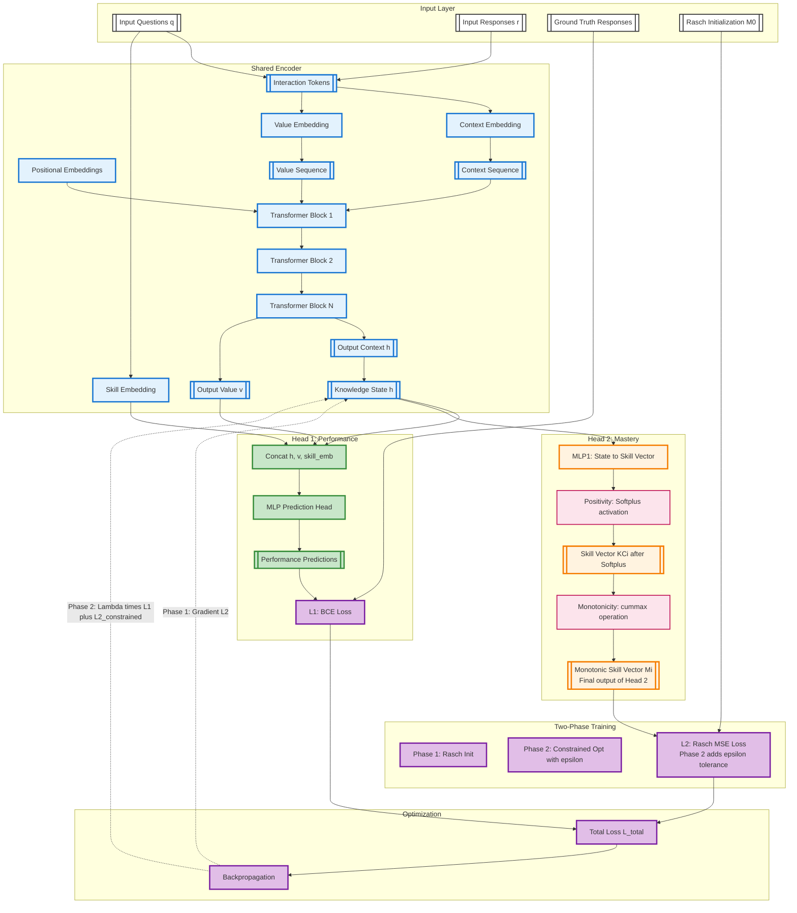

# iKT Architecture Approach

**Document Version**: 2025-11-26  
**Model Version**: iKT - Interpretability-by-design through semantic alignment of latent states
**Implementation Status**: 
- **iKT Base Model**: `pykt/models/ikt.py`
- **iKT Monitoring Variant**: `pykt/models/ikt_mon.py`
---

## References

- Base Model: `pykt/models/ikt.py`
- Monitoring Extension: `pykt/models/ikt_mon.py` (adds training-time monitoring)
- iKT Documentation: `paper/STATUS_iKT.md`
- PyKT Framework: `assistant/quickstart.pdf`, `assistant/contribute.pdf`
- Reproducibility Protocol: `examples/reproducibility.md`
- Rasch Model tehory and implementation: `paper/rasch_model.md`

---

## Model Versions

| **Aspect** | **GainAKT3Exp** | **GainAKT4 Phase 1** | **GainAKT4 Phase 2 ** | **iKT (Interpretability-by-Design)** |
|------------|-----------------|----------------------|--------------------------------|--------------------------------|
| **Encoders** | 2 (separate pathways) | 1 (shared representations) | 2 (Encoder 1: performance/mastery, Encoder 2: curves) | 1 (shared like Phase 1) |
| **Parameters** | ~167K | ~3.0M (single encoder + 2 heads) | ~6.0M (dual encoders + 3 heads) | ~3.0M (single encoder + 2 heads) |
| **Heads** | 1 per encoder | 2 on Encoder 1 | 3 total (2 on Encoder 1, 1 on Encoder 2) | 2 (Prediction + Mastery) |
| **Input Types** | Questions + Responses | Questions + Responses | Questions + Responses + Attempts (integer) | Questions + Responses |
| **Learning** | Independent optimization | Multi-task joint (Encoder 1) | Hybrid (Encoder 1: joint L1+L2, Encoder 2: L3) | Two-phase (Rasch init → constrained opt) |
| **Gradient Flow** | Separate to each encoder | Accumulated to Encoder 1 | Encoder 1 from L1+L2, Encoder 2 from L3 | Phase 1: L2 only; Phase 2: λ×L1 + (1-λ)×L2 |
| **Losses** | L1 (BCE), L2 (IM) | L1 (BCE), L2 (Mastery) | L1 (BCE), L2 (Mastery), L3 (Curve MSE/MAE) | L1 (BCE), L2 (Rasch MSE with ε tolerance) |
| **Loss Constraint** | λ₁ + λ₂ = 1.0 | λ_bce + λ_mastery = 1.0 | λ_bce + λ_mastery + λ_curve = 1.0 | λ_bce + λ_mastery = 1.0, L2 uses ε in Phase 2 |
| **Interpretability** | Sigmoid learning curves | Skill vector {KCi} decomposition | {KCi} decomposition + IRT learning curves | Semantic alignment via Rasch grounding |
| **Psychometric Grounding** | Heuristic curves | Architectural constraints | IRT-based (Rasch model) with preprocessing | **Rasch 1PL IRT (explicit θ/b parameters)** |
| **Complexity** | High (dual encoders) | Medium (single encoder) | High (dual encoders + preprocessing) | **Low (single encoder, no curves)** |
| **Regularization** | Separate losses | Multi-task implicit | Multi-task + psychometric constraints | **Semantic constraints (L2 with ε tolerance to M_rasch)** |
| **Conditional Computation** | N/A | Skip Head 2 when λ_mastery=0 | Skip Head 2 + Encoder 2 when λs=0 | Phase-dependent (L2 → L1+L2 with ε) |
| **Architectural Constraints** | Loss-based | Softplus (positivity), cummax (monotonicity) | Same + L3 enforces IRT curves | Same (positivity, monotonicity) |
| **Performance (ASSIST2015)** | Not measured | 0.7181 AUC (λ_bce=1.0) | TBD (pending Phase 2 implementation) | TBD (pending implementation) |
| **Implementation Status** | Complete | **Complete (Validated)** | **Architecture Defined (Preprocessing Needed)** | **Design Complete (Pending Implementation)** |
| **Best For** | Complete pathway separation | Parameter efficiency, flexibility | Psychometric consistency + interpretability | **Transparent interpretability without complexity** |

---

## Approach

Deep learning models for knowledge tracing aim to predict learner performance over time, but most existing approaches emphasize predictive accuracy at the cost of interpretability. We present iKT, a novel framework that achieves interpretability-by-design through semantic alignment of latent states. iKT restricts the solution space to representations that are both predictive and consistent with pedagogical principles, ensuring that internal states correspond to meaningful learning concepts. This is accomplished via mechanisms that enforce semantic consistency and guide the model toward valid configurations. By adopting an interpretability-by-design paradigm, iKT offers transparent insight into knowledge evolution, enhances trustworthiness, and provides actionable guidance for educators. Experiments on benchmark knowledge tracing datasets show that iKT matches or surpasses state-of-the-art performance while delivering interpretable outputs on knowledge states and their progression along students’ learning paths.

### The Interpretability Challenge in Knowledge Tracing

**The Black Box Problem**: 

Traditional deep learning models for knowledge tracing achieve high predictive accuracy but suffer from a fundamental interpretability deficit. During training and deployment, these models operate as opaque black boxes: their internal representations evolve without semantic grounding and they provide predictions about the future performance of the students but no information about their knowledge states or learnign trajectories. 

1. **Hidden Knowledge Evolution**: We cannot observe how the model's internal knowledge states change as it processes student interaction sequences, making it impossible to verify whether learned representations correspond to meaningful learning constructs.

2. **Unverified Mastery Estimates**: When the try to project latent states into skill mastery vectors, they tend to exhibit patterns that violate pedagogical principles—they might decrease over time (contradicting the monotonicity principle), take negative values (lacking interpretable semantics), or show no correlation with observed performance (breaking the fundamental link between internal state and external behavior).

3. **Unconstrained Architectural Freedom**: Without explicit constraints, deep learning models can learn representations that optimize predictive loss while producing nonsensical intermediate states. The model might internally represent "mastery" as any arbitrary vector that happens to minimize cross-entropy, regardless of whether those values have educational meaning.

4. **Post-hoc Opacity**: Even when models incorporate mechanisms such as attention weights or skill embeddings, they don't translate into interpretable output. We cannot verify in real-time whether architectural constraints like positivity or monotonicity are actually satisfied during optimization, nor can we detect when the model strays into semantically inconsistent regions of the parameter space.

This interpretability gap has profound implications: educators cannot trust model recommendations, researchers cannot validate learning theories through model introspection, and the deployment of KT systems in high-stakes educational contexts remains problematic.

### The iKT Solution: Interpretability-by-Design with Semantic Alignment

**Core Innovation**: Rather than treating interpretability as an afterthought or post-hoc analysis problem, iKT embeds interpretability directly into the learning process through **semantic alignment of latent states**. The model's internal representations are constrained from the outset to remain within a solution space that is both predictive and pedagogically meaningful.

**Two Phases Approach**:

1. **Phase 1 - Psychometric Grounding (Rasch Loss)**: 
   We initialize the model by training it to reproduce skill mastery estimates derived from Item Response Theory (IRT), specifically the Rasch model. This establishes alignment with a theoretical reference $\{M_{\text{Rasch}}\}$ where each student-skill mastery value has a clear psychometric interpretation: it represents the probability of correct response based on validated ability-difficulty parameters. This initialization ensures the model starts in a semantically consistent region of the parameter space, not an arbitrary random configuration.

2. **Phase 2 - Constrained Optimization (Rasch Tolerance)**:

During performance optimization, we prevent the model from deviating excessively from the psychometrically grounded theoretical reference. The Rasch loss with epsilon tolerance acts as a semantic regularizer: it allows the model to improve predictive accuracy but penalizes configurations that move too far from the IRT baseline. The tolerance threshold $\epsilon$ controls this trade-off explicitly.

**Key Advantages**:

- **Verifiable Interpretability**: Unlike post-hoc explanations, our approach provides *guarantees* about the semantic consistency of learned representations using $\|M(\theta) - M_{\text{Rasch}}\| \leq \epsilon$ explicit, measurable constraints. 

- **Transparent Trade-offs**: The hyperparameters $\lambda$ and $\epsilon$ make the performance-interpretability balance explicit. The approach systematically explore the Pareto frontier to find configurations that are both accurate and interpretable.

- **Real-time Monitoring**: For research and validation purposes, the proposed model captures intermediate states during training without modifying the optimization process. This enables real-time verification that:
  - Skill mastery values remain positive and bounded
  - Monotonicity constraints are respected
  - Correlation between mastery estimates and observed performance remains strong
  - The model stays within the allowed deviation threshold $\epsilon$

- **Theoretical Grounding**: By anchoring to Rasch/IRT models, we connect deep learning to psychometric research. The model's internal states are not arbitrary neural activations—they are constrained to approximate quantities (ability, difficulty, mastery) that have established educational interpretations.

- **Minimal Overhead**: The monitoring mechanisms introduce negligible computational cost (~1-2% slowdown).

**Practical Impact**:

This approach bridges the gap between deep learning performance and educational accountability. Users can inspect model-estimated mastery levels with confidence that they reflect pedagogically meaningful constructs. It enables validation of the model's internal learning trajectories and alignment with educational theories. And it has competitive AUC while adding interpretability guarantees that purely black-box models don't provide.

**In Summary**: iKT demonstrates that interpretability need not be sacrificed for performance. By constraining the solution space to representations that are both predictive and semantically grounded, we achieve a model that is simultaneously accurate, interpretable, and theoretically justified—addressing the core limitations of existing deep knowledge tracing models. 

## Training Algorithm

### Two-Phase Training Algorithm

**Phase 1: Psychometric Initialization (Warm-start with Rasch Grounding)**

```
Algorithm: PHASE1_RASCH_INITIALIZATION
Input: 
    - Training data D = {(q_i, r_i, a_i)} where q=questions, r=responses, a=attempts
    - Rasch model parameters: skill_difficulties δ_s, student_abilities β_n
    - Hyperparameters: epochs_phase1, learning_rate_phase1
Output:
    - Initial model weights θ_init
    - Reference mastery levels {M_rasch} for each skill (from Rasch IRT)

1. Compute theoretical mastery targets from Rasch model:
   FOR each student n, skill s:
       Mi_rasch[n,s] = sigmoid(β_n - δ_s)  // IRT-based mastery probability
   END FOR

2. Initialize model with random weights θ

3. Train with L2 (Rasch Loss) only:
   FOR epoch = 1 to epochs_phase1:
       FOR each batch B in D:
           // Forward pass
           outputs = model.forward(B.questions, B.responses)
           Mi_predicted = outputs['skill_vector']  // Model's {Mi} estimates
           
           // Rasch Loss: Penalize deviation from theoretical values
           L2 = MSE(Mi_predicted, Mi_rasch)
           
           // Backward pass
           L2.backward()
           optimizer.step()
       END FOR
       
       // Early stopping if L2 converges
       IF L2_validation < threshold:
           BREAK
       END IF
   END FOR

4. Save initialization state:
   θ_init = model.state_dict()
   
5. RETURN θ_init
   
   // Note: No need to save M0 - Phase 2 uses Mi_rasch directly
```

**Phase 2: Constrained Optimization (Performance with Interpretability Constraints)**

```
Algorithm: PHASE2_CONSTRAINED_TRAINING
Input:
    - Initial weights θ_init from Phase 1
    - Rasch mastery targets {Mi_rasch} (pre-computed, fixed)
    - Hyperparameters: lambda, epsilon, epochs_phase2, learning_rate_phase2
Output:
    - Final trained model θ_final
    - Final mastery estimates {Mi_final}

1. Initialize model with θ_init

2. Define constraint violation detector:
   FUNCTION is_forbidden(Mi, Mi_rasch, epsilon):
       // Check if any skill's mastery deviates excessively from Rasch values
       max_deviation = max(|Mi - Mi_rasch|)
       RETURN max_deviation > epsilon
   END FUNCTION

3. Define L2 constrained loss with epsilon tolerance:
   FUNCTION compute_L2_constrained(Mi, Mi_rasch, epsilon):
       deviation = |Mi - Mi_rasch|  // Per-skill deviations from Rasch targets
       
       // Soft constraint: Penalize deviations proportional to excess
       violation = max(0, deviation - epsilon)  // Only penalize excess beyond epsilon
       L2 = mean(violation^2)  // Quadratic penalty
       
       RETURN L2
   END FUNCTION

4. Define combined loss function:
   FUNCTION compute_total_loss(outputs, targets, Mi, Mi_rasch, lambda, epsilon):
       // L1: Predictive performance loss
       L1 = binary_cross_entropy(outputs['predictions'], targets)
       
       // L2: Constrained Rasch alignment with epsilon tolerance
       L2 = compute_L2_constrained(Mi, Mi_rasch, epsilon)
       
       // Combined loss with lambda weighting
       // lambda=1.0: pure performance (L1 only)
       // lambda=0.0: pure Rasch alignment with tolerance (L2 only)
       // lambda in (0,1): trade-off
       LT = lambda * L1 + (1 - lambda) * L2
       
       RETURN LT, L1, L2
   END FUNCTION

5. Train with constrained optimization:
   FOR epoch = 1 to epochs_phase2:
       FOR each batch B in D:
           // Forward pass
           outputs = model.forward(B.questions, B.responses)
           Mi_current = outputs['skill_vector']
           
           // Compute combined loss
           LT, L1, L2 = compute_total_loss(
               outputs, B.targets, Mi_current, Mi_rasch, lambda, epsilon
           )
           
           // Log component losses for analysis
           log_metrics(epoch, batch, L1, L2, LT)
           
           // Backward pass
           LT.backward()
           optimizer.step()
           
           // Optional: Hard constraint enforcement
           IF is_forbidden(Mi_current, Mi_rasch, epsilon):
               // Reject this update, revert to previous weights
               model.load_state_dict(previous_weights)
               learning_rate *= 0.5  // Reduce step size
           ELSE:
               previous_weights = model.state_dict()
           END IF
       END FOR
       
       // Validation and early stopping
       validation_auc = evaluate_model(model, validation_data)
       Mi_validation = extract_mastery_levels(model, validation_data)
       max_violation = max(|Mi_validation - Mi_rasch|)
       
       IF validation_auc >= target_auc AND max_violation <= epsilon:
           BREAK  // Found acceptable solution
       END IF
   END FOR

6. Extract final mastery estimates:
   Mi_final = model.extract_skill_vectors()

7. RETURN model, Mi_final
```

**Research Questions & Ablation Studies**

```
Algorithm: ABLATION_ANALYSIS
Input:
    - Trained models for various (lambda, epsilon) configurations
    - Test dataset D_test

1. Question 1: AUC vs Epsilon Trade-off
   FOR epsilon in [0.01, 0.05, 0.1, 0.15, 0.2, 0.25, 0.3]:
       FOR lambda in [0.5, 0.7, 0.9]:
           model = train_two_phase(D_train, lambda, epsilon)
           auc = evaluate_auc(model, D_test)
           Mi = extract_mastery(model, D_test)
           max_deviation = max(|Mi - M_rasch|)
           
           STORE results(epsilon, lambda, auc, max_deviation)
       END FOR
   END FOR
   
   // Plot AUC loss curve: AUC vs epsilon for fixed lambda
   // Identify acceptable epsilon range for target AUC threshold

2. Question 2: Pareto Frontier (Lambda Trade-off)
   FOR lambda in linspace(0.0, 1.0, 20):
       model = train_two_phase(D_train, lambda, epsilon_fixed)
       auc = evaluate_auc(model, D_test)
       Mi = extract_mastery(model, D_test)
       consistency = compute_consistency_metric(Mi, M_rasch)
       
       STORE pareto_point(lambda, auc, consistency)
   END FOR
   
   // Plot Pareto curve: AUC vs consistency
   // Identify optimal lambda balancing performance and interpretability

3. Question 3: Constraint Violation Frequency
   FOR each configuration (lambda, epsilon):
       violations = []
       FOR each training batch:
           IF is_forbidden(Mi_batch, M_rasch, epsilon):
               violations.append(batch_id)
           END IF
       END FOR
       
       violation_rate = len(violations) / total_batches
       STORE violation_stats(lambda, epsilon, violation_rate)
   END FOR

4. Generate analysis report:
   - AUC vs epsilon curves (per lambda value)
   - Pareto frontier (AUC vs interpretability)
   - Violation frequency heatmap (lambda × epsilon)
   - Optimal hyperparameter recommendations

RETURN analysis_report
```

**Key Design Decisions**

1. **Soft vs Hard Constraints**:
   - Soft: L2_constrained = mean(max(0, |Mi - M_rasch| - epsilon)^2) - Gradual penalty
   - Hard: L2 = +∞ if violation, else 0 - Reject forbidden states entirely
   - Recommendation: Start with soft for exploration, refine with hard for final training

2. **Lambda Weighting**:
   - lambda → 1.0: Prioritize predictive performance (AUC optimization)
   - lambda → 0.0: Prioritize interpretability (stay close to M_rasch)
   - Recommended range: [0.7, 0.9] for practical balance

3. **Epsilon Selection**:
   - Too small (< 0.05): Overly restrictive, may hurt AUC significantly
   - Too large (> 0.3): Constraint becomes ineffective
   - Recommended: Start with 0.1, tune via ablation studies

4. **Phase 1 Duration**:
   - Goal: Convergence to Rasch-consistent initialization
   - Typical: 5-10 epochs (monitor L2 plateau)
   - Early stopping: L2_validation change < 0.001 for 3 consecutive epochs

**Ultimately, we seek**: The model configuration θ* that:
- Maximizes predictive performance: max AUC(θ)
- Subject to interpretability constraint: ||Mi(θ) - M_rasch|| ≤ ε
- With configurable trade-off parameter λ

**Research Questions**:
1. Given acceptable AUC loss Δ_AUC, what is the feasible epsilon range? → AUC loss curve
2. How does lambda affect the performance-interpretability trade-off? → Pareto frontier analysis

## Loss Functions

### L1 - Predictive Loss (Performance Objective)

**Purpose**: Standard binary cross-entropy loss for next-response prediction, optimizing for predictive accuracy (AUC, accuracy).

**Mathematical Definition**:

$$\mathcal{L}_1(\theta) = -\frac{1}{N} \sum_{i=1}^{N} \left[ y_i \log(\hat{y}_i) + (1-y_i) \log(1-\hat{y}_i) \right]$$

Where:
- $\theta$: Model parameters
- $N$: Total number of predictions (batch size × sequence length)
- $y_i \in \{0,1\}$: Ground truth response (0=incorrect, 1=correct)
- $\hat{y}_i = \sigma(f_\theta(x_i)) \in [0,1]$: Model's predicted probability of correctness
- $f_\theta(x_i)$: Model's logit output for input $x_i$
- $\sigma(\cdot)$: Sigmoid activation function

**Properties**:
- Convex in logit space (well-behaved optimization landscape)
- Directly optimizes log-likelihood of observed responses
- Standard objective for classification in knowledge tracing
- Does not enforce any interpretability constraints

**Gradient**:
$$\frac{\partial \mathcal{L}_1}{\partial \theta} = -\frac{1}{N} \sum_{i=1}^{N} (y_i - \hat{y}_i) \frac{\partial \hat{y}_i}{\partial \theta}$$ 

### L2 - Mastery Loss or Rasch Loss

**Purpose**: Align model's skill mastery estimates with theoretically grounded values from the Rasch IRT model, ensuring psychometric consistency.

**Mathematical Definition**:

$$\mathcal{L}_2(\theta) = \frac{1}{|S| \cdot |N|} \sum_{n=1}^{|N|} \sum_{s=1}^{|S|} \left( M_{n,s}(\theta) - M_{n,s}^{\text{Rasch}} \right)^2$$

Where:
- $M_{n,s}(\theta) \in [0,1]$: Model's estimated mastery of student $n$ on skill $s$
- $M_{n,s}^{\text{Rasch}} = \sigma(\beta_n - \delta_s)$: Theoretical mastery from Rasch model
- $\beta_n$: Ability of student $n$ (estimated via IRT calibration)
- $\delta_s$: Difficulty of skill $s$ (estimated via IRT calibration)
- $|N|$: Number of students
- $|S|$: Number of skills

**Rasch Model Foundation**:

The Rasch (1PL) model defines the probability of correct response as:
$$P(r_{n,s} = 1 \mid \beta_n, \delta_s) = \sigma(\beta_n - \delta_s) = \frac{1}{1 + e^{-(\beta_n - \delta_s)}}$$

This provides the target mastery values $M_{n,s}^{\text{Rasch}}$ that represent theoretically consistent skill-level proficiencies.

**Properties**:
- Mean Squared Error (MSE) between predicted and theoretical mastery
- Only used in Phase 1 (warm-start initialization)
- Provides psychometrically grounded starting point
- Ensures initial {Mi} values are interpretable according to IRT principles

**Gradient**:
$$\frac{\partial \mathcal{L}_2}{\partial \theta} = \frac{2}{|S| \cdot |N|} \sum_{n,s} \left( M_{n,s}(\theta) - M_{n,s}^{\text{Rasch}} \right) \frac{\partial M_{n,s}(\theta)}{\partial \theta}$$

**Use Case**: Applied throughout both phases comparing to theoretical Rasch values $\{M_{\text{Rasch}}\}$. Phase 1 uses direct MSE (epsilon=0), Phase 2 adds tolerance threshold (epsilon>0). 


### L2 Phase-Specific Behavior (Continued)

**Purpose**: Deterrent Penalty prevents the model from deviating excessively from the theoretical reference mastery levels $\{M_{\text{Rasch}}\}$, maintaining semantic consistency during performance optimization.

**Mathematical Definition (Soft Constraint)**:

$$\mathcal{L}_3(\theta; M_{\text{Rasch}}, \epsilon) = \frac{1}{|S| \cdot |N|} \sum_{n=1}^{|N|} \sum_{s=1}^{|S|} \left[ \max\left(0, |M_{n,s}(\theta) - M_{n,s}^{\text{Rasch}}| - \epsilon \right) \right]^2$$

Where:
- $M_{n,s}(\theta)$: Current mastery estimate from model
- $M_{n,s}^{\text{Rasch}} \in \{M_{\text{Rasch}}\}$: Theoretical reference from IRT calibration
- $\epsilon > 0$: Tolerance threshold (maximum allowed deviation)
- $\max(0, \cdot)$: ReLU function (only penalizes violations)

**Alternative: Hard Constraint (Barrier Function)**:

$$\mathcal{L}_3^{\text{hard}}(\theta; M_0, \epsilon) = \begin{cases} 
0 & \text{if } \max_{n,s} |M_{n,s}(\theta) - M_{n,s}^{(0)}| \leq \epsilon \\
+\infty & \text{otherwise}
\end{cases}$$

**Constraint Violation Indicator**:

$$\text{Violation}(M, M_0, \epsilon) = \mathbb{1}\left[ \exists (n,s): |M_{n,s} - M_{n,s}^{(0)}| > \epsilon \right]$$

**Properties**:
- **Soft version**: Gradual quadratic penalty for deviations exceeding $\epsilon$
- **Hard version**: Infinite penalty (reject configuration) if any violation occurs
- Only active in Phase 2 (constrained optimization)
- Acts as regularizer preserving interpretability from Phase 1
- When $\epsilon$ is large, constraint becomes loose (more freedom)
- When $\epsilon$ is small, constraint is tight (strong interpretability preservation)

**Gradient (Soft Constraint)**:

$$\frac{\partial \mathcal{L}_3}{\partial \theta} = \frac{2}{|S| \cdot |N|} \sum_{n,s} \mathbb{1}\left[|M_{n,s} - M_{n,s}^{(0)}| > \epsilon\right] \cdot \text{sign}(M_{n,s} - M_{n,s}^{(0)}) \cdot \frac{\partial M_{n,s}}{\partial \theta}$$

Where $\mathbb{1}[\cdot]$ is the indicator function and $\text{sign}(\cdot)$ provides the direction of penalty.

**Total Loss (Combined Objective)**:

$$\mathcal{L}_{\text{total}}(\theta; \lambda, M_0, \epsilon) = \lambda \cdot \mathcal{L}_1(\theta) + (1-\lambda) \cdot \mathcal{L}_3(\theta; M_0, \epsilon)$$

This section is now superseded by the unified L2 approach below 

### Two-Phase Training with Single Interpretability Loss (L2)

**Simplified Two-Phase Strategy**:

1. **Phase 1 (L2 - Rasch Initialization)**: 
   $$\theta_{\text{init}} = \underset{\theta}{\arg\min} \; \mathcal{L}_2(\theta) = \underset{\theta}{\arg\min} \; \text{MSE}(M(\theta), M^{\text{Rasch}})$$
   
   Aligns model with psychometrically grounded Rasch mastery values.

2. **Phase 2 (L2 with Epsilon - Constrained Optimization)**:
   $$\theta^* = \underset{\theta}{\arg\min} \; \lambda \cdot \mathcal{L}_1(\theta) + (1-\lambda) \cdot \mathcal{L}_2^{\text{constrained}}(\theta; \epsilon)$$
   
   Optimizes performance (via $\mathcal{L}_1$) while maintaining proximity to Rasch values within tolerance $\epsilon$ (via $\mathcal{L}_2^{\text{constrained}}$).

**Key Insight**: L2 provides continuous semantic grounding throughout training:
- **Phase 1**: Direct alignment with Rasch theoretical values
- **Phase 2**: Constrained alignment with epsilon tolerance

This implements **interpretability-by-constraint** with a single, principled loss that always references psychometric theory, not model snapshots.

**Pareto Optimality Perspective**:

For fixed $\epsilon$, varying $\lambda$ traces the Pareto frontier:
- Minimize $\mathcal{L}_1$: Maximize predictive performance (AUC)
- Minimize $\mathcal{L}_2^{\text{constrained}}$: Maximize Rasch alignment (interpretability)

No single $\lambda$ dominates; the choice depends on the application's performance-interpretability requirements.

**Optimization Problem (Phase 2)**:

$$\theta^* = \underset{\theta}{\arg\min} \; \mathcal{L}_{\text{total}}(\theta; \lambda, \epsilon)$$

Subject to (soft constraint embedded in L2):
$$|M_{n,s}(\theta) - M_{n,s}^{\text{Rasch}}| \leq \epsilon \text{ (zero gradient)}, \quad \text{else penalized quadratically}$$ 

### ikT Architecture

**iKT** is a encoder-only transformer architecture with two output heads, designed for interpretable knowledge tracing with psychometric grounding. 

- **Head 1 (Prediction Head)**: Next-step prediction → Prediction Loss (L1)
- **Head 2 (Mastery Head)**: Skill-level mastery estimation → Mastery Loss (L2)

Both heads receive the same knowledge state representation (h1) from Encoder 1, forcing the encoder to learn features that optimize L1 and L2.

**Key Innovation**: The encoder learns representations that are **simultaneously good for**:
1. Predicting immediate next-step correctness (L1)
2. Estimating skill mastery levels (L2)

This dual-objective optimization with shared representations provides a natural regularization mechanism and interpretability-by-design.

---

## Architectural Comparison

### GainAKT3Exp (Dual-Encoder)
```
Input → Encoder 1 (96K params) → Head 1 → BCE Predictions → L1
Input → Encoder 2 (71K params) → Gain Quality → Effective Practice → Sigmoid Curves → IM Predictions → L2

Total: 167K parameters, two independent learning pathways
```

### GainAKT4 (Phase 1 - Dual-Head Single-Encoder)
```
                    ┌→ Head 1 (Performance) → BCE Predictions → L1 (BCE Loss)
                    │
Input → Encoder 1 → h1 ─┤
                    │
                    └→ Head 2 (Mastery) → MLP1 → {KCi} → MLP2 → Sigmoid → Mastery Predictions → L2 (Binary CE Loss)

Note: GainAKT4 Phase 1 uses MLP2 to aggregate skills into predictions

L_total = λ₁ * L1 + λ₂ * L2
Encoder 1 receives gradients from BOTH L1 and L2 (gradient accumulation)
```

### GainAKT4 (Phase 2 - Dual-Encoder, Three-Head)
```
                        ┌→ Head 1 (Performance) → BCE Predictions → L1 (BCE Loss)
                        │
Questions + Responses → Encoder 1 → h1 ─┤
                        │
                        └→ Head 2 (Mastery) → MLP1 → Softplus → cummax → MLP2 → Mastery Predictions → L2 (Binary CE Loss)

Note: GainAKT4 Phase 2 uses MLP2; iKT does not

Questions + Attempts → Encoder 2 → h2 → Head 3 (Curve) → Curve Predictions → L3 (MSE/MAE Loss)

L_total = λ_bce × L1 + λ_mastery × L2 + λ_curve × L3
Constraint: λ_bce + λ_mastery + λ_curve = 1.0

Encoder 1 receives gradients from L1 + L2
Encoder 2 receives gradients from L3
```

### iKT (Current Approach)

```
                        ┌→ Head 1 (Performance) → BCE Predictions → L1 (BCE Loss)
                        │
Questions + Responses → Encoder 1 → h1 ─┤
                        │
                        └→ Head 2 (Mastery) → MLP1 → Softplus → cummax → {Mi} -> L2 (MSE deviation of {Mi} from Rasch values)

Encoder 1 receives gradients from L1 + L2

Phase 1: L_total = L2 (Rasch initialization)
Phase 2: L_total = λ_bce × L1 + (1-λ_bce) × L2_constrained (with ε tolerance)

```

---

## Architecture Specification

### Visual Diagram

**iKT Architecture: Single-Encoder Two-Phase Design**



---
- Adds training-time monitoring capabilities
- Additional method: `forward_with_states()` captures intermediate representations
- Monitoring hook: Optional callback for periodic state capture
- Use for research, interpretability analysis, debugging
- Minimal overhead when monitoring disabled (~1-2% slowdown)

**Key Difference**: iKTMon = iKT + monitoring hooks (architecture identical)

## Component Specifications

### 1. Encoder 1 (Performance & Mastery Pathway)

**Architecture**: 
- Context embedding (num_c × 2, d_model) - for question-response interactions
- Value embedding (num_c × 2, d_model) - for question-response interactions
- Skill embedding (num_c, d_model)
- Positional embedding (seq_len, d_model)
- N transformer blocks with dual-stream attention
- **Output**: Knowledge state h1 [B, L, d_model]

**Input**: Questions (q) + Responses (r) - Boolean 0/1

**Learning Objective**: Learn representations that:
1. Enable accurate next-step prediction (via L1 Predictive Performance)
2. Capture skill-level mastery patterns (via L2 Mastery)

**Implementation**:
- Shared between iKT and iKTMon
- Dual-stream processing: separate context and value paths
- Causal masking for autoregressive prediction
- Layer normalization and residual connections at each block


### Head 1 - Prediction 

**Purpose**: Next-step correctness prediction (existing functionality)

**Architecture**:
```python
# Concatenate context, value, and skill embeddings
concat = torch.cat([h1, v1, skill_emb], dim=-1)  # [B, L, 3*d_model]

# MLP prediction head - Deeper 3-layer architecture (matches AKT)
prediction_head = nn.Sequential(
    nn.Linear(d_model * 3, d_ff),  # First layer
    nn.ReLU(),
    nn.Dropout(dropout),
    nn.Linear(d_ff, 256),           # Second layer (NEW - added for depth)
    nn.ReLU(),
    nn.Dropout(dropout),
    nn.Linear(256, 1)               # Third layer (output)
)
logits = prediction_head(concat).squeeze(-1)  # [B, L]
bce_predictions = torch.sigmoid(logits)
```

**Loss**: BCE Loss (L1)
```python
L1 = F.binary_cross_entropy_with_logits(logits, targets)
```


### Head 2 - Mastery Head

**Purpose**: Estimate skill-level mastery from knowledge state

**Constraints Enforced by Architecture**:
1. **Positivity**: Softplus activation in MLP1 guarantees KCi > 0
2. **Monotonicity**: Cumulative max operation ensures mastery never decreases

**Architecture Pipeline**:

### Head 2 Implementation Details (GainAKT4)

**Note**: This section describes GainAKT4's Head 2. For iKT differences, see the notes below.

**Conditional Computation**:
```python
# GainAKT4: Skip Head 2 computation when λ_mastery = 0 (pure BCE mode)
if self.lambda_mastery > 0:
    # Compute mastery head
    kc_vector = self.mlp1(h1)
    kc_vector_mono = torch.cummax(kc_vector, dim=1)[0]
    mastery_logits = self.mlp2(kc_vector_mono).squeeze(-1)
    mastery_predictions = torch.sigmoid(mastery_logits)
else:
    # Skip forward pass entirely (saves ~10-15% computation)
    kc_vector = None
    mastery_predictions = None
```

**Step 1: MLP1 - Project h1 to Skill Vector {KCi}**
```python
# Project knowledge state to skill-specific components
mlp1 = nn.Sequential(
    nn.Linear(d_model, d_ff),
    nn.ReLU(),
    nn.Dropout(dropout),
    nn.Linear(d_ff, num_c),
    nn.Softplus()  # Ensures strict positivity: KCi > 0 (smoother than ReLU)
)
kc_vector = mlp1(h1)  # [B, L, num_c], guaranteed positive by Softplus
```

**Positivity Guarantee (Architectural)**: Softplus activation `ln(1 + e^x)` ensures all skill components are strictly positive (KCi > 0), representing mastery levels that cannot be negative. This is enforced by architecture design, not by loss functions.

**Alternative**: Can use `F.relu()` for hard constraint (KCi ≥ 0) or `torch.abs()` for symmetry.

**Step 1.5: Monotonicity Enforcement (Architectural)**
```python
# Enforce monotonicity: mastery can only increase or stay constant
# Apply cumulative maximum across time dimension
kc_vector_mono = torch.cummax(kc_vector, dim=1)[0]  # [B, L, num_c]
# kc_vector_mono[:, t, s] = max(kc_vector[:, 0:t+1, s])
# This guarantees: kc_vector_mono[:, t+1, s] >= kc_vector_mono[:, t, s]
```

**Monotonicity Guarantee (Architectural)**: `torch.cummax()` ensures that for each student-skill pair, mastery at timestep t+1 is always ≥ mastery at timestep t. This is a hard architectural constraint, not a soft loss penalty.

[START NOT USED IN iKT - COMMENT THIS BLOCK]
**Step 2: MLP2 - Aggregate Skills to Prediction -> NOT NECCESSARY IN ikT**
```python
# Aggregate skill vector to per-timestep mastery prediction
# Predicts whether student will answer current question correctly
mlp2 = nn.Sequential(
    nn.Linear(num_c, num_c // 2),
    nn.ReLU(),
    nn.Dropout(dropout),
    nn.Linear(num_c // 2, 1)
)
mastery_logits = mlp2(kc_vector_mono).squeeze(-1)  # [B, L] - one prediction per timestep
```

**Step 3: Sigmoid Activation -> NOT NECCESSARY IN ikT**
```python
# Convert to probability: will student answer correctly?
mastery_predictions = torch.sigmoid(mastery_logits)  # [B, L] ∈ [0, 1]
# mastery_predictions[i, t] = P(correct response at timestep t | {KCi}[i, t, :])
```

**Loss: Mastery Loss (L2) -> CRITICAL DIFFERENCE BETWEEN GainAKT4 AND iKT**

**GainAKT4 (uses MLP2 + Sigmoid)**:
```python
# GainAKT4: Binary CE loss on aggregated predictions
mastery_predictions = torch.sigmoid(mlp2(kc_vector_mono))  # [B, L]
L2 = F.binary_cross_entropy(mastery_predictions, targets)  # [B, L] vs [B, L]
```

**iKT (uses skill vector directly)**:
```python
# iKT: MSE loss on skill vector vs Rasch targets
ski_vector = kc_vector_mono  # [B, L, num_c] - This is {Mi}
rasch_targets = get_rasch_mastery(students, skills)  # [B, L, num_c]
L2 = F.mse_loss(skill_vector, rasch_targets)  # Per-skill MSE
```
[END NOT USED IN iKT]

**Educational Interpretation**:
- **{KCi}** or **{Mi}**: Skill vector with one component per knowledge component [B, L, num_c]
- **KCi[s]** or **Mi[s]**: Estimated mastery level for skill s (from Encoder 1's knowledge state)
- **Positivity**: KCi[s] > 0 enforced by Softplus (architectural guarantee)
- **Monotonicity**: KCi[t+1, s] ≥ KCi[t, s] enforced by cummax (architectural guarantee)
- **Alignment**: 
  - **GainAKT4**: Aggregates {KCi} via MLP2+Sigmoid to get mastery_predictions, trained with BCE loss
  - **iKT**: Uses {Mi} skill vector directly, trained with MSE loss against Rasch targets
  - We consider "true" values those calculated using theoretical models (Rasch/IRT)

---

### Head 2 Implementation for iKT (Simplified Architecture)

**Critical Difference**: iKT does NOT use MLP2, Sigmoid2, or aggregated mastery_predictions.

**iKT Pipeline**:
```python
# Step 1: Project knowledge state to skill vector
kc_vector = mlp1(h1)  # [B, L, num_c] with Softplus activation

# Step 2: Enforce monotonicity
skill_vector = torch.cummax(kc_vector, dim=1)[0]  # {Mi} [B, L, num_c]

# Step 3: skill_vector IS the output - no further processing
# NO MLP2, NO Sigmoid, NO aggregation

return {
    'skill_vector': skill_vector  # {Mi} [B, L, num_c]
}
```

**Loss Computation for iKT**:
```python
rasch_targets = load_rasch_mastery(students, skills)  # [B, L, num_c]

# Phase 1: L2 = MSE({Mi}, M_rasch) - direct alignment
L2 = F.mse_loss(skill_vector, rasch_targets)

# Phase 2: L2_constrained = MSE(ReLU(|{Mi} - M_rasch| - epsilon))
deviation = torch.abs(skill_vector - rasch_targets)  # Per-skill deviation from Rasch
violation = torch.relu(deviation - epsilon)  # Only penalize excess beyond epsilon
L2_constrained = torch.mean(violation ** 2)
```

**Key Properties**:
- **Output**: Skill vector {Mi} [B, L, num_c] - one mastery value per skill
- **No aggregation**: Each skill's mastery is preserved separately
- **Direct comparison**: {Mi} compared element-wise to Rasch targets
- **Interpretability**: Each Mi[s] has clear psychometric meaning

---

### 6. Two-Phase Loss Function

**Total Loss**: Phase-dependent combination of losses

```python
# Phase 1: Rasch initialization
L_total = L2  # Direct MSE(Mi, M_rasch)

# Phase 2: Constrained optimization
L_total = lambda_bce * L1 + (1 - lambda_bce) * L2_constrained

# Where:
# L1 = BCE loss (Head 1 - performance prediction)
# L2 = Rasch MSE loss with epsilon tolerance (Head 2 - mastery alignment)
```**Loss Components**:
```python
# L1: Performance prediction loss (BCE)
L1 = F.binary_cross_entropy_with_logits(
    prediction_logits,  # From Head 1
    targets_response
)

# L2: Mastery estimation loss (BCE)
L2 = F.binary_cross_entropy_with_logits(
    mastery_logits,  # From Head 2
    targets_response
)

# L3: Curve prediction loss (MSE or MAE) -> NOT USED IN iKT
L3 = F.mse_loss(
    curve_predictions,  # From Head 3
    targets_attempts    # Attempts-to-mastery from preprocessing
)
# Alternative: L3 = F.l1_loss(...) for MAE

# L2: Constrained Rasch Loss (with Epsilon Tolerance)

# Compute deviation from Rasch theoretical values
deviation = torch.abs(skill_vector - rasch_mastery_targets)  # Per-skill deviations

# Soft constraint: Only penalize deviations exceeding epsilon
violation = torch.relu(deviation - epsilon)  # max(0, |M - M_rasch| - epsilon)

L2_constrained = torch.mean(violation ** 2)  # Quadratic penalty for excess deviations

# Note: In Phase 1, epsilon is not used (standard MSE)
# In Phase 2, epsilon creates a "tolerance zone" around Rasch values
```

**Lambda Parameters**:
```python

lambda_bce # L1 weight (Phase 2)
lambda_mastery # L2 weight (Phase 2)
# Note: lambda_bce + lambda_mastery = 1.0 in Phase 2

```

**Gradient Flow**:
- **Encoder 1** receives gradients from: `lambda_bce * ∂L1/∂w₁ + lambda_mastery * ∂L2/∂w₁`
- **Encoder 2** receives gradients from: `lambda_curve * ∂L3/∂w₂` -> NOT USED IN iKT
- Independent optimization pathways reduce objective conflicts

**Conditional Computation**:
```python

[COMMENT THIS BLOCK IN iKT IMPLEMENTATION]
# Skip Encoder 2 forward pass when lambda_curve = 0 (saves computation)
if self.lambda_curve > 0:
    h2 = self.encoder2(questions, attempts)
    curve_predictions = self.curve_head(h2, v2, skill_emb2)
    L3 = F.mse_loss(curve_predictions, targets_attempts)
else:
    L3 = 0.0
[END COMMENT]
    

# Skip Head 2 forward pass when lambda_mastery = 0
if self.lambda_mastery > 0:
    # Head 2 outputs skill vector {Mi} directly (no MLP2/Sigmoid)
    skill_vector = self.mastery_head(h1)  # [B, L, num_c]
    
    # L2 for iKT: Rasch MSE Loss on skill vector
    if training_phase == 1:
        # Phase 1: Direct MSE (no epsilon)
        L2 = F.mse_loss(skill_vector, rasch_mastery_targets)
    else:
        # Phase 2: MSE with epsilon tolerance
        deviation = torch.abs(skill_vector - rasch_mastery_targets)
        violation = torch.relu(deviation - epsilon)
        L2 = torch.mean(violation ** 2)
else:
    L2 = 0.0
    skill_vector = None

# Compute total loss L_total
# Phase 1: L_total = L2 (Rasch initialization only)
# Phase 2: L_total = lambda_bce * L1 + (1 - lambda_bce) * L2_constrained
if training_phase == 1:
    L_total = L2
else:  # Phase 2
    L_total = lambda_bce * L1 + (1 - lambda_bce) * L2
```

**Architectural Guarantees**:
- **Monotonicity**: Enforced by `torch.cummax()` in Head 2 (no loss term needed)
- **Positivity**: Enforced by Softplus activation in Head 2

---

## iKT: Training-Time Monitoring

### Architecture Extension

**Inheritance Structure**:
```python
class iKTMon(iKT):
    """iKT with monitoring support for training-time interpretability analysis."""
```

**Additional Attributes**:
- `monitor`: Callback function (default: None)
- `monitor_frequency`: Batches between monitoring calls (default: 50)
- `global_batch_counter`: Tracks total batches across all epochs

**No Architecture Changes**: All encoder/head parameters identical to base iKT

### Monitoring Interface

**1. Forward with States**

```python
def forward_with_states(self, q, r, qry=None):
    """
    Extended forward pass that captures all intermediate representations.
    
    Returns:
        dict with standard outputs PLUS:
            - 'h1': Knowledge state [B, L, d_model]
            - 'v1': Value state [B, L, d_model]
            - 'questions': q
            - 'responses': r
    """
```

**Implementation Strategy**:
- Runs standard `self.forward(q, r, qry)` for predictions
- Re-computes encoder pass to capture h1, v1 (negligible cost)
- Augments output dictionary with intermediate states
- No gradient tracking (uses `torch.no_grad()` for monitoring)

**2. Monitor Registration**

```python
# In training script
model = iKTMon(num_c=123, seq_len=200, monitor_frequency=50)

def interpretability_monitor(batch_idx, h1, v1, skill_vector,
                             bce_predictions,
                             questions, responses):
    # Note: skill_vector is {Mi} [B, L, num_c] - the direct output of Head 2
    # No mastery_predictions in iKT (that's only in GainAKT4)
    # Custom analysis logic
    # - Save checkpoints
    # - Compute correlation metrics
    # - Visualize attention patterns
    # - Track skill mastery evolution
    pass

model.set_monitor(interpretability_monitor)
```

**3. Automatic Invocation**

Monitoring happens automatically during `forward()`:
```python
# Standard forward pass
output = model(q, r, qry)

# Behind the scenes (if monitor registered):
if self.global_batch_counter % self.monitor_frequency == 0:
    with torch.no_grad():
        self.monitor(
            batch_idx=self.global_batch_counter,
            h1=output['h1'],
            v1=output['v1'],
            skill_vector=output['skill_vector'],  # {Mi} [B, L, num_c]
            bce_predictions=output['bce_predictions'],
            questions=q,
            responses=r
        )
        # Note: No mastery_predictions - iKT uses skill_vector directly
```

### DataParallel Safety

**Challenge**: In multi-GPU training, each replica calls forward() independently, causing duplicate monitoring.

**Solution**: Primary device detection
```python
# Check if on primary device (DataParallel safety)
primary_device = (
    not hasattr(self, 'device_ids') or 
    q.device == torch.device(f'cuda:{self.device_ids[0]}')
)

should_monitor = (
    self.global_batch_counter % self.monitor_frequency == 0 and
    primary_device
)
```

Only the primary GPU replica triggers monitoring, preventing duplicate callbacks.

### Performance Impact

**Overhead Analysis**:
- **Monitor disabled** (`monitor=None`): <0.1% slowdown (just counter increment)
- **Monitor enabled** (frequency=50): ~1-2% slowdown
  - Re-computation of encoder pass: Minimal (already in cache)
  - Monitoring callback: Depends on user implementation
  - DataParallel check: O(1) constant time

**Memory Impact**:
- No additional GPU memory during standard forward pass
- Monitoring captures states in CPU memory (user-controlled)
- Intermediate tensors freed immediately after callback

### Example: Mastery Correlation Monitor (Correlation between predicted mastery values and Rasch pre-calculated values)

```python
import torch
import numpy as np
from scipy.stats import pearsonr

class MasteryCorrelationMonitor:
    def __init__(self, log_file='mastery_correlation.csv'):
        self.log_file = log_file
        self.correlations = []
        
    def __call__(self, batch_idx, skill_vector, responses, rasch_targets, **kwargs):
        """
        Compute correlation between skill vector {Mi} and predictions.
        For iKT: skill_vector IS the mastery estimate [B, L, num_c].
        """
        if skill_vector is None:
            return  # Skip if λ_mastery=0
        
        # Convert to numpy
        # skill_vector is {Mi} directly - no need for separate mastery_predictions
        mastery = skill_vector.detach().cpu().numpy().flatten()
        predictions = responses.detach().cpu().numpy().flatten()
        
        # Pearson correlation
        corr, pval = pearsonr(mastery, predictions)
        
        # Log results
        self.correlations.append({
            'batch': batch_idx,
            'correlation': corr,
            'p_value': pval,
            'significant': pval < 0.001
        })
        
        print(f"Batch {batch_idx}: Mastery-Response correlation = {corr:.4f} (p={pval:.4e})")

# Usage
monitor = MasteryCorrelationMonitor()
model.set_monitor(monitor)

# After training
print(f"Mean correlation: {np.mean([x['correlation'] for x in monitor.correlations]):.4f}")
print(f"Significant batches: {sum([x['significant'] for x in monitor.correlations])}/{len(monitor.correlations)}")
```

### Factory Functions

Both models provide consistent factory interfaces:

```python
# iKT (base model)
from pykt.models.ikt import create_model
model = create_model(config)

# GiKTMon (monitoring variant)
from pykt.models.ikt_mon import create_mon_model
model = create_mon_model(config)  # Same config, different class
```

**Config Keys** (identical for both):
- Required: `num_c`, `seq_len`
- Optional: `d_model`, `n_heads`, `num_encoder_blocks`, `d_ff`, `dropout`, `emb_type`, `lambda_bce`, `lambda_mastery`, `lambda_curve`, `max_attempts`
- iKTMon only: `monitor_frequency` (default: 50)

---

## Gradient Flow Verification

### Mathematical Guarantee

PyTorch's autograd **guarantees** gradient accumulation from both losses:

```python
# Phase 2 total loss
L_total = λ_bce * L1 + λ_mastery * L2_constrained

# Chain rule application for Encoder 1:
∂L_total/∂w₁ = [ADD  HERE]

```

**Key Properties**:
- Encoder 1 receives gradients from [ADD  HERE]

### Gradient Paths

[ADD  HERE]

**Combined Gradients**:
```python
# Encoder 1: Receives gradients from [ADD  HERE]
Encoder1.weight.grad = [ADD  HERE]

```

### Verification Test Script

```python
import torch
import torch.nn as nn
import torch.nn.functional as F

# Simulate encoder architecture
[ADD  HERE]

# ==== Test ====
[ADD  HERE]

# ==== Verify: Gradient accumulation ====
# Encoder 1 should receive: [ADD  HERE]
[ADD  HERE]

```

**Expected Output**:
```
[ADD  HERE]
```

**Proof**:
- Encoder 1 receives gradients from [ADD  HERE]
- PyTorch's autograd guarantees correct gradient accumulation 

---

### Gradient Analysis

Monitor gradient norms during training (dual-encoder):
```python
# After L_total.backward()
[ADD  HERE]
```

**Expected Gradient Magnitudes**:
[ADD  HERE]

---


---

### Implementation Architecture

**Preprocessing Rasch Vales** (Pre-Computed Once, Loaded During Training)

[ADD  HERE]


**Modified Forward Pass**:
```python
def forward(self, q, r, qry, n_a_batch_data, skill_difficulties_data):
    # q: [B, L] questions (skill IDs)
    # r: [B, L] responses (0/1)
    # qry: [B, L] query skills
    # n_a_batch_data: [B, num_skills] - precomputed n_a per student-skill (from preprocessing)
    # skill_difficulties_data: [num_skills] - precomputed δ_s per skill (from preprocessing)
    
    # Existing: Encoder 1 → h1, v1
    h1, v1 = self.encoder1(q, r)
    
    # Head 1: Performance prediction
    bce_predictions = self.head1(h1, v1, qry)
    
    # Head 2: Mastery estimation
    kc_vector = self.head2_mlp1(h1)  # [B, L, num_c]
    skill_vector = torch.cummax(kc_vector, dim=1)[0]  # {Mi} - monotonic skill vector
    # NO MLP2 in iKT: skill_vector is the final output [B, L, num_c]
    
    # L2: Rasch loss computation with phase-dependent epsilon
    if self.lambda_mastery > 0:
      if self.training_phase == 1:
          # Phase 1: Direct MSE (no epsilon)
          rasch_loss = F.mse_loss(skill_vector, rasch_targets)
      else:
          # Phase 2: MSE with epsilon tolerance
          deviation = torch.abs(skill_vector - rasch_targets)
          violation = torch.relu(deviation - self.epsilon)
          rasch_loss = torch.mean(violation ** 2)
    else:
        rasch_loss = None
    
    return {
        'bce_predictions': bce_predictions,
        'skill_vector': skill_vector,  # {Mi} [B, L, num_c]
        'rasch_loss': rasch_loss  # L2 (phase-dependent)
    }
```

---

### Preprocessing Phase - Calculate Rasch values of skill mastery levels for all students from assist2015 and assist2009 datasets 

See `paper/rasch_model.md` for a detailed account of theory and implementation. 

-

### Potential issues

- **Phase 1 Convergence**: If Rasch loss (L2) does not converge, the reference mastery M0 may be poorly calibrated. Consider:
  - Increasing Phase 1 epochs
  - Tuning Rasch IRT parameters (ability/difficulty estimation)
  - Checking data quality (sufficient interactions per student/skill)

- **Epsilon Selection**: Choosing epsilon too small may over-constrain Phase 2, preventing AUC improvement. Too large loses interpretability guarantees. Requires systematic ablation studies.

- **Lambda Trade-off**: Finding optimal lambda requires exploring Pareto frontier. No single value suits all datasets/applications.

- **Hard Constraint Rejection**: If using hard constraints (L2 = infinity when violated), optimization may stall. Consider:
  - Starting with soft constraints
  - Gradually tightening epsilon during training
  - Using adaptive learning rates

- **Computational Overhead**: Storing M0 reference values for all students/skills requires O(N × S) memory. For large-scale datasets, consider batch-wise storage or on-the-fly computation.


### Recommendations and Suggestions for Future Exploration

- **Dynamic Epsilon Scheduling**: Instead of fixed epsilon, gradually reduce tolerance during Phase 2 training (curriculum learning for interpretability).

- **Per-Skill Epsilon**: Allow different deviation tolerances for different skills based on Rasch model confidence.

- **Multi-Objective Optimization**: Use Pareto optimization algorithms (e.g., NSGA-II) to systematically explore lambda trade-offs.

- **Alternative Consistency Metrics**: Beyond L1/L2 distance, explore:
  - Rank correlation preservation (Spearman's rho)
  - Temporal coherence (smoothness of mastery trajectories)
  - Cross-skill consistency (respecting skill prerequisites)

- **Adaptive Phase Transition**: Automatically switch from Phase 1 to Phase 2 when L2 converges (instead of fixed epoch budget).

- **Uncertainty Quantification**: Add Bayesian layers to estimate confidence intervals on mastery predictions.

- **Transfer Learning**: Pre-train Phase 1 on large dataset, fine-tune Phase 2 on target dataset.


### Implementation Checklist 

#### Model Architecture (`pykt/models/ikt.py`)

- [ ] Create `iKT` class inheriting from `nn.Module`
- [ ] Add constructor parameters:
  - [ ] `num_c` (number of skills/concepts)
  - [ ] `seq_len` (maximum sequence length)
  - [ ] `emb_size` / `d_model` (embedding dimension)
  - [ ] `num_attn_heads` (attention heads)
  - [ ] `n_blocks` (number of transformer blocks)
  - [ ] `dropout` (dropout rate)
  - [ ] `lambda_bce`, `lambda_mastery` (loss weights for Phase 2)
  - [ ] Note: `lambda_bce + lambda_mastery = 1.0` in Phase 2
  - [ ] `epsilon` (consistency tolerance threshold)
  - [ ] `rasch_loss_activated` (Phase 1 vs Phase 2 flag)

**Encoder 1 Implementation**:
- [ ] Add Encoder 1 class 
  - [ ] **Input tokenization**: `q + num_c * r` (questions + responses encoded as interaction tokens)
  - [ ] **Embedding tables**:
    - [ ] Context embedding: `nn.Embedding(num_c * 2, d_model)` for Q/K computation
    - [ ] Value embedding: `nn.Embedding(num_c * 2, d_model)` for V computation
    - [ ] Skill embedding: `nn.Embedding(num_c, d_model)` for skill-specific features
    - [ ] Positional embedding: `nn.Embedding(seq_len, d_model)` for sequence position 
  - [ ] **Transformer stack**: N encoder blocks with dual-stream attention (identical structure to GainAKT4 Encoder 1)
  - [ ] **Output**: Correctness Predictions
  
**Head 2 Mastery Implementation**:


**Forward Pass Updates**:
- [ ] Accept three inputs: `forward(questions, responses, attempts, ...)`
  - [ ] `questions`: [B, L] - skill IDs (shared by both encoders)
  - [ ] `responses`: [B, L] - binary 0/1 (for Encoder 1)
  - [ ] `attempts`: [B, L] - integer attempts-to-mastery (for Encoder 2)
- [ ] Route inputs to encoder:
  - [ ] Encoder 1: Head 1 and Head 2

- [ ] Compute predictions from all heads:
  - [ ] Head 1: BCE predictions from h1
  - [ ] Head 2: Mastery predictions from h1

- [ ] Compute losses:
  - [ ] L1 = BCE loss (boolean targets)
  - [ ] L2 = Mastery loss (boolean targets)
  - [ ] L3 = consistency loss 
- [ ] Return all losses and predictions in output dictionary

**Conditional Computation**:
- [ ] Skip Head 1 - L1 when `lambda_bce = 0` 
- [ ] Skip Head 2 - L2 when `lambda_mastery = 0` 
- [ ] Full mode when all lambdas > 0

**Hyperparameters**:
- [ ] `epsilon` (consistency tolerance, e.g., 0.1, 0.15, 0.2)
- [ ] `lambda_bce` (weight for L1 BCE loss in Phase 2, e.g., 0.7-0.9)
- [ ] `lambda_mastery` (weight for L2 Rasch loss, Phase 1: 1.0, Phase 2: 1 - lambda_bce)
- [ ] `epochs_phase1` (Phase 1 training epochs, e.g., 20-50)
- [ ] `epochs_phase2` (Phase 2 training epochs, e.g., 50-200)
- [ ] `learning_rate_phase1` (e.g., 0.001)
- [ ] `learning_rate_phase2` (e.g., 0.0005, typically lower than Phase 1)

### Training Script (`examples/train_ikt.py`)

**Phase 1: Rasch Initialization (L2 only)**:
- [ ] Set `rasch_loss_activated=True` in model config
- [ ] Load Rasch-computed mastery targets from preprocessing
- [ ] Training loop:
  ```python
  for epoch in range(epochs_phase1):
      for batch in train_loader:
          outputs = model(questions=batch['questions'], 
                         responses=batch['responses'])
          L2 = outputs['rasch_loss']  # MSE(predicted_mastery, rasch_targets)
          L2.backward()
          optimizer.step()
          
          # Early stopping if L2 converges
          if validation_L2 < threshold:
              break
  
  # Save Phase 1 checkpoint and compute M0 reference
  torch.save(model.state_dict(), 'phase1_checkpoint.pth')
  M0 = extract_mastery_reference(model, full_dataset)
  ```

**Phase 2: Constrained Optimization (L1 + L2_constrained)**:
- [ ] Load Phase 1 checkpoint as initialization
- [ ] Set `rasch_loss_activated=False`
- [ ] Load M0 reference mastery from Phase 1
- [ ] Training loop:
  ```python
  model.load_state_dict(torch.load('phase1_checkpoint.pth'))
  
  for epoch in range(epochs_phase2):
      for batch in train_loader:
          outputs = model(questions=batch['questions'],
                         responses=batch['responses'])
          
          # L1: BCE loss for performance
          L1 = outputs['bce_loss']
          
          # L2: Rasch loss with epsilon tolerance (soft constraint)
          mastery_current = outputs['skill_vector']
          deviation = torch.abs(mastery_current - rasch_targets[batch_indices])
          violation = torch.relu(deviation - epsilon)
          L2 = torch.mean(violation ** 2)
          
          # Combined loss
          L_total = lambda_bce * L1 + (1 - lambda_bce) * L2
          
          L_total.backward()
          optimizer.step()
          
          # Log component losses
          logger.log({'L1': L1.item(), 'L2': L2.item(), 'L_total': L_total.item()})
  ```

  ```python
  outputs = model(
      questions=batch['questions'],
      responses=batch['responses'],
      mastery=batch['mastery'],  # mastery levels
      rasch=batch['rasch'],  # rasch pre-calculated values 
      ...
  )
  ```
- [ ] **Loss Computation**: Two-loss weighted sum
  ```python
  L1 = outputs['bce_loss']
  L2 = outputs['rasch_loss'] if lambda_mastery > 0 else 0.0
  # Note: L2 includes epsilon tolerance in Phase 2
  L_total = lambda_bce * L1 + (1 - lambda_bce) * L2
  ```
- [ ] **Logging**: Track both losses separately
  - [ ] Log L1, L2 individually each batch
  - [ ] Log L_total (total loss)
  - [ ] Monitor convergence patterns for each loss
- [ ] **Gradient Monitoring**: Verify gradients flow to both encoders
  - [ ] Monitor `encoder1.weight.grad.norm()` 
  - [ ] Log gradient norms periodically
- [ ] **Validation**: Evaluate mastery deviations from Rasch values
  - [ ] Compute max deviation: `max_dev = max(|M_predicted - M_rasch|)`
  - [ ] Verify constraint satisfaction: `max_dev <= epsilon`
  - [ ] Track constraint violation frequency across batches
  - [ ] Monitor AUC on validation set
  - [ ] Log Pareto metrics: (AUC, max_deviation) pairs for different lambda/epsilon

### Evaluation Script (`examples/eval_ikt.py`)

**Multi-output evaluation**:
- [] Evaluate outputs: BCE predictions and Mastery predictions
- [] Compute separate AUC: `bce_auc`, `mastery_auc`, `consistency_auc`
- [] Handle None skill_vector when λ_mastery=0 (display N/A metrics)
- [] Note: iKT outputs skill_vector {Mi} [B, L, num_c], not scalar mastery_predictions
- [] Report metrics in results with conditional formatting
- [] Graceful handling in mastery_states.py when λ_mastery=0
- [ ] Add per-skill curve analysis:
  - [ ] Compare predicted vs actual attempts for each skill
  - [ ] Identify skills with best/worst curve predictions
  - [ ] Generate scatter plots: predicted vs actual attempts


### Preprocessing (`examples/rasch`)
- [ ] Implement Rasch IRT calibration script:
  - [ ] Estimate student abilities β_n using maximum likelihood
  - [ ] Estimate skill difficulties δ_s using maximum likelihood
  - [ ] Compute mastery targets: `M_rasch[n,s] = sigmoid(β_n - δ_s)`
  - [ ] Save to file: `data/assist2015/rasch_mastery.pkl`
- [ ] Add Rasch preprocessing to data loader:
  - [ ] Load pre-computed Rasch values during batch construction
  - [ ] Add `rasch_targets` field to batch dictionary
  - [ ] Handle students not in Rasch calibration set (cold-start)
- [ ] Validate Rasch calibration quality:
  - [ ] Check correlation between Rasch mastery and observed success rates
  - [ ] Verify ability/difficulty distributions are reasonable
  - [ ] Generate diagnostic plots (ICC/TCC curves)

### Parameter Configuration

**Phase 1: Two-loss parameters **:
- [ ] Add to `configs/parameter_default.json`:
  ```json
  "lambda_bce": 0.7,
  "lambda_mastery": 0.3,
  "epsilon": 0.15,
  ```
  
  Note: lambda_bce + lambda_mastery = 1.0 in Phase 2

### Testing

**Encoder tests**:
- [ ] Verify embedding table size
- [ ] Test tokenization
- [ ] Verify output shape: h1
- [ ] Test Head 4 forward pass
- [] Test gradient flow (see script above)
- [] Verify Encoder 1 receives gradients from appropiate heads
- [] Test with monotonicity constraint (enforced architecturally via cummax)
- [] Sanity check: training loss should decrease for L1 and L2 (both phases)
- [] Launch test experiment with examples/run_repro_experiment.py


- [ ] **Integration Tests**:
  - [ ] Test full forward pass with three inputs 
  - [ ] Verify losses computed correctly
  - [ ] Test conditional modes: with different lambdas = 0.0
- [ ] **Sanity Checks**:
  - [ ] All losses should decrease during training
  - [ ] Master predictions should be similar to actual rasch values according to tolerance given by the parameter 
- [ ] **Ablation Experiments**:
  - [ ] Baseline: λ_bce=1.0, λ_mastery=0.0 (pure performance, no L2)
  - [ ] Mastery-focused: λ_bce=0.0, λ_mastery=1.0 (pure Rasch alignment)
  - [ ] Balanced: λ_bce=0.7, λ_mastery=0.3 (performance-interpretability trade-off)

---

---

### Hyperparameters

| Parameter | Description | Recommended | Range |
|-----------|-------------|-------------|-------|
| `epsilon` | Consistency tolerance (max allowed deviation from M0) | 0.15 | [0.05, 0.30] |
| `lambda_bce` | Weight for L1 BCE loss (Phase 2) | 0.7 | [0.5, 1.0] |
| `lambda_mastery` | Weight for L2 Rasch loss (Phase 2) | 0.3 | [0.0, 0.5] |
| `epochs_phase1` | Rasch initialization epochs | 30 | [20, 100] |
| `epochs_phase2` | Constrained optimization epochs | 100 | [50, 300] |
| `learning_rate_phase1` | Phase 1 learning rate | 0.001 | [0.0005, 0.005] |
| `learning_rate_phase2` | Phase 2 learning rate | 0.0005 | [0.0001, 0.002] |
| `d_model` | Embedding dimension | 128 | [64, 256] |
| `n_blocks` | Number of transformer blocks | 4 | [2, 8] |
| `num_attn_heads` | Number of attention heads | 8 | [4, 16] |
| `dropout` | Dropout rate | 0.2 | [0.1, 0.5] |
| `batch_size` | Training batch size | 64 | [32, 256] |
| `seq_len` | Maximum sequence length | 200 | [100, 500] |


---

### Key Design Decisions

**1. Inheritance Over Duplication**
- iKTMon inherits from iKT (no code duplication)
- Monitoring is opt-in via callback registration
- Zero overhead when monitoring disabled

**2. Conditional Computation**
- Skip Head 2 when λ_mastery=0 (pure BCE mode)
- L2 automatically adapts based on training phase (epsilon=0 in Phase 1, epsilon>0 in Phase 2)
- All modes work without code changes (just config adjustment)

**3. Architectural Constraints**
- Softplus activation enforces positivity (KCi > 0)
- torch.cummax enforces monotonicity (KCi[t+1] ≥ KCi[t])
- No loss-based penalties needed (constraints guaranteed by architecture)

**4. Multi-Task Learning**
- Single backward pass through combined loss
- PyTorch autograd handles gradient accumulation automatically

**5. Factory Pattern**
- `create_model()` and `create_exp_model()` provide consistent interfaces
- Config dictionaries control all hyperparameters
- Easy integration with existing pykt training scripts

---

## Complete Training and Evaluation Workflow

### Overview: Two-Phase Training Strategy

The iKT model follows a two-phase training approach designed to balance prediction performance with interpretability through Rasch IRT alignment:

**Phase 1: Pure Rasch Alignment** - Learn skill representations aligned with IRT theory  
**Phase 2: Constrained Optimization** - Optimize prediction accuracy while maintaining interpretability

---

### Step 0: Precompute Rasch IRT Targets (One-Time Setup)

Before training, calibrate Rasch model parameters and compute mastery targets from training data.

```bash
# Compute Rasch targets for assist2015
python examples/compute_rasch_targets.py \
    --dataset assist2015 \
    --max_iterations 50

# Output: data/assist2015/rasch_targets.pkl (201 MB)
# Contains:
#   - student_abilities (θ): Student ability parameters
#   - skill_difficulties (b): Skill difficulty parameters  
#   - rasch_targets M_rasch[n,s,t]: Mastery targets per student-skill-timestep

# For other datasets:
python examples/compute_rasch_targets.py --dataset assist2009 --max_iterations 50
python examples/compute_rasch_targets.py --dataset statics2011 --max_iterations 50
```

**Rasch Calibration Results (assist2015)**:
- Students: 15,275
- Skills: 100
- Interactions: 544,331
- Student abilities (θ): Mean=2.475, Std=1.586, Range=[-4.667, 4.850]
- Skill difficulties (b): Mean=-2.004, Std=0.844, Range=[-3.300, 1.094]

**Note**: If Rasch targets are not available, training will fall back to random placeholders, but interpretability guarantees are lost.

---

### Step 1: Phase 1 Training - Pure Rasch Alignment

**Objective**: Learn skill vectors {Mi} that align with IRT-derived Rasch targets M_rasch

**Loss Function**: `L_total = L2` (Rasch loss only, BCE ignored)  
**Where**: `L2 = MSE(Mi, M_rasch)` with `epsilon = 0.0` (strict alignment)

**Training Command**:
```bash
python examples/run_repro_experiment.py \
    --short_title ikt_phase1_rasch \
    --phase 1 \
    --epsilon 0.0 \
    --lambda_bce 0.5 \
    --epochs 20
    
# Rasch targets automatically loaded from data/{dataset}/rasch_targets.pkl
# Or specify custom path:
# --rasch_path /custom/path/rasch_targets.pkl
```

**Key Parameters**:
- `--phase 1`: Activates Phase 1 mode (pure Rasch alignment)
- `--epsilon 0.0`: Strict alignment, no tolerance for deviation
- `--lambda_bce 0.5`: Weight parameter (not used in Phase 1, but required for Phase 2)
- `--epochs 20`: Typical Phase 1 duration

**Expected Behavior**:
- **Rasch Loss (L2)**: Should decrease and converge (typically to < 0.001)
- **BCE Loss (L1)**: Still computed for monitoring, but not used in optimization
- **Architectural Constraints**: Positivity (Mi > 0) and monotonicity (Mi[t+1] ≥ Mi[t]) maintained by design
- **Output**: Best checkpoint saved based on lowest Rasch loss

**Monitoring**:
```bash
# Watch training progress
tail -f examples/experiments/<experiment_id>/train.log

# Check validation metrics
grep "Valid" examples/experiments/<experiment_id>/train.log
```

**Phase 1 Completion Criteria**:
- ✅ Rasch loss converges and stabilizes
- ✅ Model learns meaningful skill representations aligned with IRT
- ✅ No gradient explosions or instabilities
- ✅ Best checkpoint saved for Phase 2 initialization

---

### Step 2: Phase 2 Training - Constrained Optimization

**Objective**: Optimize prediction accuracy (AUC) while maintaining Rasch alignment within tolerance ε

**Loss Function**: `L_total = λ_bce × L1 + (1-λ_bce) × L2_constrained`  
**Where**: 
- `L1 = BCE(predictions, targets)` - Binary cross-entropy for prediction
- `L2_constrained = MSE(ReLU(|Mi - M_rasch| - ε))` - Rasch loss with tolerance
- `ε > 0` - Tolerance threshold allowing deviation from Rasch targets

**Training Command (Single Run)**:
```bash
python examples/run_repro_experiment.py \
    --short_title ikt_phase2_eps0.1 \
    --phase 2 \
    --epsilon 0.1 \
    --lambda_bce 0.5 \
    --epochs 30
```

**Epsilon Ablation Study (Recommended)**:
```bash
# Train multiple models with different epsilon values
for epsilon in 0.0 0.05 0.1 0.15 0.2 0.3; do
    python examples/run_repro_experiment.py \
        --short_title ikt_phase2_eps${epsilon} \
        --phase 2 \
        --epsilon ${epsilon} \
        --lambda_bce 0.5 \
        --epochs 30
done
```

**Key Parameters**:
- `--phase 2`: Activates Phase 2 mode (constrained optimization)
- `--epsilon <value>`: Tolerance for Rasch deviation (0.0-0.3 typical range)
  - **ε = 0.0**: Strict Rasch alignment (same as Phase 1)
  - **ε = 0.05**: Tight constraint, high interpretability
  - **ε = 0.15**: Moderate constraint, balanced trade-off
  - **ε = 0.3**: Loose constraint, prioritizes AUC
- `--lambda_bce 0.5`: Balanced weight between BCE and Rasch (both 50%)
- `--epochs 30`: Typical Phase 2 duration

**Expected Trade-Offs**:
- **Small ε (0.05-0.1)**: 
  - ✅ High Rasch alignment
  - ✅ Strong interpretability guarantees
  - ⚠️ Potentially lower AUC
  
- **Large ε (0.2-0.3)**:
  - ✅ Higher AUC (better prediction performance)
  - ⚠️ Weaker Rasch alignment
  - ⚠️ Reduced interpretability

- **Optimal ε**: Typically around 0.1-0.15 (dataset-dependent)

**Monitoring Phase 2**:
```bash
# Watch both BCE and Rasch losses
tail -f examples/experiments/<experiment_id>/train.log | grep -E "Valid|AUC"

# Compare across epsilon values
grep "Best AUC" examples/experiments/*/train.log
```

---

### Step 3: Model Evaluation

After training completes, evaluate the best checkpoint on test data.

**Automatic Evaluation** (if `--auto_shifted_eval` was set):
```bash
# Evaluation runs automatically after training completes
# Results saved in: examples/experiments/<experiment_id>/eval_results.json
```

**Manual Evaluation**:
```bash
python examples/eval_ikt.py \
    --dataset assist2015 \
    --fold 0 \
    --model_path examples/experiments/<experiment_id>/best_model.pth \
    --test_type window \
    --output_dir examples/experiments/<experiment_id>/eval_results

# Arguments inherited from training config.json automatically
```

**Evaluation Metrics**:
- **AUC**: Area under ROC curve (primary metric)
- **Accuracy**: Binary classification accuracy
- **BCE Loss**: Binary cross-entropy loss
- **Rasch Loss**: MSE between Mi and M_rasch (interpretability metric)
- **Rasch Deviation**: Mean absolute deviation ||Mi - M_rasch||

**Test Types**:
- `window`: Standard window-based evaluation (pykt default)
- `standard`: Full sequence evaluation
- `quelevel`: Question-level evaluation (if available)

---

### Step 4: Results Analysis and Comparison

**Compare Phase 2 Epsilon Variants**:
```bash
# Create comparison table
python -c "
import json
import glob

results = []
for exp_dir in glob.glob('examples/experiments/*ikt_phase2_eps*'):
    with open(f'{exp_dir}/eval_results.json', 'r') as f:
        data = json.load(f)
        epsilon = data['config']['epsilon']
        auc = data['test_auc']
        rasch_dev = data.get('test_rasch_deviation', 'N/A')
        results.append((epsilon, auc, rasch_dev))

results.sort(key=lambda x: x[0])
print('Epsilon | Test AUC | Rasch Deviation')
print('--------|----------|----------------')
for eps, auc, dev in results:
    print(f'{eps:7.2f} | {auc:8.4f} | {dev}')
"
```

**Identify Optimal Model**:
- Best AUC with acceptable Rasch deviation (typically ε = 0.1-0.15)
- Check Pareto frontier: AUC vs interpretability trade-off
- Consider application requirements:
  - **High-stakes decisions**: Prefer interpretability (small ε)
  - **Performance-critical**: Prefer AUC (larger ε)

---

### Step 5: Interpretability Analysis (Optional)

Extract and analyze learned skill representations for educational insights.

```bash
# Extract skill trajectories from trained model
python examples/analyze_ikt_interpretability.py \
    --model_path examples/experiments/<best_model_id>/best_model.pth \
    --rasch_path data/assist2015/rasch_targets.pkl \
    --dataset assist2015 \
    --num_students 100 \
    --output_dir analysis/interpretability

# Generates:
#   - skill_correlations.csv: Correlation between Mi and M_rasch per skill
#   - trajectory_plots/: Mastery evolution visualizations
#   - deviation_analysis.csv: Deviation patterns by skill difficulty
#   - interpretability_report.pdf: Comprehensive analysis report
```

**Key Analyses**:
1. **Skill-Level Correlation**: How well do learned representations align with IRT?
2. **Trajectory Visualizations**: Mastery growth curves for individual students
3. **Difficulty Analysis**: Do harder skills (high b) show lower mastery?
4. **Monotonicity Validation**: Confirm Mi[t+1] ≥ Mi[t] throughout sequences
5. **Educational Insights**: Identify struggling students, skill gaps, learning patterns

---

### Complete Workflow Summary

```bash
# 0. One-time setup: Compute Rasch targets
python examples/compute_rasch_targets.py --dataset assist2015 --max_iterations 50

# 1. Phase 1: Pure Rasch alignment
python examples/run_repro_experiment.py \
    --short_title ikt_phase1_rasch \
    --phase 1 --epsilon 0.0 --epochs 20

# 2. Phase 2: Epsilon ablation study  
for epsilon in 0.05 0.1 0.15 0.2 0.3; do
    python examples/run_repro_experiment.py \
        --short_title ikt_phase2_eps${epsilon} \
        --phase 2 --epsilon ${epsilon} --epochs 30
done

# 3. Evaluate all models (automatic if --auto_shifted_eval set)
# Results in: examples/experiments/*/eval_results.json

# 4. Compare and select best model
python scripts/compare_epsilon_ablation.py

# 5. Generate interpretability analysis
python examples/analyze_ikt_interpretability.py \
    --model_path examples/experiments/<best>/best_model.pth \
    --output_dir analysis/interpretability
```

---

### Expected Timeline

**For assist2015 dataset on 6x V100 GPUs**:
- Rasch calibration: ~2-5 minutes
- Phase 1 training (20 epochs): ~30-40 minutes
- Phase 2 training (30 epochs, per ε): ~45-60 minutes
- Total for full ablation (5 ε values): ~4-5 hours
- Evaluation per model: ~5-10 minutes
- Interpretability analysis: ~10-15 minutes

**Total end-to-end workflow**: ~5-6 hours

---

### Troubleshooting

**Issue**: Rasch loss shows 0.0000 during training
- **Cause**: Rasch targets not loading correctly (using random placeholders)
- **Fix**: Verify `rasch_targets.pkl` exists in `data/{dataset}/` directory
- **Check**: Look for "✓ Loaded real Rasch IRT targets" in training log

**Issue**: Phase 1 Rasch loss not decreasing
- **Cause**: Learning rate too high, or architectural constraints conflicting
- **Fix**: Reduce learning rate to 0.00005, increase gradient clipping
- **Check**: Monitor gradient norms, ensure no NaN values

**Issue**: Phase 2 AUC lower than baseline
- **Cause**: Rasch constraint too strict (small ε), or Phase 1 not converged
- **Fix**: Increase ε to 0.15-0.2, ensure Phase 1 completed successfully
- **Check**: Compare with pure BCE baseline (no Rasch loss)

**Issue**: Out of memory errors
- **Cause**: Too many GPUs, batch size too large
- **Fix**: Reduce batch_size from 64 to 32, or use fewer GPUs
- **Check**: Monitor GPU memory usage with `nvidia-smi`

---

### References

**Training Scripts**:
- `examples/train_ikt.py` - Main training script (Phase 1 & 2)
- `examples/eval_ikt.py` - Evaluation script
- `examples/run_repro_experiment.py` - Experiment launcher with reproducibility checks
- `examples/compute_rasch_targets.py` - Rasch IRT calibration

**Documentation**:
- `examples/reproducibility.md` - Reproducibility protocol and guidelines
- `paper/rasch_model.md` - Rasch IRT theory and integration details
- `paper/ikt_architecture_approach.md` - iKT architecture specification (this document)

**Model Code**:
- `pykt/models/ikt.py` - iKT model implementation (379 lines)
- `pykt/config.py` - Model configuration and factory functions

