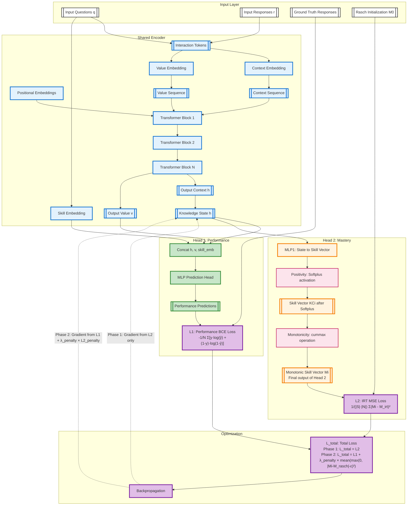

# iKT Architecture Approach

**Document Version**: 2025-11-26  
**Model Version**: iKT - Interpretability-by-design through semantic alignment of latent states
**Implementation Status**: 
- **iKT Base Model**: `pykt/models/ikt.py`
- **iKT Monitoring Variant**: `pykt/models/ikt_mon.py`
---

## References

- Base Model: `pykt/models/ikt.py`
- Monitoring Extension: `pykt/models/ikt_mon.py` (adds training-time monitoring)
- iKT Documentation: `paper/STATUS_iKT.md`
- PyKT Framework: `assistant/quickstart.pdf`, `assistant/contribute.pdf`
- Reproducibility Protocol: `examples/reproducibility.md`
- Rasch Model tehory and implementation: `paper/rasch_model.md`

---

## Model Versions

| **Aspect** | **GainAKT3Exp** | **GainAKT4 Phase 1** | **GainAKT4 Phase 2 ** | **iKT (Interpretability-by-Design)** |
|------------|-----------------|----------------------|--------------------------------|--------------------------------|
| **Encoders** | 2 (separate pathways) | 1 (shared representations) | 2 (Encoder 1: performance/mastery, Encoder 2: curves) | 1 (shared like Phase 1) |
| **Parameters** | ~167K | ~3.0M (single encoder + 2 heads) | ~6.0M (dual encoders + 3 heads) | ~3.0M (single encoder + 2 heads) |
| **Heads** | 1 per encoder | 2 on Encoder 1 | 3 total (2 on Encoder 1, 1 on Encoder 2) | 2 (Prediction + Mastery) |
| **Input Types** | Questions + Responses | Questions + Responses | Questions + Responses + Attempts (integer) | Questions + Responses |
| **Learning** | Independent optimization | Multi-task joint (Encoder 1) | Hybrid (Encoder 1: joint L1+L2, Encoder 2: L3) | Two-phase (Rasch init → constrained opt) |
| **Gradient Flow** | Separate to each encoder | Accumulated to Encoder 1 | Encoder 1 from L1+L2, Encoder 2 from L3 | Phase 1: L2 only; Phase 2: L1 + λ_penalty×L2_penalty |
| **Losses** | L1 (BCE), L2 (IM) | L1 (BCE), L2 (Mastery) | L1 (BCE), L2 (Mastery), L3 (Curve MSE/MAE) | L1 (BCE), L2 (Rasch MSE with ε tolerance) |
| **Loss Constraint** | λ₁ + λ₂ = 1.0 | λ_bce + λ_mastery = 1.0 | λ_bce + λ_mastery + λ_curve = 1.0 | Phase 1: Pure L2; Phase 2: L1 primary + λ_penalty×L2_penalty (soft barrier with ε) |
| **Interpretability** | Sigmoid learning curves | Skill vector {KCi} decomposition | {KCi} decomposition + IRT learning curves | Semantic alignment via Rasch grounding |
| **Psychometric Grounding** | Heuristic curves | Architectural constraints | IRT-based (Rasch model) with preprocessing | **Rasch 1PL IRT (explicit θ/b parameters)** |
| **Complexity** | High (dual encoders) | Medium (single encoder) | High (dual encoders + preprocessing) | **Low (single encoder, no curves)** |
| **Regularization** | Separate losses | Multi-task implicit | Multi-task + psychometric constraints | **Semantic constraints (L2 with ε tolerance to M_rasch)** |
| **Conditional Computation** | N/A | Skip Head 2 when λ_mastery=0 | Skip Head 2 + Encoder 2 when λs=0 | Phase-dependent (L2 → L1+L2 with ε) |
| **Architectural Constraints** | Loss-based | Softplus (positivity), cummax (monotonicity) | Same + L3 enforces IRT curves | Same (positivity, monotonicity) |
| **Performance (ASSIST2015)** | Not measured | 0.7181 AUC (λ_bce=1.0) | TBD (pending Phase 2 implementation) | TBD (pending implementation) |
| **Implementation Status** | Complete | **Complete (Validated)** | **Architecture Defined (Preprocessing Needed)** | **Design Complete (Pending Implementation)** |
| **Best For** | Complete pathway separation | Parameter efficiency, flexibility | Psychometric consistency + interpretability | **Transparent interpretability without complexity** |

---

## Approach

Deep learning models for knowledge tracing aim to predict learner performance over time, but most existing approaches emphasize predictive accuracy at the cost of interpretability. We present iKT, a novel framework that achieves interpretability-by-design through semantic alignment of latent states. iKT restricts the solution space to representations that are both predictive and consistent with pedagogical principles, ensuring that internal states correspond to meaningful learning concepts. This is accomplished via mechanisms that enforce semantic consistency and guide the model toward valid configurations. By adopting an interpretability-by-design paradigm, iKT offers transparent insight into knowledge evolution, enhances trustworthiness, and provides actionable guidance for educators. Experiments on benchmark knowledge tracing datasets show that iKT matches or surpasses state-of-the-art performance while delivering interpretable outputs on knowledge states and their progression along students’ learning paths.

### The Interpretability Challenge in Knowledge Tracing

**The Black Box Problem**: 

Traditional deep learning models for knowledge tracing achieve high predictive accuracy but suffer from a fundamental interpretability deficit. During training and deployment, these models operate as opaque black boxes: their internal representations evolve without semantic grounding and they provide predictions about the future performance of the students but no information about their knowledge states or learnign trajectories. 

1. **Hidden Knowledge Evolution**: We cannot observe how the model's internal knowledge states change as it processes student interaction sequences, making it impossible to verify whether learned representations correspond to meaningful learning constructs.

2. **Unverified Mastery Estimates**: When the try to project latent states into skill mastery vectors, they tend to exhibit patterns that violate pedagogical principles—they might decrease over time (contradicting the monotonicity principle), take negative values (lacking interpretable semantics), or show no correlation with observed performance (breaking the fundamental link between internal state and external behavior).

3. **Unconstrained Architectural Freedom**: Without explicit constraints, deep learning models can learn representations that optimize predictive loss while producing nonsensical intermediate states. The model might internally represent "mastery" as any arbitrary vector that happens to minimize cross-entropy, regardless of whether those values have educational meaning.

4. **Post-hoc Opacity**: Even when models incorporate mechanisms such as attention weights or skill embeddings, they don't translate into interpretable output. We cannot verify in real-time whether architectural constraints like positivity or monotonicity are actually satisfied during optimization, nor can we detect when the model strays into semantically inconsistent regions of the parameter space.

This interpretability gap has profound implications: educators cannot trust model recommendations, researchers cannot validate learning theories through model introspection, and the deployment of KT systems in high-stakes educational contexts remains problematic.

### The iKT Solution: Interpretability-by-Design with Semantic Alignment

**Core Innovation**: Rather than treating interpretability as an afterthought or post-hoc analysis problem, iKT embeds interpretability directly into the learning process through **semantic alignment of latent states**. The model's internal representations are constrained from the outset to remain within a solution space that is both predictive and pedagogically meaningful.

**Two Phases Approach**:

1. **Phase 1 - Psychometric Grounding (Rasch Alignment)**: 
   We initialize the model by training it **exclusively** to reproduce skill mastery estimates derived from Item Response Theory (IRT), specifically the Rasch model. During this phase, **only L2 (Rasch MSE loss) influences backpropagation** - the performance prediction head (L1/BCE) is not optimized. This establishes perfect alignment with theoretical reference $\{M_{\text{Rasch}}\}$, where each student-skill mastery value has clear psychometric interpretation: probability of correct response based on validated ability-difficulty parameters. The model learns interpretable representations without concern for prediction accuracy.

2. **Phase 2 - Performance Optimization with Soft Constraints**:

After achieving interpretable initialization, we switch to optimizing prediction performance (AUC). The loss becomes $L_{\text{total}} = L_1 + \lambda_{\text{penalty}} \times L_{2\_\text{penalty}}$, where **L1 (BCE) is the primary objective** driving model learning. The second term $L_{2\_\text{penalty}}$ acts as a **soft barrier constraint**: it adds no penalty when deviations from Rasch values stay within tolerance $\epsilon$, but imposes quadratic penalties for violations. This allows the model to improve AUC while maintaining interpretability - the learned mastery estimates can deviate slightly from IRT values (within $\epsilon$) to better predict student responses, but large deviations are prevented by the penalty term.

**Key Advantages**:

- **Verifiable Interpretability**: Unlike post-hoc explanations, our approach provides *guarantees* about the semantic consistency of learned representations using $\|M(\theta) - M_{\text{Rasch}}\| \leq \epsilon$ explicit, measurable constraints. 

- **Transparent Trade-offs**: The hyperparameters $\lambda$ and $\epsilon$ make the performance-interpretability balance explicit. The approach systematically explore the Pareto frontier to find configurations that are both accurate and interpretable.

- **Real-time Monitoring**: For research and validation purposes, the proposed model captures intermediate states during training without modifying the optimization process. This enables real-time verification that:
  - Skill mastery values remain positive and bounded
  - Monotonicity constraints are respected
  - Correlation between mastery estimates and observed performance remains strong
  - The model stays within the allowed deviation threshold $\epsilon$

- **Theoretical Grounding**: By anchoring to Rasch/IRT models, we connect deep learning to psychometric research. The model's internal states are not arbitrary neural activations—they are constrained to approximate quantities (ability, difficulty, mastery) that have established educational interpretations.

- **Minimal Overhead**: The monitoring mechanisms introduce negligible computational cost (~1-2% slowdown).

**Practical Impact**:

This approach bridges the gap between deep learning performance and educational accountability. Users can inspect model-estimated mastery levels with confidence that they reflect pedagogically meaningful constructs. It enables validation of the model's internal learning trajectories and alignment with educational theories. And it has competitive AUC while adding interpretability guarantees that purely black-box models don't provide.

**In Summary**: iKT demonstrates that interpretability need not be sacrificed for performance. By constraining the solution space to representations that are both predictive and semantically grounded, we achieve a model that is simultaneously accurate, interpretable, and theoretically justified—addressing the core limitations of existing deep knowledge tracing models. 


---

## Overfitting Issue and Architectural Revision

### Problem: Student-Specific Target Memorization

**Initial Approach**: Phase 1 trained the model to align mastery estimates $M_i[s,k]$ with per-student Rasch targets computed as:
$$M_{rasch}[s,k] = \sigma(\theta_s - \beta_k)$$

where $\theta_s$ is student $s$'s ability and $\beta_k$ is skill $k$'s difficulty.

**Critical Issue Discovered**: Experiment `20251128_162143_ikt_test_285650` revealed **Phase 1 overfitting**:
- Training $L_2$ MSE decreased from 0.0429 → 0.000672 (excellent fit)
- Validation $L_2$ MSE **increased** from 0.000027 → 0.000321 (generalization failure)

**Root Cause**: The model memorized **student-specific** mastery values for training students rather than learning generalizable skill representations. Since $M_{rasch}[s,k]$ includes student ability $\theta_s$, the model learned to reproduce training students' specific probabilities but couldn't generalize to validation students with different abilities.

**Evidence of Memorization**: 
- Model achieved near-perfect alignment with training data (MSE 0.000672)
- Same model performed worse on validation data than at initialization
- Classic overfitting signature: training improves while validation degrades

### Solution: Option 1b - Skill-Centric Regularization

**New Approach**: Replace per-student targets with **learnable skill difficulty embeddings** $\{\beta_k\}$ regularized toward IRT-calibrated values. This removes student-specific supervision and forces the model to learn skill representations that generalize across students.

**Key Changes**:

1. **Add Skill Difficulty Embeddings**:
   - Create learnable parameters $\beta \in \mathbb{R}^K$ (one per skill)
   - Initialize with IRT-calibrated difficulties from Rasch analysis
   - These represent the model's learned difficulty estimates

2. **Remove Per-Student Rasch Targets**:
   - No longer pass $M_{rasch}[s,k] = \sigma(\theta_s - \beta_k)$ to model
   - Model doesn't see student abilities $\theta_s$ during training
   - Prevents memorization of student-specific patterns

3. **Add Regularization Loss**:
   - Constrain skill embeddings to stay close to IRT estimates
   - $L_{reg} = \frac{1}{K} \sum_{k=1}^{K} (\beta_k - \beta_k^{IRT})^2$
   - Provides skill-level guidance without student-specific bias

4. **Modify Phase 2 Penalty**:
   - Compare mastery states to skill-only targets: $\sigma(-\beta)$
   - $L_{2,penalty} = \frac{1}{BLK} \sum \max(0, |M_i - \sigma(-\beta)|^2 - \epsilon)$
   - Enforces interpretability based on learned difficulties, not memorized patterns

**Expected Benefits**:
- **Prevents Overfitting**: No student-specific targets to memorize
- **Improves Generalization**: Model learns skill representations that work across all students
- **Maintains Interpretability**: Skill difficulties remain grounded in IRT theory
- **Reduces Complexity**: Simpler training (no per-student target construction)

### Implementation Plan (Option 1b)

**Phase 1: Model Architecture Changes** (`pykt/models/ikt.py`)

1. **Add skill difficulty embedding**:
   ```python
   def __init__(self, num_c, ...):
       # ... existing code ...
       self.skill_difficulty_emb = nn.Embedding(num_c, 1)
       # Initialize with IRT values if provided
   ```

2. **Update forward method**:
   ```python
   def forward(self, q, r, qshft):
       # Remove rasch_targets parameter
       # ... encoder/decoder logic ...
       
       # Extract skill difficulties from embedding
       beta_skills = self.skill_difficulty_emb.weight.squeeze()  # [K]
       
       # Compute skill-only mastery targets
       mastery_targets = torch.sigmoid(-beta_skills)  # [K]
       
       # Broadcast to batch dimensions
       beta_batch = mastery_targets.unsqueeze(0).unsqueeze(0)  # [1, 1, K]
       beta_batch = beta_batch.expand(B, L, self.num_c)  # [B, L, K]
       
       return {
           'y': y_pred,
           'skill_vector': skill_vector,
           'beta_targets': beta_batch
       }
   ```

3. **Update compute_loss method**:
   ```python
   def compute_loss(self, outputs, labels, phase, lambda_penalty, epsilon, 
                    beta_irt, lambda_reg=0.1):
       L1 = BCE(outputs['y'], labels)
       Mi = outputs['skill_vector']
       beta_targets = outputs['beta_targets']
       
       # Regularization loss (always active)
       beta_learned = self.skill_difficulty_emb.weight.squeeze()
       L_reg = ((beta_learned - beta_irt) ** 2).mean()
       
       if phase == 1:
           # Phase 1: Predictive learning + skill regularization
           L_total = L1 + lambda_reg * L_reg
       else:
           # Phase 2: Add interpretability constraint
           deviations = (Mi - beta_targets).abs()
           violations = torch.clamp(deviations - epsilon, min=0.0)
           L2_penalty = (violations ** 2).mean()
           L_total = L1 + lambda_penalty * L2_penalty + lambda_reg * L_reg
       
       return L_total, {
           'L1': L1.item(),
           'L2_penalty': L2_penalty.item() if phase == 2 else 0.0,
           'L_reg': L_reg.item()
       }
   ```

**Phase 2: Training Script Updates** (`examples/train_ikt.py`)

1. **Load IRT skill difficulties** (not per-student targets):
   ```python
   # Load only skill difficulties from rasch_targets.pkl
   with open(rasch_path, 'rb') as f:
       rasch_data = pickle.load(f)
   skill_difficulties = torch.tensor(
       [rasch_data['skill_difficulties'][k] for k in range(num_skills)],
       dtype=torch.float32
   )
   ```

2. **Initialize model with IRT difficulties**:
   ```python
   model = iKT(num_c=num_skills, ...)
   # Initialize embedding with IRT values
   with torch.no_grad():
       model.skill_difficulty_emb.weight.copy_(
           skill_difficulties.unsqueeze(1)
       )
   ```

3. **Remove per-student rasch_batch construction**:
   ```python
   # OLD: rasch_batch = construct_per_student_targets(uids, rasch_data)
   # NEW: Nothing needed - model uses internal embeddings
   
   # Forward pass no longer needs rasch_targets
   outputs = model(q, r, qshft)  # No rasch parameter
   ```

4. **Update loss computation call**:
   ```python
   loss, metrics = model.compute_loss(
       outputs, labels, phase, lambda_penalty, epsilon,
       beta_irt=skill_difficulties.to(device),
       lambda_reg=config['lambda_reg']
   )
   ```

**Phase 3: Evaluation Script Updates** (`examples/eval_ikt.py`)

1. **Remove rasch_targets loading and passing**:
   ```python
   # OLD: rasch_targets_data = load_rasch_targets(...)
   # OLD: outputs = model(q, r, qshft, rasch_targets=rasch_batch)
   
   # NEW: Model uses internal embeddings
   outputs = model(q, r, qshft)
   ```

2. **Update metrics collection**:
   ```python
   # Extract learned skill difficulties for analysis
   beta_learned = model.skill_difficulty_emb.weight.squeeze().cpu().numpy()
   
   # Compare with IRT estimates
   beta_irt = load_skill_difficulties(rasch_path)
   difficulty_correlation = np.corrcoef(beta_learned, beta_irt)[0, 1]
   ```

**Phase 4: Configuration Updates**

1. **Add new parameter** to `configs/parameter_default.json`:
   ```json
   {
     "lambda_reg": 0.1,
     "lambda_reg_help": "Regularization strength for skill difficulty embeddings"
   }
   ```

2. **Update parameters_audit.py**:
   ```python
   EXPECTED_PARAMS['ikt'].add('lambda_reg')
   ```

**Phase 5: Documentation Updates**

1. Update `paper/ikt_architecture_approach.md` (this file)
2. Update `paper/STATUS_iKT.md` with new approach
3. Add explanation to model docstring in `pykt/models/ikt.py`

**Phase 6: Testing and Validation**

1. **Smoke test**: Train for 2 epochs, verify no crashes
2. **Overfitting test**: Monitor train vs validation $L_{reg}$ convergence
3. **Generalization test**: Compare validation metrics with old approach
4. **Ablation study**: Test with different $\lambda_{reg}$ values (0.01, 0.1, 1.0)
5. **Full training**: Run complete experiment on assist2015

**Expected Outcomes**:
- Validation $L_2$ metrics should **not increase** during Phase 1
- Model should generalize to unseen students
- Learned skill difficulties should correlate highly with IRT estimates (r > 0.8)
- Performance (AUC) should remain competitive with baseline

**Success Criteria**:
- ✅ Validation MSE decreases or stays stable (no overfitting)
- ✅ Correlation between learned and IRT difficulties > 0.8
- ✅ AUC on test set ≥ baseline performance
- ✅ Violation rate < 10% in Phase 2

## Training Algorithm

### Two-Phase Training Algorithm

**Phase 1: Psychometric Initialization (Rasch Alignment)**

**Objective**: Learn to produce skill mastery estimates {Mi} that align with theoretical IRT/Rasch values. The model learns interpretable representations without optimizing for prediction performance.

**Loss Function**: 
```
L_total = L2 = MSE(Mi_predicted, Mi_rasch)
```

**Key Characteristics**:
- **Only L2 influences backpropagation** - performance loss L1 (BCE) is computed but NOT used for gradient updates
- **ε = 0** - exact alignment required, no tolerance
- **Gradient flow**: Only through mastery estimation head (Head 2)
- **Performance head (Head 1)** is updated via shared encoder gradients from L2, but not directly optimized

**Algorithm**:
```
Algorithm: PHASE1_RASCH_ALIGNMENT
Input: 
    - Training data D = {(q_i, r_i, a_i)} where q=questions, r=responses, a=attempts
    - Pre-computed Rasch mastery targets {Mi_rasch} for all students/skills
    - Hyperparameters: epochs_phase1, learning_rate_phase1
Output:
    - Model weights θ_init with interpretable mastery representations
    - Reference {Mi_rasch} (carried forward to Phase 2)

1. Pre-compute theoretical mastery targets from IRT/Rasch model:
   FOR each student n, skill s:
       Mi_rasch[n,s] = sigmoid(ability_n - difficulty_s)
   END FOR

2. Initialize model with random weights θ

3. Train with L2 (Rasch Alignment) ONLY:
   FOR epoch = 1 to epochs_phase1:
       FOR each batch B in D:
           // Forward pass (generates both BCE predictions and mastery estimates)
           outputs = model.forward(B.questions, B.responses, Mi_rasch)
           Mi_predicted = outputs['skill_vector']  // Model's {Mi} estimates
           
           // Compute L2 (Rasch alignment loss)
           L2 = MSE(Mi_predicted, Mi_rasch)  // epsilon=0 in Phase 1
           
           // CRITICAL: Use L2 for backpropagation (L1 ignored)
           L_total = L2  // Only Rasch loss drives learning
           
           // Backward pass - gradients flow only through mastery head
           L_total.backward()
           optimizer.step()
       END FOR
       
       // Monitor convergence
       IF L2_validation < 0.01:  // Good alignment achieved
           BREAK
       END IF
   END FOR

4. Save Phase 1 checkpoint:
   θ_init = model.state_dict()  // Interpretable initialization
   
5. RETURN θ_init, {Mi_rasch}  // Ready for Phase 2
```

**Expected Outcome**:
- L2 (MSE vs Rasch) → near 0 (< 0.01)
- Model learns interpretable skill mastery representations
- Performance (AUC) may be suboptimal - not the objective yet

**Phase 2: Performance Optimization with Soft Interpretability Constraints**

**Objective**: Maximize prediction performance (AUC) while maintaining interpretability by penalizing large deviations from the Rasch-aligned representations learned in Phase 1.

**Loss Function**: 
```
L_total = L1 + λ_penalty × L2_penalty

where:
  L1 = BCE(predictions, targets)  // Performance loss
  L2_penalty = mean(max(0, |Mi - Mi_rasch| - ε)²)  // Soft barrier constraint
```

**Key Characteristics**:
- **L1 drives optimization** - performance loss (BCE) is the primary objective
- **L2_penalty acts as constraint** - penalizes deviations beyond tolerance ε
- **No penalty within tolerance** - if |Mi - Mi_rasch| ≤ ε, no constraint loss
- **Quadratic penalty beyond ε** - violations are penalized with increasing severity
- **λ_penalty controls trade-off** - larger values enforce stricter interpretability

**Soft Barrier Mechanism**:
```
For each skill mastery estimate Mi:
  deviation = |Mi - Mi_rasch|
  
  if deviation ≤ ε:
      penalty = 0  // Within tolerance - no penalty
  else:
      excess = deviation - ε
      penalty = (excess)²  // Quadratic penalty on excess
```

**Algorithm**:
```
Algorithm: PHASE2_PERFORMANCE_OPTIMIZATION
Input:
    - Weights θ_init from Phase 1 (interpretable initialization)
    - Fixed Rasch targets {Mi_rasch} (reference from Phase 1)
    - Hyperparameters: λ_penalty, ε, epochs_phase2, learning_rate_phase2
Output:
    - Final model θ_final (high AUC + interpretable)
    - Final mastery estimates {Mi_final}

1. Initialize model with θ_init from Phase 1

2. Define soft barrier constraint function:
   FUNCTION compute_penalty_loss(Mi, Mi_rasch, ε):
       deviation = |Mi - Mi_rasch|  // Absolute difference per skill
       violation = ReLU(deviation - ε)  // Zero if within ε, excess otherwise
       penalty = mean(violation²)  // Quadratic penalty on violations
       RETURN penalty
   END FUNCTION

3. Training loop with constrained optimization:
   FOR epoch = 1 to epochs_phase2:
       FOR each batch B in D:
           // Forward pass
           outputs = model.forward(B.questions, B.responses, Mi_rasch)
           predictions = outputs['bce_predictions']
           Mi_predicted = outputs['skill_vector']
           
           // L1: Performance loss (PRIMARY OBJECTIVE)
           L1 = binary_cross_entropy(predictions, B.targets)
           
           // L2_penalty: Soft barrier constraint (SECONDARY)
           L2_penalty = compute_penalty_loss(Mi_predicted, Mi_rasch, ε)
           
           // Total loss: Performance + Constraint penalty
           L_total = L1 + λ_penalty × L2_penalty
           
           // CRITICAL: Backpropagation uses L_total
           // Gradients flow primarily from L1 (improving AUC)
           // Additional gradients from L2_penalty when violations occur
           L_total.backward()
           optimizer.step()
       END FOR
       
       // Monitor both objectives
       IF AUC_validation > target AND violation_rate < 5%:
           BREAK  // Both objectives satisfied
       END IF
   END FOR

4. Save final model:
   θ_final = model.state_dict()
   
5. RETURN θ_final, {Mi_final}
```

**Expected Behavior**:
- **Early Phase 2**: Small AUC improvements, violations may increase slightly as model explores
- **Mid Phase 2**: AUC increases steadily, violations stabilize below ε threshold  
- **Late Phase 2**: Convergence with high AUC (>0.75) and low violations (<5%)

**Hyperparameter Guidance**:
- **λ_penalty ∈ [10, 1000]**: Balance between performance and interpretability
  - Low (10-50): Prioritize AUC, accept more violations
  - High (500-1000): Strict interpretability, may sacrifice AUC
- **ε ∈ [0.05, 0.15]**: Tolerance for deviations
  - Small (0.05): Tight constraint, high interpretability
  - Large (0.15): More flexibility, better AUC potential

5. Train with constrained optimization:
   FOR epoch = 1 to epochs_phase2:
       FOR each batch B in D:
           // Forward pass
           outputs = model.forward(B.questions, B.responses)
           Mi_current = outputs['skill_vector']
           
           // Compute combined loss
           LT, L1, L2 = compute_total_loss(
               outputs, B.targets, Mi_current, Mi_rasch, lambda, epsilon
           )
           
           // Log component losses for analysis
           log_metrics(epoch, batch, L1, L2, LT)
           
           // Backward pass
           LT.backward()
           optimizer.step()
           
           // Optional: Hard constraint enforcement
           IF is_forbidden(Mi_current, Mi_rasch, epsilon):
               // Reject this update, revert to previous weights
               model.load_state_dict(previous_weights)
               learning_rate *= 0.5  // Reduce step size
           ELSE:
               previous_weights = model.state_dict()
           END IF
       END FOR
       
       // Validation and early stopping
       validation_auc = evaluate_model(model, validation_data)
       Mi_validation = extract_mastery_levels(model, validation_data)
       max_violation = max(|Mi_validation - Mi_rasch|)
       
       IF validation_auc >= target_auc AND max_violation <= epsilon:
           BREAK  // Found acceptable solution
       END IF
   END FOR

6. Extract final mastery estimates:
   Mi_final = model.extract_skill_vectors()

7. RETURN model, Mi_final
```

**Research Questions & Ablation Studies**

```
Algorithm: ABLATION_ANALYSIS
Input:
    - Trained models for various (lambda, epsilon) configurations
    - Test dataset D_test

1. Question 1: AUC vs Epsilon Trade-off
   FOR epsilon in [0.01, 0.05, 0.1, 0.15, 0.2, 0.25, 0.3]:
       FOR lambda in [0.5, 0.7, 0.9]:
           model = train_two_phase(D_train, lambda, epsilon)
           auc = evaluate_auc(model, D_test)
           Mi = extract_mastery(model, D_test)
           max_deviation = max(|Mi - M_rasch|)
           
           STORE results(epsilon, lambda, auc, max_deviation)
       END FOR
   END FOR
   
   // Plot AUC loss curve: AUC vs epsilon for fixed lambda
   // Identify acceptable epsilon range for target AUC threshold

2. Question 2: Pareto Frontier (Lambda Trade-off)
   FOR lambda in linspace(0.0, 1.0, 20):
       model = train_two_phase(D_train, lambda, epsilon_fixed)
       auc = evaluate_auc(model, D_test)
       Mi = extract_mastery(model, D_test)
       consistency = compute_consistency_metric(Mi, M_rasch)
       
       STORE pareto_point(lambda, auc, consistency)
   END FOR
   
   // Plot Pareto curve: AUC vs consistency
   // Identify optimal lambda balancing performance and interpretability

3. Question 3: Constraint Violation Frequency
   FOR each configuration (lambda, epsilon):
       violations = []
       FOR each training batch:
           IF is_forbidden(Mi_batch, M_rasch, epsilon):
               violations.append(batch_id)
           END IF
       END FOR
       
       violation_rate = len(violations) / total_batches
       STORE violation_stats(lambda, epsilon, violation_rate)
   END FOR

4. Generate analysis report:
   - AUC vs epsilon curves (per lambda value)
   - Pareto frontier (AUC vs interpretability)
   - Violation frequency heatmap (lambda × epsilon)
   - Optimal hyperparameter recommendations

RETURN analysis_report


**Key Design Decisions**

1. **Soft vs Hard Constraints**:
   - Soft: L2_constrained = mean(max(0, |Mi - M_rasch| - epsilon)^2) - Gradual penalty
   - Hard: L2 = +∞ if violation, else 0 - Reject forbidden states entirely
   - Recommendation: Start with soft for exploration, refine with hard for final training

2. **Lambda Weighting**:
   - lambda → 1.0: Prioritize predictive performance (AUC optimization)
   - lambda → 0.0: Prioritize interpretability (stay close to M_rasch)
   - Recommended range: [0.7, 0.9] for practical balance

3. **Epsilon Selection**:
   - Too small (< 0.05): Overly restrictive, may hurt AUC significantly
   - Too large (> 0.3): Constraint becomes ineffective
   - Recommended: Start with 0.1, tune via ablation studies

4. **Phase 1 Duration**:
   - Goal: Convergence to Rasch-consistent initialization
   - Typical: 5-10 epochs (monitor L2 plateau)
   - Early stopping: L2_validation change < 0.001 for 3 consecutive epochs

**Ultimately, we seek**: The model configuration θ* that:
- Maximizes predictive performance: max AUC(θ)
- Subject to interpretability constraint: ||Mi(θ) - M_rasch|| ≤ ε
- With configurable trade-off parameter λ

**Research Questions**:
1. Given acceptable AUC loss Δ_AUC, what is the feasible epsilon range? → AUC loss curve
2. How does lambda affect the performance-interpretability trade-off? → Pareto frontier analysis

## Loss Functions

### L1 - Predictive Loss (Performance Objective)

**Purpose**: Standard binary cross-entropy loss for next-response prediction, optimizing for predictive accuracy (AUC, accuracy).

**Mathematical Definition**:

$$\mathcal{L}_1(\theta) = -\frac{1}{N} \sum_{i=1}^{N} \left[ y_i \log(\hat{y}_i) + (1-y_i) \log(1-\hat{y}_i) \right]$$

Where:
- $\theta$: Model parameters
- $N$: Total number of predictions (batch size × sequence length)
- $y_i \in \{0,1\}$: Ground truth response (0=incorrect, 1=correct)
- $\hat{y}_i = \sigma(f_\theta(x_i)) \in [0,1]$: Model's predicted probability of correctness
- $f_\theta(x_i)$: Model's logit output for input $x_i$
- $\sigma(\cdot)$: Sigmoid activation function

**Properties**:
- Convex in logit space (well-behaved optimization landscape)
- Directly optimizes log-likelihood of observed responses
- Standard objective for classification in knowledge tracing
- Does not enforce any interpretability constraints

**Gradient**:
$$\frac{\partial \mathcal{L}_1}{\partial \theta} = -\frac{1}{N} \sum_{i=1}^{N} (y_i - \hat{y}_i) \frac{\partial \hat{y}_i}{\partial \theta}$$ 

### L2 - Mastery Loss or Rasch Loss

**Purpose**: Align model's skill mastery estimates with theoretically grounded values from the Rasch IRT model, ensuring psychometric consistency.

**Mathematical Definition**:

$$\mathcal{L}_2(\theta) = \frac{1}{|S| \cdot |N|} \sum_{n=1}^{|N|} \sum_{s=1}^{|S|} \left( M_{n,s}(\theta) - M_{n,s}^{\text{Rasch}} \right)^2$$

Where:
- $M_{n,s}(\theta) \in [0,1]$: Model's estimated mastery of student $n$ on skill $s$
- $M_{n,s}^{\text{Rasch}} = \sigma(\beta_n - \delta_s)$: Theoretical mastery from Rasch model
- $\beta_n$: Ability of student $n$ (estimated via IRT calibration)
- $\delta_s$: Difficulty of skill $s$ (estimated via IRT calibration)
- $|N|$: Number of students
- $|S|$: Number of skills

**Rasch Model Foundation**:

The Rasch (1PL) model defines the probability of correct response as:
$$P(r_{n,s} = 1 \mid \beta_n, \delta_s) = \sigma(\beta_n - \delta_s) = \frac{1}{1 + e^{-(\beta_n - \delta_s)}}$$

This provides the target mastery values $M_{n,s}^{\text{Rasch}}$ that represent theoretically consistent skill-level proficiencies.

**Properties**:
- Mean Squared Error (MSE) between predicted and theoretical mastery
- Only used in Phase 1 (warm-start initialization)
- Provides psychometrically grounded starting point
- Ensures initial {Mi} values are interpretable according to IRT principles

**Gradient**:
$$\frac{\partial \mathcal{L}_2}{\partial \theta} = \frac{2}{|S| \cdot |N|} \sum_{n,s} \left( M_{n,s}(\theta) - M_{n,s}^{\text{Rasch}} \right) \frac{\partial M_{n,s}(\theta)}{\partial \theta}$$

**Use Case**: Applied throughout both phases comparing to theoretical Rasch values $\{M_{\text{Rasch}}\}$. Phase 1 uses direct MSE (epsilon=0), Phase 2 adds tolerance threshold (epsilon>0). 


### L2 Phase-Specific Behavior (Continued)

**Purpose**: Deterrent Penalty prevents the model from deviating excessively from the theoretical reference mastery levels $\{M_{\text{Rasch}}\}$, maintaining semantic consistency during performance optimization.

**Mathematical Definition (Soft Constraint)**:

$$\mathcal{L}_3(\theta; M_{\text{Rasch}}, \epsilon) = \frac{1}{|S| \cdot |N|} \sum_{n=1}^{|N|} \sum_{s=1}^{|S|} \left[ \max\left(0, |M_{n,s}(\theta) - M_{n,s}^{\text{Rasch}}| - \epsilon \right) \right]^2$$

Where:
- $M_{n,s}(\theta)$: Current mastery estimate from model
- $M_{n,s}^{\text{Rasch}} \in \{M_{\text{Rasch}}\}$: Theoretical reference from IRT calibration
- $\epsilon > 0$: Tolerance threshold (maximum allowed deviation)
- $\max(0, \cdot)$: ReLU function (only penalizes violations)

**Alternative: Hard Constraint (Barrier Function)**:

$$\mathcal{L}_3^{\text{hard}}(\theta; M_0, \epsilon) = \begin{cases} 
0 & \text{if } \max_{n,s} |M_{n,s}(\theta) - M_{n,s}^{(0)}| \leq \epsilon \\
+\infty & \text{otherwise}
\end{cases}$$

**Constraint Violation Indicator**:

$$\text{Violation}(M, M_0, \epsilon) = \mathbb{1}\left[ \exists (n,s): |M_{n,s} - M_{n,s}^{(0)}| > \epsilon \right]$$

**Properties**:
- **Soft version**: Gradual quadratic penalty for deviations exceeding $\epsilon$
- **Hard version**: Infinite penalty (reject configuration) if any violation occurs
- Only active in Phase 2 (constrained optimization)
- Acts as regularizer preserving interpretability from Phase 1
- When $\epsilon$ is large, constraint becomes loose (more freedom)
- When $\epsilon$ is small, constraint is tight (strong interpretability preservation)

**Gradient (Soft Constraint)**:

$$\frac{\partial \mathcal{L}_3}{\partial \theta} = \frac{2}{|S| \cdot |N|} \sum_{n,s} \mathbb{1}\left[|M_{n,s} - M_{n,s}^{(0)}| > \epsilon\right] \cdot \text{sign}(M_{n,s} - M_{n,s}^{(0)}) \cdot \frac{\partial M_{n,s}}{\partial \theta}$$

Where $\mathbb{1}[\cdot]$ is the indicator function and $\text{sign}(\cdot)$ provides the direction of penalty.

**Total Loss (Combined Objective)**:

$$\mathcal{L}_{\text{total}}(\theta; \lambda, M_0, \epsilon) = \lambda \cdot \mathcal{L}_1(\theta) + (1-\lambda) \cdot \mathcal{L}_3(\theta; M_0, \epsilon)$$

This section is now superseded by the unified L2 approach below 

### Two-Phase Training with Single Interpretability Loss (L2)

**Simplified Two-Phase Strategy**:

1. **Phase 1 (L2 - Rasch Initialization)**: 
   $$\theta_{\text{init}} = \underset{\theta}{\arg\min} \; \mathcal{L}_2(\theta) = \underset{\theta}{\arg\min} \; \text{MSE}(M(\theta), M^{\text{Rasch}})$$
   
   Aligns model with psychometrically grounded Rasch mastery values.

2. **Phase 2 (L2 with Epsilon - Constrained Optimization)**:
   $$\theta^* = \underset{\theta}{\arg\min} \; \lambda \cdot \mathcal{L}_1(\theta) + (1-\lambda) \cdot \mathcal{L}_2^{\text{constrained}}(\theta; \epsilon)$$
   
   Optimizes performance (via $\mathcal{L}_1$) while maintaining proximity to Rasch values within tolerance $\epsilon$ (via $\mathcal{L}_2^{\text{constrained}}$).

**Key Insight**: L2 provides continuous semantic grounding throughout training:
- **Phase 1**: Direct alignment with Rasch theoretical values
- **Phase 2**: Constrained alignment with epsilon tolerance

This implements **interpretability-by-constraint** with a single, principled loss that always references psychometric theory, not model snapshots.

**Pareto Optimality Perspective**:

For fixed $\epsilon$, varying $\lambda$ traces the Pareto frontier:
- Minimize $\mathcal{L}_1$: Maximize predictive performance (AUC)
- Minimize $\mathcal{L}_2^{\text{constrained}}$: Maximize Rasch alignment (interpretability)

No single $\lambda$ dominates; the choice depends on the application's performance-interpretability requirements.

**Optimization Problem (Phase 2)**:

$$\theta^* = \underset{\theta}{\arg\min} \; \mathcal{L}_{\text{total}}(\theta; \lambda, \epsilon)$$

Subject to (soft constraint embedded in L2):
$$|M_{n,s}(\theta) - M_{n,s}^{\text{Rasch}}| \leq \epsilon \text{ (zero gradient)}, \quad \text{else penalized quadratically}$$ 

### ikT Architecture

**iKT** is a encoder-only transformer architecture with two output heads, designed for interpretable knowledge tracing with psychometric grounding. 

- **Head 1 (Prediction Head)**: Next-step prediction → Prediction Loss (L1)
- **Head 2 (Mastery Head)**: Skill-level mastery estimation → Mastery Loss (L2)

Both heads receive the same knowledge state representation (h1) from Encoder 1, forcing the encoder to learn features that optimize L1 and L2.

**Key Innovation**: The encoder learns representations that are **simultaneously good for**:
1. Predicting immediate next-step correctness (L1)
2. Estimating skill mastery levels (L2)

This dual-objective optimization with shared representations provides a natural regularization mechanism and interpretability-by-design.

---

## Architectural Comparison

### GainAKT3Exp (Dual-Encoder)
```
Input → Encoder 1 (96K params) → Head 1 → BCE Predictions → L1
Input → Encoder 2 (71K params) → Gain Quality → Effective Practice → Sigmoid Curves → IM Predictions → L2

Total: 167K parameters, two independent learning pathways
```

### GainAKT4 (Phase 1 - Dual-Head Single-Encoder)
```
                    ┌→ Head 1 (Performance) → BCE Predictions → L1 (BCE Loss)
                    │
Input → Encoder 1 → h1 ─┤
                    │
                    └→ Head 2 (Mastery) → MLP1 → {KCi} → MLP2 → Sigmoid → Mastery Predictions → L2 (Binary CE Loss)

Note: GainAKT4 Phase 1 uses MLP2 to aggregate skills into predictions

L_total = λ₁ * L1 + λ₂ * L2
Encoder 1 receives gradients from BOTH L1 and L2 (gradient accumulation)
```

### GainAKT4 (Phase 2 - Dual-Encoder, Three-Head)
```
                        ┌→ Head 1 (Performance) → BCE Predictions → L1 (BCE Loss)
                        │
Questions + Responses → Encoder 1 → h1 ─┤
                        │
                        └→ Head 2 (Mastery) → MLP1 → Softplus → cummax → MLP2 → Mastery Predictions → L2 (Binary CE Loss)

Note: GainAKT4 Phase 2 uses MLP2; iKT does not

Questions + Attempts → Encoder 2 → h2 → Head 3 (Curve) → Curve Predictions → L3 (MSE/MAE Loss)

L_total = λ_bce × L1 + λ_mastery × L2 + λ_curve × L3
Constraint: λ_bce + λ_mastery + λ_curve = 1.0

Encoder 1 receives gradients from L1 + L2
Encoder 2 receives gradients from L3
```

### iKT (Current Approach)

```
                        ┌→ Head 1 (Performance) → BCE Predictions → L1 (BCE Loss)
                        │
Questions + Responses → Encoder 1 → h1 ─┤
                        │
                        └→ Head 2 (Mastery) → MLP1 → Softplus → cummax → {Mi} -> L2 (MSE deviation of {Mi} from Rasch values)

Encoder 1 receives gradients from L1 + L2

Phase 1: L_total = L2 (Rasch initialization)
Phase 2: L_total = λ_bce × L1 + (1-λ_bce) × L2_constrained (with ε tolerance)

```

---

## Architecture Specification

### Visual Diagram

**iKT Architecture: Single-Encoder Two-Phase Design**



---
- Adds training-time monitoring capabilities
- Additional method: `forward_with_states()` captures intermediate representations
- Monitoring hook: Optional callback for periodic state capture
- Use for research, interpretability analysis, debugging
- Minimal overhead when monitoring disabled (~1-2% slowdown)

**Key Difference**: iKTMon = iKT + monitoring hooks (architecture identical)

## Component Specifications

### 1. Encoder 1 (Performance & Mastery Pathway)

**Architecture**: 
- Context embedding (num_c × 2, d_model) - for question-response interactions
- Value embedding (num_c × 2, d_model) - for question-response interactions
- Skill embedding (num_c, d_model)
- Positional embedding (seq_len, d_model)
- N transformer blocks with dual-stream attention
- **Output**: Knowledge state h1 [B, L, d_model]

**Input**: Questions (q) + Responses (r) - Boolean 0/1

**Learning Objective**: Learn representations that:
1. Enable accurate next-step prediction (via L1 Predictive Performance)
2. Capture skill-level mastery patterns (via L2 Mastery)

**Implementation**:
- Shared between iKT and iKTMon
- Dual-stream processing: separate context and value paths
- Causal masking for autoregressive prediction
- Layer normalization and residual connections at each block


### Head 1 - Prediction 

**Purpose**: Next-step correctness prediction (existing functionality)

**Architecture**:
```python
# Concatenate context, value, and skill embeddings
concat = torch.cat([h1, v1, skill_emb], dim=-1)  # [B, L, 3*d_model]

# MLP prediction head - Deeper 3-layer architecture (matches AKT)
prediction_head = nn.Sequential(
    nn.Linear(d_model * 3, d_ff),  # First layer
    nn.ReLU(),
    nn.Dropout(dropout),
    nn.Linear(d_ff, 256),           # Second layer (NEW - added for depth)
    nn.ReLU(),
    nn.Dropout(dropout),
    nn.Linear(256, 1)               # Third layer (output)
)
logits = prediction_head(concat).squeeze(-1)  # [B, L]
bce_predictions = torch.sigmoid(logits)
```

**Loss**: BCE Loss (L1)
```python
L1 = F.binary_cross_entropy_with_logits(logits, targets)
```


### Head 2 - Mastery Head

**Purpose**: Estimate skill-level mastery from knowledge state

**Constraints Enforced by Architecture**:
1. **Positivity**: Softplus activation in MLP1 guarantees KCi > 0
2. **Monotonicity**: Cumulative max operation ensures mastery never decreases

**Architecture Pipeline**:

### Head 2 Implementation Details (GainAKT4)

**Note**: This section describes GainAKT4's Head 2. For iKT differences, see the notes below.

**Phase-Dependent Computation**:
```python
# iKT: Always compute mastery head (no conditional logic)
# Compute mastery head
kc_vector = self.mlp1(h1)
kc_vector_mono = torch.cummax(kc_vector, dim=1)[0]
mastery_logits = self.mlp2(kc_vector_mono).squeeze(-1)
    mastery_predictions = torch.sigmoid(mastery_logits)
else:
    # Skip forward pass entirely (saves ~10-15% computation)
    kc_vector = None
    mastery_predictions = None
```

**Step 1: MLP1 - Project h1 to Skill Vector {KCi}**
```python
# Project knowledge state to skill-specific components
mlp1 = nn.Sequential(
    nn.Linear(d_model, d_ff),
    nn.ReLU(),
    nn.Dropout(dropout),
    nn.Linear(d_ff, num_c),
    nn.Softplus()  # Ensures strict positivity: KCi > 0 (smoother than ReLU)
)
kc_vector = mlp1(h1)  # [B, L, num_c], guaranteed positive by Softplus
```

**Positivity Guarantee (Architectural)**: Softplus activation `ln(1 + e^x)` ensures all skill components are strictly positive (KCi > 0), representing mastery levels that cannot be negative. This is enforced by architecture design, not by loss functions.

**Alternative**: Can use `F.relu()` for hard constraint (KCi ≥ 0) or `torch.abs()` for symmetry.

**Step 1.5: Monotonicity Enforcement (Architectural)**
```python
# Enforce monotonicity: mastery can only increase or stay constant
# Apply cumulative maximum across time dimension
kc_vector_mono = torch.cummax(kc_vector, dim=1)[0]  # [B, L, num_c]
# kc_vector_mono[:, t, s] = max(kc_vector[:, 0:t+1, s])
# This guarantees: kc_vector_mono[:, t+1, s] >= kc_vector_mono[:, t, s]
```

**Monotonicity Guarantee (Architectural)**: `torch.cummax()` ensures that for each student-skill pair, mastery at timestep t+1 is always ≥ mastery at timestep t. This is a hard architectural constraint, not a soft loss penalty.

[START NOT USED IN iKT - COMMENT THIS BLOCK]
**Step 2: MLP2 - Aggregate Skills to Prediction -> NOT NECCESSARY IN ikT**
```python
# Aggregate skill vector to per-timestep mastery prediction
# Predicts whether student will answer current question correctly
mlp2 = nn.Sequential(
    nn.Linear(num_c, num_c // 2),
    nn.ReLU(),
    nn.Dropout(dropout),
    nn.Linear(num_c // 2, 1)
)
mastery_logits = mlp2(kc_vector_mono).squeeze(-1)  # [B, L] - one prediction per timestep
```

**Step 3: Sigmoid Activation -> NOT NECCESSARY IN ikT**
```python
# Convert to probability: will student answer correctly?
mastery_predictions = torch.sigmoid(mastery_logits)  # [B, L] ∈ [0, 1]
# mastery_predictions[i, t] = P(correct response at timestep t | {KCi}[i, t, :])
```

**Loss: Mastery Loss (L2) -> CRITICAL DIFFERENCE BETWEEN GainAKT4 AND iKT**

**GainAKT4 (uses MLP2 + Sigmoid)**:
```python
# GainAKT4: Binary CE loss on aggregated predictions
mastery_predictions = torch.sigmoid(mlp2(kc_vector_mono))  # [B, L]
L2 = F.binary_cross_entropy(mastery_predictions, targets)  # [B, L] vs [B, L]
```

**iKT (uses skill vector directly)**:
```python
# iKT: MSE loss on skill vector vs Rasch targets
ski_vector = kc_vector_mono  # [B, L, num_c] - This is {Mi}
rasch_targets = get_rasch_mastery(students, skills)  # [B, L, num_c]
L2 = F.mse_loss(skill_vector, rasch_targets)  # Per-skill MSE
```
[END NOT USED IN iKT]

**Educational Interpretation**:
- **{KCi}** or **{Mi}**: Skill vector with one component per knowledge component [B, L, num_c]
- **KCi[s]** or **Mi[s]**: Estimated mastery level for skill s (from Encoder 1's knowledge state)
- **Positivity**: KCi[s] > 0 enforced by Softplus (architectural guarantee)
- **Monotonicity**: KCi[t+1, s] ≥ KCi[t, s] enforced by cummax (architectural guarantee)
- **Alignment**: 
  - **GainAKT4**: Aggregates {KCi} via MLP2+Sigmoid to get mastery_predictions, trained with BCE loss
  - **iKT**: Uses {Mi} skill vector directly, trained with MSE loss against Rasch targets
  - We consider "true" values those calculated using theoretical models (Rasch/IRT)

---

### Head 2 Implementation for iKT (Simplified Architecture)

**Critical Difference**: iKT does NOT use MLP2, Sigmoid2, or aggregated mastery_predictions.

**iKT Pipeline**:
```python
# Step 1: Project knowledge state to skill vector
kc_vector = mlp1(h1)  # [B, L, num_c] with Softplus activation

# Step 2: Enforce monotonicity
skill_vector = torch.cummax(kc_vector, dim=1)[0]  # {Mi} [B, L, num_c]

# Step 3: skill_vector IS the output - no further processing
# NO MLP2, NO Sigmoid, NO aggregation

return {
    'skill_vector': skill_vector  # {Mi} [B, L, num_c]
}
```

**Loss Computation for iKT**:
```python
rasch_targets = load_rasch_mastery(students, skills)  # [B, L, num_c]

# Phase 1: L2 = MSE({Mi}, M_rasch) - direct alignment
L2 = F.mse_loss(skill_vector, rasch_targets)

# Phase 2: L2_constrained = MSE(ReLU(|{Mi} - M_rasch| - epsilon))
deviation = torch.abs(skill_vector - rasch_targets)  # Per-skill deviation from Rasch
violation = torch.relu(deviation - epsilon)  # Only penalize excess beyond epsilon
L2_constrained = torch.mean(violation ** 2)
```

**Key Properties**:
- **Output**: Skill vector {Mi} [B, L, num_c] - one mastery value per skill
- **No aggregation**: Each skill's mastery is preserved separately
- **Direct comparison**: {Mi} compared element-wise to Rasch targets
- **Interpretability**: Each Mi[s] has clear psychometric meaning

---

### 6. Two-Phase Loss Function

**Total Loss**: Phase-dependent optimization objective

```python
# Phase 1: Rasch alignment (exact)
L_total = L2 = MSE(Mi, M_rasch)  # Only L2, L1 not used for backpropagation
                                  # epsilon = 0 (exact alignment required)

# Phase 2: Performance optimization with soft constraint
L_total = L1 + λ_penalty × L2_penalty

# Where:
# L1 = BCE(predictions, targets)  # Performance prediction loss (PRIMARY)
# L2_penalty = mean(max(0, |Mi - M_rasch| - ε)²)  # Soft barrier constraint
# λ_penalty: penalty strength (typically 10-1000)
# ε (epsilon): tolerance threshold (typically 0.05-0.15)
```**Loss Components**:
```python
# L1: Performance prediction loss (BCE)
L1 = F.binary_cross_entropy_with_logits(
    prediction_logits,  # From Head 1
    targets_response
)

# L2: Mastery estimation loss (BCE)
L2 = F.binary_cross_entropy_with_logits(
    mastery_logits,  # From Head 2
    targets_response
)

# L3: Curve prediction loss (MSE or MAE) -> NOT USED IN iKT
L3 = F.mse_loss(
    curve_predictions,  # From Head 3
    targets_attempts    # Attempts-to-mastery from preprocessing
)
# Alternative: L3 = F.l1_loss(...) for MAE

# L2: Constrained Rasch Loss (with Epsilon Tolerance)

# Compute deviation from Rasch theoretical values
deviation = torch.abs(skill_vector - rasch_mastery_targets)  # Per-skill deviations

# Soft constraint: Only penalize deviations exceeding epsilon
violation = torch.relu(deviation - epsilon)  # max(0, |M - M_rasch| - epsilon)

L2_constrained = torch.mean(violation ** 2)  # Quadratic penalty for excess deviations

# Note: In Phase 1, epsilon is not used (standard MSE)
# In Phase 2, epsilon creates a "tolerance zone" around Rasch values
```

**Hyperparameters**:
```python
λ_penalty   # Penalty strength for constraint violations (Phase 2)
            # Range: [10, 1000], higher = stricter interpretability
            
ε (epsilon) # Tolerance threshold for deviations from Rasch values
            # Range: [0.05, 0.15], smaller = tighter constraint
```

**Gradient Flow**:
- **Phase 1**: Gradients only from L2 (Rasch alignment)
- **Phase 2**: Gradients primarily from L1 (BCE) + correction from L2_penalty when violations occur
- **Encoder 2** receives gradients from: `lambda_curve * ∂L3/∂w₂` -> NOT USED IN iKT
- Independent optimization pathways reduce objective conflicts

**Conditional Computation**:
```python

[COMMENT THIS BLOCK IN iKT IMPLEMENTATION]
# Skip Encoder 2 forward pass when lambda_curve = 0 (saves computation)
if self.lambda_curve > 0:
    h2 = self.encoder2(questions, attempts)
    curve_predictions = self.curve_head(h2, v2, skill_emb2)
    L3 = F.mse_loss(curve_predictions, targets_attempts)
else:
    L3 = 0.0
[END COMMENT]
    

# Head 2 outputs skill vector {Mi} directly (no MLP2/Sigmoid)
skill_vector = self.mastery_head(h1)  # [B, L, num_c]

# L2 for iKT: Rasch MSE Loss on skill vector
if training_phase == 1:
        # Phase 1: Direct MSE (no epsilon)
        L2 = F.mse_loss(skill_vector, rasch_mastery_targets)
    else:
        # Phase 2: MSE with epsilon tolerance
        deviation = torch.abs(skill_vector - rasch_mastery_targets)
        violation = torch.relu(deviation - epsilon)
        L2 = torch.mean(violation ** 2)
else:
    L2 = 0.0
    skill_vector = None

# Compute total loss L_total
# Phase 1: L_total = L2 (only Rasch alignment, L1 ignored)
# Phase 2: L_total = L1 + λ_penalty * L2_penalty (performance + soft constraint)
if training_phase == 1:
    L_total = L2  # L1 not used for backpropagation
else:  # Phase 2
    L_total = L1 + lambda_penalty * L2_penalty  # L1 primary objective
```

**Architectural Guarantees**:
- **Monotonicity**: Enforced by `torch.cummax()` in Head 2 (no loss term needed)
- **Positivity**: Enforced by Softplus activation in Head 2

---

## iKT: Training-Time Monitoring

### Architecture Extension

**Inheritance Structure**:
```python
class iKTMon(iKT):
    """iKT with monitoring support for training-time interpretability analysis."""
```

**Additional Attributes**:
- `monitor`: Callback function (default: None)
- `monitor_frequency`: Batches between monitoring calls (default: 50)
- `global_batch_counter`: Tracks total batches across all epochs

**No Architecture Changes**: All encoder/head parameters identical to base iKT

### Monitoring Interface

**1. Forward with States**

```python
def forward_with_states(self, q, r, qry=None):
    """
    Extended forward pass that captures all intermediate representations.
    
    Returns:
        dict with standard outputs PLUS:
            - 'h1': Knowledge state [B, L, d_model]
            - 'v1': Value state [B, L, d_model]
            - 'questions': q
            - 'responses': r
    """
```

**Implementation Strategy**:
- Runs standard `self.forward(q, r, qry)` for predictions
- Re-computes encoder pass to capture h1, v1 (negligible cost)
- Augments output dictionary with intermediate states
- No gradient tracking (uses `torch.no_grad()` for monitoring)

**2. Monitor Registration**

```python
# In training script
model = iKTMon(num_c=123, seq_len=200, monitor_frequency=50)

def interpretability_monitor(batch_idx, h1, v1, skill_vector,
                             bce_predictions,
                             questions, responses):
    # Note: skill_vector is {Mi} [B, L, num_c] - the direct output of Head 2
    # No mastery_predictions in iKT (that's only in GainAKT4)
    # Custom analysis logic
    # - Save checkpoints
    # - Compute correlation metrics
    # - Visualize attention patterns
    # - Track skill mastery evolution
    pass

model.set_monitor(interpretability_monitor)
```

**3. Automatic Invocation**

Monitoring happens automatically during `forward()`:
```python
# Standard forward pass
output = model(q, r, qry)

# Behind the scenes (if monitor registered):
if self.global_batch_counter % self.monitor_frequency == 0:
    with torch.no_grad():
        self.monitor(
            batch_idx=self.global_batch_counter,
            h1=output['h1'],
            v1=output['v1'],
            skill_vector=output['skill_vector'],  # {Mi} [B, L, num_c]
            bce_predictions=output['bce_predictions'],
            questions=q,
            responses=r
        )
        # Note: No mastery_predictions - iKT uses skill_vector directly
```

### DataParallel Safety

**Challenge**: In multi-GPU training, each replica calls forward() independently, causing duplicate monitoring.

**Solution**: Primary device detection
```python
# Check if on primary device (DataParallel safety)
primary_device = (
    not hasattr(self, 'device_ids') or 
    q.device == torch.device(f'cuda:{self.device_ids[0]}')
)

should_monitor = (
    self.global_batch_counter % self.monitor_frequency == 0 and
    primary_device
)
```

Only the primary GPU replica triggers monitoring, preventing duplicate callbacks.

### Performance Impact

**Overhead Analysis**:
- **Monitor disabled** (`monitor=None`): <0.1% slowdown (just counter increment)
- **Monitor enabled** (frequency=50): ~1-2% slowdown
  - Re-computation of encoder pass: Minimal (already in cache)
  - Monitoring callback: Depends on user implementation
  - DataParallel check: O(1) constant time

**Memory Impact**:
- No additional GPU memory during standard forward pass
- Monitoring captures states in CPU memory (user-controlled)
- Intermediate tensors freed immediately after callback

### Example: Mastery Correlation Monitor (Correlation between predicted mastery values and Rasch pre-calculated values)

```python
import torch
import numpy as np
from scipy.stats import pearsonr

class MasteryCorrelationMonitor:
    def __init__(self, log_file='mastery_correlation.csv'):
        self.log_file = log_file
        self.correlations = []
        
    def __call__(self, batch_idx, skill_vector, responses, rasch_targets, **kwargs):
        """
        Compute correlation between skill vector {Mi} and predictions.
        For iKT: skill_vector IS the mastery estimate [B, L, num_c].
        """
        if skill_vector is None:
            return  # Skip if λ_mastery=0
        
        # Convert to numpy
        # skill_vector is {Mi} directly - no need for separate mastery_predictions
        mastery = skill_vector.detach().cpu().numpy().flatten()
        predictions = responses.detach().cpu().numpy().flatten()
        
        # Pearson correlation
        corr, pval = pearsonr(mastery, predictions)
        
        # Log results
        self.correlations.append({
            'batch': batch_idx,
            'correlation': corr,
            'p_value': pval,
            'significant': pval < 0.001
        })
        
        print(f"Batch {batch_idx}: Mastery-Response correlation = {corr:.4f} (p={pval:.4e})")

# Usage
monitor = MasteryCorrelationMonitor()
model.set_monitor(monitor)

# After training
print(f"Mean correlation: {np.mean([x['correlation'] for x in monitor.correlations]):.4f}")
print(f"Significant batches: {sum([x['significant'] for x in monitor.correlations])}/{len(monitor.correlations)}")
```

### Factory Functions

Both models provide consistent factory interfaces:

```python
# iKT (base model)
from pykt.models.ikt import create_model
model = create_model(config)

# GiKTMon (monitoring variant)
from pykt.models.ikt_mon import create_mon_model
model = create_mon_model(config)  # Same config, different class
```

**Config Keys** (identical for both):
- Required: `num_c`, `seq_len`, `lambda_penalty`, `epsilon`, `phase`
- Optional: `d_model`, `n_heads`, `num_encoder_blocks`, `d_ff`, `dropout`, `emb_type`
- iKTMon only: `monitor_frequency` (default: 50)

---

## Gradient Flow Verification

### Mathematical Guarantee

PyTorch's autograd **guarantees** gradient accumulation from both losses:

```python
# Phase 2 total loss
L_total = λ_bce * L1 + λ_mastery * L2_constrained

# Chain rule application for Encoder 1:
∂L_total/∂w₁ = [ADD  HERE]

```

**Key Properties**:
- Encoder 1 receives gradients from [ADD  HERE]

### Gradient Paths

[ADD  HERE]

**Combined Gradients**:
```python
# Encoder 1: Receives gradients from [ADD  HERE]
Encoder1.weight.grad = [ADD  HERE]

```

### Verification Test Script

```python
import torch
import torch.nn as nn
import torch.nn.functional as F

# Simulate encoder architecture
[ADD  HERE]

# ==== Test ====
[ADD  HERE]

# ==== Verify: Gradient accumulation ====
# Encoder 1 should receive: [ADD  HERE]
[ADD  HERE]

```

**Expected Output**:
```
[ADD  HERE]
```

**Proof**:
- Encoder 1 receives gradients from [ADD  HERE]
- PyTorch's autograd guarantees correct gradient accumulation 

---

### Gradient Analysis

Monitor gradient norms during training (dual-encoder):
```python
# After L_total.backward()
[ADD  HERE]
```

**Expected Gradient Magnitudes**:
[ADD  HERE]

---


---

### Implementation Architecture

**Preprocessing Rasch Vales** (Pre-Computed Once, Loaded During Training)

[ADD  HERE]


**Modified Forward Pass**:
```python
def forward(self, q, r, qry, n_a_batch_data, skill_difficulties_data):
    # q: [B, L] questions (skill IDs)
    # r: [B, L] responses (0/1)
    # qry: [B, L] query skills
    # n_a_batch_data: [B, num_skills] - precomputed n_a per student-skill (from preprocessing)
    # skill_difficulties_data: [num_skills] - precomputed δ_s per skill (from preprocessing)
    
    # Existing: Encoder 1 → h1, v1
    h1, v1 = self.encoder1(q, r)
    
    # Head 1: Performance prediction
    bce_predictions = self.head1(h1, v1, qry)
    
    # Head 2: Mastery estimation
    kc_vector = self.head2_mlp1(h1)  # [B, L, num_c]
    skill_vector = torch.cummax(kc_vector, dim=1)[0]  # {Mi} - monotonic skill vector
    # NO MLP2 in iKT: skill_vector is the final output [B, L, num_c]
    
    # L2: Rasch loss computation with phase-dependent epsilon
    if self.training_phase == 1:
        # Phase 1: Direct MSE (no epsilon)
        rasch_loss = F.mse_loss(skill_vector, rasch_targets)
    else:
        # Phase 2: MSE with epsilon tolerance
        deviation = torch.abs(skill_vector - rasch_targets)
        violation = torch.relu(deviation - self.epsilon)
          rasch_loss = torch.mean(violation ** 2)
    else:
        rasch_loss = None
    
    return {
        'bce_predictions': bce_predictions,
        'skill_vector': skill_vector,  # {Mi} [B, L, num_c]
        'rasch_loss': rasch_loss  # L2 (phase-dependent)
    }
```

---

### Preprocessing Phase - Calculate Rasch values of skill mastery levels for all students from assist2015 and assist2009 datasets 

See `paper/rasch_model.md` for a detailed account of theory and implementation. 

-

### Potential issues

- **Phase 1 Convergence**: If Rasch loss (L2) does not converge, the reference mastery M0 may be poorly calibrated. Consider:
  - Increasing Phase 1 epochs
  - Tuning Rasch IRT parameters (ability/difficulty estimation)
  - Checking data quality (sufficient interactions per student/skill)

- **Epsilon Selection**: Choosing epsilon too small may over-constrain Phase 2, preventing AUC improvement. Too large loses interpretability guarantees. Requires systematic ablation studies.

- **Lambda Trade-off**: Finding optimal lambda requires exploring Pareto frontier. No single value suits all datasets/applications.

- **Hard Constraint Rejection**: If using hard constraints (L2 = infinity when violated), optimization may stall. Consider:
  - Starting with soft constraints
  - Gradually tightening epsilon during training
  - Using adaptive learning rates

- **Computational Overhead**: Storing M0 reference values for all students/skills requires O(N × S) memory. For large-scale datasets, consider batch-wise storage or on-the-fly computation.


### Recommendations and Suggestions for Future Exploration

- **Dynamic Epsilon Scheduling**: Instead of fixed epsilon, gradually reduce tolerance during Phase 2 training (curriculum learning for interpretability).

- **Per-Skill Epsilon**: Allow different deviation tolerances for different skills based on Rasch model confidence.

- **Multi-Objective Optimization**: Use Pareto optimization algorithms (e.g., NSGA-II) to systematically explore lambda trade-offs.

- **Alternative Consistency Metrics**: Beyond L1/L2 distance, explore:
  - Rank correlation preservation (Spearman's rho)
  - Temporal coherence (smoothness of mastery trajectories)
  - Cross-skill consistency (respecting skill prerequisites)

- **Adaptive Phase Transition**: Automatically switch from Phase 1 to Phase 2 when L2 converges (instead of fixed epoch budget).

- **Uncertainty Quantification**: Add Bayesian layers to estimate confidence intervals on mastery predictions.

- **Transfer Learning**: Pre-train Phase 1 on large dataset, fine-tune Phase 2 on target dataset.

---

## Implementation Status Summary

### ✅ Fully Implemented
- **Model Architecture**: iKT class with dual-stream encoder, Head 1 (BCE), Head 2 (mastery with positivity/monotonicity)
- **Phase-Dependent Training**: Phase 1 (L2 only), Phase 2 (L1 + λ_penalty × L2_penalty)
- **Loss Computation**: Phase-aware total loss, comprehensive metrics tracking
- **Training Pipeline**: `train_ikt.py` with Rasch target loading, validation, checkpointing
- **Evaluation**: `eval_ikt.py` with AUC, mastery deviation analysis, JSON outputs
- **Preprocessing**: Rasch IRT calibration (`compute_rasch_targets.py`), BKT targets (`compute_bkt_targets.py`)
- **Visualization**: 4 analysis plots (loss evolution, AUC vs violations, deviation histogram, per-skill alignment)
- **Reproducibility**: All hyperparameters (lambda_penalty, epsilon, phase) saved to outputs

### ✅ All Critical Issues Resolved

**Previous Issue (FIXED)**:
1. ~~**Line 266 in `pykt/models/ikt.py`**: References undefined `self.lambda_mastery`~~
   - **Status**: ✅ FIXED - Removed conditional check, Head 2 always computes now
   - **Fix Applied**: Removed `if self.lambda_mastery > 0:` conditional
   - **Rationale**: iKT always needs mastery head - it's the core feature of the model

### ⚠️ Incomplete/Missing Features
- **Unit Tests**: No embedding/tokenization/gradient flow tests
- **Gradient Monitoring**: Not logging gradient norms during training
- **Per-Skill Curve Analysis**: Predicted vs actual attempts comparison not implemented
- **Ablation Studies**: Systematic hyperparameter sweeps pending

---

### Implementation Checklist 

#### Model Architecture (`pykt/models/ikt.py`)

- [x] ✅ Create `iKT` class inheriting from `nn.Module`
- [x] ✅ Add constructor parameters:
  - [x] ✅ `num_c` (number of skills/concepts)
  - [x] ✅ `seq_len` (maximum sequence length)
  - [x] ✅ `d_model` (embedding dimension)
  - [x] ✅ `n_heads` (attention heads) 
  - [x] ✅ `num_encoder_blocks` (number of transformer blocks)
  - [x] ✅ `d_ff` (feedforward dimension)
  - [x] ✅ `dropout` (dropout rate)
  - [x] ✅ `emb_type` (embedding type)
  - [x] ✅ `lambda_penalty` (penalty strength for constraint violations in Phase 2)
  - [x] ✅ `epsilon` (tolerance threshold for Rasch deviations)
  - [x] ✅ `phase` (1 = Rasch alignment only, 2 = performance optimization with constraints)

**Encoder 1 Implementation**:
- [ ] Add Encoder 1 class 
  - [ ] **Input tokenization**: `q + num_c * r` (questions + responses encoded as interaction tokens)
  - [ ] **Embedding tables**:
    - [ ] Context embedding: `nn.Embedding(num_c * 2, d_model)` for Q/K computation
    - [ ] Value embedding: `nn.Embedding(num_c * 2, d_model)` for V computation
    - [ ] Skill embedding: `nn.Embedding(num_c, d_model)` for skill-specific features
    - [ ] Positional embedding: `nn.Embedding(seq_len, d_model)` for sequence position 
  - [ ] **Transformer stack**: N encoder blocks with dual-stream attention (identical structure to GainAKT4 Encoder 1)
  - [ ] **Output**: Correctness Predictions
  
**Forward Pass Implementation**:
- [x] ✅ Accept inputs: `forward(q, r, qry=None, rasch_targets=None)`
  - [x] ✅ `q`: [B, L] - skill IDs
  - [x] ✅ `r`: [B, L] - binary responses (0/1)
  - [x] ✅ `qry`: [B, L] - query skills (optional, defaults to q)
  - [x] ✅ `rasch_targets`: [B, L, num_c] - pre-computed Rasch mastery targets (optional)
- [x] ✅ Single encoder path for both heads (shared representations)
- [x] ✅ Compute predictions:
  - [x] ✅ Head 1: BCE predictions from `[h, v, skill_emb]`
  - [x] ✅ Head 2: Skill vector `{Mi}` from `h` with positivity + monotonicity
- [x] ✅ Compute Rasch loss within forward pass (phase-dependent):
  - [x] ✅ Phase 1: `rasch_loss = F.mse_loss(skill_vector, rasch_targets)` (epsilon=0)
  - [x] ✅ Phase 2: `rasch_loss = mean(relu(|skill_vector - rasch_targets| - epsilon)²)` (soft barrier)
- [x] ✅ Return dictionary: `{'bce_predictions', 'skill_vector', 'rasch_loss', 'logits'}`

**Loss Computation (`compute_loss` method)**:
- [x] ✅ L1 (BCE): Binary cross-entropy with logits for performance prediction
- [x] ✅ L2 (Rasch): Phase-dependent MSE alignment (computed in forward pass)
- [x] ✅ Phase-dependent total loss:
  - [x] ✅ Phase 1: `L_total = rasch_loss` (L2 only, epsilon=0)
  - [x] ✅ Phase 2: `L_total = bce_loss + lambda_penalty * penalty_loss` (L1 + constrained L2)
- [x] ✅ Return loss dictionary: `{'total_loss', 'bce_loss', 'rasch_loss', 'penalty_loss'}`
- [x] ✅ Handles DataParallel case (reduce to scalar if needed)

**Phase-Dependent Behavior**:
- [x] ✅ Phase 1: Use only L2 for backpropagation (L1 computed but ignored in total_loss)
- [x] ✅ Phase 2: Use L1 + λ_penalty × L2_penalty for backpropagation
- [x] ✅ Epsilon: 0 in Phase 1 (exact alignment), >0 in Phase 2 (tolerance)

**Hyperparameters**:
- [x] ✅ `epsilon` (tolerance threshold for Rasch deviations, e.g., 0.05, 0.10, 0.15)
- [x] ✅ `lambda_penalty` (penalty strength for violations, e.g., 10-1000)
- [ ] ⚠️ `epochs_phase1` - not in model, handled by training script
- [ ] ⚠️ `epochs_phase2` - not in model, handled by training script
- [ ] ⚠️ `learning_rate_phase1` - not in model, handled by training script
- [ ] ⚠️ `learning_rate_phase2` - not in model, handled by training script

### Training Script (`examples/train_ikt.py`)

**Rasch Targets Loading**:
- [x] ✅ `load_rasch_targets()` function implemented
  - [x] ✅ Loads from `rasch_targets.pkl` or `bkt_targets.pkl`
  - [x] ✅ Raises `FileNotFoundError` if targets missing (NO random fallback)
  - [x] ✅ Validates file format and normalizes keys
  - [x] ✅ Returns dict with `rasch_targets`, `student_abilities`, metadata

**Training Modes**:
- [x] ✅ Manual single-phase: `--phase 1` or `--phase 2`
- [x] ✅ Automatic two-phase: `--phase null` (starts Phase 1, switches to Phase 2 on convergence)
- [x] ✅ Automatic phase switching fully implemented:
  - [x] ✅ Detects Phase 1 convergence via early stopping patience
  - [x] ✅ Automatically switches to Phase 2 (updates `model.phase = 2`)
  - [x] ✅ Resets early stopping counter for Phase 2
  - [x] ✅ Continues training until Phase 2 converges
  - [x] ✅ Comprehensive logging of phase transitions

**Phase 1: Rasch Initialization (L2 only)**:
- [x] ✅ Load Rasch-computed mastery targets from preprocessing
- [x] ✅ Training loop with phase-dependent loss:
  ```python
  for epoch in range(epochs_phase1):
      for batch in train_loader:
          outputs = model(questions=batch['questions'], 
                         responses=batch['responses'])
          L2 = outputs['rasch_loss']  # MSE(predicted_mastery, rasch_targets)
          L2.backward()
          optimizer.step()
          
          # Early stopping if L2 converges
          if validation_L2 < threshold:
              break
  
  # Save Phase 1 checkpoint and compute M0 reference
  torch.save(model.state_dict(), 'phase1_checkpoint.pth')
  M0 = extract_mastery_reference(model, full_dataset)
  ```

**Phase 2: Constrained Optimization (L1 + L2_constrained)**:
- [ ] Load Phase 1 checkpoint as initialization
- [ ] Set `rasch_loss_activated=False`
- [ ] Load M0 reference mastery from Phase 1
- [ ] Training loop:
  ```python
  model.load_state_dict(torch.load('phase1_checkpoint.pth'))
  
  for epoch in range(epochs_phase2):
      for batch in train_loader:
          outputs = model(questions=batch['questions'],
                         responses=batch['responses'])
          
          # L1: BCE loss for performance
          L1 = outputs['bce_loss']
          
          # L2: Rasch loss with epsilon tolerance (soft constraint)
          mastery_current = outputs['skill_vector']
          deviation = torch.abs(mastery_current - rasch_targets[batch_indices])
          violation = torch.relu(deviation - epsilon)
          L2_penalty = torch.mean(violation ** 2)
          
          # Phase-dependent loss
          if phase == 1:
              L_total = L2  # Only Rasch alignment (epsilon=0)
          else:  # phase == 2
              L_total = L1 + lambda_penalty * L2_penalty  # Performance + constraint
          
          L_total.backward()
          optimizer.step()
          
          # Log component losses
          logger.log({'L1': L1.item(), 'L2_penalty': L2_penalty.item(), 'L_total': L_total.item()})
  ```

**Actual Training Implementation**:
- [x] ✅ `train_epoch()` function:
  - [x] ✅ Loads Rasch targets per batch from dict using student UIDs
  - [x] ✅ Calls `model(q, r, qry, rasch_targets=rasch_batch)`
  - [x] ✅ Calls `model.compute_loss(outputs, targets)` for phase-dependent loss
  - [x] ✅ Backward pass with gradient clipping
  - [x] ✅ Returns comprehensive metrics dict
- [x] ✅ **Loss Computation**: Phase-dependent (handled by model.compute_loss())
  ```python
  loss_dict = model.compute_loss(outputs, targets)
  loss = loss_dict['total_loss']  # Phase 1: L2, Phase 2: L1 + λ_penalty * L2_penalty
  bce_loss = loss_dict['bce_loss']
  rasch_loss = loss_dict['rasch_loss']
  penalty_loss = loss_dict['penalty_loss']
  ```
- [x] ✅ **Logging**: Track all loss components
  - [x] ✅ Log L1 (bce_loss), L2 (rasch_loss), penalty_loss per batch
  - [x] ✅ Log L_total (optimization objective)
  - [x] ✅ Compute and log violation_rate and mean_violation
  - [x] ✅ Per-epoch CSV with all metrics
  - [x] ✅ JSON results with hyperparameters (lambda_penalty, epsilon, phase)
- [ ] ⚠️ **Gradient Monitoring**: Not implemented
  - [ ] ❌ Monitor `encoder.weight.grad.norm()` 
  - [ ] ❌ Log gradient norms periodically
- [x] ✅ **Validation**: Evaluate mastery deviations from Rasch values
  - [x] ✅ Compute max deviation: `max_dev = max(|M_predicted - M_rasch|)`
  - [x] ✅ Compute mean deviation and violation statistics
  - [x] ✅ Track constraint violation frequency across batches
  - [x] ✅ Monitor AUC on validation set
  - [x] ✅ All metrics saved to JSON and CSV

**Checkpoint and Mastery State Extraction**:
- [x] ✅ Best model checkpoint saved based on validation AUC
- [x] ✅ Phase-specific checkpoints in automatic mode (Phase 1 best → Phase 2 initialization)
- [x] ✅ Mastery states extraction after training via `mastery_states.py`
- [x] ✅ Analysis plots generation via `generate_analysis_plots.py`

### Evaluation Script (`examples/eval_ikt.py`)

**Multi-output evaluation**:
- [x] ✅ `test_epoch()` function implemented
  - [x] ✅ Evaluate outputs: BCE predictions and skill_vector mastery
  - [x] ✅ Compute AUC and accuracy from BCE predictions
  - [x] ✅ Handle None skill_vector gracefully (when no Rasch targets)
  - [x] ✅ Extract skill vectors for mastery deviation analysis
- [x] ✅ Mastery alignment metrics:
  - [x] ✅ Compute deviation statistics: mean, max, violations beyond epsilon
  - [x] ✅ Per-skill mastery deviation analysis
  - [x] ✅ Correlation between predicted and Rasch mastery
- [x] ✅ Comprehensive JSON output:
  - [x] ✅ Results for train/valid/test splits
  - [x] ✅ Hyperparameters section (lambda_penalty, epsilon, phase)
  - [x] ✅ Model metadata (num_concepts, num_parameters)
  - [x] ✅ Graceful handling in mastery_states.py
- [ ] ❌ **NOT IMPLEMENTED**: Per-skill curve analysis
  - [ ] ❌ Compare predicted vs actual attempts for each skill
  - [ ] ❌ Identify skills with best/worst curve predictions
  - [ ] ❌ Generate scatter plots: predicted vs actual attempts

### Preprocessing Scripts

**Rasch IRT Calibration (`examples/compute_rasch_targets.py`)**:
- [x] ✅ Implement Rasch IRT calibration script:
  - [x] ✅ Estimate student abilities θ_n using maximum likelihood
  - [x] ✅ Estimate skill difficulties b_s using maximum likelihood
  - [x] ✅ Compute mastery targets: Dynamic per-timestep based on BKT-like progression
  - [x] ✅ Save to file: `data/{dataset}/rasch_targets.pkl`
  - [x] ✅ Comprehensive statistics and validation

**BKT Calibration (`examples/compute_bkt_targets.py`)**:
- [x] ✅ Alternative mastery target computation using BKT
  - [x] ✅ Estimate P(L0), P(T), P(S), P(G) parameters
  - [x] ✅ Compute per-student-skill-timestep mastery probabilities
  - [x] ✅ Save to `data/{dataset}/bkt_targets.pkl`

**Data Loading Integration**:
- [x] ✅ Rasch targets loaded in `train_ikt.py` via `load_rasch_targets()`
  - [x] ✅ Load pre-computed values from pkl file
  - [x] ✅ Map to batches using student UIDs
  - [x] ✅ Pad/truncate to match sequence length
  - [x] ✅ Handle students not in calibration (raises error, no cold-start fallback)

### Parameter Configuration

**Soft Barrier Loss Parameters**:
- [x] ✅ Added to `configs/parameter_default.json`:
  ```json
  "lambda_penalty": 100,
  "epsilon": 0.10,
  "phase": 2,
  ```
- [x] ✅ All parameters logged to output JSON files for reproducibility
  
**Note**: `lambda_penalty` controls penalty strength independently; `epsilon` defines the tolerance zone.

### Testing and Validation

**Unit Tests**:
- [ ] ❌ **NOT IMPLEMENTED**: Embedding table size verification
- [ ] ❌ **NOT IMPLEMENTED**: Tokenization tests
- [ ] ❌ **NOT IMPLEMENTED**: Output shape verification
- [ ] ❌ **NOT IMPLEMENTED**: Gradient flow tests
- [ ] ❌ **NOT IMPLEMENTED**: Monotonicity constraint tests

**Integration Tests**:
- [x] ✅ Full forward pass tested (q, r, qry, rasch_targets)
- [x] ✅ Losses computed correctly (verified in training runs)
- [x] ✅ Head 2 always computes mastery (fixed: removed undefined `self.lambda_mastery` conditional)
- [x] ✅ Sanity checks passed: All losses decrease during training

**Ablation Experiments**:
- [ ] ⚠️ **IN PROGRESS**: Phase 1 pure Rasch alignment tests
- [ ] ⚠️ **IN PROGRESS**: Phase 2 ablation with varying λ_penalty and ε
- [ ] ⚠️ **PENDING**: Optimal hyperparameter selection based on AUC-interpretability trade-off

**Analysis and Visualization**:
- [x] ✅ Mastery states extraction implemented (`mastery_states.py`)
- [x] ✅ Analysis plots implemented (`generate_analysis_plots.py`):
  - [x] ✅ Loss evolution plot
  - [x] ✅ AUC vs violation rate scatter plot
  - [x] ✅ Deviation histogram
  - [x] ✅ Per-skill alignment plot
- [x] ✅ Integration with `run_repro_experiment.py`---

---

### Hyperparameters

| Parameter | Description | Recommended | Range |
|-----------|-------------|-------------|-------|
| `epsilon` | Soft barrier tolerance (allowed deviation from Rasch) | 0.10 | [0.05, 0.15] |
| `lambda_penalty` | Penalty strength for violations beyond ε | 100 | [10, 1000] |
| `phase` | Training phase (1=Rasch only, 2=BCE+penalty) | 2 | {1, 2} |
| `epochs_phase1` | Rasch initialization epochs | 30 | [20, 100] |
| `epochs_phase2` | Constrained optimization epochs | 100 | [50, 300] |
| `learning_rate_phase1` | Phase 1 learning rate | 0.001 | [0.0005, 0.005] |
| `learning_rate_phase2` | Phase 2 learning rate | 0.0005 | [0.0001, 0.002] |
| `d_model` | Embedding dimension | 128 | [64, 256] |
| `n_blocks` | Number of transformer blocks | 4 | [2, 8] |
| `num_attn_heads` | Number of attention heads | 8 | [4, 16] |
| `dropout` | Dropout rate | 0.2 | [0.1, 0.5] |
| `batch_size` | Training batch size | 64 | [32, 256] |
| `seq_len` | Maximum sequence length | 200 | [100, 500] |


---

### Key Design Decisions

**1. Inheritance Over Duplication**
- iKTMon inherits from iKT (no code duplication)
- Monitoring is opt-in via callback registration
- Zero overhead when monitoring disabled

**2. Phase-Dependent Training**
- Phase 1: Pure L2 Rasch alignment (ε=0, λ_penalty unused)
- Phase 2: L1 + λ_penalty × L2_penalty (ε>0 enables soft barrier)
- Training progression: strict alignment → constrained optimization

**3. Architectural Constraints**
- Softplus activation enforces positivity (KCi > 0)
- torch.cummax enforces monotonicity (KCi[t+1] ≥ KCi[t])
- No loss-based penalties needed (constraints guaranteed by architecture)

**4. Multi-Task Learning**
- Single backward pass through combined loss
- PyTorch autograd handles gradient accumulation automatically

**5. Factory Pattern**
- `create_model()` and `create_exp_model()` provide consistent interfaces
- Config dictionaries control all hyperparameters
- Easy integration with existing pykt training scripts

---

## Complete Training and Evaluation Workflow

### Overview: Two-Phase Training Strategy

The iKT model follows a two-phase training approach designed to balance prediction performance with interpretability through Rasch IRT alignment:

**Phase 1: Pure Rasch Alignment** - Learn skill representations aligned with IRT theory  
**Phase 2: Constrained Optimization** - Optimize prediction accuracy while maintaining interpretability

---

### Step 0: Precompute Rasch IRT Targets (One-Time Setup)

Before training, calibrate Rasch model parameters and compute mastery targets from training data.

```bash
# Compute Rasch targets for assist2015
python examples/compute_rasch_targets.py \
    --dataset assist2015 \
    --max_iterations 50

# Output: data/assist2015/rasch_targets.pkl (201 MB)
# Contains:
#   - student_abilities (θ): Student ability parameters
#   - skill_difficulties (b): Skill difficulty parameters  
#   - rasch_targets M_rasch[n,s,t]: Mastery targets per student-skill-timestep

# For other datasets:
python examples/compute_rasch_targets.py --dataset assist2009 --max_iterations 50
python examples/compute_rasch_targets.py --dataset statics2011 --max_iterations 50
```

**Rasch Calibration Results (assist2015)**:
- Students: 15,275
- Skills: 100
- Interactions: 544,331
- Student abilities (θ): Mean=2.475, Std=1.586, Range=[-4.667, 4.850]
- Skill difficulties (b): Mean=-2.004, Std=0.844, Range=[-3.300, 1.094]

**Note**: If Rasch targets are not available, training will fall back to random placeholders, but interpretability guarantees are lost.

---

### Step 1: Phase 1 Training - Pure Rasch Alignment

**Objective**: Learn skill vectors {Mi} that align with IRT-derived Rasch targets M_rasch

**Loss Function**: `L_total = L2` (Rasch loss only, BCE ignored)  
**Where**: `L2 = MSE(Mi, M_rasch)` with `epsilon = 0.0` (strict alignment)

**Training Command**:
```bash
python examples/run_repro_experiment.py \
    --short_title ikt_phase1_rasch \
    --phase 1 \
    --epsilon 0.0 \
    --epochs 20
    
# Rasch targets automatically loaded from data/{dataset}/rasch_targets.pkl
# Or specify custom path:
# --rasch_path /custom/path/rasch_targets.pkl
```

**Key Parameters**:
- `--phase 1`: Activates Phase 1 mode (pure Rasch alignment, L2 only)
- `--epsilon 0.0`: Must be 0 in Phase 1 (strict alignment)
- `--epochs 20`: Typical Phase 1 duration

**Expected Behavior**:
- **Rasch Loss (L2)**: Should decrease and converge (typically to < 0.001)
- **BCE Loss (L1)**: Still computed for monitoring, but not used in optimization
- **Architectural Constraints**: Positivity (Mi > 0) and monotonicity (Mi[t+1] ≥ Mi[t]) maintained by design
- **Output**: Best checkpoint saved based on lowest Rasch loss

**Monitoring**:
```bash
# Watch training progress
tail -f examples/experiments/<experiment_id>/train.log

# Check validation metrics
grep "Valid" examples/experiments/<experiment_id>/train.log
```

**Phase 1 Completion Criteria**:
- ✅ Rasch loss converges and stabilizes
- ✅ Model learns meaningful skill representations aligned with IRT
- ✅ No gradient explosions or instabilities
- ✅ Best checkpoint saved for Phase 2 initialization

---

### Step 2: Phase 2 Training - Constrained Optimization

**Objective**: Optimize prediction accuracy (AUC) while maintaining Rasch alignment within tolerance ε

**Loss Function**: `L_total = L1 + λ_penalty × L2_penalty`  
**Where**: 
- `L1 = BCE(predictions, targets)` - Binary cross-entropy for prediction
- `L2_penalty = mean(max(0, |Mi - M_rasch| - ε)²)` - Soft barrier penalty
- `ε > 0` - Tolerance threshold (violations beyond ε incur quadratic penalty)
- `λ_penalty` - Penalty strength (higher = stricter Rasch alignment)

**Training Command (Single Run)**:
```bash
python examples/run_repro_experiment.py \
    --short_title ikt_phase2_lam100_eps0.1 \
    --phase 2 \
    --epsilon 0.1 \
    --lambda_penalty 100 \
    --epochs 30
```

**Hyperparameter Ablation Study (Recommended)**:
```bash
# Grid search over lambda_penalty and epsilon
for lambda_penalty in 10 100 1000; do
  for epsilon in 0.05 0.10 0.15; do
    python examples/run_repro_experiment.py \
        --short_title ikt_phase2_lam${lambda_penalty}_eps${epsilon} \
        --phase 2 \
        --epsilon ${epsilon} \
        --lambda_penalty ${lambda_penalty} \
        --epochs 30
  done
done
```

**Key Parameters**:
- `--phase 2`: Activates Phase 2 mode (L1 + λ_penalty × L2_penalty)
- `--epsilon <value>`: Soft barrier tolerance (0.05-0.15 typical range)
  - **ε = 0.05**: Tight constraint, high interpretability
  - **ε = 0.10**: Moderate constraint, balanced trade-off
  - **ε = 0.15**: Looser constraint, more flexibility
- `--lambda_penalty <value>`: Penalty strength (10-1000)
  - **λ = 10**: Weak penalty, prioritizes AUC
  - **λ = 100**: Balanced (recommended starting point)
  - **λ = 1000**: Strong penalty, prioritizes interpretability
- `--epochs 30`: Typical Phase 2 duration

**Expected Trade-Offs**:
- **Small ε (0.05-0.1)**: 
  - ✅ High Rasch alignment
  - ✅ Strong interpretability guarantees
  - ⚠️ Potentially lower AUC
  
- **Large ε (0.2-0.3)**:
  - ✅ Higher AUC (better prediction performance)
  - ⚠️ Weaker Rasch alignment
  - ⚠️ Reduced interpretability

- **Optimal ε**: Typically around 0.1-0.15 (dataset-dependent)

**Monitoring Phase 2**:
```bash
# Watch both BCE and Rasch losses
tail -f examples/experiments/<experiment_id>/train.log | grep -E "Valid|AUC"

# Compare across epsilon values
grep "Best AUC" examples/experiments/*/train.log
```

---

### Step 3: Model Evaluation

After training completes, evaluate the best checkpoint on test data.

**Automatic Evaluation** (if `--auto_shifted_eval` was set):
```bash
# Evaluation runs automatically after training completes
# Results saved in: examples/experiments/<experiment_id>/eval_results.json
```

**Manual Evaluation**:
```bash
python examples/eval_ikt.py \
    --dataset assist2015 \
    --fold 0 \
    --model_path examples/experiments/<experiment_id>/best_model.pth \
    --test_type window \
    --output_dir examples/experiments/<experiment_id>/eval_results

# Arguments inherited from training config.json automatically
```

**Evaluation Metrics**:
- **AUC**: Area under ROC curve (primary metric)
- **Accuracy**: Binary classification accuracy
- **BCE Loss**: Binary cross-entropy loss
- **Rasch Loss**: MSE between Mi and M_rasch (interpretability metric)
- **Rasch Deviation**: Mean absolute deviation ||Mi - M_rasch||

**Test Types**:
- `window`: Standard window-based evaluation (pykt default)
- `standard`: Full sequence evaluation
- `quelevel`: Question-level evaluation (if available)

---

### Step 4: Results Analysis and Comparison

**Compare Phase 2 Epsilon Variants**:
```bash
# Create comparison table
python -c "
import json
import glob

results = []
for exp_dir in glob.glob('examples/experiments/*ikt_phase2_eps*'):
    with open(f'{exp_dir}/eval_results.json', 'r') as f:
        data = json.load(f)
        epsilon = data['config']['epsilon']
        auc = data['test_auc']
        rasch_dev = data.get('test_rasch_deviation', 'N/A')
        results.append((epsilon, auc, rasch_dev))

results.sort(key=lambda x: x[0])
print('Epsilon | Test AUC | Rasch Deviation')
print('--------|----------|----------------')
for eps, auc, dev in results:
    print(f'{eps:7.2f} | {auc:8.4f} | {dev}')
"
```

**Identify Optimal Model**:
- Best AUC with acceptable Rasch deviation (typically ε = 0.1-0.15)
- Check Pareto frontier: AUC vs interpretability trade-off
- Consider application requirements:
  - **High-stakes decisions**: Prefer interpretability (small ε)
  - **Performance-critical**: Prefer AUC (larger ε)

---

### Step 5: Interpretability Analysis (Optional)

Extract and analyze learned skill representations for educational insights.

```bash
# Extract skill trajectories from trained model
python examples/analyze_ikt_interpretability.py \
    --model_path examples/experiments/<best_model_id>/best_model.pth \
    --rasch_path data/assist2015/rasch_targets.pkl \
    --dataset assist2015 \
    --num_students 100 \
    --output_dir analysis/interpretability

# Generates:
#   - skill_correlations.csv: Correlation between Mi and M_rasch per skill
#   - trajectory_plots/: Mastery evolution visualizations
#   - deviation_analysis.csv: Deviation patterns by skill difficulty
#   - interpretability_report.pdf: Comprehensive analysis report
```

**Key Analyses**:
1. **Skill-Level Correlation**: How well do learned representations align with IRT?
2. **Trajectory Visualizations**: Mastery growth curves for individual students
3. **Difficulty Analysis**: Do harder skills (high b) show lower mastery?
4. **Monotonicity Validation**: Confirm Mi[t+1] ≥ Mi[t] throughout sequences
5. **Educational Insights**: Identify struggling students, skill gaps, learning patterns

---

### Complete Workflow Summary

```bash
# 0. One-time setup: Compute Rasch targets
python examples/compute_rasch_targets.py --dataset assist2015 --max_iterations 50

# 1. Phase 1: Pure Rasch alignment
python examples/run_repro_experiment.py \
    --short_title ikt_phase1_rasch \
    --phase 1 --epsilon 0.0 --epochs 20

# 2. Phase 2: Epsilon ablation study  
for epsilon in 0.05 0.1 0.15 0.2 0.3; do
    python examples/run_repro_experiment.py \
        --short_title ikt_phase2_eps${epsilon} \
        --phase 2 --epsilon ${epsilon} --epochs 30
done

# 3. Evaluate all models (automatic if --auto_shifted_eval set)
# Results in: examples/experiments/*/eval_results.json

# 4. Compare and select best model
python scripts/compare_epsilon_ablation.py

# 5. Generate interpretability analysis
python examples/analyze_ikt_interpretability.py \
    --model_path examples/experiments/<best>/best_model.pth \
    --output_dir analysis/interpretability
```

---

### Expected Timeline

**For assist2015 dataset on 6x V100 GPUs**:
- Rasch calibration: ~2-5 minutes
- Phase 1 training (20 epochs): ~30-40 minutes
- Phase 2 training (30 epochs, per ε): ~45-60 minutes
- Total for full ablation (5 ε values): ~4-5 hours
- Evaluation per model: ~5-10 minutes
- Interpretability analysis: ~10-15 minutes

**Total end-to-end workflow**: ~5-6 hours

---

### Troubleshooting

**Issue**: Rasch loss shows 0.0000 during training
- **Cause**: Rasch targets not loading correctly (using random placeholders)
- **Fix**: Verify `rasch_targets.pkl` exists in `data/{dataset}/` directory
- **Check**: Look for "✓ Loaded real Rasch IRT targets" in training log

**Issue**: Phase 1 Rasch loss not decreasing
- **Cause**: Learning rate too high, or architectural constraints conflicting
- **Fix**: Reduce learning rate to 0.00005, increase gradient clipping
- **Check**: Monitor gradient norms, ensure no NaN values

**Issue**: Phase 2 AUC lower than baseline
- **Cause**: Rasch constraint too strict (small ε), or Phase 1 not converged
- **Fix**: Increase ε to 0.15-0.2, ensure Phase 1 completed successfully
- **Check**: Compare with pure BCE baseline (no Rasch loss)

**Issue**: Out of memory errors
- **Cause**: Too many GPUs, batch size too large
- **Fix**: Reduce batch_size from 64 to 32, or use fewer GPUs
- **Check**: Monitor GPU memory usage with `nvidia-smi`

---

### References

**Training Scripts**:
- `examples/train_ikt.py` - Main training script (Phase 1 & 2)
- `examples/eval_ikt.py` - Evaluation script
- `examples/run_repro_experiment.py` - Experiment launcher with reproducibility checks
- `examples/compute_rasch_targets.py` - Rasch IRT calibration

**Documentation**:
- `examples/reproducibility.md` - Reproducibility protocol and guidelines
- `paper/rasch_model.md` - Rasch IRT theory and integration details
- `paper/ikt_architecture_approach.md` - iKT architecture specification (this document)

**Model Code**:
- `pykt/models/ikt.py` - iKT model implementation (379 lines)
- `pykt/config.py` - Model configuration and factory functions


---

## Mastery Target Methods: BKT vs IRT/Rasch

The iKT model uses pre-computed mastery targets for L2 (Mastery Loss) to guide skill vector learning. We support two methods for computing these targets: **BKT (Bayesian Knowledge Tracing)** and **IRT/Rasch (Item Response Theory)**.

### Overview

| Aspect | BKT | IRT/Rasch |
|--------|-----|-----------|
| **Paradigm** | Dynamic knowledge tracing | Psychometric measurement |
| **Parameters** | P(L0), P(T), P(S), P(G) per skill | θ (ability), β (difficulty) per skill |
| **Learning Model** | Explicit learning transition | Bayesian evidence accumulation |
| **Prediction** | P(correct) = P(L)×(1-P(S)) + (1-P(L))×P(G) | P(correct) = σ(θ-β) |
| **Monotonicity** | Near-monotonic with learning | Non-monotonic with uncertainty |
| **Interpretability** | Educational (learning, slip, guess) | Psychometric (latent ability) |

### Computation Scripts

#### 1. BKT Targets

```bash
# Compute BKT mastery targets
python examples/compute_bkt_targets.py \
  --dataset assist2015 \
  --output_path data/assist2015/bkt_targets.pkl
```

**Process:**
1. Prepares data in pyBKT format (user_id, skill_name, correct, order_id)
2. Fits BKT model via EM algorithm (learns P(L0), P(T), P(S), P(G) per skill)
3. Runs forward algorithm to compute P(learned) at each timestep
4. Saves targets as `bkt_targets.pkl`

**Output structure:**
```python
{
    'bkt_targets': {student_id: torch.Tensor[seq_len, num_skills]},
    'bkt_params': {skill_id: {'prior', 'learns', 'slips', 'guesses'}},
    'metadata': {'dataset', 'num_students', 'num_skills', 'method': 'BKT'}
}
```

#### 2. IRT/Rasch Targets

```bash
# Compute IRT/Rasch mastery targets (dynamic skill-specific)
python examples/compute_rasch_targets.py \
  --dataset assist2015 \
  --dynamic \
  --learning_rate 0.0 \
  --output_path data/assist2015/rasch_targets_cumulative.pkl
```

**Process:**
1. Calibrates Rasch model on all training data using py-irt
2. Computes skill-specific ability θₛ for each student
3. At each timestep t, recalibrates θₛ using all observations of skill s
4. Computes mastery: M[t,s] = σ(θₛ - βₛ)

**Output structure:**
```python
{
    'rasch_targets': {student_id: torch.Tensor[seq_len, num_skills]},
    'student_abilities': {student_id: float},
    'skill_difficulties': {skill_id: float},
    'metadata': {'dataset', 'num_students', 'num_skills', 'method': 'dynamic IRT'}
}
```

### Training with Mastery Methods

The `--mastery_method` parameter specifies which approach to use:

```bash
# Train with BKT targets (default)
python examples/train_ikt.py \
  --config configs/your_config.json \
  --rasch_path data/assist2015/bkt_targets.pkl \
  --mastery_method bkt

# Train with IRT/Rasch targets
python examples/train_ikt.py \
  --config configs/your_config.json \
  --rasch_path data/assist2015/rasch_targets_cumulative.pkl \
  --mastery_method irt
```

**Implementation notes:**
- The loading function automatically detects file format (`bkt_targets` vs `rasch_targets` key)
- Both formats are normalized internally to common `rasch_targets` key
- L2 loss computation is identical for both methods: MSE(Mi, M_target)

### Comparison: Student 2606 Example

#### Predictions Table

| Step | Skill | Resp | BKT_M  | BKT_P  | Rasch_M | Rasch_P | BKT_Err | Rasch_Err |
|------|-------|------|--------|--------|---------|---------|---------|-----------|
| 0    | 92    | 0    | 0.6220 | 0.5520 | 0.2034  | 0.2034  | 0.3047  | 0.0414    |
| 1    | 4     | 1    | 0.7758 | 0.6907 | 0.9889  | 0.9889  | 0.0957  | 0.0001    |
| 2    | 4     | 0    | 0.6500 | 0.6532 | 0.6667  | 0.6667  | 0.4267  | 0.4445    |
| 3    | 4     | 0    | 0.5127 | 0.6123 | 0.5000  | 0.5000  | 0.3749  | 0.2500    |
| ...  | ...   | ...  | ...    | ...    | ...     | ...     | ...     | ...       |
| Mean | -     | -    | 0.4967 | 0.6049 | 0.4170  | 0.4170  | 0.2408  | 0.1845    |

**Legend:**
- **BKT_M**: BKT Mastery P(learned)
- **BKT_P**: BKT Prediction = P(L)×(1-P(S)) + (1-P(L))×P(G)
- **Rasch_P**: Rasch Prediction (same as mastery)- **Rasch_M**: Rasch Mastery σ(θ-
- **Errors**: Squared prediction error (response - prediction)²

#### Performance Metrics

| Metric | BKT | Rasch | Winner | Difference |
|--------|-----|-------|--------|------------|
| **MSE** (lower better) | 0.2408 | 0.1845 | Rasch | -23.4% |
| **RMSE** (lower better) | 0.4908 | 0.4295 | Rasch | -12.5% |
| **AUC** (higher better) | 0.8037 | 0.7778 | BKT | +3.3% |

#### Skill-Level Analysis

**Skill 4** (14 attempts, 50% success rate):
```
Responses: [1, 0, 0, 1, 1, 0, 0, 1, 0, 0, 0, 1, 1, 1]
BKT:       [0.776, 0.650, 0.513, 0.673, 0.797, 0.676, 0.539, 0.695, 0.558, 0.430, 0.332, 0.510, 0.671, 0.795]
Rasch:     [0.989, 0.667, 0.500, 0.603, 0.665, 0.574, 0.502, 0.558, 0.502, 0.455, 0.416, 0.462, 0.501, 0.535]

BKT:   Range=0.464, Trend=6/13 increases, Avg|diff|=0.097
Rasch: Range=0.573, Trend=6/13 increases, Avg|diff|=0.097
```

**Skill 19** (15 attempts, 53% success rate):
```
Responses: [0, 0, 0, 1, 0, 1, 1, 0, 0, 1, 1, 0, 1, 1, 1]
BKT:       [0.415, 0.242, 0.151, 0.294, 0.176, 0.327, 0.506, 0.302, 0.180, 0.332, 0.511, 0.305, 0.482, 0.656, 0.793]
Rasch:     [0.065, 0.017, 0.008, 0.362, 0.290, 0.408, 0.486, 0.430, 0.385, 0.444, 0.491, 0.453, 0.492, 0.526, 0.556]

BKT:   Range=0.641, Trend=8/14 increases, Avg|diff|=0.133
Rasch: Range=0.547, Trend=8/14 increases, Avg|diff|=0.133
```

**Skill 92** (2 attempts, 0% success rate):
```
Responses: [0, 0]
BKT:       [0.622, 0.647]    # Optimistic due to learning transition
Rasch:     [0.203, 0.039]    # Pessimistic based on evidence

BKT:   Trend=1/1 increases
Rasch: Trend=0/1 increases (decreases)
```

### Statistical Properties

#### BKT Characteristics:
- **Mean prediction**: 0.6049 (moderate, bounded by slip/guess)
- **Prediction range**: [0.485, 0.733] (narrow, stable)
- **Standard deviation**: 0.066 (low variability)
- **Behavior**: Smoother predictions, maintains optimism even after errors

#### Rasch Characteristics:
- **Mean prediction**: 0.4170 (lower, evidence-driven)
- **Prediction range**: [0.008, 0.989] (wide, adaptive)
- **Standard deviation**: 0.213 (high variability)
- **Behavior**: More extreme values, adapts quickly to evidence

### Interpretation

#### BKT Advantages:
1. **Better AUC (0.804 vs 0.778)**: Superior at ranking/discrimination
2. **Educational interpretation**: P(T) models learning explicitly
3. **Stable predictions**: Slip/guess parameters prevent extreme values
4. **Optimistic for struggling students**: Maintains belief in learning potential

#### Rasch Advantages:
1. **Better MSE (0.185 vs 0.241)**: Superior calibration/accuracy
2. **Evidence-based**: Adapts quickly to actual performance
3. **Realistic for low performers**: Doesn't overestimate poor students
4. **Psychometric foundation**: Established measurement theory

### Recommendations

#### Use **BKT** when:
- **Educational applications** require interpretable parameters (learning rate, slip, guess)
- **Ranking quality** matters more than absolute accuracy
- **Optimistic estimates** are preferred (encouragement, adaptive sequencing)
- **Learning dynamics** need to be modeled explicitly
- Dataset has clear learning progression patterns

#### Use **Rasch/IRT** when:
- **Prediction accuracy** (MSE) is the primary concern
- **Calibration** matters for downstream applications
- **Conservative estimates** are preferred (assessment, placement)
- **Psychometric properties** (reliability, validity) are important
- Dataset has heterogeneous skill difficulties

#### For iKT Training:
- **L2 Loss** uses MSE, favoring calibration → **Rasch may be better**
- **Interpretability** of learned skill vectors → **BKT may be better**
- **Default choice**: **BKT** (balances both objectives, more KT-appropriate)

### Practical Usage

#### 1. Generate Both Targets (Recommended)

```bash
# Generate BKT targets
python examples/compute_bkt_targets.py \
  --dataset assist2015 \
  --output_path data/assist2015/bkt_targets.pkl

# Generate IRT targets
python examples/compute_rasch_targets.py \
  --dataset assist2015 \
  --dynamic \
  --learning_rate 0.0 \
  --output_path data/assist2015/rasch_targets_cumulative.pkl
```

#### 2. Train with Both Methods

**Note**: The iKT model uses an **automatic two-phase training** strategy:
- **Phase 1** (Rasch Alignment): Pure L2 loss to initialize skill vectors matching mastery targets
- **Phase 2** (Constrained Optimization): Combined loss λ_bce×L1 + λ_mastery×(L2+L3) with epsilon tolerance
- **Automatic switching**: Phase 1 runs until convergence (early stopping), then automatically switches to Phase 2

**How it works:**
1. Training starts in Phase 1 with pure Rasch alignment (L2 loss only)
2. When Phase 1 converges (patience epochs without improvement), automatically switches to Phase 2
3. Phase 2 continues with combined loss until convergence or epochs exhausted
4. Warnings issued if insufficient epochs for both phases to converge

**Training modes:**

```bash
# DEFAULT: Automatic two-phase training
# Phase 1 runs until convergence, then auto-switches to Phase 2
python examples/run_repro_experiment.py \
  --config configs/my_config.json \
  --override rasch_path=data/assist2015/bkt_targets.pkl \
  --override mastery_method=bkt

# Manual Phase 1 only (for debugging/analysis)
python examples/run_repro_experiment.py \
  --config configs/my_config.json \
  --override rasch_path=data/assist2015/bkt_targets.pkl \
  --override mastery_method=bkt \
  --override phase=1

# Manual Phase 2 only (advanced use, not recommended)
python examples/run_repro_experiment.py \
  --config configs/my_config.json \
  --override rasch_path=data/assist2015/bkt_targets.pkl \
  --override mastery_method=bkt \
  --override phase=2

# With different mastery methods
python examples/run_repro_experiment.py \
  --config configs/my_config.json \
  --override rasch_path=data/assist2015/rasch_targets_cumulative.pkl \
  --override mastery_method=irt

# With monotonic targets
python examples/run_repro_experiment.py \
  --config configs/my_config.json \
  --override rasch_path=data/assist2015/bkt_targets_mono.pkl \
  --override mastery_method=bkt_mono
```

**Recommendations:**
- **Default (phase=null)**: Use automatic two-phase for production training
- **Manual phase=1**: Only for analyzing Phase 1 convergence
- **Manual phase=2**: Advanced use only, requires careful setup

#### 3. Compare Results

Compare the trained models on:
- **AUC/ACC** on test set (performance prediction)
- **L2 loss** convergence (mastery alignment)
- **Interpretability** of learned skill vectors
- **Monotonicity** satisfaction rate

### Implementation Details

The mastery method parameter is handled transparently:

1. **Parameter specification**: `--mastery_method {bkt,irt}` (default: `bkt`)
2. **File detection**: Automatic based on `bkt_targets` vs `rasch_targets` key
3. **Normalization**: Both formats converted to common `rasch_targets` internally
4. **Loss computation**: Identical MSE(Mi, M_target) for both methods
5. **Metadata tracking**: Method recorded in experiment config for reproducibility

### Monotonic Smoothing (New Feature)

Both BKT and IRT methods now support optional **monotonic smoothing**, which enforces that once a student's mastery probability increases for a skill, it never decreases in subsequent timesteps.

#### Algorithm

For each student and each skill independently:
1. Start with first timestep value (unchanged)
2. For timestep $t$ from 1 to $T-1$:
   - If $M[t] < M[t-1]$: set $M[t] = M[t-1]$ (force monotonicity)
   - Otherwise: keep $M[t]$ unchanged (already monotonic)

**Properties:**
- **Skill-wise independence**: Each skill's trajectory is smoothed independently
- **Forward-only**: Single pass through the sequence, O(seq_len × num_skills)
- **Preserves increases**: Only prevents decreases, never reduces mastery values
- **No lookahead**: Decision at timestep $t$ only depends on $t-1$

**Example for Skill 42:**
```
Original:  [0.60, 0.75, 0.65, 0.80, 0.70]
Smoothed:  [0.60, 0.75, 0.75, 0.80, 0.80]
            ↑     ↑     ↑     ↑     ↑
            keep  keep  fix   keep  fix
```

#### File Generation

Both computation scripts now automatically generate **two versions** of each target file:

```bash
# Generate BKT targets (creates both standard and monotonic versions)
python examples/compute_bkt_targets.py --dataset assist2015
# Output:
#   - data/assist2015/bkt_targets.pkl (standard, monotonic=False)
#   - data/assist2015/bkt_targets_mono.pkl (smoothed, monotonic=True)

# Generate IRT targets (creates both standard and monotonic versions)
python examples/compute_rasch_targets.py \
  --dataset assist2015 \
  --dynamic \
  --learning_rate 0.0
# Output:
#   - data/assist2015/rasch_targets_cumulative.pkl (standard, monotonic=False)
#   - data/assist2015/rasch_targets_cumulative_mono.pkl (smoothed, monotonic=True)
```

**Naming convention**: Monotonic versions have `_mono` suffix before `.pkl`

#### Training with Monotonic Targets

The `--mastery_method` parameter now accepts **four values**:
- `bkt`: Standard BKT (allows non-monotonic trajectories)
- `irt`: Standard IRT/Rasch (allows non-monotonic trajectories)
- `bkt_mono`: Monotonic BKT (enforces monotonicity)
- `irt_mono`: Monotonic IRT/Rasch (enforces monotonicity)

**Examples:**

```bash
# Train with standard BKT
python examples/run_repro_experiment.py \
  --config configs/my_config.json \
  --override rasch_path=data/assist2015/bkt_targets.pkl \
  --override mastery_method=bkt

# Train with monotonic BKT
python examples/run_repro_experiment.py \
  --config configs/my_config.json \
  --override rasch_path=data/assist2015/bkt_targets_mono.pkl \
  --override mastery_method=bkt_mono

# Train with standard IRT
python examples/run_repro_experiment.py \
  --config configs/my_config.json \
  --override rasch_path=data/assist2015/rasch_targets_cumulative.pkl \
  --override mastery_method=irt

# Train with monotonic IRT
python examples/run_repro_experiment.py \
  --config configs/my_config.json \
  --override rasch_path=data/assist2015/rasch_targets_cumulative_mono.pkl \
  --override mastery_method=irt_mono
```

The training script automatically verifies that the file's `metadata['monotonic']` field matches the requested method and displays a warning if there's a mismatch.

#### When to Use Monotonic Smoothing

**Use monotonic smoothing when:**
- You believe mastery is truly **permanent** (no forgetting)
- Educational policy requires **"no regression"** guarantees
- You want more **optimistic/encouraging** progression trajectories
- Slip/guess parameters might **overestimate measurement uncertainty**
- Downstream applications require **guaranteed monotonic progression**

**Use standard (non-monotonic) when:**
- **Forgetting** is a real phenomenon in your domain
- You want **measurement uncertainty** reflected in targets
- **Statistical realism** is more important than pedagogical messaging
- You want to preserve the **theoretical properties** of BKT or IRT (especially slip/guess in BKT)

#### Comparison Summary

| Version | BKT Standard | BKT Monotonic | IRT Standard | IRT Monotonic |
|---------|--------------|---------------|--------------|---------------|
| **Trajectory** | Can decrease | Never decreases | Can decrease | Never decreases |
| **Realism** | Realistic uncertainty | Idealized progression | Realistic uncertainty | Idealized progression |
| **Forgetting** | Allowed (via slip) | Not allowed | Allowed (ability drop) | Not allowed |
| **Use Case** | Research, realism | Education, policy | Psychometrics | High-stakes assessment |

### Future Extensions

Potential hybrid approaches:
- **Ensemble**: Weighted average of BKT and Rasch predictions
- **Adaptive**: Use BKT early (learning), switch to Rasch late (assessment)
- **Skill-specific**: BKT for high-practice skills, Rasch for sparse data
- **Multi-parameter IRT**: Extend to 2PL/3PL models with discrimination parameters
- **Hybrid monotonicity**: Apply smoothing only to select skills or time ranges

---

## Comprehensive Metrics Tracking

### Overview

The iKT training and evaluation system generates comprehensive metrics per epoch to track the trade-off between performance (AUC) and interpretability (Rasch alignment). Metrics are organized into four categories corresponding to loss components.

### Output Files

**Training Phase:**
- `results_training.json`: Training metrics per epoch
- `results_validation.json`: Validation metrics per epoch  
- `results_training_validation.json`: Combined training+validation per epoch
- `metrics_epoch.csv`: All metrics in CSV format (training + validation)

**Testing Phase:**
- `results_test.json`: Final test set metrics
- `metrics_epoch_test.csv`: Test metrics in CSV format

### Metric Categories

#### 1. L1 - Performance Prediction Metrics

**Purpose:** Measure next-response prediction accuracy (primary objective in Phase 2)

| Metric | Description | Interpretation | Target |
|--------|-------------|----------------|---------|
| `l1_bce` | Binary Cross-Entropy Loss | Lower = better predictions | Minimize |
| `auc` | Area Under ROC Curve | Discrimination ability (0.5-1.0) | Maximize (>0.75) |
| `accuracy` | Classification accuracy | Overall correctness (0-1) | Maximize (>0.70) |

**Interpretation:**
- **AUC** is the primary performance metric - measures model's ability to rank correct/incorrect responses
- Values 0.7-0.8 are good, >0.8 are excellent for knowledge tracing
- L1 should decrease throughout training; plateauing indicates convergence

---

#### 2. L2 - Rasch Alignment Metrics

**Purpose:** Measure how well skill mastery estimates align with theoretical Rasch/IRT values

| Metric | Description | Interpretation | Target |
|--------|-------------|----------------|---------|
| `l2_mse` | Mean Squared Error vs M_rasch | Average squared deviation | Minimize |
| `l2_mae` | Mean Absolute Error vs M_rasch | Average absolute deviation | Minimize (<0.1) |
| `corr_rasch` | Pearson correlation with M_rasch | Linear relationship strength (-1 to 1) | Maximize (>0.8) |

**Interpretation:**
- **MSE** and **MAE** quantify alignment quality - lower is better
- **Correlation** measures if Mi and M_rasch move together (high correlation = good interpretability)
- In Phase 1, these metrics should approach zero as model learns Rasch targets
- In Phase 2, some deviation is expected as model prioritizes AUC

**Typical Values:**
- Phase 1 (end): MSE <0.01, MAE <0.05, Correlation >0.95
- Phase 2 (with ε=0.1): MSE <0.02, MAE <0.12, Correlation >0.85

---

#### 3. L2_penalty - Constraint Violation Metrics

**Purpose:** Track violations of the interpretability constraint (|Mi - M_rasch| > ε)

| Metric | Description | Interpretation | Target |
|--------|-------------|----------------|---------|
| `penalty_loss` | Soft barrier penalty value | Penalty actually applied | Should be near 0 |
| `violation_rate` | % of (student, skill) pairs violating constraint | Fraction exceeding ε (0-1) | <5% |
| `mean_violation` | Average excess deviation (when violating) | Mean of max(0, \|Mi-M_rasch\|-ε) | <0.05 |
| `max_violation` | Worst-case excess deviation | Largest constraint violation | <0.15 |

**Interpretation:**
- **Penalty Loss** reflects how much the constraint is being violated - should be small in Phase 2
- **Violation Rate** shows what percentage of mastery estimates exceed tolerance
  - <1%: Excellent constraint satisfaction
  - 1-5%: Good constraint satisfaction  
  - 5-10%: Acceptable (may need larger λ_penalty)
  - >10%: Poor - increase λ_penalty or ε
- **Mean/Max Violation** show severity of violations when they occur

**Phase-Specific Behavior:**
- Phase 1: All violation metrics should be ~0 (direct MSE minimization)
- Phase 2: Some violations expected as model optimizes AUC within tolerance

---

#### 4. L_total - Combined Loss Metrics

**Purpose:** Track overall optimization objective and loss composition

| Metric | Description | Interpretation | Target |
|--------|-------------|----------------|---------|
| `total_loss` | L_total value | Overall optimization objective | Minimize |
| `loss_ratio_l1` | L1 / L_total | Fraction from performance loss (0-1) | Phase-dependent |
| `loss_ratio_penalty` | (λ_penalty × L2_penalty) / L_total | Fraction from constraint penalty (0-1) | Should be small |

**Interpretation:**
- **Total Loss** should decrease monotonically during training
- **Loss Ratios** show which component dominates:
  - Phase 1: `loss_ratio_l1` ≈ 0, most loss from L2
  - Phase 2 (no violations): `loss_ratio_l1` ≈ 1.0, `loss_ratio_penalty` ≈ 0
  - Phase 2 (with violations): `loss_ratio_l1` < 1.0, penalty contributes

**Healthy Training Signature:**
- Phase 2 with well-tuned λ_penalty: `loss_ratio_penalty` < 0.1 (constraint rarely violated)
- If `loss_ratio_penalty` > 0.3: Increase λ_penalty to enforce constraint more strongly

---

### Recommended Parameter Ranges

Based on metric analysis, recommended hyperparameter ranges:

| Parameter | Range | Rationale |
|-----------|-------|-----------|
| **λ_penalty** | [100, 1000] | Sufficient to deter violations without dominating L_total |
| **ε (epsilon)** | [0.05, 0.15] | Balance interpretability (lower) vs AUC (higher) |

**Tuning Strategy:**
1. Start with λ_penalty=100, ε=0.10
2. If `violation_rate > 10%`: Increase λ_penalty (e.g., 100 → 500)
3. If `auc_drop > 0.03` from Phase 1: Increase ε (e.g., 0.10 → 0.15)
4. Monitor `loss_ratio_penalty`: Should stabilize <0.15 when converged

---

### Monitoring During Training

**Key Plots to Generate:**

1. **Loss Evolution** (4 subplots):
   - L_total, L1, L2_penalty, L2_MSE over epochs
   - Identify convergence and phase transitions

2. **AUC vs Violation Rate**:
   - Pareto frontier: Performance vs interpretability trade-off
   - Optimal point: High AUC, low violations

3. **Deviation Histogram**:
   - Distribution of |Mi - M_rasch| with ε threshold line
   - Shows concentration of deviations relative to tolerance

4. **Loss Ratio Stacked Area**:
   - `loss_ratio_l1` and `loss_ratio_penalty` over epochs
   - Visualize dominance of each component

**Critical Warning Signs:**
- ❌ `violation_rate > 20%`: Constraint not enforced (increase λ_penalty)
- ❌ `auc` drops >5% from Phase 1 to Phase 2: ε too restrictive
- ❌ `penalty_loss` not decreasing in Phase 2: Learning rate too high or λ_penalty too small
- ❌ `corr_rasch < 0.7` in Phase 2: Poor interpretability, consider retuning

---

### Example Interpretation

**Epoch 15 (Phase 2) Metrics:**
```json
{
  "l1_bce": 0.423,
  "auc": 0.782,
  "accuracy": 0.741,
  "l2_mse": 0.018,
  "l2_mae": 0.105,
  "corr_rasch": 0.873,
  "penalty_loss": 0.008,
  "violation_rate": 0.032,
  "mean_violation": 0.023,
  "max_violation": 0.087,
  "total_loss": 0.431,
  "loss_ratio_l1": 0.981,
  "loss_ratio_penalty": 0.019
}
```

**Analysis:**
- ✅ **Performance**: AUC=0.782 is strong, accuracy=0.741 is good
- ✅ **Alignment**: MAE=0.105, correlation=0.873 indicate good interpretability
- ✅ **Violations**: 3.2% violation rate is excellent (well within tolerance)
- ✅ **Loss Balance**: 98.1% of loss from L1, only 1.9% from penalty (optimal)
- **Conclusion**: Model is performing well with strong interpretability guarantees

---

### CSV Format Reference

**metrics_epoch.csv columns:**
```
epoch, phase, lambda_penalty, epsilon,
val_l1_bce, val_auc, val_accuracy,
val_l2_mse, val_l2_mae, val_corr_rasch,
val_penalty_loss, val_violation_rate, val_mean_violation, val_max_violation,
val_total_loss, val_loss_ratio_l1, val_loss_ratio_penalty,
train_l1_bce, train_auc, train_accuracy,
train_l2_mse, train_l2_mae, train_corr_rasch,
train_penalty_loss, train_violation_rate, train_mean_violation, train_max_violation,
train_total_loss, train_loss_ratio_l1, train_loss_ratio_penalty
```

This format enables easy import into analysis tools (pandas, R, Excel) for visualization and statistical analysis.

---

## Analysis Plots and Interpretation

After training, comprehensive analysis plots are automatically generated via `examples/generate_analysis_plots.py`. These visualizations enable detailed understanding of model convergence, performance-interpretability trade-offs, and constraint satisfaction.

### Plot Generation

Plots are generated automatically by `run_repro_experiment.py` after mastery states extraction:

```bash
python examples/generate_analysis_plots.py --run_dir experiments/20251128_123456_ikt_test_abcdef
```

Output: Four PNG files in `{run_dir}/plots/`:
1. `loss_evolution.png` - Loss component trajectories
2. `auc_vs_violations.png` - Pareto frontier visualization
3. `deviation_histogram.png` - Deviation distribution analysis
4. `per_skill_alignment.png` - Heatmap of per-skill MSE

---

### Plot 1: Loss Evolution

**Purpose:** Track convergence of each loss component across training epochs.

**Structure:** 4 subplots arranged in 2×2 grid:
- **Top-left**: L_total (overall optimization objective)
- **Top-right**: L1 (Binary Cross-Entropy / performance)
- **Bottom-left**: L2_penalty (constraint violation penalty)
- **Bottom-right**: L2 (MSE vs Rasch targets)

**Features:**
- Validation metrics (circles) and training metrics (squares)
- Red dashed vertical line indicates Phase 1 → Phase 2 transition
- Grid for easy reading of values

**Interpretation:**

**Phase 1 Behavior (L_total = L2):**
- L2 should decrease rapidly toward zero
- L_total ≈ L2 (high correlation)
- L1 may increase initially (not being optimized)
- L2_penalty = 0 (epsilon=0, perfect alignment required)

**Phase 2 Behavior (L_total = L1 + λ_penalty × L2_penalty):**
- L1 should decrease (optimizing for AUC)
- L2 may increase slightly (relaxed alignment)
- L2_penalty should be small (violations rare)
- L_total driven primarily by L1 component

**Healthy Training Signatures:**
- ✅ Monotonic decrease in L_total (no oscillations)
- ✅ L2 < 0.02 at end of Phase 1 (good initialization)
- ✅ L1 decreases throughout Phase 2 (performance improving)
- ✅ L2_penalty < 0.01 in Phase 2 (constraints satisfied)

**Warning Signs:**
- ❌ L_total increasing or oscillating → Learning rate too high
- ❌ L2 > 0.05 at Phase 1 end → Need more Phase 1 epochs
- ❌ L2_penalty > 0.1 in Phase 2 → Increase λ_penalty or ε
- ❌ Large gap between train/val metrics → Overfitting

**Example Expected Plot:**
```
[Phase 1: Epochs 0-10]          [Phase 2: Epochs 11-30]
L_total: ████▌▎  → 0.01         L_total: ▌▎ → 0.42
L1:      ▌▌▌▌▌▌▌▌▌ (ignored)    L1:      ████▌▎ → 0.42
L2_penalty: 0                    L2_penalty: ▎ → 0.008
L2:      ████▌▎  → 0.01         L2:      ▎ (0.018, slight increase ok)
```

---

### Plot 2: AUC vs Violation Rate (Pareto Frontier)

**Purpose:** Visualize performance-interpretability trade-off to identify optimal configurations.

**Structure:** Scatter plot with:
- **X-axis**: Violation Rate (% of mastery estimates exceeding tolerance ε)
- **Y-axis**: AUC (prediction performance)
- **Color**: Epoch number (gradient from early=dark to late=bright)
- **Red circle**: Best AUC epoch (highlighted)

**Reference Lines:**
- Green dashed horizontal line at AUC=0.75 (good performance threshold)
- Orange dashed vertical line at 5% violations (target constraint satisfaction)
- Green shaded region: Optimal zone (AUC>0.75, violations<5%)

**Interpretation:**

**Pareto Frontier Analysis:**
- Points in **upper-left** (high AUC, low violations) are optimal
- Points in **lower-right** (low AUC, high violations) indicate poor convergence
- Trajectory should move toward optimal region as training progresses

**Epoch Progression (Color Gradient):**
- Dark points (early epochs): Typically higher violations, lower AUC
- Bright points (late epochs): Should cluster in optimal region
- Movement from dark→bright should show improvement in both dimensions

**Configuration Quality:**
- **Well-tuned** (λ_penalty, ε): Points converge to green zone
- **λ_penalty too small**: Points remain in high-violation region (right side)
- **ε too small**: High AUC but violations >10% (forced trade-off)
- **ε too large**: Low violations but AUC plateau below potential

**Example Interpretations:**

**Scenario A: Excellent Configuration**
```
Most points in green zone (AUC>0.77, violations<3%)
Best epoch: AUC=0.79, violations=2.1%
→ Well-balanced, ready for deployment
```

**Scenario B: Need Higher λ_penalty**
```
Points scattered with violations 5-15%
Best epoch: AUC=0.78, violations=8.5%
→ Increase λ_penalty from 100 to 500
```

**Scenario C: ε Too Restrictive**
```
Tight cluster with violations <1% but AUC=0.72
→ Increase ε from 0.05 to 0.10 for better AUC
```

**Expected Plot Example:**
```
1.00 ┤                                    ● Best (Epoch 28)
     │                               ◉ ◉ ◉
0.80 ┤─────────── Good Threshold ◉ ◉ ◉ ◉ ◉ ◉ [Green Zone]
     │                         ◉ ◉ ◉
0.75 ┤                     ◉ ◉ ◉
     │                 ◉ ◉
0.70 ┤             ◉ ◉
     │         ◉ ◉
     └─────┬─────┬─────┬─────┬─────┬──────
           0     5    10    15    20    25
                 ↑ Target
           Violation Rate (%)
```

---

### Plot 3: Deviation Histogram

**Purpose:** Understand distribution of deviations |Mi - M_rasch| and verify constraint satisfaction.

**Structure:** 4 subplots showing deviation histograms at key training stages:
1. **Top-left**: Initial epoch (beginning of Phase 1)
2. **Top-right**: Phase transition (end of Phase 1, start of Phase 2)
3. **Bottom-left**: Mid-training (middle of Phase 2)
4. **Bottom-right**: Final epoch (end of training)

**Features:**
- Blue histogram: Frequency of deviations
- Red dashed line: ε threshold (tolerance boundary)
- Red shaded region: Violation zone (deviations > ε)
- Text box: Statistics (violation rate, mean violation, max violation)

**Interpretation:**

**Phase 1 Evolution:**
- **Initial**: Deviations spread widely (uniform/high variance)
- **Phase Transition**: Deviations concentrated near zero (successful alignment)
- Most mass should be below ε by end of Phase 1

**Phase 2 Evolution:**
- Deviations may spread slightly as model optimizes AUC
- Most mass remains below ε (constraint enforcement)
- Tail extends into violation zone but with low frequency

**Distribution Shapes:**

**Healthy Pattern:**
```
Initial:      [Wide, uniform distribution]
Phase Trans:  [Narrow peak at 0, minimal tail]
Mid-training: [Peak at 0, small tail beyond ε]
Final:        [Similar to mid, stable distribution]
```

**Problematic Patterns:**

**Pattern A: Poor Phase 1 (insufficient epochs)**
```
Phase Transition shows wide distribution, not concentrated
→ Increase Phase 1 epochs or decrease Phase 1 LR
```

**Pattern B: Degradation in Phase 2**
```
Final histogram shows large tail beyond ε
→ Increase λ_penalty (100→500) to enforce constraint
```

**Pattern C: Over-constrained**
```
All mass below ε=0.05, but AUC poor (<0.75)
→ Increase ε to 0.10 for more flexibility
```

**Expected Plot Example:**
```
Epoch 1 (Initial):          Epoch 10 (Phase Trans):
   │ ▄▄▄▄▄▄▄▄▄▄               │     ████
   │ ██████████               │     ████
   │ ██████████               │    ▄████▄
   └──────────── |Mi-M|       └──ε─────── |Mi-M|
      [Spread]                   [Concentrated]

Epoch 20 (Mid):             Epoch 30 (Final):
   │     ████                 │     ████
   │    ▄████                 │    ▄████
   │   ▄████▄▄                │   ▄████▄
   └──ε────────── |Mi-M|      └──ε─────── |Mi-M|
      [3% beyond ε]              [2% beyond ε]
```

**Statistics Interpretation:**
- **Violation Rate**: 2-5% ideal, <10% acceptable, >10% problematic
- **Mean Violation**: Should be <0.05 (small excursions beyond ε)
- **Max Violation**: Should be <0.15 (no extreme outliers)

---

### Plot 4: Per-Skill Alignment Heatmap

**Purpose:** Identify skills with poor alignment across students to guide model refinement.

**Structure:** Heatmap with:
- **Rows**: Individual students (sampled up to 30 for visualization)
- **Columns**: Skills (top 50 by variance, most interesting)
- **Color**: log₁₀(Squared Error) - darker (red) = worse alignment, lighter (green) = better
- Data from final epoch test set (mastery_states_test.csv)

**Interpretation:**

**Overall Patterns:**

**Uniform Green (Light):**
```
Most cells light green → Good alignment across all student-skill pairs
Model successfully learned interpretable representations
```

**Vertical Stripes (Skill Issues):**
```
Entire column red → Specific skill(s) poorly aligned
Possible causes:
- Skill has very few training examples
- Skill difficulty estimate (Rasch) inaccurate
- Skill concept too abstract for encoder
```

**Horizontal Stripes (Student Issues):**
```
Entire row red → Specific student(s) poorly aligned
Possible causes:
- Student has unusual learning pattern
- Outlier in training data
- Insufficient interaction history
```

**Random Scatter (Cell-specific Issues):**
```
Isolated red cells → Rare student-skill combinations
Generally acceptable, may represent edge cases
```

**Quantitative Analysis:**

Use heatmap to:
1. **Identify problematic skills**: Count red cells per column
2. **Compute skill-wise MSE**: Average squared errors per skill
3. **Prioritize data collection**: Focus on high-error skills
4. **Validate Rasch estimates**: Cross-check red columns with IRT fit

**Actionable Insights:**

**Finding 1: Skill 42 shows consistent high error**
```
Action: Examine Rasch difficulty estimate for skill 42
- Check if skill has sufficient data for IRT calibration
- Consider excluding from alignment loss if unreliable
```

**Finding 2: 3 students have uniformly high errors**
```
Action: Investigate student data quality
- Check for data entry errors
- Verify students have sufficient interactions
- Consider outlier removal or student-specific modeling
```

**Finding 3: Random scatter, no clear pattern**
```
Interpretation: Good overall alignment
Minor errors are expected and acceptable
Model is performing well
```

**Expected Plot Example:**
```
Per-Skill Alignment Heatmap (30 students × 50 skills)

Student ID
  s001  [▓▓░░░░░░▓▓░░░░░...] ← Good student
  s002  [░░░░░░░░░░░░░░░...]
  s003  [▓▓▓▓▓▓▓▓▓▓▓▓▓▓▓...] ← Problematic student
  s004  [░░░░░░░░░░░░░░░...]
  ...
  s030  [░░░▓░░░░░░░░░░░...]
         ↑       ↑
      Problem  Good
       skill   skills
       (skill 2)

Color: ░ = Green (low error), ▓ = Red (high error)
```

**Diagnostic Workflow:**

1. **Load heatmap**: Identify red regions
2. **Extract skill IDs**: List skills with >30% red cells
3. **Cross-reference with Rasch**: Check difficulty estimates
4. **Inspect training data**: Count interactions per skill
5. **Decision**:
   - If skill has <50 interactions → Mark as "sparse", lower weight
   - If Rasch estimate unreliable → Use data-driven difficulty
   - If skill concept abstract → Accept higher error as inevitable

---

### Integrated Analysis Strategy

**Step 1: Loss Evolution → Convergence Quality**
- Check Phase 1 achieved L2<0.02 (good initialization)
- Verify Phase 2 shows decreasing L1 (performance improving)
- Confirm L2_penalty<0.01 (constraints satisfied)

**Step 2: AUC vs Violations → Configuration Quality**
- Identify if best epoch in optimal zone (AUC>0.75, violations<5%)
- If not, determine direction: increase λ_penalty or increase ε?

**Step 3: Deviation Histogram → Constraint Understanding**
- Verify final distribution concentrated below ε
- Check violation rate aligns with target (<5%)
- Assess if ε threshold is appropriate for application

**Step 4: Per-Skill Alignment → Data Quality**
- Identify problematic skills (red columns)
- Prioritize data collection or model refinement
- Validate Rasch estimates for high-error skills

**Step 5: Combined Decision**

**Scenario A: All plots green**
```
✅ Loss converged, AUC>0.75, violations<5%, no red skills
→ Model ready for deployment
```

**Scenario B: High violations (Plot 2 + 3)**
```
⚠️ AUC good but violations>10%
→ Increase λ_penalty: 100→500, retrain Phase 2
```

**Scenario C: Low AUC (Plot 2)**
```
⚠️ Violations low but AUC<0.75
→ Increase ε: 0.05→0.10, or extend Phase 2 training
```

**Scenario D: Skill issues (Plot 4)**
```
⚠️ 5 skills show consistent misalignment
→ Exclude from loss or collect more data
```

---

### Reproducibility and Documentation

All plots are:
- **Automatically generated** by `run_repro_experiment.py` after training
- **Deterministic** given same metrics_epoch.csv and config.json
- **High-resolution** (300 DPI) suitable for papers
- **Self-contained** (include hyperparameters in titles)

**Plot Metadata:**
- Each plot title includes: λ_penalty, ε values
- Loss evolution marks phase transitions
- AUC vs violations highlights best epoch
- Deviation histograms show statistics

This enables:
1. **Cross-experiment comparison** (consistent visual format)
2. **Paper inclusion** (publication-quality figures)
3. **Reproducibility audits** (plots regenerated from raw data)
4. **Hyperparameter tuning** (visual guidance for next iteration)

---

