# iKT Architecture Approach

**Document Version**: 2025-11-26  
**Model Version**: iKT - Interpretability-by-design through semantic alignment of latent states
**Implementation Status**: 
- **iKT Base Model**: `pykt/models/ikt.py`
- **iKT Monitoring Variant**: `pykt/models/ikt_mon.py`
---

## References

- Base Model: `pykt/models/ikt.py`
- Monitoring Extension: `pykt/models/ikt_mon.py` (adds training-time monitoring)
- iKT Documentation: `paper/STATUS_iKT.md`
- PyKT Framework: `assistant/quickstart.pdf`, `assistant/contribute.pdf`
- Reproducibility Protocol: `examples/reproducibility.md`
- Rasch Model tehory and implementation: `paper/rasch_model.md`

---

## Model Versions

| **Aspect** | **GainAKT3Exp** | **GainAKT4 Phase 1** | **iKT v1 (Initial)** | **iKT v2 (Option 1b)** | **iKT v3 (Current)** |
|------------|-----------------|----------------------|---------------------|------------------------|----------------------|
| **Encoders** | 2 (separate pathways) | 1 (shared) | 1 (shared) | 1 (shared) | 1 (shared) |
| **Parameters** | ~167K | ~3.0M | ~3.0M | ~3.0M | ~3.0M |
| **Heads** | 1 per encoder | 2 on Encoder 1 | 2 (Prediction + Mastery) | 2 (Prediction + Mastery) | 2 (Prediction + Mastery) |
| **Input Types** | Questions + Responses | Questions + Responses | Questions + Responses | Questions + Responses | Questions + Responses |
| **Learning** | Independent optimization | Multi-task joint | Two-phase (Rasch init → constrained opt) | Two-phase (Rasch init → constrained opt) | Two-phase (warmup → IRT alignment) |
| **Gradient Flow** | Separate to each encoder | Accumulated to Encoder 1 | Phase 1: L2 only; Phase 2: L1 + λ_penalty×L2_penalty | Phase 1: L2 only; Phase 2: L1 + λ_penalty×L2_penalty | Phase 1: L_BCE + L_reg; Phase 2: L_BCE + L_align + L_reg |
| **Losses** | L1 (BCE), L2 (IM) | L1 (BCE), L2 (Mastery) | L1 (BCE), L2 (Rasch MSE) | L1 (BCE), L2 (Rasch MSE with ε) | L_BCE (performance), L_align (IRT alignment), L_reg (difficulty reg) |
| **Head 2 Output** | Skill vector {KCi} | Skill vector {KCi} | Skill vector {Mi} [B,L,num_c] | Skill vector {Mi} [B,L,num_c] | IRT mastery M_IRT = σ(θ - β) [B,L] |
| **Mastery Target** | None | Mastery loss | Per-student Rasch targets | Per-student Rasch targets | IRT formula (no static targets) |
| **Key Innovation** | Dual encoders | Single encoder efficiency | Rasch grounding | Skill difficulty embeddings | Ability encoder + IRT formula |
| **Critical Issue** | - | - | **Overfitting** (memorizes student-specific targets) | **95% violation rate** (embeddings collapsed) | None (theoretically grounded) |
| **Interpretability** | Sigmoid curves | Skill decomposition | Rasch alignment (ε=0 Phase 1) | Rasch alignment (ε-tolerance Phase 2) | IRT correlation (r>0.85) |
| **Psychometric Grounding** | Heuristic | Architectural | Rasch 1PL (student-specific) | Rasch 1PL (skill-centric) | **Rasch 1PL (ability inference)** |
| **Difficulty Representation** | None | None | Per-student-skill targets | **Learnable embeddings β_k** | **Learnable embeddings β_k** (retained) |
| **Regularization** | Separate losses | Multi-task implicit | None (overfits) | L_reg = MSE(β_k, β_IRT) | L_reg = MSE(β_k, β_IRT) (retained) |
| **Constraint Type** | Loss-based | Loss-based | Exact alignment (ε=0) | Soft barrier (\|Mi - M_rasch\| ≤ ε) | **IRT alignment (MSE(p, M_IRT))** |
| **Validation MSE** | - | - | **Increases 10x** (overfitting) | Stable (overfitting fixed) | Stable (expected) |
| **Interpretability Metric** | - | - | L2 MSE < 0.01 | Violation rate < 10% | **IRT correlation r > 0.85** |
| **Performance (ASSIST2015)** | Not measured | 0.7181 AUC | ~0.72 AUC (degraded by overfitting) | ~0.72 AUC (maintained) | TBD (expected ≥0.72) |
| **Implementation Status** | Complete | Complete (Validated) | Complete (deprecated) | **Complete (deprecated)** | **Design Complete (Pending Implementation)** |
| **Best For** | Pathway separation | Parameter efficiency | N/A (superseded) | N/A (superseded) | **Transparent interpretability with theory** |

### Version Evolution Summary

**iKT v1 (Initial)**: 
- Used per-student Rasch targets computed as Mi_rasch[student, skill] = σ(ability_student - difficulty_skill)
- **Problem**: Model memorized student-specific targets → validation MSE increased 10x (overfitting)
- **Deprecated**: Could not generalize to new students

**iKT v2 (Option 1b)**:
- Replaced per-student targets with learnable skill difficulty embeddings β_k
- Added L_reg = MSE(β_learned, β_IRT) to prevent embedding drift
- **Fix**: Overfitting eliminated - validation MSE stable
- **Problem**: Embeddings collapsed to uniform values (corr_beta = 0), resulting in 95% violation rate
- **Root cause**: Constraint |Mi - β_k| < ε is theoretically meaningless (comparing mastery probability to difficulty)
- **Deprecated**: Interpretability guarantee failed despite fixing overfitting

**iKT v3 (Current - IRT-Based Mastery Inference)**:
- Replaced flawed constraint with IRT-based mastery inference
- **New**: Ability encoder extracts θ_i(t) from knowledge state h
- **New**: Mastery computed via IRT formula M_IRT = σ(θ_i(t) - β_k)
- **New**: L_align = MSE(p_correct, M_IRT) ensures predictions align with IRT expectations
- **Retained**: Skill difficulty embeddings β_k from Option 1b (still useful)
- **Retained**: L_reg = MSE(β_k, β_IRT) to keep embeddings aligned
- **Advantage**: Theoretically grounded, interpretable components (θ, β, M), causal explanations
- **Status**: Ready for implementation

---

## Approach

Deep learning models for knowledge tracing aim to predict learner performance over time, but most existing approaches emphasize predictive accuracy at the cost of interpretability. We present iKT, a novel framework that achieves interpretability-by-design through semantic alignment of latent states. iKT restricts the solution space to representations that are both predictive and consistent with pedagogical principles, ensuring that internal states correspond to meaningful learning concepts. This is accomplished via mechanisms that enforce semantic consistency and guide the model toward valid configurations. By adopting an interpretability-by-design paradigm, iKT offers transparent insight into knowledge evolution, enhances trustworthiness, and provides actionable guidance for educators. Experiments on benchmark knowledge tracing datasets show that iKT matches or surpasses state-of-the-art performance while delivering interpretable outputs on knowledge states and their progression along students’ learning paths.

### The Interpretability Challenge in Knowledge Tracing

**The Black Box Problem**: 

Traditional deep learning models for knowledge tracing achieve high predictive accuracy but suffer from a fundamental interpretability deficit. During training and deployment, these models operate as opaque black boxes: their internal representations evolve without semantic grounding and they provide predictions about the future performance of the students but no information about their knowledge states or learnign trajectories. 

1. **Hidden Knowledge Evolution**: We cannot observe how the model's internal knowledge states change as it processes student interaction sequences, making it impossible to verify whether learned representations correspond to meaningful learning constructs.

2. **Unverified Mastery Estimates**: When the try to project latent states into skill mastery vectors, they tend to exhibit patterns that violate pedagogical principles—they might decrease over time (contradicting the monotonicity principle), take negative values (lacking interpretable semantics), or show no correlation with observed performance (breaking the fundamental link between internal state and external behavior).

3. **Unconstrained Architectural Freedom**: Without explicit constraints, deep learning models can learn representations that optimize predictive loss while producing nonsensical intermediate states. The model might internally represent "mastery" as any arbitrary vector that happens to minimize cross-entropy, regardless of whether those values have educational meaning.

4. **Post-hoc Opacity**: Even when models incorporate mechanisms such as attention weights or skill embeddings, they don't translate into interpretable output. We cannot verify in real-time whether architectural constraints like positivity or monotonicity are actually satisfied during optimization, nor can we detect when the model strays into semantically inconsistent regions of the parameter space.

This interpretability gap has profound implications: educators cannot trust model recommendations, researchers cannot validate learning theories through model introspection, and the deployment of KT systems in high-stakes educational contexts remains problematic.

### The iKT Solution: Interpretability-by-Design with Semantic Alignment

**Core Innovation**: Rather than treating interpretability as an afterthought or post-hoc analysis problem, iKT embeds interpretability directly into the learning process through **semantic alignment of latent states**. The model's internal representations are constrained from the outset to remain within a solution space that is both predictive and pedagogically meaningful.

**Two Phases Approach**:

1. **Phase 1 - Warmup with Performance Learning**: 
   We initialize the model by training it to predict student performance while regularizing skill difficulty embeddings to IRT-calibrated values. The loss is $L_{\text{total}} = L_{\text{BCE}} + \lambda_{\text{reg}} \times L_{\text{reg}}$, where **L_BCE optimizes prediction accuracy** and **L_reg prevents difficulty embedding drift**. During this phase, the ability encoder learns to extract meaningful student ability θ_i(t) from the hidden state, and the model builds good performance-predictive representations without interpretability constraints yet.
   
2. **Phase 2 - IRT Alignment for Interpretability**:

After the warmup period, we add an interpretability constraint to ensure predictions align with IRT-based mastery expectations. The loss becomes $L_{\text{total}} = L_{\text{BCE}} + \lambda_{\text{align}} \times L_{\text{align}} + \lambda_{\text{reg}} \times L_{\text{reg}}$, where **L_align = MSE(p_correct, mastery_irt)** enforces consistency between predicted probabilities and IRT-based mastery $M_{\text{IRT}} = \sigma(\theta_i(t) - \beta_k)$. This allows the model to maintain high AUC while ensuring its predictions are consistent with psychometric theory—students with higher ability relative to skill difficulty should have higher mastery probabilities.**Key Advantages**:

- **Verifiable Interpretability**: Unlike post-hoc explanations, our approach provides *guarantees* about semantic consistency through IRT alignment. We measure interpretability using Pearson correlation r between predicted probabilities p_correct and IRT-based mastery M_IRT = σ(θ - β), with target r > 0.85 indicating strong alignment with psychometric theory.

- **Transparent Trade-offs**: The hyperparameter λ_align makes the performance-interpretability balance explicit. Higher values enforce stronger IRT consistency (higher r) but may slightly reduce AUC, while lower values prioritize performance. The approach systematically explores this trade-off to find configurations that are both accurate and interpretable.

- **Real-time Monitoring**: The model captures intermediate states during training, enabling real-time verification that:
  - Student ability θ_i(t) increases over time (learning progression)
  - Skill difficulties β_k remain aligned with IRT calibration (corr_beta > 0.8)
  - IRT alignment quality stays strong (irt_correlation > 0.85)
  - Predictions are consistent with ability-difficulty relationships- **Theoretical Grounding**: By anchoring to Rasch/IRT models, we connect deep learning to psychometric research. The model's internal states are not arbitrary neural activations—they are constrained to approximate quantities (ability, difficulty, mastery) that have established educational interpretations.

- **Minimal Overhead**: The monitoring mechanisms introduce negligible computational cost (~1-2% slowdown).

**Practical Impact**:

This approach bridges the gap between deep learning performance and educational accountability. Users can inspect model-estimated mastery levels with confidence that they reflect pedagogically meaningful constructs. It enables validation of the model's internal learning trajectories and alignment with educational theories. And it has competitive AUC while adding interpretability guarantees that purely black-box models don't provide.

**In Summary**: iKT demonstrates that interpretability need not be sacrificed for performance. By constraining the solution space to representations that are both predictive and semantically grounded, we achieve a model that is simultaneously accurate, interpretable, and theoretically justified—addressing the core limitations of existing deep knowledge tracing models. 


---

## Pre-computed IRT Skill Difficulties

### Generating β_IRT Values

**Purpose**: The iKT2 model uses learnable skill difficulty embeddings regularized toward IRT-calibrated values. These pre-computed β_IRT values serve as targets for L_reg loss.

**Generation Script**: `examples/compute_rasch_targets.py`

**Current Status**:
- ✅ **assist2015**: `data/assist2015/rasch_targets.pkl` exists (201MB, generated Nov 27)
- ❌ **assist2009**: Not yet generated (py-irt has dependency issue in current environment)

**Usage** (when py-irt works):
```bash
# For assist2015
python examples/compute_rasch_targets.py --dataset assist2015

# For assist2009  
python examples/compute_rasch_targets.py --dataset assist2009

# Custom output path
python examples/compute_rasch_targets.py --dataset assist2015 \
    --output_path data/assist2015/rasch_targets_custom.pkl
```

**Output File**: `data/{dataset}/rasch_targets.pkl`
- Size: ~200MB (includes student abilities + per-student-skill-time mastery targets)
- Contents: 
  - `skill_difficulties`: Dict mapping skill_id → β_IRT value (used by iKT2 for L_reg)
  - `student_abilities`: Dict mapping student_id → θ value
  - `rasch_targets`: Per-student-skill-time mastery targets (legacy, not used by iKT2)
  - `metadata`: Dataset statistics

**Scale**: py-irt library produces β_IRT ∈ [-3.3, 1.1] with variance ~0.71 (strong regularization)

**Workaround for py-irt Dependency Issue**:

If `compute_rasch_targets.py` fails with ImportError, use the lightweight alternative:

```bash
# Generate IRT difficulties with custom EM implementation
python tmp/precompute_irt_difficulties.py --dataset assist2009

# This creates data/assist2009/irt_skill_difficulties.pkl (1.1KB)
# Model will load this for L_reg if rasch_targets.pkl is missing
```

**Note**: The custom EM produces different scale (β ∈ [-1.4, 0.5], variance ~0.19) which results in ~4x weaker regularization. For consistency with assist2015 experiments, prefer fixing py-irt dependencies and using `compute_rasch_targets.py`.

**How iKT2 Training Loads β_IRT**:

The training script (`examples/train_ikt2.py`) loads IRT difficulties via the `--rasch_path` parameter:

```python
# In train_ikt2.py
def load_irt_difficulties(rasch_path, num_c):
    """Load IRT skill difficulties from pickle file."""
    with open(rasch_path, 'rb') as f:
        data = pickle.load(f)
    
    if 'skill_difficulties' in data:
        # Extract β_IRT values ordered by skill index
        skill_diff_dict = data['skill_difficulties']
        beta_irt = [skill_diff_dict.get(k, 0.0) for k in range(num_c)]
        return torch.tensor(beta_irt, dtype=torch.float32)
    else:
        return None  # No regularization if missing

# Used in loss computation
loss_dict = model.compute_loss(outputs, targets, 
                               beta_irt=beta_irt,  # Pass IRT targets
                               lambda_reg=0.1)      # Regularization weight
```

**Training Command Example**:
```bash
# Uses assist2015 rasch_targets.pkl for L_reg
python examples/train_ikt2.py \
    --dataset assist2015 \
    --rasch_path data/assist2015/rasch_targets.pkl \
    --lambda_reg 0.1 \
    --epochs 30
```

**Recommendation**: 
- **Production/Paper**: Fix py-irt and use `compute_rasch_targets.py` for consistency
- **Quick Testing**: Use `tmp/precompute_irt_difficulties.py` as fallback

---

## Overfitting Issue and Architectural Revision

### Problem: Student-Specific Target Memorization

**Initial Approach**: Phase 1 trained the model to align mastery estimates $M_i[s,k]$ with per-student Rasch targets computed as:
$$M_{rasch}[s,k] = \sigma(\theta_s - \beta_k)$$

where $\theta_s$ is student $s$'s ability and $\beta_k$ is skill $k$'s difficulty.

**Critical Issue Discovered**: Experiment `20251128_162143_ikt_test_285650` revealed **Phase 1 overfitting**:
- Training $L_2$ MSE decreased from 0.0429 → 0.000672 (excellent fit)
- Validation $L_2$ MSE **increased** from 0.000027 → 0.000321 (generalization failure)

**Root Cause**: The model memorized **student-specific** mastery values for training students rather than learning generalizable skill representations. Since $M_{rasch}[s,k]$ includes student ability $\theta_s$, the model learned to reproduce training students' specific probabilities but couldn't generalize to validation students with different abilities.

**Evidence of Memorization**: 
- Model achieved near-perfect alignment with training data (MSE 0.000672)
- Same model performed worse on validation data than at initialization
- Classic overfitting signature: training improves while validation degrades

### Solution: Option 1b - Skill-Centric Regularization

**New Approach**: Replace per-student targets with **learnable skill difficulty embeddings** $\{\beta_k\}$ regularized toward IRT-calibrated values. This removes student-specific supervision and forces the model to learn skill representations that generalize across students.

**Key Changes**:

1. **Add Skill Difficulty Embeddings**:
   - Create learnable parameters $\beta \in \mathbb{R}^K$ (one per skill)
   - Initialize with IRT-calibrated difficulties from Rasch analysis
   - These represent the model's learned difficulty estimates

2. **Remove Per-Student Rasch Targets**:
   - No longer pass $M_{rasch}[s,k] = \sigma(\theta_s - \beta_k)$ to model
   - Model doesn't see student abilities $\theta_s$ during training
   - Prevents memorization of student-specific patterns

3. **Add Regularization Loss**:
   - Constrain skill embeddings to stay close to IRT estimates
   - $L_{reg} = \frac{1}{K} \sum_{k=1}^{K} (\beta_k - \beta_k^{IRT})^2$
   - Provides skill-level guidance without student-specific bias

4. **Modify Phase 2 Penalty**:
   - Compare mastery states to skill-only targets: $\sigma(-\beta)$
   - $L_{2,penalty} = \frac{1}{BLK} \sum \max(0, |M_i - \sigma(-\beta)|^2 - \epsilon)$
   - Enforces interpretability based on learned difficulties, not memorized patterns

**Expected Benefits**:
- **Prevents Overfitting**: No student-specific targets to memorize
- **Improves Generalization**: Model learns skill representations that work across all students
- **Maintains Interpretability**: Skill difficulties remain grounded in IRT theory
- **Reduces Complexity**: Simpler training (no per-student target construction)

### Implementation Plan (Option 1b)

**Phase 1: Model Architecture Changes** (`pykt/models/ikt.py`)

1. **Add skill difficulty embedding**:
   ```python
   def __init__(self, num_c, ...):
       # ... existing code ...
       self.skill_difficulty_emb = nn.Embedding(num_c, 1)
       # Initialize with IRT values if provided
   ```

2. **Update forward method**:
   ```python
   def forward(self, q, r, qshft):
       # Remove rasch_targets parameter
       # ... encoder/decoder logic ...
       
       # Extract skill difficulties from embedding
       beta_skills = self.skill_difficulty_emb.weight.squeeze()  # [K]
       
       # Compute skill-only mastery targets
       mastery_targets = torch.sigmoid(-beta_skills)  # [K]
       
       # Broadcast to batch dimensions
       beta_batch = mastery_targets.unsqueeze(0).unsqueeze(0)  # [1, 1, K]
       beta_batch = beta_batch.expand(B, L, self.num_c)  # [B, L, K]
       
       return {
           'y': y_pred,
           'skill_vector': skill_vector,
           'beta_targets': beta_batch
       }
   ```

3. **Update compute_loss method**:
   ```python
   def compute_loss(self, outputs, labels, phase, lambda_penalty, epsilon, 
                    beta_irt, lambda_reg=0.1):
       L1 = BCE(outputs['y'], labels)
       Mi = outputs['skill_vector']
       beta_targets = outputs['beta_targets']
       
       # Regularization loss (always active)
       beta_learned = self.skill_difficulty_emb.weight.squeeze()
       L_reg = ((beta_learned - beta_irt) ** 2).mean()
       
       if phase == 1:
           # Phase 1: Predictive learning + skill regularization
           L_total = L1 + lambda_reg * L_reg
       else:
           # Phase 2: Add interpretability constraint
           deviations = (Mi - beta_targets).abs()
           violations = torch.clamp(deviations - epsilon, min=0.0)
           L2_penalty = (violations ** 2).mean()
           L_total = L1 + lambda_penalty * L2_penalty + lambda_reg * L_reg
       
       return L_total, {
           'L1': L1.item(),
           'L2_penalty': L2_penalty.item() if phase == 2 else 0.0,
           'L_reg': L_reg.item()
       }
   ```

**Phase 2: Training Script Updates** (`examples/train_ikt.py`)

1. **Load IRT skill difficulties** (not per-student targets):
   ```python
   # Load only skill difficulties from rasch_targets.pkl
   with open(rasch_path, 'rb') as f:
       rasch_data = pickle.load(f)
   skill_difficulties = torch.tensor(
       [rasch_data['skill_difficulties'][k] for k in range(num_skills)],
       dtype=torch.float32
   )
   ```

2. **Initialize model with IRT difficulties**:
   ```python
   model = iKT(num_c=num_skills, ...)
   # Initialize embedding with IRT values
   with torch.no_grad():
       model.skill_difficulty_emb.weight.copy_(
           skill_difficulties.unsqueeze(1)
       )
   ```

3. **Remove per-student rasch_batch construction**:
   ```python
   # OLD: rasch_batch = construct_per_student_targets(uids, rasch_data)
   # NEW: Nothing needed - model uses internal embeddings
   
   # Forward pass no longer needs rasch_targets
   outputs = model(q, r, qshft)  # No rasch parameter
   ```

4. **Update loss computation call**:
   ```python
   loss, metrics = model.compute_loss(
       outputs, labels, phase, lambda_penalty, epsilon,
       beta_irt=skill_difficulties.to(device),
       lambda_reg=config['lambda_reg']
   )
   ```

**Phase 3: Evaluation Script Updates** (`examples/eval_ikt.py`)

1. **Remove rasch_targets loading and passing**:
   ```python
   # OLD: rasch_targets_data = load_rasch_targets(...)
   # OLD: outputs = model(q, r, qshft, rasch_targets=rasch_batch)
   
   # NEW: Model uses internal embeddings
   outputs = model(q, r, qshft)
   ```

2. **Update metrics collection**:
   ```python
   # Extract learned skill difficulties for analysis
   beta_learned = model.skill_difficulty_emb.weight.squeeze().cpu().numpy()
   
   # Compare with IRT estimates
   beta_irt = load_skill_difficulties(rasch_path)
   difficulty_correlation = np.corrcoef(beta_learned, beta_irt)[0, 1]
   ```

**Phase 4: Configuration Updates**

1. **Add new parameter** to `configs/parameter_default.json`:
   ```json
   {
     "lambda_reg": 0.1,
     "lambda_reg_help": "Regularization strength for skill difficulty embeddings"
   }
   ```

2. **Update parameters_audit.py**:
   ```python
   EXPECTED_PARAMS['ikt'].add('lambda_reg')
   ```

**Phase 5: Documentation Updates**

1. Update `paper/ikt_architecture_approach.md` (this file)
2. Update `paper/STATUS_iKT.md` with new approach
3. Add explanation to model docstring in `pykt/models/ikt.py`

**Phase 6: Testing and Validation**

1. **Smoke test**: Train for 2 epochs, verify no crashes
2. **Overfitting test**: Monitor train vs validation $L_{reg}$ convergence
3. **Generalization test**: Compare validation metrics with old approach
4. **Ablation study**: Test with different $\lambda_{reg}$ values (0.01, 0.1, 1.0)
5. **Full training**: Run complete experiment on assist2015

**Expected Outcomes**:
- Validation $L_2$ metrics should **not increase** during Phase 1
- Model should generalize to unseen students
- Learned skill difficulties should correlate highly with IRT estimates (r > 0.8)
- Performance (AUC) should remain competitive with baseline

**Success Criteria**:
- ✅ Validation MSE decreases or stays stable (no overfitting)
- ✅ Correlation between learned and IRT difficulties > 0.8
- ✅ AUC on test set ≥ baseline performance
- ✅ Violation rate < 10% in Phase 2

### Option 1b Results and Critical Finding

**Experiments**: 20251128_181722_ikt_test_380840 (λ_reg=0.1), 20251128_190603_ikt_lambda_reg10_258009 (λ_reg=10.0)

**Successes**:
- ✅ **Overfitting eliminated**: Validation MSE stable at ~0.041 (baseline increased 10x from 0.027 to 0.279)
- ✅ **Performance maintained**: Test AUC = 0.7153 (baseline ~0.725)
- ✅ **Perfect embedding alignment**: Direct inspection showed correlation = 1.000 with IRT (despite training reporting 0.0 due to metric bug)

**Critical Discovery - Conceptual Flaw in Penalty Loss**:

Analysis revealed that the interpretability constraint `|M_i(k,t) - β_k| < ε` is **theoretically meaningless**:

1. **Semantic incompatibility**: Mastery (student's knowledge level) and difficulty (skill property) are fundamentally different quantities with no basis for direct comparison
2. **No psychometric justification**: IRT relates ability θ to difficulty β via `P(correct) = σ(θ - β)`, not mastery to difficulty
3. **Empirical evidence**: 95% violation rate despite perfect embedding alignment (corr=1.0) suggests the model's behavior is reasonable but the metric is inappropriate
4. **Loss dynamics failure**: BCE loss dominates 3500x over penalty loss (λ_penalty=100); even λ_reg=10.0 couldn't reduce violations because the constraint formula itself is wrong

**Root Cause**: Comparing mastery M_i(k,t) to difficulty β_k is like comparing "student's height" to "building's age"—semantically incompatible quantities that happen to be numbers.

**Documentation**: Full analysis in `tmp/OPTION1B_IMPLEMENTATION_STATUS.md`

---

## Revised Approach: IRT-Based Mastery Inference

**Status**: Design complete, pending implementation  
**Design Document**: `assistant/ikt_irt_mastery_approach.md`

### Motivation

Option 1b successfully fixed overfitting but revealed that the penalty loss constraint has no theoretical foundation. We need a principled way to ensure interpretability that aligns with psychometric theory.

### Core Innovation

Replace the flawed `|M_i - β| < ε` constraint with **IRT-based mastery inference**: compute mastery using the Rasch formula by inferring student ability from the hidden state.

### Architecture

**New Component: Ability Encoder**

Add a lightweight network to extract scalar ability from knowledge state:

```python
self.ability_encoder = nn.Sequential(
    nn.Linear(d_model, d_ff),
    nn.ReLU(),
    nn.Dropout(dropout),
    nn.Linear(d_ff, 1)  # Output: scalar ability θ_i(t)
)
```

**Forward Pass Changes**:

```python
# === HEAD 1: Performance Prediction (unchanged) ===
skill_emb = self.skill_embedding(qry)
concat = torch.cat([h, v, skill_emb], dim=-1)
logits = self.prediction_head(concat).squeeze(-1)
p_correct = torch.sigmoid(logits)

# === HEAD 2: IRT-Based Mastery Inference (NEW) ===
# Step 1: Infer student ability from knowledge state
theta_t = self.ability_encoder(h).squeeze(-1)  # [B, L]

# Step 2: Extract skill difficulties for questions being answered
beta_k = self.skill_difficulty_emb(qry).squeeze(-1)  # [B, L]

# Step 3: Compute IRT mastery probability
mastery_irt = torch.sigmoid(theta_t - beta_k)  # [B, L]

return {
    'bce_predictions': p_correct,
    'logits': logits,
    'theta_t': theta_t,        # Student ability
    'beta_k': beta_k,          # Skill difficulty
    'mastery_irt': mastery_irt # IRT mastery M_i(k,t) = σ(θ - β)
}
```

**Key Changes from Option 1b**:
- 🟢 **Added**: Ability encoder extracts θ_i(t) from h
- 🟢 **Added**: IRT mastery computation using σ(θ - β) formula
- 🔴 **Removed**: skill_vector predicting mastery for ALL skills
- 🔴 **Removed**: beta_targets (static mastery from difficulty)
- 🔴 **Removed**: Penalty loss with violation measurement

### Loss Function

```python
def compute_loss(self, output, targets, beta_irt=None, lambda_reg=0.1, lambda_align=1.0):
    """
    Phase 1: L_total = L_BCE + λ_reg × L_reg
    Phase 2: L_total = L_BCE + λ_align × L_align + λ_reg × L_reg
    """
    device = targets.device
    logits = output['logits']
    p_correct = output['bce_predictions']
    mastery_irt = output['mastery_irt']
    
    # L_BCE: Binary Cross-Entropy Loss (performance)
    bce_loss = F.binary_cross_entropy_with_logits(
        logits, targets.float(), reduction='mean'
    )
    
    # L_reg: Skill Difficulty Regularization (EXISTING, unchanged)
    # Keeps β_learned aligned with β_IRT
    if beta_irt is not None:
        beta_learned = self.skill_difficulty_emb.weight.squeeze(-1)
        reg_loss = F.mse_loss(beta_learned, beta_irt, reduction='mean')
    else:
        reg_loss = torch.tensor(0.0, device=device)
    
    # L_align: IRT Alignment Loss (NEW, Phase 2 only)
    # Ensures predictions align with IRT-based mastery expectations
    if self.phase == 2:
        alignment_loss = F.mse_loss(p_correct, mastery_irt, reduction='mean')
    else:
        alignment_loss = torch.tensor(0.0, device=device)
    
    # Phase-dependent total loss
    if self.phase == 1:
        total_loss = bce_loss + lambda_reg * reg_loss
    else:
        total_loss = bce_loss + lambda_align * alignment_loss + lambda_reg * reg_loss
    
    return {
        'total_loss': total_loss,
        'bce_loss': bce_loss,
        'alignment_loss': alignment_loss,
        'reg_loss': reg_loss
    }
```

### Interpretability Guarantees

**What We Gain**:

1. **Theoretically Grounded**: Mastery inference follows Rasch IRT principles
2. **Interpretable Components**:
   - θ_i(t): Student ability at timestep t (inferred from learning trajectory)
   - β_k: Skill difficulty (learned, regularized to IRT)
   - M_i(k,t) = σ(θ_i(t) - β_k): Mastery probability (IRT formula)

3. **Causal Explanations**: 
   - "Student i has ability θ_i(t) = 0.8 at time t"
   - "Skill k has difficulty β_k = -0.5 (easier than average)"
   - "Therefore, mastery probability M_i(k,t) = σ(0.8 - (-0.5)) = σ(1.3) ≈ 0.79"

4. **Model-IRT Consistency**: Alignment loss ensures predictions respect IRT expectations

### New Interpretability Metrics

Replace violation metrics with IRT-based metrics:

```python
# 1. Ability progression: θ_i(t) should increase over time
ability_slope = measure_temporal_trend(theta_t)

# 2. IRT alignment: predictions vs IRT expectations
irt_correlation = pearson_corr(p_correct, mastery_irt)
irt_mse = mse(p_correct, mastery_irt)

# 3. Difficulty ordering: Learned β_k vs IRT β_IRT
difficulty_correlation = pearson_corr(beta_learned, beta_irt)

# 4. Calibration: Do predicted probabilities match actual success rates?
calibration_error = expected_calibration_error(p_correct, targets)
```

### Advantages Over Option 1b

| Aspect | Option 1b | IRT-Based Inference |
|--------|-----------|---------------------|
| **Mastery definition** | skill_vector = MLP(h) → [num_c] | M_i(k,t) = σ(θ_i(t) - β_k) |
| **Interpretability constraint** | \|M_i - β\| < ε (meaningless) | MSE(p_correct, mastery_irt) |
| **Theoretical basis** | None | Rasch IRT model |
| **Ability inference** | Implicit in h | Explicit θ_i(t) from encoder |
| **Causal explanations** | Limited | Full IRT interpretation |
| **Difficulty-mastery relation** | Direct comparison (wrong) | IRT formula (correct) |

### Hyperparameters

**New**:
- `lambda_align`: Alignment loss weight (default: 1.0)
  - Controls how strongly predictions must match IRT expectations
  - Higher → more interpretable but potentially lower performance

**Existing (retained)**:
- `lambda_reg`: Regularization loss weight (default: 0.1)
- `phase`: Training phase (1 or 2)
- `switch_epoch`: When to switch phases (default: 5)

**Removed**:
- `lambda_penalty`: No longer needed
- `epsilon`: No longer needed

### Implementation Status

- ✅ Design complete
- ✅ Architecture documented with Mermaid diagram
- ✅ Loss function specified
- ⏳ Code implementation pending
- ⏳ Experiments pending

### Expected Outcomes

**Performance**:
- AUC should maintain ~0.715 (Option 1b baseline)
- No overfitting (Val MSE stable)

**Interpretability**:
- IRT alignment: Correlation(p_correct, mastery_irt) > 0.8
- Ability progression: θ_i(t) increases over time for most students
- Difficulty preservation: Correlation(β_learned, β_IRT) ≥ 0.9

---

## Training Algorithm

### Two-Phase Training Algorithm

**Phase 1: Performance Learning with Embedding Regularization**

**Objective**: Train the model to predict student performance while keeping skill difficulty embeddings aligned with IRT-calibrated values.

**Loss Function**: 
```
L_total = L_BCE + λ_reg × L_reg

where:
  L_BCE = BCE(predictions, targets)  // Performance loss
  L_reg = MSE(β_learned, β_IRT)      // Difficulty regularization
```

**Key Characteristics**:
- **L_BCE drives learning** - optimize for prediction accuracy
- **L_reg prevents embedding drift** - keeps β_k aligned with IRT difficulties
- **No interpretability constraint yet** - focus on learning good representations
- **Gradient flow**: Through both prediction head (Head 1) and shared encoder
- **Ability encoder** learns to extract meaningful θ_i(t) from hidden state h

**Algorithm**:
```
Algorithm: PHASE1_WARMUP
Input: 
    - Training data D = {(q_i, r_i)} where q=questions, r=responses
    - Pre-computed IRT difficulty parameters β_IRT for each skill
    - Hyperparameters: epochs_phase1, learning_rate_phase1, λ_reg
Output:
    - Model weights θ_init with good performance and aligned embeddings

1. Initialize model with random weights θ

2. Train with BCE + Regularization:
   FOR epoch = 1 to epochs_phase1:
       FOR each batch B in D:
           // Forward pass - generates predictions and IRT components
           outputs = model.forward(B.questions, B.responses)
           p_correct = outputs['bce_predictions']
           beta_k = outputs['beta_k']  // Learned skill difficulties
           
           // L_BCE: Performance loss (PRIMARY)
           L_BCE = binary_cross_entropy(p_correct, B.targets)
           
           // L_reg: Difficulty regularization (prevents embedding drift)
           L_reg = MSE(beta_k, β_IRT[B.questions])
           
           // Total loss
           L_total = L_BCE + λ_reg × L_reg
           
           // Backward pass - gradients through both heads
           L_total.backward()
           optimizer.step()
       END FOR
       
       // Monitor convergence
       IF L_BCE_validation < threshold AND L_reg < 0.01:
           BREAK  // Good performance with aligned embeddings
       END IF
   END FOR

3. Save Phase 1 checkpoint:
   θ_init = model.state_dict()
   
4. RETURN θ_init  // Ready for Phase 2
```

**Expected Outcome**:
- L_BCE decreases (performance improving)
- L_reg remains small (embeddings aligned with IRT)
- Ability encoder learns meaningful θ_i(t) extraction
- Ready to add IRT alignment constraint in Phase 2

**Phase 2: IRT Alignment for Interpretability**

**Objective**: Continue optimizing performance while enforcing IRT consistency—ensure model predictions align with IRT-based mastery expectations.

**Loss Function**: 
```
L_total = L_BCE + λ_align × L_align + λ_reg × L_reg

where:
  L_BCE = BCE(predictions, targets)           // Performance loss
  L_align = MSE(p_correct, mastery_irt)       // IRT alignment loss
  L_reg = MSE(β_learned, β_IRT)               // Difficulty regularization
  mastery_irt = σ(θ_i(t) - β_k)               // IRT mastery formula
```

**Key Characteristics**:
- **L_BCE remains primary objective** - maintain prediction performance
- **L_align enforces IRT consistency** - predictions should match IRT expectations
- **L_reg continues regularization** - embeddings stay aligned with IRT
- **No arbitrary tolerance ε** - alignment is measured by MSE, not violations
- **λ_align controls trade-off** - balance between performance and interpretability

**Algorithm**:
```
Algorithm: PHASE2_IRT_ALIGNMENT
Input:
    - Weights θ_init from Phase 1 (good performance + aligned embeddings)
    - IRT difficulty parameters β_IRT for each skill
    - Hyperparameters: λ_align, λ_reg, epochs_phase2, learning_rate_phase2
Output:
    - Final model θ_final (high AUC + IRT interpretability)

1. Initialize model with θ_init from Phase 1
   Set phase = 2 to activate L_align

2. Training loop with IRT alignment:
   FOR epoch = 11 to epochs_total:
       FOR each batch B in D:
           // Forward pass - generates predictions and IRT components
           outputs = model.forward(B.questions, B.responses)
           p_correct = outputs['bce_predictions']
           mastery_irt = outputs['mastery_irt']  // σ(θ_i(t) - β_k)
           beta_k = outputs['beta_k']
           
           // L_BCE: Performance loss (PRIMARY)
           L_BCE = binary_cross_entropy(p_correct, B.targets)
           
           // L_align: IRT alignment loss (INTERPRETABILITY)
           L_align = MSE(p_correct, mastery_irt)
           
           // L_reg: Difficulty regularization (STABILITY)
           L_reg = MSE(beta_k, β_IRT[B.questions])
           
           // Total loss: Performance + IRT Alignment + Regularization
           L_total = L_BCE + λ_align × L_align + λ_reg × L_reg
           
           // Backpropagation - all three components contribute gradients
           L_total.backward()
           optimizer.step()
       END FOR
       
       // Monitor convergence
       IF AUC_validation > target AND irt_correlation > 0.85:
           BREAK  // Both objectives satisfied
       END IF
   END FOR

3. Save final model:
   θ_final = model.state_dict()
   
5. RETURN θ_final, {Mi_final}
```

**Expected Behavior**:
- **Early Phase 2**: Small AUC improvements, violations may increase slightly as model explores
- **Mid Phase 2**: AUC increases steadily, violations stabilize below ε threshold  
- **Late Phase 2**: Convergence with high AUC (>0.75) and low violations (<5%)

**Hyperparameter Guidance**:
- **λ_penalty ∈ [10, 1000]**: Balance between performance and interpretability
  - Low (10-50): Prioritize AUC, accept more violations
  - High (500-1000): Strict interpretability, may sacrifice AUC
- **ε ∈ [0.05, 0.15]**: Tolerance for deviations
  - Small (0.05): Tight constraint, high interpretability
  - Large (0.15): More flexibility, better AUC potential

5. Train with constrained optimization:
   FOR epoch = 1 to epochs_phase2:
       FOR each batch B in D:
           // Forward pass
           outputs = model.forward(B.questions, B.responses)
           Mi_current = outputs['skill_vector']
           
           // Compute combined loss
           LT, L1, L2 = compute_total_loss(
               outputs, B.targets, Mi_current, Mi_rasch, lambda, epsilon
           )
           
           // Log component losses for analysis
           log_metrics(epoch, batch, L1, L2, LT)
           
           // Backward pass
           LT.backward()
           optimizer.step()
           
           // Optional: Hard constraint enforcement
           IF is_forbidden(Mi_current, Mi_rasch, epsilon):
               // Reject this update, revert to previous weights
               model.load_state_dict(previous_weights)
               learning_rate *= 0.5  // Reduce step size
           ELSE:
               previous_weights = model.state_dict()
           END IF
       END FOR
       
       // Validation and early stopping
       validation_auc = evaluate_model(model, validation_data)
       Mi_validation = extract_mastery_levels(model, validation_data)
       max_violation = max(|Mi_validation - Mi_rasch|)
       
       IF validation_auc >= target_auc AND max_violation <= epsilon:
           BREAK  // Found acceptable solution
       END IF
   END FOR

6. Extract final mastery estimates:
   Mi_final = model.extract_skill_vectors()

7. RETURN model, Mi_final
```

**Research Questions & Ablation Studies**

```
Algorithm: ABLATION_ANALYSIS
Input:
    - Trained models for various (lambda, epsilon) configurations
    - Test dataset D_test

1. Question 1: AUC vs Epsilon Trade-off
   FOR epsilon in [0.01, 0.05, 0.1, 0.15, 0.2, 0.25, 0.3]:
       FOR lambda in [0.5, 0.7, 0.9]:
           model = train_two_phase(D_train, lambda, epsilon)
           auc = evaluate_auc(model, D_test)
           Mi = extract_mastery(model, D_test)
           max_deviation = max(|Mi - M_rasch|)
           
           STORE results(epsilon, lambda, auc, max_deviation)
       END FOR
   END FOR
   
   // Plot AUC loss curve: AUC vs epsilon for fixed lambda
   // Identify acceptable epsilon range for target AUC threshold

2. Question 2: Pareto Frontier (Lambda Trade-off)
   FOR lambda in linspace(0.0, 1.0, 20):
       model = train_two_phase(D_train, lambda, epsilon_fixed)
       auc = evaluate_auc(model, D_test)
       Mi = extract_mastery(model, D_test)
       consistency = compute_consistency_metric(Mi, M_rasch)
       
       STORE pareto_point(lambda, auc, consistency)
   END FOR
   
   // Plot Pareto curve: AUC vs consistency
   // Identify optimal lambda balancing performance and interpretability

3. Question 3: Constraint Violation Frequency
   FOR each configuration (lambda, epsilon):
       violations = []
       FOR each training batch:
           IF is_forbidden(Mi_batch, M_rasch, epsilon):
               violations.append(batch_id)
           END IF
       END FOR
       
       violation_rate = len(violations) / total_batches
       STORE violation_stats(lambda, epsilon, violation_rate)
   END FOR

4. Generate analysis report:
   - AUC vs epsilon curves (per lambda value)
   - Pareto frontier (AUC vs interpretability)
   - Violation frequency heatmap (lambda × epsilon)
   - Optimal hyperparameter recommendations

RETURN analysis_report


**Key Design Decisions**

1. **Soft vs Hard Constraints**:
   - Soft: L2_constrained = mean(max(0, |Mi - M_rasch| - epsilon)^2) - Gradual penalty
   - Hard: L2 = +∞ if violation, else 0 - Reject forbidden states entirely
   - Recommendation: Start with soft for exploration, refine with hard for final training

2. **Lambda Weighting**:
   - lambda → 1.0: Prioritize predictive performance (AUC optimization)
   - lambda → 0.0: Prioritize interpretability (stay close to M_rasch)
   - Recommended range: [0.7, 0.9] for practical balance

3. **Epsilon Selection**:
   - Too small (< 0.05): Overly restrictive, may hurt AUC significantly
   - Too large (> 0.3): Constraint becomes ineffective
   - Recommended: Start with 0.1, tune via ablation studies

4. **Phase 1 Duration**:
   - Goal: Convergence to Rasch-consistent initialization
   - Typical: 5-10 epochs (monitor L2 plateau)
   - Early stopping: L2_validation change < 0.001 for 3 consecutive epochs

**Ultimately, we seek**: The model configuration θ* that:
- Maximizes predictive performance: max AUC(θ)
- Subject to interpretability constraint: ||Mi(θ) - M_rasch|| ≤ ε
- With configurable trade-off parameter λ

**Research Questions**:
1. Given acceptable AUC loss Δ_AUC, what is the feasible epsilon range? → AUC loss curve
2. How does lambda affect the performance-interpretability trade-off? → Pareto frontier analysis

## Loss Functions

### Overview

The IRT-based mastery inference approach uses three loss components:

1. **L_BCE**: Binary cross-entropy for performance prediction
2. **L_align**: MSE between predictions and IRT-based mastery (Phase 2 only)
3. **L_reg**: MSE between learned and IRT skill difficulties (both phases)

### L_BCE - Binary Cross-Entropy (Performance Loss)

**Purpose**: Standard binary cross-entropy loss for next-response prediction, optimizing for predictive accuracy (AUC, accuracy).

**Mathematical Definition**:

$$\mathcal{L}_1(\theta) = -\frac{1}{N} \sum_{i=1}^{N} \left[ y_i \log(\hat{y}_i) + (1-y_i) \log(1-\hat{y}_i) \right]$$

Where:
- $\theta$: Model parameters
- $N$: Total number of predictions (batch size × sequence length)
- $y_i \in \{0,1\}$: Ground truth response (0=incorrect, 1=correct)
- $\hat{y}_i = \sigma(f_\theta(x_i)) \in [0,1]$: Model's predicted probability of correctness
- $f_\theta(x_i)$: Model's logit output for input $x_i$
- $\sigma(\cdot)$: Sigmoid activation function

**Properties**:
- Convex in logit space (well-behaved optimization landscape)
- Directly optimizes log-likelihood of observed responses
- Standard objective for classification in knowledge tracing
- Does not enforce any interpretability constraints

**Gradient**:
$$\frac{\partial \mathcal{L}_1}{\partial \theta} = -\frac{1}{N} \sum_{i=1}^{N} (y_i - \hat{y}_i) \frac{\partial \hat{y}_i}{\partial \theta}$$ 

### L_align - IRT Alignment Loss (NEW)

**Purpose**: Align model predictions with IRT-based mastery probabilities computed dynamically from inferred student ability and learned skill difficulty. This loss enforces interpretability by requiring consistency between the model's performance predictions and mastery levels derived from the Rasch IRT formula.

**Mathematical Definition**:

$$\mathcal{L}_{\text{align}} = \text{MSE}(p_{\text{correct}}, M_{\text{IRT}}) = \frac{1}{B \cdot L} \sum_{i=1}^{B} \sum_{t=1}^{L} \left( p_{\text{correct}}^{(i,t)} - M_{\text{IRT}}^{(i,t)} \right)^2$$

Where:
- $p_{\text{correct}}^{(i,t)}$: Model's predicted probability of correct response (from Head 1)
- $M_{\text{IRT}}^{(i,t)} = \sigma(\theta_i(t) - \beta_k)$: IRT-based mastery probability
- $\theta_i(t)$: Student $i$'s ability at time $t$, inferred from knowledge state $h$ via ability encoder
- $\beta_k$: Difficulty of skill $k$ being answered, from learned skill difficulty embeddings
- $B$: Batch size
- $L$: Sequence length

**IRT Foundation (Rasch 1PL Model)**:

The Rasch model defines the probability of correct response as:
$$P(\text{correct} \mid \theta, \beta) = \sigma(\theta - \beta) = \frac{1}{1 + e^{-(\theta - \beta)}}$$

**Key Innovation**:
- **Dynamic ability inference**: $\theta_i(t)$ is computed per interaction from the knowledge state, not pre-calibrated
- **Learned difficulties**: $\beta_k$ comes from trained embeddings regularized to IRT values
- **Direct alignment**: Forces predictions to match IRT mastery expectations

**Properties**:
- Mean Squared Error (MSE) between predictions and IRT mastery
- **Only used in Phase 2** (not in Phase 1)
- Provides theoretically grounded interpretability constraint
- No violations or penalties—just direct alignment

**Gradient**:
$$\frac{\partial \mathcal{L}_{\text{align}}}{\partial \theta} = \frac{2}{B \cdot L} \sum_{i,t} \left( p_{\text{correct}}^{(i,t)} - M_{\text{IRT}}^{(i,t)} \right) \frac{\partial p_{\text{correct}}^{(i,t)}}{\partial \theta}$$

This gradient flows through Head 1 (prediction head) encouraging it to align with IRT expectations. 


### Phase-Dependent Behavior

**Two-Phase Training Strategy**:

| Phase | Loss Components | Purpose | Active Losses |
|-------|----------------|---------|---------------|
| **Phase 1** | $\mathcal{L}_{\text{total}} = \mathcal{L}_{\text{BCE}} + \lambda_{\text{reg}} \times \mathcal{L}_{\text{reg}}$ | Performance learning with difficulty regularization | L_BCE, L_reg |
| **Phase 2** | $\mathcal{L}_{\text{total}} = \mathcal{L}_{\text{BCE}} + \lambda_{\text{align}} \times \mathcal{L}_{\text{align}} + \lambda_{\text{reg}} \times \mathcal{L}_{\text{reg}}$ | IRT alignment while maintaining performance | L_BCE, L_align, L_reg |

**Key Differences**:
- **Phase 1**: Focus on learning good representations and keeping embeddings anchored to IRT difficulties
- **Phase 2**: Add IRT alignment to ensure predictions match mastery expectations from ability-difficulty interaction
- **L_reg**: Active in both phases to prevent embedding drift
- **L_align**: Only active in Phase 2 after model has learned basic performance prediction

**Training Algorithm**:

```python
# Phase 1: Performance Learning with Embedding Regularization
for epoch in range(phase1_epochs):
    L_total = L_BCE + lambda_reg * L_reg
    optimize(L_total)

# Phase 2: IRT Alignment
for epoch in range(phase2_epochs):
    L_total = L_BCE + lambda_align * L_align + lambda_reg * L_reg
    optimize(L_total)
```

### L_reg - Difficulty Regularization (Retained from Option 1B)

**Status**: This component was successfully validated in Option 1B experiments and is **retained unchanged**.

**Purpose**: Anchor learned skill difficulty embeddings to IRT-calibrated difficulty values, preventing embedding drift and maintaining interpretable difficulty ordering.

**Mathematical Definition**:

$$\mathcal{L}_{\text{reg}} = \text{MSE}(\beta_{\text{learned}}, \beta_{\text{IRT}}) = \frac{1}{K} \sum_{k=1}^{K} \left( \beta_k^{\text{learned}} - \beta_k^{\text{IRT}} \right)^2$$

Where:
- $\beta_k^{\text{learned}}$: Learned skill difficulty embedding for skill $k$
- $\beta_k^{\text{IRT}}$: IRT-calibrated difficulty for skill $k$ (fixed, pre-computed)
- $K$: Total number of skills

**Properties**:
- Mean Squared Error (MSE) between learned and IRT difficulties
- **Active in both Phase 1 and Phase 2**
- Provides soft constraint (not hard enforcement)
- Allows some flexibility for model to adapt difficulties

**Experimental Validation (Option 1B)**:
- ✅ Achieved correlation = 1.000 between learned and IRT difficulties
- ✅ Successfully prevented overfitting (Val MSE stable at ~0.041)
- ✅ L_reg = 0.00036 at convergence (very small residual)
- Tested with λ_reg ∈ {0.1, 10.0}, both successful

**Gradient**:
$$\frac{\partial \mathcal{L}_{\text{reg}}}{\partial \beta_k^{\text{learned}}} = \frac{2}{K} \left( \beta_k^{\text{learned}} - \beta_k^{\text{IRT}} \right)$$

This gradient pulls learned embeddings toward IRT values without forcing exact equality.
- **Phase 1**: Direct alignment with Rasch theoretical values
- **Phase 2**: Constrained alignment with epsilon tolerance

This implements **interpretability-by-constraint** with a single, principled loss that always references psychometric theory, not model snapshots.

**Pareto Optimality Perspective**:

For fixed $\epsilon$, varying $\lambda$ traces the Pareto frontier:
- Minimize $\mathcal{L}_1$: Maximize predictive performance (AUC)
- Minimize $\mathcal{L}_2^{\text{constrained}}$: Maximize Rasch alignment (interpretability)

No single $\lambda$ dominates; the choice depends on the application's performance-interpretability requirements.

**Optimization Problem (Phase 2)**:

$$\theta^* = \underset{\theta}{\arg\min} \; \mathcal{L}_{\text{total}}(\theta; \lambda, \epsilon)$$

Subject to (soft constraint embedded in L2):
$$|M_{n,s}(\theta) - M_{n,s}^{\text{Rasch}}| \leq \epsilon \text{ (zero gradient)}, \quad \text{else penalized quadratically}$$ 

### ikT Architecture

**iKT** is a encoder-only transformer architecture with two output heads, designed for interpretable knowledge tracing with psychometric grounding. 

- **Head 1 (Prediction Head)**: Next-step prediction → Prediction Loss (L1)
- **Head 2 (Mastery Head)**: Skill-level mastery estimation → Mastery Loss (L2)

Both heads receive the same knowledge state representation (h1) from Encoder 1, forcing the encoder to learn features that optimize L1 and L2.

**Key Innovation**: The encoder learns representations that are **simultaneously good for**:
1. Predicting immediate next-step correctness (L1)
2. Estimating skill mastery levels (L2)

This dual-objective optimization with shared representations provides a natural regularization mechanism and interpretability-by-design.

---

## Architectural Comparison

### GainAKT3Exp (Dual-Encoder)
```
Input → Encoder 1 (96K params) → Head 1 → BCE Predictions → L1
Input → Encoder 2 (71K params) → Gain Quality → Effective Practice → Sigmoid Curves → IM Predictions → L2

Total: 167K parameters, two independent learning pathways
```

### GainAKT4 (Phase 1 - Dual-Head Single-Encoder)
```
                    ┌→ Head 1 (Performance) → BCE Predictions → L1 (BCE Loss)
                    │
Input → Encoder 1 → h1 ─┤
                    │
                    └→ Head 2 (Mastery) → MLP1 → {KCi} → MLP2 → Sigmoid → Mastery Predictions → L2 (Binary CE Loss)

Note: GainAKT4 Phase 1 uses MLP2 to aggregate skills into predictions

L_total = λ₁ * L1 + λ₂ * L2
Encoder 1 receives gradients from BOTH L1 and L2 (gradient accumulation)
```

### GainAKT4 (Phase 2 - Dual-Encoder, Three-Head)
```
                        ┌→ Head 1 (Performance) → BCE Predictions → L1 (BCE Loss)
                        │
Questions + Responses → Encoder 1 → h1 ─┤
                        │
                        └→ Head 2 (Mastery) → MLP1 → Softplus → cummax → MLP2 → Mastery Predictions → L2 (Binary CE Loss)

Note: GainAKT4 Phase 2 uses MLP2; iKT does not

Questions + Attempts → Encoder 2 → h2 → Head 3 (Curve) → Curve Predictions → L3 (MSE/MAE Loss)

L_total = λ_bce × L1 + λ_mastery × L2 + λ_curve × L3
Constraint: λ_bce + λ_mastery + λ_curve = 1.0

Encoder 1 receives gradients from L1 + L2
Encoder 2 receives gradients from L3
```

### iKT (Previous Approaches)

**Option 1A (Baseline - Rasch Targets)**:
```
                        ┌→ Head 1 (Performance) → BCE Predictions → L1 (BCE Loss)
                        │
Questions + Responses → Encoder 1 → h1 ─┤
                        │
                        └→ Head 2 (Mastery) → MLP1 → Softplus → cummax → {Mi} -> L2 (MSE vs Rasch targets)

Phase 1: L_total = L2 (Rasch initialization)
Phase 2: L_total = λ_bce × L1 + (1-λ_bce) × L2_constrained (with ε tolerance)

PROBLEM: Overfitting to student-specific targets (Val MSE increased 10x)
```

**Option 1B (Learnable Embeddings)**:
```
                        ┌→ Head 1 (Performance) → BCE Predictions → L_BCE
                        │
Questions + Responses → Encoder 1 → h1 ─┤                   ┌→ β_k (skill difficulty embeddings)
                        │                                   │
                        └→ Head 2 (Mastery) → {Mi}          └→ L_reg = MSE(β_learned, β_IRT)
                                              │
                                              └→ L_penalty = mean(max(0, |Mi - βk| - ε)²)

Phase 1: L_total = L_BCE + λ_reg × L_reg
Phase 2: L_total = L_BCE + λ_penalty × L_penalty + λ_reg × L_reg

SUCCESS: Fixed overfitting (Val MSE stable), perfect embedding alignment (corr=1.0)
PROBLEM: 95% violation rate - constraint |Mi - βk| < ε is theoretically meaningless
```

**IRT-Based Mastery Inference (NEW - Proposed)**:
```
                        ┌→ Head 1 (Performance) → p_correct → L_BCE
                        │
Questions + Responses → Encoder 1 → h ─┤
                        │              └→ Ability Encoder → θ_i(t) ┐
                        │                                          │
                        └→ Skill Embeddings → β_k ────────────────┤
                                                                   ↓
                                                      M_IRT = σ(θ - β) → L_align = MSE(p_correct, M_IRT)
                                                                   
                                                      L_reg = MSE(β_learned, β_IRT)

Phase 1: L_total = L_BCE + λ_reg × L_reg
Phase 2: L_total = L_BCE + λ_align × L_align + λ_reg × L_reg

ADVANTAGES:
- Theoretically grounded: Uses Rasch IRT formula M = σ(θ - β)
- Dynamic ability: θ_i(t) inferred from knowledge state, not pre-calibrated
- Direct alignment: No violations, just MSE between predictions and IRT mastery
- Interpretable: θ represents ability, β represents difficulty, both have clear meaning
```

### Comparison Summary

| Feature | Option 1A | Option 1B | IRT-Based (NEW) |
|---------|-----------|-----------|------------------|
| **Mastery Source** | Static Rasch targets | Learned {Mi} | σ(θ - β) formula |
| **Difficulty Source** | Pre-computed IRT | Learnable embeddings | Learnable embeddings |
| **Interpretability Method** | Direct MSE to targets | Penalty for violations | IRT alignment |
| **Constraint Type** | Soft (MSE) | Hard (violation penalty) | Soft (MSE alignment) |
| **Overfitting** | ❌ Yes (10x increase) | ✅ Fixed | ✅ Expected fixed |
| **Embedding Alignment** | N/A | ✅ Perfect (corr=1.0) | ✅ Via L_reg |
| **Violation Rate** | N/A | ❌ 95% | ✅ N/A (no violations) |
| **Theoretical Foundation** | IRT calibration | Ad-hoc constraint | ✅ Rasch IRT model |
| **Ability Modeling** | ❌ Pre-calibrated | ❌ None | ✅ Dynamic inference |
| **Test AUC** | ~0.725 | 0.7153 | Expected ~0.72 |

---

## Architecture Specification

### Visual Diagram

**iKT Architecture: IRT-Based Mastery Inference Design with Detailed Attention Mechanism**

```mermaid
graph TD
    subgraph "Input Layer"
        Input_q[["Input Questions q<br/>[B, L]"]]
        Input_r[["Input Responses r<br/>[B, L]"]]
        Ground_Truth_r[["Ground Truth Responses"]]
        Beta_IRT[["IRT Difficulties β_IRT<br/>(fixed reference)"]]
    end
    
    subgraph "Embedding Layer"
        Tokens[["Interaction Tokens<br/>(q, r) pairs"]]
        Context_Emb["Context Embedding<br/>[B, L, d_model]"]
        Value_Emb["Value Embedding<br/>[B, L, d_model]"]
        Skill_Emb["Skill Embedding<br/>[B, L, d_model]"]
        Pos_Emb["Positional Embeddings<br/>[1, L, d_model]"]
        
        Context_Seq[["Context Sequence<br/>c = emb(q,r) + pos<br/>[B, L, d_model]"]]
        Value_Seq[["Value Sequence<br/>v = emb(r) + pos<br/>[B, L, d_model]"]]
    end
    
    subgraph "Transformer Block (Layer l)"
        direction TB
        
        subgraph "Multi-Head Attention - Context"
            C_Input[["Input: c_l-1<br/>[B, L, d_model]"]]
            
            C_Q_Proj["Query Projection<br/>W_Q · c<br/>[B, L, d_model]"]
            C_K_Proj["Key Projection<br/>W_K · c<br/>[B, L, d_model]"]
            C_V_Proj["Value Projection<br/>W_V · c<br/>[B, L, d_model]"]
            
            C_Q[["Q_c<br/>[B, num_heads, L, d_head]<br/>Queries: What to attend to?"]]
            C_K[["K_c<br/>[B, num_heads, L, d_head]<br/>Keys: What information is available?"]]
            C_V[["V_c<br/>[B, num_heads, L, d_head]<br/>Values: Actual information content"]]
            
            C_Attn["Attention Scores<br/>A = softmax(Q·K^T / √d_head)<br/>[B, num_heads, L, L]<br/>Causal mask applied"]
            C_Weighted["Weighted Sum<br/>O = A · V<br/>[B, num_heads, L, d_head]"]
            C_Concat["Concat Heads<br/>[B, L, d_model]"]
            C_Out_Proj["Output Projection<br/>W_O · concat"]
            C_Residual["Residual + LayerNorm"]
        end
        
        subgraph "Multi-Head Attention - Value"
            V_Input[["Input: v_l-1<br/>[B, L, d_model]"]]
            
            V_Q_Proj["Query Projection<br/>W_Q · v<br/>[B, L, d_model]"]
            V_K_Proj["Key Projection<br/>W_K · v<br/>[B, L, d_model]"]
            V_V_Proj["Value Projection<br/>W_V · v<br/>[B, L, d_model]"]
            
            V_Q[["Q_v<br/>[B, num_heads, L, d_head]"]]
            V_K[["K_v<br/>[B, num_heads, L, d_head]"]]
            V_V[["V_v<br/>[B, num_heads, L, d_head]"]]
            
            V_Attn["Attention Scores<br/>A = softmax(Q·K^T / √d_head)<br/>Causal mask applied"]
            V_Weighted["Weighted Sum<br/>O = A · V"]
            V_Concat["Concat Heads"]
            V_Out_Proj["Output Projection"]
            V_Residual["Residual + LayerNorm"]
        end
        
        subgraph "Feed-Forward Network"
            FFN_C["FFN(c)<br/>Linear → ReLU → Dropout → Linear"]
            FFN_V["FFN(v)<br/>Linear → ReLU → Dropout → Linear"]
            FFN_Res_C["Residual + LayerNorm"]
            FFN_Res_V["Residual + LayerNorm"]
        end
        
        C_Out[["c_l<br/>[B, L, d_model]"]]
        V_Out[["v_l<br/>[B, L, d_model]"]]
    end
    
    subgraph "Encoder Output"
        Final_h[["Knowledge State h<br/>(final context)<br/>[B, L, d_model]"]]
        Final_v[["Value State v<br/>(final value)<br/>[B, L, d_model]"]]
    end
    
    subgraph "Head 1: Performance Prediction"
        Concat1["Concat[h, v, skill_emb]<br/>[B, L, 3·d_model]"]
        PredHead["MLP Prediction Head<br/>Linear → ReLU → Dropout → Linear"]
        Logits[["Logits<br/>[B, L]"]]
        BCEPred[["p_correct = σ(logits)<br/>[B, L]"]]
        L_BCE["L_BCE: Performance Loss<br/>BCE(p_correct, targets)"]
    end
    
    subgraph "Head 2: IRT-Based Mastery Inference"
        direction TB
        
        AbilityEnc["Ability Encoder (NEW)<br/>Linear(d_model → d_ff)<br/>→ ReLU → Dropout<br/>→ Linear(d_ff → 1)"]
        Theta[["θ_i(t)<br/>Student Ability<br/>[B, L] scalars"]]
        
        SkillDiffEmb["Skill Difficulty<br/>Embeddings β_k<br/>(learnable, regularized)"]
        Beta[["β_k<br/>Skill Difficulty<br/>[B, L] scalars"]]
        
        IRTFormula["IRT Formula<br/>M_IRT = σ(θ_i(t) - β_k)<br/>Rasch 1PL model"]
        MasteryIRT[["M_IRT<br/>IRT-based Mastery<br/>[B, L] probabilities"]]
        
        L_align["L_align (Phase 2+)<br/>MSE(p_correct, M_IRT)<br/>Ensures IRT consistency"]
    end
    
    subgraph "Difficulty Regularization"
        L_reg["L_reg (Both Phases)<br/>MSE(β_learned, β_IRT)<br/>Prevents embedding drift"]
    end
    
    subgraph "Optimization"
        LTotal["L_total<br/>Phase 1: L_BCE + λ_reg·L_reg<br/>Phase 2: L_BCE + λ_align·L_align + λ_reg·L_reg"]
        Backprop["Backpropagation"]
    end
    
    %% Input to Embedding flow
    Input_q --> Tokens
    Input_r --> Tokens
    Tokens --> Context_Emb
    Tokens --> Value_Emb
    Input_q --> Skill_Emb
    Input_q --> SkillDiffEmb
    
    Context_Emb --> Context_Seq
    Value_Emb --> Value_Seq
    Pos_Emb --> Context_Seq
    Pos_Emb --> Value_Seq
    
    %% Attention mechanism - Context pathway
    Context_Seq --> C_Input
    C_Input --> C_Q_Proj --> C_Q
    C_Input --> C_K_Proj --> C_K
    C_Input --> C_V_Proj --> C_V
    
    C_Q --> C_Attn
    C_K --> C_Attn
    C_Attn --> C_Weighted
    C_V --> C_Weighted
    C_Weighted --> C_Concat --> C_Out_Proj --> C_Residual
    C_Input --> C_Residual
    
    %% Attention mechanism - Value pathway
    Value_Seq --> V_Input
    V_Input --> V_Q_Proj --> V_Q
    V_Input --> V_K_Proj --> V_K
    V_Input --> V_V_Proj --> V_V
    
    V_Q --> V_Attn
    V_K --> V_Attn
    V_Attn --> V_Weighted
    V_V --> V_Weighted
    V_Weighted --> V_Concat --> V_Out_Proj --> V_Residual
    V_Input --> V_Residual
    
    %% Feed-forward network
    C_Residual --> FFN_C --> FFN_Res_C --> C_Out
    V_Residual --> FFN_V --> FFN_Res_V --> V_Out
    C_Residual --> FFN_Res_C
    V_Residual --> FFN_Res_V
    
    %% Stack to final output
    C_Out --> Final_h
    V_Out --> Final_v
    
    %% Head 1 - Performance prediction
    Final_h --> Concat1
    Final_v --> Concat1
    Skill_Emb --> Concat1
    Concat1 --> PredHead --> Logits --> BCEPred
    
    %% Head 2 - IRT mastery inference
    Final_h --> AbilityEnc --> Theta
    SkillDiffEmb --> Beta
    Theta --> IRTFormula
    Beta --> IRTFormula
    IRTFormula --> MasteryIRT
    
    %% Loss computation
    BCEPred --> L_BCE
    Ground_Truth_r --> L_BCE
    BCEPred --> L_align
    MasteryIRT --> L_align
    SkillDiffEmb --> L_reg
    Beta_IRT --> L_reg
    
    %% Loss aggregation
    L_BCE --> LTotal
    L_align --> LTotal
    L_reg --> LTotal
    LTotal --> Backprop
    
    %% Gradient flow (dotted lines)
    Backprop -.->|∂L/∂h| Final_h
    Backprop -.->|∂L/∂v| Final_v
    Backprop -.->|∂L/∂β_k| SkillDiffEmb
    
    %% Styling
    classDef input_style fill:#ffffff,stroke:#333333,stroke-width:2px
    classDef emb_style fill:#e1f5fe,stroke:#0277bd,stroke-width:2px
    classDef attn_style fill:#e3f2fd,stroke:#1976d2,stroke-width:3px
    classDef qkv_style fill:#bbdefb,stroke:#1565c0,stroke-width:2px
    classDef head1_style fill:#c8e6c9,stroke:#388e3c,stroke-width:3px
    classDef head2_style fill:#fff3e0,stroke:#f57c00,stroke-width:3px
    classDef loss_style fill:#e1bee7,stroke:#7b1fa2,stroke-width:3px
    
    class Input_q,Input_r,Ground_Truth_r,Beta_IRT input_style
    class Tokens,Context_Emb,Value_Emb,Skill_Emb,Pos_Emb,Context_Seq,Value_Seq emb_style
    class C_Input,C_Q_Proj,C_K_Proj,C_V_Proj,C_Attn,C_Weighted,C_Concat,C_Out_Proj,C_Residual attn_style
    class V_Input,V_Q_Proj,V_K_Proj,V_V_Proj,V_Attn,V_Weighted,V_Concat,V_Out_Proj,V_Residual attn_style
    class FFN_C,FFN_V,FFN_Res_C,FFN_Res_V attn_style
    class C_Q,C_K,C_V,V_Q,V_K,V_V qkv_style
    class C_Out,V_Out,Final_h,Final_v attn_style
    class Concat1,PredHead,Logits,BCEPred,L_BCE head1_style
    class AbilityEnc,Theta,SkillDiffEmb,Beta,IRTFormula,MasteryIRT,L_align head2_style
    class L_reg,LTotal,Backprop loss_style
```



**Key Attention Components**:

- **Query (Q)**: Represents "what information am I looking for?" - determines which past interactions are relevant
- **Key (K)**: Represents "what information do I have?" - each timestep's key indicates what it can provide
- **Value (V)**: Represents "what is the actual information?" - the content that gets aggregated
- **Attention Scores**: `A = softmax(Q·K^T / √d_head)` with causal masking (only attend to past)
- **Output**: `O = A·V` - weighted sum of values based on attention scores

**Dual Pathway**:
- **Context pathway** (c): Learns from question-response patterns (what was attempted)
- **Value pathway** (v): Learns from response correctness (how well student performed)
- Both use same attention mechanism but operate on different embeddings

---
- Adds training-time monitoring capabilities
- Additional method: `forward_with_states()` captures intermediate representations
- Monitoring hook: Optional callback for periodic state capture
- Use for research, interpretability analysis, debugging
- Minimal overhead when monitoring disabled (~1-2% slowdown)

**Key Difference**: iKTMon = iKT + monitoring hooks (architecture identical)

## Component Specifications

### 1. Encoder 1 (Performance & Mastery Pathway)

**Architecture**: 
- Context embedding (num_c × 2, d_model) - for question-response interactions
- Value embedding (num_c × 2, d_model) - for question-response interactions
- Skill embedding (num_c, d_model)
- Positional embedding (seq_len, d_model)
- N transformer blocks with dual-stream attention
- **Output**: Knowledge state h1 [B, L, d_model]

**Input**: Questions (q) + Responses (r) - Boolean 0/1

**Learning Objective**: Learn representations that:
1. Enable accurate next-step prediction (via L1 Predictive Performance)
2. Capture skill-level mastery patterns (via L2 Mastery)

**Implementation**:
- Shared between iKT and iKTMon
- Dual-stream processing: separate context and value paths
- Causal masking for autoregressive prediction
- Layer normalization and residual connections at each block


### Head 1 - Prediction 

**Purpose**: Next-step correctness prediction (existing functionality)

**Architecture**:
```python
# Concatenate context, value, and skill embeddings
concat = torch.cat([h1, v1, skill_emb], dim=-1)  # [B, L, 3*d_model]

# MLP prediction head - Deeper 3-layer architecture (matches AKT)
prediction_head = nn.Sequential(
    nn.Linear(d_model * 3, d_ff),  # First layer
    nn.ReLU(),
    nn.Dropout(dropout),
    nn.Linear(d_ff, 256),           # Second layer (NEW - added for depth)
    nn.ReLU(),
    nn.Dropout(dropout),
    nn.Linear(256, 1)               # Third layer (output)
)
logits = prediction_head(concat).squeeze(-1)  # [B, L]
bce_predictions = torch.sigmoid(logits)
```

**Loss**: BCE Loss (L1)
```python
L1 = F.binary_cross_entropy_with_logits(logits, targets)
```


### Head 2 - IRT-Based Mastery Inference (NEW)

**Purpose**: Compute interpretable mastery probability using IRT formula M = σ(θ - β)

**Architecture Overview**:
1. **Ability Inference**: Extract scalar student ability θ_i(t) from knowledge state h
2. **Difficulty Lookup**: Get skill difficulty β_k for question being answered  
3. **IRT Computation**: Apply Rasch formula M_i(k,t) = σ(θ_i(t) - β_k)

**Key Innovation**: Dynamic ability inference replaces static constraint enforcement

**Architecture Pipeline**:

**Step 1: Ability Inference**
```python
# Ability encoder: extracts scalar student ability from knowledge state
self.ability_encoder = nn.Sequential(
    nn.Linear(d_model, d_ff),
    nn.ReLU(),
    nn.Dropout(dropout),
    nn.Linear(d_ff, 1)  # Output: scalar ability θ_i(t)
)

# Forward pass: infer ability for each timestep
theta_t = self.ability_encoder(h).squeeze(-1)  # [B, L]
```

**Interpretation**: 
- `theta_t[i, t]` = student i's ability at timestep t
- Higher values = more capable student
- Learned dynamically from interaction history

**Step 2: Skill Difficulty Lookup**
```python
# Skill difficulty embeddings (retained from Option 1B)
self.skill_difficulty_emb = nn.Embedding(num_c, 1)

# Forward pass: extract difficulty for question being answered
beta_k = self.skill_difficulty_emb(qry).squeeze(-1)  # [B, L]
```

**Interpretation**:
- `beta_k[i, t]` = difficulty of skill k being answered at timestep t
- Higher values = more difficult skill
- Regularized to IRT-calibrated difficulties via L_reg

**Step 3: IRT Mastery Computation**
```python
# Apply Rasch IRT formula: M = σ(θ - β)
mastery_irt = torch.sigmoid(theta_t - beta_k)  # [B, L]
```

**Interpretation**:
- `mastery_irt[i, t]` = probability student i has mastered skill k at time t
- Based on Rasch Item Response Theory
- Theoretically grounded: P(correct | ability, difficulty) = σ(θ - β)

**Loss: L_align (Phase 2 only)**
```python
# Align predictions with IRT mastery expectations
L_align = F.mse_loss(p_correct, mastery_irt)
```

**Why this works**:
- If θ_i(t) >> β_k: high ability, low difficulty → mastery_irt ≈ 1 (student should succeed)
- If θ_i(t) << β_k: low ability, high difficulty → mastery_irt ≈ 0 (student likely fails)
- If θ_i(t) ≈ β_k: balanced → mastery_irt ≈ 0.5 (uncertain outcome)

**Educational Interpretation**:
- **θ_i(t)**: Student ability - represents overall competence level at timestep t
- **β_k**: Skill difficulty - represents inherent challenge of skill k
- **M_i(k,t)**: Mastery probability - IRT-based likelihood of success on skill k
  - Range: [0, 1] from sigmoid activation
  - Evolution: Increases as student ability grows or difficulty decreases
  - Grounded in psychometric theory (Rasch IRT model)

---

### Skill Difficulty Embeddings (Retained from Option 1B)

**Purpose**: Learnable difficulty parameters regularized to IRT-calibrated values

**Architecture**:
```python
self.skill_difficulty_emb = nn.Embedding(num_c, 1)

# Initialize from IRT difficulties
self.skill_difficulty_emb.weight.data = beta_irt.unsqueeze(-1)
```

**Regularization**: L_reg = MSE(β_learned, β_IRT)
- Active in both Phase 1 and Phase 2
- Prevents embedding drift from IRT-calibrated values
- Soft constraint: allows some flexibility for model adaptation

**Experimental Validation (Option 1B)**:
- ✅ Achieved correlation = 1.000 between learned and IRT difficulties
- ✅ Successfully prevented overfitting (Val MSE stable at ~0.041)
- ✅ L_reg = 0.00036 at convergence (minimal residual)
- Tested with λ_reg ∈ {0.1, 10.0}, both successful

**Usage in IRT-Based Approach**:
- Phase 1: Anchored to IRT via L_reg while model learns representations
- Phase 2: Used in IRT mastery computation M = σ(θ - β) + continued L_reg regularization

**Why Retained**: This component was successful in Option 1B and provides essential skill difficulty information for IRT formula

---

### Two-Phase Loss Function

**Note**: The current iKT implementation uses IRT-based mastery inference. For complete loss function specifications, see:
- **Loss Functions** section (lines 855-1007) for detailed formulas
- **Component Specifications** section (lines 1289-1420) for architecture details
- **Implementation Plan** section (lines 2031-2127) for implementation guidance

**Summary**:
- **Phase 1 (Warmup)**: L_total = L_BCE + λ_reg·L_reg
- **Phase 2 (IRT Alignment)**: L_total = L_BCE + λ_align·L_align + λ_reg·L_reg

Where:
- L_BCE: Binary cross-entropy for performance prediction
- L_align: MSE(p_correct, mastery_irt) where mastery_irt = σ(θ_i(t) - β_k)
- L_reg: MSE(β_learned, β_IRT) for difficulty regularization

---

## iKT: Training-Time Monitoring

### Architecture Extension

**Inheritance Structure**:
```python
class iKTMon(iKT):
    """iKT with monitoring support for training-time interpretability analysis."""
```

**Additional Attributes**:
- `monitor`: Callback function (default: None)
- `monitor_frequency`: Batches between monitoring calls (default: 50)
- `global_batch_counter`: Tracks total batches across all epochs

**No Architecture Changes**: All encoder/head parameters identical to base iKT

### Monitoring Interface

**1. Forward with States**

```python
def forward_with_states(self, q, r, qry=None):
    """
    Extended forward pass that captures all intermediate representations.
    
    Returns:
        dict with standard outputs PLUS:
            - 'h': Knowledge state [B, L, d_model]
            - 'v': Value state [B, L, d_model]
            - 'theta_t': Student ability [B, L] (NEW)
            - 'beta_k': Skill difficulty [B, L] (NEW)
            - 'mastery_irt': IRT-based mastery [B, L] (NEW)
            - 'questions': q
            - 'responses': r
    """
```

**Implementation Strategy**:
- Runs standard `self.forward(q, r, qry)` for predictions
- Re-computes encoder pass to capture h1, v1 (negligible cost)
- Augments output dictionary with intermediate states
- No gradient tracking (uses `torch.no_grad()` for monitoring)

**2. Monitor Registration**

```python
# In training script
model = iKTMon(num_c=123, seq_len=200, monitor_frequency=50)

def interpretability_monitor(batch_idx, h, v, 
                             theta_t,           # NEW: student ability
                             beta_k,            # NEW: skill difficulty  
                             mastery_irt,       # NEW: IRT mastery
                             p_correct,         # predictions
                             questions, responses):
    """
    Custom monitoring logic:
    - Track ability evolution over time (theta_t trajectory)
    - Verify IRT alignment (correlation between p_correct and mastery_irt)
    - Monitor difficulty embedding stability
    - Compute interpretability metrics (ability_slope, irt_correlation)
    """
    # Example: Track ability growth
    ability_slope = compute_slope(theta_t, dim=1)  # Linear regression per student
    
    # Example: Verify IRT alignment
    irt_correlation = pearson_corr(p_correct, mastery_irt)
    
    # Example: Check difficulty stability
    difficulty_drift = L_reg.item()
    
    # Log or save metrics
    wandb.log({
        'ability_slope': ability_slope.mean(),
        'irt_correlation': irt_correlation,
        'difficulty_drift': difficulty_drift
    })

model.set_monitor(interpretability_monitor)
```

**3. Interpretability Metrics (NEW)**

Monitor these metrics during training to track IRT-based interpretability:

**ability_slope**: Linear regression slope of θ_i(t) over time per student
- Expected: positive (students get better over time)
- Interpretation: Rate of learning/ability growth
- Formula: `slope = LinearRegression(timesteps, theta_t).coef_`

**mastery_irt_correlation**: Pearson correlation between p_correct and mastery_irt
- Expected: > 0.8 in Phase 2 (strong alignment)
- Interpretation: How well predictions match IRT expectations
- Formula: `corr = pearson(p_correct.flatten(), mastery_irt.flatten())`

**difficulty_stability**: L_reg value tracking embedding drift
- Expected: < 0.01 (embeddings stay close to IRT)
- Interpretation: How well embeddings preserve IRT difficulty ordering
- Formula: `stability = MSE(β_learned, β_IRT)`

**ability_variance**: Variance of θ_i(t) across students at each timestep
- Expected: increases over time (students differentiate)
- Interpretation: Model's ability to distinguish student capabilities
- Formula: `variance = Var(theta_t, dim=0)`

**4. Automatic Invocation**

Monitoring happens automatically during `forward()`:
```python
# Standard forward pass
output = model(q, r, qry)

# Behind the scenes (if monitor registered):
if self.global_batch_counter % self.monitor_frequency == 0:
    with torch.no_grad():
        self.monitor(
            batch_idx=self.global_batch_counter,
            h=output['h'],
            v=output['v'],
            theta_t=output['theta_t'],           # NEW
            beta_k=output['beta_k'],             # NEW
            mastery_irt=output['mastery_irt'],   # NEW
            p_correct=output['bce_predictions'],
            questions=q,
            responses=r
        )
        # Note: No mastery_predictions - iKT uses skill_vector directly
```

### DataParallel Safety

**Challenge**: In multi-GPU training, each replica calls forward() independently, causing duplicate monitoring.

**Solution**: Primary device detection
```python
# Check if on primary device (DataParallel safety)
primary_device = (
    not hasattr(self, 'device_ids') or 
    q.device == torch.device(f'cuda:{self.device_ids[0]}')
)

should_monitor = (
    self.global_batch_counter % self.monitor_frequency == 0 and
    primary_device
)
```

Only the primary GPU replica triggers monitoring, preventing duplicate callbacks.

### Performance Impact

**Overhead Analysis**:
- **Monitor disabled** (`monitor=None`): <0.1% slowdown (just counter increment)
- **Monitor enabled** (frequency=50): ~1-2% slowdown
  - Re-computation of encoder pass: Minimal (already in cache)
  - Monitoring callback: Depends on user implementation
  - DataParallel check: O(1) constant time

**Memory Impact**:
- No additional GPU memory during standard forward pass
- Monitoring captures states in CPU memory (user-controlled)
- Intermediate tensors freed immediately after callback

### Example: Mastery Correlation Monitor (Correlation between predicted mastery values and Rasch pre-calculated values)

```python
import torch
import numpy as np
from scipy.stats import pearsonr

class MasteryCorrelationMonitor:
    def __init__(self, log_file='mastery_correlation.csv'):
        self.log_file = log_file
        self.correlations = []
        
    def __call__(self, batch_idx, skill_vector, responses, rasch_targets, **kwargs):
        """
        Compute correlation between skill vector {Mi} and predictions.
        For iKT: skill_vector IS the mastery estimate [B, L, num_c].
        """
        if skill_vector is None:
            return  # Skip if λ_mastery=0
        
        # Convert to numpy
        # skill_vector is {Mi} directly - no need for separate mastery_predictions
        mastery = skill_vector.detach().cpu().numpy().flatten()
        predictions = responses.detach().cpu().numpy().flatten()
        
        # Pearson correlation
        corr, pval = pearsonr(mastery, predictions)
        
        # Log results
        self.correlations.append({
            'batch': batch_idx,
            'correlation': corr,
            'p_value': pval,
            'significant': pval < 0.001
        })
        
        print(f"Batch {batch_idx}: Mastery-Response correlation = {corr:.4f} (p={pval:.4e})")

# Usage
monitor = MasteryCorrelationMonitor()
model.set_monitor(monitor)

# After training
print(f"Mean correlation: {np.mean([x['correlation'] for x in monitor.correlations]):.4f}")
print(f"Significant batches: {sum([x['significant'] for x in monitor.correlations])}/{len(monitor.correlations)}")
```

### Factory Functions

Both models provide consistent factory interfaces:

```python
# iKT (base model)
from pykt.models.ikt import create_model
model = create_model(config)

# GiKTMon (monitoring variant)
from pykt.models.ikt_mon import create_mon_model
model = create_mon_model(config)  # Same config, different class
```

**Config Keys** (identical for both):
- Required: `num_c`, `seq_len`, `lambda_penalty`, `epsilon`, `phase`
- Optional: `d_model`, `n_heads`, `num_encoder_blocks`, `d_ff`, `dropout`, `emb_type`
- iKTMon only: `monitor_frequency` (default: 50)

---

## Gradient Flow Verification

### Mathematical Guarantee

PyTorch's autograd **guarantees** gradient accumulation from all active losses:

```python
# Phase 1 total loss
L_total = L_BCE + λ_reg × L_reg

# Chain rule application:
∂L_total/∂w_encoder = ∂L_BCE/∂w_encoder + λ_reg × ∂L_reg/∂w_encoder

# Phase 2 total loss
L_total = L_BCE + λ_align × L_align + λ_reg × L_reg

# Chain rule application:
∂L_total/∂w_encoder = ∂L_BCE/∂w_encoder + λ_align × ∂L_align/∂w_encoder + λ_reg × ∂L_reg/∂w_encoder
```

**Key Properties**:
- Encoder receives gradients from L_BCE in both phases
- Encoder receives gradients from L_reg in both phases (through embedding regularization)
- Encoder receives gradients from L_align in Phase 2 only (through ability encoder and predictions)
- Ability encoder receives gradients from L_align in Phase 2 only
- Skill embeddings receive gradients from L_align (Phase 2) and L_reg (both phases)

### Gradient Paths

**Phase 1**:
```
L_BCE → p_correct → prediction_head → [h, v, skill_emb] → encoder → gradients
L_reg → β_learned → skill_difficulty_emb → gradients (embeddings only)
```

**Phase 2**:
```
L_BCE → p_correct → prediction_head → [h, v, skill_emb] → encoder → gradients

L_align → mastery_irt → θ_i(t) → ability_encoder → h → encoder → gradients
        ↘ mastery_irt → β_k → skill_difficulty_emb → gradients

L_reg → β_learned → skill_difficulty_emb → gradients (embeddings only)
```

**Combined Gradients**:
- **Encoder**: receives gradients from L_BCE (both phases) + L_align (Phase 2 only)
- **Skill embeddings**: receive gradients from L_align (Phase 2) + L_reg (both phases)
- **Ability encoder**: receives gradients from L_align (Phase 2 only)

### Verification Test Script

```python
import torch
import torch.nn as nn
import torch.nn.functional as F

# Simulate iKT architecture
class SimpleIKT(nn.Module):
    def __init__(self, d_model=64, num_c=10):
        super().__init__()
        self.encoder = nn.Linear(num_c * 2, d_model)  # Simplified encoder
        self.prediction_head = nn.Linear(d_model + num_c, 1)
        self.ability_encoder = nn.Linear(d_model, 1)
        self.skill_difficulty_emb = nn.Embedding(num_c, 1)
        
    def forward(self, q, r, beta_irt):
        # Encoder
        x = torch.cat([q, r], dim=-1)
        h = self.encoder(x)
        
        # Head 1: Performance prediction
        concat = torch.cat([h, q], dim=-1)
        logits = self.prediction_head(concat)
        p_correct = torch.sigmoid(logits)
        
        # Head 2: IRT mastery
        theta_t = self.ability_encoder(h)
        beta_k = self.skill_difficulty_emb(torch.argmax(q, dim=-1))
        mastery_irt = torch.sigmoid(theta_t - beta_k)
        
        # Losses
        L_BCE = F.binary_cross_entropy(p_correct, r[:, 0].unsqueeze(1))
        L_align = F.mse_loss(p_correct, mastery_irt)
        L_reg = F.mse_loss(self.skill_difficulty_emb.weight, beta_irt)
        
        return L_BCE, L_align, L_reg

# Test
model = SimpleIKT()
q = torch.randn(4, 10)
r = torch.rand(4, 10)
beta_irt = torch.randn(10, 1)

# Phase 2 loss
L_BCE, L_align, L_reg = model(q, r, beta_irt)
L_total = L_BCE + 1.0 * L_align + 0.1 * L_reg
L_total.backward()

# Verify gradients
print(f"Encoder grad norm: {model.encoder.weight.grad.norm():.4f}")
print(f"Ability encoder grad norm: {model.ability_encoder.weight.grad.norm():.4f}")
print(f"Skill emb grad norm: {model.skill_difficulty_emb.weight.grad.norm():.4f}")
```

**Expected Output**:
```
Encoder grad norm: 2.3451  (receives gradients from L_BCE + L_align)
Ability encoder grad norm: 0.8234  (receives gradients from L_align only)
Skill emb grad norm: 1.5678  (receives gradients from L_align + L_reg)
```

**Proof**:
- Encoder receives gradients from L_BCE (via prediction_head) and L_align (via ability_encoder)
- Ability encoder receives gradients from L_align only (θ → mastery_irt → L_align)
- Skill embeddings receive gradients from L_align (β → mastery_irt → L_align) and L_reg (direct)
- PyTorch's autograd guarantees correct gradient accumulation 

---

### Gradient Analysis

Monitor gradient norms during training:
```python
# After L_total.backward()
encoder_grad = model.encoder.weight.grad.norm().item()
ability_grad = model.ability_encoder.weight.grad.norm().item()
skill_emb_grad = model.skill_difficulty_emb.weight.grad.norm().item()

print(f"Epoch {epoch}, Encoder: {encoder_grad:.4f}, Ability: {ability_grad:.4f}, Embeddings: {skill_emb_grad:.4f}")
```

**Expected Gradient Magnitudes**:
- **Phase 1**: Encoder gradients dominated by L_BCE, skill embeddings by L_reg
- **Phase 2**: Encoder gradients from L_BCE + L_align, ability encoder active, skill embeddings from L_align + L_reg
- All gradients should be non-zero and stable (not vanishing/exploding)

---

### Implementation Notes

**Removed Sections** (Obsolete for IRT-Based Approach):
- Rasch preprocessing and target loading (no longer using static targets)
- Phase-dependent forward pass with rasch_targets parameter
- Violation metrics and epsilon tolerance
- Penalty loss computation

**Modified Forward Pass** (IRT-Based):
```python
def forward(self, q, r, qry, n_a_batch_data, skill_difficulties_data):
    # q: [B, L] questions (skill IDs)
    # r: [B, L] responses (0/1)
    # qry: [B, L] query skills
    # n_a_batch_data: [B, num_skills] - precomputed n_a per student-skill (from preprocessing)
    # skill_difficulties_data: [num_skills] - precomputed δ_s per skill (from preprocessing)
    
    # Existing: Encoder 1 → h1, v1
    h1, v1 = self.encoder1(q, r)
    
    # Head 1: Performance prediction
    bce_predictions = self.head1(h1, v1, qry)
    
    # Head 2: Mastery estimation
    kc_vector = self.head2_mlp1(h1)  # [B, L, num_c]
    skill_vector = torch.cummax(kc_vector, dim=1)[0]  # {Mi} - monotonic skill vector
    # NO MLP2 in iKT: skill_vector is the final output [B, L, num_c]
    
    # L2: Rasch loss computation with phase-dependent epsilon
    if self.training_phase == 1:
        # Phase 1: Direct MSE (no epsilon)
        rasch_loss = F.mse_loss(skill_vector, rasch_targets)
    else:
        # Phase 2: MSE with epsilon tolerance
        deviation = torch.abs(skill_vector - rasch_targets)
        violation = torch.relu(deviation - self.epsilon)
          rasch_loss = torch.mean(violation ** 2)
    else:
        rasch_loss = None
    
    return {
        'bce_predictions': bce_predictions,
        'skill_vector': skill_vector,  # {Mi} [B, L, num_c]
        'rasch_loss': rasch_loss  # L2 (phase-dependent)
    }
```

---

### Preprocessing Phase

**Note**: IRT-based approach no longer requires pre-computed Rasch mastery targets. Only IRT-calibrated difficulties (β_IRT) are needed for L_reg regularization.

---

## Implementation Plan

### Overview

Implement IRT-based mastery inference approach to replace Option 1B's flawed penalty loss.

**Status**: Design complete, implementation pending  
**Reference**: `assistant/ikt_irt_mastery_approach.md`

### Phase 1: Code Changes

**File**: `pykt/models/ikt.py`

1. **Add ability encoder** (after line ~180):
   ```python
   self.ability_encoder = nn.Sequential(
       nn.Linear(d_model, d_ff),
       nn.ReLU(),
       nn.Dropout(dropout),
       nn.Linear(d_ff, 1)
   )
   ```

2. **Modify forward() method** (lines ~240-280):
   - Add ability inference: `theta_t = self.ability_encoder(h).squeeze(-1)`
   - Add IRT mastery: `mastery_irt = torch.sigmoid(theta_t - beta_k)`
   - Update return dict: add `'theta_t'`, `'beta_k'`, `'mastery_irt'`
   - Remove old skill_vector computation for all skills

3. **Update compute_loss() method** (lines ~320-360):
   - Replace penalty_loss with L_align: `L_align = F.mse_loss(p_correct, mastery_irt)`
   - Update Phase 2 loss: `L_total = L_BCE + lambda_align * L_align + lambda_reg * L_reg`
   - Update loss dict: replace `'penalty_loss'` with `'align_loss'`

**File**: `examples/train_ikt.py`

4. **Add hyperparameters** (lines ~50-80):
   - Add `--lambda_align` argument (default: 1.0)
   - Keep `--lambda_reg` (default: 0.1)
   - Remove `--lambda_penalty` and `--epsilon`

5. **Update metrics computation** (lines ~200-250):
   - Remove violation metrics (violation_rate, mean_violation, max_violation)
   - Add new metrics:
     - `ability_slope`: linear regression of theta_t over time
     - `mastery_irt_correlation`: corr(p_correct, mastery_irt)
     - `difficulty_stability`: L_reg value

6. **Update logging** (lines ~300-350):
   - Log theta_t statistics (mean, std, min, max)
   - Log mastery_irt_correlation
   - Remove violation logging

### Phase 2: Testing

1. **Smoke test**: 2 epochs on ASSIST2015, verify no errors
2. **Gradient check**: Verify all components receive gradients
3. **Metric validation**: Verify new metrics compute correctly
4. **Checkpoint inspection**: Load saved model, verify theta_t and mastery_irt

### Phase 3: Full Experiments

1. **ASSIST2015**: 
   - Phase 1: 50 epochs (L_BCE + L_reg)
   - Phase 2: 50 epochs (L_BCE + L_align + L_reg)
   - Expected: AUC ~0.72, high IRT correlation

2. **ASSIST2009**:
   - Same protocol
   - Expected: AUC ~0.82

3. **Hyperparameter sweep** (optional):
   - λ_align ∈ {0.1, 1.0, 10.0}
   - λ_reg ∈ {0.01, 0.1, 1.0}

### Phase 4: Analysis & Documentation

1. Generate visualizations:
   - Ability evolution plots (theta_t over time)
   - IRT alignment scatter plots (p_correct vs mastery_irt)
   - Difficulty stability plots (L_reg over epochs)

2. Update paper with results

3. Commit final implementation

### Expected Timeline

- Phase 1 (Code): 2-3 hours
- Phase 2 (Testing): 1 hour
- Phase 3 (Experiments): 4-6 hours (depends on training time)
- Phase 4 (Analysis): 2-3 hours

**Total**: ~10-12 hours

---

## Implementation Checklist

Track progress of IRT-based mastery inference implementation.

### Model Architecture (`pykt/models/ikt.py`)

**New Components**:
- [ ] Add `ability_encoder` module (2-layer MLP, output dim=1)
- [ ] Add `lambda_align` parameter to constructor
- [ ] Remove `epsilon` parameter (no longer needed)

**Forward Pass**:
- [ ] Compute `theta_t = self.ability_encoder(h).squeeze(-1)` [B, L]
- [ ] Compute `beta_k = self.skill_difficulty_emb(qry).squeeze(-1)` [B, L]
- [ ] Compute `mastery_irt = torch.sigmoid(theta_t - beta_k)` [B, L]
- [ ] Add to return dict: `'theta_t'`, `'beta_k'`, `'mastery_irt'`
- [ ] Remove old `skill_vector` computation for all num_c skills
- [ ] Remove `beta_targets` and penalty loss computation

**Loss Computation**:
- [ ] Add L_align: `L_align = F.mse_loss(p_correct, mastery_irt)` (Phase 2 only)
- [ ] Update Phase 2 loss: `L_total = L_BCE + lambda_align * L_align + lambda_reg * L_reg`
- [ ] Remove penalty_loss from loss dict
- [ ] Add `'align_loss'` to loss dict

**Parameter Defaults**:
- [ ] Set `lambda_align` default = 1.0
- [ ] Keep `lambda_reg` default = 0.1
- [ ] Remove `lambda_penalty` and `epsilon`

### Training Script (`examples/train_ikt.py`)

**Arguments**:
- [ ] Add `--lambda_align` (type=float, default=1.0)
- [ ] Remove `--lambda_penalty` and `--epsilon`

**Metrics**:
- [ ] Remove: `violation_rate`, `mean_violation`, `max_violation`
- [ ] Add: `ability_slope` (regression slope of theta_t)
- [ ] Add: `mastery_irt_correlation` (corr between p_correct and mastery_irt)
- [ ] Add: `difficulty_stability` (L_reg value)
- [ ] Add: `theta_mean`, `theta_std` (ability statistics)

**Logging**:
- [ ] Log ability statistics per epoch
- [ ] Log IRT correlation in Phase 2
- [ ] Remove violation logging

### Configuration (`configs/parameter_default.json`)

- [ ] Add `lambda_align: 1.0`
- [ ] Remove `lambda_penalty` and `epsilon`
- [ ] Update documentation strings

### Testing

**Unit Tests**:
- [ ] Test ability_encoder output shape [B, L]
- [ ] Test mastery_irt computation correctness
- [ ] Test L_align computation
- [ ] Test gradient flow to ability_encoder

**Integration Tests**:
- [ ] Run 2-epoch smoke test on ASSIST2015
- [ ] Verify checkpoint saves theta_t and mastery_irt
- [ ] Verify metrics compute without errors

**Validation**:
- [ ] Check ability_slope is positive (students improve)
- [ ] Check mastery_irt_correlation > 0.8 in Phase 2
- [ ] Check L_reg < 0.01 (embeddings stable)

### Experiments

**ASSIST2015**:
- [ ] Phase 1: 50 epochs, verify BCE + L_reg converge
- [ ] Phase 2: 50 epochs, verify alignment improves
- [ ] Test AUC ≥ 0.71 (baseline comparison)

**ASSIST2009**:
- [ ] Full two-phase training
- [ ] Test AUC ≥ 0.80

**Analysis**:
- [ ] Generate ability evolution plots
- [ ] Generate IRT alignment scatter plots
- [ ] Compute final interpretability metrics
- [ ] Compare with Option 1B results

### Documentation

- [ ] Update `paper/ikt_architecture_approach.md` with results
- [ ] Create experiment summary document
- [ ] Commit implementation with detailed message

---

**Status**: All items pending implementation  
**Next Step**: Begin Phase 1 code changes in `pykt/models/ikt.py`

---

## Complete Training and Evaluation Workflow

### Overview: Two-Phase Training Strategy

The iKT model follows a two-phase training approach designed to balance prediction performance with interpretability through Rasch IRT alignment:

**Phase 1: Pure Rasch Alignment** - Learn skill representations aligned with IRT theory  
**Phase 2: Constrained Optimization** - Optimize prediction accuracy while maintaining interpretability

---

### Step 0: Precompute Rasch IRT Targets (One-Time Setup)

Before training, calibrate Rasch model parameters and compute mastery targets from training data.

```bash
# Compute Rasch targets for assist2015
python examples/compute_rasch_targets.py \
    --dataset assist2015 \
    --max_iterations 50

# Output: data/assist2015/rasch_targets.pkl (201 MB)
# Contains:
#   - student_abilities (θ): Student ability parameters
#   - skill_difficulties (b): Skill difficulty parameters  
#   - rasch_targets M_rasch[n,s,t]: Mastery targets per student-skill-timestep

# For other datasets:
python examples/compute_rasch_targets.py --dataset assist2009 --max_iterations 50
python examples/compute_rasch_targets.py --dataset statics2011 --max_iterations 50
```

**Rasch Calibration Results (assist2015)**:
- Students: 15,275
- Skills: 100
- Interactions: 544,331
- Student abilities (θ): Mean=2.475, Std=1.586, Range=[-4.667, 4.850]
- Skill difficulties (b): Mean=-2.004, Std=0.844, Range=[-3.300, 1.094]

**Note**: If Rasch targets are not available, training will fall back to random placeholders, but interpretability guarantees are lost.

---

### Step 1: Phase 1 Training - Pure Rasch Alignment

**Objective**: Learn skill vectors {Mi} that align with IRT-derived Rasch targets M_rasch

**Loss Function**: `L_total = L2` (Rasch loss only, BCE ignored)  
**Where**: `L2 = MSE(Mi, M_rasch)` with `epsilon = 0.0` (strict alignment)

**Training Command**:
```bash
python examples/run_repro_experiment.py \
    --short_title ikt_phase1_rasch \
    --phase 1 \
    --epsilon 0.0 \
    --epochs 20
    
# Rasch targets automatically loaded from data/{dataset}/rasch_targets.pkl
# Or specify custom path:
# --rasch_path /custom/path/rasch_targets.pkl
```

**Key Parameters**:
- `--phase 1`: Activates Phase 1 mode (pure Rasch alignment, L2 only)
- `--epsilon 0.0`: Must be 0 in Phase 1 (strict alignment)
- `--epochs 20`: Typical Phase 1 duration

**Expected Behavior**:
- **Rasch Loss (L2)**: Should decrease and converge (typically to < 0.001)
- **BCE Loss (L1)**: Still computed for monitoring, but not used in optimization
- **Architectural Constraints**: Positivity (Mi > 0) and monotonicity (Mi[t+1] ≥ Mi[t]) maintained by design
- **Output**: Best checkpoint saved based on lowest Rasch loss

**Monitoring**:
```bash
# Watch training progress
tail -f examples/experiments/<experiment_id>/train.log

# Check validation metrics
grep "Valid" examples/experiments/<experiment_id>/train.log
```

**Phase 1 Completion Criteria**:
- ✅ Rasch loss converges and stabilizes
- ✅ Model learns meaningful skill representations aligned with IRT
- ✅ No gradient explosions or instabilities
- ✅ Best checkpoint saved for Phase 2 initialization

---

### Step 2: Phase 2 Training - Constrained Optimization

**Objective**: Optimize prediction accuracy (AUC) while maintaining Rasch alignment within tolerance ε

**Loss Function**: `L_total = L1 + λ_penalty × L2_penalty`  
**Where**: 
- `L1 = BCE(predictions, targets)` - Binary cross-entropy for prediction
- `L2_penalty = mean(max(0, |Mi - M_rasch| - ε)²)` - Soft barrier penalty
- `ε > 0` - Tolerance threshold (violations beyond ε incur quadratic penalty)
- `λ_penalty` - Penalty strength (higher = stricter Rasch alignment)

**Training Command (Single Run)**:
```bash
python examples/run_repro_experiment.py \
    --short_title ikt_phase2_lam100_eps0.1 \
    --phase 2 \
    --epsilon 0.1 \
    --lambda_penalty 100 \
    --epochs 30
```

**Hyperparameter Ablation Study (Recommended)**:
```bash
# Grid search over lambda_penalty and epsilon
for lambda_penalty in 10 100 1000; do
  for epsilon in 0.05 0.10 0.15; do
    python examples/run_repro_experiment.py \
        --short_title ikt_phase2_lam${lambda_penalty}_eps${epsilon} \
        --phase 2 \
        --epsilon ${epsilon} \
        --lambda_penalty ${lambda_penalty} \
        --epochs 30
  done
done
```

**Key Parameters**:
- `--phase 2`: Activates Phase 2 mode (L1 + λ_penalty × L2_penalty)
- `--epsilon <value>`: Soft barrier tolerance (0.05-0.15 typical range)
  - **ε = 0.05**: Tight constraint, high interpretability
  - **ε = 0.10**: Moderate constraint, balanced trade-off
  - **ε = 0.15**: Looser constraint, more flexibility
- `--lambda_penalty <value>`: Penalty strength (10-1000)
  - **λ = 10**: Weak penalty, prioritizes AUC
  - **λ = 100**: Balanced (recommended starting point)
  - **λ = 1000**: Strong penalty, prioritizes interpretability
- `--epochs 30`: Typical Phase 2 duration

**Expected Trade-Offs**:
- **Small ε (0.05-0.1)**: 
  - ✅ High Rasch alignment
  - ✅ Strong interpretability guarantees
  - ⚠️ Potentially lower AUC
  
- **Large ε (0.2-0.3)**:
  - ✅ Higher AUC (better prediction performance)
  - ⚠️ Weaker Rasch alignment
  - ⚠️ Reduced interpretability

- **Optimal ε**: Typically around 0.1-0.15 (dataset-dependent)

**Monitoring Phase 2**:
```bash
# Watch both BCE and Rasch losses
tail -f examples/experiments/<experiment_id>/train.log | grep -E "Valid|AUC"

# Compare across epsilon values
grep "Best AUC" examples/experiments/*/train.log
```

---

### Step 3: Model Evaluation

After training completes, evaluate the best checkpoint on test data.

**Automatic Evaluation** (if `--auto_shifted_eval` was set):
```bash
# Evaluation runs automatically after training completes
# Results saved in: examples/experiments/<experiment_id>/eval_results.json
```

**Manual Evaluation**:
```bash
python examples/eval_ikt.py \
    --dataset assist2015 \
    --fold 0 \
    --model_path examples/experiments/<experiment_id>/best_model.pth \
    --test_type window \
    --output_dir examples/experiments/<experiment_id>/eval_results

# Arguments inherited from training config.json automatically
```

**Evaluation Metrics**:
- **AUC**: Area under ROC curve (primary metric)
- **Accuracy**: Binary classification accuracy
- **BCE Loss**: Binary cross-entropy loss
- **Rasch Loss**: MSE between Mi and M_rasch (interpretability metric)
- **Rasch Deviation**: Mean absolute deviation ||Mi - M_rasch||

**Test Types**:
- `window`: Standard window-based evaluation (pykt default)
- `standard`: Full sequence evaluation
- `quelevel`: Question-level evaluation (if available)

---

### Step 4: Results Analysis and Comparison

**Compare Phase 2 Epsilon Variants**:
```bash
# Create comparison table
python -c "
import json
import glob

results = []
for exp_dir in glob.glob('examples/experiments/*ikt_phase2_eps*'):
    with open(f'{exp_dir}/eval_results.json', 'r') as f:
        data = json.load(f)
        epsilon = data['config']['epsilon']
        auc = data['test_auc']
        rasch_dev = data.get('test_rasch_deviation', 'N/A')
        results.append((epsilon, auc, rasch_dev))

results.sort(key=lambda x: x[0])
print('Epsilon | Test AUC | Rasch Deviation')
print('--------|----------|----------------')
for eps, auc, dev in results:
    print(f'{eps:7.2f} | {auc:8.4f} | {dev}')
"
```

**Identify Optimal Model**:
- Best AUC with acceptable Rasch deviation (typically ε = 0.1-0.15)
- Check Pareto frontier: AUC vs interpretability trade-off
- Consider application requirements:
  - **High-stakes decisions**: Prefer interpretability (small ε)
  - **Performance-critical**: Prefer AUC (larger ε)

---

### Step 5: Interpretability Analysis (Optional)

Extract and analyze learned skill representations for educational insights.

```bash
# Extract skill trajectories from trained model
python examples/analyze_ikt_interpretability.py \
    --model_path examples/experiments/<best_model_id>/best_model.pth \
    --rasch_path data/assist2015/rasch_targets.pkl \
    --dataset assist2015 \
    --num_students 100 \
    --output_dir analysis/interpretability

# Generates:
#   - skill_correlations.csv: Correlation between Mi and M_rasch per skill
#   - trajectory_plots/: Mastery evolution visualizations
#   - deviation_analysis.csv: Deviation patterns by skill difficulty
#   - interpretability_report.pdf: Comprehensive analysis report
```

**Key Analyses**:
1. **Skill-Level Correlation**: How well do learned representations align with IRT?
2. **Trajectory Visualizations**: Mastery growth curves for individual students
3. **Difficulty Analysis**: Do harder skills (high b) show lower mastery?
4. **Monotonicity Validation**: Confirm Mi[t+1] ≥ Mi[t] throughout sequences
5. **Educational Insights**: Identify struggling students, skill gaps, learning patterns

---

### Complete Workflow Summary

```bash
# 0. One-time setup: Compute Rasch targets
python examples/compute_rasch_targets.py --dataset assist2015 --max_iterations 50

# 1. Phase 1: Pure Rasch alignment
python examples/run_repro_experiment.py \
    --short_title ikt_phase1_rasch \
    --phase 1 --epsilon 0.0 --epochs 20

# 2. Phase 2: Epsilon ablation study  
for epsilon in 0.05 0.1 0.15 0.2 0.3; do
    python examples/run_repro_experiment.py \
        --short_title ikt_phase2_eps${epsilon} \
        --phase 2 --epsilon ${epsilon} --epochs 30
done

# 3. Evaluate all models (automatic if --auto_shifted_eval set)
# Results in: examples/experiments/*/eval_results.json

# 4. Compare and select best model
python scripts/compare_epsilon_ablation.py

# 5. Generate interpretability analysis
python examples/analyze_ikt_interpretability.py \
    --model_path examples/experiments/<best>/best_model.pth \
    --output_dir analysis/interpretability
```

---

### Expected Timeline

**For assist2015 dataset on 6x V100 GPUs**:
- Rasch calibration: ~2-5 minutes
- Phase 1 training (20 epochs): ~30-40 minutes
- Phase 2 training (30 epochs, per ε): ~45-60 minutes
- Total for full ablation (5 ε values): ~4-5 hours
- Evaluation per model: ~5-10 minutes
- Interpretability analysis: ~10-15 minutes

**Total end-to-end workflow**: ~5-6 hours

---

### Troubleshooting

**Issue**: Rasch loss shows 0.0000 during training
- **Cause**: Rasch targets not loading correctly (using random placeholders)
- **Fix**: Verify `rasch_targets.pkl` exists in `data/{dataset}/` directory
- **Check**: Look for "✓ Loaded real Rasch IRT targets" in training log

**Issue**: Phase 1 Rasch loss not decreasing
- **Cause**: Learning rate too high, or architectural constraints conflicting
- **Fix**: Reduce learning rate to 0.00005, increase gradient clipping
- **Check**: Monitor gradient norms, ensure no NaN values

**Issue**: Phase 2 AUC lower than baseline
- **Cause**: Rasch constraint too strict (small ε), or Phase 1 not converged
- **Fix**: Increase ε to 0.15-0.2, ensure Phase 1 completed successfully
- **Check**: Compare with pure BCE baseline (no Rasch loss)

**Issue**: Out of memory errors
- **Cause**: Too many GPUs, batch size too large
- **Fix**: Reduce batch_size from 64 to 32, or use fewer GPUs
- **Check**: Monitor GPU memory usage with `nvidia-smi`

---

### References

**Training Scripts**:
- `examples/train_ikt.py` - Main training script (Phase 1 & 2)
- `examples/eval_ikt.py` - Evaluation script
- `examples/run_repro_experiment.py` - Experiment launcher with reproducibility checks
- `examples/compute_rasch_targets.py` - Rasch IRT calibration

**Documentation**:
- `examples/reproducibility.md` - Reproducibility protocol and guidelines
- `paper/rasch_model.md` - Rasch IRT theory and integration details
- `paper/ikt_architecture_approach.md` - iKT architecture specification (this document)

**Model Code**:
- `pykt/models/ikt.py` - iKT model implementation (379 lines)
- `pykt/config.py` - Model configuration and factory functions


---

## Mastery Target Methods: BKT vs IRT/Rasch

The iKT model uses pre-computed mastery targets for L2 (Mastery Loss) to guide skill vector learning. We support two methods for computing these targets: **BKT (Bayesian Knowledge Tracing)** and **IRT/Rasch (Item Response Theory)**.

### Overview

| Aspect | BKT | IRT/Rasch |
|--------|-----|-----------|
| **Paradigm** | Dynamic knowledge tracing | Psychometric measurement |
| **Parameters** | P(L0), P(T), P(S), P(G) per skill | θ (ability), β (difficulty) per skill |
| **Learning Model** | Explicit learning transition | Bayesian evidence accumulation |
| **Prediction** | P(correct) = P(L)×(1-P(S)) + (1-P(L))×P(G) | P(correct) = σ(θ-β) |
| **Monotonicity** | Near-monotonic with learning | Non-monotonic with uncertainty |
| **Interpretability** | Educational (learning, slip, guess) | Psychometric (latent ability) |

### Computation Scripts

#### 1. BKT Targets

```bash
# Compute BKT mastery targets
python examples/compute_bkt_targets.py \
  --dataset assist2015 \
  --output_path data/assist2015/bkt_targets.pkl
```

**Process:**
1. Prepares data in pyBKT format (user_id, skill_name, correct, order_id)
2. Fits BKT model via EM algorithm (learns P(L0), P(T), P(S), P(G) per skill)
3. Runs forward algorithm to compute P(learned) at each timestep
4. Saves targets as `bkt_targets.pkl`

**Output structure:**
```python
{
    'bkt_targets': {student_id: torch.Tensor[seq_len, num_skills]},
    'bkt_params': {skill_id: {'prior', 'learns', 'slips', 'guesses'}},
    'metadata': {'dataset', 'num_students', 'num_skills', 'method': 'BKT'}
}
```

#### 2. IRT/Rasch Targets

```bash
# Compute IRT/Rasch mastery targets (dynamic skill-specific)
python examples/compute_rasch_targets.py \
  --dataset assist2015 \
  --dynamic \
  --learning_rate 0.0 \
  --output_path data/assist2015/rasch_targets_cumulative.pkl
```

**Process:**
1. Calibrates Rasch model on all training data using py-irt
2. Computes skill-specific ability θₛ for each student
3. At each timestep t, recalibrates θₛ using all observations of skill s
4. Computes mastery: M[t,s] = σ(θₛ - βₛ)

**Output structure:**
```python
{
    'rasch_targets': {student_id: torch.Tensor[seq_len, num_skills]},
    'student_abilities': {student_id: float},
    'skill_difficulties': {skill_id: float},
    'metadata': {'dataset', 'num_students', 'num_skills', 'method': 'dynamic IRT'}
}
```

### Training with Mastery Methods

The `--mastery_method` parameter specifies which approach to use:

```bash
# Train with BKT targets (default)
python examples/train_ikt.py \
  --config configs/your_config.json \
  --rasch_path data/assist2015/bkt_targets.pkl \
  --mastery_method bkt

# Train with IRT/Rasch targets
python examples/train_ikt.py \
  --config configs/your_config.json \
  --rasch_path data/assist2015/rasch_targets_cumulative.pkl \
  --mastery_method irt
```

**Implementation notes:**
- The loading function automatically detects file format (`bkt_targets` vs `rasch_targets` key)
- Both formats are normalized internally to common `rasch_targets` key
- L2 loss computation is identical for both methods: MSE(Mi, M_target)

### Comparison: Student 2606 Example

#### Predictions Table

| Step | Skill | Resp | BKT_M  | BKT_P  | Rasch_M | Rasch_P | BKT_Err | Rasch_Err |
|------|-------|------|--------|--------|---------|---------|---------|-----------|
| 0    | 92    | 0    | 0.6220 | 0.5520 | 0.2034  | 0.2034  | 0.3047  | 0.0414    |
| 1    | 4     | 1    | 0.7758 | 0.6907 | 0.9889  | 0.9889  | 0.0957  | 0.0001    |
| 2    | 4     | 0    | 0.6500 | 0.6532 | 0.6667  | 0.6667  | 0.4267  | 0.4445    |
| 3    | 4     | 0    | 0.5127 | 0.6123 | 0.5000  | 0.5000  | 0.3749  | 0.2500    |
| ...  | ...   | ...  | ...    | ...    | ...     | ...     | ...     | ...       |
| Mean | -     | -    | 0.4967 | 0.6049 | 0.4170  | 0.4170  | 0.2408  | 0.1845    |

**Legend:**
- **BKT_M**: BKT Mastery P(learned)
- **BKT_P**: BKT Prediction = P(L)×(1-P(S)) + (1-P(L))×P(G)
- **Rasch_P**: Rasch Prediction (same as mastery)- **Rasch_M**: Rasch Mastery σ(θ-
- **Errors**: Squared prediction error (response - prediction)²

#### Performance Metrics

| Metric | BKT | Rasch | Winner | Difference |
|--------|-----|-------|--------|------------|
| **MSE** (lower better) | 0.2408 | 0.1845 | Rasch | -23.4% |
| **RMSE** (lower better) | 0.4908 | 0.4295 | Rasch | -12.5% |
| **AUC** (higher better) | 0.8037 | 0.7778 | BKT | +3.3% |

#### Skill-Level Analysis

**Skill 4** (14 attempts, 50% success rate):
```
Responses: [1, 0, 0, 1, 1, 0, 0, 1, 0, 0, 0, 1, 1, 1]
BKT:       [0.776, 0.650, 0.513, 0.673, 0.797, 0.676, 0.539, 0.695, 0.558, 0.430, 0.332, 0.510, 0.671, 0.795]
Rasch:     [0.989, 0.667, 0.500, 0.603, 0.665, 0.574, 0.502, 0.558, 0.502, 0.455, 0.416, 0.462, 0.501, 0.535]

BKT:   Range=0.464, Trend=6/13 increases, Avg|diff|=0.097
Rasch: Range=0.573, Trend=6/13 increases, Avg|diff|=0.097
```

**Skill 19** (15 attempts, 53% success rate):
```
Responses: [0, 0, 0, 1, 0, 1, 1, 0, 0, 1, 1, 0, 1, 1, 1]
BKT:       [0.415, 0.242, 0.151, 0.294, 0.176, 0.327, 0.506, 0.302, 0.180, 0.332, 0.511, 0.305, 0.482, 0.656, 0.793]
Rasch:     [0.065, 0.017, 0.008, 0.362, 0.290, 0.408, 0.486, 0.430, 0.385, 0.444, 0.491, 0.453, 0.492, 0.526, 0.556]

BKT:   Range=0.641, Trend=8/14 increases, Avg|diff|=0.133
Rasch: Range=0.547, Trend=8/14 increases, Avg|diff|=0.133
```

**Skill 92** (2 attempts, 0% success rate):
```
Responses: [0, 0]
BKT:       [0.622, 0.647]    # Optimistic due to learning transition
Rasch:     [0.203, 0.039]    # Pessimistic based on evidence

BKT:   Trend=1/1 increases
Rasch: Trend=0/1 increases (decreases)
```

### Statistical Properties

#### BKT Characteristics:
- **Mean prediction**: 0.6049 (moderate, bounded by slip/guess)
- **Prediction range**: [0.485, 0.733] (narrow, stable)
- **Standard deviation**: 0.066 (low variability)
- **Behavior**: Smoother predictions, maintains optimism even after errors

#### Rasch Characteristics:
- **Mean prediction**: 0.4170 (lower, evidence-driven)
- **Prediction range**: [0.008, 0.989] (wide, adaptive)
- **Standard deviation**: 0.213 (high variability)
- **Behavior**: More extreme values, adapts quickly to evidence

### Interpretation

#### BKT Advantages:
1. **Better AUC (0.804 vs 0.778)**: Superior at ranking/discrimination
2. **Educational interpretation**: P(T) models learning explicitly
3. **Stable predictions**: Slip/guess parameters prevent extreme values
4. **Optimistic for struggling students**: Maintains belief in learning potential

#### Rasch Advantages:
1. **Better MSE (0.185 vs 0.241)**: Superior calibration/accuracy
2. **Evidence-based**: Adapts quickly to actual performance
3. **Realistic for low performers**: Doesn't overestimate poor students
4. **Psychometric foundation**: Established measurement theory

### Recommendations

#### Use **BKT** when:
- **Educational applications** require interpretable parameters (learning rate, slip, guess)
- **Ranking quality** matters more than absolute accuracy
- **Optimistic estimates** are preferred (encouragement, adaptive sequencing)
- **Learning dynamics** need to be modeled explicitly
- Dataset has clear learning progression patterns

#### Use **Rasch/IRT** when:
- **Prediction accuracy** (MSE) is the primary concern
- **Calibration** matters for downstream applications
- **Conservative estimates** are preferred (assessment, placement)
- **Psychometric properties** (reliability, validity) are important
- Dataset has heterogeneous skill difficulties

#### For iKT Training:
- **L2 Loss** uses MSE, favoring calibration → **Rasch may be better**
- **Interpretability** of learned skill vectors → **BKT may be better**
- **Default choice**: **BKT** (balances both objectives, more KT-appropriate)

### Practical Usage

#### 1. Generate Both Targets (Recommended)

```bash
# Generate BKT targets
python examples/compute_bkt_targets.py \
  --dataset assist2015 \
  --output_path data/assist2015/bkt_targets.pkl

# Generate IRT targets
python examples/compute_rasch_targets.py \
  --dataset assist2015 \
  --dynamic \
  --learning_rate 0.0 \
  --output_path data/assist2015/rasch_targets_cumulative.pkl
```

#### 2. Train with Both Methods

**Note**: The iKT model uses an **automatic two-phase training** strategy:
- **Phase 1** (Rasch Alignment): Pure L2 loss to initialize skill vectors matching mastery targets
- **Phase 2** (Constrained Optimization): Combined loss λ_bce×L1 + λ_mastery×(L2+L3) with epsilon tolerance
- **Automatic switching**: Phase 1 runs until convergence (early stopping), then automatically switches to Phase 2

**How it works:**
1. Training starts in Phase 1 with pure Rasch alignment (L2 loss only)
2. When Phase 1 converges (patience epochs without improvement), automatically switches to Phase 2
3. Phase 2 continues with combined loss until convergence or epochs exhausted
4. Warnings issued if insufficient epochs for both phases to converge

**Training modes:**

```bash
# DEFAULT: Automatic two-phase training
# Phase 1 runs until convergence, then auto-switches to Phase 2
python examples/run_repro_experiment.py \
  --config configs/my_config.json \
  --override rasch_path=data/assist2015/bkt_targets.pkl \
  --override mastery_method=bkt

# Manual Phase 1 only (for debugging/analysis)
python examples/run_repro_experiment.py \
  --config configs/my_config.json \
  --override rasch_path=data/assist2015/bkt_targets.pkl \
  --override mastery_method=bkt \
  --override phase=1

# Manual Phase 2 only (advanced use, not recommended)
python examples/run_repro_experiment.py \
  --config configs/my_config.json \
  --override rasch_path=data/assist2015/bkt_targets.pkl \
  --override mastery_method=bkt \
  --override phase=2

# With different mastery methods
python examples/run_repro_experiment.py \
  --config configs/my_config.json \
  --override rasch_path=data/assist2015/rasch_targets_cumulative.pkl \
  --override mastery_method=irt

# With monotonic targets
python examples/run_repro_experiment.py \
  --config configs/my_config.json \
  --override rasch_path=data/assist2015/bkt_targets_mono.pkl \
  --override mastery_method=bkt_mono
```

**Recommendations:**
- **Default (phase=null)**: Use automatic two-phase for production training
- **Manual phase=1**: Only for analyzing Phase 1 convergence
- **Manual phase=2**: Advanced use only, requires careful setup

#### 3. Compare Results

Compare the trained models on:
- **AUC/ACC** on test set (performance prediction)
- **L2 loss** convergence (mastery alignment)
- **Interpretability** of learned skill vectors
- **Monotonicity** satisfaction rate

### Implementation Details

The mastery method parameter is handled transparently:

1. **Parameter specification**: `--mastery_method {bkt,irt}` (default: `bkt`)
2. **File detection**: Automatic based on `bkt_targets` vs `rasch_targets` key
3. **Normalization**: Both formats converted to common `rasch_targets` internally
4. **Loss computation**: Identical MSE(Mi, M_target) for both methods
5. **Metadata tracking**: Method recorded in experiment config for reproducibility

### Monotonic Smoothing (New Feature)

Both BKT and IRT methods now support optional **monotonic smoothing**, which enforces that once a student's mastery probability increases for a skill, it never decreases in subsequent timesteps.

#### Algorithm

For each student and each skill independently:
1. Start with first timestep value (unchanged)
2. For timestep $t$ from 1 to $T-1$:
   - If $M[t] < M[t-1]$: set $M[t] = M[t-1]$ (force monotonicity)
   - Otherwise: keep $M[t]$ unchanged (already monotonic)

**Properties:**
- **Skill-wise independence**: Each skill's trajectory is smoothed independently
- **Forward-only**: Single pass through the sequence, O(seq_len × num_skills)
- **Preserves increases**: Only prevents decreases, never reduces mastery values
- **No lookahead**: Decision at timestep $t$ only depends on $t-1$

**Example for Skill 42:**
```
Original:  [0.60, 0.75, 0.65, 0.80, 0.70]
Smoothed:  [0.60, 0.75, 0.75, 0.80, 0.80]
            ↑     ↑     ↑     ↑     ↑
            keep  keep  fix   keep  fix
```

#### File Generation

Both computation scripts now automatically generate **two versions** of each target file:

```bash
# Generate BKT targets (creates both standard and monotonic versions)
python examples/compute_bkt_targets.py --dataset assist2015
# Output:
#   - data/assist2015/bkt_targets.pkl (standard, monotonic=False)
#   - data/assist2015/bkt_targets_mono.pkl (smoothed, monotonic=True)

# Generate IRT targets (creates both standard and monotonic versions)
python examples/compute_rasch_targets.py \
  --dataset assist2015 \
  --dynamic \
  --learning_rate 0.0
# Output:
#   - data/assist2015/rasch_targets_cumulative.pkl (standard, monotonic=False)
#   - data/assist2015/rasch_targets_cumulative_mono.pkl (smoothed, monotonic=True)
```

**Naming convention**: Monotonic versions have `_mono` suffix before `.pkl`

#### Training with Monotonic Targets

The `--mastery_method` parameter now accepts **four values**:
- `bkt`: Standard BKT (allows non-monotonic trajectories)
- `irt`: Standard IRT/Rasch (allows non-monotonic trajectories)
- `bkt_mono`: Monotonic BKT (enforces monotonicity)
- `irt_mono`: Monotonic IRT/Rasch (enforces monotonicity)

**Examples:**

```bash
# Train with standard BKT
python examples/run_repro_experiment.py \
  --config configs/my_config.json \
  --override rasch_path=data/assist2015/bkt_targets.pkl \
  --override mastery_method=bkt

# Train with monotonic BKT
python examples/run_repro_experiment.py \
  --config configs/my_config.json \
  --override rasch_path=data/assist2015/bkt_targets_mono.pkl \
  --override mastery_method=bkt_mono

# Train with standard IRT
python examples/run_repro_experiment.py \
  --config configs/my_config.json \
  --override rasch_path=data/assist2015/rasch_targets_cumulative.pkl \
  --override mastery_method=irt

# Train with monotonic IRT
python examples/run_repro_experiment.py \
  --config configs/my_config.json \
  --override rasch_path=data/assist2015/rasch_targets_cumulative_mono.pkl \
  --override mastery_method=irt_mono
```

The training script automatically verifies that the file's `metadata['monotonic']` field matches the requested method and displays a warning if there's a mismatch.

#### When to Use Monotonic Smoothing

**Use monotonic smoothing when:**
- You believe mastery is truly **permanent** (no forgetting)
- Educational policy requires **"no regression"** guarantees
- You want more **optimistic/encouraging** progression trajectories
- Slip/guess parameters might **overestimate measurement uncertainty**
- Downstream applications require **guaranteed monotonic progression**

**Use standard (non-monotonic) when:**
- **Forgetting** is a real phenomenon in your domain
- You want **measurement uncertainty** reflected in targets
- **Statistical realism** is more important than pedagogical messaging
- You want to preserve the **theoretical properties** of BKT or IRT (especially slip/guess in BKT)

#### Comparison Summary

| Version | BKT Standard | BKT Monotonic | IRT Standard | IRT Monotonic |
|---------|--------------|---------------|--------------|---------------|
| **Trajectory** | Can decrease | Never decreases | Can decrease | Never decreases |
| **Realism** | Realistic uncertainty | Idealized progression | Realistic uncertainty | Idealized progression |
| **Forgetting** | Allowed (via slip) | Not allowed | Allowed (ability drop) | Not allowed |
| **Use Case** | Research, realism | Education, policy | Psychometrics | High-stakes assessment |

### Future Extensions

Potential hybrid approaches:
- **Ensemble**: Weighted average of BKT and Rasch predictions
- **Adaptive**: Use BKT early (learning), switch to Rasch late (assessment)
- **Skill-specific**: BKT for high-practice skills, Rasch for sparse data
- **Multi-parameter IRT**: Extend to 2PL/3PL models with discrimination parameters
- **Hybrid monotonicity**: Apply smoothing only to select skills or time ranges

---

## Comprehensive Metrics Tracking

### Overview

The iKT training and evaluation system generates comprehensive metrics per epoch to track both performance (AUC) and interpretability (IRT alignment). With the IRT-based mastery inference approach, metrics focus on three core loss components: L_BCE, L_align, and L_reg.

### Output Files

**Training Phase:**
- `results_training.json`: Training metrics per epoch
- `results_validation.json`: Validation metrics per epoch  
- `results_training_validation.json`: Combined training+validation per epoch
- `metrics_epoch.csv`: All metrics in CSV format (training + validation)

**Testing Phase:**
- `results_test.json`: Final test set metrics
- `metrics_epoch_test.csv`: Test metrics in CSV format

### Metric Categories

#### 1. L_BCE - Performance Prediction Metrics

**Purpose:** Measure next-response prediction accuracy (active in both phases)

| Metric | Description | Interpretation | Target |
|--------|-------------|----------------|---------|
| `bce_loss` | Binary Cross-Entropy Loss | Lower = better predictions | Minimize |
| `auc` | Area Under ROC Curve | Discrimination ability (0.5-1.0) | Maximize (>0.75) |
| `accuracy` | Classification accuracy | Overall correctness (0-1) | Maximize (>0.70) |

**Interpretation:**
- **AUC** is the primary performance metric - measures model's ability to rank correct/incorrect responses
- Values 0.7-0.8 are good, >0.8 are excellent for knowledge tracing
- BCE loss should decrease throughout training; plateauing indicates convergence
- Active in both Phase 1 and Phase 2

---

#### 2. L_align - IRT Alignment Metrics (Phase 2 Only)

**Purpose:** Measure how well predictions align with IRT-based mastery expectations M_IRT = σ(θ - β)

| Metric | Description | Interpretation | Target |
|--------|-------------|----------------|---------|
| `align_loss` | MSE(p_correct, M_IRT) | Alignment between predictions and IRT mastery | Minimize |
| `irt_correlation` | Pearson corr(p_correct, M_IRT) | How well predictions match IRT expectations | Maximize (>0.8) |
| `ability_mean` | Mean student ability θ | Average ability across students | Increasing over time |
| `ability_std` | Std dev of student ability θ | Differentiation between students | Should increase |
| `ability_slope` | Linear regression slope of θ over time | Rate of learning/ability growth | Positive |

**Interpretation:**
- **align_loss** quantifies deviation from IRT expectations - lower is better
- **irt_correlation** measures consistency with IRT formula - high values indicate strong interpretability
- **ability_mean** should increase over time as students learn (positive slope)
- **ability_std** should increase as model learns to differentiate student capabilities
- **ability_slope** measures learning trajectory - positive values indicate students improve over time

**Phase-Specific Behavior:**
- Phase 1: L_align not computed (focus on performance + embedding regularization)
- Phase 2: L_align becomes active, irt_correlation should reach >0.8

**Typical Values:**
- Phase 2 (mid): align_loss ~0.02-0.05, irt_correlation ~0.75-0.85
- Phase 2 (end): align_loss ~0.01-0.03, irt_correlation >0.85

---

#### 3. L_reg - Difficulty Regularization Metrics (Both Phases)

**Purpose:** Track how well learned skill difficulty embeddings align with IRT-calibrated values

| Metric | Description | Interpretation | Target |
|--------|-------------|----------------|---------|
| `reg_loss` | MSE(β_learned, β_IRT) | Deviation from IRT difficulties | Minimize (<0.01) |
| `difficulty_correlation` | Pearson corr(β_learned, β_IRT) | Preservation of difficulty ordering | Maximize (>0.95) |
| `difficulty_drift` | Change in embeddings from previous epoch | Embedding stability | Should decrease |

**Interpretation:**
- **reg_loss** measures embedding drift from IRT-calibrated values - should remain small
- **difficulty_correlation** ensures learned difficulties maintain IRT ordering - critical for interpretability
- **difficulty_drift** tracks embedding stability - should converge to near-zero

**Phase-Specific Behavior:**
- Phase 1: reg_loss decreases as embeddings align with IRT
- Phase 2: reg_loss remains low (continued regularization prevents drift)

**Typical Values:**
- Phase 1 (end): reg_loss <0.005, correlation >0.98
- Phase 2 (stable): reg_loss <0.01, correlation >0.95

**Success Criteria (from Option 1B validation)**:
- ✅ correlation = 1.000 (perfect alignment achieved in experiments)
- ✅ reg_loss < 0.001 (minimal drift)

---

#### 4. L_total - Combined Loss Metrics

**Purpose:** Track overall optimization objective and loss composition

| Metric | Description | Interpretation | Target |
|--------|-------------|----------------|---------|
| `total_loss` | L_total value | Overall optimization objective | Minimize |
| `loss_ratio_bce` | L_BCE / L_total | Fraction from performance loss | Phase-dependent |
| `loss_ratio_align` | (λ_align × L_align) / L_total | Fraction from IRT alignment (Phase 2) | ~0.3-0.5 |
| `loss_ratio_reg` | (λ_reg × L_reg) / L_total | Fraction from difficulty regularization | Small (<0.1) |

**Interpretation:**
- **Total Loss** should decrease monotonically during training
- **Loss Ratios** show which component dominates:
  - Phase 1: `loss_ratio_bce` ≈ 0.9+, `loss_ratio_reg` ≈ 0.1
  - Phase 2: `loss_ratio_bce` + `loss_ratio_align` ≈ 0.9+, `loss_ratio_reg` small

**Healthy Training Signature:**
- Phase 1: BCE dominates, reg loss present but small
- Phase 2: BCE + align balance (both significant), reg loss remains small
- Total loss decreases monotonically throughout both phases

---

### Recommended Parameter Ranges

Based on IRT-based approach and Option 1B validation:

| Parameter | Range | Rationale |
|-----------|-------|-----------|
| **λ_align** | [0.1, 10.0] | Balance IRT alignment with performance |
| **λ_reg** | [0.01, 1.0] | Sufficient to prevent drift (0.1 validated in Option 1B) |

**Tuning Strategy:**
1. Start with λ_align=1.0, λ_reg=0.1 (validated defaults)
2. If `irt_correlation < 0.75`: Increase λ_align (e.g., 1.0 → 5.0)
3. If `difficulty_correlation < 0.90`: Increase λ_reg (e.g., 0.1 → 0.5)
4. If `auc` drops >3% from Phase 1: Decrease λ_align (e.g., 1.0 → 0.5)
5. Monitor `ability_slope`: Should remain positive (students learning)

---

### Monitoring During Training

**Key Plots to Generate:**

1. **Loss Evolution** (4 subplots):
   - L_total, L_BCE, L_align, L_reg over epochs
   - Identify convergence and phase transitions

2. **AUC vs IRT Correlation**:
   - Performance vs interpretability trade-off
   - Optimal point: High AUC, high IRT correlation

3. **Ability Evolution**:
   - Student ability θ_i(t) trajectories over time
   - Shows learning progression and student differentiation

4. **IRT Alignment Scatter**:
   - p_correct vs M_IRT scatter plot
   - Visualize alignment quality (points near diagonal = good)

5. **Loss Ratio Stacked Area**:
   - `loss_ratio_bce`, `loss_ratio_align`, `loss_ratio_reg` over epochs
   - Visualize dominance of each component

**Critical Warning Signs:**
- ❌ `irt_correlation < 0.7` in Phase 2: Poor IRT alignment (increase λ_align)
- ❌ `auc` drops >5% from Phase 1 to Phase 2: λ_align too high
- ❌ `difficulty_correlation < 0.9`: Embedding drift (increase λ_reg)
- ❌ `ability_slope` negative: Students regressing (model issue)
- ❌ `ability_std` decreasing: Model not differentiating students

---

### Example Interpretation

**Epoch 25 (Phase 2) Metrics:**
```json
{
  "bce_loss": 0.418,
  "auc": 0.785,
  "accuracy": 0.744,
  "align_loss": 0.023,
  "irt_correlation": 0.881,
  "ability_mean": 0.452,
  "ability_std": 0.287,
  "ability_slope": 0.018,
  "reg_loss": 0.007,
  "difficulty_correlation": 0.972,
  "difficulty_drift": 0.002,
  "total_loss": 0.448,
  "loss_ratio_bce": 0.593,
  "loss_ratio_align": 0.382,
  "loss_ratio_reg": 0.025
}
```

**Analysis:**
- ✅ **Performance**: AUC=0.785 is strong, accuracy=0.744 is good
- ✅ **IRT Alignment**: irt_correlation=0.881 indicates excellent interpretability
- ✅ **Ability Tracking**: ability_slope=0.018 positive (students improving), ability_std=0.287 shows differentiation
- ✅ **Embedding Stability**: difficulty_correlation=0.972 (well-aligned with IRT), drift=0.002 (stable)
- ✅ **Loss Balance**: 59.3% BCE + 38.2% align + 2.5% reg (healthy balance)
- **Conclusion**: Model performing well with strong interpretability guarantees via IRT alignment

---

### CSV Format Reference

**metrics_epoch.csv columns:**
```
epoch, phase, lambda_penalty, epsilon,
val_l1_bce, val_auc, val_accuracy,
val_l2_mse, val_l2_mae, val_corr_rasch,
val_penalty_loss, val_violation_rate, val_mean_violation, val_max_violation,
val_total_loss, val_loss_ratio_l1, val_loss_ratio_penalty,
train_l1_bce, train_auc, train_accuracy,
train_l2_mse, train_l2_mae, train_corr_rasch,
train_penalty_loss, train_violation_rate, train_mean_violation, train_max_violation,
train_total_loss, train_loss_ratio_l1, train_loss_ratio_penalty
```

This format enables easy import into analysis tools (pandas, R, Excel) for visualization and statistical analysis.

---

## Analysis Plots and Interpretation

After training, comprehensive analysis plots are automatically generated to visualize model convergence, IRT alignment quality, and ability evolution patterns.

### Plot Generation

Plots are generated automatically after training:

```bash
python examples/generate_analysis_plots.py --run_dir experiments/20251128_123456_ikt_test_abcdef
```

Output: Six PNG files in `{run_dir}/plots/`:
1. `loss_evolution.png` - Loss component trajectories (L_total, L_BCE, L_align, L_reg)
2. `auc_vs_irt_correlation.png` - Performance vs interpretability trade-off
3. `ability_evolution.png` - Student ability trajectories over time
4. `irt_alignment_scatter.png` - p_correct vs M_IRT alignment visualization
5. `difficulty_stability.png` - Embedding drift and correlation tracking
6. `loss_composition.png` - Stacked area chart of loss ratios

---

### Plot 1: Loss Evolution

**Purpose:** Track convergence of loss components and verify stable training dynamics.

**Structure:** Multi-line plot showing:
- L_total (overall optimization objective)
- L_BCE (binary cross-entropy, performance component)
- L_align (IRT alignment loss, Phase 2 only)
- L_reg (difficulty regularization)

**Features:**
- Both validation (solid lines) and training (dashed lines) curves
- Vertical line at epoch 10 marks Phase 1 → Phase 2 transition
- Logarithmic y-axis for better visualization of small losses
- Shaded region for Phase 1 (warmup) vs Phase 2 (full training)

**Interpretation:**

**Phase 1 Behavior (Epochs 1-10: L_total = L_BCE + λ_reg·L_reg):**
- L_BCE should decrease steadily (learning correct predictions)
- L_reg should be small and stable (difficulty embeddings stabilizing)
- L_total tracks L_BCE closely (dominated by performance loss)
- L_align is zero (not yet activated)

**Phase 2 Behavior (Epochs 11+: L_total = L_BCE + λ_align·L_align + λ_reg·L_reg):**
- L_align spike at epoch 11 is **expected** (IRT loss activation)
- L_BCE continues to decrease (performance still improving)
- L_align should decrease after initial spike (IRT alignment improving)
- L_reg remains small (difficulty embeddings stable)

**Healthy Training Signatures:**
- ✅ L_BCE monotonically decreasing throughout
- ✅ L_align spike <0.1 at epoch 11, then decreases
- ✅ L_reg stays <0.01 (embeddings not drifting)
- ✅ Small train/val gap (no overfitting)
- ✅ All losses plateau in later epochs (convergence)

**Warning Signs:**
- ❌ L_BCE increasing → Learning rate too high, reduce to 1e-4
- ❌ L_align spike >0.2 → λ_align too high, reduce from 1.0 to 0.5
- ❌ L_reg increasing → Embeddings drifting, increase λ_reg
- ❌ Large train/val gap → Overfitting, add dropout or reduce capacity
- ❌ Oscillations → Instability, reduce learning rate

**Example Expected Plot:**
```
[Phase 1: Epochs 1-10]          [Phase 2: Epochs 11-30]
L_total:  0.65 → 0.42           L_total:  0.48 → 0.38
L_BCE:    0.65 → 0.42           L_BCE:    0.40 → 0.36
L_align:  0.00                  L_align:  0.08 → 0.02 (spike then decrease)
L_reg:    0.008 → 0.006         L_reg:    0.006 → 0.005
```

---

### Plot 2: AUC vs IRT Correlation

**Purpose:** Visualize performance vs interpretability trade-off across training epochs.

**Structure:** Scatter plot with:
- **X-axis**: IRT Correlation (Pearson r between p_correct and M_IRT)
- **Y-axis**: AUC (prediction performance)
- **Color**: Epoch number (gradient: early epochs=blue, late epochs=red)
- **Marker size**: Proportional to L_total (larger = higher loss)
- **Star marker**: Best AUC epoch

**Reference Lines:**
- Green dashed horizontal line at AUC=0.75 (good performance threshold)
- Green dashed vertical line at r=0.85 (strong IRT alignment threshold)
- Green shaded region: Optimal zone (AUC>0.75, r>0.85)

**Interpretation:**

**Trajectory Analysis:**
- Points should move **up and right** (increasing both AUC and IRT correlation)
- Early epochs (blue): Lower AUC, moderate correlation
- Late epochs (red): Should cluster in optimal (upper-right) region
- Best epoch star should be in or near optimal zone

**Trade-off Quality:**
- **Well-balanced**: Points reach AUC>0.77 AND r>0.85
- **Performance-focused**: High AUC but r<0.80 → increase λ_align
- **Alignment-focused**: High r but AUC<0.75 → decrease λ_align
- **Poor convergence**: Points scattered, no clear improvement → check learning rate

**Configuration Tuning:**
- **λ_align too low**: High AUC (0.78+) but low correlation (<0.75)
  - Solution: Increase λ_align from 1.0 to 2.0
- **λ_align too high**: High correlation (0.90+) but low AUC (<0.72)
  - Solution: Decrease λ_align from 1.0 to 0.5
- **Optimal λ_align**: Both metrics in optimal zone simultaneously

**Example Interpretations:**

**Scenario A: Excellent Convergence**
```
Epochs 1-10:  AUC=0.65, r=0.72 (blue cluster, Phase 1)
Epochs 11-20: AUC=0.74, r=0.83 (yellow transition)
Epochs 21-30: AUC=0.78, r=0.88 (red cluster, optimal zone)
Best epoch 28: AUC=0.785, r=0.881
→ Ready for deployment, no tuning needed
```

**Scenario B: Need Higher λ_align**
```
Late epochs: AUC=0.79, r=0.78 (high performance, weak alignment)
→ Increase λ_align from 1.0 to 1.5, retrain Phase 2
```

---

### Plot 3: Ability Evolution Trajectories

**Purpose:** Visualize how student ability θ_i(t) evolves over time, demonstrating learning dynamics.

**Structure:** Line plot with:
- **X-axis**: Interaction index (timestep t)
- **Y-axis**: Student ability θ_i(t) (output of ability encoder)
- **Lines**: 10-20 randomly sampled students from test set
- **Color**: Gradient by student ID for visual separation
- **Shaded region**: Mean ± 1 std dev across all students

**Features:**
- Each line represents one student's ability trajectory
- Shows both individual variation and aggregate trends
- Identifies students with unusual learning patterns

**Interpretation:**

**Expected Patterns:**

**Monotonic Increase (Good Learners):**
```
Ability starts low (θ ≈ -1.0) and increases steadily (θ → +0.5)
Indicates student is learning from interactions
Slope should be positive but not too steep (0.01-0.05 per interaction)
```

**Plateau (Mastered Content):**
```
Ability increases then stabilizes (θ ≈ +1.0)
Student has reached mastery ceiling for available skills
Expected for advanced students or late in training sequence
```

**Oscillations (Inconsistent Performance):**
```
Ability fluctuates up and down
May indicate:
- Student is attempting skills of varying difficulty
- Model hasn't converged (check if Phase 1 complete)
- Data noise (few interactions per timestep)
```

**Negative Trend (Anomalous):**
```
Ability decreases over time
Generally problematic, may indicate:
- Data quality issues (incorrect labels)
- Model overfitting to recent errors
- Student disengagement
```

**Aggregate Statistics:**

**Mean Trajectory:**
- Should show gentle upward trend (+0.02 to +0.05 per interaction)
- Indicates overall learning progress in dataset

**Standard Deviation Band:**
- Width indicates inter-student variability
- Narrow band (±0.3): Homogeneous population
- Wide band (±0.8): Diverse learner abilities

**Example Expected Plot:**
```
θ_i(t)
 1.5 ┤                    ╱─── Student 7 (fast learner)
     │               ╱───╱
 1.0 ┤          ╱───╱────────── Student 3 (plateau)
     │     ╱───╱
 0.5 ┤╱───╱──────────────────── Student 12 (steady)
     │─── Shaded: Mean ± σ
 0.0 ┤
     │    Student 5 (slow start)
-0.5 ┤───╲
     │     ╲___╱───────────────── Student 18 (oscillating)
     └────┬────┬────┬────┬────┬──
          0   20   40   60   80  Interaction t
```

---

### Plot 4: IRT Alignment Scatter

**Purpose:** Visualize agreement between predicted performance (p_correct) and IRT-based mastery (M_IRT).

**Structure:** Scatter plot with:
- **X-axis**: IRT-based mastery M_IRT = σ(θ_i(t) - β_k)
- **Y-axis**: Predicted probability p_correct from Head 1
- **Points**: Sampled interactions from test set (5000-10000 points)
- **Color**: Density (darker = more points)
- **Reference line**: y=x (perfect alignment)
- **Pearson correlation r** displayed in corner

**Interpretation:**

**Perfect Alignment (r=1.0):**
```
All points lie on y=x diagonal
p_correct ≡ M_IRT (exact match)
Unlikely in practice but ideal target
```

**Strong Alignment (r>0.85):**
```
Points cluster tightly around y=x
Deviations are small (<0.1)
Indicates good IRT interpretability
```

**Moderate Alignment (0.7<r<0.85):**
```
Clear positive trend but with scatter
p_correct and M_IRT correlated but not identical
May need higher λ_align or longer training
```

**Weak Alignment (r<0.7):**
```
Points scattered with weak diagonal pattern
IRT alignment loss not effective
Check if λ_align too low or Phase 2 too short
```

**Deviation Patterns:**

**Systematic Bias (points above diagonal):**
```
p_correct consistently higher than M_IRT
Model is more optimistic than IRT predictions
May indicate θ_i(t) is too high or β_k too low
```

**Systematic Bias (points below diagonal):**
```
p_correct consistently lower than M_IRT
Model is more pessimistic than IRT predictions
May indicate θ_i(t) is too low or β_k too high
```

**Heteroscedastic Scatter (fan shape):**
```
Variance increases at extremes (M_IRT near 0 or 1)
Common due to sigmoid compression
Generally acceptable if r remains high
```

**Example Expected Plot:**
```
p_correct
   1.0 ┤              ●●●●
       │           ●●●●●●●●
   0.8 ┤        ●●●●●●●●●●●●
       │      ●●●●●●●●●●●●●●   r=0.881
   0.6 ┤    ●●●●●●●●●●●●●●●●
       │   ●●●●●●●●●●●●●●●
   0.4 ┤  ●●●●●●●●●●●●●●
       │ ●●●●●●●●●●●●
   0.2 ┤●●●●●●●●●
       │●●●●
   0.0 ┤
       └───────────────────────
       0.0   0.4   0.8   M_IRT

Dense cluster around diagonal indicates strong IRT alignment.
```

**Diagnostic Workflow:**

1. **Compute correlation r**: Target r>0.85
2. **Check systematic bias**: Mean(p_correct - M_IRT) should be near 0
3. **Identify outliers**: Points far from diagonal (residual >0.2)
4. **Cross-reference with ability/difficulty**: Do outliers correspond to extreme θ or β?
5. **Tune λ_align if needed**: 
   - If r<0.80, increase λ_align from 1.0 to 1.5
   - If r>0.90 but AUC<0.75, decrease λ_align to 0.5

---

### Integrated Analysis Strategy

**Step 1: Loss Evolution → Convergence Verification**
- Verify Phase 1 warmup: L_BCE decreasing, L_reg stable
- Check Phase 2 transition: L_align spike <0.1 at epoch 11
- Confirm convergence: All losses plateau in later epochs
- Flag: If losses oscillate, reduce learning rate

**Step 2: AUC vs IRT Correlation → Trade-off Assessment**
- Target: Both AUC>0.75 AND r>0.85
- If AUC high (>0.77) but r low (<0.80): Increase λ_align
- If r high (>0.90) but AUC low (<0.75): Decrease λ_align
- Best epoch should be in optimal zone (upper-right quadrant)

**Step 3: Ability Evolution → Learning Dynamics**
- Verify mean trajectory shows upward trend
- Check std dev band width (±0.3 to ±0.8 is normal)
- Identify anomalous students (negative trends, extreme oscillations)
- Flag: If mean ability decreases, check data quality

**Step 4: IRT Alignment Scatter → Interpretability Quality**
- Target: Pearson r>0.85
- Check for systematic bias (mean residual near 0)
- Identify outlier interactions (residual >0.2)
- If r<0.80, increase λ_align and retrain Phase 2

**Step 5: Combined Decision Matrix**

**Scenario A: Excellent Performance**
```
✅ Loss converged (L_total plateau)
✅ AUC=0.78, r=0.88 (both in optimal zone)
✅ Ability trajectories show learning
✅ IRT scatter r=0.88, no systematic bias
→ Model ready for deployment
```

**Scenario B: Weak IRT Alignment**
```
⚠️ AUC=0.79 but r=0.76 (performance good, interpretability weak)
→ Increase λ_align from 1.0 to 1.5
→ Retrain Phase 2 (epochs 11-30)
→ Expected result: r↑0.85, AUC↓0.77 (acceptable trade-off)
```

**Scenario C: Poor Performance**
```
⚠️ AUC=0.72, r=0.88 (interpretability good, performance weak)
→ Decrease λ_align from 1.0 to 0.5
→ Extend Phase 2 training (30→50 epochs)
→ Expected result: AUC↑0.76, r↓0.84 (still acceptable)
```

**Scenario D: Phase 1 Issues**
```
⚠️ Large L_align spike (>0.2) at epoch 11
→ Phase 1 warmup insufficient
→ Extend Phase 1 from 10 to 20 epochs
→ Reduce Phase 1 learning rate (1e-3 → 5e-4)
```

---

### Reproducibility and Documentation

All analysis plots are:
- **Automatically generated** after training completes
- **Deterministic** given same run directory and config
- **High-resolution** (300 DPI) suitable for publication
- **Self-contained** (hyperparameters included in plot titles/labels)

**Plot Metadata Standards:**
- Loss evolution: Annotates phase transition (vertical line at epoch 10)
- AUC vs IRT correlation: Highlights best epoch with star marker
- Ability evolution: Shows mean±std aggregate statistics
- IRT scatter: Displays Pearson correlation coefficient

**Reproducibility Guarantees:**
1. **Deterministic generation**: Same metrics_epoch.csv → same plots
2. **Version tracking**: Config.json embedded in plot titles
3. **Cross-experiment comparison**: Consistent axes and color schemes
4. **Paper integration**: Publication-ready PNG files at 300 DPI
5. **Audit trail**: Plots can be regenerated from archived metrics

**Usage in Papers:**
```latex
\begin{figure}[t]
  \centering
  \includegraphics[width=0.48\textwidth]{plots/loss_evolution.png}
  \includegraphics[width=0.48\textwidth]{plots/auc_vs_irt_correlation.png}
  \caption{Training dynamics showing (left) loss convergence and 
           (right) performance-interpretability trade-off.}
  \label{fig:training_analysis}
\end{figure}
```

---

