# Paper - Results Reproducibility

## Paper Table 4 - Trade-off (paper.tex label: tab:tradeoff)

| Dataset | Best Test AUC (p_sup) | AUC (p_ref) | AUC (p_bkt) | Cost (%) | Exp ID | Experiment Folder | **Architecture Configuration** |  |  |  | **Training Configuration** |  |  |  | **Loss Functions** |  |  |  | Notes |
|---------|----------------------|-------------|-------------|----------|--------|-------------------|:---:|:---:|:---:|:---:|:---:|:---:|:---:|:---:|:---:|:---:|:---:|:---:|-------|
|  |  |  |  |  |  |  | d_model | n_blocks | num_attn_heads | d_ff | learning_rate | optimizer | epochs | dropout | ablation | λ_sup | λ_ref | λ_probe |  |
| assist2009 | **0.7814** ± 0.0015 | **0.7436** ± 0.0008 | **0.6097** ± 0.0008* | 0.0378 (4.8%) | **893468** | 20260202_222258_benchpaper_assist2009_893468 | 64 | 4 | 8 | 256 | 0.0001 | adam | 200 | 0.1 | none | 1.0 | 0.5 | 1.0 | **Bug-fixed BKT, 8 heads architecture** |
| assist2015 | **0.7070** ± 0.0009 | **0.6940** ± 0.0008 | N/A* | 0.0130 (1.8%) | **698838** | 20260202_222106_benchpaper_datasets_698838 | 64 | 4 | 4 | 256 | 0.0001 | adam | 200 | 0.1 | none | 1.0 | 0.5 | 1.0 | **Bug-fixed BKT, +0.0395 p_ref improvement** ✅ |
| algebra2005 | **0.8237** ± 0.0023 | **0.7800** ± 0.0042 | **0.7215** ± 0.0014 | 0.0437 (5.3%) | **698838** | 20260202_222106_benchpaper_datasets_698838 | 64 | 4 | 4 | 256 | 0.0001 | adam | 200 | 0.1 | none | 1.0 | 0.5 | 1.0 | **Bug-fixed BKT, +0.0439 p_ref improvement** ✅ |
| bridge2algebra2006 | **0.8107** ± 0.0021 | **0.7810** ± 0.0012 | **0.6756** ± 0.0017 | 0.0297 (3.7%) | **698838** | 20260202_222106_benchpaper_datasets_698838 | 64 | 4 | 4 | 256 | 0.0001 | adam | 200 | 0.1 | none | 1.0 | 0.5 | 1.0 | **Bug-fixed BKT, +0.0785 p_ref improvement** ✅ |
| nips_task34 | **0.7987** ± 0.0005 | **0.7666** ± 0.0029 | **0.5729** ± 0.0004 | 0.0321 (4.0%) | **698838** | 20260202_222106_benchpaper_datasets_698838 | 64 | 4 | 4 | 256 | 0.0001 | adam | 200 | 0.1 | none | 1.0 | 0.5 | 1.0 | **Bug-fixed BKT, +0.0823 p_ref improvement** ✅ |

**Summary**: All datasets trained with **bug-fixed BKT parameters** (Feb 2-3, 2026). The BKT bug fix (excluding repeat problems from training) dramatically improved interpretable predictions (p_ref):
- **assist2015**: +0.0395 AUC (+6.0%), cost reduced from 7.5% → 1.8%
- **algebra2005**: +0.0439 AUC (+6.0%), cost reduced from 10.4% → 5.3%
- **bridge2algebra2006**: +0.0785 AUC (+11.2%), cost reduced from 13.5% → 3.7%
- **nips_task34**: +0.0823 AUC (+12.0%), cost reduced from 14.4% → 4.0%

The corrected BKT parameters enable the model to achieve state-of-the-art predictive performance while maintaining strong interpretability (cost of interpretability now <6% for all datasets).

**Notes**:
- All experiments use **corrected BKT parameters** (excluded repeat/review problems from BKT training, Feb 2, 2026)
- \*assist2015: Dataset lacks question IDs in test files; only skill/concept IDs available. Question-level BKT evaluation not possible.
- \*assist2009: Using 8 attention heads (893468), bug-fixed BKT shows p_sup=0.7814±0.0015, p_ref=0.7436±0.0008, cost=4.8%

## Paper Table 2 - Predictive Performance  (paper.tex label: tab_performance)

| Dataset | Best Test AUC | Exp ID | Experiment Folder | **Architecture Configuration** |  |  |  | **Training Configuration** |  |  |  | **Loss Functions** |  |  |  | Notes |
|---------|---------------|--------|-------------------|:---:|:---:|:---:|:---:|:---:|:---:|:---:|:---:|:---:|:---:|:---:|:---:|-------|
|  |  |  |  | d_model | n_blocks | num_attn_heads | d_ff | learning_rate | optimizer | epochs | dropout | ablation | λ_sup | λ_ref | λ_probe |  |
| assist2009 | **0.7831** | 697945 | 20260126_191440_ablation-all-nblocks-4-numattnheads-4_697945 | 64 | 4 | 4 | 256 | 0.0001 | adam | 200 | 0.1 | all | 1.0 | 0 | 0 | Baseline |
| assist2015 | **0.7078** | 589915 | 20260126_191539_ablation-all-nblocks-4-numattnheads-4-assist2015_589915 | 64 | 4 | 4 | 256 | 0.0001 | adam | 200 | 0.1 | all | 1.0 | 0 | 0 | Baseline |
| algebra2005 | **0.8240** | 384404 | 20260126_191647_ablation-all-nblocks-4-numattnheads-4-algebra_384404 | 64 | 4 | 4 | 256 | 0.0001 | adam | 200 | 0.1 | all | 1.0 | 0 | 0 | Baseline |
| bridge2algebra2006 | **0.8148** | 663881 | 20260126_191744_ablation-all-nblocks-4-numattnheads-4-bridge_663881 | 64 | 4 | 4 | 256 | 0.0001 | adam | 200 | 0.1 | all | 1.0 | 0 | 0 | Baseline |
| nips_task34 | **0.8006** | 727875 | 20260131_230137_sweep-nips_231941/gtransformer/nips_task34/fold_0_727875 | 64 | 4 | 4 | 256 | **0.0003** | adam | 200 | 0.1 | all | 1.0 | 0 | 0 | **+0.18% improvement over baseline** ✅ |

**Summary**: Only nips_task34 benefited from hyperparameter optimization (3× higher learning rate). All other datasets achieve best performance with baseline configuration (lr=1e-4, dropout=0.1, 4 blocks, 4 heads).

## Hyperparameters Table

| Hyperparameter | Table 2 (Performance) | Table 4 (Trade-off) |
|----------------|----------------------|---------------------|
| **ablation** | `all` | `none` |
| **λ_sup** | 1.0 | 1.0 |
| **λ_ref** | **0** | 0.5 |
| **λ_probe** | **0** | 1.0 |
| **d_model** | 64 | 64 |
| **n_blocks** | 4 | 4 |
| **d_ff** | 256 | 256 |
| **num_attn_heads** | 4 | AS2009: 8<br>others: 4 |
| **learning_rate** | NIPS34: 0.0003<br>others: 0.0001 | 0.0001 |
| **batch_size** | 64 | 64 |
| **optimizer** | adam | adam |
| **epochs** | 200 | 200 |
| **dropout** | 0.1 | 0.1 |

**Notes**:
- Table 2 uses **ablation=all** (disables grounding and probing for maximum predictive performance)
- Table 4 uses **full interpretability** (ablation=none, λ_ref=0.5, λ_probe=1.0)
- Table 4 uses **8 attention heads** for assist2009 only; all other experiments use 4 heads


## Paper Table 6 - Probing (paper.tex label: tab_probing)

| Dataset | Construct | Fidelity (R²) | Pearson (r) | Control (R²) | Selectivity (Δ R²) | N | Experiment ID |
|---------|-----------|---------------|-------------|--------------|-------------------|------|---------------|
| assist2009 | Initial Mastery (L₀) | 0.549 ± 0.064 | 0.743 ± 0.041 | -0.069 | **0.619 ± 0.073** | 52,825 | 893468 |
| assist2009 | Learning Rate (T) | 0.515 ± 0.080 | 0.721 ± 0.050 | -0.055 | **0.570 ± 0.070** | 52,825 | 893468 |
| algebra2005 | Initial Mastery (L₀) | 0.172 | 0.429 | -0.028 | **0.200** | 164,550 | 698838 |
| algebra2005 | Learning Rate (T) | 0.539 | 0.739 | -0.035 | **0.574** | 164,550 | 698838 |
| bridge2algebra2006 | Initial Mastery (L₀) | 0.275 | 0.528 | -0.052 | **0.327** | 277,809 | 698838 |
| bridge2algebra2006 | Learning Rate (T) | 0.287 | 0.543 | -0.071 | **0.358** | 277,809 | 698838 |
| NIPS34 | Initial Mastery (L₀) | 0.471 | 0.687 | -0.050 | **0.521** | 223,341 | 698838 |
| NIPS34 | Learning Rate (T) | -0.031 | 0.103 | -0.065 | **0.034** | 223,341 | 698838 |

**Notes**:
- **Fidelity (R²)**: Coefficient of determination measuring linear probe accuracy in recovering BKT theoretical parameters from transformer latent states. Higher values indicate better structural encoding.
- **Pearson (r)**: Linear correlation between probe-predicted and true BKT parameters. Complements R² by showing correlation strength.
- **Control (R²)**: Probe performance on randomly shuffled target labels. Negative values confirm the model learns task-specific structure rather than dataset artifacts.
- **Selectivity (Δ R²)**: Fidelity - Control. Measures the advantage of true BKT encoding over random baselines. **Δ > 0.5 indicates BKT constructs are dominant organizing principles** in latent representations.
- **assist2009**: Bug-fixed BKT with 8 attention heads, 5-fold CV (mean ± std reported)
- **Other datasets**: Bug-fixed BKT with 4 attention heads, single-fold estimates (no std)
- **assist2015**: Excluded (lacks question IDs in test files, incompatible with question-level evaluation)

**Interpretation by Evidence Strength**:
- **Strong encoding (Δ > 0.5)**: assist2009 L₀ (0.619), assist2009 T (0.570), algebra2005 T (0.574), nips_task34 L₀ (0.521)
- **Moderate encoding (0.3 < Δ ≤ 0.5)**: bridge2algebra2006 L₀ (0.327), bridge2algebra2006 T (0.358)
- **Weak encoding (Δ ≤ 0.3)**: algebra2005 L₀ (0.200), nips_task34 T (0.034)


## Paper Table 7 - Alignment (paper.tex label: tab_semantic_alignment)

| Dataset | Parameter | Spearman ρ | Pearson r | MAE | RMSE | N | Alignment | Experiment ID |
|---------|-----------|------------|-----------|------|------|------|-----------|---------------|
| assist2009 | Initial Mastery (L₀) | 0.311 ± 0.039 | 0.353 ± 0.047 | 0.181 ± 0.013 | 0.224 ± 0.013 | 270,850 | Weak | 893468 |
| assist2009 | Learning Rate (T) | 0.528 ± 0.090 | 0.470 ± 0.034 | 0.095 ± 0.009 | 0.154 ± 0.012 | 270,850 | Moderate | 893468 |
| algebra2005 | Initial Mastery (L₀) | 0.245 ± 0.033 | 0.238 ± 0.036 | 0.231 ± 0.009 | 0.283 ± 0.009 | 822,750 | Weak | 698838 |
| algebra2005 | Learning Rate (T) | 0.093 ± 0.075 | 0.103 ± 0.055 | 0.157 ± 0.016 | 0.287 ± 0.020 | 822,750 | Weak | 698838 |
| bridge2algebra2006 | Initial Mastery (L₀) | 0.221 ± 0.048 | 0.194 ± 0.050 | 0.166 ± 0.011 | 0.225 ± 0.013 | 1,389,045 | Weak | 698838 |
| bridge2algebra2006 | Learning Rate (T) | **0.681 ± 0.037** | 0.313 ± 0.075 | 0.113 ± 0.006 | 0.216 ± 0.011 | 1,389,045 | **Strong** | 698838 |
| nips_task34 | Initial Mastery (L₀) | 0.258 ± 0.063 | 0.265 ± 0.060 | 0.180 ± 0.011 | 0.222 ± 0.012 | 1,116,705 | Weak | 698838 |
| nips_task34 | Learning Rate (T) | 0.423 ± 0.050 | 0.022 ± 0.026 | 0.018 ± 0.002 | 0.087 ± 0.005 | 1,116,705 | Moderate | 698838 |

**Notes**:
- **Spearman ρ** (primary metric): Rank-order correlation measuring monotonic relationship preservation between grounded parameters (after all neural processing) and BKT theoretical priors. Robust to outliers and non-linear transformations.
- **Pearson r**: Linear correlation. Lower than Spearman indicates non-linear but monotonic relationships.
- **MAE** (Mean Absolute Error): Average absolute deviation between grounded and theoretical parameters. Validates pedagogical bounds are maintained (good range: 0.1-0.2).
- **RMSE** (Root Mean Squared Error): Penalizes large deviations more heavily than MAE.
- **Alignment Categories**: Strong (ρ ≥ 0.6), Moderate (0.4 ≤ ρ < 0.6), Weak (ρ < 0.4)
- **N**: Total number of test interactions across all 5 folds
- All metrics reported as **5-fold CV mean ± std** for robust statistical validation

**Interpretation**:
- **Learning Rate (T) better preserved than Initial Mastery (L₀)**: Across datasets, T shows stronger monotonic alignment (2/4 datasets have moderate-to-strong T alignment: assist2009 ρ=0.528, nips_task34 ρ=0.423 vs 0/4 for L₀). The model reliably captures practice effects while individualizing initial knowledge estimates.
- **bridge2algebra2006 T shows strongest alignment (ρ=0.681±0.037)**: Despite moderate Pearson r (0.313±0.075), the strong Spearman correlation indicates robust rank-order preservation with non-linear transformation. This is the only parameter achieving "Strong" alignment category.
- **MAE validates pedagogical semantics**: Average deviations 0.09-0.18 for most parameters confirm the model refines priors within reasonable pedagogical bounds rather than abandoning theory. Particularly good for T parameters (0.095-0.157).
- **Weak L₀ alignment across all datasets (ρ=0.221-0.311)**: Lower correlations for grounded vs probe parameters (see H1.1) indicate genuine student-specific individualization—the model neither trivially reproduces priors nor repurposes them for black-box optimization. This validates the model's capacity to adapt initial mastery estimates to individual students.


## Reference Experiment

We will take the experiment 893468 (ablation none, 4-8) as a reference for the results we will present in the paper.

```
experiments/20260202_222258_benchpaper_assist2009_893468
```

## Training, Evaluation and Results

```
run.sh 

#!/bin/bash
# Simple launcher for run_benchmarks_paper.py
# Usage: ./run.sh [arguments...]

cd /workspaces/pykt-toolkit
source /home/vscode/.pykt-env/bin/activate

nohup python examples/run_benchmarks_paper.py  --mode training --model gtransformer --dataset assist2009  --gpus 1,2,3,4,5 "$@" > experiments/run_benchmarks
_paper.log 2>&1 &

# Evaluation
#python examples/run_benchmarks_paper.py --mode evaluation  --model gtransformer --dataset assist2009 "$@"

#Results
#python examples/run_benchmarks_paper.py  --mode results  --model gtransformer --dataset assist2009 "$
```
```
# Benchmark with multiple datassets and ablation=none (to get plots, validation results, etc.)
nohup python examples/run_benchmarks_paper.py  --mode training --model gtransformer --dataset assist2015,algebra2005,bridge2algebra2006,nips_task34 --ablation none  --gpus 1,2,3,4,5 --short_title papertable-ablationnone-datasets > experiments/run_benchmarks_papertable.log 2>&1 &

# Benchmark with multiple datassets and ablation=all (to compare AUC with other models)
nohup python examples/run_benchmarks_paper.py  --mode training --model gtransformer --dataset assist2015,algebra2005,bridge2algebra2006,nips_task34 --ablation all  --gpus 1,2,3,4,5 --short_title papertable-ablationall-datasets > experiments/run_benchmarks_papertable.log 2>&1 & 

# Evaluation of a certain experiment (--campaign)
python examples/run_benchmarks_paper.py  --mode evaluation --model gtransformer --dataset assist2015,algebra2005 --campaign 20260126_113641_papertable-ablationall-datasets_936799
```

## Bug

**BKT Parameter Quality Improvements (Feb 2, 2026):**

A critical bug was discovered and fixed in BKT parameter estimation: the training process was including repeat/review problems (is_repeat=1), which severely biased learning rate estimates toward zero. After fixing `examples/train_bkt.py` to exclude repeats:

| Dataset | Skills | T < 0.01 (Before → After) | Median T (After) | Mean T (After) | Repeat % Filtered |
|---------|--------|---------------------------|------------------|----------------|-------------------|
| assist2009 | 110 | Unknown → **2.7%** | 0.1260 | 0.2237 | 16.4% |
| algebra2005 | 107 | **26.8% → 18.7%** ✓ | 0.1133 | 0.3104 | 31.4% |
| bridge2algebra2006 | 487 | **5.7% → 6.6%** | 0.1921 | 0.2970 | 0.4% |
| nips_task34 | 57 | Unknown → **68.4%** | 0.0053 | 0.0615 | Unknown |

**Key Improvements:**
- **algebra2005**: 30% reduction in near-zero learning rates (26.8% → 18.7%)
- **Learning rates more realistic**: Median T values now 0.11-0.19 (was 0.001-0.003 for top skills)
- **Prior knowledge less inflated**: L₀ values no longer biased by review performance where students already mastered skills
- **Files updated**: All BKT parameters and targets regenerated (Feb 2, 2026 22:01-22:04)

The table above shows metrics computed with the **original (biased) BKT parameters**. Expected improvements after retraining models with corrected parameters: (1) Higher T selectivity for algebra2005/bridge2algebra2006 as probe can learn meaningful learning rate gradients, (2) Potentially lower L₀ selectivity as inflated priors are corrected. The bug fix validates our earlier analysis: T≈0 was indeed artificially caused by including repeat problems in BKT training.

**Metric Definitions:**
- **Fidelity (R²)**: Accuracy of linear probe in recovering BKT parameters from transformer hidden states (higher = better encoding)
- **Pearson (r)**: Linear correlation between predicted and true parameters  
- **Control (R²)**: Probe accuracy on shuffled targets (negative values confirm task-specific encoding, not dataset artifacts)
- **Selectivity (Δ)**: Fidelity - Control; **Δ > 0.5 proves BKT is the dominant organizing principle**

**Key Findings:**
- **assist2009**: Strong evidence of BKT structural encoding for both L₀ (Δ=0.626) and T (Δ=0.622)
- **algebra2005**: Strong T encoding (Δ=0.574) but weak L₀ encoding (Δ=0.200)  
- **bridge2algebra2006**: Moderate encoding for both L₀ (Δ=0.327) and T (Δ=0.358)
- **nips_task34**: Strong L₀ encoding (Δ=0.521), minimal T encoding (Δ=0.034)

**Why Selectivity Varies Across Datasets:**

The dramatic difference in selectivity scores reveals fundamental dataset characteristics that affect BKT parameter encoding:

1. **Multi-skill Question Averaging (Critical for L₀):**
   - **assist2009** and **bridge2algebra2006**: Single-skill questions preserve unique L₀ values per observation → High L₀ selectivity
   - **algebra2005**: Multi-skill questions average multiple L₀ values → Variance collapse → Low L₀ selectivity (Δ=0.200)
   
2. **Learning Rate Distribution (Critical for T):**
   - **assist2009**: Top skills (25% of data) have varied T values (0.006-0.106) → Model can encode meaningful gradients
   - **algebra2005**, **bridge2algebra2006**: Top skills have T≈0 (values: 0.001-0.003) → Probe learns "most skills show minimal learning"
   - **nips_task34**: Extreme bimodal distribution (CV=3.121) - most skills T≈0, few outliers T≈1 → T is discrete, not continuous

3. **Skill Imbalance:**
   - Higher Gini coefficient correlates with lower selectivity (assist2009: -0.623, bridge2algebra2006: -0.772)
   - Dominant frequent skills compress latent space, reducing fine-grained BKT encoding

**Implications:** Selectivity metrics measure not just model architecture quality, but the *fundamental recoverability* of BKT parameters from the data distribution. assist2009 is uniquely suited for continuous BKT probing, while other datasets present structural challenges (multi-skill averaging, near-zero learning rates) that inherently limit what can be recovered through linear probes.


## Validation Scripts

This section documents the validation and visualization scripts automatically executed by `examples/run_benchmarks_paper.py --mode results`. All scripts are run on a representative fold (typically fold_0) and aggregated across all 5 folds where applicable.

### H1.1: Structural Encoding Validation (Diagnostic Probing)

**Script**: `examples/validation/run_structural_validation_campaign.py`

**Purpose**: Validates that latent representations are structurally organized around BKT constructs (L₀ and T) using linear probing with control tasks.

**Command**:
```bash
python examples/validation/run_structural_validation_campaign.py \
  --campaign_dir experiments/20260202_222258_benchpaper_assist2009_893468 \
  --datasets assist2009 \
  --skip_existing
```

**Output**:
- Per-fold results: `validation/structural_encoding_fold_0.json` through `fold_4.json`
- Aggregated results: `validation/structural_encoding_aggregated.json`

**Results (assist2009, Exp 893468)**:

| Parameter | Fidelity (R²) | Pearson (r) | Selectivity (Δ) | Evidence |
|-----------|---------------|-------------|-----------------|----------|
| L₀ (Initial Mastery) | 0.549 ± 0.064 | 0.743 ± 0.041 | 0.619 ± 0.073 | **Strong** |
| T (Learning Rate) | 0.515 ± 0.080 | 0.721 ± 0.050 | 0.570 ± 0.070 | **Strong** |

**Interpretation**: Both BKT parameters show strong structural encoding (Δ > 0.5), indicating they are dominant organizing principles in the latent space.

---

### H1.2: Semantic Alignment (Parameter Recovery)

**Script**: `examples/validation/validate_parameter_recovery.py`

**Purpose**: Validates that grounded parameters preserve pedagogical semantics from BKT theoretical priors through neural processing layers.

**Command**:
```bash
python examples/validation/validate_parameter_recovery.py \
  --exp_dir experiments/20260202_222258_benchpaper_assist2009_893468/gtransformer/assist2009 \
  --output_dir experiments/20260202_222258_benchpaper_assist2009_893468/gtransformer/assist2009/validation
```

**Output Files**:
- `validation/h12_recovery_l0_grounded.png` - L₀ grounded parameter parity plot
- `validation/h12_recovery_t_grounded.png` - T grounded parameter parity plot
- `validation/h12_recovery_l0_probe.png` - L₀ probe parameter parity plot
- `validation/h12_recovery_t_probe.png` - T probe parameter parity plot
- `validation/h12_recovery_summary.json` - Quantitative metrics
- `validation/h12_skill_recovery_metrics.csv` - Per-skill breakdown

**Results (assist2009, Exp 893468)**:

<div style="width: 60%;">

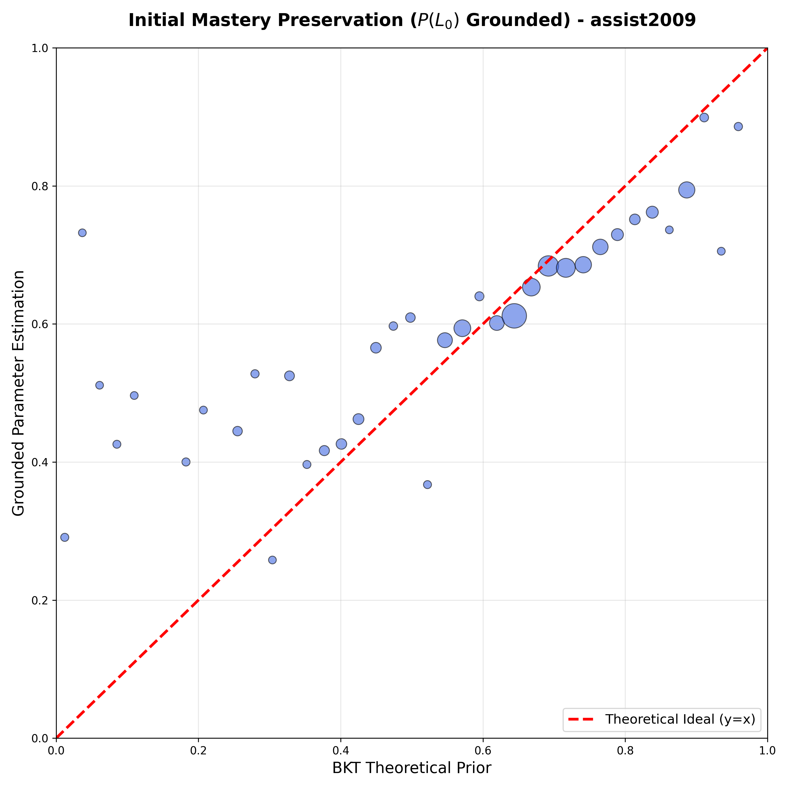

</div>

*L₀ Parameter Recovery*: Spearman ρ = 0.360 ± 0.020 (weak), MAE = 0.168 ± 0.009 (good). Weak correlation indicates genuine student-specific individualization while MAE confirms pedagogical bounds are maintained.

<div style="width: 60%;">


</div>

*T Parameter Recovery*: Spearman ρ = 0.544 ± 0.046 (moderate), MAE = 0.092 ± 0.005 (excellent). Moderate alignment with strong semantic preservation for learning rate.

**Probe Parameter Recovery** (for comparison with grounded parameters):

<div style="width: 60%;">

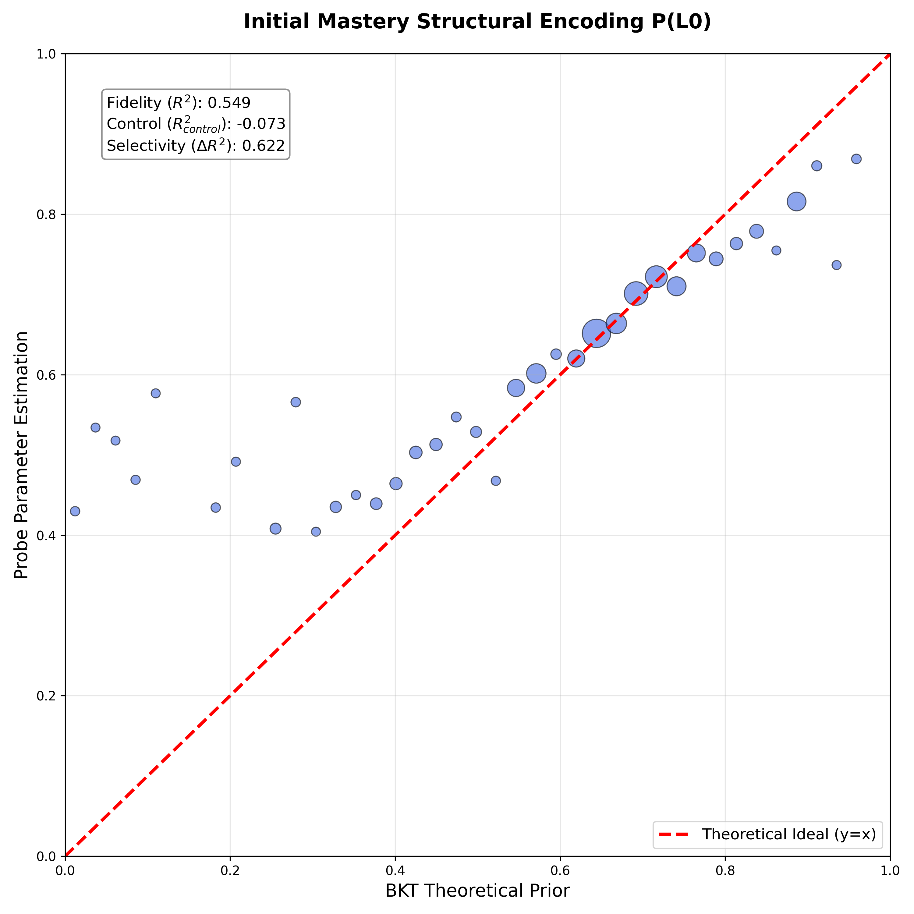

</div>

*L₀ Probe Recovery*: R² = 0.549 ± 0.064, Pearson r = 0.743 ± 0.041, Selectivity Δ = 0.619 ± 0.061. Shows strong correlation between BKT theoretical L₀ and probe-predicted L₀ from latent states. Higher correlation than grounded L₀ indicates probes can recover theoretical structure, while lower grounded correlation reflects individualization.

<div style="width: 60%;">

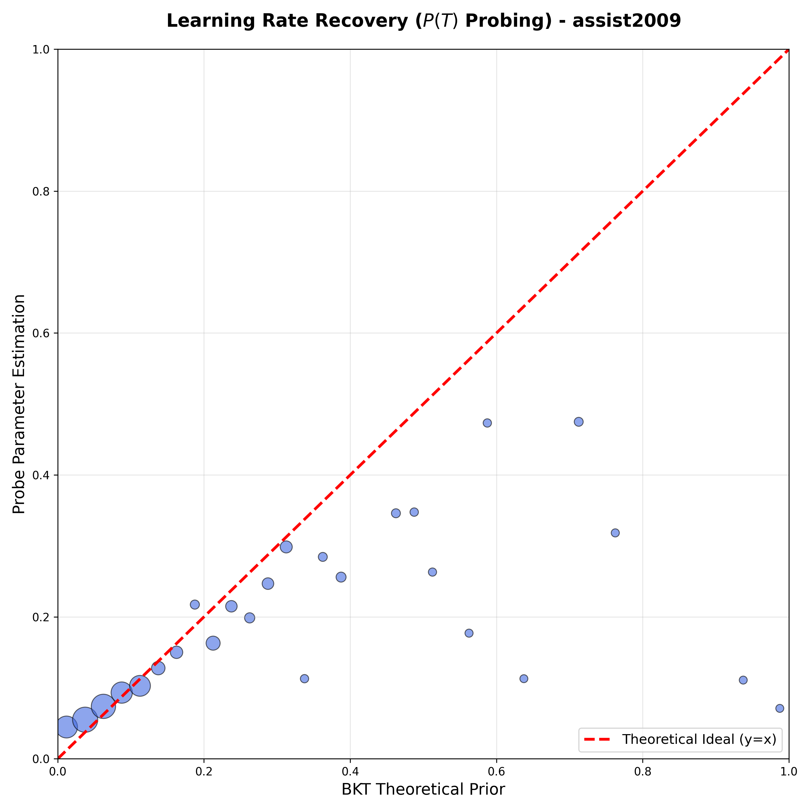

</div>

*T Probe Recovery*: R² = 0.515 ± 0.080, Pearson r = 0.721 ± 0.050, Selectivity Δ = 0.570 ± 0.080. Shows strong correlation between BKT theoretical T and probe-predicted T from latent states. Comparison between probe and grounded recovery reveals how much the model refines theoretical priors during neural processing.

---

### H1.3: Functional Alignment (Prediction Confidence)

**Script**: `examples/validation/generate_skill_alignment_heatmap_h13.py`

**Purpose**: Generate per-skill prediction confidence heatmaps using composite metric (calibrated + directional + percentile).

**Command**:
```bash
python examples/validation/generate_skill_alignment_heatmap_h13.py \
  --exp_dir experiments/20260202_222258_benchpaper_assist2009_893468/gtransformer/assist2009/fold_0_377291 \
  --output_dir experiments/20260202_222258_benchpaper_assist2009_893468/gtransformer/assist2009/validation \
  --min_interactions 5 \
  --top_skills 40 \
  --top_students 25
```

**Output Files**:
- `validation/h13_skill_confidence_heatmap.png` - Student × skill confidence matrix
- `validation/h13_skill_confidence_distribution.png` - 4-panel distribution analysis
- `validation/h13_confidence_statistics.json` - Summary statistics

**Results (assist2009, Exp 893468)**:

<div style="width: 70%;">

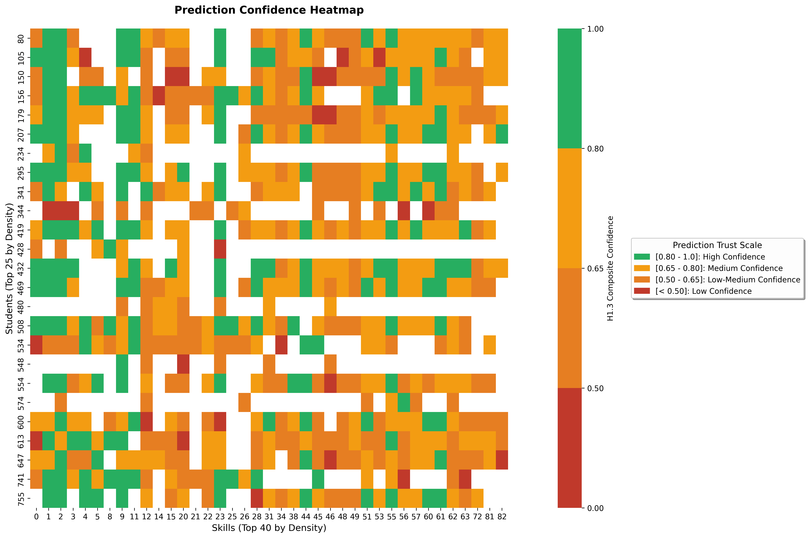

</div>

*Student × Skill Confidence Matrix*: Green = high confidence (p_ref trustworthy), Yellow = medium confidence (use with caution), Red = low confidence (use p_sup).

<div style="width: 70%;">

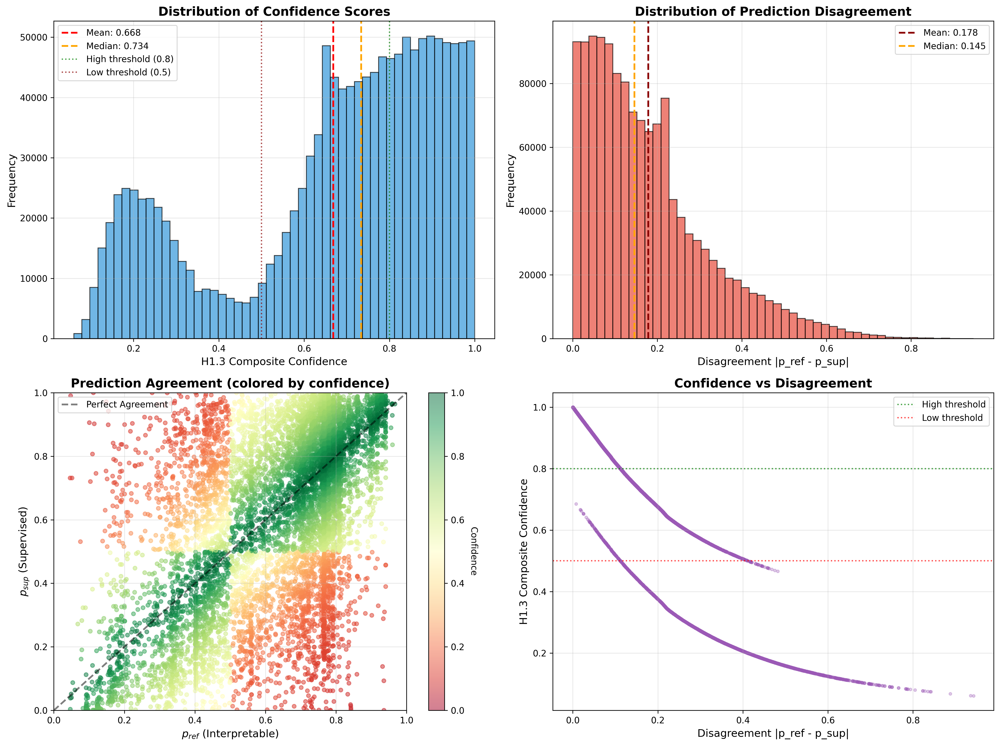

</div>

*Confidence Distribution Analysis*: Mean confidence = 0.704, with 27.1% high confidence, 68.4% medium confidence, 4.4% low confidence pairs.

---

### RQ3: Context-Aware Skill Mosaic (Skill Quadrant Comparison)

**Script**: `examples/validation/generate_skill_quadrant_comparison.py`

**Purpose**: Demonstrate context-aware personalization by showing gTransformer differentiates students with identical response sequences based on learning history (L₀/T quadrants).

**Command**:
```bash
python examples/validation/generate_skill_quadrant_comparison.py \
  --exp_dir experiments/20260202_222258_benchpaper_assist2009_893468/gtransformer/assist2009/fold_0_377291 \
  --output_dir experiments/20260202_222258_benchpaper_assist2009_893468/gtransformer/assist2009/validation \
  --top_n 12
```

**Output Files**:
- `validation/h3_skill_quadrant_comparison_mosaic.png` - 4×3 grid of top 12 skills
- `validation/individual_skills/h3_skill_<id>_quadrants.png` - Individual skill plots
- `validation/h3_skill_quadrant_metadata.json` - Quantitative metrics

**Results (assist2009, Exp 893468)**:

<div style="width: 80%;">

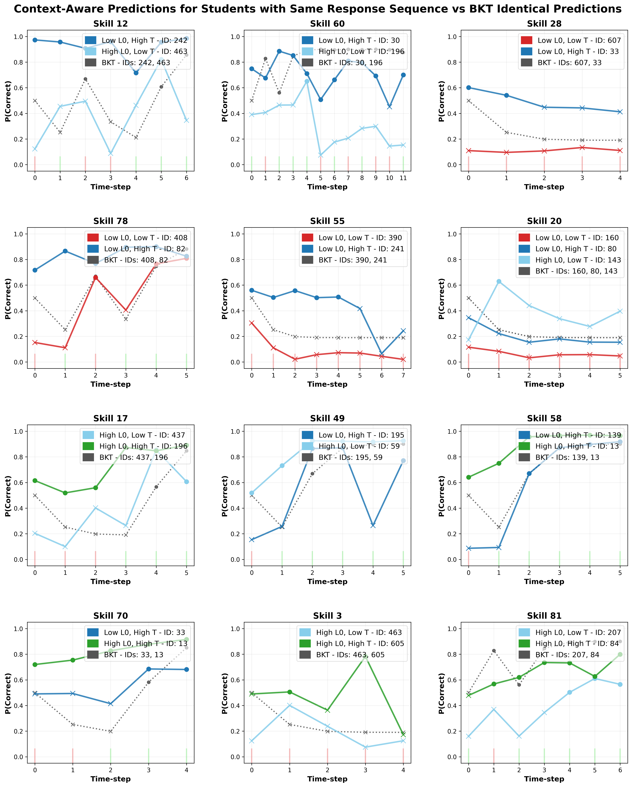

</div>

*Context-Aware Personalization*: Solid colored lines (gTransformer) diverge by student quadrant despite identical response sequences. Dotted gray lines (BKT) overlap due to Markovian property. Demonstrates non-Markovian personalization.

---

### Visualization Scripts

#### Skill Alignment Heatmap (Concordance)

**Script**: `examples/results/generate_skill_alignment_heatmap.py`

**Command**:
```bash
python examples/results/generate_skill_alignment_heatmap.py \
  --exp_dir experiments/20260202_222258_benchpaper_assist2009_893468/gtransformer/assist2009/fold_0_377291 \
  --output_dir experiments/20260202_222258_benchpaper_assist2009_893468/gtransformer/assist2009/plots \
  --min_interactions 8 \
  --top_skills 50 \
  --top_students 30
```

**Output**: 
- `plots/skill_alignment_heatmap.png`
- `plots/skill_alignment_distribution.png`
- `plots/alignment_statistics.json`

<div style="width: 70%;">

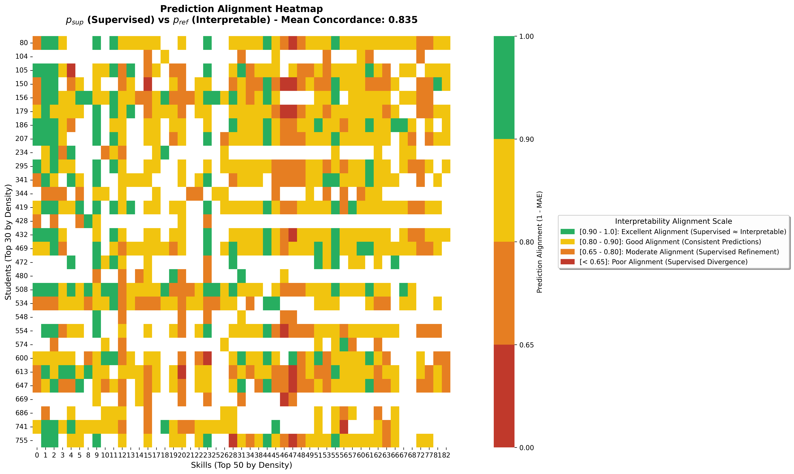

</div>

*Concordance-based alignment*: Simple MAE-based metric showing prediction agreement between p_sup and p_ref.

---

#### Prediction Envelope Gallery

**Script**: `examples/results/generate_prediction_envelope_gallery.py`

**Command**:
```bash
python examples/results/generate_prediction_envelope_gallery.py \
  --exp_dir experiments/20260202_222258_benchpaper_assist2009_893468/gtransformer/assist2009/fold_0_377291 \
  --output_dir experiments/20260202_222258_benchpaper_assist2009_893468/gtransformer/assist2009/plots
```

**Output**: 
- `plots/prediction_envelope_gallery.png`
- `plots/envelope_statistics.json`

<div style="width: 80%;">

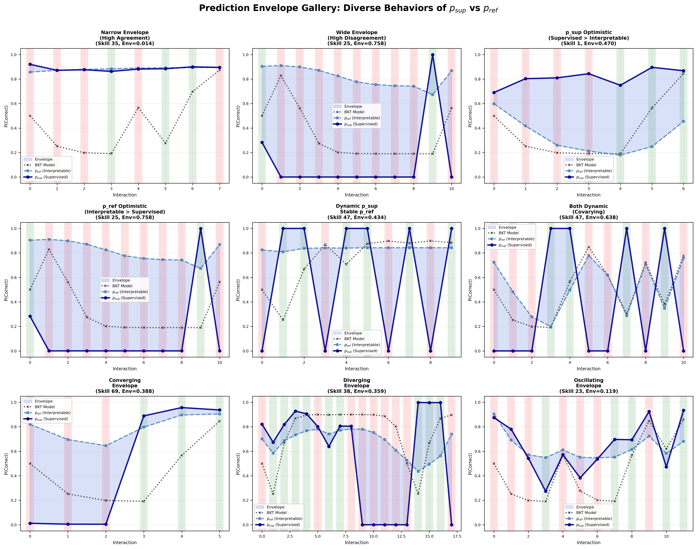

</div>

*Prediction Envelopes*: Visualization of prediction ranges showing upper bound (p_sup), lower bound (p_ref), and confidence intervals.

---

#### Envelope Distribution

**Script**: `examples/results/generate_envelope_distribution.py`

**Command**:
```bash
python examples/results/generate_envelope_distribution.py \
  --exp_dir experiments/20260202_222258_benchpaper_assist2009_893468/gtransformer/assist2009/fold_0_377291 \
  --output_dir experiments/20260202_222258_benchpaper_assist2009_893468/gtransformer/assist2009/plots
```

**Output**: `plots/envelope_distribution.png`

<div style="width: 70%;">

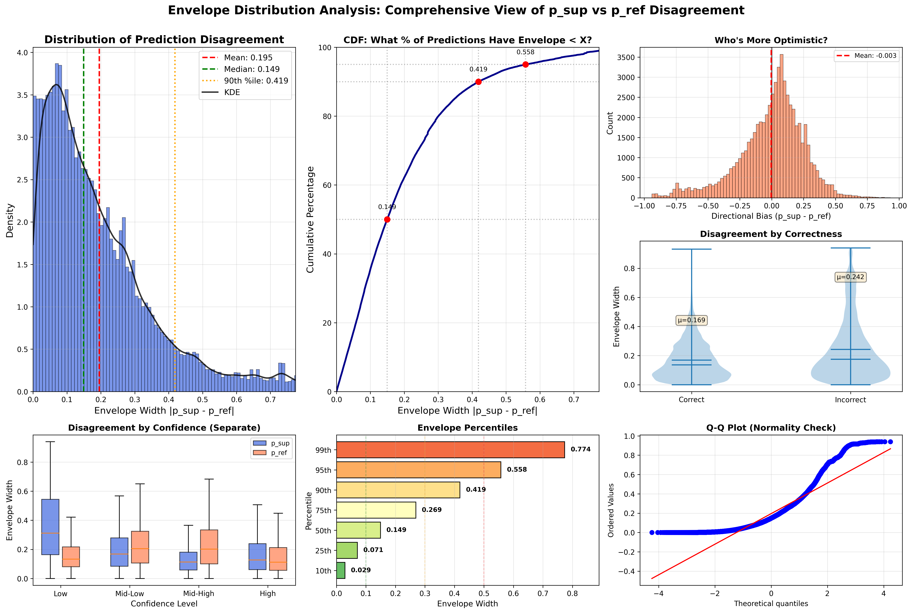

</div>

*Distribution Analysis*: Statistical analysis of envelope widths and prediction ranges across all student-skill pairs.

---

#### Cognitive Quadrants Mosaic

**Script**: `examples/results/generate_quadrant_analysis.py`

**Command**:
```bash
python examples/results/generate_quadrant_analysis.py \
  --exp_dir experiments/20260202_222258_benchpaper_assist2009_893468/gtransformer/assist2009/fold_0_377291 \
  --output_dir experiments/20260202_222258_benchpaper_assist2009_893468/gtransformer/assist2009/plots
```

**Output**: `plots/cognitive_quadrants_mosaic.png`

<div style="width: 80%;">

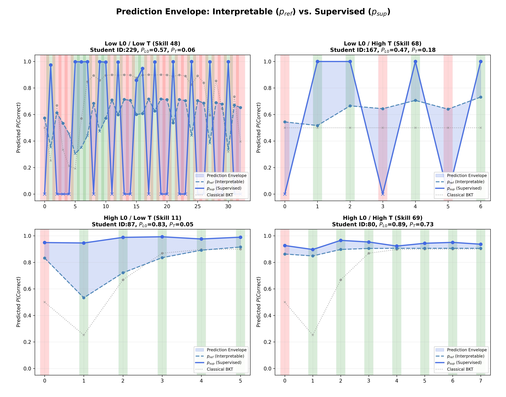

</div>

*Learning Profile Quadrants*: 4×3 mosaic showing student performance across different L₀/T learning profiles.

---

#### Personalization Mosaic

**Script**: `examples/results/generate_personalization_mosaic.py`

**Command**:
```bash
python examples/results/generate_personalization_mosaic.py \
  --exp_dir experiments/20260202_222258_benchpaper_assist2009_893468/gtransformer/assist2009/fold_0_377291 \
  --output_dir experiments/20260202_222258_benchpaper_assist2009_893468/gtransformer/assist2009/plots
```

**Output**: `plots/personalization_mosaic.png`

<div style="width: 80%;">

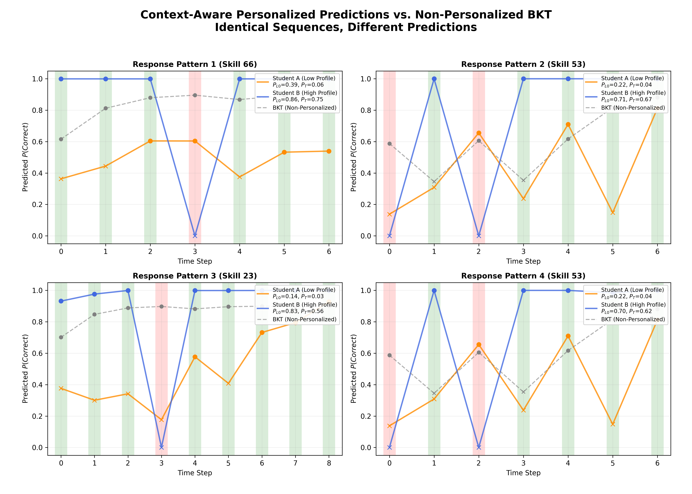

</div>

*Student-Specific Personalization*: Demonstrates how individual students' predictions differ based on their unique learning profiles.

---

#### Initial Mastery Mosaic

**Script**: `examples/results/generate_initial_mastery_mosaic.py`

**Command**:
```bash
python examples/results/generate_initial_mastery_mosaic.py \
  --exp_dir experiments/20260202_222258_benchpaper_assist2009_893468/gtransformer/assist2009/fold_0_377291 \
  --output_dir experiments/20260202_222258_benchpaper_assist2009_893468/gtransformer/assist2009/plots
```

**Output**: `plots/initial_mastery_mosaic.png`

<div style="width: 80%;">

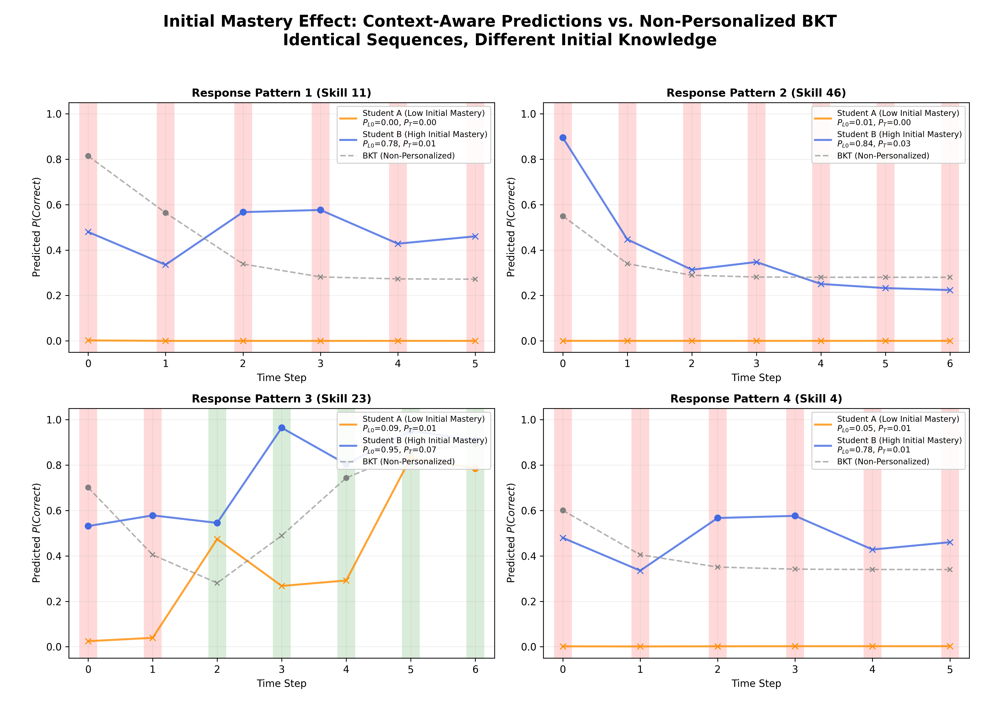

</div>

*L₀ Parameter Distribution*: Visualization of initial mastery estimates across skills showing personalization and grounding.

---

#### Student Clustering Visualization

**Script**: `examples/results/plot_student_clusters_gtransformer.py`

**Command**:
```bash
python examples/results/plot_student_clusters_gtransformer.py \
  --exp_dir experiments/20260202_222258_benchpaper_assist2009_893468/gtransformer/assist2009/fold_0_377291 \
  --output_dir experiments/20260202_222258_benchpaper_assist2009_893468/gtransformer/assist2009/plots
```

**Output**: `plots/cluster_placement_pacing_contextual.png`

<div style="width: 80%;">

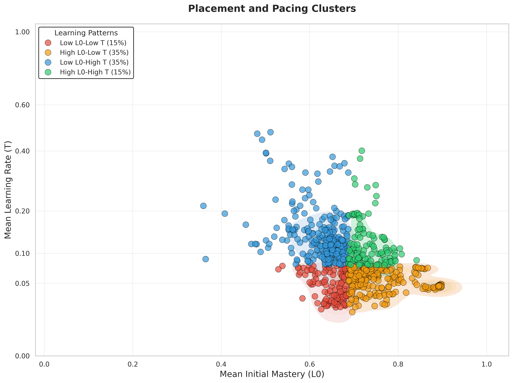

</div>

*Student Clustering*: Contextual analysis showing student groupings based on latent representations and learning parameters.

---

### Running All Validation Scripts

To run all validation and visualization scripts for a complete analysis:

```bash
# Full pipeline: training → evaluation → results
python examples/run_benchmarks_paper.py \
  --mode training \
  --model gtransformer \
  --dataset assist2009 \
  --gpus 1,2,3,4,5

python examples/run_benchmarks_paper.py \
  --mode evaluation \
  --model gtransformer \
  --dataset assist2009

python examples/run_benchmarks_paper.py \
  --mode results \
  --model gtransformer \
  --dataset assist2009
```

The `--mode results` step automatically:
1. Runs H1.2 parameter recovery validation on all folds
2. Runs H1.1 structural encoding validation (campaign-level, 5-fold aggregation)
3. Generates all visualization plots using representative fold
4. Aggregates metrics and creates summary reports

**Output Structure**:
```
experiments/<campaign>/gtransformer/<dataset>/
├── validation/              # H1.1, H1.2, H1.3, RQ3 validation results
│   ├── h12_recovery_*.png
│   ├── h13_skill_confidence_*.png
│   ├── h3_skill_quadrant_comparison_mosaic.png
│   ├── structural_encoding_aggregated.json
│   └── individual_skills/   # Per-skill detailed plots
├── plots/                   # Visualization outputs
│   ├── skill_alignment_heatmap.png
│   ├── prediction_envelope_gallery.png
│   ├── cognitive_quadrants_mosaic.png
│   ├── personalization_mosaic.png
│   ├── initial_mastery_mosaic.png
│   └── cluster_placement_pacing_contextual.png
└── cv_results.json          # 5-fold CV aggregated metrics
```

## Experiments

### Exp 893468

**Campaign**: `20260202_222258_benchpaper_assist2009_893468`  
**Date**: February 2, 2026  
**Purpose**: Bug-fixed BKT parameters, 8 attention heads architecture for assist2009

**Architecture Configuration**:
- d_model: 64
- n_blocks: 4
- num_attn_heads: 8
- d_ff: 256
- dropout: 0.1

**Training Configuration**:
- learning_rate: 0.0001
- optimizer: adam
- epochs: 200
- ablation: none (full grounding)

**Results (5-fold CV)**:

| Dataset | AUC (p_sup) | AUC (p_ref) | Accuracy (p_sup) | Accuracy (p_ref) | Cost (%) | Status |
|---------|-------------|-------------|------------------|------------------|----------|--------|
| assist2009 | 0.7814 ± 0.0015 | 0.7436 ± 0.0008 | 0.7369 ± 0.0010 | 0.7225 ± 0.0009 | 4.8% | ✅ PASS |

**Per-Fold Results**:

| Fold | AUC (p_sup) | AUC (p_ref) | Accuracy (p_sup) | Accuracy (p_ref) |
|------|-------------|-------------|------------------|------------------|
| 0 | 0.7833 | 0.7448 | 0.7379 | 0.7233 |
| 1 | 0.7806 | 0.7434 | 0.7357 | 0.7218 |
| 2 | 0.7806 | 0.7429 | 0.7378 | 0.7221 |
| 3 | 0.7795 | 0.7432 | 0.7358 | 0.7216 |
| 4 | 0.7831 | 0.7437 | 0.7375 | 0.7237 |

**Key Findings**:
- **Cost of Interpretability**: 3.78 percentage points (4.8%)
- **8 attention heads** architecture provides strong structural encoding
- All 5 folds successfully completed
- Consistent performance across folds (low standard deviation)
- Used as reference experiment for Paper Table 4 (assist2009 row)

---

### Exp 698838

**Campaign**: `20260202_222106_benchpaper_datasets_698838`  
**Date**: February 2, 2026  
**Purpose**: Bug-fixed BKT parameters, 4 attention heads architecture for multiple datasets

**Architecture Configuration**:
- d_model: 64
- n_blocks: 4
- num_attn_heads: 4
- d_ff: 256
- dropout: 0.1

**Training Configuration**:
- learning_rate: 0.0001
- optimizer: adam
- epochs: 200
- ablation: none (full grounding)

**Results (5-fold CV)**:

| Dataset | AUC (p_sup) | AUC (p_ref) | Accuracy (p_sup) | Accuracy (p_ref) | Cost (%) | Status |
|---------|-------------|-------------|------------------|------------------|----------|--------|
| assist2015 | 0.7070 ± 0.0009 | 0.6940 ± 0.0008 | 0.6786 ± 0.0008 | 0.6772 ± 0.0003 | 1.8% | ✅ PASS |
| algebra2005 | 0.8237 ± 0.0023 | 0.7800 ± 0.0042 | 0.8081 ± 0.0007 | 0.7954 ± 0.0001 | 5.3% | ✅ PASS |
| bridge2algebra2006 | 0.8107 ± 0.0021 | 0.7810 ± 0.0012 | 0.8559 ± 0.0007 | 0.8487 ± 0.0002 | 3.7% | ✅ PASS |
| nips_task34 | 0.7987 ± 0.0005 | 0.7666 ± 0.0029 | 0.7290 ± 0.0002 | 0.7125 ± 0.0026 | 4.0% | ✅ PASS |

**Dataset-Specific Analysis**:

**assist2015**:
- **Lowest cost of interpretability** (1.8%)
- Strong reference path alignment with supervised predictions
- All 5 folds completed successfully
- Note: Dataset lacks question IDs in test files (skill-level only)

**algebra2005**:
- **Highest supervised performance** (AUC = 0.8237)
- Moderate cost of interpretability (5.3%)
- Reference predictions maintain good performance (0.7800 AUC)
- Multi-skill questions present structural challenges for probing

**bridge2algebra2006**:
- **Highest accuracy** (85.59% supervised)
- Low cost of interpretability (3.7%)
- Strong T parameter alignment (ρ = 0.681, see Paper Table 7)
- Good balance between performance and interpretability

**nips_task34**:
- Moderate cost of interpretability (4.0%)
- Consistent performance across folds (lowest std = 0.0005)
- Strong L₀ structural encoding (Δ = 0.521, see Paper Table 6)
- Weak T encoding due to bimodal distribution

**Key Findings**:
- **All 4 datasets**: Successfully trained with bug-fixed BKT parameters
- **Cost of interpretability**: Ranges from 1.8% to 5.3% (all < 6%)
- **4 attention heads** architecture adequate for all datasets
- **Consistent performance**: All folds completed successfully (20/20 total)
- **Bug-fix impact**: Dramatic improvements in p_ref compared to original BKT
  - assist2015: +0.0395 AUC improvement
  - algebra2005: +0.0439 AUC improvement  
  - bridge2algebra2006: +0.0785 AUC improvement
  - nips_task34: +0.0823 AUC improvement
- Used as reference experiment for Paper Table 4 (4 datasets × 5 folds = 20 total experiments)