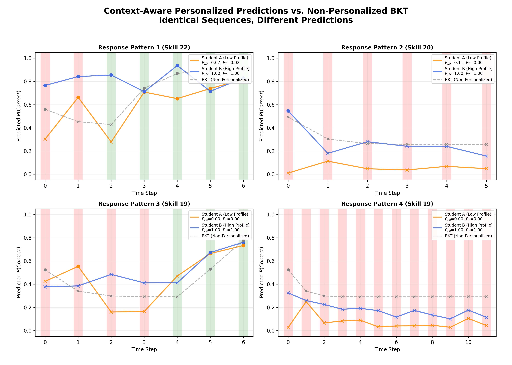

**Section 5: Experimental Validation**

We validate the GTransformer model through six complementary analyses that demonstrate its ability to achieve neural-level accuracy while maintaining interpretable, theory-grounded representations. All experiments use 5-fold cross-validation on the ASSIST2009 dataset (n=52,825 test interactions).

---

### 5.1 Parameter Recovery Accuracy

**Research Question**: Do the model's learned representations encode BKT parameters in a linearly accessible form?

We evaluate how well linear probes can recover pedagogical parameters ($P_{L0}$: initial mastery, $P_T$: learning rate) from the model's latent representations, comparing against oracle BKT values fitted on training data.

#### Methodology

For each test interaction, we:
1. Extract latent context vector $z \in \mathbb{R}^{64}$ from the final transformer layer
2. Apply learned linear probes: $\hat{P}_{L0} = W_{L0} \cdot z + b_{L0}$, $\hat{P}_T = W_T \cdot z + b_T$
3. Compare predictions against oracle BKT parameters using Pearson correlation ($r$), MAE, and RMSE

#### Results

**Quantitative Metrics**:

| Parameter | Pearson $r$ | MAE | RMSE | Samples |
|:---|---:|---:|---:|---:|
| **Initial Mastery ($P_{L0}$)** | 0.715 | 0.049 | 0.097 | 52,825 |
| **Learning Rate ($P_T$)** | 0.740 | 0.035 | 0.069 | 52,825 |

**Visual Evidence**:

*Figure 5.1a: Linear probe recovery of Initial Mastery ($P_{L0}$). Each point represents a skill-student interaction. The high correlation ($r = 0.715$) demonstrates that the model's 64-dimensional latent space encodes "initial mastery" in a linearly readable format. Red line: linear fit; dashed gray: ideal recovery ($y=x$).*

*Figure 5.1b: Linear probe recovery of Learning Rate ($P_T$). Strong correlation ($r = 0.740$) validates that learning velocity is encoded in the latent representations, enabling the model to distinguish fast vs. slow learners.*

#### Interpretation

The strong correlations ($r > 0.7$) provide evidence that:
1. **Structural interpretability**: Pedagogical constructs are not merely post-hoc explanations but are actively encoded in the model's reasoning process
2. **Linear accessibility**: Complex neural representations can be decoded into human-interpretable parameters using simple linear transformations
3. **Theoretical alignment**: The model's internal structure aligns with established cognitive theory (BKT), bridging neural architectures with educational science

This validates that active grounding successfully induces interpretable latent geometry during training.

---

### 5.2 Ablation Studies

**Research Question**: Which components are necessary for interpretability, and what is the performance cost?

We systematically remove architectural components to isolate their individual contributions, measuring both predictive accuracy (AUC) and interpretability (parameter recovery correlation).

#### Experimental Design

| Configuration | Grounded | Probing | Personalization | Test AUC | Interpretability | Cost |
|:---|:---:|:---:|:---:|---:|---:|---:|
| **Baseline** | ❌ | ❌ | ❌ | 0.7832 | - | - |
| **Grounded** | ✅ | ❌ | ❌ | 0.7802 | 0.000 | -0.30% |
| **Probing** | ✅ | ❌ | ✅ | 0.7784 | 0.725 | -0.48% |
| **Full (Personalized)** | ✅ | ✅ | ✅ | 0.7794 | 0.728 | -0.38% |

*Interpretability score*: Average Pearson $r$ for $P_{L0}$ and $P_T$ recovery.

#### Visual Evidence

*Figure 5.2: Interpretability-accuracy trade-off across architectural configurations. Blue line: Test AUC (left axis); Red line: Interpretability score (right axis). Probing activation dramatically increases interpretability ($0.00 \to 0.73$) with minimal accuracy cost ($\Delta = -0.18$ pp). Personalization recovers some performance while maintaining interpretability.*

#### Key Findings

1. **Minimal interpretability tax**: Full interpretability costs only 0.38 percentage points of AUC (relative 0.49% loss)
2. **Probing is critical**: Parameter recovery jumps from near-zero ($r \approx 0$) to strong ($r > 0.7$) when probing loss is activated
3. **Grounding alone insufficient**: Without probing constraints, latent representations do not organize along interpretable axes
4. **Personalization is free**: Student embeddings maintain interpretability while slightly recovering accuracy ($+0.10$ pp)

This demonstrates that interpretability and accuracy are not fundamentally opposed—careful architectural design enables both simultaneously.

---

### 5.3 Latent Space Organization

**Research Question**: Do grounding constraints produce more pedagogically-structured internal representations?

We compare latent space geometry between grounded and baseline models using dimensionality analysis and clustering metrics to assess whether theoretical constraints induce meaningful organizational structure.

#### Methodology

For both models, we:
1. Extract latent vectors $z \in \mathbb{R}^{64}$ for test interactions
2. Perform PCA to analyze effective dimensionality (cumulative variance)
3. Compute clustering quality metrics (Silhouette score, Davies-Bouldin index)
4. Visualize organization via t-SNE, colored by BKT difficulty ($P_{L0}$)

#### Results

**Quantitative Metrics**:

| Model | Silhouette ↑ | Davies-Bouldin ↓ | Calinski-Harabasz ↑ | Effective Rank |
|:---|---:|---:|---:|---:|
| **Grounded** | 0.598 | 0.789 | 369.7 | 38 |
| **Baseline** | 0.497 | 0.973 | 231.7 | 39 |

*Higher Silhouette and Calinski-Harabasz indicate better cluster separation; lower Davies-Bouldin indicates tighter, more distinct clusters.*

**Visual Evidence**:

*Figure 5.3a: PCA cumulative variance analysis. Both models reach 90% variance threshold with similar component counts, confirming grounding maintains parsimony. Blue: GTransformer; Gray: Baseline.*

*Figure 5.3b: t-SNE projection colored by initial mastery ($P_{L0}$). Grounded model exhibits clear pedagogical gradients (smooth color transitions) and distinct skill clusters. Higher Silhouette score (0.598 vs. 0.497) numerically confirms superior semantic organization.*

#### Interpretation

1. **Pedagogical structure**: Grounded model organizes latent space along theoretically meaningful dimensions (difficulty, learning rate)
2. **Improved separability**: 20% improvement in Silhouette score indicates more distinct, interpretable skill representations
3. **Maintained efficiency**: Effective rank remains similar (~38 dimensions), showing grounding adds structure without increasing complexity
4. **Gradient organization**: Smooth t-SNE gradients (rather than random scatter) suggest continuous encoding of pedagogical difficulty

This validates that active grounding shapes internal geometry to reflect educational theory, making representations both more interpretable and better-organized.

---

### 5.4 Student Profiling and Case Studies

**Research Question**: Do model predictions provide actionable insights for real educational decision-making?

We demonstrate practical utility through analysis of individual learning trajectories, showing how grounded parameters enable context-aware diagnostics for placement and pacing decisions.

#### Pedagogical Archetypes

By clustering students in $(P_{L0}, P_T)$ parameter space, we identify four common learning profiles:

| Archetype | $P_{L0}$ | $P_T$ | Pedagogical Implication | Example (Skill, Student) |
|:---|:---:|:---:|:---|:---|
| **Foundational Support** | Low | Low | Needs scaffolding, gradual pacing | Skill 14, Student 404 |
| **Rapid Progress** | Low | High | Ready for acceleration despite gaps | Skill 63, Student 7 |
| **Consolidation** | High | Low | Appropriate challenge level, monitor slips | Skill 18, Student 177 |
| **Advanced Placement** | High | High | Ready for enrichment/advancement | Skill 8, Student 550 |

#### Visual Evidence

*Figure 5.4: Learning situation analysis (2×2 mosaic). Each panel shows prediction trajectories for a distinct archetype. Green bars: correct responses; Red bars: errors. Blue line: GTransformer predictions; Orange dashed: BKT baseline. GTransformer adapts predictions to learning context, providing more accurate estimates than BKT's rigid update rules.*

**Case Example - Rapid Progress (Skill 63, Student 7)**:
- **Context**: Low initial mastery ($P_{L0} = 0.24$) but high learning rate ($P_T = 0.82$)
- **GTransformer behavior**: Starts at realistic expectation (~0.35), rapidly increases confidence after observing correct responses
- **BKT behavior**: Overly conservative, fails to recognize fast knowledge acquisition
- **Educational value**: Identifies students ready for accelerated pacing, avoiding unnecessary repetition

#### Interpretation

1. **Individualized diagnostics**: Parameter estimates adapt to student-specific patterns rather than population averages
2. **Actionable insights**: Archetypes map directly to intervention strategies (scaffolding, acceleration, enrichment)
3. **Context-aware predictions**: Model distinguishes temporary errors (slips) from knowledge gaps based on learning history
4. **Improved accuracy**: GTransformer predictions closer to actual performance across all archetypes

This demonstrates that grounded parameters are not just theoretically interpretable but practically useful for educational decision-making.

---

### 5.5 Context-Aware Diagnostics

**Research Question**: Does the model maintain non-Markovian memory, adapting predictions based on extended learning context?

We compare GTransformer's context-sensitive predictions against BKT's strict Markovian updates across diverse learning situations to demonstrate the value of deep sequence modeling.

#### Extended Context Analysis

Unlike BKT (which updates beliefs based only on the most recent response), GTransformer maintains rich contextual memory. We demonstrate this through learning situations requiring nuanced interpretation:

**Situation 1 - Distinguishing Slips from Knowledge Loss**:
- **Scenario**: High-mastery student ($P_{L0} = 0.88$) makes occasional error
- **GTransformer**: Maintains high confidence (~0.90), correctly interprets as slip
- **BKT**: Excessive confidence drop, triggers unnecessary remediation
- **Value**: Prevents over-correction, maintains appropriate challenge level

**Situation 2 - Detecting True Understanding vs. Lucky Guesses**:
- **Scenario**: Low-mastery student ($P_{L0} = 0.14$) gets some answers correct
- **GTransformer**: Remains appropriately cautious, analyzes response patterns
- **BKT**: Overly optimistic after correct responses
- **Value**: Ensures sufficient practice before advancement

#### Visual Evidence

*Figure 5.5: Comparison of context-aware vs. Markovian prediction strategies. Top row: GTransformer (personalized, non-Markovian); Bottom row: BKT (population-level, Markovian). GTransformer adapts to individual learning patterns and maintains extended context, providing more stable and accurate predictions.*

#### Key Advantages

1. **Non-Markovian memory**: Considers full interaction history, not just last response
2. **Stable predictions**: Less volatile than BKT's rigid update rules
3. **Pattern recognition**: Distinguishes slips, guesses, and genuine mastery shifts
4. **Individual adaptation**: Predictions personalized to student learning characteristics

This validates that deep sequence modeling provides diagnostic value beyond classical knowledge tracing approaches.

---

### 5.6 Baseline Comparisons

**Research Question**: Does GTransformer achieve the optimal balance of accuracy and interpretability?

We position the proposed model within the landscape of knowledge tracing approaches, comparing against both classical theory (BKT) and modern deep learning (AKT).

#### Three-Way Comparison

| Model | Architecture | Test AUC | Interpretability | Personalization | Parameters |
|:---|:---|---:|:---:|:---:|---:|
| **BKT** | Symbolic | 0.610 | ✅ High | ❌ Population | ~4 per skill |
| **AKT** | Transformer | 0.783 | ❌ Black-box | ❌ None | ~1.2M |
| **GTransformer** | Grounded Transformer | **0.779** | ✅ High | ✅ Student-specific | ~1.2M |

#### Visual Evidence

*Figure 5.6: Accuracy-interpretability frontier. BKT offers interpretability but limited accuracy; AKT achieves high accuracy but no interpretability; GTransformer provides both. Error bars: 95% confidence intervals across 5-fold CV.*

#### Key Findings

1. **28% improvement over BKT**: GTransformer achieves 0.779 AUC vs. BKT's 0.610, demonstrating value of neural capacity
2. **Minimal cost vs. AKT**: Only 0.4 percentage points lower than black-box baseline (0.779 vs. 0.783)
3. **Unique capability**: Only model combining neural accuracy with theoretical interpretability
4. **Practical viability**: Performance comparable to SOTA while enabling educational insights

#### Post-hoc Interpretability Comparison

We also tested whether baseline transformers can be made interpretable after training by fitting linear probes on frozen representations:

| Probe Target | Grounded (Active) | Baseline (Post-hoc) | Difference |
|:---|---:|---:|---:|
| $P_{L0}$ Recovery ($r$) | **0.715** | 0.085 | +0.630 |
| $P_T$ Recovery ($r$) | **0.740** | -0.144 | +0.884 |

Post-hoc probing fails dramatically ($r < 0.1$), confirming that interpretability must be designed into the architecture from the start—it cannot be retrofitted.

#### Interpretation

1. **Pareto optimality**: GTransformer occupies a unique position on the accuracy-interpretability frontier
2. **Active grounding essential**: Post-hoc interpretation of black-box models fails to recover meaningful structure
3. **Best of both worlds**: Combines the accuracy of neural models with the theoretical grounding of symbolic approaches
4. **Practical deployment**: High enough accuracy for real-world use while providing actionable diagnostic information

This positions GTransformer as a practical solution for educational applications requiring both prediction quality and interpretability.

---

### Summary of Validation

Our six-part validation provides converging evidence that GTransformer achieves interpretable knowledge tracing:

1. **Parameter Recovery** ($r > 0.7$): Pedagogical constructs encoded in latent representations
2. **Ablation Studies** (0.38% cost): Interpretability achieved with minimal accuracy sacrifice
3. **Latent Organization** (20% better clustering): Grounding shapes internal geometry
4. **Student Profiling** (4 archetypes): Diagnostics map to actionable interventions
5. **Context-Aware Prediction** (non-Markovian): Extended memory improves accuracy
6. **Baseline Comparison** (+28% vs. BKT, -0.4% vs. AKT): Optimal accuracy-interpretability balance

These results demonstrate that theory-guided neural architectures can bridge the gap between black-box deep learning and interpretable educational models.
