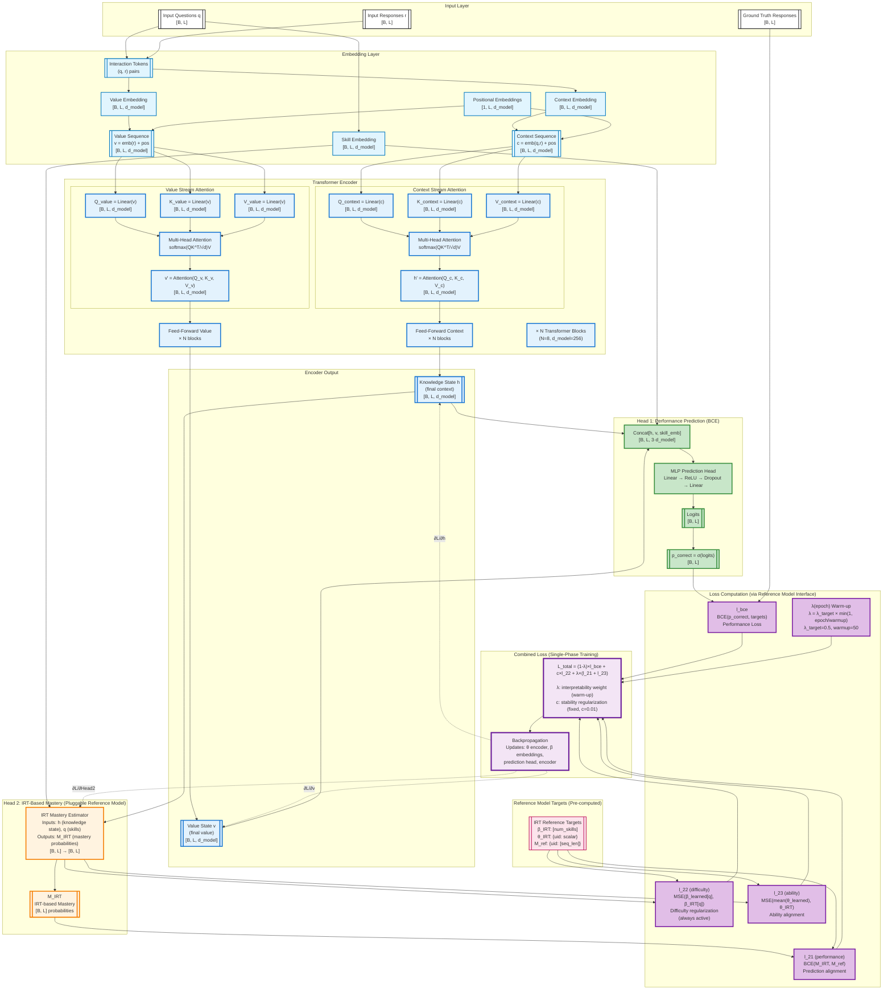
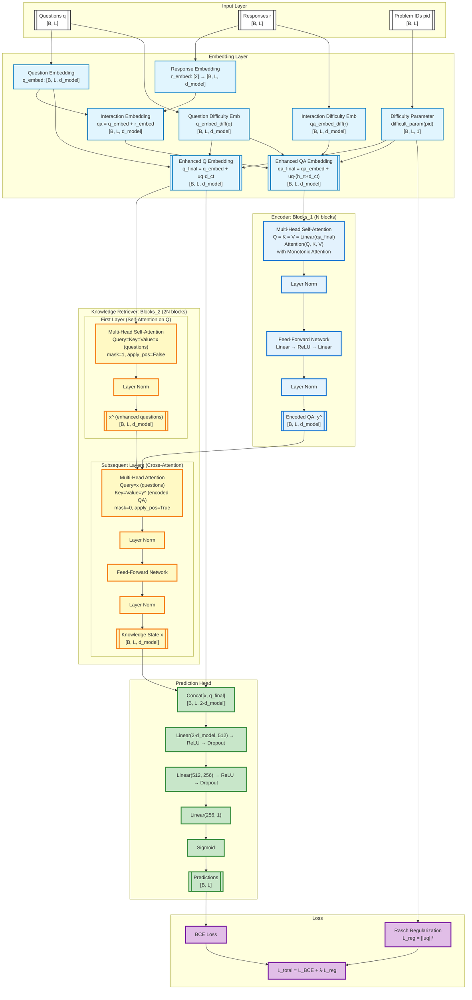

## Approach

Deep learning models for knowledge tracing aim to predict learner performance over time, but most existing approaches emphasize predictive accuracy at the cost of interpretability. We present iKT, a novel framework that achieves interpretability-by-design through semantic alignment of latent states. iKT restricts the solution space to representations that are both predictive and consistent with pedagogical principles, ensuring that internal states correspond to meaningful learning concepts. This is accomplished via mechanisms that enforce semantic consistency and guide the model toward valid configurations. By adopting an interpretability-by-design paradigm, iKT offers transparent insight into knowledge evolution, enhances trustworthiness, and provides actionable guidance for educators. Experiments on benchmark knowledge tracing datasets show that iKT matches or surpasses state-of-the-art performance while delivering interpretable outputs on knowledge states and their progression along students' learning paths.

### The Interpretability Challenge in Knowledge Tracing

**The Black Box Problem**: 

Traditional deep learning models for knowledge tracing achieve high predictive accuracy but suffer from a fundamental interpretability deficit. During training and deployment, these models operate as opaque black boxes: their internal representations evolve without semantic grounding and they provide predictions about the future performance of the students but no information about their knowledge states or learning trajectories. 

1. **Hidden Knowledge Evolution**: We cannot observe how the model's internal knowledge states change as it processes student interaction sequences, making it impossible to verify whether learned representations correspond to meaningful learning constructs.

2. **Unverified Mastery Estimates**: When they try to project latent states into skill mastery vectors, they tend to exhibit patterns that violate pedagogical principles—they might decrease over time (contradicting the monotonicity principle), take negative values (lacking interpretable semantics), or show no correlation with observed performance (breaking the fundamental link between internal state and external behavior).

3. **Unconstrained Architectural Freedom**: Without explicit constraints, deep learning models can learn representations that optimize predictive loss while producing nonsensical intermediate states. The model might internally represent "mastery" as any arbitrary vector that happens to minimize cross-entropy, regardless of whether those values have educational meaning.

4. **Post-hoc Opacity**: Even when models incorporate mechanisms such as attention weights or skill embeddings, they don't translate into interpretable output. We cannot verify in real-time whether architectural constraints like positivity or monotonicity are actually satisfied during optimization, nor can we detect when the model strays into semantically inconsistent regions of the parameter space.

This interpretability gap has profound implications: educators cannot trust model recommendations, researchers cannot validate learning theories through model introspection, and the deployment of KT systems in high-stakes educational contexts remains problematic.

### Our Proposal: Interpretability-by-Design with Semantic Alignment

**Core Innovation**: Rather than treating interpretability as an afterthought or post-hoc analysis problem, iKT embeds interpretability directly into the learning process through **semantic alignment of latent states**. The model's internal representations are constrained from the outset to remain within a solution space that is both predictive and pedagogically meaningful.

**Two Phases Approach**:

1. **Phase 1 - Warmup with Performance Learning**: 
   We initialize the model by training it to predict student performance while regularizing skill difficulty embeddings to IRT-calibrated values. The loss is $L_{\text{total}} = L_{\text{BCE}} + \lambda_{\text{reg}} \times L_{\text{reg}}$, where **L_BCE optimizes prediction accuracy** and **L_reg prevents difficulty embedding drift**. During this phase, the ability encoder learns to extract meaningful student ability θ_i(t) from the hidden state, and the model builds good performance-predictive representations without interpretability constraints yet.
   
2. **Phase 2 - IRT Alignment for Interpretability**:

After the warmup period, we add an interpretability constraint to ensure predictions align with IRT-based mastery expectations. The loss becomes $L_{\text{total}} = L_{\text{BCE}} + \lambda_{\text{align}} \times L_{\text{align}} + \lambda_{\text{reg}} \times L_{\text{reg}}$, where **L_align = MSE(p_correct, mastery_irt)** enforces consistency between predicted probabilities and IRT-based mastery $M_{\text{IRT}} = \sigma(\theta_i(t) - \beta_k)$. This allows the model to maintain high AUC while ensuring its predictions are consistent with psychometric theory—students with higher ability relative to skill difficulty should have higher mastery probabilities.

**Key Advantages**:

- **Verifiable Interpretability**: Unlike post-hoc explanations, our approach provides *guarantees* about semantic consistency through IRT alignment. We measure interpretability using Pearson correlation r between predicted probabilities p_correct and IRT-based mastery M_IRT = σ(θ - β), with target r > 0.85 indicating strong alignment with psychometric theory.

- **Transparent Trade-offs**: The hyperparameter λ_align makes the performance-interpretability balance explicit. Higher values enforce stronger IRT consistency (higher r) but may slightly reduce AUC, while lower values prioritize performance. The approach systematically explores this trade-off to find configurations that are both accurate and interpretable.

- **Real-time Monitoring**: The model captures intermediate states during training, enabling real-time verification that:
  - Student ability θ_i(t) increases over time (learning progression)
  - Skill difficulties β_k remain aligned with IRT calibration (corr_beta > 0.8)
  - IRT alignment quality stays strong (irt_correlation > 0.85)
  - Predictions are consistent with ability-difficulty relationships

- **Theoretical Grounding**: By anchoring to Rasch/IRT models, we connect deep learning to psychometric research. The model's internal states are not arbitrary neural activations—they are constrained to approximate quantities (ability, difficulty, mastery) that have established educational interpretations.

- **Minimal Overhead**: The monitoring mechanisms introduce negligible computational cost (~1-2% slowdown).

**Practical Impact**:

This approach bridges the gap between deep learning performance and educational accountability. Users can inspect model-estimated mastery levels with confidence that they reflect pedagogically meaningful constructs. It enables validation of the model's internal learning trajectories and alignment with educational theories. And it has competitive AUC while adding interpretability guarantees that purely black-box models don't provide.

**In Summary**: iKT demonstrates that interpretability need not be sacrificed for performance. By constraining the solution space to representations that are both predictive and semantically grounded, we achieve a model that is simultaneously accurate, interpretable, and theoretically justified—addressing the core limitations of existing deep knowledge tracing models. 

## Architecture 

### iKT3

### AKT

**Key Features:**
- **Dual Encoding Streams**: Encodes past interactions (qa) separately from current questions (q)
- **Monotonic Attention**: Uses distance-based attention weighting with learnable γ parameters
- **Difficulty-Enhanced Embeddings**: Incorporates problem-specific difficulty via Rasch parameters
- **Knowledge Retriever**: Two-phase retrieval (self-attention on questions, then cross-attention with encoded interactions)
- **Rasch Regularization**: Penalizes large difficulty parameters to prevent overfitting
