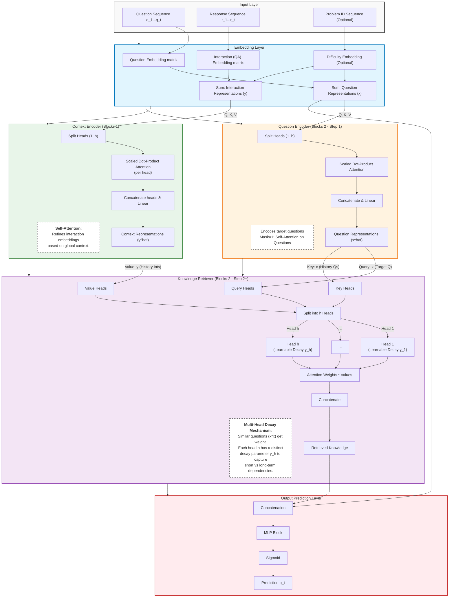

```mermaid
graph TD
    subgraph Input_Layer ["Input Layer"]
        Q_Seq["Question Sequence q_1...q_t"]
        R_Seq["Response Sequence r_1...r_t"]
        PID_Seq["Problem ID Sequence (Optional)"]
    end

    subgraph Embedding_Layer ["Embedding Layer"]
        Q_Emb["Question Embedding matrix"]
        QA_Emb["Interaction (QA) Embedding matrix"]
        PID_Emb["Difficulty Embedding (Optional)"]

        Q_Seq --> Q_Emb
        R_Seq --> QA_Emb
        PID_Seq --> PID_Emb

        Q_Emb & PID_Emb --> Sum_Q["Sum: Question Representations (x)"]
        QA_Emb & PID_Emb --> Sum_QA["Sum: Interaction Representations (y)"]

        %% Rasch Model variations handled here conceptually
    end

    subgraph Context_Encoder ["Context Encoder (Blocks 1)"]
        direction TB
        Sum_QA -- "Q, K, V" --> CE_Split["Split Heads (1..h)"]
        CE_Split --> CE_Attn["Scaled Dot-Product Attention<br/>(per head)"]
        CE_Attn --> CE_Concat["Concatenate heads & Linear"]
        CE_Concat --> Context_Rep["Context Representations (y^hat)"]
        note1["<b>Self-Attention:</b><br/>Refines interaction embeddings<br/>based on global context."]
    end

    subgraph Question_Encoder ["Question Encoder (Blocks 2 - Step 1)"]
        direction TB
        Sum_Q -- "Q, K, V" --> QE_Split["Split Heads (1..h)"]
        QE_Split --> QE_Attn["Scaled Dot-Product Attention"]
        QE_Attn --> QE_Concat["Concatenate & Linear"]
        QE_Concat --> Quest_Rep["Question Representations (x^hat)"]
        note2["Encodes target questions<br/>Mask=1: Self-Attention on Questions"]
    end

    subgraph Knowledge_Retriever ["Knowledge Retriever (Blocks 2 - Step 2+)"]
        direction TB
        Quest_Rep -- "Query: x (Target Q)" --> Attn_Query["Query Heads"]
        Quest_Rep -- "Key: x (History Qs)" --> Attn_Key["Key Heads"]
        Context_Rep -- "Value: y (History Ints)" --> Attn_Value["Value Heads"]

        Attn_Query & Attn_Key & Attn_Value --> KR_Split["Split into h Heads"]

        KR_Split -- "Head 1" --> KR_H1["Head 1<br/>(Learnable Decay γ_1)"]
        KR_Split -- "..." --> KR_HMid["..."]
        KR_Split -- "Head h" --> KR_Hh["Head h<br/>(Learnable Decay γ_h)"]

        KR_H1 & KR_HMid & KR_Hh --> KR_Mixing["Attention Weights * Values"]
        KR_Mixing --> KR_Concat["Concatenate"]
        KR_Concat --> Retrieved_Know["Retrieved Knowledge"]

        note3["<b>Multi-Head Decay Mechanism:</b><br/>Similar questions (x*x) get weight.<br/>Each head h has a distinct<br/>decay parameter γ_h to capture<br/>short vs long-term dependencies."]
    end

    subgraph Output_Layer ["Output Prediction Layer"]
        Retrieved_Know --> Concat[Concatenation]
        Sum_Q --> Concat
        Concat --> MLP[MLP Block]
        MLP --> Sigmoid
        Sigmoid --> Pred["Prediction p_t"]
    end

    %% Connections
    Input_Layer --> Embedding_Layer
    Embedding_Layer --> Context_Encoder
    Embedding_Layer --> Question_Encoder
    Context_Encoder --> Knowledge_Retriever
    Question_Encoder --> Knowledge_Retriever
    Knowledge_Retriever --> Output_Layer

    %% Styling
    style Input_Layer fill:#f9f9f9,stroke:#333,stroke-width:2px
    style Embedding_Layer fill:#e1f5fe,stroke:#0277bd,stroke-width:2px
    style Context_Encoder fill:#e8f5e9,stroke:#2e7d32,stroke-width:2px
    style Question_Encoder fill:#fff3e0,stroke:#ef6c00,stroke-width:2px
    style Knowledge_Retriever fill:#f3e5f5,stroke:#7b1fa2,stroke-width:2px
    style Output_Layer fill:#ffebee,stroke:#c62828,stroke-width:2px

    %% Notes styling
    style note1 fill:#fff,stroke:#333,stroke-dasharray: 5 5
    style note2 fill:#fff,stroke:#333,stroke-dasharray: 5 5
    style note3 fill:#fff,stroke:#333,stroke-dasharray: 5 5
```
